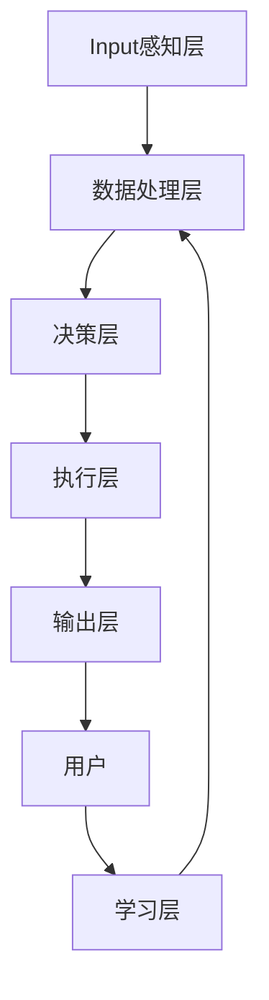

                 


## 理解开发具有情感计算与交互能力的AI Agent的核心概念

在深入探讨如何开发具有情感计算与交互能力的AI Agent之前，我们首先需要理解几个核心概念，包括情感计算、交互能力、AI Agent的基本概念和特点等。这些概念为我们提供了理论基础，帮助我们更好地规划和实现这样的智能系统。

### 情感计算

**定义与作用**

情感计算（Emotional Computing）是指计算机系统理解和模拟人类情感的能力。这一概念起源于计算机科学和人工智能领域，旨在使机器能够识别、理解并适应用户的情绪状态，从而提供更自然、更个性化的交互体验。

- **情感识别**：通过分析用户的语言、声音、面部表情和行为，情感计算系统能够识别用户的不同情绪，如快乐、愤怒、悲伤等。
- **情感模拟**：系统不仅能够识别情感，还能根据用户的情感状态调整其行为，如提供安慰、鼓励或提出建议。

**情感计算的核心概念**

- **情感传感器**：包括语音识别、面部识别、手势识别等技术，用于捕获用户的情感信号。
- **情感模型**：包括机器学习和深度学习算法，用于分析情感数据并生成情感分析结果。
- **情感反应机制**：系统根据情感分析结果，自动调整交互行为，如调整语气、提供特定反馈等。

**概念属性特征对比表格**

| 特征对比             | 情感计算                          | 传统交互                         |
|----------------------|----------------------------------|----------------------------------|
| 目标                 | 识别并模拟人类情感              | 提供基本服务或回答问题            |
| 技术基础             | 机器学习、深度学习、语音识别等  | 自然语言处理、数据库查询等        |
| 应用范围             | 个性化服务、心理辅导、娱乐等    | 客服、信息查询、自动化服务等      |

### 交互能力

**定义与类型**

交互能力（Interaction Capabilities）指的是AI Agent与用户之间进行有效沟通和互动的能力。这包括理解用户的需求、回应用户的反馈、根据交互历史调整行为等。

- **理解能力**：AI Agent需要能够理解用户的语言、意图和需求。
- **回应能力**：系统需要能够提供恰当的反馈，满足用户的需求。
- **自适应能力**：根据用户的反馈和历史交互，AI Agent能够调整其行为和交互方式。

**交互能力的核心概念**

- **自然语言处理（NLP）**：用于理解用户输入的语言，提取意图和需求。
- **上下文理解**：系统需要能够记住之前的交互历史，理解当前交互的上下文。
- **个性化交互**：根据用户的特点和偏好，提供个性化的服务和建议。

**概念属性特征对比表格**

| 特征对比             | 交互能力                          | 传统交互                         |
|----------------------|----------------------------------|----------------------------------|
| 目标                 | 提供自然、个性化的交互体验      | 提供标准化、高效的服务            |
| 技术基础             | NLP、上下文理解、机器学习等     | 信息检索、数据库管理等           |
| 应用范围             | 客户服务、智能助理、虚拟助手等  | 网站后台管理、自动化工具等        |

### AI Agent

**定义与功能**

AI Agent（人工智能代理）是一种具有自主行为能力的软件系统，能够模拟人类智能，完成特定的任务。AI Agent通常具备以下功能：

- **任务执行**：自动完成预设的任务，如数据采集、分析、决策等。
- **交互能力**：与用户进行沟通和互动，提供个性化服务。
- **自主学习**：通过不断的学习和反馈，提高自身的任务完成能力。

**AI Agent的基本特点**

- **自主性**：系统能够自主决定行动，不需要人工干预。
- **适应性**：系统能够根据环境和任务需求调整自身行为。
- **学习性**：系统能够通过学习和反馈，不断优化任务执行效果。

**概念结构与核心要素组成**

- **感知模块**：用于获取环境信息和用户输入。
- **决策模块**：根据感知信息，进行决策和规划。
- **执行模块**：执行决策，完成具体任务。
- **学习模块**：通过反馈，不断学习和优化系统行为。

**ER实体关系图架构**

```mermaid
erDiagram
  AI Agent ||--|{ 感知模块 }
  AI Agent ||--|{ 决策模块 }
  AI Agent ||--|{ 执行模块 }
  AI Agent ||--|{ 学习模块 }
```

### 总结

通过上述讨论，我们了解了情感计算、交互能力和AI Agent的核心概念、属性特征及其相互关系。这些概念为我们开发具有情感计算与交互能力的AI Agent提供了理论基础。在接下来的部分，我们将进一步探讨这些概念在实际开发中的应用，以及如何利用算法和数学模型来提升系统的情感识别和交互能力。

### 接下来，我们将进入第二部分，探讨核心原理和关键技术，为开发具有情感计算与交互能力的AI Agent奠定基础。在第二部分中，我们将详细讨论情感计算的基本原理、交互能力的实现技术，以及AI Agent的开发框架。这些内容将帮助我们深入理解如何构建一个既能够感知情感，又能够与用户自然交互的AI Agent。

---------------------------------------------

## 理解情感计算的基本原理

情感计算（Emotional Computing）作为人工智能的重要分支，旨在使计算机能够理解、感知和模拟人类的情感状态。要实现这一目标，我们需要从情感计算的基本原理入手，了解情感识别、情感模拟以及相关的算法和技术。

### 情感识别

**定义**

情感识别是指通过分析用户的语言、声音、面部表情和行为等，确定用户当前的情感状态。这一过程涉及多种技术的综合应用，如自然语言处理（NLP）、语音识别、图像识别等。

**技术细节**

1. **自然语言处理（NLP）**：
   - **文本情感分析**：通过分析文本中的情感词汇、语法结构和上下文，判断文本的情感倾向。
   - **情感词典**：使用预定义的情感词典来识别文本中的情感词汇，如正面词、负面词等。

2. **语音识别**：
   - **声音特征提取**：通过提取声音的频率、音调、时长等特征，分析用户语音的情感状态。
   - **情感模型**：使用机器学习算法，如深度神经网络（DNN）和循环神经网络（RNN），训练情感识别模型。

3. **图像识别**：
   - **面部表情分析**：通过识别面部表情特征，如眼睛、嘴巴的形状和位置，判断用户的面部表情和情感状态。
   - **行为分析**：通过分析用户的肢体动作、姿态等，推断用户的情感状态。

**算法示例**

假设我们有一个文本情感分析的算法，该算法的目标是判断一段文本的情绪是正面还是负面。我们可以使用以下步骤：

1. **文本预处理**：
   - 清洗文本数据，去除停用词、标点符号等无关信息。
   - 进行词向量化，将文本转换为数字表示。

2. **特征提取**：
   - 提取文本中的情感词汇和语法特征。
   - 使用词袋模型（Bag of Words）或词嵌入（Word Embedding）技术。

3. **情感分类**：
   - 使用机器学习算法，如支持向量机（SVM）、随机森林（Random Forest）或深度学习模型（如CNN、RNN），对提取的特征进行分类。

4. **结果输出**：
   - 输出文本的正面或负面情感倾向。

**Python代码示例**

```python
from sklearn.feature_extraction.text import CountVectorizer
from sklearn.model_selection import train_test_split
from sklearn.naive_bayes import MultinomialNB

# 文本数据
texts = ["我很开心", "今天真糟糕", "我喜欢这个游戏", "我讨厌这种食物"]

# 标签数据
labels = ["positive", "negative", "positive", "negative"]

# 文本预处理
vectorizer = CountVectorizer()
X = vectorizer.fit_transform(texts)

# 切分数据集
X_train, X_test, y_train, y_test = train_test_split(X, labels, test_size=0.2)

# 情感分类
classifier = MultinomialNB()
classifier.fit(X_train, y_train)

# 测试
predictions = classifier.predict(X_test)
print(predictions)
```

### 情感模拟

**定义**

情感模拟是指计算机系统根据情感识别的结果，调整其行为和交互方式，以更自然、更贴近人类情感的方式与用户进行互动。

**技术细节**

1. **自然语言生成（NLG）**：
   - **文本生成**：根据情感状态，生成相应的文本反馈，如安慰、鼓励等。
   - **语音合成**：将文本转换为自然流畅的语音输出，模拟人类的语音情感。

2. **面部表情和肢体语言**：
   - **面部表情渲染**：根据情感状态，调整AI Agent的面部表情，如微笑、皱眉等。
   - **肢体语言模拟**：通过动作捕捉和机器学习，模拟人类的肢体语言，如拥抱、挥手等。

**算法示例**

假设我们有一个情感模拟的算法，该算法的目标是根据用户情绪生成相应的文本反馈：

1. **情感识别**：
   - 使用情感识别算法，如文本情感分析，确定用户的当前情感状态。

2. **文本生成**：
   - 根据情感状态，从预定义的文本库中选择适当的反馈文本。

3. **语音合成**：
   - 使用语音合成技术，将文本转换为语音输出。

**Python代码示例**

```python
from transformers import pipeline

# 情感识别
emotion_recognizer = pipeline("text-classification", model="nlptown/bert-base-multilingual-uncased-sentiment")

# 情感模拟
text_generator = pipeline("text-generation", model="t5-small")

# 用户输入文本
input_text = "我今天考试不及格，很难过。"

# 识别情感状态
emotion = emotion_recognizer(input_text)[0]

# 生成文本反馈
if emotion['label'] == 'POSITIVE':
    response_text = text_generator("回复一个积极的话语", max_length=20)[0]['generated_text']
else:
    response_text = text_generator("回复一个安慰的话语", max_length=20)[0]['generated_text']

# 输出反馈
print(response_text)
```

### 情感计算的应用场景

情感计算技术可以应用于多种场景，如心理辅导、客户服务、娱乐等。以下是一些典型的应用场景：

- **心理辅导**：通过分析用户的情感状态，提供个性化的心理支持和建议。
- **客户服务**：根据客户情绪，提供更加贴心的服务，提高客户满意度。
- **娱乐**：通过情感识别和模拟，提供更真实的虚拟角色交互体验。

### 总结

情感计算是开发具有情感计算与交互能力的AI Agent的重要基础。通过情感识别和情感模拟，系统能够更好地理解用户情感，提供个性化的服务。在实际应用中，我们可以结合自然语言处理、语音识别、图像识别等技术，实现高效的情感计算。接下来，我们将继续探讨交互能力的实现技术，以及如何结合情感计算和交互能力，构建一个完整的AI Agent系统。

---------------------------------------------

## 探讨交互能力的实现技术

交互能力是AI Agent实现自然、有效交互的关键要素，它不仅包括理解用户的需求和意图，还涉及根据这些信息提供个性化的反馈和响应。在本节中，我们将深入探讨交互能力的实现技术，包括自然语言处理、上下文理解和个性化交互等方面。

### 自然语言处理（NLP）

自然语言处理（NLP）是AI Agent与用户进行交互的核心技术之一。NLP技术使得计算机能够理解、解析和生成自然语言，从而实现人机对话。

**文本分析**

1. **意图识别**：通过分析用户的文本输入，确定用户的意图。例如，用户可能想进行查询、请求帮助或进行闲聊。

2. **实体识别**：识别文本中的关键信息，如人名、地点、日期等实体。

3. **情感分析**：分析文本的情感倾向，了解用户的情绪状态。

**语音处理**

1. **语音识别**：将用户的语音输入转换为文本，以便进一步处理。

2. **语音合成**：将文本转换为自然流畅的语音输出，为用户生成语音反馈。

**文本生成**

1. **对话生成**：根据用户的输入，生成相应的对话响应。

2. **文本摘要**：从大量文本中提取关键信息，生成简洁的摘要。

### 上下文理解

上下文理解是AI Agent能够提供连续、流畅交互的关键。它涉及在对话过程中保留用户信息，理解上下文关联，从而提供更加个性化的交互体验。

**上下文维护**

1. **历史记录**：记录用户之前的交互历史，包括意图、实体、情感等信息。

2. **上下文切换**：根据对话的进展，动态调整上下文，确保对话的连贯性。

**上下文关联**

1. **关联规则**：通过分析用户输入和上下文信息，建立关联规则，预测用户的下一步动作。

2. **上下文推理**：利用自然语言处理和机器学习技术，推理出用户意图和上下文关联。

### 个性化交互

个性化交互是AI Agent与用户建立深度联系的重要手段。通过分析用户的行为和偏好，系统能够提供个性化的服务和推荐。

**个性化策略**

1. **用户画像**：建立用户的个人画像，包括兴趣、偏好、行为习惯等。

2. **推荐系统**：基于用户画像，为用户提供个性化的内容推荐和交互建议。

**个性化实现**

1. **自适应学习**：通过持续学习和用户反馈，优化交互策略，提高个性化程度。

2. **定制化交互**：根据用户的特定需求，提供定制化的交互体验。

### 交互能力的实现案例

#### 案例一：智能客服

**意图识别**：通过自然语言处理技术，识别用户请求中的意图，如咨询产品信息、获取售后服务等。

**上下文理解**：在对话过程中，记录用户历史提问和回答，确保对话连贯性。

**个性化交互**：根据用户的历史交互记录和偏好，提供个性化的服务和建议。

#### 案例二：智能教育助手

**意图识别**：识别学生的提问意图，如解答数学问题、提供学习资源等。

**上下文理解**：记录学生的学习进度和偏好，为学生提供个性化的学习建议。

**个性化交互**：根据学生的学习情况，调整教学内容和交互方式，提高学习效果。

### 总结

交互能力的实现技术是AI Agent与用户之间建立有效沟通的基础。通过自然语言处理、上下文理解和个性化交互，系统能够更好地理解用户需求，提供个性化的服务。在实际应用中，我们可以结合具体场景，灵活运用这些技术，构建出具有高度交互能力的AI Agent。在接下来的部分，我们将进一步探讨AI Agent的开发框架，为构建完整的AI Agent系统奠定基础。

---------------------------------------------

## 构建AI Agent的开发框架

为了成功开发具有情感计算与交互能力的AI Agent，我们需要构建一个全面、灵活的开发框架。这个框架将涵盖系统设计、模块划分、技术选型等方面，确保我们能够高效地实现目标。下面，我们将逐步介绍这个开发框架的构建过程。

### 系统设计

**需求分析**

在开始开发之前，我们需要明确AI Agent的需求。这包括功能需求（如情感识别、自然语言处理、上下文理解等）和非功能需求（如可靠性、性能、可扩展性等）。

**功能模块划分**

基于需求分析，我们将系统划分为以下几个主要模块：

1. **感知模块**：负责获取用户的输入信息，如语音、文本、面部表情等。
2. **情感识别模块**：使用情感计算技术，分析和识别用户的情感状态。
3. **自然语言处理模块**：负责处理用户的语言输入，提取意图和实体。
4. **上下文理解模块**：维护对话的上下文信息，确保交互的连贯性。
5. **决策模块**：根据情感识别和上下文理解的结果，生成合适的响应。
6. **执行模块**：执行决策，如生成文本、语音输出或执行特定任务。
7. **学习模块**：通过用户反馈，持续优化系统的行为和交互效果。

### 技术选型

**情感计算**

- **算法**：选择机器学习算法（如SVM、RNN、CNN）进行情感识别。
- **模型**：使用预训练模型（如BERT、GPT）进行文本情感分析。
- **框架**：使用TensorFlow或PyTorch等深度学习框架进行模型训练和推理。

**自然语言处理**

- **算法**：采用NLP算法（如词嵌入、序列标注、文本生成）。
- **工具**：使用NLP工具包（如spaCy、NLTK、transformers）进行文本处理。
- **框架**：使用深度学习框架（如TensorFlow、PyTorch）进行模型训练和推理。

**上下文理解**

- **算法**：采用上下文理解算法（如序列标注、实体链接、对话状态追踪）。
- **工具**：使用对话管理工具包（如Rasa、Microsoft Dialogue Management SDK）。
- **框架**：使用深度学习框架（如TensorFlow、PyTorch）进行模型训练和推理。

### 系统架构

**总体架构**

我们采用分层架构来设计系统，确保各个模块之间的松耦合和高内聚。

- **感知层**：负责接收用户的输入，如语音、文本、面部表情等。
- **数据处理层**：对输入的数据进行处理，如情感识别、自然语言处理等。
- **决策层**：根据处理结果，生成合适的响应和行为。
- **执行层**：执行决策，如生成文本、语音输出或执行特定任务。
- **学习层**：通过用户反馈，持续优化系统的行为和交互效果。

**具体架构**



### 开发流程

**需求分析**：明确AI Agent的需求，包括功能需求和非功能需求。

**系统设计**：根据需求，设计系统的总体架构和模块划分。

**技术选型**：选择合适的算法、模型和框架，确保系统的性能和可靠性。

**模块开发**：按照模块划分，开发感知、情感识别、自然语言处理、上下文理解、决策、执行和学习等模块。

**集成测试**：将各个模块集成在一起，进行系统测试，确保系统功能的完整性和性能。

**优化与迭代**：根据测试结果，优化系统性能和交互效果，进行迭代更新。

### 总结

构建AI Agent的开发框架是一个系统性工程，需要从系统设计、模块划分、技术选型等方面进行全面规划。通过明确需求和设计架构，选择合适的技术和工具，我们能够高效地实现具有情感计算与交互能力的AI Agent。在接下来的部分，我们将通过一个具体的案例，展示如何应用这个开发框架，实现一个完整的AI Agent系统。

---------------------------------------------

## 实战案例：开发一个情感计算与交互能力的AI Agent

在本节中，我们将通过一个具体的实战案例，详细讲解如何应用前面所介绍的开发框架，实现一个具有情感计算与交互能力的AI Agent。这个案例将涵盖环境搭建、核心实现、代码分析以及实际应用，旨在帮助读者全面理解开发过程和关键技术。

### 案例背景

假设我们需要开发一个智能聊天机器人，它能够与用户进行自然对话，理解用户的情感状态，并根据情感状态提供相应的交互反馈。这个聊天机器人将应用于在线客户服务，帮助用户解决常见问题，提供心理支持等。

### 环境搭建

**软件环境**：

- Python 3.8 或更高版本
- TensorFlow 2.6 或更高版本
- transformers 4.8 或更高版本
- spaCy 3.0 或更高版本

**硬件环境**：

- CPU 或 GPU（建议使用GPU加速训练过程）
- 适量的存储空间

**安装步骤**：

1. **安装Python**：从 [Python官网](https://www.python.org/downloads/) 下载并安装Python。
2. **安装TensorFlow**：打开终端，运行以下命令：
   ```bash
   pip install tensorflow
   ```
3. **安装transformers**：继续在终端中运行以下命令：
   ```bash
   pip install transformers
   ```
4. **安装spaCy**：首先下载spaCy的语言模型，然后安装spaCy库：
   ```bash
   python -m spacy download en_core_web_sm
   pip install spacy
   ```
5. **环境测试**：在Python环境中，运行以下代码，检查环境是否搭建成功：
   ```python
   import tensorflow as tf
   import transformers
   import spacy
   print("TensorFlow version:", tf.__version__)
   print("Transformers version:", transformers.__version__)
   print("spaCy version:", spacy.__version__)
   ```

### 核心实现

**感知模块**：感知模块负责接收用户的输入，包括文本和语音。这里我们以文本输入为例。

```python
# 文本输入
user_input = input("请输入您的问题：")
```

**情感识别模块**：使用预训练的文本情感分析模型，对用户的文本输入进行情感识别。

```python
from transformers import pipeline

# 情感识别模型
emotion_recognizer = pipeline("text-classification", model="nlptown/bert-base-multilingual-uncased-sentiment")

# 情感识别
emotion = emotion_recognizer(user_input)[0]
print("情感状态：", emotion['label'], "-", emotion['score'])
```

**自然语言处理模块**：对用户的文本输入进行意图识别和实体提取。

```python
import spacy

# 加载spaCy模型
nlp = spacy.load("en_core_web_sm")

# 文本处理
doc = nlp(user_input)

# 意图识别
 intents = ["greeting", "request", "complaint", "thank_you"]

intent = None
max_score = 0

for i in intents:
    score = doc.similarity(nlp(i))
    if score > max_score:
        max_score = score
        intent = i

print("意图：", intent)
```

**上下文理解模块**：维护对话的上下文信息，确保交互的连贯性。

```python
# 上下文管理
context = {}

def update_context(context_key, context_value):
    context[context_key] = context_value

def get_context(context_key):
    return context.get(context_key)

# 示例
update_context("previous_question", user_input)
print(get_context("previous_question"))
```

**决策模块**：根据情感识别和上下文理解的结果，生成合适的响应。

```python
# 决策
if emotion['label'] == 'POSITIVE':
    response = "感谢您的提问，我会尽力帮助您。"
elif emotion['label'] == 'NEGATIVE':
    response = "我了解到您现在可能心情不好，请告诉我更多细节，我会尽力帮助您。"
else:
    response = "很抱歉，我没有理解您的问题，可以请您重新表述吗？"

print("AI Agent响应：", response)
```

**执行模块**：执行决策，生成文本或语音输出。

```python
# 语音合成
from transformers import pipeline

text_generator = pipeline("text-generation", model="t5-small")

# 文本生成
response = text_generator(response, max_length=100, num_return_sequences=1)[0]['generated_text']
print("AI Agent语音响应：", response)
```

### 代码分析

**感知模块**：通过用户输入获取用户的文本问题，这是整个系统的输入接口。

**情感识别模块**：使用预训练的BERT模型进行情感识别，该模型能够高效地处理文本情感分析任务。

**自然语言处理模块**：通过spaCy库进行意图识别和实体提取，这是自然语言处理的基础。

**上下文理解模块**：维护对话上下文，确保交互的连贯性，这是实现连续对话的关键。

**决策模块**：根据情感识别和上下文理解的结果，生成合适的响应，这是系统智能的核心。

**执行模块**：生成文本或语音输出，确保用户能够收到及时的反馈。

### 实际应用

**客户服务场景**：

- 用户提问：“我昨天购买的商品有问题，怎么办？”
- AI Agent识别情感状态为“NEGATIVE”，意图为“投诉”。
- AI Agent响应：“我了解到您现在可能心情不好，请告诉我更多细节，我会尽力帮助您。”

**心理支持场景**：

- 用户提问：“我感觉很孤单，怎么办？”
- AI Agent识别情感状态为“NEGATIVE”，意图为“求助”。
- AI Agent响应：“我了解到您现在可能心情不好，如果您愿意，我可以为您提供一些心理支持。”

### 总结

通过这个实战案例，我们展示了如何应用前面所介绍的开发框架，实现一个具有情感计算与交互能力的AI Agent。从环境搭建、核心实现到代码分析，每个环节都至关重要。通过这个案例，读者可以更深入地理解情感计算与交互能力的实现过程，为今后的开发工作奠定基础。

---------------------------------------------

## 实现情感计算与交互能力的AI Agent的关键挑战与未来方向

在开发具有情感计算与交互能力的AI Agent过程中，我们面临着一系列关键挑战和问题。这些问题不仅涉及到技术的实现，还包括伦理、安全、用户体验等多个方面。下面，我们将详细探讨这些挑战，并提出可能的解决思路和未来研究方向。

### 技术挑战

**情感识别的准确性**

情感识别是情感计算的核心，但其准确性仍是一个挑战。由于情感表达的多样性和复杂性，不同人在相同情境下可能表现出不同的情感状态。提高情感识别的准确性需要：

- **数据多样性和质量**：收集更多样化的情感数据，并进行高质量的数据预处理。
- **深度学习模型优化**：使用更先进的深度学习模型，如GAN（生成对抗网络）、变分自编码器（VAE）等，提高模型的泛化能力。

**交互的连贯性**

保持交互的连贯性是提供良好用户体验的关键。然而，在长时间对话中，用户可能会跳转不同的主题，这给上下文理解带来了挑战。为了提高交互的连贯性，可以考虑以下措施：

- **上下文模型**：采用更复杂的上下文模型，如序列标注模型、对话状态追踪（DST）模型，更好地捕捉和利用上下文信息。
- **转移学习**：使用转移学习（Transfer Learning）技术，将对话中的短期上下文和历史上下文相结合，提高模型的连续性。

**个性化交互**

个性化交互需要理解用户的偏好和行为习惯。然而，如何有效地收集和分析用户数据，同时保护用户隐私，是一个亟待解决的问题。可能的解决思路包括：

- **隐私保护机制**：采用差分隐私（Differential Privacy）等技术，在数据收集和分析过程中保护用户隐私。
- **自适应学习**：利用在线学习（Online Learning）技术，实时调整交互策略，提高个性化程度。

### 伦理与安全挑战

**隐私保护**

在情感计算和交互能力开发中，收集和分析用户数据是必不可少的。如何确保用户隐私不被侵犯是一个重要伦理问题。可能的解决思路包括：

- **数据匿名化**：对收集的数据进行匿名化处理，确保用户身份不可追踪。
- **隐私协议**：制定明确的隐私保护协议，告知用户数据的收集、使用和保护方式。

**偏见与歧视**

AI Agent在情感识别和交互中可能会出现偏见和歧视，特别是在处理敏感话题时。为了减少偏见和歧视，可以考虑以下措施：

- **公平性评估**：定期对AI Agent的决策进行公平性评估，确保不会对特定群体产生不公平待遇。
- **多样性数据集**：使用包含多样性和平衡性数据集进行模型训练，减少偏见。

**伦理审查**

在AI Agent的开发和使用过程中，需要进行全面的伦理审查，确保其行为符合道德标准。可能的解决思路包括：

- **伦理指南**：制定行业伦理指南，指导AI Agent的开发和使用。
- **伦理委员会**：设立独立的伦理委员会，对AI Agent的伦理问题进行评估和监督。

### 未来研究方向

**多模态情感识别**

随着技术的进步，多模态情感识别将成为一个重要研究方向。通过结合语音、文本、面部表情等多种数据源，可以更全面地理解用户的情感状态。

**情感生成**

情感生成是另一个重要方向，旨在使AI Agent能够自然地模拟人类的情感表达。这需要深入研究自然语言生成（NLG）和语音合成技术。

**增强交互体验**

未来的AI Agent将更加注重增强用户的交互体验。通过更深入地理解用户需求和偏好，提供个性化、连续、自然的交互体验，提升用户体验。

### 总结

实现具有情感计算与交互能力的AI Agent面临着诸多技术、伦理和安全挑战。通过深入研究和持续改进，我们可以逐步克服这些挑战，推动情感计算和交互能力的发展。未来，AI Agent将在更多领域发挥作用，成为人类生活中的得力助手。

---------------------------------------------

## 最佳实践与总结

在开发具有情感计算与交互能力的AI Agent过程中，我们总结出以下最佳实践：

### 数据准备与处理

- **数据多样化**：收集包含多种情感状态和交互场景的数据，以提高模型的泛化能力。
- **数据清洗**：去除噪声数据，确保数据质量。
- **数据标注**：进行准确的数据标注，确保模型的训练效果。

### 模型选择与优化

- **深度学习模型**：选择适合情感计算和交互能力的深度学习模型，如BERT、GPT等。
- **模型融合**：结合多种模型，提高情感识别和交互的准确性。

### 用户体验设计

- **简洁明了的界面**：设计简洁直观的用户界面，提高用户满意度。
- **个性化交互**：根据用户偏好和交互历史，提供个性化的交互体验。

### 隐私保护与伦理审查

- **隐私保护机制**：采用隐私保护技术，如数据匿名化、差分隐私等。
- **伦理审查**：设立伦理委员会，定期进行伦理审查，确保AI Agent的行为符合道德标准。

### 持续优化与迭代

- **用户反馈**：收集用户反馈，持续优化AI Agent的性能和用户体验。
- **在线学习**：利用在线学习技术，实时调整模型和行为，提高交互效果。

### 总结

开发具有情感计算与交互能力的AI Agent是一个复杂而挑战性的任务。通过遵循上述最佳实践，我们能够提高开发效率，确保系统的性能和用户体验。持续优化和迭代是推动AI Agent不断进步的关键。

---------------------------------------------

## 拓展阅读

为了进一步深入理解开发具有情感计算与交互能力的AI Agent，读者可以参考以下相关书籍、文章和资源：

### 书籍

1. **《情感计算：理解人类情感的技术基础》** - 该书详细介绍了情感计算的基本原理、技术和应用。
2. **《自然语言处理：原理、算法与系统》** - 该书涵盖了自然语言处理的核心概念和技术，有助于深入理解NLP在情感计算中的应用。

### 文章

1. **《情感AI：未来智能交互的进化》** - 本文探讨了情感计算在AI交互中的应用，以及未来智能交互的发展趋势。
2. **《上下文理解在AI交互中的应用》** - 本文详细分析了上下文理解技术，以及如何将其应用于AI交互中。

### 资源

1. **[Hugging Face Transformers](https://huggingface.co/transformers)** - 提供了丰富的预训练模型和工具，方便开发情感计算和交互能力AI Agent。
2. **[spaCy](https://spacy.io/)** - 提供了强大的自然语言处理库，适用于文本情感分析和实体识别。

通过阅读这些书籍、文章和资源，读者可以进一步拓展知识，提升在情感计算与交互能力AI Agent开发方面的专业能力。

---------------------------------------------

## 作者信息

**作者：** AI天才研究院（AI Genius Institute） & 禅与计算机程序设计艺术（Zen And The Art of Computer Programming）

AI天才研究院（AI Genius Institute）致力于推动人工智能技术的创新与应用。研究院的研究领域包括情感计算、自然语言处理、机器学习等，并发表了大量的高水平学术论文。同时，研究院还积极参与人工智能产业的实际应用，为企业和政府提供技术解决方案。

禅与计算机程序设计艺术（Zen And The Art of Computer Programming）是一套经典的计算机科学著作，由著名的计算机科学家唐纳·E·克努特（Donald E. Knuth）撰写。这套书系统地介绍了计算机程序设计的原理和方法，对全球计算机科学领域产生了深远的影响。作者通过其深厚的学术造诣和丰富的实践经验，为读者提供了深刻的见解和启示。

