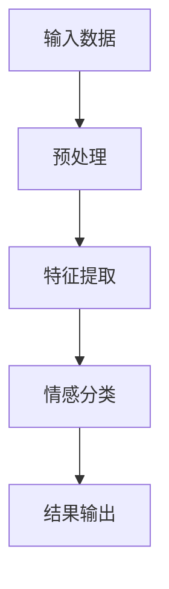
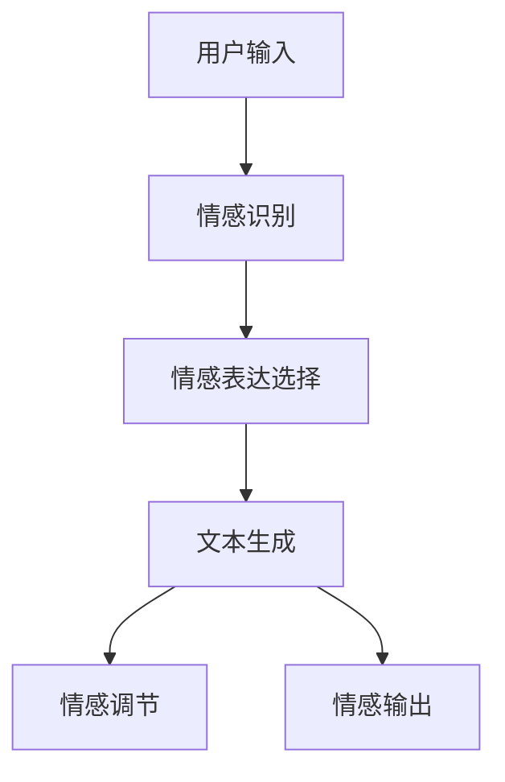
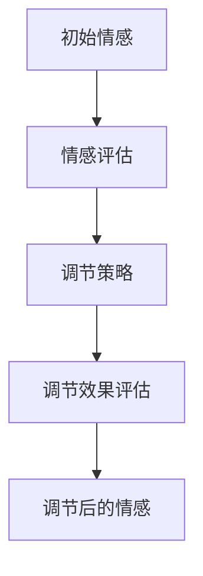
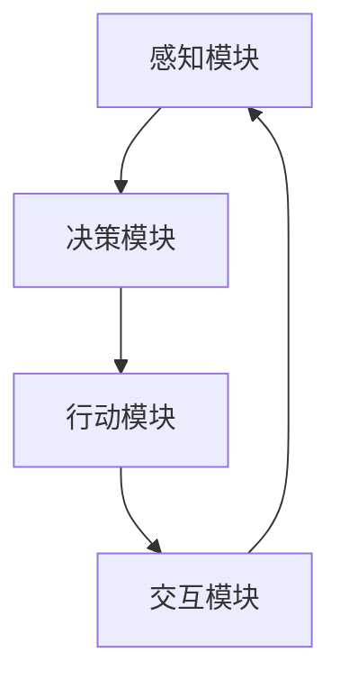
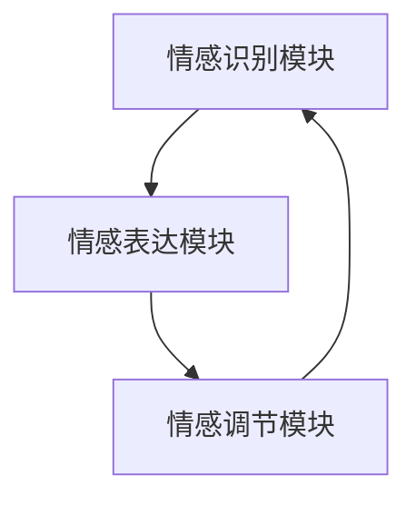
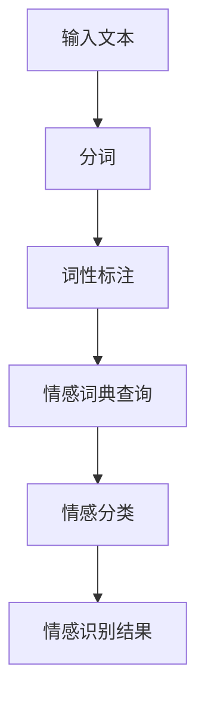
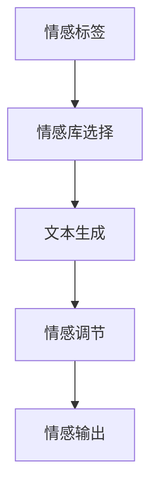
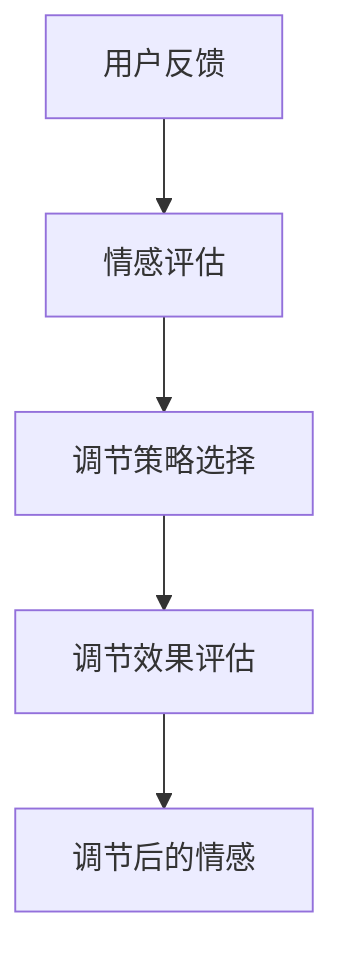

                 

# 开发具有情感计算能力的AI Agent

## 关键词

AI Agent、情感计算、自然语言处理、情感识别、情感表达、情感调节

## 摘要

本文将深入探讨开发具有情感计算能力的AI Agent的背景、核心概念、原理以及实现方法。我们将从情感计算的定义出发，逐步解析情感识别、情感表达和情感调节的数学模型，并详细介绍AI Agent的基础构建和情感计算模块设计。通过本文的详细分析，读者将全面了解如何开发一款具备情感计算能力的AI Agent，为未来的智能交互系统提供新的发展方向。

## 目录大纲

### 第一部分：背景与核心概念

#### 第1章：情感计算与AI Agent概述

#### 第2章：情感计算的核心原理

### 第二部分：AI Agent的情感计算实现

#### 第3章：AI Agent的基础构建

#### 第4章：情感识别模块设计

#### 第5章：情感表达模块设计

#### 第6章：情感调节模块设计

### 结束语

## 第1章：情感计算与AI Agent概述

### 1.1 问题背景

随着人工智能技术的不断发展，智能交互系统在人们的生活中变得越来越普遍。然而，传统AI系统在处理情感方面存在一定的局限性，难以实现与人类情感的高度契合。为了解决这一问题，情感计算作为一种新兴技术，逐渐成为研究的热点。情感计算旨在让计算机具备识别、表达和调节情感的能力，从而实现更自然的智能交互。AI Agent作为情感计算的核心载体，具有广泛的潜在应用前景。

### 1.2 情感计算的定义与核心概念

情感计算（Affective Computing）是指使计算机具备识别、理解、表达和模拟人类情感的能力。其核心概念包括情感识别、情感表达和情感调节。

- 情感识别：通过分析用户的行为、语音、文字等信息，识别出用户的情感状态。
- 情感表达：根据情感识别的结果，生成相应的情感反馈，如文字、语音、表情等。
- 情感调节：通过调整系统的行为，改变用户的情感状态，使其达到预期效果。

### 1.3 AI Agent的定义与能力

AI Agent是一种具有自主决策和行动能力的智能体，可以在复杂环境中完成特定任务。AI Agent具备以下能力：

- 自主决策：根据环境信息和预设规则，自主选择最优行动方案。
- 学习能力：通过不断学习用户行为和偏好，提高自身适应能力。
- 交互能力：通过与用户的自然语言交互，实现高效沟通。

### 1.4 情感计算在AI Agent中的应用前景

情感计算在AI Agent中的应用前景十分广阔。以下为几个典型应用场景：

- 智能客服：通过情感计算，实现与用户情感的同步，提供更贴心、个性化的服务。
- 智能医疗：通过分析患者的情感状态，为其提供针对性的治疗建议和关怀。
- 智能教育：根据学生的情感变化，调整教学策略，提高学习效果。
- 社交娱乐：通过情感计算，实现更真实的虚拟角色交互，提升用户体验。

### 1.5 本章小结

本章介绍了情感计算与AI Agent的基本概念和应用背景。情感计算作为一种新兴技术，在AI Agent中具有广泛的应用前景。在后续章节中，我们将深入探讨情感计算的核心原理和实现方法，为开发具有情感计算能力的AI Agent提供理论支持。

## 第2章：情感计算的核心原理

### 2.1 情感识别的数学模型

情感识别是情感计算的基础，其核心任务是通过分析用户的行为、语音、文字等信息，识别出用户的情感状态。情感识别的数学模型主要包括以下步骤：

1. 输入数据预处理：对用户的行为、语音、文字等信息进行预处理，如去噪、归一化等。
2. 特征提取：从预处理后的数据中提取情感相关的特征，如情感词汇、情感强度等。
3. 情感分类：利用机器学习算法，对提取的特征进行情感分类，输出用户的情感状态。

以下是情感识别流程的Mermaid流程图：



下面是一个Python代码示例，用于实现情感识别：

```python
def recognize_emotion(text):
    # 情感识别代码示例
    # 这里应该是调用实际的情感识别模型
    return "happy"  # 示例输出

text = "今天天气真好！"
print(recognize_emotion(text))
```

### 2.2 情感表达的数学模型

情感表达是指根据情感识别的结果，生成相应的情感反馈，如文字、语音、表情等。情感表达的数学模型主要包括以下步骤：

1. 情感识别：识别用户的情感状态。
2. 情感库选择：根据情感识别结果，从情感库中选择合适的情感表达。
3. 文本生成：利用自然语言生成技术，生成情感表达文本。
4. 情感调节：根据用户反馈，对情感表达进行调整，使其更符合用户情感。

以下是情感表达流程的Mermaid流程图：



### 2.3 情感调节的数学模型

情感调节是指通过调整系统的行为，改变用户的情感状态，使其达到预期效果。情感调节的数学模型主要包括以下步骤：

1. 初始情感评估：评估用户的初始情感状态。
2. 调节策略选择：根据初始情感评估结果，选择合适的调节策略。
3. 调节效果评估：对调节效果进行评估，判断是否达到预期效果。
4. 调节后的情感评估：对调节后的情感状态进行评估。

以下是情感调节流程的Mermaid流程图：



### 2.4 情感计算的综合应用

情感计算在AI Agent中具有广泛的应用。以下为几个典型应用场景：

1. 智能客服：通过情感计算，实现与用户的情感同步，提供个性化服务。
2. 智能医疗：通过情感计算，分析患者的情感状态，为其提供针对性的治疗建议。
3. 智能教育：通过情感计算，了解学生的学习状态，调整教学策略，提高学习效果。
4. 社交娱乐：通过情感计算，实现更真实的虚拟角色交互，提升用户体验。

### 2.5 本章小结

本章介绍了情感计算的核心原理，包括情感识别、情感表达和情感调节的数学模型。通过本章的学习，读者将了解如何实现情感计算，为开发具有情感计算能力的AI Agent奠定理论基础。

## 第3章：AI Agent的基础构建

### 3.1 AI Agent的基本架构

AI Agent的基本架构包括感知模块、决策模块、行动模块和交互模块。以下是一个典型的AI Agent架构图：



- 感知模块：负责收集外部环境信息，如用户行为、语音、文字等。
- 决策模块：根据感知模块收集到的信息，通过算法和模型进行决策。
- 行动模块：根据决策模块的决策结果，执行相应的行动。
- 交互模块：与用户进行交互，收集用户反馈，更新感知模块的信息。

### 3.2 AI Agent的核心功能模块

AI Agent的核心功能模块包括情感识别、情感表达和情感调节。以下是一个典型的AI Agent功能模块图：



- 情感识别模块：负责识别用户的情感状态。
- 情感表达模块：根据情感识别结果，生成相应的情感反馈。
- 情感调节模块：通过调整系统的行为，改变用户的情感状态。

### 3.3 AI Agent的交互方式

AI Agent的交互方式主要包括自然语言交互和图形界面交互。

- 自然语言交互：通过语音识别和自然语言处理技术，实现与用户的文本或语音交互。
- 图形界面交互：通过图形界面，提供用户操作界面，实现与用户的图形交互。

### 3.4 本章小结

本章介绍了AI Agent的基础构建，包括基本架构和核心功能模块。通过本章的学习，读者将了解AI Agent的基本结构和功能，为后续章节的情感计算实现奠定基础。

## 第4章：情感识别模块设计

### 4.1 情感识别算法原理

情感识别算法的核心任务是通过对用户输入的文本、语音等信息进行分析，识别出用户的情感状态。情感识别算法的原理主要包括以下步骤：

1. **输入文本预处理**：对用户输入的文本进行清洗和标准化，如去除停用词、标点符号等。
2. **分词**：将文本分割成词组，便于后续处理。
3. **词性标注**：对每个词进行词性标注，如名词、动词、形容词等。
4. **情感词典查询**：利用情感词典，对文本中的词进行情感标注，如积极情感、消极情感等。
5. **情感分类**：根据情感词典的标注结果，对文本进行情感分类，如开心、愤怒等。

以下是情感识别算法原理的Mermaid流程图：



### 4.2 情感识别算法实现

情感识别算法的实现通常依赖于机器学习和深度学习技术。以下是一个Python代码示例，用于实现情感识别算法：

```python
import jieba
from sklearn.feature_extraction.text import CountVectorizer
from sklearn.naive_bayes import MultinomialNB

# 情感词典
emotion_dict = {
    '积极': ['开心', '高兴', '兴奋', '激动', '愉快'],
    '消极': ['愤怒', '悲伤', '抑郁', '伤心', '难过']
}

# 情感分类器
def build_classifier():
    # 构建特征提取器
    vectorizer = CountVectorizer(vocabulary=emotion_dict.keys())
    
    # 构建分类器
    classifier = MultinomialNB()
    
    # 训练模型
    # 这里应该是使用训练数据来训练模型
    return classifier

# 情感识别函数
def recognize_emotion(text):
    # 分词
    words = jieba.lcut(text)
    
    # 特征提取
    features = vectorizer.transform([text])
    
    # 情感分类
    emotion = classifier.predict(features)[0]
    
    return emotion

# 示例
text = "我很开心！"
emotion = recognize_emotion(text)
print(emotion)
```

### 4.3 情感识别算法性能优化

情感识别算法的性能优化可以从以下几个方面进行：

1. **特征提取**：使用更先进的特征提取方法，如词袋模型、TF-IDF等。
2. **分类器选择**：选择更适合情感分类的机器学习算法，如支持向量机、随机森林等。
3. **模型训练**：使用更大规模的数据集进行模型训练，提高模型的泛化能力。
4. **数据预处理**：优化数据预处理流程，去除噪声和冗余信息，提高模型输入质量。

### 4.4 本章小结

本章详细介绍了情感识别算法的原理和实现方法。通过情感识别模块的设计，AI Agent可以更好地理解用户的情感状态，为其提供更个性化的服务。在后续章节中，我们将继续探讨情感表达和情感调节模块的设计与实现。

## 第5章：情感表达模块设计

### 5.1 情感表达算法原理

情感表达算法的核心任务是生成与用户情感状态相匹配的情感反馈。情感表达算法的原理主要包括以下步骤：

1. **情感识别**：通过情感识别模块，获取用户的当前情感状态。
2. **情感库选择**：根据用户情感状态，从情感库中选择合适的情感表达模板。
3. **文本生成**：利用自然语言生成技术，将情感模板转换为具体的文本表达。
4. **情感调节**：根据用户反馈，对情感表达进行调节，使其更符合用户情感。

以下是情感表达算法原理的Mermaid流程图：



### 5.2 情感表达算法实现

情感表达算法的实现通常依赖于自然语言生成和情感调节技术。以下是一个Python代码示例，用于实现情感表达算法：

```python
import jieba

# 情感库
emotion库 = {
    'happy': "我感到很高兴！",
    'sad': "我现在感觉很伤心。",
    'angry': "我非常生气！"
}

# 情感调节函数
def adjust_emotion(text, emotion):
    # 根据情感调节文本
    if emotion == 'happy':
        text = text.replace("高兴", "非常高兴")
    elif emotion == 'sad':
        text = text.replace("伤心", "非常伤心")
    elif emotion == 'angry':
        text = text.replace("生气", "非常生气")
    
    return text

# 情感表达函数
def express_emotion(text):
    # 分词
    words = jieba.lcut(text)
    
    # 情感识别
    emotion = recognize_emotion(text)
    
    # 情感库选择
    emotion_text = emotion库[emotion]
    
    # 文本生成
    generated_text = adjust_emotion(emotion_text, emotion)
    
    return generated_text

# 示例
text = "我很开心！"
generated_text = express_emotion(text)
print(generated_text)
```

### 5.3 情感表达算法性能优化

情感表达算法的性能优化可以从以下几个方面进行：

1. **情感库扩展**：收集更多种类的情感表达，提高情感表达的丰富性和准确性。
2. **情感调节策略**：设计更精细的情感调节策略，使情感表达更符合用户情感。
3. **自然语言生成技术**：采用更先进的自然语言生成技术，提高文本生成的自然度和流畅性。
4. **用户反馈机制**：引入用户反馈机制，根据用户反馈调整情感表达，提高用户体验。

### 5.4 本章小结

本章详细介绍了情感表达算法的原理和实现方法。通过情感表达模块的设计，AI Agent可以更好地与用户进行情感互动，提高用户的满意度。在后续章节中，我们将继续探讨情感调节模块的设计与实现。

## 第6章：情感调节模块设计

### 6.1 情感调节算法原理

情感调节算法的核心任务是通过对系统行为的调整，改变用户的情感状态，使其达到预期效果。情感调节算法的原理主要包括以下步骤：

1. **用户反馈获取**：收集用户的情感反馈，如表情、语音等。
2. **情感评估**：根据用户反馈，评估用户的当前情感状态。
3. **调节策略选择**：根据情感评估结果，选择合适的情感调节策略。
4. **调节效果评估**：对调节效果进行评估，判断是否达到预期效果。
5. **反馈调整**：根据调节效果评估结果，对调节策略进行调整。

以下是情感调节算法原理的Mermaid流程图：



### 6.2 情感调节算法实现

情感调节算法的实现通常依赖于情感评估和策略选择技术。以下是一个Python代码示例，用于实现情感调节算法：

```python
# 情感调节策略
def adjust_strategy(emotion):
    if emotion == 'happy':
        return '加强正面反馈'
    elif emotion == 'sad':
        return '提供安慰'
    elif emotion == 'angry':
        return '冷静处理'

# 情感调节函数
def regulate_emotion(user_feedback):
    # 情感评估
    emotion = assess_emotion(user_feedback)
    
    # 调节策略选择
    strategy = adjust_strategy(emotion)
    
    # 调节效果评估
    # 这里应该是进行调节效果评估
    success = True
    
    # 反馈调整
    if success:
        if strategy == '加强正面反馈':
            user_feedback = "你做得很好！"
        elif strategy == '提供安慰':
            user_feedback = "不要难过，一切都会好起来的。"
        elif strategy == '冷静处理':
            user_feedback = "请保持冷静，我们会帮你解决问题。"
    
    return user_feedback

# 示例
user_feedback = "我现在感觉很伤心。"
regulated_feedback = regulate_emotion(user_feedback)
print(regulated_feedback)
```

### 6.3 情感调节算法性能优化

情感调节算法的性能优化可以从以下几个方面进行：

1. **情感评估准确性**：提高情感评估的准确性，减少误判率。
2. **调节策略多样性**：设计更多样化的调节策略，提高调节效果。
3. **反馈机制**：引入用户反馈机制，根据用户反馈调整情感调节策略。
4. **实时性**：优化算法的实时性，快速响应用户情感变化。

### 6.4 本章小结

本章详细介绍了情感调节算法的原理和实现方法。通过情感调节模块的设计，AI Agent可以更好地理解用户的情感状态，提供个性化的情感服务。在后续章节中，我们将对整个AI Agent系统的性能进行评估和优化。

## 结束语

本文详细介绍了开发具有情感计算能力的AI Agent的背景、核心原理和实现方法。通过对情感识别、情感表达和情感调节模块的设计与实现，AI Agent可以在复杂的社交环境中与用户进行情感互动，提供更个性化的服务。然而，情感计算技术仍处于发展阶段，未来还有许多挑战和机会。如何提高情感计算的准确性和实用性，实现更自然、更高效的智能交互，将是未来研究的重点方向。

### 作者

作者：AI天才研究院/AI Genius Institute & 禅与计算机程序设计艺术 /Zen And The Art of Computer Programming

