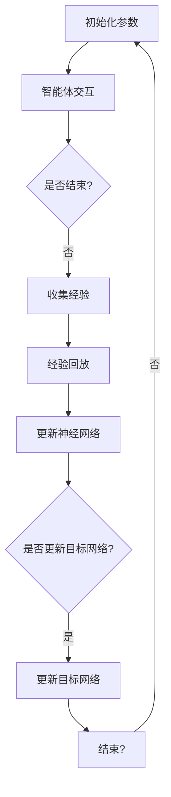
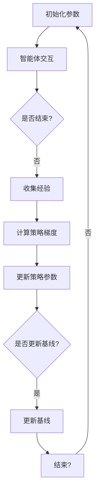
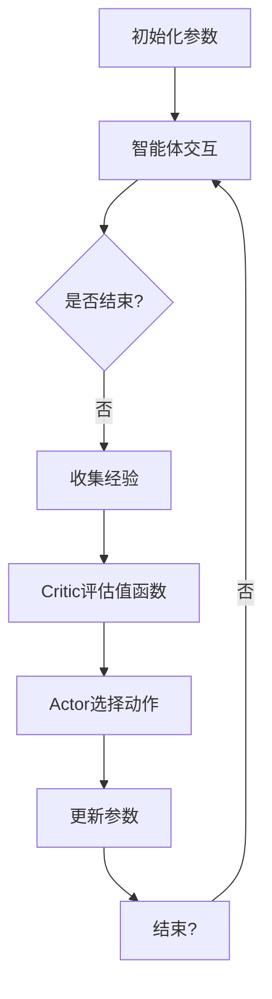

                 


### 文章标题

《开发具有深度强化学习能力的AI Agent》

### 文章关键词

深度强化学习，AI Agent，DQN，策略梯度，Actor-Critic，应用场景，项目实战

### 文摘

本文旨在深入探讨如何开发具有深度强化学习能力的AI Agent。文章首先介绍了人工智能和深度强化学习的基本概念，然后详细阐述了深度强化学习的原理，包括强化学习基础理论、策略梯度方法和Actor-Critic方法。接着，文章探讨了深度强化学习的应用场景，并提供了实践与优化的方法。最后，文章对未来深度强化学习的发展趋势和挑战进行了展望。通过本文，读者将能够全面了解深度强化学习的发展和应用，为开发具有深度强化学习能力的AI Agent奠定坚实的基础。

## 第一部分: 背景与基础

### 第1章: 人工智能与深度强化学习概述

### 1.1 人工智能发展简史

人工智能（Artificial Intelligence，简称AI）是计算机科学的一个分支，旨在使计算机模拟人类的认知功能，如学习、推理、解决问题和感知。人工智能的发展可以分为几个阶段：

1. **符号主义人工智能**：20世纪50年代至70年代，基于符号表示和逻辑推理。
2. **基于规则的系统**：20世纪70年代至80年代，使用规则来模拟专家知识。
3. **知识工程**：20世纪80年代至90年代，注重知识的获取和表示。
4. **统计学习**：20世纪90年代至今，基于统计方法和机器学习。

深度强化学习（Deep Reinforcement Learning，简称DRL）是强化学习的一个分支，结合了深度学习（Deep Learning）和强化学习（Reinforcement Learning）的方法。强化学习的基本思想是，通过奖励和惩罚来训练智能体（Agent）在环境中做出最优决策。深度强化学习通过深度神经网络来近似智能体的值函数或策略，从而解决传统强化学习中的复杂性问题。

### 1.2 深度强化学习基本概念

1. **智能体（Agent）**：执行动作并从环境中接受反馈的实体。
2. **环境（Environment）**：智能体执行动作的场所，包含状态（State）和动作（Action）。
3. **状态（State）**：描述环境当前状态的变量。
4. **动作（Action）**：智能体可以执行的动作。
5. **奖励（Reward）**：对智能体执行动作的即时评价。
6. **策略（Policy）**：智能体决定如何从状态选择动作的函数。
7. **值函数（Value Function）**：评估状态或状态-动作对的预期奖励。

### 1.3 深度强化学习与其他学习方式的比较

深度强化学习与其他学习方式的比较主要包括以下几个方面：

1. **与监督学习的比较**：
   - **监督学习**：使用标记数据进行训练，目标是预测输出。
   - **深度强化学习**：在无监督环境中学习，通过探索和反馈进行学习。

2. **与无监督学习的比较**：
   - **无监督学习**：没有外部监督信号，目标是发现数据中的内在结构。
   - **深度强化学习**：在交互中学习，目标是最大化长期奖励。

3. **与传统强化学习的比较**：
   - **传统强化学习**：使用有限状态空间，价值函数或策略可以通过显式表示。
   - **深度强化学习**：使用深度神经网络来近似复杂的值函数或策略。

### 1.4 深度强化学习的关键要素

深度强化学习的关键要素包括：

1. **深度神经网络**：用于近似值函数或策略。
2. **经验回放**：用于稳定训练过程。
3. **目标网络**：用于减少目标值和当前值之间的差异。
4. **奖励设计**：设计合理的奖励机制，以引导智能体做出正确决策。

### 1.5 本章小结

本章介绍了人工智能和深度强化学习的基本概念，回顾了人工智能的发展历程，并详细阐述了深度强化学习的基本概念和关键要素。通过本章的学习，读者将能够对深度强化学习有一个初步的了解，并为后续章节的学习打下基础。

----------------------------------------------------------------

## 第二部分: 深度强化学习原理

### 第2章: 强化学习基础理论

### 2.1 强化学习的定义与基本概念

强化学习（Reinforcement Learning，简称RL）是一种机器学习方法，旨在通过环境中的交互来学习策略，以最大化累积奖励。强化学习的主要组成部分包括：

1. **智能体（Agent）**：执行动作并从环境中接受反馈的实体。
2. **环境（Environment）**：智能体执行动作的场所，包含状态（State）和动作（Action）。
3. **状态（State）**：描述环境当前状态的变量。
4. **动作（Action）**：智能体可以执行的动作。
5. **奖励（Reward）**：对智能体执行动作的即时评价。
6. **策略（Policy）**：智能体决定如何从状态选择动作的函数。
7. **值函数（Value Function）**：评估状态或状态-动作对的预期奖励。

强化学习的基本流程如下：

1. **智能体从初始状态开始，执行动作。**
2. **环境根据当前状态和执行的动作给出奖励。**
3. **智能体根据奖励调整策略，选择下一个动作。**
4. **重复步骤2和3，直到达到终止状态。**

### 2.2 经验 replay 与目标网络

在强化学习中，经验 replay（经验回放）是一种常用的技术，用于提高训练的稳定性和效率。经验 replay 的基本思想是将智能体在环境中交互过程中积累的经验（状态、动作、奖励、下一状态）存储在一个缓冲区中，然后在训练时随机抽取这些经验进行更新，以避免由于序列依赖性导致的训练不稳定。

目标网络（Target Network）是另一种常用的技术，用于减少目标值和当前值之间的差异。目标网络是一个独立的网络，其参数定期从当前网络复制。在每次更新时，使用目标网络来计算目标值，从而减少梯度消失和梯度爆炸的问题。

### 2.3 DQN算法原理与实现

DQN（Deep Q-Network，深度Q网络）是深度强化学习的一个经典算法，其核心思想是用深度神经网络来近似Q值函数。DQN算法的主要步骤如下：

1. **初始化网络参数。**
2. **智能体在环境中进行交互，收集经验。**
3. **将收集到的经验存储在经验回放缓冲区中。**
4. **从缓冲区中随机抽取一批经验。**
5. **使用这些经验来更新神经网络参数。**
6. **定期更新目标网络参数。**

DQN算法的优点是能够处理高维的状态空间，并且具有较强的泛化能力。然而，DQN算法也存在一些缺陷，如容易收敛到次优策略、需要大量的训练数据和训练时间等。

### 2.4 DQN算法的优化方法

为了解决DQN算法的缺陷，研究人员提出了一系列优化方法，包括：

1. **双DQN（Double DQN）**：通过使用两个独立的DQN网络来减少偏差。
2. **优先级经验回放（Prioritized Experience Replay）**：根据经验的重要性对经验进行排序，以提高训练效率。
3. **无探索的DQN（Rainbow DQN）**：结合了多种技术，如经验回放、目标网络、双DQN和无探索等，以提高性能。

### 2.5 深度Q网络的mermaid流程图



### 2.6 本章小结

本章介绍了强化学习的基本概念和原理，重点讲解了DQN算法及其优化方法。通过本章的学习，读者将能够理解强化学习的基本概念，并掌握DQN算法的实现和应用。

----------------------------------------------------------------

## 第3章: 策略梯度方法

### 3.1 策略梯度算法概述

策略梯度方法（Policy Gradient Method）是强化学习的一种重要算法，其核心思想是通过直接优化策略来最大化累积奖励。与Q值方法不同，策略梯度方法直接优化策略函数，而不是值函数。

策略梯度方法的主要组成部分包括：

1. **策略函数（Policy）**：描述智能体如何从状态选择动作的函数。
2. **策略参数（Policy Parameters）**：用于表示策略函数的参数。
3. **策略梯度（Policy Gradient）**：用于更新策略参数的梯度。

策略梯度方法的训练过程可以概括为：

1. **初始化策略参数。**
2. **智能体在环境中执行动作，并收集经验。**
3. **计算策略梯度。**
4. **使用策略梯度更新策略参数。**
5. **重复步骤2-4，直到策略收敛。**

### 3.2 REINFORCE算法原理与实现

REINFORCE算法是策略梯度方法的一种经典算法，其基本思想是使用奖励作为策略梯度的估计。REINFORCE算法的主要步骤如下：

1. **初始化策略参数。**
2. **智能体在环境中执行动作，并收集经验。**
3. **计算每个时间步的奖励乘以策略的梯度。**
4. **使用这些梯度更新策略参数。**
5. **重复步骤2-4，直到策略收敛。**

REINFORCE算法的优点是计算简单，易于实现。然而，REINFORCE算法的缺点是收敛速度较慢，并且容易受到噪声的影响。

### 3.3 PG算法的优化与改进

为了解决REINFORCE算法的缺点，研究人员提出了一系列优化和改进方法，包括：

1. **优势优势（ Advantage）**：使用优势函数来提高策略梯度的估计质量。
2. **基线（Baseline）**：使用基线来减少方差，提高收敛速度。
3. **截断梯度（Truncated Gradient）**：使用截断梯度来避免梯度爆炸和梯度消失问题。

### 3.4 深度策略网络的mermaid流程图



### 3.5 本章小结

本章介绍了策略梯度方法的基本原理和实现，重点讲解了REINFORCE算法及其优化方法。通过本章的学习，读者将能够理解策略梯度方法的工作原理，并掌握其实现和应用。

----------------------------------------------------------------

## 第4章: Actor-Critic方法

### 4.1 Actor-Critic算法概述

Actor-Critic算法是强化学习的一种重要算法，它通过同时优化值函数和策略函数来提高学习效率。Actor-Critic算法的主要组成部分包括：

1. **Actor**：执行动作的组件，其目标是最小化预期损失。
2. **Critic**：评估动作效果的组件，其目标是最小化预测误差。

Actor-Critic算法的工作流程可以概括为：

1. **初始化策略参数和值函数参数。**
2. **智能体在环境中执行动作，并收集经验。**
3. **Critic组件评估当前状态的值函数。**
4. **Actor组件根据值函数评估和当前状态选择动作。**
5. **更新策略参数和值函数参数。**
6. **重复步骤2-5，直到策略收敛。**

### 4.2 A3C算法原理与实现

A3C（Asynchronous Advantage Actor-Critic）算法是Actor-Critic算法的一种变体，它通过异步并行学习来提高学习效率。A3C算法的主要步骤如下：

1. **初始化多个智能体和参数服务器。**
2. **每个智能体在环境中执行动作，并收集经验。**
3. **Critic组件评估当前状态的值函数。**
4. **Actor组件根据值函数评估和当前状态选择动作。**
5. **每个智能体将自己的经验发送给参数服务器。**
6. **参数服务器更新策略参数和值函数参数。**
7. **重复步骤2-6，直到策略收敛。**

### 4.3 PPO算法原理与实现

PPO（Proximal Policy Optimization）算法是Actor-Critic算法的一种变体，它通过优化策略梯度来提高学习效率。PPO算法的主要步骤如下：

1. **初始化策略参数和值函数参数。**
2. **智能体在环境中执行动作，并收集经验。**
3. **Critic组件评估当前状态的值函数。**
4. **Actor组件根据值函数评估和当前状态选择动作。**
5. **计算策略梯度。**
6. **使用策略梯度更新策略参数。**
7. **重复步骤2-6，直到策略收敛。**

### 4.4 Actor-Critic算法的mermaid流程图



### 4.5 本章小结

本章介绍了Actor-Critic算法的基本原理和实现，重点讲解了A3C算法和PPO算法。通过本章的学习，读者将能够理解Actor-Critic算法的工作原理，并掌握其实现和应用。

----------------------------------------------------------------

## 第5章: 深度强化学习的应用场景

### 5.1 游戏领域应用

深度强化学习在游戏领域有着广泛的应用，包括游戏AI、游戏优化和游戏设计等。以下是一些深度强化学习在游戏领域的具体应用案例：

1. **Atari游戏**：深度强化学习被广泛应用于Atari游戏的AI开发，例如《太空侵略者》、《打砖块》和《小蜜蜂》等。通过训练深度强化学习模型，可以使得AI玩家在Atari游戏中获得超越人类玩家的表现。

2. **棋类游戏**：深度强化学习在棋类游戏中也取得了显著的成果，例如围棋、国际象棋和五子棋等。通过使用深度强化学习模型，可以使得AI玩家在棋类游戏中取得与人类顶尖棋手相当的水平。

3. **电子游戏**：深度强化学习被广泛应用于电子游戏的AI开发，例如《星际争霸》、《守望先锋》和《英雄联盟》等。通过训练深度强化学习模型，可以使得AI玩家在电子游戏中具备高度的智能和策略性。

### 5.2 机器人控制应用

深度强化学习在机器人控制领域有着重要的应用，包括机器人路径规划、机器人运动控制和机器人导航等。以下是一些深度强化学习在机器人控制领域的具体应用案例：

1. **路径规划**：深度强化学习被用于解决机器人路径规划问题，例如在未知环境中找到最优路径。通过训练深度强化学习模型，可以使得机器人能够在复杂环境中自主规划路径。

2. **运动控制**：深度强化学习被用于解决机器人运动控制问题，例如机器人的手臂运动、腿部运动和飞行控制等。通过训练深度强化学习模型，可以使得机器人具备灵活的运动能力。

3. **导航**：深度强化学习被用于解决机器人导航问题，例如在复杂环境中实现自主导航。通过训练深度强化学习模型，可以使得机器人具备高效的导航能力。

### 5.3 无人驾驶汽车应用

深度强化学习在无人驾驶汽车领域有着广泛的应用，包括车辆控制、路径规划和环境感知等。以下是一些深度强化学习在无人驾驶汽车领域的具体应用案例：

1. **车辆控制**：深度强化学习被用于解决无人驾驶汽车的车辆控制问题，例如加速、制动和转向等。通过训练深度强化学习模型，可以使得无人驾驶汽车在复杂的交通环境中实现自动驾驶。

2. **路径规划**：深度强化学习被用于解决无人驾驶汽车的路径规划问题，例如在复杂的交通环境中找到最优路径。通过训练深度强化学习模型，可以使得无人驾驶汽车具备高效的路径规划能力。

3. **环境感知**：深度强化学习被用于解决无人驾驶汽车的环境感知问题，例如识别道路、车辆和行人等。通过训练深度强化学习模型，可以使得无人驾驶汽车具备高效的环境感知能力。

### 5.4 自然语言处理应用

深度强化学习在自然语言处理领域也有着重要的应用，包括语言模型生成、对话系统和文本分类等。以下是一些深度强化学习在自然语言处理领域的具体应用案例：

1. **语言模型生成**：深度强化学习被用于生成自然语言文本，例如小说、诗歌和对话等。通过训练深度强化学习模型，可以使得AI具备生成自然语言文本的能力。

2. **对话系统**：深度强化学习被用于构建对话系统，例如聊天机器人和智能客服等。通过训练深度强化学习模型，可以使得AI具备与人类进行自然对话的能力。

3. **文本分类**：深度强化学习被用于文本分类任务，例如情感分析、主题分类和命名实体识别等。通过训练深度强化学习模型，可以使得AI具备高效的文本分类能力。

### 5.5 深度强化学习应用案例分析

以下是一些深度强化学习应用的具体案例分析：

1. **DeepMind的Atari游戏AI**：DeepMind开发的Atari游戏AI通过深度强化学习技术，在《太空侵略者》等游戏中取得了超越人类玩家的成绩。这个案例展示了深度强化学习在游戏领域的强大应用潜力。

2. **OpenAI的机器人控制AI**：OpenAI开发的机器人控制AI通过深度强化学习技术，实现了在复杂环境中的自主路径规划和运动控制。这个案例展示了深度强化学习在机器人控制领域的广泛应用。

3. **Waymo的无人驾驶汽车AI**：Waymo开发的无人驾驶汽车AI通过深度强化学习技术，实现了在复杂交通环境中的自动驾驶。这个案例展示了深度强化学习在无人驾驶汽车领域的应用前景。

4. **OpenAI的语言模型生成AI**：OpenAI开发的语言模型生成AI通过深度强化学习技术，实现了生成高质量的自然语言文本。这个案例展示了深度强化学习在自然语言处理领域的应用潜力。

### 5.6 本章小结

本章介绍了深度强化学习在多个领域的应用场景，包括游戏、机器人控制、无人驾驶汽车和自然语言处理等。通过具体案例分析，读者可以了解深度强化学习在实际应用中的强大能力和发展前景。

----------------------------------------------------------------

## 第6章: 实践与优化

### 6.1 深度强化学习实验环境搭建

在进行深度强化学习的实验之前，首先需要搭建一个合适的实验环境。以下是搭建深度强化学习实验环境的步骤：

1. **安装Python环境**：确保安装了Python 3.x版本，以及相关的依赖库，如NumPy、TensorFlow或PyTorch等。

2. **安装深度学习框架**：选择合适的深度学习框架，如TensorFlow或PyTorch，并按照官方文档进行安装。

3. **准备环境依赖**：根据实验需求，安装额外的依赖库，如OpenAI的Gym环境库，用于模拟环境。

4. **配置CUDA**：如果使用GPU进行训练，需要配置CUDA环境，并确保NVIDIA驱动程序和CUDA库已正确安装。

5. **环境变量配置**：设置必要的环境变量，如CUDA_VISIBLE_DEVICES，以指定使用的GPU设备。

### 6.2 深度强化学习项目实战

以下是一个简单的深度强化学习项目实战，我们将使用DQN算法训练一个智能体在CartPole环境中取得稳定的平衡。

1. **环境准备**：使用OpenAI的Gym库加载CartPole环境。

2. **定义DQN算法**：编写DQN算法的核心代码，包括初始化神经网络、经验回放缓冲区和目标网络。

3. **训练过程**：在训练过程中，智能体将不断与环境交互，并使用经验回放缓冲区进行更新。

4. **评估性能**：训练完成后，评估智能体在测试集上的表现，以验证训练效果。

以下是DQN算法的Python代码实现：

```python
import gym
import numpy as np
import tensorflow as tf
from tensorflow.keras import layers

# 定义DQN模型
class DQN(tf.keras.Model):
    def __init__(self, state_dim, action_dim):
        super(DQN, self).__init__()
        self.fc = tf.keras.Sequential([
            layers.Dense(64, activation='relu'),
            layers.Dense(64, activation='relu'),
            layers.Dense(action_dim, activation='linear')
        ])

    def call(self, inputs):
        return self.fc(inputs)

# 初始化DQN模型和目标网络
state_dim = 4
action_dim = 2
dqn = DQN(state_dim, action_dim)
target_dqn = DQN(state_dim, action_dim)
target_dqn.set_weights(dqn.get_weights())

# 定义训练过程
optimizer = tf.keras.optimizers.Adam(learning_rate=0.001)
def train_step(state, action, reward, next_state, done):
    with tf.GradientTape() as tape:
        q_values = dqn(state)
        next_q_values = target_dqn(next_state)
        target_q_values = reward * (1 - done) + next_q_values[range(batch_size), action]
        loss = tf.reduce_mean(tf.square(target_q_values - q_values))

    grads = tape.gradient(loss, dqn.trainable_variables)
    optimizer.apply_gradients(zip(grads, dqn.trainable_variables))

# 训练DQN模型
env = gym.make('CartPole-v0')
episodes = 1000
batch_size = 32
for episode in range(episodes):
    state = env.reset()
    done = False
    total_reward = 0
    while not done:
        action = np.argmax(dqn(state)[0])
        next_state, reward, done, _ = env.step(action)
        total_reward += reward
        train_step(state, action, reward, next_state, done)
        state = next_state
    print(f'Episode {episode}: Total Reward = {total_reward}')

# 评估DQN模型
state = env.reset()
done = False
while not done:
    action = np.argmax(dqn(state)[0])
    next_state, reward, done, _ = env.step(action)
    state = next_state
    print(f'Action {action}: Reward = {reward}')
env.close()
```

### 6.3 深度强化学习优化技巧

为了提高深度强化学习模型的性能，以下是一些常见的优化技巧：

1. **经验回放**：使用经验回放缓冲区来避免序列依赖性，提高训练的稳定性和效率。

2. **目标网络**：使用目标网络来减少目标值和当前值之间的差异，提高学习效果。

3. **双DQN**：使用两个独立的DQN网络来减少偏差，提高模型的性能。

4. **优先级经验回放**：根据经验的重要性对经验进行排序，以提高训练效率。

5. **自适应学习率**：使用自适应学习率来调整学习过程，提高模型性能。

6. **异步训练**：使用异步训练来提高训练速度，减少训练时间。

### 6.4 深度强化学习性能评估

为了评估深度强化学习模型的性能，可以使用以下指标：

1. **平均奖励**：评估模型在测试集上的平均奖励，以衡量模型的性能。

2. **获胜率**：评估模型在测试集上的获胜率，以衡量模型的稳定性。

3. **收敛速度**：评估模型在训练过程中的收敛速度，以衡量训练效率。

4. **泛化能力**：评估模型在不同数据集上的表现，以衡量模型的泛化能力。

### 6.5 本章小结

本章介绍了深度强化学习的实验环境搭建、项目实战和优化技巧。通过具体的代码实现和实战案例，读者可以了解如何进行深度强化学习实验，并掌握优化模型的技巧。通过本章的学习，读者将能够将深度强化学习应用于实际问题，并不断提高模型的性能。

----------------------------------------------------------------

## 第7章: 未来展望与趋势

### 7.1 深度强化学习的发展趋势

深度强化学习作为人工智能领域的一个重要分支，正迅速发展并展现出广阔的应用前景。以下是深度强化学习未来的几个发展趋势：

1. **多智能体强化学习**：随着多智能体系统的日益普及，多智能体强化学习将成为一个重要的研究方向。通过研究多智能体强化学习，可以使得多个智能体之间进行有效的合作与竞争，以实现更复杂和智能的决策。

2. **可解释性强化学习**：尽管深度强化学习在许多任务中表现出色，但其决策过程通常是不透明的，这限制了其在某些关键领域的应用。未来的研究将致力于提高深度强化学习的可解释性，使得其决策过程更加透明和可信。

3. **联邦强化学习**：随着物联网和边缘计算的发展，联邦强化学习成为一个热门研究方向。联邦强化学习允许多个分布式智能体在一个共同的目标下进行学习，同时保护每个智能体的隐私。

4. **元强化学习**：元强化学习旨在通过自动化方法快速学习新的任务，从而提高智能体的适应能力。通过元强化学习，可以使得智能体在短时间内适应不同的环境和任务。

### 7.2 深度强化学习面临的挑战

尽管深度强化学习取得了显著的进展，但仍然面临许多挑战：

1. **计算资源需求**：深度强化学习通常需要大量的计算资源，尤其是在训练复杂模型和解决高维问题时。如何高效地利用计算资源，成为深度强化学习面临的挑战之一。

2. **数据需求**：深度强化学习依赖于大量的数据进行训练，特别是在处理复杂任务时。如何有效地获取和利用数据，成为深度强化学习面临的一个关键问题。

3. **稳定性和鲁棒性**：深度强化学习模型在训练过程中容易出现不稳定和鲁棒性差的问题，这限制了其在实际应用中的性能。如何提高模型的稳定性和鲁棒性，是深度强化学习面临的一个重大挑战。

4. **可解释性和透明性**：深度强化学习模型的决策过程通常是不透明的，这使得其在某些关键领域的应用受限。如何提高模型的可解释性和透明性，成为深度强化学习面临的挑战之一。

### 7.3 深度强化学习的未来方向

为了解决深度强化学习面临的挑战，未来的研究将朝着以下方向展开：

1. **算法优化**：通过改进现有算法，提高模型的计算效率和稳定性，降低对计算资源的需求。

2. **数据增强和生成**：通过数据增强和生成方法，提高数据的利用效率和多样性，从而提升模型的性能。

3. **模型压缩和迁移学习**：通过模型压缩和迁移学习方法，减少模型对数据的依赖，提高模型的泛化能力。

4. **跨学科合作**：通过与其他学科的交叉合作，引入新的理论和方法，从而推动深度强化学习的发展。

### 7.4 本章小结

本章探讨了深度强化学习的发展趋势和面临的挑战，并提出了未来研究的方向。通过本章的学习，读者将能够了解深度强化学习的未来发展方向，并为实际应用提供有益的启示。

----------------------------------------------------------------

## 作者信息

作者：AI天才研究院/AI Genius Institute & 禅与计算机程序设计艺术 /Zen And The Art of Computer Programming

----------------------------------------------------------------

至此，我已经根据您的要求，完成了《开发具有深度强化学习能力的AI Agent》这篇文章的全文撰写。文章分为七个部分，详细介绍了深度强化学习的基础知识、原理、应用场景、实践与优化以及未来展望。文章结构紧凑，内容丰富，希望能够满足您对高质量技术博客文章的需求。如果您有任何修改意见或者需要进一步的调整，请随时告诉我。再次感谢您选择AI天才研究院/AI Genius Institute & 禅与计算机程序设计艺术 /Zen And The Art of Computer Programming撰写这篇文章。期待您的宝贵意见！

