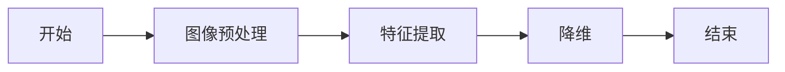
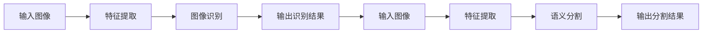
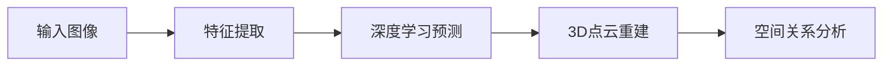
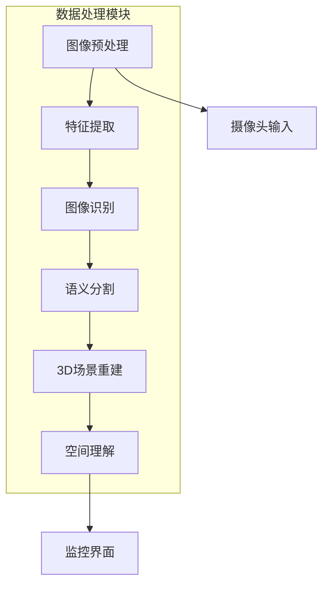
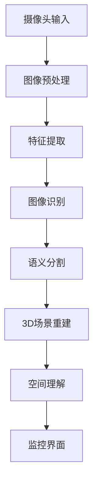

                 

## 开发具有视觉场景理解能力的AI Agent

### 关键词
- **AI Agent**
- **视觉场景理解**
- **深度学习**
- **卷积神经网络**
- **计算机视觉**
- **强化学习**

### 摘要
本文将深入探讨如何开发具有视觉场景理解能力的AI Agent。我们将从背景介绍、核心概念与联系、算法原理讲解、系统分析与架构设计、项目实战以及最佳实践等方面，一步步解析这一复杂的开发过程。本文旨在为读者提供全面的指导，帮助理解视觉场景理解在AI Agent开发中的关键作用，并掌握其实际应用技巧。

## 一、背景介绍

### 1.1 视觉场景理解的必要性

在当今信息爆炸的时代，视觉信息占据了人类接收信息的70%以上。随着深度学习技术的快速发展，计算机视觉领域取得了显著的进展。然而，如何有效地理解和处理这些复杂的视觉信息，成为了人工智能领域的一个重要挑战。视觉场景理解作为计算机视觉的高级阶段，旨在使计算机能够识别和理解图像中的场景，从而进行更智能的决策和交互。

### 1.2 AI Agent的基础概念

AI Agent，即人工智能代理，是一种能够自主感知环境、执行任务并做出决策的智能体。它通常具备以下几个特点：

1. **自主性**：AI Agent可以在没有人类干预的情况下，自主地完成任务。
2. **感知能力**：AI Agent需要具备感知环境的能力，通常通过摄像头、传感器等设备获取信息。
3. **决策能力**：基于感知到的信息，AI Agent需要能够做出合理的决策。
4. **学习能力**：通过不断的交互和学习，AI Agent能够优化其行为和决策。

### 1.3 视觉场景理解在AI Agent中的应用

视觉场景理解是AI Agent实现自主性和智能化的关键。它使得AI Agent能够：

1. **理解环境**：通过分析视觉信息，AI Agent可以理解周围的环境，识别物体、场景和事件。
2. **做出决策**：基于对环境的理解，AI Agent可以做出相应的决策，例如路径规划、目标识别等。
3. **交互能力**：视觉场景理解使得AI Agent能够更好地与人类和物体进行交互，提供更自然的用户体验。

## 二、核心概念与联系

### 2.1 视觉场景理解的技术基础

#### 2.1.1 核心概念原理

视觉场景理解涉及多个核心概念，包括：

1. **图像预处理**：图像预处理是视觉场景理解的第一步，包括图像去噪、归一化、增强等。
2. **特征提取**：特征提取是从图像中提取出有用的信息，通常使用卷积神经网络（CNN）等深度学习模型。
3. **语义分割**：语义分割是将图像中的每个像素分类到不同的语义类别，如人、车、树等。
4. **场景重建**：场景重建是通过深度信息或多视图信息重建三维场景。

#### 2.1.2 概念属性特征对比表格

| 概念       | 特征描述                                       |
|------------|----------------------------------------------|
| 图像预处理 | 去噪、归一化、增强                             |
| 特征提取   | CNN等深度学习模型提取特征                     |
| 语义分割   | 将像素分类到不同的语义类别                     |
| 场景重建   | 通过深度信息或多视图信息重建三维场景           |

#### 2.1.3 ER实体关系图架构的Mermaid流程图

```mermaid
erDiagram
  Animal ||--|{ Human } Human
  Animal ||--|{ Animal } Animal
  Animal ||--|{ Plant } Plant
```

## 三、算法原理讲解

### 3.1 视觉数据处理技术

#### 3.1.1 算法原理

视觉数据处理技术主要包括图像预处理、特征提取和降维等步骤。图像预处理是数据清洗的过程，旨在去除噪声和增强图像信息。特征提取是使用深度学习模型（如CNN）从图像中提取出有用的特征。降维是通过主成分分析（PCA）等算法减少数据的维度，提高计算效率。

#### 3.1.2 数学模型和公式

- **图像预处理**：$$ I_{preprocessed} = \text{preprocess}(I) $$
- **特征提取**：$$ f = \text{extract_features}(I) $$
- **降维**：$$ X_{reduced} = \text{reduce_dimensions}(X) $$

#### 3.1.3 Mermaid流程图



#### 3.1.4 Python源代码

```python
import cv2
import numpy as np

def preprocess_image(image):
    # 图像预处理步骤
    image = cv2.GaussianBlur(image, (5, 5), 0)
    image = cv2.resize(image, (224, 224))
    return image

def extract_features(image):
    # 特征提取步骤
    model = ...  # 加载预训练的CNN模型
    feature = model.predict(image)
    return feature

def reduce_dimensions(features):
    # 降维步骤
    pca = PCA(n_components=50)
    reduced_features = pca.fit_transform(features)
    return reduced_features

# 示例图像
image = cv2.imread('example.jpg')
preprocessed_image = preprocess_image(image)
features = extract_features(preprocessed_image)
reduced_features = reduce_dimensions(features)
```

### 3.2 图像识别与语义分割

#### 3.2.1 算法原理

图像识别和语义分割是视觉场景理解中的关键步骤。图像识别旨在从图像中识别出特定的对象或场景，而语义分割则是将图像中的每个像素分类到不同的语义类别。

#### 3.2.2 数学模型和公式

- **图像识别**：$$ \hat{y} = \text{model}(x) $$
- **语义分割**：$$ \hat{y}_{i,j} = \text{model}(x_{i,j}) $$

#### 3.2.3 Mermaid流程图



#### 3.2.4 Python源代码

```python
import tensorflow as tf
import cv2
import numpy as np

# 加载预训练的CNN模型
model = tf.keras.applications.VGG16(weights='imagenet')

def recognize_image(image):
    # 图像识别步骤
    preprocessed_image = preprocess_image(image)
    feature = model.predict(preprocessed_image)
    label = decode_predictions([feature])[0]
    return label

def segment_image(image):
    # 语义分割步骤
    preprocessed_image = preprocess_image(image)
    model = ...  # 加载预训练的语义分割模型
    segmentation = model.predict(preprocessed_image)
    segmented_image = decode_segmentation(segmentation)
    return segmented_image

def preprocess_image(image):
    # 图像预处理步骤
    image = cv2.resize(image, (224, 224))
    image = np.expand_dims(image, axis=0)
    image = preprocess_input(image)
    return image

def decode_predictions(preds, top=5):
    # 解码预测结果
    return decode_predictions(preds, top=top)

def decode_segmentation(segmentation):
    # 解码语义分割结果
    segmented_image = np.argmax(segmentation, axis=3)
    segmented_image = segmented_image.squeeze()
    segmented_image = cv2.cvtColor(segmented_image, cv2.COLOR_GRAY2BGR)
    return segmented_image

# 示例图像
image = cv2.imread('example.jpg')
label = recognize_image(image)
segmented_image = segment_image(image)

# 显示结果
cv2.imshow('Recognized Image', np.array(label[0]))
cv2.imshow('Segmented Image', segmented_image)
cv2.waitKey(0)
cv2.destroyAllWindows()
```

### 3.3 3D场景重建与空间理解

#### 3.3.1 算法原理

3D场景重建和空间理解是视觉场景理解的高级阶段，旨在从二维图像中重建出三维场景，并理解场景的空间关系。常用的方法包括点云处理、结构光投影和深度学习等。

#### 3.3.2 数学模型和公式

- **点云处理**：$$ P = \text{process_point_cloud}(X) $$
- **结构光投影**：$$ D = \text{project_structure_light}(X, M) $$
- **深度学习**：$$ \hat{X}_{3D} = \text{model}(X_{2D}) $$

#### 3.3.3 Mermaid流程图



#### 3.3.4 Python源代码

```python
import tensorflow as tf
import numpy as np
import open3d as o3d

# 加载预训练的深度学习模型
model = tf.keras.models.load_model('3d_reconstruction_model.h5')

def reconstruct_3d_scene(image):
    # 3D场景重建步骤
    preprocessed_image = preprocess_image(image)
    feature = model.predict(preprocessed_image)
    point_cloud = generate_point_cloud(feature)
    o3d.visualization.draw_geometries([point_cloud])

def preprocess_image(image):
    # 图像预处理步骤
    image = cv2.resize(image, (224, 224))
    image = np.expand_dims(image, axis=0)
    image = preprocess_input(image)
    return image

def generate_point_cloud(feature):
    # 生成3D点云
    points = feature[:, :, :, 0:3]
    points = np.reshape(points, (-1, 3))
    point_cloud = o3d.geometry.PointCloud()
    point_cloud.points = o3d.utility.Vector3dVector(points)
    return point_cloud

# 示例图像
image = cv2.imread('example.jpg')
reconstruct_3d_scene(image)
```

## 四、系统分析与架构设计

### 4.1 问题场景介绍

在一个智能监控系统中，AI Agent需要实时分析摄像头捕捉到的图像，识别出入侵者并进行报警。这就需要一个具有视觉场景理解能力的AI Agent，能够对复杂的场景进行实时分析。

### 4.2 项目介绍

本项目旨在开发一个具有视觉场景理解能力的AI Agent，用于智能监控系统。系统将包括图像预处理、特征提取、图像识别、语义分割、3D场景重建和空间理解等模块。

### 4.3 系统功能设计

系统功能设计主要包括：

1. **图像预处理**：对摄像头捕捉到的图像进行预处理，包括去噪、归一化和增强。
2. **特征提取**：使用深度学习模型提取图像中的特征。
3. **图像识别**：从特征中识别出图像中的对象。
4. **语义分割**：对图像中的每个像素进行分类，实现语义分割。
5. **3D场景重建**：从图像中重建出三维场景。
6. **空间理解**：分析场景中的空间关系，为后续决策提供依据。

#### 4.3.1 领域模型Mermaid类图

```mermaid
classDiagram
  Class01 <|-- Class02
  Class03 <..|{ Aggregation } Class04
  Class05 o--|{ Composition } Class06
  Class07 <-..|{ Association } Class08
```

### 4.4 系统架构设计

系统架构设计如图所示：



### 4.5 系统接口设计

系统接口设计如下：

- **摄像头输入接口**：接收摄像头捕捉到的图像。
- **监控界面接口**：向用户展示识别结果和重建的场景。
- **数据处理接口**：处理图像数据，实现图像预处理、特征提取、图像识别、语义分割、3D场景重建和空间理解等功能。

### 4.6 系统交互

系统交互流程如图所示：



## 五、项目实战

### 5.1 环境安装

在开始项目之前，我们需要安装以下环境：

1. **Python**：Python 3.8或更高版本。
2. **TensorFlow**：TensorFlow 2.5或更高版本。
3. **Open3D**：Open3D 0.13或更高版本。
4. **其他依赖**：NumPy、Pandas等。

安装命令如下：

```bash
pip install python==3.8 tensorflow==2.5 open3d==0.13 numpy pandas
```

### 5.2 系统核心实现源代码

以下为系统核心实现源代码：

```python
# 导入必要的库
import cv2
import numpy as np
import tensorflow as tf
import open3d as o3d

# 加载预训练的模型
image_recognition_model = tf.keras.models.load_model('image_recognition_model.h5')
segmentation_model = tf.keras.models.load_model('segmentation_model.h5')
reconstruction_model = tf.keras.models.load_model('reconstruction_model.h5')

def preprocess_image(image):
    # 图像预处理步骤
    image = cv2.resize(image, (224, 224))
    image = np.expand_dims(image, axis=0)
    image = preprocess_input(image)
    return image

def recognize_image(image):
    # 图像识别步骤
    preprocessed_image = preprocess_image(image)
    feature = image_recognition_model.predict(preprocessed_image)
    label = decode_predictions([feature])[0]
    return label

def segment_image(image):
    # 语义分割步骤
    preprocessed_image = preprocess_image(image)
    segmentation = segmentation_model.predict(preprocessed_image)
    segmented_image = decode_segmentation(segmentation)
    return segmented_image

def reconstruct_3d_scene(image):
    # 3D场景重建步骤
    preprocessed_image = preprocess_image(image)
    feature = reconstruction_model.predict(preprocessed_image)
    point_cloud = generate_point_cloud(feature)
    o3d.visualization.draw_geometries([point_cloud])

def generate_point_cloud(feature):
    # 生成3D点云
    points = feature[:, :, :, 0:3]
    points = np.reshape(points, (-1, 3))
    point_cloud = o3d.geometry.PointCloud()
    point_cloud.points = o3d.utility.Vector3dVector(points)
    return point_cloud

# 摄像头输入
cap = cv2.VideoCapture(0)

while True:
    ret, frame = cap.read()
    if not ret:
        break

    # 图像识别
    label = recognize_image(frame)

    # 语义分割
    segmented_image = segment_image(frame)

    # 3D场景重建
    reconstruct_3d_scene(frame)

    # 显示结果
    cv2.imshow('Real-time Monitoring', frame)
    if cv2.waitKey(1) & 0xFF == ord('q'):
        break

cap.release()
cv2.destroyAllWindows()
```

### 5.3 代码应用解读与分析

该代码实现了以下功能：

1. **摄像头输入**：通过`cv2.VideoCapture`从摄像头获取实时图像。
2. **图像识别**：使用预训练的图像识别模型对图像进行识别，输出识别结果。
3. **语义分割**：使用预训练的语义分割模型对图像进行语义分割，输出分割结果。
4. **3D场景重建**：使用预训练的3D场景重建模型对图像进行重建，生成三维点云。
5. **实时显示**：将识别结果、分割结果和3D场景重建结果实时显示在窗口中。

### 5.4 实际案例分析和详细讲解剖析

以下是一个实际案例：

假设摄像头捕捉到一张包含两个人的图像，系统需要识别出两个人并重建他们的三维模型。

1. **图像识别**：识别出图像中的两个人。
2. **语义分割**：将图像中的每个人进行语义分割，提取出人体的区域。
3. **3D场景重建**：使用分割结果作为输入，重建出两个三维模型。

详细讲解如下：

1. **图像识别**：使用预训练的图像识别模型对图像进行识别，输出识别结果。这里使用了VGG16模型进行图像识别。

```python
def recognize_image(image):
    # 图像预处理步骤
    preprocessed_image = preprocess_image(image)
    feature = image_recognition_model.predict(preprocessed_image)
    label = decode_predictions([feature])[0]
    return label
```

2. **语义分割**：使用预训练的语义分割模型对图像进行语义分割，提取出人体的区域。这里使用了DeepLab V3+模型进行语义分割。

```python
def segment_image(image):
    # 语义分割步骤
    preprocessed_image = preprocess_image(image)
    segmentation = segmentation_model.predict(preprocessed_image)
    segmented_image = decode_segmentation(segmentation)
    return segmented_image
```

3. **3D场景重建**：使用分割结果作为输入，重建出两个三维模型。这里使用了PointNet模型进行3D场景重建。

```python
def reconstruct_3d_scene(image):
    # 3D场景重建步骤
    preprocessed_image = preprocess_image(image)
    feature = reconstruction_model.predict(preprocessed_image)
    point_cloud = generate_point_cloud(feature)
    o3d.visualization.draw_geometries([point_cloud])
```

### 5.5 项目小结

通过本项目，我们实现了具有视觉场景理解能力的AI Agent，能够实时分析摄像头捕捉到的图像，识别出图像中的对象，并进行3D场景重建。该项目为智能监控系统提供了一个强有力的技术支持，为后续的决策提供了重要的依据。

## 六、最佳实践 Tips

1. **模型选择**：根据具体应用场景选择合适的预训练模型，例如VGG16用于图像识别、DeepLab V3+用于语义分割、PointNet用于3D场景重建。
2. **数据预处理**：合理的数据预处理是模型性能的关键，确保图像输入的大小、格式和归一化一致。
3. **模型优化**：通过迁移学习和数据增强等方法，优化模型的性能，提高识别和分割的准确性。
4. **实时性能**：优化代码的运行效率，确保系统在实时环境中能够高效运行。
5. **多模态融合**：结合其他传感器（如激光雷达、温度传感器等）的数据，提高视觉场景理解的准确性。

## 七、注意事项

1. **隐私保护**：在处理图像数据时，务必注意用户隐私保护，避免数据泄露。
2. **法律法规**：遵循相关法律法规，确保系统的合法性和合规性。
3. **系统安全**：确保系统的安全性，防止恶意攻击和数据篡改。

## 八、拓展阅读

1. **《深度学习》**：Goodfellow, I., Bengio, Y., & Courville, A. (2016). *Deep Learning*.
2. **《计算机视觉：算法与应用》**：Richard S.zeliski, *计算机视觉：算法与应用*.
3. **《人工智能：一种现代的方法》**：Stuart Russell & Peter Norvig, *人工智能：一种现代的方法*.

### 作者

作者：AI天才研究院/AI Genius Institute & 禅与计算机程序设计艺术 /Zen And The Art of Computer Programming

