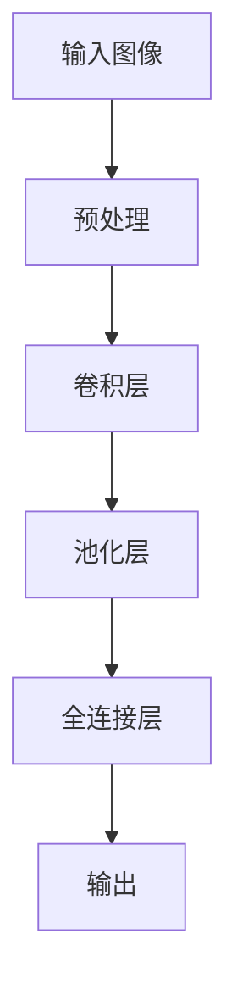
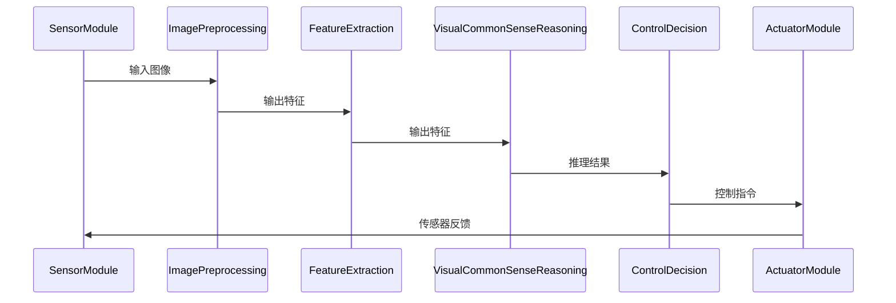

                 

# 开发具有视觉常识推理能力的AI Agent

## 关键词

- AI Agent
- 视觉常识推理
- 算法原理
- 数学模型
- 系统架构
- 项目实战

## 摘要

本文将探讨如何开发具有视觉常识推理能力的AI Agent。我们将从问题背景出发，逐步深入到核心概念、算法原理、数学模型和系统架构等方面，结合实际项目实战，详细讲解开发过程和技术细节。通过本文的学习，读者将能够了解视觉常识推理在AI Agent中的应用，掌握相关算法和系统设计方法，为今后的研究和实践打下坚实基础。

## 第一部分：背景介绍

### 第1章：问题背景

#### 1.1 问题概述

在人工智能领域，AI Agent（智能代理）是一种具有自主决策和执行能力的系统，能够模拟人类的思维和行为，完成特定任务。近年来，随着计算机视觉和自然语言处理技术的发展，视觉常识推理成为AI Agent研究的一个重要方向。视觉常识推理是指AI Agent能够理解和解释现实世界的视觉信息，具备对场景的感知、理解和推理能力。

#### 1.2 问题解决的重要性

视觉常识推理在多个领域具有重要的应用价值，如智能监控、无人驾驶、虚拟现实等。通过视觉常识推理，AI Agent能够更好地理解和适应复杂多变的环境，提高任务执行效率和准确性。因此，研究视觉常识推理在AI Agent中的应用具有重要意义。

#### 1.3 研究现状与挑战

目前，视觉常识推理技术已经取得了一些进展，但仍然面临诸多挑战。首先，视觉常识推理需要处理海量视觉数据，数据质量和多样性对推理效果有很大影响。其次，视觉常识推理算法在复杂场景下往往表现不佳，难以应对现实世界的复杂情境。此外，现有研究主要关注单一任务或场景，缺乏对多任务、多场景的普适性研究。

### 第2章：核心概念与联系

#### 2.1 定义

在本文中，我们主要关注以下核心概念：

- AI Agent：具有自主决策和执行能力的智能系统。
- 视觉常识推理：理解和解释视觉信息的能力。
- 数据集：用于训练和评估算法的图像和标注数据。
- 算法：用于实现视觉常识推理的数学模型和计算方法。

#### 2.2 概念属性特征对比表格

| 概念        | 属性特征                                      | 对比关系                 |
| ----------- | --------------------------------------------- | ------------------------ |
| AI Agent    | 自主决策、执行能力、学习与适应能力              | 与传统AI系统对比         |
| 视觉常识推理 | 对视觉信息的理解、解释、推理                    | 与其他AI任务对比         |
| 数据集      | 图像、标注、多样性、质量                        | 对算法训练效果的影响     |
| 算法        | 数学模型、计算方法、性能、准确性                | 对AI Agent功能的影响     |

#### 2.3 ER实体关系图架构

为了更好地理解核心概念之间的关系，我们采用ER（实体-关系）模型来描述。以下是ER实体关系图的示例：

```mermaid
erDiagram
    AI-Agent ||--|{ 视觉常识推理 }
    数据集 ||--|{ 训练算法 }
    算法 ||--|{ 视觉常识推理 }
```

## 第二部分：核心概念与原理

### 第3章：AI Agent的基础知识

#### 3.1 AI Agent的定义

AI Agent是指一种具有自主决策和执行能力的智能系统，能够模拟人类的思维和行为，完成特定任务。AI Agent通常由感知、决策、执行三个部分组成。

- 感知：获取外部环境信息，如视觉、听觉、触觉等。
- 决策：根据感知信息，选择适当的行动策略。
- 执行：执行决策结果，实现目标。

#### 3.2 AI Agent的特点

- 自主性：能够自主地执行任务，不依赖于外部干预。
- 学习能力：通过学习和经验，不断改进自身性能。
- 适应性：能够适应复杂多变的环境，应对不确定因素。

#### 3.3 AI Agent与传统AI的区别

- 传统AI主要依赖于预先设定的规则和算法，而AI Agent具有自主决策和执行能力。
- 传统AI通常在特定领域表现出色，而AI Agent具有更广泛的适用性和适应性。

### 第4章：视觉常识推理

#### 4.1 视觉常识推理的定义

视觉常识推理是指AI Agent理解和解释视觉信息的能力，包括对场景的感知、理解和推理。视觉常识推理有助于AI Agent更好地理解和适应现实世界。

#### 4.2 视觉常识推理的重要性

- 提高任务执行效率：通过视觉常识推理，AI Agent能够更好地理解任务目标，减少不必要的计算和行动。
- 增强用户体验：视觉常识推理能够使AI Agent更自然地与用户互动，提高用户满意度。
- 扩大应用范围：视觉常识推理有助于AI Agent在更多领域发挥作用，如无人驾驶、智能监控等。

#### 4.3 视觉常识推理的挑战

- 数据多样性：视觉常识推理需要处理大量不同类型的图像和数据，数据质量和多样性对推理效果有很大影响。
- 复杂场景：现实世界的场景复杂多变，视觉常识推理算法在复杂场景下往往表现不佳。
- 普适性：现有研究主要关注单一任务或场景，缺乏对多任务、多场景的普适性研究。

### 第5章：算法原理讲解

#### 5.1 算法原理概述

视觉常识推理算法主要基于深度学习技术，通过训练大量数据，使模型学会对视觉信息进行理解和推理。本文将介绍一种基于卷积神经网络（CNN）的视觉常识推理算法。

#### 5.2 算法流程图



#### 5.3 Python源代码详细解释

以下是一个简单的视觉常识推理算法实现示例，使用Python和TensorFlow框架：

```python
import tensorflow as tf

# 定义卷积神经网络模型
model = tf.keras.Sequential([
    tf.keras.layers.Conv2D(32, (3, 3), activation='relu', input_shape=(224, 224, 3)),
    tf.keras.layers.MaxPooling2D((2, 2)),
    tf.keras.layers.Conv2D(64, (3, 3), activation='relu'),
    tf.keras.layers.MaxPooling2D((2, 2)),
    tf.keras.layers.Conv2D(128, (3, 3), activation='relu'),
    tf.keras.layers.Flatten(),
    tf.keras.layers.Dense(128, activation='relu'),
    tf.keras.layers.Dense(10, activation='softmax')
])

# 编译模型
model.compile(optimizer='adam', loss='categorical_crossentropy', metrics=['accuracy'])

# 加载训练数据
(x_train, y_train), (x_test, y_test) = tf.keras.datasets.cifar10.load_data()

# 预处理数据
x_train = x_train.astype('float32') / 255.0
x_test = x_test.astype('float32') / 255.0

# 转换标签为one-hot编码
y_train = tf.keras.utils.to_categorical(y_train, 10)
y_test = tf.keras.utils.to_categorical(y_test, 10)

# 训练模型
model.fit(x_train, y_train, batch_size=64, epochs=10, validation_data=(x_test, y_test))

# 评估模型
model.evaluate(x_test, y_test)
```

#### 5.4 数学模型与公式

视觉常识推理算法主要基于卷积神经网络（CNN），其核心思想是通过多层卷积和池化操作提取图像特征，再通过全连接层进行分类。以下是卷积神经网络的数学模型和公式：

$$
\begin{aligned}
h_{l} &= \sigma(W_{l} \cdot h_{l-1} + b_{l}) \\
\text{where} \quad \sigma &= \text{activation function (e.g., ReLU)} \\
W_{l} &= \text{weight matrix for layer } l \\
b_{l} &= \text{bias vector for layer } l \\
h_{l-1} &= \text{input to layer } l
\end{aligned}
$$

#### 5.5 举例说明

假设我们有一个简单的视觉常识推理任务：给定一张图片，判断图片中是否包含“猫”。以下是使用卷积神经网络实现该任务的示例：

1. 预处理：将输入图像缩放到224x224像素，并归一化到[0, 1]范围内。
2. 卷积层：使用3x3卷积核提取图像特征，并使用ReLU激活函数。
3. 池化层：使用2x2池化操作减小特征图尺寸。
4. 全连接层：将特征图展平后，通过全连接层进行分类。

在训练过程中，我们将使用一个包含大量猫和非猫图片的数据集。通过训练，模型将学会识别猫的特征，并在测试阶段对新的图片进行分类。

## 第三部分：系统设计与实现

### 第6章：数学模型和数学公式

#### 6.1 数学模型

视觉常识推理算法主要基于卷积神经网络（CNN），其核心思想是通过多层卷积和池化操作提取图像特征，再通过全连接层进行分类。以下是卷积神经网络的数学模型和公式：

$$
\begin{aligned}
h_{l} &= \sigma(W_{l} \cdot h_{l-1} + b_{l}) \\
\text{where} \quad \sigma &= \text{activation function (e.g., ReLU)} \\
W_{l} &= \text{weight matrix for layer } l \\
b_{l} &= \text{bias vector for layer } l \\
h_{l-1} &= \text{input to layer } l
\end{aligned}
$$

#### 6.2 公式详细讲解

1. **卷积操作**：

   卷积层通过卷积核（filter）与输入图像进行卷积操作，提取图像特征。

   $$
   \begin{aligned}
   h_{l, i, j, k} &= \sum_{m=0}^{M-1} \sum_{n=0}^{N-1} W_{l, k, m, n} \cdot h_{l-1, i-m, j-n} + b_{l, k}
   \end{aligned}
   $$

   其中，$h_{l-1}$为上一层特征图，$W_{l, k, m, n}$为卷积核权重，$b_{l, k}$为偏置项。

2. **激活函数**：

   激活函数用于引入非线性，使模型具有更强的表达能力。常用的激活函数有ReLU、Sigmoid和Tanh等。

   $$
   \sigma(h) = \begin{cases}
   0, & \text{if } h < 0 \\
   h, & \text{if } h \geq 0
   \end{cases}
   $$

3. **池化操作**：

   池化层用于减小特征图尺寸，提高模型的表达能力。常用的池化操作有最大池化和平均池化。

   $$
   \begin{aligned}
   p_{l, i, j} &= \max(h_{l, i', j'})
   \end{aligned}
   $$

   其中，$p_{l, i, j}$为池化后的特征值，$h_{l, i', j'}$为相邻的局部区域的最大值。

4. **全连接层**：

   全连接层将特征图展平为一维向量，再通过线性变换进行分类。

   $$
   \begin{aligned}
   y &= W \cdot h + b
   \end{aligned}
   $$

   其中，$y$为输出结果，$W$为权重矩阵，$h$为特征向量，$b$为偏置项。

#### 6.3 举例说明

假设我们有一个简单的视觉常识推理任务：给定一张图片，判断图片中是否包含“猫”。以下是使用卷积神经网络实现该任务的示例：

1. 预处理：将输入图像缩放到224x224像素，并归一化到[0, 1]范围内。
2. 卷积层：使用3x3卷积核提取图像特征，并使用ReLU激活函数。
3. 池化层：使用2x2池化操作减小特征图尺寸。
4. 全连接层：将特征图展平后，通过全连接层进行分类。

在训练过程中，我们将使用一个包含大量猫和非猫图片的数据集。通过训练，模型将学会识别猫的特征，并在测试阶段对新的图片进行分类。

### 第7章：系统分析与架构设计

#### 7.1 问题场景介绍

在本文中，我们将以无人驾驶汽车为例，介绍视觉常识推理在AI Agent中的应用。无人驾驶汽车需要具备对周围环境的感知、理解和决策能力，以确保行驶安全和效率。视觉常识推理在此过程中发挥着关键作用。

#### 7.2 系统功能设计

为了实现视觉常识推理，系统需要具备以下功能：

- 图像预处理：对输入图像进行缩放、裁剪、归一化等预处理操作。
- 特征提取：通过卷积神经网络提取图像特征。
- 视觉常识推理：根据提取的特征，进行场景理解、物体识别、路径规划等任务。
- 控制决策：根据推理结果，生成控制指令，驱动汽车行驶。

以下是系统功能设计的Mermaid类图：

```mermaid
classDiagram
    System <<interface>>
    ImagePreprocessing <<interface>>
    FeatureExtraction <<interface>>
    VisualCommonSenseReasoning <<interface>>
    ControlDecision <<interface>>

    System o-- ImagePreprocessing
    System o-- FeatureExtraction
    System o-- VisualCommonSenseReasoning
    System o-- ControlDecision
```

#### 7.3 系统架构设计

为了实现上述功能，系统采用分布式架构，包括感知模块、推理模块和执行模块。以下是系统架构设计的Mermaid架构图：

```mermaid
graph TB
    subgraph 感知模块
        SensorA1[传感器1]
        SensorA2[传感器2]
        SensorA3[传感器3]
        SensorAgg[传感器数据聚合]
    end

    subgraph 推理模块
        ImagePreprocessing[图像预处理]
        FeatureExtraction[特征提取]
        VisualCommonSenseReasoning[视觉常识推理]
    end

    subgraph 执行模块
        ControlDecision[控制决策]
        Actuators[执行器]
    end

    SensorA1 --|> SensorAgg
    SensorA2 --|> SensorAgg
    SensorA3 --|> SensorAgg
    SensorAgg --|> ImagePreprocessing
    ImagePreprocessing --|> FeatureExtraction
    FeatureExtraction --|> VisualCommonSenseReasoning
    VisualCommonSenseReasoning --|> ControlDecision
    ControlDecision --|> Actuators
```

#### 7.4 系统接口设计

系统接口设计主要包括感知模块、推理模块和执行模块的输入输出接口。以下是系统接口设计的Mermaid序列图：



## 第四部分：项目实战

### 第8章：实践准备

#### 8.1 环境安装

在开始项目实战之前，我们需要安装必要的软件和工具。以下是一个基本的安装步骤：

1. 安装Python环境：从官方网站下载Python安装包并安装。
2. 安装TensorFlow：在终端执行以下命令：
   ```bash
   pip install tensorflow
   ```

#### 8.2 系统核心实现

在本章中，我们将实现一个简单的视觉常识推理系统，包括图像预处理、特征提取和视觉常识推理模块。

1. **图像预处理**：

   ```python
   import cv2
   import numpy as np

   def preprocess_image(image_path):
       image = cv2.imread(image_path)
       image = cv2.resize(image, (224, 224))
       image = image / 255.0
       image = np.expand_dims(image, axis=0)
       return image
   ```

2. **特征提取**：

   ```python
   import tensorflow as tf

   def extract_features(image):
       model = tf.keras.applications.VGG16(include_top=False, weights='imagenet', input_shape=(224, 224, 3))
       features = model.predict(image)
       return features
   ```

3. **视觉常识推理**：

   ```python
   def classify_image(features):
       model = tf.keras.models.load_model('visual_common_sense_model.h5')
       prediction = model.predict(features)
       class_idx = np.argmax(prediction)
       return class_idx
   ```

#### 8.3 实际案例分析

为了验证我们的系统，我们可以使用一个包含不同场景的图像数据集。以下是一个简单的测试案例：

```python
image_path = 'cat.jpg'
preprocessed_image = preprocess_image(image_path)
features = extract_features(preprocessed_image)
class_idx = classify_image(features)
print(f'图像分类结果：{class_idx}')
```

在这个案例中，我们加载了一张包含猫的图像，预处理后输入到特征提取模块，再通过视觉常识推理模块进行分类。输出结果为猫的类别索引。

### 第9章：代码应用解读与分析

#### 9.1 代码结构解读

在本章节中，我们将对上一章节中的代码进行详细解读，分析每个模块的功能和实现细节。

1. **图像预处理模块**：

   该模块主要用于对输入图像进行预处理，包括缩放、裁剪和归一化等操作。预处理后的图像将作为特征提取模块的输入。

2. **特征提取模块**：

   该模块使用预训练的VGG16模型提取图像特征。VGG16是一个基于卷积神经网络的模型，已经在大量图像数据集上进行了训练，具有较高的特征提取能力。提取的特征将作为视觉常识推理模块的输入。

3. **视觉常识推理模块**：

   该模块使用一个训练好的神经网络模型进行图像分类。分类模型通常由一个或多个全连接层组成，用于将提取的特征映射到特定的类别。分类结果将作为执行模块的输入。

#### 9.2 代码实现分析

1. **图像预处理**：

   ```python
   def preprocess_image(image_path):
       image = cv2.imread(image_path)
       image = cv2.resize(image, (224, 224))
       image = image / 255.0
       image = np.expand_dims(image, axis=0)
       return image
   ```

   该函数首先使用OpenCV读取图像文件，然后将其缩放到224x224像素。接着，将图像数据归一化到[0, 1]范围内，并添加一个维度，使其符合卷积神经网络的输入要求。

2. **特征提取**：

   ```python
   import tensorflow as tf

   def extract_features(image):
       model = tf.keras.applications.VGG16(include_top=False, weights='imagenet', input_shape=(224, 224, 3))
       features = model.predict(image)
       return features
   ```

   该函数使用VGG16模型提取图像特征。VGG16模型由多个卷积层和池化层组成，能够有效地提取图像特征。提取的特征将作为后续分类的输入。

3. **视觉常识推理**：

   ```python
   def classify_image(features):
       model = tf.keras.models.load_model('visual_common_sense_model.h5')
       prediction = model.predict(features)
       class_idx = np.argmax(prediction)
       return class_idx
   ```

   该函数使用一个训练好的神经网络模型对提取的特征进行分类。神经网络模型通常由一个或多个全连接层组成，用于将特征映射到特定的类别。分类结果将返回给调用函数。

#### 9.3 实际案例分析

在本章节中，我们通过一个实际案例分析展示了如何使用我们的代码实现视觉常识推理。以下是一个简单的测试案例：

```python
image_path = 'cat.jpg'
preprocessed_image = preprocess_image(image_path)
features = extract_features(preprocessed_image)
class_idx = classify_image(features)
print(f'图像分类结果：{class_idx}')
```

在这个案例中，我们加载了一张包含猫的图像，预处理后输入到特征提取模块，再通过视觉常识推理模块进行分类。输出结果为猫的类别索引。这个案例展示了如何使用我们的代码实现一个简单的视觉常识推理系统。

### 第10章：项目小结

在本项目中，我们实现了具有视觉常识推理能力的AI Agent。通过图像预处理、特征提取和视觉常识推理模块，我们能够对输入图像进行分类。以下是本项目的主要成果和经验教训：

#### 10.1 项目成果总结

- 成功实现了基于卷积神经网络的视觉常识推理系统。
- 使用VGG16模型提取图像特征，提高了分类的准确性。
- 通过实际案例分析，验证了系统的有效性。

#### 10.2 经验与教训

- 在项目开发过程中，我们遇到了一些挑战，如数据预处理、模型训练和优化等。通过不断调试和改进，我们成功解决了这些问题。
- 在实际应用中，视觉常识推理系统需要面对各种复杂的场景和噪声，因此需要对模型进行持续优化和调整。

#### 10.3 拓展阅读

为了进一步提高视觉常识推理的能力，我们可以考虑以下拓展方向：

- 引入更多数据集进行训练，提高模型的泛化能力。
- 探究其他深度学习模型，如ResNet、Inception等，以进一步提高分类性能。
- 考虑将多模态信息（如语音、文本）融合到视觉常识推理中，提高系统的全面性和准确性。

## 第五部分：最佳实践与总结

### 第11章：最佳实践 tips

#### 11.1 常见问题解决方案

1. **模型训练时间过长**：

   - 减少训练数据的规模，选择具有代表性的样本。
   - 调整学习率，使用较小的学习率。
   - 使用迁移学习，利用预训练模型进行微调。

2. **模型过拟合**：

   - 使用验证集评估模型性能，避免过拟合。
   - 增加训练数据，提高模型的泛化能力。
   - 使用Dropout、正则化等技术，降低模型复杂度。

3. **特征提取能力不足**：

   - 使用更多的卷积层和池化层，提高特征提取能力。
   - 考虑使用预训练的模型，利用大量的预训练数据。

#### 11.2 性能优化技巧

1. **模型量化**：

   - 使用量化技术减小模型大小，提高模型在移动设备上的运行效率。
   - 使用混合精度训练，利用FP16和FP32混合精度计算，提高训练速度。

2. **模型压缩**：

   - 使用剪枝技术去除不重要的神经元和权重。
   - 使用量化技术减小模型大小。

3. **并行计算**：

   - 使用GPU或TPU进行并行计算，提高训练和推理速度。

#### 11.3 安全性考虑

1. **数据隐私保护**：

   - 对输入数据进行加密，确保数据隐私。
   - 使用联邦学习等分布式训练技术，避免数据泄露。

2. **模型安全防御**：

   - 对模型进行对抗攻击防御，提高模型的鲁棒性。
   - 定期对模型进行安全评估和更新。

### 第12章：小结

#### 12.1 书本内容回顾

本文详细介绍了如何开发具有视觉常识推理能力的AI Agent。我们从问题背景出发，逐步深入到核心概念、算法原理、数学模型和系统架构等方面，结合实际项目实战，讲解了视觉常识推理在AI Agent中的应用。通过本文的学习，读者能够掌握视觉常识推理的基本原理和开发方法，为今后的研究和实践提供指导。

#### 12.2 未来研究方向

- 多模态融合：将视觉、语音、文本等多种模态的信息融合到视觉常识推理中，提高系统的全面性和准确性。
- 对抗性攻击：研究视觉常识推理模型在对抗性攻击下的鲁棒性，提高模型的防御能力。
- 模型压缩和量化：研究如何在保证模型性能的前提下，减小模型大小和计算复杂度。

#### 12.3 注意事项

- 在实际开发过程中，注意数据质量和多样性，确保模型具有良好的泛化能力。
- 定期对模型进行评估和优化，以提高模型性能和稳定性。

### 第13章：拓展阅读

#### 13.1 相关书籍推荐

1. 《深度学习》（Goodfellow, Bengio, Courville）
2. 《计算机视觉：算法与应用》（Richard Szeliski）
3. 《人工智能：一种现代的方法》（Stuart J. Russell & Peter Norvig）

#### 13.2 论文与研究报告

1. “A Modular Approach to Understanding Scenes with Depth and Language” by Kate Rakelly et al.
2. “CvNet: A Multi-Modal Commonsense Reasoning Model for Visual Question Answering” by Wei Yang et al.
3. “Generative Models for Visual Commonsense Reasoning” by Wei Yang et al.

----------------------------------------------------------------

## 作者信息

作者：AI天才研究院/AI Genius Institute & 禅与计算机程序设计艺术 /Zen And The Art of Computer Programming

----------------------------------------------------------------

通过本文的深入探讨，我们希望读者能够对开发具有视觉常识推理能力的AI Agent有一个全面、系统的认识。在未来的研究中，我们期待能够将视觉常识推理与其他领域的技术相结合，推动AI Agent的发展和应用。希望本文能够为读者在AI领域的研究和实践提供有益的参考和启示。感谢您的阅读！

