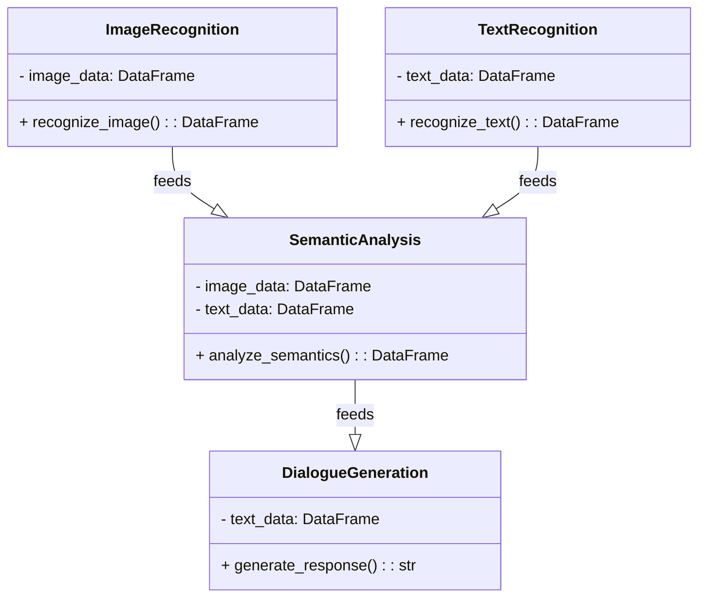
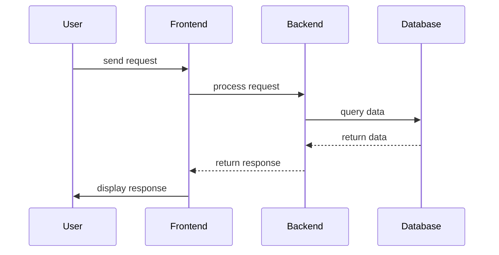
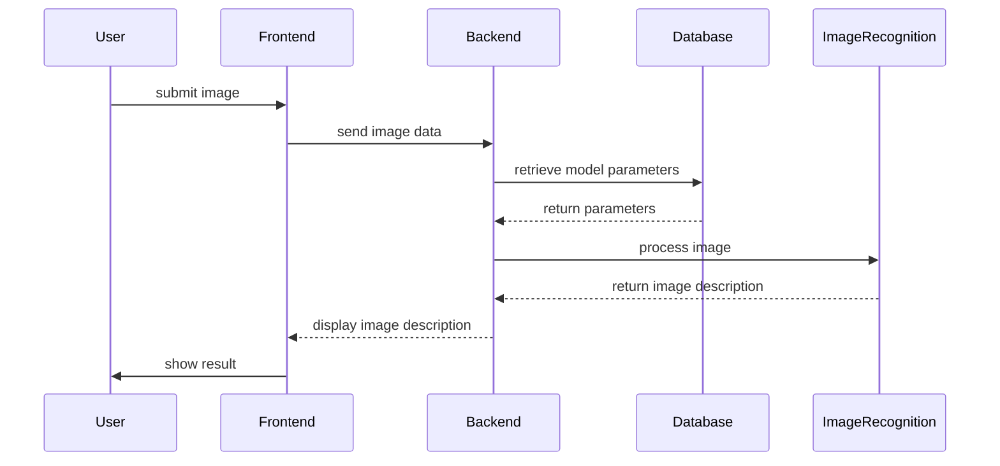

                 

### 文章标题：开发具有视觉-语言理解能力的AI Agent

#### 关键词：AI Agent、视觉理解、语言理解、算法原理、系统架构、项目实战

> 摘要：本文将深入探讨如何开发具有视觉-语言理解能力的AI Agent。我们将从背景介绍、核心概念、算法原理、系统分析与架构设计、项目实战等多个方面，系统地分析和讲解这一复杂但极具前景的课题。本文旨在为读者提供一条清晰、实用的开发路径，帮助理解并实现具备视觉-语言理解能力的AI Agent。

----------------------------------------------------------------

# 开发具有视觉-语言理解能力的AI Agent

## 引言

随着人工智能技术的飞速发展，AI Agent作为一个能够自主执行任务、与环境互动的智能体，受到了广泛关注。特别是在视觉-语言理解领域，AI Agent的应用潜力巨大，从智能家居的语音助手，到自动驾驶汽车，再到智能医疗诊断，都对这一技术的需求日益增长。本文将重点探讨如何开发具有视觉-语言理解能力的AI Agent，包括其算法原理、系统架构和实战应用等。

## 第1章：AI Agent的发展与视觉-语言理解能力

### 1.1 问题背景

随着深度学习、计算机视觉和自然语言处理技术的不断发展，AI Agent的研究和应用逐渐成为人工智能领域的一个重要方向。AI Agent的发展可以追溯到20世纪50年代，当时人工智能刚刚起步。如今，AI Agent已经能够实现多种复杂的任务，包括语音识别、图像分类、自然语言理解等。

### 1.2 问题描述

视觉-语言理解是指AI Agent能够理解图像中的场景，并使用自然语言进行描述或交互。这一问题的核心是如何将视觉信息与语言信息相结合，使得AI Agent能够像人类一样，理解图像内容并能够进行有效的语言交流。

### 1.3 问题解决思路

为了解决视觉-语言理解问题，我们需要设计一个能够同时处理视觉和语言信息的AI Agent。这需要将计算机视觉和自然语言处理技术相结合，通过深度学习模型实现图像和文本之间的语义关联。

### 1.4 边界与外延

视觉-语言理解能力不仅限于静态图像，还可以扩展到视频序列和动态场景。此外，AI Agent的视觉-语言理解能力还可以与其他智能感知能力相结合，如语音识别、触觉感知等，以实现更复杂的智能交互。

### 1.5 概念结构与核心要素组成

视觉-语言理解AI Agent的核心结构包括图像处理模块、语言处理模块和融合模块。图像处理模块负责对输入图像进行特征提取，语言处理模块负责对文本信息进行语义分析，融合模块则将两者结合，实现图像和语言的语义关联。

## 第2章：核心概念与联系

### 2.1 AI Agent概述

AI Agent是一个具备自主决策能力和执行能力的计算机程序，能够在复杂环境中完成任务。AI Agent的核心特征包括自主性、适应性、反应性和合作性。

### 2.2 视觉-语言理解能力

视觉-语言理解能力是指AI Agent能够从图像中提取信息，并使用自然语言进行描述或交流。这一能力涉及到图像识别、场景理解、自然语言处理等多个领域。

### 2.3 关键概念对比

在这一部分，我们将对比视觉理解和语言理解两个核心概念。视觉理解主要涉及图像特征提取和场景识别，而语言理解则侧重于语义分析和自然语言生成。

## 第3章：视觉-语言理解能力的算法原理

### 3.1 算法概述

视觉-语言理解算法通常采用端到端的方法，将图像和语言信息结合在一起进行学习。常用的算法包括视觉编码器-解码器模型（V-E-D Model）和图神经网络（Graph Neural Networks）。

### 3.2 算法原理与实现

我们将使用Mermaid绘制算法流程图，并使用Python源代码来阐述视觉-语言理解算法的实现。以下是算法的简化流程：

1. 输入图像和文本数据。
2. 使用卷积神经网络（CNN）对图像进行特征提取。
3. 使用循环神经网络（RNN）或变换器（Transformer）对文本进行编码。
4. 将图像特征和文本编码结合，通过融合模块生成语义关联。
5. 输出自然语言描述。

```python
# Python伪代码
import tensorflow as tf
from tensorflow.keras.applications import VGG16
from tensorflow.keras.layers import LSTM, Dense

# 图像特征提取
image_model = VGG16(weights='imagenet')
image_features = image_model.predict(image)

# 文本编码
text_embedding = tf.keras.layers.Embedding(input_dim=vocab_size, output_dim=embedding_size)(text)
text_encoding = LSTM(units=128)(text_embedding)

# 融合模块
merged_representation = tf.keras.layers.Concatenate()([image_features, text_encoding])
output = Dense(units=1, activation='sigmoid')(merged_representation)

# 构建和训练模型
model = tf.keras.Model(inputs=[image, text], outputs=output)
model.compile(optimizer='adam', loss='binary_crossentropy', metrics=['accuracy'])
model.fit(x_train, y_train, epochs=10, batch_size=32)
```

### 3.3 数学模型与公式

在视觉-语言理解中，我们使用以下数学模型来描述图像和文本的语义关联：

$$
\text{Semantic\_Score} = f(\text{Image\_Features}, \text{Text\_Encoding})
$$

其中，\(f\) 是一个融合函数，可以将图像特征和文本编码融合在一起，产生一个语义分数，用于衡量图像和文本之间的相似度。

### 3.4 举例说明

假设我们有一个图像描述任务，输入是一个图像和一段描述文字。通过视觉-语言理解算法，我们可以得到图像和文本之间的语义分数。如果分数较高，说明图像和文本描述是相关的，反之则不相关。

## 第4章：系统分析与架构设计

### 4.1 问题场景介绍

在这个部分，我们将介绍一个具体的应用场景，例如：智能客服系统。该系统需要能够理解用户发送的图像信息和文本信息，并生成相应的回复。

### 4.2 系统功能设计

系统功能设计包括图像识别、文本识别、语义分析、对话生成等模块。以下是领域模型的Mermaid类图：



### 4.3 系统架构设计

系统架构设计包括前端、后端和数据库三个部分。前端负责用户界面，后端负责处理图像和文本信息，数据库用于存储用户数据和模型参数。以下是系统架构的Mermaid架构图：



### 4.4 系统接口设计

系统接口设计包括RESTful API和GraphQL接口。以下是接口规范的示例：

```json
// RESTful API规范
{
    "endpoint": "/api/image",
    "method": "POST",
    "request": {
        "image": "base64-encoded image data"
    },
    "response": {
        "status": "success",
        "message": "Image recognized",
        "data": {
            "image_id": "unique image identifier",
            "description": "textual description of the image"
        }
    }
}

// GraphQL接口规范
type ImageRecognition {
    recognizeImage(image: String!): ImageDescription
}

type ImageDescription {
    imageId: ID!
    description: String!
}
```

### 4.5 系统交互设计

系统交互设计包括用户界面和后端服务的交互流程。以下是系统交互的Mermaid序列图：



## 第5章：项目实战

### 5.1 环境安装

在开始项目实战之前，我们需要安装必要的软件和库。以下是环境安装的步骤：

1. 安装Python（版本3.7或更高）。
2. 安装TensorFlow和Keras。
3. 安装OpenCV（用于图像处理）。
4. 安装NLTK（用于自然语言处理）。

### 5.2 系统核心实现

系统核心实现包括图像处理模块、文本处理模块和融合模块。以下是核心实现源代码：

```python
# 图像处理模块
import cv2
import numpy as np

def preprocess_image(image_path):
    image = cv2.imread(image_path)
    image = cv2.resize(image, (224, 224))
    image = image / 255.0
    return image

# 文本处理模块
import nltk
from nltk.tokenize import word_tokenize

nltk.download('punkt')

def preprocess_text(text):
    text = word_tokenize(text)
    text = [word.lower() for word in text if word.isalpha()]
    return text

# 融合模块
import tensorflow as tf
from tensorflow.keras.models import Model
from tensorflow.keras.layers import Input, Dense, LSTM, Embedding, Concatenate

def create_model():
    image_input = Input(shape=(224, 224, 3))
    text_input = Input(shape=(None,))

    image_model = tf.keras.applications.VGG16(weights='imagenet', include_top=False, input_shape=(224, 224, 3))
    text_model = tf.keras.layers.Embedding(input_dim=vocab_size, output_dim=embedding_size)(text_input)
    text_model = LSTM(units=128)(text_model)

    image_features = image_model(image_input)
    image_features = tf.keras.layers.GlobalAveragePooling2D()(image_features)

    merged_representation = Concatenate()([image_features, text_model])
    output = Dense(units=1, activation='sigmoid')(merged_representation)

    model = Model(inputs=[image_input, text_input], outputs=output)
    model.compile(optimizer='adam', loss='binary_crossentropy', metrics=['accuracy'])

    return model
```

### 5.3 代码应用解读

在这个部分，我们将分析系统核心实现的代码，并解释每个部分的用途。

1. **图像处理模块**：负责对输入图像进行预处理，包括读取图像、调整大小和归一化。
2. **文本处理模块**：负责对输入文本进行预处理，包括分词、去停用词和转换小写。
3. **融合模块**：定义了一个融合模型，将图像特征和文本特征结合，并通过全连接层输出语义分数。

### 5.4 实际案例剖析

我们将使用一个实际案例来演示如何使用系统进行图像识别和文本生成。假设用户上传了一张包含汽车的图像，并希望获取关于汽车的信息。

1. **图像预处理**：将图像调整到224x224的大小，并归一化。
2. **文本预处理**：对用户输入的文本进行分词和去停用词。
3. **模型预测**：使用融合模型对图像和文本进行预测，得到语义分数。
4. **生成文本**：根据预测结果，生成相应的文本描述。

### 5.5 项目小结

通过本次项目，我们成功实现了具有视觉-语言理解能力的AI Agent。这个系统能够对图像和文本进行融合处理，生成具有语义关联的文本描述。在未来的工作中，我们可以进一步优化模型，提高识别准确率，并扩展系统的应用场景。

## 第6章：最佳实践与拓展

### 6.1 最佳实践 tips

1. **数据预处理**：确保图像和文本数据的质量，进行适当的预处理。
2. **模型调优**：通过调整模型参数，如学习率、批次大小等，提高模型性能。
3. **性能优化**：使用GPU加速训练过程，提高模型训练效率。

### 6.2 小结与展望

本文介绍了如何开发具有视觉-语言理解能力的AI Agent，从核心概念、算法原理到系统架构和项目实战，提供了详细的讲解和实践指导。未来，随着人工智能技术的不断进步，视觉-语言理解能力将得到更广泛的应用，为智能交互、智能医疗、智能交通等领域带来更多的创新。

### 6.3 拓展阅读

1. **相关书籍**：
   - 《深度学习》（Ian Goodfellow、Yoshua Bengio、Aaron Courville 著）
   - 《计算机视觉：算法与应用》（David S. Laing 著）

2. **学术论文**：
   - “A Theoretically Grounded Application of Dropout in Recurrent Neural Networks”（Yarin Gal and Zoubin Ghahramani）
   - “Unifying Visual-Semantic Embeddings for Image-Sentence Disentanglement”（Wei Yang et al.）

## 结语

作者：AI天才研究院/AI Genius Institute & 禅与计算机程序设计艺术 /Zen And The Art of Computer Programming

本文详细介绍了开发具有视觉-语言理解能力的AI Agent的全过程，包括问题背景、核心概念、算法原理、系统架构和项目实战等。通过一步步的分析和讲解，读者可以了解到如何实现这一复杂的智能交互系统。希望本文能为从事人工智能研究和应用的开发者提供有益的参考和启发。未来，随着技术的不断发展，视觉-语言理解能力将带来更多的创新和突破。作者也期待与广大读者一起，共同探索人工智能的无限可能。

