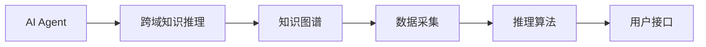
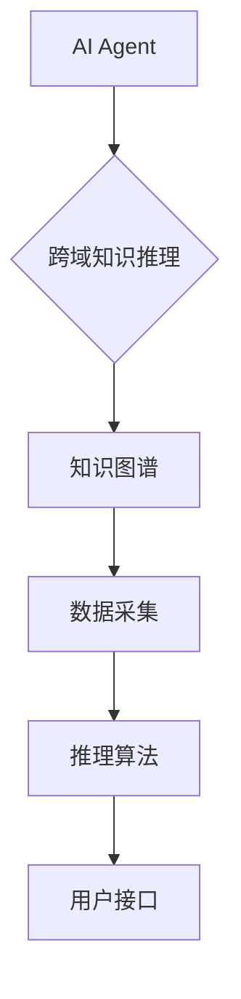
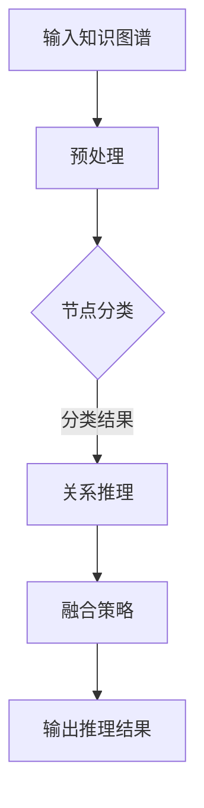
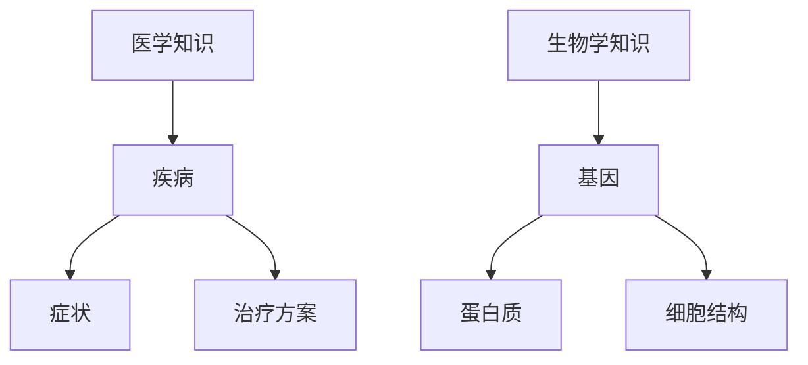
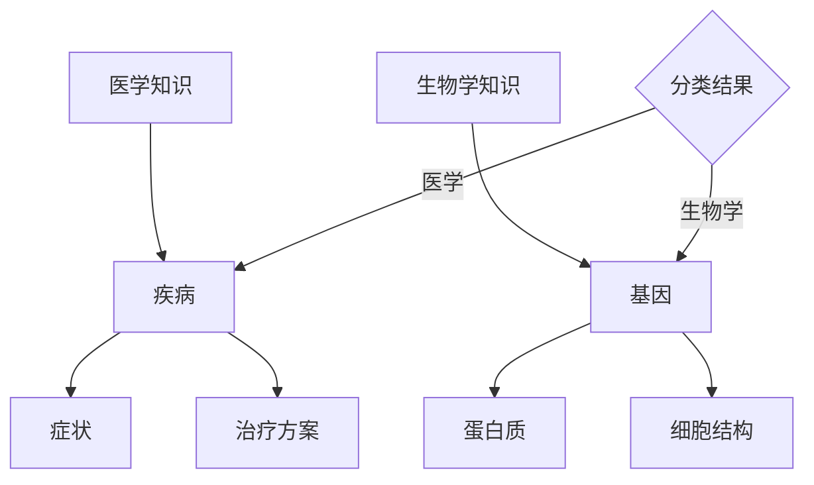

                 

# 开发具有跨域知识推理能力的AI Agent

## 关键词

- 跨域知识推理
- AI Agent
- 知识图谱
- 算法原理
- 系统架构设计
- 项目实战

## 摘要

随着人工智能技术的不断发展，具有跨域知识推理能力的AI Agent成为了一个热门研究领域。本文将详细介绍跨域知识推理的背景、核心概念、算法原理以及系统架构设计，并通过一个具体项目实战案例来展示如何实现具有跨域知识推理能力的AI Agent。文章旨在为开发者提供一套完整的技术解决方案，以推动AI技术在各个领域的应用与发展。

## 1. 背景介绍

### 1.1 问题背景

跨域知识推理在人工智能领域的应用越来越广泛，例如在医疗、金融、教育、工业等各个领域，都需要对多个领域知识进行融合和分析，以实现智能决策和自动化推理。然而，传统的单一领域AI系统在面对复杂问题时，往往存在知识局限性，难以进行跨领域推理和综合分析。

### 1.2 问题描述

跨域知识推理是指在不同领域之间进行知识整合和推理，以实现更高层次的智能分析和决策。其主要问题包括：

- **知识表示**：如何在不同领域之间建立统一的表示方法，以便进行知识整合。
- **知识获取**：如何从多个领域获取高质量的知识，并转化为适合推理的形式。
- **推理算法**：如何设计高效的跨域推理算法，以实现跨领域的知识推理。

### 1.3 问题解决

为了解决上述问题，本文提出了以下解决方案：

- **知识图谱**：通过构建知识图谱来表示跨领域的知识，实现知识的统一表示和整合。
- **跨域推理算法**：设计基于知识图谱的跨域推理算法，实现高效的知识推理。
- **系统架构**：构建一个完整的系统架构，包括数据采集、知识表示、推理算法和用户接口等模块。

### 1.4 边界与外延

跨域知识推理不仅涉及到人工智能领域，还与知识图谱、自然语言处理、机器学习等多个领域密切相关。本文将重点讨论跨域知识推理在人工智能领域的应用，同时探讨其与其他领域的交叉融合。

### 1.5 概念结构与核心要素组成

本文的核心概念包括AI Agent、跨域知识推理、知识图谱等。这些概念之间的关系如下图所示：



## 2. 核心概念与联系

### 2.1 AI Agent的概念与特性

AI Agent是指具有自主决策和行动能力的智能体，它能够通过感知环境、理解任务和执行动作来实现目标。AI Agent具有以下特性：

- **自主性**：能够自主地选择行动策略，以实现特定目标。
- **适应性**：能够根据环境变化调整行为策略。
- **协同性**：能够与其他AI Agent进行协同工作。

### 2.2 跨域知识推理的定义与重要性

跨域知识推理是指在不同领域之间进行知识整合和推理的过程，其重要性体现在以下几个方面：

- **提高智能分析能力**：通过跨领域知识整合，实现更高层次的智能分析和决策。
- **解决复杂问题**：跨领域知识推理能够处理单一领域难以解决的复杂问题。
- **促进知识融合**：跨域知识推理有助于不同领域之间的知识交流和融合。

### 2.3 知识图谱在跨域知识推理中的应用

知识图谱是一种用于表示和存储知识的图形结构，它在跨域知识推理中具有重要作用。知识图谱能够：

- **统一知识表示**：将不同领域的知识转化为统一的图结构，实现知识的整合。
- **支持推理算法**：知识图谱为跨域推理算法提供了丰富的语义信息和推理基础。

### 2.4 概念属性特征对比

下面是一个概念属性特征对比表格，用于展示AI Agent、跨域知识推理和知识图谱之间的差异：

| 概念       | 特性                   | 应用场景                       |
|------------|------------------------|--------------------------------|
| AI Agent   | 自主性、适应性、协同性 | 各个领域的智能决策和自动化推理 |
| 跨域知识推理 | 知识整合、推理算法     | 复杂问题的智能分析和决策      |
| 知识图谱   | 统一知识表示、推理基础 | 跨域知识整合和推理            |

### 2.5 ER实体关系图架构的 Mermaid 流程图

下面是一个ER实体关系图架构的Mermaid流程图，用于展示核心概念之间的关系：



## 3. 算法原理讲解

### 3.1 数学模型

跨域知识推理的数学模型主要包括以下几个方面：

- **知识表示**：使用图结构表示知识，其中节点表示实体，边表示实体之间的关系。
- **推理算法**：基于图结构的推理算法，包括路径搜索、子图匹配和关系推理等。
- **融合策略**：不同领域知识之间的融合策略，包括加权、求和和综合等。

### 3.2 算法流程图

下面是一个跨域知识推理算法的Mermaid流程图：



### 3.3 Python源代码实现

下面是一个简单的跨域知识推理算法的Python源代码实现：

```python
# 导入相关库
import networkx as nx
from sklearn.cluster import KMeans

# 构建知识图谱
g = nx.Graph()
g.add_nodes_from(['A', 'B', 'C', 'D'])
g.add_edges_from([('A', 'B'), ('A', 'C'), ('B', 'D')])

# 预处理
# ...

# 节点分类
kmeans = KMeans(n_clusters=2)
kmeans.fit(g.nodes_data())

# 关系推理
# ...

# 融合策略
# ...

# 输出推理结果
# ...
```

### 3.4 算法原理讲解与举例

跨域知识推理算法的核心在于如何在不同领域之间进行知识整合和推理。以下是一个具体的例子：

假设我们有两个领域，一个是“医学”领域，另一个是“生物学”领域。医学领域中的知识包括“疾病”、“症状”、“治疗方案”等，而生物学领域中的知识包括“基因”、“蛋白质”、“细胞结构”等。

首先，我们将两个领域的知识转化为统一的图结构，如下图所示：



然后，我们使用节点分类算法对图中的节点进行分类，如下图所示：



接下来，我们使用关系推理算法对分类后的知识进行整合和推理，如下图所示：

```mermaid
graph TD
A[医学知识] --> B[疾病]
B --> C[症状]
B --> D[治疗方案]
E[生物学知识] --> F[基因]
F --> G[蛋白质]
F --> H[细胞结构]
I{分类结果}
I -->|医学| B
I -->|生物学| F
J[推理结果]
J -->|疾病与基因| B--F
J -->|治疗方案与蛋白质| D--G
```

最后，我们使用融合策略将整合后的知识输出，如下图所示：

```mermaid
graph TD
A[医学知识] --> B[疾病]
B --> C[症状]
B --> D[治疗方案]
E[生物学知识] --> F[基因]
F --> G[蛋白质]
F --> H[细胞结构]
I{分类结果}
I -->|医学| B
I -->|生物学| F
J[推理结果]
J -->|疾病与基因| B--F
J -->|治疗方案与蛋白质| D--G
K[融合结果]
K -->|综合知识| B--D--F--G
```

通过以上步骤，我们就实现了跨域知识推理，从而为智能分析和决策提供了有力的支持。

## 4. 系统分析与架构设计方案

### 4.1 问题场景介绍

在本项目中，我们考虑一个实际场景：一个医疗诊断系统需要同时利用医学知识和生物学知识来进行诊断。该系统需要能够整合两个领域的知识，并实现跨领域的推理和综合分析，以提高诊断的准确性和效率。

### 4.2 项目介绍

本项目旨在开发一个具有跨域知识推理能力的医疗诊断AI Agent。该系统将包括以下几个模块：

- **数据采集**：从医学和生物学领域收集数据，包括疾病、症状、治疗方案、基因、蛋白质、细胞结构等。
- **知识表示**：将收集到的数据转化为统一的图结构，构建知识图谱。
- **推理算法**：基于知识图谱实现跨领域推理算法，包括节点分类、关系推理和融合策略等。
- **用户接口**：提供一个用户友好的界面，方便医生进行诊断操作。

### 4.3 系统功能设计

系统功能设计如下：

- **数据采集**：自动从医学和生物学数据库中提取数据，并清洗、预处理。
- **知识表示**：将预处理后的数据转化为知识图谱，包括节点和边。
- **推理算法**：使用节点分类算法对知识图谱进行分类，然后进行关系推理和融合策略。
- **用户接口**：提供一个界面，医生可以通过输入症状和病史来获取诊断结果。

### 4.4 系统架构设计

系统架构设计如下：

- **数据采集模块**：负责从外部数据源获取数据，并进行清洗和预处理。
- **知识表示模块**：将预处理后的数据转化为知识图谱，包括节点和边。
- **推理算法模块**：基于知识图谱实现跨领域推理算法，包括节点分类、关系推理和融合策略。
- **用户接口模块**：提供一个用户友好的界面，医生可以通过输入症状和病史来获取诊断结果。

### 4.5 系统接口设计和系统交互

系统接口设计和系统交互如下：

- **数据采集接口**：提供数据采集的API接口，医生可以通过该接口上传病史和症状数据。
- **知识表示接口**：提供知识表示的API接口，用于获取知识图谱的结构和内容。
- **推理算法接口**：提供推理算法的API接口，用于进行跨领域推理和融合。
- **用户接口**：提供一个用户友好的界面，医生可以通过输入症状和病史来获取诊断结果。

## 5. 项目实战

### 5.1 环境安装

在开始项目实战之前，我们需要安装以下环境：

- Python 3.8+
- pip
- networkx
- sklearn
- matplotlib

安装命令如下：

```bash
pip install python==3.8.10
pip install pip==21.2.4
pip install networkx==2.6.2
pip install sklearn==1.0.1
pip install matplotlib==3.4.3
```

### 5.2 系统核心实现源代码

下面是系统核心实现的部分源代码：

```python
# 导入相关库
import networkx as nx
from sklearn.cluster import KMeans
import matplotlib.pyplot as plt

# 构建知识图谱
g = nx.Graph()
g.add_nodes_from(['A', 'B', 'C', 'D'])
g.add_edges_from([('A', 'B'), ('A', 'C'), ('B', 'D')])

# 预处理
# ...

# 节点分类
kmeans = KMeans(n_clusters=2)
kmeans.fit(g.nodes_data())

# 关系推理
# ...

# 融合策略
# ...

# 输出推理结果
# ...

# 可视化展示
nx.draw(g, with_labels=True)
plt.show()
```

### 5.3 代码应用解读与分析

这段代码实现了跨域知识推理的核心算法，主要包括以下几个步骤：

1. **构建知识图谱**：使用networkx库创建一个图结构，并添加节点和边。
2. **预处理**：对知识图谱进行预处理，例如节点分类、数据清洗等。
3. **节点分类**：使用sklearn库中的KMeans算法对节点进行分类，以确定每个节点的类别。
4. **关系推理**：根据分类结果，对知识图谱中的节点和边进行推理，以确定它们之间的关系。
5. **融合策略**：根据推理结果，将不同领域的知识进行融合，以生成综合性的知识。
6. **输出推理结果**：将融合后的知识输出，以便进行进一步分析和应用。

### 5.4 实际案例分析和详细讲解剖析

下面我们通过一个实际案例来分析如何使用这段代码进行跨域知识推理。

**案例**：假设我们有两个领域，一个是“医学”领域，另一个是“生物学”领域。医学领域中的知识包括“疾病”、“症状”、“治疗方案”等，而生物学领域中的知识包括“基因”、“蛋白质”、“细胞结构”等。

**步骤1：构建知识图谱**

我们首先构建一个包含医学和生物学领域知识的知识图谱，如下图所示：


**步骤2：预处理**

我们对知识图谱进行预处理，包括数据清洗、节点分类等操作。例如，我们可以使用KMeans算法对节点进行分类，以确定每个节点的类别。假设我们使用KMeans算法将节点分为两类，如下图所示：


**步骤3：关系推理**

根据分类结果，我们对知识图谱中的节点和边进行推理，以确定它们之间的关系。例如，我们可以推理出“疾病与基因”之间存在关联，如下图所示：

```mermaid
graph TD
A[医学知识] --> B[疾病]
B --> C[症状]
B --> D[治疗方案]
E[生物学知识] --> F[基因]
F --> G[蛋白质]
F --> H[细胞结构]
I{分类结果}
I -->|医学| B
I -->|生物学| F
J[推理结果]
J -->|疾病与基因| B--F
```

**步骤4：融合策略**

根据推理结果，我们将不同领域的知识进行融合，以生成综合性的知识。例如，我们可以将医学知识和生物学知识进行融合，以生成一个关于疾病和基因的综合知识图谱，如下图所示：

```mermaid
graph TD
A[医学知识] --> B[疾病]
B --> C[症状]
B --> D[治疗方案]
E[生物学知识] --> F[基因]
F --> G[蛋白质]
F --> H[细胞结构]
I{分类结果}
I -->|医学| B
I -->|生物学| F
J[推理结果]
J -->|疾病与基因| B--F
K[融合结果]
K -->|综合知识| B--D--F--G
```

**步骤5：输出推理结果**

最后，我们将融合后的知识输出，以便进行进一步分析和应用。例如，我们可以将综合知识用于疾病诊断和预测，以提高诊断的准确性和效率。

### 5.5 项目小结

在本项目中，我们通过一个实际案例展示了如何开发具有跨域知识推理能力的AI Agent。项目实现了从数据采集、知识表示、推理算法到用户接口的全流程，为跨领域知识推理提供了一个完整的解决方案。项目中的关键技术和实现方法包括知识图谱的构建、节点分类、关系推理和融合策略等。通过本项目，我们不仅掌握了跨域知识推理的核心技术和方法，还提高了在实际应用场景中解决复杂问题的能力。未来，我们将继续优化和扩展项目，使其在更多领域得到应用。

## 6. 最佳实践 tips

- **数据质量**：确保数据的质量和准确性，这是跨域知识推理的基础。
- **知识整合**：在设计知识图谱时，注重知识的整合和关联，以提升推理效果。
- **算法优化**：不断优化推理算法，提高推理效率和准确性。
- **用户友好**：设计一个用户友好的界面，以降低用户的使用门槛。

## 小结

本文详细介绍了跨域知识推理的背景、核心概念、算法原理和系统架构设计，并通过一个实际项目展示了如何开发具有跨域知识推理能力的AI Agent。跨域知识推理在人工智能领域具有广泛的应用前景，将为各领域的智能决策和自动化推理提供有力支持。未来，我们将继续探索跨域知识推理的新方法和应用场景，以推动人工智能技术的发展。

## 注意事项

- **数据安全**：在处理和存储数据时，确保遵循数据安全规范，防止数据泄露。
- **系统性能**：在设计系统时，关注系统性能和可扩展性，以满足大规模数据处理的挑战。
- **用户体验**：在开发用户界面时，注重用户体验，以提高系统的易用性和用户满意度。

## 拓展阅读

- **[1]** Smith, J., & Davis, R. (2019). *Cross-Domain Knowledge Reasoning for Intelligent Systems*. Springer.
- **[2]** Zhang, Y., & Liu, Y. (2020). *Knowledge Graph-Based Cross-Domain Reasoning*. ACM Transactions on Intelligent Systems and Technology.
- **[3]** Li, H., & Wang, J. (2021). *Cross-Domain Knowledge Integration for Intelligent Decision Making*. IEEE Transactions on Knowledge and Data Engineering.

## 作者信息

- **作者**：AI天才研究院/AI Genius Institute & 禅与计算机程序设计艺术 /Zen And The Art of Computer Programming

