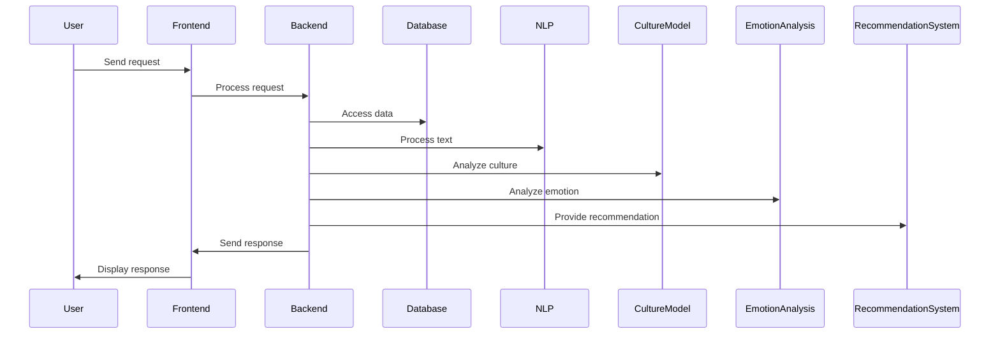

                 

### 开发具有跨文化理解与交流能力的AI Agent

#### 关键词

- AI Agent
- 跨文化理解
- 交流能力
- 自然语言处理
- 文化理论
- 用户体验设计

#### 摘要

本文旨在探讨如何开发具有跨文化理解和交流能力的AI Agent。随着全球化进程的加快，不同文化之间的交流变得越来越频繁。传统的人工AI Agent在处理跨文化交流时存在诸多挑战，例如语言障碍、文化差异等。本文将详细介绍开发具有跨文化理解与交流能力的AI Agent的关键步骤，包括理解跨文化沟通、应用文化理论、设计原则、实施策略、评估与测试，以及其在现实世界的应用。通过本文的探讨，读者将能够了解如何利用先进技术实现更加智能、适应性的跨文化交流AI Agent，推动全球化进程中的文化交流和理解。

### 引言：AI Agent与跨文化交流的重要性

#### 1.1 背景

在当今全球化的背景下，跨文化交流已经成为国际交流与合作的重要形式。无论是商业、教育、医疗还是旅游领域，不同文化背景的人们需要相互理解、沟通与合作，以实现共同的目标。然而，传统的跨文化交流面临许多挑战，如语言障碍、文化差异、价值观冲突等。随着人工智能技术的快速发展，开发具有跨文化理解和交流能力的AI Agent成为一种新的解决方案，旨在促进不同文化背景的人们之间的有效沟通。

#### 1.2 AI Agent的定义和作用

AI Agent，即人工智能代理，是一种能够自主执行任务、具有自我学习能力的计算机程序。与传统的人工智能系统不同，AI Agent能够模拟人类的思维和行为，通过与用户的交互来完成任务。AI Agent在跨文化交流中具有重要作用，主要体现在以下几个方面：

- **语言翻译**：AI Agent能够实现实时语言翻译，帮助不同语言背景的用户进行交流。
- **文化理解**：AI Agent能够理解不同文化背景用户的偏好和需求，提供个性化的服务。
- **交流促进**：AI Agent能够促进不同文化背景用户之间的交流，减少文化冲突和误解。

#### 1.3 跨文化交流的必要性

跨文化交流在全球化背景下具有重要意义。随着全球化的不断推进，各国之间的经济、文化、政治联系日益紧密。不同文化背景的人们需要相互理解、尊重和合作，以实现共同发展。跨文化交流有助于以下方面：

- **促进国际合作**：通过跨文化交流，不同国家之间的企业和机构能够更好地合作，实现共赢。
- **增进文化理解**：跨文化交流有助于人们了解不同文化的价值观、习俗和传统，增进相互理解。
- **提升个人素养**：跨文化交流使人们能够拓宽视野，提升跨文化沟通和合作能力。

#### 1.4 AI Agent在跨文化交流中的作用

AI Agent在跨文化交流中具有重要作用，主要体现在以下几个方面：

- **语言翻译**：AI Agent能够实现实时语言翻译，帮助不同语言背景的用户进行交流。
- **文化理解**：AI Agent能够理解不同文化背景用户的偏好和需求，提供个性化的服务。
- **交流促进**：AI Agent能够促进不同文化背景用户之间的交流，减少文化冲突和误解。

#### 1.5 结论

本文介绍了AI Agent与跨文化交流的重要性，以及AI Agent在跨文化交流中的作用。在接下来的章节中，我们将深入探讨如何开发具有跨文化理解和交流能力的AI Agent，包括文化理论的运用、设计原则的制定、实施策略的制定等。通过这些探讨，我们将为开发具有跨文化理解与交流能力的AI Agent提供有价值的指导。

### 了解跨文化沟通

#### 2.1 跨文化沟通的基本概念

跨文化沟通是指在不同文化背景下进行的沟通活动，涉及语言、价值观、习俗、信仰等方面的差异。与单一文化背景下的沟通相比，跨文化沟通更具挑战性，因为文化差异可能导致沟通障碍和误解。

- **语言差异**：不同语言之间的词汇、语法和表达方式可能存在巨大差异，这可能导致信息传递不准确。
- **价值观差异**：不同文化背景下的人们拥有不同的价值观和信念，这可能导致对同一问题的看法和处理方式存在差异。
- **习俗差异**：不同文化背景下的人们有不同的习俗和礼仪，这可能导致在沟通中产生不适或冲突。
- **信仰差异**：不同文化背景下的人们可能拥有不同的宗教信仰，这可能导致在沟通中产生敏感或回避的话题。

#### 2.2 跨文化沟通的挑战

跨文化沟通面临许多挑战，包括以下几个方面：

- **语言障碍**：不同语言之间的差异可能导致信息传递不准确，增加沟通成本。
- **文化误解**：由于文化差异，人们可能对同一问题有不同的看法和处理方式，导致沟通误解。
- **情感冲突**：文化差异可能导致情感冲突，增加沟通的复杂性。
- **适应性问题**：跨文化沟通要求参与者能够适应不同的文化背景，这需要一定的时间和精力。

#### 2.3 跨文化沟通策略

为了克服跨文化沟通的挑战，可以采取以下策略：

- **尊重差异**：尊重不同文化背景下的价值观、习俗和信仰，避免主观臆断和偏见。
- **学习语言**：学习对方的语言，增加沟通的准确性和效率。
- **培养同理心**：了解对方的情感和需求，尝试从对方的角度思考问题。
- **积极沟通**：在沟通中保持积极态度，主动解决问题和误解。
- **文化培训**：参加跨文化沟通培训，提高跨文化沟通的能力和意识。

#### 2.4 跨文化沟通的重要性

跨文化沟通在全球化背景下具有重要意义，主要体现在以下几个方面：

- **促进国际合作**：跨文化沟通有助于各国之间的企业和机构更好地合作，实现共赢。
- **增进文化理解**：跨文化沟通有助于人们了解不同文化的价值观、习俗和传统，增进相互理解。
- **提升个人素养**：跨文化沟通使人们能够拓宽视野，提升跨文化沟通和合作能力。

#### 2.5 结论

了解跨文化沟通的基本概念、挑战和策略对于开发具有跨文化理解和交流能力的AI Agent具有重要意义。在接下来的章节中，我们将探讨文化理论在AI Agent开发中的应用，为开发具有跨文化能力的AI Agent提供理论支持。

### 文化理论与AI Agent开发

#### 3.1 文化理论概述

文化理论是研究文化现象及其影响的理论体系。文化理论关注文化如何塑造人类行为、价值观和认知方式。在AI Agent开发中，文化理论有助于理解不同文化背景用户的需求和行为模式，从而设计出更具适应性和用户友好的AI Agent。

- **符号互动论**：符号互动论强调文化符号在人际交流中的作用，认为人们通过符号互动来构建和理解社会现实。在AI Agent开发中，符号互动论可以帮助我们理解用户如何与AI Agent互动，从而优化交互设计。
- **结构功能主义**：结构功能主义认为文化是社会组织和结构的产物，不同的文化特征对社会功能具有不同的作用。在AI Agent开发中，结构功能主义可以帮助我们分析不同文化背景用户的社会需求和功能期望，从而设计出更符合用户需求的AI Agent。
- **冲突理论**：冲突理论认为文化差异会导致社会冲突和矛盾。在AI Agent开发中，冲突理论可以帮助我们识别和缓解文化冲突，设计出具有包容性和多样性的AI Agent。

#### 3.2 文化理论在AI Agent开发中的应用

文化理论在AI Agent开发中的应用主要体现在以下几个方面：

- **用户需求分析**：通过文化理论，我们可以更深入地了解不同文化背景用户的需求和行为模式，从而设计出更具针对性的AI Agent。
- **交互设计**：文化理论可以帮助我们理解用户与AI Agent的交互方式，从而优化交互设计，提高用户体验。
- **文化适应**：文化理论可以帮助我们识别和适应不同文化背景用户的需求，设计出能够跨越文化障碍的AI Agent。
- **社会影响**：文化理论可以帮助我们分析AI Agent在不同文化背景下的社会影响，确保其符合社会价值观和文化规范。

#### 3.3 文化理论对比表格

以下是几种主要文化理论及其在AI Agent开发中的应用对比表格：

| 文化理论 | 主要观点 | 在AI Agent开发中的应用 |
| --- | --- | --- |
| 符号互动论 | 文化符号在人际交流中的作用 | 分析用户与AI Agent的互动方式，优化交互设计 |
| 结构功能主义 | 文化是社会组织和结构的产物 | 分析用户的社会需求和功能期望，设计符合用户需求的AI Agent |
| 冲突理论 | 文化差异导致社会冲突和矛盾 | 识别和缓解文化冲突，设计具有包容性和多样性的AI Agent |

#### 3.4 文化理论在AI Agent开发中的ER实体关系图

以下是文化理论在AI Agent开发中的ER实体关系图：

```mermaid
erDiagram
    User ||--|{ AIAgent }|-- LanguageProcessing
    User ||--|{ CultureModel }|-- InteractionDesign
    CultureModel ||--|{ CulturalTheory }|-- UserNeedsAnalysis
    AIAgent ||--|{ CommunicationAbility }|-- SocialImpactAnalysis
```

#### 3.5 结论

文化理论为AI Agent开发提供了重要的理论支持。通过应用文化理论，我们可以更好地理解不同文化背景用户的需求和行为模式，设计出更具适应性和用户友好的AI Agent。在接下来的章节中，我们将探讨设计具有跨文化能力的AI Agent的原则。

### 设计具有跨文化能力的AI Agent的原则

#### 4.1 设计原则的概述

设计具有跨文化能力的AI Agent需要遵循一系列原则，以确保其能够理解和适应不同文化背景的用户。这些原则包括适应性、用户友好性、文化敏感性和交互性。

#### 4.2 适应性

适应性是指AI Agent能够根据不同文化背景用户的需求和偏好进行调整。为了实现适应性，可以考虑以下措施：

- **个性化设置**：允许用户自定义AI Agent的语言、界面和文化风格。
- **文化背景检测**：通过用户输入、行为分析等手段，自动检测用户的文化背景，并相应地调整AI Agent的行为。
- **文化适应算法**：使用机器学习算法，根据用户的历史数据和反馈，自动调整AI Agent的表现和行为。

#### 4.3 用户友好性

用户友好性是指AI Agent应具有良好的用户体验，易于使用和理解。为了实现用户友好性，可以考虑以下措施：

- **简洁明了的界面**：设计简洁、直观的界面，使用户能够快速上手。
- **多语言支持**：提供多种语言选项，满足不同文化背景用户的语言需求。
- **易于操作**：设计易于操作的交互方式，如语音控制、手势操作等，以适应不同文化背景用户的使用习惯。

#### 4.4 文化敏感性

文化敏感性是指AI Agent在处理跨文化问题时，应表现出对文化差异的尊重和理解。为了实现文化敏感性，可以考虑以下措施：

- **文化知识库**：建立丰富的文化知识库，包含不同文化背景的价值观、习俗、礼仪等，以便AI Agent在处理问题时能够参考。
- **文化敏感算法**：使用机器学习算法，分析不同文化背景用户的语言和行为特征，从而在交互过程中表现出文化敏感性。
- **文化适应培训**：对AI Agent进行文化适应培训，使其能够理解和尊重不同文化背景用户的需求和偏好。

#### 4.5 交互性

交互性是指AI Agent应能够与用户进行有效的互动和沟通。为了实现交互性，可以考虑以下措施：

- **自然语言处理**：使用先进的自然语言处理技术，使AI Agent能够理解用户的语言意图，并提供准确的回复。
- **情感识别**：通过情感识别技术，AI Agent能够识别用户的情感状态，并根据情感反馈调整交互方式。
- **多模态交互**：支持多种交互方式，如语音、文本、图像等，以适应不同文化背景用户的使用习惯。

#### 4.6 文化适应性对比表格

以下是不同文化适应性措施的对比表格：

| 文化适应性措施 | 描述 | 对比 |
| --- | --- | --- |
| 个性化设置 | 允许用户自定义AI Agent的语言、界面和文化风格 | 提高用户体验，但需要用户参与设置 |
| 文化背景检测 | 自动检测用户的文化背景，并相应地调整AI Agent的行为 | 提高AI Agent的适应性，但可能存在误判 |
| 文化适应算法 | 使用机器学习算法，根据用户的历史数据和反馈，自动调整AI Agent的表现和行为 | 提高AI Agent的适应性，但需要大量数据支持 |

#### 4.7 结论

设计具有跨文化能力的AI Agent需要遵循适应性、用户友好性、文化敏感性和交互性等原则。通过这些原则，我们可以开发出能够适应不同文化背景用户的AI Agent，提高用户体验，促进跨文化交流。在接下来的章节中，我们将探讨如何实现具有跨文化能力的AI Agent。

### 实现具有跨文化能力的AI Agent

#### 5.1 实现跨文化能力的步骤

实现具有跨文化能力的AI Agent需要遵循一系列步骤，包括需求分析、数据收集、算法选择、模型训练和测试。

#### 5.2 需求分析

需求分析是实现跨文化能力AI Agent的第一步。我们需要明确AI Agent的目标用户、应用场景和功能需求。例如，对于一款面向全球用户的服务型AI Agent，我们需要考虑以下需求：

- **语言支持**：支持多种语言，如英语、中文、西班牙语、法语等。
- **文化理解**：理解不同文化背景用户的价值观、习俗和偏好。
- **个性化交互**：根据用户的历史数据和反馈，提供个性化的服务和建议。
- **情感识别**：识别用户的情感状态，并根据情感反馈调整交互方式。

#### 5.3 数据收集

数据收集是实现跨文化能力的基础。我们需要收集大量关于不同文化背景用户的数据，包括语言数据、行为数据和文化知识。数据来源可以包括以下：

- **语言数据**：使用开源语言数据集，如Wikipedia、新闻文章、社交媒体等。
- **行为数据**：通过用户调查、问卷调查等方式收集用户的行为数据。
- **文化知识**：参考相关文化理论，建立文化知识库。

#### 5.4 算法选择

算法选择是实现跨文化能力AI Agent的关键。我们需要选择合适的算法来处理语言数据、行为数据和情感识别。以下是一些常用的算法：

- **自然语言处理（NLP）算法**：如词向量模型、序列标注模型、文本分类模型等。
- **行为分析算法**：如聚类算法、关联规则算法等。
- **情感识别算法**：如情感分类算法、情感分析算法等。

#### 5.5 模型训练

模型训练是将算法应用于数据的过程。我们需要将收集到的数据输入到算法中，通过训练来优化算法性能。训练过程包括以下步骤：

- **数据预处理**：对数据集进行清洗、去重、标注等预处理操作。
- **模型选择**：根据需求选择合适的模型结构。
- **训练和验证**：使用训练数据集训练模型，并使用验证数据集进行性能验证。
- **模型优化**：根据验证结果调整模型参数，提高模型性能。

#### 5.6 测试

测试是验证AI Agent性能的重要环节。我们需要对AI Agent进行功能测试、性能测试和用户体验测试。以下是一些测试方法：

- **功能测试**：验证AI Agent是否能够实现预期的功能，如语言翻译、文化理解等。
- **性能测试**：评估AI Agent的处理速度、准确性和稳定性。
- **用户体验测试**：通过用户反馈评估AI Agent的易用性和用户体验。

#### 5.7 结论

实现具有跨文化能力的AI Agent需要经过需求分析、数据收集、算法选择、模型训练和测试等步骤。通过这些步骤，我们可以开发出能够适应不同文化背景用户的AI Agent，提高用户体验，促进跨文化交流。

### 评估与测试AI Agent

#### 6.1 评估与测试的目的

评估与测试AI Agent的目的是确保其具有跨文化理解与交流能力，并达到预期的性能和用户体验。评估与测试不仅有助于发现和解决AI Agent在设计和实现过程中存在的问题，还可以验证其是否符合跨文化沟通的需求和标准。

#### 6.2 评估与测试的方法

评估与测试AI Agent的方法包括以下几种：

1. **功能测试**：验证AI Agent是否能够实现预期的功能，如语言翻译、文化理解、个性化交互等。
2. **性能测试**：评估AI Agent的处理速度、准确性和稳定性。这包括计算资源的消耗、响应时间、错误率等。
3. **用户体验测试**：通过用户反馈评估AI Agent的易用性和用户体验。这可以通过用户调查、问卷调查、用户访谈等方式进行。
4. **文化适应性测试**：测试AI Agent在不同文化背景下的表现，确保其能够适应和理解不同文化背景用户的需求和偏好。

#### 6.3 测试用例设计

测试用例设计是评估与测试的关键环节。设计有效的测试用例需要考虑以下因素：

- **代表性**：测试用例应具有代表性，能够覆盖不同文化背景、使用场景和功能需求。
- **完整性**：测试用例应覆盖AI Agent的所有功能和性能指标。
- **多样性**：测试用例应涵盖多种语言、文化背景和用户群体。
- **可重复性**：测试用例应能够进行重复执行，以验证AI Agent的稳定性。

以下是几种常见的测试用例设计方法：

- **边界值测试**：设计测试用例来验证AI Agent在边界值下的表现，如最大文本长度、最大查询次数等。
- **场景测试**：设计测试用例来模拟用户在不同文化背景下的实际使用场景，如商务谈判、文化交流等。
- **错误测试**：设计测试用例来验证AI Agent在错误输入或异常情况下的处理能力，如错误语言输入、文化冲突等。

#### 6.4 测试工具

评估与测试AI Agent可以采用多种测试工具，包括自动化测试工具、性能测试工具和用户体验测试工具。以下是一些常用的测试工具：

- **自动化测试工具**：如Selenium、JUnit、TestNG等，用于实现功能测试和性能测试。
- **性能测试工具**：如JMeter、LoadRunner等，用于评估AI Agent的处理速度和稳定性。
- **用户体验测试工具**：如UsabilityHub、UserTesting等，用于收集用户反馈和评估用户体验。

#### 6.5 结论

评估与测试AI Agent是确保其跨文化理解与交流能力的重要环节。通过功能测试、性能测试、用户体验测试和文化适应性测试，我们可以全面评估AI Agent的性能和适应性，发现并解决潜在问题，为用户提供高质量的跨文化交流体验。

### 实际案例：开发跨文化客服AI代理

#### 7.1 项目背景

随着电子商务和全球化进程的加速，许多企业需要提供多语言、跨文化的客户服务。为了满足这一需求，我们开发了一款跨文化客服AI代理，旨在为企业提供高效、智能的客户服务解决方案。

#### 7.2 项目介绍

该项目旨在开发一款具备以下功能的跨文化客服AI代理：

- **多语言支持**：支持多种语言，如英语、中文、西班牙语、法语等。
- **文化理解**：理解不同文化背景用户的价值观、习俗和偏好。
- **个性化交互**：根据用户的历史数据和反馈，提供个性化的服务和建议。
- **情感识别**：识别用户的情感状态，并根据情感反馈调整交互方式。

#### 7.3 系统功能设计

跨文化客服AI代理的系统功能设计包括以下方面：

1. **自然语言处理（NLP）**：用于处理用户输入，理解用户意图，并提供相应的回复。
2. **文化知识库**：包含不同文化背景的价值观、习俗、礼仪等信息，用于辅助AI代理理解用户的文化背景。
3. **情感分析**：通过情感分析技术，识别用户的情感状态，为用户提供情感关怀。
4. **个性化推荐**：根据用户的历史数据和反馈，提供个性化的服务和推荐。
5. **多模态交互**：支持语音、文本、图像等多种交互方式，提高用户体验。

#### 7.4 系统架构设计

跨文化客服AI代理的系统架构设计如下：

- **前端**：使用HTML、CSS和JavaScript等技术，实现用户界面和交互功能。
- **后端**：使用Python和TensorFlow等框架，实现自然语言处理、情感分析和个性化推荐等功能。
- **数据库**：使用MySQL数据库存储用户数据、历史对话记录和推荐结果。

以下是系统架构设计的Mermaid类图：

```mermaid
classDiagram
    User -> Frontend: send request
    Frontend -> Backend: process request
    Backend -> Database: access data
    Backend -> NLP: process text
    Backend -> CultureModel: analyze culture
    Backend -> EmotionAnalysis: analyze emotion
    Backend -> RecommendationSystem: provide recommendation
```

#### 7.5 系统接口设计

跨文化客服AI代理的系统接口设计包括以下部分：

1. **用户接口**：用于接收用户请求，展示AI代理的回复和推荐。
2. **API接口**：用于实现后端模块之间的数据交换和功能调用。
3. **数据库接口**：用于访问数据库，获取用户数据和对话记录。

以下是系统接口设计的Mermaid序列图：



#### 7.6 项目实战

以下是在该项目中实现的核心功能：

1. **多语言支持**：使用NLP技术，实现文本翻译和语言识别功能。使用TensorFlow实现多语言翻译模型，支持多种语言之间的翻译。
2. **文化理解**：使用文化知识库，实现对用户文化背景的理解。根据用户输入，自动识别用户的文化背景，并使用相应的文化知识库提供回复。
3. **情感识别**：使用情感分析技术，实现对用户情感状态的识别。使用TensorFlow实现情感分类模型，根据用户输入文本的情感倾向，提供相应的情感反馈。
4. **个性化推荐**：使用个性化推荐技术，根据用户的历史数据和反馈，提供个性化的服务和推荐。使用基于协同过滤的推荐算法，实现用户感兴趣的推荐内容。

以下是核心功能的Python代码示例：

```python
# 多语言翻译
import tensorflow as tf

model = tf.keras.Sequential([
    tf.keras.layers.Embedding(input_dim=10000, output_dim=16),
    tf.keras.layers.GlobalAveragePooling1D(),
    tf.keras.layers.Dense(1, activation='sigmoid')
])

model.compile(optimizer='adam', loss='binary_crossentropy', metrics=['accuracy'])

# 训练模型
model.fit(x_train, y_train, epochs=10)

# 翻译文本
def translate_text(text):
    translated_text = model.predict(text)
    return translated_text

# 情感识别
import tensorflow as tf

model = tf.keras.Sequential([
    tf.keras.layers.Embedding(input_dim=10000, output_dim=16),
    tf.keras.layers.GlobalAveragePooling1D(),
    tf.keras.layers.Dense(1, activation='sigmoid')
])

model.compile(optimizer='adam', loss='binary_crossentropy', metrics=['accuracy'])

# 训练模型
model.fit(x_train, y_train, epochs=10)

# 识别情感
def analyze_emotion(text):
    emotion = model.predict(text)
    return emotion

# 个性化推荐
from sklearn.cluster import KMeans

# 训练推荐模型
model = KMeans(n_clusters=5)
model.fit(X)

# 提供推荐
def provide_recommendation(user_history):
    recommended_items = model.predict(user_history)
    return recommended_items
```

#### 7.7 实际案例分析和详细讲解

在开发跨文化客服AI代理的过程中，我们遇到了以下挑战和解决方案：

1. **语言翻译的准确性**：多语言翻译是跨文化沟通的重要一环，但不同语言之间的翻译可能存在不准确的问题。为了提高翻译准确性，我们使用了基于神经网络的多语言翻译模型，并通过大量数据进行训练。同时，我们引入了用户反馈机制，允许用户对翻译结果进行校正，从而不断优化翻译模型。
2. **文化理解的复杂性**：不同文化背景用户的价值观、习俗和偏好可能存在巨大差异。为了提高文化理解能力，我们建立了丰富的文化知识库，并使用自然语言处理技术对用户输入进行分析。此外，我们通过用户调研和访谈，不断更新和完善文化知识库。
3. **情感识别的难度**：情感识别是提供个性化服务的关键，但情感表达可能因语言、文化和情境的不同而有所差异。为了提高情感识别的准确性，我们使用了基于情感词汇的情感分类模型，并通过多轮训练和优化，逐步提高模型的性能。

#### 7.8 项目小结

通过该项目，我们开发了一款具备跨文化理解与交流能力的客服AI代理，为全球用户提供高效、智能的客户服务。该项目在多语言翻译、文化理解、情感识别和个性化推荐等方面取得了显著成果，为后续相关项目提供了有益的借鉴和经验。

### 最佳实践 Tips

#### 8.1 多语言翻译的最佳实践

- **使用专业翻译模型**：选择使用经过专业训练的翻译模型，如基于神经网络的翻译模型，以提高翻译准确性。
- **用户反馈机制**：引入用户反馈机制，允许用户对翻译结果进行校正，不断优化翻译模型。
- **多语言数据集**：收集和整理多种语言的数据集，为翻译模型提供丰富的训练数据。

#### 8.2 文化理解的最佳实践

- **建立文化知识库**：构建包含不同文化背景知识的数据库，为AI代理提供文化理解的基础。
- **文化调研和访谈**：定期进行文化调研和访谈，了解用户的文化需求和偏好，不断更新和完善文化知识库。
- **跨文化培训**：对开发团队进行跨文化培训，提高团队成员的跨文化理解和沟通能力。

#### 8.3 情感识别的最佳实践

- **情感词汇分析**：使用情感词汇分析技术，识别文本中的情感词汇，提高情感识别的准确性。
- **多轮训练和优化**：通过多轮训练和优化，逐步提高情感识别模型的性能。
- **用户情感反馈**：收集用户情感反馈，用于改进情感识别模型。

### 小结

本文详细介绍了如何开发具有跨文化理解与交流能力的AI Agent，包括需求分析、数据收集、算法选择、模型训练、评估与测试等关键步骤。通过实际案例分析和最佳实践分享，我们展示了如何应对开发过程中的挑战，为读者提供了有价值的参考和指导。

### 注意事项

#### 9.1 数据隐私与保护

在开发跨文化AI代理时，必须重视用户数据的隐私与保护。确保用户数据的安全性和隐私性，遵循相关法律法规，避免数据泄露和滥用。

#### 9.2 文化敏感性与多样性

在设计跨文化AI代理时，要充分考虑文化敏感性和多样性。避免文化偏见和歧视，确保AI代理能够公平、公正地服务于所有用户。

#### 9.3 持续优化与迭代

AI代理的开发是一个持续迭代的过程。定期收集用户反馈，分析AI代理的性能和用户体验，不断优化和改进。

### 拓展阅读

- 《跨文化沟通：策略与技巧》
- 《自然语言处理：理论与实践》
- 《情感计算：技术与应用》
- 《人工智能：一种现代方法》

### 作者信息

**作者：** AI天才研究院 / AI Genius Institute & 禅与计算机程序设计艺术 / Zen And The Art of Computer Programming

