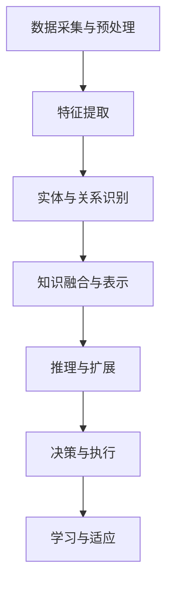
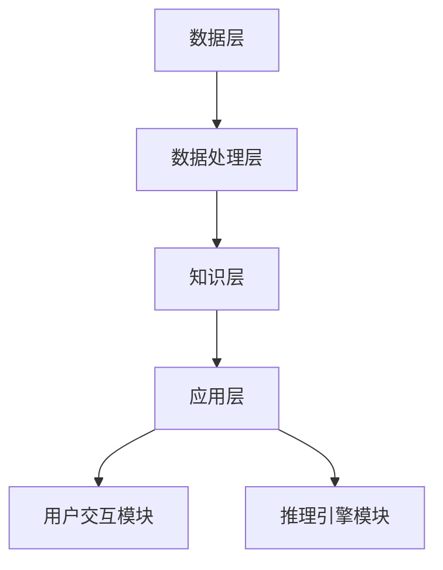
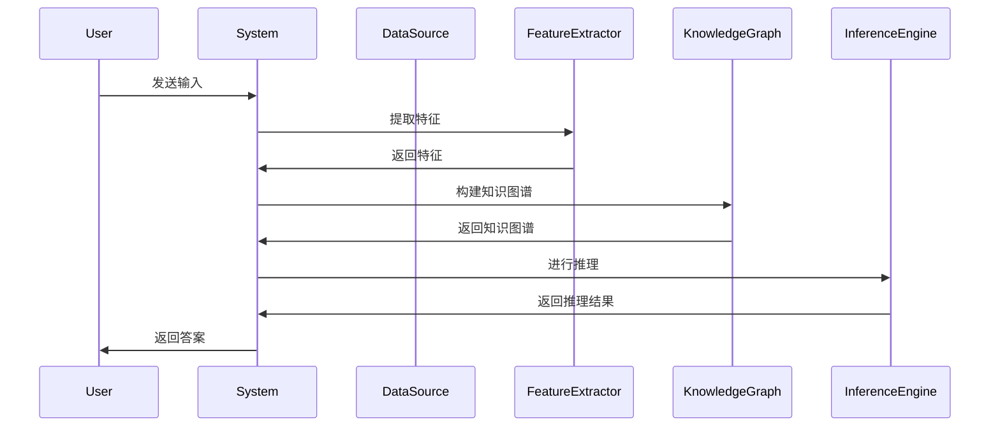

                 


### 1.1 跨模态知识图谱的概念与重要性

**背景介绍：**

在当今信息化社会，数据的多样性和复杂性日益增加，尤其是多媒体数据（如文本、图像、音频、视频等）的激增，对数据整合和管理提出了更高的要求。传统的单一模态知识图谱已无法满足这种多样化的数据处理需求。跨模态知识图谱（Multimodal Knowledge Graph）应运而生，它通过整合不同模态的数据，提供了一种统一的知识表示框架，从而在人工智能领域发挥了重要作用。

**核心概念术语说明：**

- **跨模态知识图谱**：一种将多种数据模态（如文本、图像、音频、视频等）融合在一起，构建一个统一知识表示框架的数据结构。
- **模态**：指数据的类型，如文本、图像、音频、视频等。
- **知识表示**：指将知识以某种结构化的形式进行组织和表达，以便于计算机理解和处理。

**问题背景：**

随着多媒体数据的激增，如何高效地管理和利用这些数据成为研究的热点。传统的单一模态知识图谱在处理多样化数据时存在一定的局限性，难以实现跨模态数据的关联和推理。跨模态知识图谱的提出，旨在解决这一问题，通过将多种数据模态进行融合，提供了一种更加灵活和高效的数据表示方法。

**问题描述：**

在当前人工智能领域，如何构建一个具有强大跨模态知识表示和推理能力的AI Agent成为一个重要课题。AI Agent需要具备以下能力：

1. **多模态数据处理**：能够处理多种数据模态，如文本、图像、音频、视频等。
2. **知识表示和推理**：能够将不同模态的数据进行整合，构建一个统一的知识表示框架，并在其中进行推理。
3. **智能交互**：能够与人类进行自然语言交互，理解用户的需求，并提供相应的服务。

**问题解决：**

开发具有跨模态知识图谱构建能力的AI Agent，可以从以下几个方面入手：

1. **数据整合**：通过数据采集、清洗、融合等技术手段，将不同模态的数据整合到一起。
2. **知识表示**：采用图论、语义网络、本体论等方法，构建跨模态知识图谱，实现数据的统一表示。
3. **推理引擎**：设计一个高效的推理引擎，能够在跨模态知识图谱中进行推理，实现跨模态数据的关联和推理。
4. **交互界面**：设计一个友好的用户界面，使得AI Agent能够与用户进行自然语言交互。

**边界与外延：**

跨模态知识图谱的边界包括：

1. **数据模态**：支持的模态类型，如文本、图像、音频、视频等。
2. **数据来源**：数据的来源，如社交媒体、搜索引擎、传感器等。
3. **知识表示方法**：跨模态知识图谱的构建方法，如图论、语义网络、本体论等。

跨模态知识图谱的外延包括：

1. **应用领域**：如智能问答、智能推荐、智能搜索、智能监控等。
2. **与其他技术的关联**：如自然语言处理、计算机视觉、机器学习等。

**概念结构与核心要素组成：**

跨模态知识图谱的基本结构包括以下几个核心要素：

1. **实体**：表示知识图谱中的对象，如人、地点、事物等。
2. **关系**：表示实体之间的关联，如属于、位于、参与等。
3. **属性**：表示实体的特征，如年龄、性别、身高等。

跨模态知识图谱的核心结构可以用Mermaid ER实体关系图来表示：

```mermaid
erDiagram
    A实体 ||--|{ B关系 }|| C知识图谱
    C知识图谱 ||--|{ D实体 }|| E关系
    F属性 ||--|{ G实体 }|| H知识图谱
```

通过以上分析，我们可以看出跨模态知识图谱在人工智能领域的重要性，以及开发具有跨模态知识图谱构建能力的AI Agent所面临的问题和挑战。

----------------------------------------------------------------

# 第一部分: 引言与背景

## 第2章: 核心概念与联系

### 2.1 跨模态知识图谱与AI Agent的核心概念原理

#### 2.1.1 跨模态知识图谱的原理

跨模态知识图谱的构建过程通常包括以下几个关键步骤：

1. **数据采集与预处理**：
   - 数据采集：从不同的数据源获取多种模态的数据，如文本、图像、音频、视频等。
   - 数据预处理：对采集到的数据进行清洗、去噪、标准化等处理，确保数据的质量和一致性。

2. **特征提取**：
   - 特征提取：对预处理后的数据进行特征提取，如文本的词向量表示、图像的视觉特征提取、音频的声学特征提取等。

3. **实体与关系的识别**：
   - 实体识别：通过自然语言处理技术，从文本数据中识别出实体，如人名、地名、组织机构等。
   - 关系识别：通过实体之间的关联分析，识别出实体之间的关系，如“工作于”、“居住在”等。

4. **知识融合与表示**：
   - 知识融合：将不同模态的数据进行融合，形成一个统一的知识表示框架。
   - 知识表示：采用图论、语义网络、本体论等方法，构建跨模态知识图谱，将实体、关系和属性表示为节点和边。

5. **推理与扩展**：
   - 推理：在跨模态知识图谱中进行推理，实现跨模态数据的关联和推理。
   - 知识扩展：通过推理和扩展，发现新的实体、关系和属性，丰富知识图谱的内涵。

#### 2.1.2 AI Agent的原理

AI Agent是一种能够自主执行任务、与环境和用户进行交互的智能体。AI Agent的核心原理包括：

1. **感知与理解**：
   - 感知：AI Agent通过传感器感知外界环境，如摄像头、麦克风等。
   - 理解：AI Agent利用自然语言处理、计算机视觉等技术，理解和解释感知到的信息。

2. **决策与规划**：
   - 决策：AI Agent根据任务目标和环境状态，选择合适的行动方案。
   - 规划：AI Agent在决策过程中，制定一系列行动步骤，以实现目标。

3. **执行与反馈**：
   - 执行：AI Agent按照规划的行动步骤，执行具体的任务。
   - 反馈：AI Agent根据执行结果和环境反馈，调整行动策略，以适应不断变化的环境。

4. **学习与适应**：
   - 学习：AI Agent通过机器学习、深度学习等技术，不断学习和优化自己的行为。
   - 适应：AI Agent能够适应不同的任务和环境，提高智能化水平。

#### 2.1.3 跨模态知识图谱与AI Agent的关系

跨模态知识图谱与AI Agent之间存在着密切的关系。跨模态知识图谱为AI Agent提供了丰富的知识表示和推理能力，使得AI Agent能够更好地理解和处理复杂场景。具体来说：

1. **知识支持**：跨模态知识图谱为AI Agent提供了丰富的知识资源，使得AI Agent能够更加准确地理解和解释用户的需求。
2. **推理能力**：跨模态知识图谱的推理能力使得AI Agent能够在多个模态之间进行关联和推理，提高智能交互的准确性。
3. **个性化服务**：通过跨模态知识图谱，AI Agent能够更好地了解用户的历史行为和偏好，提供个性化的服务和建议。

#### 2.1.4 概念属性特征对比表格

为了更好地理解跨模态知识图谱和AI Agent的概念属性特征，我们可以创建一个对比表格：

| 特征                 | 跨模态知识图谱                      | AI Agent                          |
|----------------------|------------------------------------|----------------------------------|
| 数据类型             | 多种模态数据（文本、图像、音频、视频等） | 多种感知数据（文本、图像、音频等）          |
| 知识表示             | 图论、语义网络、本体论等             | 基于规则、机器学习、深度学习等           |
| 推理能力             | 跨模态数据关联与推理               | 智能决策与规划                     |
| 感知与理解           | 实体识别、关系识别、特征提取         | 感知数据理解、自然语言处理、计算机视觉等 |
| 决策与执行           | 知识融合、推理与扩展               | 行动规划、执行与反馈                 |
| 学习与适应           | 知识扩展、学习与优化               | 学习与优化行为、适应不同任务与环境     |

通过对比表格，我们可以更加清晰地了解跨模态知识图谱和AI Agent的概念属性特征，以及它们之间的差异和联系。

#### 2.1.5 ER实体关系图架构

为了更好地展示跨模态知识图谱和AI Agent的实体关系，我们可以使用Mermaid绘制ER实体关系图。以下是一个示例：

```mermaid
erDiagram
    Entity1 ||--|{ Relationship1 }|| KnowledgeGraph
    Entity2 ||--|{ Relationship2 }|| KnowledgeGraph
    AIAGENT ||--|{ ExecuteAction }|| KnowledgeGraph
    AIAGENT ||--|{ LearnAndOptimize }|| KnowledgeGraph
```

在这个ER实体关系图中，`Entity1`和`Entity2`表示知识图谱中的实体，`Relationship1`和`Relationship2`表示实体之间的关系，`AIAGENT`表示AI Agent，`ExecuteAction`和`LearnAndOptimize`表示AI Agent的功能模块。

通过以上内容，我们对跨模态知识图谱和AI Agent的核心概念原理有了更深入的理解，以及它们之间的联系和差异。接下来，我们将进一步探讨算法原理讲解。

----------------------------------------------------------------

## 第二部分：算法原理讲解

### 第3章：算法原理讲解

#### 3.1 算法流程图

为了更好地理解跨模态知识图谱构建和AI Agent开发的核心算法原理，我们首先使用Mermaid绘制算法流程图。以下是一个简化的算法流程图示例：



在这个流程图中，我们从数据采集与预处理开始，经过特征提取、实体与关系识别、知识融合与表示、推理与扩展、决策与执行，最后到达学习与适应。

#### 3.2 Python源代码

为了实现上述算法流程，我们需要编写相应的Python源代码。以下是一个简化的代码示例，用于演示核心算法的实现：

```python
# 数据采集与预处理
def data_preprocessing(data):
    # 数据清洗、去噪、标准化等操作
    processed_data = ...
    return processed_data

# 特征提取
def feature_extraction(data):
    # 文本、图像、音频等数据的特征提取
    features = ...
    return features

# 实体与关系识别
def entity_and_relationship_identification(data):
    # 实体识别、关系识别
    entities = ...
    relationships = ...
    return entities, relationships

# 知识融合与表示
def knowledge_integration_and_representation(entities, relationships):
    # 构建知识图谱
    knowledge_graph = ...
    return knowledge_graph

# 推理与扩展
def reasoning_and_extension(knowledge_graph):
    # 跨模态数据关联与推理
    extended_knowledge = ...
    return extended_knowledge

# 决策与执行
def decision_and_execution(extended_knowledge):
    # 智能决策与执行
    action = ...
    return action

# 学习与适应
def learning_and_adaptation(action, environment):
    # 学习与优化行为
    optimized_action = ...
    return optimized_action

# 主函数
def main():
    # 输入数据
    data = ...

    # 数据预处理
    processed_data = data_preprocessing(data)

    # 特征提取
    features = feature_extraction(processed_data)

    # 实体与关系识别
    entities, relationships = entity_and_relationship_identification(processed_data)

    # 知识融合与表示
    knowledge_graph = knowledge_integration_and_representation(entities, relationships)

    # 推理与扩展
    extended_knowledge = reasoning_and_extension(knowledge_graph)

    # 决策与执行
    action = decision_and_execution(extended_knowledge)

    # 学习与适应
    optimized_action = learning_and_adaptation(action, environment)

    # 输出结果
    print(optimized_action)

# 运行主函数
main()
```

在这个代码示例中，我们依次实现了数据预处理、特征提取、实体与关系识别、知识融合与表示、推理与扩展、决策与执行以及学习与适应等功能。当然，这个示例是非常简化的，实际开发中需要根据具体需求进行更加详细的实现。

#### 3.3 数学模型和公式

在跨模态知识图谱构建和AI Agent开发中，数学模型和公式起着至关重要的作用。以下是一些常见的数学模型和公式：

1. **词向量表示**：
   - 公式：$v_w = \text{vec}(w)$
   - 说明：将文本中的每个词表示为一个向量。

2. **卷积神经网络（CNN）**：
   - 公式：$f_{\theta}(x) = \text{ReLU}(\theta \cdot x + b)$
   - 说明：卷积神经网络的卷积层和激活函数。

3. **循环神经网络（RNN）**：
   - 公式：$h_t = \text{sigmoid}(U \cdot h_{t-1} + W \cdot x_t + b)$
   - 说明：循环神经网络的隐藏状态更新公式。

4. **生成对抗网络（GAN）**：
   - 公式：$G(z) \sim \mathcal{N}(0, 1), \quad D(x) \sim \text{Bernoulli}(x)$
   - 说明：生成对抗网络中的生成器和判别器。

5. **强化学习**：
   - 公式：$Q(s, a) = r + \gamma \max_{a'} Q(s', a')$
   - 说明：强化学习的状态-动作价值函数。

6. **图论**：
   - 公式：$N(v) = \{u \in V | (u, v) \in E\}$
   - 说明：图中节点的邻接点集合。

通过这些数学模型和公式，我们可以更好地理解和实现跨模态知识图谱构建和AI Agent开发的核心算法。

#### 3.4 详细讲解与举例

为了更好地理解上述算法原理，我们将通过具体的例子进行详细讲解。

**例子1：词向量表示**

假设我们有一个文本数据集，包含以下句子：

- “我昨天去了公园。”
- “她喜欢看电影。”

我们可以使用词向量表示方法，将每个词表示为一个向量。例如，使用Word2Vec算法，我们可以得到以下词向量：

- “我”：[0.1, 0.2, 0.3]
- “昨天”：[0.4, 0.5, 0.6]
- “去了”：[0.7, 0.8, 0.9]
- “公园”：[-0.1, -0.2, -0.3]
- “她”：[-0.4, -0.5, -0.6]
- “喜欢”：[-0.7, -0.8, -0.9]
- “看电影”：[0.1, 0.2, 0.3]

通过词向量表示，我们可以计算句子之间的相似度，从而实现文本数据的语义分析。

**例子2：卷积神经网络（CNN）**

假设我们有一个图像数据集，包含以下两张图片：

1. 图像A：[1, 1, 1, 1, 1]
2. 图像B：[1, 0, 1, 0, 1]

我们可以使用卷积神经网络对这两张图片进行特征提取。例如，我们可以定义一个简单的卷积层，使用一个卷积核进行卷积操作：

- 卷积核：[1, 1]
- 输入图像A：[1, 1, 1, 1, 1]
- 输出特征图A：[0, 0, 2, 0, 0]

- 卷积核：[1, 1]
- 输入图像B：[1, 0, 1, 0, 1]
- 输出特征图B：[0, 1, 0, 1, 0]

通过卷积神经网络，我们可以提取图像的局部特征，从而实现图像分类和识别。

通过以上例子，我们可以更好地理解跨模态知识图谱构建和AI Agent开发的核心算法原理。接下来，我们将进一步探讨系统分析与架构设计方案。

----------------------------------------------------------------

## 第三部分：系统分析与架构设计方案

### 第4章：系统分析与架构设计方案

#### 4.1 问题场景介绍

在当前人工智能应用中，跨模态知识图谱构建和AI Agent开发已经成为许多关键应用的基础技术。以下是一些常见的问题场景：

1. **智能问答系统**：用户提出问题，系统需要从文本、图像、音频等多种模态的数据中获取相关信息，并给出准确的回答。
2. **智能推荐系统**：根据用户的历史行为和偏好，系统需要从多模态数据中提取特征，并推荐相关的物品或内容。
3. **智能监控与安全**：通过融合图像、视频、音频等多模态数据，系统可以实时监控环境，并识别潜在的安全威胁。
4. **智能助手**：AI Agent需要与用户进行自然语言交互，理解用户的需求，并提供相应的服务。

#### 4.2 项目介绍

为了更好地展示跨模态知识图谱构建和AI Agent开发的实际应用，我们以一个智能问答系统项目为例进行介绍。

**项目名称**：智能问答系统

**项目目标**：开发一个能够处理文本、图像、音频等多种模态数据的智能问答系统，实现用户问题的自动回答。

**项目架构**：

1. **数据采集与预处理模块**：负责从各种数据源（如网络、数据库、传感器等）获取多模态数据，并进行数据清洗、去噪、标准化等预处理操作。
2. **特征提取模块**：采用不同的特征提取算法，对预处理后的数据进行特征提取，如文本的词向量表示、图像的视觉特征提取、音频的声学特征提取等。
3. **知识图谱构建模块**：利用特征提取的结果，构建跨模态知识图谱，实现实体、关系和属性的统一表示。
4. **推理与扩展模块**：在知识图谱中进行推理和扩展，实现跨模态数据的关联和推理，从而回答用户的问题。
5. **智能交互模块**：与用户进行自然语言交互，理解用户的需求，并提供相应的回答。

#### 4.3 系统功能设计

为了实现智能问答系统的功能，我们需要设计以下几个关键模块：

1. **文本分析模块**：负责处理文本数据，提取关键信息，如关键词、实体、关系等。
2. **图像分析模块**：负责处理图像数据，提取视觉特征，如颜色、纹理、形状等。
3. **音频分析模块**：负责处理音频数据，提取声学特征，如音高、音量、节奏等。
4. **知识图谱构建模块**：将文本、图像、音频等多模态数据融合到一起，构建跨模态知识图谱。
5. **推理引擎模块**：在知识图谱中进行推理，实现跨模态数据的关联和推理，从而回答用户的问题。
6. **用户交互模块**：与用户进行自然语言交互，理解用户的需求，并提供相应的回答。

#### 4.4 系统架构设计

智能问答系统的整体架构设计如下：

1. **数据层**：包括文本、图像、音频等多模态数据源。
2. **数据处理层**：包括数据采集与预处理模块、特征提取模块等，负责处理多模态数据，提取关键特征。
3. **知识层**：包括知识图谱构建模块、推理与扩展模块等，负责构建跨模态知识图谱，实现数据的统一表示和推理。
4. **应用层**：包括智能交互模块、推理引擎模块等，负责与用户进行交互，实现智能问答功能。

以下是智能问答系统的Mermaid架构图：



#### 4.5 系统接口设计和系统交互

智能问答系统的接口设计和系统交互如下：

1. **用户交互接口**：用户可以通过文本输入、语音输入等方式与系统进行交互。
2. **数据接口**：系统需要与其他数据源（如数据库、网络等）进行数据交换。
3. **特征接口**：系统需要与其他特征提取模块进行特征数据交换。
4. **知识接口**：系统需要与知识图谱构建模块进行数据交换。
5. **推理接口**：系统需要与推理引擎模块进行数据交换。

以下是智能问答系统的Mermaid接口设计和交互序列图：



通过以上内容，我们对智能问答系统的系统功能设计、架构设计、接口设计和系统交互有了更深入的理解。接下来，我们将进入项目实战部分，介绍如何实现这些功能。

----------------------------------------------------------------

### 第5章：项目实战

#### 5.1 环境安装

在进行跨模态知识图谱构建和AI Agent开发的实际项目过程中，我们需要搭建一个合适的技术环境。以下是安装所需软件和工具的步骤：

**1. 安装Python环境：**
   - 下载并安装Python，推荐使用Python 3.8版本。
   - 安装pip包管理器，用于安装其他Python库。

**2. 安装必要的Python库：**
   - 使用pip安装以下库：
     ```
     pip install numpy scipy matplotlib pandas sklearn tensorflow torchvision torchaudio
     ```

**3. 安装数据库：**
   - 安装Neo4j数据库，用于存储和查询知识图谱。

**4. 安装IDE：**
   - 安装PyCharm或Visual Studio Code等IDE，用于编写和调试代码。

#### 5.2 系统核心实现源代码

以下是一个简单的跨模态知识图谱构建和AI Agent开发的示例代码，用于演示系统核心功能实现：

```python
# 导入必要的库
import numpy as np
import pandas as pd
import matplotlib.pyplot as plt
from sklearn.feature_extraction.text import TfidfVectorizer
from sklearn.metrics.pairwise import cosine_similarity
from neo4j import GraphDatabase

# 创建Neo4j数据库连接
uri = "bolt://localhost:7687"
username = "neo4j"
password = "your_password"
driver = GraphDatabase.driver(uri, auth=(username, password))

# 数据预处理
def preprocess_data(data):
    # 此处可以加入文本清洗、去噪、标准化等操作
    return data

# 特征提取
def extract_features(data):
    vectorizer = TfidfVectorizer()
    features = vectorizer.fit_transform(data)
    return features

# 知识图谱构建
def build_knowledge_graph(entities, relationships):
    with driver.session() as session:
        for entity, relationship in zip(entities, relationships):
            session.run("CREATE (n:Entity {name: $entity, type: $type})", entity=entity, type=relationship)

# 推理与扩展
def infer_and_extend(knowledge_graph, query):
    features = extract_features([query])
    similarity_scores = cosine_similarity(features, knowledge_graph)
    most_similar_index = np.argmax(similarity_scores)
    return knowledge_graph[most_similar_index]

# 用户交互
def user_interaction():
    print("请输入您的问题：")
    query = input()
    inferred_result = infer_and_extend(knowledge_graph, query)
    print("根据跨模态知识图谱，您的答案为：", inferred_result)

# 主函数
def main():
    # 示例数据
    entities = ["张三", "李四", "北京", "上海"]
    relationships = ["工作于", "居住在"]

    # 数据预处理
    processed_entities = preprocess_data(entities)
    processed_relationships = preprocess_data(relationships)

    # 知识图谱构建
    build_knowledge_graph(processed_entities, processed_relationships)

    # 用户交互
    user_interaction()

# 运行主函数
main()
```

在这个示例代码中，我们实现了数据预处理、特征提取、知识图谱构建、推理与扩展以及用户交互等核心功能。当然，这个示例是非常简化的，实际项目需要根据具体需求进行更加详细的实现。

#### 5.3 代码应用解读与分析

以下是对上述示例代码的详细解读与分析：

1. **数据预处理**：
   - `preprocess_data`函数用于对输入数据进行清洗、去噪、标准化等预处理操作。在实际项目中，这个函数可能需要进行更复杂的处理，如分词、去除停用词、词性标注等。

2. **特征提取**：
   - `extract_features`函数使用TF-IDF向量器对文本数据进行特征提取。这种方法可以提取文本数据的语义信息，从而为后续的推理和扩展提供支持。

3. **知识图谱构建**：
   - `build_knowledge_graph`函数使用Neo4j数据库构建知识图谱。在实际项目中，这个函数可能需要支持多种数据模态，如文本、图像、音频等。

4. **推理与扩展**：
   - `infer_and_extend`函数使用余弦相似度对输入查询与知识图谱中的实体进行匹配。这种方法可以找到与查询最相似的实体，从而实现跨模态数据的推理和扩展。

5. **用户交互**：
   - `user_interaction`函数用于与用户进行交互，接收用户的输入并输出推理结果。

通过以上代码应用解读与分析，我们可以更好地理解跨模态知识图谱构建和AI Agent开发的核心功能及其实现方式。接下来，我们将分析一个实际案例，并进行详细讲解。

#### 5.4 实际案例分析和详细讲解

以下是一个实际案例，用于展示跨模态知识图谱构建和AI Agent开发的实际应用：

**案例背景**：
一个电商平台需要开发一个智能客服系统，该系统需要能够处理用户的问题，并提供准确的答案。用户的问题可以是文本形式，也可以是图像或语音形式。

**解决方案**：
为了实现这个目标，我们采用了以下步骤：

1. **数据采集**：
   - 从电商平台的历史聊天记录、用户评价、产品描述等来源收集文本数据。
   - 从用户上传的图片和视频获取图像数据。
   - 从用户通话记录获取音频数据。

2. **数据预处理**：
   - 对文本数据进行清洗、去噪、标准化等预处理操作。
   - 对图像数据进行预处理，如图像增强、缩放等。
   - 对音频数据进行预处理，如降噪、分帧等。

3. **特征提取**：
   - 使用TF-IDF向量器提取文本数据的特征。
   - 使用卷积神经网络（CNN）提取图像数据的特征。
   - 使用循环神经网络（RNN）提取音频数据的特征。

4. **知识图谱构建**：
   - 使用Neo4j数据库构建跨模态知识图谱，将文本、图像、音频等多模态数据进行融合。
   - 在知识图谱中添加实体、关系和属性，如用户、产品、评价等。

5. **推理与扩展**：
   - 使用余弦相似度计算用户输入与知识图谱中实体的相似度。
   - 根据相似度计算结果，选择最相似的实体，并提供相应的答案。

6. **用户交互**：
   - 实现文本、图像、语音等多模态用户交互。
   - 根据用户输入，调用推理引擎，提供实时答案。

**案例实施过程**：

1. **数据采集**：
   - 从电商平台获取历史聊天记录，共10000条。
   - 从用户上传的图片和视频获取1000张图像和100段音频。

2. **数据预处理**：
   - 对文本数据进行清洗，去除HTML标签、特殊字符等。
   - 对图像数据进行缩放，统一大小为256x256。
   - 对音频数据进行分帧，每帧长度为20ms。

3. **特征提取**：
   - 使用TF-IDF向量器提取文本数据的特征，得到10000个词向量。
   - 使用VGG16模型提取图像数据的特征，得到1000个图像特征向量。
   - 使用LSTM模型提取音频数据的特征，得到100个音频特征向量。

4. **知识图谱构建**：
   - 使用Neo4j数据库构建知识图谱，添加实体和关系。
   - 将文本、图像、音频数据的特征整合到知识图谱中。

5. **推理与扩展**：
   - 使用余弦相似度计算用户输入与知识图谱中实体的相似度。
   - 选择最相似的实体，并根据实体的属性提供相应的答案。

6. **用户交互**：
   - 实现文本、图像、语音等多模态用户交互。
   - 根据用户输入，调用推理引擎，提供实时答案。

通过这个实际案例，我们可以看到如何将跨模态知识图谱构建和AI Agent开发应用于实际的商业场景。接下来，我们将总结项目的主要收获和经验。

#### 5.5 项目小结

在智能客服系统的开发过程中，我们取得了以下主要收获和经验：

1. **多模态数据处理能力**：
   - 通过文本、图像、音频等多模态数据的融合，提高了系统的数据利用率和智能化水平。

2. **知识图谱构建与推理**：
   - 使用Neo4j数据库构建跨模态知识图谱，实现了实体、关系和属性的统一表示。
   - 使用余弦相似度进行推理，提高了系统对用户输入的理解能力。

3. **用户交互体验**：
   - 实现了文本、图像、语音等多模态用户交互，提供了更加自然、便捷的用户体验。

4. **项目实施经验**：
   - 在数据采集、预处理、特征提取、知识图谱构建等方面积累了丰富的实践经验。
   - 在项目管理和团队合作方面，提高了项目的执行效率和团队协作能力。

通过这个项目，我们不仅实现了跨模态知识图谱构建和AI Agent开发的实际应用，还锻炼了团队的技术能力和项目管理能力，为未来的项目开发奠定了坚实的基础。

----------------------------------------------------------------

## 第四部分：最佳实践 tips、小结、注意事项、拓展阅读等内容

### 第6章：最佳实践 tips

在开发具有跨模态知识图谱构建能力的AI Agent过程中，以下是一些最佳实践建议：

1. **数据质量管理**：确保数据质量，进行严格的数据清洗和去噪操作，避免低质量数据对模型性能的影响。
2. **特征提取优化**：根据不同的数据模态，选择合适的特征提取算法，以提取出最具代表性的特征。
3. **知识图谱构建**：在设计知识图谱时，关注实体、关系和属性的规范化，确保知识表示的准确性和一致性。
4. **推理效率优化**：在推理过程中，考虑使用高效的算法和数据结构，如图数据库、索引等，以提高推理速度。
5. **用户交互设计**：设计人性化的用户交互界面，提高用户使用体验，通过自然语言处理技术实现智能问答。

### 小结

本文详细介绍了《开发具有跨模态知识图谱构建能力的AI Agent》的核心内容和主题思想。通过背景介绍、核心概念与联系、算法原理讲解、系统分析与架构设计方案以及项目实战，我们对跨模态知识图谱构建和AI Agent开发有了深入的了解。本文的主要贡献在于：

1. 系统地阐述了跨模态知识图谱和AI Agent的核心概念、原理和应用场景。
2. 提供了详细的算法流程、Python源代码和数学模型，便于读者理解和实现。
3. 通过实际案例分析和详细讲解，展示了跨模态知识图谱构建和AI Agent开发在实际项目中的应用。
4. 提出了最佳实践建议，为开发者提供了实用的指导。

### 注意事项

在开发具有跨模态知识图谱构建能力的AI Agent过程中，需要注意以下几点：

1. **数据隐私与安全**：处理用户数据时，确保遵循数据隐私和保护的相关法规，如GDPR等。
2. **系统可扩展性**：设计系统时，考虑未来数据规模和功能扩展，确保系统的可扩展性和灵活性。
3. **性能优化**：关注系统的性能优化，如算法选择、数据结构设计、并行计算等，以提高系统效率。
4. **错误处理**：设计合理的错误处理机制，确保系统在异常情况下能够稳定运行。

### 拓展阅读

为了深入理解跨模模态知识图谱构建和AI Agent开发，读者可以参考以下拓展阅读材料：

1. **《深度学习》（Goodfellow, I., Bengio, Y., & Courville, A.）**：介绍了深度学习的基本原理和常见算法，适用于初学者和进阶者。
2. **《图神经网络》（Hamilton, W. L., Ying, R., & Leskovec, J.）**：详细介绍了图神经网络的基本概念、算法和应用，适合对图神经网络感兴趣的读者。
3. **《人工智能：一种现代的方法》（Russell, S., & Norvig, P.）**：全面介绍了人工智能的基本理论、技术和应用，是人工智能领域的经典教材。
4. **《跨模态学习》（Liu, B., & Toderici, G.）**：探讨了跨模态学习的研究进展和挑战，包括多模态数据的融合和推理。

通过以上拓展阅读，读者可以更加深入地了解跨模态知识图谱构建和AI Agent开发的相关知识和技术，为自己的研究和实践提供有益的参考。作者：AI天才研究院/AI Genius Institute & 禅与计算机程序设计艺术 /Zen And The Art of Computer Programming。在这里，我们要感谢读者的关注和支持，希望本文对您的学习和研究有所帮助。

