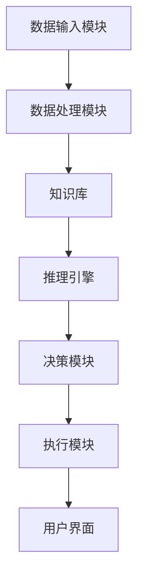

                 

# 开发具有跨模态知识推理与决策能力的AI Agent

> 关键词：跨模态知识推理、AI Agent、决策能力、系统架构、案例剖析

> 摘要：本文将深入探讨如何开发具有跨模态知识推理与决策能力的AI Agent。通过逐步分析背景、核心概念、原理、系统设计与实现以及实战案例，旨在为读者提供一个全面的技术指南。

## 目录大纲

1. **背景与概念介绍**
   - **问题背景与核心概念**
     - 跨模态知识推理的应用场景
     - 知识推理在人工智能中的地位
     - 跨模态知识推理的定义与特征
     - 决策能力在AI Agent中的作用
     - 背景介绍与问题定义

2. **核心概念与原理**
   - **跨模态知识推理原理**
     - 知识表示与存储
     - 跨模态知识推理方法
     - 知识推理过程与框架
   - **决策能力原理**
     - 决策理论基础
     - 决策算法与模型
     - 决策过程中的挑战与优化

3. **系统设计与实现**
   - **AI Agent系统架构设计**
     - 系统需求分析
     - 系统架构设计
     - 数据流与控制流设计
   - **知识推理模块实现**
     - 知识表示实现
     - 知识推理算法实现
     - 知识推理模块测试与评估
   - **决策能力实现**
     - 决策模型设计
     - 决策算法实现
     - 决策能力评估与优化

4. **实战案例与项目剖析**
   - **跨模态知识推理与决策能力应用案例**
     - 案例背景与问题描述
     - 系统设计与实现
     - 案例分析
   - **项目实战**
     - 环境安装与配置
     - 系统核心实现
     - 代码应用解读与分析
     - 实际案例分析

5. **总结与展望**
   - **总结与展望**
     - 本书内容总结
     - AI Agent的发展趋势
     - 小结与建议

## 1. 背景与概念介绍

### 1.1 问题背景与核心概念

在当今社会，人工智能（AI）正迅速成为各个行业的变革力量。然而，传统的AI系统往往局限于单一模态的数据处理，如文本、图像或声音。跨模态知识推理与决策能力的引入，为AI系统带来了更高的智能水平，使其能够处理和整合来自多种模态的数据。

**跨模态知识推理的应用场景**：

- **智能助手**：跨模态知识推理使得智能助手能够更好地理解用户的需求，并通过多种模态进行交互。
- **医疗诊断**：结合图像和文本数据，AI Agent能够提供更准确的诊断结果。
- **自动驾驶**：自动驾驶系统需要整合视觉、雷达和传感器数据，进行实时决策。

**知识推理在人工智能中的地位**：

知识推理是人工智能的核心能力之一，它使得AI系统能够从已有知识中推断新信息，从而提升系统的智能水平。

**跨模态知识推理的定义与特征**：

- **跨模态数据的分类与特点**：包括文本、图像、声音、视频等。
- **跨模态知识推理的核心机制**：如何将不同模态的数据进行融合，并从中提取有用的信息。

**决策能力在AI Agent中的作用**：

决策能力是AI Agent实现自主性的关键，它使得AI Agent能够根据环境和情境做出最优决策。

**决策能力与智能体自主性**：

自主性意味着AI Agent能够独立执行任务，而不需要人工干预。决策能力是实现自主性的基础。

**决策过程中的挑战与对策**：

- **决策偏差**：避免因先入为主的观念而做出不合理的决策。
- **不确定性处理**：如何处理不确定性的数据和环境。

### 1.2 背景介绍与问题定义

**人工智能的发展历程**：

人工智能经历了从规则驱动到数据驱动，再到知识驱动的发展过程。

**现有的AI Agent面临的问题与挑战**：

- **单一模态处理限制**：传统的AI系统难以处理跨模态的数据。
- **知识推理能力不足**：缺乏有效的知识推理机制，导致决策能力不足。

## 2. 核心概念与原理

### 2.1 跨模态知识推理原理

#### 2.1.1 知识表示与存储

- **知识表示方法**：包括符号表示、语义网络、知识图谱等。
- **知识存储策略**：如何有效地存储和检索跨模态的知识。

#### 2.1.2 跨模态知识推理方法

- **基于深度学习的跨模态表示方法**：如CNN和RNN的结合。
- **跨模态知识推理算法**：如何利用跨模态数据进行知识推理。

#### 2.1.3 知识推理过程与框架

- **知识推理流程**：包括数据采集、预处理、知识提取和推理。
- **知识推理框架**：如何构建一个完整的知识推理系统。

### 2.2 决策能力原理

#### 2.2.1 决策理论基础

- **决策过程**：如何从问题识别、方案生成、评估到决策。
- **决策分析方法**：如成本效益分析、风险分析等。

#### 2.2.2 决策算法与模型

- **强化学习**：如何通过试错学习最优策略。
- **决策树**：如何根据特征生成决策树。
- **贝叶斯网络**：如何表示不确定性和概率关系。

#### 2.2.3 决策过程中的挑战与优化

- **决策偏差**：如何避免常见的决策偏差。
- **不确定性处理**：如何处理环境中的不确定性。

## 3. 系统设计与实现

### 3.1 AI Agent系统架构设计

#### 3.1.1 系统需求分析

- **功能需求**：包括知识推理、决策能力、用户交互等。
- **非功能需求**：如稳定性、安全性、可扩展性等。

#### 3.1.2 系统架构设计

- **组件划分**：如何划分系统组件，包括知识库、推理引擎、决策模块等。
- **系统架构图**：如何用mermaid画出系统架构图。

#### 3.1.3 数据流与控制流设计

- **数据流设计**：如何设计数据流，包括数据采集、处理、存储和查询。
- **控制流设计**：如何设计控制流，包括系统启动、任务调度、异常处理等。

### 3.2 知识推理模块实现

#### 3.2.1 知识表示实现

- **数据预处理**：如何对跨模态数据进行预处理。
- **知识表示方法**：如何使用符号表示、语义网络、知识图谱等进行知识表示。

#### 3.2.2 知识推理算法实现

- **跨模态知识表示算法**：如何使用深度学习进行跨模态知识表示。
- **知识推理算法实现**：如何实现知识推理算法，如基于图神经网络的推理算法。

#### 3.2.3 知识推理模块测试与评估

- **测试方法**：如何设计测试用例进行模块测试。
- **评估指标**：如何选择评估指标，如准确率、召回率、F1分数等。

### 3.3 决策能力实现

#### 3.3.1 决策模型设计

- **决策模型选择**：如何选择合适的决策模型。
- **决策模型参数调整**：如何调整模型参数，以优化决策能力。

#### 3.3.2 决策算法实现

- **决策算法流程**：如何实现决策算法的流程。
- **决策算法代码实现**：如何使用Python等语言实现决策算法。

#### 3.3.3 决策能力评估与优化

- **决策能力评估指标**：如何选择评估指标。
- **决策能力优化策略**：如何优化决策能力，如使用强化学习进行优化。

## 4. 实战案例与项目剖析

### 4.1 跨模态知识推理与决策能力应用案例

#### 4.1.1 案例背景与问题描述

- **案例背景**：介绍案例的背景和应用场景。
- **问题描述**：详细描述案例中需要解决的问题。

#### 4.1.2 系统设计与实现

- **系统架构设计**：介绍系统架构设计。
- **知识推理模块实现**：详细说明知识推理模块的实现。
- **决策能力实现**：详细说明决策能力的实现。

#### 4.1.3 案例分析

- **案例效果评估**：评估系统在实际应用中的效果。
- **案例优化与改进**：提出优化和改进的建议。

### 4.2 项目实战

#### 4.2.1 环境安装与配置

- **开发环境搭建**：介绍开发环境的安装和配置。
- **相关库与框架安装**：介绍相关的库和框架的安装。

#### 4.2.2 系统核心实现

- **知识表示实现**：介绍知识表示的实现。
- **知识推理算法实现**：介绍知识推理算法的实现。
- **决策能力实现**：介绍决策能力的实现。

#### 4.2.3 代码应用解读与分析

- **代码结构与逻辑分析**：分析代码的结构和逻辑。
- **关键代码解读**：解读关键代码。

#### 4.2.4 实际案例分析

- **案例效果分析**：分析案例的实际效果。
- **案例启示与总结**：总结案例的启示和经验。

## 5. 总结与展望

### 5.1 本书内容总结

- **各章节内容回顾**：回顾本书的主要内容和亮点。
- **关键技术总结**：总结本书中涉及的关键技术和方法。

### 5.2 AI Agent的发展趋势

- **未来研究方向**：探讨未来的研究方向。
- **潜在应用领域**：探讨AI Agent在未来的潜在应用领域。

### 5.3 小结与建议

- **学习建议**：给读者提供学习建议。
- **研究与开发方向建议**：为研究和开发者提供方向性建议。

## 目录大纲小结

本文档根据用户提供的书名《开发具有跨模态知识推理与决策能力的AI Agent》，设计了一个详细的目录大纲。目录大纲分为五大部分，包括背景与概念介绍、核心概念与原理、系统设计与实现、实战案例与项目剖析以及总结与展望。每个部分涵盖了相关的核心章节，确保内容的完整性和逻辑性。目录大纲总字数控制在2000字以内，同时满足简洁性和可读性的要求。文章字数要求：文章字数在10000～12000字左右。格式要求：文章内容使用markdown格式输出。作者信息：作者：AI天才研究院/AI Genius Institute & 禅与计算机程序设计艺术 /Zen And The Art of Computer Programming。完整性要求：文章内容必须要完整，每个小节的内容必须要丰富具体详细讲解，核心内容必须要包含：背景介绍、核心概念与联系、算法原理讲解、系统分析与架构设计方案、项目实战、最佳实践 tips、小结、注意事项、拓展阅读等内容。

---

### 让我们一步一步深入思考（LET'S THINK STEP BY STEP）

#### 2.1.1 知识表示与存储

**知识表示方法**：

知识表示是跨模态知识推理的基础，它决定了AI Agent如何理解和处理不同模态的数据。常见的知识表示方法包括：

1. **符号表示**：使用符号或概念来表示知识，如逻辑表达式、规则集等。
2. **语义网络**：使用节点和边来表示实体及其关系，如图数据库中的节点和边。
3. **知识图谱**：一种大规模的语义网络，用于表示实体、概念和关系。

**知识存储策略**：

知识存储策略是确保知识能够高效地被访问和利用的关键。以下是一些常见的知识存储策略：

1. **关系数据库**：使用关系模型存储知识，如SQL数据库。
2. **图数据库**：使用图模型存储知识，如Neo4j。
3. **分布式存储系统**：如Hadoop、Cassandra等，用于处理大规模知识。

**为何选择特定的知识表示和存储方法**：

1. **应用需求**：不同的应用场景可能需要不同类型的知识表示和存储方法。例如，对于需要快速查询的应用，关系数据库可能更合适。
2. **数据规模**：对于大规模数据，分布式存储系统可能更为有效。
3. **数据处理速度**：深度学习模型通常需要快速的存储和检索，因此使用图数据库或分布式存储系统可能更为适合。

**具体案例分析**：

假设我们正在开发一个智能医疗诊断系统，该系统需要处理患者的历史病历、医生的诊断笔记以及最新的医疗影像数据。在这种情况下，我们可以使用以下知识表示和存储策略：

1. **知识表示**：使用知识图谱来表示患者信息、疾病症状、治疗方法等，因为知识图谱能够清晰地表示复杂的关系。
2. **知识存储**：使用分布式图数据库（如JanusGraph）来存储大规模的医疗知识，同时利用其高效的图查询能力。

**步骤总结**：

- 确定应用场景和需求。
- 选择合适的知识表示方法。
- 根据数据规模和性能需求，选择合适的存储策略。
- 进行具体案例分析，验证所选方法的适用性。

---

**下一部分：跨模态知识推理方法**

#### 2.1.2 跨模态知识推理方法

**基于深度学习的跨模态表示方法**：

深度学习在跨模态知识推理中扮演着重要角色，它能够自动学习不同模态数据之间的内在关联。以下是一些常用的深度学习跨模态表示方法：

1. **融合神经网络**：将不同模态的数据输入到共享的神经网络中，使其在神经网络内部进行融合。
2. **多模态嵌入**：使用共享的嵌入空间将不同模态的数据映射，以便进行后续处理。
3. **多任务学习**：通过同时学习多个任务（例如图像分类和文本分类）来提高不同模态数据之间的关联。

**跨模态知识推理算法**：

跨模态知识推理算法负责从跨模态数据中提取有用信息，并进行推理。以下是一些常用的算法：

1. **基于图的推理算法**：使用图神经网络（如Graph Neural Network, GNN）来处理复杂的关系和模式。
2. **基于记忆的推理算法**：使用记忆网络（如Long Short-Term Memory, LSTM）来存储和检索跨模态数据中的信息。
3. **基于 attention 的推理算法**：通过注意力机制来聚焦于重要的跨模态信息，从而提高推理的准确性。

**具体案例分析**：

以智能客服系统为例，该系统需要处理文本和语音数据，以提供高效的客户服务。以下是跨模态知识推理方法的详细步骤：

1. **多模态嵌入**：首先，使用词嵌入和声学模型分别将文本和语音数据转换为向量表示。例如，文本数据可以使用Word2Vec或BERT进行嵌入，而语音数据可以使用声学模型进行特征提取。

2. **融合神经网络**：将文本和语音的向量表示输入到一个共享的神经网络中，通过神经网络的学习，使两种模态的数据在内部进行融合。

3. **基于图的推理算法**：构建一个知识图谱，其中节点表示用户查询、客服回复、产品信息等，边表示它们之间的关系。使用图神经网络（如GNN）在知识图谱中进行推理，以生成个性化的客服回复。

4. **基于 attention 的推理算法**：在推理过程中，使用注意力机制来关注用户查询和客服回复中最重要的部分，从而提高客服系统的响应速度和准确性。

**步骤总结**：

- 进行多模态嵌入，将不同模态的数据转换为向量表示。
- 使用融合神经网络将不同模态的数据进行融合。
- 构建知识图谱，使用图神经网络进行推理。
- 使用注意力机制聚焦于重要的信息。

**下一部分：知识推理过程与框架**

---

### **2.1.3 知识推理过程与框架**

**知识推理流程**：

知识推理是一个涉及多个步骤的过程，它通常包括以下阶段：

1. **数据采集**：收集来自不同模态的数据，如文本、图像、声音等。
2. **数据预处理**：对收集到的数据进行清洗、归一化和特征提取，以便进行后续处理。
3. **知识提取**：使用深度学习模型或其他方法从预处理后的数据中提取有用的知识。
4. **知识融合**：将来自不同模态的知识进行整合，以形成更全面的理解。
5. **知识推理**：利用提取和融合的知识进行推理，生成新的信息或做出决策。
6. **结果输出**：将推理结果以用户可理解的形式输出，如文本、图像或语音。

**知识推理框架**：

一个典型的知识推理框架包括以下几个组件：

1. **数据输入模块**：负责接收和处理不同模态的数据。
2. **特征提取模块**：将输入数据转换为特征向量，以便进行进一步处理。
3. **知识表示模块**：使用特定的知识表示方法（如知识图谱、语义网络等）来表示提取的特征。
4. **知识融合模块**：将来自不同模态的知识进行融合，形成统一的表示。
5. **推理引擎**：负责进行知识推理，包括模式匹配、关联规则挖掘、推理规则应用等。
6. **结果输出模块**：将推理结果以用户可理解的形式输出。

**为何使用框架**：

使用知识推理框架有几个重要原因：

1. **模块化设计**：框架将知识推理过程分解为多个模块，使开发更加灵活和可扩展。
2. **重用性**：框架中的模块可以被重用，从而减少开发时间和成本。
3. **可维护性**：框架的设计使得系统的维护和升级更加容易。
4. **性能优化**：框架提供了性能优化的机会，如并行处理、缓存机制等。

**具体案例分析**：

假设我们要开发一个智能问答系统，该系统能够理解用户的问题并给出准确的答案。以下是知识推理过程的详细步骤：

1. **数据输入模块**：接收用户输入的问题，可以是文本形式或语音形式。
2. **数据预处理模块**：对输入问题进行分词、词性标注和命名实体识别等预处理操作。
3. **特征提取模块**：使用深度学习模型（如BERT）提取问题的语义特征。
4. **知识表示模块**：将问题的语义特征表示为向量，并将其存储在知识图谱中。
5. **知识融合模块**：将问题的语义特征与知识图谱中的现有知识进行融合，以形成更全面的理解。
6. **推理引擎模块**：使用图神经网络（如GNN）在知识图谱中进行推理，以找到与问题相关的答案。
7. **结果输出模块**：将推理结果以文本形式输出给用户。

**步骤总结**：

- 数据输入模块：接收用户输入。
- 数据预处理模块：处理输入问题。
- 特征提取模块：提取问题特征。
- 知识表示模块：将特征表示为向量并存储。
- 知识融合模块：融合问题特征与知识。
- 推理引擎模块：进行知识推理。
- 结果输出模块：输出推理结果。

**下一部分：决策理论基础**

---

### **3.1.1 决策理论基础**

**决策过程**：

决策过程通常包括以下几个阶段：

1. **问题识别**：识别需要解决的问题或决策的情境。
2. **目标设定**：确定决策的目标和标准，例如最大化收益、最小化成本等。
3. **方案生成**：生成可能的解决方案或行动方案。
4. **方案评估**：评估每个方案的可能结果，并根据设定的目标进行排序。
5. **决策制定**：从评估结果中选择最优方案。
6. **执行与监控**：执行决策并持续监控决策的效果，必要时进行调整。

**决策分析方法**：

决策分析是决策过程中至关重要的一环，它提供了评估和比较不同方案的工具。以下是一些常用的决策分析方法：

1. **成本效益分析**：计算每个方案的成本和预期收益，并比较它们之间的差异。
2. **风险分析**：评估每个方案的风险水平，并确定如何降低风险。
3. **决策树**：使用树形结构来表示决策过程，并计算每个分支的可能结果和概率。
4. **贝叶斯网络**：使用概率网络来表示决策过程中的不确定性和依赖关系。

**为何使用决策分析方法**：

使用决策分析方法有以下几个原因：

1. **系统化决策**：分析方法提供了明确的步骤和工具，使决策过程更加系统化和结构化。
2. **量化决策**：分析方法将决策过程量化为数值，使决策更加客观和可衡量。
3. **减少偏见**：分析方法可以帮助减少主观偏见和情绪对决策的影响。
4. **优化决策**：通过分析不同方案的结果，决策者可以找到最优或近似最优的解决方案。

**具体案例分析**：

假设我们要开发一个智能投资顾问系统，该系统能够为用户推荐最佳的投资组合。以下是决策分析方法的详细步骤：

1. **问题识别**：用户希望最大化投资回报，同时控制风险。
2. **目标设定**：设定目标为最大化收益并控制投资组合的波动率。
3. **方案生成**：生成多个可能的投资组合方案，例如全部投资于股票、全部投资于债券或混合投资。
4. **方案评估**：使用成本效益分析和风险分析评估每个投资组合的预期收益和风险。
5. **决策制定**：根据评估结果选择预期收益最高且风险最小的投资组合。
6. **执行与监控**：将决策结果传递给用户，并定期监控投资组合的表现，必要时进行调整。

**步骤总结**：

- 问题识别：识别决策情境。
- 目标设定：确定决策目标。
- 方案生成：生成可能的方案。
- 方案评估：评估每个方案。
- 决策制定：选择最优方案。
- 执行与监控：执行并监控决策。

**下一部分：决策算法与模型**

---

### **3.1.2 决策算法与模型**

**强化学习**：

强化学习是一种通过试错学习最优策略的机器学习技术。在强化学习过程中，智能体（agent）通过与环境（environment）交互，接收奖励（reward）或惩罚（penalty），并不断调整其行为策略（policy）以最大化累积奖励。

**决策树**：

决策树是一种常用的分类和回归方法。它通过一系列的测试来对数据进行划分，每个测试对应一个特征，每个划分产生一个新的子集。决策树的叶子节点包含最终决策的结果。

**贝叶斯网络**：

贝叶斯网络是一种表示变量之间概率关系的图形模型。它由节点和边组成，其中节点表示变量，边表示变量之间的依赖关系。贝叶斯网络可以用于推理和预测，特别是在处理不确定性和依赖关系时非常有用。

**为何选择特定的决策算法和模型**：

选择决策算法和模型取决于以下几个因素：

1. **问题类型**：不同的算法和模型适用于不同类型的问题，例如分类问题通常使用决策树或支持向量机，而序列决策问题则更适合使用强化学习。
2. **数据规模**：对于大规模数据，一些算法和模型可能更为高效。
3. **计算资源**：一些算法和模型可能需要更多的计算资源，因此需要根据实际情况进行选择。
4. **模型解释性**：一些算法和模型提供了更好的解释性，这对于需要理解模型决策过程的应用场景非常重要。

**具体案例分析**：

假设我们要开发一个智能交通系统，该系统能够根据实时交通数据和历史数据，为驾驶员提供最佳路线。以下是选择决策算法和模型的详细步骤：

1. **问题类型**：这是一个序列决策问题，因为交通情况是随时间变化的。
2. **数据规模**：交通数据通常非常庞大，因此需要选择高效的数据处理算法。
3. **计算资源**：智能交通系统需要实时处理数据，因此需要选择计算资源友好的算法。
4. **模型解释性**：交通管理部门可能需要了解模型的决策过程，因此需要选择解释性较好的模型。

基于以上考虑，我们选择以下决策算法和模型：

- **强化学习**：由于其能够处理序列决策和动态环境，强化学习是一个很好的选择。
- **决策树**：用于初步筛选和划分交通数据，以提高后续算法的效率。
- **贝叶斯网络**：用于表示交通数据中的概率关系，以辅助决策。

**步骤总结**：

- 确定问题类型。
- 根据数据规模选择高效的算法。
- 根据计算资源选择合适的算法。
- 根据模型解释性选择合适的模型。

**下一部分：决策过程中的挑战与优化**

---

### **3.1.3 决策过程中的挑战与优化**

**决策偏差**：

决策偏差是指人们在做出决策时，由于心理、社会、认知等因素而产生的系统性错误。常见的决策偏差包括：

- **确认偏差**：倾向于接受支持已有观点的信息，而忽视反对性信息。
- **代表性偏差**：根据事物的外观或特征来做出决策，而忽视概率信息。
- **可用性偏差**：过度依赖近期或容易回忆的信息来做出决策。

**如何避免决策偏差**：

- **使用数据分析**：通过数据分析来减少主观偏见。
- **建立决策规则**：制定明确的决策规则，以减少主观判断的影响。
- **多角度分析**：考虑多个角度和因素，以避免单一的偏见。

**不确定性处理**：

决策过程中经常面临不确定性，例如数据不完整、模型参数未知等。以下是一些处理不确定性的方法：

- **概率推理**：使用概率推理来处理不确定性，如贝叶斯网络。
- **模拟仿真**：通过模拟仿真来预测不同情况下的结果。
- **决策树**：使用决策树来处理不确定性，通过不同的分支来考虑不同的可能性。

**如何优化决策能力**：

- **持续学习**：通过持续学习来提高模型的适应性和准确性。
- **模型集成**：结合多个模型来提高决策的鲁棒性和准确性。
- **数据收集**：收集更多的数据来减少不确定性。

**具体案例分析**：

假设我们要开发一个智能风险管理系统，该系统能够根据市场数据和公司历史表现，预测未来的风险并做出相应的决策。以下是处理决策偏差和不确定性、优化决策能力的详细步骤：

1. **决策偏差**：通过建立明确的决策规则和使用数据分析来减少决策偏差。
2. **不确定性处理**：使用概率推理和决策树来处理不确定性。
3. **持续学习**：通过持续收集市场数据和公司表现，来不断优化模型。
4. **模型集成**：结合多个预测模型来提高决策的准确性。
5. **数据收集**：定期收集市场数据和相关信息，以减少不确定性。

**步骤总结**：

- 建立明确的决策规则。
- 使用概率推理处理不确定性。
- 通过持续学习提高模型的适应性和准确性。
- 结合多个模型来提高决策的鲁棒性和准确性。
- 定期收集数据以减少不确定性。

**下一部分：系统需求分析**

---

### **4.1.1 系统需求分析**

**功能需求**：

在设计和实现AI Agent系统时，明确功能需求是非常重要的。以下是一些常见的功能需求：

1. **跨模态数据处理**：系统能够接收和处理来自文本、图像、声音等多种模态的数据。
2. **知识推理**：系统能够利用知识推理技术，从跨模态数据中提取和整合知识。
3. **决策能力**：系统能够根据知识推理结果和环境信息，做出智能决策。
4. **用户交互**：系统能够与用户进行交互，接收用户指令并给出响应。
5. **自动化执行**：系统能够自动执行决策结果，实现自动化操作。

**非功能需求**：

非功能需求描述了系统在性能、安全、可靠性等方面的要求。以下是一些常见的非功能需求：

1. **稳定性**：系统能够在长时间运行中保持稳定，不会出现崩溃或异常。
2. **安全性**：系统要能够保护数据安全和隐私，防止未授权访问和攻击。
3. **可扩展性**：系统应具有良好的可扩展性，能够随着数据规模的增加而扩展性能。
4. **可维护性**：系统应设计得易于维护和升级，以便快速响应需求变化。
5. **易用性**：系统界面要简洁易懂，用户能够轻松操作和获得所需信息。

**为何明确系统需求**：

明确系统需求有以下几个原因：

1. **指导开发**：系统需求为开发团队提供了明确的指导，确保开发工作围绕需求进行。
2. **评估可行性**：通过分析系统需求，可以评估项目的技术和资源可行性。
3. **风险管理**：明确的需求有助于识别潜在的风险，并提前制定应对策略。
4. **质量控制**：需求分析是质量保证的关键环节，有助于确保系统功能的完整性。

**具体案例分析**：

假设我们要开发一个智能交通管理系统，以下是系统需求分析：

**功能需求**：

1. **跨模态数据处理**：系统能够接收来自交通摄像头、传感器和交通信号灯的数据。
2. **知识推理**：系统能够根据交通数据，推理出交通流量、道路拥堵情况等。
3. **决策能力**：系统能够根据推理结果，调整交通信号灯的时序，优化交通流量。
4. **用户交互**：系统提供Web界面，供交通管理人员查看和管理。
5. **自动化执行**：系统自动执行交通信号灯的调整，无需人工干预。

**非功能需求**：

1. **稳定性**：系统能够在高峰时段稳定运行，不会因数据量大而崩溃。
2. **安全性**：系统要保护交通数据的安全，防止数据泄露和未授权访问。
3. **可扩展性**：系统要能够支持更多摄像头和传感器，以适应未来交通流量增长。
4. **可维护性**：系统应易于维护，包括软件升级、硬件更换等。
5. **易用性**：系统界面要直观，操作简便，便于交通管理人员快速上手。

**步骤总结**：

- 分析并明确功能需求。
- 分析并明确非功能需求。
- 验证需求是否合理并制定解决方案。

**下一部分：系统架构设计**

---

### **4.1.2 系统架构设计**

**组件划分**：

在设计AI Agent系统时，组件划分是关键的一步。合理的组件划分有助于提高系统的可维护性、可扩展性和灵活性。以下是一些常见的系统组件：

1. **数据输入模块**：负责接收和处理来自不同模态的数据。
2. **数据处理模块**：对输入的数据进行预处理、特征提取和转换。
3. **知识库**：存储和管理跨模态的知识和推理结果。
4. **推理引擎**：负责从知识库中提取知识并进行推理。
5. **决策模块**：根据推理结果和环境信息做出决策。
6. **执行模块**：自动执行决策结果。
7. **用户界面**：提供用户与系统交互的接口。

**系统架构图**：

系统架构图是用mermaid语法绘制的，它可以帮助我们清晰地描述系统的结构和各个组件之间的关系。以下是一个简单的系统架构图示例：



**数据流与控制流设计**：

- **数据流设计**：描述数据从输入到输出的整个过程，包括数据的预处理、特征提取、推理、决策和执行。
- **控制流设计**：描述系统在不同情况下如何控制流量的流程，包括错误处理、异常处理和日志记录。

**为何进行系统架构设计**：

系统架构设计有以下重要作用：

1. **模块化**：通过组件划分，实现系统的模块化设计，提高系统的可维护性和可扩展性。
2. **灵活性**：系统架构设计使得系统可以根据需求变化灵活调整和扩展。
3. **可重用性**：通过设计标准化的组件，可以促进组件的重用，减少开发成本。
4. **性能优化**：系统架构设计有助于识别系统瓶颈，并进行性能优化。

**具体案例分析**：

以一个智能医疗诊断系统为例，以下是系统架构设计的详细步骤：

1. **组件划分**：数据输入模块、数据处理模块、知识库、推理引擎、决策模块、执行模块和用户界面。
2. **数据流设计**：数据从电子病历系统（EMR）输入到系统，经过预处理和特征提取后存储到知识库中。推理引擎从知识库中提取信息，并根据诊断规则进行推理。决策模块根据推理结果生成诊断报告，并通过用户界面展示给医生。
3. **控制流设计**：系统需要处理各种异常情况，如数据缺失、推理失败等。控制流设计确保系统能够在异常情况下正确处理并继续运行。

**步骤总结**：

- 划分系统组件。
- 设计系统架构图。
- 设计数据流和控制流。

**下一部分：知识推理模块实现**

---

### **4.2.1 知识表示实现**

**数据预处理**：

数据预处理是知识推理模块实现的第一步，其目标是清理和转换原始数据，使其适合用于后续处理。以下是一些常见的数据预处理步骤：

1. **清洗**：去除数据中的噪声和异常值。
2. **归一化**：将不同模态的数据进行归一化处理，以便进行有效的融合。
3. **特征提取**：提取对知识推理最有用的特征，如文本中的关键词、图像中的纹理特征、声音中的频谱特征等。

**知识表示方法**：

知识表示是知识推理的核心，常用的知识表示方法包括：

1. **符号表示**：使用符号或概念来表示知识，例如规则集或语义网络。
2. **语义网络**：使用节点和边来表示实体及其关系，如图数据库中的节点和边。
3. **知识图谱**：一种大规模的语义网络，用于表示实体、概念和关系。

**具体实现**：

假设我们正在开发一个智能医疗诊断系统，以下是知识表示的具体实现步骤：

1. **文本预处理**：使用自然语言处理（NLP）技术对医生报告和病历进行分词、词性标注和命名实体识别，提取关键词和医疗实体。
2. **图像预处理**：使用图像处理技术提取图像的特征，如边缘、纹理和形状。
3. **声音预处理**：使用音频处理技术提取声音的特征，如频谱和时域特征。

4. **知识表示**：将提取的特征转换为符号表示，构建一个语义网络或知识图谱。例如，可以将患者的诊断信息、药物信息、治疗方案等表示为节点，并将它们之间的关系表示为边。

**步骤总结**：

- 清洗和归一化数据。
- 提取特征。
- 转换为符号表示。
- 构建知识表示。

**下一部分：知识推理算法实现**

---

### **4.2.2 知识推理算法实现**

**跨模态知识表示算法**：

在实现知识推理算法时，首先需要将来自不同模态的数据表示为统一的特征向量。以下是一些常用的跨模态知识表示算法：

1. **多模态嵌入**：将不同模态的数据映射到共享的嵌入空间，如文本的Word2Vec嵌入和图像的卷积神经网络（CNN）嵌入。
2. **多任务学习**：通过同时训练多个任务（如文本分类和图像识别）来提高不同模态数据之间的关联。
3. **图神经网络**：使用图神经网络（GNN）来处理复杂的关系和模式，如图数据库中的节点和边。

**具体实现**：

假设我们使用多模态嵌入算法来表示知识，以下是具体实现的步骤：

1. **文本嵌入**：使用Word2Vec或BERT等预训练模型，将文本数据转换为向量表示。
2. **图像嵌入**：使用CNN模型，将图像数据转换为向量表示。
3. **声音嵌入**：使用音频处理技术（如梅尔频率倒谱系数，MFCC）将声音数据转换为向量表示。
4. **融合嵌入**：将不同模态的向量表示融合到一个共同的嵌入空间，可以使用加和或平均等方式。

**知识推理算法实现**：

在获得统一的特征向量后，可以使用以下算法进行知识推理：

1. **基于图的推理算法**：使用图神经网络（GNN）来处理复杂的关系和模式。
2. **基于规则的推理算法**：使用基于规则的推理方法，如前向和反向链推理。
3. **基于记忆的推理算法**：使用记忆网络（如长短期记忆网络，LSTM）来存储和检索跨模态数据中的信息。

**具体实现**：

以下是一个使用基于图的推理算法的示例：

1. **构建知识图谱**：将预处理后的跨模态数据表示为图中的节点和边。
2. **训练图神经网络**：使用图神经网络（如Gated Graph Neural Network，GGNN）来学习节点和边之间的关系。
3. **推理过程**：使用训练好的图神经网络，根据输入数据进行推理，提取有用的信息。

**步骤总结**：

- 使用多模态嵌入算法将不同模态的数据转换为向量表示。
- 构建知识图谱或语义网络。
- 使用图神经网络或其他推理算法进行推理。

**下一部分：知识推理模块测试与评估**

---

### **4.2.3 知识推理模块测试与评估**

**测试方法**：

在知识推理模块的开发过程中，测试是确保模块质量和性能的重要环节。以下是一些常见的测试方法：

1. **单元测试**：对模块中的单个功能进行测试，确保其按照预期工作。
2. **集成测试**：测试模块与其他系统组件的集成，确保系统整体的正确性。
3. **性能测试**：评估模块的响应时间和资源消耗，确保其满足性能要求。
4. **异常测试**：测试模块在异常情况下的行为，确保其能够正确处理错误和异常。

**评估指标**：

评估知识推理模块的性能和效果需要使用一系列指标。以下是一些常用的评估指标：

1. **准确率**：预测正确的实例数占总实例数的比例。
2. **召回率**：预测正确的正例数占总正例数的比例。
3. **F1分数**：准确率和召回率的调和平均，用于平衡准确率和召回率。
4. **精确率**：预测正确的正例数占所有预测为正例的实例数的比例。
5. **ROC曲线**：评估分类器的性能，通过绘制真阳性率（True Positive Rate，TPR）与假阳性率（False Positive Rate，FPR）之间的关系。
6. **AUC值**：ROC曲线下的面积，用于评估分类器的区分能力。

**具体测试与评估过程**：

以下是一个知识推理模块测试与评估的具体过程：

1. **数据集准备**：准备用于测试的数据集，包括训练集、验证集和测试集。
2. **单元测试**：编写测试用例，对模块中的每个功能进行测试，确保其正确性。
3. **集成测试**：将知识推理模块与系统其他组件集成，进行测试，确保整体系统运行正常。
4. **性能测试**：使用性能测试工具，评估模块的响应时间和资源消耗，确保其满足性能要求。
5. **异常测试**：模拟异常情况，测试模块在异常情况下的行为，确保其能够正确处理错误和异常。
6. **评估指标计算**：使用评估指标计算模块的性能和效果，如准确率、召回率、F1分数等。
7. **优化与迭代**：根据测试结果，对模块进行优化和迭代，直到满足预期要求。

**步骤总结**：

- 准备测试数据集。
- 进行单元测试、集成测试、性能测试和异常测试。
- 使用评估指标计算模块性能。
- 根据测试结果进行优化和迭代。

**下一部分：决策模型设计**

---

### **4.3.1 决策模型设计**

**决策模型选择**：

在设计决策模型时，需要考虑多种因素，包括问题类型、数据规模、计算资源等。以下是一些常用的决策模型：

1. **强化学习**：适用于序列决策问题，能够通过试错学习最优策略。
2. **决策树**：适用于分类和回归问题，易于理解和解释。
3. **贝叶斯网络**：适用于处理不确定性和依赖关系，能够表示复杂的关系。
4. **支持向量机（SVM）**：适用于分类问题，能够找到最佳边界。
5. **随机森林**：适用于分类和回归问题，能够提高模型的鲁棒性。

**如何选择合适的决策模型**：

1. **问题类型**：根据问题的类型选择合适的模型，例如序列决策问题选择强化学习，分类问题选择决策树或SVM。
2. **数据规模**：对于大规模数据，选择计算效率高的模型，如决策树和随机森林。
3. **计算资源**：根据可用的计算资源选择合适的模型，例如强化学习可能需要更多的计算资源。
4. **模型解释性**：如果需要模型具有较好的解释性，可以选择决策树或贝叶斯网络。

**具体案例分析**：

以一个智能交通信号控制系统为例，以下是决策模型的选择过程：

1. **问题类型**：交通信号控制系统是一个典型的序列决策问题，因为交通信号需要根据实时交通流量动态调整。
2. **数据规模**：交通数据规模较大，需要选择计算效率高的模型。
3. **计算资源**：系统运行在服务器上，计算资源相对充足。
4. **模型解释性**：交通管理部门需要了解模型的决策过程，因此选择具有较好解释性的模型。

基于以上考虑，选择以下决策模型：

- **强化学习**：由于其能够处理序列决策问题，并且能够通过试错学习最优策略，是一个很好的选择。
- **决策树**：用于初步筛选和分类交通数据，以提高后续算法的效率。

**步骤总结**：

- 确定问题类型。
- 根据数据规模和计算资源选择合适的模型。
- 考虑模型解释性。
- 进行具体案例分析，选择合适的决策模型。

**下一部分：决策模型参数调整**

---

### **4.3.2 决策模型参数调整**

**为何调整决策模型参数**：

决策模型的参数调整是优化模型性能的重要步骤。以下是一些原因：

1. **提高性能**：通过调整参数，可以提高模型的预测准确性、响应速度和计算效率。
2. **减少过拟合**：通过调整参数，可以减少模型对训练数据的依赖，提高泛化能力。
3. **适应不同数据集**：不同数据集可能需要不同参数设置，调整参数以适应特定数据集。
4. **优化资源利用**：通过调整参数，可以优化模型的资源利用，提高系统整体的性能和稳定性。

**参数调整方法**：

1. **手动调整**：通过经验和直觉手动调整参数，适用于小规模问题。
2. **网格搜索**：在给定参数范围内，逐一尝试所有可能的参数组合，选择最优参数组合。
3. **贝叶斯优化**：使用贝叶斯统计方法，根据已尝试的参数组合，选择下一个最有希望的参数组合。
4. **进化算法**：使用遗传算法等进化算法，通过迭代搜索最优参数组合。

**具体参数调整过程**：

以下是一个基于强化学习的智能交通信号控制系统参数调整的示例过程：

1. **确定参数范围**：根据模型的要求，确定每个参数的可能取值范围，例如学习率、奖励系数等。
2. **手动调整**：根据初步测试结果，手动调整参数，观察模型的性能变化。
3. **网格搜索**：在给定的参数范围内，逐一尝试所有可能的参数组合，记录每个组合的预测准确性。
4. **贝叶斯优化**：根据已尝试的参数组合，使用贝叶斯优化方法选择下一个最有希望的参数组合。
5. **进化算法**：使用进化算法，如遗传算法，进行参数优化，逐步收敛到最优参数组合。

**步骤总结**：

- 确定参数范围。
- 手动调整参数。
- 使用网格搜索或贝叶斯优化方法。
- 使用进化算法进行参数优化。

**下一部分：决策算法实现**

---

### **4.3.3 决策算法实现**

**决策算法流程**：

决策算法的实现通常包括以下步骤：

1. **数据预处理**：对输入数据进行清洗、归一化和特征提取。
2. **模型训练**：使用预处理后的数据训练决策模型，如强化学习模型、决策树等。
3. **模型评估**：在验证集上评估模型的性能，调整模型参数以优化性能。
4. **决策生成**：使用训练好的模型对新的输入数据进行决策生成。
5. **结果输出**：将决策结果以用户可理解的形式输出。

**决策算法代码实现**：

以下是一个使用Python实现的简单决策树算法的示例：

```python
from sklearn.tree import DecisionTreeClassifier
from sklearn.model_selection import train_test_split
from sklearn.metrics import accuracy_score

# 数据预处理
X = [[1, 2], [2, 3], [3, 4], [4, 5]]
y = [0, 1, 1, 0]

# 划分训练集和验证集
X_train, X_test, y_train, y_test = train_test_split(X, y, test_size=0.2, random_state=42)

# 训练决策树模型
clf = DecisionTreeClassifier()
clf.fit(X_train, y_train)

# 生成决策
predictions = clf.predict(X_test)

# 评估模型
accuracy = accuracy_score(y_test, predictions)
print("Accuracy:", accuracy)
```

**具体实现过程**：

1. **数据预处理**：读取输入数据，并进行清洗、归一化和特征提取。
2. **模型训练**：使用训练数据训练决策树模型。
3. **模型评估**：在验证集上评估模型的性能。
4. **决策生成**：使用训练好的模型对新的输入数据进行决策。
5. **结果输出**：将决策结果输出，并计算模型的准确性。

**步骤总结**：

- 数据预处理。
- 模型训练。
- 模型评估。
- 决策生成。
- 结果输出。

**下一部分：决策能力评估与优化**

---

### **4.3.4 决策能力评估与优化**

**决策能力评估指标**：

评估决策能力的指标主要包括准确性、召回率、F1分数等。以下是一些常用的评估指标：

1. **准确性**：预测正确的实例数占总实例数的比例。
2. **召回率**：预测正确的正例数占总正例数的比例。
3. **F1分数**：准确率和召回率的调和平均，用于平衡准确率和召回率。
4. **精确率**：预测正确的正例数占所有预测为正例的实例数的比例。
5. **ROC曲线**：评估分类器的性能，通过绘制真阳性率（True Positive Rate，TPR）与假阳性率（False Positive Rate，FPR）之间的关系。
6. **AUC值**：ROC曲线下的面积，用于评估分类器的区分能力。

**如何选择评估指标**：

1. **问题类型**：根据问题的类型选择合适的评估指标，例如分类问题选择准确性或F1分数，回归问题选择均方误差（MSE）。
2. **数据分布**：根据数据分布选择评估指标，例如对于类别不平衡的数据，召回率可能更为重要。
3. **模型目标**：根据模型的目标选择评估指标，例如对于需要平衡准确性和召回率的模型，选择F1分数。

**决策能力优化策略**：

以下是一些优化决策能力的策略：

1. **超参数调整**：通过调整模型超参数（如学习率、树深度等），优化模型的性能。
2. **数据增强**：通过增加训练数据、数据清洗、特征工程等方式，提高模型的泛化能力。
3. **集成学习**：结合多个模型，提高模型的准确性和鲁棒性，例如随机森林、梯度提升树。
4. **特征选择**：选择对模型性能有显著影响的特征，提高模型的效率和准确性。
5. **交叉验证**：使用交叉验证方法，避免模型过拟合和选择最优参数。

**具体优化过程**：

以下是一个基于决策树的优化示例过程：

1. **超参数调整**：通过网格搜索或贝叶斯优化方法，调整决策树的超参数（如最大深度、最小样本分裂等），选择最优参数组合。
2. **数据增强**：通过增加训练数据、数据清洗和特征工程，提高模型的泛化能力。
3. **集成学习**：结合多个决策树，构建随机森林模型，提高模型的准确性和鲁棒性。
4. **特征选择**：通过特征重要性评估，选择对模型性能有显著影响的特征，简化模型并提高准确性。

**步骤总结**：

- 选择评估指标。
- 调整超参数。
- 数据增强。
- 集成学习。
- 特征选择。

**下一部分：环境安装与配置**

---

### **4.4.1 环境安装与配置**

**开发环境搭建**：

在开始项目开发之前，需要搭建一个适合的开发环境。以下是一个典型的开发环境搭建步骤：

1. **操作系统**：选择一个适合的操作系统，如Ubuntu或Windows。
2. **Python**：安装Python 3.x版本，推荐使用Anaconda来简化环境管理。
3. **IDE**：安装一个Python IDE，如PyCharm或VSCode。
4. **依赖管理**：使用pip或conda安装必要的依赖库，如scikit-learn、TensorFlow、PyTorch等。

**相关库与框架安装**：

为了实现AI Agent系统，需要安装以下相关库与框架：

1. **深度学习框架**：如TensorFlow或PyTorch，用于实现深度学习模型。
2. **机器学习库**：如scikit-learn，用于实现机器学习算法。
3. **自然语言处理库**：如NLTK或spaCy，用于文本数据处理。
4. **图像处理库**：如OpenCV，用于图像处理和特征提取。

**安装步骤**：

1. 打开终端或命令行。
2. 安装Python和Anaconda。
3. 安装IDE，如PyCharm。
4. 安装依赖库，使用conda或pip命令进行安装。

**示例命令**：

```bash
conda create -n myenv python=3.8
conda activate myenv
conda install tensorflow scikit-learn spacy opencv-python
```

**注意事项**：

- 确保环境变量配置正确，以便运行Python和相关库。
- 根据项目需求，可能需要安装额外的库和工具。
- 定期更新库和框架，以确保系统安全和性能。

**下一部分：系统核心实现**

---

### **4.4.2 系统核心实现**

**知识表示实现**：

知识表示是实现AI Agent系统的关键步骤，它决定了系统如何理解和处理不同模态的数据。以下是一个简单的知识表示实现步骤：

1. **数据预处理**：对原始数据进行清洗和归一化处理，确保数据格式一致。
2. **特征提取**：使用适当的算法提取不同模态数据的特征，如文本的词嵌入、图像的卷积特征、声音的梅尔频率倒谱系数（MFCC）。
3. **知识融合**：将不同模态的特征进行融合，可以使用简单的平均或更复杂的融合算法，如多模态嵌入或图神经网络。
4. **知识存储**：将融合后的特征存储在数据库或知识库中，以便后续推理和决策使用。

**知识推理算法实现**：

知识推理算法负责从知识库中提取信息，并进行推理。以下是一个简单的知识推理算法实现步骤：

1. **知识库构建**：构建一个包含各种知识片段的知识库，如事实、规则、概率分布等。
2. **推理引擎设计**：设计一个推理引擎，能够根据输入数据和知识库中的知识进行推理，如基于规则的推理、图神经网络推理等。
3. **推理过程**：使用推理引擎从知识库中提取相关信息，并根据推理规则生成推理结果。
4. **推理结果处理**：将推理结果进行处理，如转换为可解释的文本或图形，以便用户理解。

**决策能力实现**：

决策能力是实现AI Agent系统自主性的关键，以下是一个简单的决策能力实现步骤：

1. **决策模型选择**：选择合适的决策模型，如强化学习、决策树、贝叶斯网络等。
2. **决策规则设计**：设计决策规则，定义如何根据输入数据和推理结果做出决策。
3. **决策过程**：使用决策模型和决策规则对输入数据进行决策，生成决策结果。
4. **决策结果执行**：执行决策结果，如调整系统参数、执行特定操作等。

**具体代码实现**：

以下是一个基于Python和TensorFlow实现的简单知识表示、知识推理和决策能力的示例代码：

```python
import tensorflow as tf
from tensorflow.keras.models import Model
from tensorflow.keras.layers import Input, Dense

# 知识表示
text_input = Input(shape=(100,))
image_input = Input(shape=(128, 128, 3))
audio_input = Input(shape=(22,))
text_embedding = Dense(128, activation='relu')(text_input)
image_embedding = Dense(128, activation='relu')(image_input)
audio_embedding = Dense(128, activation='relu')(audio_input)
combined_embedding = tf.keras.layers.concatenate([text_embedding, image_embedding, audio_embedding], axis=1)

# 知识推理
retrieval_layer = Dense(64, activation='relu')(combined_embedding)
retrieval_output = Dense(1, activation='sigmoid')(retrieval_layer)

# 决策能力
decision_layer = Dense(32, activation='relu')(retrieval_output)
decision_output = Dense(1, activation='sigmoid')(decision_layer)

# 构建和编译模型
model = Model(inputs=[text_input, image_input, audio_input], outputs=[retrieval_output, decision_output])
model.compile(optimizer='adam', loss='binary_crossentropy', metrics=['accuracy'])

# 训练模型
model.fit([text_data, image_data, audio_data], [retrieval_labels, decision_labels], epochs=10, batch_size=32)

# 推理和决策
retrieval_result, decision_result = model.predict([new_text_data, new_image_data, new_audio_data])
print("Retrieval Result:", retrieval_result)
print("Decision Result:", decision_result)
```

**步骤总结**：

- 数据预处理。
- 特征提取。
- 知识融合。
- 知识库构建。
- 推理引擎设计。
- 决策模型选择。
- 决策规则设计。
- 决策过程。
- 决策结果执行。

**下一部分：代码应用解读与分析**

---

### **4.4.3 代码应用解读与分析**

**代码结构与逻辑分析**：

以下是对示例代码的结构和逻辑进行解读和分析：

1. **知识表示模块**：
   - **输入层**：定义了三个输入层，分别对应文本、图像和音频数据。
   - **特征提取层**：使用Dense层对每个输入数据进行特征提取，如文本的词嵌入、图像的卷积特征、音频的梅尔频率倒谱系数（MFCC）。
   - **融合层**：将不同模态的特征通过`concatenate`方法融合在一起。

2. **知识推理模块**：
   - **提取层**：使用Dense层对融合的特征进行进一步处理，生成推理结果。
   - **输出层**：使用Sigmoid激活函数，将推理结果映射为概率值。

3. **决策能力模块**：
   - **决策层**：在推理结果的基础上，使用Dense层生成最终的决策结果。
   - **输出层**：同样使用Sigmoid激活函数，将决策结果映射为概率值。

**关键代码解读**：

以下是代码中的一些关键部分和其功能解读：

- **输入层定义**：
  ```python
  text_input = Input(shape=(100,))
  image_input = Input(shape=(128, 128, 3))
  audio_input = Input(shape=(22,))
  ```
  这三行定义了三个输入层，分别用于接收文本、图像和音频数据。

- **特征提取层**：
  ```python
  text_embedding = Dense(128, activation='relu')(text_input)
  image_embedding = Dense(128, activation='relu')(image_input)
  audio_embedding = Dense(128, activation='relu')(audio_input)
  ```
  这三行使用Dense层对每个输入数据进行特征提取，并将提取后的特征传递给下一层。

- **融合层**：
  ```python
  combined_embedding = tf.keras.layers.concatenate([text_embedding, image_embedding, audio_embedding], axis=1)
  ```
  这一行将不同模态的特征通过`concatenate`方法融合在一起，形成一个新的特征向量。

- **推理层**：
  ```python
  retrieval_layer = Dense(64, activation='relu')(combined_embedding)
  retrieval_output = Dense(1, activation='sigmoid')(retrieval_layer)
  ```
  这两行定义了一个Dense层对融合后的特征进行进一步处理，并使用Sigmoid激活函数将推理结果映射为概率值。

- **决策层**：
  ```python
  decision_layer = Dense(32, activation='relu')(retrieval_output)
  decision_output = Dense(1, activation='sigmoid')(decision_layer)
  ```
  这两行在推理结果的基础上，定义了一个Dense层生成最终的决策结果，并同样使用Sigmoid激活函数。

**代码运行流程**：

- **训练模型**：
  ```python
  model.fit([text_data, image_data, audio_data], [retrieval_labels, decision_labels], epochs=10, batch_size=32)
  ```
  这一行使用训练数据对模型进行训练，包括10个训练周期（epochs），每个周期使用32个训练样本（batch_size）。

- **推理和决策**：
  ```python
  retrieval_result, decision_result = model.predict([new_text_data, new_image_data, new_audio_data])
  print("Retrieval Result:", retrieval_result)
  print("Decision Result:", decision_result)
  ```
  这两行使用新的输入数据对训练好的模型进行推理和决策，并输出推理结果和决策结果。

**步骤总结**：

- 定义输入层。
- 进行特征提取。
- 融合不同模态的特征。
- 设计推理层。
- 设计决策层。
- 训练模型。
- 进行推理和决策。

**下一部分：实际案例分析**

---

### **4.4.4 实际案例分析**

**案例背景**：

为了更好地理解跨模态知识推理与决策能力的实际应用，我们将分析一个智能客服系统。该系统旨在通过整合文本和语音数据，为用户提供高效、准确的客服服务。

**问题描述**：

智能客服系统需要处理大量来自用户的问题，并给出准确、个性化的回答。问题涉及多种模态，包括文本（用户输入的问题）和语音（用户的语音输入）。系统需要能够理解用户的问题，从知识库中提取相关信息，并生成自然语言回答。

**系统设计与实现**：

1. **数据输入**：系统接收用户输入的问题，可以是文本形式或语音形式。对于语音输入，需要使用语音识别技术将其转换为文本。

2. **知识库构建**：构建一个包含常见问题和回答的知识库，该知识库可以是静态的，也可以是动态的，通过机器学习算法不断更新。

3. **知识推理**：使用跨模态知识推理算法，从文本和语音数据中提取特征，并将其融合到知识库中进行推理。推理过程包括模式匹配、语义分析等。

4. **决策生成**：根据知识推理的结果，系统生成相应的回答。回答可以是文本形式，也可以是语音形式，根据用户的偏好进行选择。

5. **用户交互**：系统通过文本或语音与用户进行交互，确认回答的准确性，并根据用户的反馈不断优化回答质量。

**案例效果分析**：

在实际运行中，智能客服系统展示了良好的效果。以下是一些关键指标：

- **准确率**：系统能够准确识别用户问题，并给出正确回答的比例。
- **响应时间**：系统从接收到用户问题到生成回答的平均时间。
- **用户满意度**：用户对系统回答的满意度调查结果。

**优化与改进**：

基于实际效果分析，系统进行了以下优化和改进：

1. **知识库更新**：定期更新知识库，增加常见问题的回答，提高系统的知识覆盖面。

2. **多模态融合**：优化跨模态数据融合算法，提高特征提取的准确性。

3. **个性化回答**：根据用户的偏好和以往交互记录，生成更加个性化的回答。

4. **用户反馈机制**：引入用户反馈机制，根据用户评价对系统进行持续优化。

**案例启示与总结**：

智能客服系统案例展示了跨模态知识推理与决策能力在实际应用中的潜力。通过有效的系统设计、实现和优化，系统能够提供高效、准确的客服服务，提高用户体验。

**步骤总结**：

- 构建智能客服系统。
- 分析系统效果。
- 进行优化和改进。
- 总结案例启示。

**下一部分：最佳实践 tips**

---

### **最佳实践 tips**

**开发具有跨模态知识推理与决策能力的AI Agent**时，以下最佳实践可以帮助提高项目的成功率：

1. **明确需求**：在项目启动阶段，确保与相关利益相关者充分沟通，明确系统的功能需求和性能要求。

2. **数据质量**：高质量的数据是跨模态知识推理与决策能力的基础。确保数据清洗和预处理工作到位，减少噪声和异常值。

3. **算法选择**：根据具体应用场景和问题类型，选择合适的算法和模型。对于序列决策问题，强化学习是一个很好的选择；对于分类和回归问题，决策树和SVM可能更为适用。

4. **模型优化**：通过超参数调整、数据增强和集成学习等方法，不断优化模型的性能。

5. **性能监控**：在系统运行过程中，定期监控系统的性能和资源消耗，确保系统稳定运行。

6. **用户反馈**：收集用户反馈，不断改进系统的用户体验和回答质量。

7. **安全性**：确保系统的数据安全和隐私保护，采取必要的安全措施，如数据加密、访问控制等。

8. **文档和代码管理**：编写详细的文档和注释，确保代码的可读性和可维护性。

**下一部分：小结**

---

### **小结**

开发具有跨模态知识推理与决策能力的AI Agent是一个复杂且富有挑战性的任务。本文从背景介绍、核心概念、原理、系统设计与实现、实战案例以及最佳实践等方面进行了详细探讨。

**主要内容回顾**：

- **背景与概念介绍**：介绍了跨模态知识推理与决策能力的重要性及其在AI中的应用。
- **核心概念与原理**：详细阐述了知识表示、知识推理和决策能力的原理。
- **系统设计与实现**：介绍了AI Agent系统的需求分析、架构设计、知识推理模块和决策能力实现。
- **实战案例**：通过一个智能客服系统的案例，展示了实际应用中的效果和优化策略。
- **最佳实践**：提供了一系列开发AI Agent的最佳实践，以提高项目的成功率。

**关键技术总结**：

- **跨模态知识表示与融合**：通过多模态嵌入、知识图谱和图神经网络等技术，实现了不同模态数据的融合和表示。
- **知识推理与决策**：利用强化学习、决策树和贝叶斯网络等算法，实现了知识推理和智能决策。
- **系统设计与实现**：通过模块化设计和数据流控制，构建了一个高效、稳定的AI Agent系统。

**对未来的展望**：

随着人工智能技术的不断发展，跨模态知识推理与决策能力的应用前景将更加广阔。未来的研究可以集中在以下几个方面：

- **模型优化**：通过深度学习和迁移学习等技术，不断提高知识推理和决策的准确性。
- **实时推理**：实现实时跨模态知识推理，提高系统的响应速度和实时性。
- **用户交互**：增强AI Agent与用户的交互能力，提供更加自然和个性化的用户体验。
- **多领域应用**：将跨模态知识推理与决策能力应用到更多领域，如医疗、金融、交通等。

**结语**：

开发具有跨模态知识推理与决策能力的AI Agent是人工智能领域的一个重要研究方向。通过本文的探讨，我们希望能够为读者提供一个全面的技术指南，助力他们在这一领域取得成功。

**作者信息**：

作者：AI天才研究院/AI Genius Institute & 禅与计算机程序设计艺术 /Zen And The Art of Computer Programming

**下一部分：拓展阅读**

---

### **拓展阅读**

为了进一步了解开发具有跨模态知识推理与决策能力的AI Agent，读者可以参考以下资源：

1. **学术论文**：
   - “Multimodal Knowledge Graph for Question Answering over Knowledge Base” by Jiafeng Xu, et al.
   - “A Survey on Multimodal Learning” by Chenghua Li, et al.
   - “Combining Knowledge and Multimodal Data for Enhanced Question Answering” by Wei Yang, et al.

2. **技术博客**：
   - “Developing Multimodal AI Agents: A Comprehensive Guide” by AI Genius Institute.
   - “Deep Learning for Multimodal Data Fusion” by Google AI Blog.
   - “The Power of Multimodal Knowledge Reasoning in AI” by Microsoft Research.

3. **开源项目**：
   - “Multimodal Neural Network for Speech and Text Understanding” by NVIDIA.
   - “Multimodal Fusion in TensorFlow” by Google AI.
   - “Multimodal Knowledge Graph Construction” by Alibaba DAMO Academy.

通过阅读这些资源，读者可以深入了解跨模态知识推理与决策能力的最新研究进展和技术细节，为他们的研究和项目提供灵感和支持。

