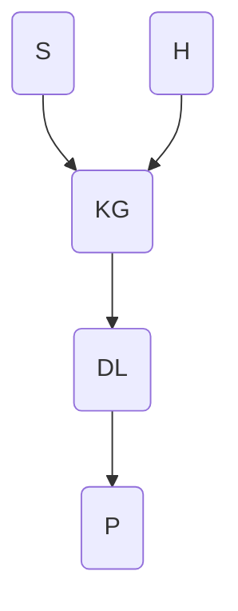
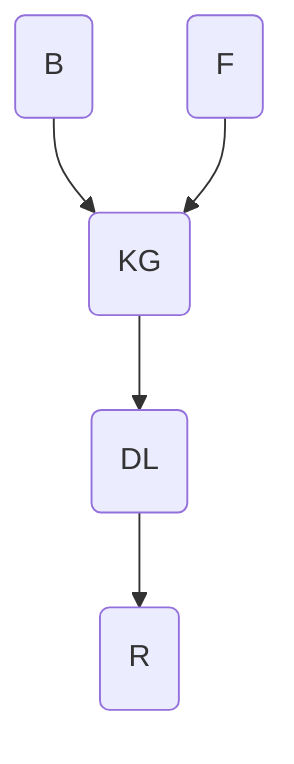
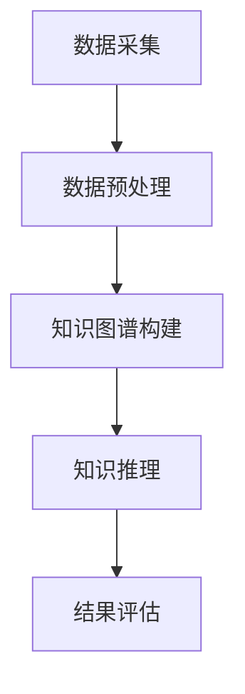
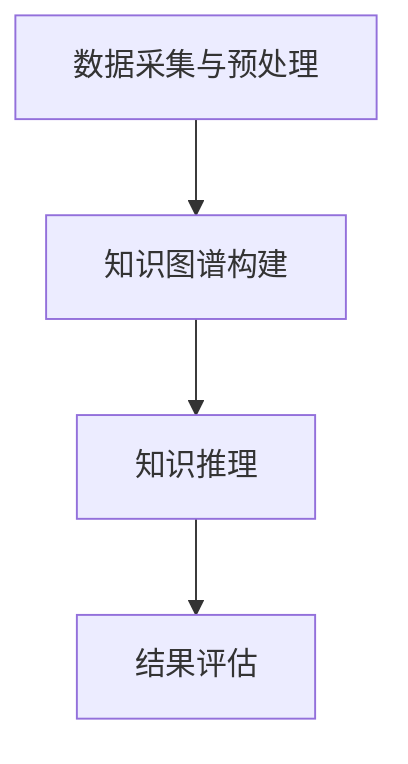
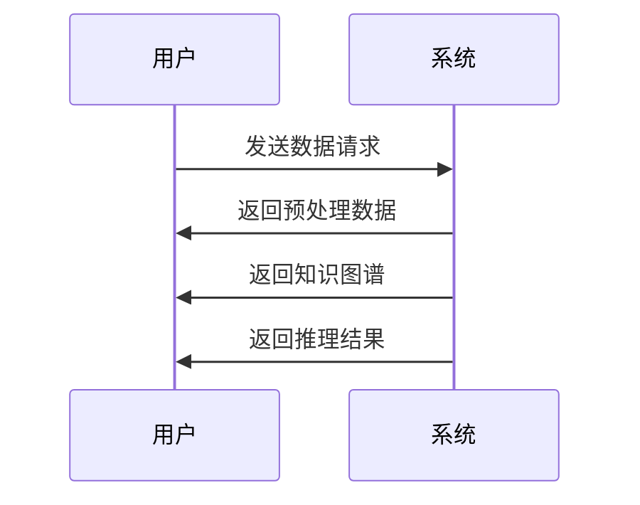

                 

### 《开发具有跨模态知识推理能力的AI Agent》

> 关键词：跨模态知识推理、AI Agent、算法原理、系统架构、项目实战、最佳实践

> 摘要：本文将深入探讨开发具有跨模态知识推理能力的AI Agent的各个方面。首先，我们将介绍AI Agent和跨模态知识推理的背景与核心概念，解析其重要性和应用场景。随后，通过详细讲解算法原理和数学模型，我们将会一步步揭示跨模态知识推理的机制。接着，通过系统分析与架构设计，我们将展示如何构建一个完整的跨模态知识推理系统。随后，我们将通过实际项目实战，提供环境安装、核心实现以及案例分析。最后，本文将总结最佳实践，并提出未来的发展趋势和拓展阅读建议。

----------------------------------------------------------------

### 第一部分：背景介绍与核心概念

#### 第1章：AI Agent与跨模态知识推理概述

#### 1.1 问题背景

**AI Agent的定义与发展历程**

- AI Agent是一种能够自主行动、感知环境并做出决策的智能体。
- 从简单的规则系统到现代的深度学习，AI Agent经历了多次技术革新。

**跨模态知识推理的重要性**

- 跨模态知识推理能够整合来自不同模态的数据，如文本、图像、音频等。
- 在医疗诊断、金融风险评估、智能家居等领域有着广泛的应用。

#### 1.2 问题描述

**当前AI技术的局限**

- 传统AI系统往往只能处理单一模态的数据。
- 无法充分利用多源数据之间的潜在关系。

**跨模态知识推理的需求与挑战**

- 需求：提高AI系统的理解和决策能力。
- 挑战：数据融合、一致性处理和推理效率。

#### 1.3 问题解决

**跨模态知识推理的概念**

- 跨模态知识推理是通过融合不同模态的数据，进行知识提取和推理。
- 其核心在于跨模态数据表示和知识表示。

**跨模态知识推理的应用场景**

- 智能问答系统：融合文本和图像信息，提供更精准的回答。
- 健康监测：结合医疗数据，进行疾病预测和治疗方案推荐。

#### 1.4 边界与外延

**跨模态知识推理的技术范围**

- 包括知识图谱构建、数据融合、深度学习等。
- 需要整合多种技术手段，实现高效的知识推理。

**跨模态知识推理与其他AI技术的关联**

- 与自然语言处理、计算机视觉、机器学习等紧密相关。
- 需要融合多种技术，形成综合解决方案。

#### 1.5 概念结构与核心要素组成

**跨模态知识推理的核心组成部分**

- 数据采集与预处理
- 知识图谱构建
- 知识推理与结果评估

**跨模态知识推理的关键技术点**

- 跨模态数据融合：如何有效地整合不同模态的数据。
- 知识表示与建模：如何构建有效的知识表示模型。
- 知识推理算法：如何进行高效的知识推理。

----------------------------------------------------------------

#### 第2章：核心概念与联系

##### 2.1 跨模态知识推理原理

**知识图谱的概念与构建**

- 知识图谱：表示实体、属性和关系的一种图形化数据结构。
- 知识图谱构建：从多源数据中提取实体、属性和关系。

**跨模态数据融合与表示**

- 跨模态数据融合：将不同模态的数据进行整合，形成统一的数据表示。
- 跨模态数据表示：如何表示跨模态数据，以支持知识推理。

##### 2.2 概念属性特征对比表格

**跨模态知识推理与传统AI算法的对比**

| 特征       | 跨模态知识推理 | 传统AI算法         |
| ---------- | -------------- | ------------------ |
| 数据来源   | 多模态         | 单模态             |
| 知识表示   | 知识图谱       | 基于特征的模型     |
| 推理机制   | 知识推理       | 基于规则的推理     |

**不同跨模态知识推理算法的对比**

| 算法       | 特点                           | 应用场景            |
| ---------- | ------------------------------ | ------------------ |
| KG+ML      | 知识图谱与机器学习相结合       | 智能问答系统       |
| KG+DL      | 知识图谱与深度学习相结合       | 自动驾驶、智能家居 |

##### 2.3 ER实体关系图架构

**跨模态知识推理的ER实体关系图**

- ER图：表示实体、属性和关系的图形化模型。
- 跨模态ER图：如何表示跨模态数据中的实体和关系。

**实体关系图的构建与应用**

- ER图构建：如何从数据中提取实体和关系。
- ER图应用：如何使用ER图进行知识推理和决策。

```mermaid
erDiagram
  知识源 ||--|{ 实体A }
  知识源 ||--|{ 实体B }
  实体A ||--|{ 属性X }
  实体A ||--|{ 属性Y }
  实体B ||--|{ 属性Z }
  实体A ||--|{ 关系R }
```

----------------------------------------------------------------

### 第二部分：算法原理讲解

#### 第3章：算法原理与数学模型

##### 3.1 跨模态知识推理算法概述

**常见跨模态知识推理算法**

- KG+ML：知识图谱与机器学习相结合
- KG+DL：知识图谱与深度学习相结合

**各算法的优缺点与适用场景**

| 算法       | 优点                         | 缺点                         | 适用场景         |
| ---------- | ---------------------------- | ---------------------------- | ---------------- |
| KG+ML      | 集成知识图谱和机器学习优势   | 计算复杂度高                 | 智能问答、推荐系统 |
| KG+DL      | 高效处理大规模数据           | 需要大量标注数据             | 自动驾驶、智能监控 |

##### 3.2 算法原理讲解

**基于知识图谱的跨模态知识推理**

- 知识图谱构建：如何从多源数据中提取实体、属性和关系。
- 知识图谱查询：如何使用知识图谱进行高效的知识查询。

**基于深度学习的跨模态知识推理**

- 深度学习模型：如何使用深度学习模型处理跨模态数据。
- 知识表示学习：如何通过深度学习学习跨模态数据的表示。

##### 3.3 数学模型与公式

**跨模态知识推理的数学模型**

- 知识图谱表示：实体、属性和关系的数学表示。
- 知识推理：基于图论的推理过程。

$$
P(Q|E,R) = \frac{P(Q \land E \land R)}{P(E \land R)}
$$

**公式推导与解释**

- 公式表示知识推理的概率计算，$Q$ 表示查询，$E$ 表示实体，$R$ 表示关系。

##### 3.4 举例说明

**实例分析：跨模态知识推理在医疗领域的应用**

- 问题：如何根据患者的症状和病史，预测可能的疾病？
- 数据：症状、病史、医学知识库。
- 推理过程：通过知识图谱构建和深度学习模型，进行跨模态知识推理。



**实例分析：跨模态知识推理在金融领域的应用**

- 问题：如何根据客户的行为数据和公司财务信息，评估投资风险？
- 数据：行为数据、财务报告、金融知识库。
- 推理过程：通过知识图谱构建和深度学习模型，进行跨模态知识推理。



----------------------------------------------------------------

#### 第4章：算法流程与流程图

##### 4.1 跨模态知识推理算法流程

**数据采集与预处理**

- 数据来源：多源数据，如文本、图像、音频等。
- 数据预处理：数据清洗、归一化、去噪等。

**知识图谱构建**

- 实体抽取：从数据中提取实体。
- 关系抽取：从数据中提取实体间的关系。
- 知识图谱构建：将实体和关系组织成知识图谱。

**知识推理与结果评估**

- 知识查询：从知识图谱中获取相关知识。
- 推理过程：基于知识图谱进行推理。
- 结果评估：评估推理结果的准确性。

##### 4.2 算法流程图



##### 4.3 Python源代码实现

**跨模态知识推理算法的Python源代码实现**

```python
# 数据采集与预处理
def collect_and_preprocess_data(data_sources):
    # 实现数据采集与预处理逻辑
    pass

# 知识图谱构建
def build_knowledge_graph(entities, relations):
    # 实现知识图谱构建逻辑
    pass

# 知识推理
def knowledge_reasoning(knowledge_graph, query):
    # 实现知识推理逻辑
    pass

# 结果评估
def evaluate_results(reasoning_results):
    # 实现结果评估逻辑
    pass

# 主函数
def main():
    data_sources = ["text_data", "image_data", "audio_data"]
    entities, relations = collect_and_preprocess_data(data_sources)
    knowledge_graph = build_knowledge_graph(entities, relations)
    query = "How is the market trend?"
    reasoning_results = knowledge_reasoning(knowledge_graph, query)
    evaluate_results(reasoning_results)

if __name__ == "__main__":
    main()
```



----------------------------------------------------------------

### 第三部分：系统分析与架构设计

#### 第5章：系统功能设计与架构设计

##### 5.1 项目介绍

**跨模态知识推理系统的总体设计思路**

- 需求分析：确定系统功能需求和性能指标。
- 技术选型：选择合适的算法和技术框架。
- 架构设计：设计系统的整体架构和模块划分。

**系统核心功能**

- 数据采集与预处理：收集和预处理多源数据。
- 知识图谱构建：构建跨模态知识图谱。
- 知识推理与结果评估：进行跨模态知识推理，评估推理结果。

##### 5.2 系统功能设计

**数据采集与预处理模块**

- 功能：从多源数据中提取有用信息。
- 技术实现：使用数据采集工具和预处理算法。

**知识图谱构建模块**

- 功能：构建包含实体、属性和关系的知识图谱。
- 技术实现：使用知识图谱构建工具和算法。

**知识推理与结果评估模块**

- 功能：基于知识图谱进行推理，评估推理结果。
- 技术实现：使用推理算法和评估指标。

##### 5.3 系统架构设计

**系统整体架构设计**

- 系统架构：分为数据层、服务层和界面层。
- 模块交互：各模块之间的数据流和控制流。

**各模块之间的交互关系**

- 数据流：数据在模块间的传递。
- 控制流：模块之间的调用和响应。

##### 5.4 系统接口设计

**系统提供的API接口**

- 接口定义：定义API接口的规格和参数。
- 接口实现：实现API接口的功能和调用方式。

**接口的使用说明**

- 使用文档：提供接口的使用说明和示例代码。

##### 5.5 系统交互图

**系统交互序列图**



----------------------------------------------------------------

### 第四部分：项目实战

#### 第6章：项目实战

##### 6.1 环境安装与配置

**系统所需环境及安装步骤**

- 硬件要求：CPU、内存、存储等。
- 软件要求：操作系统、编程语言、依赖库等。
- 安装步骤：安装操作系统、编程环境、依赖库。

**系统配置与调试**

- 配置文件：配置系统参数和配置信息。
- 调试方法：使用调试工具和日志分析进行调试。

##### 6.2 系统核心实现

**系统核心功能实现源代码**

- 数据采集与预处理：实现数据采集和预处理逻辑。
- 知识图谱构建：实现知识图谱构建逻辑。
- 知识推理与结果评估：实现知识推理和结果评估逻辑。

**源代码应用解读与分析**

- 解读：对核心代码进行详细解读。
- 分析：分析代码实现逻辑和性能优化。

##### 6.3 实际案例分析

**跨模态知识推理在现实场景中的应用案例**

- 场景选择：选择具有代表性的应用场景。
- 数据准备：准备相关数据集和测试数据。

**案例分析结果与讨论**

- 分析结果：展示推理结果和评估指标。
- 讨论内容：讨论案例分析的结果和改进方向。

##### 6.4 项目小结

**项目总结与反思**

- 项目完成情况：总结项目的完成情况。
- 项目经验与教训：反思项目中的经验和教训。

- 项目中的经验：技术选型、团队协作、项目管理等。
- 项目中的教训：问题解决、风险应对、改进方向等。

----------------------------------------------------------------

### 第五部分：最佳实践与拓展

#### 第7章：最佳实践

##### 7.1 实践技巧

**跨模态知识推理的最佳实践技巧**

- 数据质量：确保数据的质量和一致性。
- 模型选择：根据需求选择合适的模型。
- 参数调优：优化模型参数，提高推理效果。

**算法优化与性能调优**

- 算法优化：优化算法结构，提高推理效率。
- 性能调优：调整系统配置，提高系统性能。

##### 7.2 注意事项

**知识推理过程中可能遇到的问题及解决方案**

- 数据缺失：解决方案：使用数据增强技术。
- 数据噪声：解决方案：使用去噪算法。
- 模型过拟合：解决方案：使用正则化技术。

**系统部署与维护中的注意事项**

- 系统稳定性：确保系统稳定运行。
- 安全性：保护系统和数据的安全。
- 扩展性：设计可扩展的系统架构。

#### 第8章：小结与拓展

##### 8.1 小结

**全书内容的总结**

- 跨模态知识推理的重要性
- 算法原理与数学模型
- 系统架构设计与项目实战
- 最佳实践与注意事项

**跨模态知识推理的未来发展趋势**

- 新算法的引入和优化
- 数据集的扩充和多样性
- 跨领域应用的发展

##### 8.2 拓展阅读

**相关领域的最新研究进展**

- 知识图谱技术的研究进展
- 跨模态数据融合的进展
- 深度学习在知识推理中的应用

**进一步学习资源推荐**

- 相关论文和书籍
- 技术社区和论坛
- 开源项目和工具

----------------------------------------------------------------

### 作者信息

**作者：AI天才研究院/AI Genius Institute & 禅与计算机程序设计艺术 /Zen And The Art of Computer Programming**

本文由AI天才研究院和禅与计算机程序设计艺术共同撰写，旨在为读者提供关于开发具有跨模态知识推理能力的AI Agent的全面技术指南。作者团队拥有丰富的AI领域经验和深厚的技术功底，致力于推动人工智能技术的发展和应用。禅与计算机程序设计艺术则强调计算机程序设计的哲学和艺术，为AI技术的发展提供了独特的视角和方法。希望通过本文，读者能够更好地理解和应用跨模态知识推理技术，为AI领域的创新和发展贡献力量。

