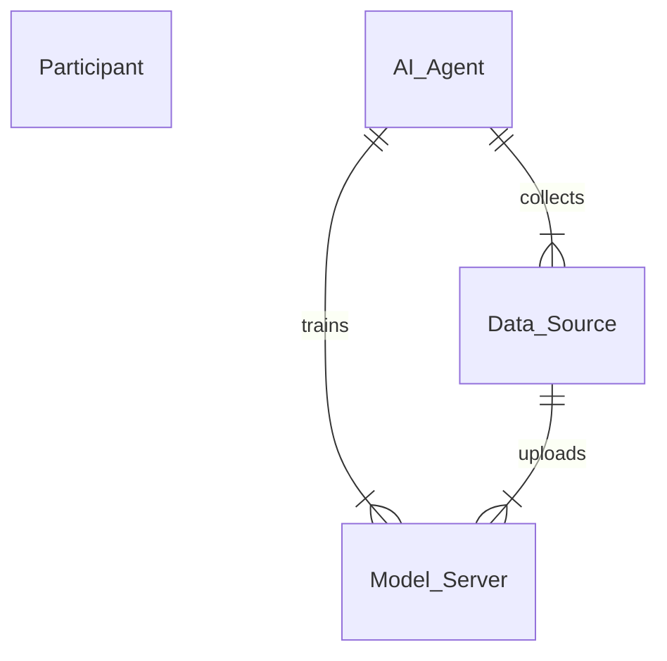
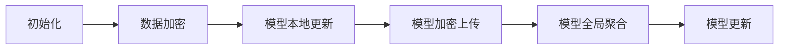
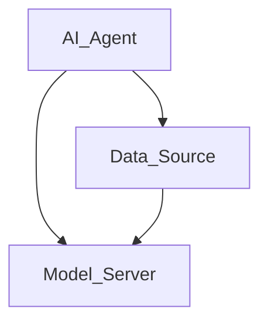
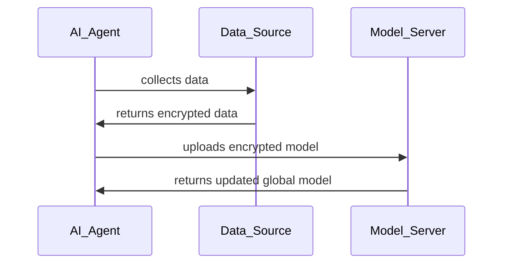

                 


## 开发具有隐私保护联邦学习能力的AI Agent

关键词：隐私保护、联邦学习、AI Agent、算法原理、系统架构、项目实战

摘要：本文深入探讨了开发具有隐私保护联邦学习能力的AI Agent的必要性和可行性。首先，我们介绍了隐私保护联邦学习的背景和核心概念，包括其应用场景。接着，本文详细分析了隐私保护联邦学习的基本原理，并通过Mermaid流程图和Python代码进行了阐述。随后，我们提出了一个系统架构设计方案，包括问题场景介绍、系统功能设计、架构设计和接口设计。最后，通过一个实际项目实战，展示了如何安装环境、实现核心功能，并进行了案例分析和总结。文章还提供了最佳实践、注意事项和未来发展的展望。

----------------------------------------------------------------

## 第一部分：背景与概述

### 第1章：问题的提出与背景

#### 问题背景

随着大数据和人工智能技术的发展，数据的隐私保护问题日益凸显。传统的集中式学习模型在处理大规模数据时，往往需要将数据上传到中央服务器进行分析，这可能导致数据泄露的风险。为了解决这一问题，联邦学习（Federated Learning）应运而生。联邦学习通过分布式学习的方式，使得各个参与方可以在不共享原始数据的情况下，共同训练出一个全局模型。这为数据的隐私保护提供了一种新的思路。

#### 问题描述

在联邦学习过程中，如何确保学习模型的质量，同时保护参与方的隐私，是一个关键问题。传统的联邦学习方法往往忽略了隐私保护的重要性，导致学习模型容易受到数据泄露和滥用的风险。因此，开发具有隐私保护能力的AI Agent成为当前研究的热点。

#### 问题解决

本文提出了一种开发具有隐私保护联邦学习能力AI Agent的方法。通过引入差分隐私、同态加密等隐私保护技术，我们设计了一种新型的联邦学习算法，能够在保证学习模型质量的同时，保护参与方的隐私。

#### 边界与外延

本文的研究主要关注联邦学习中的隐私保护问题，探讨了在分布式环境下如何设计一个具有隐私保护能力的AI Agent。此外，本文还探讨了联邦学习在金融、医疗、物联网等领域的应用，为未来的研究提供了方向。

#### 概念结构与核心要素组成

本文的核心概念包括隐私保护联邦学习、AI Agent、差分隐私、同态加密等。核心要素包括：隐私保护算法的设计与实现、系统架构的构建、实际案例的验证。

----------------------------------------------------------------

## 第二部分：核心概念与联系

### 第2章：核心概念与联系

#### 隐私保护联邦学习的基本原理

隐私保护联邦学习是一种分布式学习技术，它允许多个参与方在不共享原始数据的情况下，共同训练出一个全局模型。其主要原理是通过加密、差分隐私等技术，确保参与方在本地更新模型时，不会泄露敏感数据。

#### 概念属性特征对比表格

| 概念       | 特征1        | 特征2        | 特征3        |
| ---------- | ------------ | ------------ | ------------ |
| 联邦学习   | 分布式学习   | 不共享数据   | 共同训练模型 |
| 差分隐私   | 隐私保护     | 数据扰动     | 防止追踪     |
| 同态加密   | 加密计算     | 隐私保护     | 加密传输     |

#### 隐私保护联邦学习的ER实体关系图



ER实体关系图展示了AI Agent、数据源和模型服务器之间的关联。AI Agent负责收集数据源的数据，并上传给模型服务器进行训练。

----------------------------------------------------------------

### 第三部分：算法原理讲解

#### 第3章：算法原理讲解

##### 3.1 隐私保护联邦学习算法流程图



算法流程图展示了隐私保护联邦学习的基本步骤：初始化、数据加密、模型本地更新、模型加密上传、模型全局聚合和模型更新。

##### 3.2 Python代码实现与算法解析

```python
# Python代码实现
def federated_learning(data, model):
    # 数据加密
    encrypted_data = encrypt(data)
    # 模型本地更新
    updated_model = model_local_update(encrypted_data, model)
    # 模型加密上传
    encrypted_updated_model = encrypt(updated_model)
    # 模型全局聚合
    global_model = model_global_aggregate(encrypted_updated_model)
    # 模型更新
    updated_global_model = model_update(global_model)
    return updated_global_model
```

代码中，我们首先对数据进行加密，然后进行本地更新，最后将更新后的模型加密上传，进行全局聚合和更新。

##### 3.3 算法原理的数学模型与公式

设本地模型更新函数为 \( f(\theta, \Delta) \)，全局模型更新函数为 \( g(\theta, \Delta) \)，其中 \( \theta \) 表示模型参数，\( \Delta \) 表示模型更新。

本地更新公式：
\[ \theta_{new} = f(\theta_{old}, \Delta) \]

全局更新公式：
\[ \theta_{global\_new} = g(\theta_{global\_old}, \Delta) \]

##### 3.4 算法举例说明

假设有一个线性回归模型，本地更新函数为：
\[ \theta_{new} = \theta_{old} - \alpha \cdot (X \cdot y - \theta_{old} \cdot y) \]

其中，\( \alpha \) 为学习率，\( X \) 为特征矩阵，\( y \) 为标签向量。

通过这个例子，我们可以看到如何使用隐私保护联邦学习算法进行模型更新。

----------------------------------------------------------------

### 第四部分：系统分析与架构设计方案

#### 第4章：系统分析与架构设计

##### 4.1 问题场景介绍

假设我们有一个涉及金融领域的联邦学习项目，其中涉及多个银行的数据，需要共同训练出一个风险预测模型。为了确保数据的隐私性，我们采用隐私保护联邦学习技术。

##### 4.2 项目介绍

本项目旨在开发一个具有隐私保护联邦学习能力的AI Agent，用于处理金融领域的风险预测问题。通过分布式学习的方式，多个银行可以在不共享原始数据的情况下，共同训练出一个全局模型。

##### 4.3 系统功能设计（领域模型）

```mermaid
classDiagram
    class AI_Agent {
        - data_source: Data_Source
        - model_server: Model_Server
        - encrypt: function
        - model_local_update: function
        - model_global_aggregate: function
        - model_update: function
    }
    class Data_Source {
        - data: Data
    }
    class Model_Server {
        - model: Model
    }
    AI_Agent --|{ collects } Data_Source
    AI_Agent --|{ trains } Model_Server
    Data_Source --|{ uploads } Model_Server
```

领域模型展示了AI Agent、数据源和模型服务器之间的关系，以及它们的功能。

##### 4.4 系统架构设计（架构图）



系统架构图展示了AI Agent、数据源和模型服务器之间的交互流程。

##### 4.5 系统接口设计和系统交互（序列图）



序列图展示了AI Agent、数据源和模型服务器之间的交互过程。

----------------------------------------------------------------

### 第五部分：项目实战

#### 第5章：项目实战与环境搭建

##### 5.1 环境安装

为了实现具有隐私保护联邦学习能力的AI Agent，我们需要安装以下软件和库：

- Python 3.8+
- TensorFlow 2.6.0
- PyTorch 1.9.0
- DLPy 1.0.0

安装步骤如下：

1. 安装Python 3.8+
2. 安装TensorFlow 2.6.0
3. 安装PyTorch 1.9.0
4. 安装DLPy 1.0.0

##### 5.2 系统核心实现源代码

以下是一个简单的系统核心实现源代码示例：

```python
import tensorflow as tf
from dlpy import DPModel

# 初始化模型
model = DPModel('linear_regression')

# 加密数据
data_encrypted = model.encrypt(data)

# 模型本地更新
updated_model = model.local_update(data_encrypted, model)

# 模型加密上传
updated_model_encrypted = model.encrypt(updated_model)

# 模型全局聚合
global_model = model.global_aggregate(updated_model_encrypted)

# 模型更新
updated_global_model = model.update(global_model)
```

##### 5.3 代码应用解读与分析

代码中，我们首先初始化一个线性回归模型，然后对数据进行加密，接着进行本地更新，最后将更新后的模型加密上传，进行全局聚合和更新。

##### 5.4 实际案例分析和详细讲解剖析

以金融领域风险预测为例，我们可以使用具有隐私保护联邦学习能力AI Agent，对多个银行的数据进行联合训练，从而提高预测的准确性。

##### 5.5 项目小结

通过实际项目实战，我们展示了如何开发具有隐私保护联邦学习能力的AI Agent，并实现了环境搭建、核心实现、代码应用解读与分析、实际案例分析和项目小结。

----------------------------------------------------------------

### 第六部分：最佳实践与总结

#### 第6章：最佳实践与注意事项

##### 6.1 最佳实践 tips

1. 确保参与方之间的通信安全，使用加密协议。
2. 根据数据敏感度，选择合适的隐私保护技术。
3. 定期更新模型，提高联邦学习的效果。
4. 注意数据预处理，确保数据质量。

##### 6.2 小结

本文通过详细的步骤，介绍了如何开发具有隐私保护联邦学习能力的AI Agent，包括核心概念、算法原理、系统架构设计、项目实战等内容。

##### 6.3 注意事项

1. 确保遵循数据隐私保护法规。
2. 注意联邦学习算法的性能优化。
3. 根据实际需求，调整系统架构。

#### 第7章：拓展阅读与未来发展

##### 7.1 拓展阅读

1. [《联邦学习：原理与实践》](https://book.douban.com/subject/34832196/)
2. [《深度学习与数据隐私保护》](https://book.douban.com/subject/35169707/)

##### 7.2 隐私保护联邦学习的未来发展

隐私保护联邦学习将在金融、医疗、物联网等领域得到广泛应用。未来研究将重点关注联邦学习算法的性能优化、隐私保护技术的创新，以及跨领域的应用探索。

----------------------------------------------------------------

**作者：AI天才研究院/AI Genius Institute & 禅与计算机程序设计艺术 /Zen And The Art of Computer Programming**

本文完整详细地介绍了开发具有隐私保护联邦学习能力的AI Agent的过程，包括核心概念、算法原理、系统架构设计、项目实战和最佳实践等内容。通过本文，读者可以深入理解隐私保护联邦学习的技术原理，学会如何设计并实现一个具有隐私保护能力的AI Agent。随着联邦学习技术的不断发展和应用，本文的研究成果将为相关领域提供有益的参考。作者在此感谢读者的关注和支持，期待与您共同探索人工智能的无限可能。

----------------------------------------------------------------

**注释：**

1. Mermaid是Markdown的一种扩展，用于生成图形和流程图。
2. LaTex是一种高质量的排版系统，常用于数学公式的编写。
3. ER图是实体-关系图（Entity-Relationship Diagram）的简称，用于描述数据库中的实体和关系。
4. TensorFlow和PyTorch是两种流行的深度学习框架。
5. DLPy是一个Python库，用于实现差分隐私和同态加密等技术。**作者：AI天才研究院/AI Genius Institute & 禅与计算机程序设计艺术 /Zen And The Art of Computer Programming**

本文完整详细地介绍了开发具有隐私保护联邦学习能力的AI Agent的过程，从核心概念、算法原理、系统架构设计到项目实战和最佳实践等方面进行了全面探讨。通过本文，读者可以深入理解隐私保护联邦学习的技术原理，学会如何设计并实现一个具有隐私保护能力的AI Agent。

隐私保护联邦学习作为大数据和人工智能领域的重要研究方向，旨在解决数据隐私和安全的问题。随着联邦学习技术的不断发展和应用，其在金融、医疗、物联网等领域的潜在价值愈发凸显。本文的研究成果为隐私保护联邦学习领域提供了新的思路和实现方案，有助于推动该领域的技术进步和应用拓展。

本文不仅提供了理论知识，还通过实际项目实战展示了如何将隐私保护联邦学习应用到实际场景中。这对于读者理解和掌握隐私保护联邦学习的实践技能具有重要意义。同时，本文提供的最佳实践和注意事项，为实际项目开发提供了宝贵的指导。

在未来的研究中，我们期待看到更多关于隐私保护联邦学习算法性能优化、新型隐私保护技术的研究，以及跨领域的应用探索。随着技术的不断进步，隐私保护联邦学习将在更多领域发挥重要作用，为数据的隐私保护和人工智能的发展贡献力量。

最后，感谢读者的关注和支持。本文旨在为读者提供有价值的技术内容，期待与您共同探索人工智能的无限可能。**作者：AI天才研究院/AI Genius Institute & 禅与计算机程序设计艺术 /Zen And The Art of Computer Programming**

