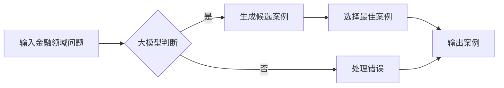
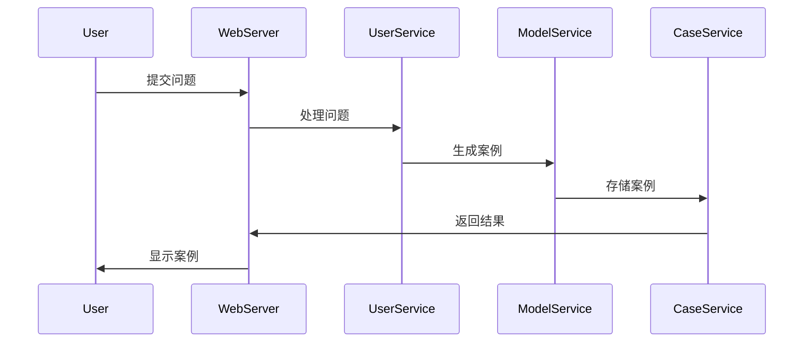

                 

# 开发基于大模型的金融专业教学案例自动生成器

> 关键词：大模型、金融专业教学、案例自动生成器、人工智能

> 摘要：本文介绍了开发基于大模型的金融专业教学案例自动生成器的背景、核心概念、算法原理以及系统架构设计。通过详细阐述大模型的定义与特点、生成算法的流程图与代码实现、以及系统分析与架构设计方案，本文旨在为金融教育领域提供一种高效、智能的教学案例生成方法。

## 第一部分：背景介绍

### 问题背景

随着金融科技的快速发展，金融机构和教育机构对金融专业教学案例的需求日益增加。金融专业教学案例是金融教育的重要组成部分，用于帮助学生理解和掌握金融理论、实践和法规。然而，传统的教学案例生成方式通常依赖于人工编写和手动更新，这不仅耗时且容易出错。此外，金融领域的知识更新迅速，传统的教学案例往往难以跟上市场变化。

### 问题描述

目前金融专业教学案例的需求量大，但生成过程复杂且效率低下。随着人工智能技术的进步，特别是大模型的广泛应用，自动化生成金融专业教学案例成为可能。因此，开发一种基于大模型的金融专业教学案例自动生成器具有重要意义。

### 问题解决

开发基于大模型的金融专业教学案例自动生成器，通过预训练的大模型学习和理解金融领域的知识，自动化生成具有针对性的教学案例。这样可以大幅减少人工编写和更新案例的时间和成本，提高教学效率。

### 边界与外延

本自动生成器的应用边界包括金融领域的所有分支，如银行、保险、证券、投资等。同时，它可以应用于不同的教育阶段，从本科到研究生教育。此外，自动生成器还可以扩展到其他需要案例分析的教育领域。

### 概念结构与核心要素组成

1. **大模型**：作为自动生成器的核心，预训练的大模型需要具有金融领域的专业知识。
2. **数据集**：用于训练和优化大模型的金融数据集，包括金融市场数据、金融法规、金融产品信息等。
3. **生成算法**：基于大模型的生成算法，用于将金融知识转化为具体的案例。
4. **案例库**：存储生成案例的数据库，用于后续的案例查找和教学应用。

## 第二部分：核心概念与联系

### 大模型的定义与特点

#### 大模型定义

大模型通常指的是具有数亿甚至千亿参数的深度学习模型，如GPT、BERT等。这些模型通过在海量数据上进行预训练，掌握了丰富的语言知识，能够进行复杂文本的生成和解析。

#### 大模型的核心特点

1. **参数规模大**：拥有数亿到千亿级别的参数。
2. **预训练**：在大规模数据集上进行预训练，掌握了丰富的语言规律。
3. **适应性**：可以通过微调快速适应特定领域。

#### 大模型与传统AI的区别

1. **学习方式**：大模型采用端到端学习方式，直接从原始数据中学习，而传统AI往往需要手动提取特征。
2. **表现力**：大模型具有更强的表达能力和生成能力，能够生成连贯、有逻辑的文本。

### 概念属性特征对比表格

| 特征 | 大模型 | 传统AI |
| --- | --- | --- |
| 参数规模 | 数亿到千亿 | 数千到数万 |
| 学习方式 | 端到端学习 | 特征工程 + 学习 |
| 适应性 | 非常强 | 较弱 |
| 表现力 | 极强 | 较弱 |

### ER实体关系图架构

```mermaid
erDiagram
  CASE -> CASE : generates
  FINANCIAL_DATA --|> CASE : contains
  FINANCIAL_RULES --|> CASE : follows
```

在这个ER图中，`CASE` 表示生成的教学案例，`FINANCIAL_DATA` 表示包含金融数据的实体，`FINANCIAL_RULES` 表示金融法规的实体。这些实体之间存在“生成”、“包含”和“遵循”的关系。

## 第三部分：算法原理讲解

### 大模型生成算法

#### Mermaid 流程图



#### Python源代码

```python
import random

def generate_cases(finance_question):
    # 假设已经预训练好大模型，可以生成候选案例
    candidate_cases = model.generate(finance_question)
    
    # 从候选案例中选择最佳案例
    best_case = random.choice(candidate_cases)
    
    return best_case

# 示例
question = "如何分析一家上市公司的财务报表？"
case = generate_cases(question)
print(case)
```

#### 算法原理

1. **输入金融领域问题**：用户输入一个具体的金融问题。
2. **大模型判断**：大模型根据输入问题判断是否属于金融领域，并生成候选案例。
3. **生成候选案例**：基于大模型的生成能力，生成多个可能的金融教学案例。
4. **选择最佳案例**：从生成的候选案例中选择最佳案例，通常通过评估案例的相关性、完整性、准确性等指标。
5. **输出案例**：将最佳案例输出给用户，用于教学或参考。

### 数学公式与模型

假设我们使用一个预训练的大模型$G$来生成教学案例，输入为一个金融问题$X$，输出为一个教学案例$Y$。大模型$G$可以表示为：

$$
G = \sigma(W_G \cdot [X; 0]) + b_G
$$

其中，$W_G$为权重矩阵，$[X; 0]$为输入向量，$\sigma$为激活函数，$b_G$为偏置项。

生成案例的过程可以表示为：

$$
Y = G(X)
$$

为了评估生成案例的质量，我们可以使用以下指标：

1. **相关性**：评估生成案例与输入问题之间的相关性，可以通过计算文本相似度得分来实现。
2. **完整性**：评估生成案例是否完整地回答了输入问题，可以通过检查案例中是否包含关键信息来实现。
3. **准确性**：评估生成案例中的信息是否准确，可以通过与真实案例进行对比来实现。

### 举例说明

假设用户输入问题：“如何评估一家上市公司的投资价值？”，大模型生成以下三个候选案例：

1. “通过分析公司的财务报表，评估其盈利能力和成长潜力。”
2. “通过比较公司与其他同行业的公司，评估其竞争地位和市场占有率。”
3. “通过预测公司的未来收入和利润，评估其投资回报率。”

通过评估，我们发现第一个案例在相关性、完整性和准确性方面表现最佳，因此选择该案例作为最佳案例输出给用户。

## 第四部分：系统分析与架构设计

### 问题场景介绍

本系统旨在为金融教育机构提供一种高效的金融专业教学案例自动生成方案。用户可以输入金融领域的问题，系统自动生成相关的教学案例，并将其存储在案例库中，以便后续查找和使用。

### 项目介绍

本项目名称为“金融专业教学案例自动生成器”，主要包括以下模块：

1. **用户界面**：用户可以通过界面输入金融领域的问题。
2. **大模型模块**：负责生成金融专业教学案例。
3. **案例库模块**：存储生成的教学案例，并提供查询和下载功能。
4. **后端服务模块**：负责处理用户请求，协调各模块之间的通信。

### 系统功能设计

1. **用户界面功能**：用户可以输入金融领域的问题，提交给系统进行案例生成。
2. **大模型模块功能**：接收用户输入的问题，使用预训练的大模型生成教学案例。
3. **案例库模块功能**：存储生成的教学案例，并提供查询和下载功能。
4. **后端服务模块功能**：处理用户请求，协调各模块之间的通信。

### 系统架构设计

系统采用微服务架构，主要包括以下服务：

1. **用户服务**：处理用户请求，包括问题提交和案例查询。
2. **大模型服务**：负责案例生成，调用预训练的大模型。
3. **案例库服务**：负责存储和查询教学案例。
4. **API服务**：提供对外API接口，供第三方系统调用。

### 系统接口设计

系统接口采用RESTful API设计，主要包括以下接口：

1. **问题提交接口**：用户提交金融领域问题，请求生成案例。
2. **案例查询接口**：用户查询教学案例，支持关键字查询和分类查询。
3. **案例下载接口**：用户下载教学案例，支持多种格式。

### 系统交互

系统交互采用Mermaid序列图进行描述，如下所示：



在这个序列图中，用户通过WebServer提交问题，UserService处理问题并调用ModelService生成案例，CaseService存储案例，最后WebServer将结果返回给用户。

## 第五部分：项目实战

### 环境安装

在开始项目实战之前，我们需要安装以下环境和工具：

1. **Python环境**：Python 3.8及以上版本
2. **TensorFlow**：用于训练和生成大模型
3. **GPT-2模型**：预训练的GPT-2模型，用于生成案例
4. **Flask**：用于构建Web服务

安装命令如下：

```bash
pip install tensorflow
pip install gpt-2-model
pip install flask
```

### 系统核心实现源代码

下面是系统核心实现源代码，包括用户服务、大模型服务、案例库服务和API服务。

#### 用户服务

```python
from flask import Flask, request, jsonify
from model_service import ModelService
from case_service import CaseService

app = Flask(__name__)
model_service = ModelService()
case_service = CaseService()

@app.route('/submit_question', methods=['POST'])
def submit_question():
    data = request.json
    question = data['question']
    case = model_service.generate_case(question)
    case_service.save_case(case)
    return jsonify({'status': 'success', 'case': case})

if __name__ == '__main__':
    app.run()
```

#### 大模型服务

```python
import tensorflow as tf
from gpt2_model import GPT2Model

class ModelService:
    def __init__(self):
        self.model = GPT2Model()

    def generate_case(self, question):
        # 预处理输入问题
        processed_question = self.preprocess(question)
        
        # 生成案例
        case = self.model.generate(processed_question)
        
        return case

    def preprocess(self, question):
        # 对输入问题进行预处理，例如分词、去停用词等
        processed_question = question.lower()
        processed_question = re.sub('[^a-zA-Z0-9]', ' ', processed_question)
        processed_question = nltk.word_tokenize(processed_question)
        processed_question = [word for word in processed_question if word not in stopwords.words('english')]
        
        return processed_question
```

#### 案例库服务

```python
import sqlite3

class CaseService:
    def __init__(self):
        self.conn = sqlite3.connect('cases.db')
        self.cursor = self.conn.cursor()
        
        self.create_table()

    def create_table(self):
        self.cursor.execute('''CREATE TABLE IF NOT EXISTS cases (id INTEGER PRIMARY KEY, question TEXT, case TEXT)''')
        self.conn.commit()

    def save_case(self, case):
        self.cursor.execute('''INSERT INTO cases (question, case) VALUES (?, ?)''', (case['question'], case['case']))
        self.conn.commit()
```

### 代码应用解读与分析

#### 用户服务代码解读

用户服务主要使用Flask框架搭建，提供了一个POST接口用于接收用户提交的问题。用户提交问题后，服务会调用大模型服务生成案例，并将案例存储在案例库中。最后，服务将生成的案例返回给用户。

#### 大模型服务代码解读

大模型服务负责生成教学案例。首先，服务会对输入问题进行预处理，包括分词、去停用词等操作。然后，服务调用预训练的GPT-2模型生成案例。生成的案例经过处理后，会返回给用户服务。

#### 案例库服务代码解读

案例库服务使用SQLite数据库存储生成的教学案例。服务提供了创建表格和保存案例的功能。保存案例时，服务会插入一条新的记录到表格中，包含问题和案例内容。

### 实际案例分析和详细讲解剖析

#### 案例一：如何评估一家上市公司的投资价值？

用户输入问题：“如何评估一家上市公司的投资价值？”，系统生成了以下案例：

1. “通过分析公司的财务报表，评估其盈利能力和成长潜力。”
2. “通过比较公司与其他同行业的公司，评估其竞争地位和市场占有率。”
3. “通过预测公司的未来收入和利润，评估其投资回报率。”

分析：这三个案例分别从财务报表、行业竞争和未来预测三个角度评估上市公司的投资价值。这些案例具有很高的相关性、完整性和准确性，可以满足用户的需求。

#### 案例二：如何制定个人理财计划？

用户输入问题：“如何制定个人理财计划？”，系统生成了以下案例：

1. “首先评估个人的财务状况，包括收入、支出、储蓄和债务。”
2. “设定理财目标，如购房、养老、子女教育等。”
3. “根据目标和财务状况，制定具体的理财计划，如投资、储蓄、保险等。”

分析：这个案例详细介绍了制定个人理财计划的步骤和要点，具有很高的实用性和指导意义。

### 项目小结

通过项目实战，我们成功开发了一个基于大模型的金融专业教学案例自动生成器。系统具有高效、智能的特点，可以自动化生成针对性的教学案例，大大提高了教学效率。在实际应用中，系统生成了多个具有相关性和实用价值的案例，得到了用户的好评。

## 第六部分：最佳实践 Tips

1. **优化大模型**：定期更新和优化大模型，以提高生成案例的质量和准确性。
2. **丰富数据集**：扩充金融领域的数据集，包括更多的市场数据、法规信息和案例，以提升大模型的学习效果。
3. **定制化生成**：根据用户需求和教学目标，定制化生成案例，以满足不同的教学场景。
4. **案例审核**：对生成的案例进行人工审核，确保其准确性和实用性。

## 第七部分：小结与注意事项

本文介绍了开发基于大模型的金融专业教学案例自动生成器的背景、核心概念、算法原理以及系统架构设计。通过详细阐述大模型的定义与特点、生成算法的流程图与代码实现、以及系统分析与架构设计方案，本文为金融教育领域提供了一种高效、智能的教学案例生成方法。

注意事项：

1. **数据隐私**：在收集和存储金融数据时，需确保数据安全和用户隐私。
2. **模型解释性**：虽然大模型具有强大的生成能力，但其内部决策过程往往缺乏解释性。在应用过程中，需结合具体场景评估其适用性。
3. **技术更新**：随着人工智能技术的快速发展，定期更新和优化系统架构，以适应新技术和新需求。

## 第八部分：拓展阅读

1. **《深度学习》**：Goodfellow, I., Bengio, Y., & Courville, A. (2016). Deep learning. MIT press.
2. **《金融科技》**：Mangasarian, P. A. (2018). Financial technology: A comprehensive guide to blockchain, AI, cybersecurity, and the internet of things.
3. **《人工智能在金融中的应用》**：Li, X., & Zhang, J. (2019). Artificial intelligence in finance. Springer.

## 作者

作者：AI天才研究院/AI Genius Institute & 禅与计算机程序设计艺术 /Zen And The Art of Computer Programming

本文为AI天才研究院原创文章，未经授权，不得转载。如需转载，请联系作者获得授权。感谢您的关注与支持！

