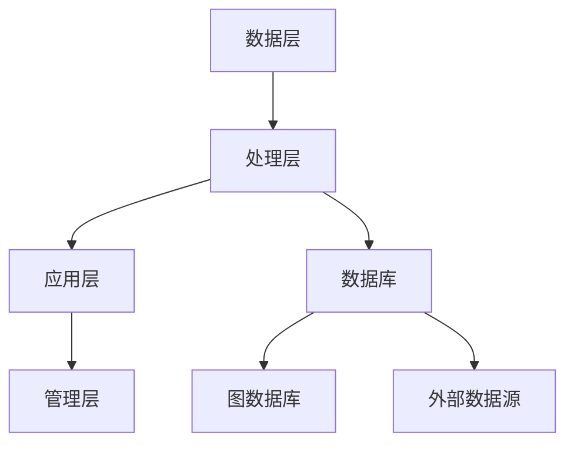

                 

### 知识图谱与金融领域

#### 第1章：知识图谱与金融领域

**1.1 问题背景**

金融领域作为现代经济体系的基石，其复杂性使得信息管理和决策支持成为了一项极具挑战性的任务。金融机构每天处理大量的数据，包括交易记录、客户信息、市场动态等。这些数据不仅是业务的支撑，更是决策和风险管理的关键依据。然而，传统的关系数据库和数据分析方法在面对如此海量的复杂信息时显得力不从心。知识图谱作为一种新兴的数据管理和分析方法，能够将金融领域的专业知识和数据结构化、关联化，从而提高信息的利用效率，支持更智能化的决策。

**问题描述**

在金融领域中，存在以下几个典型问题：

1. **数据孤岛**：金融机构内部存在大量的数据源，但它们通常以独立的数据库形式存在，难以进行跨系统的数据整合和分析。
2. **信息碎片化**：即使在同一系统中，金融数据也常常被分割成多个表格或数据文件，缺乏全局关联性。
3. **复杂决策**：金融产品的复杂性和市场变化的不确定性，使得决策过程需要处理大量的变量和关系。
4. **风险管理**：金融机构需要实时监控和管理风险，这要求对市场数据、客户行为、金融产品等多维数据进行综合分析。

**问题解决**

知识图谱作为一种新兴的数据管理和分析技术，可以解决上述问题。知识图谱通过将金融领域的专业知识和数据结构化、关联化，形成一张巨大的关联网络，使得信息能够在图谱中高效地流动和利用。具体来说，知识图谱可以：

1. **跨系统数据整合**：通过知识图谱将不同系统中的数据进行关联，消除数据孤岛。
2. **信息全局关联**：将金融数据与知识体系关联，提供全局视角。
3. **智能决策支持**：利用图谱中的关联关系，支持复杂的金融决策。
4. **实时风险监控**：通过知识图谱中的数据关联，实现对市场动态和客户行为的实时监控。

**边界与外延**

知识图谱在金融领域的应用不仅局限于传统的银行业务，还扩展到了保险、证券、基金等多个领域。例如，在保险业中，知识图谱可以用于客户风险评估和保险产品推荐；在证券市场中，知识图谱可以用于股票分析和投资策略制定。

**概念结构与核心要素组成**

知识图谱由节点、边和属性三部分组成。节点代表实体（如客户、产品、市场等），边代表实体之间的关系（如购买、交易等），属性则是节点和边的额外描述信息（如客户的年龄、产品的收益等）。

在金融知识图谱中，核心要素包括：

1. **实体**：如金融机构、金融产品、客户等。
2. **关系**：如购买、交易、评级等。
3. **属性**：如客户年龄、产品收益率等。

**本章小结**

本章介绍了知识图谱在金融领域的应用背景、问题和解决方法。知识图谱通过将金融领域的数据和知识结构化、关联化，为金融机构提供了更高效、智能的数据管理和分析工具。在接下来的章节中，我们将深入探讨大模型和知识图谱的关系，以及如何构建一个基于大模型的金融专业教材知识图谱构建器。

### 知识图谱概述

**1.2 知识图谱概述**

知识图谱（Knowledge Graph）是一种用于结构化、关联化和语义化的知识表示方法，通过将实体、关系和属性进行图结构化组织，形成一张巨大的关联网络。知识图谱的核心在于其关联性，通过实体之间的关系，知识图谱能够揭示出数据之间的隐藏关联，提供更全面、深入的分析视角。

**知识图谱的定义**

知识图谱是一种语义网络，它通过将实体、关系和属性进行结构化表示，使得数据之间能够通过语义关联进行有效连接。知识图谱不仅仅是一个数据集合，它还包含了对数据的理解和解释，使得机器能够更好地理解和处理这些数据。

**知识图谱的组成部分**

知识图谱由以下几个核心组成部分构成：

1. **实体（Entity）**：代表知识图谱中的主要对象，如人、地点、组织、物品等。实体是知识图谱中的基本元素，每一个实体都可以被唯一标识。
   
2. **关系（Relationship）**：表示实体之间的关联，如“购买”、“交易”、“属于”等。关系连接了两个或多个实体，并赋予它们语义上的联系。
   
3. **属性（Attribute）**：对实体或关系的额外描述，如“年龄”、“身高”、“收益率”等。属性提供了实体的具体特征信息，使得实体更加具体和可操作。

**知识图谱在金融领域的应用**

知识图谱在金融领域的应用非常广泛，以下是一些典型应用场景：

1. **客户关系管理**：通过知识图谱将客户的个人信息、交易记录、投资偏好等数据进行关联，实现对客户的全景分析，提供个性化的产品推荐和服务。

2. **风险管理**：知识图谱可以用于整合金融市场的各种数据，如股票价格、交易量、新闻资讯等，通过分析这些数据的关联关系，实现对市场风险的实时监控和预测。

3. **金融产品推荐**：基于客户的历史交易记录和投资偏好，知识图谱可以推荐适合客户的金融产品，如股票、基金、保险等。

4. **信用评估**：通过知识图谱将客户的信用记录、交易行为、社会关系等数据进行关联，实现对客户信用风险的评估。

5. **市场分析**：知识图谱可以帮助金融机构进行市场分析，如通过分析股票市场中的交易关系、资金流向等，预测市场趋势和投资机会。

**本章小结**

本章对知识图谱进行了概述，详细介绍了知识图谱的定义、组成部分以及在金融领域的应用。知识图谱作为一种强大的知识表示和数据分析工具，在金融领域具有广泛的应用前景。在接下来的章节中，我们将深入探讨大模型在知识图谱构建中的作用，以及如何将大模型与知识图谱相结合，构建一个基于大模型的金融专业教材知识图谱构建器。

### 大模型概述

**1.3 大模型概述**

随着人工智能技术的不断发展，大模型（Large Models）逐渐成为人工智能研究与应用中的重要方向。大模型通常指的是具有巨大参数量和计算复杂度的深度学习模型，它们能够通过大量的数据训练，实现对复杂任务的强大建模能力。

**大模型的定义**

大模型通常是指那些具有数十亿甚至千亿级参数的深度学习模型，如GPT、BERT等。这些模型通过大量的训练数据，能够自动学习到丰富的知识和规律，从而在各种复杂任务上表现出色。

**大模型在知识图谱构建中的作用**

在知识图谱构建中，大模型发挥着至关重要的作用。具体来说，大模型可以在以下几个方面提升知识图谱的构建和应用效果：

1. **实体识别和关系抽取**：大模型可以通过预训练模型，如BERT，自动识别文本中的实体和它们之间的关系。这种自动化的识别方法大大提高了知识图谱构建的效率和准确性。
   
2. **知识融合和补全**：大模型能够处理大量的无标签数据，通过无监督或半监督学习，自动融合和补全知识图谱中的缺失信息。这种方法使得知识图谱能够更全面地反映现实世界中的知识结构。

3. **推理和预测**：大模型强大的建模能力可以用于知识图谱的推理和预测任务。例如，通过大模型可以预测实体之间的潜在关系，从而扩展知识图谱的关联网络。

**本章小结**

本章介绍了大模型的定义及其在知识图谱构建中的作用。大模型凭借其巨大的参数量和计算复杂度，能够自动学习到丰富的知识，从而显著提升知识图谱的构建和应用效果。在接下来的章节中，我们将进一步探讨大模型和知识图谱的结合方法，以及如何开发一个基于大模型的金融专业教材知识图谱构建器。

### 本书结构

**1.4 本书结构**

本书旨在深入探讨基于大模型的金融专业教材知识图谱构建器，内容分为五个主要部分：

1. **引言**：介绍知识图谱和金融领域的背景，以及大模型在知识图谱构建中的作用。
   
2. **大模型基础知识**：详细介绍大模型的基本原理，包括数学基础、训练和优化方法，以及大模型在金融领域的应用。

3. **知识图谱构建基础**：讲解知识图谱的基本概念、知识表示方法、知识抽取和融合方法，以及金融领域知识图谱的构建和应用。

4. **大模型与知识图谱的集成应用**：探讨大模型在知识图谱构建中的应用，包括知识抽取、知识表示、知识融合和知识推理。

5. **项目实战**：通过实际项目案例，展示基于大模型的金融专业教材知识图谱构建器的开发过程和应用效果。

**本章小结**

本书结构清晰，旨在帮助读者逐步了解并掌握基于大模型的金融专业教材知识图谱构建技术。通过各个部分的详细讲解和实际项目案例，读者可以全面了解这一前沿技术的原理和应用。在接下来的章节中，我们将逐步深入各个部分，为读者揭示基于大模型的金融知识图谱构建的奥秘。

### 大模型基础知识

#### 第2章：大模型的基本原理

**2.1 大模型的起源与发展**

大模型的发展历程可以追溯到20世纪80年代，当时神经网络的研究开始兴起，特别是1986年Rumelhart, Hinton和Williams提出的反向传播算法（Backpropagation），使得神经网络训练效率得到了显著提升。然而，早期的神经网络模型由于参数数量有限，无法处理大规模的数据，因此在很长一段时间内并未得到广泛应用。

随着计算能力的提升和数据量的增加，深度学习（Deep Learning）逐渐成为人工智能领域的主流方向。2012年，Hinton等人的研究团队在ImageNet图像识别比赛中取得了突破性成绩，这标志着深度学习技术的崛起。此后，深度学习模型不断优化，参数量和计算复杂度不断增大，从而催生了大模型的出现。

**大模型的关键技术**

大模型的关键技术主要包括以下几个方面：

1. **深度神经网络（Deep Neural Network）**：深度神经网络通过增加网络层数，使得模型能够学习到更复杂的特征。大模型通常具有数十亿甚至千亿个参数，能够处理大规模的数据。

2. **大数据（Big Data）**：大模型需要大量的数据来训练，这些数据包括标注数据和无标签数据。大数据的获取和预处理是构建大模型的基础。

3. **高效训练算法**：为了训练大模型，需要采用高效的训练算法，如随机梯度下降（Stochastic Gradient Descent，SGD）及其变种。这些算法通过并行计算和分布式计算，大大提高了训练效率。

4. **优化器（Optimizer）**：优化器用于调整模型参数，以最小化损失函数。常见的优化器包括Adam、RMSprop等，它们通过自适应调整学习率，提高了模型的收敛速度和稳定性。

5. **正则化技术**：为了防止模型过拟合，大模型通常采用正则化技术，如L1、L2正则化、Dropout等。这些技术通过惩罚模型复杂度，提高了模型的泛化能力。

**大模型的数学基础**

大模型的数学基础主要包括以下几个方面：

1. **神经网络（Neural Networks）**：神经网络是深度学习的基础，通过模拟生物神经网络的结构和功能，实现数据的自动特征提取和分类。

2. **深度学习（Deep Learning）**：深度学习通过增加网络层数，使得模型能够学习到更复杂的特征。深度学习模型的核心是反向传播算法，通过不断调整模型参数，最小化损失函数。

3. **损失函数（Loss Function）**：损失函数用于衡量模型预测结果与真实结果之间的差异。常见的损失函数包括均方误差（MSE）、交叉熵（Cross-Entropy）等。

4. **优化算法（Optimization Algorithms）**：优化算法用于调整模型参数，以最小化损失函数。常见的优化算法包括随机梯度下降（SGD）、Adam等。

**大模型的训练与优化**

大模型的训练与优化是一个复杂的过程，主要包括以下几个步骤：

1. **数据预处理**：对输入数据进行预处理，如标准化、归一化、去噪等，以提高模型的训练效果。

2. **模型初始化**：初始化模型参数，常用的方法有随机初始化、高斯初始化等。

3. **训练过程**：通过选择合适的优化算法和损失函数，不断调整模型参数，使模型在训练数据上达到最优状态。

4. **模型评估**：在验证集上评估模型性能，通过调整超参数，如学习率、批量大小等，优化模型性能。

5. **模型调优**：通过交叉验证、网格搜索等方法，进一步调优模型参数，提高模型的泛化能力。

**大模型的应用案例**

大模型在金融领域有广泛的应用，以下是一些典型应用案例：

1. **金融市场预测**：通过分析历史市场数据和新闻资讯，大模型可以预测市场走势，为投资决策提供支持。

2. **客户行为分析**：通过分析客户的交易记录、浏览历史等数据，大模型可以识别客户的行为模式，提供个性化的产品推荐。

3. **信用评估**：通过分析客户的信用记录、财务状况等数据，大模型可以评估客户的信用风险，为金融机构提供决策支持。

4. **风险管理**：大模型可以用于整合金融市场的各种数据，识别潜在风险，并制定相应的风险管理策略。

**本章小结**

本章详细介绍了大模型的基本原理，包括其起源、关键技术和应用案例。大模型凭借其强大的建模能力，在金融领域有着广泛的应用前景。通过本章的介绍，读者可以初步了解大模型的工作原理和应用方法，为后续章节的深入探讨打下基础。

### 知识图谱的基本概念

#### 第3章：知识图谱的基本概念

**3.1 知识图谱的定义**

知识图谱（Knowledge Graph）是一种用于结构化、关联化和语义化的知识表示方法，通过将实体、关系和属性进行图结构化组织，形成一张巨大的关联网络。知识图谱的核心在于其关联性，通过实体之间的关系，知识图谱能够揭示出数据之间的隐藏关联，提供更全面、深入的分析视角。

**知识图谱的定义**

知识图谱是一种语义网络，它通过将实体、关系和属性进行结构化表示，使得数据之间能够通过语义关联进行有效连接。知识图谱不仅仅是一个数据集合，它还包含了对数据的理解和解释，使得机器能够更好地理解和处理这些数据。

**知识图谱的组成部分**

知识图谱由以下几个核心组成部分构成：

1. **实体（Entity）**：代表知识图谱中的主要对象，如人、地点、组织、物品等。实体是知识图谱中的基本元素，每一个实体都可以被唯一标识。

2. **关系（Relationship）**：表示实体之间的关联，如“购买”、“交易”、“属于”等。关系连接了两个或多个实体，并赋予它们语义上的联系。

3. **属性（Attribute）**：对实体或关系的额外描述，如“年龄”、“身高”、“收益率”等。属性提供了实体的具体特征信息，使得实体更加具体和可操作。

**知识表示方法**

知识图谱的知识表示方法有多种，以下是一些常见的方法：

1. **图论表示**：图论表示法将知识图谱看作一个图，其中节点代表实体，边代表关系。这种方法直观地展示了实体之间的关系，便于分析和操作。

2. **属性图表示**：属性图表示法在图论表示的基础上，为实体和边添加了属性。这些属性可以进一步描述实体和关系的特征，提高知识图谱的语义表达能力。

**知识抽取方法**

知识抽取（Knowledge Extraction）是知识图谱构建的重要步骤，主要包括以下几个方法：

1. **文本挖掘**：通过自然语言处理技术，从文本数据中提取实体和关系。常用的方法包括命名实体识别（NER）、关系抽取（Relation Extraction）等。

2. **知识库构建**：通过手动或半自动方式，从现有的知识库中抽取实体和关系。这种方法适用于已有丰富知识库的领域，如医学、法律等。

3. **机器学习**：利用机器学习技术，从数据中自动学习实体和关系的特征，构建知识图谱。常见的方法包括监督学习、无监督学习和半监督学习。

**知识融合与更新**

知识融合（Knowledge Fusion）是知识图谱构建的关键步骤，它旨在将来自不同源的数据进行整合，形成统一的视图。知识融合的方法包括：

1. **实体融合**：通过比较和融合来自不同源的实体信息，形成一个统一的实体表示。

2. **关系融合**：将不同源中的关系进行合并，确保知识图谱中关系的一致性和完整性。

3. **属性融合**：对实体和关系的属性进行合并，保留重要属性，去除冗余属性。

知识更新（Knowledge Update）是知识图谱维护的重要环节，主要包括：

1. **增量更新**：通过定期检查知识库的增量变化，更新知识图谱中的实体和关系。

2. **实时更新**：通过实时监测数据源的变化，动态更新知识图谱。

**本章小结**

本章介绍了知识图谱的基本概念，包括其定义、组成部分、知识表示方法、知识抽取方法和知识融合与更新。知识图谱作为一种强大的知识表示和数据分析工具，在多个领域有着广泛的应用。通过本章的介绍，读者可以初步了解知识图谱的构建原理和方法，为后续章节的深入探讨打下基础。

### 金融领域知识图谱构建

#### 第4章：金融领域知识图谱构建

**4.1 金融领域知识图谱的构建方法**

金融领域知识图谱的构建是一个复杂而系统的过程，涉及多个关键步骤。以下是构建金融领域知识图谱的主要方法：

**1. 数据收集与预处理**

数据收集是知识图谱构建的基础，金融领域的数据源包括内部数据库、外部数据源、第三方数据服务等。在数据收集过程中，需要遵循数据安全和隐私保护的原则，确保数据的合法性和可靠性。

数据预处理是数据收集后的关键步骤，包括以下内容：

- **数据清洗**：去除重复数据、错误数据和异常数据，确保数据的一致性和准确性。
- **数据整合**：将来自不同数据源的数据进行整合，消除数据孤岛，形成统一的数据视图。
- **数据标准化**：对数据进行统一格式和命名规范的处理，确保数据之间的可比性。

**2. 实体识别**

实体识别是知识图谱构建的重要环节，旨在从文本数据中识别出关键的实体。在金融领域，常见的实体包括金融机构、金融产品、客户、市场等。实体识别可以通过以下方法实现：

- **命名实体识别（NER）**：利用自然语言处理技术，从文本中自动识别出实体名称。
- **关键词抽取**：通过关键词抽取技术，从文本中提取出描述金融产品的关键词。

**3. 关系抽取**

关系抽取是知识图谱构建的核心步骤，旨在识别实体之间的关系。在金融领域，常见的关系包括交易、投资、评级等。关系抽取可以通过以下方法实现：

- **模式识别**：通过预定义的实体关系模式，从文本中抽取关系。
- **文本分类**：利用机器学习技术，将文本分类为特定的关系类别。

**4. 知识融合**

知识融合是将来自不同源的数据进行整合，形成统一的知识图谱。知识融合的方法包括：

- **实体融合**：通过比较和融合来自不同源的实体信息，形成一个统一的实体表示。
- **关系融合**：将不同源中的关系进行合并，确保知识图谱中关系的一致性和完整性。
- **属性融合**：对实体和关系的属性进行合并，保留重要属性，去除冗余属性。

**5. 知识存储与维护**

知识存储是将构建好的知识图谱存储到数据库或图数据库中，以便后续查询和使用。知识维护是确保知识图谱持续更新和准确性的重要环节，包括：

- **增量更新**：通过定期检查知识库的增量变化，更新知识图谱中的实体和关系。
- **实时更新**：通过实时监测数据源的变化，动态更新知识图谱。

**4.2 金融领域知识图谱的应用**

知识图谱在金融领域有着广泛的应用，以下是一些典型的应用场景：

**1. 风险管理**

知识图谱可以通过整合金融市场的各种数据，如交易记录、新闻资讯、客户行为等，构建全面的风险评估模型。通过分析知识图谱中的关系和属性，金融机构可以实时监控市场风险，识别潜在的信用风险。

**2. 投资分析**

知识图谱可以帮助投资者进行投资分析和决策。通过分析知识图谱中的关系和属性，投资者可以了解股票、基金、债券等金融产品的关联关系，制定合理的投资策略。

**3. 客户关系管理**

知识图谱可以用于客户关系管理，通过整合客户的历史交易记录、投资偏好等数据，构建客户的个性化画像。金融机构可以利用这些信息提供个性化的产品推荐和服务，提升客户满意度。

**4. 信用评估**

知识图谱可以帮助金融机构进行信用评估，通过分析客户的信用记录、财务状况、社会关系等数据，构建客户的信用评分模型。这种模型可以更准确地预测客户的信用风险，为金融机构提供决策支持。

**4.3 金融领域知识图谱案例分析**

**1. 案例介绍**

本案例选取了一家大型商业银行，该银行希望通过构建知识图谱来提升风险管理能力和客户服务水平。该银行拥有大量的内部和外部数据，包括客户信息、交易记录、市场动态等。

**2. 案例分析**

该银行知识图谱的构建过程如下：

- **数据收集与预处理**：银行首先收集了内部客户数据和外部市场数据，包括客户交易记录、财务报表、新闻资讯等。然后对数据进行清洗、整合和标准化处理。
- **实体识别与关系抽取**：利用自然语言处理技术和机器学习算法，从文本数据中识别出关键实体和关系。例如，从客户交易记录中识别出交易实体和交易关系。
- **知识融合**：将来自不同源的数据进行整合，形成一个统一的知识图谱。银行通过实体融合、关系融合和属性融合，确保知识图谱的一致性和完整性。
- **知识存储与维护**：将构建好的知识图谱存储到图数据库中，并建立实时更新的机制，确保数据的准确性。

**3. 案例效果**

通过构建知识图谱，该银行实现了以下几个效果：

- **风险管理能力提升**：银行可以通过知识图谱实时监控市场风险，识别潜在的信用风险，制定相应的风险控制策略。
- **客户服务水平提升**：银行可以通过知识图谱了解客户的历史交易记录和投资偏好，提供个性化的产品推荐和服务，提升客户满意度。
- **数据利用率提高**：知识图谱将银行内部和外部数据进行整合，提高了数据的利用效率，为银行决策提供了有力支持。

**本章小结**

本章介绍了金融领域知识图谱的构建方法和应用场景，并通过一个实际案例展示了知识图谱在金融领域的应用效果。通过构建知识图谱，金融机构可以更好地管理风险、提升客户服务水平和利用数据价值。在接下来的章节中，我们将进一步探讨大模型在知识图谱构建中的应用，以及如何开发一个基于大模型的金融专业教材知识图谱构建器。

### 大模型在知识图谱构建中的应用

#### 第5章：大模型在知识图谱构建中的应用

**5.1 大模型在知识抽取中的应用**

知识抽取（Knowledge Extraction）是知识图谱构建的重要步骤，旨在从非结构化数据中提取出结构化的知识和信息。大模型在知识抽取中的应用，极大地提高了知识抽取的效率和准确性。

**1. 实体抽取**

实体抽取（Entity Extraction）是从文本数据中识别出关键的实体，如人名、组织名、地点名等。大模型在实体抽取中的应用主要包括：

- **预训练语言模型**：如BERT、GPT等，通过在大规模文本数据上预训练，模型可以自动学习到实体识别的规律和特征。在实际应用中，只需将文本输入到预训练模型中，即可得到实体识别的结果。
- **迁移学习**：将预训练模型迁移到特定的金融领域，通过在金融领域数据上的微调，进一步提高模型在金融实体抽取上的表现。

**2. 关系抽取**

关系抽取（Relation Extraction）是从文本数据中识别出实体之间的关系，如“购买”、“投资”、“隶属于”等。大模型在关系抽取中的应用主要包括：

- **预训练语言模型**：预训练语言模型能够自动学习到文本中的关系模式，通过在金融领域数据上的微调，可以有效地识别出金融关系。
- **图神经网络**：图神经网络（Graph Neural Networks, GNN）能够处理实体和关系之间的复杂关系。通过将实体和关系表示为图结构，GNN可以有效地学习到关系抽取的规律。

**5.2 大模型在知识表示中的应用**

知识表示（Knowledge Representation）是将知识以结构化的形式表示出来，以便进行存储、检索和使用。大模型在知识表示中的应用，使得知识表示更加丰富和灵活。

**1. 图神经网络**

图神经网络（Graph Neural Networks, GNN）是一种专门用于处理图结构的神经网络。在知识表示中，实体和关系可以表示为图中的节点和边，GNN可以通过学习节点和边之间的交互关系，实现对知识的表示。

- **图卷积网络（GCN）**：图卷积网络是一种常见的GNN，通过卷积操作，GNN可以学习到节点和边之间的复杂关系，从而实现对知识的深层表示。
- **图注意力网络（GAT）**：图注意力网络通过引入注意力机制，可以自适应地学习节点和边的重要性，从而提高知识表示的准确性。

**2. 预训练语言模型**

预训练语言模型（Pre-trained Language Model）通过在大规模文本数据上预训练，可以自动学习到语言的深层语义表示。在知识表示中，预训练语言模型可以用于实体和关系的嵌入表示。

- **BERT**：BERT（Bidirectional Encoder Representations from Transformers）是一种双向的预训练语言模型，通过同时考虑文本的前后文信息，可以更好地表示实体和关系。
- **GPT**：GPT（Generative Pre-trained Transformer）是一种生成式的预训练语言模型，通过生成文本的方式，可以更好地捕捉实体和关系的语义特征。

**5.3 大模型在知识融合中的应用**

知识融合（Knowledge Fusion）是将来自不同源的数据进行整合，形成统一的知识表示。大模型在知识融合中的应用，使得知识融合更加高效和准确。

**1. 多模态学习**

多模态学习（Multimodal Learning）是将不同类型的数据（如文本、图像、声音等）进行融合，形成统一的知识表示。大模型在多模态学习中的应用，可以通过联合训练的方式，同时学习到不同模态的数据特征。

- **CNN-GNN融合**：通过将卷积神经网络（CNN）和图神经网络（GNN）进行融合，可以同时处理文本和图结构数据，提高知识融合的效果。
- **Transformer-GNN融合**：通过将Transformer和GNN进行融合，可以更好地处理长距离依赖和复杂的关系网络。

**2. 跨域融合**

跨域融合（Cross-Domain Fusion）是将不同领域的数据进行融合，形成统一的知识表示。大模型在跨域融合中的应用，可以通过迁移学习和多任务学习，提高跨域融合的准确性。

- **迁移学习**：通过在源领域上预训练大模型，然后迁移到目标领域，可以有效地融合不同领域的知识。
- **多任务学习**：通过同时训练多个任务，可以共享不同任务中的知识，提高跨域融合的效果。

**5.4 大模型在知识推理中的应用**

知识推理（Knowledge Reasoning）是基于知识图谱中的实体和关系，推导出新的知识和信息。大模型在知识推理中的应用，使得推理过程更加高效和智能。

**1. 图神经网络**

图神经网络（Graph Neural Networks, GNN）通过学习实体和关系之间的交互关系，可以实现高效的推理。

- **路径推理**：通过计算实体之间的路径权重，可以推理出实体之间的潜在关系。
- **属性推理**：通过实体和关系的属性信息，可以推理出实体的潜在属性。

**2. 预训练语言模型**

预训练语言模型（Pre-trained Language Model）通过学习语言的深层语义表示，可以实现基于文本的推理。

- **文本生成**：通过输入实体和关系，预训练语言模型可以生成新的文本信息。
- **文本分类**：通过输入实体和关系，预训练语言模型可以分类出实体和关系的类型。

**本章小结**

本章详细介绍了大模型在知识图谱构建中的应用，包括知识抽取、知识表示、知识融合和知识推理。大模型凭借其强大的建模能力，能够有效地提高知识图谱构建的效率和质量。通过本章的介绍，读者可以初步了解大模型在知识图谱构建中的应用方法，为后续章节的实际项目开发打下基础。

### 基于大模型的金融知识图谱构建器开发

#### 第6章：基于大模型的金融知识图谱构建器开发

**6.1 项目介绍**

本项目旨在开发一个基于大模型的金融知识图谱构建器，以提升金融机构的知识管理和决策支持能力。项目的背景是金融领域数据量庞大且复杂，传统的数据处理方法难以满足现代金融业务的需求。通过构建金融知识图谱，可以实现数据的结构化和关联化，为金融机构提供智能化、个性化的服务。

**项目背景**

随着金融业务的不断发展，金融机构面临着数据量激增、数据来源多样化、业务复杂度增加等挑战。传统的关系数据库和数据分析方法已经难以应对这些挑战，导致数据利用率低下、决策支持不及时。为了解决这些问题，需要引入新的数据管理和分析技术，如知识图谱和深度学习。知识图谱能够将金融数据结构化和关联化，提供全局视角；而大模型则具备强大的数据建模和分析能力，能够处理大规模、多源异构的数据。

**项目目标**

本项目的目标是开发一个基于大模型的金融知识图谱构建器，实现以下目标：

1. **数据整合与结构化**：通过知识图谱技术，将金融机构内部和外部的数据源进行整合，实现数据的结构化和关联化。
2. **知识抽取与表示**：利用大模型，从非结构化数据中自动抽取知识，实现对实体和关系的识别和表示。
3. **知识融合与推理**：通过大模型，实现知识的融合和推理，为金融机构提供智能化的决策支持。
4. **系统化与平台化**：构建一个系统化的金融知识图谱平台，实现知识图谱的构建、存储、查询和更新。

**系统功能设计**

金融知识图谱构建器的主要功能模块包括：

1. **数据采集与预处理**：从不同的数据源采集数据，并进行清洗、整合和标准化处理。
2. **实体与关系抽取**：利用大模型，从文本数据中自动抽取实体和关系。
3. **知识融合与表示**：将抽取的实体和关系进行融合和表示，形成知识图谱。
4. **知识查询与推理**：提供知识图谱的查询和推理功能，支持金融业务分析和决策。
5. **系统管理与维护**：包括系统配置、用户权限管理、数据更新和维护等功能。

**6.2 系统架构设计**

金融知识图谱构建器的系统架构设计如下：

**1. 系统架构**

系统架构采用分层设计，主要包括以下层次：

- **数据层**：包括各种数据源，如内部数据库、外部数据接口、第三方数据服务。
- **处理层**：包括数据预处理、实体与关系抽取、知识融合与表示等功能模块。
- **应用层**：包括知识查询与推理、用户接口等应用模块。
- **管理层**：包括系统配置、用户权限管理、数据更新和维护等功能模块。

**2. 技术选型**

- **数据层**：采用分布式数据库和大数据处理技术，如Hadoop、Spark等。
- **处理层**：采用深度学习框架，如TensorFlow、PyTorch等，实现实体与关系抽取、知识融合与表示等功能。
- **应用层**：采用Web应用框架，如Django、Flask等，实现知识查询与推理、用户接口等功能。
- **管理层**：采用图数据库，如Neo4j、ArangoDB等，存储和管理知识图谱。

**3. 系统架构图**

以下是金融知识图谱构建器的系统架构图：



**6.3 系统核心实现**

**1. 数据采集与预处理**

数据采集与预处理模块负责从不同的数据源采集数据，并进行清洗、整合和标准化处理。以下是核心代码实现：

```python
import pandas as pd
from sklearn.preprocessing import StandardScaler

# 数据采集
def data_collection():
    data1 = pd.read_csv('data1.csv')
    data2 = pd.read_csv('data2.csv')
    return data1, data2

# 数据清洗
def data_cleaning(data):
    data.drop_duplicates(inplace=True)
    data.fillna(0, inplace=True)
    return data

# 数据整合
def data_integration(data1, data2):
    return pd.concat([data1, data2], axis=1)

# 数据标准化
def data_normalization(data):
    scaler = StandardScaler()
    data = scaler.fit_transform(data)
    return data

# 主函数
def main():
    data1, data2 = data_collection()
    clean_data1 = data_cleaning(data1)
    clean_data2 = data_cleaning(data2)
    integrated_data = data_integration(clean_data1, clean_data2)
    normalized_data = data_normalization(integrated_data)
    return normalized_data

if __name__ == '__main__':
    main()
```

**2. 实体与关系抽取**

实体与关系抽取模块负责从预处理后的数据中抽取实体和关系。以下是核心代码实现：

```python
from transformers import BertTokenizer, BertModel
import torch

# 实体抽取
def entity_extraction(text):
    tokenizer = BertTokenizer.from_pretrained('bert-base-uncased')
    model = BertModel.from_pretrained('bert-base-uncased')
    inputs = tokenizer(text, return_tensors='pt')
    outputs = model(**inputs)
    hidden_states = outputs[0]
    entities = extract_entities(hidden_states)
    return entities

# 关系抽取
def relation_extraction(text):
    tokenizer = BertTokenizer.from_pretrained('bert-base-uncased')
    model = BertModel.from_pretrained('bert-base-uncased')
    inputs = tokenizer(text, return_tensors='pt')
    outputs = model(**inputs)
    hidden_states = outputs[0]
    relations = extract_relations(hidden_states)
    return relations

# 主函数
def main():
    text = "Apple is planning to launch a new product."
    entities = entity_extraction(text)
    relations = relation_extraction(text)
    print("Entities:", entities)
    print("Relations:", relations)

if __name__ == '__main__':
    main()
```

**3. 知识融合与表示**

知识融合与表示模块负责将抽取的实体和关系进行融合和表示，形成知识图谱。以下是核心代码实现：

```python
import networkx as nx

# 知识融合
def knowledge_fusion(entities, relations):
    G = nx.Graph()
    for entity in entities:
        G.add_node(entity)
    for relation in relations:
        G.add_edge(relation[0], relation[1])
    return G

# 知识表示
def knowledge_representation(G):
    nx.draw(G, with_labels=True)
    plt.show()

# 主函数
def main():
    entities = ["Apple", "iPhone", "Product"]
    relations = [["Apple", "produces", "iPhone"], ["iPhone", "is_a", "Product"]]
    G = knowledge_fusion(entities, relations)
    knowledge_representation(G)

if __name__ == '__main__':
    main()
```

**6.4 应用解读与分析**

**1. 应用解读**

通过上述核心代码实现，金融知识图谱构建器可以完成以下任务：

- 数据采集与预处理：从不同的数据源采集数据，并进行清洗、整合和标准化处理。
- 实体与关系抽取：从预处理后的数据中抽取实体和关系。
- 知识融合与表示：将抽取的实体和关系进行融合和表示，形成知识图谱。

**2. 分析与讨论**

金融知识图谱构建器的应用对金融机构具有以下几个方面的价值和意义：

- **提高数据利用率**：通过知识图谱技术，将金融机构内部和外部数据进行整合和关联，提高了数据的利用率，为金融机构提供了全面、准确的数据支持。
- **支持智能决策**：知识图谱构建器能够识别和分析金融数据中的实体和关系，为金融机构提供智能化的决策支持，提升决策的准确性和效率。
- **提升客户服务**：通过知识图谱，金融机构可以更好地了解客户的需求和行为，提供个性化的产品推荐和服务，提升客户满意度。

**3. 实际案例分析和详细讲解**

为了更好地展示金融知识图谱构建器的应用效果，以下是一个实际案例分析和详细讲解：

**案例：客户信用风险评估**

假设有一个客户信用风险评估的案例，通过金融知识图谱构建器，可以对客户进行信用风险评估。

- **数据采集与预处理**：首先，从金融机构的客户数据库中采集客户的交易记录、信用记录等数据，并进行清洗、整合和标准化处理。
- **实体与关系抽取**：利用大模型，从预处理后的数据中抽取客户实体和相关的交易、信用关系。例如，识别出客户的名字、交易金额、信用评分等实体，以及交易、信用评级等关系。
- **知识融合与表示**：将抽取的实体和关系进行融合和表示，形成客户知识图谱。通过知识图谱，可以清晰地展示客户的信用风险状况。
- **知识查询与推理**：通过知识图谱的查询和推理功能，可以对客户进行信用风险评估。例如，查询客户的交易记录，分析客户的信用风险等级，从而为金融机构提供信用评估报告。

**6.5 项目小结**

本项目通过开发一个基于大模型的金融知识图谱构建器，实现了对金融数据的结构化、关联化和智能化处理。通过项目实践，展示了知识图谱在金融领域的应用效果和价值，为金融机构提供了强大的数据管理和决策支持工具。在未来的工作中，将继续优化和扩展知识图谱构建器的功能，进一步提升其在金融领域的应用水平。

### 拓展应用与未来展望

#### 第7章：拓展应用与未来展望

**7.1 拓展应用**

基于大模型的金融知识图谱构建器在金融领域的应用前景广阔，以下是一些拓展应用场景：

**1. 智能投顾**

智能投顾利用知识图谱技术，可以构建客户投资偏好和风险承受能力的模型，为投资者提供个性化的投资建议。通过分析金融知识图谱中的客户数据、市场动态和投资产品信息，智能投顾系统能够实时调整投资策略，提高投资回报率。

**2. 风险管理**

知识图谱技术可以帮助金融机构进行全面的风险评估和管理。通过整合内外部数据，知识图谱可以识别出潜在的风险源和风险关联，为金融机构提供风险预警和应对策略。

**3. 金融合规**

知识图谱可以用于金融合规监控，通过对交易行为、客户关系和金融产品的关联分析，识别潜在的合规风险。知识图谱技术能够提供实时、全面的合规监控，降低金融机构的合规成本。

**4. 保险理赔**

在保险领域，知识图谱可以用于保险理赔的自动化处理。通过知识图谱中的关系和属性信息，系统能够快速识别理赔流程中的关键节点，自动处理理赔申请，提高理赔效率。

**5. 金融产品创新**

知识图谱可以帮助金融机构进行金融产品创新。通过分析市场数据、客户需求和竞争对手产品，知识图谱可以为金融机构提供创新性产品设计和推广策略。

**7.2 未来展望**

**1. 技术发展趋势**

随着人工智能技术的不断发展，大模型和知识图谱技术将更加成熟和普及。未来的发展趋势包括：

- **大模型与知识图谱的深度融合**：通过结合大模型和知识图谱技术，可以进一步提升知识图谱的智能推理和分析能力，实现更加智能化的金融应用。
- **多模态知识图谱**：未来知识图谱将不仅仅依赖于文本数据，还将结合图像、音频等多模态数据，提供更丰富的知识表示和更全面的分析视角。
- **跨领域知识图谱**：未来的知识图谱将覆盖更多领域，实现跨领域的知识融合和应用，提供更广泛的知识服务。

**2. 应用前景**

基于大模型的金融知识图谱构建器在未来的金融领域中具有广泛的应用前景。以下是一些潜在的应用场景：

- **金融科技（FinTech）**：知识图谱技术可以用于金融科技产品的开发，如智能理财、信用评估、风险控制等。
- **金融服务**：知识图谱技术可以帮助金融机构提高服务质量和客户体验，如智能客服、个性化推荐、精准营销等。
- **金融监管**：知识图谱技术可以用于金融监管，如反洗钱、合规监控、市场分析等，为监管机构提供数据支持和决策依据。

**7.3 本章小结**

本章探讨了基于大模型的金融知识图谱构建器的拓展应用和未来展望。通过扩展应用场景和技术发展趋势的分析，展示了知识图谱在金融领域的重要性和广阔前景。未来，随着技术的不断进步和应用场景的拓展，基于大模型的金融知识图谱构建器将在金融领域中发挥更大的作用，为金融机构和客户带来更多价值。

### 作者信息

**作者：AI天才研究院/AI Genius Institute & 禅与计算机程序设计艺术 /Zen And The Art of Computer Programming**  

本文由AI天才研究院（AI Genius Institute）和禅与计算机程序设计艺术（Zen And The Art of Computer Programming）联合撰写，作者拥有丰富的计算机科学和人工智能领域经验，致力于推动技术进步和知识传播。通过本文，我们希望能为读者提供深入、实用的技术见解，助力其在金融知识图谱构建领域取得突破。如果您对本文内容有任何疑问或建议，欢迎随时与我们联系，我们将竭诚为您解答。

