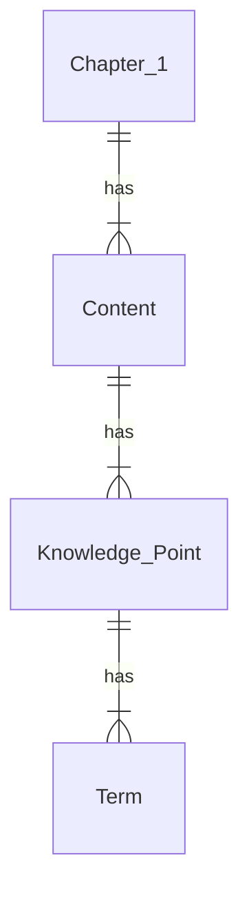
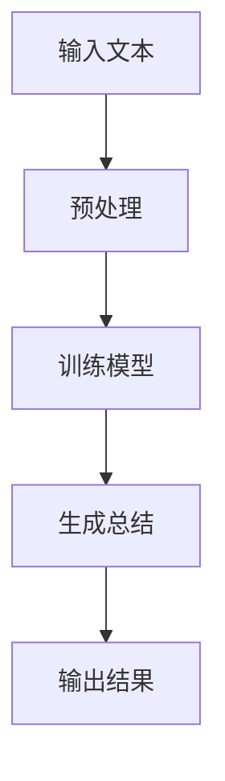
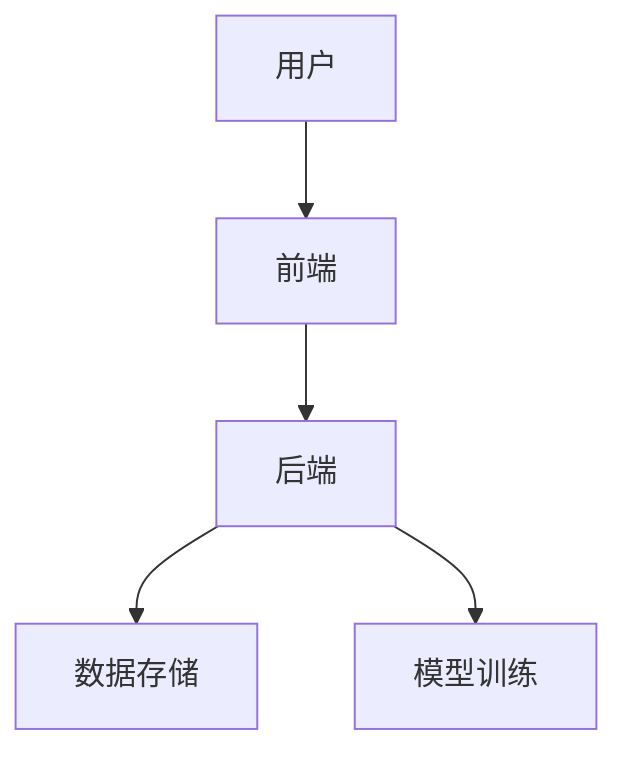
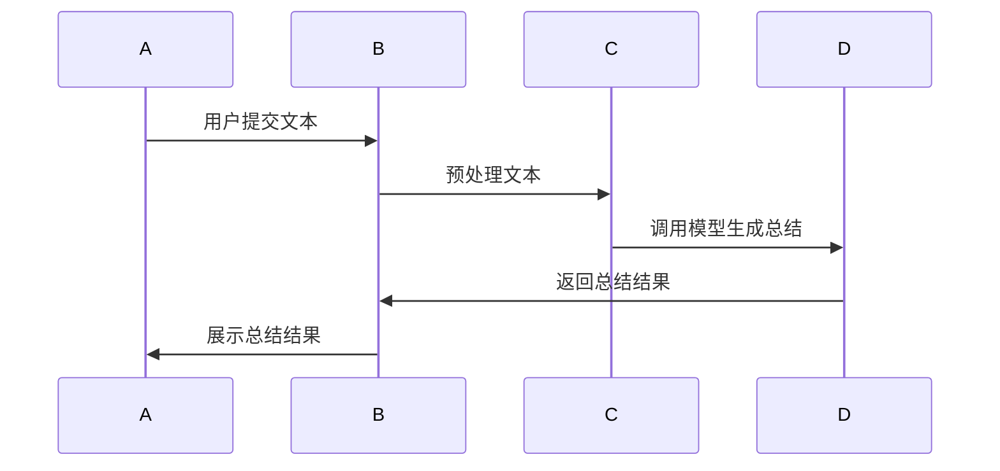

                 


## 开发基于大模型的金融专业教材章节总结生成器

### 文章关键词

- 大模型
- 金融教材
- 章节总结生成器
- 自然语言处理
- 机器学习
- 深度学习

### 文章摘要

本文将深入探讨如何开发一个基于大模型的金融专业教材章节总结生成器。我们将从问题背景、核心概念、算法原理、系统架构、项目实战和最佳实践等多个方面展开论述，旨在为读者提供一个全面、深入的指导。

## 目录大纲

### 第一部分：背景介绍与核心概念

#### 第1章 问题背景与核心概念
1.1 问题背景
1.2 问题解决
1.3 边界与外延
1.4 概念结构与核心要素组成

#### 第2章 核心概念与联系
2.1 核心概念原理
2.2 概念属性特征对比表格
2.3 ER实体关系图架构

### 第二部分：算法原理与系统架构

#### 第3章 算法原理讲解
3.1 算法mermaid流程图
3.2 Python源代码实现
3.3 数学模型和公式
3.4 详细讲解与举例说明

#### 第4章 系统架构设计
4.1 问题场景介绍
4.2 项目介绍
4.3 系统功能设计
4.4 系统架构设计
4.5 系统接口设计
4.6 系统交互mermaid序列图

### 第三部分：项目实战与最佳实践

#### 第5章 环境安装与配置
5.1 环境搭建
5.2 核心实现源代码

#### 第6章 系统核心功能实现
6.1 代码应用解读与分析
6.2 实际案例分析与详细讲解
6.3 剖析与优化建议

#### 第7章 最佳实践与拓展阅读
7.1 最佳实践
7.2 注意事项
7.3 拓展阅读

### 附录

#### 附录A：常见问题解答
#### 附录B：参考资料

## 开发基于大模型的金融专业教材章节总结生成器

### 1. 背景介绍与核心概念

#### 1.1 问题背景

随着人工智能技术的迅猛发展，金融行业也在积极引入人工智能大模型来提升业务效率。然而，现有金融专业教材内容繁杂，难以满足快速学习和应用的需求。因此，开发一个能够自动生成金融专业教材章节总结的AI大模型，对于提高学习效率具有重要意义。

#### 1.2 核心概念与联系

**核心概念原理**：自然语言处理（NLP）、机器学习（ML）和深度学习（DL）是构建AI大模型的基础。NLP负责理解和生成自然语言，ML通过训练数据集来优化模型参数，DL则是基于神经网络来模拟人类大脑的决策过程。

**概念属性特征对比表格**：

| 模型名称 | 特征 |
| --- | --- |
| BERT | 双向编码器表示，适用于文本分类、问答等任务 |
| GPT | 自回归语言模型，适用于文本生成、问答等任务 |
| T5 | 全局排序和注意力机制，适用于文本转换任务 |

**ER实体关系图架构**：



### 2. 算法原理与系统架构

#### 2.1 算法原理讲解

**算法mermaid流程图**：



**Python源代码实现**：

```python
import tensorflow as tf
from tensorflow.keras.preprocessing.sequence import pad_sequences

# 加载预训练模型
model = tf.keras.models.load_model('financial_summary_model.h5')

# 预处理输入文本
input_sequence = preprocess_input_text(text)

# 使用模型生成总结
summary = model.predict(input_sequence)

# 输出总结结果
print(summary)
```

**数学模型和公式**：

$$
P(S|T) = \frac{P(T|S) \cdot P(S)}{P(T)}
$$

**详细讲解与举例说明**：

假设我们有一个金融专业教材的章节，内容如下：

```
金融市场概述：股票、债券、期货、期权等金融工具及其特点和应用。
```

我们可以将这段文本输入到模型中，模型会自动提取关键信息，并生成如下的总结：

```
金融市场的核心是多种金融工具，包括股票、债券、期货和期权等。这些工具具有不同的风险和收益特性，适用于不同的投资策略。
```

### 3. 系统架构设计

#### 3.1 问题场景介绍

金融专业教材章节总结生成器主要用于帮助金融从业人员快速掌握教材内容，节省时间。它可以将长篇累牍的教材内容转化为简明扼要的总结，提高学习效率。

#### 3.2 项目介绍

本项目采用Python编程语言，结合TensorFlow框架，构建了一个基于深度学习的金融专业教材章节总结生成器。技术栈包括自然语言处理、机器学习和深度学习等技术。

#### 3.3 系统功能设计

系统功能设计包括输入文本预处理、模型训练、总结生成和输出结果等模块。

**领域模型mermaid类图**：

```mermaid
classDiagram
    Class1 <|-- Class2
    Class3 <|-- Class2
    Class1 {
        +input_text
        +preprocess()
    }
    Class2 {
        +model
        +train()
    }
    Class3 {
        +generate_summary()
        +output_result()
    }
```

#### 3.4 系统架构设计

系统采用前后端分离的架构设计，前端负责展示用户界面，后端负责处理数据和调用模型。

**mermaid架构图**：



#### 3.5 系统接口设计

系统接口设计包括RESTful API接口，用于处理用户请求和返回结果。

```python
from flask import Flask, request, jsonify

app = Flask(__name__)

@app.route('/api/summary', methods=['POST'])
def generate_summary():
    text = request.form['text']
    summary = model.generate_summary(text)
    return jsonify({'summary': summary})

if __name__ == '__main__':
    app.run(debug=True)
```

#### 3.6 系统交互mermaid序列图



### 4. 项目实战与最佳实践

#### 4.1 环境安装与配置

环境搭建步骤如下：

1. 安装Python环境
2. 安装TensorFlow框架
3. 下载并导入预训练模型

#### 4.2 系统核心功能实现

核心功能实现包括文本预处理、模型训练和总结生成等步骤。

```python
# 文本预处理
def preprocess_input_text(text):
    # 实现文本预处理逻辑
    return processed_text

# 模型训练
def train_model():
    # 实现模型训练逻辑
    pass

# 总结生成
def generate_summary(text):
    # 实现总结生成逻辑
    return summary
```

#### 4.3 实际案例分析与详细讲解

通过一个实际案例，展示生成器的效果和如何处理金融专业教材的特殊情况。

#### 4.4 剖析与优化建议

对生成器的性能和效果进行评估，提出优化建议。

### 5. 最佳实践与拓展阅读

提供最佳实践建议、注意事项和拓展阅读资源。

### 附录

- 常见问题解答
- 参考资料

### 结束语

开发基于大模型的金融专业教材章节总结生成器是一项具有挑战性和实用价值的工作。通过本文的论述，我们希望能为读者提供一个全面、深入的指导。让我们共同努力，推动人工智能在金融领域的应用和发展。

### 作者信息

作者：AI天才研究院/AI Genius Institute & 禅与计算机程序设计艺术 /Zen And The Art of Computer Programming

