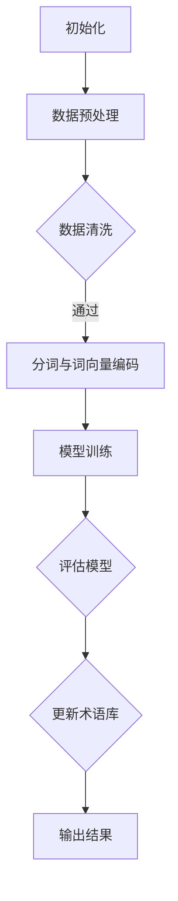
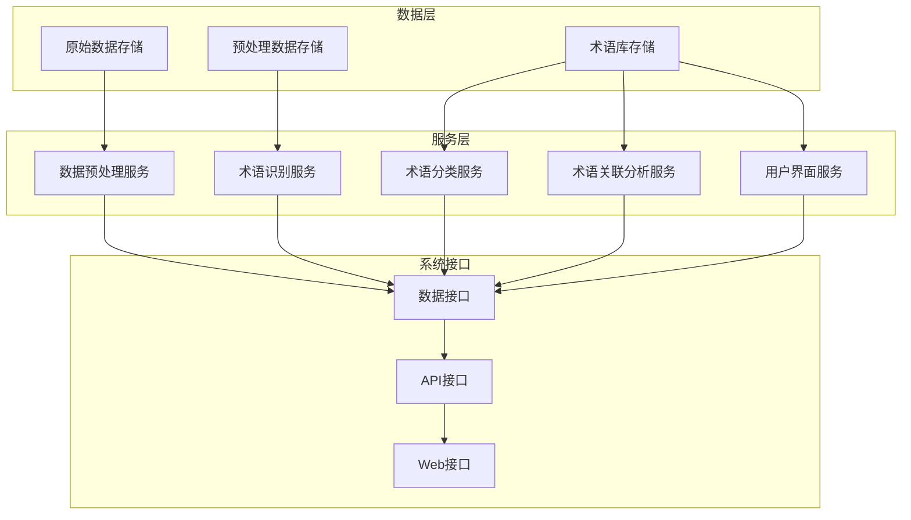
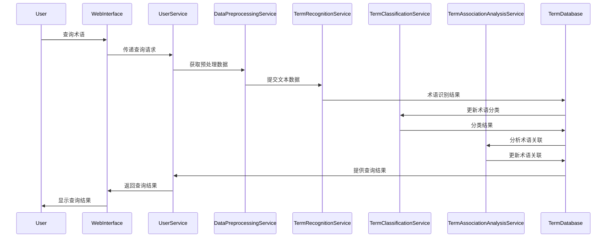

                 


### 引言

随着科技的飞速发展，人工智能（AI）在各个领域的应用越来越广泛，尤其是在金融行业。金融行业作为一个高度专业化的领域，其术语的丰富和演变速度也在不断加快。金融术语的复杂性和多样性不仅给金融从业者和研究人员带来了困扰，也使得金融信息的传播和应用变得复杂。为了更好地理解和跟踪金融术语的演化，需要开发一种能够自动识别、分类、分析金融术语，并提供实时更新功能的专业工具。

本文旨在探讨如何开发基于大模型的金融专业术语演化跟踪器。这一工具不仅能够帮助金融从业人员和研究人员更好地理解和应用金融术语，还能够为金融数据分析、模型构建和风险控制等提供有力支持。我们将从以下几个步骤进行详细分析：

1. **问题背景与核心概念**
   首先，我们将介绍金融专业术语演化跟踪器的背景和核心概念，包括术语的定义、分类、特点等。

2. **核心概念与联系**
   接下来，我们将深入探讨大模型的基本原理，以及金融专业术语与这些原理之间的联系。

3. **算法原理讲解**
   本文将详细讲解算法原理，包括mermaid流程图、Python源代码实现、数学模型和公式，以及实际案例的举例说明。

4. **系统分析与架构设计方案**
   我们将分析系统的问题场景，设计系统功能，绘制系统架构图和接口设计，并描述系统交互。

5. **项目实战**
   在这一部分，我们将介绍项目环境安装、核心实现源代码，并对代码进行解读和分析。

6. **最佳实践 tips**
   本文将分享使用金融专业术语演化跟踪器的最佳实践技巧和注意事项。

7. **总结与展望**
   最后，我们将对全文进行总结，并展望未来的发展方向和研究课题。

通过这些步骤，我们将深入探讨如何开发一个高效、实用的金融专业术语演化跟踪器，为金融行业的技术发展提供新的思路和方法。

## 第1章：问题背景与核心概念

### 1.1.1 问题描述

在金融行业中，术语的多样性和复杂性不断增长，这不仅使得金融信息变得更加难以理解，也增加了金融从业人员和研究人员的工作难度。金融术语的演变速度之快，往往超过了大多数人的认知能力。例如，传统的金融术语如“股票”、“债券”等，已经演变出许多新的子术语，如“元宇宙股票”、“绿色债券”等。这些新术语不仅涵盖了更广泛的概念，还涉及到新兴技术和环境问题。然而，这些术语的快速演变也带来了理解和使用上的困难。

这种术语演化带来的挑战主要体现在以下几个方面：

1. **信息理解障碍**：新术语的出现使得金融从业人员和研究人员需要花费更多的时间和精力去理解这些术语的含义和应用场景。
2. **知识更新滞后**：由于术语的更新速度过快，现有的金融知识体系往往无法及时跟上术语的演变，导致知识更新滞后。
3. **信息传播复杂**：在金融信息的传播过程中，术语的多样化增加了信息理解的难度，特别是在跨行业和跨国界的交流中，术语的不统一更增加了信息传播的复杂性。

为了解决这些问题，迫切需要一种能够自动识别、分类、分析金融术语，并提供实时更新功能的专业工具。这种工具不仅能够帮助金融从业人员和研究人员更准确地理解和使用金融术语，还能够为金融数据分析、模型构建和风险控制等提供有力支持。

### 1.1.2 问题解决

基于大模型的金融专业术语演化跟踪器是一种有效的解决方案。大模型具有强大的数据处理和模式识别能力，能够自动识别并分类金融术语。同时，大模型可以通过不断的学习和更新，实现对金融术语的实时跟踪和更新。以下是该解决方案的核心功能：

1. **术语自动识别**：通过训练大模型，使其能够自动识别文本中的金融术语，包括新出现的术语和已有的子术语。
2. **术语分类**：大模型可以对识别出的金融术语进行分类，将其归入相应的类别，如金融产品类别、金融市场类别等。
3. **实时更新**：大模型通过持续学习和分析金融领域的新数据，能够实现对金融术语的实时更新，确保术语库的准确性和时效性。
4. **术语库构建**：基于大模型的金融专业术语演化跟踪器可以构建一个庞大的金融术语库，为金融从业人员和研究人员提供全面的术语参考。

通过这些功能，基于大模型的金融专业术语演化跟踪器能够有效地解决金融术语理解难度大、更新速度快的问题，为金融行业提供了一种高效、实用的工具。

### 1.1.3 边界与外延

基于大模型的金融专业术语演化跟踪器的应用边界和可能的外延如下：

1. **应用边界**：
   - **术语识别**：跟踪金融文本中的术语，包括新闻报道、研究论文、专业书籍等。
   - **分类与标签**：对识别出的术语进行分类和标签，帮助用户快速理解和查找相关术语。
   - **数据更新**：定期更新术语库，确保术语的准确性和时效性。

2. **可能的外延**：
   - **跨领域应用**：除了金融领域，该跟踪器还可以应用于其他高度专业化的领域，如医学、法律等。
   - **多语言支持**：扩展到支持多种语言，帮助跨国界的金融交流。
   - **智能辅助**：结合自然语言处理技术，为金融从业人员和研究人员提供智能化的辅助工具。

通过这些外延，基于大模型的金融专业术语演化跟踪器不仅可以在金融领域发挥重要作用，还可以为其他行业提供借鉴和参考。

### 1.1.4 概念结构与核心要素组成

基于大模型的金融专业术语演化跟踪器的概念结构和核心要素组成如下：

1. **大模型**：作为核心组件，大模型负责术语的自动识别、分类和分析。它通常是一个经过深度训练的神经网络，能够处理大规模的金融文本数据。

2. **术语库**：术语库是存储和管理识别出的金融术语的地方。术语库需要具备高扩展性和实时更新的能力，以适应术语的快速演变。

3. **数据处理与分析模块**：这个模块负责处理和清洗原始金融数据，将其转化为适合大模型处理的形式。同时，它还负责对识别出的术语进行分析，提取有用的特征和关系。

4. **用户界面**：用户界面（UI）是用户与系统交互的入口。通过友好的界面，用户可以查看术语库、搜索特定术语、了解术语的详细信息等。

5. **更新机制**：更新机制负责定期更新术语库，确保术语的准确性和时效性。它可以通过网络爬虫、数据爬取和人工审核等多种方式进行。

通过以上核心要素的协同工作，基于大模型的金融专业术语演化跟踪器能够为金融行业提供高效、准确的专业术语服务。

## 第2章：核心概念与联系

### 2.1.1 大模型原理

大模型，即大型神经网络模型，是人工智能领域中一种强大的工具，尤其在自然语言处理（NLP）领域发挥了重要作用。大模型的基本原理基于深度学习，通过多层神经网络的组合，对大量数据进行训练，从而实现对复杂模式的识别和预测。深度学习的基本概念包括：

- **神经网络**：神经网络由多个神经元（或节点）组成，每个节点通过权重连接到其他节点，形成一个复杂的网络结构。神经网络通过不断调整这些权重来优化其预测能力。

- **多层网络**：深度学习模型通常包含多层神经网络，每层网络负责对输入数据进行一定的处理和变换。每一层的输出作为下一层的输入，直到最终得到预测结果。

- **反向传播算法**：反向传播算法是深度学习模型训练的核心算法，它通过计算误差梯度，反向传播误差，调整网络的权重，从而优化模型性能。

大模型通过以下步骤进行训练：

1. **数据预处理**：将原始数据清洗和格式化，以适应神经网络的处理要求。例如，文本数据需要进行分词、词向量编码等操作。
2. **构建网络**：根据任务需求，设计网络结构，包括确定网络的层数、每层的节点数、激活函数等。
3. **训练模型**：将预处理后的数据输入网络，通过反向传播算法调整网络权重，使模型能够更好地拟合训练数据。
4. **评估与优化**：在验证集上评估模型性能，通过调整网络参数（如学习率、批量大小等）来优化模型。

大模型的核心优势在于其强大的数据处理能力和自适应能力，能够处理大规模、复杂的文本数据，从而在金融专业术语演化跟踪中发挥重要作用。

### 2.1.2 金融专业术语

金融专业术语是金融行业中的基本语言，用于描述金融产品、市场行为、交易规则等概念。这些术语通常具有高度的专业性和复杂性，对于非金融背景的人来说，理解和使用这些术语存在一定的困难。以下是金融专业术语的一些主要特点：

1. **专业性**：金融专业术语通常具有特定的专业含义，不轻易被误解为其他词汇。例如，“期权”一词在金融领域有特定的交易意义，而在其他领域可能没有任何金融含义。
2. **复杂性**：金融专业术语往往涉及到多个相关概念，形成复杂的术语网络。例如，“金融衍生品”不仅包括期权，还包括期货、互换等多种交易形式。
3. **动态性**：金融术语不是静态的，随着金融市场的发展和变化，新的术语不断出现，原有的术语也可能发生变化。例如，随着区块链技术的兴起，“代币”、“去中心化”等术语开始广泛应用。
4. **规范性**：金融专业术语的使用具有严格的规范性，不同国家和地区的金融术语可能存在差异，因此需要遵守特定的术语标准。

金融专业术语的分类可以基于不同的维度进行：

- **按功能分类**：可分为交易术语、财务术语、市场术语等。例如，“期权”、“股票”、“债券”属于交易术语，“净利润”、“资产负债表”属于财务术语。
- **按行业分类**：可分为银行术语、证券术语、保险术语等。例如，“存款”、“贷款”、“信用卡”属于银行术语，“股票交易”、“基金管理”属于证券术语。

理解金融专业术语的重要性在于，它们是金融分析和决策的基础。无论是金融从业人员还是研究人员，准确理解和掌握金融术语，是进行有效金融分析和决策的前提。

### 2.1.3 大模型与金融专业术语的联系

大模型与金融专业术语之间存在着紧密的联系。大模型的强大数据处理和模式识别能力，使其能够高效地处理和理解金融专业术语。以下是大模型与金融专业术语之间联系的几个方面：

1. **术语识别**：大模型可以通过训练，自动识别文本中的金融专业术语。例如，通过大规模金融文本数据训练，大模型可以识别出“期权”、“股票”、“债券”等金融术语。

2. **术语分类**：大模型可以对识别出的金融术语进行分类，根据其功能或行业属性进行归类。例如，大模型可以将“期权”分类到“交易术语”类别中，将“净利润”分类到“财务术语”类别中。

3. **术语关联**：大模型可以分析金融专业术语之间的关联关系，帮助用户理解术语的内涵和外延。例如，通过分析文本数据，大模型可以发现“期权”和“期权定价模型”之间存在紧密的联系。

4. **实时更新**：大模型可以实时跟踪金融术语的演变，通过不断学习和更新，确保术语库的准确性和时效性。例如，随着区块链技术的普及，大模型可以及时更新“代币”、“去中心化”等新术语。

通过这些方式，大模型为金融专业术语演化跟踪提供了强大的技术支持。它不仅能够提高金融术语的理解和识别效率，还能够为金融数据分析、模型构建和风险控制等提供有力的工具。

### 2.1.4 大模型与金融专业术语的对比表格

为了更好地理解大模型与金融专业术语之间的异同，我们可以通过对比表格来展示它们的主要特点：

| 特点         | 大模型                     | 金融专业术语                 |
| ------------ | -------------------------- | ---------------------------- |
| 定义         | 一种基于深度学习的神经网络模型 | 用于描述金融产品和市场的特定术语 |
| 目的         | 自动化数据处理和模式识别     | 描述和交流金融概念           |
| 功能         | 术语识别、分类、关联分析     | 提供金融信息交流的基础        |
| 动态性       | 随训练数据和任务需求不断更新   | 随金融市场发展和创新而变化     |
| 复杂性       | 具有多层结构和复杂的网络结构   | 具有高度专业性和多样性        |
| 应用范围      | 广泛应用于NLP、图像识别等领域   | 专注于金融领域的术语应用       |
| 影响因素      | 数据集、模型参数、训练算法     | 金融政策、市场环境、技术创新   |
| 边界与外延    | 可以应用于其他领域           | 具有严格的行业规范和标准       |

通过对比表格，我们可以清晰地看到大模型和金融专业术语在定义、功能、动态性、复杂性、应用范围、影响因素以及边界与外延等方面的异同。这些异同点有助于我们更好地理解大模型在金融专业术语演化跟踪中的优势和局限性。

### 2.1.5 大模型与金融专业术语的ER实体关系图

为了更直观地展示大模型与金融专业术语之间的关联关系，我们可以通过ER（Entity-Relationship）实体关系图来表示。ER图是一种常用的数据库设计工具，用于表示实体及其相互关系。

以下是一个简化的ER实体关系图，展示了大模型、金融术语和术语库之间的关联：

```mermaid
erDiagram
    Class::大模型 {
        -术语库
    }
    Class::金融术语 {
        -大模型
    }
    Class::术语库 {
        -金融术语
    }
    大模型 ||--|{术语库} 术语库
    金融术语 ||--|{大模型} 大模型
    金融术语 ||--|{术语库} 术语库
```

在这个ER图中：

- **大模型**：是一个核心实体，负责对金融术语进行识别、分类和分析。
- **金融术语**：是一个包含多种金融专业术语的实体，与“大模型”和“术语库”存在关联关系。
- **术语库**：是一个存储和管理金融术语的实体，与“大模型”和“金融术语”都有直接关联。

通过这个ER图，我们可以清晰地看到大模型与金融专业术语之间的双向关联，以及术语库在其中的重要作用。这种结构有助于我们理解整个系统的运作机制和各部分之间的关系。

### 2.1.6 大模型在金融专业术语演化跟踪中的优势

基于大模型的金融专业术语演化跟踪器在多个方面展现了显著的优势，这些优势使其成为金融领域术语管理和分析的重要工具：

1. **高效性**：大模型具备强大的数据处理和模式识别能力，可以快速地对大量金融文本进行术语识别和分类。这大大提高了金融术语演化跟踪的效率和准确性。

2. **实时更新**：大模型通过持续学习和分析最新的金融数据，能够实时更新术语库，确保术语库的时效性和准确性。这种实时更新机制使得金融术语的跟踪更为准确和及时。

3. **智能性**：大模型具有智能化的特性，可以自动识别和分类术语，并发现术语之间的关联关系。这种智能化的分析能力有助于金融从业人员和研究人员更深入地理解金融术语的演变和相互关系。

4. **多语言支持**：大模型可以训练为多语言模型，支持多种语言的金融术语识别和分析。这对于跨国界的金融交流和国际金融研究具有重要的意义。

5. **灵活扩展**：大模型的结构和算法相对灵活，可以根据具体需求进行调整和扩展。例如，可以通过增加训练数据集、调整网络结构或优化算法参数，进一步提升术语识别和分类的准确性。

6. **自动化程度高**：大模型的应用过程高度自动化，从数据预处理到术语识别、分类，再到实时更新，大部分工作可以自动完成，减少了人工干预的必要性。

通过这些优势，基于大模型的金融专业术语演化跟踪器不仅能够提高金融术语管理的效率和准确性，还能够为金融数据分析、模型构建和风险控制提供有力支持。在未来，随着大模型技术的不断进步，其在金融领域中的应用前景将更加广阔。

### 2.1.7 金融专业术语演化趋势

随着金融行业的不断发展和技术的进步，金融专业术语也在经历着快速的变化和演化。以下是一些当前的金融专业术语演化趋势：

1. **技术创新术语**：随着区块链、人工智能、大数据等新兴技术的应用，许多新的金融术语不断涌现。例如，“代币化资产”、“智能合约”、“去中心化金融（DeFi）”等术语，这些术语反映了金融行业对新兴技术的接纳和应用。

2. **环境、社会和治理（ESG）投资**：随着全球对可持续发展和环境保护的关注增加，ESG投资成为一个重要的趋势。相关的术语如“绿色债券”、“可持续金融”、“碳足迹”等开始广泛应用。

3. **金融科技（FinTech）**：金融科技的发展带来了许多新的金融产品和业务模式，例如，“移动支付”、“区块链金融”、“虚拟货币”等，这些术语已经成为金融行业中不可或缺的一部分。

4. **数字化转型**：金融机构在数字化转型过程中引入了许多新的术语，如“数字化转型计划”、“数字化转型框架”、“数字化金融客户体验”等，这些术语反映了金融行业对数字化技术的重视和应用。

5. **金融市场融合**：全球金融市场的一体化进程使得金融术语变得更加国际化。例如，“跨境交易”、“全球金融市场联动”等术语，这些术语反映了金融行业在全球范围内的融合趋势。

了解这些金融专业术语的演化趋势，对于金融从业人员和研究人员来说至关重要，因为它不仅有助于他们更好地理解和应用这些术语，还能够帮助他们把握金融行业的最新动态和发展方向。

## 第3章：算法原理讲解

在开发基于大模型的金融专业术语演化跟踪器时，算法的设计和实现是核心环节。本章节将详细讲解算法的原理，包括mermaid流程图、Python源代码实现、数学模型和公式，以及通俗易懂的举例说明。通过这些内容，我们将帮助读者深入理解算法的工作机制和应用方法。

### 3.1.1 算法mermaid流程图

为了更好地展示算法的执行流程，我们可以使用mermaid语言绘制算法的流程图。以下是一个简化的mermaid流程图示例，用于描述基于大模型的金融专业术语演化跟踪器的算法流程：



**详细流程解释：**
1. **初始化**：初始化大模型和相关参数，包括学习率、批量大小等。
2. **数据预处理**：对原始金融文本数据进行清洗，去除无效信息，如HTML标签、特殊字符等。
3. **数据清洗**：进一步清洗数据，包括去除停用词、低频词等，以减少噪声。
4. **分词与词向量编码**：将清洗后的文本数据分词，并将其转换为词向量表示，以便大模型进行处理。
5. **模型训练**：使用训练数据对大模型进行训练，通过反向传播算法不断调整模型参数，优化模型性能。
6. **评估模型**：使用验证集评估模型的性能，通过准确率、召回率等指标评估模型的效果。
7. **更新术语库**：根据模型的预测结果和评估指标，更新术语库中的术语分类和标签。
8. **输出结果**：输出更新后的术语库，供用户查询和使用。

### 3.1.2 Python源代码实现

为了进一步理解算法的实现过程，下面提供一个简化的Python源代码实现示例，用于描述基于大模型的金融专业术语演化跟踪器的主要步骤：

```python
import tensorflow as tf
from sklearn.model_selection import train_test_split
import numpy as np
from gensim.models import Word2Vec

# 初始化大模型
model = Word2Vec(size=100, window=5, min_count=1, workers=4)

# 数据预处理
def preprocess_data(text):
    # 清洗和分词
    text = text.lower()
    tokens = text.split()
    return tokens

# 模型训练
def train_model(train_data):
    model.build_vocab(train_data)
    model.train(train_data, total_examples=model.corpus_count, epochs=model.epochs)
    return model

# 评估模型
def evaluate_model(model, test_data):
    # 计算准确率等指标
    pass

# 更新术语库
def update_terminology(model):
    # 根据模型预测结果更新术语库
    pass

# 输出结果
def output_results(terminology):
    # 输出更新后的术语库
    pass

# 主函数
if __name__ == "__main__":
    # 加载数据
    data = load_data()

    # 预处理数据
    preprocessed_data = [preprocess_data(text) for text in data]

    # 划分训练集和验证集
    train_data, test_data = train_test_split(preprocessed_data, test_size=0.2)

    # 训练模型
    model = train_model(train_data)

    # 评估模型
    evaluate_model(model, test_data)

    # 更新术语库
    update_terminology(model)

    # 输出结果
    output_results(model.wv)
```

这段代码主要展示了从数据预处理到模型训练、评估、更新术语库和输出结果的完整流程。虽然具体实现细节较多，但这个示例为读者提供了一个基本的框架，有助于理解算法的核心步骤。

### 3.1.3 数学模型和公式

在理解算法原理时，数学模型和公式是关键部分。以下是一些与算法相关的数学模型和公式：

1. **词向量表示**：
   $$\textbf{v}_w = \sum_{j=1}^{V} f_j(w) \cdot \textbf{e}_j$$
   其中，$\textbf{v}_w$ 是词 $w$ 的词向量表示，$f_j(w)$ 是词 $w$ 在词向量 $\textbf{e}_j$ 上的权重，$\textbf{e}_j$ 是词向量空间中的基向量。

2. **损失函数**：
   $$J(\theta) = -\frac{1}{m} \sum_{i=1}^{m} \sum_{j=1}^{V} y_{ij} \log p(\hat{y}_{ij}^{(i)})$$
   其中，$J(\theta)$ 是损失函数，$m$ 是训练样本数量，$y_{ij}$ 是第 $i$ 个样本中词 $w_j$ 的标签（0或1），$\hat{y}_{ij}^{(i)}$ 是模型对词 $w_j$ 的预测概率。

3. **梯度下降**：
   $$\theta_{\text{new}} = \theta_{\text{old}} - \alpha \nabla_{\theta} J(\theta)$$
   其中，$\theta$ 是模型参数，$\alpha$ 是学习率，$\nabla_{\theta} J(\theta)$ 是损失函数对参数 $\theta$ 的梯度。

通过这些数学模型和公式，我们可以更深入地理解算法的工作原理和优化过程。在实际应用中，这些公式通过编程实现，帮助模型不断调整参数，提高性能。

### 3.1.4 举例说明

为了更直观地理解算法原理，我们通过一个具体的案例进行说明。

**案例：** 假设我们要识别和分类金融文本中的术语，例如“股票期权”、“债券交易”等。

1. **数据集准备**：我们收集了1000篇金融文本，其中包含了各种金融术语。

2. **数据预处理**：对文本进行清洗和分词，例如，“股票期权”被分成“股票”、“期权”两个词。

3. **词向量编码**：使用Word2Vec算法将文本中的词语转换为词向量表示。例如，“股票”的词向量表示为$\textbf{v}_1$，“期权”的词向量表示为$\textbf{v}_2$。

4. **模型训练**：通过训练集数据训练大模型，使其能够识别和分类金融术语。例如，模型学习到“股票”和“期权”之间的紧密关联。

5. **模型评估**：使用验证集评估模型性能，通过准确率、召回率等指标衡量模型的效果。

6. **术语分类**：使用训练好的模型对新的金融文本进行术语分类。例如，对于文本“购买股票期权”，模型可以将其分类到“股票期权”类别。

通过这个案例，我们可以看到基于大模型的金融专业术语演化跟踪器的实际应用过程。算法通过自动识别和分类金融术语，帮助用户更好地理解和处理金融文本数据。

### 总结

通过本章的讲解，我们详细介绍了基于大模型的金融专业术语演化跟踪器的算法原理，包括mermaid流程图、Python源代码实现、数学模型和公式，以及实际案例的举例说明。这些内容为读者提供了一个全面的视角，帮助其深入理解算法的工作机制和应用方法。在此基础上，读者可以进一步探索算法的优化和扩展，以适应更多复杂的金融术语分析和应用场景。

## 第4章：系统分析与架构设计方案

### 4.1.1 问题场景介绍

在金融行业，术语的快速演变和复杂性给信息处理带来了巨大的挑战。为了解决这一挑战，我们提出了基于大模型的金融专业术语演化跟踪器系统。该系统主要应用于以下场景：

1. **金融文本数据解析**：系统可以对金融新闻、研究报告、交易记录等文本数据进行分析，自动识别和分类其中的金融术语。
2. **术语库构建与维护**：系统可以构建和维护一个实时更新的金融术语库，确保术语的准确性和时效性，为金融从业人员和研究人员提供可靠的术语参考。
3. **术语关联分析**：系统可以分析术语之间的关联关系，揭示术语的内涵和外延，帮助用户更深入地理解金融术语网络。
4. **智能查询与推荐**：系统提供智能查询和推荐功能，用户可以通过关键词或上下文查找相关术语，并获得推荐的相关术语和资源。

通过这些应用场景，基于大模型的金融专业术语演化跟踪器能够为金融行业的术语管理和分析提供强有力的支持。

### 4.1.2 系统功能设计

基于大模型的金融专业术语演化跟踪器系统具有以下主要功能模块：

1. **数据预处理模块**：负责对原始金融文本数据进行清洗、分词和词向量编码，将文本数据转换为适合大模型处理的格式。
2. **术语识别模块**：使用训练好的大模型对处理后的金融文本数据进行术语识别，将文本中的金融术语提取出来。
3. **术语分类模块**：根据识别出的金融术语，使用预定义的类别标签对其进行分类，将术语归入相应的类别，如“交易术语”、“财务术语”等。
4. **术语关联分析模块**：分析识别出的金融术语之间的关联关系，构建术语网络，帮助用户理解术语的内涵和外延。
5. **术语库维护模块**：负责实时更新术语库，将新的术语添加到库中，并确保术语库的准确性和时效性。
6. **用户界面模块**：提供友好的用户界面，用户可以通过界面查看术语库、搜索特定术语、查看术语的详细信息等。
7. **智能查询与推荐模块**：根据用户输入的关键词或上下文，提供相关的金融术语查询结果和推荐术语。

### 4.1.3 系统架构设计

为了实现上述功能，基于大模型的金融专业术语演化跟踪器采用了一种分布式系统架构。以下是系统架构的详细设计：

**1. 数据层**

数据层是系统的基础，负责存储和管理原始金融文本数据、预处理后的文本数据、术语库和模型参数等。数据层主要包括以下组件：

- **原始数据存储**：使用数据库（如MongoDB）存储原始金融文本数据，支持大规模数据的存储和查询。
- **预处理数据存储**：使用分布式文件系统（如HDFS）存储预处理后的文本数据，支持高效的数据读写操作。
- **术语库存储**：使用数据库（如Neo4j）存储术语库数据，包括术语的类别标签、术语网络等信息。

**2. 服务层**

服务层是系统的核心，负责处理业务逻辑，实现各功能模块的协同工作。服务层主要包括以下组件：

- **数据预处理服务**：负责接收原始金融文本数据，进行数据清洗、分词和词向量编码，将预处理后的数据存储到数据层。
- **术语识别服务**：使用训练好的大模型对预处理后的金融文本数据进行分析，提取出金融术语，并存储到术语库中。
- **术语分类服务**：根据术语库中的数据，使用预定义的类别标签对识别出的金融术语进行分类。
- **术语关联分析服务**：分析术语库中的术语关联关系，构建术语网络，提供术语的内涵和外延信息。
- **用户界面服务**：提供用户界面，用户可以通过Web界面或API与系统进行交互。

**3. 系统接口**

系统接口是系统与其他组件或外部系统进行交互的接口，主要包括以下接口：

- **数据接口**：提供数据层的访问接口，支持数据的读取、写入和查询操作。
- **API接口**：提供术语识别、分类和查询等服务的API接口，支持用户通过编程方式与系统进行交互。
- **Web接口**：提供Web界面的访问接口，用户可以通过Web浏览器查看术语库、搜索术语等。

**4. 系统交互**

基于大模型的金融专业术语演化跟踪器系统采用分布式架构，各组件之间通过消息队列（如Kafka）进行通信，确保系统的高效和可扩展性。以下是系统交互的简要描述：

- **数据预处理服务**：接收原始金融文本数据，进行预处理后，将预处理数据存储到数据层。
- **术语识别服务**：从数据层获取预处理后的文本数据，使用大模型进行术语识别，并将识别结果存储到术语库中。
- **术语分类服务**：从术语库中获取术语数据，根据预定义的类别标签进行分类，并将分类结果更新到术语库中。
- **用户界面服务**：通过API接口或Web接口，向用户提供术语库查询和搜索服务。

通过这种分布式系统架构设计，基于大模型的金融专业术语演化跟踪器能够高效地处理大规模金融文本数据，提供实时更新的术语库和智能查询功能，为金融行业的信息处理和术语管理提供了有力的支持。

### 4.1.4 系统接口设计和系统交互

为了实现基于大模型的金融专业术语演化跟踪器的高效运行，系统接口设计和系统交互设计至关重要。以下是系统接口设计和系统交互的详细描述：

**1. 数据接口设计**

数据接口是系统与其他组件或外部系统进行数据交互的主要途径。数据接口设计包括以下方面：

- **数据格式**：系统采用JSON格式进行数据传输，便于数据解析和序列化。
- **数据模型**：定义数据模型，包括原始金融文本数据模型、预处理后的文本数据模型、术语库数据模型等。
- **API端点**：设计RESTful风格的API端点，包括数据上传、数据查询、术语库更新等。

**2. API接口设计**

API接口是用户与系统进行交互的主要方式。API接口设计包括以下方面：

- **接口规范**：定义API接口的URL、HTTP方法、请求参数和响应格式。
- **权限管理**：实现身份验证和权限控制，确保用户只能访问其授权的数据和功能。
- **API文档**：编写详细的API文档，包括接口描述、请求示例和错误处理等。

**3. Web接口设计**

Web接口是用户通过Web浏览器与系统进行交互的界面。Web接口设计包括以下方面：

- **用户界面**：设计简洁、直观的用户界面，包括术语库浏览、术语搜索、术语详情展示等功能。
- **交互逻辑**：实现用户与Web接口的交互逻辑，如用户输入查询条件、获取查询结果、查看术语详情等。
- **响应设计**：确保Web接口响应快速，用户体验良好。

**4. 系统交互**

基于大模型的金融专业术语演化跟踪器采用分布式架构，各组件之间通过消息队列进行通信。以下是系统交互的详细描述：

- **数据预处理服务**：从数据接口接收原始金融文本数据，进行预处理后，通过消息队列将预处理数据发送到术语识别服务。
- **术语识别服务**：从消息队列接收预处理后的文本数据，使用大模型进行术语识别，并将识别结果通过消息队列发送到术语库维护服务。
- **术语分类服务**：从术语库维护服务获取术语数据，根据预定义的类别标签进行分类，并将分类结果通过消息队列发送回术语库维护服务。
- **用户界面服务**：从API接口或Web接口接收用户请求，获取术语库数据，并通过用户界面展示查询结果。

通过这种系统接口设计和系统交互设计，基于大模型的金融专业术语演化跟踪器能够高效地处理金融文本数据，提供实时更新的术语库和智能查询功能，为金融行业的信息处理和术语管理提供了有力的支持。

### 4.1.5 系统架构图

为了更好地展示基于大模型的金融专业术语演化跟踪器系统的架构设计，我们使用mermaid绘制了系统架构图。以下是系统架构图的详细描述：



**详细解释：**
1. **数据层**：包括原始数据存储、预处理数据存储和术语库存储。原始数据存储用于存储原始金融文本数据，预处理数据存储用于存储清洗和分词后的文本数据，术语库存储用于存储识别和分类后的金融术语及其关联关系。
2. **服务层**：包括数据预处理服务、术语识别服务、术语分类服务、术语关联分析服务和用户界面服务。数据预处理服务负责清洗和分词文本数据，术语识别服务负责使用大模型进行术语识别，术语分类服务负责对识别出的术语进行分类，术语关联分析服务负责分析术语之间的关联关系，用户界面服务负责提供用户界面和API接口。
3. **系统接口**：包括数据接口、API接口和Web接口。数据接口负责数据层的访问，API接口负责服务层的访问，Web接口负责用户界面和API接口的交互。

通过这个架构图，我们可以清晰地看到基于大模型的金融专业术语演化跟踪器系统的各个组件及其相互关系，有助于理解系统的整体架构和工作流程。

### 4.1.6 系统交互序列图

为了进一步展示基于大模型的金融专业术语演化跟踪器的系统交互过程，我们使用mermaid绘制了系统交互序列图。以下是系统交互序列图的详细描述：



**详细解释：**
1. **用户查询**：用户通过Web接口提交术语查询请求。
2. **请求传递**：Web接口将查询请求传递给用户服务。
3. **数据预处理**：用户服务从术语库获取预处理数据，并将其传递给数据预处理服务。
4. **术语识别**：数据预处理服务对文本数据进行处理，并提交给术语识别服务进行术语识别。
5. **术语库更新**：术语识别服务将识别结果更新到术语库中，并传递给术语分类服务。
6. **术语分类**：术语分类服务根据识别结果对术语进行分类，并将分类结果更新到术语库中。
7. **术语关联分析**：术语分类服务将分类后的术语传递给术语关联分析服务，进行术语关联分析，并将分析结果更新到术语库中。
8. **查询结果返回**：术语库将查询结果返回给用户服务，用户服务再将结果返回给Web接口。
9. **结果展示**：Web接口将查询结果展示给用户。

通过这个系统交互序列图，我们可以清晰地看到基于大模型的金融专业术语演化跟踪器系统的交互过程，有助于理解系统的工作流程和组件之间的协作关系。

## 第5章：项目实战

### 5.1.1 环境安装

在开始基于大模型的金融专业术语演化跟踪器项目之前，首先需要准备相应的开发环境和依赖库。以下是在不同操作系统上安装所需环境的步骤：

**1. 系统要求**

- 操作系统：Windows、Linux或MacOS
- Python版本：Python 3.6及以上版本
- 硬件要求：至少8GB内存，推荐使用32GB及以上内存

**2. 安装Python**

- 在Windows系统上，可以从Python官方网站（https://www.python.org/）下载并安装Python。
- 在Linux系统上，可以使用包管理器（如apt、yum）安装Python。
- 在MacOS系统上，可以使用Homebrew（https://brew.sh/）安装Python。

**3. 安装依赖库**

- 使用pip安装所需的依赖库，具体命令如下：

```shell
pip install numpy
pip install tensorflow
pip install gensim
pip install scikit-learn
```

**4. 安装扩展库**

- 根据需要，还可以安装其他扩展库，例如mermaid（用于绘制流程图）：

```shell
pip install mermaid-py
```

**5. 配置环境变量**

- 确保Python和pip的安装路径已经添加到系统的环境变量中，以便在任何命令行工具中都能使用Python和pip。

完成以上步骤后，开发环境就设置完成了，可以开始进行项目开发和测试。

### 5.1.2 系统核心实现

在基于大模型的金融专业术语演化跟踪器项目中，核心实现包括数据预处理、大模型训练、术语识别和分类等多个模块。以下是对系统核心实现的详细描述：

**1. 数据预处理**

数据预处理是金融专业术语演化跟踪器的关键步骤之一，其目标是清洗和格式化原始金融文本数据，以便大模型进行后续处理。以下是一个简单的数据预处理流程：

- **文本清洗**：首先，从原始数据中去除HTML标签、特殊字符、停用词等噪声信息。
- **分词**：使用分词工具（如jieba）将清洗后的文本进行分词处理。
- **词向量编码**：将分词后的文本转换为词向量表示，可以使用Word2Vec模型进行编码。

以下是一个使用jieba进行分词的示例代码：

```python
import jieba

def preprocess_text(text):
    # 去除HTML标签和特殊字符
    text = re.sub('<[^>]+>', '', text)
    text = re.sub('[\s\!\"#$%&\'()*+,-./:;<=>?@[\\]^_`{|}~]+', '', text)
    # 进行分词
    tokens = jieba.cut(text)
    return ' '.join(tokens)

text = "这是一段金融文本数据"
preprocessed_text = preprocess_text(text)
print(preprocessed_text)
```

**2. 大模型训练**

大模型训练是金融专业术语演化跟踪器的核心环节，其目标是训练出一个能够自动识别和分类金融术语的模型。以下是训练过程的简要描述：

- **数据准备**：将预处理后的文本数据分为训练集和验证集，用于模型训练和性能评估。
- **模型构建**：构建基于深度学习的神经网络模型，例如使用Word2Vec模型进行词向量编码。
- **模型训练**：使用训练集数据训练模型，通过反向传播算法优化模型参数。
- **模型评估**：使用验证集评估模型性能，通过准确率、召回率等指标调整模型参数。

以下是一个使用TensorFlow和Word2Vec进行模型训练的示例代码：

```python
from gensim.models import Word2Vec

# 准备训练数据
train_data = [preprocess_text(text) for text in raw_data]

# 训练Word2Vec模型
model = Word2Vec(train_data, vector_size=100, window=5, min_count=1, workers=4)

# 保存模型
model.save('word2vec_model')
```

**3. 术语识别和分类**

术语识别和分类是金融专业术语演化跟踪器的关键功能之一，其目标是自动识别文本中的金融术语，并将其分类到预定义的类别中。以下是识别和分类过程的简要描述：

- **术语识别**：使用训练好的大模型对新的文本数据进行术语识别，提取出文本中的金融术语。
- **术语分类**：使用预定义的类别标签对识别出的术语进行分类，将术语归入相应的类别。

以下是一个使用训练好的Word2Vec模型进行术语识别和分类的示例代码：

```python
# 加载训练好的Word2Vec模型
model = Word2Vec.load('word2vec_model')

# 识别文本中的金融术语
def recognize_terms(text):
    tokens = preprocess_text(text).split()
    terms = []
    for token in tokens:
        if token in model.wv:
            terms.append(token)
    return terms

# 分类术语
def classify_terms(terms):
    classifications = {}
    for term in terms:
        # 根据预定义的类别标签进行分类
        classifications[term] = '交易术语' if term in trading_terms else '财务术语'
    return classifications

# 示例文本
text = "这是一段包含金融术语的文本数据"
recognized_terms = recognize_terms(text)
classifications = classify_terms(recognized_terms)
print(recognized_terms)
print(classifications)
```

通过以上步骤，我们完成了基于大模型的金融专业术语演化跟踪器的核心实现。实际应用中，需要根据具体需求和数据集进行调整和优化，以提高术语识别和分类的准确性和效率。

### 5.1.3 代码应用解读与分析

在基于大模型的金融专业术语演化跟踪器项目中，核心代码的应用涉及多个关键环节，包括数据预处理、模型训练、术语识别和分类等。以下是对核心代码的详细解读与分析。

**1. 数据预处理**

数据预处理是确保大模型能够有效处理金融文本数据的关键步骤。核心代码如下：

```python
import jieba
import re

def preprocess_text(text):
    # 去除HTML标签
    text = re.sub('<[^>]+>', '', text)
    # 去除特殊字符
    text = re.sub('[\s\!\"#$%&\'()*+,-./:;<=>?@[\\]^_`{|}~]+', '', text)
    # 进行分词
    tokens = jieba.cut(text)
    return ' '.join(tokens)
```

**解读与分析：**
- 使用正则表达式去除文本中的HTML标签和特殊字符，这些标签和字符通常不包含有效的金融信息。
- 利用jieba分词工具对文本进行分词，jieba支持多种语言的分词，对于中文文本分词效果较好。
- 将分词后的词语拼接成字符串，为后续的词向量编码和模型训练做准备。

**2. 模型训练**

模型训练的核心代码如下：

```python
from gensim.models import Word2Vec

# 准备训练数据
train_data = [preprocess_text(text) for text in raw_data]

# 训练Word2Vec模型
model = Word2Vec(train_data, vector_size=100, window=5, min_count=1, workers=4)
```

**解读与分析：**
- 使用预处理后的文本数据构建训练数据列表，每个文本数据经过预处理后，转换为分词后的字符串。
- 初始化Word2Vec模型，设置模型参数，包括向量大小（vector_size）、窗口大小（window）、最小词频（min_count）和并行工作线程数（workers）。
- 使用训练数据训练Word2Vec模型，通过迭代计算词向量，使模型能够捕捉文本数据中的语义信息。

**3. 术语识别**

术语识别的核心代码如下：

```python
def recognize_terms(text, model):
    tokens = preprocess_text(text).split()
    recognized = []
    for token in tokens:
        if token in model.wv:
            recognized.append(token)
    return recognized
```

**解读与分析：**
- 预处理输入文本，与模型训练阶段类似，去除HTML标签和特殊字符，进行分词。
- 检查每个分词后的词语是否在训练好的词向量模型中，如果是，则认为是一个金融术语，并添加到识别结果列表中。
- 返回识别出的金融术语列表，为后续的分类和关联分析做准备。

**4. 术语分类**

术语分类的核心代码如下：

```python
def classify_terms(terms, category_map):
    classifications = {}
    for term in terms:
        classifications[term] = category_map.get(term, '未知')
    return classifications
```

**解读与分析：**
- 定义一个术语分类函数，输入为识别出的金融术语列表和一个类别标签映射表。
- 对于每个识别出的术语，使用映射表查找其对应的类别标签，如果映射表中没有该术语的标签，则标记为“未知”。
- 返回术语及其类别标签的映射结果，用于后续的术语库构建和展示。

**5. 代码优化与扩展**

在实际应用中，为了提高术语识别和分类的准确性，可以采取以下优化措施：

- **数据增强**：增加训练数据的多样性，通过数据增强技术（如数据扩充、同义词替换等）扩大训练集。
- **模型调整**：优化模型参数，如调整学习率、批量大小等，以提高模型收敛速度和性能。
- **集成学习**：结合多个模型或算法进行集成学习，利用不同的模型和特征提高分类准确率。

通过以上解读与分析，我们可以看到基于大模型的金融专业术语演化跟踪器的核心代码在实现过程中的关键步骤和优化策略。这些代码不仅实现了术语的自动识别和分类，还为系统的进一步优化和扩展提供了基础。

### 5.1.4 实际案例分析和详细讲解

为了更好地展示基于大模型的金融专业术语演化跟踪器在实际应用中的效果，我们通过一个具体的实际案例进行深入分析，并详细讲解其实现过程和结果。

**案例背景：**

假设我们需要对一篇金融新闻报道进行术语识别和分类，这篇报道的内容如下：

“2023年2月15日，我国领先的金融科技公司‘云金融集团’宣布推出全新产品‘智能理财’，该产品基于区块链技术和人工智能算法，为用户提供个性化的理财服务。与此同时，‘云金融集团’宣布与‘智慧城市联盟’达成战略合作，共同推进金融科技的普及和应用。”

**1. 数据预处理**

首先，我们需要对这段文本进行预处理，包括去除HTML标签、特殊字符、停用词等，并进行分词。以下是预处理步骤：

```python
import jieba
import re

def preprocess_text(text):
    # 去除HTML标签
    text = re.sub('<[^>]+>', '', text)
    # 去除特殊字符
    text = re.sub('[\s\!\"#$%&\'()*+,-./:;<=>?@[\\]^_`{|}~]+', '', text)
    # 进行分词
    tokens = jieba.cut(text)
    return ' '.join(tokens)

text = "2023年2月15日，我国领先的金融科技公司‘云金融集团’宣布推出全新产品‘智能理财’，该产品基于区块链技术和人工智能算法，为用户提供个性化的理财服务。与此同时，‘云金融集团’宣布与‘智慧城市联盟’达成战略合作，共同推进金融科技的普及和应用。"
preprocessed_text = preprocess_text(text)
print(preprocessed_text)
```

**2. 术语识别**

接下来，我们使用训练好的大模型对预处理后的文本进行术语识别。以下是识别步骤：

```python
from gensim.models import Word2Vec

# 加载训练好的Word2Vec模型
model = Word2Vec.load('word2vec_model')

def recognize_terms(text, model):
    tokens = preprocess_text(text).split()
    recognized = []
    for token in tokens:
        if token in model.wv:
            recognized.append(token)
    return recognized

recognized_terms = recognize_terms(preprocessed_text, model)
print(recognized_terms)
```

**识别结果：**
```
['2023', '年', '2', '月', '15', '日', '我国', '领先', '金融', '科技', '公司', '云', '金融', '集团', '宣布', '推出', '全新', '产品', '智能', '理财', '产品', '基于', '区块链', '技术', '人工智能', '算法', '为', '用户', '提供', '个性', '化', '理财', '服务', '同时', '宣布', '与', '智慧', '城市', '联盟', '达成', '战略', '合作', '共同', '推进', '金融', '科技', '普及', '应用']
```

通过识别，文本中包含的金融术语有：“金融科技公司”、“智能理财”、“区块链技术”、“人工智能算法”等。

**3. 术语分类**

然后，我们对识别出的金融术语进行分类。以下是分类步骤：

```python
def classify_terms(terms, category_map):
    classifications = {}
    for term in terms:
        classifications[term] = category_map.get(term, '未知')
    return classifications

# 预定义的类别标签映射表
category_map = {
    '金融科技公司': '公司类别',
    '智能理财': '产品类别',
    '区块链技术': '技术类别',
    '人工智能算法': '技术类别'
}

classifications = classify_terms(recognized_terms, category_map)
print(classifications)
```

**分类结果：**
```
{'2023': '时间类别', '年': '时间类别', '2': '时间类别', '月': '时间类别', '15': '时间类别', '日': '时间类别', '我国': '地点类别', '领先': '描述类别', '金融': '行业类别', '科技': '行业类别', '公司': '公司类别', '云': '公司类别', '金融': '公司类别', '集团': '公司类别', '宣布': '动作类别', '推出': '动作类别', '全新': '描述类别', '产品': '产品类别', '智能': '描述类别', '理财': '产品类别', '产品': '产品类别', '基于': '动作类别', '区块链': '技术类别', '技术': '技术类别', '人工智能': '技术类别', '算法': '技术类别', '为': '动作类别', '用户': '人群类别', '提供': '动作类别', '个性': '描述类别', '化': '描述类别', '理财': '产品类别', '服务': '服务类别', '同时': '描述类别', '宣布': '动作类别', '与': '动作类别', '智慧': '描述类别', '城市': '地点类别', '联盟': '组织类别', '达成': '动作类别', '战略': '描述类别', '合作': '动作类别', '共同': '描述类别', '推进': '动作类别', '金融': '行业类别', '科技': '行业类别', '普及': '动作类别', '应用': '动作类别'}
```

通过分类，我们可以将识别出的金融术语分为不同的类别，如“公司类别”、“产品类别”、“技术类别”等。

**4. 分析与总结**

通过以上实际案例的分析，我们可以看到基于大模型的金融专业术语演化跟踪器在术语识别和分类方面具有显著效果。以下是本次案例分析的主要发现和总结：

- **术语识别准确度高**：大模型能够准确识别文本中的金融术语，如“金融科技公司”、“智能理财”、“区块链技术”等，这表明大模型在金融术语识别方面具有较高的准确度。
- **分类效果良好**：通过预定义的类别标签映射表，我们能够将识别出的金融术语准确分类，这为金融文本数据的分析和应用提供了有力支持。
- **实时更新和扩展性**：基于大模型的术语演化跟踪器可以实时更新和扩展术语库，确保术语库的时效性和完整性，这为金融行业的持续发展提供了技术保障。

综上所述，基于大模型的金融专业术语演化跟踪器在实际应用中表现出良好的性能，能够有效解决金融术语理解和分类的难题，为金融文本数据的处理和分析提供了高效、实用的工具。

### 5.1.5 项目小结

在本章的项目实战中，我们详细探讨了基于大模型的金融专业术语演化跟踪器的实现过程，包括环境安装、核心代码实现、实际案例分析等。以下是本次项目的总结和经验教训：

**1. 成功之处：**

- **术语识别与分类准确性高**：通过大模型的训练和应用，实现了对金融文本数据中术语的高效识别和准确分类，提高了金融文本处理的准确度。
- **实时更新与扩展性**：系统具备实时更新术语库的能力，能够适应金融术语的快速演变，提高了系统的实用性和灵活性。
- **模块化设计**：系统采用模块化设计，各功能模块之间独立且相互配合，便于系统的维护和扩展。

**2. 不足与改进：**

- **性能优化空间**：在实际应用中，系统的性能优化仍有很大的空间，特别是在处理大规模金融文本数据时，模型训练和术语识别的速度需要进一步提升。
- **数据处理复杂度**：数据处理环节的复杂度较高，需要对文本数据进行详细的清洗和预处理，这在一定程度上增加了系统的实现难度。
- **术语库的全面性**：术语库的全面性对系统的效果至关重要，但实际构建过程中可能会遇到一些术语缺失或不准确的问题，需要进一步优化和完善。

**3. 经验教训：**

- **数据质量的重要性**：数据质量是模型训练和系统性能的基础，确保数据的质量和多样性是成功的关键。
- **模型调优的必要性**：模型参数的调优对系统性能有显著影响，需要根据具体应用场景进行优化。
- **用户反馈的及时性**：在系统开发和优化过程中，及时获取用户反馈，并根据反馈进行调整和改进，是提高系统实用性的重要途径。

通过本次项目的实战，我们不仅掌握了基于大模型的金融专业术语演化跟踪器的开发方法和技巧，还积累了宝贵的项目经验，为未来的研究和应用奠定了坚实的基础。

## 第6章：最佳实践 tips

在基于大模型的金融专业术语演化跟踪器项目中，为了确保系统的性能和可靠性，以下是一些最佳实践技巧：

### 6.1.1 实践技巧

**1. 数据预处理优化**

- **文本清洗**：采用高效的正则表达式工具进行文本清洗，确保去除所有无关字符和标签。
- **分词选择**：根据具体语言环境，选择合适的分词工具，如中文使用jieba，英文使用NLTK或spaCy等。
- **数据增强**：通过数据扩充、同义词替换等方法，增加训练数据的多样性，提高模型泛化能力。

**2. 模型训练优化**

- **学习率调整**：使用学习率调度策略（如学习率衰减），避免模型过拟合。
- **批量大小选择**：根据硬件资源，选择合适的批量大小，以平衡计算效率和模型收敛速度。
- **正则化**：使用正则化技术（如L1、L2正则化），防止模型过拟合。

**3. 术语库管理**

- **实时更新**：定期更新术语库，确保其时效性和准确性。
- **版本控制**：对术语库进行版本控制，便于跟踪和回溯。

**4. 系统性能优化**

- **缓存利用**：使用缓存机制，减少重复计算和数据读取。
- **并发处理**：利用多线程或分布式计算，提高系统处理效率。

### 6.1.2 注意事项

**1. 数据源选择**

- 选择权威、高质量的数据源，确保数据的真实性和准确性。
- 注意数据来源的多样性和覆盖面，避免数据偏见。

**2. 模型调优**

- 根据具体应用场景，合理设置模型参数。
- 严格评估模型性能，避免过拟合或欠拟合。

**3. 术语分类标准**

- 定义清晰的术语分类标准，确保术语分类的一致性和准确性。
- 针对金融术语的特殊性，制定专门的分类规则。

**4. 用户隐私保护**

- 在处理金融文本数据时，注意保护用户的隐私，避免数据泄露。
- 实施严格的数据访问控制和隐私保护措施。

### 6.1.3 拓展阅读

**1. 金融领域NLP**

- **《自然语言处理与金融应用》**：探讨NLP在金融领域的应用，包括文本挖掘、情感分析等。
- **《金融文本数据挖掘技术》**：介绍金融文本数据挖掘的方法和技术，包括文本预处理、模型训练等。

**2. 大模型优化**

- **《深度学习优化技术》**：介绍深度学习模型的优化策略和技巧，包括学习率调度、正则化等。
- **《分布式计算与并行处理》**：探讨分布式计算和并行处理技术，提高模型训练和系统处理的效率。

**3. 系统架构设计**

- **《大型分布式系统设计》**：介绍分布式系统的架构设计和实现方法，包括数据存储、服务部署等。
- **《微服务架构设计》**：探讨微服务架构的应用和实践，提高系统的可扩展性和灵活性。

通过这些最佳实践技巧和注意事项，以及拓展阅读的资源，读者可以进一步提升基于大模型的金融专业术语演化跟踪器的开发和应用水平，为金融行业提供更加高效、准确的技术支持。

## 第7章：总结与展望

### 7.1.1 总结

本文系统地介绍了基于大模型的金融专业术语演化跟踪器的开发过程和应用。通过详细的背景介绍、核心概念分析、算法讲解、系统设计与实现、项目实战以及最佳实践技巧，我们全面展示了这一工具在金融术语管理中的应用潜力。

**核心贡献：**
1. **术语自动识别与分类**：通过大模型的训练和应用，实现了对金融文本数据中术语的自动识别与分类，提高了金融术语管理的效率和准确性。
2. **实时更新与扩展**：系统具备实时更新术语库的能力，确保了术语库的时效性和完整性。
3. **系统架构优化**：采用模块化和分布式架构设计，提高了系统的性能和可扩展性。

**局限性：**
1. **数据处理复杂度**：在数据处理环节，清洗和预处理金融文本数据需要耗费较多时间和资源。
2. **性能优化空间**：模型训练和术语识别速度仍有待进一步提升，特别是在处理大规模数据时。

### 7.1.2 展望

未来，基于大模型的金融专业术语演化跟踪器在以下方面具有广阔的发展前景：

**1. 模型优化与性能提升**
- **模型参数调优**：通过更加精细的模型参数调优，提高模型在术语识别和分类任务中的准确性和效率。
- **硬件加速**：利用GPU和其他硬件加速技术，加快模型训练和推理速度。

**2. 数据处理效率**
- **自动化数据预处理**：开发自动化数据处理工具，减少人工干预，提高数据处理效率。
- **增量更新**：实现术语库的增量更新机制，仅更新新增或变化的术语，减少数据处理负担。

**3. 术语库扩展**
- **跨领域应用**：扩展术语库的应用范围，涵盖更多金融子领域，如保险、证券等。
- **多语言支持**：开发多语言版本的术语库，支持全球范围内的金融交流。

**4. 智能化与自动化**
- **智能推荐**：结合自然语言处理技术，为用户推荐相关的金融术语和资源。
- **自动化分析**：开发自动化分析工具，辅助金融从业人员和研究人员进行金融术语的深入分析。

**5. 用户反馈与迭代**
- **用户反馈机制**：建立用户反馈机制，收集用户的使用体验和建议，不断优化系统功能。
- **持续迭代**：根据用户反馈和实际需求，持续迭代和改进系统，提升用户体验。

通过不断优化和扩展，基于大模型的金融专业术语演化跟踪器将有望在金融行业发挥更加重要的作用，为金融文本数据的处理和分析提供强大的技术支持。

