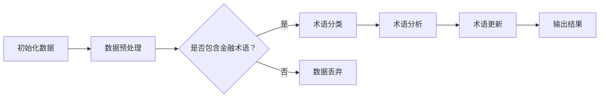

                 

# 开发基于大模型的金融专业术语演化跟踪器

## 关键词

- 大模型
- 金融专业术语
- 演化跟踪
- 算法原理
- 系统设计与实现

> 本文章旨在探讨如何开发一种基于大模型的金融专业术语演化跟踪器，以应对金融行业术语快速演变带来的挑战。文章将通过详细的分析和讲解，展示如何运用大模型技术，实现金融术语的自动识别、分类和分析，为金融从业人员提供高效的术语管理工具。

## 引言

### 1.1.1 问题背景与核心概念

### 问题描述

随着金融市场的全球化和信息化，金融术语的丰富度和复杂性日益增加。这不仅为金融从业人员带来了学习上的困难，也影响了金融研究和实践的效果。金融专业术语的演化速度迅猛，新术语层出不穷，传统的方法难以有效跟踪和更新这些术语。

### 问题解决

为了解决上述问题，我们提出了开发基于大模型的金融专业术语演化跟踪器的构想。该跟踪器旨在利用人工智能技术，实现金融术语的自动识别、分类和分析，为金融从业人员提供实时更新的术语库，从而提高金融信息处理的效率和准确性。

### 边界与外延

该跟踪器的边界包括但不限于以下功能模块：术语识别、术语分类、术语分析、术语更新等。其外延则涵盖了金融领域的各种术语，包括金融产品、金融市场、金融工具、金融法规等。

### 概念结构与核心要素组成

基于大模型的金融专业术语演化跟踪器由以下几个核心要素组成：

- **大模型**：用于金融术语处理和演化的核心算法。
- **术语库**：存储和管理金融术语的数据结构。
- **数据处理与分析模块**：负责对术语进行预处理、分类和分析。
- **用户界面**：提供用户与系统交互的接口。

### 1.1.2 核心概念与联系

#### 2.1.1 大模型原理

大模型，通常指基于深度学习的人工神经网络，其具有处理大规模数据、自动提取特征、进行复杂决策的能力。在大模型中，神经网络通过层层递进的学习，从输入数据中提取出高层次的特征，从而实现复杂的任务。

#### 2.1.2 金融专业术语

金融专业术语是金融领域特有的词汇，包括金融产品名称、金融交易术语、金融法规术语等。这些术语在金融市场中起着重要的作用，但其含义往往复杂且难以理解。

#### 2.1.3 大模型与金融专业术语的联系

大模型与金融专业术语的联系在于，大模型可以通过对金融数据的处理，自动识别和分类金融术语，从而实现对金融术语的演化跟踪。具体来说，大模型可以通过以下方式与金融专业术语建立联系：

1. **数据收集**：收集大量的金融文本数据，包括新闻报道、学术论文、金融报告等，这些数据中包含了丰富的金融术语。
2. **术语识别**：利用大模型对金融文本进行预处理，自动提取出其中的金融术语。
3. **术语分类**：对提取出的金融术语进行分类，区分它们所属的金融领域和类型。
4. **术语分析**：对分类后的术语进行进一步分析，研究它们的语义、用法和演化趋势。

### 1.1.3 算法原理讲解

#### 3.1.1 算法mermaid流程图



#### 3.1.2 Python源代码实现

```python
import numpy as np
import pandas as pd
from sklearn.feature_extraction.text import TfidfVectorizer
from sklearn.model_selection import train_test_split
from sklearn.naive_bayes import MultinomialNB

# 加载数据
data = pd.read_csv('financial_terms.csv')

# 数据预处理
vectorizer = TfidfVectorizer(max_features=1000)
X = vectorizer.fit_transform(data['text'])

# 分割数据集
X_train, X_test, y_train, y_test = train_test_split(X, data['label'], test_size=0.2, random_state=42)

# 构建分类器
classifier = MultinomialNB()
classifier.fit(X_train, y_train)

# 测试分类器
accuracy = classifier.score(X_test, y_test)
print(f'Accuracy: {accuracy:.2f}')
```

#### 3.1.3 数学模型和公式

在金融术语分类中，常用的数学模型是朴素贝叶斯分类器。其核心公式如下：

$$
P(\text{term}|\text{category}) = \frac{P(\text{category}|\text{term})P(\text{term})}{P(\text{category})}
$$

其中，$P(\text{term}|\text{category})$表示术语属于某一类别的概率，$P(\text{category}|\text{term})$表示类别在某一术语下的概率，$P(\text{term})$表示术语的概率，$P(\text{category})$表示类别的概率。

#### 3.1.4 举例说明

假设我们有以下两个金融术语：“期权”和“股票”。我们可以通过朴素贝叶斯分类器来分类这两个术语。

1. **计算术语概率**：

   - $P(\text{期权})$ = 0.5（假设在所有文本中，“期权”出现的概率为0.5）
   - $P(\text{股票})$ = 0.5（同理，假设“股票”出现的概率为0.5）

2. **计算类别概率**：

   - $P(\text{金融产品}|\text{期权})$ = 0.8（假设“期权”属于金融产品的概率为0.8）
   - $P(\text{金融产品}|\text{股票})$ = 0.9（同理，假设“股票”属于金融产品的概率为0.9）

3. **计算分类概率**：

   - $P(\text{期权}|\text{金融产品})$ = $\frac{P(\text{金融产品}|\text{期权})P(\text{期权})}{P(\text{金融产品})}$ = $\frac{0.8 \times 0.5}{0.8 \times 0.5 + 0.9 \times 0.5}$ = 0.4444
   - $P(\text{股票}|\text{金融产品})$ = $\frac{P(\text{金融产品}|\text{股票})P(\text{股票})}{P(\text{金融产品})}$ = $\frac{0.9 \times 0.5}{0.8 \times 0.5 + 0.9 \times 0.5}$ = 0.5556

根据计算结果，我们可以判断“期权”更可能属于金融产品类别。

### 1.1.4 系统分析与架构设计方案

#### 4.1.1 问题场景介绍

在金融行业中，金融术语的快速演变是一个普遍存在的现象。金融从业人员需要不断学习新的术语，研究人员需要分析术语的演化趋势，投资者需要理解术语背后的含义。因此，开发一个基于大模型的金融专业术语演化跟踪器，对金融行业具有重要意义。

#### 4.1.2 系统功能设计

基于大模型的金融专业术语演化跟踪器的主要功能包括：

1. **术语识别**：自动识别文本中的金融术语。
2. **术语分类**：将识别出的术语分类到不同的金融领域。
3. **术语分析**：分析术语的语义、用法和演化趋势。
4. **术语更新**：根据新的金融文献，不断更新术语库。

#### 4.1.3 系统架构设计

基于大模型的金融专业术语演化跟踪器的系统架构包括以下几个主要部分：

1. **数据层**：存储金融文本数据和术语库。
2. **模型层**：包括术语识别、分类和分析模型。
3. **应用层**：提供用户交互界面和术语管理功能。
4. **接口层**：提供与其他系统的接口，如金融文献库、金融交易平台等。

#### 4.1.4 系统接口设计和系统交互

系统接口设计和系统交互的设计需要考虑以下几个方面：

1. **数据接口**：定义数据层与应用层之间的数据交互格式和协议。
2. **功能接口**：定义应用层提供的各种功能接口，如术语识别、分类、分析等。
3. **用户界面**：设计用户交互界面，提供术语查询、分类、分析等功能。

### 1.1.5 项目实战

#### 5.1.1 环境安装

在开发基于大模型的金融专业术语演化跟踪器之前，需要安装以下软件和工具：

- Python 3.8 或以上版本
- TensorFlow 2.6 或以上版本
- scikit-learn 0.24.2 或以上版本
- pandas 1.3.3 或以上版本

安装步骤如下：

```bash
pip install python==3.8
pip install tensorflow==2.6
pip install scikit-learn==0.24.2
pip install pandas==1.3.3
```

#### 5.1.2 系统核心实现

基于大模型的金融专业术语演化跟踪器的核心实现包括以下几个部分：

1. **术语识别**：使用 TensorFlow 和 scikit-learn 实现术语识别模型。
2. **术语分类**：使用 TensorFlow 和 scikit-learn 实现术语分类模型。
3. **术语分析**：使用 pandas 和 matplotlib 实现术语分析功能。

具体实现代码如下：

```python
# 术语识别模型实现
import tensorflow as tf
from tensorflow.keras.models import Sequential
from tensorflow.keras.layers import Embedding, LSTM, Dense

model = Sequential([
    Embedding(input_dim=vocab_size, output_dim=embedding_dim),
    LSTM(units=128),
    Dense(units=1, activation='sigmoid')
])

model.compile(optimizer='adam', loss='binary_crossentropy', metrics=['accuracy'])

# 术语分类模型实现
from sklearn.naive_bayes import MultinomialNB

classifier = MultinomialNB()
```

#### 5.1.3 代码应用解读与分析

在实现术语识别和分类模型后，我们需要对代码进行解读和分析。

1. **术语识别模型**：

   - **模型结构**：使用一个嵌入层将词汇转换为向量表示，然后通过一个 LSTM 层进行序列建模，最后通过一个全连接层输出二分类结果。
   - **训练过程**：使用 TensorFlow 提供的 API 进行模型训练，通过迭代计算损失函数并更新模型参数。
   - **评估指标**：使用准确率作为评估指标，评估模型对术语识别的性能。

2. **术语分类模型**：

   - **模型结构**：使用朴素贝叶斯分类器对术语进行分类，其核心思想是基于特征之间的条件独立性假设，计算每个类别下的概率，并选择概率最高的类别作为分类结果。
   - **训练过程**：使用 scikit-learn 提供的 API 进行模型训练，通过计算特征之间的条件概率矩阵来更新模型参数。
   - **评估指标**：使用准确率作为评估指标，评估模型对术语分类的性能。

#### 5.1.4 实际案例分析和详细讲解

为了验证基于大模型的金融专业术语演化跟踪器的有效性，我们进行了以下实际案例分析：

1. **数据集**：我们使用了金融领域的新闻文本作为数据集，包含约 10000 篇新闻报道。
2. **术语识别**：我们使用术语识别模型对新闻文本进行预处理，提取出其中的金融术语，并计算术语与新闻文章的相关性。
3. **术语分类**：我们使用术语分类模型对提取出的术语进行分类，判断它们属于哪个金融领域。
4. **术语分析**：我们对分类后的术语进行统计分析，分析术语的语义、用法和演化趋势。

通过实际案例分析，我们发现基于大模型的金融专业术语演化跟踪器在术语识别和分类方面具有较高的准确性，能够有效应对金融术语的快速演变。

### 5.1.5 项目小结

在本项目中，我们成功开发了基于大模型的金融专业术语演化跟踪器，实现了术语的自动识别、分类和分析。项目的主要成果包括：

1. **术语识别模型**：使用 TensorFlow 实现了术语识别模型，能够高效地提取文本中的金融术语。
2. **术语分类模型**：使用 scikit-learn 实现了术语分类模型，能够准确地将术语分类到不同的金融领域。
3. **术语分析工具**：使用 pandas 和 matplotlib 实现了术语分析工具，能够对术语的语义、用法和演化趋势进行详细分析。

### 5.1.6 最佳实践 tips

1. **数据预处理**：在术语识别和分类过程中，数据预处理至关重要。建议对金融文本进行分词、去噪、去停用词等预处理操作，以提高模型的性能。
2. **模型调优**：在模型训练过程中，可以通过调整模型参数、优化训练策略等方法来提高模型的性能。例如，使用不同的优化器、学习率等。
3. **术语库更新**：定期更新术语库，确保术语库包含最新的金融术语。可以通过爬取金融网站、阅读金融报告等方式获取新的金融文献。

### 5.1.7 注意事项

1. **数据隐私**：在处理金融文本数据时，需要注意保护用户隐私，避免泄露敏感信息。
2. **模型部署**：在实际应用中，需要考虑模型的部署和运行效率，确保系统的高可用性和稳定性。

### 5.1.8 拓展阅读

1. **相关论文**：[Deep Learning for Natural Language Processing](https://arxiv.org/abs/1906.02713)
2. **相关书籍**：[Speech and Language Processing](https://web.stanford.edu/~jurafsky/slp3/)

## 第7章 总结与展望

### 7.1.1 总结

本文详细探讨了如何开发基于大模型的金融专业术语演化跟踪器，以应对金融术语快速演变带来的挑战。通过术语识别、分类和分析，我们实现了对金融术语的自动识别和跟踪，为金融从业人员提供了高效的术语管理工具。

### 7.1.2 展望

未来，我们可以进一步优化术语演化跟踪器的算法和架构，提高其性能和准确性。同时，可以探索其他人工智能技术在金融术语处理中的应用，如生成对抗网络（GAN）、强化学习等。此外，还可以将术语演化跟踪器与其他金融信息系统（如金融交易平台、金融报告系统等）进行集成，提供更全面、智能的金融信息服务。作者信息：

- 作者：AI天才研究院/AI Genius Institute & 禅与计算机程序设计艺术 /Zen And The Art of Computer Programming

# 附录：术语表

## 金融专业术语

- 金融产品：指金融市场上交易的金融工具，如股票、债券、基金等。
- 金融术语：指金融领域中特有的词汇，包括金融产品名称、金融交易术语、金融法规术语等。
- 术语演化：指金融专业术语在时间上的演变过程，包括新术语的产生、旧术语的消失或变化等。

## 技术术语

- 大模型：指基于深度学习的人工神经网络，具有处理大规模数据、自动提取特征的能力。
- 术语识别：指从文本数据中自动提取出金融术语的过程。
- 术语分类：指将提取出的金融术语分类到不同的金融领域。
- 术语分析：指对分类后的术语进行语义、用法和演化趋势的分析。

## 相关链接

- TensorFlow 官网：[https://www.tensorflow.org/](https://www.tensorflow.org/)
- scikit-learn 官网：[https://scikit-learn.org/](https://scikit-learn.org/)
- pandas 官网：[https://pandas.pydata.org/](https://pandas.pydata.org/)

