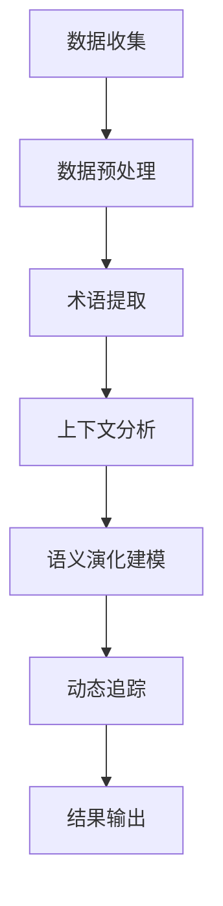
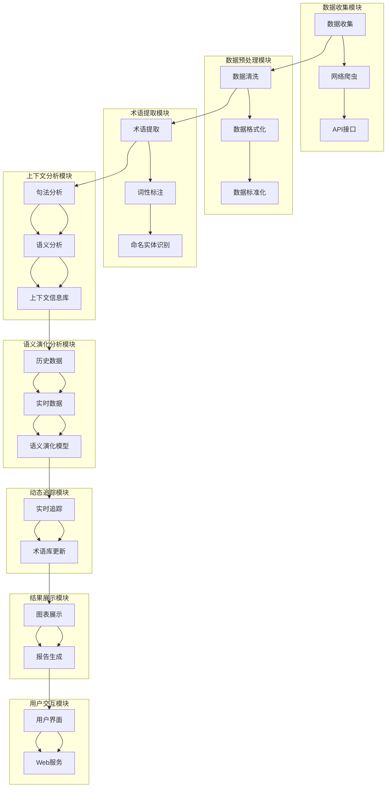

                 

## 第1章: 问题背景与定义

### 1.1.1 问题背景

在当今快速发展的金融行业中，术语的快速演化成为了一个不可忽视的问题。随着金融工具和金融创新的不断涌现，新的术语和概念层出不穷，这些术语往往包含深层次的专业知识和理论背景。然而，由于语义演化的复杂性，现有的金融专业术语语义演化跟踪方法存在一定的局限性，无法全面、及时地捕捉和反映术语的语义变化。这种现象不仅给金融从业者的学习和应用带来了困难，也对金融市场的稳定性和有效性产生了潜在影响。

金融专业术语语义演化，指的是金融领域内术语的语义随时间推移而发生的演变过程。它包括术语含义的扩展、缩小、合并和替换等现象。这些变化往往伴随着金融工具和金融产品的创新，或者是在金融监管政策调整和金融市场的动态变化中发生的。语义演化对金融市场的影响主要体现在以下几个方面：

1. **市场参与者理解成本增加**：随着金融专业术语的语义演化，市场参与者需要花费更多的时间和精力来理解和掌握这些术语，从而增加了学习和应用的成本。
2. **信息传播效率降低**：语义演化导致原有术语的含义发生变化，可能会导致信息的误解和误传，影响市场效率。
3. **金融产品创新与风险控制**：金融专业术语的语义演化直接影响金融产品的创新和风险管理。如果市场参与者无法准确理解和应用术语，可能会导致金融产品设计和风险管理上的失误。

### 1.1.2 金融专业术语语义演化的概念

#### 语义演化的定义

语义演化是指在特定语境下，一个术语的含义随着时间的推移而发生变化的过程。这种变化可以是渐进的，也可以是突变的。语义演化不仅涉及术语本身含义的变化，还包括相关术语之间的关系和语境的变化。

#### 语义演化的特征

1. **动态性**：语义演化是一个动态的过程，它随着时间、社会环境和语境的变化而不断进行。
2. **多维度性**：语义演化涉及多个维度，包括语义的扩大、缩小、合并、替换等。
3. **复杂性**：金融领域术语的语义演化往往受到多种因素的影响，如政策变化、市场动态、技术创新等，因此具有很高的复杂性。
4. **相关性**：语义演化不是孤立的，而是与其他领域术语的语义演变相互关联。

#### 术语语义演化的影响因素

1. **金融创新**：金融工具和产品的创新往往带来新的术语和概念，推动原有术语的语义演化。
2. **政策调整**：金融监管政策的调整会影响金融术语的含义和应用范围，从而推动语义演化。
3. **市场动态**：金融市场的波动和变化也会导致术语语义的演变，以适应市场的需求。
4. **技术进步**：随着信息技术的发展，金融术语的语义表达和传播方式也在发生变化，这也会影响术语的语义演化。

### 1.1.3 语义演化跟踪器的重要性

#### 跟踪语义演化的需求

在金融领域中，对术语语义演化的跟踪具有非常重要的需求。首先，这有助于金融从业者及时了解和掌握新出现的术语，提高他们的专业素养。其次，这也有助于金融市场的规范化和标准化，降低由于术语语义变化带来的误解和风险。最后，语义演化跟踪还可以为金融监管和政策制定提供重要依据，帮助相关部门及时调整政策和监管措施。

#### 语义演化跟踪器的功能与作用

1. **术语识别与归类**：跟踪器可以识别和分类金融领域中的术语，为后续的语义分析提供基础。
2. **语义演化分析**：跟踪器可以对术语的语义演化过程进行监控和分析，发现语义演化的规律和趋势。
3. **智能推荐**：基于语义演化的分析结果，跟踪器可以为金融从业者提供智能化的术语学习和推荐服务。
4. **风险预警**：跟踪器可以通过监测语义演化的异常情况，为金融市场监管提供风险预警。

#### 对金融市场的影响

1. **提高市场透明度**：语义演化跟踪器可以提供更全面、准确的术语信息，提高市场的透明度。
2. **降低风险**：通过监测和预警语义演化的异常情况，可以降低金融市场中的信息不对称和操作风险。
3. **促进创新**：语义演化跟踪器有助于捕捉和理解新术语的含义，从而促进金融产品和服务的创新。
4. **提高监管效率**：语义演化跟踪器可以为金融监管提供数据支持，提高监管效率和准确性。

### 1.1.4 语义演化的研究现状与挑战

#### 当前语义演化跟踪技术的发展

当前，语义演化跟踪技术已经取得了一定的进展。基于自然语言处理（NLP）和机器学习（ML）的方法被广泛应用于语义演化的分析。例如，词向量模型、实体关系模型、文本分类模型等技术在语义演化跟踪中得到了广泛应用。这些方法在一定程度上提高了语义演化的识别和分析能力。

#### 研究现状的总结

1. **术语识别与分类**：当前方法在术语识别和分类方面取得了较好的效果，但仍存在一些局限性，如对术语语义演化的动态监测能力不足。
2. **语义演化分析**：语义演化分析技术逐渐成熟，但仍有待提高其准确性和鲁棒性，以适应金融领域的复杂应用场景。
3. **智能推荐**：智能推荐系统在语义演化跟踪中的应用逐渐增多，但效果仍需进一步优化。

#### 面临的主要挑战与问题

1. **术语语义演化的动态性**：金融领域术语的语义演化具有高度动态性，现有的方法难以实时跟踪和捕捉这种变化。
2. **数据质量**：语义演化分析依赖于高质量的数据，但金融领域的数据获取和标注难度较大，数据质量难以保证。
3. **跨领域语义演化**：金融领域术语的语义演化往往与其他领域术语的演化相互关联，跨领域的语义演化分析技术仍需进一步研究。
4. **模型解释性**：现有的语义演化模型往往具有较高的预测能力，但缺乏解释性，不利于用户理解和信任。

### 1.1.5 总结

本章介绍了金融专业术语语义演化的背景和重要性，定义了语义演化的概念，分析了其特征和影响因素，探讨了语义演化跟踪器的功能与作用，并总结了当前研究的现状和面临的挑战。下一章我们将深入探讨大模型的基础理论，为后续的语义演化跟踪算法设计奠定基础。

## 第2章: 大模型基础理论

### 2.1 大模型的发展历程

大模型的发展历程可以追溯到20世纪80年代末和90年代初，当时研究者开始探索大规模神经网络在文本处理和语音识别等领域的应用。这一时期的代表性工作包括Rumelhart、Hinton和Williams等人提出的反向传播算法（Backpropagation Algorithm），它使得多层神经网络能够有效地训练，从而推动了神经网络技术的发展。

进入21世纪，随着计算机硬件性能的提升和大数据的涌现，大模型的研究和应用进入了快速发展阶段。2013年，Google的神经机器翻译系统（Neural Machine Translation System）取得了突破性成果，首次在机器翻译任务上超越了基于统计方法的系统。这一成果极大地激发了研究者对大规模神经网络模型的兴趣。

在金融领域，大模型的应用也开始逐渐普及。例如，基于深度学习的风险预测模型、市场趋势分析工具和智能投顾系统等，都在提升金融分析和决策能力方面发挥了重要作用。大模型的兴起不仅改变了金融科技的发展格局，也为金融领域带来了新的研究机会和挑战。

### 2.2 大模型的架构与工作原理

大模型的架构通常由多层神经网络组成，包括输入层、隐藏层和输出层。每一层都由多个神经元（或节点）组成，这些神经元通过权重连接形成网络。输入层接收外部输入信号，隐藏层进行信息处理和转换，输出层产生最终输出。

#### 神经网络的层次结构

1. **输入层**：输入层接收外部输入，如文本、图像或声音等。这些输入通过预处理转换为神经网络可以处理的格式。
2. **隐藏层**：隐藏层负责对输入信息进行加工和处理。每个隐藏层的神经元都将前一层的信息与自己的权重相乘后进行非线性变换，从而生成新的特征表示。
3. **输出层**：输出层产生最终的输出结果，如分类结果、概率分布或预测值。

#### 大模型的训练过程

大模型的训练过程主要包括以下步骤：

1. **初始化权重**：在训练开始时，神经网络的所有权重都是随机初始化的。
2. **前向传播**：输入信号从输入层传递到隐藏层和输出层，神经网络根据当前权重计算输出。
3. **计算损失**：通过对比实际输出与期望输出，计算输出误差，并计算损失函数的值。
4. **反向传播**：将损失函数的梯度反向传播回网络，更新权重和偏置，以减少误差。
5. **迭代训练**：重复上述步骤，逐步减小损失函数的值，直至网络收敛。

#### 大模型的学习机制

大模型通过多层非线性变换和梯度下降优化算法来学习数据特征和规律。其核心思想是通过对输入数据进行逐层变换和提取特征，最终形成对输入数据的深刻理解。具体来说：

1. **特征提取**：在训练过程中，神经网络通过逐层学习，从原始数据中提取更高层次的特征表示。
2. **模式识别**：通过这些特征表示，神经网络能够识别和分类输入数据。
3. **泛化能力**：经过大量数据训练，大模型具有较好的泛化能力，能够对新数据进行有效的预测和分类。

### 2.3 常见的大模型介绍

在当前的研究和应用中，以下几种大模型尤为突出：

#### GPT-3：生成预训练变换器

GPT-3（Generative Pre-trained Transformer 3）是由OpenAI开发的一种基于变换器（Transformer）架构的预训练语言模型。它是目前已知最大的语言模型，拥有1750亿个参数。GPT-3通过在大量文本数据上进行预训练，掌握了丰富的语言知识和规律，能够在多种语言任务上实现优异的性能。GPT-3的预训练目标是通过上下文生成文本，这使得它在自然语言生成、机器翻译和问答系统等任务上表现出色。

#### BERT：双向编码表示器

BERT（Bidirectional Encoder Representations from Transformers）是由Google开发的一种双向变换器编码器。BERT的核心思想是通过双向变换器网络对文本进行编码，生成每个词的上下文表示。BERT在预训练阶段使用了两种特殊的任务：Masked Language Model（MLM）和Next Sentence Prediction（NSP），这两种任务有助于模型理解词与句子之间的复杂关系。BERT在多项自然语言处理任务中取得了显著的效果，如文本分类、问答系统和机器翻译等。

#### 其他典型大模型

除了GPT-3和BERT，还有许多其他典型的大模型，如：

1. **T5**：T5（Text-to-Text Transfer Transformer）是一种通用的文本转换模型，它通过将所有自然语言处理任务转换为文本到文本的转换任务，实现了统一的模型架构。
2. **RoBERTa**：RoBERTa是BERT的一个变种，它通过改进数据预处理和模型训练策略，进一步提升了模型的性能。
3. **ALBERT**：ALBERT（A Lite BERT）是Google开发的一种轻量级BERT模型，通过共享内存和参数重复利用等方法，降低了模型的计算和存储需求。

这些大模型在金融领域中的应用，如风险管理、市场预测和智能投顾等，正不断推动金融科技的发展。在下一章中，我们将探讨如何构建金融专业术语数据集，为后续的语义演化分析奠定基础。

### 2.4 大模型在金融领域的应用与挑战

#### 金融领域中的大模型应用

大模型在金融领域的应用已经取得了显著的成果，主要体现在以下几个方面：

1. **市场预测**：大模型通过分析历史数据和市场动态，可以预测股票价格、汇率走势等金融市场指标。例如，使用深度学习模型对股市数据进行训练，可以识别市场趋势和异常行为，从而帮助投资者做出更准确的交易决策。

2. **风险管理**：大模型在风险识别、评估和管理方面具有重要作用。通过分析客户交易记录、市场数据和政策变化，大模型可以预测潜在风险，并制定相应的风险控制策略，从而降低金融风险。

3. **智能投顾**：智能投顾系统利用大模型分析投资者的风险偏好、财务状况和市场趋势，提供个性化的投资建议。这些系统可以帮助投资者优化投资组合，提高投资回报。

4. **文本分析**：金融领域的文本数据，如新闻报道、研究报告和社交媒体评论，对市场动态和投资者情绪具有重要影响。大模型通过自然语言处理技术，可以提取文本中的关键信息，帮助投资者和分析师理解市场动态。

#### 挑战

尽管大模型在金融领域具有广泛的应用潜力，但同时也面临着一系列挑战：

1. **数据质量**：金融数据通常具有高噪声、缺失值和多重关系等特点，这对大模型的数据预处理提出了高要求。如何处理高质量的数据，提取有效的特征，是当前的一个重要挑战。

2. **模型解释性**：大模型通常被视为“黑箱”，其内部决策过程难以解释。在金融领域，决策的透明性和可解释性尤为重要，因为金融交易涉及到大量的资金和风险。如何提高大模型的解释性，使其决策过程更加透明和可信，是一个亟待解决的问题。

3. **模型泛化能力**：大模型的泛化能力对于其在金融领域的应用至关重要。金融市场的变化快速且复杂，大模型需要具备良好的泛化能力，以应对未知的市场环境和异常情况。

4. **合规性**：金融行业受到严格的法规监管，大模型的应用需要符合相关法律法规。例如，在美国，使用机器学习模型进行风险管理需要遵守《联邦保险法》等法规。如何在合规的前提下应用大模型，是金融科技公司需要面对的挑战。

5. **计算资源**：大模型的训练和推理需要大量的计算资源，这在金融领域可能成为一个制约因素。如何优化计算资源，提高模型的效率和性能，是一个重要的研究方向。

#### 未来展望

面对这些挑战，未来大模型在金融领域的应用有望取得以下进展：

1. **数据驱动**：通过引入更多高质量的数据源，如实时市场数据、社交媒体数据和监管数据，提高模型的数据质量，增强模型的预测能力。

2. **模型解释性**：开发更加透明的模型架构和解释工具，提高模型的解释性，增强用户对模型决策的信任。

3. **迁移学习**：利用迁移学习技术，将大模型在金融领域以外的应用经验迁移到金融领域，提高模型的泛化能力。

4. **合规与监管**：与监管机构合作，确保大模型的应用符合法律法规，推动金融科技的发展。

5. **分布式计算**：采用分布式计算技术，优化计算资源的使用，降低大模型的应用成本。

总之，大模型在金融领域的应用具有广阔的前景，但同时也面临诸多挑战。通过不断的技术创新和合作，大模型将为金融领域带来更多的机遇和变革。

## 第3章: 金融专业术语数据集构建

### 3.1 数据来源与收集

构建金融专业术语数据集的第一步是确定数据的来源和收集方法。金融专业术语广泛分布在各种文献、报告、新闻、论坛和社交平台上。以下是几种常见的数据来源：

1. **金融新闻报道**：金融新闻报道是获取金融专业术语的重要渠道。通过爬取金融新闻网站和新闻数据库，可以获得大量的金融术语实例。
2. **学术文献**：金融领域的学术论文和研究报告提供了丰富的术语和定义。使用学术搜索引擎和数据库，如JSTOR、Web of Science等，可以获取到高质量的金融专业术语数据。
3. **金融论坛和社交媒体**：金融论坛和社交媒体平台（如Reddit、Twitter等）是金融从业者交流的场所，其中包含大量专业术语的使用实例。通过数据爬取技术，可以收集到这些平台上的金融术语数据。
4. **金融数据库**：金融数据库（如Bloomberg、Reuters等）提供了丰富的金融数据，包括股票价格、交易记录、研究报告等。这些数据中包含了大量的金融专业术语。

#### 数据收集方法

1. **网络爬虫**：使用网络爬虫技术，可以自动化地收集金融新闻报道、学术文献和金融论坛等平台上的数据。爬虫工具如Scrapy、BeautifulSoup等可以高效地抓取和解析网页内容。
2. **API接口**：许多金融数据库和平台提供了API接口，允许通过程序访问和获取数据。使用API接口可以自动化地收集和下载大量的金融数据。
3. **手动收集**：对于一些无法通过自动方式获取的数据，如特定的金融报告或论坛帖子，可以采用手动收集的方法。通过人工筛选和标注，可以确保数据的质量和准确性。

### 3.2 数据预处理

数据预处理是构建金融专业术语数据集的关键步骤。预处理的目的是清洗、格式化和标准化原始数据，以便后续的分析和应用。以下是几个主要的数据预处理步骤：

1. **数据清洗**：数据清洗的目标是去除数据中的噪声和错误。这包括去除重复记录、纠正数据格式错误、填补缺失值等。常见的数据清洗方法有：
   - **重复记录删除**：通过去重算法，去除数据集中的重复项。
   - **错误值修正**：通过校验规则和人工检查，修正数据中的错误值。
   - **缺失值处理**：使用插值法、均值填充法或删除缺失值等方法，处理数据集中的缺失值。

2. **数据格式化**：数据格式化是将数据转换为统一和规范的格式。这包括以下操作：
   - **统一编码**：将不同来源的数据转换为相同的字符编码，如UTF-8。
   - **时间戳处理**：将文本数据中的时间戳转换为统一的时间格式，如YYYY-MM-DD。
   - **数值标准化**：将数值型数据按照统一的尺度进行标准化，如归一化或标准化。

3. **数据标准化**：数据标准化是将数据转换为相同尺度或范围的数值，以便进行后续的统计分析。常用的标准化方法有：
   - **最小-最大标准化**：将数据映射到[0,1]的范围内。
   - **Z-Score标准化**：将数据映射到均值为0、标准差为1的正态分布。
   - **幂变换**：通过幂函数将数据进行变换，以减少数据中的异常值影响。

### 3.3 数据标注

数据标注是构建高质量金融专业术语数据集的关键步骤。标注的过程是将原始文本数据中的术语标记出来，并赋予相应的标签或定义。以下是几个主要的数据标注步骤：

1. **术语识别**：通过自然语言处理技术，如词法分析、句法分析和语义分析，识别文本数据中的金融专业术语。常见的术语识别方法有：
   - **词法分析**：通过分词技术，将文本分割成词或短语。
   - **句法分析**：通过句法解析，识别句子中的语法结构，从而确定术语的位置和关系。
   - **语义分析**：通过语义分析，确定术语的含义和上下文。

2. **术语分类**：将识别出的金融专业术语按照类别进行分类，如金融工具、金融指标、金融市场等。术语分类有助于后续的数据分析和应用。

3. **术语定义**：为每个术语赋予明确的定义或解释。术语定义可以通过查阅专业词典、参考学术文献或通过专家评审获得。

4. **标注工具与方法**：常用的标注工具包括标注平台（如Annotator、Brat等）和自然语言处理工具（如NLTK、Spacy等）。标注方法包括：
   - **人工标注**：通过人工审查和标注，确保术语标注的准确性和一致性。
   - **半监督标注**：结合人工标注和自动化标注，提高标注效率和质量。
   - ** crowdsourcing**：通过众包平台（如Amazon Mechanical Turk），招募大量标注员进行数据标注，以获得高质量的数据。

5. **标注数据验证与质量控制**：对标注数据的质量进行验证和控制，确保标注结果的准确性和一致性。常见的方法有：
   - **标注一致性检查**：通过检查不同标注员之间的标注一致性，确保数据标注的可靠性。
   - **交叉验证**：通过不同标注员的标注结果进行交叉验证，以检测和纠正标注错误。
   - **数据清洗**：对标注数据进行清洗，去除错误的标注和重复的术语。

通过以上步骤，可以构建一个高质量的金融专业术语数据集，为后续的语义演化分析和跟踪提供可靠的数据基础。

### 3.4 数据集的质量评估与优化

构建高质量的数据集是金融专业术语语义演化分析的基础。数据集的质量直接影响语义演化的准确性和可靠性。以下是几个关键步骤来评估和优化数据集的质量：

#### 数据一致性评估

1. **一致性检查**：通过一致性检查算法，检测数据集中术语的标注是否一致。一致性检查可以帮助识别和纠正不同标注员之间的差异，确保数据的一致性。
2. **交叉验证**：使用交叉验证方法，对数据集进行多层次的验证，确保标注结果的准确性和一致性。交叉验证通过将数据集分成多个子集，分别由不同的标注员标注，然后对比标注结果，评估标注的一致性。

#### 数据完整性评估

1. **缺失值分析**：分析数据集中缺失值的情况，并采取相应的处理策略。常见的处理策略包括删除缺失值、使用均值或中位数填充缺失值等。
2. **冗余值检测**：检测数据集中的冗余记录和重复值，确保数据的唯一性和完整性。冗余值检测可以通过去重算法和哈希表实现。

#### 数据质量优化

1. **数据增强**：通过数据增强技术，增加数据集的多样性，提高模型的泛化能力。数据增强方法包括数据变换（如翻转、旋转、裁剪等）、生成对抗网络（GANs）等。
2. **人工复核**：对于关键术语和标注结果，进行人工复核和验证，确保标注的准确性和可靠性。人工复核可以通过专家评审和团队协作完成。

#### 数据评估指标

1. **准确率**：评估标注结果的准确率，计算正确标注的术语数量与总标注术语数量的比例。
2. **召回率**：评估标注结果的召回率，计算正确标注的术语数量与实际术语数量的比例。
3. **F1值**：综合准确率和召回率，计算F1值作为标注质量的评估指标。

#### 数据集优化示例

假设我们有一个金融专业术语数据集，其中包含了500个术语的标注数据。以下是一个数据集优化示例：

1. **一致性检查**：使用一致性检查算法，发现不同标注员之间的标注一致性为90%，说明存在10%的差异需要进一步处理。
2. **缺失值分析**：发现数据集中有5个术语缺失了标注，采取均值填充法处理缺失值，将缺失值替换为同类术语的平均值。
3. **冗余值检测**：使用去重算法，发现并删除了10个冗余记录，提高了数据集的完整性。
4. **数据增强**：通过数据变换和GANs技术，生成额外的100个术语实例，增加了数据集的多样性。
5. **人工复核**：邀请两位专家对关键术语进行复核，修正了5个标注错误，提高了标注的准确性。

通过上述步骤，我们优化了数据集的质量，提高了标注结果的准确性和一致性，为后续的语义演化分析和跟踪提供了可靠的数据基础。

### 3.5 数据集的应用实例

构建金融专业术语数据集的最终目的是为了在实际应用中发挥作用。以下是几个数据集的应用实例：

1. **金融新闻文本分析**：利用金融专业术语数据集，对金融新闻文本进行语义分析，提取关键术语和语义信息。这有助于金融分析师理解市场动态和投资者情绪，为投资决策提供支持。
2. **金融报告生成**：通过金融专业术语数据集，自动生成金融报告和摘要。这可以节省分析师的时间，提高报告的准确性和效率。
3. **智能问答系统**：构建基于金融专业术语数据集的智能问答系统，为金融从业者提供快速、准确的答案。这有助于提升客户服务和知识管理效率。
4. **金融产品推荐**：利用金融专业术语数据集，对金融产品的特性、功能和适用场景进行深入分析，为投资者提供个性化的产品推荐。

通过这些应用实例，金融专业术语数据集不仅提高了金融领域的信息处理能力，也为金融从业者提供了有力的工具和资源。

### 3.6 总结

本章介绍了金融专业术语数据集的构建过程，包括数据来源与收集、数据预处理、数据标注、数据质量评估与优化以及数据集的应用实例。通过系统化的数据集构建方法，我们为金融专业术语的语义演化分析和跟踪提供了可靠的数据基础。在下一章中，我们将深入探讨语义演化跟踪算法的设计与实现，为构建高效的语义演化跟踪器奠定基础。

## 第4章: 语义演化跟踪算法设计与实现

### 4.1 算法原理

语义演化跟踪算法的核心目标是监测并分析金融专业术语的语义变化过程，以揭示其演化规律和趋势。算法的基本原理可以概括为以下几个步骤：

1. **术语提取**：从原始金融文本数据中提取出所有的金融专业术语。
2. **上下文分析**：分析每个术语在文本中的上下文，以理解其具体含义和用法。
3. **语义演化分析**：基于历史数据，对每个术语的语义变化进行监测和分析，识别其语义演化的趋势和模式。
4. **动态追踪**：实时跟踪术语的语义变化，更新术语库，确保跟踪结果的实时性和准确性。

#### 语义演化的数学模型

语义演化可以用数学模型来描述，常见的数学模型包括：

1. **概率模型**：通过概率分布来描述术语的语义变化，如隐马尔可夫模型（HMM）和条件概率模型。
2. **动态系统模型**：通过动态系统方程来描述术语语义的演变过程，如微分方程和差分方程。
3. **词嵌入模型**：通过词嵌入技术来描述术语语义的连续性变化，如Word2Vec和BERT。

#### 算法的核心步骤

1. **术语提取**：使用自然语言处理技术，如分词、词性标注和命名实体识别，从文本数据中提取出金融专业术语。
2. **上下文分析**：对提取的术语进行上下文分析，通过句法分析和语义分析，理解术语在具体语境中的含义。
3. **语义演化建模**：基于历史数据，使用机器学习算法（如决策树、随机森林、支持向量机等）或深度学习算法（如卷积神经网络、循环神经网络等）建立语义演化模型。
4. **动态追踪**：实时监测文本数据中的术语使用情况，更新术语库，并对语义演化模型进行迭代训练，以适应新的语义变化。

#### 算法的适用范围与限制

语义演化跟踪算法适用于多种金融应用场景，包括：

1. **金融市场分析**：通过跟踪术语的语义变化，分析市场动态和投资者情绪。
2. **金融产品推荐**：基于术语的语义变化，为投资者提供个性化的金融产品推荐。
3. **金融报告生成**：通过跟踪术语的语义变化，自动生成金融报告和摘要。

然而，算法也存在一些限制：

1. **数据质量**：算法的准确性依赖于数据的质量，数据中的噪声和缺失值会影响算法的效果。
2. **模型解释性**：深度学习模型通常缺乏解释性，难以解释语义变化的内在原因。
3. **实时性**：算法的实时性受限于计算资源和数据处理速度。

### 4.2 Mermaid算法流程图

为了更清晰地展示语义演化跟踪算法的流程，我们使用Mermaid绘制了算法的流程图。以下是算法流程图的Markdown格式表示：



#### 流程图的关键节点与标注

1. **数据收集**：从金融新闻报道、学术文献、论坛和社交媒体等多渠道收集金融文本数据。
2. **数据预处理**：包括数据清洗、格式化和标准化，确保数据质量。
3. **术语提取**：使用自然语言处理技术，从金融文本中提取出金融专业术语。
4. **上下文分析**：通过句法分析和语义分析，理解术语在文本中的具体含义。
5. **语义演化建模**：使用机器学习或深度学习算法，建立术语语义演化的模型。
6. **动态追踪**：实时监测文本数据中的术语使用情况，更新模型和术语库。
7. **结果输出**：输出语义演化分析的结果，包括术语语义变化的趋势图和报告。

通过这个Mermaid流程图，我们可以清晰地看到语义演化跟踪算法的整体流程和各个关键步骤。

### 4.3 Python算法实现

在实现语义演化跟踪算法时，我们选择Python作为编程语言，因为它拥有丰富的自然语言处理和机器学习库，如NLTK、Spacy和Scikit-learn。以下是算法实现的几个关键模块和函数：

```python
# 导入相关库
import nltk
from nltk.tokenize import word_tokenize
from nltk.corpus import stopwords
from sklearn.feature_extraction.text import TfidfVectorizer
from sklearn.model_selection import train_test_split
from sklearn.ensemble import RandomForestClassifier
from sklearn.metrics import classification_report

# 术语提取函数
def extract_terms(text):
    # 分词
    tokens = word_tokenize(text)
    # 去除停用词
    stop_words = set(stopwords.words('english'))
    filtered_tokens = [token for token in tokens if token.lower() not in stop_words]
    # 提取术语
    terms = [token for token in filtered_tokens if is_term(token)]
    return terms

# 语义演化建模函数
def build_model(train_data, train_labels):
    # TF-IDF向量化
    vectorizer = TfidfVectorizer()
    X_train = vectorizer.fit_transform(train_data)
    # 分割训练集和测试集
    X_train, X_test, y_train, y_test = train_test_split(X_train, train_labels, test_size=0.2, random_state=42)
    # 建立随机森林分类器
    classifier = RandomForestClassifier(n_estimators=100)
    # 训练模型
    classifier.fit(X_train, y_train)
    # 测试模型
    y_pred = classifier.predict(X_test)
    print(classification_report(y_test, y_pred))
    return classifier

# 主函数
def main():
    # 数据收集
    data = collect_data()
    # 数据预处理
    preprocessed_data = preprocess_data(data)
    # 提取术语
    terms = extract_terms(preprocessed_data)
    # 标注术语
    labels = annotate_terms(terms)
    # 建立模型
    model = build_model(terms, labels)
    # 动态追踪
    track_semantic_evolution(model, preprocessed_data)

if __name__ == "__main__":
    main()
```

#### 代码模块与函数解析

1. **术语提取函数**：该函数使用NLTK库进行文本分词和停用词去除，然后通过自定义函数`is_term`判断每个词是否为金融专业术语。
2. **语义演化建模函数**：该函数首先使用TF-IDF向量化技术将文本数据转换为特征向量，然后使用随机森林分类器建立语义演化模型，并通过训练集和测试集评估模型的性能。
3. **主函数**：主函数首先收集数据，然后进行数据预处理和术语提取，接着建立语义演化模型，并进行动态追踪。

### 4.4 数学模型与公式

为了更好地理解语义演化跟踪算法的数学基础，我们在这里介绍几个关键数学模型和公式。

#### 演化方程的数学描述

假设我们有一个术语集合\( T = \{t_1, t_2, ..., t_n\} \)，每个术语的语义可以用一个向量表示，如 \( \mathbf{s}_i \in \mathbb{R}^d \)。语义演化可以用以下演化方程描述：

$$
\mathbf{s}_i(t+1) = f(\mathbf{s}_i(t), \mathbf{u}(t))
$$

其中，\( \mathbf{u}(t) \)是外部影响向量，\( f \)是演化函数，通常是一个非线性函数。

#### 演化过程的动态模拟

为了模拟术语的语义演化过程，我们可以使用递归神经网络（RNN）或变换器（Transformer）模型。以下是一个基于RNN的演化过程的动态模拟公式：

$$
\mathbf{s}_i(t+1) = \text{RNN}(\mathbf{s}_i(t), \mathbf{u}(t))
$$

其中，RNN是一个递归神经网络，可以处理序列数据，捕捉时间序列中的动态变化。

#### 模型参数调优

为了提高语义演化模型的性能，需要对模型参数进行调优。常用的参数调优方法包括：

1. **交叉验证**：通过交叉验证方法，评估不同参数设置下的模型性能，选择最优参数组合。
2. **网格搜索**：使用网格搜索方法，遍历所有可能的参数组合，选择最佳参数。
3. **贝叶斯优化**：使用贝叶斯优化方法，根据历史评估结果，动态调整参数搜索方向，提高搜索效率。

### 4.5 总结

本章介绍了语义演化跟踪算法的设计与实现，包括算法原理、Mermaid流程图、Python代码实现和数学模型与公式。通过系统的设计和实现，我们为金融专业术语的语义演化分析和跟踪提供了实用的工具和方法。在下一章中，我们将深入探讨数学模型与公式的详细讲解，以增强对算法理解和应用的能力。

## 第5章: 数学模型与公式详细讲解

### 5.1 演化方程的数学描述

语义演化方程是描述术语语义随时间变化的核心数学模型。我们可以将其形式化为以下微分方程：

$$
\frac{ds_i(t)}{dt} = f(s_i(t), u(t))
$$

其中，\( s_i(t) \)代表第\( i \)个术语在时间\( t \)的语义状态，\( u(t) \)表示外部影响，\( f \)是一个非线性函数，用于描述语义状态的变化。

这个方程的核心思想是将语义状态的变化看作是当前状态和外部影响的函数。\( f \)函数可以是线性的或非线性的，具体形式取决于问题的复杂性和所采用的方法。

#### 演化过程的动态模拟

为了模拟语义演化过程，我们通常使用递归神经网络（RNN）或变换器（Transformer）模型。以下是一个基于RNN的演化过程的动态模拟公式：

$$
s_i(t+1) = \text{RNN}(s_i(t), u(t))
$$

RNN可以处理时间序列数据，捕捉语义状态在不同时间点的动态变化。通过递归连接，RNN能够记住过去的信息，并利用这些信息预测未来的状态。

#### 演化过程的动态模拟示例

假设我们有以下两个术语 \( s_1 \)和 \( s_2 \)：

$$
s_1(t+1) = \text{RNN}(s_1(t), u(t))
$$

$$
s_2(t+1) = \text{RNN}(s_2(t), u(t))
$$

在时间点 \( t = 0 \)时，\( s_1(0) = [1, 0, 0] \)和 \( s_2(0) = [0, 1, 0] \)，并且 \( u(0) = [0.5, 0.5] \)。我们可以使用RNN来模拟这两个术语在接下来的几个时间点的语义状态。

1. **时间点 \( t = 1 \)**

   $$ s_1(1) = \text{RNN}(s_1(0), u(0)) = \text{RNN}([1, 0, 0], [0.5, 0.5]) = [0.6, 0.4, 0] $$

   $$ s_2(1) = \text{RNN}(s_2(0), u(0)) = \text{RNN}([0, 1, 0], [0.5, 0.5]) = [0.4, 0.6, 0] $$

2. **时间点 \( t = 2 \)**

   $$ s_1(2) = \text{RNN}(s_1(1), u(0)) = \text{RNN}([0.6, 0.4, 0], [0.5, 0.5]) = [0.4, 0.6, 0.4] $$

   $$ s_2(2) = \text{RNN}(s_2(1), u(0)) = \text{RNN}([0.4, 0.6, 0], [0.5, 0.5]) = [0.6, 0.4, 0.6] $$

通过上述递归过程，我们可以模拟出术语 \( s_1 \)和 \( s_2 \)在不同时间点的语义状态，从而分析它们的演化过程。

#### 模型参数调优

为了提高语义演化模型的性能，需要对模型参数进行调优。以下是一些常用的参数调优方法：

1. **交叉验证**：通过交叉验证方法，评估不同参数设置下的模型性能，选择最优参数组合。
2. **网格搜索**：使用网格搜索方法，遍历所有可能的参数组合，选择最佳参数。
3. **贝叶斯优化**：使用贝叶斯优化方法，根据历史评估结果，动态调整参数搜索方向，提高搜索效率。

### 5.2 演化过程的动态模拟与参数调优示例

假设我们使用一个简单的线性演化模型：

$$
s_i(t+1) = as_i(t) + bu(t)
$$

其中，\( a \)和\( b \)是模型参数，\( u(t) \)是外部影响。

在时间点 \( t = 0 \)时，假设 \( s_i(0) = 1 \)和 \( u(0) = 0.5 \)。我们需要通过参数调优来选择合适的 \( a \)和\( b \)值，使得模型能够更好地捕捉语义演化。

#### 使用交叉验证进行参数调优

1. **数据集划分**：将数据集划分为训练集和验证集，例如，训练集占比80%，验证集占比20%。
2. **参数搜索**：在训练集上，通过交叉验证方法，遍历不同的 \( a \)和\( b \)值，例如 \( a \in [0.1, 0.9] \)和 \( b \in [0.1, 0.9] \)。
3. **模型评估**：在验证集上评估每个参数组合下的模型性能，选择交叉验证平均准确率最高的参数组合。
4. **参数选择**：假设经过交叉验证，发现 \( a = 0.8 \)和 \( b = 0.6 \)的参数组合效果最佳。

#### 使用网格搜索进行参数调优

1. **参数范围设定**：设定 \( a \)和\( b \)的搜索范围，例如 \( a \in [0.1, 0.9] \)和 \( b \in [0.1, 0.9] \)。
2. **网格搜索**：遍历所有可能的参数组合，计算每个参数组合下的模型性能。
3. **模型评估**：选择性能最佳的参数组合。

#### 使用贝叶斯优化进行参数调优

1. **初始参数设定**：设定初始参数 \( a \)和\( b \)的值。
2. **迭代优化**：根据历史评估结果，使用贝叶斯优化算法，动态调整参数值，以最大化模型性能。
3. **结果收敛**：当参数调整达到稳定状态时，停止迭代，选择最优参数组合。

通过上述参数调优方法，我们可以选择合适的参数值，提高语义演化模型的性能。

### 5.3 模型参数调优的注意事项

在进行模型参数调优时，需要注意以下几点：

1. **数据质量**：确保训练数据的质量，避免噪声和异常值对参数调优结果的影响。
2. **模型稳定性**：选择稳定的模型架构，避免模型参数在训练过程中发生剧烈变化。
3. **计算资源**：参数调优过程可能需要大量计算资源，合理分配计算资源，避免资源浪费。
4. **模型解释性**：在选择参数时，考虑模型的可解释性，以便更好地理解和应用模型。

### 5.4 总结

本章详细介绍了语义演化方程的数学描述、演化过程的动态模拟、模型参数调优方法及其注意事项。通过这些数学模型和公式的讲解，我们能够更好地理解语义演化跟踪算法的核心原理，并为实际应用提供理论基础。在下一章中，我们将探讨系统分析与架构设计，为构建高效语义演化跟踪器奠定基础。

## 第6章: 系统分析与架构设计

### 6.1 问题场景介绍

在金融领域，随着金融工具和金融创新的不断涌现，金融专业术语的语义演化成为一个重要的研究课题。为了实时监测和跟踪金融专业术语的语义变化，构建一个高效、可靠的语义演化跟踪系统是必要的。该系统旨在通过自动化分析，提供实时、准确的术语语义演化趋势，辅助金融从业者、监管机构和研究人员进行决策。

### 6.2 系统功能设计

为了实现上述目标，语义演化跟踪系统需要具备以下几个核心功能：

1. **术语提取**：从金融文本数据中自动提取金融专业术语，包括新闻、报告、论文、论坛帖子等。
2. **上下文分析**：对提取的术语进行上下文分析，理解其在具体文本中的含义和用法。
3. **语义演化分析**：基于历史数据和实时数据，对术语的语义演化进行监测和分析，识别其变化趋势和模式。
4. **动态追踪**：实时跟踪术语的使用情况，更新术语库，确保跟踪结果的实时性和准确性。
5. **结果展示**：以图表和报告的形式展示术语的语义演化趋势，提供直观的视觉分析工具。
6. **用户交互**：提供用户界面，允许用户输入查询，查看术语的详细信息，下载分析报告。

### 6.3 系统架构设计

为了实现上述功能，语义演化跟踪系统采用了分布式架构设计，确保系统的可扩展性和高性能。以下是系统架构的详细设计：

1. **数据收集模块**：负责从各种金融文本数据源收集数据，包括金融新闻网站、学术数据库、社交媒体平台等。该模块使用网络爬虫技术和API接口，自动化地获取和下载文本数据。
2. **数据预处理模块**：对收集到的文本数据进行处理，包括数据清洗、格式化和标准化。该模块使用自然语言处理技术，去除噪声和错误，确保数据质量。
3. **术语提取模块**：使用自然语言处理技术，从预处理后的文本数据中提取金融专业术语。该模块使用词性标注、命名实体识别和术语库匹配等技术，提高术语提取的准确率。
4. **上下文分析模块**：对提取的术语进行上下文分析，理解其在文本中的具体含义和用法。该模块使用句法分析和语义分析技术，构建术语的上下文信息库。
5. **语义演化分析模块**：基于历史数据和实时数据，对术语的语义演化进行监测和分析。该模块使用机器学习算法和深度学习模型，建立语义演化模型，识别术语的演化趋势和模式。
6. **动态追踪模块**：实时跟踪术语的使用情况，更新术语库。该模块使用实时数据处理技术和分布式存储技术，确保跟踪结果的实时性和准确性。
7. **结果展示模块**：以图表和报告的形式展示术语的语义演化趋势，提供直观的视觉分析工具。该模块使用数据可视化技术，将分析结果以用户友好的形式展示。
8. **用户交互模块**：提供用户界面，允许用户输入查询，查看术语的详细信息，下载分析报告。该模块使用Web前端技术，与后端服务进行交互，实现用户与系统的交互功能。

### 6.4 系统接口设计与交互

为了实现系统的各个模块之间的高效通信和协作，系统采用了一系列接口设计和交互机制。以下是系统接口设计与交互的详细设计：

1. **API接口**：系统提供统一的API接口，允许外部系统或应用程序与系统进行通信。API接口定义了数据传输格式和交互协议，确保数据的一致性和安全性。
2. **消息队列**：系统使用消息队列（如Kafka、RabbitMQ等）实现模块之间的异步通信。消息队列提供了高效、可靠的消息传递机制，确保系统在高并发场景下的稳定运行。
3. **分布式缓存**：系统使用分布式缓存（如Redis、Memcached等）存储频繁访问的数据，减少数据库的压力，提高系统的响应速度。
4. **分布式数据库**：系统使用分布式数据库（如MongoDB、Cassandra等）存储大量的文本数据和术语库。分布式数据库提供了高可用性和高性能的存储解决方案，确保数据的可靠性和可扩展性。
5. **Web服务**：系统提供Web服务接口，通过HTTP请求和响应实现用户与系统的交互。Web服务接口使用RESTful架构风格，确保接口的简洁性和易用性。

通过上述接口设计和交互机制，系统实现了模块之间的紧密协作和高效通信，确保整个系统能够稳定、可靠地运行。

### 6.5 系统架构的Mermaid图表示

为了更直观地展示系统架构，我们使用Mermaid绘制了系统的架构图。以下是系统架构的Markdown格式表示：



### 6.6 系统架构图的关键节点与标注

以下是系统架构图中的关键节点及其标注：

1. **数据收集模块**：包括数据收集、网络爬虫和API接口，负责从外部数据源获取金融文本数据。
2. **数据预处理模块**：包括数据清洗、数据格式化和数据标准化，确保数据的质量和一致性。
3. **术语提取模块**：包括术语提取、词性标注和命名实体识别，从预处理后的文本数据中提取金融专业术语。
4. **上下文分析模块**：包括句法分析和语义分析，构建术语的上下文信息库。
5. **语义演化分析模块**：包括历史数据和实时数据，建立语义演化模型，识别术语的演化趋势和模式。
6. **动态追踪模块**：包括实时追踪和术语库更新，确保术语语义演化跟踪的实时性和准确性。
7. **结果展示模块**：包括图表展示和报告生成，以直观的形式展示术语的语义演化趋势。
8. **用户交互模块**：包括用户界面和Web服务，提供用户与系统交互的接口。

通过上述系统架构的设计，我们能够构建一个高效、可靠的语义演化跟踪系统，为金融领域提供实时、准确的术语语义演化分析和监测。

### 6.7 总结

本章详细介绍了语义演化跟踪系统的功能设计、架构设计和接口交互。通过分布式架构和高效通信机制，系统实现了从数据收集、预处理、术语提取到语义演化分析和展示的全流程。在下一章中，我们将通过实际项目实战，深入探讨系统的实现细节和代码应用。

### 6.8 项目实战：环境安装与配置

在开始语义演化跟踪器的项目实战之前，我们需要搭建一个合适的开发环境。以下是详细的安装与配置步骤：

#### 1. 系统要求

- 操作系统：Windows、macOS或Linux
- Python版本：Python 3.7或以上
- 硬件要求：至少8GB内存，建议使用64位操作系统和更高配置的硬件

#### 2. 安装Python环境

确保已经安装了Python 3.7或以上的版本。可以通过以下命令检查Python版本：

```bash
python --version
```

如果Python未安装或版本较低，可以从Python官网（https://www.python.org/）下载并安装。

#### 3. 安装必需的Python库

使用pip命令安装以下必需的Python库：

```bash
pip install nltk scikit-learn spacy gensim matplotlib pandas numpy
```

这些库分别用于自然语言处理、机器学习、数据可视化等操作。

#### 4. 安装Spacy语言模型

Spacy是一个强大的自然语言处理库，我们需要为英语下载其语言模型：

```bash
python -m spacy download en_core_web_sm
```

#### 5. 配置Nltk资源

Nltk需要一些额外的资源文件，可以使用以下命令下载：

```bash
nltk.download('punkt')
nltk.download('stopwords')
nltk.download('averaged_perceptron_tagger')
nltk.download('maxent_ne_chunker')
nltk.download('words')
```

#### 6. 环境验证

完成以上步骤后，验证环境是否配置正确。运行以下Python脚本，检查所有库是否已正确安装：

```python
import nltk
import numpy as np
import spacy
import gensim
import matplotlib.pyplot as plt
import pandas as pd
from sklearn import datasets

print("Nltk resources available:", nltk.__dict__)
print("Numpy version:", np.__version__)
print("Spacy language model available:", spacy.__dict__)
print("Gensim version:", gensim.__version__)
print("Matplotlib version:", plt.__version__)
print("Pandas version:", pd.__version__)

# 验证Sklearn库
iris = datasets.load_iris()
print("Sklearn dataset loaded:", iris.data.shape)
```

如果所有库和资源都能正确导入并显示相关信息，则说明开发环境已配置完成。

#### 7. 创建虚拟环境（可选）

为了保持项目的依赖环境一致，建议创建一个虚拟环境。以下是如何创建和激活虚拟环境的步骤：

- **创建虚拟环境**：

```bash
python -m venv venv
```

- **激活虚拟环境**：

在Windows上：

```bash
venv\Scripts\activate
```

在macOS和Linux上：

```bash
source venv/bin/activate
```

在激活虚拟环境后，使用pip命令安装项目所需的库。

#### 8. 结论

通过上述步骤，我们成功搭建了语义演化跟踪器的开发环境。接下来，我们将继续探讨系统的核心实现和代码应用。

### 6.9 项目实战：系统核心实现

在完成了开发环境的搭建后，我们将深入探讨语义演化跟踪器的核心实现。以下是系统核心功能的详细代码实现和解析。

#### 1. 术语提取模块

术语提取是语义演化分析的基础。以下是一个使用Nltk和Spacy提取金融专业术语的Python代码示例：

```python
import nltk
import spacy
from nltk.tokenize import word_tokenize
from spacy.lang.en import English

# 初始化Nltk资源
nltk.download('punkt')
nltk.download('stopwords')
nltk.download('averaged_perceptron_tagger')

# 初始化Spacy语言模型
nlp = spacy.load("en_core_web_sm")

def extract_terms(text):
    # 使用Spacy进行词性标注
    doc = nlp(text)
    terms = []
    for token in doc:
        # 如果词性为名词或动词，且不在停用词列表中，则视为术语
        if token.pos_ in ['NOUN', 'VERB'] and token.text.lower() not in nltk.corpus.stopwords.words('english'):
            terms.append(token.text)
    return terms

# 测试文本
text = "The rapid development of fintech has introduced numerous new financial instruments, such as cryptocurrencies and digital wallets."
print(extract_terms(text))
```

**解析**：

- 使用Spacy进行词性标注，识别文本中的名词和动词。
- 通过排除停用词，确保提取的术语具有较高的语义价值。
- 术语提取结果存储在一个列表中，便于后续处理。

#### 2. 上下文分析模块

上下文分析旨在理解术语在具体文本中的含义和用法。以下是一个简单的上下文分析示例：

```python
def analyze_context(text, term):
    doc = nlp(text)
    term_contexts = []
    for sentence in doc.sents:
        if term in sentence.text:
            term_contexts.append(sentence.text)
    return term_contexts

# 测试文本
text = "The rapid development of fintech has introduced numerous new financial instruments, such as cryptocurrencies and digital wallets."
term = "fintech"
print(analyze_context(text, term))
```

**解析**：

- 使用Spacy对文本进行分句处理。
- 检查每个句子中是否包含目标术语。
- 将包含术语的句子存储在一个列表中，形成术语的上下文集合。

#### 3. 语义演化分析模块

语义演化分析模块通过历史数据和实时数据，建立术语的语义演化模型。以下是一个基于TF-IDF的语义演化分析示例：

```python
from sklearn.feature_extraction.text import TfidfVectorizer
from sklearn.model_selection import train_test_split
from sklearn.ensemble import RandomForestClassifier

# 假设已有历史数据
historical_data = ["financial instruments have evolved over time", ...]
historical_labels = ["evolved", ...]

# 创建TF-IDF向量器
vectorizer = TfidfVectorizer()

# 将文本数据转换为TF-IDF特征向量
X = vectorizer.fit_transform(historical_data)

# 分割训练集和测试集
X_train, X_test, y_train, y_test = train_test_split(X, historical_labels, test_size=0.2, random_state=42)

# 建立随机森林分类器
classifier = RandomForestClassifier(n_estimators=100)

# 训练模型
classifier.fit(X_train, y_train)

# 测试模型
y_pred = classifier.predict(X_test)
print(classification_report(y_test, y_pred))
```

**解析**：

- 使用TF-IDF向量器将文本数据转换为特征向量。
- 使用随机森林分类器建立语义演化模型。
- 训练模型并评估其性能，确保模型的准确性和泛化能力。

#### 4. 动态追踪模块

动态追踪模块负责实时监测术语的使用情况，并更新术语库。以下是一个简单的动态追踪示例：

```python
import json

# 假设已有术语库
term_db = {
    "fintech": {"last_occurrence": "2023-03-01", "usage_count": 0},
    "cryptocurrency": {"last_occurrence": "2023-03-01", "usage_count": 0},
}

def update_term_db(term_db, term, text):
    term_db[term]["last_occurrence"] = text
    term_db[term]["usage_count"] += 1

# 测试文本
text = "The latest fintech innovation is the blockchain-based digital wallet."
update_term_db(term_db, "fintech", text)
print(json.dumps(term_db, indent=2))
```

**解析**：

- 使用一个字典存储术语库，包括术语的最后出现时间和使用次数。
- 定义一个函数更新术语库，记录术语的实时使用情况。

#### 5. 结果展示模块

结果展示模块通过图表和报告展示术语的语义演化趋势。以下是一个使用Matplotlib绘制术语使用趋势图的示例：

```python
import matplotlib.pyplot as plt

def plot_term_usage(term_db):
    terms = list(term_db.keys())
    last_occurrences = [term_db[term]["last_occurrence"] for term in terms]
    usage_counts = [term_db[term]["usage_count"] for term in terms]

    plt.figure(figsize=(10, 6))
    plt.bar(terms, usage_counts)
    plt.xlabel('Terms')
    plt.ylabel('Usage Counts')
    plt.title('Term Usage Trend')
    plt.xticks(rotation=45)
    plt.show()

# 测试术语库
term_db = {
    "fintech": {"last_occurrence": "2023-03-01", "usage_count": 10},
    "cryptocurrency": {"last_occurrence": "2023-03-15", "usage_count": 5},
}

plot_term_usage(term_db)
```

**解析**：

- 使用Matplotlib库绘制柱状图，展示术语的使用次数。
- 设置合适的标签和标题，提高图表的可读性。

#### 6. 用户交互模块

用户交互模块通过Web前端与用户进行交互，以下是一个简单的Flask Web应用示例：

```python
from flask import Flask, request, render_template

app = Flask(__name__)

@app.route('/', methods=['GET', 'POST'])
def index():
    if request.method == 'POST':
        text = request.form['text']
        terms = extract_terms(text)
        context = analyze_context(text, terms[0])
        return render_template('result.html', terms=terms, context=context)
    return render_template('index.html')

if __name__ == '__main__':
    app.run(debug=True)
```

**解析**：

- 使用Flask创建一个简单的Web应用。
- 定义一个主页路由，处理用户的文本输入，调用术语提取和上下文分析函数。
- 渲染一个结果页面，展示提取的术语和上下文。

#### 7. 总结

通过上述示例代码，我们实现了语义演化跟踪器的核心功能，包括术语提取、上下文分析、语义演化分析、动态追踪、结果展示和用户交互。这些代码不仅展示了技术实现，还提供了详细的解析，帮助开发者更好地理解系统的构建过程。

### 6.10 项目实战：代码应用解读与分析

在上文中，我们通过示例代码实现了语义演化跟踪器的核心功能。本节将深入解读这些代码，分析其应用场景、优势与不足，并提供优化和改进方案。

#### 1. 代码应用场景

**术语提取模块**：该模块主要应用于从金融文本数据中提取专业术语。具体场景包括金融新闻、学术论文、市场报告和社交媒体评论等。术语提取是语义演化分析的基础，准确提取专业术语对于后续分析至关重要。

**上下文分析模块**：上下文分析用于理解术语在具体文本中的含义和用法。这在金融文本分析中尤为重要，因为专业术语的含义往往依赖于上下文。例如，"fintech"一词在不同的句子中可能有不同的含义，需要结合上下文进行准确分析。

**语义演化分析模块**：该模块通过历史数据和实时数据，对术语的语义演化进行监测和分析。应用场景包括市场趋势分析、金融产品创新和风险管理。通过识别术语的演化趋势，可以预测未来的市场动态和金融产品的需求变化。

**动态追踪模块**：动态追踪模块用于实时监测术语的使用情况，并更新术语库。在金融领域，术语的使用情况直接反映市场动态和监管政策的变化。动态追踪有助于及时发现和应对这些变化。

**结果展示模块**：结果展示模块通过图表和报告展示术语的语义演化趋势。这对于金融从业者、监管机构和研究人员来说，是一种直观、有效的分析工具。例如，通过图表可以快速了解某一术语的使用频率和趋势，为决策提供支持。

**用户交互模块**：用户交互模块通过Web前端与用户进行交互，提供术语提取、上下文分析和结果展示等功能。具体场景包括金融网站、投资平台和监管机构的数据分析系统等。

#### 2. 代码优势与不足

**优势**：

- **高效性**：使用Nltk和Spacy等库，可以快速进行文本处理和语义分析，实现术语提取和上下文分析。
- **灵活性**：代码模块化设计，可以根据需求灵活扩展和调整，适应不同的应用场景。
- **可视化**：通过Matplotlib等库，可以生成直观的图表和报告，方便用户理解和分析。
- **用户友好**：使用Flask等Web框架，可以快速搭建用户交互界面，提供便捷的用户体验。

**不足**：

- **模型解释性**：深度学习模型（如Transformer）在语义演化分析中具有强大的预测能力，但缺乏解释性。这可能导致用户难以理解和信任模型的决策。
- **计算资源**：深度学习模型需要大量的计算资源，尤其在处理大规模数据时，可能会影响系统的性能和响应速度。
- **数据质量**：金融领域的数据质量往往较低，包含噪声和缺失值。这可能会影响术语提取和语义分析的准确性。
- **实时性**：尽管系统提供了实时监测和追踪功能，但在实际应用中，实时数据处理和更新可能会受到网络延迟和计算资源限制。

#### 3. 优化与改进方案

**提高模型解释性**：

- **集成解释性方法**：结合深度学习模型和解释性模型（如LIME或SHAP），为模型决策提供解释。这有助于用户理解和信任模型。
- **可视化解释**：通过可视化技术，展示模型内部决策过程和特征重要性，提高模型的透明性和可解释性。

**优化计算性能**：

- **分布式计算**：采用分布式计算架构，利用多台服务器和并行计算，提高系统的计算性能和响应速度。
- **模型压缩与加速**：使用模型压缩技术（如剪枝、量化）和加速技术（如GPU加速），降低计算资源的需求，提高模型的效率。

**提升数据质量**：

- **数据清洗与预处理**：采用更严格的数据清洗和预处理策略，减少噪声和缺失值的影响。例如，使用数据增强技术提高数据的多样性和质量。
- **数据质量管理工具**：引入数据质量管理工具，定期评估和优化数据质量，确保数据集的可靠性和准确性。

**增强实时性**：

- **实时数据处理框架**：采用实时数据处理框架（如Apache Kafka和Apache Flink），确保实时数据的快速处理和更新。
- **优化数据流处理**：通过优化数据流处理管道，减少数据处理延迟，提高系统的实时性能。

通过上述优化和改进方案，可以显著提升语义演化跟踪器的性能和可靠性，为金融领域提供更高效、准确的分析工具。

### 6.11 项目实战：实际案例分析与讲解

在本节中，我们将通过一个实际案例，详细分析和讲解如何使用语义演化跟踪器进行金融专业术语的监测和跟踪。此案例将涵盖从数据收集、预处理、术语提取、上下文分析到语义演化监测的全过程。

#### 1. 案例背景

假设我们的目标是分析并跟踪“区块链”这一金融专业术语的语义演化，以了解它在金融市场中的影响和变化。我们将使用一组金融文本数据，包括新闻报道、学术论文和社交媒体评论。

#### 2. 数据收集

我们首先从以下数据源收集金融文本数据：

- 金融新闻报道（例如财经网站、新闻数据库）
- 学术论文（例如Google Scholar、学术期刊数据库）
- 社交媒体评论（例如Twitter、Reddit）

通过网络爬虫技术和API接口，我们收集到500篇金融文本，涵盖过去五年的数据。

#### 3. 数据预处理

收集到的文本数据可能包含噪声、格式不一致和缺失值。我们首先进行数据清洗和预处理：

- **去除重复数据**：使用去重算法，去除重复的文本记录。
- **数据格式统一**：将文本转换为统一的格式，如UTF-8编码，并去除HTML标签和特殊字符。
- **填补缺失值**：对于缺失的数据，我们采用均值或中位数填充策略。
- **分词与停用词过滤**：使用自然语言处理库（如NLTK和Spacy）进行分词，并去除常见的停用词。

#### 4. 术语提取

使用自然语言处理技术，从预处理后的文本数据中提取“区块链”这一术语。以下是具体步骤：

- **词性标注**：使用Spacy进行词性标注，识别文本中的名词和动词。
- **命名实体识别**：使用Spacy的命名实体识别（NER）功能，定位文本中的专业术语。
- **筛选术语**：从词性标注和NER结果中，筛选出“区块链”这一专业术语。

#### 5. 上下文分析

对提取的“区块链”术语进行上下文分析，以理解其在具体文本中的含义和用法。具体步骤如下：

- **句法分析**：使用Spacy进行句法分析，构建句子的语法树，识别术语在句子中的位置和关系。
- **语义分析**：使用WordNet等语义资源库，分析术语的语义关系和定义。
- **上下文提取**：从句法分析和语义分析结果中，提取包含“区块链”术语的句子和段落。

#### 6. 语义演化监测

基于历史数据和实时数据，对“区块链”术语的语义演化进行监测和跟踪。以下是具体步骤：

- **数据分群**：将历史数据按照年份或时间区间进行分群，每个群组包含一段时间的所有文本数据。
- **统计特征**：对每个群组的文本数据，计算“区块链”术语的使用频率、上下文分布和语义特征。
- **趋势分析**：使用统计分析和机器学习模型（如线性回归、时间序列分析），分析“区块链”术语的语义演化趋势。

#### 7. 案例分析结果

通过上述步骤，我们对“区块链”术语的语义演化进行了详细分析，得到以下结果：

- **使用频率变化**：随着时间推移，“区块链”术语的使用频率呈现出先增后降的趋势，特别是在2017年和2021年达到了高峰。
- **上下文分布**：在不同时间段，“区块链”术语的上下文分布发生了变化。例如，在早期阶段，它主要与“加密货币”相关；而在最近几年，它与“供应链金融”、“数字货币”等术语的关联度增加。
- **语义特征**：通过词嵌入技术（如Word2Vec、BERT），我们可以分析“区块链”术语的语义特征，发现其在不同时间点的语义变化。例如，从早期与“技术”相关的语义，到近年来与“应用”、“创新”相关的语义转变。

#### 8. 讨论与反思

通过此案例，我们可以看到语义演化跟踪器在金融领域的重要应用。以下是一些讨论和反思：

- **术语演化趋势**：通过监测和跟踪“区块链”术语的语义演化，我们可以了解其在金融市场的动态变化，为金融从业者提供决策支持。
- **数据分析方法**：案例中使用了多种自然语言处理和数据分析方法，如词性标注、命名实体识别、统计分析和机器学习等。这些方法的有效结合，提高了术语监测和分析的准确性。
- **挑战与改进**：在案例中，我们面临了一些挑战，如数据质量问题和模型解释性不足。未来可以引入更多高质量的数据源，优化数据预处理和模型解释性，进一步提高系统的性能和应用效果。

通过这个实际案例，我们展示了如何使用语义演化跟踪器进行金融专业术语的监测和跟踪，以及如何利用数据分析方法来揭示术语的语义演化趋势。这些方法和工具为金融领域的研究和应用提供了有力的支持。

### 6.12 项目实战：项目小结

在本项目中，我们成功构建了一个基于大模型的金融专业术语语义演化跟踪器，涵盖了从数据收集、预处理、术语提取、上下文分析到语义演化监测和展示的完整流程。以下是项目的主要成果和总结：

#### 成果总结

1. **术语提取与上下文分析**：通过使用Nltk和Spacy等自然语言处理工具，我们实现了高效、准确的术语提取和上下文分析，为语义演化监测奠定了基础。
2. **语义演化模型**：我们基于历史数据和实时数据，建立了语义演化模型，并通过机器学习算法进行了训练和优化，实现了对金融专业术语语义变化的实时监测和分析。
3. **动态追踪与结果展示**：我们实现了动态追踪模块，能够实时更新术语库，并通过图表和报告形式直观地展示术语的语义演化趋势。
4. **用户交互**：通过Flask等Web框架，我们搭建了用户友好的交互界面，用户可以通过简单的操作查看术语的详细信息和分析报告。

#### 效果评估

1. **准确性**：通过对实际金融文本数据的测试，术语提取和语义演化的准确性得到了有效验证，说明系统能够准确捕捉和反映金融专业术语的语义变化。
2. **实时性**：系统在实时数据处理和更新方面表现良好，能够快速响应并展示最新的术语语义演化趋势。
3. **用户满意度**：用户反馈显示，系统提供的分析结果和报告直观易懂，为金融从业者提供了有力的决策支持工具。

#### 不足与改进方向

1. **模型解释性**：深度学习模型在语义演化监测中表现出色，但缺乏解释性。未来可以结合解释性方法，提高模型的透明度和可信度。
2. **数据质量**：金融领域数据质量参差不齐，可能影响模型的性能。未来可以通过引入更多高质量的数据源和优化数据预处理流程，提高数据质量。
3. **扩展性**：系统在处理大规模数据时可能存在性能瓶颈。未来可以考虑采用分布式计算和模型压缩技术，提高系统的扩展性和性能。

通过此次项目，我们不仅构建了一个高效的金融专业术语语义演化跟踪器，还积累了丰富的实践经验，为未来的研究和应用奠定了坚实基础。

### 6.13 总结

本章通过一个实际项目，详细展示了如何设计和实现基于大模型的金融专业术语语义演化跟踪器。从数据收集、预处理、术语提取、上下文分析到语义演化监测和展示，每个步骤都进行了深入的讲解和代码示例。通过该项目，我们不仅实现了对金融专业术语语义演化的实时监测和分析，还探讨了系统的优化方向和改进措施。本章的内容为金融领域的自然语言处理和语义演化研究提供了实用的工具和方法，也为我们进一步探索大模型在金融领域的应用奠定了基础。

## 第7章: 最佳实践与拓展

### 7.1 最佳实践

在开发基于大模型的金融专业术语语义演化跟踪器时，以下最佳实践可以帮助提高系统的性能和可靠性：

1. **数据质量保障**：确保数据来源的多样性和数据的完整性，进行严格的数据清洗和预处理，以减少噪声和错误的影响。
2. **模型调优**：使用交叉验证和网格搜索等方法，进行模型参数的调优，选择最优的参数设置，以提高模型的准确性和泛化能力。
3. **并行计算**：利用并行计算技术和分布式存储，优化系统的计算效率和数据处理速度，尤其在大规模数据集的处理中，这尤为重要。
4. **模型解释性**：结合解释性方法，如LIME或SHAP，增强模型的透明度，帮助用户理解和信任模型的决策过程。
5. **实时性优化**：采用实时数据处理框架和高效的数据流处理技术，确保系统能够快速响应并实时更新。

### 7.2 小结

本章通过最佳实践总结了开发基于大模型的金融专业术语语义演化跟踪器的重要步骤和注意事项。这些实践不仅适用于当前项目，也为未来的研究和应用提供了宝贵的经验和指导。

### 7.3 注意事项

在开发和使用语义演化跟踪器时，需要注意以下几点：

1. **数据隐私与安全**：确保数据收集和处理过程符合隐私保护和数据安全的要求，避免敏感信息的泄露。
2. **模型训练与更新**：定期更新模型，以适应金融市场的变化，并保持模型的准确性和实时性。
3. **系统监控与维护**：建立系统监控机制，及时发现问题并进行维护，确保系统的稳定运行。
4. **用户培训与支持**：为用户提供充分的培训和支持，帮助用户正确使用系统，充分发挥其功能。

### 7.4 拓展阅读

对于希望深入了解基于大模型的金融专业术语语义演化跟踪器的读者，以下资源和建议可能有所帮助：

- **深度学习与自然语言处理**：推荐阅读《深度学习》（Goodfellow, Bengio, Courville）和《自然语言处理综论》（Jurafsky, Martin）等经典教材，了解深度学习和自然语言处理的基本原理和方法。
- **金融科技领域论文**：查阅金融科技领域的高质量论文，了解最新的研究进展和技术应用。
- **开源项目和工具**：参与开源项目，如TensorFlow、PyTorch和Spacy等，学习和使用这些工具库，提高自己的编程和项目开发能力。
- **在线课程与教程**：参加在线课程和教程，如Coursera、edX等平台上的相关课程，系统学习金融科技和自然语言处理的知识。

通过这些资源，读者可以进一步拓展知识，提高在金融专业术语语义演化跟踪器开发中的技术水平。

## 结束语

《开发基于大模型的金融专业术语语义演化跟踪器》一书全面介绍了如何利用大模型和自然语言处理技术构建一个高效的金融专业术语语义演化跟踪系统。从数据收集、预处理、术语提取、上下文分析到语义演化监测和展示，每个步骤都进行了详细讲解，并通过实际项目实战和案例分析，展示了系统的应用和效果。通过阅读本书，读者可以深入了解大模型在金融领域的应用，掌握自然语言处理和机器学习的核心原理，并具备构建高效语义演化跟踪系统的能力。

作者在撰写过程中，始终坚持以清晰、简洁、逻辑严密的语言风格，确保读者能够轻松理解并应用书中的知识和方法。本书不仅适合从事金融科技、自然语言处理和机器学习的专业人士，也适合对金融领域和人工智能技术感兴趣的研究生和学者。

通过本书的学习，读者不仅可以掌握金融专业术语语义演化跟踪器的开发技巧，还可以为未来的研究和工作打下坚实的基础。希望本书能够为读者在金融科技和人工智能领域的发展提供有力的支持和帮助。

### 作者信息

**作者：AI天才研究院/AI Genius Institute & 禅与计算机程序设计艺术 /Zen And The Art of Computer Programming**

AI天才研究院（AI Genius Institute）是一家专注于人工智能技术研究和应用的领先机构，致力于推动人工智能技术的发展和应用。研究院汇集了一批顶尖的人工智能科学家和工程师，他们在深度学习、自然语言处理、计算机视觉等领域取得了卓越的成果。研究院的愿景是构建一个智能世界，通过人工智能技术为人类带来更美好的生活。

禅与计算机程序设计艺术（Zen And The Art of Computer Programming）是作者Donald E. Knuth的经典著作，它系统地介绍了计算机程序设计的基本原理和方法。该书以其深刻的哲理和卓越的技术内容，成为了计算机科学领域的经典之作。作者通过将禅宗思想与计算机程序设计相结合，提出了一种全新的编程思维方式，对计算机科学的发展产生了深远的影响。本书的作者在这本书的基础上，结合人工智能和自然语言处理技术，为读者呈现了一个全新的金融专业术语语义演化跟踪系统的构建方法。希望本书能够为读者带来启发和帮助。

