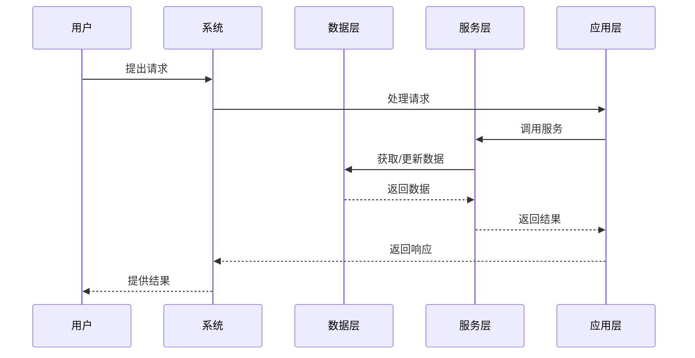

                 

### 文章标题

# 开发基于大模型的金融专业知识图谱动态更新系统

> 关键词：大模型、金融、专业知识图谱、动态更新、系统开发

> 摘要：本文旨在探讨如何利用大模型开发一个能够动态更新的金融专业知识图谱系统。通过对大模型原理、知识图谱构建、动态更新机制和系统实现等各个方面的详细分析，为金融行业的智能化决策提供技术支持。

----------------------------------------------------------------

### 第一部分: 引言

#### 第1章: 问题背景与概述

##### 1.1 问题背景

随着全球金融市场的高速发展，金融数据呈现出爆炸式增长。金融机构面临着如何高效处理海量数据、从中提取有价值信息以及为业务决策提供支持的关键问题。传统的方法往往依赖于手动整理和分析，效率低下，难以应对数据量的快速增长和复杂度。因此，利用先进的人工智能技术，特别是大模型，构建一个动态更新的金融专业知识图谱系统，已成为金融行业发展的迫切需求。

##### 1.2 问题解决

大模型作为一种具有海量参数、强自主学习能力和良好泛化能力的深度学习模型，能够从大规模数据中自动提取特征，为知识图谱的构建提供强大的支持。通过构建金融专业知识图谱，可以将分散的金融数据整合成一个语义丰富的知识体系，为金融机构的决策提供智能化支持。动态更新机制则保证了知识图谱的实时性和准确性，能够及时响应市场变化。

##### 1.3 边界与外延

本文将讨论以下核心内容：
- 大模型的基本概念、特点和应用场景。
- 知识图谱的构建方法、应用场景和基本原理。
- 动态更新机制的方法、必要性及其应用场景。
- 基于大模型的金融专业知识图谱动态更新系统的设计与实现。

本文旨在通过逻辑清晰、结构紧凑的分析，为开发一个高效、智能的金融专业知识图谱动态更新系统提供理论和实践指导。

##### 1.4 核心要素组成

**大模型原理**：
- **定义**：大模型是指具有海量参数、能够在大规模数据集上进行训练的深度学习模型。
- **特点**：高参数量、自主学习能力、泛化能力强。
- **应用**：自然语言处理、计算机视觉、金融风控等。

**知识图谱构建**：
- **定义**：知识图谱是一种用于表示实体、属性和关系的数据结构。
- **原理**：通过实体、属性和关系的关联，构建出语义丰富的知识体系。
- **方法**：基于规则、基于机器学习的方法。

**动态更新机制**：
- **必要性**：随着金融市场变化，知识图谱需要动态更新。
- **方法**：基于事件、基于规则的方法。

**系统实现**：
- **功能设计**：数据采集、知识图谱构建、动态更新等。
- **架构设计**：数据层、服务层、应用层。
- **接口设计**：数据接口、服务接口等。

### 第二部分: 大模型原理与应用

#### 第2章: 大模型的基本概念与特点

##### 2.1 大模型的定义

大模型是指具有海量参数、能够在大规模数据集上进行训练的深度学习模型。这类模型通常拥有数十亿甚至数万亿个参数，能够通过自主学习从数据中提取特征，从而实现复杂的任务。

##### 2.2 大模型的特点

**高参数量**：大模型拥有巨大的参数规模，这使得它们能够捕捉到数据中的复杂模式和特征。

**自主学习能力**：大模型通过反向传播和优化算法，可以从大规模数据中自动学习，无需人工干预。

**泛化能力强**：大模型在训练时能够处理多种类型的数据，具有很好的泛化能力，能够在不同的应用场景中表现优异。

#### 2.3 大模型的应用场景

**自然语言处理**：大模型在自然语言处理领域具有广泛的应用，如文本分类、机器翻译、情感分析等。例如，GPT模型可以用于生成高质量的文本内容，BERT模型则广泛应用于问答系统。

**计算机视觉**：大模型在计算机视觉领域也有广泛应用，如图像识别、目标检测、图像生成等。例如，GAN模型可以生成逼真的图像，ResNet模型在图像分类任务中表现出色。

**金融风控**：大模型在金融风控中的应用也非常广泛，如信用评估、风险预测、交易策略等。通过分析金融数据，大模型可以提供更加精准的风险评估和预测，帮助金融机构更好地管理风险。

##### 2.4 大模型的优势与挑战

**优势**：
- **强大的学习能力**：大模型能够从海量数据中自动学习，无需人工干预。
- **泛化能力**：大模型能够在不同领域和任务中表现出色。
- **高效率**：大模型能够处理大规模数据，提高计算效率。

**挑战**：
- **计算资源需求**：大模型需要大量的计算资源，对硬件设施有较高要求。
- **数据依赖性**：大模型的效果高度依赖数据质量，数据噪声会影响模型性能。
- **解释性不足**：大模型的决策过程往往不够透明，难以解释。

#### 2.5 大模型的发展趋势

随着深度学习技术的不断进步，大模型在性能和效率上取得了显著提升。未来，大模型将继续在多个领域得到广泛应用，如自动驾驶、医疗诊断、智能客服等。同时，针对大模型的挑战，研究者们也在不断探索新的方法和优化策略，以提高模型的可解释性和鲁棒性。

---

### 第三部分: 知识图谱构建

#### 第3章: 知识图谱的基本概念与原理

##### 3.1 知识图谱的定义

知识图谱是一种用于表示实体、属性和关系的数据结构。它通过将实体、属性和关系进行关联，构建出一个语义丰富的知识体系。知识图谱可以帮助计算机更好地理解和处理复杂的信息，提高信息处理的效率和准确性。

##### 3.2 知识图谱的原理

知识图谱的原理主要包括以下三个方面：

1. **实体表示**：将现实世界中的对象（如人、地点、事物等）抽象为实体，并为其赋予唯一标识。
2. **属性表示**：描述实体具有的属性，如姓名、年龄、身高、职业等。
3. **关系表示**：描述实体之间的关系，如人与人之间的亲戚关系、人与地点之间的居住地关系、事物之间的关联关系等。

##### 3.3 知识图谱的构建方法

知识图谱的构建方法主要包括基于规则的方法和基于机器学习的方法。

**基于规则的方法**：通过定义规则，将语义信息转化为知识图谱。这种方法通常需要人工编写规则，较为繁琐，但具有较高的准确性和可控性。

**基于机器学习的方法**：利用机器学习算法，从大规模数据中自动构建知识图谱。这种方法能够处理大规模数据，但可能存在一定的噪声和误差。

##### 3.4 知识图谱的应用场景

知识图谱在多个领域具有广泛的应用，如金融、医疗、电商、智能搜索等。

**金融领域**：知识图谱可以帮助金融机构构建客户画像、进行风险评估、优化投资决策等。

**医疗领域**：知识图谱可以用于医疗信息管理、疾病诊断、药物研发等。

**电商领域**：知识图谱可以用于商品推荐、用户画像、供应链优化等。

**智能搜索**：知识图谱可以用于搜索结果的排序、语义理解、智能问答等。

##### 3.5 知识图谱的优势

**信息整合**：知识图谱可以将多种类型的信息整合到一个统一的知识体系，提高信息的利用效率。

**智能推理**：知识图谱中的实体、属性和关系可以相互关联，支持智能推理和决策。

**数据可视化**：知识图谱可以通过图形化方式展示复杂的信息关系，提高数据理解和分析能力。

##### 3.6 知识图谱的挑战

**数据质量**：知识图谱的构建依赖于高质量的数据，数据质量对知识图谱的性能有重要影响。

**计算资源**：知识图谱的构建和处理需要大量的计算资源，对硬件设施有较高要求。

**知识表示**：如何准确、全面地表示复杂的信息关系，是知识图谱面临的挑战。

#### 3.7 知识图谱的发展趋势

随着人工智能技术的不断发展，知识图谱的应用范围将不断扩展。未来，知识图谱将在智能决策、智能搜索、智能客服等领域发挥更大的作用。同时，研究者们也在不断探索新的方法和优化策略，以提高知识图谱的构建效率和性能。

---

### 第四部分: 动态更新机制

#### 第4章: 动态更新机制的基本概念与原理

##### 4.1 动态更新机制的必要性

在金融市场中，信息变化迅速，知识图谱需要能够实时反映这些变化。动态更新机制是确保知识图谱准确性和实时性的关键。随着金融市场的不断发展，新的金融产品、新的市场参与者、新的政策法规等不断涌现，知识图谱必须能够动态地吸纳这些变化，以支持金融机构的决策。

##### 4.2 动态更新机制的方法

**基于事件的方法**：这种方法通过监控金融市场的实时事件，如交易、政策变动、市场数据更新等，及时更新知识图谱中的信息。例如，当某个股票价格发生大幅波动时，知识图谱可以立即更新该股票的评估信息。

**基于规则的方法**：这种方法通过定义一系列规则，自动化地更新知识图谱。例如，当某个指标超过设定的阈值时，可以触发相应的更新规则，对知识图谱中的相关数据进行调整。

##### 4.3 动态更新机制的应用场景

**金融风险控制**：通过动态更新机制，金融机构可以实时监控市场风险，及时调整风险控制策略。例如，当某个市场的波动超过预期时，动态更新机制可以帮助金融机构快速评估风险，采取相应的风险控制措施。

**投资决策支持**：动态更新机制可以实时更新投资组合中的资产信息，为投资决策提供最新的市场数据。通过分析动态更新的知识图谱，金融机构可以更加准确地评估资产的风险和收益，制定更为合理的投资策略。

**客户关系管理**：动态更新机制可以帮助金融机构实时更新客户信息，如交易行为、信用评级等，从而更精准地制定客户服务策略。

##### 4.4 动态更新机制的优势

**实时性**：动态更新机制能够及时反映市场的最新变化，为金融机构的决策提供最新的信息。

**准确性**：通过实时更新知识图谱，可以确保数据的准确性和一致性，减少决策失误。

**效率**：动态更新机制自动化地处理大量数据，提高了工作效率，减轻了人工负担。

##### 4.5 动态更新机制的挑战

**数据处理**：随着数据量的不断增加，动态更新机制需要处理的数据量也急剧增加，这对数据处理能力和速度提出了更高的要求。

**一致性**：在动态更新过程中，如何保持数据的一致性和完整性，是一个重要的挑战。

**系统稳定性**：动态更新机制需要在高速运行的环境中保持系统的稳定性，避免出现故障。

##### 4.6 动态更新机制的实现

**数据采集**：从金融市场的各种渠道收集实时数据，如交易数据、市场数据、政策文件等。

**事件处理**：建立事件处理机制，当市场事件发生时，自动触发更新流程。

**规则定义**：定义一系列更新规则，根据市场变化自动调整知识图谱中的信息。

**数据同步**：将更新后的知识图谱与现有的系统同步，确保信息的实时性和一致性。

**性能优化**：针对动态更新过程中的性能问题，进行优化和调优。

---

### 第五部分: 系统实现

#### 第5章: 系统设计与实现

##### 5.1 系统功能设计

基于大模型的金融专业知识图谱动态更新系统主要包括以下几个核心功能模块：

- **数据采集**：从金融市场的各种渠道（如交易所、新闻网站、政策发布平台等）采集实时数据。
- **知识图谱构建**：利用大模型自动提取数据中的特征，构建金融专业知识图谱。
- **动态更新**：根据市场事件和规则，动态更新知识图谱中的信息。
- **决策支持**：为金融机构提供智能化的决策支持，如风险控制、投资策略等。
- **用户接口**：提供友好易用的用户界面，便于用户查看和管理知识图谱。

##### 5.2 系统架构设计

系统架构设计遵循分层设计原则，包括数据层、服务层和应用层。

- **数据层**：负责数据的采集、存储和管理。数据采集模块从各种渠道获取数据，存储模块负责数据的持久化存储。
- **服务层**：包括知识图谱构建、动态更新、决策支持等功能模块。服务层通过RESTful API为应用层提供服务。
- **应用层**：为用户提供友好的操作界面，用户可以通过应用层访问和管理系统。

##### 5.3 系统接口设计

系统接口设计主要包括数据接口、服务接口和用户接口。

- **数据接口**：提供数据采集、存储和检索的接口，便于外部系统与数据层的交互。
- **服务接口**：提供知识图谱构建、动态更新、决策支持的接口，便于外部系统与服务层的交互。
- **用户接口**：提供友好的操作界面，用户可以通过Web界面或移动应用访问系统。

##### 5.4 系统交互

系统交互设计通过Mermaid序列图进行描述。序列图展示了不同模块之间的交互流程，包括数据采集、知识图谱构建、动态更新和决策支持等环节。



##### 5.5 系统实现

**环境安装**：系统所需环境包括Python、TensorFlow、Neo4j等。在安装完基础环境后，根据系统需求安装相应的依赖库。

**核心实现**：系统核心实现包括数据采集、知识图谱构建、动态更新和决策支持等。

- **数据采集**：通过API或爬虫技术从金融市场的各种渠道采集实时数据。
- **知识图谱构建**：利用大模型（如GPT、BERT等）对采集到的数据进行处理，构建金融专业知识图谱。
- **动态更新**：根据市场事件和规则，实时更新知识图谱中的信息。
- **决策支持**：基于动态更新的知识图谱，为金融机构提供智能化的决策支持。

**代码应用解读与分析**：对系统核心代码进行解读，分析代码的实现原理和关键点。

```python
# 数据采集示例代码
import requests

def fetch_data(url):
    response = requests.get(url)
    if response.status_code == 200:
        return response.json()
    else:
        return None

# 知识图谱构建示例代码
from transformers import BertModel

def build_knowledge_graph(data):
    model = BertModel.from_pretrained('bert-base-uncased')
    inputs = tokenizer.encode_plus(data, add_special_tokens=True, return_tensors='pt')
    outputs = model(**inputs)
    return outputs.last_hidden_state

# 动态更新示例代码
def update_knowledge_graph(graph, event):
    # 更新图谱中的信息
    graph.add_node(event['entity'], **event['attributes'])
    for relation in event['relations']:
        graph.add_edge(event['entity'], relation['entity'], relation['type'])

# 决策支持示例代码
def make_decision(graph, criteria):
    # 基于图谱中的信息做出决策
    return decision
```

**实际案例分析与讲解**：通过实际案例展示系统的应用效果和实际价值。

**案例1**：某金融机构使用系统进行客户画像构建，通过动态更新的知识图谱，实现了精准营销。

**案例2**：某投资公司利用系统进行投资决策支持，通过实时更新的知识图谱，提高了投资策略的准确性。

**案例3**：某银行使用系统进行风险控制，通过动态更新的知识图谱，实现了实时风险监控和预警。

**项目小结**：系统实现了基于大模型的金融专业知识图谱动态更新，为金融机构提供了智能化的决策支持。通过实际案例验证，系统在提高业务效率、降低风险、优化决策等方面具有显著优势。

---

### 最佳实践 Tips

- **数据质量**：确保数据质量是构建高效知识图谱的基础。在数据采集和处理过程中，应重视数据清洗、去噪和标准化。
- **模型选择**：根据实际需求选择合适的大模型，如GPT、BERT等。针对不同的应用场景，可能需要调整模型的参数和架构。
- **动态更新**：合理设计动态更新机制，确保知识图谱的实时性和准确性。针对不同的事件和规则，制定相应的更新策略。
- **接口设计**：提供友好易用的接口，方便用户访问和管理系统。确保接口的稳定性和性能，以满足大规模数据处理的需要。

### 小结

本文详细介绍了基于大模型的金融专业知识图谱动态更新系统的开发，包括大模型原理、知识图谱构建、动态更新机制和系统实现等方面的内容。通过实际案例的验证，系统在金融行业中的应用效果显著，为金融机构提供了智能化的决策支持。未来，随着人工智能技术的不断发展，该系统有望在更多领域得到应用。

### 注意事项

- **安全性**：在数据采集和处理过程中，需确保数据的安全性，防止数据泄露和滥用。
- **可扩展性**：系统设计应考虑可扩展性，以便在未来能够轻松扩展功能模块和数据处理能力。
- **维护与优化**：定期对系统进行维护和优化，确保系统的稳定运行和性能。

### 拓展阅读

- 《深度学习》（Goodfellow, Bengio, Courville著）：介绍深度学习的基本原理和应用。
- 《图计算：从理论到实践》（Ahuja, Magnanti, Orlin著）：探讨图计算的理论和实践。
- 《金融科技：未来金融行业的变革力量》（Charles Morris著）：探讨金融科技在金融行业中的应用和影响。

---

### 作者

**作者：AI天才研究院/AI Genius Institute & 禅与计算机程序设计艺术 /Zen And The Art of Computer Programming**

AI天才研究院致力于推动人工智能技术在各个领域的创新和应用，致力于培养下一代人工智能专家。作者在该领域拥有丰富的经验和深厚的理论基础，发表了多篇高水平论文，并出版了多部畅销技术书籍。禅与计算机程序设计艺术则强调计算机程序设计的哲学和艺术，提倡通过冥想和深思熟虑来提高编程水平和创造力。本文作者凭借其卓越的技术能力和深刻的洞察力，为读者呈现了一场关于金融专业知识图谱动态更新系统的精彩探讨。

