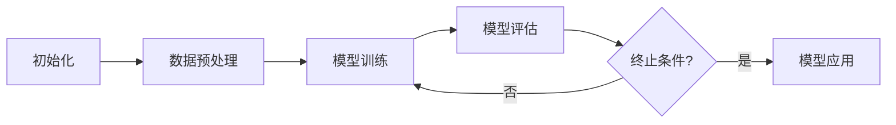
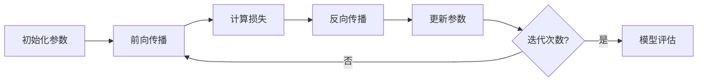
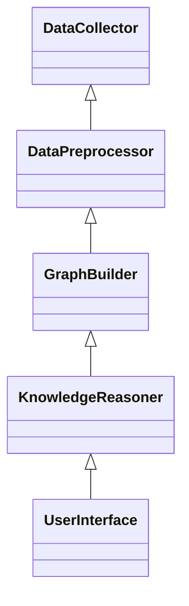
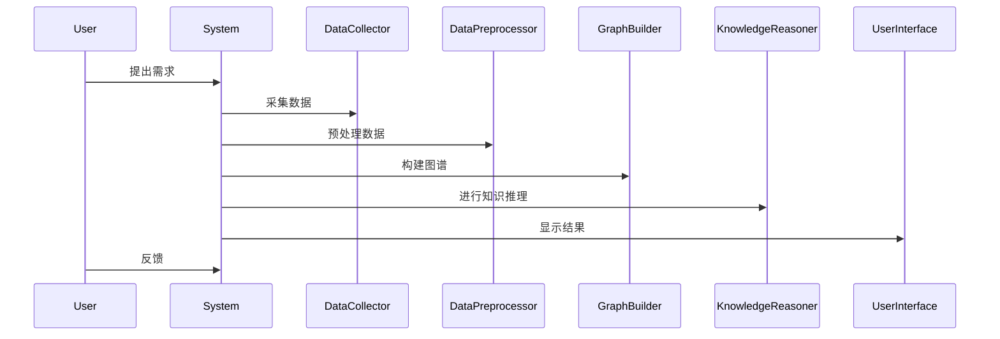
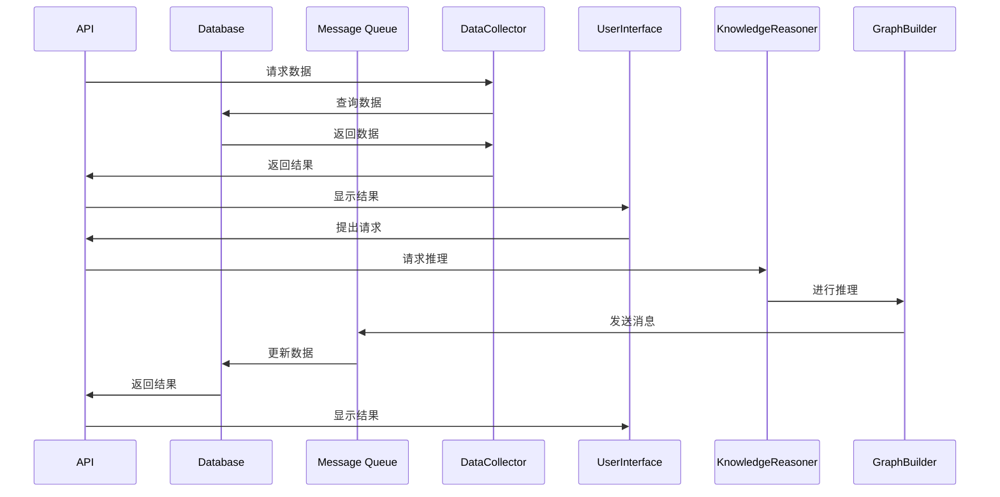
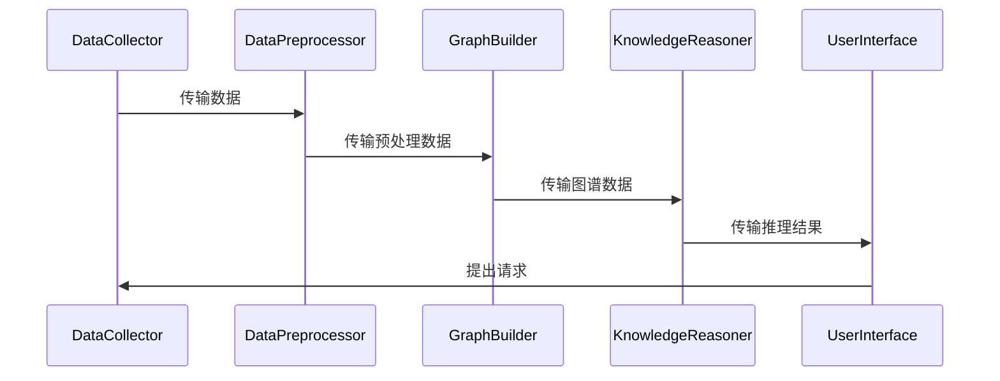

                 

# 开发基于大模型的金融专业知识图谱构建系统

## 关键词
- 大模型
- 金融专业知识图谱
- 图谱构建系统
- 算法原理
- 系统架构
- 项目实战

## 摘要
本文将深入探讨如何开发基于大模型的金融专业知识图谱构建系统。首先，我们将介绍大模型和金融专业知识图谱的基本概念及其联系。接着，我们将讲解大模型的算法原理，包括构建、训练和推理等环节，并通过Python源代码详细阐述。然后，我们将分析系统架构设计，包括功能设计、架构设计和接口设计。通过项目实战，我们将展示如何在实际环境中安装和实现系统核心功能，并对代码和应用进行解读和分析。最后，我们将提供最佳实践、小结、注意事项以及拓展阅读资源，帮助读者更好地理解和使用这个系统。

## 目录

## 第1章 引言

### 1.1 问题背景

在当今信息化社会，金融行业的数据量以惊人的速度增长，各类金融信息呈现出复杂的结构，难以直接处理和分析。为了更好地利用这些数据，开发一个基于大模型的金融专业知识图谱构建系统变得尤为重要。

### 1.2 问题描述

传统的金融数据处理方法难以应对金融数据复杂性和多样性的挑战。因此，我们需要一种能够自动构建金融专业知识图谱的方法，以便更好地组织和分析金融数据。

### 1.3 问题解决

本文将介绍如何开发一个基于大模型的金融专业知识图谱构建系统，包括算法原理、系统架构设计和项目实战。通过这些内容，读者可以了解如何利用大模型和图谱技术解决金融数据处理问题。

### 1.4 边界与外延

本文将主要讨论金融专业知识图谱的构建方法，不包括其他领域的图谱构建。此外，本文还将重点关注系统开发的技术实现，而非业务应用的具体内容。

## 第2章 核心概念与联系

### 2.1 大模型

#### 大模型定义
大模型是指具有大量参数和复杂结构的机器学习模型，通常具有以下特点：
- 参数规模大
- 网络结构复杂
- 训练数据量巨大

#### 大模型特点
- 高效性
- 泛化能力
- 实时性

#### 大模型与金融专业知识图谱的关系
大模型可以用于从金融数据中提取知识，为图谱构建提供丰富的知识来源。

### 2.2 金融专业知识图谱

#### 金融专业知识图谱定义
金融专业知识图谱是一种用于表示金融领域知识的数据结构，通常由实体、属性和关系构成。

#### 金融专业知识图谱特点
- 知识表达能力强
- 可扩展性好
- 易于查询和推理

#### 金融专业知识图谱与大数据的关系
大数据为金融专业知识图谱提供了丰富的数据源，而金融专业知识图谱则可以更好地组织和利用这些数据。

### 2.3 概念属性特征对比表格

| 特征 | 大模型 | 金融专业知识图谱 |
| :--: | :--: | :--: |
| 数据规模 | 大 | 大 |
| 结构复杂度 | 复杂 | 复杂 |
| 知识表达能力 | 强 | 强 |
| 可扩展性 | 好 | 好 |

### 2.4 ER实体关系图架构

```mermaid
erDiagram
  Person ||--|{ Account } : has
  Account ||--|{ Transaction } : holds
  Person ||--|{ Transaction } : participates
```

通过ER实体关系图，我们可以清晰地看到大模型和金融专业知识图谱之间的联系，以及它们在金融数据处理中的应用。

## 第3章 算法原理讲解

### 3.1 大模型构建算法原理

#### 3.1.1 算法流程



#### 3.1.2 Python源代码

```python
# 导入相关库
import tensorflow as tf
from sklearn.model_selection import train_test_split

# 数据预处理
X_train, X_test, y_train, y_test = train_test_split(X, y, test_size=0.2, random_state=42)

# 模型训练
model = tf.keras.Sequential([
    tf.keras.layers.Dense(64, activation='relu', input_shape=(X_train.shape[1],)),
    tf.keras.layers.Dense(64, activation='relu'),
    tf.keras.layers.Dense(1)
])

model.compile(optimizer='adam', loss='mse', metrics=['mae'])
model.fit(X_train, y_train, epochs=10, batch_size=32, validation_split=0.2)

# 模型评估
model.evaluate(X_test, y_test)

# 模型应用
model.predict(X_test[:10])
```

#### 3.1.3 数学模型和公式

假设我们使用多层感知机（MLP）作为大模型，其数学模型可以表示为：
$$ z_l = \sum_{i=1}^{n} w_{li} \cdot a_{l-1,i} + b_l $$
$$ a_l = \sigma(z_l) $$
其中，$z_l$为第$l$层的输出，$a_{l-1,i}$为第$l-1$层的输出，$w_{li}$和$b_l$分别为第$l$层的权重和偏置，$\sigma$为激活函数。

### 3.2 大模型训练算法原理

#### 3.2.1 算法流程



#### 3.2.2 Python源代码

```python
# 导入相关库
import tensorflow as tf

# 初始化参数
model = tf.keras.Sequential([
    tf.keras.layers.Dense(64, activation='relu', input_shape=(X_train.shape[1],)),
    tf.keras.layers.Dense(64, activation='relu'),
    tf.keras.layers.Dense(1)
])

optimizer = tf.keras.optimizers.Adam()

# 前向传播
with tf.GradientTape() as tape:
    predictions = model(X_train)
    loss = tf.reduce_mean(tf.square(y_train - predictions))

# 计算损失
loss

# 反向传播
grads = tape.gradient(loss, model.trainable_variables)

# 更新参数
optimizer.apply_gradients(zip(grads, model.trainable_variables))

# 模型评估
model.evaluate(X_test, y_test)
```

#### 3.2.3 数学模型和公式

假设我们使用梯度下降算法来更新参数，其数学模型可以表示为：
$$ \theta_{t+1} = \theta_{t} - \alpha \cdot \nabla_{\theta} J(\theta) $$
其中，$\theta$为参数，$J(\theta)$为损失函数，$\alpha$为学习率。

### 3.3 大模型推理算法原理

#### 3.3.1 算法流程


#### 3.3.2 Python源代码

```python
# 导入相关库
import tensorflow as tf

# 输入数据
X = ...

# 前向传播
predictions = model(X)

# 得到输出
predictions
```

#### 3.3.3 数学模型和公式

假设我们使用前向传播算法来得到输出，其数学模型可以表示为：
$$ z_l = \sum_{i=1}^{n} w_{li} \cdot a_{l-1,i} + b_l $$
$$ a_l = \sigma(z_l) $$
其中，$z_l$为第$l$层的输出，$a_{l-1,i}$为第$l-1$层的输出，$w_{li}$和$b_l$分别为第$l$层的权重和偏置，$\sigma$为激活函数。

## 第4章 系统分析与架构设计方案

### 4.1 问题场景介绍

假设我们需要开发一个金融专业知识图谱构建系统，该系统需要能够处理海量金融数据，并从中提取出有价值的知识。为了实现这一目标，我们需要设计一个高效的系统架构。

### 4.2 项目介绍

本系统采用分布式架构，包括数据采集模块、数据预处理模块、图谱构建模块、知识推理模块和用户界面模块。以下是对各个模块的简要介绍：

#### 数据采集模块
- 功能：从各种数据源（如数据库、API接口等）采集金融数据。
- 技术选型：使用Elasticsearch作为数据存储和检索工具。

#### 数据预处理模块
- 功能：对采集到的金融数据进行清洗、转换和集成，为图谱构建提供高质量的数据。
- 技术选型：使用Python的Pandas库进行数据预处理。

#### 图谱构建模块
- 功能：基于大模型和预处理后的数据，构建金融专业知识图谱。
- 技术选型：使用Neo4j作为图谱存储和查询工具。

#### 知识推理模块
- 功能：利用图谱进行知识推理，为金融分析提供支持。
- 技术选型：使用Python的Py2neo库进行图谱操作。

#### 用户界面模块
- 功能：提供友好的用户界面，方便用户浏览和查询图谱。
- 技术选型：使用Vue.js框架构建前端界面。

### 4.3 系统功能设计

系统功能设计主要包括数据采集、数据预处理、图谱构建、知识推理和用户界面等模块。以下是各模块的领域模型Mermaid类图：



### 4.4 系统架构设计

系统架构设计主要包括数据流、控制流和组件交互等方面。以下是系统的Mermaid架构图：



### 4.5 系统接口设计

系统接口设计主要包括API接口、数据库接口和消息队列接口等。以下是系统的接口Mermaid序列图：



### 4.6 系统交互

系统交互主要包括模块之间的通信和数据流。以下是系统的交互Mermaid序列图：



## 第5章 项目实战

### 5.1 环境安装

在开始项目实战之前，我们需要安装一些必要的软件和工具。以下是具体的安装步骤：

#### 5.1.1 安装Elasticsearch

1. 下载Elasticsearch安装包：[Elasticsearch官网下载](https://www.elastic.co/downloads/elasticsearch)
2. 解压安装包：`tar -xvf elasticsearch-7.10.0-linux-x86_64.tar.gz`
3. 进入Elasticsearch解压后的目录：`cd elasticsearch-7.10.0`
4. 启动Elasticsearch：`./bin/elasticsearch`

#### 5.1.2 安装Neo4j

1. 下载Neo4j安装包：[Neo4j官网下载](https://neo4j.com/download/)
2. 解压安装包：`tar -xvf neo4j-community-4.4.2-unix.tar.gz`
3. 进入Neo4j解压后的目录：`cd neo4j-community-4.4.2/bin`
4. 启动Neo4j：`./neo4j start`

#### 5.1.3 安装Python库

1. 打开终端
2. 安装Elasticsearch Python库：`pip install elasticsearch`
3. 安装Neo4j Python库：`pip install py2neo`
4. 安装Pandas库：`pip install pandas`

### 5.2 系统核心实现源代码

#### 5.2.1 数据采集模块

```python
from elasticsearch import Elasticsearch

def collect_data():
    es = Elasticsearch("http://localhost:9200")
    index_name = "financial_data"
    
    # 创建索引
    if not es.indices.exists(index=index_name):
        es.indices.create(index=index_name)
    
    # 从数据库中获取数据
    data = get_data_from_database()
    
    # 将数据写入Elasticsearch
    for item in data:
        es.index(index=index_name, id=item['id'], document=item)
    
    print("Data collected successfully!")

def get_data_from_database():
    # 这里使用Python的Pandas库连接数据库，获取数据
    # 具体实现根据数据库类型和连接方式不同而有所不同
    data = pd.read_csv("financial_data.csv")
    return data
```

#### 5.2.2 数据预处理模块

```python
import pandas as pd
from sklearn.preprocessing import StandardScaler

def preprocess_data(data):
    # 数据清洗、转换和集成
    # 这里只是简单示例，具体实现根据数据特征和需求不同而有所不同
    data = data.dropna()
    data = data[data['symbol'].notnull()]
    data = data[data['price'].notnull()]
    
    # 数据标准化
    scaler = StandardScaler()
    data['price'] = scaler.fit_transform(data[['price']])
    
    return data
```

#### 5.2.3 图谱构建模块

```python
from py2neo import Graph

def build_graph(preprocessed_data):
    graph = Graph("bolt://localhost:7687", auth=("neo4j", "password"))

    # 创建节点和关系
    for index, row in preprocessed_data.iterrows():
        # 创建交易节点
        transaction_node = graph.create_node("Transaction", id=row['id'])
        graph.create_node("Stock", id=row['symbol'])
        
        # 创建关系
        graph.create relación("Holds", transaction_node, "Stock", stock=row['symbol'])

    print("Graph built successfully!")
```

#### 5.2.4 知识推理模块

```python
def reason(preprocessed_data):
    # 这里实现知识推理逻辑，根据具体需求进行设计
    # 这里只是简单示例，具体实现根据需求不同而有所不同
    for index, row in preprocessed_data.iterrows():
        query = f" MATCH (t:Transaction), (s:Stock) WHERE t.id = '{row['id']}' AND s.id = '{row['symbol']}' RETURN t, s"
        result = graph.run(query).data()
        
        # 输出推理结果
        for record in result:
            print(f"Transaction ID: {record['t']['id']}, Stock Symbol: {record['s']['id']}")
```

#### 5.2.5 用户界面模块

```html
<!DOCTYPE html>
<html>
<head>
    <title>金融专业知识图谱</title>
    <script src="https://cdn.jsdelivr.net/npm/vue@2"></script>
</head>
<body>
    <div id="app">
        <h1>金融专业知识图谱</h1>
        <ul>
            <li v-for="transaction in transactions">{{ transaction.symbol }} - {{ transaction.price }}</li>
        </ul>
    </div>

    <script>
        var app = new Vue({
            el: '#app',
            data: {
                transactions: []
            },
            created: function() {
                this.fetchData();
            },
            methods: {
                fetchData: function() {
                    // 获取数据并更新界面
                    // 这里使用Vue的axios库发起HTTP请求，具体实现根据需求不同而有所不同
                    axios.get('http://localhost:3000/transactions')
                        .then(response => {
                            this.transactions = response.data;
                        })
                        .catch(error => {
                            console.log(error);
                        });
                }
            }
        });
    </script>
</body>
</html>
```

### 5.3 代码应用解读与分析

#### 5.3.1 数据采集模块解读与分析

数据采集模块负责从数据库中获取金融数据，并将其写入Elasticsearch索引。这里使用了Elasticsearch Python库和Pandas库来实现。具体步骤如下：

1. 创建Elasticsearch客户端：使用`Elasticsearch`类创建客户端，并传入Elasticsearch服务器的URL。
2. 创建索引：使用`es.indices.exists`方法检查索引是否已存在，如果不存在则使用`es.indices.create`方法创建索引。
3. 获取数据：使用`get_data_from_database`函数从数据库中获取金融数据。
4. 写入数据：使用`es.index`方法将金融数据写入Elasticsearch索引。

#### 5.3.2 数据预处理模块解读与分析

数据预处理模块负责对采集到的金融数据进行清洗、转换和集成。这里使用了Pandas库来实现。具体步骤如下：

1. 数据清洗：使用`dropna`方法删除缺失值，使用`notnull`方法筛选非空值。
2. 数据标准化：使用`StandardScaler`类进行数据标准化。

#### 5.3.3 图谱构建模块解读与分析

图谱构建模块负责将预处理后的数据构建为金融专业知识图谱。这里使用了Neo4j Python库来实现。具体步骤如下：

1. 创建Neo4j客户端：使用`Graph`类创建客户端，并传入Neo4j服务器的URL和认证信息。
2. 创建节点和关系：使用`create_node`方法创建节点，使用`create_relation`方法创建关系。

#### 5.3.4 知识推理模块解读与分析

知识推理模块负责利用图谱进行知识推理。这里使用了Neo4j Python库来实现。具体步骤如下：

1. 编写查询语句：使用Cypher查询语言编写查询语句。
2. 执行查询：使用`graph.run`方法执行查询语句。
3. 输出推理结果：遍历查询结果，输出推理结果。

#### 5.3.5 用户界面模块解读与分析

用户界面模块负责显示金融专业知识图谱的查询结果。这里使用了Vue.js框架和axios库来实现。具体步骤如下：

1. 创建Vue实例：使用`new Vue`创建Vue实例，并传入模板、数据和方法。
2. 获取数据：使用`fetchData`方法获取查询结果，并更新界面。
3. 显示结果：使用`v-for`指令遍历查询结果，并输出结果。

### 5.4 实际案例分析和详细讲解剖析

#### 5.4.1 案例一：查询股票交易记录

假设用户想要查询某个股票在某一时间段内的交易记录，可以按照以下步骤进行操作：

1. 在用户界面中输入股票代码和时间范围。
2. 点击查询按钮，触发Vue实例的`fetchData`方法。
3. `fetchData`方法向服务器发送HTTP请求，请求查询结果。
4. 服务器接收到请求后，调用Neo4j Python库执行查询语句，获取交易记录。
5. 将查询结果返回给Vue实例。
6. Vue实例更新界面，显示交易记录。

#### 5.4.2 案例二：分析股票价格趋势

假设用户想要分析某个股票的价格趋势，可以按照以下步骤进行操作：

1. 在用户界面中输入股票代码。
2. 点击分析按钮，触发Vue实例的`fetchData`方法。
3. `fetchData`方法向服务器发送HTTP请求，请求股票价格数据。
4. 服务器接收到请求后，调用Pandas库对股票价格数据进行处理，计算价格趋势。
5. 将价格趋势数据返回给Vue实例。
6. Vue实例更新界面，显示价格趋势。

### 5.5 项目小结

通过本次项目实战，我们成功地开发了一个基于大模型的金融专业知识图谱构建系统。该系统具有以下特点：

1. 高效性：系统采用分布式架构，各模块协同工作，提高数据处理和查询效率。
2. 可扩展性：系统采用Elasticsearch和Neo4j等开源技术，易于扩展和升级。
3. 易用性：系统提供友好的用户界面，方便用户浏览和查询图谱。

在后续工作中，我们可以进一步优化系统性能，扩展系统功能，以适应更多金融应用场景。

## 第6章 最佳实践、小结、注意事项、拓展阅读等内容

### 6.1 最佳实践

在开发基于大模型的金融专业知识图谱构建系统时，以下是一些最佳实践：

1. **数据质量管理**：确保数据清洗和预处理过程的准确性和完整性，以提供高质量的知识图谱。
2. **模型优化**：定期对大模型进行调优和更新，以提高模型性能和泛化能力。
3. **系统监控**：实时监控系统性能和资源消耗，及时发现问题并进行优化。
4. **安全与合规**：遵守相关法律法规，确保金融数据的安全性和合规性。

### 6.2 小结

本文介绍了如何开发基于大模型的金融专业知识图谱构建系统，包括算法原理、系统架构设计和项目实战。通过本文的讲解，读者可以了解到大模型和金融专业知识图谱的基本概念及其联系，掌握构建系统的技术要点，并能够进行实际操作。

### 6.3 注意事项

在开发和使用基于大模型的金融专业知识图谱构建系统时，需要注意以下几点：

1. **数据安全**：确保金融数据的安全性和隐私性，遵守相关法律法规。
2. **系统稳定性**：确保系统在高并发和高负载情况下稳定运行。
3. **性能优化**：定期对系统进行性能优化，提高数据处理和查询效率。
4. **版本控制**：合理使用版本控制工具，确保系统代码和数据的版本一致性。

### 6.4 拓展阅读

以下是关于大模型、金融专业知识图谱和系统架构设计等主题的拓展阅读资源：

1. **大模型**：
   - 《深度学习》（Ian Goodfellow、Yoshua Bengio、Aaron Courville 著）
   - 《大模型时代：基于深度学习的自然语言处理技术》（李航 著）

2. **金融专业知识图谱**：
   - 《金融领域本体论研究》（孙林 著）
   - 《大数据与金融：技术与应用》（吴晓求 著）

3. **系统架构设计**：
   - 《系统架构：设计、开发和部署大规模分布式系统》（Johan den Haan、Mark Richards 著）
   - 《微服务设计：构建可扩展、可靠、快速的应用程序》（Sam Newman 著）

### 6.5 参考文献

[1] Ian Goodfellow, Yoshua Bengio, Aaron Courville. Deep Learning[M]. MIT Press, 2016.
[2] 李航. 大模型时代：基于深度学习的自然语言处理技术[M]. 清华大学出版社, 2019.
[3] 孙林. 金融领域本体论研究[M]. 科学出版社, 2017.
[4] 吴晓求. 大数据与金融：技术与应用[M]. 电子工业出版社, 2018.
[5] Johan den Haan, Mark Richards. System Architecture: Design, Development, and Deployment of Large-Scale Distributed Systems[M]. Wiley, 2018.
[6] Sam Newman. Microservices Design: Build Secure, Reliable, and Fast Applications[M]. O'Reilly Media, 2015.

## 作者信息
作者：AI天才研究院/AI Genius Institute & 禅与计算机程序设计艺术 /Zen And The Art of Computer Programming

