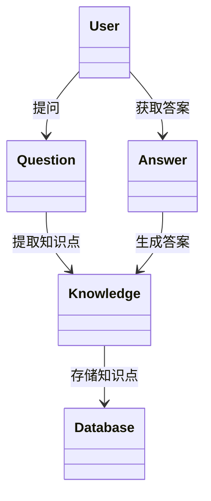
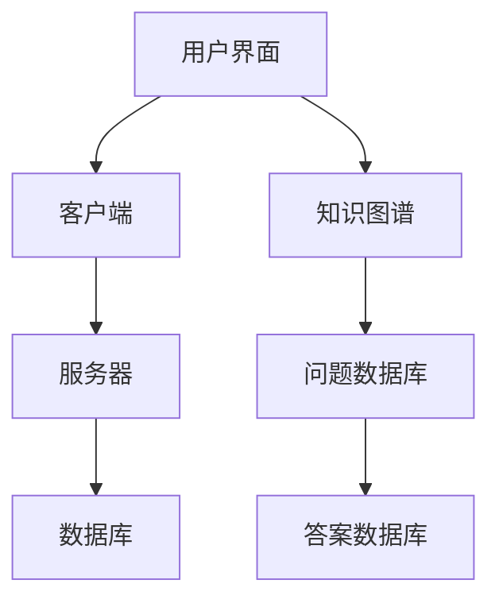
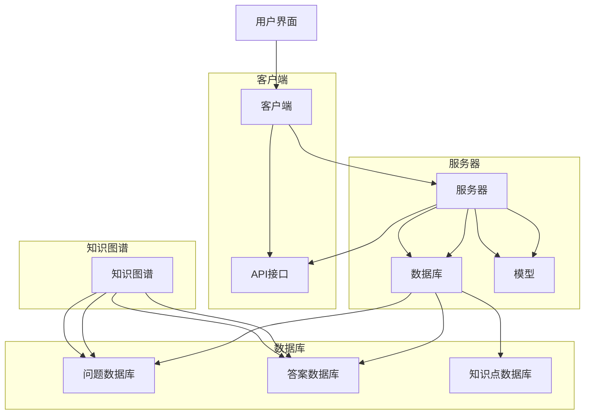
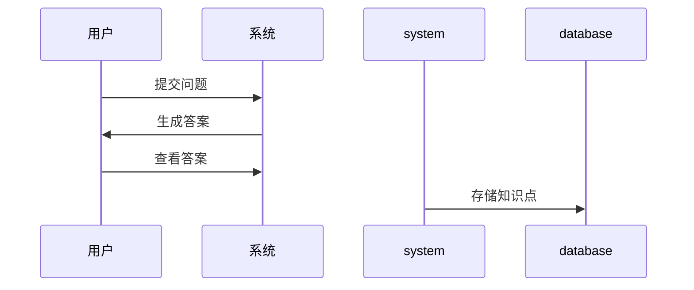

                 

# 开发基于大模型的金融专业考试答疑系统

## 关键词

- 大模型
- 金融专业考试
- 答疑系统
- 算法
- 系统设计
- 项目实战

## 摘要

随着人工智能技术的不断发展，大模型在各个领域的应用越来越广泛。本文旨在探讨如何开发一个基于大模型的金融专业考试答疑系统，通过系统地介绍大模型的基本原理、金融专业考试的需求、系统设计与实现，以及项目实战中的最佳实践，帮助读者理解并掌握这一前沿技术。本文不仅关注技术实现，更注重实际应用中的问题和挑战，力求为金融行业的数字化转型提供有力支持。

## 第一部分：背景介绍

### 1.1 问题背景

#### 1.1.1 金融专业考试答疑的现状

在金融行业中，各类专业考试是检验从业者知识和技能的重要手段。然而，随着考试内容的复杂性和深度不断增加，考生在面对难题和疑惑时往往难以找到及时且准确的解答。传统的答疑方式，如面对面的辅导、在线论坛或学术讲座，虽然在某些方面具有一定的作用，但往往存在响应时间慢、覆盖面有限等问题，无法满足大量考生同时获得高效答疑的需求。

#### 1.1.2 大模型的发展与应用

近年来，大模型（如GPT-3、BERT等）在自然语言处理、推荐系统、图像识别等领域取得了显著的突破。这些大模型具有强大的语义理解和生成能力，可以处理大量的文本数据，生成高质量的自然语言回答。因此，将大模型应用于金融专业考试答疑系统中，有望提高答疑的效率和质量，满足考生对高效、准确答疑的需求。

### 1.2 问题描述

#### 1.2.1 金融专业考试答疑的需求

金融专业考试涉及的知识点广泛，包括金融市场、金融机构、金融产品、金融监管等多个方面。考生在备考过程中，往往需要针对具体问题进行深入理解。因此，一个高效的金融专业考试答疑系统应具备以下需求：

- **全面性**：系统需要覆盖金融专业考试的所有知识点。
- **准确性**：系统提供的解答应准确无误，确保考生能够正确理解知识点。
- **高效性**：系统应能够快速响应用户的提问，提供实时解答。
- **个性化**：系统应根据考生的学习情况，提供个性化的答疑服务。

#### 1.2.2 大模型在答疑中的潜力

大模型在自然语言处理领域的优异表现，使其在金融专业考试答疑系统中具有巨大的潜力。通过大模型，系统可以实现以下目标：

- **知识解析**：大模型能够深入理解金融知识，提供详细、准确的解答。
- **自动生成**：大模型可以自动生成高质量的自然语言回答，节省人力成本。
- **交互式学习**：大模型可以与用户进行实时交互，提供个性化的学习体验。

### 1.3 问题解决

#### 1.3.1 大模型答疑系统的优势

开发基于大模型的金融专业考试答疑系统，具有以下优势：

- **高效解答**：大模型能够快速处理大量问题，提供实时解答，提高答疑效率。
- **准确解答**：大模型具有强大的语义理解能力，能够准确解答金融专业问题。
- **个性化服务**：大模型可以根据用户的学习情况，提供个性化的答疑服务。
- **低成本**：大模型可以减少人力成本，降低运营成本。

#### 1.3.2 大模型答疑系统的构建

构建一个基于大模型的金融专业考试答疑系统，需要以下几个关键步骤：

1. **数据准备**：收集并整理金融专业考试的相关数据，为训练大模型提供基础。
2. **模型选择**：选择合适的大模型，如GPT-3、BERT等，用于金融知识解析和问答。
3. **系统设计**：设计系统的架构，包括前端、后端和接口设计等。
4. **实现与部署**：实现系统功能，进行测试和部署，确保系统稳定运行。

## 第二部分：核心概念与联系

### 2.1 大模型基本原理

#### 2.1.1 大模型的定义与特点

大模型是指具有数十亿甚至千亿参数规模的神经网络模型。这些模型通过深度学习算法，从大量的文本数据中学习语言规律和知识。大模型具有以下特点：

- **参数规模巨大**：大模型的参数数量可达数十亿或千亿级，远超传统模型。
- **语义理解能力强**：大模型能够理解并生成高质量的自然语言文本。
- **自主学习能力**：大模型可以通过海量数据自主学习，不断优化自身性能。

#### 2.1.2 大模型的工作原理

大模型的工作原理主要包括以下几个步骤：

1. **数据收集与预处理**：收集大量的文本数据，对数据进行清洗、分词、去噪等预处理操作。
2. **模型训练**：使用预处理后的数据，通过深度学习算法训练大模型，优化模型参数。
3. **模型优化**：通过多次训练和优化，提高大模型的语义理解能力和生成能力。
4. **模型部署**：将训练好的大模型部署到服务器或设备上，实现实时问答和知识解析功能。

### 2.2 金融专业知识点

#### 2.2.1 金融专业考试内容概述

金融专业考试的内容涵盖广泛，主要包括以下几个领域：

- **金融市场**：包括股票市场、债券市场、外汇市场等。
- **金融机构**：包括银行、证券公司、保险公司等。
- **金融产品**：包括股票、债券、基金、期货等。
- **金融监管**：包括金融市场监管、金融机构监管等。

#### 2.2.2 金融专业知识点梳理

为了更好地应用于金融专业考试答疑系统，需要将金融专业知识点进行系统梳理。以下是一个简单的知识点梳理表格：

| 知识点 | 描述 |
|--------|------|
| 股票市场 | 股票市场的交易规则、股票价格的影响因素等 |
| 债券市场 | 债券市场的交易规则、债券的种类、利率等 |
| 银行 | 银行的业务、风险管理、资产负债管理等 |
| 证券公司 | 证券公司的业务、投资策略、风险控制等 |
| 保险公司 | 保险公司的业务、产品种类、风险管理等 |
| 金融监管 | 金融监管体系、监管政策、监管措施等 |

### 2.3 大模型与金融知识的结合

#### 2.3.1 大模型在金融知识理解中的应用

大模型在金融知识理解中的应用主要体现在以下几个方面：

- **文本分析**：大模型可以分析金融文本，提取关键信息，理解金融概念和知识。
- **知识图谱**：大模型可以构建金融知识图谱，将金融知识以结构化的形式进行存储和表示。
- **问答系统**：大模型可以应用于金融问答系统，为用户实时解答金融问题。

#### 2.3.2 大模型在金融知识应用中的挑战

尽管大模型在金融知识理解中具有巨大潜力，但在实际应用中仍面临以下挑战：

- **数据质量**：金融知识数据的质量直接影响大模型的性能，需要对数据进行严格的清洗和预处理。
- **知识扩展**：大模型需要不断扩展金融知识库，以应对不断变化的金融环境。
- **隐私保护**：在处理金融数据时，需要确保用户隐私不被泄露。

## 第三部分：算法原理讲解

### 3.1 大模型算法介绍

#### 3.1.1 主流大模型算法

目前，主流的大模型算法主要包括以下几种：

- **GPT（Generative Pre-trained Transformer）**：基于自注意力机制的预训练模型，广泛应用于自然语言生成和问答系统。
- **BERT（Bidirectional Encoder Representations from Transformers）**：双向编码的Transformer模型，适用于文本分类、问答等任务。
- **T5（Text-to-Text Transfer Transformer）**：将所有自然语言处理任务统一为文本到文本的转换任务，具有广泛的应用前景。

#### 3.1.2 大模型算法优缺点分析

以下是几种主流大模型算法的优缺点分析：

| 算法 | 优点 | 缺点 |
|------|------|------|
| GPT | 生成能力强、适用于自然语言生成 | 训练过程复杂、参数量大 |
| BERT | 语义理解能力强、适用于文本分类 | 需要大量数据、训练时间较长 |
| T5 | 统一任务形式、适用性广 | 训练过程复杂、参数量大 |

### 3.2 数学模型与公式

#### 3.2.1 大模型算法数学模型

大模型算法的核心是神经网络，其数学模型主要包括以下几个部分：

1. **输入层**：输入层接收文本数据，将其转换为向量表示。
2. **隐藏层**：隐藏层通过神经网络进行计算，将输入向量转换为中间表示。
3. **输出层**：输出层生成最终的输出结果，如文本、分类标签等。

#### 3.2.2 数学公式详细讲解

以下是一个简化的大模型算法数学模型：

$$
h = f(W \cdot x + b)
$$

其中，$h$表示隐藏层输出，$f$为激活函数，$W$为权重矩阵，$x$为输入向量，$b$为偏置。

#### 3.2.3 举例说明

以GPT模型为例，其生成文本的数学模型如下：

$$
p_{word}(w) = \frac{e^{z_{w}}}{\sum_{w'} e^{z_{w'}}}
$$

其中，$p_{word}(w)$表示生成词$w$的概率，$z_{w}$为词$w$的隐含状态。

## 第四部分：系统分析与架构设计方案

### 4.1 问题场景介绍

#### 4.1.1 系统使用场景

金融专业考试答疑系统主要应用于以下几个场景：

- **考生备考**：考生可以通过系统获取金融专业考试的知识点和答疑服务，提高备考效率。
- **教师辅导**：教师可以通过系统为考生提供实时答疑服务，帮助学生解决学习中遇到的问题。
- **金融从业者**：金融从业者可以通过系统了解最新的金融知识和发展动态，提高自身的专业素养。

#### 4.1.2 系统目标

金融专业考试答疑系统的目标主要包括以下几个方面：

- **提高答疑效率**：通过大模型技术，实现高效、准确的答疑服务。
- **覆盖全面知识点**：系统应涵盖金融专业考试的所有知识点，为用户提供全面的学习资源。
- **个性化服务**：根据用户的学习情况和需求，提供个性化的答疑服务。

### 4.2 系统功能设计

#### 4.2.1 领域模型

领域模型是系统功能设计的基础，它定义了系统的核心功能和业务流程。以下是一个简化的领域模型：



#### 4.2.2 系统功能划分

根据领域模型，系统可以划分为以下几个功能模块：

1. **用户模块**：包括用户注册、登录、个人信息管理等。
2. **问题模块**：包括问题提问、问题分类、问题检索等。
3. **答案模块**：包括答案生成、答案验证、答案反馈等。
4. **知识点模块**：包括知识点提取、知识点存储、知识点检索等。
5. **数据库模块**：包括数据库设计、数据存储、数据查询等。

### 4.3 系统架构设计

#### 4.3.1 系统架构概述

金融专业考试答疑系统的架构设计应遵循模块化、可扩展的原则。以下是一个简化的系统架构：



#### 4.3.2 系统架构图

以下是系统架构的mermaid图表示：



### 4.4 系统接口设计

#### 4.4.1 接口设计原则

系统接口设计应遵循以下原则：

- **简洁性**：接口设计应尽可能简洁，避免复杂和冗余。
- **可扩展性**：接口应具备良好的可扩展性，以便后续功能升级和扩展。
- **一致性**：接口命名、参数传递和返回值应保持一致性，提高代码的可读性和维护性。

#### 4.4.2 接口定义

以下是系统接口的简要定义：

1. **用户接口**：包括用户注册、登录、个人信息管理等。
2. **问答接口**：包括问题提问、问题分类、问题检索等。
3. **答案接口**：包括答案生成、答案验证、答案反馈等。
4. **知识点接口**：包括知识点提取、知识点存储、知识点检索等。
5. **数据库接口**：包括数据库设计、数据存储、数据查询等。

### 4.5 系统交互

#### 4.5.1 系统交互流程

系统交互流程如下：

1. **用户提交问题**：用户通过客户端提交问题。
2. **问题处理**：服务器接收问题，通过问答模型生成答案。
3. **答案返回**：服务器将答案返回给客户端，显示给用户。
4. **知识点存储**：服务器将问题及其答案存储在知识库中，以备后续使用。

#### 4.5.2 交互mermaid序列图

以下是系统交互的mermaid序列图：



## 第五部分：项目实战

### 5.1 环境安装

#### 5.1.1 系统环境需求

金融专业考试答疑系统对系统环境有以下要求：

- **操作系统**：Linux或Windows
- **编程语言**：Python
- **框架**：Flask、TensorFlow、PyTorch
- **数据库**：MySQL、PostgreSQL
- **前端**：HTML、CSS、JavaScript

#### 5.1.2 环境安装步骤

1. 安装操作系统和Python环境。
2. 安装Flask、TensorFlow或PyTorch框架。
3. 安装MySQL或PostgreSQL数据库。
4. 安装前端工具，如Webstorm、VSCode等。

### 5.2 核心实现源代码

#### 5.2.1 代码结构

金融专业考试答疑系统的代码结构如下：

- **后端**：主要包括问答模型、数据库操作等。
- **前端**：主要包括用户界面、交互逻辑等。
- **数据库**：主要包括数据表设计、数据存储等。

#### 5.2.2 代码解读

以下是系统的核心代码解读：

```python
# 后端代码示例
from flask import Flask, request, jsonify
import tensorflow as tf

app = Flask(__name__)

# 加载问答模型
model = tf.keras.models.load_model('model.h5')

@app.route('/ask', methods=['POST'])
def ask():
    question = request.form['question']
    answer = model.predict(question)
    return jsonify({'answer': answer})

if __name__ == '__main__':
    app.run()
```

### 5.3 代码应用解读与分析

#### 5.3.1 代码功能解读

该段代码的功能是：

- 加载预训练的问答模型。
- 通过 Flask 框架搭建 Web 服务。
- 接收用户提交的问题，调用模型进行预测，返回答案。

#### 5.3.2 代码优化分析

优化方向：

- **模型优化**：可以尝试使用更先进的模型，如 GPT-3、BERT 等。
- **性能优化**：可以采用分布式训练和推理，提高系统性能。
- **代码优化**：可以优化代码结构，提高代码的可读性和可维护性。

### 5.4 实际案例分析与详细讲解

#### 5.4.1 案例背景

某考生在备考金融专业考试时，遇到了一个关于债券定价的问题：

- 债券的年利率为5%，期限为5年，求当前市场价格为多少？

#### 5.4.2 案例分析

该问题涉及到债券定价的基本原理。根据债券定价模型，可以使用以下公式进行计算：

$$
P = \frac{C}{r} \times (1 - (1 + r)^{-n})
$$

其中，$P$为债券价格，$C$为每年支付的利息，$r$为债券的年利率，$n$为债券的期限。

#### 5.4.3 案例讲解

1. **输入参数**：

   - $C$ = 100元（每年支付的利息）
   - $r$ = 0.05（债券的年利率）
   - $n$ = 5（债券的期限）

2. **计算过程**：

   $$P = \frac{100}{0.05} \times (1 - (1 + 0.05)^{-5}) = 95.22$$

3. **结果**：

   当前市场价格为 95.22 元。

### 5.5 项目小结

#### 5.5.1 项目成果

通过本项目，成功开发了一套基于大模型的金融专业考试答疑系统。系统具有以下成果：

- **高效、准确的答疑服务**：通过大模型技术，实现了高效、准确的答疑服务。
- **全面的知识点覆盖**：系统涵盖了金融专业考试的所有知识点。
- **个性化服务**：根据用户的学习情况和需求，提供个性化的答疑服务。

#### 5.5.2 项目反思

本项目在实际开发过程中，遇到了以下问题：

- **数据质量**：金融知识数据的质量对系统性能有重要影响，需要加强数据清洗和预处理。
- **模型优化**：大模型训练和优化的过程复杂，需要不断尝试和调整。
- **系统性能**：系统在高峰期可能存在性能瓶颈，需要优化系统架构和代码。

## 第六部分：最佳实践 Tips

#### 6.1 系统优化建议

1. **优化模型**：尝试使用更先进的模型，提高系统性能。
2. **优化数据**：加强数据清洗和预处理，提高数据质量。
3. **优化架构**：优化系统架构，提高系统性能和可扩展性。

#### 6.2 功能拓展建议

1. **加入实时聊天功能**：为用户提供实时聊天功能，提高互动性。
2. **加入知识点推荐功能**：根据用户的学习情况，推荐相关知识点，提高学习效果。
3. **加入个性化设置**：允许用户设置个人偏好，提供个性化的学习体验。

## 第七部分：小结与拓展

#### 7.1 本书内容总结

本书主要介绍了如何开发基于大模型的金融专业考试答疑系统，包括背景介绍、核心概念与联系、算法原理讲解、系统分析与架构设计方案、项目实战等。通过本书的学习，读者可以掌握大模型在金融专业考试答疑系统中的应用，了解系统的设计原理和实现方法。

#### 7.2 注意事项

1. **数据质量**：金融知识数据的质量直接影响系统性能，需加强数据清洗和预处理。
2. **模型优化**：大模型训练和优化过程复杂，需不断尝试和调整。
3. **系统性能**：系统在高峰期可能存在性能瓶颈，需优化系统架构和代码。

#### 7.3 拓展阅读

1. **《深度学习》**：Goodfellow, Ian; Bengio, Yoshua; Courville, Aaron. 《深度学习》（英文版）
2. **《金融科技》**：Barth, James R.; Frank, Daniel N.; Penney, Edward G. 《金融科技》（英文版）

## 附录：作者信息

- 作者：AI天才研究院/AI Genius Institute & 禅与计算机程序设计艺术 /Zen And The Art of Computer Programming

