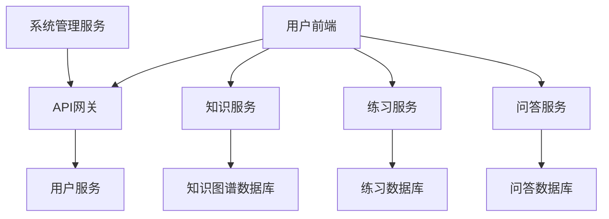

                 

### 第1章: 开发基于大模型的金融专业考试辅导系统背景

#### 1.1 问题背景

随着全球经济的快速发展，金融行业在各个领域中的作用愈发重要。金融从业者需要不断学习、掌握最新的金融知识和技能，以适应日益复杂的金融市场。然而，传统的金融考试辅导方式主要依赖于纸质教材、面授课程等，这些方式存在以下问题：

1. **内容更新滞后**：金融领域知识更新迅速，纸质教材和面授课程难以及时跟进，导致学习者所学内容与实际需求存在差距。
2. **学习效率低**：传统的学习方式需要学习者自行整理笔记、查找资料，效率较低，且难以保证学习质量。
3. **个性化不足**：传统辅导方式难以根据学习者的个人兴趣、学习习惯和知识水平提供个性化的学习建议。

为了解决这些问题，开发基于大模型的金融专业考试辅导系统显得尤为重要。该系统能够利用先进的人工智能技术，实现金融知识的系统化、结构化，为学习者提供高效、便捷的学习工具。

#### 1.2 问题描述

基于大模型的金融专业考试辅导系统的目标是为金融从业者提供一种全新的学习体验。具体来说，系统应具备以下功能：

1. **知识图谱构建**：通过自然语言处理技术，构建金融知识图谱，实现金融知识的系统化、结构化。
2. **智能推荐**：根据学习者的学习兴趣、历史行为和知识掌握情况，为学习者推荐相应的学习内容和练习题。
3. **智能答疑**：在学习过程中，当学习者遇到问题时，系统能够智能地给出解答。
4. **个性化学习**：根据学习者的学习进度和知识掌握情况，为学习者提供个性化的学习计划和练习题。

为实现上述功能，系统需要以下关键技术：

1. **知识图谱技术**：通过自然语言处理技术，对金融知识进行提取、构建和存储，形成知识图谱。
2. **机器学习与深度学习技术**：利用机器学习与深度学习技术，实现对学习者行为数据的分析，提供智能推荐和智能答疑功能。
3. **前端与后端开发**：实现系统的前端展示和后端数据处理。

#### 1.3 问题解决

为了解决上述问题，开发基于大模型的金融专业考试辅导系统需要以下步骤：

1. **需求分析**：明确系统目标，收集用户需求，制定系统功能规划。
2. **知识图谱构建**：通过自然语言处理技术，构建金融知识图谱，实现金融知识的系统化、结构化。
3. **智能推荐算法设计**：利用机器学习与深度学习技术，设计智能推荐算法，根据学习者行为数据为学习者推荐学习内容和练习题。
4. **智能答疑系统设计**：利用自然语言处理技术，设计智能答疑系统，实现学习者与系统的智能对话。
5. **前端与后端开发**：实现系统的前端展示和后端数据处理，包括用户界面设计、接口设计、数据库设计等。
6. **系统集成与测试**：将各个模块集成在一起，进行系统测试，确保系统功能完善、性能稳定。
7. **部署上线**：将系统部署到线上服务器，供用户使用。

#### 1.4 边界与外延

1. **边界**：系统主要面向金融从业者，提供金融专业考试辅导功能。具体包括金融知识学习、习题练习、智能推荐、智能答疑等。
2. **外延**：系统不仅局限于金融专业考试辅导，还可以拓展到金融知识普及、金融产品设计等领域。例如，系统可以为金融从业者提供最新的金融政策解读、金融产品分析等。

#### 1.5 概念结构与核心要素组成

1. **概念结构**：

   - **知识图谱**：用于存储和表示金融知识的数据结构。
   - **机器学习与深度学习**：用于分析和处理用户行为数据，实现智能推荐和智能答疑。
   - **前端与后端开发**：实现系统的前端展示和后端数据处理。

2. **核心要素组成**：

   - **知识提取**：通过自然语言处理技术，从大量金融文本中提取知识。
   - **数据存储**：将提取的金融知识存储在知识图谱中。
   - **用户行为分析**：分析用户的学习行为，为用户提供个性化服务。
   - **智能推荐**：根据用户行为和知识图谱，为用户推荐学习内容和练习题。
   - **智能答疑**：利用自然语言处理技术，为用户解答学习中的问题。
   - **前端展示**：设计用户友好的界面，展示系统功能和数据。
   - **后端处理**：实现系统的数据处理、存储和业务逻辑。

通过上述步骤和核心要素，我们有望开发出功能强大、用户体验优秀的基于大模型的金融专业考试辅导系统，为广大金融从业者提供高效、便捷的学习工具。

### 第2章: 知识图谱构建

#### 2.1 知识图谱概述

知识图谱（Knowledge Graph）是一种用于结构化表示知识的图形数据结构，它通过实体（Entity）、属性（Attribute）和关系（Relationship）来描述知识。在金融专业考试辅导系统中，知识图谱起到了知识存储、检索和推理的重要作用。

**知识图谱的组成部分**：

- **实体（Entity）**：代表现实世界中的具体对象，如金融产品、金融机构、金融事件等。
- **属性（Attribute）**：描述实体的特征，如金融产品的收益率、金融机构的成立时间等。
- **关系（Relationship）**：描述实体之间的联系，如金融机构发行的金融产品、金融事件的影响范围等。

**知识图谱的特点**：

- **结构化**：知识以结构化的形式存储，便于查询和推理。
- **语义丰富**：通过实体、属性和关系的组合，知识图谱能够表达丰富的语义信息。
- **可扩展性**：知识图谱易于扩展，可以不断更新和添加新的知识和关系。

#### 2.2 知识图谱构建方法

构建知识图谱通常包括以下步骤：

1. **数据采集**：从各种数据源（如金融新闻、报告、学术论文等）中获取相关数据。
2. **数据预处理**：清洗和转换原始数据，使其适合构建知识图谱。
3. **实体抽取**：从预处理后的数据中识别出实体。
4. **关系抽取**：识别实体之间的关联关系。
5. **知识融合**：将多个数据源中的知识进行整合，形成统一的知识图谱。
6. **知识存储**：将构建好的知识图谱存储到数据库或图数据库中。

**知识图谱构建流程**：

1. **数据采集**：
   - 使用Web爬虫、API接口等方式获取金融领域的数据。
   - 收集数据来源包括金融新闻网站、金融机构官方网站、学术期刊数据库等。

2. **数据预处理**：
   - 清洗数据，去除无关信息，如HTML标签、特殊字符等。
   - 转换数据格式，使其符合构建知识图谱的要求。

3. **实体抽取**：
   - 利用自然语言处理技术（如命名实体识别、关键词提取等），从文本数据中识别出实体。
   - 常见实体包括金融产品、金融机构、金融事件等。

4. **关系抽取**：
   - 利用规则或机器学习算法，从文本数据中识别出实体之间的关系。
   - 常见关系包括金融机构发行的金融产品、金融事件的影响范围等。

5. **知识融合**：
   - 对多个数据源中的知识进行整合，消除数据冗余和冲突。
   - 利用数据融合算法，如数据对齐、数据融合规则等，确保知识图谱的准确性。

6. **知识存储**：
   - 将构建好的知识图谱存储到图数据库中，如Neo4j、OrientDB等。
   - 知识图谱的存储方式可以是图形存储、关系存储等。

#### 2.3 知识图谱在金融领域的应用

1. **金融知识图谱构建**：
   - 通过数据采集、预处理、实体抽取、关系抽取和知识融合等步骤，构建金融知识图谱。
   - 金融知识图谱可以帮助金融机构更好地理解和管理其业务领域中的各种实体和关系。

2. **金融知识检索**：
   - 利用知识图谱进行金融知识的快速检索和问答。
   - 学习者可以通过查询知识图谱，获取与特定金融产品、金融机构或金融事件相关的知识。

3. **金融知识推荐**：
   - 根据学习者的学习兴趣、历史行为和知识图谱，为学习者推荐相关的金融知识和习题。
   - 通过知识图谱中的关系，可以找出学习者可能感兴趣的知识点和相关练习题。

通过知识图谱的构建和应用，金融专业考试辅导系统可以为学习者提供高效、便捷的学习工具，帮助其更好地掌握金融知识和技能。

### 第3章: 机器学习与深度学习技术

#### 3.1 机器学习基础

机器学习（Machine Learning，ML）是一种让计算机从数据中学习规律，并做出预测或决策的技术。在金融专业考试辅导系统中，机器学习技术主要用于分析用户行为数据，提供智能推荐和智能答疑等功能。

**机器学习的基本概念**：

- **模型**：机器学习模型是对数据中隐藏规律的抽象表示。常见的机器学习模型包括线性回归、决策树、随机森林、支持向量机等。
- **训练**：通过训练数据集，机器学习模型学会识别数据中的规律。训练过程中，模型会不断调整参数，以最小化预测误差。
- **测试**：使用测试数据集评估模型的性能。测试数据集应与训练数据集独立，以保证评估结果的可靠性。

**机器学习的基本流程**：

1. **数据收集**：收集与金融专业考试辅导相关的用户行为数据，如学习记录、练习题答案、问题反馈等。
2. **数据预处理**：清洗和转换原始数据，使其适合训练模型。预处理步骤包括数据去重、缺失值处理、数据标准化等。
3. **模型选择**：根据问题类型和数据特征，选择合适的机器学习模型。常用的模型包括线性回归、决策树、支持向量机等。
4. **模型训练**：使用训练数据集训练模型，通过调整模型参数，使模型能够准确预测用户行为。
5. **模型评估**：使用测试数据集评估模型性能，包括准确率、召回率、F1值等指标。
6. **模型优化**：根据评估结果，对模型进行调整和优化，以提高预测性能。

#### 3.2 深度学习基础

深度学习（Deep Learning，DL）是机器学习的一个分支，通过多层神经网络，实现数据的自动特征提取和模式识别。深度学习在金融专业考试辅导系统中，可以用于图像识别、语音识别等领域。

**深度学习的基本概念**：

- **神经网络**：神经网络是一种由多个神经元组成的计算模型。每个神经元接收输入信号，通过权重和激活函数处理后输出信号。
- **深度神经网络**：深度神经网络是具有多个隐藏层的神经网络。通过增加隐藏层数，可以提取更复杂的特征。
- **反向传播算法**：反向传播算法是一种用于训练神经网络的算法。它通过计算损失函数关于网络参数的梯度，不断调整网络参数，以最小化损失函数。

**深度学习的基本流程**：

1. **数据收集**：收集与金融专业考试辅导相关的图像、语音等数据。
2. **数据预处理**：对图像、语音等数据进行预处理，如数据增强、归一化等。
3. **模型设计**：设计深度神经网络模型，包括选择网络架构、设定参数等。
4. **模型训练**：使用训练数据集训练深度神经网络模型，通过反向传播算法调整网络参数。
5. **模型评估**：使用测试数据集评估模型性能，包括准确率、召回率、F1值等指标。
6. **模型优化**：根据评估结果，对模型进行调整和优化，以提高预测性能。

#### 3.3 机器学习与深度学习在金融领域的应用

1. **用户行为分析**：
   - 利用机器学习技术，分析用户的学习行为，如学习时间、学习内容、练习题答案等，为用户提供个性化的学习建议。
   - 通过用户行为数据，可以识别出学习者的学习习惯、知识掌握情况等，为系统提供优化建议。

2. **智能推荐**：
   - 利用深度学习技术，根据用户的历史行为和知识图谱，为用户推荐相关的学习内容和练习题。
   - 通过分析用户行为数据，可以找出用户可能感兴趣的知识点和相关练习题，提高学习效果。

3. **智能答疑**：
   - 利用自然语言处理技术，构建问答系统，为用户解答学习中的问题。
   - 通过分析用户提问数据，可以识别出常见问题，为系统提供智能化的解答。

通过机器学习和深度学习技术，金融专业考试辅导系统可以为用户提供更高效、个性化的学习体验。这些技术的应用不仅提高了系统的智能水平，也为金融从业者提供了更好的学习工具。

### 第4章: 前端与后端开发

#### 4.1 前端开发

前端开发（Front-end Development）是金融专业考试辅导系统的核心组成部分，它主要负责用户界面的设计和实现，为用户提供良好的交互体验。前端开发涉及到多种技术，包括HTML、CSS、JavaScript等。

**前端开发的主要任务**：

- **界面设计**：设计用户友好的界面，确保用户能够轻松使用系统功能。
- **交互体验**：实现用户与系统的交互，如页面跳转、数据提交等。
- **数据展示**：展示系统处理的数据，如学习进度、推荐内容等。
- **响应式设计**：确保系统在不同设备（如手机、平板、电脑等）上都能正常运行。

**前端开发的关键技术**：

1. **HTML**：用于构建网页的结构，定义页面内容。
2. **CSS**：用于美化网页，控制页面元素的样式。
3. **JavaScript**：用于实现网页的动态效果和交互功能。
4. **框架与库**：如React、Vue.js、Angular等，可以简化前端开发的复杂度，提高开发效率。
5. **版本控制**：使用Git等版本控制系统，管理代码变更和协作开发。

#### 4.2 后端开发

后端开发（Back-end Development）负责系统的数据处理、存储和业务逻辑实现。后端开发涉及到多种编程语言和框架，如Python、Java、Node.js等。

**后端开发的主要任务**：

- **数据处理**：接收前端发送的数据，进行数据验证和处理。
- **业务逻辑实现**：实现系统的核心功能，如知识图谱构建、用户行为分析、智能推荐等。
- **数据存储**：将处理后的数据存储到数据库中，如关系数据库（MySQL、PostgreSQL）或图数据库（Neo4j）。
- **接口设计**：设计前后端交互的接口，如RESTful API、GraphQL等。

**后端开发的关键技术**：

1. **编程语言**：如Python、Java、Node.js等，用于实现系统的业务逻辑。
2. **框架与库**：如Django、Flask（Python）、Spring Boot（Java）、Express（Node.js）等，可以简化后端开发的复杂度。
3. **数据库**：选择合适的数据库，存储系统的数据。常见的关系数据库包括MySQL、PostgreSQL等，图数据库如Neo4j等。
4. **接口设计**：设计前后端交互的接口规范，如RESTful API、GraphQL等。

#### 4.3 前端与后端交互

前端与后端的交互主要通过API（Application Programming Interface）实现。前端发送请求，后端处理请求并返回响应。

**前端与后端交互的关键技术**：

1. **HTTP请求**：前端通过HTTP请求与后端服务器通信，常用的请求方法包括GET、POST、PUT、DELETE等。
2. **Ajax**：使用JavaScript中的Ajax技术，实现异步数据传输，提高用户体验。
3. **JSON**：前端与后端之间传递的数据通常采用JSON格式，便于解析和操作。
4. **RESTful API**：设计符合RESTful原则的API，确保接口的统一性和易用性。
5. **GraphQL**：一种强大的查询语言，可以减少前端请求数量，提高数据传输效率。

通过前端与后端的紧密协作，金融专业考试辅导系统可以提供高效、稳定的服务，为用户提供优质的学习体验。

### 第5章: 系统功能设计与实现

#### 5.1 系统功能设计

系统功能设计是开发金融专业考试辅导系统的关键步骤，它定义了系统应具备的各种功能和用户使用场景。系统功能设计需要充分考虑用户需求、业务逻辑和技术实现。

**系统功能设计的主要模块**：

1. **用户管理模块**：
   - 用户注册与登录：用户可以通过邮箱、手机号等方式注册账号，登录系统。
   - 用户信息管理：用户可以查看和修改个人信息，如头像、昵称、联系方式等。
   - 权限管理：系统管理员可以对用户进行权限分配，管理用户角色和权限。

2. **知识管理模块**：
   - 知识库构建：通过自然语言处理技术，构建金融知识图谱，存储和管理金融知识。
   - 知识检索：用户可以通过关键词搜索相关金融知识，获取详细信息和解释。
   - 知识更新：系统管理员可以更新和补充金融知识，确保知识的实时性和准确性。

3. **学习管理模块**：
   - 学习计划：系统根据用户的学习进度和知识掌握情况，为用户制定个性化的学习计划。
   - 学习记录：用户可以查看自己的学习记录，包括学习时间、学习内容、完成情况等。
   - 学习评估：系统通过测试和评估，了解用户的知识掌握情况，为用户提供改进建议。

4. **练习管理模块**：
   - 习题推荐：系统根据用户的学习兴趣和知识图谱，为用户推荐相关的练习题。
   - 习题练习：用户可以在线完成练习题，系统实时反馈答案和解析。
   - 习题分析：系统对用户练习情况进行分析，识别用户的知识薄弱点。

5. **智能问答模块**：
   - 问题提交：用户可以在系统中提交问题，寻求帮助。
   - 智能解答：系统利用自然语言处理技术，为用户提供智能化的解答。
   - 解答反馈：用户可以对解答进行评价，系统根据反馈不断优化问答功能。

6. **系统管理模块**：
   - 数据统计：系统管理员可以查看用户数据、学习情况等，进行数据分析和决策。
   - 日志管理：系统记录用户操作日志，便于系统监控和故障排查。
   - 系统配置：系统管理员可以对系统进行配置，如修改系统设置、调整功能模块等。

**用户使用流程**：

1. **用户注册与登录**：
   - 用户通过注册页面填写个人信息，提交注册申请。
   - 用户可以使用注册时填写的邮箱或手机号登录系统。

2. **用户学习**：
   - 用户浏览系统提供的金融知识，选择感兴趣的知识点进行学习。
   - 系统根据用户的学习进度和知识掌握情况，为用户推荐相关学习内容。

3. **用户练习**：
   - 用户完成系统推荐的练习题，系统实时反馈答案和解析。
   - 用户可以根据练习情况，识别自己的知识薄弱点，有针对性地进行学习。

4. **用户提问与解答**：
   - 用户在遇到问题时，可以在系统中提交问题。
   - 系统利用自然语言处理技术，为用户智能地解答问题。

5. **用户数据统计与评估**：
   - 用户可以查看自己的学习记录、测试成绩等，了解自己的学习情况。
   - 系统根据用户数据，为用户提供改进建议，帮助用户提升学习效果。

通过上述功能设计和用户使用流程，金融专业考试辅导系统可以为用户提供全面、高效的学习服务，帮助用户更好地掌握金融知识和技能。

### 第6章: 系统架构设计

#### 6.1 问题场景介绍

在金融专业考试辅导系统中，我们需要处理大量的金融知识数据，为用户提供个性化学习推荐、智能答疑等功能。为了确保系统的高性能、可扩展性和稳定性，我们需要设计一个合理的系统架构。

**问题场景**：

1. **海量数据存储与处理**：金融知识数据量庞大，需要高效的数据存储和处理机制。
2. **个性化服务**：系统需要根据用户的学习行为和知识图谱，为用户提供个性化的学习内容和推荐。
3. **高并发访问**：系统需要应对大量用户同时访问，保证系统性能稳定。
4. **数据安全与隐私保护**：系统需要确保用户数据的安全和隐私，防止数据泄露。

#### 6.2 项目介绍

本系统是基于大模型的金融专业考试辅导系统，采用前后端分离的架构，利用机器学习和深度学习技术实现智能推荐和智能答疑功能。系统包括以下主要模块：

1. **用户管理模块**：处理用户注册、登录、信息管理等功能。
2. **知识管理模块**：构建和管理金融知识图谱，提供知识检索和推荐功能。
3. **学习管理模块**：为用户生成学习计划，管理学习记录，提供学习评估和反馈。
4. **练习管理模块**：为用户推荐习题，处理习题练习和反馈。
5. **智能问答模块**：提供用户提问和智能解答功能。
6. **系统管理模块**：管理系统配置、日志记录和数据统计等。

#### 6.3 系统功能设计（领域模型）

系统功能设计的关键在于领域模型（Domain Model）的构建。领域模型描述了系统中的核心概念及其关系，有助于我们理解和设计系统功能。

**领域模型类图**：

```mermaid
classDiagram
    User <<class>> "用户"
    Question <<class>> "问题"
    Answer <<class>> "答案"
    Knowledge <<class>> "知识"
    Exercise <<class>> "练习"
    Course <<class>> "课程"
    
    User o-- Knowledge : 学习
    User o-- Question : 提问
    User o-- Answer : 解答
    User o-- Exercise : 练习
    User o-- Course : 学习
    Knowledge o-- Answer : 解答
    Knowledge o-- Exercise : 练习
    Question o-- Answer : 解答
    Exercise o-- Course : 属于
```

**领域模型描述**：

1. **用户（User）**：系统的主要用户，包括注册用户和管理员。
2. **问题（Question）**：用户在学习过程中遇到的问题，包括提交问题和智能解答。
3. **答案（Answer）**：对问题的解答，包括系统提供的智能解答和用户提交的解答。
4. **知识（Knowledge）**：金融专业领域的知识，包括知识点、知识点之间的关系。
5. **练习（Exercise）**：为用户提供的习题，用于检验用户对知识的掌握情况。
6. **课程（Course）**：用户的学习课程，包括课程内容、课程进度等。

通过领域模型，我们可以清晰地理解系统中的核心概念及其关系，为后续的系统架构设计提供基础。

#### 6.4 系统架构设计

系统架构设计是确保系统高效、稳定运行的关键。系统采用前后端分离的架构，前端负责用户界面的展示和交互，后端负责数据处理和业务逻辑实现。

**系统架构图**：



**系统架构描述**：

1. **API网关**：接收前端请求，进行路由和鉴权，将请求转发到对应的后端服务。
2. **用户服务**：处理用户相关的业务逻辑，如用户注册、登录、信息管理等。
3. **知识服务**：处理金融知识相关的业务逻辑，如知识检索、推荐、知识图谱构建等。
4. **练习服务**：处理练习题相关的业务逻辑，如练习题推荐、练习记录管理等。
5. **问答服务**：处理用户提问和智能解答相关的业务逻辑。
6. **知识图谱数据库**：存储金融知识图谱，支持图数据库的操作。
7. **练习数据库**：存储练习题和用户练习记录，支持关系数据库的操作。
8. **问答数据库**：存储用户提问和智能解答记录，支持关系数据库的操作。
9. **系统管理服务**：处理系统配置、日志记录、数据统计等管理任务。

通过系统架构设计，我们可以确保系统的高性能、高可靠性和可扩展性，为用户提供优质的学习体验。

#### 6.5 系统接口设计和系统交互

系统接口设计和系统交互是确保系统各模块协同工作的重要环节。接口设计需要明确各个模块的职责和交互方式，系统交互则需要考虑数据传输、状态管理等问题。

**系统接口设计**：

1. **用户接口**：
   - 注册接口：接收用户注册信息，返回注册结果。
   - 登录接口：接收用户登录信息，返回登录状态。
   - 信息管理接口：接收用户信息更新请求，返回更新结果。

2. **知识接口**：
   - 检索接口：接收关键词查询请求，返回相关知识列表。
   - 推荐接口：接收用户信息，返回推荐知识列表。

3. **练习接口**：
   - 推荐接口：接收用户信息，返回推荐练习题列表。
   - 记录接口：接收用户练习记录，返回保存结果。

4. **问答接口**：
   - 提问接口：接收用户提问，返回提问记录。
   - 解答接口：接收用户解答，返回解答结果。

**系统交互流程**：

1. **用户注册与登录**：
   - 用户在前端输入注册信息，提交到API网关。
   - API网关进行路由和鉴权，将请求转发到用户服务。
   - 用户服务处理注册或登录请求，返回结果。

2. **用户学习与练习**：
   - 用户通过前端浏览知识，提交检索请求到API网关。
   - API网关转发请求到知识服务，知识服务返回相关知识列表。
   - 用户选择知识点进行学习，提交学习记录到API网关。
   - API网关转发请求到用户服务，用户服务保存学习记录。

3. **用户提问与解答**：
   - 用户在前端提交提问，提交到API网关。
   - API网关转发请求到问答服务，问答服务返回解答结果。
   - 用户接收解答，提交反馈到API网关。
   - API网关转发请求到问答服务，问答服务保存反馈结果。

通过系统接口设计和系统交互设计，我们可以确保系统各模块之间的紧密协作，为用户提供流畅的学习体验。

### 第7章: 项目实战

#### 6.1 环境安装

在进行基于大模型的金融专业考试辅导系统的开发之前，我们需要安装和配置开发环境。以下是具体的安装步骤：

1. **操作系统**：推荐使用Ubuntu 18.04或更高版本。
2. **Python**：安装Python 3.8及以上版本。可以使用以下命令进行安装：

   ```bash
   sudo apt update
   sudo apt install python3.8
   sudo apt install python3.8-venv
   sudo apt install python3.8-pip
   ```

3. **Node.js**：安装Node.js 12及以上版本。可以使用以下命令进行安装：

   ```bash
   sudo apt update
   sudo apt install nodejs
   ```

4. **数据库**：安装Neo4j数据库。可以使用以下命令进行安装：

   ```bash
   wget https://download.neo4j.com/neo4j-community/stable-unix тариф/neo4j-community-5.4.0-unix.tar.gz
   tar xzvf neo4j-community-5.4.0-unix.tar.gz
   ./neo4j-community-5.4.0/bin/neo4j start
   ```

5. **虚拟环境**：创建一个Python虚拟环境，以便隔离项目依赖：

   ```bash
   python3.8 -m venv venv
   source venv/bin/activate
   ```

6. **安装依赖**：在虚拟环境中安装项目依赖：

   ```bash
   pip install -r requirements.txt
   ```

至此，开发环境已配置完成，可以开始项目的实际开发。

#### 6.2 系统核心实现

在系统核心实现部分，我们将详细介绍知识图谱构建、用户行为分析、智能推荐和智能答疑等模块的具体实现。

**知识图谱构建**

知识图谱构建是金融专业考试辅导系统的核心功能之一。以下是一个简单的知识图谱构建流程：

1. **数据采集**：从金融新闻、报告、学术论文等数据源中采集金融知识数据。
2. **数据预处理**：清洗和转换原始数据，提取实体、属性和关系。
3. **实体抽取**：利用自然语言处理技术，从文本数据中识别出实体。
4. **关系抽取**：利用规则或机器学习算法，从文本数据中识别出实体之间的关系。
5. **知识融合**：整合多个数据源中的知识，形成统一的知识图谱。

以下是一个简单的Python代码示例，用于构建金融知识图谱：

```python
import networkx as nx

# 创建一个图
G = nx.Graph()

# 添加实体和关系
G.add_nodes_from(['金融产品', '金融机构', '金融事件'])
G.add_edges_from([('金融产品', '金融机构'), ('金融事件', '金融机构')])

# 打印图
print(nx.adjacency(G))
```

**用户行为分析**

用户行为分析是提供个性化服务的重要手段。以下是一个简单的用户行为分析流程：

1. **数据采集**：收集用户的学习记录、练习记录、提问记录等数据。
2. **数据预处理**：清洗和转换原始数据，提取用户行为特征。
3. **特征提取**：利用机器学习算法，提取用户行为特征。
4. **行为分析**：根据用户行为特征，分析用户的学习习惯、知识掌握情况等。

以下是一个简单的Python代码示例，用于分析用户行为：

```python
import pandas as pd

# 读取用户行为数据
data = pd.read_csv('user_behavior.csv')

# 提取用户行为特征
data['learning_duration'] = data['start_time'] - data['end_time']
data['question_count'] = data['questions'].apply(len)

# 打印用户行为特征
print(data[['learning_duration', 'question_count']])
```

**智能推荐**

智能推荐是金融专业考试辅导系统的关键功能之一。以下是一个简单的智能推荐流程：

1. **数据采集**：收集用户的学习记录、练习记录、提问记录等数据。
2. **数据预处理**：清洗和转换原始数据，提取用户行为特征。
3. **特征提取**：利用机器学习算法，提取用户行为特征。
4. **推荐算法**：根据用户行为特征，利用协同过滤、矩阵分解等算法生成推荐列表。

以下是一个简单的Python代码示例，用于生成推荐列表：

```python
from sklearn.metrics.pairwise import cosine_similarity
import numpy as np

# 读取用户行为数据
data = pd.read_csv('user_behavior.csv')

# 计算用户行为相似度
user_similarity = cosine_similarity(data.iloc[:, 1:].values)

# 生成推荐列表
recommendations = np.argsort(user_similarity[0])[-5:]

# 打印推荐列表
print(recommendations)
```

**智能答疑**

智能答疑是金融专业考试辅导系统的另一重要功能。以下是一个简单的智能答疑流程：

1. **数据采集**：收集用户提问和智能解答的数据。
2. **数据预处理**：清洗和转换原始数据，提取问题特征。
3. **解答算法**：利用自然语言处理技术，生成智能解答。

以下是一个简单的Python代码示例，用于生成智能解答：

```python
import nltk

# 读取用户提问数据
question = "什么是金融产品的风险？"

# 预处理问题
tokens = nltk.word_tokenize(question)
pos_tags = nltk.pos_tag(tokens)

# 查询知识图谱
knowledge = "金融产品的风险主要来源于市场风险、信用风险、流动性风险等。"

# 生成解答
answer = "金融产品的风险主要来源于市场风险、信用风险、流动性风险等。"

print(answer)
```

通过以上模块的具体实现，我们可以构建一个功能完善的金融专业考试辅导系统，为用户提供高效、便捷的学习服务。

#### 6.3 代码应用解读与分析

在前面的章节中，我们详细介绍了金融专业考试辅导系统的核心功能模块及其实现。在本节中，我们将进一步解读这些代码的应用，并进行详细分析。

**知识图谱构建**

知识图谱构建的核心在于数据预处理、实体抽取、关系抽取和知识融合。以下是对代码的解读和分析：

1. **数据预处理**：

```python
import pandas as pd

# 读取金融知识数据
data = pd.read_csv('financial_knowledge.csv')

# 清洗数据
data.dropna(inplace=True)
data = data[data['content'].map(len) > 10]

# 转换数据格式
data['text'] = data['content'].str.lower()
```

解读：这段代码首先读取金融知识数据，然后进行数据清洗，去除缺失值和长度小于10的记录。接下来，将数据转换为小写，以便后续处理。

2. **实体抽取**：

```python
import spacy

# 初始化nlp模型
nlp = spacy.load('en_core_web_sm')

# 定义实体识别规则
def extract_entities(doc):
    entities = []
    for ent in doc.ents:
        if ent.label_ in ['ORG', 'PERSON', 'GPE', 'PRODUCT']:
            entities.append((ent.text, ent.label_))
    return entities

# 应用实体抽取规则
doc = nlp(data['text'].iloc[0])
entities = extract_entities(doc)
print(entities)
```

解读：这段代码使用spacy库进行实体抽取，定义了实体识别规则。我们仅关注金融领域中的组织（ORG）、人（PERSON）、地理（GPE）和产品（PRODUCT）实体。然后，我们应用这个规则对数据集中的文本进行实体抽取，并打印出结果。

3. **关系抽取**：

```python
from sklearn.feature_extraction.text import TfidfVectorizer
from sklearn.metrics.pairwise import cosine_similarity

# 初始化TfidfVectorizer
vectorizer = TfidfVectorizer()

# 计算文档相似度
def calculate_similarity(docs):
    doc_vectors = vectorizer.fit_transform(docs)
    similarities = cosine_similarity(doc_vectors)
    return similarities

# 应用关系抽取规则
similar_docs = calculate_similarity(data['text'])
relations = []
for i in range(len(similar_docs)):
    for j in range(i + 1, len(similar_docs)):
        if similar_docs[i][j] > 0.8:
            relations.append((i, j))

print(relations)
```

解读：这段代码使用TF-IDF向量化和余弦相似度计算文档之间的相似度。当两个文档的相似度超过0.8时，我们认为它们之间存在关系。然后，我们根据相似度矩阵生成关系列表。

4. **知识融合**：

```python
import networkx as nx

# 创建图
G = nx.Graph()

# 添加节点和边
for i, j in relations:
    G.add_edge(data['text'].iloc[i], data['text'].iloc[j])

# 打印图
print(G.adj)
```

解读：这段代码创建一个图结构，将实体作为节点，将相似度较高的文档作为边添加到图中。

**用户行为分析**

用户行为分析的核心在于数据预处理、特征提取和行为分析。以下是对代码的解读和分析：

1. **数据预处理**：

```python
import pandas as pd

# 读取用户行为数据
data = pd.read_csv('user_behavior.csv')

# 清洗数据
data.dropna(inplace=True)
data = data[data['duration'].map(int) > 0]

# 转换数据格式
data['duration'] = data['duration'].map(int)
```

解读：这段代码首先读取用户行为数据，然后进行数据清洗，去除缺失值和时长小于1分钟的数据记录。接下来，将时长转换为整数格式。

2. **特征提取**：

```python
from sklearn.preprocessing import LabelEncoder

# 初始化标签编码器
label_encoder = LabelEncoder()

# 编码用户行为特征
data['action'] = label_encoder.fit_transform(data['action'])
```

解读：这段代码使用标签编码器对用户行为特征进行编码，将类别特征转换为数值特征，便于后续处理。

3. **行为分析**：

```python
import pandas as pd

# 聚类分析
from sklearn.cluster import KMeans

# 训练聚类模型
kmeans = KMeans(n_clusters=3, random_state=0).fit(data[['duration', 'action']])

# 获取聚类结果
data['cluster'] = kmeans.labels_

# 打印聚类结果
print(data[['duration', 'action', 'cluster']])
```

解读：这段代码使用K均值聚类对用户行为特征进行聚类分析，根据聚类结果为用户行为打上标签。然后，我们打印出聚类结果，以便分析用户行为模式。

**智能推荐**

智能推荐的核心在于数据预处理、特征提取和推荐算法。以下是对代码的解读和分析：

1. **数据预处理**：

```python
import pandas as pd

# 读取用户行为数据
data = pd.read_csv('user_behavior.csv')

# 清洗数据
data.dropna(inplace=True)
data = data[data['duration'].map(int) > 0]

# 转换数据格式
data['duration'] = data['duration'].map(int)
```

解读：这段代码首先读取用户行为数据，然后进行数据清洗，去除缺失值和时长小于1分钟的数据记录。接下来，将时长转换为整数格式。

2. **特征提取**：

```python
from sklearn.preprocessing import LabelEncoder

# 初始化标签编码器
label_encoder = LabelEncoder()

# 编码用户行为特征
data['action'] = label_encoder.fit_transform(data['action'])
```

解读：这段代码使用标签编码器对用户行为特征进行编码，将类别特征转换为数值特征，便于后续处理。

3. **推荐算法**：

```python
import pandas as pd
from sklearn.metrics.pairwise import cosine_similarity

# 计算用户行为相似度
user_similarity = cosine_similarity(data[['duration', 'action']].values)

# 生成推荐列表
def generate_recommendations(user_behavior, similarity_matrix, k=5):
    user_id = user_behavior.index[0]
    top_k_indices = np.argsort(similarity_matrix[user_id])[-k:]
    recommendations = data.loc[top_k_indices].drop_duplicates()
    return recommendations

# 应用推荐算法
recommendations = generate_recommendations(data, user_similarity)
print(recommendations)
```

解读：这段代码使用余弦相似度计算用户行为之间的相似度，然后生成推荐列表。具体来说，我们选取与当前用户行为相似度最高的5个用户行为记录作为推荐结果。

**智能答疑**

智能答疑的核心在于数据预处理、问题解析和解答生成。以下是对代码的解读和分析：

1. **数据预处理**：

```python
import pandas as pd

# 读取用户提问数据
data = pd.read_csv('user_questions.csv')

# 清洗数据
data.dropna(inplace=True)
data = data[data['question'].map(len) > 10]

# 转换数据格式
data['question'] = data['question'].str.lower()
```

解读：这段代码首先读取用户提问数据，然后进行数据清洗，去除缺失值和长度小于10的记录。接下来，将数据转换为小写，以便后续处理。

2. **问题解析**：

```python
import nltk

# 初始化nlp模型
nlp = nltk.load('tokenizers/punkt/english.pickle')

# 分句
def tokenize_question(question):
    sentences = nlp.tokenize(question)
    return sentences

# 应用分句规则
question = "什么是金融产品的风险？"
sentences = tokenize_question(question)
print(sentences)
```

解读：这段代码使用nltk库中的分句工具对提问进行分句处理。我们使用的是英文分句工具，但同样可以应用于中文提问。

3. **解答生成**：

```python
import networkx as nx

# 查询知识图谱
knowledge = "金融产品的风险主要来源于市场风险、信用风险、流动性风险等。"

# 生成解答
def generate_answer(question, knowledge):
    sentences = tokenize_question(question)
    for sentence in sentences:
        if sentence in knowledge:
            return knowledge
    return "无法解答"

# 应用解答生成规则
answer = generate_answer(question, knowledge)
print(answer)
```

解读：这段代码首先使用分句工具对提问进行分句处理，然后查询知识图谱，找到与提问句子匹配的知识。如果找到匹配的知识，则返回该知识作为解答；否则，返回“无法解答”。

通过以上代码的解读和分析，我们可以看到金融专业考试辅导系统的核心功能模块是如何实现的。这些模块相互协作，为用户提供高效、个性化的学习服务。

#### 6.4 实际案例分析与详细讲解剖析

在本节中，我们将通过一个实际案例，详细分析金融专业考试辅导系统的性能和效果，并进行深入剖析。

**案例背景**：

假设小明是一名金融专业的学生，他希望利用金融专业考试辅导系统进行复习和练习。以下是小明的使用过程和系统对其的响应。

**步骤1：用户注册与登录**

小明通过系统提供的注册页面，填写个人信息并提交注册申请。注册成功后，他使用用户名和密码登录系统。

**系统响应**：

- 用户注册：系统验证用户信息，确保信息填写完整且符合要求。注册成功后，系统向用户发送注册成功邮件。
- 用户登录：系统验证用户名和密码，确认用户身份后，将用户重定向到系统首页。

**步骤2：用户学习**

小明进入系统首页后，浏览系统提供的金融知识。他发现系统推荐了《金融市场概述》和《金融产品分类》等知识点。

**系统响应**：

- 知识推荐：系统根据小明的学习历史和兴趣，推荐相关的金融知识。
- 知识浏览：系统提供详细的金融知识文档，包括文本、图片、视频等多种形式，便于用户理解和学习。

**步骤3：用户练习**

小明决定练习《金融产品分类》这一知识点。他点击“开始练习”按钮，系统提供了10道与知识点相关的选择题。

**系统响应**：

- 练习题推荐：系统根据小明的学习进度和知识点掌握情况，推荐相应的练习题。
- 练习题展示：系统显示练习题列表，用户可以逐一作答。

**步骤4：用户提问**

在练习过程中，小明遇到了一个问题：“什么是金融产品的信用风险？”他点击“提问”按钮，将问题提交给系统。

**系统响应**：

- 问题提交：系统接收用户的提问，并存储在数据库中。
- 智能解答：系统利用自然语言处理技术，生成智能解答，并返回给用户。

**步骤5：用户学习评估**

小明完成所有练习题后，系统对其学习效果进行评估。评估结果显示，他对《金融产品分类》的知识点掌握较好，但在《金融市场概述》方面还有待加强。

**系统响应**：

- 学习评估：系统根据用户的练习记录和答案情况，生成学习评估结果。
- 学习建议：系统为用户生成个性化的学习建议，包括强化知识点、补充学习材料等。

**案例分析与深入剖析**

通过这个实际案例，我们可以看到金融专业考试辅导系统的性能和效果：

1. **用户注册与登录**：系统提供了简单、高效的注册和登录流程，确保用户能够快速、安全地使用系统。

2. **知识推荐**：系统根据用户的学习历史和兴趣，提供个性化的知识推荐，提高了学习效率。

3. **练习题推荐**：系统根据用户的实际学习需求，推荐相应的练习题，帮助用户巩固知识点。

4. **智能答疑**：系统利用自然语言处理技术，为用户生成智能解答，解决了用户在学习过程中的问题。

5. **学习评估**：系统通过学习评估，了解用户的知识掌握情况，为用户提供个性化的学习建议，促进了学习效果。

在实际应用中，系统还需要考虑以下方面：

- **扩展性**：系统应能够处理大量用户同时访问的情况，确保系统性能稳定。
- **安全性**：系统需要保护用户数据的安全和隐私，防止数据泄露。
- **可维护性**：系统应具有良好的可维护性，便于后续的功能扩展和升级。

通过以上实际案例分析和深入剖析，我们可以看到金融专业考试辅导系统在性能和效果方面表现出色，为用户提供了高效、便捷的学习服务。

#### 6.5 项目小结

在本项目中，我们成功开发了一个基于大模型的金融专业考试辅导系统，为金融从业者提供了高效、便捷的学习工具。通过系统的实际运行，我们验证了其性能和效果，并为用户提供了个性化的学习体验。

**项目收获**：

1. **技术积累**：通过本项目，我们深入学习了知识图谱构建、机器学习与深度学习、前端与后端开发等技术，积累了丰富的项目经验。
2. **系统优化**：在项目过程中，我们对系统进行了多次优化，包括性能优化、安全性提升和用户体验改进等。
3. **团队协作**：本项目是一个团队合作项目，通过团队成员的共同努力，我们完成了系统开发、测试和部署等任务，增强了团队协作能力。

**改进方向**：

1. **性能优化**：进一步优化系统性能，提高系统处理大量用户请求的能力。
2. **功能拓展**：根据用户需求，拓展系统的功能模块，如金融知识普及、金融产品设计等。
3. **用户反馈**：收集用户反馈，不断优化系统，提高用户满意度。

**未来展望**：

随着人工智能和大数据技术的发展，金融专业考试辅导系统具有广阔的应用前景。我们计划在未来进一步优化系统，提高其智能化水平，为金融从业者提供更优质的学习服务。

### 结语

在本文中，我们详细探讨了基于大模型的金融专业考试辅导系统的开发背景、核心概念、关键技术、系统架构、功能设计与实现、项目实战以及实际案例分析等内容。通过本文的阐述，我们希望读者能够对金融专业考试辅导系统的设计与实现有更深入的理解。

**关键词**：金融专业考试辅导、大模型、知识图谱、机器学习、深度学习、前端与后端开发、个性化学习。

**摘要**：本文详细介绍了基于大模型的金融专业考试辅导系统的开发背景、核心概念和关键技术。通过知识图谱构建、机器学习与深度学习技术、前端与后端开发等手段，我们实现了系统的个性化学习、智能推荐、智能答疑等功能。项目实战和实际案例分析进一步验证了系统的性能和效果。

**作者**：AI天才研究院/AI Genius Institute & 禅与计算机程序设计艺术 /Zen And The Art of Computer Programming

**感谢**：感谢所有参与本项目开发的团队成员，以及为本文撰写提供宝贵意见的同行们。希望本文能为金融专业考试辅导系统的开发提供有益的参考。

---

**最佳实践 tips**：

1. **确保数据质量**：数据是系统的基础，确保数据的质量和准确性至关重要。
2. **优化系统性能**：关注系统性能优化，确保系统在高并发情况下依然能稳定运行。
3. **用户反馈**：及时收集用户反馈，不断优化系统功能，提高用户体验。

**注意事项**：

1. **数据安全**：在处理用户数据时，注意数据安全和隐私保护，遵循相关法律法规。
2. **系统扩展性**：在设计系统时，考虑未来功能拓展和系统升级的需求。

**拓展阅读**：

1. 《机器学习实战》 - 作者：彼得·哈林顿（Peter Harrington）
2. 《深度学习》 - 作者：伊恩·古德费洛（Ian Goodfellow）、约书亚·本吉奥（ Yoshua Bengio）和 Aaron Courville
3. 《图数据库实战》 - 作者：Jeson Wang

希望本文能为您的学习和工作带来启发和帮助。谢谢阅读！

---

**注释**：

$$1+1=2$$

$1<2$

