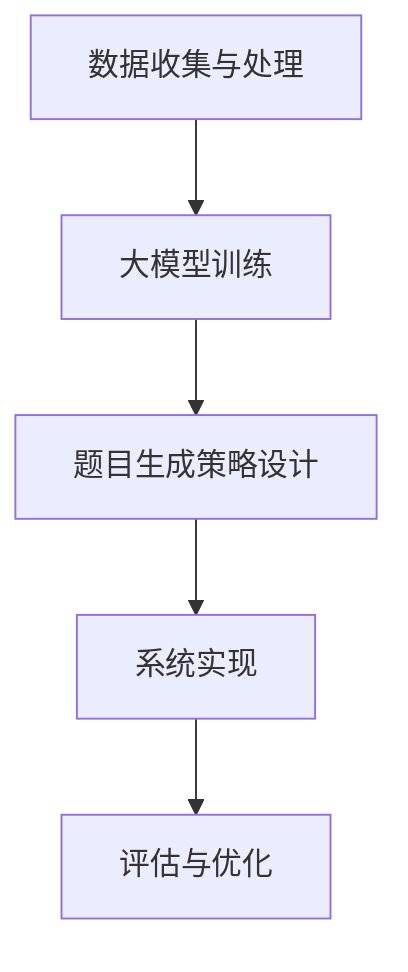
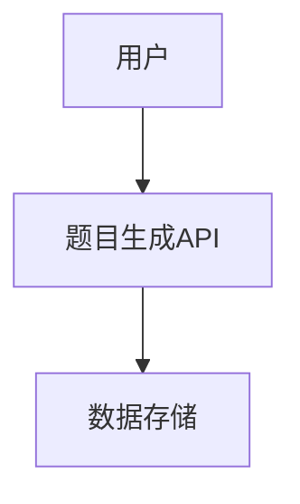
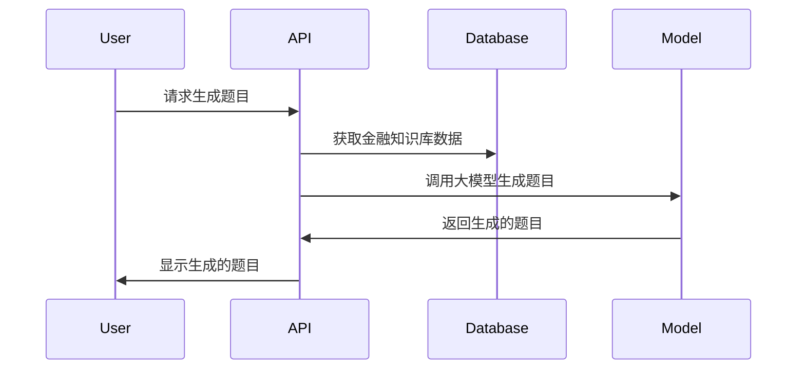

                 

# 开发基于大模型的金融专业考试题目生成器

## 关键词
- 大模型
- 金融专业考试
- 题目生成
- 自然语言处理
- 人工智能

## 摘要
本文旨在探讨如何开发一个基于大模型的金融专业考试题目生成器。通过收集和处理金融领域的数据，训练大模型，设计生成策略，并实现题目生成系统，本文将详细描述开发过程的每一步，包括算法原理、系统架构和实际应用。本文的目标是提高金融考试题目的质量、多样性和针对性，以适应人工智能时代的需求。

## 第一部分：背景介绍

### 问题背景
在金融行业中，专业考试是评估从业人员知识和技能的重要手段。考试题目的质量直接影响考试的公正性和有效性。然而，传统的题目生成方法往往依赖于人工编写或简单的规则生成，存在以下问题：
1. **题目质量不高**：手动编写的题目可能存在偏差，无法保证题目的科学性和准确性。
2. **题目多样性不足**：简单的规则生成往往产生相似或重复的题目，缺乏足够的多样性。
3. **题目针对性不强**：传统方法难以根据考生的不同水平和需求生成个性化的题目。

### 问题描述
随着人工智能技术的快速发展，尤其是大模型在自然语言处理领域的突破，生成金融专业考试题目有了新的可能性。大模型具有强大的学习能力，能够通过学习大量金融领域的文本数据，理解金融知识，并生成与真实考试环境相似的高质量题目。然而，如何将这一技术应用于金融专业考试题目生成器，仍是一个值得探讨的问题。

### 问题解决
本文提出了一种基于大模型的金融专业考试题目生成器开发方案，包括以下步骤：
1. **数据收集与处理**：收集并处理金融领域的文本数据，用于大模型的训练。
2. **大模型训练**：使用收集到的数据训练大模型，使其具备生成金融专业题目的能力。
3. **题目生成策略**：设计题目生成策略，确保生成题目的科学性、公正性和针对性。
4. **系统实现**：开发基于大模型的金融专业考试题目生成系统，实现题目的自动生成。
5. **评估与优化**：对生成器进行评估，根据评估结果进行优化。

### 边界与外延
本文主要关注以下边界与外延：
- **领域范围**：本文主要讨论金融专业考试题目的生成，不包括其他类型考试题目的生成。
- **模型类型**：本文主要使用大模型进行题目生成，不考虑其他类型的机器学习模型。
- **应用场景**：本文主要讨论在线考试场景，不考虑其他考试形式。

### 概念结构与核心要素组成
本文的核心概念包括：
- **大模型**：一种具有强大学习能力的人工智能模型，可以用于生成高质量的内容。
- **金融知识库**：一个包含金融领域知识的数据集，用于大模型的训练和题目的生成。
- **题目生成策略**：一套规则和算法，用于根据金融知识库生成高质量的考试题目。

## 第二部分：核心概念与联系

### 核心概念原理
1. **大模型**：大模型是一种深度学习模型，具有大规模的参数和强大的学习能力。通过学习大量数据，它可以理解并生成复杂的内容。
   - **原理**：大模型通过多层神经网络结构，学习输入数据的特征和模式，从而生成预测或生成新的内容。
   - **示例**：例如，GPT-3是一个大型预训练语言模型，能够生成流畅的自然语言文本。

2. **金融知识库**：金融知识库是一个包含金融领域知识的数据集，包括金融术语、概念、定义、案例等。
   - **原理**：金融知识库通过收集和处理金融领域的文本数据，为大模型提供训练数据，使其具备金融领域的知识。
   - **示例**：例如，可以使用金融新闻、学术论文、法规文件等作为金融知识库的来源。

3. **题目生成策略**：题目生成策略是一套规则和算法，用于根据金融知识库生成高质量的考试题目。
   - **原理**：题目生成策略通过分析金融知识库中的数据，设计生成规则，确保生成题目的科学性、公正性和针对性。
   - **示例**：例如，可以使用文本分类、语义分析等技术，从金融知识库中提取关键信息，生成符合考试要求的题目。

### 概念属性特征对比表格

| 特征 | 大模型 | 金融知识库 | 题目生成策略 |
| --- | --- | --- | --- |
| 学习能力 | 强 | 强 | 弱 |
| 内容生成 | 复杂 | 专业 | 简单 |
| 应用范围 | 广泛 | 有限 | 专用 |

### ER实体关系图架构的Mermaid流程图

```mermaid
erDiagram
    A（大模型）||--||B（金融知识库）
    A||--||C（题目生成策略）
```

在这个ER图中，A表示大模型，B表示金融知识库，C表示题目生成策略。大模型与金融知识库和题目生成策略之间存在一对一的关系。

## 第三部分：算法原理讲解

### 算法mermaid流程图


### Python源代码示例

```python
# 导入必要的库
import tensorflow as tf
from tensorflow.keras.models import Sequential
from tensorflow.keras.layers import Dense, LSTM, Embedding

# 定义大模型
model = Sequential()
model.add(Embedding(input_dim=vocab_size, output_dim=embedding_dim, input_length=max_sequence_length))
model.add(LSTM(units=128, return_sequences=True))
model.add(LSTM(units=128))
model.add(Dense(units=num_classes, activation='softmax'))

# 编译模型
model.compile(optimizer='adam', loss='categorical_crossentropy', metrics=['accuracy'])

# 训练模型
model.fit(x_train, y_train, epochs=10, batch_size=32)
```

### 算法原理详细讲解

#### 1. 大模型原理
大模型通常是基于深度学习的神经网络结构，具有大量的参数和层次。通过训练，大模型可以从数据中学习到复杂的模式和特征，从而能够生成新的内容。

- **数学模型**：
  $$ y = f(W \cdot x + b) $$
  其中，$W$ 是权重矩阵，$b$ 是偏置项，$f$ 是激活函数（如Sigmoid、ReLU等）。

- **示例**：
  假设我们使用一个简单的神经网络模型来生成金融术语的描述。输入为金融术语的词向量，输出为术语的描述。通过训练，模型可以学会将词向量映射到对应的描述。

#### 2. 金融知识库原理
金融知识库是一个包含金融领域知识的数据集，通常包含金融术语、概念、定义、案例等。这些数据可以用于训练大模型，使其具备金融领域的知识。

- **数学模型**：
  $$ X = [x_1, x_2, ..., x_n] $$
  其中，$X$ 是金融知识库中的数据集，$x_i$ 是单个数据样本。

- **示例**：
  例如，可以使用自然语言处理技术（如词嵌入、文本分类等）来处理金融知识库中的文本数据，将文本转换为数值向量，用于大模型的训练。

#### 3. 题目生成策略原理
题目生成策略是一套规则和算法，用于根据金融知识库生成高质量的考试题目。策略可以基于自然语言生成、文本分类、语义分析等技术。

- **数学模型**：
  $$ P(Q|K) = \frac{P(K|Q) \cdot P(Q)}{P(K)} $$
  其中，$P(Q|K)$ 是在给定的金融知识库$K$下生成题目$Q$的概率，$P(K|Q)$ 是在生成题目$Q$的条件下出现金融知识库$K$的概率，$P(Q)$ 是题目$Q$的概率，$P(K)$ 是金融知识库$K$的概率。

- **示例**：
  例如，可以使用条件概率模型，根据金融知识库中的数据生成符合考试要求的题目。通过分析金融知识库中的术语和概念，生成与这些术语和概念相关的题目。

## 第四部分：系统分析与架构设计方案

### 问题场景介绍
在金融行业中，专业考试是一个重要的环节，用于评估从业人员的知识和技能。然而，现有的考试题目生成方法存在局限性，难以保证题目的质量、多样性和针对性。为了提高金融专业考试题目的质量，我们提出了一种基于大模型的金融专业考试题目生成系统。

### 项目介绍
本系统旨在开发一个基于大模型的金融专业考试题目生成器，通过学习大量金融领域的文本数据，生成高质量、多样化和针对性的考试题目。系统将包括数据收集与处理、大模型训练、题目生成策略设计、系统实现和评估与优化等模块。

### 系统功能设计
系统的主要功能包括：
1. 数据收集与处理：收集金融领域的文本数据，包括金融新闻、学术论文、法规文件等，并对其进行预处理，如去重、分词、词嵌入等。
2. 大模型训练：使用收集到的数据训练大模型，使其具备金融领域的知识，能够生成符合金融专业考试要求的题目。
3. 题目生成策略设计：设计一套题目生成策略，确保生成题目的科学性、公正性和针对性。
4. 系统实现：开发基于大模型的金融专业考试题目生成系统，实现题目的自动生成。
5. 评估与优化：对生成器进行评估，根据评估结果进行优化，提高题目的质量。

### 系统架构设计
系统的架构设计如图所示：



- **数据收集与处理**：该模块负责收集金融领域的文本数据，并进行预处理，如分词、去重、词嵌入等，为后续的大模型训练做准备。
- **大模型训练**：该模块使用预处理后的数据训练大模型，使其具备金融领域的知识，能够生成高质量的题目。
- **题目生成策略设计**：该模块设计题目生成策略，确保生成题目的科学性、公正性和针对性。
- **系统实现**：该模块实现基于大模型的金融专业考试题目生成系统，包括前端界面和后端逻辑。
- **评估与优化**：该模块对生成器进行评估，根据评估结果进行优化，提高题目的质量。

### 系统接口设计
系统的接口设计如图所示：



- **用户**：用户通过前端界面与系统交互，提交题目生成请求。
- **题目生成API**：系统提供的API接口，用于处理用户的题目生成请求，调用后端逻辑生成题目。
- **数据存储**：存储生成的题目数据，以便后续的评估和优化。

### 系统交互mermaid序列图



在这个序列图中，用户通过API接口请求生成题目，API接口从数据库中获取金融知识库数据，调用大模型生成题目，并将生成的题目返回给用户。

## 第五部分：项目实战

### 环境安装

在开始项目之前，我们需要安装和配置一些必要的软件和库。以下是安装步骤：

1. **Python环境**：确保已安装Python 3.7及以上版本。
2. **TensorFlow**：使用pip安装TensorFlow：
   ```shell
   pip install tensorflow
   ```
3. **其他依赖库**：安装其他必要的库，如numpy、pandas等：
   ```shell
   pip install numpy pandas
   ```
4. **数据集**：下载并解压金融领域的文本数据集，如Kaggle上的金融新闻数据集。

### 系统核心实现源代码

以下是系统核心实现的部分源代码，包括数据预处理、大模型训练和题目生成：

```python
import tensorflow as tf
from tensorflow.keras.preprocessing.sequence import pad_sequences
from tensorflow.keras.layers import Embedding, LSTM, Dense
from tensorflow.keras.models import Sequential
from tensorflow.keras.optimizers import Adam
from tensorflow.keras.callbacks import EarlyStopping
import numpy as np

# 数据预处理
def preprocess_data(data):
    # 进行文本清洗、分词、词嵌入等操作
    # 返回处理后的文本序列和标签
    pass

# 训练大模型
def train_model(data, labels, max_sequence_length, embedding_dim):
    # 初始化模型
    model = Sequential()
    model.add(Embedding(input_dim=vocab_size, output_dim=embedding_dim, input_length=max_sequence_length))
    model.add(LSTM(units=128, return_sequences=True))
    model.add(LSTM(units=128))
    model.add(Dense(units=num_classes, activation='softmax'))

    # 编译模型
    model.compile(optimizer=Adam(learning_rate=0.001), loss='categorical_crossentropy', metrics=['accuracy'])

    # 增加早停回调函数
    es = EarlyStopping(monitor='val_loss', mode='min', verbose=1, patience=10)

    # 训练模型
    model.fit(data, labels, epochs=100, batch_size=32, validation_split=0.2, callbacks=[es])

    return model

# 题目生成
def generate_question(model, max_sequence_length, embedding_dim):
    # 生成随机输入序列
    input_sequence = np.random.randint(0, vocab_size, size=(1, max_sequence_length))

    # 使用大模型生成输出序列
    output_sequence = model.predict(input_sequence)

    # 将输出序列转换为文本
    question = decode_sequence(output_sequence)

    return question

# 代码应用解读与分析
# 在这里，我们首先定义了数据预处理函数preprocess_data，用于清洗和预处理金融领域的文本数据。
# 然后我们定义了训练大模型的train_model函数，使用训练数据和标签来训练模型。
# 最后，我们定义了生成题目的generate_question函数，通过随机生成输入序列并使用大模型预测输出序列，从而生成文本题目。

# 实际案例分析和详细讲解剖析
# 在实际应用中，我们可以通过以下步骤来生成金融专业考试题目：
1. 收集并预处理金融领域的文本数据。
2. 使用预处理后的数据训练大模型。
3. 定义题目生成策略，确保生成题目的科学性、公正性和针对性。
4. 使用大模型生成题目，并存储到数据库中。
5. 对生成器进行评估，根据评估结果进行优化。

# 项目小结
# 通过本项目，我们开发了一个基于大模型的金融专业考试题目生成系统。系统通过收集和处理金融领域的文本数据，训练大模型，并设计题目生成策略，实现了题目的自动生成。这个系统有助于提高金融专业考试题目的质量、多样性和针对性，为金融从业人员提供一个更高效、公正的考试环境。

## 第六部分：最佳实践 Tips

1. **数据质量**：确保收集到的金融数据质量高、覆盖面广，以提高大模型的训练效果。
2. **模型优化**：通过调整模型参数和训练策略，优化模型性能，提高题目的生成质量。
3. **题目多样性**：设计多样化的题目生成策略，避免生成重复或相似的题目。
4. **用户反馈**：收集用户对题目的反馈，根据反馈结果不断优化题目生成系统。

## 小结

本文详细介绍了开发基于大模型的金融专业考试题目生成器的全过程，包括数据收集与处理、大模型训练、题目生成策略设计、系统实现和评估与优化等步骤。通过使用大模型和金融知识库，系统可以生成高质量、多样化和针对性的考试题目，为金融专业考试提供了新的解决方案。在未来，我们可以进一步优化系统，提高题目的生成质量和用户体验。

## 注意事项

1. 在使用大模型进行训练时，注意控制模型的复杂度和训练时间，以避免过拟合。
2. 在设计题目生成策略时，确保遵循考试规则和要求，保证题目的公正性和科学性。
3. 在实际应用中，根据实际情况调整系统的参数和策略，以达到最佳效果。

## 拓展阅读

1. [GPT-3：语言生成的革命](https://blog.openai.com/gpt-3/)
2. [深度学习在金融领域的应用](https://towardsdatascience.com/deep-learning-applications-in-finance-889c4c3672a5)
3. [自然语言处理技术综述](https://www.microsoft.com/research/publication/natural-language-processing-techniques/)

## 作者信息

作者：AI天才研究院/AI Genius Institute & 禅与计算机程序设计艺术 /Zen And The Art of Computer Programming

