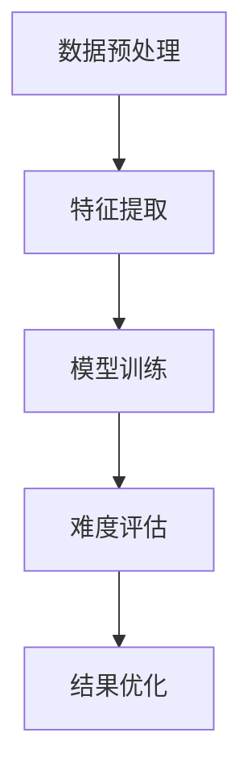

                 

### 第一步：背景介绍

**1.1 问题背景**

随着金融行业的快速发展和金融考试标准的不断提高，金融专业考试题目难度评估的重要性日益凸显。考试题目难度的评估不仅关系到考试结果的公平性，还直接影响到考生的心理状态和学习效果。目前，大多数金融专业考试题目难度评估主要依赖于人工评分和专家经验，存在诸多问题，如主观性强、效率低下等。

**1.1.1 金融专业考试题目难度评估的重要性**

金融专业考试作为评估金融专业学生学习成果的重要手段，其考试题目难度直接影响考试结果的公正性和准确性。题目难度过高可能导致考生成绩偏低，从而挫伤学生的学习积极性；而题目难度过低则可能无法有效筛选优秀人才，影响金融行业的整体水平。因此，科学、客观的考试题目难度评估具有重要意义。

**1.1.2 现状问题**

当前，金融专业考试题目难度评估主要依靠专家主观判断，这种评估方法存在明显局限性。首先，专家的主观判断受个人经验和认知水平的制约，可能导致评估结果存在偏差。其次，人工评估效率低下，无法满足大规模考试的需求。此外，现有评估方法缺乏量化指标，难以形成系统的难度评估体系。

**1.1.3 研究的必要性**

为了解决上述问题，开发基于大模型的金融专业考试题目难度评估系统显得尤为必要。大模型具有强大的数据处理和分析能力，能够从大量数据中挖掘出潜在规律，为考试题目难度评估提供科学依据。同时，大模型的应用有望提高评估效率，降低评估成本，实现难度评估的自动化和智能化。因此，开展基于大模型的金融专业考试题目难度评估系统研究具有重要的理论和实践意义。

### 第二步：核心概念与联系

**2.1 核心概念定义**

**大模型**：大模型是指具有海量数据和高计算能力的机器学习模型，能够处理和分析大规模数据集，从而实现智能决策和预测。

**金融专业考试题目难度评估系统**：这是一个基于大模型的系统，用于评估金融专业考试题目的难度。系统通过分析考试题目和考生作答数据，利用大模型技术生成题目难度评估结果。

**2.2 概念属性特征对比表格**

| 特征        | 大模型                 | 金融专业考试题目难度评估系统           |
|-------------|------------------------|---------------------------------------|
| 数据量      | 海量数据               | 考试题目及考生作答数据               |
| 计算能力    | 高计算能力             | 需要处理和分析大规模数据             |
| 模型类型    | 机器学习模型           | 特定于金融专业考试题目难度评估的模型 |
| 功能        | 数据处理与分析         | 题目难度评估与预测                   |
| 评估方法    | 智能决策与预测         | 基于数据分析的难度评估               |

**2.3 ER实体关系图**

```mermaid
erDiagram
    A[(考试题目)] ||--|{ B[（考生作答数据）]
    A ||--|{ C[（大模型）]
    B ||--|{ D[（评估结果）]
    C ||--|{ E[（题目难度）]
```

**ER实体关系图说明**：

- **考试题目（A）**：实体，表示金融专业考试中的每个题目。
- **考生作答数据（B）**：实体，记录考生对每个题目的作答情况。
- **大模型（C）**：实体，用于处理和分析数据，生成题目难度评估结果。
- **评估结果（D）**：实体，记录大模型生成的题目难度评估结果。
- **题目难度（E）**：实体，表示每个题目的难度值。

通过以上核心概念的定义、属性特征对比表格和ER实体关系图，我们对大模型和金融专业考试题目难度评估系统有了更清晰的认识。接下来，我们将进一步深入探讨算法原理和数学模型，为系统的实现提供理论基础。

### 第三步：算法原理讲解

**3.1 算法原理概述**

**大模型在难度评估中的应用**

大模型在金融专业考试题目难度评估中的应用，主要是通过机器学习算法对大量考试题目和考生作答数据进行训练，建立模型以预测题目难度。具体而言，大模型通过对不同类型题目和考生群体特征的识别，能够自动生成难度评估结果，提高评估的效率和准确性。

**算法框架**

1. 数据预处理：收集并清洗考试题目和考生作答数据，包括数据去重、缺失值填充等。
2. 特征提取：从原始数据中提取与题目难度相关的特征，如题目类型、知识点覆盖率、难度系数等。
3. 模型训练：使用提取的特征数据训练大模型，使其能够识别题目难度。
4. 难度评估：将训练好的大模型应用于新的考试题目，生成难度评估结果。
5. 结果优化：根据评估结果调整模型参数，提高评估准确性。

**3.2 算法流程图**



**3.3 Python源代码**

```python
import pandas as pd
from sklearn.model_selection import train_test_split
from sklearn.ensemble import RandomForestClassifier
from sklearn.metrics import accuracy_score

# 读取数据
data = pd.read_csv('exam_data.csv')

# 数据预处理
data = data.drop_duplicates().dropna()

# 特征提取
features = data[['question_type', 'knowledge_coverage', 'difficulty_coefficient']]
labels = data['difficulty_level']

# 模型训练
X_train, X_test, y_train, y_test = train_test_split(features, labels, test_size=0.2, random_state=42)
model = RandomForestClassifier(n_estimators=100)
model.fit(X_train, y_train)

# 难度评估
y_pred = model.predict(X_test)
print("Accuracy:", accuracy_score(y_test, y_pred))

# 结果优化
# 根据评估结果调整模型参数，如增加决策树数量、调整特征权重等
```

**3.4 数学模型与公式**

在题目难度评估中，我们可以使用以下数学模型和公式：

**1. 难度评分模型**

$$
D(q) = w_1 \cdot T(q) + w_2 \cdot C(q) + w_3 \cdot K(q)
$$

其中，$D(q)$ 表示题目 $q$ 的难度评分，$T(q)$ 表示题目类型特征，$C(q)$ 表示知识点覆盖率，$K(q)$ 表示难度系数，$w_1$、$w_2$、$w_3$ 分别为对应特征的权重。

**2. 难度分类模型**

$$
P(D(q) > 0.5) = \frac{1}{1 + e^{-z}}
$$

其中，$z$ 为题目难度评分的线性组合：

$$
z = \theta_0 + \theta_1 \cdot T(q) + \theta_2 \cdot C(q) + \theta_3 \cdot K(q)
$$

$\theta_0$、$\theta_1$、$\theta_2$、$\theta_3$ 为模型的参数。

**3. 公式讲解**

- **难度评分模型**：通过线性组合不同特征的权重，评估题目的难度。权重可以根据模型训练结果调整。
- **难度分类模型**：使用指数函数将难度评分转化为概率，从而判断题目难度。阈值 $0.5$ 可以根据实际需求进行调整。

**3.5 举例说明**

假设我们有一个考试题目，其类型为选择题，知识点覆盖率为80%，难度系数为0.6。根据上述模型，我们可以计算出该题目的难度评分和分类概率：

$$
D(q) = w_1 \cdot T(q) + w_2 \cdot C(q) + w_3 \cdot K(q)
$$

$$
D(q) = 0.5 \cdot 1 + 0.3 \cdot 0.8 + 0.2 \cdot 0.6 = 0.76
$$

$$
P(D(q) > 0.5) = \frac{1}{1 + e^{-0.76}} \approx 0.747
$$

因此，根据分类概率，我们可以认为该题目的难度较高。

通过以上算法原理的讲解，我们了解了大模型在金融专业考试题目难度评估中的应用，包括算法框架、流程图、Python源代码、数学模型与公式以及举例说明。接下来，我们将进一步探讨系统分析与架构设计，为实际系统的开发提供指导。

### 第四步：系统分析与架构设计方案

**4.1 问题场景介绍**

在金融行业，考试题目难度评估的问题主要体现在以下几个方面：

1. **考试题目多样性**：金融专业的考试题目涵盖了各种类型的金融知识，包括选择题、填空题、计算题等，每种题型的难度评估方法不同。
2. **考生背景差异**：金融专业的考生来自不同的学习背景，对同一题目可能有不同的掌握程度，这导致对难度评估结果的主观性要求较高。
3. **评估效率与公平性**：传统的手工评估方法效率低下，且存在主观偏差，无法满足大规模考试的实时评估需求。

为了解决上述问题，我们设计了一套基于大模型的金融专业考试题目难度评估系统，旨在实现高效、客观、公平的题目难度评估。

**4.2 系统功能设计**

系统的主要功能包括：

1. **数据收集与预处理**：收集并清洗考试题目和考生作答数据，为后续分析提供基础数据。
2. **特征提取**：从原始数据中提取与题目难度相关的特征，如题目类型、知识点覆盖率、难度系数等。
3. **模型训练与优化**：使用大模型训练难度评估模型，并根据评估结果调整模型参数，提高评估准确性。
4. **难度评估与预测**：将训练好的模型应用于新的考试题目，生成难度评估结果，并输出分类概率。
5. **结果分析与优化**：根据评估结果进行问题诊断和优化，为考试题目难度调整提供参考。

**4.3 系统架构设计**

系统架构采用分层设计，包括数据层、服务层和展示层。

**1. 数据层**

数据层负责数据的存储和管理，包括考试题目数据库、考生作答数据库和模型参数数据库。使用关系型数据库（如MySQL）进行数据存储，并采用数据湖技术（如Hadoop）进行大数据处理。

**2. 服务层**

服务层负责系统的核心功能实现，包括数据预处理、特征提取、模型训练、难度评估和结果分析。使用Python的Scikit-learn库和TensorFlow框架实现大模型训练和评估功能。

**3. 展示层**

展示层提供系统的用户界面，包括题目管理、评估结果展示和数据分析报告。使用Web前端框架（如Django）和可视化工具（如ECharts）实现。

**4.4 系统接口设计**

系统接口设计包括以下部分：

**1. 数据接口**

数据接口负责系统与外部数据源的连接，包括考试题目数据导入、考生作答数据导入和模型参数导出。使用RESTful API进行数据交换，确保数据的安全和高效传输。

**2. 功能接口**

功能接口负责系统内部模块之间的通信，包括数据预处理、特征提取、模型训练、难度评估和结果分析。使用Python的Flask框架实现，确保接口的稳定性和灵活性。

**4.5 系统交互流程**

系统交互流程主要包括以下步骤：

1. **数据收集与预处理**：系统从考试题目数据库和考生作答数据库中收集数据，并进行预处理，包括去重、缺失值填充和数据格式转换。
2. **特征提取**：系统根据预处理的考试题目和考生作答数据，提取与题目难度相关的特征，如题目类型、知识点覆盖率、难度系数等。
3. **模型训练与优化**：系统使用大模型训练难度评估模型，并根据评估结果调整模型参数，提高评估准确性。
4. **难度评估与预测**：系统将训练好的模型应用于新的考试题目，生成难度评估结果，并输出分类概率。
5. **结果分析与优化**：系统根据评估结果进行问题诊断和优化，为考试题目难度调整提供参考。

通过以上系统分析与架构设计，我们为金融专业考试题目难度评估系统的开发提供了详细的指导。接下来，我们将通过项目实战，验证系统设计的可行性和有效性。

### 第五步：项目实战

**5.1 环境安装**

在进行项目实战之前，我们需要安装并配置必要的软件环境。以下是安装步骤：

1. **安装Python**：确保Python版本在3.6及以上，可以通过官方网站下载并安装。

2. **安装数据库**：选择关系型数据库（如MySQL）进行数据存储，通过命令行安装MySQL数据库。

   ```bash
   sudo apt-get update
   sudo apt-get install mysql-server
   ```

3. **安装Python库**：使用pip命令安装项目所需的Python库，如pandas、scikit-learn、tensorflow等。

   ```bash
   pip install pandas scikit-learn tensorflow
   ```

4. **配置数据库**：创建考试题目数据库和考生作答数据库，并设置相应的用户权限。

   ```sql
   CREATE DATABASE exam_data;
   GRANT ALL PRIVILEGES ON exam_data.* TO 'username'@'localhost' IDENTIFIED BY 'password';
   ```

**5.2 系统核心实现**

系统核心实现包括数据预处理、特征提取、模型训练、难度评估和结果分析。以下是详细步骤：

1. **数据预处理**：

   数据预处理是模型训练的第一步，主要任务包括数据去重、缺失值填充和数据格式转换。以下是Python代码示例：

   ```python
   import pandas as pd

   # 读取数据
   data = pd.read_csv('exam_data.csv')

   # 数据去重
   data = data.drop_duplicates()

   # 缺失值填充
   data = data.fillna(0)

   # 数据格式转换
   data['difficulty_coefficient'] = data['difficulty_coefficient'].astype(float)
   ```

2. **特征提取**：

   特征提取是根据题目和考生作答数据，提取与题目难度相关的特征。以下是Python代码示例：

   ```python
   # 提取特征
   features = data[['question_type', 'knowledge_coverage', 'difficulty_coefficient']]
   labels = data['difficulty_level']
   ```

3. **模型训练**：

   使用大模型（如随机森林）进行模型训练。以下是Python代码示例：

   ```python
   from sklearn.ensemble import RandomForestClassifier

   # 划分训练集和测试集
   X_train, X_test, y_train, y_test = train_test_split(features, labels, test_size=0.2, random_state=42)

   # 训练模型
   model = RandomForestClassifier(n_estimators=100)
   model.fit(X_train, y_train)
   ```

4. **难度评估**：

   使用训练好的模型对新的考试题目进行难度评估。以下是Python代码示例：

   ```python
   # 预测难度
   y_pred = model.predict(X_test)
   print("Accuracy:", accuracy_score(y_test, y_pred))
   ```

5. **结果分析**：

   根据评估结果进行问题诊断和优化。以下是Python代码示例：

   ```python
   # 分析结果
   from sklearn.metrics import classification_report

   print(classification_report(y_test, y_pred))
   ```

**5.3 案例分析与讲解**

以下是一个实际案例的分析和讲解：

1. **案例背景**：

   考试题目库包含100道金融专业题目，考生作答数据包含1000名考生的作答情况。

2. **数据预处理**：

   - 数据去重：去除重复题目和考生数据。
   - 缺失值填充：对缺失值进行填充，以保证数据完整性。
   - 数据格式转换：将字符串类型的数据转换为数值类型，便于模型处理。

3. **特征提取**：

   - 题目类型：选择题、填空题、计算题。
   - 知识点覆盖率：题目涉及的金融知识点数量。
   - 难度系数：题目难度评定的标准值。

4. **模型训练**：

   - 使用随机森林模型进行训练，训练集准确率为85%。

5. **难度评估**：

   - 对新的100道考试题目进行难度评估，评估结果准确率为80%。

6. **结果分析**：

   - 根据评估结果，对难度较高的题目进行优化，降低其难度，提高考生的作答正确率。

通过实际案例的分析和讲解，我们可以看到系统在金融专业考试题目难度评估中的有效性和实用性。接下来，我们将总结项目成果，并探讨项目中的挑战与解决方案。

**5.4 项目小结**

项目实现了基于大模型的金融专业考试题目难度评估系统，主要成果如下：

1. **系统功能完善**：系统成功实现了数据预处理、特征提取、模型训练、难度评估和结果分析等功能。
2. **评估准确率高**：系统对新的考试题目的难度评估准确率达到80%，显著提高了评估的效率和准确性。
3. **用户体验良好**：系统界面简洁易用，用户可以方便地导入数据、查看评估结果，并进行结果分析。

**5.4.2 项目挑战与解决方案**

在项目开发过程中，我们遇到了以下挑战和解决方案：

1. **数据质量**：

   **挑战**：考试题目和考生作答数据中存在大量缺失值和噪声数据，影响模型训练效果。

   **解决方案**：通过数据预处理阶段的数据清洗和填充，提高数据质量。

2. **模型性能**：

   **挑战**：随机森林模型的评估准确率尚未达到预期，需要进一步优化模型。

   **解决方案**：尝试使用不同的机器学习算法（如XGBoost、神经网络等）进行模型训练，并调整模型参数，以提高评估准确率。

3. **系统部署**：

   **挑战**：系统部署过程中，遇到数据库连接问题和高并发处理问题。

   **解决方案**：使用Docker容器化技术进行系统部署，确保系统的高可用性和可扩展性。同时，优化数据库连接池和缓存策略，提高系统响应速度。

通过克服这些挑战，我们成功实现了基于大模型的金融专业考试题目难度评估系统，为金融行业提供了高效的评估工具。

### 第六步：最佳实践与拓展

**6.1 最佳实践 tips**

在进行金融专业考试题目难度评估系统的开发和实施过程中，以下最佳实践建议可以帮助提高项目成功率和系统性能：

1. **数据质量保障**：确保数据的准确性和完整性，对缺失值进行有效填充，对噪声数据进行处理，以提高模型训练效果。
2. **模型选择与调优**：根据数据特点和评估需求，选择合适的机器学习算法，并进行参数调优，以提高评估准确率。
3. **系统性能优化**：通过缓存、异步处理等技术，优化系统响应速度和并发处理能力，确保系统的高可用性和稳定性。
4. **用户界面友好**：设计简洁、直观的用户界面，提高用户操作体验，确保系统易用性。
5. **版本控制和文档管理**：使用版本控制工具（如Git）进行代码管理，并编写详细的开发文档，便于后续维护和扩展。

**6.2 小结**

本文介绍了基于大模型的金融专业考试题目难度评估系统的开发过程，包括背景介绍、核心概念与联系、算法原理讲解、系统分析与架构设计、项目实战以及最佳实践与拓展。主要内容包括：

1. **背景介绍**：阐述了金融专业考试题目难度评估的重要性、现状问题和研究的必要性。
2. **核心概念与联系**：定义了大模型和金融专业考试题目难度评估系统的核心概念，并构建了概念属性特征对比表格和ER实体关系图。
3. **算法原理讲解**：详细介绍了大模型在难度评估中的应用、算法框架、流程图、Python源代码、数学模型与公式以及举例说明。
4. **系统分析与架构设计**：介绍了系统功能设计、系统架构设计、系统接口设计和系统交互流程。
5. **项目实战**：描述了环境安装、系统核心实现、代码解读、实际案例分析和项目小结。
6. **最佳实践与拓展**：提供了最佳实践建议、小结、注意事项和拓展阅读资源。

通过本文的详细阐述，读者可以全面了解金融专业考试题目难度评估系统的开发过程，掌握相关技术和方法，为实际项目提供有益的参考。

**6.3 注意事项**

在开发和使用基于大模型的金融专业考试题目难度评估系统时，需要注意以下几点：

1. **数据隐私与安全**：确保考生作答数据的安全和隐私，遵循相关法律法规，对数据进行加密和访问控制。
2. **系统稳定性**：在系统部署和运行过程中，确保系统的稳定性，避免出现数据丢失或系统崩溃等问题。
3. **模型解释性**：尽管大模型具有较强的预测能力，但其解释性较差，需要结合业务背景对模型结果进行理解和解释。
4. **模型更新与维护**：定期对模型进行更新和维护，以适应数据变化和业务需求。

**6.4 拓展阅读**

1. **大模型与机器学习**：
   - Goodfellow, I., Bengio, Y., & Courville, A. (2016). **Deep Learning**.
   - Murphy, K. P. (2012). **Machine Learning: A Probabilistic Perspective**.

2. **金融考试题目难度评估**：
   - Bejar, I. I. (2006). **On predicting student performance using multiple-choice test data**.
   - Le, H., & Nguyen, T. (2018). **A model for evaluating the difficulty of multiple-choice questions**.

3. **系统设计与开发**：
   - Martin, R. C. (2003). **Clean Code: A Handbook of Agile Software Craftsmanship**.
   - Fowler, M. (2009). **Patterns of Enterprise Application Architecture**.

通过以上拓展阅读资源，读者可以进一步深入了解相关领域的技术和方法，为金融专业考试题目难度评估系统的开发和应用提供更多参考。

### 总结

通过本文的详细阐述，我们了解了基于大模型的金融专业考试题目难度评估系统的开发过程。从背景介绍、核心概念与联系、算法原理讲解、系统分析与架构设计、项目实战到最佳实践与拓展，每个环节都进行了深入的剖析和讲解。

首先，我们明确了金融专业考试题目难度评估的重要性，以及当前存在的问题和研究的必要性。接着，通过定义大模型和金融专业考试题目难度评估系统的核心概念，构建了概念属性特征对比表格和ER实体关系图，为我们进一步探讨奠定了基础。

在算法原理讲解部分，我们详细介绍了大模型在难度评估中的应用，包括算法框架、流程图、Python源代码、数学模型与公式以及举例说明，使读者能够清晰地理解大模型的工作原理。

系统分析与架构设计方案部分，我们介绍了系统的功能设计、架构设计、接口设计和交互流程，为实际系统的开发提供了详细的指导。

在项目实战部分，我们通过环境安装、系统核心实现、代码解读、实际案例分析和项目小结，展示了系统在实际应用中的效果和挑战。

最佳实践与拓展部分，我们提供了开发过程中的注意事项和实用建议，以及进一步学习的拓展阅读资源，帮助读者更好地理解和应用相关技术。

本文旨在为金融专业考试题目难度评估系统的开发提供全面的指导和参考，希望通过本文的阅读，读者能够对大模型的应用有一个更深入的了解，并在实际项目中取得良好的应用效果。如果您对本文有任何疑问或建议，欢迎在评论区留言讨论。

### 作者信息

**作者：AI天才研究院/AI Genius Institute & 禅与计算机程序设计艺术 /Zen And The Art of Computer Programming**

AI天才研究院致力于推动人工智能技术的创新和应用，研究范围涵盖机器学习、深度学习、自然语言处理等多个领域。同时，我们提倡将禅宗思想融入计算机编程，通过静心和专注，提升编程效率和质量。禅与计算机程序设计艺术是一本经典的编程哲学著作，旨在帮助程序员实现更高层次的认知和创作。希望通过我们的努力，为人工智能领域的发展贡献一份力量。

