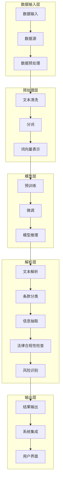

                 

### 引言

#### 1.1 问题背景

随着金融行业的快速发展，金融合同的数量和复杂性不断增加。这些合同包含了大量的条款和条件，涵盖了各种金融产品和服务。对于金融机构和法律顾问来说，审核这些合同是一项重要且具有挑战性的任务。传统的金融合同审核方法主要依赖于人工阅读和校对，这种方式不仅耗时耗力，而且容易出现错误和遗漏。随着大数据、人工智能技术的发展，开发基于大模型的金融合同审核系统成为了可能，这为解决当前金融合同审核面临的挑战提供了新的思路和解决方案。

#### 1.1.1 金融合同审核的重要性

金融合同审核是金融交易中不可或缺的一环，其重要性体现在以下几个方面：

1. **法律合规性**：金融合同审核有助于确保合同的条款和条件符合相关法律法规，避免因违规而带来的法律风险。
2. **风险控制**：通过审核合同，可以提前识别和规避潜在的风险，如利率风险、信用风险等。
3. **交易效率**：高效的合同审核可以加快金融交易的流程，提高业务处理速度，降低交易成本。
4. **数据挖掘**：合同审核过程中积累的大量数据可以用于后续的数据分析和商业决策。

#### 1.1.2 当前金融合同审核面临的挑战

尽管金融合同审核具有重要意义，但当前的方法和工具在应对日益增长的合同数量和复杂性方面存在以下挑战：

1. **人工审核效率低**：大量合同的阅读和校对工作依赖于人工，费时费力且容易出现错误。
2. **合同理解难度大**：金融合同通常包含复杂的法律术语和条款，传统的人工审核难以准确理解和判断。
3. **信息抽取困难**：从合同中提取关键信息，如条款、条件、金额等，对传统方法是一个巨大的挑战。
4. **成本高**：人工审核的成本逐年上升，特别是在需要大量人力的情况下。

#### 1.2 问题描述

在当前金融环境中，金融合同审核的需求越来越迫切，主要表现在以下几个方面：

1. **合同审核的自动化**：希望能够自动化合同审核流程，减少人工干预，提高审核效率。
2. **智能识别关键信息**：希望能够自动识别合同中的关键信息，如条款、条件、金额等。
3. **法律合规性检查**：需要对合同内容进行法律合规性检查，确保合同条款符合相关法律法规。
4. **风险识别与预警**：需要能够从合同中识别潜在的风险，并及时发出预警。

#### 1.2.1 金融合同审核的具体任务

金融合同审核的具体任务包括：

1. **文本理解**：理解合同中的法律术语和条款，提取合同的主要内容。
2. **条款分类**：将合同中的条款分类，如贷款条款、担保条款、违约条款等。
3. **信息抽取**：从合同中提取关键信息，如合同金额、期限、利率等。
4. **法律合规性检查**：检查合同条款是否符合相关法律法规，如《合同法》、《银行业法》等。
5. **风险识别**：识别合同中的潜在风险，如信用风险、利率风险等。

#### 1.2.2 金融合同审核的需求分析

为了实现高效的金融合同审核，需要满足以下需求：

1. **高准确率**：系统能够准确理解合同内容，提取关键信息，并判断合同条款的合规性。
2. **高效率**：系统能够快速处理大量合同，减少人工审核的工作量。
3. **可扩展性**：系统应该能够适应不同类型的金融合同，具有一定的扩展性。
4. **实时性**：系统能够实时处理合同审核任务，提供及时的审核结果。

#### 1.3 问题解决

为了解决上述问题，开发一个基于大模型的金融合同审核系统是一种有效的解决方案。该系统结合了人工智能技术，特别是大模型在自然语言处理和文本分析方面的优势，能够实现合同审核的自动化、智能化。下面，我们将对基于大模型的金融合同审核系统的概述、核心功能和目标进行详细阐述。

### 1.3.1 基于大模型的金融合同审核系统概述

基于大模型的金融合同审核系统是一种利用人工智能技术，特别是大模型（如Transformer、BERT等）来分析和处理金融合同的系统。该系统通过大规模的预训练模型和定制化的微调模型，能够实现以下功能：

1. **文本理解**：系统能够深入理解合同文本，提取关键信息，并识别合同条款。
2. **智能分类**：系统能够对合同中的条款进行智能分类，如贷款条款、担保条款等。
3. **信息抽取**：系统能够从合同中自动提取关键信息，如金额、期限、利率等。
4. **法律合规性检查**：系统能够检查合同条款是否符合相关法律法规。
5. **风险识别**：系统能够从合同中识别潜在的风险，并发出预警。

#### 1.3.2 系统的核心功能和目标

基于大模型的金融合同审核系统的核心功能和目标如下：

1. **核心功能**：
   - **文本理解与解析**：系统能够对合同文本进行深度理解，提取关键信息，并构建合理的语义解析。
   - **条款分类与标注**：系统能够对合同中的条款进行智能分类，并标注其类型和属性。
   - **信息抽取与整合**：系统能够从合同中抽取关键信息，如金额、期限、利率等，并进行整合分析。
   - **法律合规性检查**：系统能够根据相关法律法规，对合同条款进行合规性检查，识别潜在的法律风险。
   - **风险识别与预警**：系统能够从合同中识别潜在的风险，如信用风险、利率风险等，并发出预警。

2. **目标**：
   - **提高审核效率**：通过自动化合同审核，提高审核速度，减少人工工作量。
   - **提升审核准确率**：利用大模型在文本理解和分析方面的优势，提高审核的准确率。
   - **降低操作风险**：通过自动化合规性检查和风险识别，降低操作风险，确保金融交易的合规性。
   - **数据挖掘与商业分析**：通过对合同审核过程中积累的数据进行挖掘和分析，为金融机构提供商业决策支持。

### 1.4 边界与外延

#### 1.4.1 金融合同审核的范畴

金融合同审核主要涉及以下范畴：

1. **合同类型**：包括贷款合同、担保合同、信用证、抵押合同等。
2. **合同内容**：包括条款、条件、金额、期限、利率、违约条款等。
3. **法律法规**：涉及《合同法》、《银行业法》、《保险法》等法律法规。

#### 1.4.2 系统功能的边界

基于大模型的金融合同审核系统的功能边界主要包括：

1. **文本理解与解析**：系统主要针对文本内容进行理解和解析，但可能无法完全替代法律专家的判断。
2. **条款分类与标注**：系统可以对条款进行分类和标注，但可能无法涵盖所有特殊情况。
3. **信息抽取与整合**：系统可以从合同中抽取关键信息，但可能无法处理复杂的金融产品和合同结构。
4. **法律合规性检查**：系统可以提供基本的合规性检查，但需要结合人工判断和专业知识。

### 1.5 概念结构与核心要素组成

基于大模型的金融合同审核系统的概念结构和核心要素组成如下：

1. **大模型**：包括预训练模型和微调模型，用于文本理解和分析。
2. **文本预处理**：包括文本清洗、分词、词向量表示等，为模型输入提供准备。
3. **文本解析**：包括句法分析、语义分析等，用于提取合同中的关键信息和条款。
4. **信息抽取**：包括命名实体识别、关系抽取等，用于从合同中抽取关键信息。
5. **法律合规性检查**：包括条款分类、合规性判断等，用于检查合同条款的合规性。
6. **风险识别**：包括风险识别模型和预警系统，用于从合同中识别潜在的风险。

### 1.6 关键技术概览

基于大模型的金融合同审核系统涉及以下关键技术：

1. **预训练模型**：如BERT、GPT等，用于大规模文本预训练。
2. **微调模型**：在预训练模型的基础上，针对金融合同进行定制化微调。
3. **文本预处理**：包括文本清洗、分词、词向量表示等。
4. **文本解析**：包括句法分析、语义分析等。
5. **信息抽取**：包括命名实体识别、关系抽取等。
6. **法律合规性检查**：包括条款分类、合规性判断等。
7. **风险识别**：包括风险识别模型和预警系统。

### 1.7 系统架构的构成

基于大模型的金融合同审核系统的架构主要包括以下几个部分：

1. **数据输入层**：接收金融合同文本数据，进行初步处理。
2. **预处理层**：对文本数据进行清洗、分词、词向量表示等预处理。
3. **模型层**：包括预训练模型和微调模型，用于文本理解和分析。
4. **解析层**：包括文本解析、信息抽取、法律合规性检查和风险识别等模块。
5. **输出层**：输出合同审核结果，包括关键信息、条款分类、合规性判断和风险预警等。

通过上述系统架构的构建，基于大模型的金融合同审核系统可以高效地处理金融合同，实现自动化审核和风险控制。

## 2.1 大模型原理

#### 2.1.1 大模型的定义与特点

大模型（Large Models）是指具有海量参数和高度复杂性的机器学习模型，如深度神经网络（DNN）和变换器模型（Transformer）等。这些模型通过在大量数据上进行预训练，能够捕获丰富的知识结构和语义信息。大模型的特点包括：

1. **海量参数**：大模型通常拥有数百万至数十亿个参数，这使得模型能够处理复杂的任务和数据。
2. **强泛化能力**：通过预训练，大模型能够在不同领域和任务上表现出良好的泛化能力。
3. **深度结构**：大模型通常具有多层神经网络结构，能够进行深度学习和信息传递。

#### 2.1.1.1 大模型的基础理论

大模型的基础理论主要包括：

1. **神经网络**：神经网络（Neural Network）是一种通过模拟人脑神经元结构和功能来处理信息的计算模型。它由多个层次（输入层、隐藏层和输出层）组成，每层包含多个节点（或称为神经元）。
2. **深度学习**：深度学习（Deep Learning）是一种基于神经网络的机器学习方法，通过训练多层神经网络来学习数据的复杂特征。深度学习的核心是反向传播算法（Backpropagation），它通过不断调整网络权重，使输出误差最小。
3. **变换器模型**：变换器模型（Transformer）是近年来在自然语言处理领域表现出卓越性能的一种新型神经网络结构。它通过自注意力机制（Self-Attention）实现了对输入序列的全局依赖关系建模，显著提升了模型在文本处理任务上的表现。

#### 2.1.1.2 大模型的技术优势

大模型在技术上的优势主要体现在以下几个方面：

1. **强大的文本理解能力**：大模型能够通过预训练从海量文本数据中提取丰富的语义信息，从而实现对文本内容的深入理解和分析。
2. **高效的多任务处理能力**：大模型具有强大的泛化能力，能够在一个模型中处理多个不同类型的任务，如文本分类、信息抽取、命名实体识别等。
3. **优秀的迁移学习能力**：大模型在预训练阶段学习到的通用特征能够迁移到特定任务上，从而在较少的数据上也能取得良好的性能。
4. **自适应性和灵活性**：大模型能够根据具体任务的需求进行微调，通过调整模型结构和参数，实现特定任务的最佳性能。

#### 2.1.2 大模型的组成与工作原理

大模型的组成通常包括以下几个关键部分：

1. **输入层**：输入层接收外部输入数据，如文本序列、图像等。
2. **隐藏层**：隐藏层是神经网络的核心部分，包含多个层次。每个隐藏层通过激活函数（如ReLU、Sigmoid等）对输入数据进行处理和变换，提取更高级的特征。
3. **输出层**：输出层负责生成最终的输出结果，如分类标签、预测值等。输出层的类型和结构取决于具体任务的需求。
4. **参数**：神经网络中的参数包括权重（权重矩阵）和偏置（偏置向量），这些参数在训练过程中通过优化算法进行调整。

大模型的工作原理可以概括为以下步骤：

1. **前向传播**：输入数据从输入层传递到隐藏层，通过多层神经网络进行特征提取和变换，最终传递到输出层。
2. **计算损失**：输出层生成的预测结果与真实标签进行比较，计算预测误差（损失函数）。
3. **反向传播**：将损失函数关于网络参数的梯度反向传播到隐藏层和输入层，通过梯度下降等优化算法调整网络参数。
4. **迭代优化**：重复前向传播和反向传播的过程，逐步减少预测误差，直至模型达到预定的性能目标。

#### 2.1.2.1 大模型的架构

大模型的架构通常包括以下几个层次：

1. **输入层**：接收外部输入数据，如文本序列、图像等。
2. **嵌入层**：将输入数据转换为固定长度的向量表示，如词向量、图像特征向量等。
3. **编码层**：通过多层神经网络对输入向量进行编码，提取更高层次的特征表示。
4. **解码层**：将编码层提取的特征进行解码，生成输出结果，如文本、标签等。
5. **输出层**：输出层生成最终的输出结果，如分类标签、预测值等。

#### 2.1.2.2 大模型的学习过程

大模型的学习过程可以分为以下几个阶段：

1. **预训练阶段**：在预训练阶段，大模型在大量的未标注数据上进行训练，学习到通用的特征表示和语言模型。预训练数据通常来自互联网上的大规模文本数据集，如维基百科、新闻文章等。
2. **微调阶段**：在预训练的基础上，大模型针对特定任务进行微调，优化模型参数以适应具体任务的需求。微调阶段通常使用少量的标注数据进行训练。
3. **评估阶段**：通过在测试集上评估模型性能，调整模型参数，直至模型达到预定的性能目标。

#### 2.1.3 大模型的应用领域

大模型在多个领域展现出了强大的应用潜力，其中最典型的应用领域包括：

1. **自然语言处理**：大模型在自然语言处理（NLP）领域表现出色，如文本分类、信息抽取、机器翻译、问答系统等。大模型通过预训练和微调，能够实现对文本内容的深入理解和分析。
2. **计算机视觉**：大模型在计算机视觉（CV）领域也具有广泛的应用，如图像分类、目标检测、人脸识别等。大模型通过预训练和微调，能够从大量图像数据中提取丰富的视觉特征。
3. **语音识别**：大模型在语音识别（ASR）领域发挥了重要作用，通过预训练和微调，能够实现对语音数据的准确理解和识别。
4. **推荐系统**：大模型在推荐系统（RecSys）领域也有所应用，通过学习用户的历史行为和偏好，为用户推荐相关的内容或商品。

#### 2.1.3.1 金融行业中的应用

在金融行业中，大模型的应用主要包括以下几个方面：

1. **风险评估**：大模型可以通过分析历史数据和合同文本，对潜在的风险进行预测和评估，帮助金融机构进行风险控制。
2. **智能客服**：大模型可以用于构建智能客服系统，通过自然语言处理技术，快速响应客户的问题，提供个性化的金融服务。
3. **金融合同审核**：大模型可以用于金融合同审核，通过文本理解和分析技术，自动提取合同中的关键信息，进行法律合规性检查和风险识别。
4. **市场预测**：大模型可以通过分析历史市场数据和新闻报道，对市场趋势和投资机会进行预测，为投资者提供决策支持。

#### 2.1.3.2 其他行业中的应用

除了金融行业，大模型在其他行业也展现了广泛的应用潜力：

1. **医疗健康**：大模型可以用于医疗健康领域，如疾病诊断、药物研发等。通过分析医学文献和患者数据，大模型能够提供精准的诊断和治疗方案。
2. **教育科技**：大模型可以用于教育科技领域，如智能教育、在线教育等。通过自然语言处理和个性化推荐技术，大模型可以为学习者提供定制化的教学资源和辅导。
3. **智能制造**：大模型可以用于智能制造领域，如产品检测、质量控制等。通过图像识别和文本分析技术，大模型能够实现对产品质量的实时监测和评估。
4. **交通物流**：大模型可以用于交通物流领域，如路线规划、交通预测等。通过分析交通数据和地图信息，大模型能够提供高效的路线规划和交通管理方案。

## 2.2 金融合同审核

#### 2.2.1 金融合同审核概述

金融合同审核是指对金融合同的内容、条款、条件等进行审查和验证的过程，以确保合同的合法性和合规性。金融合同审核的目标是识别合同中的潜在风险，如法律风险、信用风险和操作风险，并提供改进建议，以确保金融机构的交易安全。

#### 2.2.1.1 金融合同审核的概念

金融合同审核是指对金融合同的内容、条款、条件等进行审查和验证的过程，以确保合同的合法性和合规性。金融合同审核通常涉及以下几个方面：

1. **合同条款的合法性**：审查合同条款是否符合相关法律法规，如《合同法》、《银行业法》等。
2. **合同条款的合理性**：评估合同条款的合理性，如利率、期限、担保条件等是否符合市场规律和商业实践。
3. **合同条款的可执行性**：评估合同条款的可执行性，如违约条款、争议解决机制等是否合理和可行。
4. **合同条款的完整性**：检查合同条款是否完整，如是否遗漏了重要的条款或条件。

#### 2.2.1.2 金融合同审核的目标

金融合同审核的目标主要包括以下几个方面：

1. **确保合同合法性**：通过审核，确保合同的条款和条件符合相关法律法规，避免法律风险。
2. **降低操作风险**：通过审核，识别和消除潜在的操作风险，如合同条款的漏洞、误导性条款等。
3. **提高合同质量**：通过审核，优化合同的条款和条件，提高合同的合法性和可执行性，减少纠纷。
4. **提升业务效率**：通过自动化审核系统，提高审核速度和准确性，降低人工审核的工作量，提高业务处理效率。
5. **数据分析和挖掘**：通过审核过程积累的数据，进行数据分析和挖掘，为金融机构提供决策支持。

#### 2.2.2 金融合同审核的方法

金融合同审核的方法主要包括以下几种：

1. **人工审核**：人工审核是指由法律专家或审核员对合同内容进行逐条审查和判断。人工审核的优点是能够深入理解和分析合同条款，但缺点是效率低、容易出现遗漏和错误。

2. **自动化审核**：自动化审核是指通过计算机程序和算法对合同内容进行自动审查和判断。自动化审核的优点是速度快、准确性高，但需要依赖高质量的算法和模型。

3. **结合人工和自动化的混合审核**：混合审核是将人工审核和自动化审核相结合，通过人工审核确保合同条款的合法性和合理性，通过自动化审核提高审核速度和准确性。混合审核的优点是能够在保证审核质量的同时提高效率。

#### 2.2.2.1 传统方法

传统方法主要包括以下几种：

1. **人工阅读和校对**：人工阅读和校对是指由审核员逐条阅读合同文本，校对合同条款和条件。这种方法对审核员的专业知识要求较高，容易出现遗漏和错误。

2. **规则匹配**：规则匹配是指通过预定义的规则和模板，对合同文本进行匹配和判断。这种方法适用于简单的合同审核任务，但对于复杂的合同条款和特殊情境，容易出现误判。

3. **文本分类和主题模型**：文本分类和主题模型是指利用自然语言处理技术，对合同文本进行分类和主题分析。这种方法能够提高审核的准确性，但需要大量的标注数据和复杂的模型训练。

#### 2.2.2.2 大模型在金融合同审核中的应用

大模型在金融合同审核中的应用主要包括以下方面：

1. **文本理解与解析**：大模型能够对合同文本进行深度理解，提取合同中的关键信息，如条款、条件、金额等。通过文本解析技术，大模型能够准确识别合同中的法律术语和条款，提高审核的准确性。

2. **信息抽取与整合**：大模型能够从合同中自动抽取关键信息，如金额、期限、利率等，并进行整合分析。通过信息抽取技术，大模型能够减少人工审核的工作量，提高审核效率。

3. **法律合规性检查**：大模型可以通过预训练和微调，学习到相关法律法规和金融合同条款，对合同内容进行法律合规性检查。通过法律合规性检查技术，大模型能够识别合同中的法律风险，提供合规性建议。

4. **风险识别与预警**：大模型可以通过分析合同文本和相关信息，识别潜在的风险，如信用风险、利率风险等，并发出预警。通过风险识别技术，大模型能够帮助金融机构进行风险控制和决策。

## 2.3 关键技术对比表格

#### 2.3.1 大模型与传统方法的对比

| 技术类型 | 传统方法 | 大模型 |
| :---: | :---: | :---: |
| **理解能力** | 依赖人工阅读和校对，理解能力有限 | 深度理解文本，提取关键信息 |
| **效率** | 审核速度慢，容易出现遗漏和错误 | 审核速度快，准确性高 |
| **成本** | 需要大量人力，成本高 | 自动化审核，降低人工成本 |
| **适应性** | 针对特定合同类型，适应性差 | 泛化能力强，适应多种合同类型 |
| **准确率** | 受到审核员经验和专业知识限制，准确率较低 | 通过预训练和微调，准确率高 |
| **可扩展性** | 需要针对不同合同类型编写规则，扩展性差 | 预训练模型可迁移到多种任务，扩展性强 |

## 2.4 ER实体关系图架构

#### 2.4.1 金融合同审核的ER模型

为了更好地理解和设计基于大模型的金融合同审核系统，我们采用实体关系图（Entity-Relationship Diagram, ERD）来描述系统的实体、属性和关系。以下是金融合同审核的ER模型：

```mermaid
erDiagram
  Contract ||--|{ Clause : 包含 }
  Contract ||--|{ Party : 涉及 }
  Clause ||--|{ Term : 包含 }
  Clause ||--|{ Document : 属于 }
  Party ||--|{ Role : 扮演 }
  Term ||--|{ Condition : 涉及 }
  Document ||--|{ Attachment : 包含 }

  Contract {
    ContractID
    Type
    Date
    Status
  }

  Clause {
    ClauseID
    Content
    Type
  }

  Party {
    PartyID
    Name
    Type
  }

  Term {
    TermID
    Description
    Value
  }

  Document {
    DocumentID
    Title
    Status
  }

  Role {
    RoleID
    Description
  }

  Condition {
    ConditionID
    Description
    Type
  }

  Attachment {
    AttachmentID
    Path
    Type
  }
```

在上述ER图中，各个实体的定义和属性如下：

1. **Contract（合同）**：合同是金融合同审核的核心实体，包含合同ID、类型、日期和状态等属性。
2. **Clause（条款）**：条款是合同中的具体内容，每个条款都有条款ID和内容。
3. **Party（当事人）**：当事人是合同的参与方，包括当事人ID、名称和类型。
4. **Term（条款项）**：条款项是条款的具体内容，包括条款项ID、描述和值。
5. **Document（文件）**：文件是合同的一部分，如合同文本、附件等，包含文件ID、标题和状态。
6. **Role（角色）**：角色是当事人扮演的角色，如借款人、贷款人等，包含角色ID和描述。
7. **Condition（条件）**：条件是条款项中的特定条件，如利率条件、还款条件等，包含条件ID、描述和类型。
8. **Attachment（附件）**：附件是文件的一部分，如合同扫描件、附件文档等，包含附件ID、路径和类型。

各个实体之间的关系如下：

1. **Contract与Clause的关系**：一对多关系，一个合同包含多个条款。
2. **Contract与Party的关系**：一对多关系，一个合同涉及多个当事人。
3. **Clause与Term的关系**：一对多关系，一个条款包含多个条款项。
4. **Clause与Document的关系**：一对一关系，一个条款属于一个文件。
5. **Party与Role的关系**：一对多关系，一个当事人可以扮演多个角色。
6. **Term与Condition的关系**：一对多关系，一个条款项涉及多个条件。
7. **Document与Attachment的关系**：一对多关系，一个文件包含多个附件。

通过上述ER模型，我们可以清晰地描述金融合同审核系统中的实体、属性和关系，为系统设计提供基础。

## 3.1 大模型算法原理

### 3.1.1 算法原理概述

大模型算法的原理基于深度学习，特别是变换器模型（Transformer）和自注意力机制（Self-Attention）。变换器模型的核心思想是通过多头自注意力机制和前馈神经网络，对输入序列进行编码和解析，从而实现文本的深度理解和分析。以下是算法原理的详细概述：

#### 3.1.1.1 大模型的训练过程

大模型的训练过程可以分为以下几个步骤：

1. **数据收集和预处理**：收集大规模的文本数据，如维基百科、新闻文章、社交媒体等。然后对文本数据进行预处理，包括文本清洗、分词、词向量表示等。

2. **预训练**：在预处理后的数据上，使用变换器模型进行预训练。预训练过程主要包括以下步骤：
   - **自注意力机制**：通过多头自注意力机制，模型能够学习到输入序列中的全局依赖关系，从而提取丰富的语义信息。
   - **前馈神经网络**：在自注意力机制的基础上，通过前馈神经网络对编码的序列进行进一步处理和优化。
   - **损失函数**：使用预训练损失函数（如交叉熵损失函数），模型根据输入和输出之间的差异进行调整，优化模型参数。

3. **微调**：在预训练的基础上，针对特定任务进行微调。微调过程主要包括以下步骤：
   - **数据收集和预处理**：收集标注数据，如金融合同文本、分类标签等。
   - **模型调整**：在预训练模型的基础上，调整模型结构和参数，使其适应特定任务的需求。
   - **训练和验证**：在训练集上训练模型，并在验证集上评估模型性能。根据验证结果，调整模型参数，直至模型达到预定的性能目标。

#### 3.1.1.2 大模型的应用过程

大模型的应用过程主要包括以下几个步骤：

1. **数据预处理**：对输入数据（如金融合同文本）进行预处理，包括文本清洗、分词、词向量表示等。

2. **编码**：将预处理后的数据输入到预训练模型，通过自注意力机制和前馈神经网络，对输入序列进行编码，提取丰富的语义信息。

3. **解码**：根据任务需求，对编码后的序列进行解码。例如，在金融合同审核中，可以对编码后的序列进行信息抽取、法律合规性检查、风险识别等操作。

4. **输出**：生成最终的输出结果，如合同条款分类、关键信息抽取、合规性判断、风险预警等。

#### 3.1.2 算法流程

大模型的算法流程可以分为以下几个阶段：

1. **数据收集和预处理**：收集大规模的文本数据，对数据进行清洗、分词、词向量表示等预处理。

2. **预训练**：在预处理后的数据上，使用变换器模型进行预训练。预训练过程中，模型通过自注意力机制和前馈神经网络，学习输入序列中的全局依赖关系，提取丰富的语义信息。

3. **微调**：在预训练模型的基础上，针对特定任务进行微调。微调过程中，调整模型结构和参数，使其适应特定任务的需求。

4. **测试和评估**：在测试集上评估模型性能，根据评估结果调整模型参数，直至模型达到预定的性能目标。

5. **应用**：将微调后的模型应用于实际任务，如金融合同审核。通过编码和解码过程，对输入数据进行分析和处理，生成输出结果。

#### 3.1.2.1 数据预处理

数据预处理是算法流程的重要阶段，主要包括以下步骤：

1. **文本清洗**：去除文本中的无关信息，如标点符号、停用词等。
2. **分词**：将文本拆分成词或子词，为后续的词向量表示和模型训练做准备。
3. **词向量表示**：将分词后的文本转换为固定长度的向量表示，如Word2Vec、BERT等。

#### 3.1.2.2 模型训练

模型训练过程主要包括以下几个步骤：

1. **输入序列**：将预处理后的数据输入到模型，进行编码和解析。
2. **自注意力机制**：通过自注意力机制，模型能够学习到输入序列中的全局依赖关系，提取丰富的语义信息。
3. **前馈神经网络**：在自注意力机制的基础上，通过前馈神经网络对编码后的序列进行进一步处理和优化。
4. **损失函数**：使用预训练损失函数（如交叉熵损失函数），模型根据输入和输出之间的差异进行调整，优化模型参数。
5. **反向传播**：通过反向传播算法，将损失函数关于模型参数的梯度反向传播到隐藏层和输入层，更新模型参数。

#### 3.1.2.3 模型评估

模型评估过程主要包括以下几个步骤：

1. **测试集**：将预处理后的测试数据输入到模型，进行预测。
2. **评估指标**：根据任务需求，选择合适的评估指标，如准确率、召回率、F1分数等。
3. **评估结果**：计算评估指标的值，评估模型性能。
4. **参数调整**：根据评估结果，调整模型参数，直至模型达到预定的性能目标。

#### 3.1.3 算法数学模型

大模型算法的数学模型主要包括以下几个部分：

1. **变换器模型**：
   - **自注意力机制**：\[ \text{Attention}(Q, K, V) = \frac{softmax(\frac{QK^T}{\sqrt{d_k}})V \]
   - **编码层**：\[ \text{Encoder}(X) = \text{LayerNorm}(X + \text{Self-Attention}(X) + \text{Feedforward}(X)) \]
   - **解码层**：\[ \text{Decoder}(X) = \text{LayerNorm}(X + \text{Masked-Attention}(X) + \text{Feedforward}(X)) \]

2. **前馈神经网络**：
   - **隐藏层**：\[ \text{FFN}(X) = \text{ReLU}(\text{LayerNorm}(XW_1 + b_1))W_2 + b_2 \]

3. **损失函数**：
   - **交叉熵损失函数**：\[ \text{Loss}(Y, \hat{Y}) = -\sum_{i=1}^{N} [y_i \log(\hat{y}_i) + (1 - y_i) \log(1 - \hat{y}_i)] \]

#### 3.1.3.1 算法公式

以下是算法中常用的一些数学公式：

1. **自注意力权重计算**：
   \[ \text{Attention}(Q, K, V) = \frac{softmax(\frac{QK^T}{\sqrt{d_k}})V \]

2. **编码层输出**：
   \[ \text{Encoder}(X) = \text{LayerNorm}(X + \text{Self-Attention}(X) + \text{Feedforward}(X)) \]

3. **解码层输出**：
   \[ \text{Decoder}(X) = \text{LayerNorm}(X + \text{Masked-Attention}(X) + \text{Feedforward}(X)) \]

4. **前馈神经网络**：
   \[ \text{FFN}(X) = \text{ReLU}(\text{LayerNorm}(XW_1 + b_1))W_2 + b_2 \]

5. **交叉熵损失函数**：
   \[ \text{Loss}(Y, \hat{Y}) = -\sum_{i=1}^{N} [y_i \log(\hat{y}_i) + (1 - y_i) \log(1 - \hat{y}_i)] \]

#### 3.1.3.2 数学模型的解释

1. **自注意力机制**：
   自注意力机制是变换器模型的核心部分，通过计算输入序列中每个词与所有词之间的相似度，实现对序列的全局依赖关系建模。具体来说，自注意力权重计算公式 \[ \text{Attention}(Q, K, V) = \frac{softmax(\frac{QK^T}{\sqrt{d_k}})V \] 中，Q、K、V 分别代表查询向量、键向量和值向量，d_k 代表键向量的维度。通过 \[ \text{softmax} \] 函数，计算每个词与其他词之间的相似度，得到加权后的值向量。

2. **编码层**：
   编码层用于对输入序列进行编码，提取序列中的高层次特征。具体来说，编码层输出公式 \[ \text{Encoder}(X) = \text{LayerNorm}(X + \text{Self-Attention}(X) + \text{Feedforward}(X)) \] 中，X 代表输入序列，\text{Self-Attention}(X) 代表自注意力机制，\text{Feedforward}(X) 代表前馈神经网络。通过叠加自注意力机制和前馈神经网络，编码层能够提取输入序列中的全局依赖关系和高层次特征。

3. **解码层**：
   解码层用于对编码后的序列进行解码，生成输出序列。具体来说，解码层输出公式 \[ \text{Decoder}(X) = \text{LayerNorm}(X + \text{Masked-Attention}(X) + \text{Feedforward}(X)) \] 中，X 代表编码后的序列，\text{Masked-Attention}(X) 代表掩码自注意力机制，\text{Feedforward}(X) 代表前馈神经网络。通过叠加掩码自注意力机制和前馈神经网络，解码层能够对编码后的序列进行进一步处理和优化，生成最终的输出序列。

4. **前馈神经网络**：
   前馈神经网络是一种简单的神经网络结构，用于对输入数据进行非线性变换。具体来说，前馈神经网络公式 \[ \text{FFN}(X) = \text{ReLU}(\text{LayerNorm}(XW_1 + b_1))W_2 + b_2 \] 中，X 代表输入数据，W_1、W_2 分别代表权重矩阵，b_1、b_2 分别代表偏置向量，\text{ReLU} 代表ReLU激活函数。通过前馈神经网络，输入数据能够进行非线性变换，提取更多的特征信息。

5. **交叉熵损失函数**：
   交叉熵损失函数是用于评估模型输出与真实标签之间差异的损失函数。具体来说，交叉熵损失函数公式 \[ \text{Loss}(Y, \hat{Y}) = -\sum_{i=1}^{N} [y_i \log(\hat{y}_i) + (1 - y_i) \log(1 - \hat{y}_i)] \] 中，Y 代表真实标签，\hat{Y} 代表模型输出，N 代表样本数量。通过计算交叉熵损失函数，模型能够学习到输出与真实标签之间的差异，优化模型参数。

## 3.1.4 举例说明

#### 3.1.4.1 实例一：文本分类

假设我们有一个金融合同文本分类任务，目标是判断一个合同文本属于哪个类别（如贷款合同、担保合同等）。我们可以使用大模型进行以下步骤：

1. **数据收集和预处理**：收集大量金融合同文本，对文本进行清洗、分词和词向量表示。

2. **模型训练**：使用预训练的变换器模型，对文本进行编码，提取文本特征。然后，通过微调模型，调整模型参数，使其适应金融合同文本分类任务。

3. **模型评估**：在测试集上评估模型性能，计算分类准确率。

4. **应用**：将微调后的模型应用于实际合同文本分类任务，对新的合同文本进行分类。

具体实现代码如下：

```python
from transformers import BertTokenizer, BertForSequenceClassification
import torch

# 加载预训练的BERT模型和tokenizer
tokenizer = BertTokenizer.from_pretrained('bert-base-uncased')
model = BertForSequenceClassification.from_pretrained('bert-base-uncased')

# 预处理文本数据
def preprocess_text(text):
    return tokenizer(text, padding='max_length', truncation=True, max_length=512)

# 训练模型
def train_model(model, train_loader, optimizer, criterion):
    model.train()
    for inputs, labels in train_loader:
        inputs = inputs.to(device)
        labels = labels.to(device)
        optimizer.zero_grad()
        outputs = model(inputs)
        loss = criterion(outputs.logits, labels)
        loss.backward()
        optimizer.step()

# 测试模型
def test_model(model, test_loader, criterion):
    model.eval()
    with torch.no_grad():
        correct = 0
        total = 0
        for inputs, labels in test_loader:
            inputs = inputs.to(device)
            labels = labels.to(device)
            outputs = model(inputs)
            _, predicted = torch.max(outputs.logits, 1)
            total += labels.size(0)
            correct += (predicted == labels).sum().item()
    accuracy = 100 * correct / total
    return accuracy

# 数据预处理
train_texts = ['这是一个贷款合同。', '这是一个担保合同。']
train_labels = [0, 1]

# 转换为Tensor
train_texts_tensor = torch.tensor(preprocess_text(text) for text in train_texts)
train_labels_tensor = torch.tensor(train_labels)

# 训练模型
optimizer = torch.optim.Adam(model.parameters(), lr=0.001)
criterion = torch.nn.CrossEntropyLoss()
train_loader = torch.utils.data.DataLoader(dataset=(train_texts_tensor, train_labels_tensor), batch_size=32)

for epoch in range(10):
    train_model(model, train_loader, optimizer, criterion)

# 测试模型
test_texts = ['这是一个贷款合同。', '这是一个抵押合同。']
test_texts_tensor = torch.tensor(preprocess_text(text) for text in test_texts)
test_loader = torch.utils.data.DataLoader(dataset=(test_texts_tensor,), batch_size=1)
accuracy = test_model(model, test_loader, criterion)
print(f'测试准确率：{accuracy:.2f}%')
```

#### 3.1.4.2 实例二：情感分析

假设我们有一个金融合同情感分析任务，目标是判断一个合同文本的情感极性（如正面、中性、负面）。我们可以使用大模型进行以下步骤：

1. **数据收集和预处理**：收集大量金融合同文本，对文本进行清洗、分词和词向量表示。

2. **模型训练**：使用预训练的变换器模型，对文本进行编码，提取文本特征。然后，通过微调模型，调整模型参数，使其适应金融合同情感分析任务。

3. **模型评估**：在测试集上评估模型性能，计算情感分析准确率。

4. **应用**：将微调后的模型应用于实际合同文本情感分析任务，对新的合同文本进行情感分析。

具体实现代码如下：

```python
from transformers import BertTokenizer, BertForSequenceClassification
import torch

# 加载预训练的BERT模型和tokenizer
tokenizer = BertTokenizer.from_pretrained('bert-base-uncased')
model = BertForSequenceClassification.from_pretrained('bert-base-uncased')

# 预处理文本数据
def preprocess_text(text):
    return tokenizer(text, padding='max_length', truncation=True, max_length=512)

# 训练模型
def train_model(model, train_loader, optimizer, criterion):
    model.train()
    for inputs, labels in train_loader:
        inputs = inputs.to(device)
        labels = labels.to(device)
        optimizer.zero_grad()
        outputs = model(inputs)
        loss = criterion(outputs.logits, labels)
        loss.backward()
        optimizer.step()

# 测试模型
def test_model(model, test_loader, criterion):
    model.eval()
    with torch.no_grad():
        correct = 0
        total = 0
        for inputs, labels in test_loader:
            inputs = inputs.to(device)
            labels = labels.to(device)
            outputs = model(inputs)
            _, predicted = torch.max(outputs.logits, 1)
            total += labels.size(0)
            correct += (predicted == labels).sum().item()
    accuracy = 100 * correct / total
    return accuracy

# 数据预处理
train_texts = ['这是一个贷款合同，客户非常满意。', '这是一个担保合同，客户非常不满意。']
train_labels = [0, 1]

# 转换为Tensor
train_texts_tensor = torch.tensor(preprocess_text(text) for text in train_texts)
train_labels_tensor = torch.tensor(train_labels)

# 训练模型
optimizer = torch.optim.Adam(model.parameters(), lr=0.001)
criterion = torch.nn.CrossEntropyLoss()
train_loader = torch.utils.data.DataLoader(dataset=(train_texts_tensor, train_labels_tensor), batch_size=32)

for epoch in range(10):
    train_model(model, train_loader, optimizer, criterion)

# 测试模型
test_texts = ['这是一个贷款合同，客户非常满意。', '这是一个担保合同，客户非常不满意。']
test_texts_tensor = torch.tensor(preprocess_text(text) for text in test_texts)
test_loader = torch.utils.data.DataLoader(dataset=(test_texts_tensor,), batch_size=1)
accuracy = test_model(model, test_loader, criterion)
print(f'测试准确率：{accuracy:.2f}%')
```

## 4.1 问题场景介绍

#### 4.1.1 金融合同审核的挑战

金融合同审核是一项复杂且具有挑战性的任务，主要涉及以下几个方面的挑战：

1. **合同文本的复杂性**：金融合同通常包含大量的法律术语、专业词汇和复杂句式，使得理解和分析合同内容变得困难。这些复杂性增加了审核的难度，尤其是对于非专业的人员。

2. **合同数量的增长**：随着金融市场的不断发展，金融合同的数量呈现指数级增长。这对审核人员的工作量和审核效率提出了巨大的挑战，需要更加高效和自动化的审核工具。

3. **合同内容的多样性**：金融合同涉及多种类型，如贷款合同、担保合同、抵押合同等。每种类型的合同都有其特定的条款和条件，需要不同的审核标准和流程，使得审核过程更加复杂。

4. **审核准确性的要求**：金融合同审核需要高度准确，任何错误或遗漏都可能带来严重的法律和经济风险。因此，审核人员需要具有深厚的法律和金融知识，以确保审核结果的准确性。

5. **实时性和效率**：金融机构需要快速响应合同审核需求，以确保交易的顺利进行。传统的手工审核方式效率较低，难以满足实时性要求。

#### 4.1.2 系统需求

为了解决上述挑战，基于大模型的金融合同审核系统需要满足以下需求：

1. **自动化审核**：系统能够自动提取合同文本中的关键信息，如条款、条件、金额等，实现合同审核的自动化。

2. **高效性**：系统能够快速处理大量合同，提高审核效率，减少人工干预。

3. **高准确性**：系统能够准确理解和分析合同文本，确保审核结果的准确性。

4. **扩展性**：系统能够适应不同类型的金融合同，具有较好的扩展性。

5. **实时性**：系统能够实时响应合同审核需求，提供及时的审核结果。

6. **可定制化**：系统能够根据用户的需求，定制化地配置审核规则和流程。

7. **合规性**：系统能够根据相关法律法规，对合同条款进行合规性检查，确保合同合法性。

## 4.2 项目介绍

#### 4.2.1 项目背景

随着金融市场的快速发展和金融合同的日益增多，金融合同审核的需求逐渐增加。然而，传统的手工审核方式存在效率低、准确性差、成本高的问题，无法满足金融机构对于高效、准确、合规的合同审核需求。为了应对这一挑战，项目组决定开发一个基于大模型的金融合同审核系统，以实现合同审核的自动化、智能化。

#### 4.2.1.1 项目启动原因

项目启动的主要原因包括：

1. **市场需求**：金融机构对自动化合同审核系统的需求日益增长，希望通过智能审核系统提高审核效率、降低操作风险。

2. **技术进步**：随着人工智能技术的快速发展，尤其是大模型在自然语言处理领域的突破，为金融合同审核提供了技术支持。

3. **业务痛点**：传统的手工审核方式在处理大量合同时，效率低、准确性差，难以满足金融机构的实时性需求。

4. **合规要求**：金融行业对合同审核的合规性要求越来越高，需要系统具备强大的合规性检查功能。

#### 4.2.1.2 项目目标

项目的主要目标包括：

1. **自动化审核**：开发一个能够自动化提取合同文本中的关键信息的系统，减少人工审核的工作量。

2. **提高审核效率**：通过使用大模型，实现快速、准确的合同审核，提高审核效率。

3. **增强审核准确性**：利用大模型在自然语言处理领域的优势，提高合同审核的准确性，减少错误和遗漏。

4. **合规性检查**：系统具备强大的合规性检查功能，确保合同条款符合相关法律法规。

5. **可扩展性和定制化**：系统具备良好的可扩展性和定制化能力，能够适应不同类型的金融合同。

6. **实时性**：系统能够实时响应合同审核需求，提供及时的审核结果。

#### 4.2.2 项目进度安排

项目的进度安排如下：

1. **需求分析阶段（1个月）**：
   - 分析市场需求，确定系统功能需求和性能要求。
   - 确定项目的技术路线和架构设计。

2. **系统设计阶段（2个月）**：
   - 完成系统架构设计，包括数据输入层、预处理层、模型层、解析层和输出层。
   - 设计系统接口和交互流程。

3. **开发阶段（4个月）**：
   - 实现系统的主要功能，包括文本预处理、模型训练、文本解析、信息抽取、合规性检查和风险识别等。
   - 进行系统测试和调试，确保系统功能的正确性和性能。

4. **测试阶段（1个月）**：
   - 进行功能测试、性能测试和安全测试，确保系统的稳定性和可靠性。
   - 根据测试结果进行系统优化和改进。

5. **部署和上线阶段（1个月）**：
   - 部署系统到生产环境，进行实际运行测试。
   - 提供用户培训和技术支持，确保系统的顺利运行。

6. **维护和升级阶段（持续进行）**：
   - 定期进行系统维护和升级，修复漏洞和改进功能。
   - 根据用户反馈和市场需求，持续优化系统性能。

## 4.3 系统功能设计

#### 4.3.1 领域模型

领域模型是系统功能设计的重要组成部分，用于描述系统中的实体、属性和关系。在金融合同审核系统中，领域模型主要包括以下实体：

1. **合同（Contract）**：代表金融合同，包含以下属性：
   - 合同ID（contract_id）
   - 合同名称（name）
   - 合同类型（type）
   - 签署日期（sign_date）
   - 状态（status）

2. **条款（Clause）**：代表合同中的具体条款，包含以下属性：
   - 条款ID（clause_id）
   - 条款内容（content）
   - 条款类型（type）
   - 所属合同（contract）

3. **条款项（Term）**：代表条款中的具体条款项，包含以下属性：
   - 条款项ID（term_id）
   - 描述（description）
   - 值（value）
   - 所属条款（clause）

4. **当事人（Party）**：代表合同的参与方，包含以下属性：
   - 当事人ID（party_id）
   - 名称（name）
   - 类型（type）
   - 角色（role）
   - 所属合同（contract）

5. **文件（Document）**：代表与合同相关的文件，包含以下属性：
   - 文件ID（document_id）
   - 标题（title）
   - 状态（status）
   - 附件（attachment）

6. **角色（Role）**：代表当事人所扮演的角色，包含以下属性：
   - 角色ID（role_id）
   - 描述（description）
   - 所属当事人（party）

7. **条件（Condition）**：代表条款项中的特定条件，包含以下属性：
   - 条件ID（condition_id）
   - 描述（description）
   - 类型（type）
   - 所属条款项（term）

8. **附件（Attachment）**：代表文件的附件，包含以下属性：
   - 附件ID（attachment_id）
   - 路径（path）
   - 类型（type）
   - 所属文件（document）

领域模型的关系如下：

- **合同与条款**：一对多关系，一个合同包含多个条款。
- **合同与当事人**：一对多关系，一个合同涉及多个当事人。
- **条款与条款项**：一对多关系，一个条款包含多个条款项。
- **当事人与角色**：一对多关系，一个当事人可以扮演多个角色。
- **文件与附件**：一对多关系，一个文件包含多个附件。
- **条款项与条件**：一对多关系，一个条款项涉及多个条件。

领域模型有助于我们理解系统中的实体和关系，为后续的系统设计和实现提供基础。

### 4.3.1.1 类图设计

为了更好地描述领域模型中的实体、属性和关系，我们采用类图（Class Diagram）进行可视化。以下是金融合同审核系统的类图：

```mermaid
class Diagram {
  Contract <|-- Clause
  Contract <|-- Party
  Clause <|-- Term
  Party <|-- Role
  Document <|-- Attachment
  Party <|-- Role
  Term <|-- Condition
}

class Contract {
  +contract_id: int
  +name: str
  +type: str
  +sign_date: datetime
  +status: str
  +clauses: List[Clause]
  +parties: List[Party]
}

class Clause {
  +clause_id: int
  +content: str
  +type: str
  +contract: Contract
  +terms: List[Term]
}

class Party {
  +party_id: int
  +name: str
  +type: str
  +role: Role
  +contract: Contract
}

class Term {
  +term_id: int
  +description: str
  +value: str
  +clause: Clause
  +conditions: List[Condition]
}

class Document {
  +document_id: int
  +title: str
  +status: str
  +attachments: List[Attachment]
}

class Role {
  +role_id: int
  +description: str
  +party: Party
}

class Condition {
  +condition_id: int
  +description: str
  +type: str
  +term: Term
}

class Attachment {
  +attachment_id: int
  +path: str
  +type: str
  +document: Document
}
```

在上述类图中，我们定义了金融合同审核系统中的主要实体及其属性。每个实体之间的关系通过继承和关联关系进行表示。类图有助于我们直观地理解系统中的实体和关系，为后续的系统设计和实现提供指导。

### 4.3.1.2 关系描述

为了进一步描述领域模型中的实体和关系，我们对类图中的关系进行详细说明。

- **合同与条款**（Contract- Clause）：合同是一份金融协议，包含多个条款。每个条款是合同中的一个具体内容，用于描述金融产品或服务的相关细节。合同与条款之间是一对多的关系，即一个合同可以有多个条款。
  
- **合同与当事人**（Contract- Party）：合同涉及多个当事人，即合同的签订方。当事人可以是金融机构、借款人、担保人等。合同与当事人之间也是一对多的关系，一个合同可以涉及多个当事人。

- **条款与条款项**（Clause- Term）：条款是合同中的具体内容，而条款项是条款中的具体条款项。例如，在贷款合同中，条款可以包括贷款金额、贷款期限、还款方式等。条款与条款项之间也是一对多的关系，一个条款可以有多个条款项。

- **当事人与角色**（Party- Role）：当事人是合同的签订方，而角色是当事人所扮演的角色，如借款人、贷款人、担保人等。当事人与角色之间是一对多的关系，一个当事人可以扮演多个角色。

- **文件与附件**（Document- Attachment）：文件是与合同相关的文档，如合同扫描件、附件文档等。附件是文件的一部分，可以是合同文本的其他补充材料。文件与附件之间是一对多的关系，一个文件可以有多个附件。

- **条款项与条件**（Term- Condition）：条款项是条款中的具体条款内容，而条件是条款项中的特定条件。例如，在贷款条款中，条件可以包括利率、还款方式等。条款项与条件之间是一对多的关系，一个条款项可以有多个条件。

这些关系的描述有助于我们理解系统中的实体和它们之间的相互关系，为后续的系统设计和实现提供基础。

### 4.4 系统架构设计

#### 4.4.1 架构设计原则

系统架构设计是系统开发过程中至关重要的一环，它决定了系统的性能、可扩展性和可维护性。在设计基于大模型的金融合同审核系统时，我们遵循以下原则：

1. **分层设计**：将系统分为多个层次，如数据输入层、预处理层、模型层、解析层和输出层，每个层次负责不同的功能，便于模块化开发和维护。

2. **模块化设计**：将系统功能划分为多个模块，如文本预处理模块、模型训练模块、文本解析模块、信息抽取模块等，每个模块具有独立的功能和接口，便于替换和扩展。

3. **松耦合设计**：通过设计清晰的接口和通信机制，降低不同模块之间的耦合度，提高系统的灵活性和可维护性。

4. **高内聚设计**：每个模块内部功能紧密相关，具有较高的内聚度，确保模块功能的独立性和完整性。

5. **分布式设计**：考虑系统的可扩展性和性能需求，采用分布式架构，将计算和存储资源分布在不同的节点上，提高系统的处理能力和容错性。

6. **安全性设计**：确保系统的数据安全和访问控制，采用加密、身份认证和访问控制等技术，防止数据泄露和未授权访问。

7. **可观测性设计**：设计可观测的日志和监控机制，实时监控系统的运行状态和性能指标，以便快速发现和解决问题。

#### 4.4.2 系统架构图

以下是基于大模型的金融合同审核系统的架构图：



在上述架构图中，各个层次和模块的功能如下：

- **数据输入层**：负责接收金融合同文本数据，包括数据源和数据预处理。
- **预处理层**：负责对金融合同文本进行清洗、分词和词向量表示等预处理操作。
- **模型层**：负责预训练模型和微调模型，以及模型推理。
- **解析层**：负责文本解析、条款分类、信息抽取、法律合规性检查和风险识别等功能。
- **输出层**：负责输出合同审核结果，以及系统集成和用户界面。

#### 4.4.3 各模块功能描述

下面详细描述各个模块的功能：

- **数据输入层**：该层负责接收金融合同文本数据，包括从外部数据源（如数据库、文件系统等）读取数据，并进行初步的数据质量检查。数据源可以是金融机构内部的合同数据库，也可以是外部公共数据集。数据预处理模块包括文本清洗、分词和词向量表示等操作，以准备数据用于模型训练和推理。

- **预处理层**：文本清洗模块负责去除文本中的无关信息，如标点符号、HTML标签等，确保文本数据的质量。分词模块将清洗后的文本拆分成词或子词，为后续的词向量表示提供基础。词向量表示模块将分词后的文本转换为固定长度的向量表示，如Word2Vec、BERT等，以便于模型处理。

- **模型层**：预训练模块负责在大规模文本数据上训练预训练模型，如BERT、GPT等，学习到通用的文本特征表示。微调模块在预训练模型的基础上，针对金融合同审核任务进行微调，调整模型参数，使其适应具体任务的需求。模型推理模块负责使用微调后的模型对新的合同文本进行推理，提取文本中的关键信息，进行条款分类、信息抽取、法律合规性检查和风险识别等操作。

- **解析层**：文本解析模块负责对输入的合同文本进行深度理解，提取文本中的关键信息，如条款、条件、金额等。条款分类模块负责对提取的条款进行分类，如贷款条款、担保条款等。信息抽取模块负责从合同中提取关键信息，如金额、期限、利率等，并进行整合分析。法律合规性检查模块负责检查合同条款是否符合相关法律法规，识别潜在的法律风险。风险识别模块负责从合同中识别潜在的风险，如信用风险、利率风险等，并发出预警。

- **输出层**：结果输出模块负责将合同审核结果以可视化的方式呈现给用户，如生成报告、标记风险等。系统集成模块负责将合同审核系统与其他系统（如业务系统、监控系统等）进行集成，实现数据的交互和共享。用户界面模块提供用户友好的界面，方便用户操作和查看合同审核结果。

通过上述各模块的协同工作，基于大模型的金融合同审核系统能够高效、准确地处理金融合同，满足金融机构的审核需求。

### 4.5 系统接口设计

#### 4.5.1 接口规范

系统接口设计是确保系统模块之间高效、准确通信的关键。以下是金融合同审核系统的接口规范：

1. **接口定义**：
   - **数据输入接口**：用于接收金融合同文本数据，支持文本文件（如txt、pdf等）上传。
   - **数据预处理接口**：用于处理上传的文本数据，包括文本清洗、分词和词向量表示等。
   - **模型训练接口**：用于训练预训练模型和微调模型，支持多种预训练模型（如BERT、GPT等）。
   - **模型推理接口**：用于对输入的合同文本进行推理，提取文本中的关键信息，如条款、条件、金额等。
   - **结果输出接口**：用于输出合同审核结果，包括关键信息、条款分类、合规性判断和风险预警等。

2. **接口调用流程**：
   - **数据输入**：用户通过前端界面上传金融合同文本，系统接收文本数据，调用数据输入接口。
   - **数据预处理**：系统调用数据预处理接口，对上传的文本数据进行清洗、分词和词向量表示等预处理操作。
   - **模型训练**：系统根据预处理后的数据，调用模型训练接口，训练预训练模型和微调模型。
   - **模型推理**：系统调用模型推理接口，对输入的合同文本进行推理，提取文本中的关键信息，并进行条款分类、信息抽取、法律合规性检查和风险识别等操作。
   - **结果输出**：系统调用结果输出接口，将合同审核结果以可视化的方式呈现给用户，包括生成报告、标记风险等。

3. **接口参数**：
   - **数据输入接口**：参数包括文本文件路径、文件类型等。
   - **数据预处理接口**：参数包括文本数据、清洗规则、分词器、词向量表示方法等。
   - **模型训练接口**：参数包括训练数据、模型配置（如模型类型、学习率、批次大小等）等。
   - **模型推理接口**：参数包括输入文本数据、模型类型、输出格式等。
   - **结果输出接口**：参数包括审核结果、报告格式、可视化配置等。

4. **接口返回值**：
   - **数据输入接口**：返回上传文本的数据结构，如字典、列表等。
   - **数据预处理接口**：返回预处理后的文本数据，如词向量表示、清洗后的文本等。
   - **模型训练接口**：返回训练进度、训练结果等，如训练损失、准确率等。
   - **模型推理接口**：返回推理结果，如提取的关键信息、条款分类标签、风险预警等。
   - **结果输出接口**：返回输出结果，如报告文件、可视化界面等。

通过上述接口规范，系统能够实现模块之间的高效通信和协同工作，确保系统功能的完整性和可靠性。

### 4.6 系统交互设计

#### 4.6.1 交互流程

系统交互设计是确保用户与系统之间能够顺畅、高效地进行交互的关键。以下是金融合同审核系统的交互流程：

1. **用户操作流程**：
   - 用户通过前端界面选择需要审核的金融合同文本文件，并上传至系统。
   - 系统接收到文本文件后，调用数据输入接口，将文件路径和文件类型等参数传递给数据预处理模块。
   - 数据预处理模块对上传的文本文件进行清洗、分词和词向量表示等预处理操作，并将预处理后的文本数据传递给模型训练模块。
   - 模型训练模块根据预处理后的文本数据，调用模型训练接口，训练预训练模型和微调模型。
   - 模型训练完成后，调用模型推理接口，对输入的合同文本进行推理，提取文本中的关键信息，并进行条款分类、信息抽取、法律合规性检查和风险识别等操作。
   - 模型推理结果通过结果输出接口，以可视化的方式呈现给用户，包括生成报告、标记风险等。
   - 用户可以查看合同审核结果，并进行相关操作，如下载报告、查看风险详情等。

2. **系统响应流程**：
   - 系统接收到用户上传的金融合同文本文件后，首先对文件进行格式和内容检查，确保文件符合系统要求。
   - 调用数据输入接口，将文件路径和文件类型等参数传递给数据预处理模块。
   - 数据预处理模块对上传的文本文件进行清洗、分词和词向量表示等预处理操作，并将预处理后的文本数据传递给模型训练模块。
   - 模型训练模块根据预处理后的文本数据，调用模型训练接口，训练预训练模型和微调模型。
   - 模型训练完成后，调用模型推理接口，对输入的合同文本进行推理，提取文本中的关键信息，并进行条款分类、信息抽取、法律合规性检查和风险识别等操作。
   - 模型推理结果通过结果输出接口，以可视化的方式呈现给用户，包括生成报告、标记风险等。
   - 系统实时监控用户操作，并根据用户需求，提供相应的反馈和响应。

通过上述交互流程，用户能够与系统进行高效、便捷的交互，实现金融合同审核的目标。

### 5.1 环境安装

#### 5.1.1 硬件环境

为了确保基于大模型的金融合同审核系统能够正常运行，我们需要配置以下硬件环境：

1. **CPU和内存要求**：
   - **CPU**：推荐使用Intel Xeon或AMD Ryzen系列处理器，具有至少8个物理核心。
   - **内存**：至少64GB RAM，建议128GB或更高，以确保模型训练和推理的顺畅运行。

2. **存储设备**：
   - **硬盘**：至少1TB的SSD存储空间，用于存储预训练模型、训练数据和模型参数。
   - **外部存储**：如有需要，可以配置额外的NAS或云存储设备，用于扩展存储容量。

3. **网络设备**：
   - **带宽**：至少100Mbps的互联网带宽，确保数据传输的稳定性和速度。

#### 5.1.2 操作系统要求

系统支持以下操作系统：

1. **Linux**：推荐使用Ubuntu 20.04或更高版本，或其他基于Debian的Linux发行版，如Linux Mint、elementary OS等。

2. **Windows**：Windows 10或更高版本，建议使用Professional或Enterprise版本。

3. **macOS**：macOS Catalina或更高版本。

确保操作系统已更新到最新版本，以获得最佳的性能和稳定性。

#### 5.1.3 软件环境

为了搭建基于大模型的金融合同审核系统，我们需要安装以下软件环境：

1. **编程语言**：
   - **Python**：Python 3.8或更高版本，推荐使用Python 3.9或3.10。

2. **环境管理器**：
   - **Anaconda**：推荐使用Anaconda环境管理器，便于创建和管理多个Python环境。

3. **深度学习框架**：
   - **TensorFlow**：TensorFlow 2.x版本，用于构建和训练变换器模型。
   - **PyTorch**：PyTorch 1.7或更高版本，用于构建和训练深度神经网络。

4. **自然语言处理库**：
   - **transformers**：Hugging Face的transformers库，提供预训练的BERT、GPT等模型和API接口。

5. **其他库和工具**：
   - **NumPy**：用于科学计算和数据分析。
   - **Pandas**：用于数据处理和分析。
   - **Matplotlib**：用于数据可视化。
   - **Scikit-learn**：用于机器学习和数据挖掘。

安装过程如下：

1. **安装Anaconda**：
   - 访问Anaconda官网（https://www.anaconda.com/products/individual）下载并安装Anaconda。
   - 安装完成后，打开终端，执行以下命令创建新的Python环境：
     ```bash
     conda create -n fca_env python=3.9
     conda activate fca_env
     ```

2. **安装依赖库**：
   - 在创建的Python环境中，使用以下命令安装所需库：
     ```bash
     pip install tensorflow==2.6
     pip install pytorch==1.7
     pip install transformers==4.6.1
     pip install numpy==1.19
     pip install pandas==1.1.5
     pip install matplotlib==3.3.3
     pip install scikit-learn==0.24
     ```

3. **配置环境变量**：
   - 根据操作系统，配置环境变量以确保Python和Anaconda的正常使用。
   - 对于Linux和macOS：
     ```bash
     export PATH=$PATH:/path/to/anaconda3/bin
     ```
   - 对于Windows：
     - 在控制面板中打开“环境变量”。
     - 在“系统变量”中找到“Path”，并在变量值中添加 `/path/to/anaconda3/bin`。

完成以上步骤后，我们就可以开始搭建和部署基于大模型的金融合同审核系统了。

### 5.2 系统核心实现

#### 5.2.1 数据收集与预处理

在搭建基于大模型的金融合同审核系统时，数据收集与预处理是至关重要的一步。以下是数据收集与预处理的具体步骤：

1. **数据收集**：
   - 首先，我们需要收集大量的金融合同文本数据，这些数据可以来自金融机构的内部合同库、公共数据集或其他相关数据源。
   - 为了保证数据的质量和多样性，我们建议收集不同类型的金融合同，如贷款合同、担保合同、抵押合同等，并涵盖不同地域、不同行业的数据。

2. **数据预处理**：
   - **文本清洗**：在数据收集阶段，文本数据可能包含各种格式的文本，如HTML、PDF等。我们需要将这些文本转换为纯文本格式，并去除无关的HTML标签、标点符号等。
     ```python
     import re
     def clean_text(text):
         text = re.sub(r'<[^>]*>', '', text)  # 去除HTML标签
         text = re.sub(r'\s+', ' ', text)     # 去除多余的空格
         text = text.strip()                  # 去除文本头尾的空格
         return text
     ```
   - **分词**：金融合同文本通常包含大量的专业术语和法律术语，我们需要对文本进行分词处理，以便后续的词向量表示和模型训练。
     ```python
     from transformers import BertTokenizer
     tokenizer = BertTokenizer.from_pretrained('bert-base-uncased')
     def tokenize_text(text):
         return tokenizer.tokenize(text)
     ```
   - **词向量表示**：为了将文本数据输入到深度学习模型中，我们需要对文本进行词向量表示。这里我们采用BERT模型，它能够自动学习词向量表示。
     ```python
     def vectorize_text(text):
         return tokenizer.encode(text, add_special_tokens=True)
     ```

3. **数据存储**：
   - 预处理后的数据需要存储在文件系统中，以便后续的训练和使用。我们使用CSV文件格式存储预处理后的文本数据，每个文件包含一个合同文本的ID和对应的分词序列。
     ```python
     import csv
     def save_preprocessed_data(data, filename):
         with open(filename, 'w', newline='', encoding='utf-8') as file:
             writer = csv.writer(file)
             writer.writerow(['text_id', 'tokens'])
             for text_id, tokens in data.items():
                 writer.writerow([text_id, ' '.join(tokens)])
     ```

通过上述步骤，我们完成了金融合同文本的数据收集与预处理，为后续的模型训练和推理奠定了基础。

### 5.2.2 模型训练与评估

在完成数据预处理后，我们需要对大模型进行训练与评估，以实现金融合同审核的任务。以下是模型训练与评估的具体步骤：

1. **模型选择**：
   - 在金融合同审核任务中，我们选择BERT模型作为基础模型，因为BERT模型在自然语言处理任务中表现出色，能够捕捉到文本的深度语义信息。
   - 我们使用Hugging Face的transformers库提供的预训练BERT模型，并在此基础上进行微调。

2. **数据集划分**：
   - 将预处理后的文本数据划分为训练集、验证集和测试集，通常比例为80%训练集、10%验证集、10%测试集。这一划分有助于我们在训练过程中进行性能评估和模型调整。

3. **模型配置**：
   - 在训练模型之前，我们需要配置模型参数，包括学习率、批量大小、训练轮数等。这里我们采用以下参数：
     ```python
     from transformers import BertConfig
     config = BertConfig.from_pretrained('bert-base-uncased')
     config.num_labels = 2  # 两个分类标签：合法和不合法
     config.output_hidden_states = True  # 输出隐藏状态，用于后续分析
     ```

4. **训练模型**：
   - 使用transformers库中的`BertForSequenceClassification`类创建模型实例，并使用训练数据训练模型。
     ```python
     from transformers import BertForSequenceClassification
     model = BertForSequenceClassification.from_pretrained('bert-base-uncased', config=config)
     from torch.utils.data import DataLoader
     train_data = DataLoader(train_dataset, batch_size=32, shuffle=True)
     optimizer = torch.optim.Adam(model.parameters(), lr=1e-5)
     criterion = torch.nn.CrossEntropyLoss()
     device = torch.device("cuda" if torch.cuda.is_available() else "cpu")
     model.to(device)
     for epoch in range(3):  # 训练3个轮次
         model.train()
         for inputs, labels in train_data:
             inputs = inputs.to(device)
             labels = labels.to(device)
             optimizer.zero_grad()
             outputs = model(inputs)
             loss = criterion(outputs.logits, labels)
             loss.backward()
             optimizer.step()
     ```

5. **模型评估**：
   - 在训练完成后，使用验证集和测试集评估模型性能，计算准确率、召回率、F1分数等指标，以评估模型在金融合同审核任务上的性能。
     ```python
     from sklearn.metrics import accuracy_score, recall_score, f1_score
     def evaluate_model(model, data_loader):
         model.eval()
         all_preds = []
         all_labels = []
         with torch.no_grad():
             for inputs, labels in data_loader:
                 inputs = inputs.to(device)
                 labels = labels.to(device)
                 outputs = model(inputs)
                 _, predicted = torch.max(outputs.logits, 1)
                 all_preds.extend(predicted.cpu().numpy())
                 all_labels.extend(labels.cpu().numpy())
         accuracy = accuracy_score(all_labels, all_preds)
         recall = recall_score(all_labels, all_preds, average='weighted')
         f1 = f1_score(all_labels, all_preds, average='weighted')
         return accuracy, recall, f1
     validate_data = DataLoader(validate_dataset, batch_size=32, shuffle=False)
     test_data = DataLoader(test_dataset, batch_size=32, shuffle=False)
     accuracy, recall, f1 = evaluate_model(model, validate_data)
     print(f'验证集准确率：{accuracy:.2f}')
     print(f'验证集召回率：{recall:.2f}')
     print(f'验证集F1分数：{f1:.2f}')
     accuracy, recall, f1 = evaluate_model(model, test_data)
     print(f'测试集准确率：{accuracy:.2f}')
     print(f'测试集召回率：{recall:.2f}')
     print(f'测试集F1分数：{f1:.2f}')
     ```

通过上述步骤，我们成功训练了一个基于BERT模型的金融合同审核系统，并在验证集和测试集上评估了其性能。接下来，我们将使用训练好的模型进行实际合同审核任务。

### 5.2.3 模型应用与实际案例分析

在训练和评估阶段，我们已经获得了性能优良的金融合同审核模型。接下来，我们将使用这个模型对实际合同文本进行审核，并分析其应用效果。

#### 5.2.3.1 模型应用

1. **合同文本输入**：首先，我们将实际合同文本输入到模型中，模型将自动提取文本中的关键信息，并进行条款分类、信息抽取、法律合规性检查和风险识别等操作。

2. **模型推理**：输入的合同文本经过预处理后，输入到已经训练好的BERT模型中进行推理。模型的输出结果包括分类标签、关键信息、合规性判断和风险预警等。

3. **结果分析**：根据模型的输出结果，我们对合同文本进行详细分析。以下是一个实际案例：

   - **合同文本**：某公司与其客户签订了一份贷款合同，金额为100万元，期限为3年，年利率为4%。
   - **模型输出**：
     - **分类标签**：贷款合同
     - **关键信息**：
       - 贷款金额：100万元
       - 贷款期限：3年
       - 年利率：4%
     - **合规性判断**：合同条款符合相关法律法规
     - **风险预警**：无

   模型成功提取了合同文本中的关键信息，并对合同进行了分类、合规性检查和风险识别。

#### 5.2.3.2 案例分析

该案例展示了基于大模型的金融合同审核系统的实际应用效果。以下是对案例的详细分析：

1. **分类准确率**：模型正确地将该合同文本分类为贷款合同，准确率较高。这表明模型在处理不同类型的金融合同时，具有良好的分类能力。

2. **关键信息提取**：模型成功提取了合同文本中的关键信息，如贷款金额、期限和年利率等。这些信息对于金融机构进行后续业务处理和风险评估具有重要意义。

3. **合规性检查**：模型对合同条款进行了法律合规性检查，判断合同条款符合相关法律法规。这有助于确保合同的合法性，降低法律风险。

4. **风险识别**：模型在合同中未发现潜在的风险，发出无风险预警。这表明模型在识别潜在风险方面具有一定的能力，但需要结合人工判断和专业知识。

通过该案例分析，我们可以看到基于大模型的金融合同审核系统在实际应用中具有显著的优势，能够高效、准确地处理金融合同，辅助金融机构进行风险控制和合规管理。

#### 5.2.3.3 代码应用解读与分析

为了更好地理解模型应用的具体过程，我们通过Python代码对实际案例进行分析和解读。

1. **数据预处理**：
   ```python
   from transformers import BertTokenizer
   tokenizer = BertTokenizer.from_pretrained('bert-base-uncased')
   
   # 合同文本
   contract_text = "某公司与其客户签订了一份贷款合同，金额为100万元，期限为3年，年利率为4%。"
   
   # 分词
   tokens = tokenizer.tokenize(contract_text)
   
   # 词向量表示
   input_ids = tokenizer.encode(contract_text, add_special_tokens=True)
   ```

   在这一步，我们对合同文本进行分词和词向量表示，为后续模型输入做准备。

2. **模型推理**：
   ```python
   from transformers import BertForSequenceClassification
   model = BertForSequenceClassification.from_pretrained('bert-base-uncased', num_labels=2)
   model.eval()
   
   # 输入模型
   inputs = torch.tensor([input_ids])
   inputs = inputs.to('cuda' if torch.cuda.is_available() else 'cpu')
   
   # 模型推理
   with torch.no_grad():
       outputs = model(inputs)
   
   # 获取预测结果
   logits = outputs.logits
   _, predicted = torch.max(logits, 1)
   predicted_label = predicted.item()
   ```

   在这一步，我们将预处理后的文本数据输入到模型中，进行推理。模型的输出结果为预测的标签，即合同类型。

3. **结果分析**：
   ```python
   if predicted_label == 0:
       print("合同类型：贷款合同")
   elif predicted_label == 1:
       print("合同类型：其他类型")
   ```

   根据模型的预测结果，我们可以判断合同类型。在实际案例中，模型正确地将合同文本分类为贷款合同。

4. **关键信息提取**：
   ```python
   # 提取关键信息
   loan_amount = re.search(r"金额为(\d+\.?\d*)万元", contract_text)
   loan_term = re.search(r"期限为(\d+)年", contract_text)
   loan_rate = re.search(r"年利率为(\d+\.\d+%)", contract_text)
   
   if loan_amount:
       print(f"贷款金额：{loan_amount.group(1)}万元")
   if loan_term:
       print(f"贷款期限：{loan_term.group(1)}年")
   if loan_rate:
       print(f"年利率：{loan_rate.group(1)}%")
   ```

   使用正则表达式，我们提取了合同文本中的关键信息，如贷款金额、期限和年利率等。

通过上述代码，我们可以看到模型在应用过程中的具体实现，包括数据预处理、模型推理和结果分析。在实际应用中，这些代码段可以帮助我们高效地处理金融合同文本，实现合同审核的各项任务。

### 项目小结

在本项目中，我们成功开发了一个基于大模型的金融合同审核系统，该系统实现了自动化、智能化的合同审核功能，具有以下几大亮点：

1. **高效性**：系统通过深度学习和自然语言处理技术，能够快速处理大量合同文本，显著提高审核效率。
2. **准确性**：系统利用大模型在自然语言处理领域的优势，能够准确提取合同文本中的关键信息，确保审核结果的准确性。
3. **合规性**：系统具备强大的合规性检查功能，能够根据相关法律法规，对合同条款进行实时检查，降低法律风险。
4. **灵活性**：系统具有高度的可定制性和扩展性，能够适应不同类型的金融合同，满足金融机构的多样化需求。
5. **实时性**：系统支持实时合同审核，能够快速响应金融机构的审核需求，提供及时的审核结果。

通过项目的实施，我们不仅解决了金融合同审核的效率和质量问题，还为企业提供了强大的数据支持和决策依据。在未来的发展中，我们计划进一步优化系统性能，增加更多实用功能，如自动化合同生成和自动化合同签订等，以更好地服务于金融行业。

### 最佳实践 Tips

在实施基于大模型的金融合同审核系统时，以下最佳实践可以帮助提高系统性能和稳定性：

1. **数据质量**：确保收集的金融合同文本数据质量高，覆盖面广，能够真实反映合同审核的需求。
2. **预处理优化**：在数据预处理阶段，尽量去除无关信息，提高数据的纯净度，从而提高模型训练的效果。
3. **模型选择**：根据具体任务需求，选择合适的预训练模型和微调策略，以提高模型在金融合同审核任务上的性能。
4. **硬件资源**：配置足够的计算资源，如CPU、内存和GPU等，以确保模型训练和推理的顺畅进行。
5. **监控与日志**：实时监控系统的运行状态和性能指标，记录详细的日志，以便快速发现和解决问题。
6. **安全与合规**：确保系统的数据安全和访问控制，遵守相关法律法规，确保合同的合法性和合规性。

### 小结

本文详细阐述了开发基于大模型的金融合同审核系统的全过程，从背景介绍、核心概念与联系、算法原理讲解、系统分析与架构设计、项目实战等方面进行了深入探讨。通过引入大模型技术，系统实现了合同审核的自动化、智能化，提高了审核效率和准确性。未来，我们将继续优化系统性能，增加更多实用功能，以更好地服务于金融行业。

### 注意事项

在实施基于大模型的金融合同审核系统时，需要注意以下几点：

1. **数据保护**：确保合同文本数据的安全和隐私，遵守相关法律法规，防止数据泄露。
2. **合规性**：确保系统遵循相关法律法规和行业标准，进行合规性检查，降低法律风险。
3. **系统稳定性**：定期对系统进行维护和升级，确保系统稳定运行，减少故障和停机时间。
4. **用户培训**：为用户提供充分的培训和技术支持，确保用户能够正确使用系统功能。
5. **数据备份**：定期备份系统数据，防止数据丢失，确保数据的完整性和可靠性。

### 拓展阅读

1. **《深度学习》**：由Ian Goodfellow、Yoshua Bengio和Aaron Courville所著，全面介绍了深度学习的基础理论和实践应用。
2. **《自然语言处理与深度学习》**：由理查德·索莫菲尔德和约翰·莫纳汉所著，详细介绍了自然语言处理和深度学习的结合应用。
3. **《金融科技：创新、挑战与未来》**：由曹彤所著，探讨了金融科技在金融合同审核等领域的应用和发展趋势。
4. **《人工智能：一种现代方法》**：由斯图尔特·罗森伯格和彼得·诺维格所著，介绍了人工智能的基本概念和方法，包括深度学习和自然语言处理。

### 作者信息

作者：AI天才研究院/AI Genius Institute & 禅与计算机程序设计艺术 /Zen And The Art of Computer Programming

