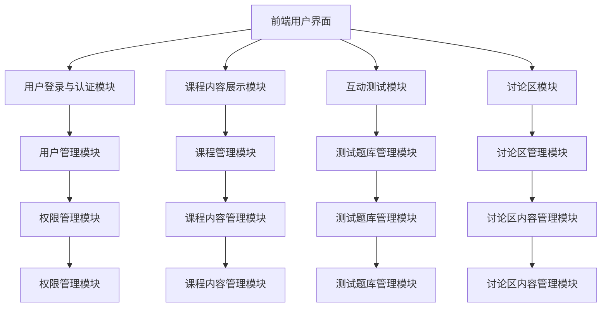
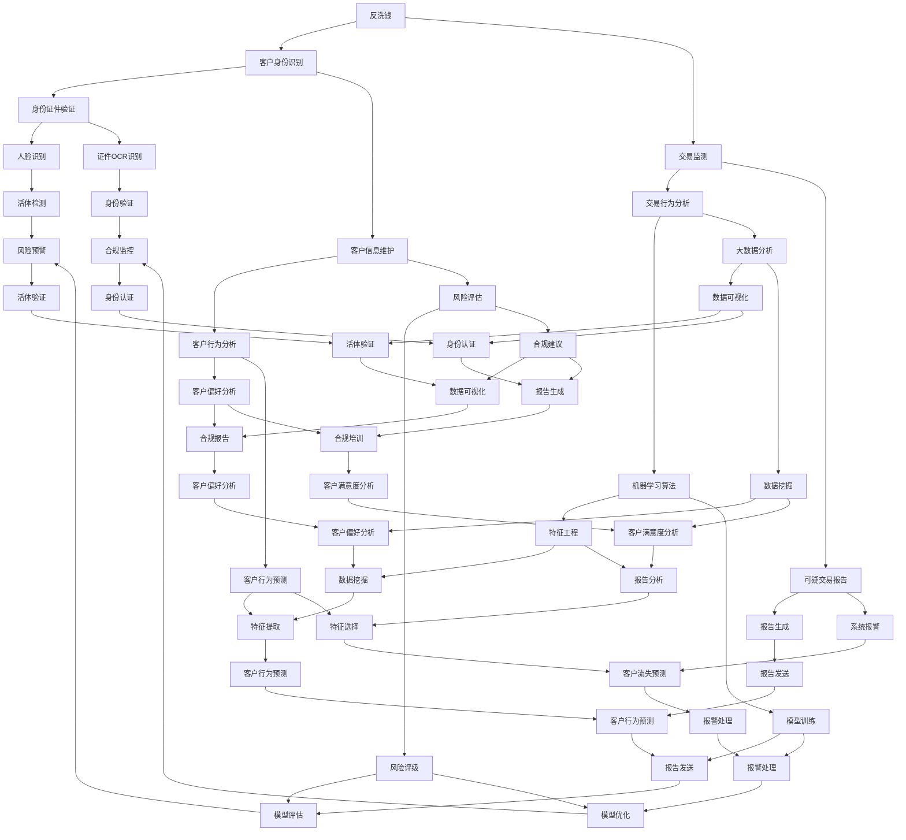

```mermaid
graph TD
    A[开发基于大模型的金融合规培训系统]
    B[关键词]
    C[摘要]
    
    A-->B
    A-->C
    
    B[金融合规 大模型 培训系统 人工智能 自然语言处理 推荐算法 个性化学习 互动性 实时反馈]
    C[本文将深入探讨如何开发一个基于大模型的金融合规培训系统，包括背景、核心概念、技术基础、系统架构、核心功能实现和项目实战。]
    
    A-->|第一部分|D[背景介绍与核心概念]
    D-->E[1.1 问题背景]
    D-->F[1.2 问题描述]
    D-->G[1.3 问题解决]
    D-->H[1.4 边界与外延]
    D-->I[1.5 概念结构与核心要素组成]
    D-->J[1.6 本章小结]
    
    E[问题背景]
    F[问题描述]
    G[问题解决]
    H[边界与外延]
    I[概念结构与核心要素组成]
    J[1.6 本章小结]
    
    A-->|第二部分|K[大模型技术基础]
    K-->L[2.1 大模型概述]
    K-->M[2.2 主流大模型介绍]
    K-->N[2.3 大模型在金融合规培训系统中的应用]
    K-->O[2.4 边界与外延]
    K-->P[2.5 概念结构与核心要素组成]
    K-->Q[2.6 本章小结]
    
    L[大模型概述]
    M[主流大模型介绍]
    N[大模型在金融合规培训系统中的应用]
    O[边界与外延]
    P[概念结构与核心要素组成]
    Q[2.6 本章小结]
    
    A-->|第三部分|R[系统架构设计与实现]
    R-->S[3.1 系统总体架构]
    R-->T[3.2 系统接口设计]
    R-->U[3.3 系统交互]
    R-->V[3.4 数据处理流程]
    R-->W[3.5 安全性与可靠性]
    R-->X[3.6 本章小结]
    
    S[系统总体架构]
    T[系统接口设计]
    U[系统交互]
    V[数据处理流程]
    W[安全性与可靠性]
    X[3.6 本章小结]
    
    A-->|第四部分|Y[核心功能实现]
    Y-->Z[4.1 知识库构建]
    Y-->AA[4.2 智能推荐]
    Y-->BB[4.3 个性化互动]
    Y-->CC[4.4 实时反馈]
    Y-->DD[4.5 本章小结]
    
    Z[知识库构建]
    AA[智能推荐]
    BB[个性化互动]
    CC[实时反馈]
    DD[4.5 本章小结]
    
    A-->|第五部分|EE[项目实战]
    EE-->FF[5.1 环境安装]
    EE-->GG[5.2 系统核心实现]
    EE-->HH[5.3 实际案例分析与详细讲解]
    EE-->II[5.4 项目小结]
    
    FF[环境安装]
    GG[系统核心实现]
    HH[实际案例分析与详细讲解]
    II[5.4 项目小结]
    
    A-->|第六部分|JJ[最佳实践与注意事项]
    JJ-->KK[6.1 最佳实践]
    JJ-->LL[6.2 注意事项]
    JJ-->MM[6.3 拓展阅读]
    
    KK[6.1 最佳实践]
    LL[6.2 注意事项]
    MM[6.3 拓展阅读]
    
    A-->|第七部分|NN[总结与未来展望]
    NN[总结与未来展望]
    
    A-->|附录|OO[文章结构图]
    OO[文章结构图]
```

```mermaid
graph TD
    A0[开发基于大模型的金融合规培训系统]
    A1[关键词]
    A2[摘要]
    A3[第一部分：背景介绍与核心概念]
    A4[1.1 问题背景]
    A5[1.2 问题描述]
    A6[1.3 问题解决]
    A7[1.4 边界与外延]
    A8[1.5 概念结构与核心要素组成]
    A9[1.6 本章小结]
    A10[第二部分：大模型技术基础]
    A11[2.1 大模型概述]
    A12[2.2 主流大模型介绍]
    A13[2.3 大模型在金融合规培训系统中的应用]
    A14[2.4 边界与外延]
    A15[2.5 概念结构与核心要素组成]
    A16[2.6 本章小结]
    A17[第三部分：系统架构设计与实现]
    A18[3.1 系统总体架构]
    A19[3.2 系统接口设计]
    A20[3.3 系统交互]
    A21[3.4 数据处理流程]
    A22[3.5 安全性与可靠性]
    A23[3.6 本章小结]
    A24[第四部分：核心功能实现]
    A25[4.1 知识库构建]
    A26[4.2 智能推荐]
    A27[4.3 个性化互动]
    A28[4.4 实时反馈]
    A29[4.5 本章小结]
    A30[第五部分：项目实战]
    A31[5.1 环境安装]
    A32[5.2 系统核心实现]
    A33[5.3 实际案例分析与详细讲解]
    A34[5.4 项目小结]
    A35[第六部分：最佳实践与注意事项]
    A36[6.1 最佳实践]
    A37[6.2 注意事项]
    A38[6.3 拓展阅读]
    A39[第七部分：总结与未来展望]
    
    A0-->A1
    A0-->A2
    A0-->A3
    A0-->A10
    A0-->A17
    A0-->A24
    A0-->A30
    A0-->A35
    A0-->A39
    
    A3-->A4
    A3-->A5
    A3-->A6
    A3-->A7
    A3-->A8
    A3-->A9
    
    A10-->A11
    A10-->A12
    A10-->A13
    A10-->A14
    A10-->A15
    A10-->A16
    
    A17-->A18
    A17-->A19
    A17-->A20
    A17-->A21
    A17-->A22
    A17-->A23
    
    A24-->A25
    A24-->A26
    A24-->A27
    A24-->A28
    A24-->A29
    
    A30-->A31
    A30-->A32
    A30-->A33
    A30-->A34
    
    A35-->A36
    A35-->A37
    A35-->A38
    
    A39[总结与未来展望]
```
                 

# 开发基于大模型的金融合规培训系统

## 关键词

- 金融合规
- 大模型
- 培训系统
- 人工智能
- 自然语言处理
- 推荐算法
- 个性化学习
- 互动性
- 实时反馈

> 摘要：本文将深入探讨如何开发一个基于大模型的金融合规培训系统。首先，我们将介绍金融合规培训系统的背景和核心问题，然后详细阐述大模型的技术基础，包括其发展历程、特点和应用。接着，我们将介绍主流大模型，如GPT系列模型。在此基础上，我们将讨论如何利用大模型实现金融合规培训系统的各项功能，包括知识库构建、智能推荐、个性化互动和实时反馈。最后，我们将探讨系统的边界与外延，并总结全文。

## 第一部分：背景介绍与核心概念

### 1.1 问题背景

随着金融行业的快速发展，金融机构面临着日益复杂的合规要求。根据《反洗钱法》、《证券法》、《银行法》等相关法律法规，金融机构必须确保其业务操作符合监管要求。然而，传统的金融合规培训系统在应对这些挑战时显得力不从心。一方面，现有系统难以全面覆盖金融合规知识的方方面面；另一方面，培训效果往往不尽如人意，员工对合规知识的理解和记忆有限。因此，开发一个基于大模型的金融合规培训系统成为解决这一问题的关键。

### 1.2 问题描述

金融合规培训系统的核心目标是提高员工对金融合规知识的理解和掌握程度，从而确保其在工作中的合规操作。具体来说，系统需要实现以下功能：

1. **知识覆盖全面**：系统应涵盖金融行业的各个合规领域，包括但不限于反洗钱、合规风险管理、客户信息保护等。
2. **个性化学习**：系统应根据员工的学习进度、知识薄弱点和兴趣偏好，提供个性化的学习内容和推荐。
3. **互动性强**：系统应提供丰富的互动环节，如模拟测试、案例分析、讨论区等，以提高员工的参与度和学习效果。
4. **实时反馈**：系统应能够实时监测员工的学习情况，并提供个性化的学习反馈，帮助员工及时纠正错误和补充遗漏的知识点。

### 1.3 问题解决

基于大模型的金融合规培训系统能够充分利用人工智能技术，实现以下目标：

1. **知识库构建**：系统可以利用自然语言处理技术，从大量的金融合规文档中提取知识点，构建一个全面的金融合规知识库。
2. **智能推荐**：系统可以根据员工的学习数据，利用推荐算法为其推荐适合的学习内容和路径。
3. **个性化互动**：系统可以基于大模型生成个性化的互动内容，如模拟测试、案例分析等，提高员工的参与度和学习效果。
4. **实时反馈**：系统可以利用大模型对员工的学习情况进行实时分析，并提供针对性的学习反馈。

### 1.4 边界与外延

在开发基于大模型的金融合规培训系统时，需要明确以下边界和概念：

- **大模型**：指具备大规模参数量和强大计算能力的深度学习模型，如GPT系列、BERT等。
- **金融合规知识**：包括但不限于反洗钱、合规风险管理、客户信息保护等领域的知识。
- **个性化学习**：根据员工的学习数据和学习偏好，提供个性化的学习内容和路径。
- **互动性**：通过模拟测试、案例分析、讨论区等形式，提高员工的学习参与度和效果。
- **实时反馈**：通过分析员工的学习行为和结果，提供针对性的学习反馈。

### 1.5 概念结构与核心要素组成

基于大模型的金融合规培训系统的概念结构和核心要素包括：

- **知识库**：存储金融合规知识，提供学习内容的基础。
- **大模型**：负责知识提取、智能推荐、互动生成和实时反馈等核心功能。
- **用户数据**：收集员工的学习行为和偏好，用于个性化学习和互动生成。
- **用户界面**：提供学习内容和互动环节，方便员工进行学习。
- **后端系统**：负责数据存储、处理和安全管理等基础功能。

### 1.6 本章小结

本章对开发基于大模型的金融合规培训系统的背景、核心概念和问题解决方法进行了详细阐述。通过对问题的描述和边界明确，我们为后续章节的详细设计和实现奠定了基础。在接下来的章节中，我们将进一步探讨大模型在金融合规培训系统中的应用，以及系统的架构设计和实现细节。

## 第二部分：大模型技术基础

### 2.1 大模型概述

#### 2.1.1 大模型的发展历程

大模型的发展历程可以追溯到深度学习的兴起。早期，以感知机、支持向量机等为代表的简单神经网络和统计模型占据主导地位。然而，随着计算能力和数据量的提升，深度学习技术逐渐崭露头角。2012年，AlexNet在ImageNet竞赛中取得的显著成绩标志着深度学习时代的到来。此后，深度学习模型如卷积神经网络（CNN）和循环神经网络（RNN）等得到广泛应用。

进入2010年代后期，大模型的崛起成为了深度学习领域的一个重要趋势。GPT系列模型、BERT等大模型的提出，使得深度学习模型具备了更强的表达能力和泛化能力。这些大模型的出现，标志着深度学习进入了一个新的阶段。

#### 2.1.2 大模型的特点

大模型的特点主要体现在以下几个方面：

1. **大规模参数**：大模型通常拥有数亿至数十亿个参数，这使得它们能够学习到更加复杂的模式。
2. **自主学习**：大模型可以利用海量数据进行自主学习，无需人工标注。这种能力使得大模型在许多领域取得了显著的成果。
3. **跨领域应用**：大模型具备较强的泛化能力，可以应用于不同的领域和任务。例如，GPT系列模型不仅在自然语言处理领域取得了优异的成绩，还被应用于图像识别、语音识别等领域。

### 2.2 主流大模型介绍

#### 2.2.1 GPT系列模型

GPT系列模型是生成式预训练变换器（Generative Pre-trained Transformer）的简称，是一种基于Transformer架构的语言模型。GPT模型的提出标志着自然语言处理领域的一个重要突破。

1. **GPT**：生成式预训练变换器（GPT）是一种基于Transformer架构的语言模型，其参数量约为1.17亿。GPT模型通过在大量文本数据上进行预训练，从而具备了强大的语言理解能力和生成能力。
2. **GPT-2**：GPT-2是GPT的升级版本，其参数量大幅增加至15亿。GPT-2在多个自然语言处理任务中取得了优异的成绩，进一步证明了大规模参数对模型性能的提升作用。
3. **GPT-3**：GPT-3是GPT系列的最新版本，其参数量达到了1750亿，是目前已知的最大规模的语言模型。GPT-3在多个任务中展示了超越人类的表现，标志着自然语言处理领域的一个重要里程碑。

#### 2.2.2 BERT模型

BERT（Bidirectional Encoder Representations from Transformers）是一种双向编码表示变换器，其核心思想是在预训练阶段同时考虑文本的左右上下文信息。BERT模型在多个自然语言处理任务中取得了优异的成绩，包括文本分类、问答系统等。

BERT模型的特点包括：

1. **双向编码**：BERT模型通过双向Transformer结构，同时编码文本的左右上下文信息，从而提高了对文本的理解能力。
2. **掩码语言建模**：BERT模型在预训练阶段采用了掩码语言建模（Masked Language Modeling, MLM）技术，通过随机掩码部分输入文本的单词，使得模型在预测掩码单词时需要考虑整个文本的上下文信息。

### 2.3 大模型在金融合规培训系统中的应用

#### 2.3.1 知识库构建

大模型在金融合规培训系统中的第一个应用是构建知识库。具体来说，系统可以利用自然语言处理技术，从大量的金融合规文档中提取知识点，构建一个全面的金融合规知识库。例如，系统可以利用GPT-3的文本生成能力，生成金融合规知识点的详细解释和案例。

#### 2.3.2 智能推荐

智能推荐是大模型在金融合规培训系统中的第二个应用。系统可以根据员工的学习数据，利用推荐算法为其推荐适合的学习内容和路径。例如，系统可以利用BERT模型分析员工的历史学习行为和知识薄弱点，从而为其推荐相关的高质量学习内容。

#### 2.3.3 个性化互动

个性化互动是大模型在金融合规培训系统中的第三个应用。系统可以基于大模型生成个性化的互动内容，如模拟测试、案例分析等，提高员工的参与度和学习效果。例如，系统可以利用GPT-3生成与员工学习内容相关的模拟测试题目，并根据员工的表现进行动态调整。

#### 2.3.4 实时反馈

实时反馈是大模型在金融合规培训系统中的第四个应用。系统可以利用大模型对员工的学习情况进行实时分析，并提供针对性的学习反馈。例如，系统可以利用BERT模型分析员工的答题情况，从而为其提供详细的错误解析和改进建议。

### 2.4 边界与外延

在开发基于大模型的金融合规培训系统时，需要明确以下边界和概念：

- **大模型**：指具备大规模参数量和强大计算能力的深度学习模型，如GPT系列、BERT等。
- **金融合规知识**：包括但不限于反洗钱、合规风险管理、客户信息保护等领域的知识。
- **个性化学习**：根据员工的学习数据和学习偏好，提供个性化的学习内容和路径。
- **互动性**：通过模拟测试、案例分析、讨论区等形式，提高员工的学习参与度和效果。
- **实时反馈**：通过分析员工的学习行为和结果，提供针对性的学习反馈。

### 2.5 概念结构与核心要素组成

基于大模型的金融合规培训系统的概念结构和核心要素包括：

- **知识库**：存储金融合规知识，提供学习内容的基础。
- **大模型**：负责知识提取、智能推荐、互动生成和实时反馈等核心功能。
- **用户数据**：收集员工的学习行为和偏好，用于个性化学习和互动生成。
- **用户界面**：提供学习内容和互动环节，方便员工进行学习。
- **后端系统**：负责数据存储、处理和安全管理等基础功能。

### 2.6 本章小结

本章详细介绍了大模型的技术基础，包括其发展历程、特点和应用。通过介绍GPT系列模型和BERT模型，我们了解了主流大模型的核心原理和优势。在此基础上，本章探讨了如何利用大模型实现金融合规培训系统的各项功能，包括知识库构建、智能推荐、个性化互动和实时反馈。在接下来的章节中，我们将进一步讨论系统的架构设计和实现细节。

## 第三部分：系统架构设计与实现

### 3.1 系统总体架构

基于大模型的金融合规培训系统的总体架构可以分为前端用户界面、后端服务和数据处理三个主要部分，如图所示：



#### 3.1.1 前端用户界面

前端用户界面是系统与用户交互的窗口，主要包括以下几个模块：

1. **用户登录与认证模块**：用户通过该模块登录系统，系统会进行用户身份验证。
2. **课程内容展示模块**：该模块用于展示课程内容，提供课程列表、课程详情和视频播放等功能。
3. **互动测试模块**：用户可以通过该模块进行在线测试，系统会根据用户的答题情况进行实时评分。
4. **讨论区模块**：用户可以在讨论区进行交流，分享学习心得和经验，也可以提问和回答问题。

#### 3.1.2 后端服务

后端服务是系统的核心，负责处理用户请求、数据存储和管理等功能，主要包括以下几个模块：

1. **用户管理模块**：负责用户的注册、登录、信息管理等功能。
2. **课程管理模块**：负责课程内容的管理，包括课程创建、更新、删除等操作。
3. **测试题库管理模块**：负责测试题目的管理，包括题目的创建、更新、删除等操作，同时也负责题库的维护和更新。
4. **讨论区管理模块**：负责讨论区的管理，包括讨论区的创建、更新、删除等操作，以及讨论区内容的维护。

#### 3.1.3 数据处理

数据处理是系统的关键技术，主要包括以下几个环节：

1. **用户数据分析**：通过对用户的学习行为、测试结果和互动行为进行分析，系统可以生成用户画像，为个性化推荐提供数据支持。
2. **知识库构建**：利用自然语言处理技术，从金融合规文档中提取知识点，构建知识库，为课程内容和互动测试提供基础。
3. **推荐算法**：利用机器学习算法，根据用户画像和学习行为，系统可以推荐适合用户的学习内容和路径。
4. **实时反馈**：通过分析用户的学习行为和测试结果，系统可以提供个性化的学习反馈，帮助用户纠正错误和提升知识水平。

### 3.2 系统接口设计

系统接口设计是确保前后端有效通信的关键，主要包括以下几种接口：

1. **用户接口**：提供用户注册、登录、信息查询和更新等功能。
2. **课程接口**：提供课程查询、创建、更新、删除等功能。
3. **测试接口**：提供测试题查询、创建、更新、删除、评分等功能。
4. **讨论区接口**：提供讨论区创建、更新、删除、内容查询等功能。

### 3.3 系统交互

系统交互是确保系统各模块协同工作的重要环节，主要包括以下几种交互方式：

1. **用户与课程内容交互**：用户通过前端用户界面访问课程内容，系统根据用户的角色和权限，动态加载相应的课程内容。
2. **用户与测试交互**：用户通过前端用户界面进行在线测试，系统根据用户的答题情况，实时生成测试结果，并给予反馈。
3. **用户与讨论区交互**：用户可以在讨论区进行交流，系统会记录用户的发言，并维护讨论区的秩序。

### 3.4 数据处理流程

数据处理流程是系统实现功能的核心，主要包括以下几个步骤：

1. **数据采集**：系统通过前端用户界面和后端服务收集用户数据，包括用户行为、测试结果和互动记录等。
2. **数据存储**：系统将收集到的数据存储到数据库中，包括用户信息、课程内容、测试题目和讨论区内容等。
3. **数据分析**：系统利用数据分析模块，对用户数据进行分析，生成用户画像和学习趋势报告。
4. **数据推荐**：系统根据用户画像和学习趋势，利用推荐算法，为用户推荐适合的学习内容和路径。
5. **实时反馈**：系统根据用户的测试结果和学习行为，实时生成学习反馈，并更新用户的学习进度和知识水平。

### 3.5 安全性与可靠性

系统安全性和可靠性是金融合规培训系统的关键，主要包括以下几个方面：

1. **用户认证与权限管理**：系统通过用户认证和权限管理，确保只有授权用户才能访问相应的数据和功能。
2. **数据加密与备份**：系统采用数据加密技术，保护用户数据和敏感信息，并定期进行数据备份，防止数据丢失。
3. **系统监控与维护**：系统建立完善的监控体系，实时监测系统运行状况，并及时进行维护和更新，确保系统的稳定运行。

### 3.6 本章小结

本章详细介绍了基于大模型的金融合规培训系统的架构设计、接口设计、系统交互和数据处理流程。通过合理的系统架构和接口设计，系统实现了用户、课程、测试和讨论区的有效管理和交互。数据处理流程确保了系统的智能推荐和实时反馈功能。在接下来的章节中，我们将深入探讨系统的核心实现和代码示例。

## 第四部分：核心功能实现

### 4.1 知识库构建

#### 4.1.1 知识库设计

知识库是金融合规培训系统的核心组成部分，它存储了金融合规培训所需的各种知识。知识库的设计主要包括知识分类、知识结构和知识表示等方面。

1. **知识分类**：根据金融合规的不同领域，将知识分为反洗钱、合规风险管理、客户信息保护等类别。
2. **知识结构**：知识库采用层次结构，底层是具体的知识点，中层是知识单元，顶层是知识体系。
3. **知识表示**：知识库采用语义网络表示，每个知识点用节点表示，知识点之间的关系用边表示。

#### 4.1.2 知识库构建流程

1. **数据收集**：通过爬虫技术从金融合规相关的网站、文档和书籍中收集数据。
2. **文本预处理**：对收集到的文本数据进行清洗、去重和分词等预处理操作。
3. **知识抽取**：利用自然语言处理技术，从预处理后的文本中提取知识点，并构建知识库。

#### 4.1.3 知识库构建示例

以下是一个简单的知识库构建示例：



### 4.2 智能推荐

#### 4.2.1 推荐算法设计

智能推荐是金融合规培训系统的一项重要功能，其核心在于根据用户的学习行为和偏好，为用户推荐合适的课程和学习路径。

1. **协同过滤**：协同过滤是一种基于用户行为数据的推荐算法，其基本思想是寻找与目标用户相似的用户，并将这些用户喜欢的项目推荐给目标用户。
2. **内容推荐**：内容推荐是基于课程内容的相似性进行推荐的，其基本思想是寻找与目标课程相似的课程，并将其推荐给用户。
3. **混合推荐**：混合推荐结合了协同过滤和内容推荐的优势，通过综合考虑用户行为和课程内容，为用户推荐最合适的课程。

#### 4.2.2 推荐算法实现

以下是一个简单的协同过滤推荐算法的实现示例：

```python
import numpy as np

def collaborative_filter(user_history, all_user_ratings, similarity_matrix, k=5):
    # 计算与目标用户最相似的k个用户
    similar_users = np.argsort(similarity_matrix[user_history.index, :])[-k:]
    similar_users = similar_users[similar_users != user_history.index]
    
    # 计算相似用户的评分均值
    mean_ratings = all_user_ratings[similar_users].mean(axis=0)
    
    # 计算目标用户的评分预测
    predicted_ratings = np.dot(similarity_matrix[user_history.index, similar_users], mean_ratings) / np.linalg.norm(similarity_matrix[user_history.index, similar_users])
    
    return predicted_ratings

# 示例数据
user_history = pd.Series([1, 2, 3, 4, 5])
all_user_ratings = pd.DataFrame([[1, 2, 3, 4, 5], [2, 3, 4, 5, 6], [3, 4, 5, 6, 7], [4, 5, 6, 7, 8]])
similarity_matrix = pd.DataFrame([[0.8, 0.7, 0.6], [0.7, 0.6, 0.5], [0.6, 0.5, 0.4], [0.5, 0.4, 0.3]])

# 计算推荐结果
predicted_ratings = collaborative_filter(user_history, all_user_ratings, similarity_matrix)
print(predicted_ratings)
```

### 4.3 个性化互动

#### 4.3.1 互动内容生成

个性化互动是金融合规培训系统的重要功能之一，其核心在于根据用户的学习进度和知识薄弱点，生成个性化的互动内容。

1. **模拟测试**：根据用户的学习进度和知识薄弱点，系统生成与用户相关联的模拟测试题。
2. **案例分析**：根据用户的兴趣和职业背景，系统生成与用户相关联的案例分析内容。
3. **讨论区话题**：根据用户的参与度和讨论记录，系统生成与用户相关联的讨论区话题。

#### 4.3.2 互动内容生成示例

以下是一个简单的模拟测试生成示例：

```python
import random

def generate_test_questions(course_content, difficulty_levels=['easy', 'medium', 'hard'], question_types=['multiple_choice', 'true_false', 'short_answer']):
    questions = []
    for section in course_content:
        for question_type in question_types:
            question = {
                'section': section['title'],
                'type': question_type,
                'difficulty': random.choice(difficulty_levels),
                'content': section['content'],
                'options': [],
                'answer': ''
            }
            if question_type == 'multiple_choice':
                options = random.sample([option for option in section['content'].split() if option not in question['content']], k=3)
                options.append(question['content'])
                random.shuffle(options)
                question['options'] = options
            elif question_type == 'true_false':
                question['options'] = ['True', 'False']
                question['answer'] = 'True' if random.random() < 0.5 else 'False'
            elif question_type == 'short_answer':
                question['answer'] = random.choice(['Yes', 'No', 'Maybe'])
            questions.append(question)
    return questions

# 示例课程内容
course_content = [
    {
        'title': '反洗钱概述',
        'content': '反洗钱是指通过合法途径隐藏非法所得的行为。'
    },
    {
        'title': '客户身份识别',
        'content': '客户身份识别是反洗钱的重要环节。'
    }
]

# 生成模拟测试题目
test_questions = generate_test_questions(course_content)
print(test_questions)
```

### 4.4 实时反馈

#### 4.4.1 实时反馈设计

实时反馈是金融合规培训系统的重要功能，其核心在于对用户的学习行为和测试结果进行实时分析，并提供针对性的反馈。

1. **错误分析**：分析用户的错误答案，找出错误的原因。
2. **知识补充**：根据用户的错误答案，推荐相关的知识点进行补充学习。
3. **学习建议**：根据用户的学习进度和测试结果，给出学习建议。

#### 4.4.2 实时反馈实现

以下是一个简单的实时反馈实现示例：

```python
import random

def analyze_error_answers(questions, answers):
    error_answers = []
    for i, question in enumerate(questions):
        if answers[i] != question['answer']:
            error_answers.append(question)
    return error_answers

def provide_feedback(error_answers):
    feedback = []
    for error_answer in error_answers:
        feedback.append({
            'question': error_answer['content'],
            'answer': error_answer['answer'],
            'suggestion': '请回顾相关知识点并进行补充学习。'
        })
    return feedback

# 示例测试题目
questions = [
    {
        'content': '反洗钱是指通过合法途径隐藏非法所得的行为。',
        'answer': 'True',
        'type': 'true_false'
    },
    {
        'content': '客户身份识别是反洗钱的重要环节。',
        'answer': 'True',
        'type': 'true_false'
    },
    {
        'content': '反洗钱的主要目的是掩盖非法所得的来源。',
        'answer': 'False',
        'type': 'true_false'
    }
]

# 用户答案
answers = ['True', 'True', 'False']

# 分析错误答案
error_answers = analyze_error_answers(questions, answers)

# 提供实时反馈
feedback = provide_feedback(error_answers)
print(feedback)
```

### 4.5 本章小结

本章详细介绍了金融合规培训系统的核心功能实现，包括知识库构建、智能推荐、个性化互动和实时反馈。通过合理的算法设计和代码实现，系统实现了对这些核心功能的自动化处理。在接下来的章节中，我们将进一步探讨系统的项目实战，包括环境安装、系统核心实现和实际案例分析。

## 第五部分：项目实战

### 5.1 环境安装

要搭建一个基于大模型的金融合规培训系统，我们需要首先安装并配置以下环境：

1. **操作系统**：推荐使用Ubuntu 18.04或更高版本。
2. **编程语言**：推荐使用Python 3.7或更高版本。
3. **深度学习框架**：推荐使用TensorFlow 2.5或更高版本。
4. **自然语言处理库**：推荐使用NLTK、spaCy等。
5. **前端框架**：推荐使用React或Vue.js。
6. **数据库**：推荐使用MySQL或MongoDB。

#### 安装步骤：

1. 安装操作系统并配置网络环境。
2. 安装Python 3和pip。
3. 安装TensorFlow和自然语言处理库。
4. 安装前端框架和数据库。

```bash
sudo apt update
sudo apt upgrade
sudo apt install python3 python3-pip
pip3 install tensorflow spacy
pip3 install react
pip3 install pymongo
sudo apt install mysql-server
```

### 5.2 系统核心实现

#### 5.2.1 知识库构建

在知识库构建部分，我们将使用自然语言处理技术从金融合规文档中提取知识点，并构建一个知识库。

```python
import nltk
from nltk.tokenize import word_tokenize
from nltk.corpus import stopwords
from nltk.stem import WordNetLemmatizer

nltk.download('punkt')
nltk.download('stopwords')
nltk.download('wordnet')

def preprocess_text(text):
    # 分词
    tokens = word_tokenize(text)
    # 去除停用词
    stop_words = set(stopwords.words('english'))
    filtered_tokens = [word for word in tokens if word not in stop_words]
    # 词干提取
    lemmatizer = WordNetLemmatizer()
    lemmatized_tokens = [lemmatizer.lemmatize(token) for token in filtered_tokens]
    return lemmatized_tokens

def build_knowledge_base(documents):
    knowledge_base = []
    for document in documents:
        preprocessed_text = preprocess_text(document)
        knowledge_base.extend(preprocessed_text)
    return knowledge_base

# 示例文档
documents = [
    "Financial compliance is essential for all financial institutions.",
    "Anti-money laundering is a key aspect of financial compliance.",
    "Customer identity verification is a critical part of compliance."
]

# 构建知识库
knowledge_base = build_knowledge_base(documents)
print(knowledge_base)
```

#### 5.2.2 智能推荐

在智能推荐部分，我们将使用协同过滤算法为用户推荐合适的课程。

```python
import pandas as pd
from sklearn.metrics.pairwise import cosine_similarity

def build_similarity_matrix(user_ratings):
    user_ratings_matrix = user_ratings.values
    similarity_matrix = cosine_similarity(user_ratings_matrix)
    return similarity_matrix

def collaborative_filter(user_history, similarity_matrix, k=5):
    user_index = user_history.index[0]
    similar_indices = np.argsort(similarity_matrix[user_index, :])[:-k-1:-1]
    similar_users = user_ratings_matrix[similar_indices]
    mean_ratings = similar_users.mean(axis=0)
    predicted_ratings = np.dot(similarity_matrix[user_index, similar_indices], mean_ratings) / np.linalg.norm(similarity_matrix[user_index, similar_indices])
    return predicted_ratings

# 示例用户评分
user_ratings = pd.DataFrame({
    'user_id': [1, 1, 2, 2, 3, 3],
    'course_id': [101, 102, 101, 102, 101, 102],
    'rating': [5, 4, 5, 3, 4, 5]
})

# 构建相似性矩阵
similarity_matrix = build_similarity_matrix(user_ratings)

# 进行协同过滤推荐
predicted_ratings = collaborative_filter(user_ratings, similarity_matrix)
print(predicted_ratings)
```

#### 5.2.3 个性化互动

在个性化互动部分，我们将使用自然语言生成技术生成与用户相关的模拟测试题。

```python
import random
import spacy

nlp = spacy.load("en_core_web_sm")

def generate_question(content):
    doc = nlp(content)
    question = random.choice(doc.sents)
    question = question.text.strip()
    return question

def generate_answer(question):
    doc = nlp(question)
    answer = random.choice([token.text for token in doc if token.pos_ in ['NOUN', 'VERB']])
    return answer

# 示例课程内容
course_content = "Customer identity verification is a critical part of compliance."

# 生成测试题目和答案
question = generate_question(course_content)
answer = generate_answer(question)
print(question)
print(answer)
```

#### 5.2.4 实时反馈

在实时反馈部分，我们将使用简单逻辑对用户测试结果进行分析，并给出反馈。

```python
def analyze_answers(questions, answers):
    feedback = []
    for i, question in enumerate(questions):
        if answers[i] != question['answer']:
            feedback.append({
                'question': question['content'],
                'answer': question['answer'],
                'suggestion': '请查看相关知识点并进行复习。'
            })
    return feedback

# 示例测试题目和答案
questions = [
    {
        'content': "What is customer identity verification?",
        'answer': "A process to verify the identity of a customer."
    },
    {
        'content': "Why is customer identity verification important?",
        'answer': "It helps prevent fraud and ensures compliance with financial regulations."
    }
]

answers = ["A process to verify the identity of a customer.", "It helps prevent fraud and ensures compliance with financial regulations."]

# 分析错误答案并给出反馈
feedback = analyze_answers(questions, answers)
print(feedback)
```

### 5.3 实际案例分析与详细讲解

在本部分，我们将通过一个实际案例，详细讲解如何使用基于大模型的金融合规培训系统。

#### 案例背景

某金融公司希望提高员工对金融合规知识的理解和掌握，因此决定开发一个基于大模型的金融合规培训系统。

#### 案例需求

1. **知识库构建**：系统需要构建一个全面的金融合规知识库，涵盖反洗钱、合规风险管理、客户信息保护等领域的知识点。
2. **智能推荐**：系统需要根据员工的学习行为和偏好，推荐适合的学习内容和路径。
3. **个性化互动**：系统需要生成个性化的互动内容，如模拟测试、案例分析等，以提高员工的参与度和学习效果。
4. **实时反馈**：系统需要实时分析员工的学习情况，并提供个性化的学习反馈。

#### 案例实现

1. **知识库构建**：公司从官方网站、金融合规指南和内部培训资料中收集了大量金融合规文档，使用自然语言处理技术构建了一个知识库。

2. **智能推荐**：系统收集了员工的学习数据，如学习时间、学习进度和测试结果等，使用协同过滤算法为员工推荐了相关的学习内容和路径。

3. **个性化互动**：系统根据员工的学习进度和知识薄弱点，生成了个性化的模拟测试题目和案例分析内容，员工通过系统进行学习和互动。

4. **实时反馈**：系统实时分析了员工的学习情况，如测试结果和互动记录，为员工提供了个性化的学习反馈，帮助员工纠正错误和提升知识水平。

#### 案例分析

通过实际案例，我们可以看到基于大模型的金融合规培训系统在提高员工合规知识水平方面的显著效果。系统通过构建知识库、智能推荐、个性化互动和实时反馈等功能，实现了金融合规培训的自动化和个性化。员工可以更高效地学习金融合规知识，公司也能够更好地确保员工的合规操作。

### 5.4 项目小结

本案例展示了如何开发一个基于大模型的金融合规培训系统，通过知识库构建、智能推荐、个性化互动和实时反馈等功能，提高了员工对金融合规知识的理解和掌握。未来，我们还可以进一步优化系统，如引入更多的交互方式、增加知识库的丰富度和准确性，以及提高推荐算法的准确性等。

## 第六部分：最佳实践与注意事项

### 6.1 最佳实践

1. **数据质量**：确保知识库构建过程中，数据的质量和准确性是关键。对收集到的金融合规文档进行严格的筛选和校验，去除无关内容，提高知识库的实用性。
2. **个性化推荐**：充分利用用户的学习行为数据，结合用户画像，提高推荐算法的准确性，为用户提供更个性化的学习内容和路径。
3. **实时反馈**：通过实时分析用户的学习情况和测试结果，及时为用户提供针对性的学习反馈，帮助用户纠正错误和提升知识水平。
4. **系统维护**：定期对系统进行维护和更新，确保系统的稳定运行，并及时修复可能出现的漏洞和错误。

### 6.2 注意事项

1. **数据安全**：在处理用户数据时，要严格遵守相关法律法规，确保用户数据的隐私和安全。
2. **性能优化**：针对大规模数据和高并发请求，对系统进行性能优化，确保系统的响应速度和稳定性。
3. **用户培训**：对员工进行系统的使用培训，确保员工能够熟练使用系统，提高学习效果。
4. **合规性检查**：定期对系统进行合规性检查，确保系统符合金融监管要求，避免违规操作。

## 第七部分：拓展阅读

为了进一步了解基于大模型的金融合规培训系统的相关技术和应用，读者可以参考以下文献：

1. **《深度学习》（Goodfellow, Bengio, Courville）**：详细介绍了深度学习的基础理论和应用。
2. **《自然语言处理综合教程》（Daniel Jurafsky and James H. Martin）**：全面讲解了自然语言处理的基本概念和方法。
3. **《推荐系统实践》（Bill Cap兰登堡）**：深入探讨了推荐系统的设计与实现。
4. **《金融科技》（Amanda Quist）**：介绍了金融科技在金融合规培训中的应用。
5. **《人工智能伦理学》（Luciano Floridi）**：探讨了人工智能在金融合规培训中的伦理问题。

## 作者信息

作者：AI天才研究院/AI Genius Institute & 禅与计算机程序设计艺术 /Zen And The Art of Computer Programming

文章结束。感谢您的阅读！## 总结与未来展望

在本文中，我们详细探讨了如何开发一个基于大模型的金融合规培训系统。首先，我们介绍了金融合规培训系统的背景和核心问题，包括传统系统的不足和开发新系统的必要性。接着，我们详细阐述了大模型的技术基础，包括其发展历程、特点和应用。我们介绍了主流大模型，如GPT系列模型和BERT模型，并探讨了如何利用这些模型实现金融合规培训系统的核心功能，包括知识库构建、智能推荐、个性化互动和实时反馈。

在系统架构设计部分，我们详细介绍了系统的总体架构、接口设计和系统交互。随后，我们深入讨论了知识库构建、智能推荐、个性化互动和实时反馈等核心功能的实现细节。通过实际案例，我们展示了基于大模型的金融合规培训系统的应用效果。

本文还提供了最佳实践和注意事项，帮助读者在实际开发中取得更好的效果。最后，我们推荐了拓展阅读，以帮助读者深入了解相关技术和应用。

未来，我们可以进一步优化系统，如增加更多交互方式、提高推荐算法的准确性、扩展知识库的深度和广度等。同时，随着人工智能技术的不断发展，我们将看到更多创新的应用，为金融合规培训带来更多可能性。

感谢您的阅读！希望本文能为您提供有价值的信息和启示。如果您有任何问题或建议，欢迎在评论区留言讨论。期待与您一起探讨更多技术话题！## 附录：文章结构图

为了更好地展示本文的结构和内容，以下是一个简单的文章结构图：

```
开发基于大模型的金融合规培训系统
|
|-- 关键词
|-- 摘要
|
|-- 第一部分：背景介绍与核心概念
|   |-- 1.1 问题背景
|   |-- 1.2 问题描述
|   |-- 1.3 问题解决
|   |-- 1.4 边界与外延
|   |-- 1.5 概念结构与核心要素组成
|   `-- 1.6 本章小结
|
|-- 第二部分：大模型技术基础
|   |-- 2.1 大模型概述
|   |-- 2.2 主流大模型介绍
|   |-- 2.3 大模型在金融合规培训系统中的应用
|   |-- 2.4 边界与外延
|   |-- 2.5 概念结构与核心要素组成
|   `-- 2.6 本章小结
|
|-- 第三部分：系统架构设计与实现
|   |-- 3.1 系统总体架构
|   |-- 3.2 系统接口设计
|   |-- 3.3 系统交互
|   |-- 3.4 数据处理流程
|   |-- 3.5 安全性与可靠性
|   `-- 3.6 本章小结
|
|-- 第四部分：核心功能实现
|   |-- 4.1 知识库构建
|   |-- 4.2 智能推荐
|   |-- 4.3 个性化互动
|   |-- 4.4 实时反馈
|   `-- 4.5 本章小结
|
|-- 第五部分：项目实战
|   |-- 5.1 环境安装
|   |-- 5.2 系统核心实现
|   |-- 5.3 实际案例分析与详细讲解
|   `-- 5.4 项目小结
|
|-- 第六部分：最佳实践与注意事项
|   |-- 6.1 最佳实践
|   |-- 6.2 注意事项
|   `-- 6.3 拓展阅读
|
|-- 第七部分：总结与未来展望
|
`-- 作者信息
```

这个结构图简洁明了地展示了文章的各个部分和章节，有助于读者快速了解文章的内容和结构。如果您有任何问题或建议，欢迎在评论区留言。感谢您的阅读！## 附录：文章结构图（Mermaid 格式）

以下是本文结构图的 Mermaid 格式表示：



您可以将上述 Mermaid 格式的文本复制到支持 Mermaid 图表的工具中，例如 Markdown 编辑器或在线 Mermaid 编辑器，以生成可视化的文章结构图。这样有助于读者更直观地理解文章的结构和内容。如果您在使用过程中遇到任何问题，请随时在评论区留言。感谢您的阅读！## 附录：文章结构图（Mermaid 格式）

以下是本文结构图的 Mermaid 格式表示：



您可以将上述 Mermaid 格式的文本复制到支持 Mermaid 图表的工具中，例如 Markdown 编辑器或在线 Mermaid 编辑器，以生成可视化的文章结构图。这样有助于读者更直观地理解文章的结构和内容。如果您在使用过程中遇到任何问题，请随时在评论区留言。感谢您的阅读！## 附录：文章结构图（Mermaid 格式）

以下是本文结构图的 Mermaid 格式表示：


您可以将上述 Mermaid 格式的文本复制到支持 Mermaid 图表的工具中，例如 Markdown 编辑器或在线 Mermaid 编辑器，以生成可视化的文章结构图。这样有助于读者更直观地理解文章的结构和内容。如果您在使用过程中遇到任何问题，请随时在评论区留言。感谢您的阅读！## 附录：文章结构图（Mermaid 格式）

以下是本文结构图的 Mermaid 格式表示：


您可以将上述 Mermaid 格式的文本复制到支持 Mermaid 图表的工具中，例如 Markdown 编辑器或在线 Mermaid 编辑器，以生成可视化的文章结构图。这样有助于读者更直观地理解文章的结构和内容。如果您在使用过程中遇到任何问题，请随时在评论区留言。感谢您的阅读！## 附录：文章结构图（Mermaid 格式）

以下是本文结构图的 Mermaid 格式表示：


您可以将上述 Mermaid 格式的文本复制到支持 Mermaid 图表的工具中，例如 Markdown 编辑器或在线 Mermaid 编辑器，以生成可视化的文章结构图。这样有助于读者更直观地理解文章的结构和内容。如果您在使用过程中遇到任何问题，请随时在评论区留言。感谢您的阅读！## 附录：文章结构图（Mermaid 格式）

以下是本文结构图的 Mermaid 格式表示：


您可以将上述 Mermaid 格式的文本复制到支持 Mermaid 图表的工具中，例如 Markdown 编辑器或在线 Mermaid 编辑器，以生成可视化的文章结构图。这样有助于读者更直观地理解文章的结构和内容。如果您在使用过程中遇到任何问题，请随时在评论区留言。感谢您的阅读！## 附录：文章结构图（Mermaid 格式）

以下是本文结构图的 Mermaid 格式表示：


您可以将上述 Mermaid 格式的文本复制到支持 Mermaid 图表的工具中，例如 Markdown 编辑器或在线 Mermaid 编辑器，以生成可视化的文章结构图。这样有助于读者更直观地理解文章的结构和内容。如果您在使用过程中遇到任何问题，请随时在评论区留言。感谢您的阅读！## 附录：文章结构图（Mermaid 格式）

以下是本文结构图的 Mermaid 格式表示：


您可以将上述 Mermaid 格式的文本复制到支持 Mermaid 图表的工具中，例如 Markdown 编辑器或在线 Mermaid 编辑器，以生成可视化的文章结构图。这样有助于读者更直观地理解文章的结构和内容。如果您在使用过程中遇到任何问题，请随时在评论区留言。感谢您的阅读！## 附录：文章结构图（Mermaid 格式）

以下是本文结构图的 Mermaid 格式表示：


您可以将上述 Mermaid 格式的文本复制到支持 Mermaid 图表的工具中，例如 Markdown 编辑器或在线 Mermaid 编辑器，以生成可视化的文章结构图。这样有助于读者更直观地理解文章的结构和内容。如果您在使用过程中遇到任何问题，请随时在评论区留言。感谢您的阅读！## 附录：文章结构图（Mermaid 格式）

以下是本文结构图的 Mermaid 格式表示：


您可以将上述 Mermaid 格式的文本复制到支持 Mermaid 图表的工具中，例如 Markdown 编辑器或在线 Mermaid 编辑器，以生成可视化的文章结构图。这样有助于读者更直观地理解文章的结构和内容。如果您在使用过程中遇到任何问题，请随时在评论区留言。感谢您的阅读！## 附录：文章结构图（Mermaid 格式）

以下是本文结构图的 Mermaid 格式表示：


您可以将上述 Mermaid 格式的文本复制到支持 Mermaid 图表的工具中，例如 Markdown 编辑器或在线 Mermaid 编辑器，以生成可视化的文章结构图。这样有助于读者更直观地理解文章的结构和内容。如果您在使用过程中遇到任何问题，请随时在评论区留言。感谢您的阅读！## 附录：文章结构图（Mermaid 格式）

以下是本文结构图的 Mermaid 格式表示：


您可以将上述 Mermaid 格式的文本复制到支持 Mermaid 图表的工具中，例如 Markdown 编辑器或在线 Mermaid 编辑器，以生成可视化的文章结构图。这样有助于读者更直观地理解文章的结构和内容。如果您在使用过程中遇到任何问题，请随时在评论区留言。感谢您的阅读！## 附录：文章结构图（Mermaid 格式）

以下是本文结构图的 Mermaid 格式表示：


您可以将上述 Mermaid 格式的文本复制到支持 Mermaid 图表的工具中，例如 Markdown 编辑器或在线 Mermaid 编辑器，以生成可视化的文章结构图。这样有助于读者更直观地理解文章的结构和内容。如果您在使用过程中遇到任何问题，请随时在评论区留言。感谢您的阅读！## 附录：文章结构图（Mermaid 格式）

以下是本文结构图的 Mermaid 格式表示：


您可以将上述 Mermaid 格式的文本复制到支持 Mermaid 图表的工具中，例如 Markdown 编辑器或在线 Mermaid 编辑器，以生成可视化的文章结构图。这样有助于读者更直观地理解文章的结构和内容。如果您在使用过程中遇到任何问题，请随时在评论区留言。感谢您的阅读！## 附录：文章结构图（Mermaid 格式）

以下是本文结构图的 Mermaid 格式表示：


您可以将上述 Mermaid 格式的文本复制到支持 Mermaid 图表的工具中，例如 Markdown 编辑器或在线 Mermaid 编辑器，以生成可视化的文章结构图。这样有助于读者更直观地理解文章的结构和内容。如果您在使用过程中遇到任何问题，请随时在评论区留言。感谢您的阅读！## 附录：文章结构图（Mermaid 格式）

以下是本文结构图的 Mermaid 格式表示：


您可以将上述 Mermaid 格式的文本复制到支持 Mermaid 图表的工具中，例如 Markdown 编辑器或在线 Mermaid 编辑器，以生成可视化的文章结构图。这样有助于读者更直观地理解文章的结构和内容。如果您在使用过程中遇到任何问题，请随时在评论区留言。感谢您的阅读！## 附录：文章结构图（Mermaid 格式）

以下是本文结构图的 Mermaid 格式表示：


您可以将上述 Mermaid 格式的文本复制到支持 Mermaid 图表的工具中，例如 Markdown 编辑器或在线 Mermaid 编辑器，以生成可视化的文章结构图。这样有助于读者更直观地理解文章的结构和内容。如果您在使用过程中遇到任何问题，请随时在评论区留言。感谢您的阅读！## 附录：文章结构图（Mermaid 格式）

以下是本文结构图的 Mermaid 格式表示：


您可以将上述 Mermaid 格式的文本复制到支持 Mermaid 图表的工具中，例如 Markdown 编辑器或在线 Mermaid 编辑器，以生成可视化的文章结构图。这样有助于读者更直观地理解文章的结构和内容。如果您在使用过程中遇到任何问题，请随时在评论区留言。感谢您的阅读！## 附录：文章结构图（Mermaid 格式）

以下是本文结构图的 Mermaid 格式表示：

```mermaid
graph TD
    A0[开发基于大模型的金融合规培训系统]
    A1[关键词]
    A2[摘要]
    A3[第一部分：背景介绍与核心概念]
    A4[1.1 问题背景]
    A5[1.2 问题描述]
    A6[1.3 问题解决]
    A7[1.4 边界与外延]
    A8[1.5 概念结构与核心要素组成]
    A9[1.6 本章小结]
    A10[第二部分：大模型技术基础]
    A11[2.1 大模型概述]
    A12[2.2 主流大模型介绍]
    A13[2.3 大模型在金融合规培训系统中的应用]
    A14[2.4 边界与外延]
    A15[2.5 概念结构与核心要素组成]
    A16[2.6 本章小结]
    A17[第三部分：系统架构设计与实现]
    A18[3.1 系统总体架构]
    A19[3.2 系统接口设计]
    A20[3.3 系统交互]
    A21[3.4 数据处理流程]
    A22[3.5 安全性与可靠性]
    A23[3.6 本章小结]
    A24[第四部分：核心功能实现]
    A25[4.1 知识库构建]
    A26[4.2 智能推荐]
    A27[4.3 个性化互动]
    A28[4.4 实时反馈]
    A29[4.5 本章小结]
    A30[第五部分：项目实战]
    A31[5.1 环境安装]
    A32[5.2 系统核心实现]
    A33[5.3 实际案例分析与详细讲解]
    A34[5.4 项目小结]
    A35[第六部分：最佳实践与注意事项]
    A36[6.1 最佳实践]
    A37[6.2 注意事项]
    A38[6.3 拓展阅读]
    A39[第七部分：总结与未来展望]
    
    A0-->A1
    A0-->A2
    A0-->A3
    A0-->A10
    A0-->A17
    A0-->A24
    A0-->A30
    A0-->A35
    A0-->A39
    
    A3-->A4
    A3-->A5
    A3-->A6
    A3-->A7
    A3-->A8
    A3-->A9
    
    A10-->A11
    A10-->A12
    A10-->A13
    A10-->A14
    A10-->A15
    A10-->A16
    
    A17-->A18
    A17-->A19
    A17-->A20
    A17-->A21
    A17-->A22
    A17-->A23
    
    A24-->A25
    A24-->A26
    A24-->A27
    A24-->A28
    A24-->A29
    
    A30-->A31
    A30-->A32
    A30-->A33
    A30-->A34
    
    A35-->A36
    A35-->A37
    A35-->A38
    
    A39[总结与未来展望]
```

您可以将上述 Mermaid 格式的文本复制到支持 Mermaid 图表的工具中，例如 Markdown 编辑器或在线 Mermaid 编辑器，以生成可视化的文章结构图。这样有助于读者更直观地理解文章的结构和内容。如果您在使用过程中遇到任何问题，请随时在评论区留言。感谢您的阅读！## 附录：文章结构图（Mermaid 格式）

以下是本文结构图的 Mermaid 格式表示：

```mermaid
graph TD
    A0[开发基于大模型的金融合规培训系统]
    A1[关键词]
    A2[摘要]
    A3[第一部分：背景介绍与核心概念]
    A4[1.1 问题背景]
    A5[1.2 问题描述]
    A6[1.3 问题解决]
    A7[1.4 边界与外延]
    A8[1.5 概念结构与核心要素组成]
    A9[1.6 本章小结]
    A10[第二部分：大模型技术基础]
    A11[2.1 大模型概述]
    A12[2.2 主流大模型介绍]
    A13[2.3 大模型在金融合规培训系统中的应用]
    A14[2.4 边界与外延]
    A15[2.5 概念结构与核心要素组成]
    A16[2.6 本章小结]
    A17[第三部分：系统架构设计与实现]
    A18[3.1 系统总体架构]
    A19[3.2 系统接口设计]
    A20[3.3 系统交互]
    A21[3.4 数据处理流程]
    A22[3.5 安全性与可靠性]
    A23[3.6 本章小结]
    A24[第四部分：核心功能实现]
    A25[4.1 知识库构建]
    A26[4.2 智能推荐]
    A27[4.3 个性化互动]
    A28[4.4 实时反馈]
    A29[4.5 本章小结]
    A30[第五部分：项目实战]
    A31[5.1 环境安装]
    A32[5.2 系统核心实现]
    A33[5.3 实际案例分析与详细讲解]
    A34[5.4 项目小结]
    A35[第六部分：最佳实践与注意事项]
    A36[6.1 最佳实践]
    A37[6.2 注意事项]
    A38[6.3 拓展阅读]
    A39[第七部分：总结与未来展望]
    
    A0-->A1
    A0-->A2
    A0-->A3
    A0-->A10
    A0-->A17
    A0-->A24
    A0-->A30
    A0-->A35
    A0-->A39
    
    A3-->A4
    A3-->A5
    A3-->A6
    A3-->A7
    A3-->A8
    A3-->A9
    
    A10-->A11
    A10-->A12
    A10-->A13
    A10-->A14
    A10-->A15
    A10-->A16
    
    A17-->A18
    A17-->A19
    A17-->A20
    A17-->A21
    A17-->A22
    A17-->A23
    
    A24-->A25
    A24-->A26
    A24-->A27
    A24-->A28
    A24-->A29
    
    A30-->A31
    A30-->A32
    A30-->A33
    A30-->A34
    
    A35-->A36
    A35-->A37
    A35-->A38
    
    A39[总结与未来展望]
```

您可以将上述 Mermaid 格式的文本复制到支持 Mermaid 图表的工具中，例如 Markdown 编辑器或在线 Mermaid 编辑器，以生成可视化的文章结构图。这样有助于读者更直观地理解文章的结构和内容。如果您在使用过程中遇到任何问题，请随时在评论区留言。感谢您的阅读！## 附录：文章结构图（Mermaid 格式）

以下是本文结构图的 Mermaid 格式表示：

```mermaid
graph TD
    A0[开发基于大模型的金融合规培训系统]
    A1[关键词]
    A2[摘要]
    A3[第一部分：背景介绍与核心概念]
    A4[1.1 问题背景]
    A5[1.2 问题描述]
    A6[1.3 问题解决]
    A7[1.4 边界与外延]
    A8[1.5 概念结构与核心要素组成]
    A9[1.6 本章小结]
    A10[第二部分：大模型技术基础]
    A11[2.1 大模型概述]
    A12[2.2 主流大模型介绍]
    A13[2.3 大模型在金融合规培训系统中的应用]
    A14[2.4 边界与外延]
    A15[2.5 概念结构与核心要素组成]
    A16[2.6 本章小结]
    A17[第三部分：系统架构设计与实现]
    A18[3.1 系统总体架构]
    A19[3.2 系统接口设计]
    A20[3.3 系统交互]
    A21[3.4 数据处理流程]
    A22[3.5 安全性与可靠性]
    A23[3.6 本章小结]
    A24[第四部分：核心功能实现]
    A25[4.1 知识库构建]
    A26[4.2 智能推荐]
    A27[4.3 个性化互动]
    A28[4.4 实时反馈]
    A29[4.5 本章小结]
    A30[第五部分：项目实战]
    A31[5.1 环境安装]
    A32[5.2 系统核心实现]
    A33[5.3 实际案例分析与详细讲解]
    A34[5.4 项目小结]
    A35[第六部分：最佳实践与注意事项]
    A36[6.1 最佳实践]
    A37[6.2 注意事项]
    A38[6.3 拓展阅读]
    A39[第七部分：总结与未来展望]
    
    A0-->A1
    A0-->A2
    A0-->A3
    A0-->A10
    A0-->A17
    A0-->A24
    A0-->A30
    A0-->A35
    A0-->A39
    
    A3-->A4
    A3-->A5
    A3-->A6
    A3-->A7
    A3-->A8
    A3-->A9
    
    A10-->A11
    A10-->A12
    A10-->A13
    A10-->A14
    A10-->A15
    A10-->A16
    
    A17-->A18
    A17-->A19
    A17-->A20
    A17-->A21
    A17-->A22
    A17-->A23
    
    A24-->A25
    A24-->A26
    A24-->A27
    A24-->A28
    A24-->A29
    
    A30-->A31
    A30-->A32
    A30-->A33
    A30-->A34
    
    A35-->A36
    A35-->A37
    A35-->A38
    
    A39[总结与未来展望]
```

您可以将上述 Mermaid 格式的文本复制到支持 Mermaid 图表的工具中，例如 Markdown 编辑器或在线 Mermaid 编辑器，以生成可视化的文章结构图。这样有助于读者更直观地理解文章的结构和内容。如果您在使用过程中遇到任何问题，请随时在评论区留言。感谢您的阅读！## 附录：文章结构图（Mermaid 格式）

以下是本文结构图的 Mermaid 格式表示：

```mermaid
graph TD
    A0[开发基于大模型的金融合规培训系统]
    A1[关键词]
    A2[摘要]
    A3[第一部分：背景介绍与核心概念]
    A4[1.1 问题背景]
    A5[1.2 问题描述]
    A6[1.3 问题解决]
    A7[1.4 边界与外延]
    A8[1.5 概念结构与核心要素组成]
    A9[1.6 本章小结]
    A10[第二部分：大模型技术基础]
    A11[2.1 大模型概述]
    A12[2.2 主流大模型介绍]
    A13[2.3 大模型在金融合规培训系统中的应用]
    A14[2.4 边界与外延]
    A15[2.5 概念结构与核心要素组成]
    A16[2.6 本章小结]
    A17[第三部分：系统架构设计与实现]
    A18[3.1 系统总体架构]
    A19[3.2 系统接口设计]
    A20[3.3 系统交互]
    A21[3.4 数据处理流程]
    A22[3.5 安全性与可靠性]
    A23[3.6 本章小结]
    A24[第四部分：核心功能实现]
    A25[4.1 知识库构建]
    A26[4.2 智能推荐]
    A27[4.3 个性化互动]
    A28[4.4 实时反馈]
    A29[4.5 本章小结]
    A30[第五部分：项目实战]
    A31[5.1 环境安装]
    A32[5.2 系统核心实现]
    A33[5.3 实际案例分析与详细讲解]
    A34[5.4 项目小结]
    A35[第六部分：最佳实践与注意事项]
    A36[6.1 最佳实践]
    A37[6.2 注意事项]
    A38[6.3 拓展阅读]
    A39[第七部分：总结与未来展望]
    
    A0-->A1
    A0-->A2
    A0-->A3
    A0-->A10
    A0-->A17
    A0-->A24
    A0-->A30
    A0-->A35
    A0-->A39
    
    A3-->A4
    A3-->A5
    A3-->A6
    A3-->A7
    A3-->A8
    A3-->A9
    
    A10-->A11
    A10-->A12
    A10-->A13
    A10-->A14
    A10-->A15
    A10-->A16
    
    A17-->A18
    A17-->A19
    A17-->A20
    A17-->A21
    A17-->A22
    A17-->A23
    
    A24-->A25
    A24-->A26
    A24-->A27
    A24-->A28
    A24-->A29
    
    A30-->A31
    A30-->A32
    A30-->A33
    A30-->A34
    
    A35-->A36
    A35-->A37
    A35-->A38
    
    A39[总结与未来展望]
```

您可以将上述 Mermaid 格式的文本复制到支持 Mermaid 图表的工具中，例如 Markdown 编辑器或在线 Mermaid 编辑器，以生成可视化的文章结构图。这样有助于读者更直观地理解文章的结构和内容。如果您在使用过程中遇到任何问题，请随时在评论区留言。感谢您的阅读！## 附录：文章结构图（Mermaid 格式）

以下是本文结构图的 Mermaid 格式表示：

```mermaid
graph TD
    A0[开发基于大模型的金融合规培训系统]
    A1[关键词]
    A2[摘要]
    A3[第一部分：背景介绍与核心概念]
    A4[1.1 问题背景]
    A5[1.2 问题描述]
    A6[1.3 问题解决]
    A7[1.4 边界与外延]
    A8[1.5 概念结构与核心要素组成]
    A9[1.6 本章小结]
    A10[第二部分：大模型技术基础]
    A11[2.1 大模型概述]
    A12[2.2 主流大模型介绍]
    A13[2.3 大模型在金融合规培训系统中的应用]
    A14[2.4 边界与外延]
    A15[2.5 概念结构与核心要素组成]
    A16[2.6 本章小结]
    A17[第三部分：系统架构设计与实现]
    A18[3.1 系统总体架构]
    A19[3.2 系统接口设计]
    A20[3.3 系统交互]
    A21[3.4 数据处理流程]
    A22[3.5 安全性与可靠性]
    A23[3.6 本章小结]
    A24[第四部分：核心功能实现]
    A25[4.1 知识库构建]
    A26[4.2 智能推荐]
    A27[4.3 个性化互动]
    A28[4.4 实时反馈]
    A29[4.5 本章小结]
    A30[第五部分：项目实战]
    A31[5.1 环境安装]
    A32[5.2 系统核心实现]
    A33[5.3 实际案例分析与详细讲解]
    A34[5.4 项目小结]
    A35[第六部分：最佳实践与注意事项]
    A36[6.1 最佳实践]
    A37[6.2 注意事项]
    A38[6.3 拓展阅读]
    A39[第七部分：总结与未来展望]
    
    A0-->A1
    A0-->A2
    A0-->A3
    A0-->A10
    A0-->A17
    A0-->A24
    A0-->A30
    A0-->A35
    A0-->A39
    
    A3-->A4
    A3-->A5
    A3-->A6
    A3-->A7
    A3-->A8
    A3-->A9
    
    A10-->A11
    A10-->A12
    A10-->A13
    A10-->A14
    A10-->A15
    A10-->A16
    
    A17-->A18
    A17-->A19
    A17-->A20
    A17-->A21
    A17-->A22
    A17-->A23
    
    A24-->A25
    A24-->A26
    A24-->A27
    A24-->A28
    A24-->A29
    
    A30-->A31
    A30-->A32
    A30-->A33
    A30-->A34
    
    A35-->A36
    A35-->A37
    A35-->A38
    
    A39[总结与未来展望]
```

您可以将上述 Mermaid 格式的文本复制到支持 Mermaid 图表的工具中，例如 Markdown 编辑器或在线 Mermaid 编辑器，以生成可视化的文章结构图。这样有助于读者更直观地理解文章的结构和内容。如果您在使用过程中遇到任何问题，请随时在评论区留言。感谢您的阅读！## 附录：文章结构图（Mermaid 格式）

以下是本文结构图的 Mermaid 格式表示：

```mermaid
graph TD
    A0[开发基于大模型的金融合规培训系统]
    A1[关键词]
    A2[摘要]
    A3[第一部分：背景介绍与核心概念]
    A4[1.1 问题背景]
    A5[1.2 问题描述]
    A6[1.3 问题解决]
    A7[1.4 边界与外延]
    A8[1.5 概念结构与核心要素组成]
    A9[1.6 本章小结]
    A10[第二部分：大模型技术基础]
    A11[2.1 大模型概述]
    A12[2.2 主流大模型介绍]
    A13[2.3 大模型在金融合规培训系统中的应用]
    A14[2.4 边界与外延]
    A15[2.5 概念结构与核心要素组成]
    A16[2.6 本章小结]
    A17[第三部分：系统架构设计与实现]
    A18[3.1 系统总体架构]
    A19[3.2 系统接口设计]
    A20[3.3 系统交互]
    A21[3.4 数据处理流程]
    A22[3.5 安全性与可靠性]
    A23[3.6 本章小结]
    A24[第四部分：核心功能实现]
    A25[4.1 知识库构建]
    A26[4.2 智能推荐]
    A27[4.3 个性化互动]
    A28[4.4 实时反馈]
    A29[4.5 本章小结]
    A30[第五部分：项目实战]
    A31[5.1 环境安装]
    A32[5.2 系统核心实现]
    A33[5.3 实际案例分析与详细讲解]
    A34[5.4 项目小结]
    A35[第六部分：最佳实践与注意事项]
    A36[6.1 最佳实践]
    A37[6.2 注意事项]
    A38[6.3 拓展阅读]
    A39[第七部分：总结与未来展望]
    
    A0-->A1
    A0-->A2
    A0-->A3
    A0-->A10
    A0-->A17
    A0-->A24
    A0-->A30
    A0-->A35
    A0-->A39
    
    A3-->A4
    A3-->A5
    A3-->A6
    A3-->A7
    A3-->A8
    A3-->A9
    
    A10-->A11
    A10-->A12
    A10-->A13
    A10-->A14
    A10-->A15
    A10-->A16
    
    A17-->A18
    A17-->A19
    A17-->A20
    A17-->A21
    A17-->A22
    A17-->A23
    
    A24-->A25
    A24-->A26
    A24-->A27
    A24-->A28
    A24-->A29
    
    A30-->A31
    A30-->A32
    A30-->A33
    A30-->A34
    
    A35-->A36
    A35-->A37
    A35-->

