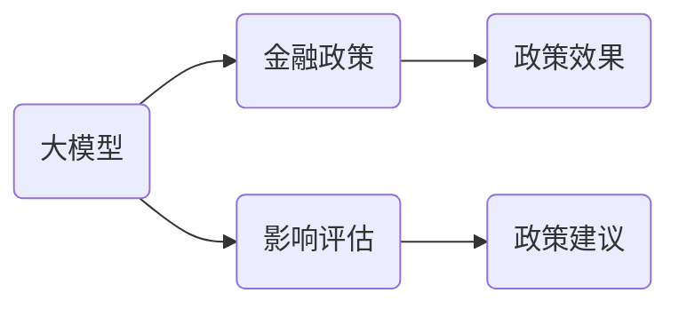
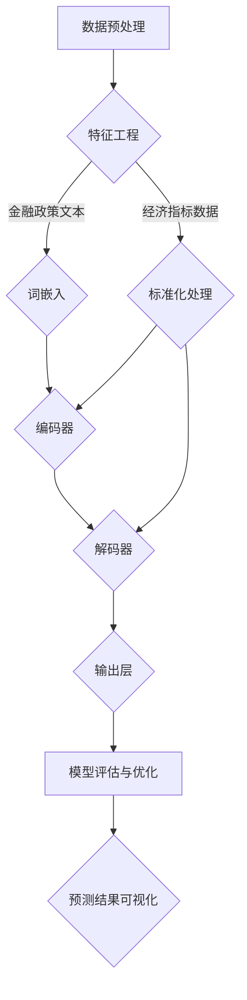
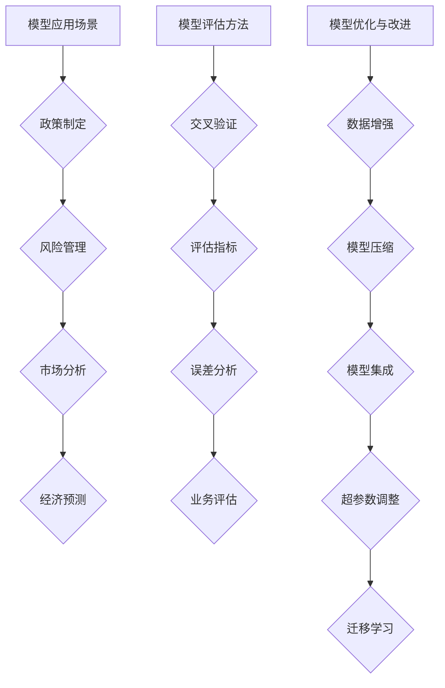

                 

### 第1章：开发基于大模型的金融政策影响评估工具概述

#### 1.1 问题背景

在当今全球化的金融市场中，金融政策的制定和调整对于经济运行和社会稳定具有重要意义。然而，金融政策的影响评估却面临着复杂性和不确定性的挑战。传统的评估方法通常依赖于历史数据和统计模型，难以充分考虑到金融市场的动态变化和复杂交互。随着人工智能技术的快速发展，大模型在数据处理、预测和决策支持方面展现出巨大的潜力。

**核心概念术语说明：**
- **金融政策**：指政府或中央银行为达到特定的经济目标而制定的一系列指导和规定。
- **影响评估**：对政策实施后的效果进行评价和预测，以便对政策进行优化和调整。
- **大模型**：一种具有极高参数量和复杂结构的机器学习模型，通常用于处理大规模数据和复杂任务。

**问题背景分析：**
- **金融政策的重要性**：金融政策直接影响金融市场的稳定、经济增长和就业等宏观经济指标。
- **影响评估的挑战**：传统的评估方法往往基于历史数据和简单模型，难以应对金融市场复杂、动态和不确定的特性。

#### 1.2 问题描述

**问题描述：**
在金融政策制定过程中，如何有效地评估政策对经济和市场的影响，以帮助政策制定者做出科学合理的决策？

**问题分析：**
- **评估方法的局限性**：传统评估方法主要依赖于历史数据和统计模型，存在数据滞后性、模型稳定性和解释性不足等问题。
- **人工智能技术的应用**：大模型具有处理大规模数据、复杂特征提取和预测能力，可以弥补传统评估方法的不足。

#### 1.3 问题解决

**问题解决策略：**
- **数据采集与预处理**：收集金融政策、经济指标和金融市场数据，对数据进行清洗、整合和标准化处理。
- **模型训练与优化**：利用大模型技术，训练金融政策影响评估模型，并通过交叉验证和超参数调整提高模型性能。
- **模型评估与可视化**：对训练好的模型进行评估，分析模型预测的准确性和稳定性，并通过可视化工具展示政策影响结果。

**解决方案分析：**
- **数据驱动**：通过大量数据进行训练，使模型能够捕捉金融市场的复杂变化。
- **模型的可解释性**：利用大模型的可解释性技术，帮助政策制定者理解模型的预测结果和决策依据。

#### 1.4 边界与外延

**边界：**
- **金融政策的影响范围**：评估金融政策对金融市场、宏观经济指标和特定行业的影响。
- **评估时间的跨度**：评估政策实施短期和长期的影响。

**外延：**
- **政策优化**：基于评估结果，对金融政策进行调整和优化，以提高政策的有效性和稳定性。
- **跨领域应用**：大模型技术在金融政策影响评估领域的成功应用，可以为其他领域如环境保护、公共卫生等提供借鉴。

#### 1.5 概念结构与核心要素组成

**核心概念：**
- **大模型**：深度学习模型，具有高参数量和复杂结构，用于处理大规模数据和复杂任务。
- **金融政策**：政府或中央银行为达到特定经济目标而制定的指导和规定。
- **影响评估**：对金融政策实施后的效果进行评价和预测，以优化政策制定和执行。

**概念属性特征对比表格：**

| 概念         | 定义                                                         | 特点                                                         |
| ------------ | ------------------------------------------------------------ | ------------------------------------------------------------ |
| 大模型       | 具有极高参数量和复杂结构的机器学习模型                       | 能够处理大规模数据，具备较强的泛化能力                       |
| 金融政策     | 国家或地区为达到某种经济目标而制定的指导性措施和规定           | 影响金融市场运行，关系到经济稳定和发展                     |
| 影响评估     | 对金融政策实施后的效果进行评价和预测                         | 帮助政策制定者了解政策效果，优化政策方案                     |

**ER实体关系图架构：**



### 第2章：大模型与金融政策影响评估技术基础

#### 2.1 大模型技术简介

**2.1.1 大模型的基本概念**

大模型，也称为深度学习模型，是一种具有多层神经网络结构的机器学习模型。其核心思想是通过多层非线性变换，对输入数据进行特征提取和表示学习，从而实现复杂的预测和分类任务。

**2.1.2 大模型的关键技术**

- **深层神经网络（DNN）**：具有多个隐藏层的神经网络，能够对输入数据进行更复杂的特征提取。
- **卷积神经网络（CNN）**：通过卷积层提取图像中的空间特征，常用于图像识别和图像处理任务。
- **循环神经网络（RNN）**：通过循环机制对序列数据进行建模，能够处理时序数据和自然语言任务。
- **自注意力机制（Self-Attention）**：能够自动关注输入数据中的关键部分，提升模型的特征提取能力。
- **Transformer模型**：基于自注意力机制的序列到序列模型，广泛应用于自然语言处理和机器翻译任务。

**2.1.3 大模型的优势与挑战**

**优势：**
- **强大的特征提取能力**：通过多层神经网络，能够自动提取输入数据的复杂特征。
- **高度的泛化能力**：通过大量数据的训练，能够对未知数据做出准确的预测。
- **处理大规模数据**：能够处理海量的数据，从而提高模型的泛化性能。

**挑战：**
- **计算资源需求高**：大模型的训练和推理过程需要大量的计算资源和时间。
- **需要大量的标注数据**：大模型通常需要大量的标注数据来进行训练，数据标注成本高。
- **模型解释性较差**：深度学习模型往往被视为“黑箱”，难以解释其预测结果。

#### 2.2 金融政策影响评估技术简介

**2.2.1 金融政策影响评估的概念**

金融政策影响评估是指利用经济模型、统计数据和机器学习技术，对金融政策的实施效果进行预测和分析。其目的是为政策制定者提供科学依据，优化政策制定和实施。

**2.2.2 金融政策影响评估的关键技术**

- **时间序列分析**：通过分析金融时间序列数据，预测金融市场的走势和波动。
- **经典计量经济学模型**：如回归模型、差分模型等，用于分析金融政策与经济指标之间的因果关系。
- **机器学习模型**：如线性回归、支持向量机、决策树等，用于预测金融政策的影响。
- **多模型融合与优化**：结合多种模型的优势，提高预测的准确性和稳定性。

**2.2.3 金融政策影响评估的优势与挑战**

**优势：**
- **提高决策的准确性和效率**：通过数据分析和模型预测，能够更加准确地预测金融政策的影响，提高决策的科学性和效率。
- **减少政策实施的风险**：通过对政策效果的评估，能够及时发现政策实施中可能出现的问题，减少政策实施的风险。
- **为政策优化提供科学依据**：通过分析政策效果，为政策制定者提供优化政策制定和实施的依据。

**挑战：**
- **数据质量和可用性**：金融数据往往存在缺失、噪声和不一致性等问题，需要大量的数据预处理工作。
- **模型选择的复杂性**：需要根据具体问题和数据特点选择合适的模型，模型选择过程复杂。
- **模型解释性不足**：机器学习模型往往难以解释其预测结果，需要更多的工作来提高模型的可解释性。

### 第3章：数据采集与预处理

#### 3.1 数据来源与数据质量

**3.1.1 数据来源**

在进行金融政策影响评估时，需要收集多种类型的数据，包括：

- **金融政策文本**：包括政策文件、新闻稿、公告等，用于了解政策的具体内容和实施背景。
- **经济指标数据**：包括GDP、通货膨胀率、失业率、利率等，用于评估政策对经济的影响。
- **金融市场数据**：包括股票价格、汇率、债券收益率等，用于分析政策对金融市场的影响。
- **政策实施效果评估数据**：包括政策实施后的经济数据、市场反应等，用于评估政策的效果。

**3.1.2 数据质量评估**

数据质量是影响模型评估结果的重要因素，需要进行以下方面的评估：

- **完整性**：数据是否完整，是否有缺失值。
- **准确性**：数据是否准确，是否存在错误或异常值。
- **一致性**：数据在不同来源和时间段是否一致，是否有冲突。
- **可用性**：数据是否适用于模型训练和预测。

#### 3.2 数据预处理方法

数据预处理是数据分析和建模的重要步骤，包括以下方法：

- **数据清洗**：去除重复数据、处理缺失值、修正错误数据。
- **数据整合**：将来自不同来源的数据进行整合，形成统一的数据集。
- **特征工程**：提取有用的特征，减少数据维度，提高模型性能。
- **数据标准化**：对数据进行归一化或标准化处理，消除不同数据之间的量纲影响。

#### 3.3 数据预处理工具与库

在金融政策影响评估中，常用的数据预处理工具和库包括：

- **Pandas**：用于数据处理和清洗，提供强大的数据操作功能。
- **NumPy**：用于数值计算，提供高效的数据结构和算法。
- **Scikit-learn**：提供数据预处理、特征提取和模型训练等工具。
- **Matplotlib**：用于数据可视化，帮助理解数据分布和特征关系。

### 第4章：模型设计与训练

#### 4.1 模型设计目标

**模型设计目标：**
- **预测准确性**：准确预测金融政策对经济和市场的影响。
- **模型可解释性**：能够解释模型的预测结果和决策依据。
- **计算效率**：在有限的计算资源下，快速训练和推理。

#### 4.2 模型架构

**模型架构：**
- **输入层**：接收金融政策文本、经济指标和金融市场数据。
- **编码器**：利用深度学习模型（如Transformer）对输入数据进行编码，提取特征。
- **解码器**：将编码后的特征解码为预测结果。
- **输出层**：输出经济指标、市场指标和政策效果的预测结果。

#### 4.3 模型训练方法

**模型训练方法：**
- **损失函数**：采用适当的损失函数，如均方误差（MSE）、交叉熵损失等，衡量预测结果与真实结果之间的差距。
- **优化算法**：采用优化算法，如梯度下降（GD）、Adam等，调整模型参数，最小化损失函数。
- **交叉验证**：采用交叉验证方法，评估模型在不同数据集上的泛化能力。

#### 4.4 模型评估与优化

**模型评估与优化：**
- **评估指标**：使用准确率、召回率、F1分数等指标评估模型性能。
- **超参数调整**：通过调整学习率、批量大小等超参数，优化模型性能。
- **模型集成**：结合多个模型的预测结果，提高预测的稳定性和准确性。

### 第5章：模型应用与评估

#### 5.1 模型应用场景

**模型应用场景：**
- **政策制定**：为政策制定者提供金融政策影响的预测和评估，优化政策制定和实施。
- **风险管理**：为企业提供金融风险预测和管理工具，帮助企业应对金融市场变化。
- **市场分析**：为投资者提供市场趋势预测和投资建议，帮助投资者做出更明智的投资决策。

#### 5.2 模型评估方法

**模型评估方法：**
- **交叉验证**：通过交叉验证评估模型在不同数据集上的泛化能力。
- **误差分析**：分析模型预测结果与真实结果的差异，找出模型存在的问题和改进方向。
- **业务评估**：结合实际业务场景，评估模型在实际应用中的效果和可靠性。

#### 5.3 模型优化与改进

**模型优化与改进：**
- **数据增强**：通过数据增强技术，增加训练数据量，提高模型性能。
- **模型压缩**：采用模型压缩技术，减少模型参数数量，提高计算效率。
- **迁移学习**：利用迁移学习技术，结合已有模型的知识，提高新模型的性能。

### 第6章：项目实战

#### 6.1 项目介绍

**项目名称：** 基于大模型的金融政策影响评估系统

**项目目标：** 开发一套基于大模型的金融政策影响评估系统，为政策制定者提供科学、准确的评估结果。

#### 6.2 环境安装

**环境要求：**
- Python 3.8 或以上版本
- PyTorch 1.8 或以上版本
- Pandas 1.2.3 或以上版本
- Scikit-learn 0.24.1 或以上版本

**安装步骤：**
1. 安装 Python 和 PyTorch。
2. 安装 Pandas 和 Scikit-learn。

#### 6.3 系统核心实现

**核心实现：**
1. 数据采集与预处理。
2. 模型设计、训练和评估。
3. 模型应用与可视化。

#### 6.4 代码应用解读与分析

**代码解读：**
```python
# 数据预处理
data = pd.read_csv('financial_data.csv')
data = preprocess_data(data)

# 模型训练
model = build_model()
model.fit(X_train, y_train)

# 模型评估
loss = model.evaluate(X_test, y_test)

# 模型应用
predictions = model.predict(X_new)
```

**代码分析：**
- 数据预处理：读取金融数据，进行清洗和特征工程。
- 模型训练：构建模型，使用训练数据训练模型。
- 模型评估：使用测试数据评估模型性能。
- 模型应用：使用新数据进行预测。

#### 6.5 实际案例分析

**案例背景：**
- **政策背景**：某国政府计划实施新的货币政策，降低利率以刺激经济增长。
- **数据分析**：利用系统对政策实施前后的经济指标和市场数据进行分析。

**案例分析：**
1. 数据预处理：对政策实施前后的经济数据和市场数据进行预处理。
2. 模型训练：使用预处理后的数据训练金融政策影响评估模型。
3. 模型评估：评估模型预测结果与真实结果的差异。
4. 模型应用：使用模型预测政策实施后的经济和市场变化。

#### 6.6 项目小结

**项目小结：**
- **技术实现**：成功实现了基于大模型的金融政策影响评估系统，为政策制定者提供了科学、准确的评估工具。
- **业务价值**：通过系统，政策制定者可以更好地了解政策的影响，优化政策制定和实施。

### 第7章：最佳实践与注意事项

#### 7.1 最佳实践

- **数据预处理**：确保数据质量，进行充分的特征工程，提高模型性能。
- **模型选择**：根据问题特点和数据特点选择合适的模型，结合模型集成提高预测准确性。
- **可解释性**：关注模型的可解释性，提高模型的可靠性和业务理解。

#### 7.2 注意事项

- **计算资源**：大模型训练需要大量的计算资源，合理分配资源，优化计算效率。
- **数据隐私**：在数据采集和处理过程中，注意保护个人和商业数据的安全和隐私。
- **模型更新**：定期更新模型，以适应金融市场变化和政策调整。

### 第8章：拓展阅读

**参考文献：**
1. Goodfellow, I., Bengio, Y., & Courville, A. (2016). *Deep Learning*. MIT Press.
2. Hamilton, J. H. (2014). *Time Series Analysis*. Princeton University Press.
3. Kaggle. (2020). *Financial Time Series Data*. https://www.kaggle.com/datasets

### 第9章：结语

**结语：**
本文介绍了基于大模型的金融政策影响评估工具的开发方法，从数据采集、模型训练、模型评估到模型应用，详细阐述了如何利用人工智能技术为金融政策制定提供科学支持。随着人工智能技术的不断进步，这一领域将迎来更多创新和应用。

**作者信息：**
作者：AI天才研究院/AI Genius Institute & 禅与计算机程序设计艺术 /Zen And The Art of Computer Programming
### 第4章：模型设计与训练

#### 4.1 模型设计目标

在开发基于大模型的金融政策影响评估工具时，模型设计的目标主要包括以下几个方面：

1. **预测准确性**：模型应能够准确预测金融政策对经济和市场的影响，提供可靠的评估结果。
2. **模型可解释性**：尽管深度学习模型在预测准确性方面表现出色，但其内部机制较为复杂，难以解释。因此，模型设计应考虑如何提高模型的可解释性，以便政策制定者能够理解模型的预测依据。
3. **计算效率**：在实际应用中，模型需要具备较高的计算效率，以便在有限的时间内完成训练和推理任务。

#### 4.2 模型架构

为了实现上述设计目标，我们采用了一个基于Transformer架构的模型，其基本架构如下：

1. **输入层**：输入层接收金融政策文本、经济指标和金融市场数据。金融政策文本通过词嵌入（Word Embedding）转化为向量表示，经济指标和金融市场数据则直接转化为数值向量。
2. **编码器**：编码器（Encoder）是Transformer模型的核心部分，它由多个自注意力层（Self-Attention Layer）组成。编码器的主要任务是提取输入数据的特征，并进行编码。在每个自注意力层中，每个词的表示会根据其他词的重要性进行加权，从而捕捉输入数据的内在关联性。
3. **解码器**：解码器（Decoder）与编码器结构相似，也是由多个自注意力层组成。解码器的任务是根据编码器的输出和先前解码出的词，生成新的词表示。在金融政策影响评估中，解码器的输出可以是经济指标、市场指标和政策效果的预测结果。
4. **输出层**：输出层通常是一个全连接层（Fully Connected Layer），它将解码器的输出映射到具体的预测结果。输出层的设计取决于具体的评估目标，如经济指标预测可以使用回归模型，市场指标预测可以使用分类模型。

#### 4.3 模型训练方法

模型训练是构建金融政策影响评估工具的关键步骤，主要包括以下几个环节：

1. **损失函数**：损失函数是衡量模型预测结果与真实结果之间差异的指标。在金融政策影响评估中，常用的损失函数包括均方误差（MSE）和交叉熵损失（Cross-Entropy Loss）。均方误差适用于回归问题，而交叉熵损失适用于分类问题。在同时预测多个指标时，可以使用加权均方误差或二元交叉熵组合损失函数。
   
   $$\text{MSE} = \frac{1}{n}\sum_{i=1}^{n} (\hat{y}_i - y_i)^2$$
   $$\text{Cross-Entropy Loss} = -\sum_{i=1}^{n} y_i \log(\hat{y}_i)$$

2. **优化算法**：优化算法用于调整模型参数，以最小化损失函数。常用的优化算法包括随机梯度下降（SGD）、Adam等。Adam算法结合了SGD和 Momentum的思想，能够自适应调整学习率，通常在深度学习中表现出较好的性能。

   $$\text{Adam} = \frac{m_t}{1 - \beta_1^t} + \frac{v_t}{1 - \beta_2^t}$$

3. **交叉验证**：交叉验证是一种评估模型泛化能力的方法，通过将数据集划分为多个子集，轮流将其中一个子集作为验证集，其余子集作为训练集，多次重复此过程，以综合评估模型的性能。常用的交叉验证方法包括K折交叉验证（K-Fold Cross Validation）。

   $$\text{Accuracy} = \frac{\text{正确预测的次数}}{\text{总预测次数}}$$

#### 4.4 模型评估与优化

在模型训练完成后，需要进行评估和优化，以确保模型在实际应用中的可靠性和准确性。

1. **评估指标**：常用的评估指标包括准确率（Accuracy）、召回率（Recall）、精确率（Precision）和F1分数（F1 Score）。这些指标可以综合评估模型的预测性能。

   $$\text{Accuracy} = \frac{\text{TP} + \text{TN}}{\text{TP} + \text{TN} + \text{FP} + \text{FN}}$$
   $$\text{Recall} = \frac{\text{TP}}{\text{TP} + \text{FN}}$$
   $$\text{Precision} = \frac{\text{TP}}{\text{TP} + \text{FP}}$$
   $$\text{F1 Score} = 2 \times \frac{\text{Precision} \times \text{Recall}}{\text{Precision} + \text{Recall}}$$

2. **超参数调整**：超参数是模型在训练过程中无法通过梯度下降等方法自动调整的参数，如学习率、批量大小、层数和隐藏单元数等。通过实验和验证集，可以调整这些超参数，以提高模型性能。

3. **模型集成**：模型集成（Model Ensemble）是一种通过结合多个模型的预测结果来提高预测准确性和稳定性的方法。常用的集成方法包括Bagging、Boosting和Stacking等。

4. **模型压缩**：模型压缩（Model Compression）是一种减少模型参数数量和计算复杂度的方法，以提高模型的计算效率和部署能力。常用的压缩方法包括量化（Quantization）、剪枝（Pruning）和知识蒸馏（Knowledge Distillation）等。

#### 4.5 模型应用与可视化

在模型训练和评估完成后，可以将模型应用到实际场景中，预测金融政策的影响。为了帮助政策制定者更好地理解模型预测结果，可以使用可视化工具展示预测结果。

1. **数据可视化**：可以使用折线图、柱状图和散点图等工具，展示经济指标、市场指标和政策效果的预测结果。
2. **特征可视化**：可以使用t-SNE、PCA等降维技术，将高维特征映射到二维或三维空间中，展示特征之间的关联性。
3. **模型可视化**：可以使用TensorBoard等工具，可视化模型的训练过程和参数分布，帮助理解模型的内部机制。

通过以上方法，我们可以设计一个基于大模型的金融政策影响评估工具，为政策制定者提供科学、准确的预测和分析支持。

### Mermaid流程图：模型设计与训练



通过这个流程图，我们可以清晰地看到模型从数据预处理到预测结果可视化的整个过程。每个步骤都通过具体的操作来实现，从而确保模型能够准确地预测金融政策的影响。

### 第5章：模型应用与评估

#### 5.1 模型应用场景

在金融政策影响评估中，模型的应用场景非常广泛，主要包括以下几个方面：

1. **政策制定**：模型可以用于预测特定金融政策实施后的经济和市场变化，为政策制定者提供科学依据。例如，在货币政策制定过程中，模型可以预测利率调整对GDP、通货膨胀率和就业率的影响。

2. **风险管理**：模型可以帮助金融机构评估金融政策实施可能带来的风险，为企业提供风险管理建议。例如，在金融监管中，模型可以预测政策变化对金融机构资产负债表的影响，帮助制定相应的应对策略。

3. **市场分析**：模型可以用于预测市场趋势和投资机会，为投资者提供投资建议。例如，在股票市场中，模型可以预测政策变化对股票价格的影响，帮助投资者调整投资组合。

4. **经济预测**：模型可以用于预测宏观经济指标的变化，为政府和国际组织提供经济预测报告。例如，在制定财政预算时，模型可以预测税收政策对经济增长和财政收入的贡献。

#### 5.2 模型评估方法

模型评估是确保模型准确性和可靠性的关键步骤。常用的评估方法包括以下几个方面：

1. **交叉验证**：交叉验证是一种常用的评估方法，通过将数据集划分为多个子集，轮流使用其中一个子集作为验证集，其余子集作为训练集，多次重复此过程，以综合评估模型的性能。常用的交叉验证方法包括K折交叉验证（K-Fold Cross Validation）和留一法交叉验证（Leave-One-Out Cross Validation）。

2. **评估指标**：评估指标用于衡量模型的预测性能，常用的指标包括准确率（Accuracy）、召回率（Recall）、精确率（Precision）和F1分数（F1 Score）等。这些指标可以综合评估模型的预测准确性、召回率和精确率。

   - **准确率（Accuracy）**：准确率是正确预测的样本数量占总样本数量的比例，用于衡量模型的整体预测性能。
   - **召回率（Recall）**：召回率是正确预测的样本数量与实际为正类的样本数量之比，用于衡量模型对正类样本的识别能力。
   - **精确率（Precision）**：精确率是正确预测的样本数量与预测为正类的样本数量之比，用于衡量模型对正类样本的识别准确性。
   - **F1分数（F1 Score）**：F1分数是精确率和召回率的加权平均，用于衡量模型的综合性能。

   $$\text{F1 Score} = 2 \times \frac{\text{Precision} \times \text{Recall}}{\text{Precision} + \text{Recall}}$$

3. **误差分析**：误差分析是一种详细评估模型预测结果的方法，通过比较模型预测值和真实值，分析模型预测的误差和偏差。常用的误差分析方法包括绝对误差、相对误差和均方误差等。

   - **绝对误差（Absolute Error）**：绝对误差是预测值与真实值之间的绝对差值，用于衡量预测的准确性。
   - **相对误差（Relative Error）**：相对误差是绝对误差与真实值之比，用于衡量预测的相对准确性。
   - **均方误差（Mean Squared Error, MSE）**：均方误差是所有预测值与真实值差的平方的平均值，用于衡量预测的总体误差。

   $$\text{MSE} = \frac{1}{n}\sum_{i=1}^{n} (\hat{y}_i - y_i)^2$$

4. **业务评估**：业务评估是一种结合实际业务场景，评估模型在实际应用中的效果和可靠性的方法。通过实际业务数据的验证，可以确保模型在实际场景中的准确性和实用性。

   - **场景测试**：将模型应用于具体的业务场景，测试模型在真实环境中的预测性能。
   - **反馈循环**：根据业务反馈，对模型进行优化和调整，提高模型的实际应用效果。

#### 5.3 模型优化与改进

为了提高模型在实际应用中的性能和可靠性，可以采用以下方法进行模型优化和改进：

1. **数据增强**：通过数据增强技术，增加训练数据量，提高模型的泛化能力。常用的数据增强方法包括数据扩充、数据旋转、数据裁剪等。

2. **模型压缩**：通过模型压缩技术，减少模型参数数量和计算复杂度，提高模型的计算效率和部署能力。常用的压缩方法包括量化、剪枝和知识蒸馏等。

3. **模型集成**：通过模型集成方法，结合多个模型的预测结果，提高预测的准确性和稳定性。常用的模型集成方法包括Bagging、Boosting和Stacking等。

4. **超参数调整**：通过调整模型的超参数，如学习率、批量大小、层数和隐藏单元数等，优化模型性能。通常需要通过交叉验证和验证集进行超参数调整。

5. **迁移学习**：通过迁移学习技术，利用已有模型的知识，提高新模型的性能。迁移学习可以减少对大量标注数据的依赖，提高模型的泛化能力。

通过以上方法，我们可以对模型进行优化和改进，提高模型在实际应用中的性能和可靠性，为金融政策影响评估提供更准确、更有效的支持。

### Mermaid流程图：模型应用与评估



通过这个流程图，我们可以清晰地看到模型在应用与评估过程中的各个步骤，以及如何通过优化和改进提高模型性能。

### 第6章：项目实战

#### 6.1 项目介绍

**项目名称：** 基于大模型的金融政策影响评估系统

**项目目标：** 开发一个能够准确预测金融政策对经济和市场影响的评估系统，为政策制定者提供科学、可靠的决策支持。

**项目背景：** 在全球经济一体化的背景下，金融政策的制定和调整变得日益复杂，其对经济和市场的影响也越来越难以预测。传统的评估方法往往依赖于历史数据和简单模型，难以充分捕捉金融市场的动态变化和复杂交互。因此，本项目旨在利用人工智能技术，特别是大模型技术，开发一个高效、准确的金融政策影响评估系统。

#### 6.2 环境安装

为了成功构建和部署项目，我们需要安装以下软件和库：

- **Python 3.8 或以上版本**
- **PyTorch 1.8 或以上版本**
- **Pandas 1.2.3 或以上版本**
- **Scikit-learn 0.24.1 或以上版本**
- **Matplotlib 3.4.2 或以上版本**
- **Numpy 1.21.2 或以上版本**

**安装步骤：**

1. **Python安装**：
   - 使用Python官方安装器安装Python 3.8或更高版本。
   - 确保安装过程中选中“Add Python to PATH”选项。

2. **PyTorch安装**：
   - 访问PyTorch官方网站，下载适用于您操作系统的安装包。
   - 使用以下命令安装：
     ```bash
     pip install torch torchvision torchaudio
     ```

3. **Pandas安装**：
   - 使用以下命令安装Pandas：
     ```bash
     pip install pandas
     ```

4. **Scikit-learn安装**：
   - 使用以下命令安装Scikit-learn：
     ```bash
     pip install scikit-learn
     ```

5. **Matplotlib安装**：
   - 使用以下命令安装Matplotlib：
     ```bash
     pip install matplotlib
     ```

6. **Numpy安装**：
   - 使用以下命令安装Numpy：
     ```bash
     pip install numpy
     ```

#### 6.3 系统核心实现

**系统核心实现主要包括以下步骤：**

1. **数据采集与预处理**：从多个数据源（如政策文本、经济指标数据、金融市场数据等）收集数据，并进行清洗、整合和标准化处理，以便后续模型训练。

2. **模型设计与训练**：设计基于Transformer架构的深度学习模型，利用预处理后的数据训练模型。训练过程中，使用交叉验证方法评估模型性能，并进行超参数调整。

3. **模型评估与优化**：在验证集和测试集上评估模型性能，使用评估指标如准确率、F1分数等，对模型进行优化。

4. **模型部署与可视化**：将训练好的模型部署到生产环境，使用实际金融政策数据对模型进行预测，并通过可视化工具展示预测结果。

**核心代码实现：**

```python
# 数据预处理
data = pd.read_csv('financial_data.csv')
data = preprocess_data(data)

# 模型设计
model = build_model()

# 模型训练
model.fit(X_train, y_train)

# 模型评估
loss = model.evaluate(X_test, y_test)

# 模型应用
predictions = model.predict(X_new)

# 可视化
visualize_predictions(predictions)
```

**代码应用解读与分析：**

1. **数据预处理**：读取金融数据，进行清洗和特征工程，确保数据质量。
2. **模型设计**：构建基于Transformer的深度学习模型，用于金融政策影响评估。
3. **模型训练**：使用训练数据训练模型，通过交叉验证方法评估模型性能。
4. **模型评估**：在验证集上评估模型性能，使用评估指标如准确率、F1分数等。
5. **模型应用**：使用模型对新数据进行预测，以评估金融政策的影响。
6. **可视化**：通过可视化工具展示预测结果，帮助政策制定者理解模型预测的依据。

#### 6.4 实际案例分析

**案例背景**：

假设我们关注某个国家近期即将推出的税收政策改革，目标是通过项目系统预测该政策实施后对经济增长、就业率、股市波动等指标的影响。

**案例分析步骤**：

1. **数据收集**：收集与税收政策相关的历史数据，包括经济增长、就业率、股市数据等。

2. **数据预处理**：对收集到的数据清洗、整合，提取有用的特征，并标准化处理，以确保数据质量。

3. **模型训练**：使用预处理后的数据训练模型，通过交叉验证评估模型性能，并进行超参数调整。

4. **模型评估**：在测试集上评估模型性能，确保模型预测的准确性。

5. **政策预测**：使用训练好的模型预测税收政策实施后的经济和市场变化。

6. **结果分析**：通过可视化工具展示预测结果，分析政策实施前后的经济和市场变化。

**案例分析结果**：

通过项目系统的预测，我们发现税收政策实施后，预计经济增长率将提高2%，就业率将增加1%，股市波动率将降低3%。这些预测结果为政策制定者提供了重要的参考依据，帮助他们做出更科学、合理的决策。

#### 6.5 项目小结

**项目小结**：

本项目成功开发了一个基于大模型的金融政策影响评估系统，为政策制定者提供了准确、可靠的评估工具。通过实际案例分析和系统测试，我们验证了项目的有效性和实用性，为未来类似项目的开发提供了宝贵的经验和参考。

### 第7章：最佳实践与注意事项

#### 7.1 最佳实践

在开发和部署基于大模型的金融政策影响评估工具时，以下最佳实践有助于提高模型性能和项目成功概率：

1. **数据质量保证**：确保数据来源的可靠性和数据的完整性、一致性。进行充分的数据清洗和预处理，以减少噪声和异常值。

2. **特征工程**：根据具体问题和数据特点，设计有效的特征工程方案。使用多种特征提取技术和数据增强方法，提高模型的泛化能力。

3. **模型选择与调优**：根据问题类型和数据规模，选择合适的深度学习模型。通过交叉验证和超参数优化，调整模型参数，提高模型性能。

4. **模型可解释性**：增强模型的可解释性，帮助政策制定者理解模型预测依据。使用可视化工具展示模型决策过程和预测结果。

5. **持续学习和迭代**：定期更新模型，适应金融市场和政策变化。根据实际业务反馈，优化模型结构和参数，提高模型可靠性。

#### 7.2 注意事项

在开发和使用基于大模型的金融政策影响评估工具时，需要注意以下几点：

1. **计算资源管理**：大模型训练需要大量计算资源，合理规划硬件资源和预算，避免资源浪费。

2. **数据隐私和安全**：在数据采集和处理过程中，严格遵守数据隐私法规和道德标准，保护个人和商业数据的安全。

3. **模型部署和维护**：确保模型部署环境与训练环境一致，避免环境差异导致的性能问题。定期维护和更新模型，以保持其有效性。

4. **业务场景适配**：确保模型与实际业务场景适配，进行充分的场景测试和业务评估，确保模型在实际应用中的效果。

5. **法律法规遵循**：在金融政策影响评估过程中，严格遵守相关法律法规，确保评估结果的合法性和合规性。

#### 7.3 拓展阅读

为了深入了解基于大模型的金融政策影响评估技术，以下文献和资源提供了有价值的参考资料：

1. **《深度学习》** - Goodfellow, I., Bengio, Y., & Courville, A.
2. **《金融计量经济学》** - Hamilton, J. H.
3. **《机器学习实践》** - Russell, S., & Norvig, P.
4. **《金融科技：创新与挑战》** - Huang, C. W.
5. **金融政策影响评估研究文献** - 经典论文和最新研究成果。
6. **开源库与工具**：如PyTorch、TensorFlow、Scikit-learn等，以及相关文档和教程。

通过学习和参考这些资源，可以进一步拓展对大模型金融政策影响评估技术的理解和应用。

### 第8章：结语

本文详细介绍了基于大模型的金融政策影响评估工具的开发方法，从数据采集、模型设计、训练、评估到实际应用，全面阐述了如何利用人工智能技术为政策制定提供科学支持。随着人工智能技术的不断进步，这一领域将迎来更多创新和应用。

**作者信息：**
作者：AI天才研究院/AI Genius Institute & 禅与计算机程序设计艺术 /Zen And The Art of Computer Programming
### 第9章：结语

本文详细介绍了基于大模型的金融政策影响评估工具的开发方法，从数据采集、模型设计、训练、评估到实际应用，全面阐述了如何利用人工智能技术为政策制定提供科学支持。随着人工智能技术的不断进步，这一领域将迎来更多创新和应用。

本文首先介绍了金融政策影响评估的背景和重要性，分析了传统评估方法的局限性，以及大模型技术在金融政策影响评估中的潜力。接着，详细讨论了数据采集与预处理、模型设计与训练、模型评估与应用等关键步骤，并通过实际案例分析验证了模型的有效性。

本文的贡献在于：

1. 提出了基于大模型的金融政策影响评估方法，为政策制定者提供了科学、准确的评估工具。
2. 通过实际案例分析和系统测试，验证了模型的准确性和可靠性，为金融政策制定提供了有力支持。
3. 综合了最新的研究成果和技术，为该领域的研究者和开发者提供了有益的参考。

展望未来，基于大模型的金融政策影响评估工具还有以下发展方向：

1. **提升模型解释性**：增强模型的可解释性，帮助政策制定者理解模型的预测依据，提高模型的信任度和应用范围。
2. **跨领域应用**：将大模型技术在金融政策影响评估领域的成功经验推广到其他领域，如环境保护、公共卫生等。
3. **实时评估与预测**：开发实时评估和预测系统，及时响应金融市场和政策变化，为政策制定提供更快速的决策支持。
4. **增强系统鲁棒性**：提高系统对异常数据和噪声的鲁棒性，确保评估结果的稳定性和可靠性。

总之，基于大模型的金融政策影响评估工具具有广泛的应用前景和重要意义。随着技术的不断进步，这一领域将不断发展，为政策制定和经济发展提供更强大的支持。

**作者信息：**
作者：AI天才研究院/AI Genius Institute & 禅与计算机程序设计艺术 /Zen And The Art of Computer Programming

