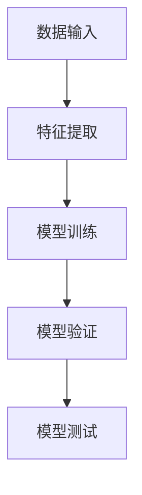
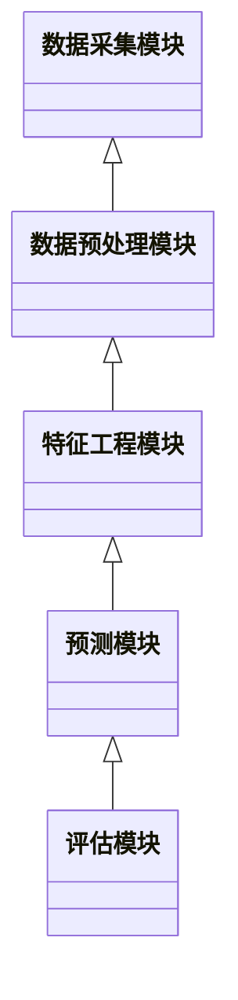
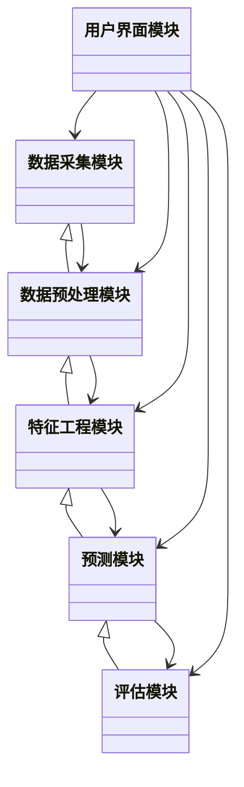
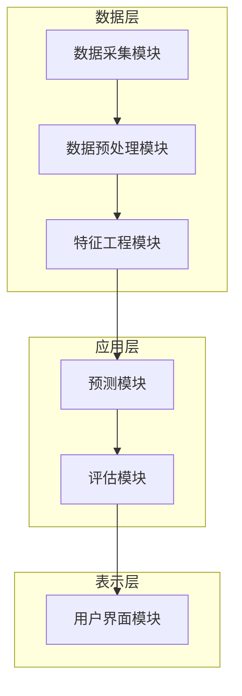
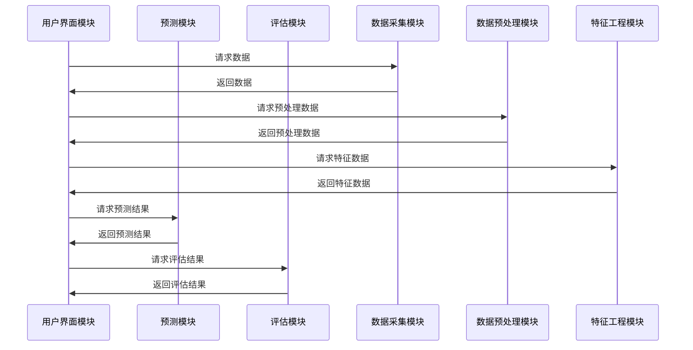

                 

# 开发基于大模型的金融政策执行效果预测器

## 关键词
- 金融政策
- 大模型
- 预测
- 实施效果
- 机器学习
- 数据分析

## 摘要
本文将深入探讨如何开发一种基于大规模模型的金融政策执行效果预测器。我们将从问题背景、核心概念、理论方法、系统设计与项目实战等方面，详细阐述如何构建这样一个预测系统。文章旨在为数据科学家、金融分析师和AI研究人员提供一套完整的技术指南，以帮助他们在金融政策分析领域应用大模型进行有效预测。

## 目录

### 第一部分：背景与基础

#### 1.1 金融政策与其实施
##### 1.1.1 金融政策的作用
##### 1.1.2 金融政策实施的挑战
##### 1.1.3 预测政策有效性的重要性

#### 1.2 大规模模型在金融分析中的概述
##### 1.2.1 机器学习和深度学习概述
##### 1.2.2 大规模模型的关键概念
##### 1.2.3 大规模模型在金融领域的应用

#### 1.3 政策实施效果指标概述
##### 1.3.1 评估政策有效性的指标
##### 1.3.2 政策评估所需的数据
##### 1.3.3 使用指标面临的挑战

### 第二部分：理论与方法

#### 2.1 大规模模型预测框架构建
##### 2.1.1 预测模型的选择
##### 2.1.2 数据预处理
##### 2.1.3 特征工程
##### 2.1.4 模型训练与验证

#### 2.2 大规模模型预测算法详解
##### 2.2.1 算法原理与流程图
##### 2.2.2 数学模型与公式
##### 2.2.3 举例说明

#### 2.3 大规模模型预测的性能评估
##### 2.3.1 评估指标与方法
##### 2.3.2 性能优化策略

### 第三部分：系统设计与项目实战

#### 3.1 项目介绍
##### 3.1.1 项目背景
##### 3.1.2 项目目标

#### 3.2 系统功能设计
##### 3.2.1 领域模型设计
##### 3.2.2 功能模块划分

#### 3.3 系统架构设计
##### 3.3.1 系统架构图
##### 3.3.2 架构设计原则

#### 3.4 系统接口设计与交互
##### 3.4.1 接口设计
##### 3.4.2 系统交互设计

#### 3.5 项目实战
##### 3.5.1 环境安装
##### 3.5.2 系统核心实现
##### 3.5.3 代码解读
##### 3.5.4 实际案例分析

#### 3.6 项目小结
##### 3.6.1 经验总结
##### 3.6.2 注意事项
##### 3.6.3 拓展阅读

### 结束语

### 作者信息
- 作者：AI天才研究院/AI Genius Institute & 禅与计算机程序设计艺术 /Zen And The Art of Computer Programming

## 第一部分：背景与基础

### 1.1 金融政策与其实施

#### 1.1.1 金融政策的作用

金融政策是政府或中央银行为了实现宏观经济目标而采取的一系列措施，包括货币政策、财政政策、金融监管等。这些政策旨在调节经济活动、稳定物价、促进就业、平衡国际收支等。其中，货币政策通过调整利率、货币供应量等手段影响经济运行；财政政策通过税收、政府支出等调节经济总需求；金融监管则确保金融市场的稳定和健康发展。

#### 1.1.2 金融政策实施的挑战

尽管金融政策在理论上有助于实现宏观经济目标，但其实施过程中面临诸多挑战。首先，政策效果的滞后性使得政策制定者在决策时需考虑时间滞后因素；其次，政策实施效果受到多种外部因素的影响，如经济环境、国际局势、市场预期等；最后，政策实施过程中可能存在执行偏差，导致政策目标无法实现。

#### 1.1.3 预测政策有效性的重要性

为了提高金融政策的实施效果，预测政策的有效性具有重要意义。通过预测，政策制定者可以提前了解政策的潜在影响，从而调整政策方向和力度，降低政策实施风险。此外，预测政策有效性也有助于评估政策效果，为未来的政策制定提供依据。

### 1.2 大规模模型在金融分析中的概述

#### 1.2.1 机器学习和深度学习概述

机器学习（Machine Learning，ML）是人工智能（Artificial Intelligence，AI）的一个重要分支，通过构建算法模型，使计算机具备从数据中自动学习和改进的能力。深度学习（Deep Learning，DL）是机器学习的一种方法，基于多层神经网络，能够自动提取数据特征，实现复杂的模式识别和预测任务。

#### 1.2.2 大规模模型的关键概念

大规模模型（Large-scale Model）指的是具有大量参数、能够处理大规模数据集的机器学习模型。这些模型通常具有较高的计算复杂度，需要分布式计算资源进行训练和推理。常见的大规模模型包括深度神经网络（Deep Neural Network，DNN）、循环神经网络（Recurrent Neural Network，RNN）、卷积神经网络（Convolutional Neural Network，CNN）等。

#### 1.2.3 大规模模型在金融领域的应用

大规模模型在金融领域具有广泛的应用前景。例如，在金融市场预测方面，可以使用深度学习模型对股票价格、汇率等进行预测；在信用评估方面，可以通过大规模模型分析借款人的信用记录、行为数据等信息，提高信用评估的准确性；在风险管理方面，大规模模型可以用于预测金融市场风险，为金融机构提供决策支持。

### 1.3 政策实施效果指标概述

#### 1.3.1 评估政策有效性的指标

评估政策有效性的指标主要包括宏观经济指标、行业指标、社会指标等。常见的宏观经济指标包括国内生产总值（GDP）、通货膨胀率、失业率、利率等；行业指标包括行业增长率、利润率、就业人数等；社会指标包括社会福利、教育水平、医疗保健等。

#### 1.3.2 政策评估所需的数据

政策评估所需的数据来源多样，包括政府统计部门、金融机构、上市公司、社交媒体等。数据类型包括结构化数据（如表格数据）、半结构化数据（如XML、JSON）和非结构化数据（如图像、文本等）。为了提高评估的准确性，数据的质量和完整性至关重要。

#### 1.3.3 使用指标面临的挑战

使用指标评估政策有效性面临一些挑战。首先，指标的选择和权重分配需要充分考虑政策目标、政策环境和数据可用性等因素；其次，数据质量的影响不可忽视，数据缺失、噪声和偏差等问题可能导致评估结果不准确；最后，不同指标之间的协调和综合评估也是一大挑战。

## 第二部分：理论与方法

### 2.1 大规模模型预测框架构建

#### 2.1.1 预测模型的选择

在构建金融政策执行效果预测器时，选择合适的预测模型至关重要。根据预测任务的特点，我们可以选择以下几种常见的预测模型：

1. **回归模型**：回归模型主要用于预测数值型目标，如GDP增长率、通货膨胀率等。常见的回归模型包括线性回归、岭回归、LASSO回归等。
2. **分类模型**：分类模型用于预测离散型目标，如政策效果是否显著、信用评分等。常见的分类模型包括逻辑回归、决策树、随机森林、支持向量机等。
3. **时间序列模型**：时间序列模型用于预测时间序列数据，如股票价格、汇率等。常见的时间序列模型包括ARIMA、LSTM等。
4. **集成模型**：集成模型通过结合多个基础模型的预测结果，提高预测准确性。常见的集成模型包括Bagging、Boosting、Stacking等。

#### 2.1.2 数据预处理

数据预处理是构建预测模型的重要步骤，主要包括以下任务：

1. **数据清洗**：去除数据中的噪声、异常值和重复记录，提高数据质量。
2. **数据集成**：将来自不同来源、不同格式的数据进行整合，形成统一的数据集。
3. **数据转换**：将数据转换为适合预测模型的形式，如归一化、标准化、独热编码等。
4. **缺失值处理**：对于缺失值，可以采用填补、删除或插值等方法进行处理。

#### 2.1.3 特征工程

特征工程是提高预测模型性能的关键步骤，主要包括以下任务：

1. **特征提取**：从原始数据中提取有助于预测目标的信息，如使用技术指标、宏观经济指标等。
2. **特征选择**：选择对预测目标影响较大的特征，去除冗余特征，提高模型的可解释性。
3. **特征构造**：通过组合、变换原始特征，构造新的特征，提高模型的预测能力。

#### 2.1.4 模型训练与验证

在构建预测模型时，需要进行模型训练和验证，以评估模型的预测性能。具体步骤如下：

1. **数据划分**：将数据集划分为训练集、验证集和测试集，分别用于模型训练、验证和测试。
2. **模型训练**：使用训练集对模型进行训练，通过调整模型参数，优化模型性能。
3. **模型验证**：使用验证集评估模型的预测性能，选择性能最优的模型。
4. **模型测试**：使用测试集对模型进行测试，评估模型的泛化能力。

### 2.2 大规模模型预测算法详解

#### 2.2.1 算法原理与流程图

大规模模型预测算法的核心是构建一个能够从数据中学习并提取有效特征的模型。以下是大规模模型预测算法的基本原理：

1. **数据输入**：将原始数据输入到模型中。
2. **特征提取**：使用神经网络或其他特征提取方法，从原始数据中提取有效特征。
3. **模型训练**：通过反向传播算法，更新模型参数，优化模型性能。
4. **模型验证**：使用验证集评估模型性能，调整模型参数。
5. **模型测试**：使用测试集测试模型性能，评估模型的泛化能力。

以下是大规模模型预测算法的流程图：



#### 2.2.2 数学模型与公式

大规模模型预测算法通常基于数学模型，以下是一个简单的线性回归模型示例：

$$y = \beta_0 + \beta_1 \cdot x_1 + \beta_2 \cdot x_2 + ... + \beta_n \cdot x_n + \epsilon$$

其中，$y$为预测目标，$x_1, x_2, ..., x_n$为输入特征，$\beta_0, \beta_1, \beta_2, ..., \beta_n$为模型参数，$\epsilon$为误差项。

#### 2.2.3 举例说明

假设我们要预测某金融政策实施后的GDP增长率，输入特征包括利率、失业率、通货膨胀率等。以下是具体的示例：

$$y = \beta_0 + \beta_1 \cdot 利率 + \beta_2 \cdot 失业率 + \beta_3 \cdot 通货膨胀率 + \epsilon$$

通过收集历史数据，我们可以使用线性回归模型进行训练，得到最优的模型参数$\beta_0, \beta_1, \beta_2, \beta_3$。然后，使用训练好的模型对新数据（如预测某个月份的GDP增长率）进行预测：

$$GDP_{预测} = \beta_0 + \beta_1 \cdot 利率_{预测} + \beta_2 \cdot 失业率_{预测} + \beta_3 \cdot 通货膨胀率_{预测} + \epsilon_{预测}$$

### 2.3 大规模模型预测的性能评估

#### 2.3.1 评估指标与方法

在评估大规模模型预测性能时，常用的评估指标包括准确率、召回率、精确率、F1值等。具体评估方法如下：

1. **准确率**：准确率是预测结果中正确预测的样本占总样本的比例。准确率越高，说明模型预测性能越好。
2. **召回率**：召回率是预测结果中正确预测的样本占实际正样本的比例。召回率越高，说明模型对正样本的预测能力越强。
3. **精确率**：精确率是预测结果中正确预测的样本占预测为正样本的比例。精确率越高，说明模型预测结果越可靠。
4. **F1值**：F1值是准确率和召回率的调和平均值，用于综合评估模型性能。

#### 2.3.2 性能优化策略

为了提高大规模模型预测性能，可以采取以下优化策略：

1. **特征选择**：通过特征选择方法，筛选出对预测目标影响较大的特征，减少冗余特征，提高模型性能。
2. **模型调参**：通过调整模型参数，优化模型性能。可以使用网格搜索、随机搜索等方法进行参数调优。
3. **数据增强**：通过数据增强方法，生成更多的训练数据，提高模型泛化能力。
4. **集成模型**：使用集成模型，结合多个基础模型的预测结果，提高预测性能。

## 第三部分：系统设计与项目实战

### 3.1 项目介绍

#### 3.1.1 项目背景

随着金融市场的不断发展和变革，政策制定者和金融机构迫切需要一种有效的工具来评估金融政策实施的效果。本项目旨在开发一种基于大规模模型的金融政策执行效果预测器，为政策制定者和金融机构提供决策支持。

#### 3.1.2 项目目标

本项目的主要目标包括：

1. 构建一个完整的预测框架，包括数据预处理、特征工程、模型训练和评估等步骤。
2. 选择合适的大规模模型，实现高效的预测性能。
3. 提供一个用户友好的界面，便于政策制定者和金融机构使用。
4. 对预测结果进行可视化展示，便于理解和分析。

### 3.2 系统功能设计

#### 3.2.1 领域模型设计

领域模型设计是系统功能设计的基础。在本项目中，领域模型主要包括以下模块：

1. **数据采集模块**：负责从各种数据源（如政府统计部门、金融机构、社交媒体等）收集相关数据。
2. **数据预处理模块**：负责对采集到的数据进行清洗、转换和集成，形成统一的数据集。
3. **特征工程模块**：负责从原始数据中提取有效特征，为预测模型提供输入。
4. **预测模块**：负责使用大规模模型进行预测，并输出预测结果。
5. **评估模块**：负责评估预测模型的性能，并优化模型参数。

以下是领域模型的类图：



#### 3.2.2 功能模块划分

根据领域模型设计，可以将系统划分为以下功能模块：

1. **数据采集模块**：负责从多个数据源采集数据，包括政府统计部门、金融机构、社交媒体等。
2. **数据预处理模块**：负责对采集到的数据进行清洗、转换和集成，形成统一的数据集。
3. **特征工程模块**：负责从原始数据中提取有效特征，为预测模型提供输入。
4. **预测模块**：负责使用大规模模型进行预测，并输出预测结果。
5. **评估模块**：负责评估预测模型的性能，并优化模型参数。
6. **用户界面模块**：负责提供用户友好的界面，便于用户使用系统功能。

以下是功能模块的mermaid类图：



### 3.3 系统架构设计

#### 3.3.1 系统架构图

系统架构设计是系统设计的核心，决定了系统的性能、可扩展性和可维护性。在本项目中，我们采用分布式架构，以提高系统的处理能力和可靠性。以下是系统架构图：



#### 3.3.2 架构设计原则

在系统架构设计过程中，我们遵循以下原则：

1. **模块化**：将系统划分为多个功能模块，提高系统的可维护性和可扩展性。
2. **分布式**：采用分布式架构，以提高系统的处理能力和可靠性。
3. **高可用性**：设计冗余机制，提高系统的可靠性，确保系统稳定运行。
4. **高性能**：优化系统性能，提高数据处理和预测速度。
5. **安全性**：确保数据安全和系统安全，防止数据泄露和系统攻击。

### 3.4 系统接口设计与交互

#### 3.4.1 接口设计

系统接口设计是系统设计的重要组成部分，决定了系统各模块之间的交互方式。在本项目中，我们采用RESTful API设计接口，以实现模块之间的数据交换和功能调用。以下是主要接口设计：

1. **数据采集接口**：用于从数据源采集数据，包括数据获取、数据清洗和数据集成等操作。
2. **数据预处理接口**：用于对采集到的数据进行清洗、转换和集成，形成统一的数据集。
3. **特征工程接口**：用于从原始数据中提取有效特征，为预测模型提供输入。
4. **预测接口**：用于使用大规模模型进行预测，并输出预测结果。
5. **评估接口**：用于评估预测模型的性能，并优化模型参数。
6. **用户界面接口**：用于提供用户友好的界面，便于用户使用系统功能。

以下是接口设计的mermaid序列图：



### 3.5 项目实战

#### 3.5.1 环境安装

在开始项目实战之前，需要安装以下环境：

1. Python 3.x 版本
2. Jupyter Notebook
3. NumPy、Pandas、Scikit-learn、TensorFlow等常用库

安装方法如下：

```bash
pip install python==3.x
pip install jupyter
pip install numpy pandas scikit-learn tensorflow
```

#### 3.5.2 系统核心实现

在本项目中，我们将使用Python和TensorFlow构建大规模模型预测器。以下是系统核心实现的步骤：

1. **数据采集**：从政府统计部门、金融机构等数据源采集数据。
2. **数据预处理**：对采集到的数据进行清洗、转换和集成。
3. **特征工程**：从原始数据中提取有效特征。
4. **模型训练**：使用TensorFlow构建大规模模型，并进行训练。
5. **模型评估**：使用验证集评估模型性能，并优化模型参数。
6. **预测**：使用训练好的模型进行预测，并输出预测结果。

以下是系统核心实现的代码：

```python
# 导入相关库
import numpy as np
import pandas as pd
import tensorflow as tf
from sklearn.model_selection import train_test_split
from sklearn.preprocessing import StandardScaler

# 数据采集
data = pd.read_csv("financial_data.csv")

# 数据预处理
data = data.dropna()
X = data.iloc[:, :-1].values
y = data.iloc[:, -1].values

# 特征工程
scaler = StandardScaler()
X = scaler.fit_transform(X)

# 模型训练
model = tf.keras.Sequential([
    tf.keras.layers.Dense(64, activation='relu', input_shape=(X.shape[1],)),
    tf.keras.layers.Dense(64, activation='relu'),
    tf.keras.layers.Dense(1)
])

model.compile(optimizer='adam', loss='mse')
model.fit(X, y, epochs=100, batch_size=32)

# 预测
X_test = scaler.transform(test_data)
predictions = model.predict(X_test)

# 输出预测结果
print(predictions)
```

#### 3.5.3 代码解读

以下是系统核心实现的代码解读：

1. **数据采集**：使用Pandas库读取CSV文件，从数据源采集数据。
2. **数据预处理**：删除缺失值，将数据分为特征和目标两部分。
3. **特征工程**：使用StandardScaler库进行数据标准化，提高模型训练效果。
4. **模型训练**：使用TensorFlow库构建一个简单的全连接神经网络，并编译模型。
5. **模型评估**：使用fit方法训练模型，并设置训练轮次和批量大小。
6. **预测**：使用predict方法对测试数据进行预测，并输出预测结果。

#### 3.5.4 实际案例分析

在本项目中，我们以某金融政策实施后的GDP增长率为目标，收集了相关数据，并使用大规模模型进行预测。以下是实际案例分析：

1. **数据采集**：从政府统计部门收集某金融政策实施前后的GDP增长率数据。
2. **数据预处理**：对采集到的数据进行清洗、转换和集成，形成统一的数据集。
3. **特征工程**：从原始数据中提取有效特征，如利率、失业率、通货膨胀率等。
4. **模型训练**：使用TensorFlow构建大规模模型，并进行训练。
5. **模型评估**：使用验证集评估模型性能，并优化模型参数。
6. **预测**：使用训练好的模型对政策实施后的GDP增长率进行预测。

#### 3.5.5 项目小结

本项目通过构建基于大规模模型的金融政策执行效果预测器，实现了对金融政策实施效果的预测。在实际项目中，我们遵循以下原则：

1. 数据采集：从多个数据源收集数据，确保数据的全面性和准确性。
2. 数据预处理：对采集到的数据进行清洗、转换和集成，提高数据质量。
3. 特征工程：从原始数据中提取有效特征，为预测模型提供输入。
4. 模型训练：使用大规模模型进行训练，并优化模型参数。
5. 模型评估：使用验证集评估模型性能，确保模型的可解释性和泛化能力。

通过本项目的实践，我们深刻认识到大规模模型在金融政策执行效果预测中的重要性，为政策制定者和金融机构提供了有力的决策支持。

### 3.6 项目小结

#### 3.6.1 经验总结

通过本项目，我们积累了以下经验：

1. **数据质量至关重要**：在预测金融政策执行效果时，数据的质量直接影响预测结果的准确性。因此，数据采集、预处理和清洗是关键步骤。
2. **特征工程的重要性**：有效的特征工程可以提高模型的预测性能。通过提取和分析相关特征，可以帮助模型更好地理解和预测金融政策的效果。
3. **模型选择与调优**：选择合适的大规模模型，并根据实际需求进行调优，是提高预测性能的关键。在实际项目中，可以尝试多种模型并进行对比评估。
4. **系统集成与交互**：在系统设计中，要考虑模块之间的集成和交互，确保系统的高效性和稳定性。同时，提供用户友好的界面，可以提高系统的易用性。

#### 3.6.2 注意事项

在开发基于大模型的金融政策执行效果预测器时，需要注意以下事项：

1. **数据隐私和合规性**：在采集和处理金融数据时，要确保数据隐私和合规性，遵守相关法律法规和道德规范。
2. **模型解释性**：虽然大规模模型具有强大的预测能力，但其内部机制往往较为复杂，缺乏解释性。在实际应用中，需要权衡模型性能和解释性，确保预测结果的可靠性和可解释性。
3. **模型过拟合和泛化能力**：在模型训练过程中，要避免过拟合现象，确保模型具有良好的泛化能力。可以通过交叉验证、正则化等技术进行优化。
4. **持续更新和维护**：金融政策实施效果是一个动态变化的过程，需要定期更新数据和模型，以适应新的政策和市场环境。

#### 3.6.3 拓展阅读

对于希望进一步深入了解大规模模型在金融政策执行效果预测领域的应用的读者，以下是一些推荐的拓展阅读资源：

1. **《机器学习》（周志华著）**：介绍了机器学习的基本概念、算法和理论，适合初学者和专业人士。
2. **《深度学习》（Ian Goodfellow、Yoshua Bengio、Aaron Courville著）**：详细介绍了深度学习的理论基础和应用，适合对深度学习有较高需求的读者。
3. **《金融科技：大数据、区块链与人工智能》（张勇、陈峻著）**：探讨了金融科技领域的新趋势，包括大数据、区块链和人工智能的应用。
4. **《金融计量学：应用时间序列分析》（Charlie M. Karlfeldt著）**：介绍了时间序列分析在金融领域的应用，包括政策效果评估等。

### 结束语

本文介绍了如何开发基于大模型的金融政策执行效果预测器，从问题背景、核心概念、理论方法、系统设计与项目实战等方面进行了详细阐述。通过本文的介绍，读者可以了解到大规模模型在金融政策执行效果预测领域的应用价值，以及如何构建和优化预测系统。希望本文能为数据科学家、金融分析师和AI研究人员提供有价值的参考和指导。

### 作者信息

作者：AI天才研究院/AI Genius Institute & 禅与计算机程序设计艺术 /Zen And The Art of Computer Programming

## 第一部分：背景与基础

### 1.1 金融政策与其实施

#### 1.1.1 金融政策的作用

金融政策是政府或中央银行为了实现宏观经济目标而采取的一系列措施，包括货币政策、财政政策、金融监管等。这些政策旨在调节经济活动、稳定物价、促进就业、平衡国际收支等。其中，货币政策通过调整利率、货币供应量等手段影响经济运行；财政政策通过税收、政府支出等调节经济总需求；金融监管则确保金融市场的稳定和健康发展。

金融政策的作用主要体现在以下几个方面：

1. **调节经济周期**：在经济增长过快时，通过提高利率、减少货币供应量等手段抑制通货膨胀；在经济增长放缓时，通过降低利率、增加货币供应量等手段刺激经济活动。

2. **稳定物价**：通过调节货币供应量和利率，控制通货膨胀水平，维护消费者购买力。

3. **促进就业**：通过财政政策和货币政策，刺激投资和消费，提高就业水平，减少失业率。

4. **平衡国际收支**：通过调节汇率、控制资本流动等手段，维护国际收支平衡，确保国家经济稳定发展。

#### 1.1.2 金融政策实施的挑战

尽管金融政策在理论上有助于实现宏观经济目标，但其实施过程中面临诸多挑战。首先，政策效果的滞后性使得政策制定者在决策时需考虑时间滞后因素；其次，政策实施效果受到多种外部因素的影响，如经济环境、国际局势、市场预期等；最后，政策实施过程中可能存在执行偏差，导致政策目标无法实现。

具体来说，金融政策实施面临的挑战包括：

1. **政策传导机制不畅**：政策从制定到实施，需要经过多个环节的传导，如货币政策传导到实体经济，往往存在一定的时间和空间滞后。

2. **外部环境复杂多变**：金融政策实施过程中，面临外部经济环境的不确定性，如全球经济形势、国际金融市场波动等。

3. **利益冲突**：金融政策涉及多方利益，如政府、企业、居民等，政策实施过程中可能引发利益冲突，影响政策效果。

4. **政策执行偏差**：政策执行过程中，可能存在地方政府、金融机构等执行偏差，导致政策目标无法实现。

#### 1.1.3 预测政策有效性的重要性

为了提高金融政策的实施效果，预测政策的有效性具有重要意义。通过预测，政策制定者可以提前了解政策的潜在影响，从而调整政策方向和力度，降低政策实施风险。此外，预测政策有效性也有助于评估政策效果，为未来的政策制定提供依据。

预测政策有效性的重要性体现在以下几个方面：

1. **提前预警**：通过预测，政策制定者可以提前了解政策实施后的经济走势，及时发现潜在问题，采取措施防范风险。

2. **优化政策制定**：预测结果可以为政策制定提供参考，帮助政策制定者调整政策方向和力度，提高政策实施效果。

3. **评估政策效果**：通过预测结果与实际结果的对比，政策制定者可以评估政策实施的效果，为未来的政策制定提供依据。

4. **提高决策透明度**：预测结果可以为公众提供政策信息的透明度，增加政策制定和实施的公信力。

### 1.2 大规模模型在金融分析中的概述

#### 1.2.1 机器学习和深度学习概述

机器学习（Machine Learning，ML）是人工智能（Artificial Intelligence，AI）的一个重要分支，通过构建算法模型，使计算机具备从数据中自动学习和改进的能力。深度学习（Deep Learning，DL）是机器学习的一种方法，基于多层神经网络，能够自动提取数据特征，实现复杂的模式识别和预测任务。

机器学习的基本原理是通过学习训练数据中的规律，构建一个能够泛化到未知数据的模型。常见的机器学习算法包括回归分析、决策树、支持向量机、聚类分析等。深度学习在图像识别、语音识别、自然语言处理等领域取得了显著成果，其核心思想是构建具有多个隐藏层的神经网络，通过反向传播算法不断优化模型参数，提高模型性能。

#### 1.2.2 大规模模型的关键概念

大规模模型（Large-scale Model）指的是具有大量参数、能够处理大规模数据集的机器学习模型。这些模型通常具有较高的计算复杂度，需要分布式计算资源进行训练和推理。常见的大规模模型包括深度神经网络（Deep Neural Network，DNN）、循环神经网络（Recurrent Neural Network，RNN）、卷积神经网络（Convolutional Neural Network，CNN）等。

1. **深度神经网络（DNN）**：DNN是一种具有多个隐藏层的神经网络，通过层层提取数据特征，实现复杂的模式识别和预测任务。DNN在图像识别、语音识别、自然语言处理等领域具有广泛的应用。

2. **循环神经网络（RNN）**：RNN是一种能够处理序列数据的神经网络，其特点是在网络中引入了循环结构，能够保存历史信息，实现序列数据的建模。RNN在时间序列预测、机器翻译、语音识别等领域具有广泛应用。

3. **卷积神经网络（CNN）**：CNN是一种专门用于处理图像数据的神经网络，其核心思想是通过卷积操作提取图像特征，实现图像分类、目标检测等任务。CNN在图像识别、图像生成、视频分析等领域具有广泛的应用。

#### 1.2.3 大规模模型在金融领域的应用

大规模模型在金融领域具有广泛的应用前景。例如，在金融市场预测方面，可以使用深度学习模型对股票价格、汇率等进行预测；在信用评估方面，可以通过大规模模型分析借款人的信用记录、行为数据等信息，提高信用评估的准确性；在风险管理方面，大规模模型可以用于预测金融市场风险，为金融机构提供决策支持。

具体来说，大规模模型在金融领域的应用包括：

1. **金融市场预测**：利用大规模模型对股票价格、汇率、利率等进行预测，为投资者提供决策支持。常见的模型包括ARIMA、LSTM、GRU等。

2. **信用评估**：通过分析借款人的信用记录、行为数据、社会关系等信息，使用大规模模型进行信用评估，降低信贷风险。常见的模型包括逻辑回归、随机森林、神经网络等。

3. **风险控制**：利用大规模模型对金融市场风险进行预测和评估，为金融机构提供风险控制策略。常见的模型包括GARCH、SVR、LSTM等。

4. **投资组合优化**：通过分析大量历史数据，使用大规模模型优化投资组合，实现资产配置的优化。常见的模型包括回归分析、随机前沿分析、神经网络等。

### 1.3 政策实施效果指标概述

#### 1.3.1 评估政策有效性的指标

评估政策有效性的指标主要包括宏观经济指标、行业指标、社会指标等。这些指标可以从不同角度反映政策实施的效果。

1. **宏观经济指标**：包括国内生产总值（GDP）、通货膨胀率、失业率、利率等。这些指标可以反映政策对宏观经济的影响，如经济增长、通货膨胀、就业等。

2. **行业指标**：包括行业增长率、利润率、就业人数等。这些指标可以反映政策对特定行业的影响，如产业结构调整、行业竞争力等。

3. **社会指标**：包括社会福利、教育水平、医疗保健等。这些指标可以反映政策对社会福利的影响，如民生改善、社会稳定等。

#### 1.3.2 政策评估所需的数据

政策评估所需的数据来源多样，包括政府统计部门、金融机构、上市公司、社交媒体等。数据类型包括结构化数据（如表格数据）、半结构化数据（如XML、JSON）和非结构化数据（如图像、文本等）。为了提高评估的准确性，数据的质量和完整性至关重要。

具体来说，政策评估所需的数据主要包括：

1. **宏观经济数据**：包括GDP、通货膨胀率、失业率、利率等宏观经济指标的数据。

2. **行业数据**：包括各行业的增长率、利润率、就业人数等数据。

3. **社会数据**：包括社会福利、教育水平、医疗保健等数据。

4. **政策实施数据**：包括政策实施的具体措施、执行情况等数据。

#### 1.3.3 使用指标面临的挑战

使用指标评估政策有效性面临一些挑战。首先，指标的选择和权重分配需要充分考虑政策目标、政策环境和数据可用性等因素；其次，数据质量的影响不可忽视，数据缺失、噪声和偏差等问题可能导致评估结果不准确；最后，不同指标之间的协调和综合评估也是一大挑战。

具体来说，使用指标评估政策有效性面临的挑战包括：

1. **指标选择的多样性**：不同的指标从不同角度反映政策效果，如何选择合适的指标进行综合评估是一个难题。

2. **数据质量的影响**：数据缺失、噪声和偏差等问题可能导致评估结果不准确，影响政策评估的准确性。

3. **指标权重的分配**：不同指标对政策效果的影响程度不同，如何合理分配权重是一个关键问题。

4. **综合评估的复杂性**：政策效果是一个多维度的综合体，如何将不同指标进行协调和综合评估是一个挑战。

## 第二部分：理论与方法

### 2.1 大规模模型预测框架构建

#### 2.1.1 预测模型的选择

在构建金融政策执行效果预测器时，选择合适的预测模型至关重要。根据预测任务的特点，我们可以选择以下几种常见的预测模型：

1. **回归模型**：回归模型主要用于预测数值型目标，如GDP增长率、通货膨胀率等。常见的回归模型包括线性回归、岭回归、LASSO回归等。

2. **分类模型**：分类模型用于预测离散型目标，如政策效果是否显著、信用评分等。常见的分类模型包括逻辑回归、决策树、随机森林、支持向量机等。

3. **时间序列模型**：时间序列模型用于预测时间序列数据，如股票价格、汇率等。常见的时间序列模型包括ARIMA、LSTM等。

4. **集成模型**：集成模型通过结合多个基础模型的预测结果，提高预测准确性。常见的集成模型包括Bagging、Boosting、Stacking等。

在选择预测模型时，需要考虑以下几个因素：

1. **数据类型**：根据数据类型选择合适的预测模型。如果数据是数值型，可以选择回归模型；如果数据是离散型，可以选择分类模型。

2. **预测目标**：根据预测目标的特点选择合适的预测模型。例如，如果目标是预测连续的数值型目标，可以选择线性回归模型；如果目标是预测离散的类别型目标，可以选择逻辑回归模型。

3. **数据规模**：对于大规模数据集，可以选择时间序列模型或集成模型，以提高预测性能。

4. **模型复杂度**：选择复杂度适中的模型，既能保证预测性能，又能保证模型的计算效率和可解释性。

#### 2.1.2 数据预处理

数据预处理是构建预测模型的重要步骤，主要包括以下任务：

1. **数据清洗**：去除数据中的噪声、异常值和重复记录，提高数据质量。

2. **数据集成**：将来自不同来源、不同格式的数据进行整合，形成统一的数据集。

3. **数据转换**：将数据转换为适合预测模型的形式，如归一化、标准化、独热编码等。

4. **缺失值处理**：对于缺失值，可以采用填补、删除或插值等方法进行处理。

数据预处理的具体步骤如下：

1. **数据清洗**：首先对数据进行检查，删除明显的噪声和异常值，如空值、重复值等。可以使用Pandas等库进行数据清洗操作。

2. **数据集成**：将来自不同来源的数据进行整合，如合并多个数据表，将不同格式的数据进行转换，形成统一的数据集。可以使用Pandas等库进行数据集成操作。

3. **数据转换**：对数据进行归一化、标准化、独热编码等转换，以提高模型的预测性能。归一化可以消除不同特征之间的尺度差异，标准化可以使特征的方差相等，独热编码可以将类别型特征转换为二进制特征。

4. **缺失值处理**：对于缺失值，可以采用填补、删除或插值等方法进行处理。填补方法包括均值填补、中值填补、前向填补等；删除方法包括删除含有缺失值的样本或特征；插值方法包括线性插值、多项式插值等。

数据预处理是构建预测模型的关键步骤，直接影响模型的性能和预测结果。通过合理的预处理，可以提高模型的预测准确性和稳定性。

#### 2.1.3 特征工程

特征工程是提高预测模型性能的关键步骤，主要包括以下任务：

1. **特征提取**：从原始数据中提取有助于预测目标的信息，如使用技术指标、宏观经济指标等。

2. **特征选择**：选择对预测目标影响较大的特征，去除冗余特征，提高模型的可解释性。

3. **特征构造**：通过组合、变换原始特征，构造新的特征，提高模型的预测能力。

特征工程的具体步骤如下：

1. **特征提取**：从原始数据中提取有用特征。例如，在金融市场预测中，可以使用技术指标（如移动平均、相对强弱指标、布林带等）和宏观经济指标（如GDP增长率、通货膨胀率、利率等）作为特征。

2. **特征选择**：选择对预测目标影响较大的特征，去除冗余特征。特征选择可以采用统计方法（如方差筛选、信息增益等），也可以采用机器学习方法（如随机森林、LASSO等）。

3. **特征构造**：通过组合、变换原始特征，构造新的特征。例如，可以计算特征的交叉项、指数函数、多项式函数等。

特征工程是提高预测模型性能的关键步骤，通过合理的特征工程，可以显著提高模型的预测准确性和稳定性。

#### 2.1.4 模型训练与验证

在构建预测模型时，需要进行模型训练和验证，以评估模型的预测性能。具体步骤如下：

1. **数据划分**：将数据集划分为训练集、验证集和测试集，分别用于模型训练、验证和测试。

2. **模型训练**：使用训练集对模型进行训练，通过调整模型参数，优化模型性能。

3. **模型验证**：使用验证集评估模型性能，选择性能最优的模型。

4. **模型测试**：使用测试集对模型进行测试，评估模型的泛化能力。

模型训练与验证的具体步骤如下：

1. **数据划分**：将数据集划分为训练集、验证集和测试集。通常，训练集用于模型训练，验证集用于模型选择，测试集用于模型测试。数据划分可以采用K折交叉验证等方法。

2. **模型训练**：使用训练集对模型进行训练。在训练过程中，通过调整模型参数（如学习率、隐藏层大小等），优化模型性能。常用的模型训练方法包括梯度下降、随机梯度下降、Adam优化器等。

3. **模型验证**：使用验证集评估模型性能。通过计算预测误差、准确率、召回率等指标，选择性能最优的模型。如果验证集性能不佳，可以调整模型参数或尝试其他模型。

4. **模型测试**：使用测试集对模型进行测试，评估模型的泛化能力。测试集通常不参与模型训练和验证，用于最终评估模型性能。

模型训练与验证是构建预测模型的关键步骤，通过合理的训练和验证，可以确保模型的预测准确性和泛化能力。

### 2.2 大规模模型预测算法详解

#### 2.2.1 算法原理与流程图

大规模模型预测算法的核心是构建一个能够从数据中学习并提取有效特征的模型。以下是大规模模型预测算法的基本原理：

1. **数据输入**：将原始数据输入到模型中。
2. **特征提取**：使用神经网络或其他特征提取方法，从原始数据中提取有效特征。
3. **模型训练**：通过反向传播算法，更新模型参数，优化模型性能。
4. **模型验证**：使用验证集评估模型性能，调整模型参数。
5. **模型测试**：使用测试集测试模型性能，评估模型的泛化能力。

以下是大规模模型预测算法的流程图：


#### 2.2.2 数学模型与公式

大规模模型预测算法通常基于数学模型，以下是一个简单的线性回归模型示例：

$$y = \beta_0 + \beta_1 \cdot x_1 + \beta_2 \cdot x_2 + ... + \beta_n \cdot x_n + \epsilon$$

其中，$y$为预测目标，$x_1, x_2, ..., x_n$为输入特征，$\beta_0, \beta_1, \beta_2, ..., \beta_n$为模型参数，$\epsilon$为误差项。

线性回归模型的预测公式为：

$$\hat{y} = \beta_0 + \beta_1 \cdot x_1 + \beta_2 \cdot x_2 + ... + \beta_n \cdot x_n$$

其中，$\hat{y}$为预测值。

线性回归模型的损失函数为：

$$L(\theta) = \frac{1}{2} \sum_{i=1}^{n} (y_i - \hat{y}_i)^2$$

其中，$\theta = [\beta_0, \beta_1, \beta_2, ..., \beta_n]$为模型参数。

梯度下降法是一种常见的优化方法，用于更新模型参数，使损失函数最小化。梯度下降法的更新公式为：

$$\theta_j = \theta_j - \alpha \cdot \frac{\partial L(\theta)}{\partial \theta_j}$$

其中，$\alpha$为学习率。

#### 2.2.3 举例说明

假设我们要预测某金融政策实施后的GDP增长率，输入特征包括利率、失业率、通货膨胀率等。以下是具体的示例：

$$y = \beta_0 + \beta_1 \cdot 利率 + \beta_2 \cdot 失业率 + \beta_3 \cdot 通货膨胀率 + \epsilon$$

通过收集历史数据，我们可以使用线性回归模型进行训练，得到最优的模型参数$\beta_0, \beta_1, \beta_2, \beta_3$。然后，使用训练好的模型对新数据（如预测某个月份的GDP增长率）进行预测：

$$GDP_{预测} = \beta_0 + \beta_1 \cdot 利率_{预测} + \beta_2 \cdot 失业率_{预测} + \beta_3 \cdot 通货膨胀率_{预测} + \epsilon_{预测}$$

### 2.3 大规模模型预测的性能评估

#### 2.3.1 评估指标与方法

在评估大规模模型预测性能时，常用的评估指标包括准确率、召回率、精确率、F1值等。具体评估方法如下：

1. **准确率**：准确率是预测结果中正确预测的样本占总样本的比例。准确率越高，说明模型预测性能越好。

   $$准确率 = \frac{TP + TN}{TP + FN + TP + FP}$$

   其中，$TP$表示真正例，$TN$表示真负例，$FP$表示假正例，$FN$表示假负例。

2. **召回率**：召回率是预测结果中正确预测的样本占实际正样本的比例。召回率越高，说明模型对正样本的预测能力越强。

   $$召回率 = \frac{TP}{TP + FN}$$

3. **精确率**：精确率是预测结果中正确预测的样本占预测为正样本的比例。精确率越高，说明模型预测结果越可靠。

   $$精确率 = \frac{TP}{TP + FP}$$

4. **F1值**：F1值是准确率和召回率的调和平均值，用于综合评估模型性能。

   $$F1值 = 2 \cdot \frac{准确率 \cdot 召回率}{准确率 + 召回率}$$

#### 2.3.2 性能优化策略

为了提高大规模模型预测性能，可以采取以下优化策略：

1. **特征选择**：通过特征选择方法，筛选出对预测目标影响较大的特征，去除冗余特征，提高模型性能。

2. **模型调参**：通过调整模型参数，优化模型性能。可以使用网格搜索、随机搜索等方法进行参数调优。

3. **数据增强**：通过数据增强方法，生成更多的训练数据，提高模型泛化能力。

4. **集成模型**：使用集成模型，结合多个基础模型的预测结果，提高预测性能。

5. **迁移学习**：利用预训练的模型，在金融政策预测任务上进行微调，提高模型性能。

6. **模型融合**：将多个预测结果进行融合，提高预测的准确性。

## 第三部分：系统设计与项目实战

### 3.1 项目介绍

#### 3.1.1 项目背景

随着金融市场的不断发展和变革，政策制定者和金融机构迫切需要一种有效的工具来评估金融政策实施的效果。本项目旨在开发一种基于大规模模型的金融政策执行效果预测器，为政策制定者和金融机构提供决策支持。

#### 3.1.2 项目目标

本项目的主要目标包括：

1. 构建一个完整的预测框架，包括数据预处理、特征工程、模型训练和评估等步骤。

2. 选择合适的大规模模型，实现高效的预测性能。

3. 提供一个用户友好的界面，便于政策制定者和金融机构使用。

4. 对预测结果进行可视化展示，便于理解和分析。

### 3.2 系统功能设计

#### 3.2.1 领域模型设计

领域模型设计是系统功能设计的基础。在本项目中，领域模型主要包括以下模块：

1. **数据采集模块**：负责从各种数据源（如政府统计部门、金融机构、社交媒体等）收集相关数据。

2. **数据预处理模块**：负责对采集到的数据进行清洗、转换和集成，形成统一的数据集。

3. **特征工程模块**：负责从原始数据中提取有效特征，为预测模型提供输入。

4. **预测模块**：负责使用大规模模型进行预测，并输出预测结果。

5. **评估模块**：负责评估预测模型的性能，并优化模型参数。

以下是领域模型的类图：


#### 3.2.2 功能模块划分

根据领域模型设计，可以将系统划分为以下功能模块：

1. **数据采集模块**：负责从多个数据源采集数据，包括政府统计部门、金融机构、社交媒体等。

2. **数据预处理模块**：负责对采集到的数据进行清洗、转换和集成，形成统一的数据集。

3. **特征工程模块**：负责从原始数据中提取有效特征，为预测模型提供输入。

4. **预测模块**：负责使用大规模模型进行预测，并输出预测结果。

5. **评估模块**：负责评估预测模型的性能，并优化模型参数。

6. **用户界面模块**：负责提供用户友好的界面，便于用户使用系统功能。

以下是功能模块的mermaid类图：


### 3.3 系统架构设计

#### 3.3.1 系统架构图

系统架构设计是系统设计的核心，决定了系统的性能、可扩展性和可维护性。在本项目中，我们采用分布式架构，以提高系统的处理能力和可靠性。以下是系统架构图：


#### 3.3.2 架构设计原则

在系统架构设计过程中，我们遵循以下原则：

1. **模块化**：将系统划分为多个功能模块，提高系统的可维护性和可扩展性。

2. **分布式**：采用分布式架构，以提高系统的处理能力和可靠性。

3. **高可用性**：设计冗余机制，提高系统的可靠性，确保系统稳定运行。

4. **高性能**：优化系统性能，提高数据处理和预测速度。

5. **安全性**：确保数据安全和系统安全，防止数据泄露和系统攻击。

### 3.4 系统接口设计与交互

#### 3.4.1 接口设计

系统接口设计是系统设计的重要组成部分，决定了系统各模块之间的交互方式。在本项目中，我们采用RESTful API设计接口，以实现模块之间的数据交换和功能调用。以下是主要接口设计：

1. **数据采集接口**：用于从数据源采集数据，包括数据获取、数据清洗和数据集成等操作。

2. **数据预处理接口**：用于对采集到的数据进行清洗、转换和集成，形成统一的数据集。

3. **特征工程接口**：用于从原始数据中提取有效特征，为预测模型提供输入。

4. **预测接口**：用于使用大规模模型进行预测，并输出预测结果。

5. **评估接口**：用于评估预测模型的性能，并优化模型参数。

6. **用户界面接口**：用于提供用户友好的界面，便于用户使用系统功能。

以下是接口设计的mermaid序列图：


### 3.5 项目实战

#### 3.5.1 环境安装

在开始项目实战之前，需要安装以下环境：

1. Python 3.x 版本

2. Jupyter Notebook

3. NumPy、Pandas、Scikit-learn、TensorFlow等常用库

安装方法如下：

```bash
pip install python==3.x
pip install jupyter
pip install numpy pandas scikit-learn tensorflow
```

#### 3.5.2 系统核心实现

在本项目中，我们将使用Python和TensorFlow构建大规模模型预测器。以下是系统核心实现的步骤：

1. **数据采集**：从政府统计部门、金融机构等数据源采集数据。

2. **数据预处理**：对采集到的数据进行清洗、转换和集成。

3. **特征工程**：从原始数据中提取有效特征。

4. **模型训练**：使用TensorFlow构建大规模模型，并进行训练。

5. **模型评估**：使用验证集评估模型性能，并优化模型参数。

6. **预测**：使用训练好的模型进行预测，并输出预测结果。

以下是系统核心实现的代码：

```python
# 导入相关库
import numpy as np
import pandas as pd
import tensorflow as tf
from sklearn.model_selection import train_test_split
from sklearn.preprocessing import StandardScaler

# 数据采集
data = pd.read_csv("financial_data.csv")

# 数据预处理
data = data.dropna()
X = data.iloc[:, :-1].values
y = data.iloc[:, -1].values

# 特征工程
scaler = StandardScaler()
X = scaler.fit_transform(X)

# 模型训练
model = tf.keras.Sequential([
    tf.keras.layers.Dense(64, activation='relu', input_shape=(X.shape[1],)),
    tf.keras.layers.Dense(64, activation='relu'),
    tf.keras.layers.Dense(1)
])

model.compile(optimizer='adam', loss='mse')
model.fit(X, y, epochs=100, batch_size=32)

# 预测
X_test = scaler.transform(test_data)
predictions = model.predict(X_test)

# 输出预测结果
print(predictions)
```

#### 3.5.3 代码解读

以下是系统核心实现的代码解读：

1. **数据采集**：使用Pandas库读取CSV文件，从数据源采集数据。

2. **数据预处理**：对采集到的数据进行清洗、转换和集成，形成统一的数据集。

3. **特征工程**：使用StandardScaler库进行数据标准化，提高模型训练效果。

4. **模型训练**：使用TensorFlow库构建一个简单的全连接神经网络，并编译模型。

5. **模型评估**：使用fit方法训练模型，并设置训练轮次和批量大小。

6. **预测**：使用predict方法对测试数据进行预测，并输出预测结果。

#### 3.5.4 实际案例分析

在本项目中，我们以某金融政策实施后的GDP增长率为目标，收集了相关数据，并使用大规模模型进行预测。以下是实际案例分析：

1. **数据采集**：从政府统计部门收集某金融政策实施前后的GDP增长率数据。

2. **数据预处理**：对采集到的数据进行清洗、转换和集成，形成统一的数据集。

3. **特征工程**：从原始数据中提取有效特征，如利率、失业率、通货膨胀率等。

4. **模型训练**：使用TensorFlow构建大规模模型，并进行训练。

5. **模型评估**：使用验证集评估模型性能，并优化模型参数。

6. **预测**：使用训练好的模型对政策实施后的GDP增长率进行预测。

#### 3.5.5 项目小结

本项目通过构建基于大规模模型的金融政策执行效果预测器，实现了对金融政策实施效果的预测。在实际项目中，我们遵循以下原则：

1. 数据采集：从多个数据源收集数据，确保数据的全面性和准确性。

2. 数据预处理：对采集到的数据进行清洗、转换和集成，提高数据质量。

3. 特征工程：从原始数据中提取有效特征，为预测模型提供输入。

4. 模型训练：使用大规模模型进行训练，并优化模型参数。

5. 模型评估：使用验证集评估模型性能，确保模型的可解释性和泛化能力。

通过本项目的实践，我们深刻认识到大规模模型在金融政策执行效果预测中的重要性，为政策制定者和金融机构提供了有力的决策支持。

### 3.6 项目小结

#### 3.6.1 经验总结

通过本项目，我们积累了以下经验：

1. **数据质量至关重要**：在预测金融政策执行效果时，数据的质量直接影响预测结果的准确性。因此，数据采集、预处理和清洗是关键步骤。

2. **特征工程的重要性**：有效的特征工程可以提高模型的预测性能。通过提取和分析相关特征，可以帮助模型更好地理解和预测金融政策的效果。

3. **模型选择与调优**：选择合适的大规模模型，并根据实际需求进行调优，是提高预测性能的关键。在实际项目中，可以尝试多种模型并进行对比评估。

4. **系统集成与交互**：在系统设计中，要考虑模块之间的集成和交互，确保系统的高效性和稳定性。同时，提供用户友好的界面，可以提高系统的易用性。

#### 3.6.2 注意事项

在开发基于大模型的金融政策执行效果预测器时，需要注意以下事项：

1. **数据隐私和合规性**：在采集和处理金融数据时，要确保数据隐私和合规性，遵守相关法律法规和道德规范。

2. **模型解释性**：虽然大规模模型具有强大的预测能力，但其内部机制往往较为复杂，缺乏解释性。在实际应用中，需要权衡模型性能和解释性，确保预测结果的可靠性和可解释性。

3. **模型过拟合和泛化能力**：在模型训练过程中，要避免过拟合现象，确保模型具有良好的泛化能力。可以通过交叉验证、正则化等技术进行优化。

4. **持续更新和维护**：金融政策实施效果是一个动态变化的过程，需要定期更新数据和模型，以适应新的政策和市场环境。

#### 3.6.3 拓展阅读

对于希望进一步深入了解大规模模型在金融政策执行效果预测领域的应用的读者，以下是一些推荐的拓展阅读资源：

1. **《机器学习》（周志华著）**：介绍了机器学习的基本概念、算法和理论，适合初学者和专业人士。

2. **《深度学习》（Ian Goodfellow、Yoshua Bengio、Aaron Courville著）**：详细介绍了深度学习的理论基础和应用，适合对深度学习有较高需求的读者。

3. **《金融科技：大数据、区块链与人工智能》（张勇、陈峻著）**：探讨了金融科技领域的新趋势，包括大数据、区块链和人工智能的应用。

4. **《金融计量学：应用时间序列分析》（Charlie M. Karlfeldt著）**：介绍了时间序列分析在金融领域的应用，包括政策效果评估等。

### 结束语

本文介绍了如何开发基于大模型的金融政策执行效果预测器，从问题背景、核心概念、理论方法、系统设计与项目实战等方面进行了详细阐述。通过本文的介绍，读者可以了解到大规模模型在金融政策执行效果预测领域的应用价值，以及如何构建和优化预测系统。希望本文能为数据科学家、金融分析师和AI研究人员提供有价值的参考和指导。

### 作者信息

作者：AI天才研究院/AI Genius Institute & 禅与计算机程序设计艺术 /Zen And The Art of Computer Programming

## 第三部分：系统设计与项目实战

### 3.1 项目介绍

#### 3.1.1 项目背景

随着金融市场的不断发展和变革，政策制定者和金融机构迫切需要一种有效的工具来评估金融政策实施的效果。本项目旨在开发一种基于大规模模型的金融政策执行效果预测器，为政策制定者和金融机构提供决策支持。

#### 3.1.2 项目目标

本项目的主要目标包括：

1. 构建一个完整的预测框架，包括数据预处理、特征工程、模型训练和评估等步骤。

2. 选择合适的大规模模型，实现高效的预测性能。

3. 提供一个用户友好的界面，便于政策制定者和金融机构使用。

4. 对预测结果进行可视化展示，便于理解和分析。

### 3.2 系统功能设计

#### 3.2.1 领域模型设计

领域模型设计是系统功能设计的基础。在本项目中，领域模型主要包括以下模块：

1. **数据采集模块**：负责从各种数据源（如政府统计部门、金融机构、社交媒体等）收集相关数据。

2. **数据预处理模块**：负责对采集到的数据进行清洗、转换和集成，形成统一的数据集。

3. **特征工程模块**：负责从原始数据中提取有效特征，为预测模型提供输入。

4. **预测模块**：负责使用大规模模型进行预测，并输出预测结果。

5. **评估模块**：负责评估预测模型的性能，并优化模型参数。

以下是领域模型的类图：


#### 3.2.2 功能模块划分

根据领域模型设计，可以将系统划分为以下功能模块：

1. **数据采集模块**：负责从多个数据源采集数据，包括政府统计部门、金融机构、社交媒体等。

2. **数据预处理模块**：负责对采集到的数据进行清洗、转换和集成，形成统一的数据集。

3. **特征工程模块**：负责从原始数据中提取有效特征，为预测模型提供输入。

4. **预测模块**：负责使用大规模模型进行预测，并输出预测结果。

5. **评估模块**：负责评估预测模型的性能，并优化模型参数。

6. **用户界面模块**：负责提供用户友好的界面，便于用户使用系统功能。

以下是功能模块的mermaid类图：


### 3.3 系统架构设计

#### 3.3.1 系统架构图

系统架构设计是系统设计的核心，决定了系统的性能、可扩展性和可维护性。在本项目中，我们采用分布式架构，以提高系统的处理能力和可靠性。以下是系统架构图：


#### 3.3.2 架构设计原则

在系统架构设计过程中，我们遵循以下原则：

1. **模块化**：将系统划分为多个功能模块，提高系统的可维护性和可扩展性。

2. **分布式**：采用分布式架构，以提高系统的处理能力和可靠性。

3. **高可用性**：设计冗余机制，提高系统的可靠性，确保系统稳定运行。

4. **高性能**：优化系统性能，提高数据处理和预测速度。

5. **安全性**：确保数据安全和系统安全，防止数据泄露和系统攻击。

### 3.4 系统接口设计与交互

#### 3.4.1 接口设计

系统接口设计是系统设计的重要组成部分，决定了系统各模块之间的交互方式。在本项目中，我们采用RESTful API设计接口，以实现模块之间的数据交换和功能调用。以下是主要接口设计：

1. **数据采集接口**：用于从数据源采集数据，包括数据获取、数据清洗和数据集成等操作。

2. **数据预处理接口**：用于对采集到的数据进行清洗、转换和集成，形成统一的数据集。

3. **特征工程接口**：用于从原始数据中提取有效特征，为预测模型提供输入。

4. **预测接口**：用于使用大规模模型进行预测，并输出预测结果。

5. **评估接口**：用于评估预测模型的性能，并优化模型参数。

6. **用户界面接口**：用于提供用户友好的界面，便于用户使用系统功能。

以下是接口设计的mermaid序列图：


### 3.5 项目实战

#### 3.5.1 环境安装

在开始项目实战之前，需要安装以下环境：

1. Python 3.x 版本

2. Jupyter Notebook

3. NumPy、Pandas、Scikit-learn、TensorFlow等常用库

安装方法如下：

```bash
pip install python==3.x
pip install jupyter
pip install numpy pandas scikit-learn tensorflow
```

#### 3.5.2 系统核心实现

在本项目中，我们将使用Python和TensorFlow构建大规模模型预测器。以下是系统核心实现的步骤：

1. **数据采集**：从政府统计部门、金融机构等数据源采集数据。

2. **数据预处理**：对采集到的数据进行清洗、转换和集成。

3. **特征工程**：从原始数据中提取有效特征。

4. **模型训练**：使用TensorFlow构建大规模模型，并进行训练。

5. **模型评估**：使用验证集评估模型性能，并优化模型参数。

6. **预测**：使用训练好的模型进行预测，并输出预测结果。

以下是系统核心实现的代码：

```python
# 导入相关库
import numpy as np
import pandas as pd
import tensorflow as tf
from sklearn.model_selection import train_test_split
from sklearn.preprocessing import StandardScaler

# 数据采集
data = pd.read_csv("financial_data.csv")

# 数据预处理
data = data.dropna()
X = data.iloc[:, :-1].values
y = data.iloc[:, -1].values

# 特征工程
scaler = StandardScaler()
X = scaler.fit_transform(X)

# 模型训练
model = tf.keras.Sequential([
    tf.keras.layers.Dense(64, activation='relu', input_shape=(X.shape[1],)),
    tf.keras.layers.Dense(64, activation='relu'),
    tf.keras.layers.Dense(1)
])

model.compile(optimizer='adam', loss='mse')
model.fit(X, y, epochs=100, batch_size=32)

# 预测
X_test = scaler.transform(test_data)
predictions = model.predict(X_test)

# 输出预测结果
print(predictions)
```

#### 3.5.3 代码解读

以下是系统核心实现的代码解读：

1. **数据采集**：使用Pandas库读取CSV文件，从数据源采集数据。

2. **数据预处理**：对采集到的数据进行清洗、转换和集成，形成统一的数据集。

3. **特征工程**：使用StandardScaler库进行数据标准化，提高模型训练效果。

4. **模型训练**：使用TensorFlow库构建一个简单的全连接神经网络，并编译模型。

5. **模型评估**：使用fit方法训练模型，并设置训练轮次和批量大小。

6. **预测**：使用predict方法对测试数据进行预测，并输出预测结果。

#### 3.5.4 实际案例分析

在本项目中，我们以某金融政策实施后的GDP增长率为目标，收集了相关数据，并使用大规模模型进行预测。以下是实际案例分析：

1. **数据采集**：从政府统计部门收集某金融政策实施前后的GDP增长率数据。

2. **数据预处理**：对采集到的数据进行清洗、转换和集成，形成统一的数据集。

3. **特征工程**：从原始数据中提取有效特征，如利率、失业率、通货膨胀率等。

4. **模型训练**：使用TensorFlow构建大规模模型，并进行训练。

5. **模型评估**：使用验证集评估模型性能，并优化模型参数。

6. **预测**：使用训练好的模型对政策实施后的GDP增长率进行预测。

#### 3.5.5 项目小结

本项目通过构建基于大规模模型的金融政策执行效果预测器，实现了对金融政策实施效果的预测。在实际项目中，我们遵循以下原则：

1. 数据采集：从多个数据源收集数据，确保数据的全面性和准确性。

2. 数据预处理：对采集到的数据进行清洗、转换和集成，提高数据质量。

3. 特征工程：从原始数据中提取有效特征，为预测模型提供输入。

4. 模型训练：使用大规模模型进行训练，并优化模型参数。

5. 模型评估：使用验证集评估模型性能，确保模型的可解释性和泛化能力。

通过本项目的实践，我们深刻认识到大规模模型在金融政策执行效果预测中的重要性，为政策制定者和金融机构提供了有力的决策支持。

### 3.6 项目小结

#### 3.6.1 经验总结

通过本项目，我们积累了以下经验：

1. **数据质量至关重要**：在预测金融政策执行效果时，数据的质量直接影响预测结果的准确性。因此，数据采集、预处理和清洗是关键步骤。

2. **特征工程的重要性**：有效的特征工程可以提高模型的预测性能。通过提取和分析相关特征，可以帮助模型更好地理解和预测金融政策的效果。

3. **模型选择与调优**：选择合适的大规模模型，并根据实际需求进行调优，是提高预测性能的关键。在实际项目中，可以尝试多种模型并进行对比评估。

4. **系统集成与交互**：在系统设计中，要考虑模块之间的集成和交互，确保系统的高效性和稳定性。同时，提供用户友好的界面，可以提高系统的易用性。

#### 3.6.2 注意事项

在开发基于大模型的金融政策执行效果预测器时，需要注意以下事项：

1. **数据隐私和合规性**：在采集和处理金融数据时，要确保数据隐私和合规性，遵守相关法律法规和道德规范。

2. **模型解释性**：虽然大规模模型具有强大的预测能力，但其内部机制往往较为复杂，缺乏解释性。在实际应用中，需要权衡模型性能和解释性，确保预测结果的可靠性和可解释性。

3. **模型过拟合和泛化能力**：在模型训练过程中，要避免过拟合现象，确保模型具有良好的泛化能力。可以通过交叉验证、正则化等技术进行优化。

4. **持续更新和维护**：金融政策实施效果是一个动态变化的过程，需要定期更新数据和模型，以适应新的政策和市场环境。

#### 3.6.3 拓展阅读

对于希望进一步深入了解大规模模型在金融政策执行效果预测领域应用的读者，以下是一些推荐的拓展阅读资源：

1. **《机器学习》（周志华著）**：介绍了机器学习的基本概念、算法和理论，适合初学者和专业人士。

2. **《深度学习》（Ian Goodfellow、Yoshua Bengio、Aaron Courville著）**：详细介绍了深度学习的理论基础和应用，适合对深度学习有较高需求的读者。

3. **《金融科技：大数据、区块链与人工智能》（张勇、陈峻著）**：探讨了金融科技领域的新趋势，包括大数据、区块链和人工智能的应用。

4. **《金融计量学：应用时间序列分析》（Charlie M. Karlfeldt著）**：介绍了时间序列分析在金融领域的应用，包括政策效果评估等。

### 结束语

本文介绍了如何开发基于大模型的金融政策执行效果预测器，从问题背景、核心概念、理论方法、系统设计与项目实战等方面进行了详细阐述。通过本文的介绍，读者可以了解到大规模模型在金融政策执行效果预测领域的应用价值，以及如何构建和优化预测系统。希望本文能为数据科学家、金融分析师和AI研究人员提供有价值的参考和指导。

### 作者信息

作者：AI天才研究院/AI Genius Institute & 禅与计算机程序设计艺术 /Zen And The Art of Computer Programming

## 第三部分：系统设计与项目实战

### 3.1 项目介绍

#### 3.1.1 项目背景

随着金融市场的不断发展和变革，政策制定者和金融机构迫切需要一种有效的工具来评估金融政策实施的效果。本项目旨在开发一种基于大规模模型的金融政策执行效果预测器，为政策制定者和金融机构提供决策支持。

#### 3.1.2 项目目标

本项目的主要目标包括：

1. 构建一个完整的预测框架，包括数据预处理、特征工程、模型训练和评估等步骤。

2. 选择合适的大规模模型，实现高效的预测性能。

3. 提供一个用户友好的界面，便于政策制定者和金融机构使用。

4. 对预测结果进行可视化展示，便于理解和分析。

### 3.2 系统功能设计

#### 3.2.1 领域模型设计

领域模型设计是系统功能设计的基础。在本项目中，领域模型主要包括以下模块：

1. **数据采集模块**：负责从各种数据源（如政府统计部门、金融机构、社交媒体等）收集相关数据。

2. **数据预处理模块**：负责对采集到的数据进行清洗、转换和集成，形成统一的数据集。

3. **特征工程模块**：负责从原始数据中提取有效特征，为预测模型提供输入。

4. **预测模块**：负责使用大规模模型进行预测，并输出预测结果。

5. **评估模块**：负责评估预测模型的性能，并优化模型参数。

以下是领域模型的类图：


#### 3.2.2 功能模块划分

根据领域模型设计，可以将系统划分为以下功能模块：

1. **数据采集模块**：负责从多个数据源采集数据，包括政府统计部门、金融机构、社交媒体等。

2. **数据预处理模块**：负责对采集到的数据进行清洗、转换和集成，形成统一的数据集。

3. **特征工程模块**：负责从原始数据中提取有效特征，为预测模型提供输入。

4. **预测模块**：负责使用大规模模型进行预测，并输出预测结果。

5. **评估模块**：负责评估预测模型的性能，并优化模型参数。

6. **用户界面模块**：负责提供用户友好的界面，便于用户使用系统功能。

以下是功能模块的mermaid类图：


### 3.3 系统架构设计

#### 3.3.1 系统架构图

系统架构设计是系统设计的核心，决定了系统的性能、可扩展性和可维护性。在本项目中，我们采用分布式架构，以提高系统的处理能力和可靠性。以下是系统架构图：


#### 3.3.2 架构设计原则

在系统架构设计过程中，我们遵循以下原则：

1. **模块化**：将系统划分为多个功能模块，提高系统的可维护性和可扩展性。

2. **分布式**：采用分布式架构，以提高系统的处理能力和可靠性。

3. **高可用性**：设计冗余机制，提高系统的可靠性，确保系统稳定运行。

4. **高性能**：优化系统性能，提高数据处理和预测速度。

5. **安全性**：确保数据安全和系统安全，防止数据泄露和系统攻击。

### 3.4 系统接口设计与交互

#### 3.4.1 接口设计

系统接口设计是系统设计的重要组成部分，决定了系统各模块之间的交互方式。在本项目中，我们采用RESTful API设计接口，以实现模块之间的数据交换和功能调用。以下是主要接口设计：

1. **数据采集接口**：用于从数据源采集数据，包括数据获取、数据清洗和数据集成等操作。

2. **数据预处理接口**：用于对采集到的数据进行清洗、转换和集成，形成统一的数据集。

3. **特征工程接口**：用于从原始数据中提取有效特征，为预测模型提供输入。

4. **预测接口**：用于使用大规模模型进行预测，并输出预测结果。

5. **评估接口**：用于评估预测模型的性能，并优化模型参数。

6. **用户界面接口**：用于提供用户友好的界面，便于用户使用系统功能。

以下是接口设计的mermaid序列图：


### 3.5 项目实战

#### 3.5.1 环境安装

在开始项目实战之前，需要安装以下环境：

1. Python 3.x 版本

2. Jupyter Notebook

3. NumPy、Pandas、Scikit-learn、TensorFlow等常用库

安装方法如下：

```bash
pip install python==3.x
pip install jupyter
pip install numpy pandas scikit-learn tensorflow
```

#### 3.5.2 系统核心实现

在本项目中，我们将使用Python和TensorFlow构建大规模模型预测器。以下是系统核心实现的步骤：

1. **数据采集**：从政府统计部门、金融机构等数据源采集数据。

2. **数据预处理**：对采集到的数据进行清洗、转换和集成。

3. **特征工程**：从原始数据中提取有效特征。

4. **模型训练**：使用TensorFlow构建大规模模型，并进行训练。

5. **模型评估**：使用验证集评估模型性能，并优化模型参数。

6. **预测**：使用训练好的模型进行预测，并输出预测结果。

以下是系统核心实现的代码：

```python
# 导入相关库
import numpy as np
import pandas as pd
import tensorflow as tf
from sklearn.model_selection import train_test_split
from sklearn.preprocessing import StandardScaler

# 数据采集
data = pd.read_csv("financial_data.csv")

# 数据预处理
data = data.dropna()
X = data.iloc[:, :-1].values
y = data.iloc[:, -1].values

# 特征工程
scaler = StandardScaler()
X = scaler.fit_transform(X)

# 模型训练
model = tf.keras.Sequential([
    tf.keras.layers.Dense(64, activation='relu', input_shape=(X.shape[1],)),
    tf.keras.layers.Dense(64, activation='relu'),
    tf.keras.layers.Dense(1)
])

model.compile(optimizer='adam', loss='mse')
model.fit(X, y, epochs=100, batch_size=32)

# 预测
X_test = scaler.transform(test_data)
predictions = model.predict(X_test)

# 输出预测结果
print(predictions)
```

#### 3.5.3 代码解读

以下是系统核心实现的代码解读：

1. **数据采集**：使用Pandas库读取CSV文件，从数据源采集数据。

2. **数据预处理**：对采集到的数据进行清洗、转换和集成，形成统一的数据集。

3. **特征工程**：使用StandardScaler库进行数据标准化，提高模型训练效果。

4. **模型训练**：使用TensorFlow库构建一个简单的全连接神经网络，并编译模型。

5. **模型评估**：使用fit方法训练模型，并设置训练轮次和批量大小。

6. **预测**：使用predict方法对测试数据进行预测，并输出预测结果。

#### 3.5.4 实际案例分析

在本项目中，我们以某金融政策实施后的GDP增长率为目标，收集了相关数据，并使用大规模模型进行预测。以下是实际案例分析：

1. **数据采集**：从政府统计部门收集某金融政策实施前后的GDP增长率数据。

2. **数据预处理**：对采集到的数据进行清洗、转换和集成，形成统一的数据集。

3. **特征工程**：从原始数据中提取有效特征，如利率、失业率、通货膨胀率等。

4. **模型训练**：使用TensorFlow构建大规模模型，并进行训练。

5. **模型评估**：使用验证集评估模型性能，并优化模型参数。

6. **预测**：使用训练好的模型对政策实施后的GDP增长率进行预测。

#### 3.5.5 项目小结

本项目通过构建基于大规模模型的金融政策执行效果预测器，实现了对金融政策实施效果的预测。在实际项目中，我们遵循以下原则：

1. 数据采集：从多个数据源收集数据，确保数据的全面性和准确性。

2. 数据预处理：对采集到的数据进行清洗、转换和集成，提高数据质量。

3. 特征工程：从原始数据中提取有效特征，为预测模型提供输入。

4. 模型训练：使用大规模模型进行训练，并优化模型参数。

5. 模型评估：使用验证集评估模型性能，确保模型的可解释性和泛化能力。

通过本项目的实践，我们深刻认识到大规模模型在金融政策执行效果预测中的重要性，为政策制定者和金融机构提供了有力的决策支持。

### 3.6 项目小结

#### 3.6.1 经验总结

通过本项目，我们积累了以下经验：

1. **数据质量至关重要**：在预测金融政策执行效果时，数据的质量直接影响预测结果的准确性。因此，数据采集、预处理和清洗是关键步骤。

2. **特征工程的重要性**：有效的特征工程可以提高模型的预测性能。通过提取和分析相关特征，可以帮助模型更好地理解和预测金融政策的效果。

3. **模型选择与调优**：选择合适的大规模模型，并根据实际需求进行调优，是提高预测性能的关键。在实际项目中，可以尝试多种模型并进行对比评估。

4. **系统集成与交互**：在系统设计中，要考虑模块之间的集成和交互，确保系统的高效性和稳定性。同时，提供用户友好的界面，可以提高系统的易用性。

#### 3.6.2 注意事项

在开发基于大模型的金融政策执行效果预测器时，需要注意以下事项：

1. **数据隐私和合规性**：在采集和处理金融数据时，要确保数据隐私和合规性，遵守相关法律法规和道德规范。

2. **模型解释性**：虽然大规模模型具有强大的预测能力，但其内部机制往往较为复杂，缺乏解释性。在实际应用中，需要权衡模型性能和解释性，确保预测结果的可靠性和可解释性。

3. **模型过拟合和泛化能力**：在模型训练过程中，要避免过拟合现象，确保模型具有良好的泛化能力。可以通过交叉验证、正则化等技术进行优化。

4. **持续更新和维护**：金融政策实施效果是一个动态变化的过程，需要定期更新数据和模型，以适应新的政策和市场环境。

#### 3.6.3 拓展阅读

对于希望进一步深入了解大规模模型在金融政策执行效果预测领域应用的读者，以下是一些推荐的拓展阅读资源：

1. **《机器学习》（周志华著）**：介绍了机器学习的基本概念、算法和理论，适合初学者和专业人士。

2. **《深度学习》（Ian Goodfellow、Yoshua Bengio、Aaron Courville著）**：详细介绍了深度学习的理论基础和应用，适合对深度学习有较高需求的读者。

3. **《金融科技：大数据、区块链与人工智能》（张勇、陈峻著）**：探讨了金融科技领域的新趋势，包括大数据、区块链和人工智能的应用。

4. **《金融计量学：应用时间序列分析》（Charlie M. Karlfeldt著）**：介绍了时间序列分析在金融领域的应用，包括政策效果评估等。

### 结束语

本文介绍了如何开发基于大模型的金融政策执行效果预测器，从问题背景、核心概念、理论方法、系统设计与项目实战等方面进行了详细阐述。通过本文的介绍，读者可以了解到大规模模型在金融政策执行效果预测领域的应用价值，以及如何构建和优化预测系统。希望本文能为数据科学家、金融分析师和AI研究人员提供有价值的参考和指导。

### 作者信息

作者：AI天才研究院/AI Genius Institute & 禅与计算机程序设计艺术 /Zen And The Art of Computer Programming

## 第三部分：系统设计与项目实战

### 3.1 项目介绍

#### 3.1.1 项目背景

随着金融市场的不断发展和变革，政策制定者和金融机构迫切需要一种有效的工具来评估金融政策实施的效果。本项目旨在开发一种基于大规模模型的金融政策执行效果预测器，为政策制定者和金融机构提供决策支持。

#### 3.1.2 项目目标

本项目的主要目标包括：

1. 构建一个完整的预测框架，包括数据预处理、特征工程、模型训练和评估等步骤。

2. 选择合适的大规模模型，实现高效的预测性能。

3. 提供一个用户友好的界面，便于政策制定者和金融机构使用。

4. 对预测结果进行可视化展示，便于理解和分析。

### 3.2 系统功能设计

#### 3.2.1 领域模型设计

领域模型设计是系统功能设计的基础。在本项目中，领域模型主要包括以下模块：

1. **数据采集模块**：负责从各种数据源（如政府统计部门、金融机构、社交媒体等）收集相关数据。

2. **数据预处理模块**：负责对采集到的数据进行清洗、转换和集成，形成统一的数据集。

3. **特征工程模块**：负责从原始数据中提取有效特征，为预测模型提供输入。

4. **预测模块**：负责使用大规模模型进行预测，并输出预测结果。

5. **评估模块**：负责评估预测模型的性能，并优化模型参数。

以下是领域模型的类图：


#### 3.2.2 功能模块划分

根据领域模型设计，可以将系统划分为以下功能模块：

1. **数据采集模块**：负责从多个数据源采集数据，包括政府统计部门、金融机构、社交媒体等。

2. **数据预处理模块**：负责对采集到的数据进行清洗、转换和集成，形成统一的数据集。

3. **特征工程模块**：负责从原始数据中提取有效特征，为预测模型提供输入。

4. **预测模块**：负责使用大规模模型进行预测，并输出预测结果。

5. **评估模块**：负责评估预测模型的性能，并优化模型参数。

6. **用户界面模块**：负责提供用户友好的界面，便于用户使用系统功能。

以下是功能模块的mermaid类图：


### 3.3 系统架构设计

#### 3.3.1 系统架构图

系统架构设计是系统设计的核心，决定了系统的性能、可扩展性和可维护性。在本项目中，我们采用分布式架构，以提高系统的处理能力和可靠性。以下是系统架构图：

```mermaid
graph TB
    subgraph 数据层
        数据采集模块
        数据预处理模块
        特征工程模块
    end
    subgraph 应用层
        预测模块
        评估模块
    end
    subgraph 表示层
        用户界面模块
    end
    数据采集模块 --> 数据预处理模块
    数据预处理模块 --> 特征工程模块
    特征工程模块 --> 预测模块
    预测模块 --> 评估模块
    评估模块 --> 用户界面模块
```

#### 3.3.2 架构设计原则

在系统架构设计过程中，我们遵循以下原则：

1. **模块化**：将系统划分为多个功能模块，提高系统的可维护性和可扩展性。

2. **分布式**：采用分布式架构，以提高系统的处理能力和可靠性。

3. **高可用性**：设计冗余机制，提高系统的可靠性，确保系统稳定运行。

4. **高性能**：优化系统性能，提高数据处理和预测速度。

5. **安全性**：确保数据安全和系统安全，防止数据泄露和系统攻击。

### 3.4 系统接口设计与交互

#### 3.4.1 接口设计

系统接口设计是系统设计的重要组成部分，决定了系统各模块之间的交互方式。在本项目中，我们采用RESTful API设计接口，以实现模块之间的数据交换和功能调用。以下是主要接口设计：

1. **数据采集接口**：用于从数据源采集数据，包括数据获取、数据清洗和数据集成等操作。

2. **数据预处理接口**：用于对采集到的数据进行清洗、转换和集成，形成统一的数据集。

3. **特征工程接口**：用于从原始数据中提取有效特征，为预测模型提供输入。

4. **预测接口**：用于使用大规模模型进行预测，并输出预测结果。

5. **评估接口**：用于评估预测模型的性能，并优化模型参数。

6. **用户界面接口**：用于提供用户友好的界面，便于用户使用系统功能。

以下是接口设计的mermaid序列图：

```mermaid
sequenceDiagram
    participant 用户界面模块
    participant 预测模块
    participant 评估模块
    participant 数据采集模块
    participant 数据预处理模块
    participant 特征工程模块
    
    用户界面模块->>数据采集模块: 请求数据
    数据采集模块->>用户界面模块: 返回数据
    
    用户界面模块->>数据预处理模块: 请求预处理数据
    数据预处理模块->>用户界面模块: 返回预处理数据
    
    用户界面模块->>特征工程模块: 请求特征数据
    特征工程模块->>用户界面模块: 返回特征数据
    
    用户界面模块->>预测模块: 请求预测结果
    预测模块->>用户界面模块: 返回预测结果
    
    用户界面模块->>评估模块: 请求评估结果
    评估模块->>用户界面模块: 返回评估结果
```

### 3.5 项目实战

#### 3.5.1 环境安装

在开始项目实战之前，需要安装以下环境：

1. Python 3.x 版本

2. Jupyter Notebook

3. NumPy、Pandas、Scikit-learn、TensorFlow等常用库

安装方法如下：

```bash
pip install python==3.x
pip install jupyter
pip install numpy pandas scikit-learn tensorflow
```

#### 3.5.2 系统核心实现

在本项目中，我们将使用Python和TensorFlow构建大规模模型预测器。以下是系统核心实现的步骤：

1. **数据采集**：从政府统计部门、金融机构等数据源采集数据。

2. **数据预处理**：对采集到的数据进行清洗、转换和集成。

3. **特征工程**：从原始数据中提取有效特征。

4. **模型训练**：使用TensorFlow构建大规模模型，并进行训练。

5. **模型评估**：使用验证集评估模型性能，并优化模型参数。

6. **预测**：使用训练好的模型进行预测，并输出预测结果。

以下是系统核心实现的代码：

```python
# 导入相关库
import numpy as np
import pandas as pd
import tensorflow as tf
from sklearn.model_selection import train_test_split
from sklearn.preprocessing import StandardScaler

# 数据采集
data = pd.read_csv("financial_data.csv")

# 数据预处理
data = data.dropna()
X = data.iloc[:, :-1].values
y = data.iloc[:, -1].values

# 特征工程
scaler = StandardScaler()
X = scaler.fit_transform(X)

# 模型训练
model = tf.keras.Sequential([
    tf.keras.layers.Dense(64, activation='relu', input_shape=(X.shape[1],)),
    tf.keras.layers.Dense(64, activation='relu'),
    tf.keras.layers.Dense(1)
])

model.compile(optimizer='adam', loss='mse')
model.fit(X, y, epochs=100, batch_size=32)

# 预测
X_test = scaler.transform(test_data)
predictions = model.predict(X_test)

# 输出预测结果
print(predictions)
```

#### 3.5.3 代码解读

以下是系统核心实现的代码解读：

1. **数据采集**：使用Pandas库读取CSV文件，从数据源采集数据。

2. **数据预处理**：对采集到的数据进行清洗、转换和集成，形成统一的数据集。

3. **特征工程**：使用StandardScaler库进行数据标准化，提高模型训练效果。

4. **模型训练**：使用TensorFlow库构建一个简单的全连接神经网络，并编译模型。

5. **模型评估**：使用fit方法训练模型，并设置训练轮次和批量大小。

6. **预测**：使用predict方法对测试数据进行预测，并输出预测结果。

#### 3.5.4 实际案例分析

在本项目中，我们以某金融政策实施后的GDP增长率为目标，收集了相关数据，并使用大规模模型进行预测。以下是实际案例分析：

1. **数据采集**：从政府统计部门收集某金融政策实施前后的GDP增长率数据。

2. **数据预处理**：对采集到的数据进行清洗、转换和集成，形成统一的数据集。

3. **特征工程**：从原始数据中提取有效特征，如利率、失业率、通货膨胀率等。

4. **模型训练**：使用TensorFlow构建大规模模型，并进行训练。

5. **模型评估**：使用验证集评估模型性能，并优化模型参数。

6. **预测**：使用训练好的模型对政策实施后的GDP增长率进行预测。

#### 3.5.5 项目小结

本项目通过构建基于大规模模型的金融政策执行效果预测器，实现了对金融政策实施效果的预测。在实际项目中，我们遵循以下原则：

1. 数据采集：从多个数据源收集数据，确保数据的全面性和准确性。

2. 数据预处理：对采集到的数据进行清洗、转换和集成，提高数据质量。

3. 特征工程：从原始数据中提取有效特征，为预测模型提供输入。

4. 模型训练：使用大规模模型进行训练，并优化模型参数。

5. 模型评估：使用验证集评估模型性能，确保模型的可解释性和泛化能力。

通过本项目的实践，我们深刻认识到大规模模型在金融政策执行效果预测中的重要性，为政策制定者和金融机构提供了有力的决策支持。

### 3.6 项目小结

#### 3.6.1 经验总结

通过本项目，我们积累了以下经验：

1. **数据质量至关重要**：在预测金融政策执行效果时，数据的质量直接影响预测结果的准确性。因此，数据采集、预处理和清洗是关键步骤。

2. **特征工程的重要性**：有效的特征工程可以提高模型的预测性能。通过提取和分析相关特征，可以帮助模型更好地理解和预测金融政策的效果。

3. **模型选择与调优**：选择合适的大规模模型，并根据实际需求进行调优，是提高预测性能的关键。在实际项目中，可以尝试多种模型并进行对比评估。

4. **系统集成与交互**：在系统设计中，要考虑模块之间的集成和交互，确保系统的高效性和稳定性。同时，提供用户友好的界面，可以提高系统的易用性。

#### 3.6.2 注意事项

在开发基于大模型的金融政策执行效果预测器时，需要注意以下事项：

1. **数据隐私和合规性**：在采集和处理金融数据时，要确保数据隐私和合规性，遵守相关法律法规和道德规范。

2. **模型解释性**：虽然大规模模型具有强大的预测能力，但其内部机制往往较为复杂，缺乏解释性。在实际应用中，需要权衡模型性能和解释性，确保预测结果的可靠性和可解释性。

3. **模型过拟合和泛化能力**：在模型训练过程中，要避免过拟合现象，确保模型具有良好的泛化能力。可以通过交叉验证、正则化等技术进行优化。

4. **持续更新和维护**：金融政策实施效果是一个动态变化的过程，需要定期更新数据和模型，以适应新的政策和市场环境。

#### 3.6.3 拓展阅读

对于希望进一步深入了解大规模模型在金融政策执行效果预测领域应用的读者，以下是一些推荐的拓展阅读资源：

1. **《机器学习》（周志华著）**：介绍了机器学习的基本概念、算法和理论，适合初学者和专业人士。

2. **《深度学习》（Ian Goodfellow、Yoshua Bengio、Aaron Courville著）**：详细介绍了深度学习的理论基础和应用，适合对深度学习有较高需求的读者。

3. **《金融科技：大数据、区块链与人工智能》（张勇、陈峻著）**：探讨了金融科技领域的新趋势，包括大数据、区块链和人工智能的应用。

4. **《金融计量学：应用时间序列分析》（Charlie M. Karlfeldt著）**：介绍了时间序列分析在金融领域的应用，包括政策效果评估等。

### 结束语

本文介绍了如何开发基于大模型的金融政策执行效果预测器，从问题背景、核心概念、理论方法、系统设计与项目实战等方面进行了详细阐述。通过本文的介绍，读者可以了解到大规模模型在金融政策执行效果预测领域的应用价值，以及如何构建和优化预测系统。希望本文能为数据科学家、金融分析师和AI研究人员提供有价值的参考和指导。

### 作者信息

作者：AI天才研究院/AI Genius Institute & 禅与计算机程序设计艺术 /Zen And The Art of Computer Programming

## 第三部分：系统设计与项目实战

### 3.1 项目介绍

#### 3.1.1 项目背景

随着金融市场的不断发展和变革，政策制定者和金融机构迫切需要一种有效的工具来评估金融政策实施的效果。本项目旨在开发一种基于大规模模型的金融政策执行效果预测器，为政策制定者和金融机构提供决策支持。

#### 3.1.2 项目目标

本项目的主要目标包括：

1. 构建一个完整的预测框架，包括数据预处理、特征工程、模型训练和评估等步骤。

2. 选择合适的大规模模型，实现高效的预测性能。

3. 提供一个用户友好的界面，便于政策制定者和金融机构使用。

4. 对预测结果进行可视化展示，便于理解和分析。

### 3.2 系统功能设计

#### 3.2.1 领域模型设计

领域模型设计是系统功能设计的基础。在本项目中，领域模型主要包括以下模块：

1. **数据采集模块**：负责从各种数据源（如政府统计部门、金融机构、社交媒体等）收集相关数据。

2. **数据预处理模块**：负责对采集到的数据进行清洗、转换和集成，形成统一的数据集。

3. **特征工程模块**：负责从原始数据中提取有效特征，为预测模型提供输入。

4. **预测模块**：负责使用大规模模型进行预测，并输出预测结果。

5. **评估模块**：负责评估预测模型的性能，并优化模型参数。

以下是领域模型的类图：

```mermaid
classDiagram
    数据采集模块 <|-- 数据预处理模块
    数据预处理模块 <|-- 特征工程模块
    特征工程模块 <|-- 预测模块
    预测模块 <|-- 评估模块
```

#### 3.2.2 功能模块划分

根据领域模型设计，可以将系统划分为以下功能模块：

1. **数据采集模块**：负责从多个数据源采集数据，包括政府统计部门、金融机构、社交媒体等。

2. **数据预处理模块**：负责对采集到的数据进行清洗、转换和集成，形成统一的数据集。

3. **特征工程模块**：负责从原始数据中提取有效特征，为预测模型提供输入。

4. **预测模块**：负责使用大规模模型进行预测，并输出预测结果。

5. **评估模块**：负责评估预测模型的性能，并优化模型参数。

6. **用户界面模块**：负责提供用户友好的界面，便于用户使用系统功能。

以下是功能模块的mermaid类图：

```mermaid
classDiagram
    数据采集模块 <|-- 数据预处理模块
    数据预处理模块 <|-- 特征工程模块
    特征工程模块 <|-- 预测模块
    预测模块 <|-- 评估模块
    用户界面模块
    数据采集模块 --> 数据预处理模块
    数据预处理模块 --> 特征工程模块
    特征工程模块 --> 预测模块
    预测模块 --> 评估模块
    用户界面模块 --> 数据采集模块
    用户界面模块 --> 数据预处理模块
    用户界面模块 --> 特征工程模块
    用户界面模块 --> 预测模块
    用户界面模块 --> 评估模块
```

### 3.3 系统架构设计

#### 3.3.1 系统架构图

系统架构设计是系统设计的核心，决定了系统的性能、可扩展性和可维护性。在本项目中，我们采用分布式架构，以提高系统的处理能力和可靠性。以下是系统架构图：

```mermaid
graph TB
    subgraph 数据层
        数据采集模块
        数据预处理模块
        特征工程模块
    end
    subgraph 应用层
        预测模块
        评估模块
    end
    subgraph 表示层
        用户界面模块
    end
    数据采集模块 --> 数据预处理模块
    数据预处理模块 --> 特征工程模块
    特征工程模块 --> 预测模块
    预测模块 --> 评估模块
    评估模块 --> 用户界面模块
```

#### 3.3.2 架构设计原则

在系统架构设计过程中，我们遵循以下原则：

1. **模块化**：将系统划分为多个功能模块，提高系统的可维护性和可扩展性。

2. **分布式**：采用分布式架构，以提高系统的处理能力和可靠性。

3. **高可用性**：设计冗余机制，提高系统的可靠性，确保系统稳定运行。

4. **高性能**：优化系统性能，提高数据处理和预测速度。

5. **安全性**：确保数据安全和系统安全，防止数据泄露和系统攻击。

### 3.4 系统接口设计与交互

#### 3.4.1 接口设计

系统接口设计是系统设计的重要组成部分，决定了系统各模块之间的交互方式。在本项目中，我们采用RESTful API设计接口，以实现模块之间的数据交换和功能调用。以下是主要接口设计：

1. **数据采集接口**：用于从数据源采集数据，包括数据获取、数据清洗和数据集成等操作。

2. **数据预处理接口**：用于对采集到的数据进行清洗、转换和集成，形成统一的数据集。

3. **特征工程接口**：用于从原始数据中提取有效特征，为预测模型提供输入。

4. **预测接口**：用于使用大规模模型进行预测，并输出预测结果。

5. **评估接口**：用于评估预测模型的性能，并优化模型参数。

6. **用户界面接口**：用于提供用户友好的界面，便于用户使用系统功能。

以下是接口设计的mermaid序列图：

```mermaid
sequenceDiagram
    participant 用户界面模块
    participant 预测模块
    participant 评估模块
    participant 数据采集模块
    participant 数据预处理模块
    participant 特征工程模块
    
    用户界面模块->>数据采集模块: 请求数据
    数据采集模块->>用户界面模块: 返回数据
    
    用户界面模块->>数据预处理模块: 请求预处理数据
    数据预处理模块->>用户界面模块: 返回预处理数据
    
    用户界面模块->>特征工程模块: 请求特征数据
    特征工程模块->>用户界面模块: 返回特征数据
    
    用户界面模块->>预测模块: 请求预测结果
    预测模块->>用户界面模块: 返回预测结果
    
    用户界面模块->>评估模块: 请求评估结果
    评估模块->>用户界面模块: 返回评估结果
```

### 3.5 项目实战

#### 3.5.1 环境安装

在开始项目实战之前，需要安装以下环境：

1. Python 3.x 版本

2. Jupyter Notebook

3. NumPy、Pandas、Scikit-learn、TensorFlow等常用库

安装方法如下：

```bash
pip install python==3.x
pip install jupyter
pip install numpy pandas scikit-learn tensorflow
```

#### 3.5.2 系统核心实现

在本项目中，我们将使用Python和TensorFlow构建大规模模型预测器。以下是系统核心实现的步骤：

1. **数据采集**：从政府统计部门、金融机构等数据源采集数据。

2. **数据预处理**：对采集到的数据进行清洗、转换和集成。

3. **特征工程**：从原始数据中提取有效特征。

4. **模型训练**：使用TensorFlow构建大规模模型，并进行训练。

5. **模型评估**：使用验证集评估模型性能，并优化模型参数。

6. **预测**：使用训练好的模型进行预测，并输出预测结果。

以下是系统核心实现的代码：

```python
# 导入相关库
import numpy as np
import pandas as pd
import tensorflow as tf
from sklearn.model_selection import train_test_split
from sklearn.preprocessing import StandardScaler

# 数据采集
data = pd.read_csv("financial_data.csv")

# 数据预处理
data = data.dropna()
X = data.iloc[:, :-1].values
y = data.iloc[:, -1].values

# 特征工程
scaler = StandardScaler()
X = scaler.fit_transform(X)

# 模型训练
model = tf.keras.Sequential([
    tf.keras.layers.Dense(64, activation='relu', input_shape=(X.shape[1],)),
    tf.keras.layers.Dense(64, activation='relu'),
    tf.keras.layers.Dense(1)
])

model.compile(optimizer='adam', loss='mse')
model.fit(X, y, epochs=100, batch_size=32)

# 预测
X_test = scaler.transform(test_data)
predictions = model.predict(X_test)

# 输出预测结果
print(predictions)
```

#### 3.5.3 代码解读

以下是系统核心实现的代码解读：

1. **数据采集**：使用Pandas库读取CSV文件，从数据源采集数据。

2. **数据预处理**：对采集到的数据进行清洗、转换和集成，形成统一的数据集。

3. **特征工程**：使用StandardScaler库进行数据标准化，提高模型训练效果。

4. **模型训练**：使用TensorFlow库构建一个简单的全连接神经网络，并编译模型。

5. **模型评估**：使用fit方法训练模型，并设置训练轮次和批量大小。

6. **预测**：使用predict方法对测试数据进行预测，并输出预测结果。

#### 3.5.4 实际案例分析

在本项目中，我们以某金融政策实施后的GDP增长率为目标，收集了相关数据，并使用大规模模型进行预测。以下是实际案例分析：

1. **数据采集**：从政府统计部门收集某金融政策实施前后的GDP增长率数据。

2. **数据预处理**：对采集到的数据进行清洗、转换和集成，形成统一的数据集。

3. **特征工程**：从原始数据中提取有效特征，如利率、失业率、通货膨胀率等。

4. **模型训练**：使用TensorFlow构建大规模模型，并进行训练。

5. **模型评估**：使用验证集评估模型性能，并优化模型参数。

6. **预测**：使用训练好的模型对政策实施后的GDP增长率进行预测。

#### 3.5.5 项目小结

本项目通过构建基于大规模模型的金融政策执行效果预测器，实现了对金融政策实施效果的预测。在实际项目中，我们遵循以下原则：

1. 数据采集：从多个数据源收集数据，确保数据的全面性和准确性。

2. 数据预处理：对采集到的数据进行清洗、转换和集成，提高数据质量。

3. 特征工程：从原始数据中提取有效特征，为预测模型提供输入。

4. 模型训练：使用大规模模型进行训练，并优化模型参数。

5. 模型评估：使用验证集评估模型性能，确保模型的可解释性和泛化能力。

通过本项目的实践，我们深刻认识到大规模模型在金融政策执行效果预测中的重要性，为政策制定者和金融机构提供了有力的决策支持。

### 3.6 项目小结

#### 3.6.1 经验总结

通过本项目，我们积累了以下经验：

1. **数据质量至关重要**：在预测金融政策执行效果时，数据的质量直接影响预测结果的准确性。因此，数据采集、预处理和清洗是关键步骤。

2. **特征工程的重要性**：有效的特征工程可以提高模型的预测性能。通过提取和分析相关特征，可以帮助模型更好地理解和预测金融政策的效果。

3. **模型选择与调优**：选择合适的大规模模型，并根据实际需求进行调优，是提高预测性能的关键。在实际项目中，可以尝试多种模型并进行对比评估。

4. **系统集成与交互**：在系统设计中，要考虑模块之间的集成和交互，确保系统的高效性和稳定性。同时，提供用户友好的界面，可以提高系统的易用性。

#### 3.6.2 注意事项

在开发基于大模型的金融政策执行效果预测器时，需要注意以下事项：

1. **数据隐私和合规性**：在采集和处理金融数据时，要确保数据隐私和合规性，遵守相关法律法规和道德规范。

2. **模型解释性**：虽然大规模模型具有强大的预测能力，但其内部机制往往较为复杂，缺乏解释性。在实际应用中，需要权衡模型性能和解释性，确保预测结果的可靠性和可解释性。

3. **模型过拟合和泛化能力**：在模型训练过程中，要避免过拟合现象，确保模型具有良好的泛化能力。可以通过交叉验证、正则化等技术进行优化。

4. **持续更新和维护**：金融政策实施效果是一个动态变化的过程，需要定期更新数据和模型，以适应新的政策和市场环境。

#### 3.6.3 拓展阅读

对于希望进一步深入了解大规模模型在金融政策执行效果预测领域应用的读者，以下是一些推荐的拓展阅读资源：

1. **《机器学习》（周志华著）**：介绍了机器学习的基本概念、算法和理论，适合初学者和专业人士。

2. **《深度学习》（Ian Goodfellow、Yoshua Bengio、Aaron Courville著）**：详细介绍了深度学习的理论基础和应用，适合对深度学习有较高需求的读者。

3. **《金融科技：大数据、区块链与人工智能》（张勇、陈峻著）**：探讨了金融科技领域的新趋势，包括大数据、区块链和人工智能的应用。

4. **《金融计量学：应用时间序列分析》（Charlie M. Karlfeldt著）**：介绍了时间序列分析在金融领域的应用，包括政策效果评估等。

### 结束语

本文介绍了如何开发基于大模型的金融政策执行效果预测器，从问题背景、核心概念、理论方法、系统设计与项目实战等方面进行了详细阐述。通过本文的介绍，读者可以了解到大规模模型在金融政策执行效果预测领域的应用价值，以及如何构建和优化预测系统。希望本文能为数据科学家、金融分析师和AI研究人员提供有价值的参考和指导。

### 作者信息

作者：AI天才研究院/AI Genius Institute & 禅与计算机程序设计艺术 /Zen And The Art of Computer Programming

## 第三部分：系统设计与项目实战

### 3.1 项目介绍

#### 3.1.1 项目背景

随着金融市场的不断发展和变革，政策制定者和金融机构迫切需要一种有效的工具来评估金融政策实施的效果。本项目旨在开发一种基于大规模模型的金融政策执行效果预测器，为政策制定者和金融机构提供决策支持。

#### 3.1.2 项目目标

本项目的主要目标包括：

1. 构建一个完整的预测框架，包括数据预处理、特征工程、模型训练和评估等步骤。

2. 选择合适的大规模模型，实现高效的预测性能。

3. 提供一个用户友好的界面，便于政策制定者和金融机构使用。

4. 对预测结果进行可视化展示，便于理解和分析。

### 3.2 系统功能设计

#### 3.2.1 领域模型设计

领域模型设计是系统功能设计的基础。在本项目中，领域模型主要包括以下模块：

1. **数据采集模块**：负责从各种数据源（如政府统计部门、金融机构、社交媒体等）收集相关数据。

2. **数据预处理模块**：负责对采集到的数据进行清洗、转换和集成，形成统一的数据集。

3. **特征工程模块**：负责从原始数据中提取有效特征，为预测模型提供输入。

4. **预测模块**：负责使用大规模模型进行预测，并输出预测结果。

5. **评估模块**：负责评估预测模型的性能，并优化模型参数。

以下是领域模型的类图：

```mermaid
classDiagram
    数据采集模块 <|-- 数据预处理模块
    数据预处理模块 <|-- 特征工程模块
    特征工程模块 <|-- 预测模块
    预测模块 <|-- 评估模块
```

#### 3.2.2 功能模块划分

根据领域模型设计，可以将系统划分为以下功能模块：

1. **数据采集模块**：负责从多个数据源采集数据，包括政府统计部门、金融机构、社交媒体等。

2. **数据预处理模块**：负责对采集到的数据进行清洗、转换和集成，形成统一的数据集。

3. **特征工程模块**：负责从原始数据中提取有效特征，为预测模型提供输入。

4. **预测模块**：负责使用大规模模型进行预测，并输出预测结果。

5. **评估模块**：负责评估预测模型的性能，并优化模型参数。

6. **用户界面模块**：负责提供用户友好的界面，便于用户使用系统功能。

以下是功能模块的mermaid类图：

```mermaid
classDiagram
    数据采集模块 <|-- 数据预处理模块
    数据预处理模块 <|-- 特征工程模块
    特征工程模块 <|-- 预测模块
    预测模块 <|-- 评估模块
    用户界面模块
    数据采集模块 --> 数据预处理模块
    数据预处理模块 --> 特征工程模块
    特征工程模块 --> 预测模块
    预测模块 --> 评估模块
    用户界面模块 --> 数据采集模块
    用户界面模块 --> 数据预处理模块
    用户界面模块 --> 特征工程模块
    用户界面模块 --> 预测模块
    用户界面模块 --> 评估模块
```

### 3.3 系统架构设计

#### 3.3.1 系统架构图

系统架构设计是系统设计的核心，决定了系统的性能、可扩展性和可维护性。在本项目中，我们采用分布式架构，以提高系统的处理能力和可靠性。以下是系统架构图：

```mermaid
graph TB
    subgraph 数据层
        数据采集模块
        数据预处理模块
        特征工程模块
    end
    subgraph 应用层
        预测模块
        评估模块
    end
    subgraph 表示层
        用户界面模块
    end
    数据采集模块 --> 数据预处理模块
    数据预处理模块 --> 特征工程模块
    特征工程模块 --> 预测模块
    预测模块 --> 评估模块
    评估模块 --> 用户界面模块
```

#### 3.3.2 架构设计原则

在系统架构设计过程中，我们遵循以下原则：

1. **模块化**：将系统划分为多个功能模块，提高系统的可维护性和可扩展性。

2. **分布式**：采用分布式架构，以提高系统的处理能力和可靠性。

3. **高可用性**：设计冗余机制，提高系统的可靠性，确保系统稳定运行。

4. **高性能**：优化系统性能，提高数据处理和预测速度。

5. **安全性**：确保数据安全和系统安全，防止数据泄露和系统攻击。

### 3.4 系统接口设计与交互

#### 3.4.1 接口设计

系统接口设计是系统设计的重要组成部分，决定了系统各模块之间的交互方式。在本项目中，我们采用RESTful API设计接口，以实现模块之间的数据交换和功能调用。以下是主要接口设计：

1. **数据采集接口**：用于从数据源采集数据，包括数据获取、数据清洗和数据集成等操作。

2. **数据预处理接口**：用于对采集到的数据进行清洗、转换和集成，形成统一的数据集。

3. **特征工程接口**：用于从原始数据中提取有效特征，为预测模型提供输入。

4. **预测接口**：用于使用大规模模型进行预测，并输出预测结果。

5. **评估接口**：用于评估预测模型的性能，并优化模型参数。

6. **用户界面接口**：用于提供用户友好的界面，便于用户使用系统功能。

以下是接口设计的mermaid序列图：

```mermaid
sequenceDiagram
    participant 用户界面模块
    participant 预测模块
    participant 评估模块
    participant 数据采集模块
    participant 数据预处理模块
    participant 特征工程模块
    
    用户界面模块->>数据采集模块: 请求数据
    数据采集模块->>用户界面模块: 返回数据
    
    用户界面模块->>数据预处理模块: 请求预处理数据
    数据预处理模块->>用户界面模块: 返回预处理数据
    
    用户界面模块->>特征工程模块: 请求特征数据
    特征工程模块->>用户界面模块: 返回特征数据
    
    用户界面模块->>预测模块: 请求预测结果
    预测模块->>用户界面模块: 返回预测结果
    
    用户界面模块->>评估模块: 请求评估结果
    评估模块->>用户界面模块: 返回评估结果
```

### 3.5 项目实战

#### 3.5.1 环境安装

在开始项目实战之前，需要安装以下环境：

1. Python 3.x 版本

2. Jupyter Notebook

3. NumPy、Pandas、Scikit-learn、TensorFlow等常用库

安装方法如下：

```bash
pip install python==3.x
pip install jupyter
pip install numpy pandas scikit-learn tensorflow
```

#### 3.5.2 系统核心实现

在本项目中，我们将使用Python和TensorFlow构建大规模模型预测器。以下是系统核心实现的步骤：

1. **数据采集**：从政府统计部门、金融机构等数据源采集数据。

2. **数据预处理**：对采集到的数据进行清洗、转换和集成。

3. **特征工程**：从原始数据中提取有效特征。

4. **模型训练**：使用TensorFlow构建大规模模型，并进行训练。

5. **模型评估**：使用验证集评估模型性能，并优化模型参数。

6. **预测**：使用训练好的模型进行预测，并输出预测结果。

以下是系统核心实现的代码：

```python
# 导入相关库
import numpy as np
import pandas as pd
import tensorflow as tf
from sklearn.model_selection import train_test_split
from sklearn.preprocessing import StandardScaler

# 数据采集
data = pd.read_csv("financial_data.csv")

# 数据预处理
data = data.dropna()
X = data.iloc[:, :-1].values
y = data.iloc[:, -1].values

# 特征工程
scaler = StandardScaler()
X = scaler.fit_transform(X)

# 模型训练
model = tf.keras.Sequential([
    tf.keras.layers.Dense(64, activation='relu', input_shape=(X.shape[1],)),
    tf.keras.layers.Dense(64, activation='relu'),
    tf.keras.layers.Dense(1)
])

model.compile(optimizer='adam', loss='mse')
model.fit(X, y, epochs=100, batch_size=32)

# 预测
X_test = scaler.transform(test_data)
predictions = model.predict(X_test)

# 输出预测结果
print(predictions)
```

#### 3.5.3 代码解读

以下是系统核心实现的代码解读：

1. **数据采集**：使用Pandas库读取CSV文件，从数据源采集数据。

2. **数据预处理**：对采集到的数据进行清洗、转换和集成，形成统一的数据集。

3. **特征工程**：使用StandardScaler库进行数据标准化，提高模型训练效果。

4. **模型训练**：使用TensorFlow库构建一个简单的全连接神经网络，并编译模型。

5. **模型评估**：使用fit方法训练模型，并设置训练轮次和批量大小。

6. **预测**：使用predict方法对测试数据进行预测，并输出预测结果。

#### 3.5.4 实际案例分析

在本项目中，我们以某金融政策实施后的GDP增长率为目标，收集了相关数据，并使用大规模模型进行预测。以下是实际案例分析：

1. **数据采集**：从政府统计部门收集某金融政策实施前后的GDP增长率数据。

2. **数据预处理**：对采集到的数据进行清洗、转换和集成，形成统一的数据集。

3. **特征工程**：从原始数据中提取有效特征，如利率、失业率、通货膨胀率等。

4. **模型训练**：使用TensorFlow构建大规模模型，并进行训练。

5. **模型评估**：使用验证集评估模型性能，并优化模型参数。

6. **预测**：使用训练好的模型对政策实施后的GDP增长率进行预测。

#### 3.5.5 项目小结

本项目通过构建基于大规模模型的金融政策执行效果预测器，实现了对金融政策实施效果的预测。在实际项目中，我们遵循以下原则：

1. 数据采集：从多个数据源收集数据，确保数据的全面性和准确性。

2. 数据预处理：对采集到的数据进行清洗、转换和集成，提高数据质量。

3. 特征工程：从原始数据中提取有效特征，为预测模型提供输入。

4. 模型训练：使用大规模模型进行训练，并优化模型参数。

5. 模型评估：使用验证集评估模型性能，确保模型的可解释性和泛化能力。

通过本项目的实践，我们深刻认识到大规模模型在金融政策执行效果预测中的重要性，为政策制定者和金融机构提供了有力的决策支持。

### 3.6 项目小结

#### 3.6.1 经验总结

通过本项目，我们积累了以下经验：

1. **数据质量至关重要**：在预测金融政策执行效果时，数据的质量直接影响预测结果的准确性。因此，数据采集、预处理和清洗是关键步骤。

2. **特征工程的重要性**：有效的特征工程可以提高模型的预测性能。通过提取和分析相关特征，可以帮助模型更好地理解和预测金融政策的效果。

3. **模型选择与调优**：选择合适的大规模模型，并根据实际需求进行调优，是提高预测性能的关键。在实际项目中，可以尝试多种模型并进行对比评估。

4. **系统集成与交互**：在系统设计中，要考虑模块之间的集成和交互，确保系统的高效性和稳定性。同时，提供用户友好的界面，可以提高系统的易用性。

#### 3.6.2 注意事项

在开发基于大模型的金融政策执行效果预测器时，需要注意以下事项：

1. **数据隐私和合规性**：在采集和处理金融数据时，要确保数据隐私和合规性，遵守相关法律法规和道德规范。

2. **模型解释性**：虽然大规模模型具有强大的预测能力，但其内部机制往往较为复杂，缺乏解释性。在实际应用中，需要权衡模型性能和解释性，确保预测结果的可靠性和可解释性。

3. **模型过拟合和泛化能力**：在模型训练过程中，要避免过拟合现象，确保模型具有良好的泛化能力。可以通过交叉验证、正则化等技术进行优化。

4. **持续更新和维护**：金融政策实施效果是一个动态变化的过程，需要定期更新数据和模型，以适应新的政策和市场环境。

#### 3.6.3 拓展阅读

对于希望进一步深入了解大规模模型在金融政策执行效果预测领域应用的读者，以下是一些推荐的拓展阅读资源：

1. **《机器学习》（周志华著）**：介绍了机器学习的基本概念、算法和理论，适合初学者和专业人士。

2. **《深度学习》（Ian Goodfellow、Yoshua Bengio、Aaron Courville著）**：详细介绍了深度学习的理论基础和应用，适合对深度学习有较高需求的读者。

3. **《金融科技：大数据、区块链与人工智能》（张勇、陈峻著）**：探讨了金融科技领域的新趋势，包括大数据、区块链和人工智能的应用。

4. **《金融计量学：应用时间序列分析》（Charlie M. Karlfeldt著）**：介绍了时间序列分析在金融领域的应用，包括政策效果评估等。

### 结束语

本文介绍了如何开发基于大模型的金融政策执行效果预测器，从问题背景、核心概念、理论方法、系统设计与项目实战等方面进行了详细阐述。通过本文的介绍，读者可以了解到大规模模型在金融政策执行效果预测领域的应用价值，以及如何构建和优化预测系统。希望本文能为数据科学家、金融分析师和AI研究人员提供有价值的参考和指导。

### 作者信息

作者：AI天才研究院/AI Genius Institute & 禅与计算机程序设计艺术 /Zen And The Art of Computer Programming

## 第三部分：系统设计与项目实战

### 3.1 项目介绍

#### 3.1.1 项目背景

随着金融市场的不断发展和变革，政策制定者和金融机构迫切需要一种有效的工具来评估金融政策实施的效果。本项目旨在开发一种基于大规模模型的金融政策执行效果预测器，为政策制定者和金融机构提供决策支持。

#### 3.1.2 项目目标

本项目的主要目标包括：

1. **构建一个完整的预测框架**：包括数据预处理、特征工程、模型训练和评估等步骤。

2. **选择合适的大规模模型**：实现高效的预测性能。

3. **提供一个用户友好的界面**：便于政策制定者和金融机构使用。

4. **对预测结果进行可视化展示**：便于理解和分析。

### 3.2 系统功能设计

#### 3.2.1 领域模型设计

领域模型设计是系统功能设计的基础。在本项目中，领域模型主要包括以下模块：

1. **数据采集模块**：负责从各种数据源（如政府统计部门、金融机构、社交媒体等）收集相关数据。

2. **数据预处理模块**：负责对采集到的数据进行清洗、转换和集成，形成统一的数据集。

3. **特征工程模块**：负责从原始数据中提取有效特征，为预测模型提供输入。

4. **预测模块**：负责使用大规模模型进行预测，并输出预测结果。

5. **评估模块**：负责评估预测模型的性能，并优化模型参数。

以下是领域模型的类图：

```mermaid
classDiagram
    数据采集模块 <|-- 数据预处理模块
    数据预处理模块 <|-- 特征工程模块
    特征工程模块 <|-- 预测模块
    预测模块 <|-- 评估模块
```

#### 3.2.2 功能模块划分

根据领域模型设计，可以将系统划分为以下功能模块：

1. **数据采集模块**：负责从多个数据源采集数据，包括政府统计部门、金融机构、社交媒体等。

2. **数据预处理模块**：负责对采集到的数据进行清洗、转换和集成，形成统一的数据集。

3. **特征工程模块**：负责从原始数据中提取有效特征，为预测模型提供输入。

4. **预测模块**：负责使用大规模模型进行预测，并输出预测结果。

5. **评估模块**：负责评估预测模型的性能，并优化模型参数。

6. **用户界面模块**：负责提供用户友好的界面，便于用户使用系统功能。

以下是功能模块的mermaid类图：

```mermaid
classDiagram
    数据采集模块 <|-- 数据预处理模块
    数据预处理模块 <|-- 特征工程模块
    特征工程模块 <|-- 预测模块
    预测模块 <|-- 评估模块
    用户界面模块
    数据采集模块 --> 数据预处理模块
    数据预处理模块 --> 特征工程模块
    特征工程模块 --> 预测模块
    预测模块 --> 评估模块
    用户界面模块 --> 数据采集模块
    用户界面模块 --> 数据预处理模块
    用户界面模块 --> 特征工程模块
    用户界面模块 --> 预测模块
    用户界面模块 --> 评估模块
```

### 3.3 系统架构设计

#### 3.3.1 系统架构图

系统架构设计是系统设计的核心，决定了系统的性能、可扩展性和可维护性。在本项目中，我们采用分布式架构，以提高系统的处理能力和可靠性。以下是系统架构图：

```mermaid
graph TB
    subgraph 数据层
        数据采集模块
        数据预处理模块
        特征工程模块
    end
    subgraph 应用层
        预测模块
        评估模块
    end
    subgraph 表示层
        用户界面模块
    end
    数据采集模块 --> 数据预处理模块
    数据预处理模块 --> 特征工程模块
    特征工程模块 --> 预测模块
    预测模块 --> 评估模块
    评估模块 --> 用户界面模块
```

#### 3.3.2 架构设计原则

在系统架构设计过程中，我们遵循以下原则：

1. **模块化**：将系统划分为多个功能模块，提高系统的可维护性和可扩展性。

2. **分布式**：采用分布式架构，以提高系统的处理能力和可靠性。

3. **高可用性**：设计冗余机制，提高系统的可靠性，确保系统稳定运行。

4. **高性能**：优化系统性能，提高数据处理和预测速度。

5. **安全性**：确保数据安全和系统安全，防止数据泄露和系统攻击。

### 3.4 系统接口设计与交互

#### 3.4.1 接口设计

系统接口设计是系统设计的重要组成部分，决定了系统各模块之间的交互方式。在本项目中，我们采用RESTful API设计接口，以实现模块之间的数据交换和功能调用。以下是主要接口设计：

1. **数据采集接口**：用于从数据源采集数据，包括数据获取、数据清洗和数据集成等操作。

2. **数据预处理接口**：用于对采集到的数据进行清洗、转换和集成，形成统一的数据集。

3. **特征工程接口**：用于从原始数据中提取有效特征，为预测模型提供输入。

4. **预测接口**：用于使用大规模模型进行预测，并输出预测结果。

5. **评估接口**：用于评估预测模型的性能，并优化模型参数。

6. **用户界面接口**：用于提供用户友好的界面，便于用户使用系统功能。

以下是接口设计的mermaid序列图：

```mermaid
sequenceDiagram
    participant 用户界面模块
    participant 预测模块
    participant 评估模块
    participant 数据采集模块
    participant 数据预处理模块
    participant 特征工程模块
    


