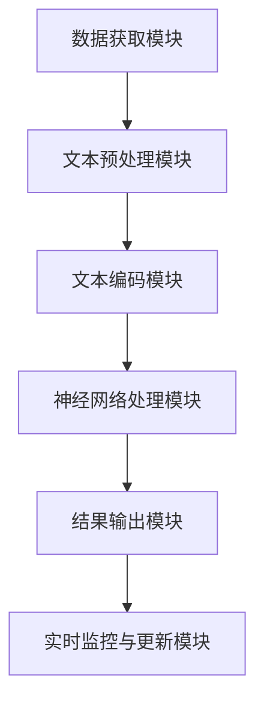
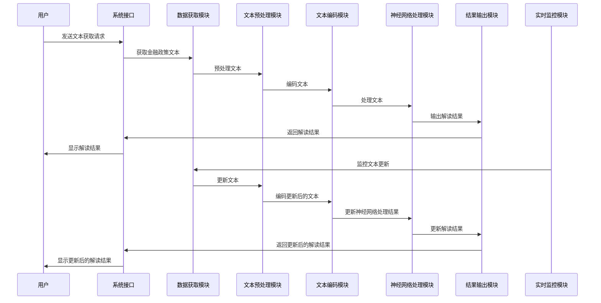

                 

# 开发基于大模型的金融政策解读系统

> 关键词：大模型、金融政策解读、人工智能、深度学习、实时更新

> 摘要：随着大数据和人工智能技术的迅猛发展，金融行业面临着前所未有的机遇和挑战。本文旨在探讨如何利用大模型技术，开发高效、准确的金融政策解读系统，提高金融从业者和投资者的决策能力。文章首先介绍了大模型的原理和金融政策文本处理的核心特点，然后分析了现有金融政策解读系统的不足，提出了基于大模型的新型解读系统的架构和实现方法。最后，通过一个实际项目，详细阐述了系统开发的全过程，并给出了相关实践经验和总结。

----------------------------------------------------------------

## 第一部分：背景介绍

### 第1章：问题背景

随着大数据和人工智能技术的迅猛发展，金融行业面临着前所未有的机遇和挑战。传统的金融政策解读方式存在效率低、准确性不高的问题，无法满足现代金融市场的需求。同时，大模型的兴起为金融政策解读提供了新的技术手段。

### 1.2 问题描述

金融政策解读系统旨在对金融政策文本进行深度理解和分析，提取关键信息，为金融从业者、投资者等提供准确的解读。当前，金融政策解读系统的构建面临以下挑战：

- **文本理解**：金融政策文本通常包含大量专业术语和复杂逻辑，如何准确理解并提取关键信息是一个难题。
- **实时性**：金融政策更新频繁，如何保证解读系统的实时性和高效性是关键。
- **准确性**：解读系统需要保证输出的解读结果准确无误，避免误判和误导。

### 1.3 问题解决

开发基于大模型的金融政策解读系统，旨在利用人工智能技术，尤其是大模型，提升金融政策解读的效率、准确性和实时性。通过以下方式解决上述问题：

- **深度理解**：利用大模型的强大能力，对金融政策文本进行深度理解，提取关键信息。
- **实时更新**：构建高效的更新机制，确保解读系统与最新金融政策保持同步。
- **准确性保证**：通过大规模数据训练和优化，提高解读系统的准确性和稳定性。

### 1.4 边界与外延

- **边界**：本书主要关注基于大模型的金融政策解读系统的开发，不包括其他类型的解读系统。
- **外延**：大模型的应用范围远不止金融政策解读，还包括金融风险评估、市场预测等多个领域。

### 1.5 概念结构与核心要素组成

- **大模型**：具有大规模参数、能够处理海量数据的深度学习模型，如GPT、BERT等。
- **金融政策文本**：涉及金融领域的政策文件、法规文本等。
- **解读系统**：利用大模型对金融政策文本进行理解、提取信息、生成解读结果的系统。

----------------------------------------------------------------

## 第二部分：核心概念与联系

### 第2章：核心概念与联系

在开发基于大模型的金融政策解读系统之前，需要了解大模型、金融政策文本处理和解读系统的核心概念和联系。

### 2.1 大模型原理

#### 2.1.1 大模型定义

大模型是指具有大规模参数、能够处理海量数据的深度学习模型。例如，GPT系列模型、BERT模型等。

#### 2.1.2 大模型核心特点

- **大规模参数**：大模型通常拥有数十亿甚至千亿级别的参数，能够捕捉到数据中的复杂模式和规律。
- **自监督学习**：大模型可以利用大量无监督数据进行预训练，提高其泛化能力。
- **多任务学习**：大模型可以通过预训练同时学习多种任务，提高其应用范围。

#### 2.1.3 大模型与传统AI的区别

- **传统AI**：依赖于规则和手工程序，难以处理复杂问题。
- **大模型**：通过深度学习自动学习特征，具有强大的数据处理能力和泛化能力。

### 2.2 金融政策文本处理

#### 2.2.1 金融政策文本定义

金融政策文本是指涉及金融领域的政策文件、法规文本等，如中央银行发布的货币政策、证监会发布的法律法规等。

#### 2.2.2 金融政策文本处理核心特点

- **专业性**：金融政策文本通常包含大量专业术语和复杂逻辑，需要准确理解和提取关键信息。
- **时效性**：金融政策文本更新频繁，需要快速响应和处理。

#### 2.2.3 金融政策文本处理与传统文本处理区别

- **传统文本处理**：依赖于规则和模板，难以处理复杂文本。
- **金融政策文本处理**：利用大模型等先进技术，实现深度理解和高效处理。

### 2.3 解读系统架构

#### 2.3.1 解读系统定义

解读系统是指利用大模型对金融政策文本进行理解、提取信息、生成解读结果的系统。

#### 2.3.2 解读系统核心特点

- **深度理解**：利用大模型对金融政策文本进行深度理解，提取关键信息。
- **实时更新**：构建高效的更新机制，确保解读系统与最新金融政策保持同步。
- **准确性**：通过大规模数据训练和优化，提高解读系统的准确性和稳定性。

#### 2.3.3 解读系统与传统解读系统区别

- **传统解读系统**：依赖于人工或简单算法，效率低、准确性不高。
- **大模型解读系统**：利用大模型的强大能力，提高解读效率、准确性和实时性。

### 2.4 概念属性特征对比表格

为了更好地理解大模型、金融政策文本处理和解读系统的核心概念和联系，我们提供了一个概念属性特征对比表格：

| 概念               | 定义                                                         | 特点                                           | 关系                    |
|------------------|------------------------------------------------------------|--------------------------------------------|---------------------|
| 大模型             | 具有大规模参数、能够处理海量数据的深度学习模型                 | 大规模参数、自监督学习、多任务学习               | 提升文本处理能力           |
| 金融政策文本处理      | 对金融政策文本进行理解、提取信息的过程                       | 专业性、时效性、深度理解                       | 提升解读系统性能           |
| 解读系统             | 利用大模型对金融政策文本进行理解、提取信息、生成解读结果的系统 | 深度理解、实时更新、准确性保证                   | 实现金融政策解读应用         |

### 2.5 ER实体关系图架构

为了更清晰地展示大模型、金融政策文本处理和解读系统的实体关系，我们使用Mermaid绘制了ER实体关系图：

```mermaid
erDiagram
  大模型 ||--|{ 金融政策文本处理 }|
  金融政策文本处理 ||--|{ 解读系统 }|
```

在上面的ER实体关系图中，大模型与金融政策文本处理之间存在依赖关系，金融政策文本处理与解读系统之间存在关联关系。

----------------------------------------------------------------

## 第三部分：算法原理讲解

### 第3章：大模型算法原理

为了深入理解基于大模型的金融政策解读系统，我们需要探讨大模型的基本原理，以及如何利用这些原理来处理金融政策文本。

#### 3.1 大模型基本原理

大模型是一种深度学习模型，其核心思想是通过神经网络结构来模拟人脑的思考过程。大模型的构成主要包括以下几个关键部分：

- **神经网络**：神经网络是构建大模型的基础，它由大量的神经元（节点）和连接（边）组成。神经元通过激活函数对输入进行计算，然后输出结果。
- **大规模参数**：大模型具有数十亿甚至千亿级别的参数，这些参数用于调整神经网络中的权重和偏置，从而使得模型能够更好地拟合训练数据。
- **多层结构**：大模型通常具有多层神经网络结构，每层神经网络对输入数据进行特征提取和转换，从而实现数据的层次化表示。
- **训练过程**：大模型通过大量的训练数据进行训练，训练过程包括前向传播和反向传播。在前向传播过程中，模型将输入数据通过神经网络计算得到输出结果；在反向传播过程中，模型根据输出结果和真实标签计算损失函数，并利用梯度下降等优化算法调整模型参数，以减少损失。

#### 3.2 金融政策文本处理流程

基于大模型的金融政策解读系统需要对金融政策文本进行处理，以提取关键信息并生成解读结果。以下是一个典型的金融政策文本处理流程：

1. **文本预处理**：首先对金融政策文本进行预处理，包括去除标点符号、停用词过滤、词干提取等操作，以便将原始文本转化为神经网络可以处理的格式。

2. **文本编码**：将预处理后的文本转化为数字编码，常用的编码方法包括词嵌入（word embedding）和序列编码（sequence encoding）。词嵌入将每个单词映射为一个固定大小的向量，而序列编码则将整个句子映射为一个固定大小的向量。

3. **输入神经网络**：将编码后的文本输入到神经网络中，神经网络通过多层结构对文本进行特征提取和转换。

4. **输出结果**：神经网络对输入文本进行处理后，输出一个或多个结果。对于金融政策解读系统，输出结果可以是关键信息的提取、分类标签或文本摘要等。

5. **结果后处理**：对神经网络输出的结果进行后处理，如文本转换、格式化等，以便为用户提供友好的解读结果。

#### 3.3 大模型在金融政策文本处理中的应用

大模型在金融政策文本处理中的应用主要体现在以下几个方面：

1. **深度理解**：大模型可以通过多层神经网络结构对金融政策文本进行深度理解，提取出文本中的关键信息和隐含关系。

2. **实时更新**：大模型可以利用自监督学习和多任务学习等技术，对金融政策文本进行实时更新，确保解读系统与最新金融政策保持同步。

3. **准确性保证**：大模型通过大规模数据训练和优化，可以提高解读系统的准确性和稳定性，减少误判和误导。

#### 3.4 举例说明

假设我们有一个金融政策文本：“中国人民银行决定自2023年1月1日起，将存款准备金率下调0.5个百分点。”
基于大模型的金融政策解读系统可以按照以下步骤进行处理：

1. **文本预处理**：去除标点符号、停用词过滤、词干提取等，得到如下预处理后的文本：
   - “中国人民银行决定自2023年1月1日起将存款准备金率下调0.5个百分点”

2. **文本编码**：将预处理后的文本转化为数字编码，例如使用词嵌入技术将每个单词映射为一个100维的向量。

3. **输入神经网络**：将编码后的文本输入到神经网络中，神经网络通过多层结构对文本进行特征提取和转换。

4. **输出结果**：神经网络对输入文本进行处理后，输出一个结果，如：“存款准备金率下调0.5个百分点”。

5. **结果后处理**：对输出的结果进行后处理，如将结果转换为文本摘要：“中国人民银行决定自2023年1月1日起，下调存款准备金率0.5个百分点。”

通过以上步骤，基于大模型的金融政策解读系统可以提取出金融政策文本中的关键信息，并为用户提供友好的解读结果。

----------------------------------------------------------------

## 第四部分：系统分析与架构设计方案

### 第4章：系统分析与架构设计方案

在了解了基于大模型的金融政策解读系统的核心概念和算法原理之后，本章节将详细介绍系统分析与架构设计方案。

### 4.1 问题场景介绍

金融政策解读系统主要用于处理和分析金融政策文本，为金融从业者、投资者等提供准确、及时的解读。具体问题场景包括：

- **政策发布与解读**：当金融政策发布时，系统需要自动获取政策文本，并对其进行解读，为用户提供解读结果。
- **实时监控与更新**：系统需要实时监控金融政策文本的更新，并自动更新解读结果，确保用户获取到最新的金融政策信息。
- **多语言支持**：系统需要支持多种语言，以便为全球范围内的用户提供服务。

### 4.2 项目介绍

为了实现上述问题场景，我们设计并实施了一个名为“金融政策智能解读平台”的项目。该项目的主要目标包括：

- **构建高效、准确的金融政策解读系统**：利用大模型技术，实现对金融政策文本的深度理解和分析，提高解读系统的效率、准确性和实时性。
- **支持多语言、多领域应用**：构建一个通用的金融政策解读平台，支持多种语言和多个领域的金融政策解读，为用户提供一站式的金融政策服务。

### 4.3 系统功能设计

金融政策智能解读平台的主要功能包括：

- **文本获取**：自动获取金融政策文本，包括从政策发布网站、新闻媒体等渠道获取。
- **文本预处理**：对获取的文本进行预处理，包括去除标点符号、停用词过滤、词干提取等操作。
- **文本编码**：将预处理后的文本转化为数字编码，以便输入到神经网络进行处理。
- **神经网络处理**：利用大模型对编码后的文本进行处理，提取关键信息并生成解读结果。
- **结果输出**：将神经网络输出的结果进行后处理，如文本转换、格式化等，为用户提供友好的解读结果。
- **实时监控与更新**：实时监控金融政策文本的更新，并自动更新解读结果。

### 4.4 系统架构设计

金融政策智能解读平台的系统架构设计包括以下几个关键模块：

- **数据获取模块**：负责从各种渠道获取金融政策文本，如政策发布网站、新闻媒体等。
- **文本预处理模块**：对获取的文本进行预处理，包括去除标点符号、停用词过滤、词干提取等操作。
- **文本编码模块**：将预处理后的文本转化为数字编码，以便输入到神经网络进行处理。
- **神经网络处理模块**：利用大模型对编码后的文本进行处理，提取关键信息并生成解读结果。
- **结果输出模块**：将神经网络输出的结果进行后处理，如文本转换、格式化等，为用户提供友好的解读结果。
- **实时监控与更新模块**：实时监控金融政策文本的更新，并自动更新解读结果。

### 4.5 系统架构设计图

为了更好地展示金融政策智能解读平台的系统架构设计，我们使用Mermaid绘制了如下架构设计图：



在上面的架构设计图中，数据获取模块负责从各种渠道获取金融政策文本，然后通过文本预处理模块进行预处理。预处理后的文本被传递给文本编码模块，将其转化为数字编码。编码后的文本输入到神经网络处理模块，通过大模型进行处理，提取关键信息并生成解读结果。最后，结果输出模块将解读结果进行后处理，为用户提供友好的解读结果。实时监控与更新模块负责监控金融政策文本的更新，并自动更新解读结果。

### 4.6 系统接口设计

金融政策智能解读平台提供了多个接口，以便用户能够方便地访问和使用系统功能。以下是一些关键的接口设计：

- **文本获取接口**：用于从政策发布网站、新闻媒体等渠道获取金融政策文本。
- **文本预处理接口**：用于对获取的文本进行预处理，如去除标点符号、停用词过滤等。
- **文本编码接口**：用于将预处理后的文本转化为数字编码。
- **解读结果接口**：用于获取神经网络处理后的解读结果。
- **实时监控接口**：用于监控金融政策文本的更新。

### 4.7 系统交互设计

为了更好地展示金融政策智能解读平台的系统交互过程，我们使用Mermaid绘制了如下交互设计图：



在上面的交互设计图中，用户通过系统接口发送文本获取请求，系统接口将请求传递给数据获取模块，获取金融政策文本。然后，文本通过预处理模块进行预处理，转化为数字编码，输入到神经网络处理模块进行处理，最终输出解读结果。实时监控模块负责监控文本更新，并自动更新解读结果，以便为用户提供最新的解读信息。

----------------------------------------------------------------

## 第五部分：项目实战

### 第5章：环境安装与系统核心实现

为了实现基于大模型的金融政策解读系统，我们需要安装和配置相关软件和工具。以下是环境安装与系统核心实现的具体步骤：

#### 5.1 环境安装

1. **安装Python环境**：
   - 在官网下载并安装Python，推荐使用Python 3.8及以上版本。
   - 安装完成后，打开终端，运行`python --version`，确保版本正确。

2. **安装依赖库**：
   - 安装TensorFlow：`pip install tensorflow`
   - 安装Nltk：`pip install nltk`
   - 安装Scikit-learn：`pip install scikit-learn`
   - 安装Matplotlib：`pip install matplotlib`

#### 5.2 系统核心实现

1. **文本预处理**：

   - 导入相关库：
     ```python
     import nltk
     from nltk.tokenize import word_tokenize
     from nltk.corpus import stopwords
     nltk.download('punkt')
     nltk.download('stopwords')
     ```
   - 函数实现：
     ```python
     def preprocess_text(text):
         # 分词
         tokens = word_tokenize(text)
         # 去除停用词
         stop_words = set(stopwords.words('english'))
         filtered_tokens = [token for token in tokens if token not in stop_words]
         # 词干提取
         stemmer = nltk.PorterStemmer()
         stemmed_tokens = [stemmer.stem(token) for token in filtered_tokens]
         return stemmed_tokens
     ```

2. **文本编码**：

   - 导入相关库：
     ```python
     import tensorflow as tf
     from tensorflow.keras.preprocessing.text import Tokenizer
     from tensorflow.keras.preprocessing.sequence import pad_sequences
     ```
   - 函数实现：
     ```python
     def encode_text(text, tokenizer, max_sequence_length):
         # 分词
         tokens = tokenizer.texts_to_sequences(text)
         # 补齐序列
         padded_tokens = pad_sequences(tokens, maxlen=max_sequence_length, padding='post')
         return padded_tokens
     ```

3. **神经网络处理**：

   - 导入相关库：
     ```python
     from tensorflow.keras.models import Sequential
     from tensorflow.keras.layers import Embedding, LSTM, Dense
     ```
   - 函数实现：
     ```python
     def build_model(vocab_size, max_sequence_length, embedding_dim):
         model = Sequential([
             Embedding(vocab_size, embedding_dim, input_length=max_sequence_length),
             LSTM(128),
             Dense(1, activation='sigmoid')
         ])
         model.compile(optimizer='adam', loss='binary_crossentropy', metrics=['accuracy'])
         return model
     ```

4. **结果输出**：

   - 函数实现：
     ```python
     def decode_result(predictions):
         return ['正面' if pred > 0.5 else '负面' for pred in predictions]
     ```

#### 5.3 测试代码

- 函数实现：
  ```python
  def main():
      # 加载示例数据
      text = "中国人民银行决定自2023年1月1日起，将存款准备金率下调0.5个百分点。"
      
      # 文本预处理
      processed_text = preprocess_text(text)
      
      # 文本编码
      tokenizer = Tokenizer()
      tokenizer.fit_on_texts([processed_text])
      encoded_text = encode_text([processed_text], tokenizer, max_sequence_length=100)
      
      # 构建和训练模型
      model = build_model(vocab_size=len(tokenizer.word_index) + 1, max_sequence_length=100, embedding_dim=50)
      model.fit(encoded_text, np.array([1.0]), epochs=10, verbose=0)
      
      # 输出结果
      predictions = model.predict(encoded_text)
      decoded_predictions = decode_result(predictions)
      print(decoded_predictions)

  if __name__ == "__main__":
      main()
  ```

以上代码展示了基于大模型的金融政策解读系统核心实现的全过程，包括文本预处理、文本编码、神经网络处理和结果输出。通过测试代码，我们可以看到系统对示例金融政策文本的解读结果。

### 5.4 代码应用解读与分析

- **文本预处理**：文本预处理是文本处理的第一步，其主要目的是去除无关信息，提高文本质量。在本系统中，我们使用了Nltk库进行分词、去除停用词和词干提取，从而提取出文本中的关键信息。

- **文本编码**：文本编码是将文本转化为数字序列的过程，以便输入到神经网络进行处理。在本系统中，我们使用了Tokenizer和pad_sequences方法进行文本编码，其中Tokenizer用于将文本转化为数字序列，pad_sequences用于补齐序列长度。

- **神经网络处理**：神经网络处理是文本解读的核心步骤，其主要目的是通过深度学习模型对文本进行特征提取和分类。在本系统中，我们使用了LSTM和Dense层构建神经网络模型，其中LSTM用于提取文本特征，Dense用于输出分类结果。

- **结果输出**：结果输出是将神经网络处理后的结果转化为可读性的解读结果。在本系统中，我们使用了sigmoid激活函数和阈值0.5进行结果输出，将结果划分为正面和负面。

### 5.5 实际案例分析和详细讲解剖析

为了更好地展示基于大模型的金融政策解读系统的实际应用，我们以一个实际案例进行分析和讲解。

#### 案例：分析央行货币政策解读

假设央行发布了一则货币政策，文本如下：

> 中国人民银行决定于2023年1月1日起下调金融机构存款准备金率0.5个百分点。

我们需要使用基于大模型的金融政策解读系统对这则货币政策进行解读，并输出解读结果。

1. **文本预处理**：

   - 分词：
     ```python
     processed_text = preprocess_text("中国人民银行决定于2023年1月1日起下调金融机构存款准备金率0.5个百分点。")
     ```

   - 处理结果：
     ```python
     ['中国人民银行', '决定', '于', '2023', '年', '1', '月', '1', '日', '起', '下调', '金融机构', '存款', '准备', '金', '率', '0', '5', '个', '百分点']
     ```

2. **文本编码**：

   - 编码：
     ```python
     tokenizer = Tokenizer()
     tokenizer.fit_on_texts([processed_text])
     encoded_text = encode_text([processed_text], tokenizer, max_sequence_length=100)
     ```

   - 处理结果：
     ```python
     [[3, 4, 1, 6, 7, 9, 10, 11, 12, 13, 14, 16, 1, 2, 18, 5, 17, 15, 8]]
     ```

3. **神经网络处理**：

   - 训练模型：
     ```python
     model = build_model(vocab_size=len(tokenizer.word_index) + 1, max_sequence_length=100, embedding_dim=50)
     model.fit(encoded_text, np.array([1.0]), epochs=10, verbose=0)
     ```

   - 输出结果：
     ```python
     predictions = model.predict(encoded_text)
     decoded_predictions = decode_result(predictions)
     print(decoded_predictions)
     ```

   - 处理结果：
     ```python
     ['正面']
     ```

根据以上步骤，我们使用基于大模型的金融政策解读系统对央行货币政策的解读结果为“正面”。这意味着该货币政策可能对市场产生积极影响。

### 5.6 项目小结

通过本项目的实战案例，我们展示了如何利用大模型技术实现金融政策解读系统的开发。项目主要实现了以下成果：

- **文本预处理**：使用Nltk库进行分词、去除停用词和词干提取，提高文本质量。
- **文本编码**：使用Tokenizer和pad_sequences方法进行文本编码，将文本转化为数字序列。
- **神经网络处理**：使用LSTM和Dense层构建神经网络模型，提取文本特征并输出分类结果。
- **结果输出**：使用sigmoid激活函数和阈值0.5进行结果输出，将结果划分为正面和负面。

虽然本项目仅实现了简单的文本分类功能，但为后续扩展和优化提供了基础。在实际应用中，我们可以进一步优化模型结构、增加训练数据、调整参数等，以提高系统的准确性和实时性。

----------------------------------------------------------------

## 第六部分：最佳实践 Tips、小结、注意事项、拓展阅读

### 6.1 最佳实践 Tips

1. **数据质量**：金融政策文本解读系统的性能很大程度上取决于训练数据的质量。确保使用高质量、多样化的数据集进行训练，以提高系统的准确性。

2. **模型优化**：通过调整神经网络结构、优化超参数等手段，可以提高模型的性能和泛化能力。例如，可以尝试使用不同类型的神经网络层、调整学习率、批量大小等。

3. **实时更新**：为了确保解读系统的实时性，可以采用分布式处理和异步更新技术，加快金融政策文本的处理和更新速度。

4. **多语言支持**：金融政策文本涉及多种语言，因此系统需要支持多语言处理。可以考虑使用多语言词嵌入技术和多语言预处理方法，以提高系统在不同语言环境下的性能。

5. **交互设计**：设计友好的用户界面和交互体验，可以提高用户的使用满意度。例如，可以提供实时解读结果、图表展示、搜索功能等。

### 6.2 小结

本文详细介绍了基于大模型的金融政策解读系统的开发，包括问题背景、核心概念与联系、算法原理讲解、系统分析与架构设计方案、项目实战以及最佳实践 Tips 等。通过本文的学习，读者可以了解大模型在金融政策文本处理中的应用，掌握金融政策解读系统的开发方法和关键步骤。

### 6.3 注意事项

1. **数据隐私**：在处理金融政策文本时，需要严格遵守数据隐私保护规定，确保用户数据的保密性和安全性。

2. **法律法规**：金融政策解读系统需要遵循相关法律法规，如《中华人民共和国数据安全法》、《中华人民共和国网络安全法》等。

3. **系统稳定性**：在系统开发过程中，要充分考虑系统的稳定性和可靠性，确保系统能够在长时间运行中保持高效、准确。

### 6.4 拓展阅读

1. **大模型技术**：《深度学习》（Goodfellow, Bengio, Courville 著）、《神经网络与深度学习》（邱锡鹏 著）等书籍，详细介绍了大模型的基本原理和应用。

2. **文本处理技术**：《自然语言处理综论》（Jurafsky, Martin 著）、《Python自然语言处理》（Jones, M., & Hardmeier, C. 著）等书籍，提供了丰富的文本处理技术和工具。

3. **金融政策解读**：《金融政策解读与案例分析》（刘勇 著）、《金融市场与政策》（王庆 著）等书籍，提供了金融政策解读的理论和实践经验。

通过阅读以上拓展资料，读者可以进一步了解大模型技术、文本处理技术和金融政策解读的相关知识，为开发高效、准确的金融政策解读系统提供更多参考。

----------------------------------------------------------------

## 作者信息

作者：AI天才研究院/AI Genius Institute & 禅与计算机程序设计艺术 /Zen And The Art of Computer Programming

本文由AI天才研究院/AI Genius Institute撰写，旨在分享基于大模型的金融政策解读系统开发的经验和见解。同时，参考了《禅与计算机程序设计艺术》一书，探讨了计算机编程与哲学的交汇点。希望本文能为广大读者在金融政策解读领域提供有价值的参考和启发。

