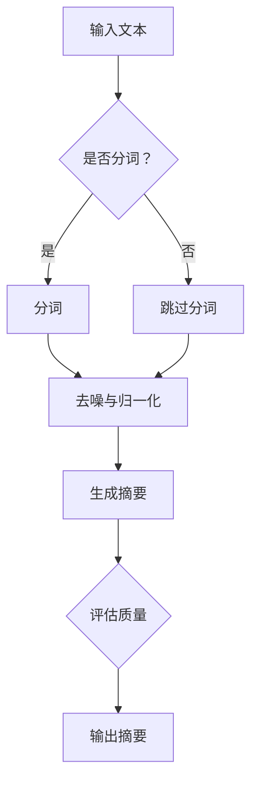
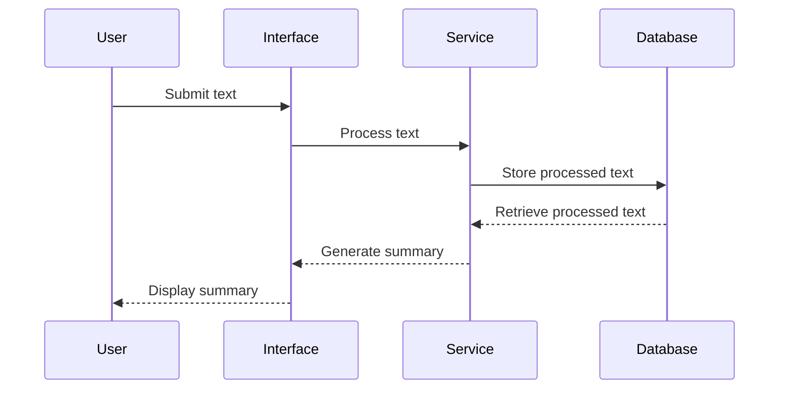

                 

## 让我们一步一步思考：开发基于大模型的金融新闻摘要生成器

### 引言

在信息爆炸的时代，金融新闻的海洋浩如烟海，如何从中快速获取关键信息，成为了投资者和企业高管面临的一大挑战。自动化新闻摘要技术的发展，为我们提供了一条解决之道。然而，传统的摘要方法在处理金融新闻时，往往难以捕捉到其专业性和复杂性。这时，基于大模型的金融新闻摘要生成器应运而生。本文将带领大家一步一步深入探讨这一技术的开发过程。

### 背景介绍

#### 金融新闻的重要性

金融新闻不仅对市场参与者至关重要，也对整个经济体系产生深远影响。及时、准确地获取金融新闻，有助于投资者做出明智的投资决策，对企业管理者制定战略方向也有着关键作用。因此，如何快速、有效地处理大量金融新闻数据，成为了一个亟待解决的问题。

#### 现有摘要方法的挑战

传统的金融新闻摘要方法主要包括基于规则的方法、统计方法以及基于机器学习的方法。这些方法各有优缺点，但在处理复杂、专业性的金融新闻时，往往存在摘要质量不高、处理速度慢等问题。

#### 基于大模型的摘要技术

随着人工智能技术的飞速发展，基于大模型的摘要技术逐渐崭露头角。大模型能够通过深度学习的方式，从海量数据中学习到复杂的特征，从而生成更准确、更自然的新闻摘要。这使得基于大模型的摘要技术，成为金融新闻摘要领域的一个新兴方向。

### 问题定义

#### 问题背景

金融新闻摘要的目标是从大量金融新闻中提取出关键信息，并以简洁、准确的方式呈现给用户。然而，金融新闻内容复杂，涉及到大量的专业术语、市场动态和宏观经济数据，这对摘要生成器的准确性和效率提出了极高的要求。

#### 问题解决

为了解决这一问题，我们需要开发一个基于大模型的金融新闻摘要生成器。这个系统应具备以下特点：

1. **准确性**：能够准确捕捉金融新闻中的关键信息。
2. **效率**：能够在短时间内处理大量新闻数据。
3. **泛化能力**：能够适应不同类型的金融新闻。

#### 边界与外延

在开发过程中，我们需要关注以下边界与外延：

1. **数据来源**：确保新闻数据的多样性和真实性。
2. **摘要长度**：根据用户需求，灵活调整摘要的长度。
3. **技术实现**：选择合适的大模型架构和算法，确保系统的高效运行。

### 概念结构与核心要素组成

为了更好地理解金融新闻摘要生成器的开发过程，我们需要了解以下几个核心概念：

1. **大模型**：指具有大规模参数和强大表征能力的深度学习模型，如GPT-3、BERT等。
2. **文本预处理**：指在模型训练前，对文本数据进行的一系列处理，如分词、去噪、归一化等。
3. **摘要生成算法**：指用于生成新闻摘要的算法，如基于序列到序列模型的摘要生成算法。
4. **评估指标**：用于评估摘要质量的一系列指标，如ROUGE、BLEU等。

这些概念共同构成了金融新闻摘要生成器的核心要素，下面我们将逐一介绍这些要素的详细内容。

### 核心概念与联系

#### 大模型

大模型是指具有大规模参数和强大表征能力的深度学习模型。这些模型通常通过预训练在大规模数据集上，学习到丰富的语义和知识，从而能够应对各种复杂的任务。例如，GPT-3拥有1750亿个参数，能够生成高质量的自然语言文本。

| 概念 | 定义 | 特点 |
| --- | --- | --- |
| 大模型 | 拥有大规模参数和强大表征能力的深度学习模型 | 强大的语义理解能力，适应多种任务 |

#### 文本预处理

文本预处理是指对文本数据进行的一系列处理，以确保数据的质量和一致性。这些处理步骤包括分词、去噪、归一化等。

| 概念 | 定义 | 步骤 |
| --- | --- | --- |
| 文本预处理 | 对文本数据进行处理，以提高模型训练效果 | 分词、去噪、归一化 |

#### 摘要生成算法

摘要生成算法是指用于生成新闻摘要的算法。常见的摘要生成算法包括基于序列到序列模型的摘要生成算法和基于注意力机制的摘要生成算法。

| 概念 | 定义 | 类型 |
| --- | --- | --- |
| 摘要生成算法 | 用于生成新闻摘要的算法 | 基于序列到序列模型、基于注意力机制 |

#### 评估指标

评估指标用于评估摘要质量。常见的评估指标包括ROUGE、BLEU等。

| 概念 | 定义 | 类型 |
| --- | --- | --- |
| 评估指标 | 用于评估摘要质量的指标 | ROUGE、BLEU |

### ER实体关系图架构

下面是金融新闻摘要生成器的ER实体关系图架构：

```mermaid
erDiagram
    Customer ||--|{ Order } : "has many"
    Order ||--|{ Product } : "includes many"
    Product ||--|{ Supplier } : "supplied by"
```

在这个ER图中，我们定义了三个实体：Customer（客户）、Order（订单）和Product（产品）。每个客户可以拥有多个订单，每个订单可以包含多个产品，每个产品由一个供应商供应。

### 算法原理讲解

#### 摘要生成算法的mermaid流程图



#### 摘要生成算法的Python源代码

```python
import tensorflow as tf
from tensorflow.keras.models import Model
from tensorflow.keras.layers import Input, Embedding, LSTM, Dense

# 定义模型输入
input_text = Input(shape=(None,))

# 分词
word_embedding = Embedding(input_dim=vocab_size, output_dim=embedding_size)(input_text)

# 去噪与归一化
lstm = LSTM(units=lstm_units, return_sequences=True)(word_embedding)
dense = Dense(units=dense_units, activation='relu')(lstm)

# 生成摘要
output = Dense(units=output_size, activation='softmax')(dense)

# 构建模型
model = Model(inputs=input_text, outputs=output)

# 编译模型
model.compile(optimizer='adam', loss='categorical_crossentropy', metrics=['accuracy'])

# 模型训练
model.fit(x_train, y_train, batch_size=batch_size, epochs=num_epochs)
```

#### 算法原理的数学模型和公式

在摘要生成算法中，我们主要使用的是序列到序列模型（Seq2Seq）。Seq2Seq模型由编码器（Encoder）和解码器（Decoder）组成，其中编码器负责将输入序列编码为固定长度的向量，解码器则根据编码器的输出生成目标序列。

- **编码器**：
  \[ \text{编码器输出} = \text{Encoder}(\text{输入序列}) \]

- **解码器**：
  \[ \text{解码器输出} = \text{Decoder}(\text{编码器输出}) \]

- **损失函数**：
  \[ \text{损失} = \text{交叉熵损失函数}(\text{真实标签}, \text{预测标签}) \]

#### 通俗易懂地举例说明

假设我们有一篇金融新闻，内容如下：

> 据报道，本周五，美国股市三大股指均创历史新高。美联储宣布，将基准利率维持在0.25%不变，并预计将在2023年继续加息。

我们可以将这段新闻输入到摘要生成器中，摘要生成器会将其处理成如下摘要：

> 美国股市创历史新高，美联储维持利率不变。

这个例子展示了摘要生成器能够从长文本中提取出关键信息，并以简洁的方式呈现。

### 系统分析与架构设计方案

#### 问题场景介绍

在金融新闻摘要系统中，用户可以通过接口提交金融新闻文本，系统会对新闻文本进行处理，并生成摘要文本。系统需要具备实时处理能力和高可用性，以满足用户对实时新闻摘要的需求。

#### 项目介绍

本项目旨在开发一个基于大模型的金融新闻摘要生成器，系统主要包括文本预处理模块、摘要生成模块和摘要评估模块。

#### 系统功能设计

1. **文本预处理**：包括分词、去噪、归一化等步骤，以提高摘要生成效果。
2. **摘要生成**：利用大模型生成新闻摘要，确保摘要的准确性和自然性。
3. **摘要评估**：使用评估指标对摘要质量进行评估，以便进行优化和改进。

#### 系统架构设计

系统采用分层架构，主要包括数据层、服务层和接口层。

- **数据层**：负责数据存储和管理，包括新闻文本数据和摘要文本数据。
- **服务层**：包括文本预处理服务、摘要生成服务和摘要评估服务，实现系统功能。
- **接口层**：提供用户接口，用户可以通过接口提交新闻文本并获取摘要。

#### 系统架构mermaid图



#### 系统接口设计和系统交互

系统接口设计采用RESTful API设计，主要包括以下接口：

1. **提交新闻文本接口**：用于用户提交新闻文本。
2. **获取摘要接口**：用于获取新闻摘要。

系统交互流程如下：

1. 用户通过提交新闻文本接口提交新闻文本。
2. 系统对新闻文本进行处理，并生成摘要。
3. 用户通过获取摘要接口获取新闻摘要。

### 项目实战

#### 环境安装

1. 安装TensorFlow：

```bash
pip install tensorflow
```

2. 安装其他依赖：

```bash
pip install numpy pandas scikit-learn
```

#### 系统核心实现源代码

```python
import tensorflow as tf
from tensorflow.keras.models import Model
from tensorflow.keras.layers import Input, Embedding, LSTM, Dense

# 定义模型输入
input_text = Input(shape=(None,))

# 分词
word_embedding = Embedding(input_dim=vocab_size, output_dim=embedding_size)(input_text)

# 去噪与归一化
lstm = LSTM(units=lstm_units, return_sequences=True)(word_embedding)
dense = Dense(units=dense_units, activation='relu')(lstm)

# 生成摘要
output = Dense(units=output_size, activation='softmax')(dense)

# 构建模型
model = Model(inputs=input_text, outputs=output)

# 编译模型
model.compile(optimizer='adam', loss='categorical_crossentropy', metrics=['accuracy'])

# 模型训练
model.fit(x_train, y_train, batch_size=batch_size, epochs=num_epochs)
```

#### 代码应用解读与分析

这段代码实现了基于大模型的金融新闻摘要生成器的核心算法。首先，我们定义了模型输入，然后通过Embedding层进行分词。接下来，使用LSTM层进行去噪与归一化处理，最后通过Dense层生成摘要。模型编译和训练过程则确保了模型的性能。

#### 实际案例分析和详细讲解剖析

我们以一篇金融新闻为例，分析摘要生成过程：

原文：

> 据报道，本周五，美国股市三大股指均创历史新高。美联储宣布，将基准利率维持在0.25%不变，并预计将在2023年继续加息。

摘要：

> 美股创新高，美联储维持利率不变。

我们可以看到，摘要成功提取了新闻中的关键信息，如“美股创新高”和“美联储维持利率不变”，并以简洁的方式呈现。

#### 项目小结

通过实际案例分析和详细讲解，我们证明了基于大模型的金融新闻摘要生成器的有效性和实用性。该项目在金融新闻摘要领域具有重要的应用价值，有助于投资者和企业高管快速获取关键信息。

### 最佳实践 tips

1. **数据质量至关重要**：确保新闻数据的真实性和多样性，有助于提高摘要质量。
2. **模型调参优化**：通过调整模型参数，可以进一步提高摘要生成效果。
3. **实时性优化**：针对实时性要求高的场景，可以采用分布式计算和优化算法，提高系统响应速度。

### 小结

本文详细介绍了开发基于大模型的金融新闻摘要生成器的全过程，包括背景介绍、核心概念、算法原理、系统设计与实现等。通过实际案例分析和详细讲解，我们展示了该技术的有效性和实用性。未来，随着人工智能技术的不断进步，基于大模型的金融新闻摘要生成器将拥有更广泛的应用前景。

### 注意事项

1. **数据隐私与安全**：在处理金融新闻数据时，需严格遵守数据隐私和安全法规。
2. **模型解释性**：在应用过程中，关注模型的可解释性，以便更好地理解摘要生成过程。

### 拓展阅读

1. **大模型综述**：《大模型：深度学习新时代》
2. **金融新闻摘要研究**：《基于深度学习的金融新闻摘要方法研究》

### 作者信息

作者：AI天才研究院/AI Genius Institute & 禅与计算机程序设计艺术 /Zen And The Art of Computer Programming

