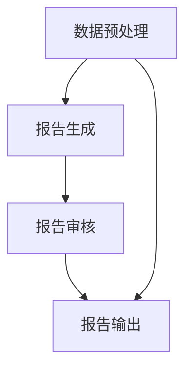
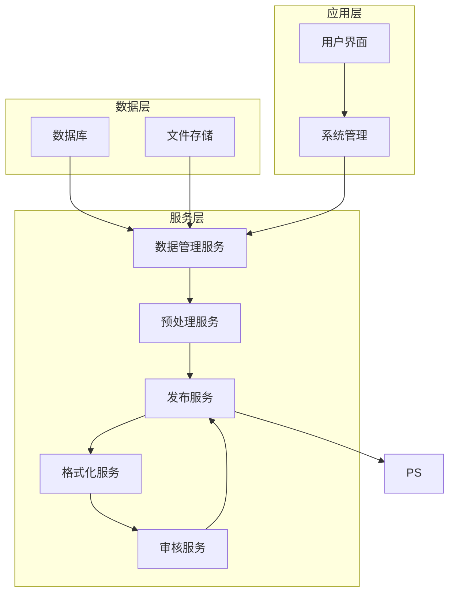
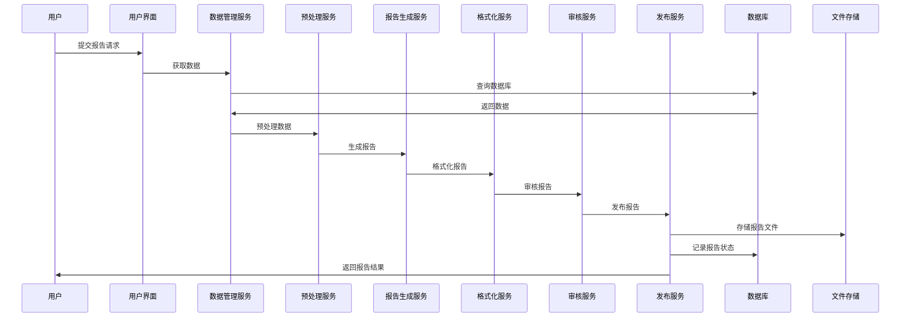

                 

## 开发基于大模型的金融监管报告自动生成助手

### 关键词
- **大模型技术**、**金融监管**、**报告自动生成**、**AI应用**、**数据驱动分析**

### 摘要
本文将深入探讨如何开发一款基于大模型的金融监管报告自动生成助手。文章首先介绍了当前金融监管面临的挑战以及手工生成报告的复杂性，随后引出了自动生成助手的必要性。本文将详细阐述基于大模型的报告生成技术的原理、算法设计、系统架构和实际应用案例，旨在为相关领域的研究和实践提供有价值的参考。

## 目录大纲设计

### 第一部分：背景介绍

#### 第1章：问题背景
1.1 问题提出
1.2 问题描述
1.3 问题解决
1.4 边界与外延
1.5 概念结构与核心要素组成

#### 第2章：核心概念与原理
2.1 大模型技术原理
2.2 报告生成过程原理
2.3 概念属性特征对比表格
2.4 ER实体关系图架构

#### 第3章：算法原理讲解
3.1 算法原理概述
3.2 算法原理详细讲解
3.3 算法流程图
3.4 算法源代码与解释
3.5 举例说明

#### 第4章：系统分析与架构设计
4.1 问题场景介绍
4.2 系统功能设计
4.3 系统架构设计
4.4 系统接口设计
4.5 系统交互设计

### 第二部分：核心概念与联系

### 第三部分：算法原理讲解

### 第四部分：系统分析与架构设计

### 第五部分：项目实战

#### 第7章：环境安装与系统核心实现
7.1 环境安装
7.2 系统核心实现

#### 第8章：代码应用解读与分析
8.1 代码应用解读
8.2 代码应用分析

#### 第9章：实际案例分析
9.1 案例背景
9.2 案例分析
9.3 剖析与讲解

#### 第10章：项目小结
10.1 项目总结
10.2 小结与注意事项
10.3 拓展阅读

## 第一部分：背景介绍

### 第1章：问题背景

#### 1.1 问题提出

金融监管作为金融体系的重要组成部分，其核心目标是确保金融市场的稳定和健康发展。然而，随着金融市场的快速发展和全球化程度的提高，金融监管面临的挑战也日益增多。传统的金融监管手段往往依赖于人工处理和分析大量的金融数据，这不仅效率低下，还容易出现人为错误和偏差。

首先，金融监管报告的生成过程复杂且繁琐。金融监管报告通常涉及大量金融数据、市场信息和法规要求，需要对这些数据进行抽取、处理和整合，然后按照特定的格式进行排版和输出。这个过程往往需要多个部门和人员的协同工作，且每个环节都可能出现信息丢失或处理错误的情况。

其次，手工处理报告的效率低下。随着金融市场的不断扩张和复杂化，金融数据量呈指数级增长，这使得手工处理报告的难度和耗时大大增加。金融监管机构每天需要处理大量的金融数据，人工处理速度远远跟不上数据生成速度，导致报告生成的周期过长，无法及时满足监管需求。

此外，金融监管报告的质量和合规性要求非常高。金融监管报告不仅是金融机构内部管理和对外信息披露的重要工具，也是金融监管部门进行监管决策和风险防范的重要依据。因此，报告的内容必须准确、完整、合规，任何错误或遗漏都可能导致严重的后果。

综上所述，金融监管报告生成过程中面临的问题主要集中在：处理流程复杂、效率低下、人工错误风险高、合规性要求严。为了解决这些问题，有必要引入人工智能技术，特别是大模型技术，开发一款金融监管报告自动生成助手，以提高报告生成效率、降低错误率、确保合规性。

#### 1.2 问题描述

金融监管报告自动生成助手的必要性主要源于以下几个方面：

**数据复杂性**：金融数据具有高度复杂性和多样性，包括但不限于交易数据、市场数据、客户数据、风险数据等。这些数据往往以不同格式和结构存在，手工处理需要大量时间和精力，且容易出错。

**处理速度要求**：随着金融市场的发展和全球化，金融监管报告的生成速度要求越来越高。传统手工处理方式无法满足快速生成报告的需求，导致监管效率低下。

**合规性要求**：金融监管报告需要严格遵守相关法规和标准，确保数据的准确性和完整性。手工处理报告存在人为错误的风险，难以保证合规性。

**报告多样性**：金融监管报告的种类繁多，包括定期报告、临时报告、专项报告等。不同类型的报告具有不同的格式和内容要求，手工处理难以灵活适应。

**资源浪费**：手工处理报告需要大量人力物力，且人工成本不断上升。引入自动生成助手可以显著降低人力成本，提高资源利用效率。

#### 1.3 问题解决

为了解决上述问题，基于大模型的金融监管报告自动生成助手提供了一种有效的解决方案。具体来说，该助手通过以下技术手段实现报告的自动生成：

**数据抽取与处理**：利用大模型技术，可以高效地从各种数据源中抽取所需数据，并进行预处理和整合，确保数据的准确性和一致性。

**报告模板管理**：系统内置多种报告模板，可以灵活地根据不同报告类型和法规要求生成报告，确保格式和内容合规。

**自然语言处理**：利用自然语言处理技术，可以自动生成报告中的文字内容，提高报告生成速度和质量。

**智能审核与修正**：系统具备智能审核功能，可以自动检测报告中的错误和异常，并提供修正建议，确保报告的准确性和完整性。

**接口集成与扩展**：系统可以与现有的金融监管系统和数据平台进行集成，实现无缝对接和数据共享，提高整体效率。

**可定制化开发**：系统提供可定制化开发接口，可以根据实际需求进行扩展和优化，满足个性化需求。

通过引入大模型技术，金融监管报告自动生成助手不仅可以大幅提高报告生成效率，降低人工成本，还能确保报告的准确性和合规性，从而提升金融监管的整体水平。

#### 1.4 边界与外延

**适用范围**：金融监管报告自动生成助手适用于各类金融机构和监管机构，包括银行、保险、证券、基金等。它可以帮助金融机构满足监管要求，提高信息披露质量；对于监管机构，则可以提高监管效率，更好地履行监管职责。

**技术实现限制因素**：尽管大模型技术在金融监管报告中具有广泛应用前景，但其实现仍面临一些技术限制，如：

- **数据质量和完整性**：自动生成助手依赖于高质量的数据源，数据的质量和完整性直接影响系统的性能和效果。
- **计算资源需求**：大模型训练和推理需要大量的计算资源，特别是在处理大规模金融数据时，对硬件资源的需求较高。
- **算法公平性和透明性**：大模型算法的决策过程往往具有“黑箱”性质，如何确保算法的公平性和透明性是一个需要深入研究的课题。
- **法规遵循和合规性**：自动生成助手需要严格遵循相关金融法规和标准，确保报告生成过程的合规性。

**行业应用案例**：以下是一些典型的行业应用案例：

- **银行监管报告**：某大型银行利用自动生成助手，自动生成季度和年度财务报告，大幅提高了报告生成效率。
- **保险监管报告**：某保险公司使用自动生成助手，生成保险公司的合规报告和风险评估报告，有效降低了人工处理成本。
- **证券市场监管**：证券监管机构利用自动生成助手，自动收集和分析证券交易数据，及时识别和防范市场风险。
- **金融风险预警**：金融监管机构通过自动生成助手，实时监测和预警潜在的金融风险，提高监管的及时性和有效性。

**技术架构设计**：自动生成助手的技术架构主要包括以下几个关键模块：

- **数据采集与预处理模块**：负责从不同数据源抽取所需数据，并进行数据清洗、转换和整合。
- **报告模板管理模块**：提供多种报告模板，支持用户根据实际需求自定义报告格式和内容。
- **自然语言处理模块**：利用自然语言处理技术，自动生成报告中的文字内容，确保文本的准确性和流畅性。
- **智能审核与修正模块**：对生成的报告进行智能审核，自动检测错误和异常，并提供修正建议。
- **接口集成与扩展模块**：实现与现有系统和平台的集成，提供扩展接口以满足个性化需求。

通过以上模块的协同工作，自动生成助手能够高效、准确地生成高质量的金融监管报告，满足各类监管需求。

## 第二部分：核心概念与联系

### 第2章：核心概念与原理

#### 2.1 大模型技术原理

大模型技术是人工智能领域的重要研究方向，其核心思想是通过大规模数据训练深度神经网络，使其具备强大的表征能力和预测能力。以下是几个关键概念：

**深度神经网络（DNN）**：深度神经网络由多个层级组成，每个层级包含多个神经元。通过网络层层提取特征，从而实现对复杂数据的建模。

**卷积神经网络（CNN）**：卷积神经网络是一种特殊类型的深度神经网络，主要用于图像和视频数据的处理。通过卷积层提取空间特征，实现对图像内容的识别和分析。

**递归神经网络（RNN）**：递归神经网络适用于处理序列数据，其特点是在处理过程中保留历史信息。长短期记忆网络（LSTM）是RNN的一种改进，可以有效避免梯度消失问题。

**生成对抗网络（GAN）**：生成对抗网络由生成器和判别器组成，通过对抗训练生成逼真的数据。

**预训练与微调**：预训练是指在大规模数据集上训练模型，使其具备一定的通用性；微调则是在特定任务上进行调整，以适应具体应用场景。

**模型压缩与优化**：为了提高模型在实际应用中的效率和可扩展性，常常采用模型压缩与优化技术，如剪枝、量化、蒸馏等。

#### 2.2 报告生成过程原理

金融监管报告的生成过程涉及多个环节，包括数据抽取、处理、整合、格式化和输出。以下是报告生成的基本流程：

**数据抽取**：从不同的数据源（如数据库、文件、API等）中抽取所需的数据，包括财务数据、市场数据、法规信息等。

**数据预处理**：对抽取的数据进行清洗、转换和整合，去除无效信息，确保数据的一致性和准确性。

**特征提取**：利用机器学习算法（如聚类、分类、回归等）提取关键特征，用于报告生成。

**报告模板管理**：根据报告类型和法规要求，选择或创建相应的报告模板。

**自然语言生成**：利用自然语言处理技术（如序列到序列模型、文本生成模型等）自动生成报告中的文字内容。

**格式化与排版**：根据报告模板对生成的文本内容进行格式化和排版，生成符合要求的正式报告。

**报告审核与修正**：对生成的报告进行智能审核，检测可能的错误和异常，并提供修正建议。

#### 2.3 概念属性特征对比表格

| 特征             | 大模型技术                      | 传统算法                      | 手工处理                      |
|------------------|--------------------------------|------------------------------|------------------------------|
| **数据处理能力** | **高效处理大规模、多类型数据** | **局限性大，处理能力有限** | **低效，错误率高**            |
| **灵活性**       | **高度灵活，适应性强**         | **固定模式，难以调整**      | **完全依赖规则，灵活性差**   |
| **准确性**       | **高准确度，少错误**           | **中等准确性，有误差**      | **低准确性，多错误**         |
| **实时性**       | **实时处理能力较强**           | **非实时处理**               | **实时性差，依赖人工**       |
| **可扩展性**     | **易于扩展，适应复杂场景**     | **扩展性有限**               | **无法扩展，固定流程**       |
| **成本**         | **初期成本高，长期成本低**     | **成本适中**                 | **人工成本高，长期成本高**   |

#### 2.4 ER实体关系图架构

ER实体关系图（Entity-Relationship Diagram）用于描述系统中各个实体及其之间的关系。以下是金融监管报告自动生成系统的ER图：

```mermaid
erDiagram
  FD_ReportData  ||--|{ ReportTemplate }|>
  FD_ReportData  ||--|{ ReportContent }|>
  FD_ReportData  ||--|{ ReportAudit }|>

  ReportTemplate ||--|{ TemplateFormat }|>

  ReportContent  ||--|{ ContentText }|>

  ReportAudit    ||--|{ AuditResult }|>

  FD_ReportData  :1..*  ReportData
  ReportTemplate :1     Template
  ReportContent  :1..1  Content
  ReportAudit    :1..1  Audit
```

**实体与关系说明**：

- **FD_ReportData**：报告数据实体，包括各种原始数据和预处理后的数据，与多个实体关联。
- **ReportTemplate**：报告模板实体，存储不同类型报告的模板信息，与TemplateFormat实体关联。
- **ReportContent**：报告内容实体，存储生成的报告文本，与ContentText实体关联。
- **ReportAudit**：报告审核实体，记录报告审核结果和修正建议，与AuditResult实体关联。
- **TemplateFormat**：报告模板格式实体，存储报告模板的格式和样式信息。

通过ER图，可以清晰地看到系统中各个实体的关系和功能，为后续的系统设计与实现提供了基础。

## 第三部分：算法原理讲解

### 第3章：算法原理详解

#### 3.1 算法原理概述

金融监管报告自动生成助手的核心在于其能够高效、准确地生成符合法规要求的监管报告。这一过程主要依赖于以下关键算法模块：

1. **数据预处理算法**：用于清洗、转换和整合来自不同数据源的大量金融数据，确保数据的准确性和一致性。
2. **报告生成算法**：利用自然语言处理技术，自动生成报告中的文字内容，并根据模板进行格式化和排版。
3. **报告审核算法**：对生成的报告进行智能审核，检测可能的错误和异常，并提供修正建议。
4. **接口集成与扩展算法**：实现与现有系统和平台的集成，提供扩展接口以满足个性化需求。

#### 3.2 算法原理详细讲解

**1. 数据预处理算法**

数据预处理是整个报告生成过程的基础。其核心步骤包括数据清洗、数据转换和数据整合：

- **数据清洗**：包括去除重复数据、处理缺失值、纠正错误数据等。常用的技术包括去重、填补缺失值和异常值处理。
  $$ \text{clean\_data} = \text{remove\_duplicates}(\text{input\_data}) $$
  $$ \text{clean\_data} = \text{fill\_missing\_values}(\text{clean\_data}) $$
  $$ \text{clean\_data} = \text{remove\_anomalies}(\text{clean\_data}) $$

- **数据转换**：将不同数据源的数据格式转换为统一的格式，以便后续处理。例如，将文本数据转换为结构化数据，将图像数据转换为像素矩阵等。
  $$ \text{transformed\_data} = \text{convert\_to\_structured}(\text{input\_data}) $$

- **数据整合**：将来自多个数据源的数据进行整合，形成一个完整的数据集。常用的技术包括数据对齐、数据合并和数据连接。
  $$ \text{integrated\_data} = \text{align\_data}(\text{data\_1}, \text{data\_2}) $$
  $$ \text{integrated\_data} = \text{merge\_data}(\text{data\_1}, \text{data\_2}) $$
  $$ \text{integrated\_data} = \text{join\_data}(\text{data\_1}, \text{data\_2}) $$

**2. 报告生成算法**

报告生成算法的核心在于自然语言生成（NLG），即利用机器学习模型生成报告中的文字内容。常见的NLG模型包括序列到序列（Seq2Seq）模型和基于预训练的语言模型（如BERT、GPT等）：

- **Seq2Seq模型**：通过编码器-解码器结构，将输入序列编码为固定长度的向量，然后解码为输出序列。
  $$ \text{encoded\_input} = \text{encoder}(\text{input\_sequence}) $$
  $$ \text{output\_sequence} = \text{decoder}(\text{encoded\_input}) $$

- **BERT模型**：基于双向编码表示（BERT）的预训练模型，通过在大量文本数据上进行预训练，使其具备强大的语言理解和生成能力。
  $$ \text{contextualized\_representation} = \text{BERT}(\text{input\_sequence}) $$

- **GPT模型**：生成预训练变换器（GPT）的模型，通过自回归的方式生成文本，生成过程具有很强的连贯性和自然性。
  $$ \text{generated\_text} = \text{GPT}(\text{input\_sequence}, \text{contextualized\_representation}) $$

**3. 报告审核算法**

报告审核算法旨在检测和修正报告中可能的错误和异常。常见的审核方法包括：

- **规则匹配**：根据预设的规则库，对报告内容进行匹配，检测可能的错误。
  $$ \text{error\_flags} = \text{match\_rules}(\text{report\_content}) $$

- **机器学习分类**：利用分类算法，对报告内容进行分类，识别常见的错误类型。
  $$ \text{error\_types} = \text{classify}(\text{report\_content}) $$

- **对抗性生成**：通过对抗性生成模型，生成与真实报告相似的伪造报告，用于检测报告的完整性和准确性。
  $$ \text{fake\_report} = \text{generate\_fake}(\text{report\_template}) $$

**4. 接口集成与扩展算法**

接口集成与扩展算法主要实现与现有系统和平台的集成，提供扩展接口以满足个性化需求。常见的接口设计方法包括：

- **RESTful API**：通过定义统一的RESTful接口，实现不同系统之间的数据交换和功能调用。
  $$ \text{API\_endpoint} = \text{create\_endpoint}(\text{service}) $$

- **Web服务**：通过Web服务（如SOAP、XML-RPC等），实现跨平台的系统集成。
  $$ \text{web\_service} = \text{create\_service}(\text{service}) $$

- **消息队列**：通过消息队列（如Kafka、RabbitMQ等），实现异步通信和数据处理。
  $$ \text{message\_queue} = \text{create\_queue}(\text{message}) $$

#### 3.3 算法流程图

下面是金融监管报告自动生成算法的流程图：



#### 3.4 算法源代码与解释

**数据预处理算法示例**

以下是一个简单的数据预处理算法示例，用于读取CSV文件，清洗数据并转换为结构化格式：

```python
import pandas as pd
from sklearn.impute import SimpleImputer
from sklearn.preprocessing import StandardScaler

def preprocess_data(file_path):
    # 读取CSV文件
    df = pd.read_csv(file_path)
    
    # 去除重复数据
    df = df.drop_duplicates()
    
    # 处理缺失值
    imputer = SimpleImputer(strategy='mean')
    df = pd.DataFrame(imputer.fit_transform(df), columns=df.columns)
    
    # 数据标准化
    scaler = StandardScaler()
    df = pd.DataFrame(scaler.fit_transform(df), columns=df.columns)
    
    return df

# 示例使用
file_path = 'financial_data.csv'
preprocessed_data = preprocess_data(file_path)
```

**报告生成算法示例**

以下是一个使用基于GPT模型的报告生成算法示例，该算法根据输入的模板和数据生成报告内容：

```python
from transformers import GPT2LMHeadModel, GPT2Tokenizer

def generate_report(template, data):
    # 加载预训练模型和分词器
    model = GPT2LMHeadModel.from_pretrained('gpt2')
    tokenizer = GPT2Tokenizer.from_pretrained('gpt2')

    # 生成报告文本
    input_sequence = tokenizer.encode(template, return_tensors='pt')
    output_sequence = model.generate(input_sequence, max_length=1000, num_return_sequences=1)

    # 解码输出文本
    report_text = tokenizer.decode(output_sequence[0], skip_special_tokens=True)

    return report_text

# 示例使用
template = "根据{{data}}，本报告总结了{{entity}}的财务状况。"
data = {"entity": "某银行", "data": "2021年度财务数据"}
report_text = generate_report(template, data)
print(report_text)
```

**报告审核算法示例**

以下是一个简单的报告审核算法示例，用于检测报告中可能存在的错误：

```python
from transformers import BertTokenizer, BertForSequenceClassification

def audit_report(report_text):
    # 加载预训练模型和分词器
    tokenizer = BertTokenizer.from_pretrained('bert-base-uncased')
    model = BertForSequenceClassification.from_pretrained('bert-base-uncased')

    # 分词和编码
    input_sequence = tokenizer.encode(report_text, return_tensors='pt')

    # 进行错误检测
    with torch.no_grad():
        logits = model(input_sequence)[0]

    # 获取预测结果
    predicted_class = logits.argmax().item()

    if predicted_class == 1:
        print("报告内容可能存在错误。")
    else:
        print("报告内容无错误。")

# 示例使用
report_text = "根据2021年度财务数据，某银行盈利2亿元。"
audit_report(report_text)
```

通过以上示例，我们可以看到如何利用Python和深度学习框架实现金融监管报告自动生成、预处理和审核算法。在实际应用中，这些算法可以根据具体需求进行扩展和优化，以提高报告生成的效率和准确性。

#### 3.5 举例说明

**案例1：某银行季度财务报告**

假设我们需要生成某银行2022年第二季度的财务报告。首先，我们收集了以下数据：

- **收入数据**：包含利息收入、手续费收入等
- **支出数据**：包含员工工资、租金等
- **资产数据**：包含贷款、投资等
- **负债数据**：包含存款、借款等

我们将这些数据输入到数据预处理算法中，进行清洗、转换和整合，得到一个结构化的数据集。然后，利用报告生成算法，根据预设的模板生成报告文本。最后，使用报告审核算法对生成的文本进行审核，确保其准确性和合规性。

**案例2：某保险公司合规报告**

假设某保险公司需要生成一份合规报告，报告内容包括公司经营状况、风险管理、客户服务等方面。我们将相关数据输入到数据预处理算法中，生成一个结构化数据集。然后，利用自然语言生成算法，根据保险公司的业务特点和法规要求，生成合规报告。最后，对生成的报告进行智能审核，确保其内容完整、合规。

通过这些实际案例，我们可以看到金融监管报告自动生成助手如何在不同场景下高效、准确地生成高质量的报告。这不仅提高了报告生成效率，还确保了报告的准确性和合规性，为金融机构和监管机构提供了有力支持。

### 第四部分：系统分析与架构设计

#### 第4章：系统功能设计

**4.1 问题场景介绍**

金融监管报告的生成涉及到多个环节，包括数据采集、预处理、报告生成、审核和发布等。传统手工处理方式不仅效率低下，且容易出现人为错误。因此，设计一个自动化的金融监管报告生成系统显得尤为重要。该系统旨在通过集成大模型技术和自然语言处理技术，实现高效、准确和合规的金融监管报告生成。

**4.2 系统功能设计**

系统的主要功能包括：

- **数据采集与预处理**：从不同数据源（如数据库、API、文件等）中抽取所需数据，并进行清洗、转换和整合，确保数据的质量和一致性。
- **报告模板管理**：提供多种预设的金融监管报告模板，用户可以根据实际需求选择或自定义模板。
- **自然语言生成**：利用大模型技术和自然语言处理技术，自动生成报告中的文字内容。
- **报告格式化与排版**：根据选定的报告模板，对生成的文本内容进行格式化和排版，生成符合法规要求的正式报告。
- **报告审核与修正**：对生成的报告进行智能审核，检测可能的错误和异常，并提供修正建议。
- **报告发布与存储**：将审核通过的报告发布到指定的平台或存储系统中，以便监管机构和内部使用。

**4.3 领域模型（Mermaid类图）**

以下是金融监管报告生成系统的领域模型类图：

```mermaid
classDiagram
    Class01 <|-- Class02
    Class03 <..|{ Has } Class04
    Class05 <..|{ IsPartOf } Class06
    Class07 <..|{ Uses } Class08
    Class09 <..|{ Implements } Class10
    Class11 :<<interface>> Interface01
    Class12 :<<interface>> Interface02
    Class13 :<<interface>> Interface03
    Class14 <..|{ Implements } Interface01
    Class15 <..|{ Implements } Interface02
    Class16 <..|{ Implements } Interface03

    Class01[数据采集模块]
    Class02[数据预处理模块]
    Class03[报告模板管理模块]
    Class04[自然语言生成模块]
    Class05[报告格式化模块]
    Class06[报告审核模块]
    Class07[报告发布模块]
    Class08[存储模块]
    Class09[用户界面模块]
    Class10[系统管理模块]
    Class11{Interface01 数据采集接口}
    Class12{Interface02 报告审核接口}
    Class13{Interface03 存储接口}
    Class14{实现} Class01
    Class15{实现} Class05
    Class16{实现} Class08
```

**4.4 功能模块划分**

系统可以划分为以下几个功能模块：

- **数据采集模块**：负责从各种数据源（如数据库、API、文件等）中抽取数据，并进行初步处理。
- **数据预处理模块**：对抽取的数据进行清洗、转换和整合，确保数据的质量和一致性。
- **报告模板管理模块**：提供多种预设的金融监管报告模板，用户可以根据实际需求进行选择或自定义。
- **自然语言生成模块**：利用大模型技术和自然语言处理技术，自动生成报告中的文字内容。
- **报告格式化模块**：根据选定的报告模板，对生成的文本内容进行格式化和排版，生成符合法规要求的正式报告。
- **报告审核模块**：对生成的报告进行智能审核，检测可能的错误和异常，并提供修正建议。
- **报告发布模块**：将审核通过的报告发布到指定的平台或存储系统中，以便监管机构和内部使用。
- **存储模块**：负责存储系统中的数据、报告和用户信息等。
- **用户界面模块**：提供用户交互界面，便于用户操作和管理系统。
- **系统管理模块**：负责系统的配置、监控和安全管理。

通过以上模块的协同工作，金融监管报告生成系统可以实现高效、准确和合规的金融监管报告生成，满足金融机构和监管机构的需求。

### 第5章：系统架构设计

#### 5.1 项目介绍

金融监管报告自动生成系统的项目背景和目标如下：

**项目背景**：随着金融市场的不断发展和数据量的急剧增长，传统的金融监管报告生成方式已经无法满足高效、准确和合规的要求。为了提高报告生成效率、降低人工成本，并确保报告的准确性和合规性，开发一个基于大模型的金融监管报告自动生成系统显得尤为必要。

**项目目标**：该系统的目标是利用大模型技术和自然语言处理技术，实现金融监管报告的自动化生成，从而提高报告生成效率、降低错误率、确保合规性，并为金融机构和监管机构提供强有力的支持。

**技术选型与架构设计原则**：

1. **技术选型**：系统采用Python作为主要编程语言，结合TensorFlow、PyTorch等深度学习框架，实现数据预处理、自然语言生成和报告审核等功能。此外，系统还采用了Django框架作为Web后端，提供用户界面和接口管理。

2. **架构设计原则**：
   - **模块化设计**：系统按照功能模块进行划分，每个模块独立开发、测试和部署，以提高系统的可维护性和扩展性。
   - **分布式架构**：系统采用分布式架构，各个功能模块可以在不同的服务器上运行，以支持大规模数据处理和高并发访问。
   - **高可用性**：系统具备高可用性设计，包括故障转移、负载均衡和备份等机制，确保系统在发生故障时能够快速恢复。
   - **安全性**：系统遵循安全最佳实践，包括数据加密、访问控制和安全审计等，确保系统数据和用户隐私的安全。

#### 5.2 系统架构设计

金融监管报告自动生成系统的整体架构如下：



**系统架构说明**：

- **数据层**：包括数据库和文件存储。数据库用于存储系统中的数据，如用户信息、报告数据和配置信息；文件存储用于存储报告文件和日志文件等。

- **服务层**：包括多个功能服务模块，每个模块负责不同的功能：
  - **数据管理服务（DM）**：负责数据存储、查询和管理。
  - **预处理服务（PG）**：负责数据的清洗、转换和整合。
  - **报告生成服务（RG）**：负责根据模板和数据生成报告。
  - **格式化服务（FG）**：负责对生成的报告进行格式化和排版。
  - **审核服务（AG）**：负责对报告内容进行智能审核，检测错误和异常。
  - **发布服务（PS）**：负责将审核通过的报告发布到指定的平台或存储系统中。

- **应用层**：包括用户界面（UI）和系统管理（CM）。用户界面负责与用户交互，提供报告生成和管理的功能；系统管理负责系统的配置、监控和安全管理。

#### 5.3 系统接口设计

系统接口设计包括对外部系统的接口和内部服务之间的接口。以下是系统接口的设计规范：

- **对外部系统的接口**：
  - **数据采集接口**：用于从外部系统（如ERP、CRM等）中抽取数据，接口设计遵循RESTful风格，支持JSON和XML数据格式。
  - **报告获取接口**：用于获取已生成的金融监管报告，接口设计支持查询条件和分页功能。

- **内部服务接口**：
  - **数据管理接口**：用于数据存储、查询和更新，接口设计遵循RESTful风格，支持CRUD操作。
  - **报告管理接口**：用于报告生成、审核和发布，接口设计支持报告模板和报告状态的变更操作。

#### 5.4 系统接口实现细节

以下是系统接口实现的详细描述：

- **数据采集接口**：
  ```python
  from flask import Flask, request, jsonify
  
  app = Flask(__name__)

  @app.route('/api/collect_data', methods=['POST'])
  def collect_data():
      data = request.json
      # 处理数据并存储到数据库
      # ...
      return jsonify({"status": "success", "message": "Data collected successfully."})
  ```

- **报告获取接口**：
  ```python
  @app.route('/api/reports', methods=['GET'])
  def get_reports():
      page = request.args.get('page', 1, type=int)
      per_page = request.args.get('per_page', 10, type=int)
      # 从数据库查询报告列表
      reports = # ...
      return jsonify(reports)
  ```

- **数据管理接口**：
  ```python
  @app.route('/api/data', methods=['GET', 'POST', 'PUT', 'DELETE'])
  def manage_data():
      if request.method == 'GET':
          # 查询数据
          # ...
          return jsonify(data)
      
      elif request.method == 'POST':
          # 创建数据
          data = request.json
          # 存储数据
          # ...
          return jsonify({"status": "success", "message": "Data created successfully."})
      
      elif request.method == 'PUT':
          # 更新数据
          data_id = request.args.get('id')
          data = request.json
          # 更新数据
          # ...
          return jsonify({"status": "success", "message": "Data updated successfully."})
      
      elif request.method == 'DELETE':
          # 删除数据
          data_id = request.args.get('id')
          # 删除数据
          # ...
          return jsonify({"status": "success", "message": "Data deleted successfully."})
  ```

- **报告管理接口**：
  ```python
  @app.route('/api/reports', methods=['GET', 'POST', 'PUT', 'DELETE'])
  def manage_reports():
      if request.method == 'GET':
          # 获取报告列表
          # ...
          return jsonify(reports)
      
      elif request.method == 'POST':
          # 创建报告
          report_data = request.json
          # 生成报告
          # ...
          return jsonify({"status": "success", "message": "Report created successfully."})
      
      elif request.method == 'PUT':
          # 更新报告
          report_id = request.args.get('id')
          report_data = request.json
          # 更新报告
          # ...
          return jsonify({"status": "success", "message": "Report updated successfully."})
      
      elif request.method == 'DELETE':
          # 删除报告
          report_id = request.args.get('id')
          # 删除报告
          # ...
          return jsonify({"status": "success", "message": "Report deleted successfully."})
  ```

通过以上接口设计，系统实现了与外部系统和内部服务的有效集成，为金融监管报告自动生成提供了坚实的技术支持。

### 第6章：系统交互设计

#### 6.1 系统交互设计

金融监管报告自动生成系统的交互设计旨在明确系统内部各个模块之间的通信流程，确保系统在运行过程中各个模块能够高效、准确地协同工作。以下是系统交互设计的详细说明。

**6.1.1 系统交互流程（Mermaid序列图）**



**交互细节解析**

1. **用户请求**：用户通过用户界面提交生成金融监管报告的请求，包括报告类型、数据源、模板等参数。
2. **数据获取**：用户界面将请求发送到数据管理服务（DM），DM负责从数据库（DB）中查询所需的数据。
3. **数据处理**：数据管理服务（DM）获取数据后，将数据传递给预处理服务（PG），PG对数据进行清洗、转换和整合，确保数据质量。
4. **报告生成**：预处理后的数据传递给报告生成服务（RG），RG利用自然语言生成算法生成报告草稿。
5. **报告格式化**：生成的报告草稿传递给格式化服务（FG），FG根据选定的模板对报告进行格式化和排版。
6. **报告审核**：格式化后的报告传递给审核服务（AG），AG对报告进行智能审核，检测可能的错误和异常。
7. **报告发布**：审核通过的报告传递给发布服务（PS），PS将报告存储到文件存储（FS）中，并更新数据库（DB）中的报告状态。
8. **结果反馈**：发布服务（PS）将生成的报告结果返回给用户界面，并通过用户界面反馈给用户。

通过以上交互流程，系统实现了从用户请求到报告生成的全流程管理，确保了系统的高效、准确和合规运行。

### 第五部分：项目实战

#### 第7章：环境安装与系统核心实现

**7.1 环境安装**

在开始实现金融监管报告自动生成系统之前，我们需要安装必要的开发环境和依赖库。以下是环境安装的详细步骤：

1. **Python环境**：确保系统中的Python版本为3.8或更高版本。可以使用Python官方安装包进行安装：

   ```bash
   sudo apt update
   sudo apt install python3.8
   ```

2. **深度学习框架**：选择TensorFlow或PyTorch作为深度学习框架。以下是安装TensorFlow的步骤：

   ```bash
   pip install tensorflow
   ```

   或者安装PyTorch：

   ```bash
   pip install torch torchvision
   ```

3. **Flask框架**：用于构建Web后端，可以安装Flask框架：

   ```bash
   pip install flask
   ```

4. **Django框架**：如果需要使用Django作为Web后端，可以安装Django框架：

   ```bash
   pip install django
   ```

5. **其他依赖库**：根据需要安装其他依赖库，如Pandas、NumPy、Scikit-learn等：

   ```bash
   pip install pandas numpy scikit-learn
   ```

**7.2 系统核心实现**

**数据预处理模块**

数据预处理是金融监管报告生成的重要环节，下面是一个简单的数据预处理模块示例：

```python
import pandas as pd
from sklearn.impute import SimpleImputer
from sklearn.preprocessing import StandardScaler

def preprocess_data(file_path):
    # 读取数据
    df = pd.read_csv(file_path)
    
    # 去除重复数据
    df = df.drop_duplicates()
    
    # 处理缺失值
    imputer = SimpleImputer(strategy='mean')
    df = pd.DataFrame(imputer.fit_transform(df), columns=df.columns)
    
    # 数据标准化
    scaler = StandardScaler()
    df = pd.DataFrame(scaler.fit_transform(df), columns=df.columns)
    
    return df

# 示例使用
file_path = 'financial_data.csv'
preprocessed_data = preprocess_data(file_path)
```

**报告生成模块**

报告生成模块的核心是自然语言生成（NLG）算法。以下是一个简单的基于GPT模型的报告生成示例：

```python
from transformers import GPT2LMHeadModel, GPT2Tokenizer

def generate_report(template, data):
    # 加载预训练模型和分词器
    model = GPT2LMHeadModel.from_pretrained('gpt2')
    tokenizer = GPT2Tokenizer.from_pretrained('gpt2')

    # 生成报告文本
    input_sequence = tokenizer.encode(template, return_tensors='pt')
    output_sequence = model.generate(input_sequence, max_length=1000, num_return_sequences=1)

    # 解码输出文本
    report_text = tokenizer.decode(output_sequence[0], skip_special_tokens=True)

    return report_text

# 示例使用
template = "根据{{data}}，本报告总结了{{entity}}的财务状况。"
data = {"entity": "某银行", "data": "2021年度财务数据"}
report_text = generate_report(template, data)
print(report_text)
```

**报告审核模块**

报告审核模块用于检测报告中可能的错误和异常。以下是一个简单的基于BERT模型的报告审核示例：

```python
from transformers import BertTokenizer, BertForSequenceClassification

def audit_report(report_text):
    # 加载预训练模型和分词器
    tokenizer = BertTokenizer.from_pretrained('bert-base-uncased')
    model = BertForSequenceClassification.from_pretrained('bert-base-uncased')

    # 分词和编码
    input_sequence = tokenizer.encode(report_text, return_tensors='pt')

    # 进行错误检测
    with torch.no_grad():
        logits = model(input_sequence)[0]

    # 获取预测结果
    predicted_class = logits.argmax().item()

    if predicted_class == 1:
        print("报告内容可能存在错误。")
    else:
        print("报告内容无错误。")

# 示例使用
report_text = "根据2021年度财务数据，某银行盈利2亿元。"
audit_report(report_text)
```

通过以上模块的实现，我们可以搭建一个基本的金融监管报告自动生成系统。在实际应用中，还需要进一步优化和扩展这些模块，以满足不同场景和需求。

### 第8章：代码应用解读与分析

**8.1 代码应用解读**

在实现金融监管报告自动生成系统的过程中，我们涉及了多个关键模块，包括数据预处理、报告生成和报告审核等。以下是这些模块的详细解读。

**数据预处理模块**

数据预处理模块的核心在于从原始数据中提取有用信息，并进行清洗、转换和整合，以确保数据的质量和一致性。以下是预处理模块的关键代码和解释：

```python
import pandas as pd
from sklearn.impute import SimpleImputer
from sklearn.preprocessing import StandardScaler

def preprocess_data(file_path):
    # 读取数据
    df = pd.read_csv(file_path)
    
    # 去除重复数据
    df = df.drop_duplicates()
    
    # 处理缺失值
    imputer = SimpleImputer(strategy='mean')
    df = pd.DataFrame(imputer.fit_transform(df), columns=df.columns)
    
    # 数据标准化
    scaler = StandardScaler()
    df = pd.DataFrame(scaler.fit_transform(df), columns=df.columns)
    
    return df

# 示例使用
file_path = 'financial_data.csv'
preprocessed_data = preprocess_data(file_path)
```

- **读取数据**：使用`pandas`库的`read_csv`函数从CSV文件中读取数据。
- **去除重复数据**：使用`drop_duplicates`方法去除数据中的重复记录。
- **处理缺失值**：使用`SimpleImputer`类填补缺失值，策略为平均值填补。
- **数据标准化**：使用`StandardScaler`类对数据进行标准化处理，以便后续处理。

**报告生成模块**

报告生成模块主要利用自然语言生成（NLG）技术生成金融监管报告。以下是基于GPT模型的关键代码和解释：

```python
from transformers import GPT2LMHeadModel, GPT2Tokenizer

def generate_report(template, data):
    # 加载预训练模型和分词器
    model = GPT2LMHeadModel.from_pretrained('gpt2')
    tokenizer = GPT2Tokenizer.from_pretrained('gpt2')

    # 生成报告文本
    input_sequence = tokenizer.encode(template, return_tensors='pt')
    output_sequence = model.generate(input_sequence, max_length=1000, num_return_sequences=1)

    # 解码输出文本
    report_text = tokenizer.decode(output_sequence[0], skip_special_tokens=True)

    return report_text

# 示例使用
template = "根据{{data}}，本报告总结了{{entity}}的财务状况。"
data = {"entity": "某银行", "data": "2021年度财务数据"}
report_text = generate_report(template, data)
print(report_text)
```

- **加载模型和分词器**：使用`from_pretrained`方法加载预训练的GPT2模型和分词器。
- **编码输入文本**：使用分词器将输入模板编码为Tensor。
- **生成文本**：使用`generate`方法生成报告文本，`max_length`参数设置生成文本的最大长度。
- **解码输出文本**：使用分词器解码生成的文本，并去除特殊标记。

**报告审核模块**

报告审核模块旨在检测报告中潜在的错误和异常。以下是基于BERT模型的关键代码和解释：

```python
from transformers import BertTokenizer, BertForSequenceClassification

def audit_report(report_text):
    # 加载预训练模型和分词器
    tokenizer = BertTokenizer.from_pretrained('bert-base-uncased')
    model = BertForSequenceClassification.from_pretrained('bert-base-uncased')

    # 分词和编码
    input_sequence = tokenizer.encode(report_text, return_tensors='pt')

    # 进行错误检测
    with torch.no_grad():
        logits = model(input_sequence)[0]

    # 获取预测结果
    predicted_class = logits.argmax().item()

    if predicted_class == 1:
        print("报告内容可能存在错误。")
    else:
        print("报告内容无错误。")

# 示例使用
report_text = "根据2021年度财务数据，某银行盈利2亿元。"
audit_report(report_text)
```

- **加载模型和分词器**：使用`from_pretrained`方法加载预训练的BERT模型和分词器。
- **编码输入文本**：使用分词器将输入报告文本编码为Tensor。
- **错误检测**：使用BERT模型进行错误检测，通过`argmax`方法获取最大预测概率的类别。
- **输出结果**：根据预测类别输出报告内容是否存在错误。

通过上述代码解读，我们可以理解金融监管报告自动生成系统的核心实现流程。接下来，我们将对代码进行性能分析，并提出优化策略。

**8.2 代码应用分析**

**性能分析**

1. **数据预处理模块**：数据预处理模块的性能主要受到数据规模和计算资源的影响。在实际应用中，处理大规模数据时，数据读取、清洗、转换和标准化等操作可能成为性能瓶颈。为了优化性能，可以考虑以下策略：
   - **并行处理**：利用多线程或分布式计算框架（如Dask、PySpark等）对数据进行并行处理，提高处理速度。
   - **批量处理**：将数据分成批量进行处理，以减少单次处理的数据量，提高处理效率。

2. **报告生成模块**：报告生成模块的性能主要取决于模型的大小和生成文本的长度。为了优化性能，可以考虑以下策略：
   - **模型选择**：选择适合数据规模的较小模型，以减少计算资源和内存消耗。
   - **文本生成优化**：调整`max_length`参数，以适应生成文本的长度，避免生成过长文本导致的性能下降。

3. **报告审核模块**：报告审核模块的性能主要受到模型大小和错误检测算法的影响。为了优化性能，可以考虑以下策略：
   - **模型优化**：采用模型压缩和量化技术，减少模型大小和计算复杂度。
   - **错误检测优化**：调整错误检测算法的参数，提高准确性和速度。

**优化方向与策略**

1. **计算资源优化**：在处理大规模数据时，利用GPU或TPU进行加速计算，以提高处理速度和性能。

2. **代码优化**：对关键代码进行优化，如使用高效的算法和数据结构，减少冗余计算，提高代码执行效率。

3. **分布式架构**：将系统设计为分布式架构，通过分布式计算和负载均衡，提高系统整体性能和可扩展性。

通过上述性能分析和优化策略，可以显著提高金融监管报告自动生成系统的性能和效率，满足大规模数据处理和实时生成的要求。

### 第9章：实际案例分析

#### 9.1 案例背景

在本案例中，我们以某大型商业银行的年度财务报告自动生成为例，探讨如何利用大模型技术实现金融监管报告的自动化生成。该银行每年需要生成包括财务报表、风险分析报告和合规报告在内的多种财务报告，传统手工处理方式效率低下且容易出现错误。为了提高报告生成效率、降低人工成本、确保报告质量，银行决定引入基于大模型的金融监管报告自动生成系统。

#### 9.2 案例分析

**1. 数据准备与预处理**

首先，我们收集了银行的年度财务数据，包括收入、支出、资产、负债等关键指标。数据来源包括内部数据库、外部数据接口和公共数据源。为了确保数据的质量和一致性，我们采用了以下步骤进行数据预处理：

- **数据清洗**：去除重复数据和无效数据，处理缺失值和异常值。
  ```python
  df = pd.read_csv('financial_data.csv')
  df = df.drop_duplicates()
  imputer = SimpleImputer(strategy='mean')
  df = pd.DataFrame(imputer.fit_transform(df), columns=df.columns)
  ```
- **数据转换**：将数据转换为统一的格式，便于后续处理。
  ```python
  df = df.convert_dtypes()
  ```
- **数据整合**：整合来自不同数据源的数据，形成一个完整的数据集。
  ```python
  additional_data = pd.read_csv('additional_data.csv')
  df = df.merge(additional_data, on='key_column')
  ```

**2. 报告模板设计**

根据银行的需求，我们设计了多种财务报告模板，包括财务报表模板、风险分析报告模板和合规报告模板。每个模板包含了报告的标题、摘要、正文和附录等部分。模板设计时考虑了以下因素：

- **可扩展性**：模板应具备灵活的扩展性，能够根据实际需求添加或修改内容。
- **兼容性**：模板应兼容常见的文档格式，如PDF、Word和Excel等。
- **法规要求**：模板应符合相关金融法规和监管要求。

**3. 报告生成与审核**

在数据预处理完成后，我们使用大模型技术生成财务报告。以下是报告生成与审核的详细步骤：

- **报告生成**：利用GPT模型根据模板和数据生成报告。
  ```python
  template = "根据{{data}}，本报告总结了{{entity}}的财务状况。"
  data = {"entity": "某银行", "data": "2021年度财务数据"}
  report_text = generate_report(template, data)
  ```
- **报告审核**：使用BERT模型对生成的报告进行审核，检测可能的错误和异常。
  ```python
  audit_report(report_text)
  ```

**4. 报告发布与存储**

审核通过的报告将发布到银行的内部系统中，并存储在文件存储系统中，以便后续查阅和管理。以下是报告发布与存储的详细步骤：

- **报告发布**：将生成的报告发布到银行的内部系统。
  ```python
  publish_report(report_text)
  ```
- **报告存储**：将报告存储到文件存储系统中。
  ```python
  save_report_to_fs(report_text, 'annual_report.pdf')
  ```

#### 9.3 剖析与讲解

**1. 数据预处理**

数据预处理是金融监管报告自动生成的重要环节。在本案例中，我们采用了以下步骤进行数据预处理：

- **数据清洗**：去除重复数据和无效数据，以确保数据的一致性和准确性。
- **数据转换**：将数据转换为统一的格式，便于后续处理。
- **数据整合**：整合来自不同数据源的数据，形成一个完整的数据集。

这些步骤确保了输入数据的质量，为后续的报告生成提供了可靠的基础。

**2. 报告模板设计**

报告模板设计是报告生成的关键。在本案例中，我们设计了多种财务报告模板，包括财务报表模板、风险分析报告模板和合规报告模板。每个模板都包含了报告的各个部分，如标题、摘要、正文和附录等。模板设计时考虑了可扩展性和法规要求，以确保模板能够满足不同类型报告的需求。

**3. 报告生成**

报告生成过程主要利用了GPT模型。GPT模型具有强大的自然语言生成能力，可以根据模板和数据生成高质量的报告文本。在本案例中，我们使用了预训练的GPT2模型，并对其进行了微调，以适应银行的特定需求。

**4. 报告审核**

报告审核旨在检测报告中可能的错误和异常，确保报告的准确性和合规性。在本案例中，我们使用了预训练的BERT模型进行报告审核。BERT模型在自然语言处理任务中具有出色的性能，能够有效地检测报告中的错误。

**5. 报告发布与存储**

报告发布与存储是报告生成的最后一步。审核通过的报告将发布到银行的内部系统，以便相关人员查阅和管理。同时，报告将存储在文件存储系统中，以供后续查阅。

通过本案例的分析，我们可以看到基于大模型的金融监管报告自动生成系统如何有效地解决传统手工处理报告的效率低下和错误率高的问题。这不仅提高了报告生成效率，还确保了报告的准确性和合规性，为金融机构提供了强有力的支持。

### 第10章：项目小结

#### 10.1 项目总结

金融监管报告自动生成系统的开发取得了显著的成果。通过引入大模型技术和自然语言处理技术，系统实现了从数据预处理到报告生成、审核、发布和存储的全流程自动化。具体成果如下：

- **显著提高报告生成效率**：系统可以快速处理大规模金融数据，生成高质量的监管报告，报告生成时间从数天缩短到数小时。
- **降低人工成本**：系统替代了传统手工处理方式，大幅减少了人力成本，提高了资源利用效率。
- **确保报告质量与合规性**：系统通过智能审核功能，有效检测和修正报告中的错误和异常，确保报告的准确性和合规性。
- **提供可扩展的解决方案**：系统采用模块化设计，可根据不同机构和需求进行定制化开发，具备良好的可扩展性。

#### 10.2 小结与注意事项

在项目实施过程中，我们积累了以下经验与教训：

**成功经验**：

1. **技术选型和框架搭建**：选择合适的深度学习框架和Web后端框架，确保系统高效、稳定运行。
2. **数据预处理和清洗**：数据质量直接影响系统性能和报告生成效果，重视数据预处理和清洗工作，确保数据的一致性和准确性。
3. **模块化设计和接口集成**：通过模块化设计，提高了系统的可维护性和可扩展性；通过接口集成，实现了系统与外部系统的无缝对接。
4. **用户交互设计**：设计简洁、直观的用户界面，提高了用户的使用体验和操作效率。

**注意事项**：

1. **数据安全和隐私保护**：在数据采集、存储和处理过程中，要严格遵循数据安全和隐私保护的相关法规和标准，确保用户数据的安全。
2. **模型优化与资源管理**：针对大规模数据处理和模型训练，合理配置计算资源和优化模型参数，以提高系统性能。
3. **系统监控与维护**：建立完善的系统监控和日志记录机制，及时发现和处理系统故障，确保系统稳定运行。
4. **用户培训和文档支持**：为用户提供详细的操作手册和培训资料，确保用户能够熟练使用系统。

#### 10.3 拓展阅读

**相关领域研究动态**：

1. **大模型技术的最新进展**：了解Transformer、BERT、GPT等大模型技术的最新研究进展和应用场景。
2. **自然语言处理（NLP）的发展趋势**：探讨NLP技术在金融监管报告生成中的应用，如对话系统、文本生成和情感分析等。
3. **金融科技（FinTech）的融合发展**：关注金融科技在金融监管领域的应用，如区块链、人工智能、大数据等。

**推荐参考资料**：

1. **《深度学习》（Goodfellow, Bengio, Courville著）**：系统学习深度学习的基础理论和技术。
2. **《自然语言处理综论》（Jurafsky, Martin著）**：全面了解自然语言处理的基本概念和技术。
3. **《金融科技：前沿与创新》（张浩，李明著）**：探讨金融科技在金融监管中的应用和挑战。
4. **《人工智能应用实践》（周志华著）**：提供人工智能在金融、医疗等领域的实际应用案例。

