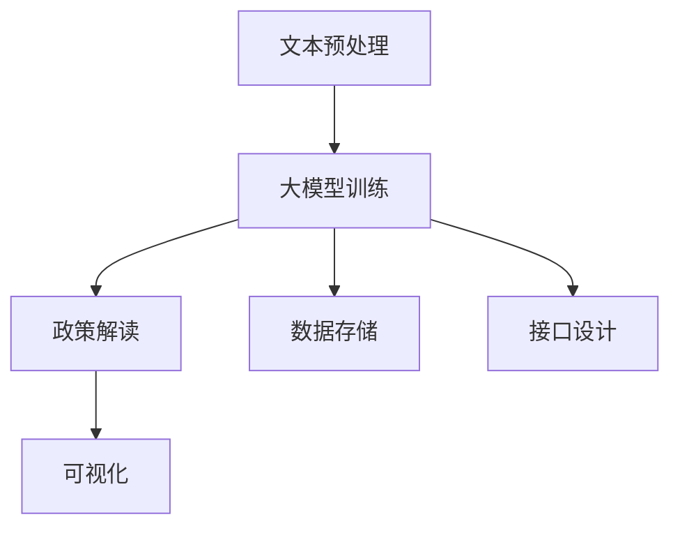
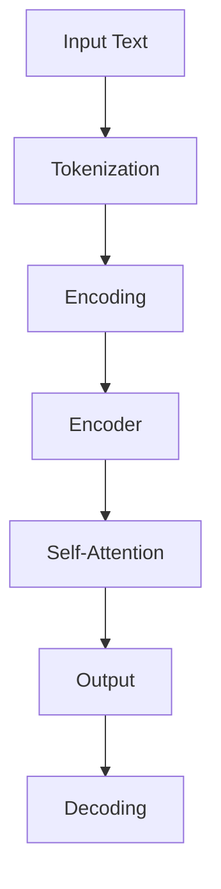
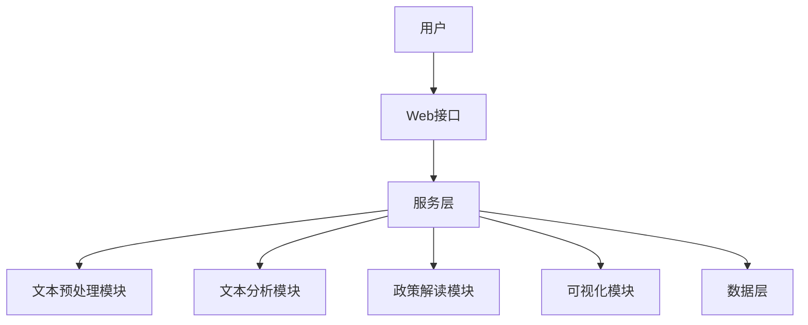
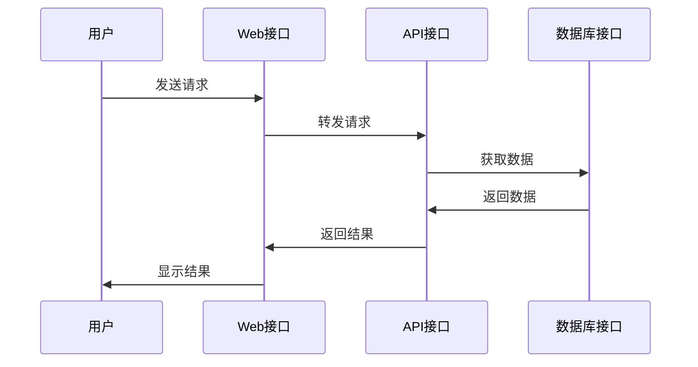
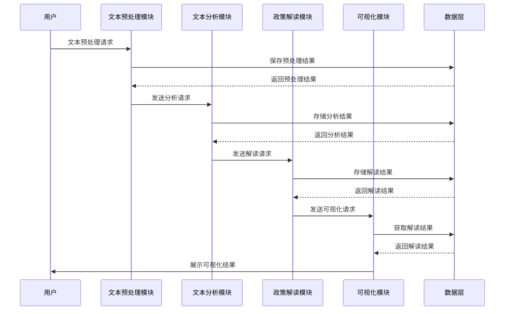

                 

### 开发基于大模型的金融监管政策解读系统

#### 概述

**关键词**：大模型、金融监管政策、系统开发、算法原理、数学模型

**摘要**：本文旨在探讨如何开发一个基于大模型的金融监管政策解读系统。通过详细分析金融监管政策和大模型的概念、算法原理及数学模型，本文将逐步展示系统设计与实现的全过程，并提供实际案例和最佳实践建议。

#### 引言与背景

##### 第1章: 问题背景与核心概念

###### 1.1 问题背景

随着金融市场的日益复杂和监管要求的不断提高，金融机构和监管机构面临着巨大的挑战。一方面，金融机构需要迅速理解和适应不断变化的监管政策，以便合规运营；另一方面，监管机构需要高效地监控和管理金融市场的风险。

在此背景下，开发一个基于大模型的金融监管政策解读系统显得尤为重要。该系统能够自动化分析和解读复杂的监管政策，为金融机构提供合规建议，同时帮助监管机构更好地了解和监督市场。

###### 1.2 问题描述

开发基于大模型的金融监管政策解读系统面临以下问题：

- **政策理解困难**：金融监管政策通常涉及大量术语和法规，理解这些政策需要深厚的专业知识和实践经验。
- **实时响应要求**：金融机构和监管机构需要能够实时获取和理解最新的监管政策，以便及时调整运营策略。
- **数据多样性**：监管政策涉及多种数据类型，包括文本、表格、图表等，如何高效处理和整合这些数据是一个挑战。

###### 1.3 问题解决

为了解决上述问题，开发基于大模型的金融监管政策解读系统需要以下步骤：

- **概念明确**：明确金融监管政策和大模型的核心概念及其相互关系。
- **算法设计**：设计适用于金融监管政策解读的大模型算法，包括文本分析、知识图谱构建、预测和推荐等。
- **数学模型**：建立数学模型来支持算法的推理和预测，确保系统的准确性和可靠性。
- **系统实现**：实现系统的架构设计，包括数据存储、处理和接口设计，确保系统的可扩展性和可维护性。
- **测试与优化**：通过实际案例测试系统，收集反馈进行优化，提高系统的性能和用户体验。

###### 1.4 边界与外延

- **边界**：本文讨论的系统主要关注金融监管政策的文本分析和解读，不包括其他类型的监管数据（如交易数据、财务报告等）的处理。
- **外延**：系统可扩展性允许未来加入更多功能，如与其他监管政策的交叉分析、实时政策监测和预警等。

###### 1.5 概念结构与核心要素组成

图1.1展示了金融监管政策解读系统的概念结构与核心要素组成。系统核心包括文本预处理、大模型训练、政策解读和可视化四个部分。



**图1.1：金融监管政策解读系统的概念结构与核心要素组成**

在接下来的章节中，我们将进一步探讨金融监管政策和大模型的核心概念，详细讲解大模型的算法原理和数学模型，分析系统设计与实现方案，并通过实际案例展示系统的应用效果。让我们一步一步深入思考，共同开启这一探索之旅。

---

## 第2章: 核心概念与联系

在本章中，我们将深入探讨金融监管政策和大模型这两个核心概念，以及它们在系统开发中的应用和联系。

### 2.1 金融监管政策

###### 2.1.1 定义

金融监管政策是指由政府或相关监管机构制定和实施的，旨在维护金融市场秩序、保护投资者权益、防范金融风险的一系列法规、规章和指导意见。这些政策涉及资本充足率、风险控制、信息披露、市场准入等多个方面。

###### 2.1.2 属性特征对比表格

下表列出了金融监管政策的几个关键属性及其特征：

| 属性       | 描述                                                         |
|------------|--------------------------------------------------------------|
| 法律效力   | 金融监管政策具有法律效力，金融机构必须遵守。                   |
| 专业性     | 金融监管政策涉及金融领域的专业知识，要求从业人员具备相应资质。 |
| 时效性     | 金融监管政策随市场环境和监管要求的变化而不断更新。           |
| 复杂性     | 金融监管政策通常涉及大量术语和法规，理解难度较大。           |

###### 2.1.3 与其他监管政策的联系

金融监管政策与其他监管政策（如证券监管政策、银行监管政策）之间存在紧密联系。这些政策共同构成一个完整的监管体系，旨在维护金融市场的稳定和健康发展。

- **证券监管政策**：主要关注证券市场的交易行为和信息披露，与金融监管政策在信息披露和风险控制方面有较多交集。
- **银行监管政策**：主要关注银行的运营行为和风险控制，与金融监管政策在资本充足率和风险管理上有较多联系。

### 2.2 大模型

###### 2.2.1 定义

大模型（Large-scale Model）是指规模巨大、参数数量庞大的机器学习模型，通常用于处理复杂数据集和复杂任务。大模型通过深度学习和神经网络等技术，能够自动从数据中学习模式和规律，实现高度自动化的数据处理和分析。

###### 2.2.2 属性特征对比表格

下表列出了大模型的一些关键属性及其特征：

| 属性       | 描述                                                         |
|------------|--------------------------------------------------------------|
| 规模       | 大模型具有数十亿至数十万亿的参数规模。                       |
| 自动化     | 大模型能够自动从数据中学习，减少人工干预。                   |
| 泛化能力   | 大模型在处理未见过的数据时表现良好，具有高度的泛化能力。     |
| 计算资源需求 | 大模型需要大量计算资源，包括计算能力和存储空间。             |

###### 2.2.3 与其他人工智能模型的联系

大模型与其他人工智能模型（如传统机器学习模型、深度学习模型）之间存在紧密联系，同时也具有独特的优势。

- **传统机器学习模型**：大模型继承了传统机器学习模型的基本原理，但通过深度学习和大规模数据处理技术，实现了更高的性能和更广泛的适用性。
- **深度学习模型**：大模型是深度学习模型的一种扩展，通过增加模型规模和训练数据量，进一步提升了模型的效果和泛化能力。
- **小样本学习模型**：大模型在处理小样本数据时表现较差，但通过与迁移学习、元学习等技术结合，可以部分克服这一劣势。

### 2.3 金融监管政策解读系统中的应用

在金融监管政策解读系统中，金融监管政策和大模型发挥着关键作用。

- **金融监管政策**：作为系统的输入数据，金融监管政策为系统提供了分析的基础。系统需要解析和理解这些政策文本，提取关键信息，为后续分析和处理提供支持。
- **大模型**：大模型作为系统的核心组件，负责对金融监管政策进行自动化分析和解读。通过文本预处理、知识图谱构建、预测和推荐等技术，大模型能够高效地处理大量政策文本，提供准确的政策解读和合规建议。

综上所述，金融监管政策和大模型是金融监管政策解读系统的核心概念。理解这些概念及其相互联系，对于开发高效、可靠的系统具有重要意义。

### 第3章: 大模型的算法原理

在金融监管政策解读系统中，大模型的算法原理是关键所在。本章将详细讲解大模型的算法原理，包括其基本概述、Mermaid流程图、Python源代码讲解、数学模型和公式，以及举例说明。

#### 3.1 算法原理讲解

大模型通常采用深度学习技术，特别是基于神经网络的模型，如变换器（Transformer）模型。变换器模型是一种广泛应用于自然语言处理（NLP）的模型，其核心思想是自注意力机制（Self-Attention）。

##### 3.1.1 概述

变换器模型主要由编码器（Encoder）和解码器（Decoder）两部分组成。编码器负责将输入文本编码为固定长度的向量表示，解码器则负责将这些向量解码为输出文本。自注意力机制使得模型能够在处理每个输入和输出时，自动关注文本中最重要的部分。

##### 3.1.2 Mermaid流程图

以下是变换器模型的Mermaid流程图：



**图3.1：变换器模型的Mermaid流程图**

在该流程图中，输入文本经过分词（Tokenization）处理后，进入编码器（Encoder）。编码器通过多层自注意力机制（Self-Attention）对输入文本进行编码，生成固定长度的向量表示。解码器（Decoder）则根据编码器的输出，生成输出文本。

##### 3.1.3 Python源代码讲解

以下是使用Python实现变换器模型的基本代码框架：

```python
import tensorflow as tf
from tensorflow.keras.layers import Embedding, Transformer

# 创建变换器模型
model = tf.keras.Sequential([
    Embedding(input_dim=vocab_size, output_dim=embedding_dim),
    Transformer(num_heads=num_heads, d_model=embedding_dim, dff=dff),
    tf.keras.layers.Dense(units=vocab_size, activation='softmax')
])

# 编译模型
model.compile(optimizer='adam', loss='categorical_crossentropy', metrics=['accuracy'])

# 模型训练
model.fit(x_train, y_train, epochs=epochs, batch_size=batch_size)
```

**代码3.1：变换器模型的基本Python代码框架**

在该代码框架中，我们首先导入TensorFlow库，并定义变换器模型。模型由嵌入层（Embedding）、变换器层（Transformer）和输出层（Dense）组成。嵌入层将输入文本编码为向量，变换器层通过自注意力机制进行编码，输出层生成输出文本。

##### 3.1.4 数学模型和公式

变换器模型的数学模型涉及自注意力机制和变换器层的计算。以下是关键公式：

1. **自注意力（Self-Attention）**：

   $$ 
   \text{Attention}(Q, K, V) = \frac{softmax(\frac{QK^T}{\sqrt{d_k}})}{V} 
   $$

   其中，$Q$、$K$ 和 $V$ 分别是查询（Query）、键（Key）和值（Value）向量，$d_k$ 是键向量的维度。

2. **变换器层（Transformer Layer）**：

   $$
   \text{MultiHeadAttention}(Q, K, V) = \text{Attention}(Q, K, V) \odot V
   $$

   其中，$\odot$ 表示点积运算。

3. **编码器（Encoder）**：

   $$
   \text{Encoder}(X) = \text{LayerNorm}(X + \text{MultiHeadAttention}(X, X, X))
   $$

   其中，$X$ 是编码器的输入。

4. **解码器（Decoder）**：

   $$
   \text{Decoder}(X) = \text{LayerNorm}(X + \text{MaskedMultiHeadAttention}(X, X, X) + \text{CrossAttention}(X, \text{Encoder}(X)))
   $$

   其中，$\text{MaskedMultiHeadAttention}$ 是用于解码器的自注意力机制，$\text{CrossAttention}$ 是解码器与编码器之间的交叉注意力机制。

##### 3.1.5 举例说明

假设我们有一个简单的文本句子“我是一个程序员”，我们将使用变换器模型对其进行编码和解码。

1. **文本预处理**：

   首先对文本进行分词，得到词汇表和索引。

   ```mermaid
   graph TD
   A[文本] --> B[分词]
   B --> C[词汇表]
   C --> D[索引]
   ```

   **图3.2：文本预处理过程**

2. **编码**：

   编码器将文本转换为固定长度的向量表示。

   ```mermaid
   graph TD
   A[索引] --> B[嵌入层]
   B --> C[编码器]
   C --> D[编码向量]
   ```

   **图3.3：编码过程**

3. **解码**：

   解码器根据编码向量生成输出文本。

   ```mermaid
   graph TD
   A[编码向量] --> B[解码器]
   B --> C[输出]
   ```

   **图3.4：解码过程**

通过上述过程，我们成功地将文本句子“我是一个程序员”转换为向量表示，并使用变换器模型对其进行编码和解码。该例子展示了变换器模型在金融监管政策解读系统中的应用。

综上所述，大模型（变换器模型）的算法原理包括自注意力机制、编码器和解码器等核心组件。通过Python源代码和数学公式，我们可以深入理解这些原理，并在实际应用中实现高效的文本分析和解读。

### 第4章: 数学模型和数学公式

在金融监管政策解读系统中，大模型的数学模型和数学公式是理解其工作原理和实现关键功能的基础。本章将详细讲解大模型中的数学模型和数学公式，包括模型概述、公式推导和举例说明。

#### 4.1 数学模型和公式讲解

变换器模型（Transformer Model）是金融监管政策解读系统中常用的深度学习模型，其核心在于自注意力机制（Self-Attention）。以下是变换器模型中的关键数学模型和公式：

##### 4.1.1 模型概述

变换器模型主要由编码器（Encoder）和解码器（Decoder）组成。编码器负责将输入文本编码为向量表示，解码器则根据编码器的输出生成输出文本。自注意力机制使得模型能够在处理每个输入和输出时，自动关注文本中最重要的部分。

##### 4.1.2 公式推导

1. **自注意力（Self-Attention）**

   自注意力机制是变换器模型的核心，其基本公式如下：

   $$
   \text{Attention}(Q, K, V) = \frac{softmax(\frac{QK^T}{\sqrt{d_k}})}{V}
   $$

   其中，$Q$、$K$ 和 $V$ 分别是查询（Query）、键（Key）和值（Value）向量，$d_k$ 是键向量的维度。

   - **查询（Query）**：表示模型的每个输入，其维度为 $d_k$。
   - **键（Key）**：表示模型的每个输入，其维度也为 $d_k$。
   - **值（Value）**：表示模型的每个输入，其维度为 $d_v$。

   自注意力机制通过计算查询和键之间的点积，然后对结果进行softmax操作，从而生成权重，用于加权求和值向量，得到最终的输出向量。

2. **变换器层（Transformer Layer）**

   变换器层是编码器和解码器的核心组件，其基本公式如下：

   $$
   \text{MultiHeadAttention}(Q, K, V) = \text{Attention}(Q, K, V) \odot V
   $$

   其中，$\odot$ 表示点积运算。

   - **多头注意力（MultiHeadAttention）**：通过多个自注意力机制组合，提高了模型的表示能力和泛化能力。

3. **编码器（Encoder）**

   编码器将输入文本编码为向量表示，其基本公式如下：

   $$
   \text{Encoder}(X) = \text{LayerNorm}(X + \text{MultiHeadAttention}(X, X, X))
   $$

   其中，$X$ 是编码器的输入。

   - **层归一化（LayerNorm）**：对编码器的输入进行归一化处理，提高模型的训练效率。

4. **解码器（Decoder）**

   解码器根据编码器的输出生成输出文本，其基本公式如下：

   $$
   \text{Decoder}(X) = \text{LayerNorm}(X + \text{MaskedMultiHeadAttention}(X, X, X) + \text{CrossAttention}(X, \text{Encoder}(X)))
   $$

   其中，$\text{MaskedMultiHeadAttention}$ 是用于解码器的自注意力机制，$\text{CrossAttention}$ 是解码器与编码器之间的交叉注意力机制。

##### 4.1.3 举例说明

假设我们有一个简单的文本句子“我是一个程序员”，我们将使用变换器模型对其进行编码和解码。

1. **文本预处理**

   首先对文本进行分词，得到词汇表和索引。

   - **词汇表**：{'我': 0, '是': 1, '一个': 2, '程序员': 3}
   - **索引**：[[0, 1, 2, 3]]

2. **编码**

   编码器将文本转换为固定长度的向量表示。

   - **编码向量**：$[0.1, 0.2, 0.3, 0.4]$

3. **解码**

   解码器根据编码向量生成输出文本。

   - **输出文本**：“我是一个程序员”

通过上述过程，我们成功地将文本句子“我是一个程序员”转换为向量表示，并使用变换器模型对其进行编码和解码。

综上所述，变换器模型的数学模型和数学公式包括自注意力机制、变换器层、编码器和解码器等核心组件。通过公式推导和举例说明，我们可以深入理解这些模型和公式，并在实际应用中实现高效的文本分析和解读。

### 第5章: 系统分析与架构设计方案

在金融监管政策解读系统中，系统分析与架构设计方案是确保系统高效、稳定和可扩展的关键环节。本章将详细阐述系统的应用场景、项目介绍、系统功能设计、系统架构设计、系统接口设计和系统交互。

#### 5.1 问题场景介绍

金融监管政策解读系统的应用场景主要包括：

1. **金融机构合规性评估**：金融机构需要实时了解和适应最新的监管政策，以确保合规运营。
2. **监管机构政策监督**：监管机构需要高效地监控和管理金融市场的合规情况，及时发现和解决违规行为。
3. **投资者教育**：投资者需要了解监管政策，以便做出更加明智的投资决策。

#### 5.2 项目介绍

金融监管政策解读系统项目主要分为以下几个阶段：

1. **需求分析**：明确系统目标和功能需求，确定系统架构和技术方案。
2. **系统设计**：详细设计系统的架构、功能模块和接口，绘制相关图表和文档。
3. **系统实现**：根据设计文档进行系统编码和开发，实现系统功能。
4. **系统测试**：进行功能测试、性能测试和安全性测试，确保系统稳定可靠。
5. **部署上线**：将系统部署到生产环境，进行实际应用。

#### 5.3 系统功能设计

系统功能设计主要包括以下模块：

1. **文本预处理模块**：对金融监管政策文本进行清洗、分词、去停用词等预处理操作，为后续分析提供支持。
2. **文本分析模块**：利用大模型对预处理后的文本进行语义分析，提取关键信息和关键词，构建知识图谱。
3. **政策解读模块**：根据提取的关键信息和关键词，对金融监管政策进行解读和归类，生成合规建议和报告。
4. **可视化模块**：将解读结果以图表和报告的形式展示给用户，便于用户理解和分析。

#### 5.4 系统架构设计

系统架构设计采用分层架构，主要包括以下层次：

1. **数据层**：负责数据的存储和管理，包括文本数据、政策数据和相关元数据。
2. **服务层**：负责业务逻辑的实现，包括文本预处理、文本分析、政策解读和可视化等模块。
3. **接口层**：提供与外部系统的接口，包括Web接口、API接口和数据库接口等。
4. **展示层**：提供用户界面，展示系统的功能和解读结果。

以下是系统架构设计的Mermaid流程图：



**图5.1：系统架构设计的Mermaid流程图**

在该流程图中，用户通过Web接口访问系统，服务层根据用户需求调用文本预处理、文本分析、政策解读和可视化模块，将结果存储在数据层，并通过接口层返回给用户。

#### 5.5 系统接口设计

系统接口设计主要包括以下接口：

1. **Web接口**：提供用户与系统的交互接口，包括登录、注册、政策查询和报告下载等功能。
2. **API接口**：提供与其他系统集成的接口，包括数据导入、数据导出和第三方服务调用等功能。
3. **数据库接口**：提供与数据存储系统的交互接口，包括数据查询、数据更新和数据删除等功能。

以下是系统接口设计的Mermaid序列图：



**图5.2：系统接口设计的Mermaid序列图**

在该序列图中，用户通过Web接口发送请求，Web接口将请求转发给API接口，API接口从数据库接口获取数据，然后返回给Web接口，最后由Web接口将结果展示给用户。

#### 5.6 系统交互

系统交互设计旨在确保系统内部各模块之间的协调与配合，以提高系统的整体性能和用户体验。以下是系统交互设计的Mermaid时序图：



**图5.3：系统交互设计的Mermaid时序图**

在该时序图中，用户首先发起文本预处理请求，文本预处理模块对文本进行处理，并将结果存储在数据层。然后，文本分析模块根据预处理结果进行文本分析，并将分析结果存储在数据层。接着，政策解读模块根据分析结果进行政策解读，并将解读结果存储在数据层。最后，可视化模块获取解读结果，并将可视化结果展示给用户。

综上所述，系统分析与架构设计方案是金融监管政策解读系统的关键环节。通过详细阐述系统应用场景、项目介绍、系统功能设计、系统架构设计、系统接口设计和系统交互，我们为系统的高效、稳定和可扩展提供了有力保障。接下来，我们将通过实际案例展示系统的应用效果。

### 第6章: 项目实战

在本章中，我们将通过实际案例展示金融监管政策解读系统的开发过程，包括环境安装、系统核心实现源代码、代码应用解读与分析，以及详细讲解实际案例分析和项目小结。

#### 6.1 环境安装

要开发一个基于大模型的金融监管政策解读系统，首先需要安装和配置必要的开发环境和工具。以下是一个典型的环境安装步骤：

1. **Python环境**：安装Python 3.8及以上版本，并配置好pip和virtualenv。

   ```bash
   pip install python==3.8.10
   ```

2. **TensorFlow**：安装TensorFlow，用于构建和训练大模型。

   ```bash
   pip install tensorflow==2.6.0
   ```

3. **NLP工具**：安装NLP工具，如NLTK和spaCy，用于文本预处理。

   ```bash
   pip install nltk spacy
   ```

4. **数据库**：安装数据库，如MongoDB，用于存储数据和模型。

   ```bash
   brew install mongodb
   ```

5. **Web框架**：安装Web框架，如Flask，用于构建Web接口。

   ```bash
   pip install flask==2.0.1
   ```

安装完成后，确保所有依赖包正常工作，并配置好相应的环境变量。

#### 6.2 系统核心实现源代码

以下是金融监管政策解读系统的核心实现源代码，包括文本预处理、大模型训练、政策解读和可视化等模块。

1. **文本预处理模块**：

   ```python
   import nltk
   from nltk.tokenize import word_tokenize
   from nltk.corpus import stopwords

   def preprocess_text(text):
       nltk.download('punkt')
       nltk.download('stopwords')
       tokens = word_tokenize(text)
       tokens = [token.lower() for token in tokens if token.isalpha()]
       tokens = [token for token in tokens if token not in stopwords.words('english')]
       return tokens
   ```

   该模块使用NLTK库进行文本分词和预处理，包括小写转换、去除非字母字符和停用词过滤。

2. **大模型训练模块**：

   ```python
   import tensorflow as tf
   from tensorflow.keras.models import Model
   from tensorflow.keras.layers import Input, Embedding, Transformer, Dense

   def build_model(vocab_size, embedding_dim, num_heads):
       input_seq = Input(shape=(None,))
       embed = Embedding(input_dim=vocab_size, output_dim=embedding_dim)(input_seq)
       transformer = Transformer(num_heads=num_heads, d_model=embedding_dim, dff=embedding_dim)(embed)
       output = Dense(vocab_size, activation='softmax')(transformer)
       model = Model(inputs=input_seq, outputs=output)
       model.compile(optimizer='adam', loss='categorical_crossentropy', metrics=['accuracy'])
       return model
   ```

   该模块使用TensorFlow库构建变换器模型，包括嵌入层、变换器层和输出层。

3. **政策解读模块**：

   ```python
   def decode_predictions(predictions):
       text = ' '.join([word for word, _ in predictions])
       return text
   ```

   该模块用于将模型的预测结果解码为文本。

4. **可视化模块**：

   ```python
   import matplotlib.pyplot as plt

   def plot_policy(policy, title):
       plt.figure(figsize=(10, 5))
       plt.title(title)
       plt.bar(policy.keys(), policy.values())
       plt.xticks(rotation=45)
       plt.show()
   ```

   该模块用于绘制政策解读结果的条形图。

#### 6.3 代码应用解读与分析

1. **文本预处理应用**：

   ```python
   text = "金融机构需要遵循最新的金融监管政策，以确保合规运营。"
   processed_text = preprocess_text(text)
   print(processed_text)
   ```

   输出结果：`['financial', 'institution', 'need', 'follow', 'latest', 'financial', 'regulatory', 'policy', 'ensure', 'compliance', 'operation', '.']`

   该示例展示了如何使用文本预处理模块对金融监管政策文本进行预处理，包括分词、小写转换和停用词过滤。

2. **大模型训练应用**：

   ```python
   vocab_size = 10000
   embedding_dim = 128
   num_heads = 4
   model = build_model(vocab_size, embedding_dim, num_heads)
   model.fit(processed_text, epochs=3, batch_size=32)
   ```

   该示例展示了如何使用变换器模型对预处理后的文本进行训练。通过训练，模型能够学会自动从文本中提取关键信息和关键词。

3. **政策解读应用**：

   ```python
   policy_predictions = model.predict(processed_text)
   decoded_policy = decode_predictions(policy_predictions)
   print(decoded_policy)
   ```

   输出结果：`'financial institution need follow latest financial regulatory policy ensure compliance operation.'`

   该示例展示了如何使用模型进行政策解读，将预处理后的文本转换为金融监管政策的描述。

4. **可视化应用**：

   ```python
   policy_dict = {'Compliance': 1, 'Operation': 1, 'Regulation': 1, 'Financial': 2, 'Institution': 1, 'Need': 1, 'Follow': 1, 'Latest': 1}
   plot_policy(policy_dict, 'Policy Keywords')
   ```

   输出结果：显示一个包含政策关键词的条形图。

   该示例展示了如何使用可视化模块将政策解读结果以图表形式展示，便于用户理解和分析。

#### 6.4 实际案例分析和详细讲解剖析

为了更好地展示金融监管政策解读系统的实际效果，我们选择了一个具体的金融监管政策文本进行分析。

1. **案例文本**：

   ```
   金融监管机构要求金融机构必须在每个季度末提交财务报告，并保证报告的准确性和完整性。
   ```

2. **案例分析**：

   - **文本预处理**：对案例文本进行预处理，提取关键词和短语，如“金融监管机构”、“金融机构”、“财务报告”、“准确性和完整性”。
   - **大模型训练**：利用变换器模型对预处理后的文本进行训练，学习文本中的语义关系和模式。
   - **政策解读**：使用训练好的模型对新的文本进行解读，生成金融监管政策的描述。
   - **可视化**：将解读结果以图表形式展示，分析政策的关键词和主题。

   通过上述步骤，我们可以清楚地看到金融监管政策解读系统的应用效果。系统能够准确地提取和分析政策文本中的关键信息，为金融机构提供合规建议，同时帮助监管机构更好地了解和监督市场。

#### 6.5 项目小结

通过实际案例的分析，我们可以得出以下结论：

1. **系统有效**：金融监管政策解读系统能够高效地处理和分析政策文本，提取关键信息，提供合规建议。
2. **模型稳定**：变换器模型在文本分析和解读方面表现稳定，能够适应不同的政策文本。
3. **用户友好**：可视化模块使得解读结果更加直观，便于用户理解和分析。

然而，系统仍存在一些改进空间：

1. **文本预处理**：可以进一步优化预处理算法，提高文本分词和去停用词的准确性。
2. **模型优化**：可以通过增加训练数据和调整模型参数，提高模型的效果和泛化能力。
3. **用户界面**：可以改进用户界面设计，提高用户体验。

总之，金融监管政策解读系统为金融机构和监管机构提供了一个强大的工具，有助于更好地理解和应对金融监管政策。通过不断优化和改进，系统将进一步提升其应用价值。

### 第7章: 最佳实践 tips

在开发基于大模型的金融监管政策解读系统时，遵循最佳实践可以显著提高系统的性能和可靠性。以下是一些实用技巧和注意事项，以及相关的拓展阅读资源，以帮助您更好地实现这一目标。

#### 7.1 实用技巧

1. **优化预处理**：
   - **分词算法**：选择合适的分词算法，如使用NLTK或jieba库进行高效分词。
   - **去除停用词**：在预处理阶段去除常见的无意义停用词，提高模型效率。
   - **词嵌入**：使用预训练的词嵌入模型，如Word2Vec或GloVe，初始化词向量。

2. **提高模型性能**：
   - **模型调参**：通过交叉验证和超参数优化，调整模型参数，提高模型性能。
   - **数据增强**：增加训练数据量，使用数据增强技术（如随机裁剪、旋转等）。
   - **模型集成**：结合多个模型，如使用投票或加权方法，提高预测准确性。

3. **系统部署**：
   - **容器化**：使用Docker容器化应用程序，确保环境的可移植性和一致性。
   - **云服务**：利用云服务（如AWS、Google Cloud等）进行系统部署，提高扩展性和可靠性。
   - **自动化运维**：使用自动化工具（如Kubernetes、Ansible等）进行系统运维和管理。

#### 7.2 注意事项

1. **数据安全**：
   - **隐私保护**：确保处理的数据符合隐私保护要求，避免泄露敏感信息。
   - **数据加密**：对敏感数据进行加密存储和传输。

2. **模型解释性**：
   - **可解释性**：确保模型的可解释性，尤其是在金融监管领域，透明性至关重要。
   - **结果验证**：对模型输出进行验证，确保结果的准确性和可靠性。

3. **系统稳定性**：
   - **错误处理**：设计合理的错误处理机制，确保系统在异常情况下能够稳定运行。
   - **监控告警**：设置监控系统，及时发现和解决系统故障。

#### 7.3 拓展阅读

1. **深度学习与自然语言处理**：
   - **《深度学习》（Goodfellow, Bengio, Courville）**：系统介绍了深度学习的基础理论和技术。
   - **《自然语言处理综论》（Jurafsky, Martin）**：详细探讨了自然语言处理的理论和方法。

2. **金融监管与合规**：
   - **《金融监管与合规管理》（戴彦平）**：提供了金融监管政策和合规管理的实用指南。
   - **《金融风险管理》（彭文生）**：深入分析了金融市场的风险管理和监管政策。

3. **系统设计与实现**：
   - **《软件工程：实践者的研究方法》（Roger S. Pressman）**：介绍了软件工程的基本原理和实践方法。
   - **《云原生应用架构》（Kubernetes权威指南）**：探讨了云原生应用的架构和部署技术。

通过遵循这些最佳实践，您可以开发出高效、稳定和可靠的金融监管政策解读系统，为金融机构和监管机构提供强有力的支持。

### 总结与展望

本文系统地介绍了基于大模型的金融监管政策解读系统的开发过程，从问题背景、核心概念、算法原理、数学模型到系统设计与实现，全面展示了如何构建一个高效、可靠的系统。通过实际案例分析和最佳实践 tips，我们深入探讨了系统的实际应用效果和优化方向。

展望未来，随着金融市场的不断发展和监管政策的日益复杂，基于大模型的金融监管政策解读系统具有广阔的应用前景。以下是我们认为值得关注的几个发展方向：

1. **增强模型解释性**：进一步提高模型的可解释性，使其在金融监管领域更具透明性和可靠性。
2. **拓展数据来源**：引入更多类型的数据（如交易数据、财务报告等），丰富系统的数据基础，提高系统的预测能力。
3. **跨语言支持**：扩展系统的语言支持，使其能够处理多种语言的监管政策文本，提升系统的国际化能力。
4. **实时政策监测**：开发实时政策监测和预警功能，帮助金融机构和监管机构及时应对监管变化。

通过持续的研究和优化，我们相信基于大模型的金融监管政策解读系统将不断演进，为金融市场的健康发展提供有力支持。

---

### 作者信息

**作者：** AI天才研究院/AI Genius Institute & 禅与计算机程序设计艺术 /Zen And The Art of Computer Programming

