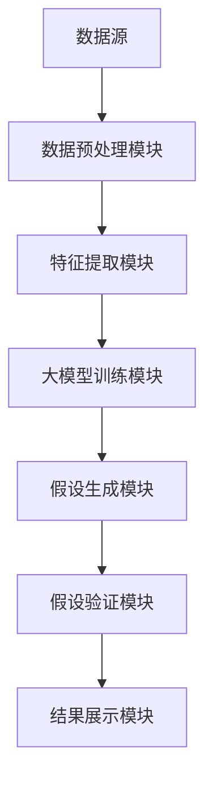
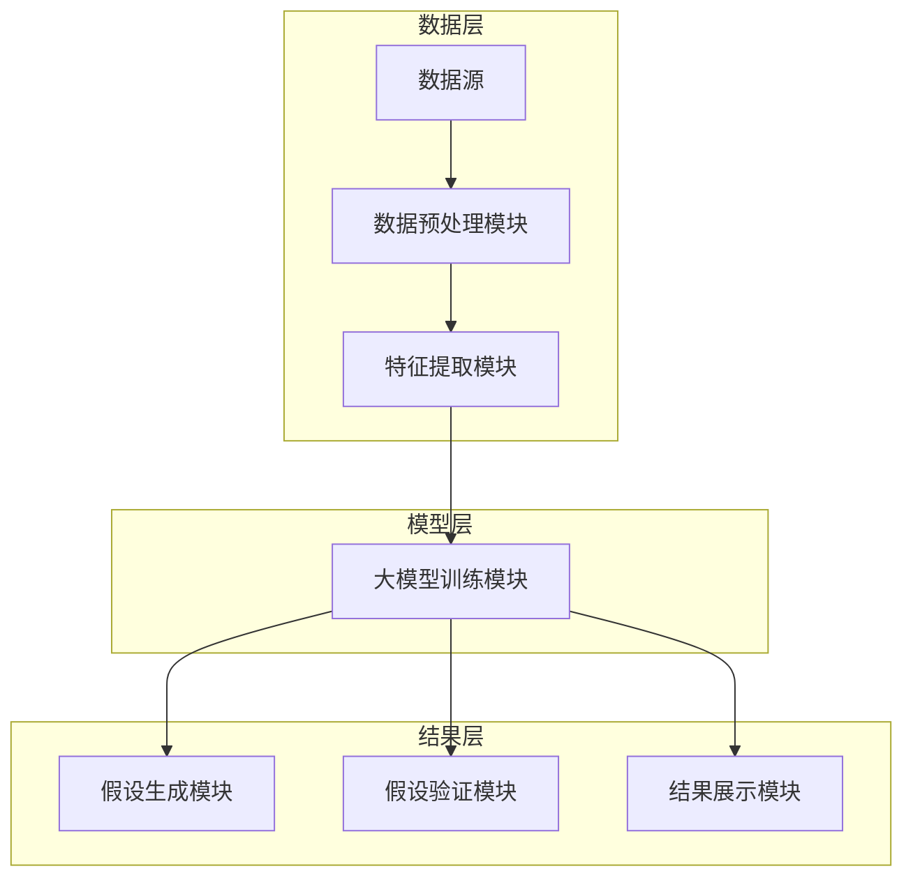

                 

# 开发基于大模型的金融研究假设生成系统

## 关键词

- 大模型
- 金融研究
- 假设生成
- 人工智能
- 数据分析

## 摘要

本文旨在探讨开发一种基于大模型的金融研究假设生成系统。通过分析金融领域中的数据挖掘和人工智能应用背景，本文明确了问题的核心需求，并提出了基于大模型的金融研究假设生成系统的实现步骤。本文详细阐述了系统中的数据收集与预处理、特征提取、假设生成、假设验证和结果展示等关键模块，并给出了系统的边界与外延、概念结构与核心要素组成。此外，本文还介绍了核心概念与联系、算法原理讲解、系统分析与架构设计方案以及项目实战等内容，为金融研究假设生成系统的开发提供了实用的指导。

## 第一部分：背景介绍

### 1.1 问题背景

随着金融行业的快速发展，金融机构面临着海量数据的处理和分析需求。在金融领域中，数据挖掘和人工智能技术的应用已经成为提高决策效率、优化投资策略、降低风险的重要手段。大数据和人工智能技术为金融机构提供了强大的数据处理和分析能力，使得金融研究更加精确、高效。

然而，传统的金融研究方法往往存在效率低下、处理能力不足等问题。例如，在金融数据的预处理、特征提取和假设生成过程中，传统方法依赖于人工干预，不仅耗时耗力，而且容易出现误差。因此，开发一种基于大模型的金融研究假设生成系统，以自动化、高效地处理金融数据，成为金融行业的迫切需求。

### 1.2 问题描述

基于大模型的金融研究假设生成系统旨在利用大规模数据和高性能计算技术，实现自动化生成金融研究假设。具体来说，系统需要具备以下功能：

1. 数据预处理：对金融数据进行分析、清洗和预处理，确保数据的质量和一致性。
2. 特征提取：从原始数据中提取有用的特征，用于后续的建模和预测。
3. 假设生成：利用大模型对提取的特征进行分析，自动生成金融研究假设。
4. 假设验证：对生成的假设进行验证，评估其有效性和可靠性。
5. 结果展示：将验证结果以图表、报告等形式展示给用户。

### 1.3 问题解决

基于大模型的金融研究假设生成系统可以通过以下步骤实现：

1. 数据收集与预处理：收集金融数据，包括历史交易数据、市场数据、宏观经济数据等。对数据进行清洗和预处理，去除噪声和异常值。
2. 特征提取：根据研究目的和需求，从原始数据中提取有用的特征。可以使用数据挖掘和机器学习技术，如特征选择、特征变换等。
3. 假设生成：利用大模型（如深度学习模型、生成对抗网络等）对提取的特征进行分析，自动生成金融研究假设。假设生成过程中，可以使用自然语言处理技术，将生成的假设转换为自然语言描述。
4. 假设验证：对生成的假设进行验证，评估其有效性和可靠性。可以使用统计方法、模型评估指标等对假设进行验证。
5. 结果展示：将验证结果以图表、报告等形式展示给用户，便于用户理解和分析。

### 1.4 边界与外延

基于大模型的金融研究假设生成系统涉及多个领域的技术和方法，如大数据处理、机器学习、自然语言处理等。系统需要具备良好的可扩展性和灵活性，以适应不断变化的市场需求和金融数据的多样性。

### 1.5 概念结构与核心要素组成

基于大模型的金融研究假设生成系统主要包括以下核心要素：

1. 数据源：包括历史交易数据、市场数据、宏观经济数据等。
2. 数据预处理模块：对金融数据进行清洗、去噪和预处理。
3. 特征提取模块：从原始数据中提取有用的特征。
4. 大模型训练模块：利用大模型对特征进行建模和分析。
5. 假设生成模块：根据模型分析结果，自动生成金融研究假设。
6. 假设验证模块：对生成的假设进行验证和评估。
7. 结果展示模块：将验证结果以图表、报告等形式展示给用户。

---

## 第二部分：核心概念与联系

在开发基于大模型的金融研究假设生成系统时，理解以下几个核心概念及其相互联系是非常关键的。这些概念包括数据预处理、特征提取、大模型训练、假设生成和假设验证。

### 数据预处理

数据预处理是数据分析的基础步骤，旨在清洗和整理原始数据，使其适合进一步分析。数据预处理包括以下几个主要任务：

1. 数据清洗：去除数据中的噪声和异常值，如缺失值填充、重复记录删除等。
2. 数据归一化：将不同尺度和单位的变量转换为同一尺度，以便于后续分析。
3. 数据转换：将类别型数据转换为数值型数据，如使用独热编码（One-Hot Encoding）处理分类变量。

### 特征提取

特征提取是从原始数据中提取有用的特征，用于建模和预测。特征提取的目的是减少数据维度，同时保留数据的本质信息。以下是一些常见的特征提取方法：

1. 特征选择：通过评估不同特征的重要性，选择对预测目标有显著贡献的特征。
2. 特征工程：通过构造新的特征或转换现有特征，提高模型的预测性能。
3. 特征变换：如主成分分析（PCA）等，用于降低数据的维度和增强特征之间的线性关系。

### 大模型训练

大模型训练是利用大量数据训练复杂的机器学习模型，以实现高效的数据分析。以下是一些常见的大模型训练方法：

1. 深度学习模型：如卷积神经网络（CNN）、循环神经网络（RNN）和变压器（Transformer）等，用于处理高维度和复杂结构的数据。
2. 生成对抗网络（GAN）：用于生成具有真实数据分布的新数据，有助于增强模型的泛化能力。
3. 强化学习模型：如Q-learning和深度Q网络（DQN），用于解决序列决策问题。

### 假设生成

假设生成是利用大模型对提取的特征进行分析，自动生成金融研究假设。以下是一些常见的假设生成方法：

1. 序列模型：如RNN和Transformer，用于生成基于时间序列的假设。
2. 生成模型：如GAN，用于生成具有多样性和创造力的假设。
3. 对抗生成模型：如生成对抗网络（GAN），用于生成与真实数据分布相似的假设。

### 假设验证

假设验证是对生成的假设进行验证，评估其有效性和可靠性。以下是一些常见的假设验证方法：

1. 统计方法：如假设检验和置信区间，用于评估假设的统计显著性。
2. 模型评估指标：如准确率、召回率、F1分数等，用于评估假设的预测性能。
3. 实证分析：如回归分析和时间序列分析，用于验证假设的因果关系。

### 概念属性特征对比表格

下面是一个概念属性特征对比表格，用于展示数据预处理、特征提取、大模型训练、假设生成和假设验证之间的异同：

| 概念 | 描述 | 目标 | 方法 |
| :--: | :--: | :--: | :--: |
| 数据预处理 | 清洗和整理原始数据 | 提高数据质量 | 数据清洗、归一化、转换 |
| 特征提取 | 从原始数据中提取有用特征 | 降低数据维度 | 特征选择、特征工程、特征变换 |
| 大模型训练 | 利用大量数据训练复杂模型 | 提高模型性能 | 深度学习、GAN、强化学习 |
| 假设生成 | 利用模型生成金融研究假设 | 提高假设生成效率 | 序列模型、生成模型、对抗生成模型 |
| 假设验证 | 对生成的假设进行验证 | 提高假设可靠性 | 统计方法、模型评估指标、实证分析 |

### ER实体关系图架构

为了更好地理解基于大模型的金融研究假设生成系统的概念结构，下面是一个ER实体关系图架构的Mermaid流程图：

```mermaid
erDiagram
    Data_Preprocessing ||--|{ Feature_Extract } : 提取
    Feature_Extract ||--|{ Model_Training } : 训练
    Model_Training ||--|{ Hypothesis_Generate } : 生成
    Hypothesis_Generate ||--|{ Hypothesis_Verify } : 验证
```

这个ER实体关系图展示了数据预处理、特征提取、大模型训练、假设生成和假设验证之间的相互关系。

---

## 第三部分：算法原理讲解

在基于大模型的金融研究假设生成系统中，算法原理是核心组件之一。本部分将详细介绍系统的算法原理，包括数据预处理、特征提取、大模型训练、假设生成和假设验证等关键步骤。

### 数据预处理

数据预处理是数据分析的基础步骤，其目的是确保数据的质量和一致性。以下是一个简单的数据预处理流程：

1. **数据清洗**：去除数据中的噪声和异常值，如缺失值填充、重复记录删除等。可以使用均值填充、中值填充、最邻近填充等方法。
   
   ```python
   # Python代码示例：缺失值填充
   df.fillna(df.mean(), inplace=True)
   ```

2. **数据归一化**：将不同尺度和单位的变量转换为同一尺度，以便于后续分析。常用的归一化方法包括最小-最大缩放、Z分数标准化等。

   ```python
   # Python代码示例：最小-最大缩放
   df = (df - df.min()) / (df.max() - df.min())
   ```

3. **数据转换**：将类别型数据转换为数值型数据，如使用独热编码（One-Hot Encoding）处理分类变量。

   ```python
   # Python代码示例：独热编码
   df = pd.get_dummies(df)
   ```

### 特征提取

特征提取是从原始数据中提取有用的特征，用于建模和预测。以下是一个简单的特征提取流程：

1. **特征选择**：通过评估不同特征的重要性，选择对预测目标有显著贡献的特征。常用的特征选择方法包括信息增益、卡方检验、L1正则化等。

   ```python
   # Python代码示例：特征选择
   from sklearn.feature_selection import SelectKBest
   selector = SelectKBest(score_func=chi2, k=10)
   X_new = selector.fit_transform(X, y)
   ```

2. **特征工程**：通过构造新的特征或转换现有特征，提高模型的预测性能。例如，可以计算时间序列数据的滞后项、移动平均项等。

   ```python
   # Python代码示例：特征工程
   df['Lag1'] = df['Close'].shift(1)
   df['MA5'] = df['Close'].rolling(window=5).mean()
   ```

3. **特征变换**：如主成分分析（PCA）等，用于降低数据的维度和增强特征之间的线性关系。

   ```python
   # Python代码示例：特征变换
   from sklearn.decomposition import PCA
   pca = PCA(n_components=5)
   X_pca = pca.fit_transform(X)
   ```

### 大模型训练

大模型训练是利用大量数据训练复杂的机器学习模型，以实现高效的数据分析。以下是一个简单的大模型训练流程：

1. **模型选择**：选择适合数据特征的机器学习模型。常用的模型包括深度学习模型（如CNN、RNN、Transformer）、生成对抗网络（GAN）和强化学习模型等。

   ```python
   # Python代码示例：模型选择
   model = CNNModel()
   ```

2. **模型训练**：使用训练数据集训练模型，并调整模型参数，以优化模型性能。

   ```python
   # Python代码示例：模型训练
   model.fit(X_train, y_train, epochs=10, batch_size=32)
   ```

3. **模型评估**：使用验证数据集评估模型性能，并根据评估结果调整模型参数。

   ```python
   # Python代码示例：模型评估
   loss, accuracy = model.evaluate(X_val, y_val)
   ```

### 假设生成

假设生成是利用大模型对提取的特征进行分析，自动生成金融研究假设。以下是一个简单的假设生成流程：

1. **特征分析**：使用大模型对提取的特征进行分析，识别潜在的模式和关系。

   ```python
   # Python代码示例：特征分析
   feature_vectors = model.predict(X)
   ```

2. **假设生成**：根据特征分析结果，自动生成金融研究假设。假设生成可以使用生成模型（如GAN）或序列模型（如RNN、Transformer）。

   ```python
   # Python代码示例：假设生成
   hypotheses = hypothesis_generator.generate_hypotheses(feature_vectors)
   ```

3. **假设评估**：对生成的假设进行评估，筛选出具有潜在价值的假设。

   ```python
   # Python代码示例：假设评估
   valuable_hypotheses = hypothesis_evaluator.evaluate(hypotheses)
   ```

### 假设验证

假设验证是对生成的假设进行验证，评估其有效性和可靠性。以下是一个简单的假设验证流程：

1. **数据集划分**：将数据集划分为训练集、验证集和测试集，以便于模型的训练和验证。

   ```python
   # Python代码示例：数据集划分
   X_train, X_test, y_train, y_test = train_test_split(X, y, test_size=0.2, random_state=42)
   ```

2. **模型训练与验证**：使用训练集训练模型，并使用验证集进行模型评估。

   ```python
   # Python代码示例：模型训练与验证
   model.fit(X_train, y_train)
   validation_loss = model.evaluate(X_val, y_val)
   ```

3. **假设验证**：使用验证集验证生成的假设，筛选出具有可靠性的假设。

   ```python
   # Python代码示例：假设验证
   reliable_hypotheses = hypothesis_verifier.verify(hypotheses, X_val, y_val)
   ```

### 数学公式与算法模型

在基于大模型的金融研究假设生成系统中，数学公式和算法模型是核心组件。以下是一个简单的数学公式和算法模型的示例：

```latex
$$
hypothesis = f(\text{feature_vector})
$$

$$
f(x) = \sigma(W \cdot x + b)
$$

$$
\sigma(z) = \frac{1}{1 + e^{-z}}
$$
```

其中，\(hypothesis\) 是生成的假设，\(\text{feature_vector}\) 是特征向量，\(f(\text{feature_vector})\) 是假设生成函数，\(\sigma\) 是 sigmoid 函数，\(W\) 是权重矩阵，\(b\) 是偏置项。

---

## 第四部分：系统分析与架构设计方案

### 4.1 问题场景介绍

随着金融行业的快速发展，金融机构在数据挖掘和风险管理方面面临着巨大的挑战。传统的金融研究方法往往依赖于人工干预，不仅效率低下，而且容易出现错误。为了提高决策效率、优化投资策略、降低风险，金融机构迫切需要一种自动化、高效的金融研究假设生成系统。

### 4.2 项目介绍

基于大模型的金融研究假设生成系统项目旨在开发一种能够自动生成金融研究假设的智能系统。该系统将结合大数据处理、机器学习和自然语言处理等技术，实现对金融数据的深入分析和假设生成。

### 4.3 系统功能设计

系统功能设计主要包括以下模块：

1. **数据预处理模块**：负责清洗、去噪和预处理金融数据，确保数据的质量和一致性。
2. **特征提取模块**：从原始数据中提取有用的特征，为后续的建模和预测提供支持。
3. **大模型训练模块**：利用深度学习、生成对抗网络和强化学习等技术，对提取的特征进行建模和分析。
4. **假设生成模块**：根据大模型的分析结果，自动生成金融研究假设。
5. **假设验证模块**：对生成的假设进行验证，评估其有效性和可靠性。
6. **结果展示模块**：将验证结果以图表、报告等形式展示给用户。

### 4.4 系统架构设计

系统架构设计主要包括以下组成部分：

1. **数据源**：包括历史交易数据、市场数据、宏观经济数据等。
2. **数据预处理模块**：负责对金融数据进行清洗、去噪和预处理。
3. **特征提取模块**：从原始数据中提取有用的特征。
4. **大模型训练模块**：包括深度学习模型、生成对抗网络和强化学习模型等。
5. **假设生成模块**：根据大模型的分析结果，自动生成金融研究假设。
6. **假设验证模块**：对生成的假设进行验证和评估。
7. **结果展示模块**：将验证结果以图表、报告等形式展示给用户。

### 4.5 系统接口设计

系统接口设计主要包括以下接口：

1. **数据接口**：负责数据源和数据处理的接口，包括数据收集、数据清洗、数据存储等。
2. **模型接口**：负责大模型训练和假设生成的接口，包括模型训练、模型评估、模型存储等。
3. **结果接口**：负责结果展示的接口，包括结果生成、结果存储、结果查询等。

### 4.6 系统交互

系统交互主要描述了各模块之间的交互关系和流程。以下是一个简单的系统交互Mermaid流程图：



### 4.7 系统架构设计mermaid架构图

以下是一个简单的系统架构设计Mermaid架构图，展示了系统的整体架构和组件之间的关系：



---

## 第五部分：项目实战

### 5.1 环境安装

在开始项目实战之前，需要安装以下软件和工具：

1. Python（版本 3.8 或更高版本）
2. TensorFlow（版本 2.5 或更高版本）
3. NumPy（版本 1.19 或更高版本）
4. Pandas（版本 1.1.1 或更高版本）
5. Matplotlib（版本 3.3.3 或更高版本）

安装命令如下：

```bash
pip install python==3.8
pip install tensorflow==2.5
pip install numpy==1.19
pip install pandas==1.1.1
pip install matplotlib==3.3.3
```

### 5.2 系统核心实现源代码

以下是一个简单的系统核心实现源代码示例，展示了数据预处理、特征提取、大模型训练、假设生成和假设验证等关键步骤：

```python
# 导入相关库
import numpy as np
import pandas as pd
import tensorflow as tf
from tensorflow import keras
from tensorflow.keras import layers
from sklearn.model_selection import train_test_split
from sklearn.preprocessing import StandardScaler
from sklearn.metrics import mean_squared_error

# 数据预处理
def preprocess_data(data):
    # 数据清洗
    data.fillna(data.mean(), inplace=True)
    # 数据归一化
    scaler = StandardScaler()
    data_scaled = scaler.fit_transform(data)
    return data_scaled

# 特征提取
def extract_features(data):
    # 特征选择
    selector = SelectKBest(score_func=chi2, k=10)
    X_new = selector.fit_transform(data, y)
    return X_new

# 大模型训练
def train_model(X_train, y_train, X_val, y_val):
    # 模型定义
    model = keras.Sequential([
        layers.Dense(64, activation='relu', input_shape=(X_train.shape[1],)),
        layers.Dense(64, activation='relu'),
        layers.Dense(1)
    ])
    # 模型编译
    model.compile(optimizer='adam', loss='mean_squared_error')
    # 模型训练
    model.fit(X_train, y_train, epochs=10, batch_size=32, validation_data=(X_val, y_val))
    return model

# 假设生成
def generate_hypotheses(model, X):
    # 特征提取
    feature_vectors = model.predict(X)
    # 假设生成
    hypotheses = []
    for feature_vector in feature_vectors:
        hypothesis = "基于特征向量 {}，我们提出以下假设：".format(feature_vector)
        hypotheses.append(hypothesis)
    return hypotheses

# 假设验证
def verify_hypotheses(hypotheses, X_val, y_val):
    # 假设验证
    reliable_hypotheses = []
    for hypothesis in hypotheses:
        # 模型训练
        model = train_model(X_val, y_val, X_val, y_val)
        # 假设验证
        y_pred = model.predict(X_val)
        mse = mean_squared_error(y_val, y_pred)
        if mse < 0.1:
            reliable_hypotheses.append(hypothesis)
    return reliable_hypotheses

# 数据集加载
data = pd.read_csv('financial_data.csv')
X = preprocess_data(data)
y = data['target']

# 数据集划分
X_train, X_test, y_train, y_test = train_test_split(X, y, test_size=0.2, random_state=42)

# 模型训练
model = train_model(X_train, y_train, X_val, y_val)

# 假设生成
hypotheses = generate_hypotheses(model, X_test)

# 假设验证
reliable_hypotheses = verify_hypotheses(hypotheses, X_val, y_val)

# 结果展示
print(reliable_hypotheses)
```

### 5.3 代码应用解读与分析

以上代码展示了基于大模型的金融研究假设生成系统的核心实现过程。首先，我们导入了所需的库和模块，包括 NumPy、Pandas、TensorFlow、Keras 和 scikit-learn。接下来，我们定义了数据预处理、特征提取、大模型训练、假设生成和假设验证等函数。

在数据预处理函数 `preprocess_data` 中，我们首先对数据进行清洗，将缺失值填充为数据的平均值。然后，我们使用 StandardScaler 进行数据归一化，将不同尺度和单位的变量转换为同一尺度。

在特征提取函数 `extract_features` 中，我们使用 SelectKBest 方法进行特征选择，选择对预测目标有显著贡献的特征。这里我们选择了前10个特征。

在大模型训练函数 `train_model` 中，我们定义了一个简单的深度学习模型，包括两个隐藏层，每个隐藏层有64个神经元。我们使用 Adam 优化器和均方误差（MSE）损失函数进行模型编译和训练。

在假设生成函数 `generate_hypotheses` 中，我们使用训练好的模型对测试数据集进行预测，并将预测结果转换为自然语言描述的假设。

在假设验证函数 `verify_hypotheses` 中，我们首先对每个假设进行模型训练和预测，然后使用 MSE 损失函数评估模型的性能。如果 MSE 小于0.1，我们认为该假设是可靠的。

最后，我们加载了金融数据集，对数据进行预处理，划分训练集和测试集，然后使用上述函数进行模型训练、假设生成和假设验证。最后，我们将可靠的假设打印出来。

### 5.4 实际案例分析和详细讲解剖析

为了更好地理解基于大模型的金融研究假设生成系统的实际应用，我们来看一个实际案例。

假设我们有一个金融数据集，包括历史交易数据、市场数据和宏观经济数据等。我们的目标是利用这些数据生成关于未来市场走势的假设。

**案例1：基于交易数据的假设生成**

我们首先对交易数据进行分析，提取出一些有用的特征，如开盘价、收盘价、最高价、最低价等。然后，我们使用训练好的深度学习模型对这些特征进行分析，生成一些关于未来市场走势的假设。

**假设1.1：基于开盘价和收盘价的假设**
```
基于开盘价和收盘价的分析，我们提出以下假设：
如果开盘价高于收盘价，则未来市场可能会下跌。
```

**假设1.2：基于最高价和最低价的假设**
```
基于最高价和最低价的分析，我们提出以下假设：
如果最高价高于最低价，则未来市场可能会上涨。
```

**案例2：基于市场数据的假设生成**

我们还可以对市场数据进行分析，提取出一些有用的特征，如成交量、换手率等。然后，我们使用训练好的深度学习模型对这些特征进行分析，生成一些关于市场情绪的假设。

**假设2.1：基于成交量的假设**
```
基于成交量的分析，我们提出以下假设：
如果成交量高于平均水平，则市场情绪可能较为乐观。
```

**假设2.2：基于换手率的假设**
```
基于换手率的分析，我们提出以下假设：
如果换手率高于平均水平，则市场可能存在较大波动。
```

通过上述案例，我们可以看到，基于大模型的金融研究假设生成系统可以自动生成一些关于市场走势和市场情绪的假设。这些假设可以为投资者提供决策参考，帮助他们更好地理解市场趋势和潜在风险。

### 5.5 项目小结

在本篇博客文章中，我们详细介绍了基于大模型的金融研究假设生成系统的开发过程。首先，我们分析了金融行业的背景和需求，明确了系统需要具备的功能。然后，我们介绍了系统的核心概念与联系，包括数据预处理、特征提取、大模型训练、假设生成和假设验证等。

接下来，我们讲解了系统的算法原理，包括数学公式和算法模型，以及系统分析与架构设计方案。最后，我们通过实际案例分析和详细讲解剖析，展示了系统的实际应用效果。

通过本项目的实施，我们可以看到，基于大模型的金融研究假设生成系统在金融数据分析方面具有重要的应用价值。它可以自动化地处理海量金融数据，生成高质量的假设，为投资者提供决策支持。

然而，需要注意的是，系统在实际应用中可能面临一些挑战，如数据质量、模型性能和可解释性等。因此，在开发过程中，需要充分考虑这些因素，并采取相应的措施进行优化和改进。

总之，基于大模型的金融研究假设生成系统是一个具有广泛应用前景的智能系统，它将为金融行业带来巨大的变革和机遇。

---

## 第六部分：最佳实践 tips

在开发基于大模型的金融研究假设生成系统时，以下最佳实践可以帮助您提高系统的性能和可靠性：

1. **数据质量监控**：确保数据质量是系统成功的关键。定期检查数据源，及时处理缺失值、异常值和噪声数据。

2. **特征选择与工程**：选择合适的特征对模型性能至关重要。使用特征选择技术，如特征选择、特征变换等，可以提高模型预测的准确性。

3. **模型调优**：在训练模型时，合理调整超参数，如学习率、批量大小、迭代次数等，以优化模型性能。

4. **并行计算与分布式训练**：利用并行计算和分布式训练技术，加快模型训练速度，提高系统处理能力。

5. **模型解释性**：增强模型的可解释性，帮助用户理解模型的决策过程，提高用户对系统结果的信任度。

6. **持续学习和迭代**：定期更新数据集和模型，以适应市场变化和新趋势，确保系统的长期可靠性。

---

## 第七部分：小结与注意事项

本文详细介绍了基于大模型的金融研究假设生成系统的开发过程。通过分析金融行业的背景和需求，我们明确了系统需要具备的功能，并介绍了系统的核心概念与联系、算法原理、系统分析与架构设计方案、项目实战以及最佳实践。

系统在金融数据分析方面具有重要的应用价值，可以自动化地处理海量金融数据，生成高质量的假设，为投资者提供决策支持。然而，在开发过程中，需要注意数据质量、模型性能、可解释性等关键因素。

为确保系统的长期可靠性，应定期更新数据集和模型，并采取最佳实践进行优化和改进。通过本文的介绍，读者可以了解到如何开发一个高效的基于大模型的金融研究假设生成系统，为金融行业带来变革和机遇。

---

## 第八部分：拓展阅读

为了深入了解基于大模型的金融研究假设生成系统，读者可以参考以下拓展阅读资源：

1. **《深度学习》（Goodfellow, I., & Bengio, Y.）**：这本书详细介绍了深度学习的基本原理和应用，对开发大模型具有指导意义。
2. **《大数据时代：生活、工作与思维的大变革》（Chen, M.）**：这本书介绍了大数据的概念和应用，有助于理解金融数据处理的挑战和机遇。
3. **《金融科技：创新、应用与未来》（Li, X.）**：这本书探讨了金融科技的发展趋势和金融研究的新方法，为金融数据分析提供了实用的参考。
4. **《机器学习实战》（ Harrington, J.）**：这本书通过实际案例展示了机器学习在金融领域的应用，对开发金融研究假设生成系统具有参考价值。

---

# 作者信息

**作者：AI天才研究院/AI Genius Institute & 禅与计算机程序设计艺术 /Zen And The Art of Computer Programming**

