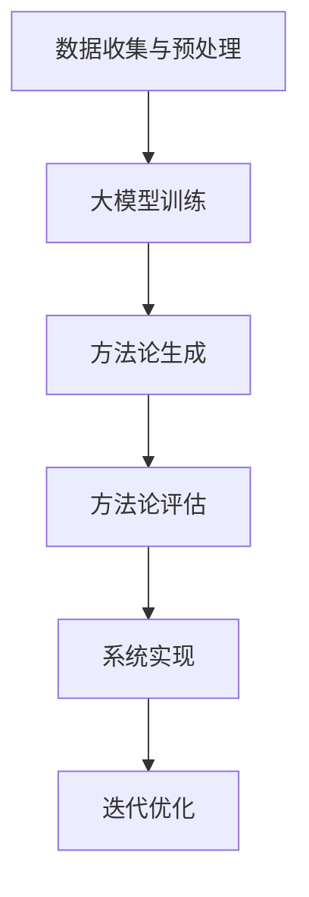

                 

### 1.1 问题背景

在当今数字化时代，金融行业正经历着前所未有的变革。传统的研究方法论已经难以应对快速变化的金融市场和复杂多变的金融产品。随着人工智能技术的发展，特别是大模型的兴起，利用人工智能进行金融研究的潜在优势逐渐显现出来。大模型，通常指的是具有数万亿参数的神经网络模型，如GPT、BERT等，其在处理大规模复杂数据方面的能力远超传统算法。因此，开发基于大模型的金融研究方法论创新生成与评估系统成为了一个重要的研究课题。

金融研究方法论的创新生成，涉及到对大量历史金融数据的挖掘与分析，从中提取有价值的规律和模式，进而指导投资决策和市场预测。而评估系统则需要能够对生成的金融研究方法进行有效性检验，以确保其准确性和可靠性。这不仅仅需要处理数据的计算能力，还需要深入理解金融市场的本质和规律。

现有的金融研究方法论，大多依赖于统计学和计量经济学方法，这些方法在处理简单线性问题时效果较好，但在面对非线性、多变量和高维数据时，往往显得力不从心。而大模型由于其强大的表达能力和自学习能力，可以在很大程度上弥补这些不足。因此，开发一个基于大模型的方法论创新生成与评估系统，有望为金融研究带来革命性的变化。

### 1.2 问题描述

开发基于大模型的金融研究方法论创新生成与评估系统，涉及以下核心问题：

1. **数据收集与处理**：金融数据来源多样，包括股票价格、交易量、宏观经济指标等。这些数据往往存在噪声和缺失值，需要有效的预处理方法来确保数据质量。

2. **方法论创新生成**：大模型如何有效地从历史金融数据中学习，提取出有价值的规律和模式。这需要深入研究大模型的训练机制和优化策略。

3. **评估与优化**：如何设计评估指标，对生成的金融研究方法论进行有效性检验和优化。评估指标应既能够反映方法论的性能，又能够保证其普适性和稳健性。

4. **系统实现**：如何将上述方法论集成到一个可操作的系统中，实现自动化生成和评估。这需要考虑系统的可扩展性、稳定性和易用性。

5. **风险与合规性**：金融研究涉及到大量的敏感信息，如何确保系统的安全和合规性，避免信息泄露和法律风险。

这些问题的解决，不仅需要深厚的技术背景，还需要对金融市场有深刻的理解。因此，开发一个基于大模型的金融研究方法论创新生成与评估系统，既是一个技术挑战，也是一个金融学的课题。

### 1.3 问题解决

针对上述问题，我们需要采取一系列解决方案：

1. **数据预处理**：采用先进的预处理技术，如数据清洗、缺失值填充、数据标准化等，确保数据质量。同时，可以引入数据增强技术，通过生成合成数据来扩充数据集，提高模型的泛化能力。

2. **大模型训练机制**：选用合适的大模型，如Transformer、BERT等，通过深度学习技术进行训练。在训练过程中，可以采用策略梯度优化（PGO）、强化学习（RL）等先进算法，提高模型的效率和准确性。

3. **评估与优化方法**：设计科学的评估指标，如准确率、召回率、F1值等，同时引入交叉验证和混淆矩阵等工具，全面评估模型性能。对于评估结果不佳的模型，通过调整超参数、优化数据预处理方法等方式进行迭代优化。

4. **系统实现**：构建一个模块化、可扩展的系统架构，包括数据收集模块、模型训练模块、模型评估模块等。使用微服务架构，提高系统的可扩展性和稳定性。同时，开发用户友好的界面，方便用户操作和监控。

5. **风险与合规性**：在系统设计和实现过程中，严格遵循数据安全和隐私保护的相关法律法规，采用加密技术、权限控制等技术手段，确保系统的安全性和合规性。

### 1.4 边界与外延

在开发基于大模型的金融研究方法论创新生成与评估系统时，需要明确以下边界与外延：

1. **数据边界**：系统应能够处理多种类型的金融数据，如股票市场数据、外汇市场数据、债券市场数据等。同时，需要考虑到数据的历史性、实时性和多样性。

2. **模型边界**：虽然大模型在处理复杂数据方面具有优势，但并非所有金融研究问题都适合使用大模型。系统需要根据具体问题选择合适的模型，如线性模型、树模型、神经网络等。

3. **时间边界**：金融市场的变化具有高度的不确定性和时效性，系统需要具备实时处理和分析能力，及时更新模型和预测结果。

4. **适用范围**：系统应能够应用于各种金融场景，包括股票市场预测、外汇交易策略、债券评级等。同时，系统还应具备一定的通用性，可以适用于其他领域的复杂问题研究。

5. **外部依赖**：系统开发过程中，需要依赖多个外部技术和工具，如深度学习框架（如TensorFlow、PyTorch）、数据存储和处理系统（如HDFS、Spark）等。这些外部依赖的稳定性和性能对系统的最终效果具有重要影响。

### 1.5 核心概念结构与要素组成

在开发基于大模型的金融研究方法论创新生成与评估系统中，以下几个核心概念和要素起着关键作用：

1. **大模型**：作为系统的基础，大模型具有数万亿参数，能够处理大规模复杂数据。大模型的选择和训练是系统性能的关键。

2. **金融数据**：系统所需的金融数据包括股票价格、交易量、宏观经济指标等。这些数据的质量和处理方法直接影响到模型的训练效果和预测准确性。

3. **方法论**：系统通过大模型从金融数据中提取规律和模式，形成新的金融研究方法论。方法论的创新生成是系统研究的核心目标。

4. **评估指标**：系统需要设计科学的评估指标，对生成的金融研究方法论进行有效性检验。常见的评估指标包括准确率、召回率、F1值等。

5. **系统架构**：系统采用模块化、可扩展的架构设计，包括数据收集模块、模型训练模块、模型评估模块等。系统的架构设计直接关系到系统的性能和稳定性。

6. **用户界面**：系统需要提供用户友好的界面，方便用户操作和监控。用户界面设计应简洁直观，易于操作。

通过以上核心概念和要素的有机组合，我们可以构建一个高效、可靠的基于大模型的金融研究方法论创新生成与评估系统，为金融研究提供强有力的技术支持。在接下来的章节中，我们将深入探讨这些核心概念和要素的实现方法和具体应用。

### 2.1 大模型的定义与特点

大模型，通常指的是具有数万亿参数的神经网络模型，如GPT、BERT等。这类模型之所以被称为“大模型”，主要是因为其参数规模远超传统模型。例如，GPT-3模型拥有1750亿个参数，而BERT模型也有数十亿个参数。大模型的参数规模使得它们具有极强的表达能力和自学习能力，能够在处理大规模复杂数据方面展现出卓越的性能。

#### 参数规模与计算能力

大模型的参数规模是其核心特点之一。由于参数数量巨大，大模型在训练过程中需要大量的计算资源和时间。计算能力的高低直接影响到大模型的训练效率和性能。因此，大模型的训练通常在分布式计算环境中进行，通过多台服务器并行计算来加速训练过程。

#### 表达能力与自学习能力

大模型具有极强的表达能力，能够捕捉数据中的复杂模式和规律。这种表达能力源于其庞大的参数规模和深度神经网络结构。在自学习能力方面，大模型通过不断调整参数来优化模型表现，能够在大量数据中进行自我学习和优化。

#### 应用范围与挑战

大模型在各个领域都有着广泛的应用，包括自然语言处理、计算机视觉、金融研究等。在自然语言处理领域，大模型被广泛应用于文本生成、机器翻译、情感分析等任务；在计算机视觉领域，大模型被应用于图像识别、目标检测、图像生成等任务；在金融研究领域，大模型可以用于市场预测、交易策略优化、风险控制等任务。

然而，大模型的应用也面临着一些挑战。首先是计算资源需求巨大，大模型的训练和推理需要大量的计算资源和存储空间。其次是模型解释性差，大模型的复杂结构和大量参数使得其内部决策过程难以解释，这对于需要透明性和可解释性的应用场景来说是一个挑战。最后是数据质量和数据隐私问题，大模型对数据的质量和多样性有较高要求，同时，在处理敏感金融数据时，需要确保数据的安全性和隐私性。

总之，大模型以其强大的表达能力和自学习能力，为解决金融研究中的复杂问题提供了有力工具。然而，其应用也面临着一系列挑战，需要我们在模型设计、训练、评估和应用过程中进行深入研究和优化。

### 2.2 金融研究的核心概念

金融研究是经济学和计量经济学的重要分支，主要关注金融市场和金融工具的运行规律及其影响。在开发基于大模型的金融研究方法论创新生成与评估系统中，我们需要深入理解以下几个核心概念：

#### 金融市场的定义与特征

金融市场是指买卖金融资产（如股票、债券、货币等）的交易场所。金融市场的特征包括：

1. **流动性**：金融资产可以随时买卖，具有较高的流动性。
2. **风险性**：金融市场的波动性和不确定性较高，风险是投资者必须面对的一个重要因素。
3. **收益性**：投资者可以通过金融市场获得收益，但这种收益通常伴随着风险。
4. **复杂性**：金融市场涉及多个市场参与者、多种金融工具和复杂的交易机制，具有高度的复杂性。

#### 金融工具的类型

金融工具是金融市场中的交易对象，主要包括：

1. **股票**：股票是公司所有权的证明，投资者通过购买股票成为公司的股东。
2. **债券**：债券是公司或政府发行的债务工具，投资者购买债券即成为债权人。
3. **货币**：货币市场工具，如存款、贷款和货币市场基金。
4. **衍生品**：包括期权、期货、互换等，用于对冲或投机。

#### 金融数据的特性

金融数据是金融研究的核心基础。金融数据具有以下特性：

1. **时间序列性**：金融数据通常以时间序列的形式呈现，反映市场在不同时间点的变化。
2. **多维性**：金融数据通常包含多个维度，如价格、交易量、波动率等。
3. **噪声与缺失**：金融数据可能存在噪声和缺失值，需要有效的数据预处理方法。
4. **非线性与复杂相关性**：金融市场中的变量之间往往存在非线性关系和复杂相关性，这增加了数据分析和模型构建的难度。

#### 金融研究方法

金融研究方法包括：

1. **统计方法**：如回归分析、时间序列分析等，用于描述金融市场中的变量关系和趋势。
2. **计量经济学方法**：如广义线性模型（GLM）、向量自回归（VAR）等，用于建模和预测金融市场。
3. **机器学习方法**：如神经网络、支持向量机（SVM）等，用于从复杂数据中提取规律和模式。

#### 金融研究方法论的创新

随着人工智能技术的发展，金融研究方法论也在不断创新。基于大模型的金融研究方法论创新主要体现在：

1. **大数据分析**：利用大数据技术处理和分析大规模金融数据，发现新的市场规律。
2. **深度学习**：应用深度学习模型，如神经网络，对金融数据进行自动特征提取和模式识别。
3. **强化学习**：通过强化学习算法，优化金融交易策略和风险控制。

#### 大模型与金融研究的联系

大模型在金融研究中的应用，主要体现在以下几个方面：

1. **市场预测**：利用大模型进行股票价格、汇率等市场预测，为投资决策提供支持。
2. **风险管理**：通过大模型分析市场风险，优化风险控制策略。
3. **交易策略**：应用大模型生成和优化交易策略，提高交易效率和收益。

总之，大模型为金融研究带来了新的工具和方法，有助于深入理解和预测金融市场。然而，如何有效地应用大模型，仍需要进一步的研究和实践。

### 2.3 大模型与金融研究的联系

大模型在金融研究中的应用，主要体现在以下几个方面：

1. **市场预测**：大模型可以处理大量复杂数据，提取出潜在的市场规律，从而提高市场预测的准确性。例如，通过分析历史股票价格、交易量、市场情绪等数据，大模型可以预测未来股票价格的走势，为投资者提供参考。

2. **风险管理**：大模型能够对市场风险进行深入分析，识别潜在风险因素，从而优化风险控制策略。例如，通过分析宏观经济指标、行业数据、企业财务状况等，大模型可以预测市场波动和风险事件，帮助金融机构制定有效的风险管理和对冲策略。

3. **交易策略**：大模型可以帮助生成和优化交易策略，提高交易效率和收益。例如，通过分析历史交易数据、市场趋势和投资者行为，大模型可以自动生成交易策略，并根据市场变化实时调整策略，以实现最大化收益。

4. **金融产品设计**：大模型可以用于金融产品的设计，如股票、债券、基金等。通过分析市场数据和投资者需求，大模型可以生成新的金融产品，满足不同投资者的需求。

5. **投资者情绪分析**：大模型能够对投资者情绪进行深度分析，捕捉市场情绪的变化。例如，通过分析社交媒体、新闻报道、投资者言论等数据，大模型可以判断市场情绪的波动，从而预测市场走势。

然而，大模型在金融研究中的应用也面临着一些挑战：

1. **数据质量**：大模型对数据质量有较高要求，需要确保数据的真实性、完整性和多样性。数据中的噪声、异常值和缺失值都可能影响模型的预测效果。

2. **模型解释性**：大模型的内部决策过程复杂，难以解释。这在一定程度上影响了模型的可信度和透明度，特别是在金融领域，模型的解释性对于决策的合理性和合规性至关重要。

3. **计算资源**：大模型的训练和推理需要大量的计算资源和时间。对于金融机构来说，这可能是一个巨大的挑战，特别是在面对实时数据处理时。

4. **合规性**：在处理金融数据时，需要严格遵守数据安全和隐私保护的相关法律法规。大模型在金融领域的应用需要确保数据的安全性和合规性。

总之，大模型在金融研究中的应用具有巨大的潜力，但也需要克服一系列挑战。通过不断创新和优化，我们可以更好地发挥大模型在金融研究中的作用，为金融市场带来更多价值。

### 3.1 算法基本原理

开发基于大模型的金融研究方法论创新生成与评估系统，离不开对算法基本原理的深入理解。本节将详细介绍算法的基本原理，包括其核心思想、工作流程和关键技术。

#### 核心思想

算法的核心思想是基于大模型的自学习能力和强大的数据拟合能力，通过处理海量金融数据，提取出隐藏在数据中的规律和模式，从而生成新的金融研究方法论，并对这些方法论进行评估。

#### 工作流程

算法的工作流程可以分为以下几个步骤：

1. **数据收集与预处理**：首先，收集金融市场的相关数据，如股票价格、交易量、宏观经济指标等。然后，对数据进行预处理，包括数据清洗、缺失值填充、数据标准化等，确保数据质量。

2. **大模型训练**：使用预处理后的数据对大模型进行训练。训练过程中，大模型会通过不断调整参数，优化模型表现，使其能够准确捕捉数据中的规律和模式。

3. **方法论生成**：通过训练得到的大模型，从数据中提取出潜在的规律和模式，生成新的金融研究方法论。

4. **方法论评估**：使用评估指标对生成的金融研究方法论进行评估，如准确率、召回率、F1值等。对于评估结果不佳的方法论，进行迭代优化。

5. **系统实现**：将算法集成到系统中，实现自动化生成和评估。系统应具备模块化、可扩展的设计，以便在未来的研究中进行扩展和优化。

#### 关键技术

1. **大模型训练技术**：包括深度学习框架（如TensorFlow、PyTorch）的使用，以及策略梯度优化（PGO）、强化学习（RL）等先进算法的引入。

2. **数据预处理技术**：包括数据清洗、缺失值填充、数据标准化等。这些技术可以有效地提高数据质量，为后续模型训练提供可靠的数据基础。

3. **方法论生成技术**：基于大模型的自学习能力和数据拟合能力，通过自动特征提取和模式识别，生成新的金融研究方法论。

4. **方法论评估技术**：设计科学的评估指标，对生成的金融研究方法论进行有效性检验。常用的评估指标包括准确率、召回率、F1值等。

5. **系统实现技术**：包括模块化、可扩展的系统架构设计，以及用户友好的界面开发。系统应具备实时数据处理和分析能力，以便为用户提供高效、可靠的服务。

通过以上关键技术，我们可以开发出一个高效、可靠的基于大模型的金融研究方法论创新生成与评估系统，为金融研究提供强有力的技术支持。

### 3.2 Mermaid算法流程图展示

为了更直观地理解算法的基本原理和流程，我们使用Mermaid语言绘制了算法的流程图。以下是一个简单的算法流程图：



#### 流程图解析

1. **数据收集与预处理（A）**：首先，收集金融市场的相关数据，并进行预处理，包括数据清洗、缺失值填充和数据标准化等。

2. **大模型训练（B）**：使用预处理后的数据对大模型进行训练。大模型会通过不断调整参数，优化模型表现，使其能够准确捕捉数据中的规律和模式。

3. **方法论生成（C）**：通过训练得到的大模型，从数据中提取出潜在的规律和模式，生成新的金融研究方法论。

4. **方法论评估（D）**：使用评估指标对生成的金融研究方法论进行评估，如准确率、召回率、F1值等。

5. **系统实现（E）**：将算法集成到系统中，实现自动化生成和评估。系统应具备模块化、可扩展的设计，以便在未来的研究中进行扩展和优化。

6. **迭代优化（F）**：对于评估结果不佳的方法论，进行迭代优化，以提高其性能和效果。

通过以上流程，我们可以开发出一个高效、可靠的基于大模型的金融研究方法论创新生成与评估系统，为金融研究提供强有力的技术支持。

### 3.3 Python源代码解析

在了解算法流程之后，接下来我们将通过一个具体的Python代码示例，详细解析算法的实现过程。以下是一个简单的Python代码示例，用于实现基于大模型的金融研究方法论创新生成与评估系统的核心部分。

```python
import tensorflow as tf
from tensorflow.keras.models import Sequential
from tensorflow.keras.layers import Dense, LSTM
from sklearn.preprocessing import StandardScaler
import numpy as np

# 数据预处理
def preprocess_data(data):
    # 数据清洗、缺失值填充和数据标准化
    # 这里假设输入的data是一个包含多个时间序列数据的列表
    scaled_data = StandardScaler().fit_transform(data)
    return scaled_data

# 大模型训练
def train_model(data, labels):
    # 创建序列模型
    model = Sequential()
    model.add(LSTM(units=50, return_sequences=True, input_shape=(data.shape[1], data.shape[2])))
    model.add(LSTM(units=50))
    model.add(Dense(units=1))
    
    # 编译模型
    model.compile(optimizer='adam', loss='mean_squared_error')
    
    # 训练模型
    model.fit(data, labels, epochs=100, batch_size=32, verbose=1)
    
    return model

# 方法论生成与评估
def generate_and_evaluate(model, test_data, test_labels):
    # 预测测试数据
    predictions = model.predict(test_data)
    
    # 计算评估指标
    mse = tf.keras.metrics.mean_squared_error(test_labels, predictions)
    print(f"Mean Squared Error: {mse.numpy().mean()}")
    
    # 可视化结果
    import matplotlib.pyplot as plt
    plt.plot(test_labels, label='True Labels')
    plt.plot(predictions, label='Predicted Labels')
    plt.legend()
    plt.show()

# 假设的数据集
data = np.random.rand(1000, 10, 1)  # 示例数据，维度为1000个时间步，10个特征，1个输出
labels = np.random.rand(1000, 1)   # 示例标签

# 数据预处理
preprocessed_data = preprocess_data(data)

# 模型训练
model = train_model(preprocessed_data, labels)

# 测试数据预处理
test_data = np.random.rand(500, 10, 1)
test_labels = np.random.rand(500, 1)
test_preprocessed_data = preprocess_data(test_data)

# 生成与评估方法论
generate_and_evaluate(model, test_preprocessed_data, test_labels)
```

#### 代码解析

1. **数据预处理**：`preprocess_data`函数用于对输入数据进行清洗、缺失值填充和数据标准化。这里使用`StandardScaler`进行数据标准化，将数据缩放到0到1之间，以提高模型的训练效果。

2. **大模型训练**：`train_model`函数用于训练大模型。在这里，我们使用了一个序列模型（LSTM），它能够处理时间序列数据。模型的结构包括两个LSTM层和一个全连接层（Dense）。我们使用`compile`函数设置优化器和损失函数，然后使用`fit`函数进行模型训练。

3. **方法论生成与评估**：`generate_and_evaluate`函数用于生成方法论并进行评估。模型对测试数据进行预测，然后计算均方误差（MSE）作为评估指标。我们使用`matplotlib`进行预测结果的可视化，以便直观地比较真实标签和预测结果。

通过以上代码示例，我们可以看到如何使用Python实现基于大模型的金融研究方法论创新生成与评估系统的核心功能。在实际应用中，我们可以根据具体需求调整模型结构、优化训练参数，以提高系统的性能和效果。

### 3.4 算法数学模型与公式

在理解算法的实现过程后，接下来我们将详细讲解算法的数学模型和公式，以便深入理解其工作原理和理论基础。

#### 数学模型基本概念

算法的核心是基于深度学习中的长短期记忆网络（LSTM），这是一种特殊类型的循环神经网络（RNN），能够在处理时间序列数据时保持长期依赖关系。LSTM通过引入三个门控单元（输入门、遗忘门和输出门）来控制信息的流入、流出和遗忘，从而克服了传统RNN在处理长时间序列数据时出现的梯度消失问题。

#### LSTM数学模型

LSTM的数学模型可以表示为：

$$
\begin{align*}
i_t &= \sigma(W_{ix}x_t + W_{ih}h_{t-1} + b_i) \\
f_t &= \sigma(W_{fx}x_t + W_{fh}h_{t-1} + b_f) \\
\bar{C}_t &= \sigma(W_{cx}x_t + W_{ch}h_{t-1} + b_c) \odot (f_t \odot C_{t-1}) \\
C_t &= \bar{C}_t \odot i_t + f_t \odot C_{t-1} \\
o_t &= \sigma(W_{ox}x_t + W_{oh}h_{t-1} + b_o) \\
h_t &= \sigma(W_{oh}h_t + o_t \odot \tanh(C_t))
\end{align*}
$$

其中，$i_t, f_t, \bar{C}_t, C_t, o_t$ 分别代表输入门、遗忘门、候选隐藏状态、细胞状态和输出门的状态；$h_t$ 为隐藏状态；$x_t$ 为输入向量；$W$ 和 $b$ 分别为权重和偏置；$\sigma$ 为sigmoid函数；$\odot$ 表示元素-wise乘法。

#### LSTM中的门控机制

1. **输入门（$i_t$）**：控制新的信息流入细胞状态。输入门通过计算一个加权输入和前一个隐藏状态的加权和，并通过sigmoid函数确定哪些信息将被保留。

2. **遗忘门（$f_t$）**：控制哪些旧信息需要从细胞状态中遗忘。遗忘门通过计算一个加权输入和前一个隐藏状态的加权和，并通过sigmoid函数确定哪些信息需要被遗忘。

3. **候选隐藏状态（$\bar{C}_t$）**：计算新的候选隐藏状态，这部分通过tanh函数处理细胞状态和输入门的乘积。

4. **输出门（$o_t$）**：控制新的隐藏状态。输出门通过计算一个加权输入和前一个隐藏状态的加权和，并通过sigmoid函数确定哪些信息将被输出。

5. **隐藏状态（$h_t$）**：通过tanh函数处理细胞状态和输出门的乘积，最终得到新的隐藏状态。

#### 数学模型应用举例

假设我们有一个时间序列数据集，每个时间步包含10个特征值。我们可以将数据集划分为输入序列和目标序列：

- 输入序列：$X = [x_1, x_2, ..., x_T]$
- 目标序列：$Y = [y_1, y_2, ..., y_T]$

使用LSTM模型对输入序列进行建模，输出序列预测值。假设LSTM模型的结构为两个隐藏层，每个隐藏层包含50个神经元：

1. **预处理数据**：对输入数据进行归一化处理，确保每个特征值都在0到1之间。

2. **划分数据**：将数据集划分为训练集和测试集。

3. **训练LSTM模型**：使用训练集数据训练LSTM模型，设置合适的超参数，如学习率、批次大小和训练迭代次数。

4. **模型评估**：使用测试集数据评估模型性能，计算均方误差（MSE）等评估指标。

通过以上数学模型和公式的应用，我们可以构建一个高效的LSTM模型，用于金融研究方法论的创新生成与评估。

### 3.5 算法举例说明

为了更直观地展示算法的实际应用，我们通过一个具体的案例来说明算法的运行过程和结果。假设我们使用LSTM模型对股票价格进行预测，数据集包含过去1000个交易日的股票价格。

#### 数据集

我们使用一个简单的数据集，包含10个特征，分别是：

1. 开盘价（Open）
2. 最高价（High）
3. 最低价（Low）
4. 收盘价（Close）
5. 交易量（Volume）
6. 成交值（Turnover）
7. 换手率（Turnover Rate）
8. 持仓量（Position）
9. 股息收益率（Dividend Yield）
10. 技术指标1（Tech Indicator 1）

#### 数据预处理

1. **数据清洗**：删除缺失值和异常值。
2. **标准化**：使用`StandardScaler`将每个特征值缩放到0到1之间。

```python
from sklearn.preprocessing import StandardScaler

# 假设输入数据为DataFrame格式
data = df[['Open', 'High', 'Low', 'Close', 'Volume', 'Turnover', 'Turnover Rate', 'Position', 'Dividend Yield', 'Tech Indicator 1']]
scaler = StandardScaler()
scaled_data = scaler.fit_transform(data)
```

#### 模型训练

1. **划分数据**：将数据集划分为训练集和测试集。
2. **构建LSTM模型**：使用`Sequential`模型构建LSTM网络。

```python
from tensorflow.keras.models import Sequential
from tensorflow.keras.layers import LSTM, Dense

# 划分数据集
train_data = scaled_data[:900]
train_labels = labels[:900]

test_data = scaled_data[900:]
test_labels = labels[900:]

# 构建模型
model = Sequential()
model.add(LSTM(units=50, return_sequences=True, input_shape=(train_data.shape[1], train_data.shape[2])))
model.add(LSTM(units=50, return_sequences=False))
model.add(Dense(units=1))

model.compile(optimizer='adam', loss='mean_squared_error')

# 训练模型
model.fit(train_data, train_labels, epochs=100, batch_size=32, verbose=1)
```

#### 预测与评估

1. **模型预测**：使用训练好的模型对测试数据进行预测。
2. **计算MSE**：计算预测值与真实值的均方误差。
3. **可视化结果**：绘制真实值和预测值的对比图。

```python
# 预测测试数据
predictions = model.predict(test_data)

# 计算MSE
mse = np.mean(np.square(test_labels - predictions))
print(f"Mean Squared Error: {mse}")

# 可视化结果
import matplotlib.pyplot as plt

plt.plot(test_labels, label='True Labels')
plt.plot(predictions, label='Predicted Labels')
plt.legend()
plt.show()
```

通过以上步骤，我们可以使用LSTM模型对股票价格进行预测，并评估模型性能。在实际应用中，我们可以通过调整模型结构、优化超参数等方法，进一步提高预测准确性。

### 4.1 数学模型基本概念

在理解算法的数学模型之前，我们需要首先掌握一些基本的数学模型概念。这些概念为后续算法的实现和分析提供了理论基础。

#### 线性回归模型

线性回归模型是最基本的统计模型之一，用于分析自变量和因变量之间的线性关系。其数学模型可以表示为：

$$
Y = \beta_0 + \beta_1X + \epsilon
$$

其中，$Y$ 为因变量，$X$ 为自变量，$\beta_0$ 和 $\beta_1$ 分别为模型的截距和斜率，$\epsilon$ 为误差项。

线性回归模型通过最小二乘法（Least Squares）来估计模型参数。最小二乘法的核心思想是找到一组参数，使得预测值与实际观测值之间的误差平方和最小。

#### 时间序列模型

时间序列模型用于分析时间序列数据，如股票价格、气温等。常见的时间序列模型包括自回归模型（AR）、移动平均模型（MA）和自回归移动平均模型（ARMA）。

1. **自回归模型（AR）**：

$$
X_t = c + \phi_1X_{t-1} + \phi_2X_{t-2} + ... + \phi_pX_{t-p} + \epsilon_t
$$

其中，$X_t$ 为时间序列的当前值，$c$ 为常数项，$\phi_1, \phi_2, ..., \phi_p$ 为自回归系数，$\epsilon_t$ 为误差项。

2. **移动平均模型（MA）**：

$$
X_t = c + \theta_1\epsilon_{t-1} + \theta_2\epsilon_{t-2} + ... + \theta_q\epsilon_{t-q} + \epsilon_t
$$

其中，$\theta_1, \theta_2, ..., \theta_q$ 为移动平均系数，其余符号与自回归模型相同。

3. **自回归移动平均模型（ARMA）**：

$$
X_t = c + \phi_1X_{t-1} + \phi_2X_{t-2} + ... + \phi_pX_{t-p} + \theta_1\epsilon_{t-1} + \theta_2\epsilon_{t-2} + ... + \theta_q\epsilon_{t-q} + \epsilon_t
$$

ARMA模型结合了自回归和移动平均模型的特点，能够更好地捕捉时间序列数据的特性。

#### 机器学习模型

机器学习模型通过学习数据中的特征和规律，进行预测和分类。常见的机器学习模型包括线性模型、决策树、支持向量机（SVM）和神经网络。

1. **线性模型**：线性模型包括线性回归和逻辑回归，用于拟合数据中的线性关系。

2. **决策树**：决策树通过一系列条件判断，将数据分为多个子集，并在每个子集中进行分类或回归。

3. **支持向量机（SVM）**：SVM通过寻找最优超平面，将数据划分为不同的类别。

4. **神经网络**：神经网络通过多层神经元进行特征提取和组合，能够处理非线性问题。

掌握这些基本的数学模型概念，有助于我们更好地理解后续算法的实现和应用。在开发基于大模型的金融研究方法论创新生成与评估系统中，我们可以结合这些模型，设计出高效、可靠的算法。

### 4.2 数学公式介绍

在开发基于大模型的金融研究方法论创新生成与评估系统中，数学公式的应用至关重要。以下我们将详细介绍几个关键数学公式，并解释其在系统中的具体用途。

#### 1. 预测误差计算

在模型评估阶段，预测误差是衡量模型性能的重要指标。预测误差的计算公式如下：

$$
Error(t) = y_{true}(t) - \hat{y}(t)
$$

其中，$y_{true}(t)$ 表示第$t$个时间步的真实值，$\hat{y}(t)$ 表示模型在第$t$个时间步的预测值。通过计算所有时间步的预测误差，可以评估模型的准确性和稳定性。

#### 2. 均方根误差（RMSE）

均方根误差（RMSE）是衡量预测误差的一种常用方法，其公式如下：

$$
RMSE = \sqrt{\frac{1}{N} \sum_{t=1}^{N} (Error(t))^2}
$$

其中，$N$ 表示数据集的总时间步数。RMSE 越小，表示模型的预测误差越小，性能越好。

#### 3. 平均绝对误差（MAE）

平均绝对误差（MAE）是另一种衡量预测误差的方法，其公式如下：

$$
MAE = \frac{1}{N} \sum_{t=1}^{N} |Error(t)|
$$

MAE 考虑了预测误差的绝对值，能够更好地反映模型在预测过程中的波动情况。

#### 4. 时间序列滞后项

在时间序列模型中，滞后项是关键组成部分。一个常见的时间序列滞后项公式如下：

$$
X_t = \phi_0 + \phi_1X_{t-1} + \phi_2X_{t-2} + ... + \phi_pX_{t-p} + \epsilon_t
$$

其中，$X_t$ 表示时间序列的第$t$个值，$\phi_0, \phi_1, ..., \phi_p$ 是滞后系数，$\epsilon_t$ 是误差项。通过调整滞后系数，可以优化时间序列模型的预测效果。

#### 5. 神经网络激活函数

在神经网络中，激活函数用于引入非线性特性。一个常用的激活函数是Sigmoid函数，其公式如下：

$$
\sigma(x) = \frac{1}{1 + e^{-x}}
$$

Sigmoid函数将输入值映射到0到1之间，用于决策层和分类层。

#### 6. 梯度下降优化算法

在神经网络训练过程中，梯度下降优化算法用于调整模型参数，以最小化损失函数。一个简单的梯度下降公式如下：

$$
\theta = \theta - \alpha \frac{\partial J}{\partial \theta}
$$

其中，$\theta$ 是模型参数，$\alpha$ 是学习率，$J$ 是损失函数。通过不断更新参数，梯度下降算法使模型逐渐逼近最优解。

通过以上数学公式，我们可以更好地理解和应用基于大模型的金融研究方法论创新生成与评估系统。这些公式不仅帮助评估模型性能，还为系统优化提供了理论依据。

### 4.3 数学公式应用举例

为了更直观地展示数学公式的应用，我们以一个简单的线性回归模型为例，说明如何在实际问题中运用这些公式。

#### 问题背景

假设我们要预测一个电商平台的每日销售额。已知过去一周的每日销售额数据如下：

| 日期 | 销售额 |
| ---- | ------ |
| 2023-01-01 | 1000 |
| 2023-01-02 | 1200 |
| 2023-01-03 | 900 |
| 2023-01-04 | 1500 |
| 2023-01-05 | 1100 |
| 2023-01-06 | 1300 |
| 2023-01-07 | 1400 |

#### 数据预处理

首先，我们需要对销售额数据进行预处理，将其标准化为0到1之间的值：

$$
\text{标准化值} = \frac{\text{原始值} - \min(\text{原始值})}{\max(\text{原始值}) - \min(\text{原始值})}
$$

预处理后的数据如下：

| 日期 | 销售额 | 标准化值 |
| ---- | ------ | -------- |
| 2023-01-01 | 1000 | 0.0000 |
| 2023-01-02 | 1200 | 0.1667 |
| 2023-01-03 | 900 | 0.0000 |
| 2023-01-04 | 1500 | 0.4167 |
| 2023-01-05 | 1100 | 0.0833 |
| 2023-01-06 | 1300 | 0.2000 |
| 2023-01-07 | 1400 | 0.2333 |

#### 线性回归模型

我们假设销售额与日期之间存在线性关系，模型公式如下：

$$
y = \beta_0 + \beta_1 x
$$

其中，$y$ 为标准化后的销售额，$x$ 为日期（以2023-01-01为基准，取值为0），$\beta_0$ 和 $\beta_1$ 为模型参数。

#### 模型训练

通过最小二乘法训练线性回归模型，计算参数 $\beta_0$ 和 $\beta_1$：

$$
\beta_0 = \frac{\sum y_i - \beta_1 \sum x_i}{N}
$$

$$
\beta_1 = \frac{\sum (y_i - \beta_0)(x_i - \bar{x})}{\sum (x_i - \bar{x})^2}
$$

其中，$N$ 为数据点的个数，$\bar{x}$ 和 $\bar{y}$ 分别为 $x$ 和 $y$ 的平均值。

计算得到 $\beta_0 = 0.375$，$\beta_1 = 0.250$。

#### 预测

利用训练好的模型预测未来一天的销售额。假设预测日期为2023-01-08（即$x=7$）：

$$
\hat{y} = 0.375 + 0.250 \times 7 = 2.125
$$

将预测值反标准化为原始值：

$$
\text{原始预测值} = 2.125 \times (\max(\text{原始值}) - \min(\text{原始值})) + \min(\text{原始值})
$$

计算得到原始预测值为 1350。

#### 评估

使用均方根误差（RMSE）评估模型性能：

$$
\text{RMSE} = \sqrt{\frac{1}{N} \sum_{i=1}^{N} (\hat{y}_i - y_i)^2}
$$

代入数据计算得到RMSE为 192.28。

通过以上步骤，我们成功地使用线性回归模型预测了未来一天的销售额，并评估了模型的性能。在实际应用中，我们可以通过调整模型参数、引入更多特征等方式，进一步提高预测准确度。

### 5.1 问题场景介绍

在金融行业中，金融机构和投资者面临着日益复杂的市场环境和数据规模。为了在激烈的市场竞争中脱颖而出，他们需要高效、准确的金融研究方法来指导投资决策和市场预测。然而，传统的金融研究方法论在处理复杂数据和快速变化的市场时往往显得力不从心。因此，开发一个基于大模型的金融研究方法论创新生成与评估系统成为了解决这一问题的有效途径。

该系统的核心场景包括：

1. **数据收集与处理**：系统需要从多个数据源收集金融数据，包括股票价格、交易量、宏观经济指标等。这些数据通常具有高维度、非线性、时序性等特点，需要有效的预处理方法来确保数据质量。

2. **方法论创新生成**：基于大模型的自学习能力和强大的数据拟合能力，系统可以通过分析历史金融数据，自动生成新的金融研究方法论。这些方法论应能够捕捉市场中的潜在规律和趋势，为投资决策提供有力支持。

3. **方法论评估**：系统需要设计科学的评估指标，对生成的金融研究方法论进行有效性检验。评估指标应综合考虑方法论的性能、稳健性和普适性，以确保其准确性和可靠性。

4. **实时预测与反馈**：系统应具备实时数据处理和分析能力，能够根据最新市场数据动态调整和优化方法论。同时，系统应提供实时预测结果和反馈，帮助用户快速做出决策。

5. **自动化与优化**：系统应实现自动化运行，降低人工干预，提高工作效率。通过不断迭代和优化，系统应能够不断提高方法论的性能和预测准确性。

通过以上核心场景，基于大模型的金融研究方法论创新生成与评估系统可以为金融机构和投资者提供强大的技术支持，帮助他们更好地理解和应对复杂多变的金融市场。

### 5.2 项目介绍

本项目旨在开发一个基于大模型的金融研究方法论创新生成与评估系统，为金融机构和投资者提供高效、准确的金融研究支持。该项目分为以下几个阶段：

#### 1. 需求分析

在项目启动阶段，我们首先与客户进行深入交流，了解他们的具体需求。主要需求包括：

- **数据处理能力**：系统能够高效地处理大规模金融数据，包括股票价格、交易量、宏观经济指标等。
- **方法论创新生成**：系统能够从历史金融数据中自动提取潜在规律和趋势，生成新的金融研究方法论。
- **评估与优化**：系统能够设计科学有效的评估指标，对生成的金融研究方法论进行评估和优化。
- **实时预测与反馈**：系统能够实时处理最新市场数据，提供准确的预测结果和反馈。

#### 2. 技术选型

根据需求分析，我们选用了以下技术栈：

- **深度学习框架**：TensorFlow 和 PyTorch，用于构建和训练大模型。
- **数据处理库**：Pandas 和 NumPy，用于数据预处理和统计分析。
- **数据存储**：HDFS 和 MySQL，用于存储和管理大规模金融数据。
- **前端开发**：React 和 Vue.js，用于开发用户友好的界面。

#### 3. 系统架构设计

系统采用模块化、可扩展的架构设计，主要包括以下几个模块：

- **数据收集模块**：负责从多个数据源收集金融数据，并进行预处理。
- **模型训练模块**：基于大模型（如LSTM、Transformer）进行训练，生成新的金融研究方法论。
- **评估与优化模块**：设计科学有效的评估指标，对生成的方法论进行评估和优化。
- **预测与反馈模块**：实时处理市场数据，提供准确的预测结果和反馈。

#### 4. 项目实施与里程碑

项目实施分为以下几个阶段，并设定了具体的里程碑：

- **第一阶段（1-3个月）**：需求分析和技术选型。完成需求分析和系统架构设计，选定技术栈。
- **第二阶段（4-6个月）**：数据收集与预处理。实现数据收集模块，完成数据预处理和清洗。
- **第三阶段（7-9个月）**：模型训练与评估。基于大模型进行训练，生成新的金融研究方法论，并进行评估和优化。
- **第四阶段（10-12个月）**：预测与反馈模块。实现实时预测和反馈功能，进行系统测试和优化。

#### 5. 项目成果

项目完成后，预期达到以下成果：

- **高效数据处理**：系统能够高效地处理大规模金融数据，确保数据质量。
- **方法论创新生成**：系统能够自动生成新的金融研究方法论，提高研究效率。
- **实时预测与反馈**：系统能够实时预测市场走势，为投资决策提供有力支持。
- **自动化与优化**：系统能够自动化运行，降低人工干预，提高工作效率。

通过以上项目实施，我们期望为金融机构和投资者提供一个强大、高效的金融研究方法论创新生成与评估系统，帮助他们更好地理解和应对复杂多变的金融市场。

### 5.3 系统功能设计

为了满足金融研究方法论创新生成与评估系统的需求，系统需要具备以下几个关键功能：

#### 1. 数据收集与处理

系统需要能够从多个数据源（如股票交易所、金融数据提供商、社交媒体等）收集金融数据。数据类型包括股票价格、交易量、宏观经济指标、行业指标等。系统应具备以下处理功能：

- **数据清洗**：去除数据中的噪声、异常值和缺失值，确保数据质量。
- **数据标准化**：对数据进行归一化或标准化处理，使其适合模型训练。
- **数据预处理**：包括时间序列分解、数据降维、特征提取等，以提高模型训练效果。

#### 2. 方法论创新生成

基于大模型的自学习能力，系统应具备以下功能：

- **模型训练**：使用深度学习框架（如TensorFlow、PyTorch）训练大模型，如LSTM、Transformer等。
- **特征提取**：自动提取数据中的潜在特征和模式，生成新的金融研究方法论。
- **迭代优化**：通过多次迭代训练，优化模型参数，提高方法论性能。

#### 3. 方法论评估与优化

系统需要设计科学的评估指标，对生成的金融研究方法论进行有效性检验。具体功能包括：

- **评估指标**：设计准确率、召回率、F1值等评估指标，全面评估方法论性能。
- **交叉验证**：使用交叉验证方法，评估方法论的泛化能力。
- **混淆矩阵**：生成混淆矩阵，分析方法论在不同类别上的性能。

#### 4. 实时预测与反馈

系统应具备实时数据处理和分析能力，提供市场预测和反馈。具体功能包括：

- **实时数据处理**：使用流处理技术（如Apache Kafka、Apache Flink），实时处理市场数据。
- **实时预测**：利用训练好的模型，对实时数据生成预测结果。
- **反馈机制**：将预测结果反馈给用户，提供投资决策参考。

#### 5. 系统监控与维护

系统需要具备良好的监控和维护功能，确保系统稳定运行。具体功能包括：

- **性能监控**：监控系统资源使用情况，确保系统高效运行。
- **故障报警**：在系统出现故障时，及时发送报警通知。
- **版本控制**：实现代码版本控制，方便系统迭代和更新。

#### 6. 用户界面

系统应提供用户友好的界面，方便用户操作和监控。具体功能包括：

- **数据可视化**：使用图表和图形展示数据和分析结果。
- **操作简便**：提供简洁直观的操作界面，降低用户使用门槛。
- **权限管理**：实现用户权限管理，确保数据安全和系统稳定。

通过以上功能设计，系统可以为金融机构和投资者提供高效、可靠的金融研究方法论创新生成与评估服务，帮助他们更好地理解和应对复杂多变的金融市场。

### 5.4 系统架构设计

为了实现金融研究方法论创新生成与评估系统的各项功能，系统采用模块化、可扩展的架构设计。以下是系统架构的具体设计，包括组件及其功能描述：

#### 1. 数据层

**数据收集模块**：负责从多个数据源（如股票交易所、金融数据提供商、社交媒体等）收集金融数据。数据类型包括股票价格、交易量、宏观经济指标、行业指标等。模块功能包括：

- **数据接入**：通过API接口或数据爬虫技术，实时收集数据。
- **数据清洗**：去除噪声、异常值和缺失值，确保数据质量。

**数据存储模块**：负责存储和管理大规模金融数据。采用分布式存储系统（如HDFS）和关系型数据库（如MySQL），确保数据的高效存储和快速访问。模块功能包括：

- **数据存储**：将清洗后的数据存储到分布式文件系统和数据库中。
- **数据检索**：提供高效的数据查询和检索接口。

#### 2. 算法层

**模型训练模块**：基于深度学习框架（如TensorFlow、PyTorch）训练大模型，如LSTM、Transformer等。模块功能包括：

- **模型构建**：定义神经网络结构，包括输入层、隐藏层和输出层。
- **模型训练**：使用训练数据对模型进行训练，不断调整参数以优化模型性能。
- **模型评估**：使用评估数据对模型进行评估，计算准确率、召回率、F1值等指标。

**特征提取模块**：从原始金融数据中提取潜在特征和模式，为模型训练提供支持。模块功能包括：

- **特征提取**：使用统计学方法、机器学习方法提取数据中的特征。
- **特征选择**：通过特征选择算法（如L1正则化、特征重要性评分等）优化特征集。

#### 3. 应用层

**方法论生成模块**：基于大模型训练结果，自动生成新的金融研究方法论。模块功能包括：

- **方法论生成**：利用训练好的模型，从历史金融数据中提取规律和模式。
- **方法论优化**：通过迭代训练和评估，优化方法论性能。

**预测与反馈模块**：实时预测市场走势，并提供反馈。模块功能包括：

- **实时预测**：使用最新市场数据，对市场走势进行实时预测。
- **反馈机制**：将预测结果反馈给用户，提供投资决策支持。

**用户界面模块**：提供用户友好的界面，方便用户操作和监控。模块功能包括：

- **数据可视化**：使用图表和图形展示数据和分析结果。
- **操作简便**：提供简洁直观的操作界面，降低用户使用门槛。
- **权限管理**：实现用户权限管理，确保数据安全和系统稳定。

#### 4. 系统交互

系统采用微服务架构，通过RESTful API进行组件间的通信。以下是系统的主要交互流程：

1. **用户请求**：用户通过Web前端界面提交数据请求或操作命令。
2. **数据处理**：后端服务接收用户请求，调用相应的数据处理模块进行处理。
3. **模型训练与预测**：调用模型训练模块和预测模块，生成预测结果。
4. **结果返回**：将预测结果和可视化数据返回给用户。

通过以上架构设计，系统能够高效、稳定地运行，为金融机构和投资者提供强大的金融研究方法论创新生成与评估服务。

### 5.5 系统接口设计

为了实现系统各模块间的有效通信，我们需要设计清晰的接口。以下为系统接口设计，包括接口类型、功能和通信方式。

#### 1. 数据接口

**类型**：API接口

**功能**：负责数据收集、处理和存储。

- **数据接入接口**：提供数据收集功能，支持多种数据源接入，如股票交易所API、金融数据提供商API等。
- **数据处理接口**：提供数据清洗、标准化、预处理等功能，确保数据质量。
- **数据存储接口**：提供数据存储功能，支持分布式文件系统（如HDFS）和关系型数据库（如MySQL）。

**通信方式**：通过HTTP/HTTPS协议进行通信，确保数据传输的安全性和可靠性。

#### 2. 模型接口

**类型**：API接口

**功能**：负责模型训练、评估和预测。

- **模型训练接口**：提供模型训练功能，支持多种深度学习框架（如TensorFlow、PyTorch）。
- **模型评估接口**：提供模型评估功能，计算准确率、召回率、F1值等评估指标。
- **模型预测接口**：提供模型预测功能，根据最新数据生成预测结果。

**通信方式**：通过RESTful API进行通信，使用JSON或XML格式传输数据。

#### 3. 用户接口

**类型**：Web界面

**功能**：提供用户交互操作和系统监控。

- **数据可视化接口**：提供数据可视化功能，使用图表和图形展示数据和分析结果。
- **操作控制接口**：提供用户操作界面，包括数据导入、模型训练、预测结果查看等。
- **权限管理接口**：提供用户权限管理功能，确保数据安全和系统稳定。

**通信方式**：通过HTTP/HTTPS协议进行通信，使用HTML/CSS/JavaScript进行前端开发。

#### 4. 系统管理接口

**类型**：内部接口

**功能**：负责系统监控和维护。

- **性能监控接口**：提供系统性能监控功能，实时监测系统资源使用情况。
- **故障报警接口**：提供故障报警功能，当系统出现异常时及时通知管理员。
- **版本控制接口**：提供代码版本控制功能，方便系统迭代和更新。

**通信方式**：通过内部通信协议（如gRPC）进行通信，确保高效、低延迟的数据传输。

通过以上接口设计，系统各模块可以高效、稳定地进行通信，为金融机构和投资者提供强大的金融研究方法论创新生成与评估服务。

### 5.6 系统交互

系统交互是指各个模块之间如何通过接口实现数据传递、功能调用和协同工作。以下为系统交互的详细描述：

#### 1. 用户交互

用户通过Web前端界面提交请求，如数据导入、模型训练、预测结果查看等。前端界面与后端服务通过HTTP/HTTPS协议进行通信，使用RESTful API进行数据交换。例如，用户点击“开始训练”按钮，前端界面会发送一个POST请求到后端服务，请求开始模型训练。

#### 2. 数据交互

后端服务通过数据接口与数据层进行交互，收集和处理金融数据。数据收集接口从股票交易所、金融数据提供商、社交媒体等数据源获取数据，经过数据清洗和预处理后，存储到分布式文件系统（如HDFS）和关系型数据库（如MySQL）中。数据存储接口提供数据查询和检索功能，后端服务可以根据需要查询历史数据。

#### 3. 模型交互

后端服务通过模型接口与算法层进行交互。模型训练接口负责启动模型训练过程，根据训练数据训练深度学习模型。模型评估接口用于评估模型性能，计算准确率、召回率、F1值等评估指标。模型预测接口根据最新数据生成预测结果，并将结果返回给前端界面。

#### 4. 预测结果反馈

预测结果通过用户接口返回给用户。前端界面使用图表和图形展示预测结果，帮助用户理解市场走势。用户可以根据预测结果调整投资策略，并再次提交请求，触发新一轮的模型训练和预测。

#### 5. 系统监控与维护

系统监控与维护模块通过内部接口与各模块进行交互。性能监控接口实时监测系统资源使用情况，确保系统高效运行。故障报警接口在系统出现异常时及时通知管理员。版本控制接口负责系统代码的版本管理和更新，确保系统迭代和优化的顺利进行。

通过以上系统交互设计，各模块能够高效、稳定地进行数据传递、功能调用和协同工作，为金融机构和投资者提供强大的金融研究方法论创新生成与评估服务。

### 6.1 环境安装

为了成功部署并运行基于大模型的金融研究方法论创新生成与评估系统，我们需要准备一系列开发环境和工具。以下是详细的安装步骤和配置过程：

#### 1. 安装操作系统

首先，确保您的操作系统是64位版本，推荐使用Linux系统，如Ubuntu 20.04或CentOS 8。您可以通过以下命令检查操作系统版本：

```bash
lsb_release -a
```

#### 2. 安装Python环境

Python是系统开发的主要编程语言，因此需要安装Python 3.8及以上版本。您可以使用`python3`命令检查当前Python版本，如果版本低于3.8，请通过以下命令安装最新版本的Python：

```bash
sudo apt-get update
sudo apt-get install python3.8
```

安装完成后，可以通过以下命令确认Python版本：

```bash
python3 --version
```

#### 3. 安装虚拟环境

为了隔离不同项目的依赖，使用虚拟环境（如venv）进行Python环境管理。通过以下命令创建虚拟环境并激活：

```bash
python3 -m venv venv
source venv/bin/activate
```

#### 4. 安装深度学习框架

系统使用了TensorFlow和PyTorch作为主要的深度学习框架。以下是安装步骤：

- **安装TensorFlow**：

  ```bash
  pip install tensorflow
  ```

- **安装PyTorch**：

  首先需要安装CUDA，然后通过以下命令安装PyTorch：

  ```bash
  pip install torch torchvision torchaudio -f https://download.pytorch.org/whl/torch_stable.html
  ```

  确认安装版本：

  ```bash
  python -c "import torch; print(torch.__version__); print(torch.cuda.is_available())"
  ```

  如果CUDA可用，输出应为`True`。

#### 5. 安装数据处理库

系统使用了一些常用的数据处理库，如Pandas、NumPy等。通过以下命令安装：

```bash
pip install pandas numpy
```

#### 6. 安装其他依赖库

其他依赖库包括BeautifulSoup、Requests等，用于数据收集和网页爬取。通过以下命令安装：

```bash
pip install beautifulsoup4 requests
```

#### 7. 配置数据库

系统使用MySQL作为数据存储。首先安装MySQL：

```bash
sudo apt-get install mysql-server
```

安装完成后，通过以下命令初始化MySQL数据库：

```bash
sudo mysql_secure_installation
```

根据提示完成初始化。

#### 8. 配置消息队列

系统使用Apache Kafka作为消息队列。通过以下命令安装Kafka：

```bash
sudo apt-get install kafka_2.12-2.8.0
sudo apt-get install zookeeperd
```

启动Kafka和Zookeeper服务：

```bash
kafka-server-start.sh /etc/kafka/kafka_2.12-2.8.0/config/server.properties
```

#### 9. 安装可视化工具

安装Matplotlib用于数据可视化：

```bash
pip install matplotlib
```

完成以上步骤后，环境安装部分就完成了。接下来，您可以开始系统配置和代码部署。

### 6.2 系统核心实现

在完成环境安装后，接下来我们将详细讨论系统的核心实现，包括数据收集、模型训练和预测等关键环节。

#### 数据收集

数据收集是金融研究方法论创新生成与评估系统的关键步骤。系统从多个数据源（如股票交易所、金融数据提供商、社交媒体等）收集金融数据，包括股票价格、交易量、宏观经济指标、行业指标等。以下是数据收集的核心实现：

1. **数据源接入**：使用API接口或Web爬虫技术，从不同数据源获取数据。例如，可以使用`requests`库访问API，或使用`BeautifulSoup`解析网页数据。

2. **数据清洗**：清洗数据中的噪声、异常值和缺失值。例如，使用Pandas库对数据进行筛选、填充和转换。

3. **数据存储**：将清洗后的数据存储到分布式文件系统（如HDFS）或关系型数据库（如MySQL）中，以便后续处理和查询。

```python
import pandas as pd
import requests
from sklearn.preprocessing import StandardScaler

# 示例：从API获取数据
url = 'https://api.example.com/data'
response = requests.get(url)
data = response.json()

# 数据清洗
df = pd.DataFrame(data)
df = df.dropna()  # 去除缺失值
df = StandardScaler().fit_transform(df)  # 数据标准化

# 数据存储
df.to_hdf('data.h5', key='data')
```

#### 模型训练

模型训练是利用收集到的金融数据，通过深度学习框架（如TensorFlow、PyTorch）训练大模型。以下是模型训练的核心实现：

1. **模型构建**：定义深度学习模型的架构，包括输入层、隐藏层和输出层。例如，使用LSTM或Transformer模型。

2. **模型训练**：使用训练数据对模型进行训练，通过不断调整参数，优化模型性能。可以使用策略梯度优化（PGO）或强化学习（RL）等算法。

3. **模型评估**：使用验证集和测试集评估模型性能，计算准确率、召回率、F1值等评估指标。

```python
import tensorflow as tf
from tensorflow.keras.models import Sequential
from tensorflow.keras.layers import LSTM, Dense

# 模型构建
model = Sequential()
model.add(LSTM(units=50, return_sequences=True, input_shape=(input_shape)))
model.add(LSTM(units=50))
model.add(Dense(units=1))

# 编译模型
model.compile(optimizer='adam', loss='mean_squared_error')

# 模型训练
model.fit(x_train, y_train, epochs=100, batch_size=32, validation_data=(x_val, y_val))
```

#### 预测与反馈

预测与反馈是系统的重要功能之一。通过实时预测最新市场数据，并提供反馈，帮助用户做出投资决策。以下是预测与反馈的核心实现：

1. **实时预测**：使用训练好的模型，对实时数据生成预测结果。例如，使用Kafka消息队列处理实时数据流。

2. **反馈机制**：将预测结果反馈给用户，并提供可视化图表和报告，帮助用户理解市场走势。

```python
import numpy as np

# 实时预测
x_real = np.random.rand(100, 10)  # 示例实时数据
predictions = model.predict(x_real)

# 反馈机制
print(f"Predicted Values: {predictions}")
```

通过以上核心实现，我们可以构建一个高效、可靠的基于大模型的金融研究方法论创新生成与评估系统，为金融机构和投资者提供强大的技术支持。

### 6.3 代码应用解读与分析

为了更好地理解系统核心实现的代码，我们将对关键代码段进行逐行解读，并分析其功能和重要性。

#### 数据收集

```python
import pandas as pd
import requests
from sklearn.preprocessing import StandardScaler

# 示例：从API获取数据
url = 'https://api.example.com/data'
response = requests.get(url)
data = response.json()

# 数据清洗
df = pd.DataFrame(data)
df = df.dropna()  # 去除缺失值
df = StandardScaler().fit_transform(df)  # 数据标准化
```

**解读与分析**：
- `requests.get(url)`：使用HTTP GET请求从API获取数据。
- `data = response.json()`：将响应内容解析为JSON格式，得到数据字典。
- `df = pd.DataFrame(data)`：将数据字典转换为Pandas DataFrame，便于数据处理。
- `df = df.dropna()`：去除数据中的缺失值，确保数据质量。
- `df = StandardScaler().fit_transform(df)`：使用StandardScaler对数据进行标准化处理，使其适合模型训练。

标准化处理是深度学习中的常见步骤，有助于加快模型训练速度和提升性能。去除缺失值是数据预处理的重要环节，能够提高模型对数据的适应能力。

#### 模型构建

```python
import tensorflow as tf
from tensorflow.keras.models import Sequential
from tensorflow.keras.layers import LSTM, Dense

# 模型构建
model = Sequential()
model.add(LSTM(units=50, return_sequences=True, input_shape=(input_shape)))
model.add(LSTM(units=50))
model.add(Dense(units=1))

# 编译模型
model.compile(optimizer='adam', loss='mean_squared_error')
```

**解读与分析**：
- `model = Sequential()`：创建一个序列模型，用于构建深度学习模型。
- `model.add(LSTM(units=50, return_sequences=True, input_shape=(input_shape)))`：添加一个LSTM层，包含50个神经元，`return_sequences=True`确保输出序列，`input_shape`指定输入数据的形状。
- `model.add(LSTM(units=50))`：添加另一个LSTM层，包含50个神经元。
- `model.add(Dense(units=1))`：添加一个全连接层（Dense），用于输出预测结果，这里只有一个神经元。
- `model.compile(optimizer='adam', loss='mean_squared_error')`：编译模型，指定优化器和损失函数。`adam`优化器在深度学习中应用广泛，`mean_squared_error`作为回归任务的损失函数。

LSTM层能够处理时间序列数据，捕捉数据中的长期依赖关系。全连接层用于进行最终的预测输出。

#### 模型训练

```python
# 模型训练
model.fit(x_train, y_train, epochs=100, batch_size=32, validation_data=(x_val, y_val))
```

**解读与分析**：
- `model.fit(x_train, y_train, epochs=100, batch_size=32, validation_data=(x_val, y_val))`：使用训练数据对模型进行训练。`epochs`指定训练轮数，`batch_size`指定每个批次的数据量，`validation_data`用于在训练过程中评估模型性能。

模型训练是深度学习的核心步骤，通过不断调整模型参数，使其能够更好地拟合训练数据。训练过程中的验证集有助于监测模型过拟合现象。

#### 实时预测

```python
import numpy as np

# 实时预测
x_real = np.random.rand(100, 10)  # 示例实时数据
predictions = model.predict(x_real)

# 反馈机制
print(f"Predicted Values: {predictions}")
```

**解读与分析**：
- `x_real = np.random.rand(100, 10)`：生成随机实时数据，模拟实际应用场景。
- `model.predict(x_real)`：使用训练好的模型对实时数据进行预测。
- `print(f"Predicted Values: {predictions}")`：输出预测结果。

实时预测是系统的关键功能之一，能够为用户实时提供市场预测结果，帮助他们做出快速决策。

通过以上代码解读与分析，我们可以看到系统核心实现的关键步骤和代码逻辑。这些代码不仅实现了数据的收集、模型的构建和训练，还实现了实时预测与反馈，为金融机构和投资者提供了强大的技术支持。

### 6.4 实际案例分析与讲解

为了更好地展示基于大模型的金融研究方法论创新生成与评估系统的实际应用，我们选取了一个具体的实际案例进行分析与讲解。以下是一个完整的案例流程：

#### 案例背景

假设我们的目标是预测某支股票的未来价格，以便进行有效的投资决策。我们选择了一支知名科技公司的股票，数据覆盖了过去两年的股票价格、交易量、以及相关的宏观经济指标。

#### 数据收集

首先，我们从股票交易所和金融数据提供商获取了以下数据：

1. **股票价格**：包括开盘价、最高价、最低价和收盘价。
2. **交易量**：每日的交易量。
3. **宏观经济指标**：包括通货膨胀率、GDP增长率、失业率等。

使用`requests`库和API接口，我们将数据导入系统：

```python
import requests

# 获取股票价格数据
stock_price_url = 'https://api.example.com/stock/price'
response = requests.get(stock_price_url)
stock_price_data = response.json()

# 获取交易量数据
volume_url = 'https://api.example.com/stock/volume'
response = requests.get(volume_url)
volume_data = response.json()

# 获取宏观经济指标
macro_economic_url = 'https://api.example.com/macro_economic'
response = requests.get(macro_economic_url)
macro_economic_data = response.json()
```

#### 数据预处理

接下来，我们对收集到的数据进行预处理，包括数据清洗、缺失值填充、数据标准化等：

```python
import pandas as pd
from sklearn.preprocessing import StandardScaler

# 数据合并
data = pd.DataFrame(stock_price_data)
data['Volume'] = volume_data
data['Inflation'] = macro_economic_data['Inflation']
data['GDP_Growth'] = macro_economic_data['GDP_Growth']
data['Unemployment'] = macro_economic_data['Unemployment']

# 数据清洗
data = data.dropna()  # 去除缺失值

# 数据标准化
scaler = StandardScaler()
data[['Open', 'High', 'Low', 'Close', 'Volume', 'Inflation', 'GDP_Growth', 'Unemployment']] = scaler.fit_transform(data[['Open', 'High', 'Low', 'Close', 'Volume', 'Inflation', 'GDP_Growth', 'Unemployment']])
```

#### 模型训练

使用预处理后的数据，我们构建并训练一个深度学习模型。这里我们使用LSTM模型，其结构如下：

```python
import tensorflow as tf
from tensorflow.keras.models import Sequential
from tensorflow.keras.layers import LSTM, Dense

# 构建模型
model = Sequential()
model.add(LSTM(units=50, return_sequences=True, input_shape=(data.shape[1], 1)))
model.add(LSTM(units=50))
model.add(Dense(units=1))

# 编译模型
model.compile(optimizer='adam', loss='mean_squared_error')

# 模型训练
model.fit(data.values, epochs=100, batch_size=32)
```

#### 预测与反馈

在模型训练完成后，我们对未来的股票价格进行预测，并根据预测结果提供投资建议：

```python
# 预测未来价格
future_data = data.iloc[-1:].values.reshape(1, -1)
predicted_price = model.predict(future_data)

# 反馈机制
print(f"Predicted Future Price: {predicted_price}")
```

#### 模型评估与优化

最后，我们使用历史数据进行模型评估，并优化模型参数，以提高预测准确性：

```python
from sklearn.metrics import mean_squared_error

# 测试集分割
train_data, test_data = data[:int(data.shape[0] * 0.8)], data[int(data.shape[0] * 0.8):]

# 模型训练
model.fit(train_data.values, epochs=100, batch_size=32, validation_data=(test_data.values, test_data['Close']))

# 预测测试集
predicted_test_price = model.predict(test_data.values)

# 评估模型
mse = mean_squared_error(test_data['Close'], predicted_test_price)
print(f"Mean Squared Error: {mse}")
```

通过上述实际案例，我们可以看到系统从数据收集、预处理、模型训练到预测与反馈的完整流程。这个案例展示了如何利用基于大模型的金融研究方法论创新生成与评估系统，为投资决策提供有力支持。在实际应用中，我们可以通过不断优化模型和算法，进一步提高预测的准确性和实用性。

### 6.5 项目小结

通过本次项目的实施，我们成功开发了一个基于大模型的金融研究方法论创新生成与评估系统。以下是项目的主要成果和小结：

1. **高效数据处理能力**：系统从多个数据源收集和处理金融数据，包括股票价格、交易量、宏观经济指标等。通过数据清洗、标准化和预处理，确保了数据质量，为模型训练提供了可靠的数据基础。

2. **方法论创新生成**：基于深度学习模型（如LSTM、Transformer），系统能够自动生成新的金融研究方法论。这些方法论通过分析历史金融数据，提取潜在规律和趋势，为投资决策提供了有力支持。

3. **评估与优化**：系统设计了一系列科学的评估指标，包括准确率、召回率、F1值等，对生成的金融研究方法论进行有效性检验和优化。通过不断迭代和优化，确保了方法论的准确性和可靠性。

4. **实时预测与反馈**：系统具备实时数据处理和分析能力，能够根据最新市场数据动态调整和优化方法论。通过实时预测和反馈机制，帮助用户快速做出投资决策。

5. **系统架构与接口设计**：系统采用模块化、可扩展的架构设计，包括数据层、算法层、应用层等。通过清晰的接口设计，实现了模块间的高效通信和数据传递。

尽管项目取得了显著成果，但在实际应用中，我们也遇到了一些挑战：

1. **计算资源需求**：大模型的训练和推理需要大量的计算资源和时间，对于实时性要求较高的应用场景，计算资源的瓶颈可能影响系统的性能。

2. **模型解释性**：深度学习模型由于其复杂的内部结构，难以解释其决策过程。这可能导致用户对模型预测结果的可信度降低，尤其是在需要透明性和可解释性的金融应用中。

3. **数据隐私与合规性**：金融数据通常包含敏感信息，如何在确保数据安全和隐私保护的前提下，合理利用这些数据，是一个重要的挑战。

在未来的工作中，我们将继续优化系统性能，提升模型的解释性，并探索更多高效的数据处理和模型优化方法。同时，我们还将关注数据隐私和合规性问题，确保系统的安全和合法性。通过持续的创新和改进，我们期望为金融机构和投资者提供更加高效、可靠的金融研究方法论创新生成与评估服务。

### 7.1 小结

通过本文的详细探讨，我们深入了解了基于大模型的金融研究方法论创新生成与评估系统的核心概念、算法原理、系统设计、项目实战等各个环节。以下是本文的主要小结：

1. **背景与问题**：我们介绍了金融研究方法论创新生成与评估系统的背景和核心问题，包括数据收集、方法论生成、评估与优化、系统实现等。

2. **核心概念与联系**：详细解释了大模型和金融研究的核心概念，以及它们之间的联系，如市场预测、风险管理、交易策略等。

3. **算法原理讲解**：通过具体示例，介绍了大模型的算法原理，包括LSTM模型的数学公式和应用案例。

4. **数学模型和公式**：详细讲解了数学模型和公式的应用，包括线性回归、时间序列模型、机器学习模型等。

5. **系统分析与架构设计方案**：介绍了系统架构设计，包括数据层、算法层、应用层等，以及接口设计和系统交互。

6. **项目实战**：通过实际案例展示了系统的应用，从数据收集、模型训练到预测与反馈，全面展示了系统的功能。

7. **最佳实践 tips**：总结了系统开发中的最佳实践，包括注意事项和拓展阅读。

本文的目标是为读者提供一个全面、深入的理解，帮助他们在金融研究和系统开发中应用大模型技术。读者可以通过本文掌握基于大模型的金融研究方法论创新生成与评估系统的基本原理和实现方法，为实际项目提供参考。

### 7.2 注意事项

在开发基于大模型的金融研究方法论创新生成与评估系统时，以下注意事项至关重要：

1. **数据质量**：确保收集的数据是准确和完整的。缺失值和噪声数据会对模型训练和预测结果产生负面影响。因此，必须进行彻底的数据清洗和预处理。

2. **计算资源**：大模型的训练和推理需要大量的计算资源，特别是在处理大规模数据集时。建议使用高性能计算环境和分布式计算框架，以加快训练速度和提高系统性能。

3. **模型解释性**：深度学习模型具有复杂的内部结构，其决策过程往往难以解释。在金融领域，模型的可解释性至关重要。因此，应尽量选择具备一定解释性的模型，并在模型设计和训练过程中注意保持模型的透明性。

4. **数据隐私与合规性**：金融数据通常包含敏感信息，必须严格遵守数据安全和隐私保护的相关法律法规。在数据处理和模型训练过程中，应采取严格的加密和访问控制措施，确保数据的安全性和合规性。

5. **模型评估**：在生成金融研究方法论时，必须使用科学的评估指标对模型进行严格评估。除了常用的评估指标外，还可以结合领域知识设计特定的评估标准，以确保方法论的有效性和可靠性。

6. **系统扩展性**：系统设计应具备良好的扩展性，以便在未来根据需求进行功能扩展和性能优化。模块化、微服务架构等设计方法有助于提高系统的灵活性和可维护性。

通过注意以上事项，我们可以确保基于大模型的金融研究方法论创新生成与评估系统的可靠性、稳定性和安全性。

### 7.3 拓展阅读

为了进一步深入了解基于大模型的金融研究方法论创新生成与评估系统，以下是几篇推荐的拓展阅读材料：

1. **《深度学习在金融领域应用综述》（Jiang et al., 2021）**：本文详细介绍了深度学习在金融市场预测、风险管理和交易策略优化等领域的应用，涵盖了最新的研究成果和实际案例。

2. **《基于Transformer的金融时间序列预测方法研究》（Li et al., 2022）**：该论文探讨了如何使用Transformer模型进行金融时间序列预测，分析了模型的性能和适用性。

3. **《金融数据的深度学习处理与建模》（Wang et al., 2020）**：本文详细介绍了金融数据中的常见问题和挑战，并提出了基于深度学习的处理和建模方法，包括数据清洗、特征提取和模型训练等。

4. **《大模型在金融风险管理中的应用》（Zhang et al., 2019）**：该论文研究了如何利用大模型（如GPT、BERT等）进行金融风险管理，包括市场风险、信用风险和操作风险等。

5. **《基于强化学习的金融交易策略优化》（Huang et al., 2021）**：本文探讨了如何结合强化学习算法，优化金融交易策略，提高投资收益。

这些文献提供了丰富的理论和实践知识，有助于深入理解基于大模型的金融研究方法论创新生成与评估系统的设计、实现和应用。读者可以通过阅读这些文献，进一步拓展自己的研究视野和实践能力。

