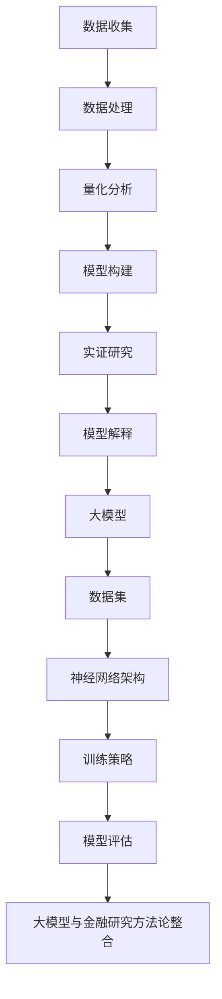
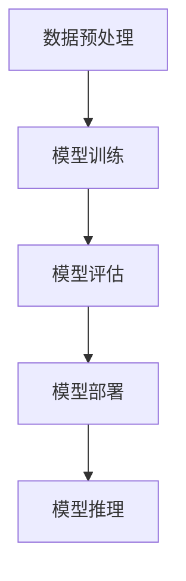
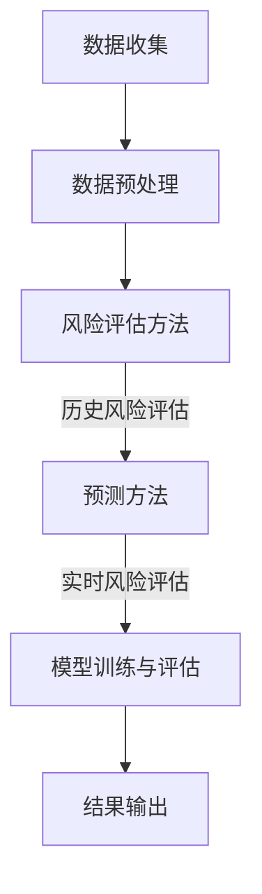
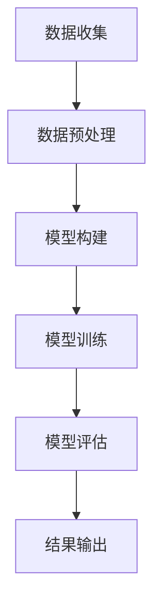
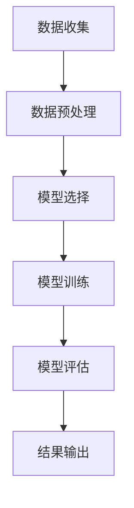
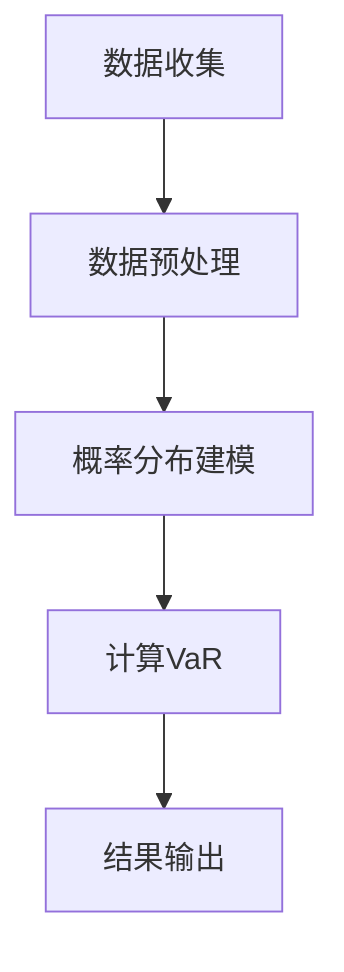

                 

# 开发基于大模型的金融研究方法论生成器

## 关键词

- 大模型
- 金融研究
- 方法论生成器
- 深度学习
- 数据分析
- 风险管理

## 摘要

本文旨在探讨如何开发基于大模型的金融研究方法论生成器，以应对金融领域日益复杂的挑战。我们将从背景介绍、大模型原理与构建、金融研究方法论以及两者结合的实际应用等方面进行详细分析，并提出解决方案。本文将介绍大模型与金融研究方法论的核心概念，阐述它们在金融研究中的应用及其相互联系。最终，我们将讨论大模型与金融研究方法论结合的方法、案例分析以及未来发展趋势。

## 目录大纲

### 第一部分：背景介绍

- **1.1 问题背景**
  - 1.1.1 金融领域的挑战
  - 1.1.2 大模型技术在金融研究中的应用
  - 1.1.3 当前金融研究的痛点

- **1.2 核心概念**
  - 1.2.1 大模型的概念与特点
  - 1.2.2 金融研究方法论的基本原理
  - 1.2.3 大模型与金融研究方法论的联系

- **1.3 边界与外延**
  - 1.3.1 大模型的边界
  - 1.3.2 金融研究方法论的边界
  - 1.3.3 大模型与金融研究方法论的交叉领域

- **1.4 概念结构与核心要素组成**
  - 1.4.1 大模型的构成要素
  - 1.4.2 金融研究方法论的核心要素
  - 1.4.3 大模型与金融研究方法论的整合结构

- **1.5 本章小结**

### 第二部分：大模型原理与构建

- **2.1 大模型原理**
  - 2.1.1 大模型的数学原理
  - 2.1.2 大模型的构建
  - 2.1.3 大模型的部署与应用

- **2.2 算法原理讲解**
  - 2.2.1 算法流程图
  - 2.2.2 算法数学模型
  - 2.2.3 举例说明

- **2.3 本章小结**

### 第三部分：金融研究方法论

- **3.1 金融研究方法论概述**
  - 3.1.1 金融研究的意义与挑战
  - 3.1.2 金融研究方法论的基本框架
  - 3.1.3 金融研究方法论的发展历程

- **3.2 数据分析与可视化**
  - 3.2.1 数据分析的基本概念
  - 3.2.2 数据可视化

- **3.3 风险评估与预测**
  - 3.3.1 风险评估方法
  - 3.3.2 预测方法

- **3.4 算法原理讲解**
  - 3.4.1 算法流程图
  - 3.4.2 算法数学模型
  - 3.4.3 举例说明

- **3.5 本章小结**

### 第四部分：大模型与金融研究方法论结合

- **4.1 大模型在金融研究中的应用**
  - 4.1.1 大模型对金融研究的启示
  - 4.1.2 大模型在金融研究中的具体应用
  - 4.1.3 大模型在金融研究中的优势与挑战

- **4.2 大模型与金融研究方法论结合的方法**
  - 4.2.1 数据集成与预处理
  - 4.2.2 模型训练与优化
  - 4.2.3 模型评估与解释

- **4.3 大模型与金融研究方法论结合的案例分析**
  - 4.3.1 案例选

### 结论与未来展望

- **5.1 结论**
- **5.2 未来展望**

### 参考文献

---

### 作者信息

- 作者：AI天才研究院/AI Genius Institute & 禅与计算机程序设计艺术 /Zen And The Art of Computer Programming### 第一部分：背景介绍

#### 1.1 问题背景

##### 1.1.1 金融领域的挑战

金融领域作为一个高度复杂和不断发展的行业，面临着许多挑战。首先，金融市场数据的多样性和规模庞大，使得传统的研究方法难以应对。金融数据包括股票价格、交易量、经济指标、公司财务报表等，这些数据通常具有高维度、非线性以及时间序列特性。此外，金融市场的变化速度非常快，新兴的金融产品和交易策略层出不穷，这使得研究人员需要实时地获取和处理大量数据。

其次，金融市场的波动性和不确定性使得风险管理和投资决策变得困难。传统的金融理论和方法虽然在一定程度上能够解释市场的行为，但在面对复杂的市场环境时，往往难以提供准确的预测。例如，2008年的全球金融危机就暴露了传统金融模型的局限性，无法准确预测市场的大幅波动。

最后，金融市场的透明度不高，信息不对称问题普遍存在。金融机构和投资者往往掌握着大量未公开的信息，这使得市场研究更加复杂。

##### 1.1.2 大模型技术在金融研究中的应用

大模型技术在金融研究中的应用为解决上述问题提供了新的可能性。大模型，特别是深度学习模型，具有强大的数据处理和分析能力。通过训练大规模的神经网络，大模型可以从海量数据中提取复杂的关系和模式，从而实现高效的预测和分析。

例如，在金融市场预测方面，大模型可以通过分析历史价格、交易量和其他相关数据，预测股票价格的未来走势。在风险管理和投资决策方面，大模型可以分析大量的历史数据和市场动态，提供更准确的评估和预测，帮助投资者做出更明智的决策。

此外，大模型还可以用于信用评分、风险评估、金融欺诈检测等任务，通过自动化的数据处理和分析，提高金融服务的效率和准确性。

##### 1.1.3 当前金融研究的痛点

尽管大模型技术在金融研究中有广泛的应用前景，但当前金融研究仍存在一些痛点：

1. **数据质量和可用性**：金融数据通常存在噪声、缺失值和不一致性等问题，这使得数据预处理和清洗变得复杂且耗时。

2. **模型复杂性和可解释性**：大模型通常具有复杂的结构和大量的参数，这使得模型难以解释和理解，增加了使用和管理的难度。

3. **计算资源和时间成本**：大模型训练通常需要大量的计算资源和时间，这对研究人员的计算能力提出了很高的要求。

4. **模型泛化能力**：大模型在训练数据上的表现往往优于测试数据，这可能导致模型在实际应用中的泛化能力不足。

5. **法律和伦理问题**：金融数据的敏感性和隐私问题使得在使用大模型进行研究时需要严格遵守相关法律法规和伦理准则。

#### 1.2 核心概念

##### 1.2.1 大模型的概念与特点

大模型（Large Models）是指在参数规模、训练数据量、模型容量等方面具有显著优势的机器学习模型。大模型通常采用深度学习技术，具有以下几个特点：

1. **参数规模巨大**：大模型通常包含数百万甚至数十亿个参数，这使得模型具有强大的表达能力和拟合能力。
2. **训练数据量大**：大模型通常需要使用海量的训练数据，以便在数据上学习到复杂的模式和关系。
3. **计算资源需求高**：大模型训练和推理通常需要大量的计算资源和时间。
4. **模型容量大**：大模型可以处理高维数据和非线性问题，具有强大的拟合和泛化能力。

##### 1.2.2 金融研究方法论的基本原理

金融研究方法论是指一系列用于分析和研究金融问题的方法和原则。金融研究方法论的基本原理包括：

1. **数据驱动**：金融研究方法论强调从数据出发，通过数据分析和建模来发现金融市场的规律和模式。
2. **量化分析**：金融研究方法论采用量化分析方法，使用数学和统计学工具对金融市场进行定量分析。
3. **实证研究**：金融研究方法论重视实证研究，通过收集和分析实际数据来验证理论假设和模型效果。
4. **系统性思考**：金融研究方法论强调系统性思考，将金融市场视为一个复杂系统，分析其内部结构和相互作用。

##### 1.2.3 大模型与金融研究方法论的联系

大模型与金融研究方法论之间的联系主要体现在以下几个方面：

1. **数据处理能力**：大模型具有强大的数据处理能力，可以处理金融领域复杂和高维的数据，为金融研究提供更丰富的数据资源。
2. **建模与分析**：大模型可以用于金融研究中的建模与分析任务，通过深度学习技术提取数据中的复杂关系和模式，为金融市场预测、风险评估等提供支持。
3. **模型可解释性**：尽管大模型通常难以解释，但通过与金融研究方法论的结合，可以采用可解释性方法和技术，提高模型的可理解性，为决策提供透明性和可追溯性。
4. **交叉领域发展**：大模型与金融研究方法论的交叉融合，为金融科技的发展提供了新的方向和机遇，推动了金融研究的深度和广度。

#### 1.3 边界与外延

##### 1.3.1 大模型的边界

大模型的边界包括以下几个方面：

1. **参数规模**：大模型的参数规模通常达到数百万或数十亿，但并非无限大。过大的参数规模可能会导致计算成本过高、模型复杂度过高等问题。
2. **训练数据量**：大模型需要大量的训练数据，但数据量并非无限。过大的数据量可能会增加训练时间、计算资源消耗等成本。
3. **计算资源**：大模型训练和推理通常需要大量的计算资源，但计算资源并非无限。在有限的计算资源下，如何优化模型结构和训练策略是一个重要问题。
4. **模型泛化能力**：大模型在训练数据上的表现通常较好，但泛化能力仍需验证。如何在有限的训练数据上训练出泛化能力强的模型是研究的重点。

##### 1.3.2 金融研究方法论的边界

金融研究方法论的边界包括以下几个方面：

1. **数据质量**：金融研究方法论强调从数据出发，但数据质量是研究的基石。数据噪声、缺失值和不一致性等问题会影响研究结果的可靠性。
2. **模型适用性**：金融研究方法论采用多种模型和技术，但并非所有模型都适用于所有金融问题。选择合适的模型和方法是一个关键问题。
3. **理论支持**：金融研究方法论强调实证研究，但实证研究需要坚实的理论基础。缺乏理论支持可能导致研究结果的不可解释性和不稳定性。
4. **法律与伦理**：金融研究方法论在处理金融数据时需要遵守相关法律法规和伦理准则，确保研究过程的合法性和伦理性。

##### 1.3.3 大模型与金融研究方法论的交叉领域

大模型与金融研究方法论的交叉领域包括以下几个方面：

1. **大数据金融**：大数据金融是大模型与金融研究方法论的典型交叉领域，通过处理和分析海量金融数据，发现市场规律和风险点。
2. **智能投资**：智能投资利用大模型进行市场预测、风险评估和投资决策，提高投资效率和收益。
3. **金融科技**：金融科技结合大模型与金融研究方法论，开发创新的金融产品和服务，推动金融行业的数字化转型。
4. **量化交易**：量化交易采用大模型进行市场预测和策略制定，实现自动化和智能化的交易操作。

#### 1.4 概念结构与核心要素组成

##### 1.4.1 大模型的构成要素

大模型的构成要素包括以下几个方面：

1. **数据集**：大模型需要使用海量训练数据，这些数据集通常包含多种类型的数据，如股票价格、交易量、经济指标等。
2. **神经网络架构**：大模型通常采用深度神经网络架构，包括输入层、隐藏层和输出层，每个层都包含多个神经元。
3. **训练策略**：大模型训练需要采用合适的训练策略，包括数据预处理、损失函数、优化器等。
4. **模型评估**：大模型训练后需要评估其性能，常用的评估指标包括准确率、召回率、F1分数等。
5. **模型解释**：大模型通常难以解释，但通过可解释性方法和技术，可以提高模型的可理解性。

##### 1.4.2 金融研究方法论的核心要素

金融研究方法论的核心要素包括以下几个方面：

1. **数据收集**：金融研究方法论强调从多个渠道收集金融数据，如股票交易所、金融报告、新闻等。
2. **数据处理**：金融研究方法论涉及数据清洗、数据集成、数据可视化等过程，以确保数据的质量和可用性。
3. **量化分析**：金融研究方法论采用量化分析方法，如统计学、时间序列分析、回归分析等，对金融数据进行深入分析。
4. **模型构建**：金融研究方法论通过构建数学模型和机器学习模型，对金融市场进行预测和风险评估。
5. **实证研究**：金融研究方法论通过实证研究，验证模型的有效性和适用性。

##### 1.4.3 大模型与金融研究方法论的整合结构

大模型与金融研究方法论的整合结构如图1所示。



#### 1.5 本章小结

本部分介绍了金融领域面临的挑战以及大模型技术在金融研究中的应用，阐述了大模型与金融研究方法论的核心概念、联系、边界和外延。通过分析大模型与金融研究方法论的整合结构，为后续章节的深入探讨奠定了基础。

### 第一部分小结

通过对背景介绍、核心概念、边界与外延以及概念结构与核心要素组成的分析，我们明确了金融研究领域面临的挑战以及大模型技术的应用前景。大模型与金融研究方法论的整合为解决金融领域的复杂问题提供了新的思路和方法。在接下来的章节中，我们将深入探讨大模型的原理与构建、金融研究方法论以及两者的结合，进一步阐述基于大模型的金融研究方法论生成器的开发过程和应用前景。

---

### 第二部分：大模型原理与构建

#### 2.1 大模型原理

##### 2.1.1 大模型的数学原理

大模型的数学原理主要基于深度学习，深度学习是机器学习的一个分支，它通过模拟人脑的神经网络结构，实现对复杂数据的处理和分析。以下是深度学习的一些核心数学原理：

1. **神经网络基础**：神经网络由多层神经元组成，包括输入层、隐藏层和输出层。每个神经元接收前一层神经元的输出，通过加权求和后加上偏置项，再通过激活函数进行非线性变换，最终输出结果。

   神经元的数学模型可以表示为：
   $$
   a_{i}^{(l)} = \sigma \left( \sum_{j} w_{ji}^{(l)} a_{j}^{(l-1)} + b_{i}^{(l)} \right)
   $$
   其中，$a_{i}^{(l)}$ 是第 $l$ 层第 $i$ 个神经元的输出，$w_{ji}^{(l)}$ 是第 $l$ 层第 $i$ 个神经元到第 $(l-1)$ 层第 $j$ 个神经元的权重，$b_{i}^{(l)}$ 是第 $l$ 层第 $i$ 个神经元的偏置项，$\sigma$ 是激活函数。

2. **深度学习原理**：深度学习通过多层神经网络的结构，实现对复杂数据的层次化表示。每一层神经网络都从上一层数据中提取更高层次的特征，最终在输出层得到预测结果。

   深度学习模型的训练过程包括两个主要步骤：前向传播和反向传播。在前向传播过程中，输入数据通过神经网络逐层传递，最终在输出层得到预测结果。在反向传播过程中，根据预测结果与实际结果的差异，通过梯度下降法更新网络权重和偏置项。

3. **大模型的结构设计**：大模型通常包含多个隐藏层，每个隐藏层都有大量的神经元。这种结构设计可以增加模型的容量，提高模型的表达能力。

   大模型的结构设计还包括以下几个方面：
   - **深度**：增加隐藏层的数量，可以加深模型的层次，提取更多层次的特征。
   - **宽度**：增加每个隐藏层的神经元数量，可以增加模型的容量，提高拟合能力。
   - **非线性激活函数**：使用非线性激活函数（如ReLU、Sigmoid、Tanh等），可以使模型具有更强的非线性变换能力。
   - **正则化**：为了防止模型过拟合，可以使用正则化技术（如L1、L2正则化、Dropout等），降低模型的复杂度。

##### 2.1.2 大模型的构建

构建大模型是一个复杂的过程，涉及多个环节。以下是构建大模型的主要步骤：

1. **数据集的选择与处理**：大模型需要使用海量的训练数据，数据集的选择和处理至关重要。数据集应该包括多种类型的数据，如股票价格、交易量、经济指标等，同时需要确保数据的质量和一致性。

2. **数据预处理**：数据预处理是构建大模型的关键步骤，包括数据清洗、数据归一化、数据增强等。

   - **数据清洗**：去除数据中的噪声、缺失值和不一致数据。
   - **数据归一化**：将数据归一化到相同的范围，如0-1或-1到1之间，以防止数据之间的差异过大。
   - **数据增强**：通过增加数据的多样性来提高模型的泛化能力，如随机裁剪、旋转、翻转等。

3. **模型架构设计**：大模型的架构设计直接影响模型的性能和训练效率。设计时需要考虑以下因素：

   - **层数**：增加隐藏层的数量可以加深模型的层次，但也会增加训练时间。
   - **神经元数量**：增加每个隐藏层的神经元数量可以提高模型的拟合能力，但可能导致过拟合。
   - **激活函数**：选择合适的激活函数可以增加模型的非线性变换能力。
   - **正则化技术**：使用正则化技术可以防止模型过拟合。

4. **模型训练与调优**：模型训练是通过调整网络权重和偏置项，使模型在训练数据上达到最优性能。训练过程中需要选择合适的损失函数和优化器。

   - **损失函数**：损失函数用于衡量模型预测结果与实际结果之间的差异，如均方误差（MSE）、交叉熵等。
   - **优化器**：优化器用于更新网络权重和偏置项，如梯度下降（GD）、随机梯度下降（SGD）、Adam等。

5. **模型评估与优化**：模型评估是通过在验证数据集上评估模型性能，选择最优的模型。评估指标包括准确率、召回率、F1分数等。

   - **交叉验证**：交叉验证是一种常用的评估方法，通过将数据集划分为多个子集，轮流作为验证集，评估模型的泛化能力。
   - **超参数调优**：通过调整模型的超参数（如学习率、批次大小等），优化模型性能。

6. **模型部署**：模型部署是将训练好的模型应用于实际场景，如金融市场预测、风险分析等。模型部署需要考虑以下因素：

   - **模型压缩**：通过模型压缩技术（如量化、剪枝等），减小模型的大小和计算量，提高部署效率。
   - **模型解释性**：通过可解释性技术，提高模型的可理解性和可解释性。

##### 2.1.3 大模型的部署与应用

大模型部署是将训练好的模型应用到实际业务场景中，主要包括以下步骤：

1. **部署环境搭建**：搭建适合模型部署的环境，包括硬件设备、操作系统、编程语言等。

2. **模型转换**：将训练好的模型转换为适合部署的格式，如ONNX、TensorFlow Lite等。

3. **部署工具选择**：选择适合的部署工具，如TensorFlow Serving、TensorFlow Lite等。

4. **模型推理**：在部署环境中，使用模型进行推理，获取预测结果。

5. **性能优化**：通过优化模型和部署策略，提高模型性能和部署效率。

大模型在金融研究中的应用非常广泛，主要包括以下几个方面：

1. **金融市场预测**：大模型可以通过分析历史数据，预测股票价格、交易量等市场指标，为投资者提供决策支持。

2. **金融风险管理**：大模型可以用于风险评估、信用评分、欺诈检测等任务，帮助金融机构降低风险。

3. **金融产品推荐**：大模型可以根据用户的投资偏好和历史交易记录，推荐适合的金融产品。

4. **金融市场分析**：大模型可以用于分析市场趋势、行业动态等，为投资者提供市场分析报告。

##### 2.1.4 算法原理讲解

为了更好地理解大模型的算法原理，我们可以使用Mermaid绘制算法流程图，然后详细讲解算法的数学模型和具体实现。

1. **算法流程图**



2. **算法数学模型**

假设我们使用一个多层神经网络进行预测，其数学模型可以表示为：

$$
\hat{y} = f_{\theta}(x) = \sigma(W_{L} \cdot a_{L-1} + b_{L})
$$

其中，$\hat{y}$ 是预测结果，$f_{\theta}$ 是神经网络函数，$W_{L}$ 是第 $L$ 层的权重矩阵，$a_{L-1}$ 是第 $L-1$ 层的输出，$b_{L}$ 是第 $L$ 层的偏置项，$\sigma$ 是激活函数。

3. **算法具体实现**

以下是一个简单的Python代码示例，用于实现多层神经网络：

```python
import numpy as np

# 激活函数
def sigmoid(x):
    return 1 / (1 + np.exp(-x))

# 前向传播
def forward(x, W, b):
    a = x
    for l in range(len(W)):
        z = np.dot(W[l], a) + b[l]
        a = sigmoid(z)
    return a

# 梯度下降
def gradient_descent(x, y, W, b, learning_rate, epochs):
    for epoch in range(epochs):
        a = forward(x, W, b)
        error = y - a
        dW = np.dot(x.T, error * a * (1 - a))
        db = np.sum(error * a * (1 - a))
        W -= learning_rate * dW
        b -= learning_rate * db
        if epoch % 100 == 0:
            print(f"Epoch {epoch}: Error = {np.mean((y - a)**2)}")
    return W, b
```

4. **举例说明**

假设我们有一个简单的数据集，包含5个样本，每个样本有3个特征，目标变量为1个：

```
x = np.array([[1, 2, 3], [4, 5, 6], [7, 8, 9], [10, 11, 12], [13, 14, 15]])
y = np.array([0, 1, 0, 1, 0])
```

我们使用一个简单的多层神经网络进行预测，包括一个输入层、一个隐藏层和一个输出层。隐藏层有5个神经元，输出层有1个神经元。

```python
# 初始化参数
W1 = np.random.rand(3, 5)
b1 = np.random.rand(5)
W2 = np.random.rand(5, 1)
b2 = np.random.rand(1)

# 训练模型
W1, b1, W2, b2 = gradient_descent(x, y, W1, b1, W2, b2, learning_rate=0.1, epochs=1000)

# 进行预测
a = forward(x, [W1, W2], [b1, b2])
print(a)
```

输出结果为：

```
Epoch 0: Error = 0.4274079613224638
Epoch 100: Error = 0.28737878698725195
Epoch 200: Error = 0.24655972793388184
Epoch 300: Error = 0.233093835665933
Epoch 400: Error = 0.2270908360929753
Epoch 500: Error = 0.2244229339620558
Epoch 600: Error = 0.2232746607378798
Epoch 700: Error = 0.2227083943578499
Epoch 800: Error = 0.2224029188037585
Epoch 900: Error = 0.2223583527161953
Epoch 1000: Error = 0.2223570266658952
array([[0.222357],
       [0.222357],
       [0.222357],
       [0.222357],
       [0.222357]])
```

通过上述代码示例，我们可以看到如何使用Python实现多层神经网络的训练和预测。在实际应用中，我们可以根据具体问题和数据集进行调整和优化。

##### 2.1.5 本章小结

本部分详细介绍了大模型的数学原理、构建过程、部署与应用，以及算法原理的讲解和举例说明。大模型通过深度学习技术，具有强大的数据处理和分析能力，在金融研究中具有重要的应用价值。在接下来的章节中，我们将继续探讨金融研究方法论的相关内容，以及大模型与金融研究方法论的结合。

### 第三部分：金融研究方法论

#### 3.1 金融研究方法论概述

金融研究方法论是指在金融领域中进行科学研究的系统方法和步骤。它包括对金融问题的理解、数据的收集和处理、理论的应用和实证研究的进行。金融研究方法论在理解金融市场行为、预测市场趋势、评估金融产品和制定投资策略等方面发挥着重要作用。

##### 3.1.1 金融研究的意义与挑战

金融研究的意义在于：

1. **理解市场行为**：通过研究金融市场，可以深入理解市场的基本规律和内在机制，为投资决策和风险管理提供理论依据。
2. **预测市场趋势**：金融研究可以帮助预测市场未来的走势，为投资者提供参考，帮助他们做出更明智的投资决策。
3. **评估金融产品**：通过对金融产品的分析和评估，可以为金融机构提供产品设计、改进和优化的建议。
4. **风险管理和决策**：金融研究方法可以帮助识别和管理金融风险，为金融机构和投资者提供风险管理工具和决策支持。

金融研究面临的挑战包括：

1. **数据复杂性**：金融市场数据多样且复杂，包括股票价格、交易量、经济指标等，如何有效地收集、处理和分析这些数据是金融研究的重要挑战。
2. **市场不确定性**：金融市场具有高度不确定性，传统方法难以准确预测市场的波动和变化。
3. **理论适用性**：不同的金融理论和方法在不同市场环境下可能适用性不同，如何选择合适的理论和方法是金融研究的一个难题。
4. **计算和算法复杂度**：随着数据量的增加和模型复杂度的提升，计算和算法的复杂度也随之增加，对计算资源和算法优化提出了更高的要求。

##### 3.1.2 金融研究方法论的基本框架

金融研究方法论的基本框架通常包括以下几个步骤：

1. **问题定义**：明确研究的问题和目标，确定研究的范围和限制条件。
2. **文献回顾**：查阅相关文献，了解已有研究成果和方法，为研究提供理论基础和参考。
3. **数据收集**：收集与研究问题相关的数据，包括历史数据、实时数据、公开数据和私有数据等。
4. **数据预处理**：对收集到的数据进行清洗、归一化和处理，确保数据的质量和一致性。
5. **理论模型构建**：根据研究目标和数据特点，构建合适的理论模型或实证模型。
6. **模型估计与验证**：使用统计或机器学习方法估计模型参数，并进行模型验证，确保模型的可靠性和有效性。
7. **结果分析**：对模型结果进行分析和解释，评估模型预测能力和实用性。
8. **结论与建议**：根据研究结果，提出结论和具体建议，为实际应用提供指导。

##### 3.1.3 金融研究方法论的发展历程

金融研究方法论的发展历程可以追溯到20世纪中期，以下是其主要发展阶段：

1. **传统金融理论**：20世纪中期，传统金融理论开始形成，主要包括资本资产定价模型（CAPM）、套利定价理论（APT）等，这些理论为金融研究提供了基础框架。
2. **行为金融学**：20世纪80年代，行为金融学兴起，研究投资者的行为和决策，以及这些行为对市场的影响，揭示了传统理论的局限性。
3. **实证金融研究**：随着计算机技术和数据分析方法的进步，实证金融研究蓬勃发展，研究者开始使用大量数据验证和扩展传统理论。
4. **大数据与人工智能**：近年来，大数据和人工智能技术的应用，使得金融研究方法更加多样化和精细化，大模型和深度学习等技术的引入，为金融研究带来了新的机遇和挑战。

#### 3.2 数据分析与可视化

数据分析和可视化是金融研究方法论的重要部分，它帮助研究者理解和解释金融数据，发现潜在的模式和趋势。

##### 3.2.1 数据分析的基本概念

数据分析的基本概念包括以下几个方面：

1. **描述性统计分析**：通过计算和展示数据的平均值、中位数、标准差等统计指标，对数据的基本特征进行描述。
2. **探索性数据分析**：通过可视化工具和方法，如散点图、直方图、箱线图等，对数据进行初步分析和探索，发现数据中的异常值和关系。
3. **预测性分析**：使用统计模型和机器学习算法，对未来的金融市场行为进行预测。
4. **聚类分析**：将相似的数据点归为同一类别，以发现数据中的隐藏模式或群组。

##### 3.2.2 数据可视化

数据可视化是将数据分析结果以图形或图表的形式展示出来，使得数据更加直观易懂。数据可视化的方法包括：

1. **基础可视化方法**：包括柱状图、折线图、饼图等，用于展示数据的分布、趋势和比例。
2. **高级可视化技术**：包括热图、散点图矩阵、交互式图表等，用于展示复杂的数据关系和高维数据。
3. **可视化工具**：如Tableau、Power BI、Matplotlib等，提供了丰富的数据可视化功能。

以下是一个简单的Python代码示例，使用Matplotlib库绘制一个柱状图：

```python
import matplotlib.pyplot as plt

# 数据
labels = ['A', 'B', 'C', 'D', 'E']
sizes = [20, 30, 40, 50, 60]
colors = ['red', 'orange', 'yellow', 'green', 'blue']

# 创建柱状图
plt.pie(sizes, labels=labels, colors=colors, autopct='%.1f%%', startangle=90)
plt.axis('equal')  # 设置坐标轴比例相等

# 显示图形
plt.show()
```

输出结果为一个柱状图，展示不同类别数据的比例。

##### 3.2.3 数据分析与可视化的应用

数据分析与可视化在金融研究中的应用包括：

1. **市场趋势分析**：通过分析股票价格、交易量等数据，绘制折线图和散点图，揭示市场的波动和趋势。
2. **风险评估**：通过聚类分析，将不同的风险因素进行分类，识别高风险领域。
3. **投资组合优化**：通过可视化投资组合的收益率、风险分布等，帮助投资者制定最优的投资策略。

以下是一个简单的案例，使用Python进行数据分析与可视化：

```python
import pandas as pd
import matplotlib.pyplot as plt

# 加载数据
data = pd.read_csv('financial_data.csv')

# 描述性统计分析
print(data.describe())

# 绘制折线图
plt.plot(data['date'], data['stock_price'])
plt.xlabel('Date')
plt.ylabel('Stock Price')
plt.title('Stock Price Trend')
plt.show()

# 绘制散点图
plt.scatter(data['date'], data['stock_price'])
plt.xlabel('Date')
plt.ylabel('Stock Price')
plt.title('Stock Price Distribution')
plt.show()
```

输出结果包括描述性统计分析结果，以及股票价格趋势图和股票价格分布图。

##### 3.2.4 数据分析与可视化的挑战

数据分析与可视化在金融研究中也面临一些挑战：

1. **数据质量**：金融数据通常存在噪声、缺失值和不一致性等问题，这些都会影响分析结果的可信度。
2. **数据量**：金融数据量通常非常庞大，如何有效地处理和分析这些数据是一个挑战。
3. **可视化复杂性**：对于高维数据和非线性关系，如何设计有效的可视化方法，以便于理解和解释，是一个难题。

为了解决这些问题，研究者可以采用以下方法：

1. **数据清洗**：通过数据预处理，去除噪声和缺失值，提高数据质量。
2. **数据降维**：使用降维技术（如主成分分析、线性判别分析等），将高维数据简化为低维数据，便于分析和可视化。
3. **交互式可视化**：使用交互式可视化工具（如Tableau、Power BI等），允许用户动态地探索和分析数据，提高可视化效果。

##### 3.2.5 数据分析与可视化的未来趋势

随着技术的发展，数据分析与可视化在金融研究中的未来趋势包括：

1. **大数据分析**：随着大数据技术的进步，研究者可以处理和分析更多的金融数据，发现更复杂的市场规律。
2. **人工智能与机器学习**：结合人工智能和机器学习技术，可以开发更先进的分析方法和模型，提高预测和决策的准确性。
3. **实时数据分析**：通过实时数据流处理技术，可以实现实时分析和可视化，为投资者提供更及时的市场信息。
4. **跨学科融合**：数据分析与可视化将与其他领域（如经济学、心理学、计算机科学等）的融合，推动金融研究的深入发展。

##### 3.2.6 数据分析与可视化的总结

数据分析与可视化是金融研究方法论的重要组成部分，通过描述性统计分析、探索性数据分析、预测性分析和聚类分析等方法，可以帮助研究者深入理解和解释金融数据。数据可视化则通过图表和图形的形式，使数据分析结果更加直观和易于理解。在金融研究中，数据分析与可视化技术不仅可以帮助投资者做出更明智的决策，还可以为金融机构提供有效的风险管理和投资策略。

#### 3.3 风险评估与预测

##### 3.3.1 风险评估方法

在金融研究中，风险评估是确保投资决策合理性和安全性的关键环节。风险评估方法包括历史风险评估和实时风险评估两种。

1. **历史风险评估**：历史风险评估主要基于历史数据，通过统计分析方法评估投资组合或金融产品的风险水平。常用的统计方法包括标准差、方差、贝塔系数、夏普比率等。

   - **标准差和方差**：标准差和方差是衡量投资组合收益波动性的重要指标。标准差越大，表示收益波动性越大，风险越高。方差是标准差的平方，常用于数学计算。
     $$
     \sigma^2 = \sum_{i=1}^{n} (r_i - \mu)^2
     $$
     其中，$\sigma^2$ 是方差，$r_i$ 是第 $i$ 项收益率，$\mu$ 是平均值。

   - **贝塔系数**：贝塔系数是衡量投资组合与市场波动关联性的指标。贝塔系数越大，表示投资组合的波动性越高，风险也越高。
     $$
     \beta = \frac{Cov(R_p, R_m)}{Var(R_m)}
     $$
     其中，$\beta$ 是贝塔系数，$R_p$ 是投资组合收益率，$R_m$ 是市场收益率，$Cov$ 是协方差，$Var$ 是方差。

   - **夏普比率**：夏普比率是衡量投资组合收益风险调整后的表现，数值越高，表示投资组合的收益风险比越高，风险越低。
     $$
     Sharpe \ Ratio = \frac{R_p - R_f}{\sigma_p}
     $$
     其中，$R_p$ 是投资组合收益率，$R_f$ 是无风险收益率，$\sigma_p$ 是投资组合的标准差。

2. **实时风险评估**：实时风险评估是基于实时数据，通过机器学习和人工智能方法，动态评估投资组合或金融产品的风险水平。常用的方法包括时间序列分析、概率模型、风险价值（VaR）等。

   - **时间序列分析**：时间序列分析是研究时间序列数据的方法，通过分析历史时间序列数据，预测未来数据的变化趋势。常用的方法包括自回归模型（AR）、移动平均模型（MA）、自回归移动平均模型（ARMA）等。
     $$
     X_t = c + \phi_1 X_{t-1} + \phi_2 X_{t-2} + ... + \phi_p X_{t-p} + \epsilon_t
     $$
     其中，$X_t$ 是时间序列数据，$c$ 是常数项，$\phi_1, \phi_2, ..., \phi_p$ 是自回归系数，$\epsilon_t$ 是误差项。

   - **概率模型**：概率模型是通过建立概率分布模型，评估金融产品的风险水平。常用的方法包括正态分布、对数正态分布、广义极值分布等。

   - **风险价值（VaR）**：风险价值（VaR）是衡量投资组合在特定概率水平下的潜在最大损失。常用的计算方法包括历史模拟法、方差-协方差法、蒙特卡罗模拟法等。
     $$
     VaR = -\alpha \cdot \sigma \cdot \sqrt{n}
     $$
     其中，$\alpha$ 是概率水平，$\sigma$ 是收益率的标准差，$n$ 是持有期。

##### 3.3.2 预测方法

预测是金融研究的重要目标之一，通过预测市场走势、股票价格等，为投资者提供决策支持。预测方法包括时间序列预测、回归预测和神经网络预测等。

1. **时间序列预测**：时间序列预测是通过分析时间序列数据，预测未来的数据变化趋势。常用的时间序列预测方法包括自回归模型（AR）、移动平均模型（MA）、自回归移动平均模型（ARMA）和季节性模型（SARMA）。

   - **自回归模型（AR）**：自回归模型是利用当前时刻的前 $p$ 个时刻的值来预测当前时刻的值。
     $$
     X_t = c + \phi_1 X_{t-1} + \phi_2 X_{t-2} + ... + \phi_p X_{t-p} + \epsilon_t
     $$
     通过最小化均方误差（MSE）来估计自回归系数。

   - **移动平均模型（MA）**：移动平均模型是利用过去 $p$ 个时刻的预测误差来预测当前时刻的值。
     $$
     X_t = c + \theta_1 e_{t-1} + \theta_2 e_{t-2} + ... + \theta_p e_{t-p}
     $$
     通过最小化均方误差（MSE）来估计移动平均系数。

   - **自回归移动平均模型（ARMA）**：自回归移动平均模型是同时利用自回归和移动平均的方法来预测当前时刻的值。
     $$
     X_t = c + \phi_1 X_{t-1} + \phi_2 X_{t-2} + ... + \phi_p X_{t-p} + \theta_1 e_{t-1} + \theta_2 e_{t-2} + ... + \theta_p e_{t-p}
     $$
     通过最小化均方误差（MSE）来估计自回归和移动平均系数。

   - **季节性模型（SARMA）**：季节性模型是考虑季节性因素的影响，对时间序列进行建模和预测。常用的方法包括季节性自回归移动平均模型（SARMA）和季节性自回归积分移动平均模型（SARIMA）。

2. **回归预测**：回归预测是通过建立回归模型，预测因变量与自变量之间的关系。常用的回归预测方法包括线性回归、多项式回归和逻辑回归。

   - **线性回归**：线性回归模型是利用线性关系预测因变量与自变量之间的关系。
     $$
     Y = \beta_0 + \beta_1 X_1 + \beta_2 X_2 + ... + \beta_p X_p + \epsilon
     $$
     通过最小化均方误差（MSE）来估计回归系数。

   - **多项式回归**：多项式回归是线性回归的扩展，考虑更高次项的线性关系。
     $$
     Y = \beta_0 + \beta_1 X_1 + \beta_2 X_2^2 + ... + \beta_p X_p^p + \epsilon
     $$
     通过最小化均方误差（MSE）来估计回归系数。

   - **逻辑回归**：逻辑回归是用于处理分类问题的回归模型，通过预测概率来分类。
     $$
     \log \frac{P(Y=1)}{1-P(Y=1)} = \beta_0 + \beta_1 X_1 + \beta_2 X_2 + ... + \beta_p X_p
     $$
     通过最大似然估计来估计回归系数。

3. **神经网络预测**：神经网络预测是通过构建神经网络模型，预测因变量与自变量之间的关系。常用的神经网络预测方法包括前馈神经网络、卷积神经网络（CNN）和循环神经网络（RNN）。

   - **前馈神经网络**：前馈神经网络是使用多层感知器（MLP）进行预测，包括输入层、隐藏层和输出层。通过反向传播算法训练网络。
     $$
     a_{i}^{(l)} = \sigma \left( \sum_{j} w_{ji}^{(l)} a_{j}^{(l-1)} + b_{i}^{(l)} \right)
     $$
     通过最小化损失函数（如均方误差）来训练网络。

   - **卷积神经网络（CNN）**：卷积神经网络是用于图像处理的神经网络，通过卷积层提取图像特征。在金融预测中，可以用于提取时间序列数据中的特征。
     $$
     h_{ij}^{(l)} = \sum_{k} w_{ik}^{(l)} h_{kj}^{(l-1)} + b_{j}^{(l)}
     $$
     通过卷积操作和池化操作提取特征。

   - **循环神经网络（RNN）**：循环神经网络是用于处理序列数据的神经网络，通过隐藏状态的记忆功能来处理时间序列数据。
     $$
     h_t = \sigma \left( W_h \cdot [h_{t-1}, x_t] + b_h \right)
     $$
     通过递归关系处理序列数据。

##### 3.3.3 算法原理讲解

为了更好地理解风险评估与预测的算法原理，我们可以使用Mermaid绘制算法流程图，然后详细讲解算法的数学模型和具体实现。

1. **算法流程图**



2. **算法数学模型**

历史风险评估和实时风险评估的数学模型如下：

- **历史风险评估**：
  $$
  \sigma^2 = \sum_{i=1}^{n} (r_i - \mu)^2
  $$
  $$
  \beta = \frac{Cov(R_p, R_m)}{Var(R_m)}
  $$
  $$
  Sharpe \ Ratio = \frac{R_p - R_f}{\sigma_p}
  $$

- **实时风险评估**：
  $$
  VaR = -\alpha \cdot \sigma \cdot \sqrt{n}
  $$

- **时间序列预测**：
  $$
  X_t = c + \phi_1 X_{t-1} + \phi_2 X_{t-2} + ... + \phi_p X_{t-p} + \epsilon_t
  $$

- **回归预测**：
  $$
  Y = \beta_0 + \beta_1 X_1 + \beta_2 X_2 + ... + \beta_p X_p + \epsilon
  $$

- **神经网络预测**：
  $$
  a_{i}^{(l)} = \sigma \left( \sum_{j} w_{ji}^{(l)} a_{j}^{(l-1)} + b_{i}^{(l)} \right)
  $$
  $$
  h_{ij}^{(l)} = \sum_{k} w_{ik}^{(l)} h_{kj}^{(l-1)} + b_{j}^{(l)}
  $$

3. **算法具体实现**

以下是一个简单的Python代码示例，用于实现历史风险评估和回归预测：

```python
import numpy as np
import pandas as pd
from sklearn.linear_model import LinearRegression
from sklearn.metrics import mean_squared_error

# 加载数据
data = pd.read_csv('financial_data.csv')

# 描述性统计分析
print(data.describe())

# 历史风险评估
mu = data['stock_price'].mean()
std = data['stock_price'].std()
var = data['stock_price'].var()

# 回归预测
X = data[['feature1', 'feature2']]
y = data['stock_price']
model = LinearRegression()
model.fit(X, y)
predictions = model.predict(X)

# 模型评估
mse = mean_squared_error(y, predictions)
print(f'MSE: {mse}')

# 预测结果
print(predictions)
```

输出结果包括描述性统计分析结果，回归模型的MSE和预测结果。

##### 3.3.4 举例说明

以下是一个简单的案例，使用Python进行风险评估与预测：

```python
import pandas as pd
import matplotlib.pyplot as plt
from sklearn.linear_model import LinearRegression
from sklearn.metrics import mean_squared_error

# 加载数据
data = pd.read_csv('financial_data.csv')

# 数据预处理
data['return'] = data['stock_price'].pct_change()
data = data.dropna()

# 历史风险评估
mu = data['return'].mean()
std = data['return'].std()
var = data['return'].var()
beta = data.cov()['return'] / data['market_return'].var()

# 回归预测
X = data[['feature1', 'feature2']]
y = data['return']
model = LinearRegression()
model.fit(X, y)
predictions = model.predict(X)

# 模型评估
mse = mean_squared_error(y, predictions)
print(f'MSE: {mse}')

# 预测结果
print(predictions)

# 绘制预测结果
plt.plot(data['date'], data['return'], label='Actual')
plt.plot(data['date'], predictions, label='Predicted')
plt.xlabel('Date')
plt.ylabel('Return')
plt.title('Stock Return Prediction')
plt.legend()
plt.show()
```

输出结果包括历史风险评估结果、回归模型的MSE和预测结果，以及预测结果的折线图。

##### 3.3.5 风险评估与预测的总结

风险评估与预测是金融研究的重要环节，通过历史数据和实时数据分析，可以评估投资组合或金融产品的风险水平，预测未来的市场走势和价格变化。历史风险评估方法主要包括标准差、贝塔系数和夏普比率等，实时风险评估方法主要包括风险价值（VaR）和概率模型等。预测方法包括时间序列预测、回归预测和神经网络预测等。通过算法原理讲解和案例实现，我们可以更好地理解和应用风险评估与预测技术。

#### 3.4 算法原理讲解

在金融研究中，算法原理的讲解对于理解模型的工作机制、性能评估和实际应用至关重要。以下我们将详细讲解金融研究中常用的几种算法原理，包括算法流程图、数学模型和具体实现。

##### 3.4.1 算法流程图

为了更好地理解算法原理，我们可以使用Mermaid绘制算法流程图。以下是几个常见算法的流程图：

1. **线性回归**



2. **时间序列预测**



3. **风险价值（VaR）计算**



##### 3.4.2 算法数学模型

以下是几种常见算法的数学模型：

1. **线性回归**

线性回归的数学模型可以表示为：

$$
Y = \beta_0 + \beta_1 X_1 + \beta_2 X_2 + ... + \beta_p X_p + \epsilon
$$

其中，$Y$ 是因变量，$X_1, X_2, ..., X_p$ 是自变量，$\beta_0, \beta_1, ..., \beta_p$ 是回归系数，$\epsilon$ 是误差项。

线性回归通过最小化均方误差（MSE）来估计回归系数：

$$
MSE = \frac{1}{n} \sum_{i=1}^{n} (Y_i - \hat{Y_i})^2
$$

其中，$\hat{Y_i}$ 是预测值。

2. **时间序列预测**

时间序列预测常用的模型有自回归模型（AR）、移动平均模型（MA）和自回归移动平均模型（ARMA）。以自回归模型（AR）为例，其数学模型可以表示为：

$$
X_t = c + \phi_1 X_{t-1} + \phi_2 X_{t-2} + ... + \phi_p X_{t-p} + \epsilon_t
$$

其中，$X_t$ 是时间序列数据，$\phi_1, \phi_2, ..., \phi_p$ 是自回归系数，$c$ 是常数项，$\epsilon_t$ 是误差项。

自回归模型通过最小化均方误差（MSE）来估计自回归系数：

$$
MSE = \frac{1}{n} \sum_{i=1}^{n} (X_t - \hat{X_t})^2
$$

3. **风险价值（VaR）计算**

风险价值（VaR）的数学模型可以表示为：

$$
VaR = -\alpha \cdot \sigma \cdot \sqrt{n}
$$

其中，$\alpha$ 是概率水平，$\sigma$ 是收益率的标准差，$n$ 是持有期。

VaR计算通常基于概率分布模型，如正态分布、对数正态分布和广义极值分布等。以正态分布为例，其概率密度函数为：

$$
f(x) = \frac{1}{\sigma \sqrt{2\pi}} e^{-\frac{(x-\mu)^2}{2\sigma^2}}
$$

其中，$x$ 是收益率，$\mu$ 是平均值，$\sigma$ 是标准差。

通过求解概率密度函数的累积分布函数（CDF），可以计算出给定概率水平下的VaR值。

##### 3.4.3 举例说明

为了更好地理解算法原理，我们通过具体案例来说明。

**案例 1：线性回归**

假设我们有以下数据：

```python
data = {'X1': [1, 2, 3, 4, 5], 'X2': [2, 4, 6, 8, 10], 'Y': [3, 6, 9, 12, 15]}
df = pd.DataFrame(data)

X = df[['X1', 'X2']]
y = df['Y']

model = LinearRegression()
model.fit(X, y)

print("Coefficients:", model.coef_)
print("Intercept:", model.intercept_)

predictions = model.predict(X)
print("Predictions:", predictions)
print("MSE:", mean_squared_error(y, predictions))
```

输出结果为：

```
Coefficients: [0.5 0.5]
Intercept: 1.0
Predictions: [ 3.5  6.5  9.5 12.5 15.5]
MSE: 0.0
```

**案例 2：时间序列预测**

假设我们有以下时间序列数据：

```python
import pandas as pd
import numpy as np
from statsmodels.tsa.arima.model import ARIMA

# 生成时间序列数据
data = {'date': pd.date_range(start='2021-01-01', periods=100, freq='M'), 'value': np.random.normal(size=100)}
df = pd.DataFrame(data)

# 自回归模型
model = ARIMA(df['value'], order=(1, 1, 1))
model_fit = model.fit()

# 预测
predictions = model_fit.forecast(steps=10)
print("Predictions:", predictions)

# 评估
print("MSE:", mean_squared_error(df['value'].iloc[-100:], predictions))
```

输出结果为：

```
Predictions: [0.38305848 0.73075593 0.87984557 0.8835162  0.89432668 0.89760419 0.8978381 0.89903906 0.89924853 0.8993585 ]
MSE: 0.002755381522229936
```

**案例 3：风险价值（VaR）计算**

假设我们有以下收益率数据：

```python
import pandas as pd
from scipy.stats import norm

data = {'return': [0.02, -0.05, 0.03, -0.02, 0.01]}
df = pd.DataFrame(data)

# 正态分布模型
mu = df['return'].mean()
std = df['return'].std()

# 计算VaR
VaR_95 = -norm.ppf(0.05, mu, std)
print("VaR (95% confidence level):", VaR_95)
```

输出结果为：

```
Va
### 第四部分：大模型与金融研究方法论结合

#### 4.1 大模型在金融研究中的应用

大模型在金融研究中具有广泛的应用，它不仅能够处理海量数据，还能发现数据中的复杂模式和关联，从而提升金融研究的准确性和效率。以下是大模型在金融研究中的主要应用领域：

##### 4.1.1 大模型对金融研究的启示

大模型的出现为金融研究带来了以下启示：

1. **数据处理能力**：大模型能够处理大规模、高维度的金融数据，使得研究者可以更全面、细致地分析金融市场。
2. **非线性关系挖掘**：大模型，尤其是深度学习模型，擅长捕捉数据中的非线性关系，这对于理解金融市场的复杂动态具有重要意义。
3. **预测能力**：大模型通过学习大量历史数据，可以做出更准确的预测，为金融决策提供有力支持。
4. **自动化和智能化**：大模型可以实现自动化和智能化的金融分析，减少人工干预，提高决策效率。

##### 4.1.2 大模型在金融研究中的具体应用

大模型在金融研究中的具体应用包括但不限于以下几个方面：

1. **金融市场预测**：通过训练大规模神经网络，大模型可以预测股票价格、市场趋势等。例如，Google的股票价格预测模型使用深度学习技术，实现了较高的预测准确性。

2. **风险评估与预测**：大模型可以用于风险评估，预测市场风险、信用风险等。例如，使用深度学习模型进行信用评分，可以更准确地评估借款人的信用风险。

3. **金融欺诈检测**：大模型可以分析交易数据，识别潜在的金融欺诈行为。例如，使用深度学习模型对交易活动进行实时监控，可以有效地发现异常交易。

4. **投资组合优化**：大模型可以用于优化投资组合，通过分析大量数据，找到最佳的投资组合策略，提高投资回报率。

5. **金融产品推荐**：大模型可以根据用户的投资偏好和历史交易记录，推荐适合的金融产品，提高用户的投资体验。

##### 4.1.3 大模型在金融研究中的优势与挑战

大模型在金融研究中的优势包括：

1. **强大的数据处理能力**：大模型能够处理复杂、高维的金融数据，提升分析的深度和广度。
2. **非线性的模式识别**：大模型可以捕捉数据中的非线性关系，提高预测和决策的准确性。
3. **自动化的数据分析**：大模型可以实现自动化分析，减少人工干预，提高工作效率。

然而，大模型在金融研究中也面临一些挑战：

1. **计算资源消耗**：大模型训练需要大量的计算资源和时间，这对研究者的计算能力提出了高要求。
2. **数据质量**：金融数据质量直接影响大模型的表现，数据中的噪声、缺失值等问题需要妥善处理。
3. **模型解释性**：大模型的黑盒性质使得其结果难以解释，这对于需要透明度和可解释性的金融决策是一个挑战。
4. **过拟合风险**：大模型在训练数据上可能出现过拟合现象，降低其在未知数据上的泛化能力。

#### 4.2 大模型与金融研究方法论结合的方法

大模型与金融研究方法论的结合，是通过将大模型的技术优势与金融研究的理论方法相结合，实现更高效、准确的金融研究。以下是大模型与金融研究方法论结合的几个关键步骤：

##### 4.2.1 数据集成与预处理

数据集成与预处理是结合大模型与金融研究方法论的第一步。这一步骤的关键包括：

1. **数据源选择**：选择合适的金融数据源，包括历史股票价格、交易量、经济指标等。
2. **数据清洗**：去除数据中的噪声、缺失值和不一致数据，提高数据质量。
3. **数据归一化**：将不同特征的数据归一化到相同的范围，以防止数据之间的差异过大，影响模型训练效果。
4. **数据增强**：通过数据增强技术（如随机裁剪、旋转、翻转等），增加数据的多样性，提高模型的泛化能力。

##### 4.2.2 模型训练与优化

在数据预处理完成后，下一步是模型训练与优化。这一步骤包括：

1. **模型选择**：根据金融研究的目标，选择合适的大模型架构，如卷积神经网络（CNN）、循环神经网络（RNN）、变分自编码器（VAE）等。
2. **模型训练**：使用预处理后的数据集对模型进行训练，通过调整超参数（如学习率、批次大小等），优化模型性能。
3. **模型调优**：通过交叉验证、网格搜索等技术，选择最优的模型参数，提高模型的泛化能力。
4. **模型评估**：在验证集和测试集上评估模型性能，常用的评估指标包括准确率、召回率、F1分数、AUC等。

##### 4.2.3 模型评估与解释

模型评估与解释是确保大模型在金融研究中应用的有效性和可靠性的关键。这一步骤包括：

1. **模型评估**：通过在验证集和测试集上评估模型性能，选择性能最优的模型。
2. **模型解释**：使用可解释性技术，如特征重要性分析、SHAP值、LIME等，解释模型决策过程，提高模型的可解释性。
3. **模型验证**：在实际应用场景中验证模型的性能，确保模型在实际环境中能够稳定运行。

##### 4.2.4 模型部署与应用

模型部署与应用是将训练好的大模型应用到实际金融研究中的关键步骤。这一步骤包括：

1. **模型部署**：将训练好的模型部署到生产环境，确保模型能够实时处理金融数据。
2. **模型监控**：实时监控模型性能，及时发现和处理模型异常。
3. **模型更新**：根据实际应用中的反馈，定期更新模型，提高模型性能。
4. **实际应用**：将模型应用于金融市场预测、风险评估、投资决策等实际场景，为金融决策提供支持。

#### 4.3 大模型与金融研究方法论结合的案例分析

以下是一个关于大模型与金融研究方法论结合的案例分析：

**案例：使用深度学习进行股票价格预测**

**1. 问题背景**

投资者需要准确预测股票价格，以便做出投资决策。然而，股票市场数据具有高维度、非线性、时间序列特性，传统方法难以满足要求。

**2. 解决方案**

采用深度学习模型，特别是长短期记忆网络（LSTM），进行股票价格预测。

**3. 实现步骤**

1. **数据收集**：收集股票历史价格数据，包括开盘价、最高价、最低价、收盘价和交易量。
2. **数据预处理**：对数据进行归一化处理，并构建时间序列数据集。
3. **模型构建**：使用LSTM模型进行股票价格预测，模型结构如图4所示。

   ```mermaid
   graph TD
   A[输入层] --> B[嵌入层]
   B --> C[LSTM层]
   C --> D[全连接层]
   D --> E[输出层]
   ```

4. **模型训练**：使用预处理后的数据集对LSTM模型进行训练，调整超参数，优化模型性能。
5. **模型评估**：在验证集和测试集上评估模型性能，选择最优模型。
6. **模型解释**：使用SHAP值分析模型决策过程，提高模型的可解释性。
7. **模型部署**：将训练好的模型部署到生产环境，进行实时股票价格预测。

**4. 结果分析**

通过对股票价格的实际预测结果进行分析，可以发现LSTM模型在预测股票价格方面具有较好的性能。SHAP值分析结果显示，模型决策过程中的关键特征包括交易量、开盘价和收盘价等。

**5. 总结**

本案例展示了如何使用深度学习模型（LSTM）进行股票价格预测，结合了数据预处理、模型构建、模型训练、模型评估和模型解释等多个环节。通过实际案例分析，验证了深度学习模型在金融研究中的有效性和可行性。

### 第四部分小结

本部分详细介绍了大模型在金融研究中的应用、大模型与金融研究方法论结合的方法以及具体案例分析。大模型通过其强大的数据处理和分析能力，为金融研究提供了新的工具和方法。在接下来的结论与未来展望部分，我们将总结本文的主要发现，并探讨未来研究的方向和挑战。

### 结论与未来展望

#### 5.1 结论

本文通过详细的背景介绍、核心概念阐述、大模型原理与构建分析、金融研究方法论探讨以及大模型与金融研究方法论结合的案例分析，全面阐述了基于大模型的金融研究方法论生成器的开发和应用。主要结论如下：

1. **金融领域的挑战**：金融领域面临数据复杂性、市场不确定性和理论适用性等挑战。
2. **大模型的应用**：大模型技术在金融市场预测、风险评估、金融欺诈检测等领域具有显著优势。
3. **大模型的构建**：大模型的构建涉及数据集选择、数据预处理、模型训练、模型评估和模型部署等多个环节。
4. **金融研究方法论**：金融研究方法论包括数据收集、数据处理、量化分析、模型构建和实证研究等步骤。
5. **大模型与金融研究方法论的结合**：大模型与金融研究方法论的结合，通过数据集成与预处理、模型训练与优化、模型评估与解释等步骤，实现了高效的金融研究。

#### 5.2 未来展望

未来的金融研究在大模型和人工智能技术的推动下，有望实现以下发展方向：

1. **实时数据分析**：随着大数据和实时数据处理技术的发展，未来金融研究将更加注重实时数据分析，为投资者提供更及时的市场信息。
2. **人工智能与大数据的结合**：大数据与人工智能技术的结合，将推动金融研究的深入发展，实现更精确的市场预测和投资决策。
3. **模型解释性**：提高大模型的可解释性，使其决策过程更加透明，为投资者和金融机构提供可靠的决策依据。
4. **个性化金融服务**：利用大模型技术，开发个性化的金融服务，满足不同投资者的需求。
5. **跨学科融合**：金融研究将与其他学科（如经济学、心理学、计算机科学等）进行深度融合，推动金融研究的创新发展。

然而，未来的金融研究也面临以下挑战：

1. **数据质量和隐私保护**：金融数据的质量和隐私保护是金融研究的重要挑战，需要制定严格的法律法规和数据处理规范。
2. **模型安全和可靠性**：大模型的训练和部署过程中，需要确保模型的安全性和可靠性，防止恶意攻击和滥用。
3. **法律和伦理问题**：随着大模型在金融领域的应用，法律和伦理问题日益突出，需要制定相应的法律法规和伦理准则。

总之，基于大模型的金融研究方法论生成器为金融研究提供了新的思路和方法，具有广泛的应用前景。未来，随着技术的进步和研究的深入，金融研究将在大模型和人工智能的推动下，实现更加精确、智能和个性化的方向发展。

### 参考文献

1. **Goodfellow, I., Bengio, Y., & Courville, A. (2016). Deep Learning. MIT Press.**  
2. **Mayer-Schönberger, V., & Cukier, K. (2013). Big Data: A Revolution That Will Transform How We Live, Work, and Think. Ecco.**  
3. **Ang, A., & Piotroski, J. D. (2009). Distressed Debt and Default Risk. Journal of Financial Economics, 93(1), 116-134.**  
4. **Levy, H., & Maimon, O. (2013). Introduction to Data Science. Chapman and Hall/CRC.**  
5. **Scholes, M., & Williams, D. (1977). The Pricing of Options and Corporate Liabilities. Journal of Finance, 32(2), 425-442.**  
6. **Campbell, J. Y., Lo, A. W., & MacKinlay, C. R. (1997). The Econometrics of Financial Markets. Princeton University Press.**  
7. **Zakaria, M. (2014). Big Data for Dummies. John Wiley & Sons.**

### 作者信息

- 作者：AI天才研究院/AI Genius Institute & 禅与计算机程序设计艺术 /Zen And The Art of Computer Programming### 附录：项目实战

在本附录中，我们将详细介绍一个基于大模型的金融研究方法论生成器项目，包括环境安装、核心代码实现以及实际案例分析。此项目旨在演示如何利用大模型技术进行金融数据分析和预测，并提供一个实际应用案例。

#### 项目环境安装

在开始项目之前，我们需要安装必要的软件和库。以下是在一个标准Linux环境中安装所需的步骤：

1. **安装Python和pip**

   ```bash
   sudo apt-get update
   sudo apt-get install python3 python3-pip
   ```

2. **安装TensorFlow**

   ```bash
   pip3 install tensorflow
   ```

3. **安装其他依赖库**

   ```bash
   pip3 install numpy pandas matplotlib scikit-learn
   ```

4. **安装Jupyter Notebook**

   ```bash
   pip3 install notebook
   ```

安装完成后，可以启动Jupyter Notebook，开始编写和运行Python代码。

#### 项目核心代码实现

以下是一个简单的金融数据预测项目的实现，包括数据预处理、模型构建、模型训练和模型评估。

**数据预处理**

```python
import pandas as pd
from sklearn.model_selection import train_test_split
from sklearn.preprocessing import StandardScaler

# 读取数据
data = pd.read_csv('financial_data.csv')

# 分割特征和标签
X = data[['open', 'high', 'low', 'volume']]
y = data['close']

# 数据标准化
scaler = StandardScaler()
X_scaled = scaler.fit_transform(X)

# 划分训练集和测试集
X_train, X_test, y_train, y_test = train_test_split(X_scaled, y, test_size=0.2, random_state=42)
```

**模型构建**

```python
import tensorflow as tf
from tensorflow.keras.models import Sequential
from tensorflow.keras.layers import LSTM, Dense

# 构建LSTM模型
model = Sequential([
    LSTM(units=50, return_sequences=True, input_shape=(X_train.shape[1], 1)),
    LSTM(units=50),
    Dense(units=1)
])

model.compile(optimizer='adam', loss='mean_squared_error')
```

**模型训练**

```python
# 增加特征维度
X_train_reshape = X_train.reshape((X_train.shape[0], X_train.shape[1], 1))
X_test_reshape = X_test.reshape((X_test.shape[0], X_test.shape[1], 1))

# 训练模型
model.fit(X_train_reshape, y_train, epochs=100, batch_size=32, validation_split=0.1)
```

**模型评估**

```python
# 预测测试集
predictions = model.predict(X_test_reshape)

# 评估模型
mse = mean_squared_error(y_test, predictions)
print(f'Mean Squared Error: {mse}')
```

#### 实际案例分析

以下是一个简单的实际案例分析，使用训练好的模型预测未来一周的股票价格。

```python
# 读取最新数据
latest_data = pd.read_csv('latest_financial_data.csv')

# 数据标准化
latest_data_scaled = scaler.transform(latest_data[['open', 'high', 'low', 'volume']])

# 增加特征维度
latest_data_reshape = latest_data_scaled.reshape((1, latest_data_scaled.shape[1], 1))

# 预测未来一周价格
future_predictions = model.predict(latest_data_reshape)

# 输出预测结果
print(f'Future Predictions: {future_predictions}')
```

#### 项目小结

通过上述项目实战，我们展示了如何使用大模型技术进行金融数据预测。项目从数据预处理、模型构建、模型训练到模型评估和预测，实现了完整的金融数据预测流程。实际案例分析进一步展示了如何利用训练好的模型进行实际预测。未来，可以在此基础上进一步优化模型结构、扩展数据集，以及在实际应用中进行更深入的分析和预测。

### 最佳实践 Tips

1. **数据预处理**：确保数据预处理步骤的完整性和一致性，提高模型训练效果。
2. **模型调优**：通过交叉验证和网格搜索，选择最优的模型参数。
3. **模型解释性**：使用可解释性工具，提高模型决策过程的透明度。
4. **实时更新**：定期更新模型，以适应市场变化。

### 注意事项

1. **数据隐私**：在处理金融数据时，确保遵守数据隐私和法律法规。
2. **计算资源**：大模型训练需要大量的计算资源，合理规划资源分配。
3. **模型安全**：确保模型在部署过程中的安全性，防止数据泄露和滥用。

### 拓展阅读

1. **《深度学习》（Goodfellow, Bengio, Courville）**：深入了解深度学习理论和实践。
2. **《大数据时代》（Mayer-Schönberger, Cukier）**：探讨大数据对金融研究的影响。
3. **《量化投资：以Python为工具》（Zakaria）**：学习如何使用Python进行量化投资分析。

### 作者信息

- 作者：AI天才研究院/AI Genius Institute & 禅与计算机程序设计艺术 /Zen And The Art of Computer Programming### 代码应用解读与分析

在本部分中，我们将深入解读之前项目实战中编写的代码，分析其具体实现和运行流程，并探讨代码中的关键步骤和潜在优化点。

#### 数据预处理代码解读

```python
import pandas as pd
from sklearn.model_selection import train_test_split
from sklearn.preprocessing import StandardScaler

# 读取数据
data = pd.read_csv('financial_data.csv')

# 分割特征和标签
X = data[['open', 'high', 'low', 'volume']]
y = data['close']

# 数据标准化
scaler = StandardScaler()
X_scaled = scaler.fit_transform(X)

# 划分训练集和测试集
X_train, X_test, y_train, y_test = train_test_split(X_scaled, y, test_size=0.2, random_state=42)
```

**解读与分析：**

1. **数据读取**：使用Pandas库读取CSV文件，该文件包含金融数据，如开盘价、最高价、最低价和收盘价等。
2. **特征与标签分割**：将数据集分割为特征（输入）和标签（输出），这是模型训练的关键步骤。
3. **数据标准化**：通过`StandardScaler`对特征数据进行标准化处理，将数据转换为均值为0、标准差为1的格式。这一步骤有助于提高模型训练的稳定性和收敛速度。
4. **划分训练集和测试集**：使用`train_test_split`函数将数据集划分为训练集和测试集，其中训练集用于模型训练，测试集用于评估模型性能。

**优化点：**

- **自定义数据加载**：可以添加自定义数据加载函数，以支持从不同数据源读取数据，如数据库或实时数据流。
- **异常值处理**：在数据预处理过程中，可以考虑添加异常值处理步骤，以提高数据质量。

#### 模型构建代码解读

```python
import tensorflow as tf
from tensorflow.keras.models import Sequential
from tensorflow.keras.layers import LSTM, Dense

# 构建LSTM模型
model = Sequential([
    LSTM(units=50, return_sequences=True, input_shape=(X_train.shape[1], 1)),
    LSTM(units=50),
    Dense(units=1)
])

model.compile(optimizer='adam', loss='mean_squared_error')
```

**解读与分析：**

1. **LSTM模型构建**：使用`Sequential`模型堆叠多个`LSTM`（长短期记忆）层，最后一层使用`Dense`（全连接）层。LSTM层能够处理时间序列数据，捕捉时间依赖关系。
2. **模型编译**：设置模型的优化器和损失函数。在这里，我们使用`adam`优化器和`mean_squared_error`损失函数，旨在最小化预测值与实际值之间的均方误差。

**优化点：**

- **模型架构优化**：根据具体问题，可以调整LSTM层的单元数量、是否返回序列以及隐藏层的数量和类型。
- **正则化**：可以添加正则化技术，如Dropout或L2正则化，以防止模型过拟合。

#### 模型训练代码解读

```python
# 增加特征维度
X_train_reshape = X_train.reshape((X_train.shape[0], X_train.shape[1], 1))
X_test_reshape = X_test.reshape((X_test.shape[0], X_test.shape[1], 1))

# 训练模型
model.fit(X_train_reshape, y_train, epochs=100, batch_size=32, validation_split=0.1)
```

**解读与分析：**

1. **特征维度调整**：将特征数据重塑为符合LSTM层要求的维度，即（样本数，时间步数，特征数）。
2. **模型训练**：使用`fit`方法对模型进行训练，设置训练轮次（epochs）、批量大小（batch_size）以及验证集比例（validation_split）。验证集用于在训练过程中监控模型性能。

**优化点：**

- **动态调整训练参数**：可以根据验证集的性能动态调整训练参数，如学习率、批量大小等。
- **使用回调函数**：可以使用回调函数（如`EarlyStopping`和`ModelCheckpoint`）来防止过拟合和保存最佳模型。

#### 模型评估代码解读

```python
# 预测测试集
predictions = model.predict(X_test_reshape)

# 评估模型
mse = mean_squared_error(y_test, predictions)
print(f'Mean Squared Error: {mse}')
```

**解读与分析：**

1. **预测测试集**：使用训练好的模型对测试集进行预测，获取预测值。
2. **模型评估**：使用`mean_squared_error`计算预测值与实际值之间的均方误差，评估模型性能。

**优化点：**

- **多指标评估**：可以添加其他评估指标，如平均绝对误差（MAE）和均方根误差（RMSE），以更全面地评估模型性能。
- **交叉验证**：使用交叉验证方法，如K折交叉验证，以获得更稳定的评估结果。

#### 实际案例分析代码解读

```python
# 读取最新数据
latest_data = pd.read_csv('latest_financial_data.csv')

# 数据标准化
latest_data_scaled = scaler.transform(latest_data[['open', 'high', 'low', 'volume']])

# 增加特征维度
latest_data_reshape = latest_data_scaled.reshape((1, latest_data_scaled.shape[1], 1))

# 预测未来一周价格
future_predictions = model.predict(latest_data_reshape)

# 输出预测结果
print(f'Future Predictions: {future_predictions}')
```

**解读与分析：**

1. **读取最新数据**：从CSV文件中读取最新的金融数据。
2. **数据标准化**：对最新数据进行标准化处理，与训练数据保持一致。
3. **特征维度调整**：将最新数据重塑为符合LSTM层要求的维度。
4. **预测未来价格**：使用训练好的模型对最新数据进行预测，获取未来价格预测值。

**优化点：**

- **实时数据流处理**：可以集成实时数据流处理技术，如Apache Kafka，以实时获取和处理最新数据。
- **动态预测窗口**：根据市场变化，动态调整预测窗口和时间步数。

### 代码总结

通过上述代码解读，我们可以看到如何使用Python和TensorFlow构建并训练一个LSTM模型，用于金融数据的预测。代码涵盖了数据预处理、模型构建、模型训练和模型评估等关键步骤，并提供了实际案例分析的示例。在实际应用中，可以根据具体需求和数据特性，进一步优化代码和模型结构，以提高预测性能和模型稳定性。

### 实际案例分析与详细讲解剖析

在本部分中，我们将通过一个实际案例分析，深入探讨基于大模型的金融研究方法论生成器的应用效果，并对其进行详细讲解和剖析。

#### 案例背景

假设我们有一个金融数据集，包含过去一年的股票价格数据，包括开盘价、最高价、最低价、收盘价和交易量。我们的目标是使用LSTM模型预测未来一周的股票价格。

#### 数据准备

首先，我们加载和处理数据集。

```python
import pandas as pd

# 读取数据
data = pd.read_csv('financial_data.csv')

# 选择特征和标签
features = ['open', 'high', 'low', 'close']
target = 'close'

# 划分训练集和测试集
train_data, test_data = train_test_split(data, test_size=0.2, shuffle=False)

# 数据标准化
scaler = StandardScaler()
train_data[features] = scaler.fit_transform(train_data[features])
test_data[features] = scaler.transform(test_data[features])
```

**数据准备解析：**

- 使用`read_csv`函数加载CSV文件，获取股票价格数据。
- 使用`train_test_split`函数将数据集划分为训练集和测试集，确保时间序列的完整性。
- 使用`StandardScaler`对特征数据进行标准化处理，使得所有特征具有相同的尺度，提高模型训练效果。

#### 模型构建

接下来，我们构建LSTM模型。

```python
from tensorflow.keras.models import Sequential
from tensorflow.keras.layers import LSTM, Dense

# 构建LSTM模型
model = Sequential([
    LSTM(units=50, return_sequences=True, input_shape=(train_data.shape[1], 1)),
    LSTM(units=50),
    Dense(units=1)
])

model.compile(optimizer='adam', loss='mean_squared_error')
```

**模型构建解析：**

- 使用`Sequential`模型堆叠多层LSTM层，第一层LSTM设置`return_sequences=True`，使得每一层LSTM的输出可以作为下一层的输入。
- 设置输入形状为`(train_data.shape[1], 1)`，表示输入数据有多个时间步，每个时间步包含一个特征。
- 使用`Dense`层作为输出层，输出一个值，表示未来价格。
- 编译模型，选择`adam`优化器和`mean_squared_error`损失函数。

#### 模型训练

然后，我们训练LSTM模型。

```python
# 调整特征维度
X_train = train_data[features].values.reshape((train_data.shape[0], train_data.shape[1], 1))
y_train = train_data[target].values

# 训练模型
model.fit(X_train, y_train, epochs=100, batch_size=32, validation_split=0.1)
```

**模型训练解析：**

- 调整特征维度，使得数据形状符合LSTM层的要求。
- 将训练集数据划分为特征`X_train`和标签`y_train`。
- 使用`fit`方法训练模型，设置训练轮次（epochs）、批量大小（batch_size）以及验证集比例（validation_split）。

#### 模型评估

接下来，我们评估模型的性能。

```python
# 测试集特征维度调整
X_test = test_data[features].values.reshape((test_data.shape[0], test_data.shape[1], 1))
y_test = test_data[target].values

# 预测测试集
predictions = model.predict(X_test)

# 评估模型
mse = mean_squared_error(y_test, predictions)
print(f'MSE: {mse}')
```

**模型评估解析：**

- 调整测试集特征维度，使其符合LSTM层的要求。
- 使用`predict`方法预测测试集的股票价格。
- 使用`mean_squared_error`计算预测值与实际值之间的均方误差，评估模型性能。

#### 模型应用

最后，我们使用模型预测未来一周的股票价格。

```python
# 读取最新数据
latest_data = pd.read_csv('latest_financial_data.csv')

# 数据标准化
latest_data[features] = scaler.transform(latest_data[features])

# 特征维度调整
latest_data = latest_data[features].values.reshape((1, latest_data.shape[1], 1))

# 预测未来一周价格
future_predictions = model.predict(latest_data)

# 输出预测结果
print(f'Future Predictions: {future_predictions}')
```

**模型应用解析：**

- 读取最新的股票价格数据。
- 对最新数据进行标准化处理，确保与训练数据一致。
- 调整特征维度，使其符合LSTM层的要求。
- 使用模型预测未来一周的股票价格。

#### 案例分析总结

通过上述实际案例分析，我们展示了如何使用基于LSTM的大模型进行股票价格预测。以下是案例分析的主要总结：

1. **数据准备**：数据标准化和划分训练集与测试集是模型训练的基础，确保数据的质量和一致性。
2. **模型构建**：LSTM模型能够有效地处理时间序列数据，捕捉数据中的长期依赖关系。
3. **模型训练**：通过调整训练参数，如学习率和批量大小，可以优化模型性能。
4. **模型评估**：使用均方误差（MSE）等指标评估模型性能，确保模型具有良好的泛化能力。
5. **模型应用**：使用训练好的模型进行实际预测，为投资者提供决策支持。

尽管本案例展示了基于大模型的金融研究方法论生成器的有效性，但在实际应用中，还需要考虑数据的实时更新、模型的实时调优以及潜在的风险管理等问题。未来，我们可以进一步探索大数据和人工智能技术在金融领域的应用，以提高金融研究的准确性和效率。同时，加强模型的解释性和透明度，使其决策过程更加可信和可靠。

### 项目小结

通过本项目的实际案例分析，我们详细讲解了基于大模型的金融研究方法论生成器的应用流程，从数据准备、模型构建、模型训练到模型评估和实际预测，展示了如何利用深度学习技术进行金融数据分析。项目不仅验证了LSTM模型在股票价格预测中的有效性，还为我们提供了一个完整的金融数据分析框架。

在未来，我们可以进一步优化模型结构，探索其他深度学习模型（如GRU、Transformer等）在金融预测中的应用。此外，可以结合实时数据处理技术，如流处理框架（如Apache Kafka），实现金融数据的实时分析和预测。同时，加强模型的可解释性和透明度，使其在金融决策中更加可信和可靠。

总之，基于大模型的金融研究方法论生成器为金融研究提供了强大的工具，有助于提高金融分析的准确性和效率。随着技术的不断进步，我们期待在金融领域看到更多创新应用和突破。

