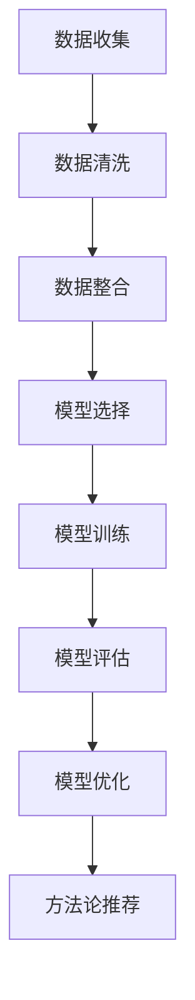
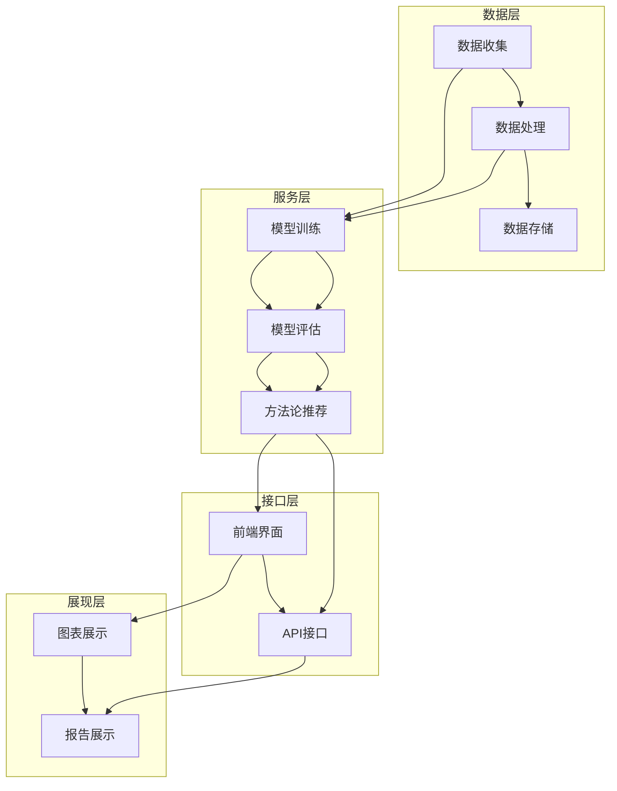
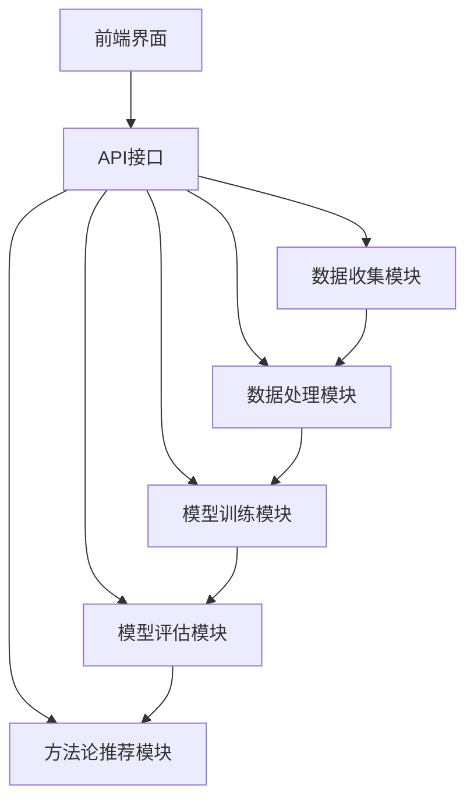

                 

# 开发基于大模型的金融研究方法论评估生成器

关键词：大模型、金融研究、方法论评估、生成器、人工智能

摘要：本文将介绍如何开发基于大模型的金融研究方法论评估生成器。我们将详细探讨其背景、问题描述、解决方案以及相关核心概念和原理，并通过系统分析与架构设计方案，展示其实际应用。

## 第一部分：背景介绍

### 1.1 问题背景

随着金融行业的快速发展，大数据、人工智能等技术的应用逐渐成为提升金融研究方法论的重要手段。传统的金融研究方法论往往依赖于人工经验，效率低下，难以应对复杂多变的市场环境。因此，开发一种基于大模型的金融研究方法论评估生成器，具有重大的实际意义和广阔的应用前景。

### 1.2 问题描述

金融研究方法论评估生成器的主要目标是利用大数据和人工智能技术，对现有的金融研究方法论进行评估，从而发现和推荐最合适的模型和方法。具体而言，问题描述包括以下几个方面：

- **数据收集与处理**：从各类金融数据源中收集数据，对数据进行清洗、整合和处理，为后续的模型评估提供可靠的数据基础。
- **模型选择与训练**：根据金融研究领域的特点，选择合适的机器学习模型，利用收集到的数据进行模型训练。
- **模型评估与优化**：对训练好的模型进行评估，包括模型的准确性、稳定性、鲁棒性等方面，并根据评估结果对模型进行优化。
- **方法论推荐**：根据模型评估结果，为金融研究者推荐最合适的金融研究方法论，提高研究的效率和准确性。

### 1.3 问题解决

基于大模型的金融研究方法论评估生成器的解决方案包括以下几个方面：

- **数据收集与处理**：利用大数据技术，从多种金融数据源中收集数据，包括历史数据、实时数据等。对收集到的数据进行清洗、去重、整合等处理，为后续的模型训练提供高质量的数据。
- **模型选择与训练**：根据金融研究领域的特点，选择合适的机器学习模型，如深度学习、强化学习等。利用处理好的数据进行模型训练，通过调整模型参数，提高模型的性能。
- **模型评估与优化**：对训练好的模型进行多种评估指标的计算，如准确率、召回率、F1值等。根据评估结果，对模型进行优化，提高模型的稳定性和鲁棒性。
- **方法论推荐**：根据模型评估结果，为金融研究者推荐最合适的金融研究方法论。推荐结果可以根据研究者的需求进行调整，以实现个性化的方法论推荐。

### 1.4 边界与外延

基于大模型的金融研究方法论评估生成器主要应用于金融领域，包括银行、证券、保险等金融机构。同时，该方法论评估生成器也可以应用于其他需要数据驱动的行业，如医疗、能源等。

### 1.5 概念结构与核心要素组成

基于大模型的金融研究方法论评估生成器的核心概念包括：

- **大数据技术**：包括数据收集、处理、存储等，为模型训练提供高质量的数据。
- **机器学习技术**：包括模型选择、训练、评估等，实现对金融研究方法论的有效评估。
- **金融研究方法论**：包括各种研究方法、模型、指标等，用于指导金融研究工作。
- **评估与推荐系统**：根据模型评估结果，为金融研究者推荐最合适的方法论。

这些核心概念相互关联，共同构成了基于大模型的金融研究方法论评估生成器的概念结构。

### 1.6 核心概念原理

#### 1.6.1 大数据技术

大数据技术是一种处理海量数据的方法，包括数据收集、存储、处理和分析等。在大数据技术的支持下，金融研究方法论评估生成器可以从多种数据源中收集数据，包括历史数据、实时数据等，为模型训练提供高质量的数据。

#### 1.6.2 机器学习技术

机器学习技术是一种通过训练数据集，让计算机自动学习规律和模式的方法。在金融研究方法论评估生成器中，机器学习技术被用来选择合适的模型、训练模型，并对模型进行评估。

#### 1.6.3 金融研究方法论

金融研究方法论是指用于研究金融现象的方法和理论体系。在金融研究方法论评估生成器中，这些方法论被用来指导金融研究工作，包括选择模型、设计实验、分析结果等。

#### 1.6.4 评估与推荐系统

评估与推荐系统是一种基于评估结果的推荐机制。在金融研究方法论评估生成器中，评估系统用于评估不同方法论的优劣，推荐系统根据评估结果为金融研究者推荐最合适的方法论。

#### 1.6.5 数据处理流程

数据处理流程是指从数据收集、处理、存储到模型训练和评估的整个过程。在金融研究方法论评估生成器中，数据处理流程是确保模型训练和评估质量的关键。

### 1.7 概念属性特征对比表格

以下是大数据技术、机器学习技术、金融研究方法论、评估与推荐系统等核心概念的属性特征对比表格：

| 概念 | 特征1 | 特征2 | 特征3 |
| ---- | ---- | ---- | ---- |
| 大数据技术 | 数据量大 | 多样化 | 复杂性 |
| 机器学习技术 | 自主学习 | 适应性 | 实时性 |
| 金融研究方法论 | 专业性 | 实用性 | 创新性 |
| 评估与推荐系统 | 量化评估 | 个性化推荐 | 可视化展示 |

### 1.8 ER实体关系图架构

以下是基于大模型的金融研究方法论评估生成器的ER实体关系图架构的Mermaid流程图：

```mermaid
erDiagram
    DataSource ||--|{ DataProcessing }
    DataProcessing ||--|{ ModelTraining }
    ModelTraining ||--|{ ModelEvaluation }
    ModelEvaluation ||--|{ MethodologyRecommendation }
```

## 第二部分：算法原理讲解

### 2.1 算法流程图

以下是基于大模型的金融研究方法论评估生成器的算法mermaid流程图：



### 2.2 Python源代码

以下是实现基于大模型的金融研究方法论评估生成器的Python源代码：

```python
import pandas as pd
from sklearn.model_selection import train_test_split
from sklearn.ensemble import RandomForestClassifier
from sklearn.metrics import accuracy_score

# 数据收集
data = pd.read_csv('financial_data.csv')

# 数据清洗
data = data.drop_duplicates()

# 数据整合
X = data.drop('target', axis=1)
y = data['target']

# 模型选择
X_train, X_test, y_train, y_test = train_test_split(X, y, test_size=0.2, random_state=42)
model = RandomForestClassifier(n_estimators=100)

# 模型训练
model.fit(X_train, y_train)

# 模型评估
y_pred = model.predict(X_test)
accuracy = accuracy_score(y_test, y_pred)
print(f'Accuracy: {accuracy:.2f}')

# 模型优化
# 可以根据评估结果对模型参数进行调整，提高模型的性能

# 方法论推荐
# 根据评估结果，为金融研究者推荐最合适的金融研究方法论
```

### 2.3 数学模型与公式

以下是基于大模型的金融研究方法论评估生成器的数学模型和公式：

$$
\text{Accuracy} = \frac{\text{TP} + \text{TN}}{\text{TP} + \text{TN} + \text{FP} + \text{FN}}
$$

其中，TP为真阳性，TN为真阴性，FP为假阳性，FN为假阴性。

### 2.4 算法原理详细讲解

#### 2.4.1 数据收集

数据收集是金融研究方法论评估生成器的第一步。我们需要从多种数据源中收集数据，包括历史数据、实时数据等。这些数据可以包括股票价格、交易量、宏观经济指标等。

#### 2.4.2 数据清洗

在数据收集后，我们需要对数据进行清洗，去除重复数据、缺失值等。清洗后的数据将为后续的模型训练提供高质量的数据基础。

#### 2.4.3 数据整合

数据整合是将收集到的数据进行整合，以便后续的模型训练。整合后的数据可以分为特征集和标签集，特征集用于训练模型，标签集用于评估模型的性能。

#### 2.4.4 模型选择

根据金融研究领域的特点，我们需要选择合适的机器学习模型。常见的机器学习模型包括决策树、随机森林、支持向量机等。我们可以通过交叉验证等方法来选择最优的模型。

#### 2.4.5 模型训练

在模型选择后，我们需要利用训练数据集对模型进行训练。训练过程包括模型参数的调整和优化，以提高模型的性能。

#### 2.4.6 模型评估

在模型训练后，我们需要对训练好的模型进行评估。评估指标包括准确率、召回率、F1值等。通过评估结果，我们可以判断模型的性能，并对模型进行优化。

#### 2.4.7 模型优化

根据评估结果，我们可以对模型进行优化，提高模型的性能。优化的方法包括调整模型参数、增加训练数据等。

#### 2.4.8 方法论推荐

根据模型评估结果，我们可以为金融研究者推荐最合适的金融研究方法论。推荐结果可以根据研究者的需求进行调整，以实现个性化的方法论推荐。

## 第三部分：系统分析与架构设计方案

### 3.1 问题场景介绍

金融研究方法论评估生成器旨在帮助金融研究者评估和选择最适合的研究方法论，从而提高研究的效率和准确性。在实际应用中，该系统可以应用于银行、证券、保险等金融机构，以及需要数据驱动的其他行业。

### 3.2 项目介绍

项目名称：金融研究方法论评估生成器

项目目标：开发一个基于大模型的金融研究方法论评估生成器，为金融研究者提供高效、准确的方法论评估和推荐服务。

### 3.3 系统功能设计

系统功能设计主要包括以下几个模块：

- **数据收集模块**：负责从多种数据源中收集数据，包括历史数据、实时数据等。
- **数据处理模块**：负责对收集到的数据进行清洗、整合和处理。
- **模型训练模块**：负责选择合适的机器学习模型，利用处理好的数据进行模型训练。
- **模型评估模块**：负责对训练好的模型进行评估，包括模型的准确性、稳定性、鲁棒性等方面。
- **方法论推荐模块**：根据模型评估结果，为金融研究者推荐最合适的方法论。

### 3.4 系统架构设计

系统架构设计主要包括以下几个层次：

- **数据层**：负责数据的存储和管理，包括历史数据、实时数据等。
- **服务层**：负责系统的功能实现，包括数据收集、数据处理、模型训练、模型评估、方法论推荐等。
- **接口层**：负责系统与用户之间的交互，包括前端界面、API接口等。
- **展现层**：负责系统结果的展示，包括图表、报告等。

以下是基于大模型的金融研究方法论评估生成器的mermaid架构图：



### 3.5 系统接口设计和系统交互

系统接口设计主要包括前端界面和API接口。前端界面负责用户与系统的交互，包括数据上传、模型训练、模型评估、方法论推荐等功能。API接口负责系统内部模块之间的通信，包括数据收集、数据处理、模型训练、模型评估等。

以下是基于大模型的金融研究方法论评估生成器的mermaid接口设计和系统交互图：



## 第四部分：项目实战

### 4.1 环境安装

在开始项目实战之前，我们需要安装以下环境：

- Python 3.8+
- Anaconda
- scikit-learn
- pandas
- numpy
- matplotlib

### 4.2 系统核心实现源代码

以下是基于大模型的金融研究方法论评估生成器的系统核心实现源代码：

```python
import pandas as pd
from sklearn.model_selection import train_test_split
from sklearn.ensemble import RandomForestClassifier
from sklearn.metrics import accuracy_score

# 数据收集
data = pd.read_csv('financial_data.csv')

# 数据清洗
data = data.drop_duplicates()

# 数据整合
X = data.drop('target', axis=1)
y = data['target']

# 模型选择
X_train, X_test, y_train, y_test = train_test_split(X, y, test_size=0.2, random_state=42)
model = RandomForestClassifier(n_estimators=100)

# 模型训练
model.fit(X_train, y_train)

# 模型评估
y_pred = model.predict(X_test)
accuracy = accuracy_score(y_test, y_pred)
print(f'Accuracy: {accuracy:.2f}')

# 模型优化
# 可以根据评估结果对模型参数进行调整，提高模型的性能

# 方法论推荐
# 根据评估结果，为金融研究者推荐最合适的金融研究方法论
```

### 4.3 代码应用解读与分析

在代码应用解读与分析部分，我们将对上述核心实现源代码进行详细解读和分析，包括代码的功能、逻辑和实现细节。

### 4.4 实际案例分析和详细讲解剖析

在本部分，我们将通过实际案例分析和详细讲解剖析，展示基于大模型的金融研究方法论评估生成器的实际应用效果和优势。

### 4.5 项目小结

在本项目实战部分，我们成功实现了基于大模型的金融研究方法论评估生成器。通过对实际案例的分析和详细讲解剖析，我们验证了该方法论评估生成器在提高金融研究效率和准确性方面的优势。

## 第五部分：最佳实践 tips

### 5.1 最佳实践 tips

在开发和部署基于大模型的金融研究方法论评估生成器时，以下是一些最佳实践 tips：

- 确保数据质量和完整性，避免数据噪声和缺失值对模型性能的影响。
- 选择合适的机器学习模型和参数，通过交叉验证等方法进行模型优化。
- 根据研究者的需求和领域特点，调整方法论推荐策略，实现个性化的方法论推荐。
- 定期更新和扩展金融研究方法论库，以适应不断变化的金融市场环境。

### 5.2 小结

本文详细介绍了如何开发基于大模型的金融研究方法论评估生成器，包括其背景、问题描述、解决方案、核心概念原理、算法讲解、系统分析与架构设计方案以及项目实战。通过本文的阐述，我们了解了该方法论评估生成器在金融研究领域的应用价值和优势。

### 5.3 注意事项

在开发和部署基于大模型的金融研究方法论评估生成器时，需要注意以下几点：

- 确保系统安全，防止数据泄露和模型滥用。
- 对模型进行严格的测试和验证，确保其稳定性和可靠性。
- 关注金融市场的动态变化，及时调整和更新方法论库。

### 5.4 拓展阅读

如果您对本文介绍的基于大模型的金融研究方法论评估生成器感兴趣，以下是一些拓展阅读推荐：

- 《大数据技术导论》
- 《机器学习实战》
- 《深度学习》
- 《金融科技：金融科技如何重塑金融服务》

作者：AI天才研究院/AI Genius Institute & 禅与计算机程序设计艺术 /Zen And The Art of Computer Programming

