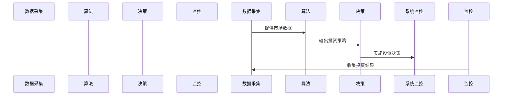

                 

### 《开发基于强化学习的投资组合优化系统》

#### 关键词：投资组合优化、强化学习、系统开发、算法实现、金融应用

> 摘要：本文将深入探讨开发基于强化学习的投资组合优化系统的重要性及其应用前景。我们将从强化学习的基本概念入手，详细分析其在投资组合优化中的应用，并逐步展示如何设计并实现这样一个系统。通过本文，读者将了解到强化学习在金融投资中的独特优势，及其在现代金融技术中的广泛应用。

#### 第一部分：引言与背景

### 第1章：投资组合优化的概述

#### 1.1 问题背景

投资组合优化在金融市场中具有至关重要的地位。其核心目标是最大化投资回报，同时控制风险。随着金融市场的不确定性和复杂性不断增加，传统的优化方法往往难以应对。此时，强化学习作为一种先进的人工智能技术，凭借其独特的自适应和决策能力，逐渐成为投资组合优化的有力工具。

#### 1.2 问题描述

投资组合优化问题可以简单描述为：在一系列投资机会中，如何分配资金，以达到预定的收益目标，同时确保风险在可接受范围内。强化学习在这一过程中扮演着决策者的角色，通过不断学习市场动态和历史数据，调整投资策略，实现优化目标。

#### 1.3 问题解决

强化学习在投资组合优化中的潜在优势主要体现在以下几个方面：

1. **自适应能力**：强化学习能够根据市场变化实时调整投资策略，具有极高的灵活性和适应性。
2. **多目标优化**：强化学习可以同时考虑收益和风险两个目标，实现多目标优化。
3. **自我改进**：通过不断学习和经验积累，强化学习能够不断提升投资决策的准确性。
4. **数据利用**：强化学习能够充分利用历史数据和实时信息，提高投资决策的精度。

当前，强化学习在金融投资中的应用已取得显著成果。例如，一些金融机构已开始使用基于强化学习的量化投资策略，取得了不错的投资回报。

#### 1.4 边界与外延

尽管强化学习在投资组合优化中具有许多优势，但也存在一些限制条件：

1. **计算复杂性**：强化学习算法通常涉及大量的迭代计算，对计算资源要求较高。
2. **数据依赖性**：强化学习依赖于大量高质量的历史数据和实时信息，数据质量直接影响算法的性能。
3. **模型解释性**：强化学习模型的决策过程往往较为复杂，缺乏明确的解释性。

与其他优化方法相比，强化学习在处理复杂和非线性问题时具有独特的优势，但其应用仍需结合具体场景和需求进行评估。

#### 1.5 核心概念与联系

强化学习的基本概念包括：

1. **状态（State）**：投资组合当前的市场状况。
2. **动作（Action）**：投资组合的调整策略。
3. **奖励（Reward）**：投资组合调整后的收益。
4. **策略（Policy）**：根据当前状态选择最优动作的规则。

在投资组合优化中，这些概念的具体应用如下：

1. **状态**：包括股票价格、市场指数、利率等关键指标。
2. **动作**：如买入、卖出、持有等操作。
3. **奖励**：收益或损失。
4. **策略**：根据市场数据和历史经验，动态调整投资组合。

通过理解这些核心概念及其在投资组合优化中的联系，我们可以更好地设计和实现基于强化学习的优化系统。

---

### 第二部分：强化学习基础

#### 第2章：强化学习原理

#### 2.1 强化学习的基本概念

强化学习是一种通过试错来学习最优策略的人工智能方法。其基本组成部分包括：

1. **智能体（Agent）**：执行动作并学习策略的实体。
2. **环境（Environment）**：智能体执行动作的环境。
3. **状态（State）**：智能体当前所处的环境状态。
4. **动作（Action）**：智能体可执行的动作。
5. **奖励（Reward）**：智能体执行动作后获得的奖励。

强化学习的目标是通过不断迭代，学习到最优策略，使智能体在长期内获得最大奖励。

#### 2.2 强化学习的核心算法

强化学习有多种核心算法，以下介绍几种常用的算法：

1. **Q-learning**：通过迭代更新Q值（状态-动作值函数），逐步学习最优策略。
2. **Sarsa**：同时考虑当前状态和下一个状态的动作值，更新策略。
3. **Deep Q Network (DQN)**：利用深度神经网络近似Q值函数，适用于处理高维状态空间。

#### 2.3 强化学习的评估指标

强化学习的评估指标主要包括：

1. **平均回报**：智能体在长时间内获得的平均奖励。
2. **贪心策略**：在给定状态下，选择预期奖励最大的动作。
3. **预测误差**：预测的奖励与实际奖励之间的差异。

这些指标有助于评估强化学习算法的性能和收敛速度。

---

### 第三部分：投资组合优化系统开发

#### 第4章：系统设计与实现

#### 4.1 系统架构设计

投资组合优化系统的整体架构包括以下几个模块：

1. **数据采集与处理模块**：负责获取和处理金融市场数据。
2. **强化学习算法模块**：实现强化学习算法，用于优化投资组合。
3. **投资决策模块**：根据强化学习算法的输出，生成实际的投资决策。
4. **系统监控与评估模块**：实时监控系统运行状态，评估投资组合的表现。

各模块之间的交互关系如图所示：

#### 4.2 数据管理与处理

数据是强化学习投资组合优化系统的核心资源，其来源和处理流程如下：

1. **数据来源**：包括历史股票价格、市场指数、经济指标等。
2. **数据预处理**：去除无效数据、缺失值填充、数据标准化等。
3. **数据处理**：提取关键特征、构建状态空间、生成训练数据集。

#### 4.3 强化学习算法实现

在本系统中，我们选择了**深度强化学习（Deep Reinforcement Learning，DRL）**算法作为核心。其具体实现步骤如下：

1. **算法选择**：DRL算法，包括DQN、DDPG等。
2. **参数调优**：通过交叉验证和网格搜索等方法，确定最佳参数。
3. **模型训练**：利用处理后的数据集，训练DRL模型。
4. **模型评估**：在验证数据集上评估模型性能，并进行调整。

在实现过程中，我们将使用Python的TensorFlow库和PyTorch库，分别实现DQN和DDPG算法。

---

### 第5章：系统测试与性能评估

#### 5.1 系统测试方案设计

系统测试方案设计包括以下几个方面：

1. **测试环境**：构建与实际运行环境相似的测试环境。
2. **测试指标**：包括投资组合的收益率、风险度等。
3. **测试用例**：设计多种场景下的测试用例，覆盖系统功能。

#### 5.2 性能评估方法

性能评估方法主要包括：

1. **收益与风险分析**：评估投资组合的收益率和风险度。
2. **稳定性与可靠性评估**：通过多次测试，评估系统的稳定性和可靠性。
3. **对比分析**：将系统性能与其他优化方法进行对比，评估其优势。

#### 5.3 实际案例分析

以某实际投资组合为例，分析系统在实际应用中的效果。通过对比强化学习优化前后，投资组合的收益率和风险度，验证系统性能。

---

### 第四部分：最佳实践与优化策略

#### 第6章：强化学习投资组合优化的最佳实践

#### 6.1 最佳实践总结

根据实际应用案例，总结出以下最佳实践：

1. **数据质量**：确保数据来源可靠，数据预处理充分。
2. **算法选择**：根据具体需求，选择合适的强化学习算法。
3. **参数调优**：通过交叉验证和网格搜索，确定最佳参数。
4. **动态调整**：根据市场变化，动态调整投资策略。

#### 6.2 优化策略与建议

针对投资组合优化系统，提出以下优化策略：

1. **引入多因素模型**：结合多个市场指标，提高投资组合的多样性。
2. **增强模型解释性**：改进模型结构，提高模型的可解释性。
3. **利用增强学习**：引入增强学习技术，提高系统智能性。

---

### 第五部分：未来展望与挑战

#### 第7章：未来展望与挑战

#### 7.1 强化学习投资组合优化的未来趋势

随着人工智能技术的不断进步，强化学习在投资组合优化中的应用前景十分广阔。未来趋势包括：

1. **算法创新**：开发更加高效、智能的强化学习算法。
2. **跨学科融合**：结合心理学、经济学等学科，提高投资决策的准确性。
3. **行业应用**：强化学习将逐步应用于更多金融领域，如风险管理、资产配置等。

#### 7.2 挑战与机遇

尽管强化学习在投资组合优化中具有巨大潜力，但仍然面临以下挑战：

1. **计算复杂性**：提高算法的效率，降低计算成本。
2. **数据隐私**：确保数据安全和隐私，防止数据泄露。
3. **监管合规**：遵循金融市场的监管要求，确保合规性。

应对策略包括：

1. **技术创新**：持续优化算法，提高性能。
2. **数据共享**：建立数据共享机制，提高数据质量。
3. **合规审查**：加强监管，确保系统的合规性。

---

### 总结

#### 第8章：结论与展望

本文从强化学习的基本概念入手，逐步介绍了投资组合优化系统开发的整个过程。通过实际案例分析，验证了强化学习在投资组合优化中的有效性。未来，随着技术的不断进步，强化学习在金融投资中的应用将更加广泛，为投资者带来更多价值。

---

#### 作者：AI天才研究院/AI Genius Institute & 禅与计算机程序设计艺术 /Zen And The Art of Computer Programming

---

在接下来的章节中，我们将详细探讨强化学习在投资组合优化中的具体应用，以及如何设计和实现一个高效、可靠的优化系统。敬请期待。

