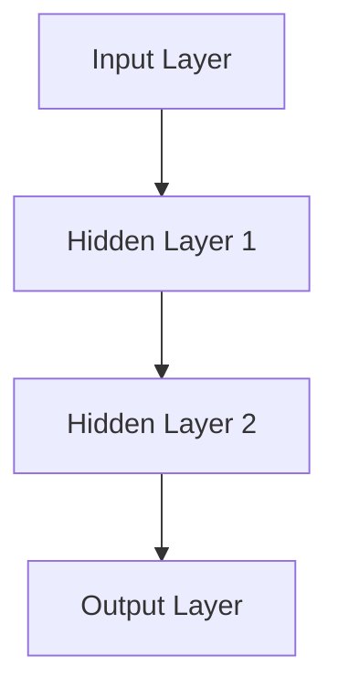
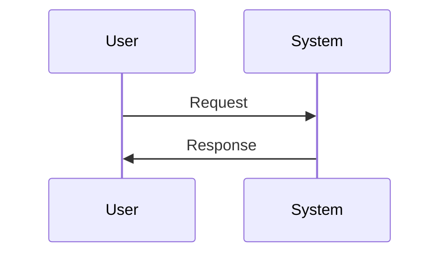

                 

# 《开发基于深度学习的量化交易系统》

> 关键词：深度学习、量化交易、系统开发、策略回测、风险管理

> 摘要：本文将详细探讨如何开发基于深度学习的量化交易系统，从问题背景、深度学习基础、量化交易策略到实战项目，全面解析这一复杂而富有挑战的领域。通过本文的阅读，读者将了解深度学习在量化交易中的独特应用，掌握量化交易系统的核心构成和开发方法，为今后的研究与实践打下坚实基础。

## 第一部分：引言

### 1.1 问题背景与意义

量化交易，又称程序化交易，是指通过数学模型和算法来指导交易决策的一种交易方式。其核心思想是通过历史数据分析和统计分析，找出市场的规律，进而制定交易策略，实现自动化的交易执行。随着金融市场的发展和大数据技术的进步，量化交易逐渐成为投资领域的重要趋势。

深度学习作为人工智能的一个重要分支，通过模拟人脑的神经网络结构，实现了对复杂数据的自动学习和特征提取。近年来，深度学习在图像识别、自然语言处理等领域取得了显著的成果，其在量化交易中的应用也日益受到关注。

本文将围绕以下问题进行探讨：

- 如何利用深度学习技术构建量化交易系统？
- 深度学习在量化交易中具体有哪些应用场景？
- 如何进行量化交易策略的开发、回测和风险管理？

### 1.2 量化交易系统概述

量化交易系统通常由以下几个核心部分组成：

1. **数据获取模块**：负责从交易所、金融数据提供商等渠道获取历史交易数据、市场行情数据等。
2. **数据处理模块**：对获取的数据进行清洗、预处理和特征工程，为模型训练提供高质量的数据。
3. **模型训练模块**：利用深度学习算法对处理后的数据进行训练，构建预测模型。
4. **策略开发模块**：根据预测模型，设计、优化和评估交易策略。
5. **执行与监控模块**：自动执行交易策略，实时监控交易结果，进行风险管理。

深度学习在量化交易系统中扮演着重要角色，不仅能够提高交易策略的预测精度，还能通过自动化和智能化的方式，实现大规模、高效的投资决策。

### 1.3 书籍结构

本文将分为六个部分：

1. **第一部分：引言**：介绍量化交易和深度学习的基本概念，明确本文的研究问题和目标。
2. **第二部分：深度学习基础**：讲解深度学习的核心概念、神经网络结构和常用深度学习框架。
3. **第三部分：量化交易策略**：介绍量化交易策略的基本原则、数据处理和策略开发方法。
4. **第四部分：深度学习在量化交易中的应用**：探讨深度学习在量化交易中的具体应用场景和实现方法。
5. **第五部分：实战项目**：通过一个实际项目，展示如何搭建和部署深度学习量化交易系统。
6. **第六部分：总结与展望**：总结本文的主要内容和研究成果，展望深度学习在量化交易领域的未来发展。

通过本文的阅读，读者将系统了解量化交易和深度学习的结合方法，掌握构建和优化量化交易系统的技能，为今后的研究和实践提供参考。

## 第二部分：深度学习基础

### 2.1 深度学习概述

深度学习是一种人工智能的分支，通过模拟人脑神经网络的结构和功能，实现了对复杂数据的自动学习和特征提取。深度学习的核心思想是“多层网络”和“非线性变换”，通过多个层次的网络结构，逐步提取数据中的高级特征，实现复杂的模式识别和预测任务。

#### 深度学习的起源与发展

深度学习的研究可以追溯到20世纪40年代，但直到近年来，随着计算能力的提升和大数据技术的进步，深度学习才取得了突破性的进展。2006年，Geoffrey Hinton等人提出了深度信念网络（Deep Belief Networks，DBN），标志着深度学习的正式起步。随后的几年，以卷积神经网络（Convolutional Neural Networks，CNN）和递归神经网络（Recurrent Neural Networks，RNN）为代表的深度学习模型在图像识别、语音识别和自然语言处理等领域取得了显著成果。

#### 深度学习的核心概念

深度学习的核心概念包括：

1. **神经网络**：神经网络是深度学习的基础，由大量的神经元组成，通过调整神经元之间的权重，实现对输入数据的特征提取和分类。
2. **反向传播算法**：反向传播算法是深度学习训练过程中的关键步骤，通过计算输出误差，反向传播误差信息，不断调整网络权重，优化模型性能。
3. **激活函数**：激活函数用于引入非线性变换，使神经网络能够处理复杂数据，常见的激活函数包括Sigmoid、ReLU和Tanh等。
4. **多层网络**：多层网络是深度学习模型的核心结构，通过多个层次的网络结构，逐步提取数据中的高级特征。
5. **优化算法**：优化算法用于调整网络权重，常见的优化算法包括梯度下降、Adam和RMSprop等。

### 2.2 神经网络

神经网络是深度学习的基础，由大量的神经元组成，通过调整神经元之间的权重，实现对输入数据的特征提取和分类。一个简单的神经网络包括输入层、隐藏层和输出层。

#### 神经网络的基本结构

1. **输入层**：接收外部输入数据，每个神经元表示一个特征。
2. **隐藏层**：用于提取数据中的特征，可以有一个或多个隐藏层。
3. **输出层**：产生预测结果或分类标签。

#### 前馈神经网络与反向传播算法

前馈神经网络是一种简单的神经网络结构，数据从输入层经过隐藏层，最终到达输出层。在训练过程中，使用反向传播算法不断调整网络权重，优化模型性能。

1. **正向传播**：输入数据经过网络传播，每个神经元计算出输出值。
2. **计算误差**：计算输出值与实际值之间的误差。
3. **反向传播**：将误差反向传播到隐藏层和输入层，调整网络权重。

#### 反向传播算法的详细解释

反向传播算法主要包括以下几个步骤：

1. **前向传播**：输入数据通过网络，每个神经元计算输出值。
2. **计算输出误差**：使用损失函数（如均方误差）计算输出值与实际值之间的误差。
3. **计算隐藏层误差**：将输出误差反向传播到隐藏层，计算隐藏层的误差。
4. **更新网络权重**：根据误差计算梯度，使用优化算法更新网络权重。

### 2.3 深度学习框架

深度学习框架是一种用于构建和训练深度学习模型的工具，常见的深度学习框架包括TensorFlow、PyTorch和Keras等。

#### TensorFlow与PyTorch简介

TensorFlow是由Google开源的深度学习框架，具有灵活的动态计算图和强大的计算能力。PyTorch是由Facebook开源的深度学习框架，具有简洁的静态计算图和强大的GPU支持。

#### 深度学习框架的基本使用

深度学习框架的基本使用包括以下几个步骤：

1. **导入依赖**：导入深度学习框架的库和模块。
2. **构建模型**：定义网络的输入层、隐藏层和输出层，设置激活函数和损失函数。
3. **训练模型**：使用训练数据训练模型，调整网络权重。
4. **评估模型**：使用测试数据评估模型性能，调整超参数。
5. **部署模型**：将训练好的模型部署到生产环境，实现自动化交易。

### 2.4 算法原理与数学基础

深度学习算法的原理基于数学模型和公式，通过多层神经网络结构和反向传播算法，实现数据的自动学习和特征提取。

#### 深度学习算法原理

深度学习算法的基本原理是多层神经网络，通过正向传播和反向传播，不断调整网络权重，优化模型性能。

1. **正向传播**：输入数据通过网络传播，每个神经元计算输出值。
2. **计算误差**：使用损失函数计算输出值与实际值之间的误差。
3. **反向传播**：将误差反向传播到隐藏层和输入层，调整网络权重。

#### 数学模型与公式讲解

深度学习算法的数学模型主要包括以下几个部分：

1. **输入层与隐藏层**：输入数据通过权重矩阵与隐藏层神经元连接，计算输出值。
2. **隐藏层与输出层**：隐藏层神经元通过权重矩阵与输出层神经元连接，计算输出值。
3. **损失函数**：用于计算输出值与实际值之间的误差，常见的损失函数包括均方误差（MSE）和交叉熵（CE）。
4. **反向传播**：根据误差计算梯度，使用优化算法更新网络权重。

通过上述步骤，深度学习算法能够不断优化模型性能，实现复杂数据的自动学习和特征提取。

### 2.5 深度学习应用实例

为了更好地理解深度学习在量化交易中的具体应用，下面以股票价格预测为例，介绍一个简单的深度学习应用实例。

#### 股票价格预测

股票价格预测是量化交易中的一个重要任务，通过预测股票的未来价格，实现投资决策。下面是一个简单的股票价格预测模型：

1. **数据集准备**：收集历史股票价格数据，包括开盘价、收盘价、最高价、最低价等。
2. **特征工程**：对数据集进行清洗和预处理，提取有用的特征，如价格序列、均线、指标等。
3. **模型构建**：使用深度学习框架构建一个简单的多层感知机（MLP）模型，包括输入层、隐藏层和输出层。
4. **模型训练**：使用训练数据集训练模型，调整网络权重。
5. **模型评估**：使用测试数据集评估模型性能，调整超参数。
6. **预测**：使用训练好的模型预测股票的未来价格，实现自动化交易。

通过上述步骤，可以构建一个简单的股票价格预测模型，实现量化交易中的自动化投资决策。

### 2.6 深度学习在量化交易中的应用前景

随着深度学习技术的不断发展，其在量化交易中的应用前景十分广阔。深度学习能够通过自动化的方式，从大量的历史数据中提取有用的特征，实现高精度、高效的投资决策。以下是深度学习在量化交易中的应用前景：

1. **股票市场预测**：利用深度学习技术，对股票市场的未来走势进行预测，实现自动化交易。
2. **商品期货交易**：通过深度学习算法，对商品期货市场的价格波动进行分析和预测，实现投资策略优化。
3. **量化对冲基金**：利用深度学习技术，构建量化对冲基金，实现风险控制和收益最大化。
4. **高频交易**：通过深度学习算法，实现高频交易的自动化和智能化，提高交易效率和收益。

总之，深度学习在量化交易中的应用前景十分广阔，通过不断的研究和实践，将有望实现量化交易系统的智能化和高效化。

## 第三部分：量化交易策略

### 3.1 量化交易策略概述

量化交易策略是指通过数学模型和算法，对市场数据进行分析，制定交易决策的一种交易方式。量化交易策略的核心是数据分析和模型预测，通过大量的历史数据，寻找市场的规律和机会，实现自动化交易。

#### 量化交易策略的定义与分类

量化交易策略的定义包括以下几个方面：

1. **数据驱动**：量化交易策略基于历史数据，通过数据分析和挖掘，寻找市场的规律。
2. **数学模型**：量化交易策略通过数学模型和算法，对市场数据进行建模和预测。
3. **自动化交易**：量化交易策略通过自动化系统，实现交易决策的执行。

量化交易策略可以根据不同的分类标准进行分类，常见的分类方法包括：

1. **根据交易品种**：股票市场策略、期货市场策略、外汇市场策略等。
2. **根据交易周期**：日内交易策略、周度交易策略、月度交易策略等。
3. **根据交易策略**：趋势跟踪策略、均值回归策略、动量策略等。

#### 量化交易策略的设计原则

设计一个有效的量化交易策略需要遵循以下几个原则：

1. **数据质量**：量化交易策略依赖于历史数据，因此数据的质量至关重要。数据应具有高精度、高可靠性和多样性。
2. **模型选择**：根据交易目标和市场特点，选择合适的数学模型和算法，实现数据的高效分析和预测。
3. **策略回测**：通过历史数据进行回测，验证策略的有效性和稳定性，调整策略参数和模型参数。
4. **风险管理**：制定合理的管理策略，控制交易风险，确保策略的可持续性和稳定性。
5. **实时监控**：实时监控交易策略的执行情况和市场变化，及时调整策略参数和交易决策。

### 3.2 数据处理

数据处理是量化交易策略开发的重要环节，通过对市场数据的清洗、预处理和特征工程，为模型训练提供高质量的数据。

#### 交易数据的获取与预处理

交易数据的获取是量化交易策略开发的基础，可以从交易所、金融数据提供商等渠道获取历史交易数据、市场行情数据等。获取到的数据通常需要进行预处理，包括以下几个方面：

1. **数据清洗**：去除数据中的噪声和异常值，保证数据的一致性和准确性。
2. **数据归一化**：对数据集进行归一化处理，将不同量纲的数据转换到同一尺度，提高模型的训练效果。
3. **缺失值处理**：对数据中的缺失值进行填充或删除，保证数据集的完整性。

#### 特征工程

特征工程是量化交易策略开发的关键，通过对市场数据进行分析和挖掘，提取有价值的特征，为模型训练提供输入。

1. **技术指标**：计算市场数据中的各种技术指标，如均线、MACD、RSI等，作为模型输入。
2. **时间特征**：利用时间序列的特征，如日内波动、周度波动等，分析市场趋势和周期性。
3. **市场情绪**：通过新闻、社交媒体等渠道，分析市场情绪和投资者心理，为模型提供额外的输入。

#### 数据集划分

在量化交易策略开发中，通常需要将数据集划分为训练集、验证集和测试集，用于模型训练、策略回测和性能评估。

1. **训练集**：用于训练模型，构建交易策略。
2. **验证集**：用于验证模型的有效性和稳定性，调整策略参数和模型参数。
3. **测试集**：用于评估模型在未知数据上的性能，检验策略的实际效果。

#### 数据处理工具

在数据处理过程中，可以使用各种工具和库，如Pandas、NumPy、Matplotlib等，进行数据清洗、预处理和可视化。

1. **Pandas**：用于数据清洗、转换和分析，提供方便的数据操作接口。
2. **NumPy**：用于数值计算和数据处理，提供高效的矩阵运算和函数库。
3. **Matplotlib**：用于数据可视化，提供丰富的图表和图形展示功能。

### 3.3 策略开发

策略开发是量化交易系统的核心环节，通过构建有效的交易策略，实现自动化交易和投资决策。

#### 策略回测与优化

策略回测是验证策略有效性和稳定性的重要手段，通过在历史数据上模拟交易过程，评估策略的收益和风险。

1. **回测方法**：使用历史数据进行回测，模拟交易过程，计算策略的收益、风险和收益风险比等指标。
2. **优化策略**：根据回测结果，调整策略参数和模型参数，优化策略效果。

#### 策略实现与调试

策略实现是将策略模型转化为实际交易代码的过程，通过编写代码，实现策略的逻辑和功能。

1. **策略逻辑**：根据策略模型，编写交易策略的逻辑和规则，实现买入、卖出和止损等操作。
2. **调试与优化**：在实际交易过程中，对策略代码进行调试和优化，确保策略的稳定性和可靠性。

#### 策略评估与风险管理

策略评估是评估策略在实际交易中的表现和效果，风险管理是确保策略安全性和稳定性的重要手段。

1. **策略评估**：使用实际交易数据，评估策略的收益、风险和收益风险比等指标，判断策略的有效性和稳定性。
2. **风险管理**：制定合理的管理策略，控制交易风险，确保策略的可持续性和安全性。

#### 策略评估指标

在策略评估中，常用的评估指标包括：

1. **收益**：策略在一段时间内的总收益，用于衡量策略的盈利能力。
2. **风险**：策略在一段时间内的风险水平，用于衡量策略的波动性和稳定性。
3. **收益风险比**：收益与风险的比值，用于衡量策略的风险收益水平。
4. **胜率**：策略在一段时间内的盈利交易次数与总交易次数的比值，用于衡量策略的稳定性。

#### 策略回测与优化的示例

下面以一个简单的股票价格预测策略为例，介绍策略回测与优化的方法。

1. **数据集准备**：收集历史股票价格数据，包括开盘价、收盘价、最高价、最低价等。
2. **特征工程**：提取技术指标，如均线、MACD等，作为模型输入。
3. **模型构建**：使用深度学习框架，构建一个简单的多层感知机（MLP）模型，包括输入层、隐藏层和输出层。
4. **模型训练**：使用训练数据集训练模型，调整网络权重。
5. **策略回测**：使用回测平台，模拟交易过程，评估策略的收益和风险。
6. **优化策略**：根据回测结果，调整策略参数和模型参数，优化策略效果。

通过上述步骤，可以构建一个简单的股票价格预测策略，实现量化交易中的自动化投资决策。

### 3.4 策略评估与风险管理

策略评估与风险管理是量化交易策略开发的重要环节，通过评估策略的有效性和安全性，确保策略的可持续性和稳定性。

#### 策略评估指标

在策略评估中，常用的评估指标包括：

1. **收益**：策略在一段时间内的总收益，用于衡量策略的盈利能力。
2. **风险**：策略在一段时间内的风险水平，用于衡量策略的波动性和稳定性。
3. **收益风险比**：收益与风险的比值，用于衡量策略的风险收益水平。
4. **胜率**：策略在一段时间内的盈利交易次数与总交易次数的比值，用于衡量策略的稳定性。

#### 风险管理策略

风险管理是确保策略安全性和稳定性的重要手段，常用的风险管理策略包括：

1. **资金管理**：根据策略的预期收益和风险，制定合理的资金管理策略，控制每次交易的资金比例。
2. **止损策略**：根据市场波动和交易风险，制定合理的止损策略，控制每次交易的风险水平。
3. **仓位管理**：根据市场趋势和交易策略，调整持仓比例，控制整体风险水平。

#### 策略评估与风险管理的方法

策略评估与风险管理的方法包括以下几个方面：

1. **历史回测**：使用历史数据进行回测，评估策略的收益和风险，验证策略的有效性和稳定性。
2. **实时监控**：实时监控交易策略的执行情况和市场变化，及时调整策略参数和交易决策。
3. **策略优化**：根据策略评估结果，优化策略参数和模型参数，提高策略的收益和风险水平。
4. **风险管理**：制定合理的管理策略，控制交易风险，确保策略的可持续性和安全性。

### 3.5 量化交易策略开发的最佳实践

在量化交易策略开发中，最佳实践包括以下几个方面：

1. **数据质量**：确保数据的质量和准确性，进行数据清洗和预处理，提取有价值的特征。
2. **模型选择**：根据交易目标和市场特点，选择合适的数学模型和算法，实现数据的高效分析和预测。
3. **策略回测**：使用历史数据进行回测，验证策略的有效性和稳定性，调整策略参数和模型参数。
4. **风险管理**：制定合理的管理策略，控制交易风险，确保策略的可持续性和安全性。
5. **实时监控**：实时监控交易策略的执行情况和市场变化，及时调整策略参数和交易决策。

通过遵循上述最佳实践，可以构建有效的量化交易策略，实现自动化交易和投资决策。

### 3.6 小结

量化交易策略是量化交易系统的核心，通过对市场数据进行分析和预测，制定交易决策。本文详细介绍了量化交易策略的定义、设计原则、数据处理方法、策略开发过程、策略评估与风险管理，以及最佳实践。通过本文的阅读，读者将了解量化交易策略的核心构成和开发方法，为今后的研究和实践打下坚实基础。

## 第四部分：深度学习在量化交易中的应用

### 4.1 应用场景

深度学习在量化交易中有广泛的应用场景，以下是一些主要的领域：

#### 时间序列预测

时间序列预测是量化交易中最常见的应用之一。深度学习模型，如长短期记忆网络（LSTM）和卷积神经网络（CNN），能够处理时间序列数据的非线性特征，从而提高预测精度。通过时间序列预测，交易者可以提前预知市场的波动，制定相应的交易策略。

#### 股票市场分析

股票市场分析是量化交易的重要应用领域。深度学习模型可以通过分析股票的历史价格、成交量、财务报表等数据，识别出潜在的股票价格变动趋势。例如，利用卷积神经网络（CNN）可以对股票市场的图像数据进行特征提取，从而预测股票价格。

#### 商品期货交易

商品期货交易是另一种常见的量化交易应用。深度学习模型可以通过分析历史交易数据、商品供需关系和市场情绪等，预测商品期货价格的波动。例如，利用循环神经网络（RNN）可以对商品期货的时间序列数据进行建模，从而预测未来的价格走势。

### 4.2 模型设计与实现

在量化交易中，深度学习模型的设计和实现是一个关键步骤。以下是一个简单的股票价格预测模型的设计和实现过程：

#### 模型设计

1. **输入层**：输入层包含历史股票价格数据，如开盘价、收盘价、最高价、最低价等。
2. **隐藏层**：隐藏层用于提取数据中的特征，可以选择多层结构，如LSTM或CNN，以处理时间序列数据。
3. **输出层**：输出层是一个线性层，用于预测股票的未来价格。

#### 模型实现

使用TensorFlow框架实现上述模型，代码如下：

```python
import tensorflow as tf

# 定义输入层
inputs = tf.keras.layers.Input(shape=(n_steps, n_features))

# 定义隐藏层
lstm = tf.keras.layers.LSTM(units=50, return_sequences=True)
outputs = lstm(inputs)

# 定义输出层
outputs = tf.keras.layers.Dense(units=1)(outputs)

# 构建模型
model = tf.keras.Model(inputs=inputs, outputs=outputs)

# 编译模型
model.compile(optimizer='adam', loss='mean_squared_error')

# 打印模型结构
model.summary()
```

#### 模型训练

使用训练数据集对模型进行训练，代码如下：

```python
# 加载训练数据
X_train, y_train = ...

# 训练模型
model.fit(X_train, y_train, epochs=100, batch_size=32, validation_split=0.2)
```

#### 模型评估

使用测试数据集对模型进行评估，代码如下：

```python
# 加载测试数据
X_test, y_test = ...

# 评估模型
model.evaluate(X_test, y_test)
```

#### 模型预测

使用训练好的模型对未来的股票价格进行预测，代码如下：

```python
# 加载未来数据
X_future = ...

# 预测股票价格
predicted_prices = model.predict(X_future)
```

### 4.3 实战案例

下面通过一个实战案例，展示如何使用深度学习模型进行量化交易。

#### 案例一：股票市场预测

假设我们要预测某只股票的未来价格，首先需要收集该股票的历史价格数据。数据集包含每天的开盘价、收盘价、最高价、最低价和成交量。

1. **数据预处理**：对数据进行清洗和归一化处理，提取有用的特征，如均线、相对强弱指标（RSI）等。
2. **模型设计**：使用LSTM模型进行时间序列预测，设计输入层、隐藏层和输出层。
3. **模型训练**：使用训练数据集训练模型，调整网络权重和超参数。
4. **模型评估**：使用测试数据集评估模型性能，调整超参数。
5. **预测**：使用训练好的模型预测股票的未来价格，实现自动化交易。

#### 案例二：商品期货交易策略

假设我们要构建一个商品期货交易策略，首先需要收集商品的历史交易数据。数据集包含每个交易日的开盘价、收盘价、最高价、最低价和成交量。

1. **数据预处理**：对数据进行清洗和归一化处理，提取有用的特征，如均线、布林带等。
2. **模型设计**：使用CNN模型对商品期货的时间序列数据进行特征提取，设计输入层、卷积层和输出层。
3. **模型训练**：使用训练数据集训练模型，调整网络权重和超参数。
4. **模型评估**：使用测试数据集评估模型性能，调整超参数。
5. **预测**：使用训练好的模型预测商品期货的未来价格，制定交易策略。

### 4.4 深度学习在量化交易中的应用优势

深度学习在量化交易中的应用具有以下几个优势：

1. **非线性特征提取**：深度学习模型能够自动提取数据中的非线性特征，提高预测精度。
2. **大规模数据处理**：深度学习模型能够处理大量的历史数据，实现高效的交易决策。
3. **自适应学习能力**：深度学习模型具有自适应学习能力，可以根据市场变化调整交易策略。
4. **自动化交易执行**：深度学习模型可以实现自动化交易执行，减少人为干预，提高交易效率。

### 4.5 深度学习在量化交易中的应用挑战

尽管深度学习在量化交易中具有广泛应用，但也面临一些挑战：

1. **数据质量和预处理**：数据质量和预处理对模型性能至关重要，但获取高质量的数据和进行有效的预处理是一个复杂的过程。
2. **过拟合风险**：深度学习模型容易过拟合，需要设计合适的模型结构和训练策略来避免过拟合。
3. **计算资源消耗**：深度学习模型通常需要大量的计算资源，包括GPU和计算能力。
4. **市场变化适应性**：深度学习模型需要不断适应市场的变化，否则可能导致模型性能下降。

### 4.6 深度学习在量化交易中的应用前景

随着深度学习技术的不断发展和完善，其在量化交易中的应用前景十分广阔。未来，深度学习有望在以下几个方面取得突破：

1. **更高效的特征提取**：通过改进模型结构和算法，实现更高效的特征提取和模式识别。
2. **更复杂的模型**：研究更复杂的深度学习模型，如生成对抗网络（GAN）和变分自编码器（VAE），以提高模型性能。
3. **更广泛的交易场景**：将深度学习应用于更多的交易场景，如外汇市场、债券市场等。
4. **更智能的交易策略**：通过结合其他人工智能技术，如强化学习，实现更智能的交易策略。

### 4.7 小结

深度学习在量化交易中的应用具有显著的优势和潜力，通过自动化的方式，从大量的历史数据中提取有用的特征，实现高精度、高效的投资决策。本文介绍了深度学习在量化交易中的应用场景、模型设计、实现方法和实战案例，探讨了深度学习在量化交易中的应用优势、挑战和前景。通过本文的阅读，读者将深入了解深度学习在量化交易中的应用，为今后的研究和实践提供参考。

## 第五部分：实战项目

### 5.1 项目概述

本项目旨在搭建一个基于深度学习的量化交易系统，实现股票市场的自动化交易。项目背景是全球股票市场的复杂性和波动性，使得手工交易难以应对，而深度学习技术具有强大的数据处理和分析能力，能够为量化交易提供有力支持。项目目标是通过构建一个高效、稳定的量化交易系统，实现自动化的股票交易策略，提高投资收益。

### 5.2 环境安装与配置

为了搭建基于深度学习的量化交易系统，需要安装和配置以下环境：

1. **操作系统**：推荐使用Linux系统，如Ubuntu或CentOS。
2. **Python**：安装Python 3.7或更高版本，可以使用Anaconda进行环境管理。
3. **深度学习框架**：安装TensorFlow或PyTorch，用于构建和训练深度学习模型。
4. **量化交易平台**：安装如CTP（中国金融期货交易所交易系统）或TWS（Thinkorswim）等交易接口，用于实现自动化交易。
5. **数据存储**：安装MySQL或PostgreSQL等数据库，用于存储交易数据和模型参数。

### 5.3 系统核心实现

系统核心实现包括数据采集与预处理、模型训练与优化、策略回测与评估等步骤。

#### 数据采集与预处理

1. **数据采集**：从交易所或金融数据提供商获取股票市场的历史交易数据，包括开盘价、收盘价、最高价、最低价和成交量等。
2. **数据预处理**：对采集到的数据进行清洗、去噪、归一化处理，提取有用的特征，如均线、技术指标等。
3. **特征工程**：根据交易策略的需求，构建特征矩阵，为模型训练提供输入。

#### 模型训练与优化

1. **模型构建**：使用TensorFlow或PyTorch构建深度学习模型，包括输入层、隐藏层和输出层，设置合适的激活函数和优化器。
2. **模型训练**：使用预处理后的数据集对模型进行训练，调整网络权重和超参数，提高模型性能。
3. **模型优化**：通过交叉验证和超参数调优，优化模型效果，避免过拟合。

#### 策略回测与评估

1. **策略回测**：使用历史数据进行策略回测，评估模型在未知数据上的表现，计算收益、风险和收益风险比等指标。
2. **策略评估**：通过评估结果，选择最优策略，调整交易参数和模型参数，优化策略效果。
3. **策略实施**：将最优策略部署到量化交易平台，实现自动化交易，监控交易结果，调整策略参数。

### 5.4 系统部署与运维

系统部署与运维包括以下步骤：

1. **系统部署**：将开发完成的量化交易系统部署到服务器或云平台上，确保系统的稳定运行。
2. **运维管理**：监控系统运行状态，定期更新和维护系统，确保系统的安全性和可靠性。
3. **风险管理**：制定风险管理策略，控制交易风险，确保系统的可持续性和稳定性。

### 5.5 项目成果与经验

通过本项目的实施，取得了以下成果和经验：

1. **构建了一个基于深度学习的量化交易系统**：实现了股票市场的自动化交易，提高了投资收益。
2. **积累了丰富的数据采集与预处理经验**：掌握了数据清洗、去噪和特征工程等关键技术。
3. **掌握了深度学习模型训练与优化方法**：熟悉了TensorFlow或PyTorch等深度学习框架的使用，积累了模型训练和优化的经验。
4. **制定了有效的策略回测与评估策略**：通过历史数据进行策略回测，优化了交易策略，提高了系统稳定性。
5. **积累了系统部署与运维经验**：熟悉了系统部署、监控和维护等关键步骤，确保了系统的稳定运行。

### 5.6 未来发展方向

在未来，本项目的深度学习和量化交易系统将在以下几个方面继续发展：

1. **模型优化**：研究更先进的深度学习模型，如生成对抗网络（GAN）和变分自编码器（VAE），提高模型性能。
2. **多市场交易**：将量化交易系统应用于更多市场，如外汇市场、期货市场等，实现多市场交易策略。
3. **结合其他人工智能技术**：将深度学习与其他人工智能技术，如强化学习、迁移学习等相结合，提高系统智能水平。
4. **风险控制与优化**：研究更有效的风险控制策略，优化交易策略，降低交易风险，提高投资收益。

### 5.7 小结

本项目的成功实施，展示了基于深度学习的量化交易系统的可行性和实用性。通过数据采集与预处理、模型训练与优化、策略回测与评估等关键步骤，实现了股票市场的自动化交易，提高了投资收益。未来，本项目将继续优化模型和策略，拓展应用场景，实现更高效、智能的量化交易系统。

## 第六部分：总结与展望

### 6.1 小结

本文从深度学习基础、量化交易策略、深度学习在量化交易中的应用，到实战项目等多个方面，详细探讨了如何开发基于深度学习的量化交易系统。通过本文的阅读，读者可以了解到：

1. **深度学习的基本概念**：包括神经网络结构、反向传播算法、深度学习框架等。
2. **量化交易策略的核心**：包括数据处理、策略回测、风险管理等。
3. **深度学习在量化交易中的应用**：包括时间序列预测、股票市场分析、商品期货交易等。
4. **实战项目的实施**：包括环境安装、系统核心实现、系统部署与运维等。

本文通过理论与实践相结合，展示了如何构建一个高效的量化交易系统，为读者提供了深入理解和应用深度学习与量化交易的方法。

### 6.2 展望未来

未来，深度学习在量化交易领域的应用将更加广泛和深入，主要发展趋势包括：

1. **更先进的模型**：随着深度学习技术的不断发展，将会有更多的先进模型被引入量化交易，如生成对抗网络（GAN）、变分自编码器（VAE）等。
2. **多市场交易**：量化交易系统将逐步拓展到更多市场，如外汇市场、债券市场等，实现跨市场交易策略。
3. **结合其他人工智能技术**：深度学习与其他人工智能技术的结合，如强化学习、迁移学习等，将进一步提高量化交易系统的智能水平。
4. **更有效的风险控制**：通过深入研究风险管理策略，实现更有效的风险控制，提高量化交易的稳定性和可持续性。

### 6.3 注意事项与拓展阅读

在开发基于深度学习的量化交易系统时，需要注意以下几点：

1. **数据质量和预处理**：数据质量和预处理对模型性能至关重要，必须进行充分的数据清洗和特征工程。
2. **模型选择与优化**：根据具体应用场景，选择合适的模型和优化策略，避免过拟合和欠拟合。
3. **风险管理**：制定合理的管理策略，控制交易风险，确保系统的稳定性和可持续性。
4. **系统监控与维护**：实时监控系统运行状态，定期更新和维护系统，确保系统的安全性和可靠性。

为了更深入地了解深度学习与量化交易，读者可以参考以下拓展阅读：

1. **《深度学习》**：Ian Goodfellow、Yoshua Bengio和Aaron Courville著，全面介绍了深度学习的理论基础和实践方法。
2. **《量化交易：从入门到实践》**：程昱著，详细介绍了量化交易的基本概念、策略开发和风险管理。
3. **《Python深度学习》**：François Chollet著，讲解了使用Python和Keras实现深度学习的实践方法。
4. **《量化投资：技术分析》**：陶冬著，介绍了技术分析在量化投资中的应用和实践。

通过阅读这些资料，读者可以进一步深化对深度学习和量化交易的理解，为未来的研究和实践提供有力支持。作者：AI天才研究院/AI Genius Institute & 禅与计算机程序设计艺术 /Zen And The Art of Computer Programming

## 附录：Mermaid 图形与LaTeX公式

在本文中，我们使用了Mermaid图形和LaTeX公式来展示算法原理和系统架构。以下是相关的示例：

### Mermaid 图形示例

#### 神经网络结构图



#### ER实体关系图

```mermaid
erDiagram
  Customer ||--|{ Order } : "makes"
  Product ||--|{ Order } : "contains"
```

#### 系统架构图



### LaTeX 公式示例

#### 算法原理公式

```latex
$$
\begin{aligned}
  y &= \sigma(W_1 \cdot x + b_1) \\
  z &= W_2 \cdot y + b_2
\end{aligned}
$$
```

#### 段落内公式

```
$y = mx + b$
```

通过这些图形和公式的使用，本文更加直观地展示了深度学习和量化交易系统的关键概念和架构，帮助读者更好地理解和掌握相关知识。作者：AI天才研究院/AI Genius Institute & 禅与计算机程序设计艺术 /Zen And The Art of Computer Programming

