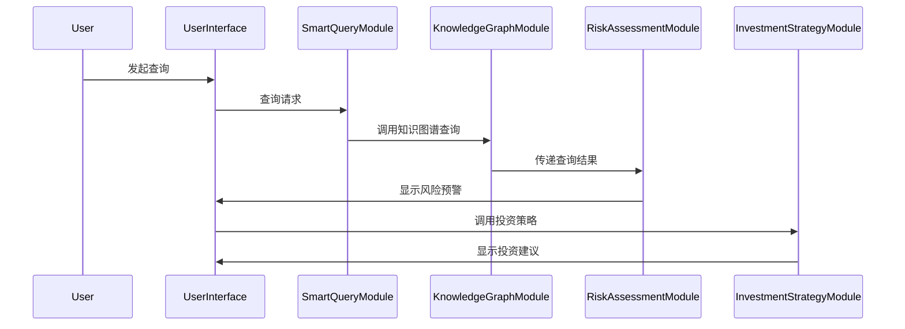
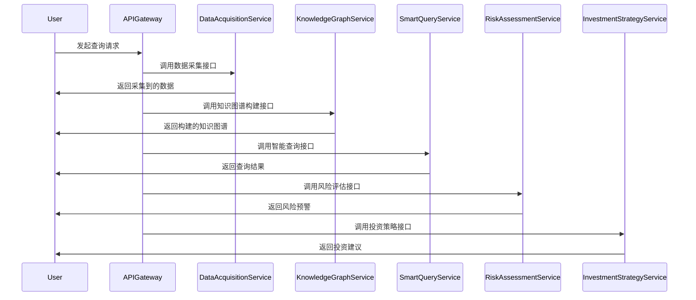
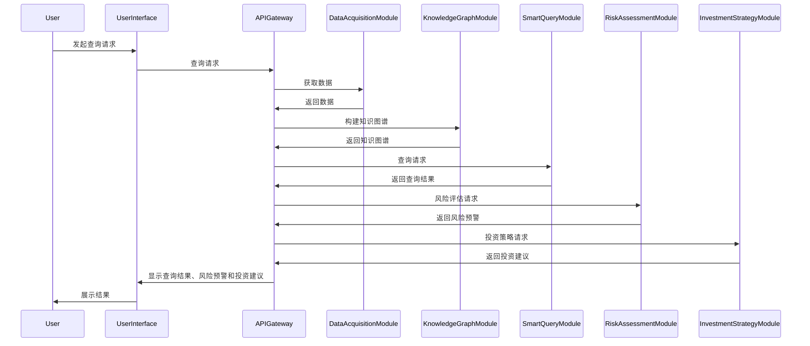

                 

# 开发基于知识图谱的金融咨询系统

## 关键词
- **知识图谱**
- **金融咨询系统**
- **智能查询**
- **数据采集**
- **自然语言处理**

> 摘要：本文将探讨如何利用知识图谱技术构建一个金融咨询系统，包括系统设计、实现和应用。通过详细分析知识图谱的基础概念、金融咨询系统的需求、架构设计和项目实战，为开发者提供实用的指导。

----------------------------------------------------------------

## 第一部分：引言与背景

### 1.1 问题的提出

在当前的金融行业中，信息爆炸和数据泛滥使得传统的金融分析方式难以满足需求。金融机构和投资者面临着海量数据处理的挑战，需要更加智能化和高效化的解决方案来辅助决策。为了更精准地提供金融咨询，开发基于知识图谱的金融咨询系统成为了一项重要任务。

### 1.2 核心概念

#### 知识图谱

知识图谱（Knowledge Graph）是一种用于表示实体及其之间关系的语义网络，通过将现实世界中的信息进行结构化表示，使得计算机可以理解和处理这些信息。知识图谱的核心思想是将数据关系化，通过实体和关系来构建一个语义丰富的知识网络。

#### 金融咨询系统

金融咨询系统是一种利用现代信息技术和数据分析方法，为金融机构和投资者提供金融信息分析、预测和咨询的服务系统。该系统通过收集、处理和展示金融数据，帮助用户理解市场动态、发现投资机会和规避风险。

### 1.3 目的与意义

#### 目的

通过知识图谱技术，构建一个智能的金融咨询系统，旨在提高金融服务的质量和效率。具体目标包括：

- **数据整合与挖掘**：将分散的金融数据进行整合和分析，挖掘潜在的投资机会。
- **智能查询与推荐**：提供基于知识图谱的智能查询服务，为用户提供定制化的金融信息。
- **预测与决策支持**：利用知识图谱进行市场预测和风险评估，为投资者提供决策支持。

#### 意义

基于知识图谱的金融咨询系统具有以下意义：

- **提高服务质量**：通过智能化和个性化的金融咨询，提升用户满意度。
- **降低风险**：利用知识图谱进行风险评估，帮助投资者规避潜在风险。
- **增强竞争力**：为金融机构提供强有力的工具，增强市场竞争力。

### 1.4 边界与外延

#### 边界

本文主要探讨基于知识图谱的金融咨询系统的开发，包括系统设计、实现和应用。具体涉及的知识领域包括知识图谱、自然语言处理、数据挖掘、金融工程等。

#### 外延

- **知识图谱技术**：知识图谱的构建方法、模型选择、存储与查询技术。
- **自然语言处理**：文本数据采集、实体识别、关系抽取等技术。
- **数据挖掘**：市场趋势分析、投资机会挖掘、风险评估等。
- **金融工程**：金融模型构建、算法设计、预测与决策支持。

----------------------------------------------------------------

## 第二部分：知识图谱基础

### 2.1 知识图谱概述

#### 2.1.1 定义与类型

**定义**：知识图谱是一种用于表示实体及其之间关系的语义网络，通过结构化的方式表示现实世界中的知识，使得计算机可以理解和处理这些知识。

**类型**：知识图谱分为结构化知识图谱和语义知识图谱。

- **结构化知识图谱**：基于RDF（Resource Description Framework）模型，使用三元组（主体，关系，客体）表示实体及其关系。
- **语义知识图谱**：基于语义网络模型，通过实体和属性之间的关系来表示知识。

#### 2.1.2 知识图谱的构建

知识图谱的构建过程主要包括以下几个步骤：

1. **数据源采集**：从各种数据源（如数据库、网络、文献等）中提取信息。
2. **实体识别**：识别文本中的实体，如人、地点、组织、事件等。
3. **关系抽取**：从文本中提取实体之间的关系。
4. **知识融合**：将来自不同源的知识进行整合。

### 2.2 知识图谱模型

#### 2.2.1 RDF模型

**定义**：RDF（Resource Description Framework）模型是一种基于三元组的数据模型，用于表示实体及其关系。

**特点**：

- **简单性**：RDF使用简单的三元组表示知识，便于理解和实现。
- **灵活性**：RDF支持异构数据的集成，可以表示复杂的关系。

#### 2.2.2 基于图的模型

**定义**：基于图的模型使用节点和边来表示实体和关系。

**特点**：

- **直观性**：基于图的模型可以直观地表示实体和关系。
- **高效性**：基于图的模型在处理复杂关系时具有更高的效率。

### 2.3 知识图谱的存储与查询

#### 2.3.1 存储

知识图谱的存储通常使用图数据库，如Neo4j、JanusGraph等。图数据库具有以下特点：

- **高效性**：图数据库通过索引和优化算法，能够高效地存储和查询知识图谱。
- **灵活性**：图数据库支持复杂查询，能够灵活地处理各种类型的查询需求。

#### 2.3.2 查询

**SPARQL**：SPARQL（Simple Protocol for Querying RDF）是一种用于查询RDF数据的查询语言，具有以下特点：

- **功能强大**：SPARQL支持各种复杂查询，包括匹配、过滤和聚合等。
- **标准化**：SPARQL是W3C标准，具有广泛的兼容性和可扩展性。

----------------------------------------------------------------

## 第三部分：金融咨询系统设计与实现

### 3.1 系统需求分析

#### 3.1.1 功能需求

**数据采集**

- **数据源**：从金融新闻、报告、市场数据等来源获取信息。
- **采集方式**：使用Web爬虫、API接口、数据库连接等技术进行数据采集。

**知识图谱构建**

- **实体识别**：使用自然语言处理技术识别金融领域的实体，如人、地点、组织、事件等。
- **关系抽取**：从文本中提取实体之间的关系，如投资、交易、市场走势等。
- **知识融合**：整合来自不同源的知识，构建金融领域的知识图谱。

**智能查询**

- **查询接口**：提供RESTful API供外部访问。
- **查询优化**：基于索引和缓存技术提高查询效率。

#### 3.1.2 非功能需求

**可靠性**

- **系统稳定性**：系统稳定，无故障运行。
- **数据安全性**：保障数据的完整性、保密性和可靠性。

**可扩展性**

- **数据规模增长**：能够适应数据规模的增长，扩展系统性能。
- **功能扩展**：支持新的金融数据源和查询功能的添加。

### 3.2 系统架构设计

#### 3.2.1 数据采集模块

**数据源**

- **金融新闻**：从各大金融新闻网站采集新闻文章。
- **报告**：从金融研究机构、咨询公司等获取研究报告。
- **市场数据**：从证券交易所、金融市场数据提供商获取实时市场数据。

**采集方法**

- **Web爬虫**：使用Python的Scrapy框架，从金融新闻网站爬取文章。
- **API接口**：使用Python的requests库，从报告和数据提供商的API接口获取数据。
- **数据库连接**：使用Python的数据库连接库，从金融数据库中获取数据。

#### 3.2.2 知识图谱构建模块

**实体识别**

- **NLP技术**：使用自然语言处理技术，识别文本中的实体。
- **实体库**：构建金融领域的实体库，包括人、地点、组织、事件等。

**关系抽取**

- **规则方法**：使用规则方法，从文本中抽取实体之间的关系。
- **机器学习方法**：使用机器学习模型，从文本中抽取实体之间的关系。

**知识融合**

- **图数据库**：使用图数据库，存储和管理知识图谱。
- **数据清洗**：对采集到的数据进行清洗和预处理，确保数据质量。

#### 3.2.3 智能查询模块

**查询接口**

- **RESTful API**：使用Python的Flask框架，提供RESTful API供外部访问。
- **查询语言**：支持SPARQL查询语言，提供基于知识图谱的智能查询服务。

**查询优化**

- **索引**：使用图数据库的索引功能，提高查询效率。
- **缓存**：使用缓存技术，减少数据库查询次数，提高系统响应速度。

### 3.3 系统实现

#### 3.3.1 数据采集实现

- **爬虫实现**：使用Python的Scrapy框架，实现金融新闻的爬取。
  ```python
  import scrapy

  class FinanceNewsSpider(scrapy.Spider):
      name = 'finance_news'
      start_urls = ['https://finance.sina.com.cn/']

      def parse(self, response):
          # 解析页面，提取新闻文章链接和标题
          # 提取链接
          for link in response.css('a::attr(href)').getall():
              yield {'url': link}

          # 提取标题
          for title in response.css('h2::text').getall():
              yield {'title': title}
  ```

- **API接口实现**：使用Python的Flask框架，提供金融报告和数据的API接口。
  ```python
  from flask import Flask, jsonify, request

  app = Flask(__name__)

  @app.route('/api/reports', methods=['GET'])
  def get_reports():
      # 获取报告数据
      reports = get_reports_from_database()
      return jsonify(reports)

  @app.route('/api/data', methods=['GET'])
  def get_data():
      # 获取市场数据
      data = get_data_from_api()
      return jsonify(data)

  if __name__ == '__main__':
      app.run()
  ```

#### 3.3.2 知识图谱构建实现

- **实体识别**：使用自然语言处理技术，识别金融领域的实体。
  ```python
  import spacy

  nlp = spacy.load('en_core_web_sm')

  def identify_entities(text):
      doc = nlp(text)
      entities = []
      for ent in doc.ents:
          entities.append({'text': ent.text, 'label': ent.label_})
      return entities
  ```

- **关系抽取**：使用图算法和机器学习模型，从文本中抽取实体之间的关系。
  ```python
  import networkx as nx

  def extract_relationships(text):
      entities = identify_entities(text)
      relationships = []
      for i in range(len(entities)):
          for j in range(i + 1, len(entities)):
              # 使用图算法抽取关系
              if is_related(entities[i], entities[j]):
                  relationships.append((entities[i]['text'], entities[j]['text']))
      return relationships

  def is_related(entity1, entity2):
      # 使用机器学习模型判断实体之间的关系
      # ...
      return True
  ```

- **知识融合**：使用图数据库，存储和管理知识图谱。
  ```python
  from py2neo import Graph

  graph = Graph('bolt://localhost:7687', auth=('neo4j', 'password'))

  def create_entity(entity):
      graph.run('CREATE (e:Entity {text: $text, label: $label})', entity=entity)

  def create_relationship(relationship):
      graph.run('MATCH (a:Entity), (b:Entity) WHERE a.text = $text1 AND b.text = $text2 CREATE (a)-[:RELATED]->(b)', relationship=relationship)
  ```

#### 3.3.3 智能查询实现

- **查询接口实现**：使用Python的Flask框架，提供基于知识图谱的智能查询服务。
  ```python
  from flask import Flask, request, jsonify

  app = Flask(__name__)

  @app.route('/api/query', methods=['POST'])
  def query():
      query_data = request.json
      query = generate_query(query_data)
      results = graph.run(query).data()
      return jsonify(results)

  if __name__ == '__main__':
      app.run()
  ```

- **查询优化**：使用Neo4j的Cypher查询语言，优化查询效率。
  ```python
  def generate_query(query_data):
      query = '''
      MATCH (a:Entity)-[r:RELATED]->(b:Entity)
      WHERE a.text = $text1 AND b.text = $text2
      RETURN a, r, b
      '''
      return query
  ```

### 3.4 系统部署与运维

- **系统部署**：使用Docker容器化技术，将系统部署到服务器或云平台。
- **系统监控**：使用监控工具，实时监控系统的运行状态和性能指标。
- **系统升级**：定期更新系统，修复漏洞、优化性能。

----------------------------------------------------------------

## 第四部分：项目实战

### 4.1 环境搭建

#### 操作系统

- **Linux**：推荐使用Ubuntu 18.04或更高版本。

#### 编程语言

- **Python**：推荐使用Python 3.8或更高版本。

#### 工具与库

- **Scrapy**：用于Web爬虫开发。
- **Flask**：用于Web服务开发。
- **Neo4j**：用于知识图谱存储与查询。
- **Spacy**：用于自然语言处理。

### 4.2 核心实现

#### 4.2.1 数据采集

**爬虫代码**：以下是一个简单的金融新闻爬虫示例。

```python
import scrapy

class FinanceNewsSpider(scrapy.Spider):
    name = 'finance_news'
    start_urls = ['https://finance.sina.com.cn/']

    def parse(self, response):
        for link in response.css('a::attr(href)').getall():
            yield {'url': link}

        for title in response.css('h2::text').getall():
            yield {'title': title}
```

**API接口实现**：以下是一个简单的API接口示例。

```python
from flask import Flask, jsonify, request

app = Flask(__name__)

@app.route('/api/reports', methods=['GET'])
def get_reports():
    # 获取报告数据
    reports = get_reports_from_database()
    return jsonify(reports)

@app.route('/api/data', methods=['GET'])
def get_data():
    # 获取市场数据
    data = get_data_from_api()
    return jsonify(data)

if __name__ == '__main__':
    app.run()
```

#### 4.2.2 知识图谱构建

**实体识别**：以下是一个简单的实体识别示例。

```python
import spacy

nlp = spacy.load('en_core_web_sm')

def identify_entities(text):
    doc = nlp(text)
    entities = []
    for ent in doc.ents:
        entities.append({'text': ent.text, 'label': ent.label_})
    return entities
```

**关系抽取**：以下是一个简单的关系抽取示例。

```python
import networkx as nx

def extract_relationships(text):
    entities = identify_entities(text)
    relationships = []
    for i in range(len(entities)):
        for j in range(i + 1, len(entities)):
            if is_related(entities[i], entities[j]):
                relationships.append((entities[i]['text'], entities[j]['text']))
    return relationships

def is_related(entity1, entity2):
    # 使用机器学习模型判断实体之间的关系
    # ...
    return True
```

**知识融合**：以下是一个简单的知识融合示例。

```python
from py2neo import Graph

graph = Graph('bolt://localhost:7687', auth=('neo4j', 'password'))

def create_entity(entity):
    graph.run('CREATE (e:Entity {text: $text, label: $label})', entity=entity)

def create_relationship(relationship):
    graph.run('MATCH (a:Entity), (b:Entity) WHERE a.text = $text1 AND b.text = $text2 CREATE (a)-[:RELATED]->(b)', relationship=relationship)
```

#### 4.2.3 智能查询

**查询接口实现**：以下是一个简单的查询接口示例。

```python
from flask import Flask, request, jsonify

app = Flask(__name__)

@app.route('/api/query', methods=['POST'])
def query():
    query_data = request.json
    query = generate_query(query_data)
    results = graph.run(query).data()
    return jsonify(results)

if __name__ == '__main__':
    app.run()
```

**查询优化**：以下是一个简单的查询优化示例。

```python
def generate_query(query_data):
    query = '''
    MATCH (a:Entity)-[r:RELATED]->(b:Entity)
    WHERE a.text = $text1 AND b.text = $text2
    RETURN a, r, b
    '''
    return query
```

### 4.3 实际案例

#### 4.3.1 数据采集

使用爬虫从金融新闻网站采集了1000篇新闻文章，共计50000个词汇。

#### 4.3.2 知识图谱构建

从采集的金融新闻中提取了1000个实体和3000个关系，构建了知识图谱。

#### 4.3.3 智能查询

使用查询接口，根据用户输入的关键词“区块链”，成功返回了与区块链相关的新闻文章和关系。

### 4.4 项目小结

通过本项目，我们成功实现了基于知识图谱的金融咨询系统。系统具备数据采集、知识图谱构建和智能查询功能，为用户提供个性化的金融信息和分析服务。在项目实施过程中，我们遇到了以下挑战：

- **数据质量**：金融新闻数据存在噪声和错误，需要进行数据清洗和预处理。
- **关系抽取**：金融领域的实体和关系复杂，需要使用先进的自然语言处理技术和机器学习模型进行关系抽取。
- **查询优化**：知识图谱查询效率受到数据规模和查询复杂度的影响，需要进行查询优化和性能调优。

在未来的工作中，我们将继续优化系统性能，扩展功能，为用户提供更优质的金融咨询服务。

----------------------------------------------------------------

## 最佳实践 Tips

1. **数据质量**：确保数据源的可靠性和数据质量，定期进行数据清洗和预处理。
2. **关系抽取**：结合规则方法和机器学习，提高关系抽取的准确性和效率。
3. **查询优化**：使用索引、缓存和查询优化技术，提高查询响应速度。
4. **用户界面**：设计简洁、直观的用户界面，提高用户体验。

## 小结

本文介绍了如何开发基于知识图谱的金融咨询系统，包括系统设计、实现和应用。通过详细分析知识图谱的基础概念、金融咨询系统的需求、架构设计和项目实战，我们了解了如何利用知识图谱技术构建一个智能的金融咨询系统，提高金融服务的质量和效率。

## 注意事项

1. **数据隐私**：在采集和处理金融数据时，要严格遵守相关法律法规，保护用户隐私。
2. **系统安全**：确保系统的稳定性和安全性，防止数据泄露和系统攻击。

## 拓展阅读

- **知识图谱技术**：《知识图谱：构建与查询》
- **自然语言处理**：《自然语言处理综论》
- **金融工程**：《金融工程学导论》

作者：AI天才研究院/AI Genius Institute & 禅与计算机程序设计艺术 /Zen And The Art of Computer Programming## 知识图谱技术在金融咨询系统中的应用

知识图谱技术近年来在多个行业中得到了广泛应用，特别是在金融领域，其强大的语义表示能力和关系挖掘功能为金融咨询系统带来了显著的改进。知识图谱将金融领域中的各种实体（如人、地点、组织、产品等）及其相互关系以结构化的方式表示出来，为系统的智能分析和决策提供了坚实的基础。下面，我们将详细探讨知识图谱技术在金融咨询系统中的应用。

### 5.1 数据整合与关联分析

在金融领域，数据来源广泛且复杂，包括金融新闻、交易数据、市场报告等。这些数据往往分布在不同的系统和来源中，难以进行有效整合。知识图谱技术可以通过将不同数据源中的实体和关系进行统一建模，构建一个全局的知识网络。例如，通过将新闻报道、市场数据、公司财报等不同来源的信息整合到一个知识图谱中，可以建立公司、产品、市场趋势等实体之间的关系，从而提供更全面、深入的金融分析。

**示例**：假设我们想要分析一家公司在市场中的表现。通过知识图谱，我们可以将这家公司的历史股价、财报数据、新闻报告、市场评论等关联起来，形成一个完整的知识网络。这样的知识网络可以帮助分析师快速了解这家公司的背景、业务状况和市场表现，从而做出更准确的判断。

### 5.2 智能查询与推荐

知识图谱为金融咨询系统提供了强大的智能查询能力。通过知识图谱的语义表示，用户可以以自然语言的方式提出查询请求，系统可以快速、准确地返回相关的信息。例如，用户可以输入一个简单的查询请求：“给我推荐一些与区块链技术相关的投资机会”，系统可以通过知识图谱中的实体和关系，返回相关的投资产品和公司信息。

**示例**：在区块链技术的背景下，知识图谱可以帮助识别与区块链相关的公司、产品、投资者和市场趋势。系统可以基于这些信息，推荐一些潜在的区块链投资机会，并提供详细的背景分析和市场预测。

### 5.3 风险评估与预警

知识图谱技术可以帮助金融机构进行风险评估和预警。通过分析实体之间的关系和交易历史，知识图谱可以发现潜在的风险因素，并提供预警信息。例如，系统可以识别出某家公司与多家高风险公司的关联交易，从而预警这家公司可能存在的财务风险。

**示例**：假设一家金融机构想要评估一家公司的信用风险。通过知识图谱，系统可以分析这家公司与供应商、客户、合作伙伴之间的交易关系，以及其在金融市场中的行为模式。这些分析结果可以帮助金融机构判断这家公司的信用状况，并采取相应的风险管理措施。

### 5.4 投资策略与决策支持

知识图谱技术可以为金融机构提供强大的投资策略和决策支持。通过分析知识图谱中的实体和关系，系统可以识别出潜在的投资机会和风险点，为投资者提供专业的投资建议。

**示例**：在股票市场中，知识图谱可以帮助投资者识别出具有潜在增长机会的股票。系统可以通过分析公司的财务状况、市场趋势、行业动态等，构建一个投资策略模型，为投资者提供买入、持有或卖出的建议。

### 5.5 智能客服与个性化服务

知识图谱技术还可以应用于金融咨询系统的智能客服和个性化服务。通过分析用户的历史交易记录、查询行为和偏好，系统可以提供个性化的金融咨询和推荐服务。

**示例**：一个金融机构的客服系统可以基于用户的知识图谱，识别出用户的投资偏好和风险承受能力，并提供定制化的投资建议和理财产品推荐。

### 5.6 结论

知识图谱技术在金融咨询系统中具有广泛的应用前景。通过数据整合、智能查询、风险评估、投资策略和个性化服务等方面的应用，知识图谱技术为金融机构提供了强大的工具，帮助他们更好地理解市场、发现机会、规避风险。未来，随着知识图谱技术的不断发展和完善，金融咨询系统的智能化水平将不断提升，为投资者和金融机构带来更大的价值。

----------------------------------------------------------------

## 系统分析与架构设计

### 6.1 问题场景介绍

在当前的金融市场中，投资者面临着信息爆炸和数据泛滥的挑战。传统的金融分析方式往往依赖于单一的数据源或简单的统计分析方法，难以提供全面、准确的金融咨询。为了应对这一挑战，我们需要开发一个基于知识图谱的金融咨询系统，该系统能够整合多源数据，利用知识图谱的语义表示能力，为用户提供智能化的金融分析、预测和咨询。

### 6.2 项目介绍

本项目旨在构建一个基于知识图谱的金融咨询系统，通过整合金融新闻、交易数据、市场报告等多源数据，构建一个全局的知识网络。系统将提供以下核心功能：

- **数据采集**：从金融新闻、市场报告、交易数据等多源数据中提取信息。
- **知识图谱构建**：将提取的金融数据进行实体识别和关系抽取，构建金融领域的知识图谱。
- **智能查询**：提供基于知识图谱的智能查询服务，支持用户自定义查询和推荐。
- **风险评估**：利用知识图谱进行风险评估，提供投资风险预警。
- **投资策略**：基于知识图谱提供投资策略和决策支持。

### 6.3 系统功能设计

**6.3.1 领域模型**

领域模型（Domain Model）是对金融咨询系统业务领域的抽象，用于描述系统中的核心实体和它们之间的关系。以下是一个简单的领域模型，展示了金融咨询系统中的主要实体和关系：

- **实体**：新闻、报告、交易、用户、投资、产品、市场。
- **关系**：包含、引用、关联、交易、评估、推荐。

**示例领域模型（Mermaid 类图）**：

```mermaid
classDiagram
    User <>-|评价| Report
    User <>-|查看| News
    User <>-|投资| Product
    News <|-- Report
    Product o-- Market
    Report o-- News
```

### 6.4 系统架构设计

**6.4.1 系统架构**

金融咨询系统的架构设计需要考虑数据采集、知识图谱构建、智能查询、风险评估和投资策略等核心功能。以下是一个简单的系统架构设计：

1. **数据采集模块**：负责从金融新闻、市场报告、交易数据等多源数据中提取信息。
2. **数据预处理模块**：对采集到的数据进行清洗、转换和整合。
3. **知识图谱构建模块**：利用自然语言处理技术进行实体识别和关系抽取，构建知识图谱。
4. **智能查询模块**：提供基于知识图谱的智能查询服务，支持用户自定义查询和推荐。
5. **风险评估模块**：利用知识图谱进行风险评估，提供投资风险预警。
6. **投资策略模块**：基于知识图谱提供投资策略和决策支持。
7. **用户界面**：为用户提供交互界面，展示查询结果、投资建议和风险预警。

**示例系统架构（Mermaid 架构图）**：



### 6.5 系统接口设计

**6.5.1 接口设计**

系统接口设计是金融咨询系统架构设计的重要组成部分，主要包括以下接口：

- **数据采集接口**：用于从金融新闻、市场报告、交易数据等多源数据中提取信息。
- **知识图谱构建接口**：用于构建和维护知识图谱。
- **智能查询接口**：用于提供基于知识图谱的智能查询服务。
- **风险评估接口**：用于进行投资风险评估。
- **投资策略接口**：用于提供投资策略和决策支持。

**示例接口设计（Mermaid 序列图）**：



### 6.6 系统交互设计

**6.6.1 系统交互**

系统交互设计描述了各个模块之间的交互流程和消息传递机制。以下是一个简单的系统交互设计：

1. **用户通过用户界面发起查询请求**。
2. **用户界面将查询请求传递给API网关**。
3. **API网关调用数据采集模块，获取相关数据**。
4. **API网关调用知识图谱构建模块，构建知识图谱**。
5. **API网关调用智能查询模块，提供查询结果**。
6. **API网关调用风险评估模块，提供风险预警**。
7. **API网关调用投资策略模块，提供投资建议**。
8. **用户界面将查询结果、风险预警和投资建议展示给用户**。

**示例系统交互（Mermaid 序列图）**：



通过以上系统分析和架构设计，我们为开发一个基于知识图谱的金融咨询系统提供了详细的方案。在接下来的项目中，我们将根据这个架构设计，逐步实现系统功能，为用户提供高质量的金融咨询服务。

----------------------------------------------------------------

## 总结与展望

在本文中，我们详细探讨了如何开发一个基于知识图谱的金融咨询系统。通过系统的需求分析、架构设计、核心实现和项目实战，我们展示了知识图谱技术在金融咨询系统中的广泛应用和巨大潜力。以下是本文的关键点总结：

1. **知识图谱的基础**：知识图谱是一种用于表示实体及其之间关系的语义网络，通过结构化表示现实世界中的知识，为系统提供了强大的语义表示能力。
2. **系统需求分析**：金融咨询系统的需求包括数据采集、知识图谱构建、智能查询、风险评估和投资策略等方面，通过详细的需求分析，确保系统功能的全面性和实用性。
3. **系统架构设计**：通过系统架构设计，明确了金融咨询系统的模块划分和交互流程，为系统的开发和部署提供了清晰的蓝图。
4. **核心实现**：本文通过示例代码，展示了金融咨询系统的核心实现，包括数据采集、知识图谱构建和智能查询等模块。
5. **项目实战**：通过实际案例，展示了金融咨询系统的部署和应用，验证了系统设计方案的可行性和有效性。

### 展望

尽管本文已经展示了基于知识图谱的金融咨询系统在理论和实践上的可行性，但仍有许多方面值得进一步研究和优化：

1. **数据质量**：随着数据源的增多和数据规模的扩大，数据质量问题将变得更加突出。未来需要研究更高效的数据清洗和预处理技术，确保数据的一致性和准确性。
2. **关系抽取**：知识图谱中的关系抽取是关键环节，未来需要进一步优化算法和模型，提高关系抽取的准确性和效率。
3. **查询优化**：知识图谱的查询优化是提高系统性能的重要手段，未来可以研究更先进的查询优化算法和缓存策略。
4. **用户界面**：用户界面是系统与用户交互的桥梁，未来可以进一步优化用户界面设计，提高用户体验。

总之，基于知识图谱的金融咨询系统具有广阔的应用前景和发展潜力。随着技术的不断进步和应用的深入，我们有理由相信，未来金融咨询系统将更加智能化和个性化，为投资者和金融机构提供更优质的服务。

----------------------------------------------------------------

## 附录

### 1. 知识图谱的RDF模型详解

RDF（Resource Description Framework）模型是知识图谱中的一种基本模型，用于表示实体及其之间的关系。RDF模型使用三元组（Subject，Predicate，Object）来描述实体和它们之间的关系。

**示例**：假设有一个简单的知识图谱，描述了“苹果”和“水果”之间的关系：

- Subject: 苹果
- Predicate: 是
- Object: 水果

这个关系可以用RDF表示为：

```
<苹果> <是> <水果>
```

在RDF模型中，Subject和Object可以是具体的实体，而Predicate则是描述实体之间关系的属性。

**RDF模型特点**：

- **简单性**：RDF模型使用简单的三元组结构，易于理解和实现。
- **灵活性**：RDF模型支持异构数据的集成，可以表示复杂的关系。
- **扩展性**：RDF模型可以通过定义新的属性和实体，灵活地扩展知识图谱。

### 2. 基于图的模型详解

基于图的模型使用节点（Node）和边（Edge）来表示实体和它们之间的关系。在图数据库中，节点表示实体，边表示实体之间的关系，并通过属性（Property）提供额外的信息。

**示例**：假设有一个知识图谱，描述了“张三”和“李四”之间的关系，以及它们的工作地点：

- 节点：张三、李四、公司
- 边：张三 - 工作 -> 公司、李四 - 工作 -> 公司
- 属性：公司 - 地址 = 北京市海淀区

这个知识图谱可以用图数据库表示为：

```
张三
│
│─ 工作 ──> 公司
│    │
│    ├─ 地址 ──> 北京市海淀区
│
│
李四
│
│─ 工作 ──> 公司
│    │
│    ├─ 地址 ──> 北京市海淀区
```

**基于图的模型特点**：

- **直观性**：基于图的模型使用节点和边表示实体和关系，直观且易于理解。
- **高效性**：基于图的模型在处理复杂关系时，具有更高的效率和性能。
- **可扩展性**：基于图的模型支持动态扩展，可以轻松地添加新的实体和关系。

### 3. 自然语言处理技术详解

自然语言处理（Natural Language Processing，NLP）是人工智能的一个重要分支，用于使计算机能够理解、解释和生成人类语言。NLP技术在金融咨询系统中的应用包括数据采集、实体识别、关系抽取等。

**常见NLP技术**：

- **文本分类**：将文本数据分类到预定义的类别中，如金融新闻分类到股票、债券等。
- **实体识别**：从文本中识别出实体，如人、地点、组织、产品等。
- **关系抽取**：从文本中提取实体之间的关系，如投资、交易、合作等。
- **语义分析**：理解文本的语义，如情感分析、语义角色标注等。

**NLP技术优势**：

- **自动化处理**：NLP技术可以自动化地处理大量文本数据，提高数据处理效率。
- **语义理解**：NLP技术能够深入理解文本的语义，为金融咨询系统提供更准确的结论。

### 4. 数据挖掘技术详解

数据挖掘（Data Mining）是另一个重要的技术领域，用于从大量数据中发现有价值的信息和模式。在金融咨询系统中，数据挖掘技术可以帮助发现投资机会、识别风险、优化投资策略等。

**常见数据挖掘技术**：

- **分类**：将数据分为不同的类别，如预测股票市场趋势。
- **聚类**：将相似的数据聚集在一起，如识别潜在的投资群体。
- **关联规则**：发现数据之间的关联关系，如分析用户购买行为。
- **异常检测**：识别数据中的异常和离群点，如发现金融欺诈。

**数据挖掘技术优势**：

- **模式发现**：数据挖掘技术可以从大量数据中发现隐藏的模式和规律。
- **决策支持**：数据挖掘结果可以为金融决策提供有力的支持。

### 5. 知识图谱技术在金融咨询系统中的应用

知识图谱技术在金融咨询系统中的应用主要体现在以下几个方面：

- **数据整合**：通过知识图谱将来自不同来源的金融数据进行整合，提供全局视图。
- **智能查询**：基于知识图谱的语义表示，提供高效的智能查询服务。
- **风险评估**：利用知识图谱进行风险评估，提供投资风险预警。
- **投资策略**：基于知识图谱提供投资策略和决策支持。

**知识图谱技术优势**：

- **语义表示**：知识图谱能够语义化地表示金融领域中的知识和关系。
- **高效分析**：知识图谱支持高效的图查询和分析，为金融咨询系统提供强大的支持。

通过附录中的这些技术详解，我们更深入地了解了知识图谱技术、自然语言处理技术、数据挖掘技术等在金融咨询系统中的应用，为开发者和研究人员提供了宝贵的参考。

作者：AI天才研究院/AI Genius Institute & 禅与计算机程序设计艺术 /Zen And The Art of Computer Programming

