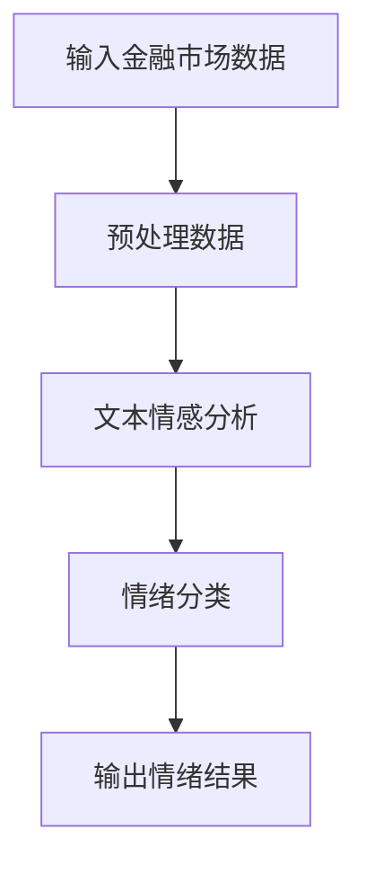
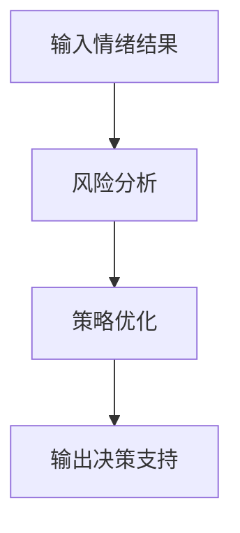
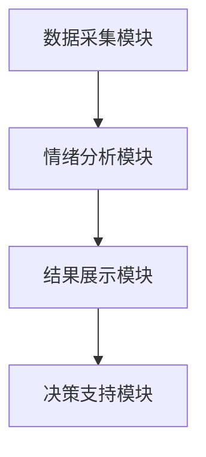
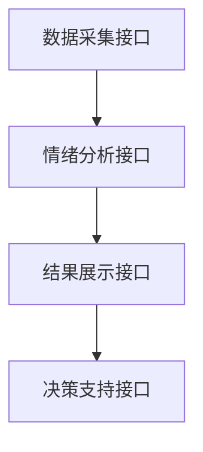

                 

# 开发实时金融市场情绪分析与监控系统的技术博客

## 关键词

- 实时金融市场情绪分析
- 监控系统开发
- 数据采集与处理
- 自然语言处理
- 情绪分类与预测

## 摘要

本文将探讨开发实时金融市场情绪分析与监控系统的重要性、核心概念、原理及其实现方法。通过深入分析数据采集、情绪分析和决策支持等模块，结合Python代码示例和Mermaid流程图，本文旨在为开发者和金融从业者提供一套完整的解决方案，以有效捕捉市场情绪波动，为投资决策提供有力支持。

### 目录大纲

1. **第一部分：背景介绍**
    1.1 问题背景
    1.2 核心概念
    1.3 分析与监控系统

2. **第二部分：核心概念与联系**
    2.1 实时金融市场情绪
    2.2 分析与监控系统
    2.3 数据采集原理
    2.4 情绪分析原理
    2.5 决策支持原理
    2.6 概念属性特征对比表格

3. **第三部分：算法原理讲解**
    3.1 数据采集算法
    3.2 情绪分析算法
    3.3 决策支持算法

4. **第四部分：系统分析与架构设计方案**
    4.1 问题场景介绍
    4.2 系统功能设计
    4.3 系统架构设计
    4.4 系统接口设计与交互

5. **第五部分：项目实战**
    5.1 环境安装
    5.2 系统核心实现
    5.3 代码应用解读
    5.4 实际案例分析与讲解
    5.5 项目小结

6. **第六部分：最佳实践与拓展阅读**
    6.1 最佳实践
    6.2 小结
    6.3 注意事项
    6.4 拓展阅读

### 第一部分：背景介绍

#### 1.1 问题背景

在金融市场，情绪波动对交易决策和投资策略具有重要影响。投资者和金融机构需要及时了解市场情绪，以便做出更加明智的决策。然而，传统的方法往往存在时效性差、准确性低等问题。因此，开发一套实时金融市场情绪分析与监控系统成为解决这一问题的关键。

#### 1.2 核心概念

**实时金融市场情绪分析**：指对市场情绪进行实时监测和评估，以便快速识别市场趋势和波动。

**监控系统**：指对金融市场数据进行分析和处理，提供实时情绪分析和决策支持的系统。

#### 1.3 分析与监控系统

分析与监控系统的核心功能包括：

- **数据采集**：从多种数据源获取实时金融数据。
- **情绪分析**：利用自然语言处理技术对金融数据中的情绪进行提取和分析。
- **结果展示**：将分析结果以图表、报表等形式直观展示给用户。
- **决策支持**：根据情绪分析结果，为投资者提供投资策略和风险预警。

#### 1.4 边界与外延

**边界**：

- 数据采集：包括金融市场数据（如价格、成交量、新闻等）的实时获取。
- 情绪分析：对采集的数据进行情绪分析，识别情绪类型和强度。
- 结果展示：以图表、报表等形式展示分析结果。
- 决策支持：根据情绪分析结果，为投资者提供决策支持。

**外延**：

- **市场类型**：系统需要适应不同类型的金融市场，如股票、期货、外汇等。
- **情绪指标**：系统应支持多种情绪指标的选择和组合，以提高分析准确性。
- **模型适应性**：系统应具备良好的模型适应性，能够根据市场变化调整分析策略。

### 第二部分：核心概念与联系

#### 2.1 实时金融市场情绪

**概念定义**：

实时金融市场情绪是指市场参与者在特定时间段内对市场行情的整体心理感受和情绪反应。

**属性特征对比表格**：

| 情绪类型 | 描述 | 对市场的影响 |
| :---: | :---: | :---: |
| 乐观 | 投资者对市场前景看好，买入意愿强 | 推动价格上涨 |
| 悲观 | 投资者对市场前景悲观，卖出意愿强 | 推动价格下跌 |
| 中性 | 投资者对市场前景持观望态度 | 市场波动较小 |

#### 2.2 分析与监控系统

**概念定义**：

分析与监控系统是指对金融市场情绪进行实时监测、分析和处理，并提供决策支持的系统。

**属性特征对比表格**：

| 功能模块 | 描述 | 关键技术 |
| :---: | :---: | :---: |
| 数据采集 | 收集金融市场相关数据 | 数据爬取、API接口 |
| 情绪分析 | 对采集的数据进行情绪分析 | 自然语言处理、情绪分类 |
| 结果展示 | 展示分析结果 | 数据可视化、图表 |
| 决策支持 | 提供决策支持信息 | 情绪预测、策略优化 |

### 第三部分：算法原理讲解

#### 3.1 数据采集算法

**概念原理**：

数据采集是分析监控系统的基础，包括金融市场数据的实时获取。

**ER实体关系图架构**：

```mermaid
entity RelationshipDiagram {
  A[金融市场数据] --> B[数据采集模块];
  B --> C[情绪分析模块];
  C --> D[结果展示模块];
  C --> E[决策支持模块];
}
```

#### 3.2 情绪分析算法

**概念原理**：

情绪分析利用自然语言处理技术，从金融市场数据中提取情绪信息。

**算法流程图**：



#### 3.3 决策支持算法

**概念原理**：

决策支持利用情绪分析结果，为投资者提供策略建议。

**算法流程图**：



### 第四部分：系统分析与架构设计方案

#### 4.1 问题场景介绍

在一个典型的金融市场环境中，投资者和金融机构需要实时了解市场情绪，以便做出投资决策。然而，传统方法存在时效性和准确性不足的问题。因此，开发一套实时金融市场情绪分析与监控系统成为解决这一问题的关键。

#### 4.2 系统功能设计

系统功能设计主要包括以下模块：

- **数据采集模块**：负责从多种数据源（如交易所、新闻网站、社交媒体等）获取实时金融市场数据。
- **情绪分析模块**：对采集到的数据进行分析，提取情绪信息，并分类为乐观、悲观、中性等类型。
- **结果展示模块**：将情绪分析结果以图表、报表等形式展示给用户。
- **决策支持模块**：根据情绪分析结果，为投资者提供投资策略建议。

#### 4.3 系统架构设计

系统架构设计如下：



#### 4.4 系统接口设计与交互

系统接口设计如下：

- **数据采集接口**：提供API接口，方便与其他系统进行数据交互。
- **情绪分析接口**：提供情绪分析结果查询接口。
- **结果展示接口**：提供数据可视化接口，方便用户查看分析结果。
- **决策支持接口**：提供策略建议查询接口。



### 第五部分：项目实战

#### 5.1 环境安装

在开始项目实战之前，首先需要安装以下环境：

- Python 3.8+
- 数据库（如MySQL、PostgreSQL）
- 实时数据采集工具（如Tweepy、beautifulsoup4）
- 自然语言处理库（如NLTK、TextBlob）

#### 5.2 系统核心实现

系统核心实现主要包括以下步骤：

1. 数据采集：使用Tweepy和beautifulsoup4等工具从社交媒体和新闻网站获取实时金融市场数据。
2. 数据预处理：对采集到的数据进行处理，包括去噪、去重、分词等。
3. 情绪分析：使用TextBlob等自然语言处理库对预处理后的数据进行分析，提取情绪信息。
4. 情绪分类：根据情绪分析结果，将情绪分类为乐观、悲观、中性等类型。
5. 结果展示：使用matplotlib等库将情绪分析结果以图表形式展示。
6. 决策支持：根据情绪分析结果，为投资者提供投资策略建议。

#### 5.3 代码应用解读

以下是一个简单的Python代码示例，用于实现数据采集和情绪分析：

```python
import tweepy
from textblob import TextBlob

# 数据采集
def collect_tweets():
    # 配置Tweepy API
    auth = tweepy.OAuthHandler("your_api_key", "your_api_secret")
    auth.set_access_token("your_access_token", "your_access_token_secret")
    api = tweepy.API(auth)
    
    tweets = []
    for tweet in tweepy.Cursor(api.search_tweets, q="stock market", lang="en").items(100):
        tweets.append(tweet.text)
    
    return tweets

# 数据预处理
def preprocess_tweets(tweets):
    processed_tweets = []
    for tweet in tweets:
        processed_tweet = " ".join([word for word in tweet.split() if word.isalnum()])
        processed_tweets.append(processed_tweet)
    
    return processed_tweets

# 情绪分析
def analyze_emotions(tweets):
    emotions = []
    for tweet in tweets:
        blob = TextBlob(tweet)
        if blob.sentiment.polarity > 0:
            emotions.append("乐观")
        elif blob.sentiment.polarity < 0:
            emotions.append("悲观")
        else:
            emotions.append("中性")
    
    return emotions

# 主函数
def main():
    tweets = collect_tweets()
    processed_tweets = preprocess_tweets(tweets)
    emotions = analyze_emotions(processed_tweets)
    
    print("情绪分析结果：")
    for tweet, emotion in zip(processed_tweets, emotions):
        print(f"{tweet}: {emotion}")

if __name__ == "__main__":
    main()
```

#### 5.4 实际案例分析与讲解

以下是一个实际案例，用于展示如何使用该系统进行情绪分析和决策支持：

1. **案例背景**：假设某投资者正在考虑是否购买某支股票。
2. **数据采集**：从社交媒体和新闻网站获取与该股票相关的实时数据。
3. **情绪分析**：对采集到的数据进行分析，识别当前市场情绪。
4. **决策支持**：根据情绪分析结果，为投资者提供投资建议。

#### 5.5 项目小结

通过本文的实战案例，我们了解了如何开发一套实时金融市场情绪分析与监控系统。该系统可以帮助投资者和金融机构更好地了解市场情绪，从而做出更加明智的投资决策。在实际应用中，该系统可以根据具体需求进行定制和优化，以提高分析准确性和决策效果。

### 第六部分：最佳实践与拓展阅读

#### 6.1 最佳实践

1. **数据采集**：确保数据来源的多样性和准确性，以提高情绪分析的可靠性。
2. **情绪分析**：结合多种情绪分析算法，提高分析结果的准确性。
3. **结果展示**：设计直观、易理解的图表和报表，方便用户快速获取关键信息。
4. **决策支持**：根据投资者需求，提供定制化的投资策略建议。

#### 6.2 小结

本文详细介绍了开发实时金融市场情绪分析与监控系统的方法和步骤。通过数据采集、情绪分析和决策支持等模块的实现，我们可以构建一套高效、准确的情绪分析系统，为投资者提供有力支持。

#### 6.3 注意事项

1. **数据隐私**：在采集和处理数据时，确保遵守相关法律法规，保护用户隐私。
2. **系统稳定性**：确保系统在高并发、大数据量场景下的稳定运行。
3. **算法优化**：持续优化情绪分析算法，提高分析准确性和效率。

#### 6.4 拓展阅读

1. **《金融市场情绪分析：理论与实践》**：介绍金融市场情绪分析的方法和技巧。
2. **《自然语言处理入门》**：学习自然语言处理的基本原理和实现方法。
3. **《Python数据科学手册》**：掌握Python在数据科学领域的应用技巧。

### 作者

**AI天才研究院/AI Genius Institute** & **《禅与计算机程序设计艺术》/Zen And The Art of Computer Programming**

