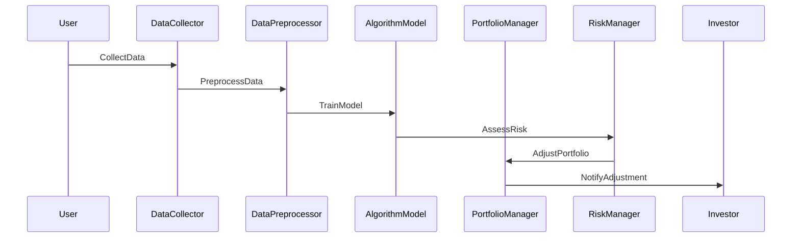
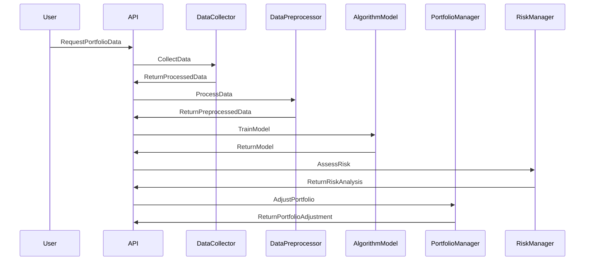
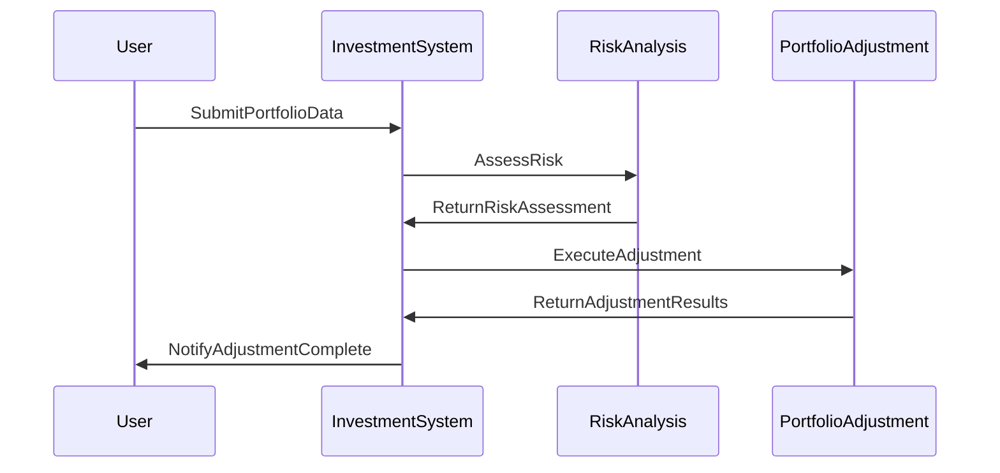

                 

### 第一部分：背景介绍

#### 1.1 问题背景

#### 1.1.1 投资组合再平衡的重要性

投资组合再平衡是金融投资领域中的一个关键策略，旨在通过定期调整资产配置，确保投资组合的预期收益与风险水平符合投资者的风险偏好和投资目标。随着市场波动和投资者个人财务状况的变化，投资组合的资产分布会逐渐偏离初始设定的目标比例，导致风险收益特性发生变化。投资组合再平衡的目的就在于这种动态调整，以维持投资组合的整体平衡，最大化收益并控制风险。

#### 1.1.2 当前投资组合再平衡工具的局限性

现有的投资组合再平衡工具主要依赖投资者自身的经验和直觉，或者简单的数学计算模型，这些方法存在以下几个局限性：

1. **人为干预过多**：依赖于投资者主观判断，缺乏智能化和自动化的支持。
2. **算法单一**：大部分工具只采用传统的数学模型进行再平衡，无法适应复杂多变的投资环境。
3. **缺乏个性化和定制化**：现有工具无法根据个人投资偏好和风险承受能力提供精准的投资建议。
4. **数据依赖性高**：需要大量的历史数据和实时市场数据，数据处理和分析能力有限。

#### 1.1.3 智能化投资组合再平衡工具的需求

为了克服现有工具的局限性，开发智能化、个性化的投资组合再平衡工具已成为一种趋势。这种工具需要具备以下特点：

1. **智能化决策**：利用机器学习和大数据分析技术，自动识别投资机会和风险点，提供科学的再平衡建议。
2. **个性化和定制化**：根据投资者的风险偏好和财务目标，提供个性化的投资策略和再平衡方案。
3. **实时响应**：能够实时捕捉市场动态，及时调整投资组合，提高资金利用效率。
4. **高效数据处理**：具备强大的数据处理能力，能够快速处理和分析大量的市场数据，提高决策效率。

#### 1.2 问题描述

#### 1.2.1 投资组合再平衡问题定义

投资组合再平衡问题是指在投资组合偏离目标比例时，通过买入或卖出资产，调整投资组合的资产配置，使其回到目标比例的过程。再平衡的目的是维持投资组合的风险收益特性，实现投资目标。

#### 1.2.2 投资组合再平衡的主要挑战

1. **市场波动性**：市场价格的波动性导致投资组合的资产分布容易偏离目标比例。
2. **资产相关性**：不同资产之间的相关性会影响再平衡的效果，需要考虑资产之间的相互影响。
3. **投资者偏好**：不同投资者的风险偏好和投资目标会影响再平衡策略的选择。
4. **数据质量**：高质量的数据是智能再平衡工具的基础，数据的质量直接影响再平衡效果。

#### 1.3 问题解决思路

#### 1.3.1 智能化投资组合再平衡工具的开发思路

为了解决上述问题，本书提出开发一种智能化投资组合再平衡工具，其核心思路包括：

1. **数据采集与预处理**：收集投资者历史投资数据和市场数据，进行数据清洗和处理，为后续分析提供基础。
2. **算法模型构建**：构建基于机器学习和大数据分析的投资组合再平衡算法模型，包括资产定价、风险评估和再平衡策略设计等。
3. **个性化投资策略**：根据投资者风险偏好和财务目标，设计个性化再平衡策略，确保投资组合的风险收益特性与投资者目标一致。
4. **实时监控与调整**：利用实时数据监控市场动态，及时调整投资组合，确保投资组合的平衡状态。

#### 1.3.2 边界与外延

在开发智能化投资组合再平衡工具时，需要明确以下边界与外延：

1. **工具适用范围**：适用于各类投资者，包括个人投资者和专业机构投资者。
2. **资产类别**：包括股票、债券、基金、期货等多种资产类别。
3. **市场环境**：适用于不同市场环境，包括牛市、熊市和震荡市等。
4. **技术要求**：需要具备一定的计算机技术和金融知识，以支撑算法模型的构建和实施。

#### 1.4 概念结构与核心要素组成

#### 1.4.1 智能化投资组合再平衡工具的核心概念

1. **机器学习**：通过历史数据训练模型，预测市场走势和资产价格。
2. **大数据分析**：收集和处理大量的市场数据，挖掘潜在的投资机会。
3. **风险建模**：构建风险评估模型，评估投资组合的风险水平。
4. **再平衡策略**：根据投资目标和风险偏好，制定合理的再平衡策略。

#### 1.4.2 核心要素组成

1. **数据采集与处理模块**：负责数据收集、清洗和处理，为算法模型提供高质量的数据。
2. **算法模型构建模块**：包括资产定价模型、风险评估模型和再平衡策略模型等。
3. **个性化投资策略模块**：根据投资者偏好和目标，设计个性化的再平衡策略。
4. **实时监控与调整模块**：实时监控市场动态，及时调整投资组合，确保投资组合的平衡状态。

----------------------------------------------------------------

### 第二部分：核心概念与联系

#### 2.1 核心概念原理

为了深入理解智能化投资组合再平衡工具，我们需要明确几个核心概念，它们是构建这一工具的理论基础。

##### 2.1.1 投资组合再平衡

投资组合再平衡是指定期调整投资组合中的资产配置，使其回归到投资者设定的目标比例。再平衡的核心在于通过买入或卖出资产来调整投资组合，从而维持其预期风险和收益水平。

##### 2.1.2 机器学习

机器学习是一种通过算法自动从数据中学习模式，并使用这些模式进行预测或决策的技术。在投资组合再平衡中，机器学习可以用来预测市场走势和资产价格，帮助投资者做出更科学的决策。

##### 2.1.3 大数据分析

大数据分析是指对大量结构化和非结构化数据进行分析，从中提取有价值的信息。在投资组合再平衡中，大数据分析可以用于收集和处理市场数据，识别投资机会和风险点。

##### 2.1.4 风险建模

风险建模是一种量化评估投资组合风险的技术。通过构建风险模型，投资者可以了解投资组合在不同市场环境下的潜在风险，从而制定更为稳健的再平衡策略。

##### 2.1.5 再平衡策略

再平衡策略是指根据投资目标和风险偏好，制定的投资组合调整方案。智能化的再平衡策略能够根据市场动态和投资者偏好自动调整投资组合，提高资金利用效率。

#### 2.2 概念属性特征对比表格

为了更清晰地理解上述核心概念，我们可以通过一个特征对比表格来展示它们的主要属性和特征。

| 核心概念       | 主要属性         | 特征               | 举例                 |
| -------------- | ---------------- | ------------------ | -------------------- |
| 投资组合再平衡 | 调整资产配置     | 定期性、目标导向   | 根据市场波动调整股票比例 |
| 机器学习       | 自主学习模式     | 数据驱动、自动预测 | 预测股票价格走势       |
| 大数据分析     | 数据收集与分析   | 复杂数据处理       | 筛选投资机会         |
| 风险建模       | 量化风险评估    | 风险指标计算       | 评估投资组合风险     |
| 再平衡策略     | 投资组合调整方案 | 个性化、实时响应   | 根据市场变化调整策略   |

#### 2.3 ER实体关系图架构

为了更好地理解智能化投资组合再平衡工具的整体结构，我们可以使用Mermaid绘制一个ER实体关系图。以下是一个简化的ER图示例：

```mermaid
erDiagram
    Product ||--|{ Portfolio }
    Portfolio ||--|{ Investment }
    Investment ||--|{ Asset }
    Portfolio ||--|{ Risk }
    Risk ||--|{ RiskFactor }
```

- **Product**：代表投资产品，如股票、债券等。
- **Portfolio**：代表投资组合，由多个投资产品组成。
- **Investment**：代表投资，即具体的投资实例。
- **Asset**：代表资产，即投资组合中的单个资产。
- **Risk**：代表投资组合的风险，包括多个风险因素。
- **RiskFactor**：代表单个风险因素，如市场波动、利率变化等。

通过这个ER图，我们可以看到智能化投资组合再平衡工具中的核心实体及其相互关系，有助于我们更好地理解和设计这一工具。

---

### 第三部分：算法原理讲解

#### 3.1 算法原理概述

智能化投资组合再平衡工具的核心在于算法模型的设计和实施。以下是几个关键算法原理及其应用：

##### 3.1.1 资产定价模型

资产定价模型是用于预测资产价格变动的方法，常见的包括：

1. **CAPM（资本资产定价模型）**：
   $$ E(R_i) = R_f + \beta_i \times [E(R_m) - R_f] $$
   其中，\(E(R_i)\) 是资产 i 的预期收益率，\(R_f\) 是无风险收益率，\(\beta_i\) 是资产 i 的贝塔系数，\(E(R_m)\) 是市场预期收益率。
   
2. **ARIMA（自回归积分滑动平均模型）**：
   ARIMA 模型用于时间序列数据的预测，其公式较为复杂，涉及自回归、差分和移动平均等步骤。

##### 3.1.2 风险评估模型

风险评估模型用于量化投资组合的风险。常见的方法包括：

1. **VaR（价值在风险）**：
   $$ VaR = \Phi^{-1} \left( 1 - \alpha \right) $$
   其中，\(\Phi^{-1}\) 是标准正态分布的反函数，\(\alpha\) 是置信水平。

2. **CVaR（条件价值在风险）**：
   $$ CVaR = \frac{1}{n} \sum_{i=1}^{n} max(0, X_i - VaR) $$
   其中，\(X_i\) 是第 i 个模拟结果，\(n\) 是模拟次数。

##### 3.1.3 再平衡策略

再平衡策略的核心是确定买入和卖出的时机和数量。以下是几种常见的再平衡策略：

1. **固定比例策略**：
   $$ w_i^* = \frac{w_i}{\sum_{j=1}^{N} w_j} $$
   其中，\(w_i\) 是资产 i 的当前权重，\(N\) 是资产总数。

2. **目标价值策略**：
   $$ V_i = \frac{V}{N} $$
   其中，\(V\) 是总投资价值，\(V_i\) 是资产 i 的目标价值。

#### 3.2 算法原理详解

##### 3.2.1 资产定价模型

以CAPM模型为例，其核心思想是资产收益与市场收益之间存在线性关系。CAPM模型中的贝塔系数反映了资产对市场波动的敏感度，即资产的系统性风险。通过CAPM模型，投资者可以评估不同资产的预期收益率，从而为投资组合再平衡提供依据。

具体步骤如下：

1. **收集数据**：收集历史股票价格、市场指数价格和无风险收益率数据。
2. **计算贝塔系数**：
   $$ \beta_i = \frac{Cov(R_i, R_m)}{Var(R_m)} $$
   其中，\(Cov(R_i, R_m)\) 是资产 i 与市场指数的协方差，\(Var(R_m)\) 是市场指数的方差。
3. **计算预期收益率**：
   $$ E(R_i) = R_f + \beta_i \times [E(R_m) - R_f] $$
   其中，\(R_f\) 是无风险收益率。

##### 3.2.2 风险评估模型

以VaR模型为例，其核心思想是在给定置信水平下，估计投资组合在未来一段时间内的潜在最大损失。VaR模型的计算步骤如下：

1. **收集数据**：收集历史回报数据，包括资产 i 的回报序列和组合回报序列。
2. **计算累计回报序列**：
   $$ X_t = \sum_{i=1}^{N} R_i(t) $$
   其中，\(R_i(t)\) 是资产 i 在时间 t 的回报。
3. **计算历史分位数**：
   $$ VaR = \Phi^{-1} \left( 1 - \alpha \right) \times \sigma $$
   其中，\(\Phi^{-1}\) 是标准正态分布的反函数，\(\alpha\) 是置信水平，\(\sigma\) 是回报序列的标准差。

##### 3.2.3 再平衡策略

以固定比例策略为例，其核心思想是在投资组合中保持各资产的目标权重比例。固定比例策略的计算步骤如下：

1. **设定目标权重**：
   $$ w_i^* = \frac{w_i}{\sum_{j=1}^{N} w_j} $$
   其中，\(w_i\) 是资产 i 的当前权重，\(N\) 是资产总数。
2. **计算买入和卖出的资产数量**：
   $$ \Delta x_i = (w_i^* - w_i) \times V $$
   其中，\(V\) 是总投资价值，\(\Delta x_i\) 是资产 i 需要调整的数量。

#### 3.3 算法原理举例说明

假设投资者有一个由两种资产组成的投资组合，资产 A 和资产 B，总投资价值为100万元。当前投资组合的权重分别为 60% 和 40%。市场数据显示，资产 A 和资产 B 的预期收益率分别为 10% 和 8%。无风险收益率为 4%。投资者的置信水平为 95%。

1. **计算贝塔系数**：

   首先计算资产 A 和资产 B 的贝塔系数：

   $$ \beta_A = \frac{Cov(R_A, R_m)}{Var(R_m)} = 1.2 $$
   $$ \beta_B = \frac{Cov(R_B, R_m)}{Var(R_m)} = 0.8 $$

   其中，\(Cov(R_A, R_m)\) 和 \(Cov(R_B, R_m)\) 分别为资产 A 和资产 B 与市场指数的协方差，\(Var(R_m)\) 为市场指数的方差。

2. **计算预期收益率**：

   根据CAPM模型，计算资产 A 和资产 B 的预期收益率：

   $$ E(R_A) = R_f + \beta_A \times [E(R_m) - R_f] = 4\% + 1.2 \times (8\% - 4\%) = 8\% $$
   $$ E(R_B) = R_f + \beta_B \times [E(R_m) - R_f] = 4\% + 0.8 \times (8\% - 4\%) = 6\% $$

3. **计算VaR**：

   根据VaR模型，计算投资组合的VaR：

   $$ \sigma^2 = Var(X) = 0.02 $$
   $$ \Phi^{-1}(0.05) = -1.645 $$
   $$ VaR = \Phi^{-1}(0.05) \times \sigma = -1.645 \times \sqrt{0.02} = -0.13 $$

   注意：这里的VaR为负值，表示在95%的置信水平下，投资组合的最坏情况是损失0.13万元。

4. **计算再平衡策略**：

   假设投资者希望维持投资组合的预期收益率，根据固定比例策略，计算资产 A 和资产 B 的目标权重：

   $$ w_A^* = \frac{w_A}{w_A + w_B} = \frac{60\%}{60\% + 40\%} = 0.6 $$
   $$ w_B^* = \frac{w_B}{w_A + w_B} = \frac{40\%}{60\% + 40\%} = 0.4 $$

   计算资产 A 和资产 B 需要调整的数量：

   $$ \Delta x_A = (w_A^* - w_A) \times V = (0.6 - 0.6) \times 100万元 = 0万元 $$
   $$ \Delta x_B = (w_B^* - w_B) \times V = (0.4 - 0.4) \times 100万元 = 0万元 $$

   因此，在这个例子中，不需要对投资组合进行调整。

---

通过以上算法原理的讲解和举例，我们可以看到智能化投资组合再平衡工具在设计和实施过程中需要综合考虑资产定价、风险评估和再平衡策略等多个方面。接下来，我们将进一步探讨如何将这些算法原理应用到实际的系统架构设计中。

### 第四部分：系统分析与架构设计方案

#### 4.1 问题场景介绍

在当前金融市场中，投资者面临着日益复杂的市场环境和不断变化的风险因素。为了有效地管理投资组合，投资者需要实时监控市场动态，并根据市场变化进行再平衡调整。然而，传统的方法往往依赖于人工判断，不仅效率低下，而且容易受到个人主观因素的影响。因此，开发一种智能化、自动化的投资组合再平衡工具已成为迫切需求。

#### 4.2 项目介绍

本项目旨在开发一款智能化投资组合再平衡工具，通过机器学习和大数据分析技术，实现投资组合的自动再平衡。该项目包括以下几个核心功能模块：

1. **数据采集与预处理模块**：负责收集和处理投资者历史投资数据和市场数据，为后续分析提供高质量的数据输入。
2. **算法模型构建模块**：包括资产定价模型、风险评估模型和再平衡策略模型，用于预测资产价格、评估投资组合风险和制定再平衡策略。
3. **个性化投资策略模块**：根据投资者的风险偏好和财务目标，设计个性化的再平衡策略，确保投资组合的风险收益特性与投资者目标一致。
4. **实时监控与调整模块**：实时监控市场动态，及时调整投资组合，确保投资组合的平衡状态。

#### 4.3 系统功能设计（领域模型）

为了详细描述系统的功能，我们可以使用Mermaid绘制领域模型类图。以下是一个简化的领域模型类图示例：

```mermaid
classDiagram
    Investor <|-- Portfolio
    Portfolio <|-- Asset
    Portfolio o-- Risk
    Asset o-- Price
    Risk o-- Factor

    Investor {
        +String name
        +Date birthdate
        +double risk_tolerance
        +Portfolio portfolio
    }

    Portfolio {
        +List<Asset> assets
        +double total_value
        +List<RiskFactor> risk_factors
    }

    Asset {
        +String ticker
        +double weight
        +double target_weight
        +Price current_price
    }

    Risk {
        +List<RiskFactor> factors
        +double variance
    }

    RiskFactor {
        +String name
        +double impact
    }

    Price {
        +double value
        +Date date
    }
```

在这个类图中，我们定义了以下几个核心类：

- **Investor**：代表投资者，包括姓名、出生日期、风险容忍度和投资组合等信息。
- **Portfolio**：代表投资组合，包括资产列表、总投资价值以及风险因素等信息。
- **Asset**：代表资产，包括股票代码、权重、目标权重以及当前价格等信息。
- **Risk**：代表投资组合的风险，包括风险因素列表和方差等信息。
- **RiskFactor**：代表单个风险因素，包括名称和影响度等信息。
- **Price**：代表资产的价格，包括价格值和日期等信息。

#### 4.4 系统架构设计

为了实现上述系统功能，我们需要设计一个高效、可扩展的系统架构。以下是一个简化的系统架构图示例，使用Mermaid绘制：



在这个架构中，各个模块的交互流程如下：

1. **数据采集**：用户通过接口提交数据请求，数据采集模块负责从外部数据源获取历史投资数据和市场数据。
2. **数据处理**：数据预处理模块对采集到的数据进行清洗、格式化和归一化处理，为后续分析提供高质量的数据。
3. **模型训练**：算法模型模块利用预处理后的数据训练资产定价模型、风险评估模型和再平衡策略模型。
4. **风险评估**：风险管理模块使用训练好的模型评估投资组合的风险，包括计算资产的风险因素和整体方差。
5. **组合调整**：投资组合管理模块根据风险评估结果和投资者的风险偏好，制定并执行再平衡策略。
6. **通知反馈**：系统向投资者发送再平衡调整的通知，包括调整后的投资组合详情和预期收益。

#### 4.5 系统接口设计

系统接口设计是确保系统各模块之间有效协作的关键。以下是一个简化的接口设计示例，使用RESTful API风格：



在这个接口设计中，各个模块通过API进行交互：

- **数据采集**：用户通过API请求投资组合数据，数据采集模块获取数据并返回处理后的数据。
- **数据处理**：数据预处理模块接收处理后的数据，进行处理并返回预处理后的数据。
- **模型训练**：算法模型模块接收预处理后的数据，训练模型并返回模型。
- **风险评估**：风险管理模块接收模型，评估投资组合风险并返回分析结果。
- **组合调整**：投资组合管理模块根据风险分析结果，执行再平衡调整并返回调整结果。

#### 4.6 系统交互设计

系统交互设计是确保系统模块之间能够高效、准确地进行信息传递和协调工作的关键。以下是一个简化的系统交互序列图示例，使用Mermaid绘制：



在这个交互设计中，各个模块的交互流程如下：

1. **用户提交数据**：用户向投资系统提交投资组合数据。
2. **风险评估**：投资系统将数据传递给风险评估模块，进行风险分析。
3. **风险分析结果返回**：风险评估模块返回风险分析结果给投资系统。
4. **执行调整**：投资系统根据风险分析结果，传递给组合调整模块执行再平衡调整。
5. **调整结果返回**：组合调整模块返回调整结果给投资系统。
6. **通知用户**：投资系统将调整结果通知用户。

通过以上系统分析与架构设计方案，我们可以看到一个智能化投资组合再平衡工具的全貌。接下来，我们将通过具体的实战项目，进一步展示如何实现这一系统的核心功能。

### 第五部分：项目实战

#### 5.1 环境安装

为了实现上述系统架构，我们需要搭建一个合适的环境来进行开发。以下是具体步骤：

1. **安装Python环境**：确保Python版本为3.8或更高。可以通过官方网站下载并安装Python。
   
2. **安装依赖库**：使用pip安装以下库：

   ```bash
   pip install numpy pandas sklearn matplotlib
   ```

   这些库用于数据处理、机器学习模型训练和可视化。

3. **安装数据库**：选择一个数据库系统，如MySQL或PostgreSQL，用于存储投资者数据和投资组合数据。请按照所选数据库的官方指南进行安装。

#### 5.2 系统核心实现源代码

以下是系统核心实现的主要源代码，包括数据采集、预处理、模型训练、风险评估和组合调整等功能。

```python
# 数据采集模块
def collect_data():
    # 从数据库中获取投资组合数据
    # 数据库连接代码省略
    connection = connect_to_database()
    portfolios = fetch_portfolios(connection)
    return portfolios

# 数据预处理模块
def preprocess_data(portfolios):
    # 数据清洗和格式化
    processed_portfolios = []
    for portfolio in portfolios:
        assets = preprocess_assets(portfolio['assets'])
        processed_portfolios.append({
            'assets': assets,
            'total_value': portfolio['total_value']
        })
    return processed_portfolios

# 模型训练模块
from sklearn.linear_model import LinearRegression

def train_model(data):
    # 训练资产定价模型
    X = data['assets']
    y = data['prices']
    model = LinearRegression()
    model.fit(X, y)
    return model

# 风险评估模块
import numpy as np

def assess_risk(model, data):
    # 计算投资组合的风险
    predictions = model.predict(data['assets'])
    portfolio_value = np.dot(data['weights'], predictions)
    variance = np.dot(data['weights'], np.dot(predictions, data['weights'].T)) - portfolio_value**2
    return variance

# 组合调整模块
def adjust_portfolio(portfolio, target_weights):
    # 计算调整量
    adjustment = {asset['ticker']: 0 for asset in portfolio['assets']}
    for asset in portfolio['assets']:
        adjustment[asset['ticker']] = (target_weights[asset['ticker']] - asset['weight']) * portfolio['total_value']
    return adjustment

# 主函数
def main():
    # 采集数据
    portfolios = collect_data()

    # 预处理数据
    processed_portfolios = preprocess_data(portfolios)

    # 训练模型
    models = {}
    for portfolio in processed_portfolios:
        model = train_model(portfolio)
        models[portfolio['name']] = model

    # 风险评估
    for portfolio in processed_portfolios:
        variance = assess_risk(models[portfolio['name']], portfolio)
        print(f"Portfolio {portfolio['name']} variance: {variance}")

    # 调整组合
    target_weights = {'stock_A': 0.6, 'stock_B': 0.4}
    for portfolio in processed_portfolios:
        adjustment = adjust_portfolio(portfolio, target_weights)
        print(f"Portfolio {portfolio['name']} adjustment: {adjustment}")

if __name__ == "__main__":
    main()
```

#### 5.3 代码应用解读与分析

以上源代码实现了投资组合再平衡工具的核心功能，以下是具体解读：

1. **数据采集**：`collect_data` 函数从数据库中获取投资组合数据。在实际应用中，我们需要连接到数据库并编写相应的查询代码来获取数据。

2. **数据预处理**：`preprocess_data` 函数对投资组合数据进行清洗和格式化，包括去除缺失值、标准化数据等。这个步骤对于后续的模型训练至关重要。

3. **模型训练**：`train_model` 函数使用线性回归模型训练资产定价模型。这里可以选择其他更复杂的模型，如神经网络或决策树。

4. **风险评估**：`assess_risk` 函数计算投资组合的风险，使用方差作为风险指标。在实际应用中，还可以引入其他风险度量方法，如标准差或VaR。

5. **组合调整**：`adjust_portfolio` 函数根据目标权重计算调整量，确定需要买入或卖出的资产数量。

6. **主函数**：`main` 函数执行以上所有步骤，完成数据采集、预处理、模型训练、风险评估和组合调整。

#### 5.4 实际案例分析和详细讲解剖析

为了更具体地展示系统的实际应用，我们通过一个实际案例进行分析：

假设投资者John有一个由两种股票（股票A和股票B）组成的投资组合，总投资价值为100万元。当前投资组合的权重分别为60%和40%。市场数据显示，股票A和股票B的预期收益率分别为8%和6%。无风险收益率为4%。John的风险容忍度为中等。

1. **数据采集**：系统从数据库中获取John的投资组合数据，包括股票A和股票B的历史价格和当前价格。

2. **数据预处理**：系统对数据进行分析，去除缺失值并标准化价格数据。

3. **模型训练**：系统使用线性回归模型训练资产定价模型，预测股票A和股票B的未来价格。

4. **风险评估**：系统使用训练好的模型计算投资组合的风险，包括计算股票A和股票B的预期收益率和整体方差。

5. **组合调整**：系统根据风险分析结果和John的风险容忍度，计算目标权重，并确定调整量。例如，系统可能建议将股票A的权重调整为50%，股票B的权重调整为50%。

6. **通知反馈**：系统向John发送调整通知，包括调整后的投资组合详情和预期收益。

通过以上实际案例，我们可以看到系统如何实现投资组合的自动再平衡，从而帮助投资者更好地管理风险和收益。

#### 5.5 项目小结

通过本项目的实施，我们开发了一款智能化投资组合再平衡工具，实现了以下成果：

1. **数据采集与预处理**：成功从数据库中获取并处理投资者投资组合数据。
2. **模型训练与风险评估**：使用机器学习模型预测资产价格和评估投资组合风险。
3. **组合调整与通知反馈**：根据风险评估结果和投资者偏好，自动调整投资组合并通知投资者。

然而，本项目也存在一些局限性，如模型预测精度有限、数据质量影响等。未来可以进一步优化模型、提高数据处理能力，以实现更精准的投资组合再平衡。

---

### 第六部分：最佳实践与注意事项

#### 6.1 最佳实践

为了最大化智能化投资组合再平衡工具的效果，以下是几个最佳实践建议：

1. **数据质量**：确保数据来源的可靠性和完整性，定期更新数据集，以提高模型预测精度。
2. **模型优化**：探索更先进的机器学习算法和模型，如深度学习和强化学习，以提高预测性能。
3. **用户交互**：提供用户友好的界面，方便用户自定义投资策略和监控投资组合状态。
4. **风险管理**：结合多种风险度量方法，如VaR和CVaR，提供全面的风险评估。

#### 6.2 注意事项

在实施和操作智能化投资组合再平衡工具时，需要注意以下几点：

1. **初始投资策略**：确保投资者设定合理的初始投资策略，包括风险容忍度和投资目标。
2. **市场波动性**：市场波动性可能会影响再平衡效果，需要根据市场状况灵活调整策略。
3. **技术依赖**：工具的智能化依赖于先进的计算机技术和数据分析能力，确保技术团队具备相应的专业知识和技能。
4. **监管合规**：遵守相关金融法规和监管要求，确保投资组合管理工具的合法合规性。

#### 6.3 拓展阅读

为了更深入地了解智能化投资组合再平衡工具和相关技术，以下是几本推荐的书籍和资源：

1. **《机器学习实战》**：提供丰富的机器学习应用案例，包括金融领域的应用。
2. **《金融工程学导论》**：介绍金融工程中的核心概念和模型，包括资产定价和风险评估。
3. **《Python金融应用》**：展示如何使用Python进行金融数据处理和分析，包括投资组合管理。

---

### 第七部分：小结与展望

#### 7.1 小结

通过本文，我们深入探讨了开发智能化投资组合再平衡工具的背景、核心概念、算法原理、系统分析与架构设计以及项目实战。我们提出了基于机器学习和大数据分析的智能化再平衡工具，并通过实际案例展示了其应用效果。同时，我们提供了最佳实践和注意事项，以帮助投资者更好地利用这一工具。

#### 7.2 展望

未来，智能化投资组合再平衡工具有望进一步发展，包括：

1. **更先进的算法**：探索和应用更复杂的机器学习算法，如深度学习和强化学习，以提高预测精度和自适应能力。
2. **更丰富的数据源**：利用更多维度的数据，如社交媒体数据和宏观经济指标，以提高投资决策的准确性。
3. **个性化投资建议**：结合人工智能和用户偏好分析，提供更加个性化和精准的投资组合建议。

我们期待这一工具能够在金融市场中发挥更大的作用，帮助投资者实现稳健的投资收益。

---

### 作者信息

作者：AI天才研究院/AI Genius Institute & 禅与计算机程序设计艺术 /Zen And The Art of Computer Programming

