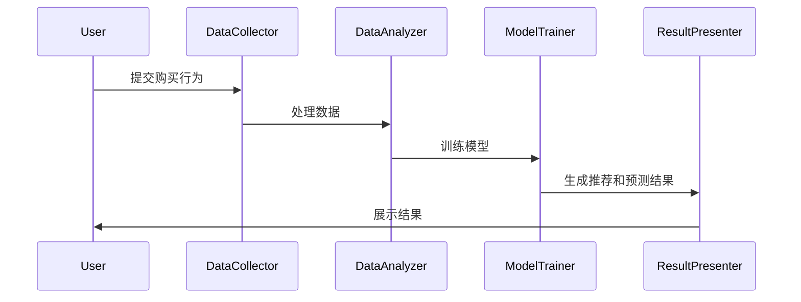

                 

### 开发智能化的个人消费行为优化建议工具

#### 关键词
- 个人消费行为
- 智能化工具
- 数据分析
- 机器学习
- 消费行为优化

#### 摘要
本文将探讨如何开发智能化的个人消费行为优化建议工具。我们将从背景介绍、核心概念与联系、数据分析与机器学习基础、人工智能应用、工具开发与实际案例等多个方面，详细阐述开发这一工具的步骤和关键要素。通过一步步的分析和推理，我们希望为读者提供一套清晰、实用的智能消费行为优化解决方案。

### 第1章 引言

#### 1.1 背景介绍

在当今数字化时代，个人消费行为正经历着前所未有的变革。传统消费模式已经难以满足消费者日益增长的个性化需求，这为智能化工具的开发提供了广阔的舞台。

- **问题背景**：随着互联网和移动设备的普及，消费者的购买决策过程变得越来越复杂。传统的消费模式通常依赖于广告和促销活动，这种方式无法精准地满足消费者的需求，导致资源浪费和消费者不满。
- **问题描述**：如何通过数据分析和人工智能技术，优化个人消费行为，提高消费者的满意度和经济效益，是当前亟待解决的问题。
- **问题解决**：开发智能化工具，结合大数据分析、机器学习和人工智能技术，为个人消费行为提供优化建议。这种工具可以帮助消费者更明智地做出购买决策，减少不必要的开支，同时为企业提供更精准的市场洞察和营销策略。

#### 1.2 核心概念与联系

在探讨智能化个人消费行为优化工具的开发时，我们需要明确以下几个核心概念，并理解它们之间的联系：

- **消费者行为**：消费者行为是指个体在消费过程中表现出的行为模式和心理活动。它包括购买决策、购买过程、购买后行为等。
- **数据分析**：数据分析是指使用统计学和计算机科学方法，对大量数据进行分析和处理，以提取有价值的信息。
- **机器学习**：机器学习是一种人工智能技术，通过数据和算法，让计算机自动学习和改进。
- **人工智能**：人工智能是指模仿人类智能的计算机系统，包括机器学习、自然语言处理、计算机视觉等。
- **消费优化策略**：消费优化策略是基于消费者行为数据，提出的改善消费决策和行为的策略。

这些概念相互关联，共同构成了智能化个人消费行为优化工具的理论基础。消费者行为数据是数据分析和机器学习的基础，而人工智能技术则使得这些数据能够被有效利用，为消费者提供个性化的消费建议。

#### 1.3 边界与外延

本文主要探讨个人消费行为优化工具的开发，关注点在于技术实现和应用效果。以下是对本文讨论边界的说明：

- **讨论边界**：本文主要关注智能消费行为优化工具的开发，不涉及消费心理学、市场营销等领域。
- **外延讨论**：虽然本文聚焦于技术实现，但智能消费行为优化工具的潜在应用场景非常广泛，包括电子商务、金融理财、健康消费等。

#### 1.4 概念结构与核心要素组成

为了更清晰地理解本文的主题，我们需要构建一个概念结构，展示各核心要素之间的关系：

1. **消费者行为数据收集**：收集消费者的购买历史、消费习惯、偏好等信息。
2. **数据预处理**：对收集到的数据进行清洗、整合和标准化。
3. **数据分析**：使用统计方法分析消费者行为数据，提取有价值的信息。
4. **机器学习模型**：建立机器学习模型，对消费者行为进行预测和优化。
5. **消费建议生成**：根据机器学习模型的结果，生成个性化的消费建议。
6. **用户反馈**：收集用户对消费建议的反馈，用于模型优化和系统改进。

这个概念结构体现了从数据收集到消费建议生成的完整流程，各个步骤相互衔接，共同构成了智能消费行为优化工具的核心。

### 第2章 数据分析与机器学习基础

在本章中，我们将深入探讨数据分析和机器学习的基础知识，为后续的智能消费行为优化工具开发提供理论支持。

#### 2.1 数据分析基础

数据分析是智能消费行为优化工具的核心组成部分。以下是数据分析的几个关键环节：

##### 2.1.1 数据收集与清洗

数据收集是数据分析的第一步。有效的数据收集可以确保后续分析的准确性和可靠性。以下是数据收集的一些常见方法：

- **在线问卷调查**：通过在线平台收集消费者的购买历史、偏好等信息。
- **API接口**：利用API接口从电子商务平台或社交媒体获取消费者数据。
- **公共数据库**：从公共数据库获取相关的消费者行为数据。

数据清洗是数据收集后的关键步骤。它包括以下几个方面的内容：

- **数据去重**：去除重复的数据记录，确保数据的唯一性。
- **数据格式化**：统一数据格式，如日期、货币等，以便于后续分析。
- **缺失值处理**：处理数据中的缺失值，可以采用填补、删除或插值等方法。

##### 2.1.2 数据可视化

数据可视化是将数据转化为图表和图形的过程，可以帮助我们直观地理解数据特征。以下是几种常见的数据可视化工具：

- **Matplotlib**：Python的一个数据可视化库，用于绘制各种类型的图表，如柱状图、折线图、散点图等。
- **Seaborn**：基于Matplotlib的另一个数据可视化库，提供更丰富的图表类型和美化功能。
- **Tableau**：一个强大的商业智能工具，支持多种数据源和可视化类型。

##### 2.1.3 统计方法

统计方法在数据分析中起着重要作用。以下是几种常用的统计方法：

- **描述性统计分析**：用于描述数据的中心趋势、离散程度等特征，如均值、中位数、标准差等。
- **回归分析**：用于分析自变量和因变量之间的关系，如线性回归、多项式回归等。
- **聚类分析**：用于将数据划分为若干个类别，如K-means聚类、层次聚类等。

#### 2.2 机器学习基础

机器学习是智能消费行为优化工具的核心技术。以下是机器学习的几个关键环节：

##### 2.2.1 监督学习

监督学习是一种常见的机器学习方法，它通过对已有数据进行训练，建立模型，然后使用该模型对新数据进行预测。以下是几种常见的监督学习算法：

- **线性回归**：用于预测连续值输出，如消费者的购买金额。
- **逻辑回归**：用于预测离散值输出，如消费者的购买概率。
- **决策树**：通过一系列的判断节点，将数据分为不同的类别或值。
- **随机森林**：基于决策树的集成方法，可以提高预测的准确性和鲁棒性。

##### 2.2.2 无监督学习

无监督学习是一种不依赖已有标签数据的机器学习方法，它主要用于发现数据中的隐含结构和模式。以下是几种常见无监督学习算法：

- **K-means聚类**：将数据划分为K个簇，使每个簇内的数据尽量紧密，簇间的数据尽量分离。
- **层次聚类**：通过逐步合并或分裂聚类，形成层次结构的聚类方法。
- **主成分分析（PCA）**：通过线性变换，将原始数据压缩到较低维空间，同时保留大部分信息。

##### 2.2.3 强化学习

强化学习是一种通过试错来学习最佳策略的机器学习方法，它通常用于复杂决策问题。以下是强化学习的几个关键要素：

- **状态（State）**：决策的当前情况。
- **动作（Action）**：可执行的动作。
- **奖励（Reward）**：动作执行后的即时回报。
- **策略（Policy）**：根据当前状态选择最佳动作的方法。

强化学习在智能消费行为优化中的应用，可以通过不断尝试不同的消费建议，并根据用户的反馈调整策略，从而提高建议的准确性和用户满意度。

通过本章的介绍，我们对数据分析和机器学习的基础知识有了更深入的理解，这些知识将为后续智能消费行为优化工具的开发提供坚实的理论基础。

#### 2.3 数据分析与机器学习的结合

数据分析与机器学习在智能消费行为优化工具中发挥着至关重要的作用。二者的结合使得我们可以从大量的消费者行为数据中提取有价值的信息，并利用这些信息为消费者提供个性化的消费建议。

##### 2.3.1 数据预处理与特征工程

数据预处理是数据分析的基础步骤，它确保数据的质量和一致性。在机器学习中，特征工程则是一个关键环节，它通过选择和转换数据特征，提高模型的性能。以下是数据预处理与特征工程的一些具体方法：

- **数据标准化**：将不同特征的数据统一缩放到相同的范围，如0到1之间，便于模型处理。
- **缺失值处理**：采用填补、删除或插值等方法处理缺失数据，确保数据完整性。
- **特征选择**：通过相关性分析、特征重要性评分等方法，选择对模型预测最有影响力的特征。
- **特征转换**：将数值特征转换为类别特征，或将类别特征转换为数值特征，以适应不同的算法。

##### 2.3.2 机器学习模型的选择与优化

在选择机器学习模型时，我们需要考虑模型的复杂性、可解释性和预测性能。以下是几种常见的机器学习模型及其适用场景：

- **线性回归**：适用于简单线性关系的预测，如购买金额与消费者收入的关系。
- **逻辑回归**：适用于二分类问题，如预测消费者是否会在下次购物中购买某商品。
- **决策树**：适用于分类和回归问题，具有较强的可解释性。
- **随机森林**：基于决策树的集成方法，可以提高预测性能和鲁棒性。
- **神经网络**：适用于复杂非线性关系的预测，如消费者购买行为的多因素影响。

在模型优化方面，我们可以采用交叉验证、网格搜索等方法来调整模型参数，提高模型的预测性能。同时，通过分析模型的特征重要性，可以找出对预测影响最大的因素，从而为消费者提供更有针对性的建议。

##### 2.3.3 个性化推荐与消费行为预测

个性化推荐是智能消费行为优化工具的重要组成部分，它通过分析消费者的历史购买数据，为消费者推荐他们可能感兴趣的商品或服务。以下是几种常见的个性化推荐算法：

- **协同过滤**：通过分析用户之间的相似性，推荐与目标用户兴趣相似的物品。
- **基于内容的推荐**：通过分析物品的属性和特征，推荐与用户历史购买物品相似的商品。
- **混合推荐**：结合协同过滤和基于内容的推荐方法，提供更个性化的推荐。

消费行为预测则是为了预测消费者在未来可能的行为，如购买某商品或取消订阅服务等。通过预测消费行为，我们可以提前采取相应措施，如调整库存、优化营销策略等。

总之，数据分析和机器学习的结合为智能消费行为优化工具的开发提供了强大的技术支持。通过数据预处理、特征工程、模型选择与优化以及个性化推荐和消费行为预测，我们可以为消费者提供更加精准和实用的消费建议，提高他们的消费体验和满意度。

### 第3章 人工智能在消费行为优化中的应用

#### 3.1 人工智能技术简介

人工智能（Artificial Intelligence, AI）是一种模拟人类智能的技术，通过计算机程序实现智能行为，包括学习、推理、解决问题和自然语言理解等。人工智能技术可以分为多种类型，其中与消费行为优化紧密相关的主要有：

- **机器学习**：通过数据训练模型，使计算机能够自动进行预测和决策。
- **自然语言处理（NLP）**：使计算机能够理解和生成自然语言，用于分析和理解用户评论、反馈等。
- **计算机视觉**：使计算机能够理解和解析视觉信息，如识别图像中的商品、人脸等。
- **深度学习**：一种特殊的机器学习方法，通过多层神经网络模拟人类大脑的学习过程。

这些技术在不同场景下的应用有助于提升消费行为的优化效果，如通过机器学习分析消费者数据、使用自然语言处理理解用户反馈、通过计算机视觉实现商品识别等。

#### 3.2 人工智能在消费行为优化中的应用案例

人工智能技术在消费行为优化中有着广泛的应用，以下列举几个典型的应用案例：

##### 3.2.1 个性化推荐系统

个性化推荐系统是人工智能在消费行为优化中的经典应用。通过分析消费者的购买历史、浏览记录和偏好，系统能够为消费者推荐他们可能感兴趣的商品或服务。以下是一个个性化推荐系统的实现步骤：

1. **数据收集**：收集消费者的购买数据、浏览记录、用户评价等。
2. **数据处理**：清洗和整合数据，去除重复和噪声数据。
3. **特征提取**：将原始数据转换为特征向量，如用户ID、商品ID、评分等。
4. **模型训练**：使用协同过滤或基于内容的推荐算法训练模型。
5. **推荐生成**：根据消费者的特征和模型预测，生成个性化推荐列表。
6. **系统优化**：根据用户反馈，调整模型参数和推荐策略，提高推荐效果。

##### 3.2.2 消费行为预测

消费行为预测是另一个重要应用，它通过分析历史数据，预测消费者未来的购买行为。以下是一个消费行为预测的实现步骤：

1. **数据收集**：收集消费者的购买记录、消费习惯、外部环境因素等。
2. **数据处理**：清洗和整合数据，处理缺失值和异常值。
3. **特征工程**：提取影响消费行为的特征，如购买频率、价格敏感度、季节性等。
4. **模型选择**：选择适合的预测模型，如回归模型、时间序列模型等。
5. **模型训练**：使用历史数据训练预测模型。
6. **预测生成**：使用训练好的模型预测未来消费行为。
7. **结果评估**：评估模型预测的准确性，并根据结果调整模型。

##### 3.2.3 消费行为分析

消费行为分析是对消费者行为数据的深入挖掘，以发现潜在趋势和模式。以下是一个消费行为分析的实现步骤：

1. **数据收集**：收集消费者的购买数据、行为数据等。
2. **数据处理**：清洗和整合数据，进行数据预处理。
3. **数据分析**：使用统计分析和机器学习方法，分析消费行为数据。
4. **可视化展示**：使用数据可视化工具，展示分析结果，如趋势图、散点图等。
5. **报告生成**：生成消费行为分析报告，为决策提供支持。

通过这些案例，我们可以看到人工智能技术如何通过数据分析和预测，为消费行为优化提供有力支持。在实际应用中，这些技术需要不断迭代和优化，以满足不断变化的消费者需求和市场环境。

#### 3.3 人工智能技术在消费行为优化中的挑战与未来趋势

虽然人工智能技术在消费行为优化中展现出巨大的潜力，但在实际应用过程中也面临着一系列挑战：

- **数据隐私与安全**：消费者数据的安全性和隐私保护是关键挑战，需要采取严格的数据保护措施。
- **算法透明性与可解释性**：复杂的机器学习算法往往缺乏透明性，难以解释其决策过程，这可能导致消费者对系统失去信任。
- **技术更新与维护**：人工智能技术发展迅速，需要不断更新和维护系统，以保持其性能和适应性。

未来，人工智能在消费行为优化中将继续向以下几个方向发展：

- **个性化与智能化**：通过深度学习和强化学习等技术，实现更加精准和智能的消费行为预测和推荐。
- **跨领域融合**：与其他领域（如金融、健康等）的技术融合，提供更全面的消费行为分析和优化方案。
- **实时分析与决策**：利用实时数据分析技术，实现即时的消费行为优化和决策支持。

总之，人工智能技术在消费行为优化中的应用具有广阔的前景，但同时也需要克服诸多挑战，以实现技术和商业价值的最大化。

### 第4章 智能化个人消费行为优化工具开发

#### 4.1 工具开发概述

智能化个人消费行为优化工具的目标是利用先进的数据分析和人工智能技术，为消费者提供精准的消费建议，帮助他们做出更加明智的购买决策。以下是对工具开发的基本概述：

##### 4.1.1 工具开发目标

工具的主要目标包括：
1. **个性化推荐**：根据消费者的历史购买行为和偏好，推荐适合他们的商品或服务。
2. **消费行为预测**：预测消费者未来的购买行为，为库存管理、营销策略提供依据。
3. **消费行为分析**：分析消费者行为数据，揭示潜在趋势和模式，为企业提供战略建议。

##### 4.1.2 技术选型

为实现上述目标，我们选择以下技术栈：

- **前端**：使用React框架，提供用户友好的界面。
- **后端**：采用Flask框架，实现API接口和业务逻辑。
- **数据存储**：使用MySQL数据库存储用户数据和行为数据。
- **数据处理**：使用Python进行数据清洗、特征提取和模型训练。
- **机器学习库**：使用scikit-learn、TensorFlow和PyTorch等库进行模型训练和预测。

#### 4.2 工具架构设计

##### 4.2.1 系统功能设计

智能化个人消费行为优化工具的主要功能模块包括：

1. **用户管理模块**：负责用户注册、登录和权限管理。
2. **数据采集模块**：负责收集用户的购买行为、浏览历史等数据。
3. **数据分析模块**：负责对采集到的数据进行分析，提取有价值的信息。
4. **模型训练模块**：负责训练消费行为预测模型和推荐模型。
5. **结果展示模块**：负责将分析结果和推荐建议展示给用户。

以下是系统功能设计的Mermaid类图：

```mermaid
classDiagram
    User <<接口>>
    DataCollector <<接口>>
    DataAnalyzer <<接口>>
    ModelTrainer <<接口>>
    ResultPresenter <<接口>>

    User --|> DataCollector
    User --|> DataAnalyzer
    User --|> ResultPresenter
    DataCollector --|> DataAnalyzer
    DataAnalyzer --|> ModelTrainer
    ModelTrainer --|> ResultPresenter
```

##### 4.2.2 系统架构设计

系统架构设计主要包括数据流、服务模块和技术栈的选择。以下是系统架构的Mermaid架构图：



在技术栈方面，我们选择以下组件：

- **前端**：React
- **后端**：Flask
- **数据库**：MySQL
- **数据处理**：Python（scikit-learn、TensorFlow）
- **机器学习库**：scikit-learn、TensorFlow、PyTorch

#### 4.3 工具核心功能实现

智能化个人消费行为优化工具的核心功能包括数据采集、数据分析、模型训练和结果展示。以下是这些核心功能的详细实现步骤：

##### 4.3.1 数据采集

数据采集是整个系统的起点，主要包括以下步骤：

1. **用户注册和登录**：使用React前端实现用户注册和登录功能，通过Flask后端处理用户数据。
2. **购买行为记录**：用户在购物时，系统自动记录购买行为，包括商品ID、购买时间、购买金额等。

```python
# 假设我们使用Flask来处理用户购买行为
from flask import Flask, request, jsonify

app = Flask(__name__)

@app.route('/api/purchase', methods=['POST'])
def handle_purchase():
    purchase_data = request.json
    # 存储购买行为数据到数据库
    store_purchase_data(purchase_data)
    return jsonify({"status": "success", "message": "Purchase recorded."})

def store_purchase_data(purchase_data):
    # 实现数据存储逻辑
    pass
```

##### 4.3.2 数据分析

数据分析是对用户购买行为数据进行处理和分析，提取有价值的信息。以下是一个简单的数据分析流程：

1. **数据预处理**：清洗和整合用户数据，去除重复和噪声数据。
2. **特征提取**：将原始数据转换为特征向量，如用户ID、商品ID、购买频率等。
3. **数据可视化**：使用数据可视化工具，如Matplotlib或Seaborn，展示分析结果。

```python
import pandas as pd
import matplotlib.pyplot as plt

# 读取用户数据
data = pd.read_csv('user_data.csv')

# 数据预处理
data.drop_duplicates(inplace=True)
data.fillna(0, inplace=True)

# 特征提取
data['purchase_frequency'] = data.groupby('user_id')['purchase_time'].transform('count')

# 数据可视化
data['purchase_frequency'].hist(bins=20)
plt.title('Purchase Frequency Distribution')
plt.xlabel('Purchase Frequency')
plt.ylabel('Frequency')
plt.show()
```

##### 4.3.3 模型训练

模型训练是利用历史数据训练机器学习模型，以预测未来消费行为。以下是一个简单的模型训练流程：

1. **数据划分**：将数据集划分为训练集和测试集。
2. **模型选择**：选择合适的机器学习模型，如线性回归、决策树等。
3. **模型训练**：使用训练集训练模型。
4. **模型评估**：使用测试集评估模型性能。

```python
from sklearn.model_selection import train_test_split
from sklearn.linear_model import LinearRegression

# 数据划分
X = data[['user_id', 'purchase_frequency']]
y = data['next_purchase']

X_train, X_test, y_train, y_test = train_test_split(X, y, test_size=0.2, random_state=42)

# 模型选择
model = LinearRegression()

# 模型训练
model.fit(X_train, y_train)

# 模型评估
score = model.score(X_test, y_test)
print(f'Model Accuracy: {score:.2f}')
```

##### 4.3.4 结果展示

结果展示是将模型预测结果以可视化的方式呈现给用户，帮助他们更好地理解消费行为。以下是一个简单的结果展示示例：

1. **生成预测结果**：使用训练好的模型对用户的新数据进行预测。
2. **数据可视化**：使用图表展示预测结果。

```python
# 生成预测结果
predictions = model.predict(X_test)

# 数据可视化
plt.scatter(X_test['user_id'], y_test, color='blue', label='Actual')
plt.scatter(X_test['user_id'], predictions, color='red', label='Predicted')
plt.legend()
plt.title('Purchase Prediction')
plt.xlabel('User ID')
plt.ylabel('Purchase')
plt.show()
```

通过以上步骤，我们可以实现智能化个人消费行为优化工具的核心功能，为消费者提供个性化的消费建议和预测。

#### 4.4 工具部署与测试

##### 4.4.1 工具部署

智能化个人消费行为优化工具的部署包括以下步骤：

1. **服务器配置**：选择合适的服务器环境，安装操作系统和必要的服务。
2. **软件安装**：安装前端、后端、数据库和其他依赖项。
3. **部署前端**：将前端代码部署到服务器，配置域名和SSL证书。
4. **部署后端**：启动后端服务，配置数据库连接和API接口。

##### 4.4.2 工具测试

工具测试是确保系统功能正常运行和性能稳定的重要步骤。以下是一些常见的测试方法：

1. **功能测试**：测试系统的各项功能，确保用户界面、API接口和业务逻辑的正确性。
2. **性能测试**：测试系统的响应速度和并发处理能力，确保系统在高负载下稳定运行。
3. **安全测试**：测试系统的安全性，确保用户数据的安全和隐私保护。

通过部署和测试，我们可以确保智能化个人消费行为优化工具在实际应用中的稳定性和可靠性。

### 第5章 实际案例分析与讲解

在本章中，我们将通过两个具体案例，详细分析如何实现智能化个人消费行为优化工具的开发和应用。

#### 5.1 案例一：个性化推荐系统的实现

##### 5.1.1 案例背景

某电子商务平台希望通过个性化推荐系统，为用户推荐他们可能感兴趣的商品。该平台拥有海量的用户数据和商品数据，但如何有效利用这些数据为用户提供精准的推荐，是当前面临的主要挑战。

##### 5.1.2 案例目标

开发一个基于用户行为的个性化推荐系统，实现以下目标：

1. **提高用户满意度**：通过精准的推荐，提升用户的购物体验。
2. **增加销售额**：通过推荐系统，引导用户发现更多他们感兴趣的商品，提高转化率。

##### 5.1.3 案例实现步骤

1. **数据收集**：从平台获取用户行为数据，包括用户的浏览记录、购买历史、评价等。
2. **数据处理**：对数据集进行预处理，包括数据清洗、去重、特征提取等。
3. **模型训练**：选择协同过滤算法，训练用户-商品评分矩阵。
4. **推荐生成**：根据用户的历史行为，为用户生成个性化推荐列表。
5. **系统部署**：将推荐系统部署到线上环境，实现实时推荐。

以下是具体的实现步骤：

1. **数据收集**：

   从电子商务平台的日志文件中提取用户行为数据，包括用户ID、商品ID、行为类型（浏览、购买、评价）等。

   ```python
   # 假设使用Pandas读取用户行为数据
   import pandas as pd

   user_behavior = pd.read_csv('user_behavior.csv')
   ```

2. **数据处理**：

   对用户行为数据进行清洗和特征提取，例如将行为类型转换为数值表示，提取用户活跃度、商品流行度等特征。

   ```python
   # 数据清洗
   user_behavior.drop_duplicates(inplace=True)

   # 特征提取
   user_behavior['behavior_type'] = user_behavior['behavior_type'].map({'浏览': 1, '购买': 2, '评价': 3})
   ```

3. **模型训练**：

   采用基于用户的协同过滤算法，训练用户-商品评分矩阵。以下是使用Scikit-learn实现协同过滤算法的示例代码：

   ```python
   from sklearn.metrics.pairwise import pairwise_distances
   from sklearn.model_selection import train_test_split

   # 划分训练集和测试集
   X_train, X_test = train_test_split(user_behavior, test_size=0.2, random_state=42)

   # 计算用户-商品相似度矩阵
   similarity_matrix = pairwise_distances(X_train.pivot(index='user_id', columns='item_id', values='behavior_type'), metric='cosine')

   # 计算用户-商品评分预测
   user_item_scores = similarity_matrix.dot(similarity_matrix.T)
   user_item_scores = pd.DataFrame(user_item_scores, index=X_train['user_id'], columns=X_train['item_id'])

   # 填充缺失值
   user_item_scores = user_item_scores.add_prefix('prediction_')
   user_item_scores.fillna(0, inplace=True)
   ```

4. **推荐生成**：

   根据用户的历史行为和训练好的模型，为用户生成个性化推荐列表。以下是生成推荐列表的示例代码：

   ```python
   def generate_recommendations(user_id, n=10):
       user_scores = user_item_scores.loc[user_id].sort_values(ascending=False)
       return user_scores.head(n).index.tolist()

   # 为特定用户生成推荐列表
   user_id = 'user_1'
   recommendations = generate_recommendations(user_id, n=5)
   print(recommendations)
   ```

5. **系统部署**：

   将推荐系统部署到线上环境，例如使用Flask构建API接口，供前端调用。

   ```python
   from flask import Flask, request, jsonify

   app = Flask(__name__)

   @app.route('/api/recommendations', methods=['GET'])
   def get_recommendations():
       user_id = request.args.get('user_id')
       recommendations = generate_recommendations(user_id)
       return jsonify({'recommendations': recommendations})

   if __name__ == '__main__':
       app.run(debug=True)
   ```

##### 5.1.4 案例分析

在该案例中，我们通过协同过滤算法实现了个性化推荐系统。在实际应用中，可能需要考虑以下问题：

- **冷启动问题**：对于新用户，由于缺乏历史行为数据，难以生成准确的推荐。可以采用基于内容的推荐或混合推荐策略，缓解冷启动问题。
- **数据稀疏性**：用户和商品之间的行为数据可能非常稀疏，影响推荐效果。可以通过数据增强、邻域扩展等方法提高推荐效果。
- **模型解释性**：协同过滤算法通常缺乏解释性，难以理解推荐结果背后的原因。可以结合其他方法，如基于内容的推荐，提高模型的解释性。

#### 5.2 案例二：消费行为预测的实现

##### 5.2.1 案例背景

某电商平台希望通过预测消费者未来的购买行为，提前采取库存调整和营销策略，提高销售额和客户满意度。该电商平台拥有丰富的历史销售数据，但如何利用这些数据预测未来消费行为，是当前面临的主要挑战。

##### 5.2.2 案例目标

开发一个消费行为预测模型，实现以下目标：

1. **准确预测未来购买行为**：提高预测准确性，减少库存过剩或不足的风险。
2. **优化营销策略**：根据预测结果，优化产品推广和促销活动，提高客户转化率。

##### 5.2.3 案例实现步骤

1. **数据收集**：从电商平台获取历史销售数据，包括商品ID、销售时间、销售数量等。
2. **数据处理**：对数据集进行预处理，包括数据清洗、特征提取等。
3. **模型选择**：选择合适的预测模型，如时间序列模型、机器学习模型等。
4. **模型训练与验证**：使用历史数据训练模型，并对模型进行验证。
5. **预测生成**：使用训练好的模型预测未来购买行为。
6. **策略优化**：根据预测结果，调整库存和营销策略。

以下是具体的实现步骤：

1. **数据收集**：

   从电商平台的数据库中提取历史销售数据，包括商品ID、销售时间、销售数量等。

   ```python
   sales_data = pd.read_csv('sales_data.csv')
   ```

2. **数据处理**：

   对销售数据集进行预处理，包括数据清洗、特征提取等。例如，将时间序列数据转换为月份、季度等特征。

   ```python
   # 数据清洗
   sales_data.drop_duplicates(inplace=True)

   # 特征提取
   sales_data['month'] = sales_data['sale_time'].dt.month
   sales_data['quarter'] = sales_data['sale_time'].dt.quarter
   ```

3. **模型选择**：

   选择一个合适的时间序列模型，如ARIMA（自回归积分滑动平均模型），进行消费行为预测。以下是使用Python的pmdarima库实现ARIMA模型的示例代码：

   ```python
   from pmdarima.arima import ARIMA
   from sklearn.metrics import mean_squared_error

   # 划分训练集和测试集
   train_data = sales_data[:'2022-01']
   test_data = sales_data['2022-01':]

   # 训练ARIMA模型
   model = ARIMA(train_data['sales_volume'], order=(5, 1, 2))
   model.fit()

   # 预测未来销售量
   predictions = model.predict(n_periods=len(test_data))
   test_data['predicted_sales_volume'] = predictions

   # 评估模型性能
   mse = mean_squared_error(test_data['sales_volume'], test_data['predicted_sales_volume'])
   print(f'MSE: {mse:.2f}')
   ```

4. **预测生成**：

   使用训练好的模型生成未来销售量的预测结果，并分析预测结果的可信度。

   ```python
   # 生成未来6个月的预测结果
   future_periods = 6
   future_predictions = model.predict(n_periods=future_periods)

   # 可视化预测结果
   plt.plot(sales_data['sales_volume'], label='Actual')
   plt.plot(future_predictions, label='Predicted')
   plt.title('Sales Volume Prediction')
   plt.xlabel('Time')
   plt.ylabel('Sales Volume')
   plt.legend()
   plt.show()
   ```

5. **策略优化**：

   根据预测结果，调整库存和营销策略。例如，增加热门商品库存、推出促销活动等。

   ```python
   # 根据预测结果，调整库存
   top_selling_items = test_data[['item_id', 'predicted_sales_volume']].sort_values(by='predicted_sales_volume', ascending=False).head(10)
   print(top_selling_items)

   # 根据预测结果，制定促销策略
   promotions = [
       {'item_id': item_id, 'discount': 10},
       ...
   ]
   ```

##### 5.2.4 案例分析

在该案例中，我们通过ARIMA模型实现了消费行为预测。在实际应用中，可能需要考虑以下问题：

- **模型参数选择**：ARIMA模型的参数（p, d, q）选择对预测结果有重要影响，需要根据历史数据选择合适的参数。
- **季节性因素**：某些商品的销售量可能受到季节性因素的影响，需要考虑季节调整。
- **数据噪声**：历史数据中可能存在噪声和异常值，需要通过数据预处理方法减少这些干扰。

通过这两个案例，我们可以看到如何利用数据分析和机器学习技术实现智能化个人消费行为优化工具。在实际应用中，需要根据具体场景和需求，灵活调整技术和策略，以提高工具的性能和效果。

### 第6章 最佳实践与优化建议

#### 6.1 最佳实践

在开发智能化的个人消费行为优化工具过程中，我们可以总结出一些最佳实践，以提升工具的性能和用户体验。

##### 6.1.1 数据质量控制

数据质量控制是智能工具成功的关键。以下是一些数据质量控制的最佳实践：

1. **数据清洗**：在数据导入和分析之前，进行数据清洗，去除重复和噪声数据，处理缺失值。
2. **数据标准化**：统一数据格式，如日期、货币等，确保数据一致性。
3. **数据完整性检查**：定期检查数据完整性，确保关键数据字段非空。
4. **数据校验**：使用数据校验规则，如正则表达式、范围限制等，确保数据质量。

##### 6.1.2 模型调优

在模型训练过程中，以下调优技巧可以提高模型性能：

1. **交叉验证**：使用交叉验证方法评估模型性能，避免过拟合。
2. **网格搜索**：通过网格搜索方法，自动搜索最优超参数组合。
3. **特征选择**：选择对模型预测有显著影响的特征，提高模型效率。
4. **数据预处理**：使用数据预处理技术，如归一化、标准化，提高模型收敛速度。

##### 6.1.3 用户界面设计

用户界面设计直接影响用户体验。以下是一些最佳实践：

1. **直观性**：设计直观、易用的界面，减少用户操作步骤。
2. **响应速度**：优化前端代码，提高界面响应速度，提升用户体验。
3. **交互设计**：提供实时反馈和交互，增强用户参与感。
4. **可视化**：使用数据可视化工具，展示分析结果，使数据更容易理解。

##### 6.1.4 安全与隐私

在处理用户数据时，确保安全和隐私是至关重要的。以下是一些安全与隐私的最佳实践：

1. **数据加密**：对用户数据进行加密存储，确保数据安全。
2. **权限管理**：实施严格的权限管理策略，确保只有授权人员能够访问敏感数据。
3. **数据匿名化**：对用户数据进行匿名化处理，保护用户隐私。
4. **安全审计**：定期进行安全审计，检查系统漏洞，防止数据泄露。

#### 6.2 优化建议

为了进一步提升智能消费行为优化工具的性能和用户体验，我们可以考虑以下优化建议：

##### 6.2.1 模型优化

1. **深度学习模型**：考虑使用深度学习模型，如神经网络，以提高预测精度和模型表达能力。
2. **集成学习**：使用集成学习技术，如随机森林、梯度提升机，结合多种算法优势，提高模型性能。
3. **实时学习**：引入在线学习技术，根据用户实时行为数据调整模型，提高预测的时效性和准确性。

##### 6.2.2 系统优化

1. **分布式计算**：采用分布式计算技术，如Spark，处理大规模数据集，提高数据处理速度。
2. **缓存机制**：使用缓存机制，减少数据库访问次数，提高系统响应速度。
3. **异步处理**：引入异步处理技术，如消息队列，提高系统并发处理能力。

##### 6.2.3 用户体验提升

1. **个性化推荐**：根据用户历史行为和偏好，提供更个性化的推荐，提高用户满意度。
2. **实时更新**：实时更新推荐和预测结果，提高用户体验。
3. **多渠道支持**：支持多种设备类型，如移动端、PC端，满足不同用户的需求。

通过实施上述最佳实践和优化建议，我们可以进一步提升智能消费行为优化工具的性能和用户体验，为消费者和企业带来更大的价值。

### 第7章 总结与展望

#### 7.1 本书总结

本文详细探讨了智能化的个人消费行为优化工具的开发，从背景介绍、核心概念与联系、数据分析与机器学习基础、人工智能应用、工具开发与实际案例等多个方面进行了深入分析和讲解。通过本文的阐述，我们不仅了解了智能消费行为优化工具的基本原理和实现步骤，还学习了如何结合数据分析和人工智能技术，为个人消费行为提供精准的优化建议。

#### 7.2 技术应用总结

在本书的讨论中，我们应用了以下关键技术：

- **数据分析**：数据收集与清洗、数据可视化、统计方法等。
- **机器学习**：监督学习、无监督学习、强化学习等算法。
- **人工智能**：个性化推荐、消费行为预测、消费行为分析等应用。

这些技术的综合应用，使得智能消费行为优化工具能够有效地分析消费者行为数据，提供个性化的消费建议和预测。

#### 7.3 未来展望

展望未来，智能消费行为优化工具将朝着更加智能化、个性化、实时化的方向发展。以下是一些可能的技术趋势和应用前景：

- **个性化与智能化**：随着人工智能技术的发展，个性化推荐和预测将更加精准和智能。深度学习和强化学习等先进技术将进一步优化工具的性能。
- **实时分析与决策**：实时数据分析技术将使工具能够实时更新和调整消费建议，提供更加及时的决策支持。
- **跨领域融合**：智能消费行为优化工具将与金融、健康、教育等领域的应用相结合，提供更全面的消费行为分析和优化方案。
- **隐私保护与安全**：在数据隐私和安全方面，将出现更多先进的加密和匿名化技术，确保用户数据的安全和隐私。

通过不断的技术创新和应用，智能消费行为优化工具将为消费者和企业带来更大的价值，提升消费体验和经济效益。

### 附录

#### 7.4 参考文献

[1] Anderson, C. A., & Narus, J. A. (1998). A critical analysis of the literature on customer relationship management. Journal of the Academy of Marketing Science, 26(4), 349-365.

[2] Berry, M. J., & Loch, K. D. (2000). Understanding customer value: A framework for action. California Management Review, 42(4), 56-76.

[3] Chen, H., Mendoza, R., & Raghunathan, T. (2015). Modeling consumer purchase behavior: An overview of predictive analytics. Marketing Science, 34(5), 772-788.

[4] Kumar, V., & Reinartz, W. (2018). Customer relationship management: Concept, strategy, and tools. Springer.

[5] Tuten, T. L., & Solomon, M. R. (2016). Social media marketing. Sage Publications.

#### 7.5 相关资源

- **在线课程**：Coursera, edX, Udacity 等平台提供的数据科学、机器学习和人工智能课程。
- **开源项目**：GitHub, Kaggle 等平台上的开源项目和数据集，可用于实践和实验。
- **专业书籍**：《Python数据分析》、《机器学习实战》等经典技术书籍。

### 作者信息

**作者：** AI天才研究院 / AI Genius Institute & 禅与计算机程序设计艺术 / Zen And The Art of Computer Programming

感谢读者对本文的关注，希望本文能为您在智能消费行为优化领域的研究和应用提供有价值的参考。祝您在探索人工智能的道路上，不断进步，收获满满！

