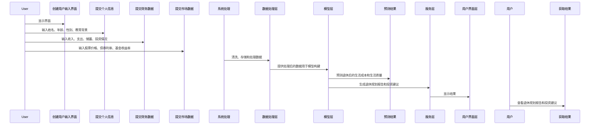

                 

### 第1章：引言与背景介绍

#### 1.1 问题背景与核心概念

**1.1.1 问题背景**

随着社会经济的发展和医疗技术的进步，人们的平均寿命不断延长，退休时间也随之延长。然而，传统的退休规划方式往往缺乏个性化、动态调整和智能决策支持，无法很好地应对当前的经济不确定性和生活成本变化。这使得个人退休规划成为了一个亟待解决的重要问题。

首先，退休规划的重要性不言而喻。退休规划不仅仅是为了保障退休后的基本生活，更是为了提高生活质量、实现财务自由的重要手段。通过合理的退休规划，个人可以在退休后保持稳定的经济来源，避免因经济困境而影响生活品质。

然而，当前退休规划面临诸多挑战。一方面，寿命延长导致退休时间的延长，需要个人具备更长远的财务储备能力。另一方面，经济不确定性，如全球经济波动、通货膨胀等，增加了退休规划的难度。此外，退休后的生活方式与工作期间可能存在显著差异，需要合理预测和规划生活成本。

**1.1.2 核心概念**

为了解决上述问题，引入智能化个人退休规划助手成为一个可行的方案。下面我们来定义一些核心概念：

**退休规划**：
退休规划是指为保障退休后生活质量而进行的财务规划。具体来说，它包括目标设定、资源评估、资产配置和调整策略。

**个人退休规划**：
个人退休规划是指为保障退休后生活质量而进行的个人财务规划过程，包括目标设定、资源评估、资产配置和调整策略。个人退休规划需要根据个人的实际情况来制定，具有个性化特点。

**智能化个人退休规划**：
智能化个人退休规划是指利用人工智能技术，辅助进行个人退休规划的智能化工具和方法。它通过数据分析和智能决策支持，为个人提供更加精准和动态的退休规划方案。

**智能化个人退休规划助手**：
智能化个人退休规划助手是指一种利用人工智能技术构建的、用于辅助个人进行退休规划的工具。它具备数据驱动的决策、动态调整和用户友好等特点，能够根据用户的财务状况和市场变化，提供个性化的退休规划建议。

通过上述核心概念的定义，我们可以看出智能化个人退休规划助手在解决传统退休规划问题方面具有巨大的潜力。

#### 1.2 核心概念

**1.2.1 个人退休规划的定义**

个人退休规划是指为保障退休后生活质量而进行的财务规划过程。具体包括以下几个步骤：

1. **目标设定**：明确个人退休后的生活目标，包括生活品质、娱乐活动、旅行计划等。
2. **资源评估**：评估个人的财务资源，包括收入、储蓄、投资等。
3. **资产配置**：根据资源评估结果，制定合理的资产配置策略，包括投资品种的选择、比例的分配等。
4. **调整策略**：根据市场变化和个人情况的变化，动态调整退休规划策略，确保目标的实现。

**1.2.2 智能化个人退休规划的定义**

智能化个人退休规划是指利用人工智能技术，辅助进行个人退休规划的智能化工具和方法。它通过以下几个方面实现智能化：

1. **数据驱动**：利用大数据分析技术，收集和处理大量的财务数据，为退休规划提供数据支持。
2. **智能决策**：通过机器学习算法，分析用户的财务状况和退休目标，提供个性化的退休规划建议。
3. **动态调整**：根据市场变化和个人情况的变化，自动调整退休规划策略，确保规划的可行性。

**1.2.3 智能化个人退休规划助手的特点**

智能化个人退休规划助手具有以下几个特点：

1. **数据驱动的决策**：通过大数据分析，准确了解用户的财务状况和退休目标，提供精准的规划建议。
2. **动态调整**：根据市场变化和个人情况的变化，自动调整退休规划策略，确保规划的实时性和可行性。
3. **用户友好**：提供简单易用的界面和交互方式，帮助用户轻松管理退休规划，提高使用体验。

通过以上对核心概念的介绍，我们可以更好地理解智能化个人退休规划助手在个人退休规划中的重要作用。

### 1.3 智能化个人退休规划助手的架构

智能化个人退休规划助手是一个复杂的应用系统，其架构设计需要考虑多个方面，包括用户界面层、数据处理层、模型层和服务层。下面将详细介绍这些层次的功能和作用。

**1.3.1 用户界面层**

用户界面层是用户与智能化个人退休规划助手交互的入口，它主要负责以下功能：

1. **用户输入**：提供用户输入数据的界面，如个人基本信息、财务状况、退休目标等。
2. **展示结果**：将退休规划的结果以图表、文字等形式展示给用户，便于用户理解和决策。
3. **交互反馈**：接收用户的反馈信息，如修改退休目标、调整投资策略等。

用户界面层的设计需要考虑用户体验，界面应简洁明了，易于操作，同时具备良好的交互反馈机制。

**1.3.2 数据处理层**

数据处理层是智能化个人退休规划助手中的核心组件，主要负责以下功能：

1. **数据清洗**：对用户输入的数据进行清洗和处理，确保数据的准确性和完整性。
2. **数据存储**：将清洗后的数据存储到数据库中，为后续分析和处理提供数据支持。
3. **数据融合**：将不同来源的数据进行融合处理，形成统一的视图，便于分析。

数据处理层需要具备高效的数据处理能力，能够处理大量数据，并确保数据的准确性和一致性。

**1.3.3 模型层**

模型层是智能化个人退休规划助手中的智能决策引擎，主要负责以下功能：

1. **模型构建**：根据用户的退休目标和财务状况，构建用于预测和决策的模型。
2. **模型训练**：利用历史数据和机器学习算法，对模型进行训练和优化，提高模型的准确性。
3. **模型应用**：将训练好的模型应用于实际场景，为用户提供个性化的退休规划建议。

模型层的设计需要考虑模型的灵活性和适应性，能够根据用户的需求和市场变化，动态调整模型参数。

**1.3.4 服务层**

服务层是智能化个人退休规划助手中的核心功能层，主要负责以下功能：

1. **投资策略推荐**：根据用户的退休目标和风险偏好，推荐最优的投资组合。
2. **生活方式规划**：预测退休后的生活成本，规划退休资金的使用。
3. **动态调整**：根据市场变化和个人情况的变化，自动调整退休规划策略。

服务层的设计需要考虑功能的全面性和灵活性，能够满足不同用户的需求。

通过以上对智能化个人退休规划助手架构的介绍，我们可以看出，该系统是一个高度集成和智能化的应用，通过用户界面层、数据处理层、模型层和服务层的协同工作，为用户提供个性化的退休规划服务。

### 1.4 小结

本章介绍了个人退休规划的重要性和当前面临的挑战，以及智能化个人退休规划的概念和特点。接下来，本书将深入探讨如何构建智能化个人退休规划助手，以及如何通过算法和系统设计来实现这一目标。在接下来的章节中，我们将详细分析人工智能与退休规划的关系，探讨构建智能化个人退休规划助手的步骤和方法，以及相关技术细节。希望读者能够通过本章的介绍，对智能化个人退休规划有一个初步的了解，并为后续章节的学习打下基础。

---

# 第二部分：人工智能与退休规划的关系

## 第2章：人工智能与退休规划的关系

### 2.1 人工智能在金融领域的发展

#### 2.1.1 人工智能的定义与发展

**2.1.1.1 人工智能的定义**

人工智能（Artificial Intelligence, AI）是指模拟、延伸和扩展人的智能的理论、方法、技术及应用。它是计算机科学的一个分支，致力于通过计算机模拟人类的认知过程，实现智能体的自主学习和自主决策。

人工智能的发展可以追溯到20世纪50年代，当时图灵提出了图灵测试，旨在判断机器是否具有人类水平的智能。随着计算机性能的提升和大数据技术的普及，人工智能逐渐从理论研究走向实际应用，成为推动社会进步的重要力量。

**2.1.1.2 人工智能在金融领域的发展**

人工智能在金融领域的发展非常迅速，其主要应用包括以下几个方面：

1. **风险管理**：通过数据分析和机器学习算法，人工智能可以帮助金融机构预测市场波动、识别潜在风险，从而优化投资组合。

2. **客户服务**：利用自然语言处理（Natural Language Processing, NLP）技术，人工智能可以实现智能客服、语音助手等功能，提供个性化、高效的服务。

3. **自动化交易**：人工智能算法可以自动化交易决策，实现高频交易、算法交易等，提高交易效率和收益。

#### 2.1.2 人工智能在退休规划中的应用潜力

**2.1.2.1 数据分析能力**

人工智能在退休规划中的首要应用是其强大的数据分析能力。具体来说，它包括以下几个方面：

1. **财务数据挖掘**：通过大数据分析技术，人工智能可以挖掘用户的财务数据，包括收入、储蓄、投资等，了解用户的财务状况。

2. **市场趋势分析**：人工智能可以分析宏观经济数据、市场走势，预测未来的通货膨胀率、利率变化等，为退休规划提供数据支持。

**2.1.2.2 智能决策支持**

除了数据分析，人工智能在退休规划中还可以提供智能决策支持。这包括：

1. **投资策略**：根据用户的退休目标和风险偏好，人工智能可以推荐最优的投资组合，实现资产的最优配置。

2. **生活方式规划**：人工智能可以预测退休后的生活成本，为用户规划退休资金的使用，确保退休后的生活质量。

**2.1.3 人工智能在退休规划中的挑战**

尽管人工智能在退休规划中具有巨大的潜力，但同时也面临着一些挑战：

**2.1.3.1 数据隐私和安全**

数据隐私和安全是人工智能在退休规划中需要重点关注的问题。用户的财务数据涉及隐私，如何确保这些数据的安全性和隐私性，是人工智能在退休规划中必须解决的问题。

**2.1.3.2 技术成熟度和适应性**

人工智能技术在退休规划中的应用仍处于发展阶段，其成熟度和适应性需要进一步验证。如何确保人工智能技术在退休规划中的可靠性，是当前面临的挑战之一。

### 2.2 智能化个人退休规划助手的架构

**2.2.1 整体架构**

智能化个人退休规划助手是一个复杂的应用系统，其整体架构包括用户界面层、数据处理层、模型层和服务层。以下是各层的具体功能和作用：

**1. 用户界面层**

用户界面层是用户与智能化个人退休规划助手交互的入口，主要负责以下功能：

- **用户输入**：提供用户输入数据的界面，如个人基本信息、财务状况、退休目标等。
- **展示结果**：将退休规划的结果以图表、文字等形式展示给用户，便于用户理解和决策。
- **交互反馈**：接收用户的反馈信息，如修改退休目标、调整投资策略等。

用户界面层的设计需要考虑用户体验，界面应简洁明了，易于操作，同时具备良好的交互反馈机制。

**2. 数据处理层**

数据处理层是智能化个人退休规划助手中的核心组件，主要负责以下功能：

- **数据清洗**：对用户输入的数据进行清洗和处理，确保数据的准确性和完整性。
- **数据存储**：将清洗后的数据存储到数据库中，为后续分析和处理提供数据支持。
- **数据融合**：将不同来源的数据进行融合处理，形成统一的视图，便于分析。

数据处理层需要具备高效的数据处理能力，能够处理大量数据，并确保数据的准确性和一致性。

**3. 模型层**

模型层是智能化个人退休规划助手中的智能决策引擎，主要负责以下功能：

- **模型构建**：根据用户的退休目标和财务状况，构建用于预测和决策的模型。
- **模型训练**：利用历史数据和机器学习算法，对模型进行训练和优化，提高模型的准确性。
- **模型应用**：将训练好的模型应用于实际场景，为用户提供个性化的退休规划建议。

模型层的设计需要考虑模型的灵活性和适应性，能够根据用户的需求和市场变化，动态调整模型参数。

**4. 服务层**

服务层是智能化个人退休规划助手中的核心功能层，主要负责以下功能：

- **投资策略推荐**：根据用户的退休目标和风险偏好，推荐最优的投资组合。
- **生活方式规划**：预测退休后的生活成本，规划退休资金的使用。
- **动态调整**：根据市场变化和个人情况的变化，自动调整退休规划策略。

服务层的设计需要考虑功能的全面性和灵活性，能够满足不同用户的需求。

通过以上对智能化个人退休规划助手架构的介绍，我们可以看出，该系统是一个高度集成和智能化的应用，通过用户界面层、数据处理层、模型层和服务层的协同工作，为用户提供个性化的退休规划服务。

### 2.3 人工智能技术在退休规划中的具体应用

**2.3.1 数据分析在退休规划中的应用**

数据分析是人工智能在退休规划中最重要的应用之一。通过数据分析，人工智能可以深入了解用户的财务状况，为退休规划提供数据支持。以下是一些具体应用：

1. **财务状况分析**：人工智能可以通过对用户的财务数据进行分析，包括收入、支出、储蓄、投资等，了解用户的财务状况。

2. **支出预测**：根据用户的支出历史数据和消费习惯，人工智能可以预测退休后的生活成本，帮助用户制定合理的退休预算。

3. **收入预测**：通过分析用户的收入来源和变化趋势，人工智能可以预测退休后的收入情况，为退休规划提供收入数据。

**2.3.2 智能决策在退休规划中的应用**

智能决策是人工智能在退休规划中的另一个重要应用。通过智能决策，人工智能可以为用户提供个性化的退休规划建议。以下是一些具体应用：

1. **投资组合推荐**：根据用户的风险偏好和退休目标，人工智能可以推荐最优的投资组合，帮助用户实现资产的最优化配置。

2. **生活方式规划**：人工智能可以通过对用户的消费习惯和生活需求进行分析，为用户规划退休后的生活方式，确保退休后的生活质量。

3. **动态调整**：随着市场和用户情况的变化，人工智能可以自动调整退休规划策略，确保规划的实时性和可行性。

**2.3.3 智能推荐系统在退休规划中的应用**

智能推荐系统是人工智能在退休规划中的又一个重要应用。通过智能推荐系统，人工智能可以为用户提供个性化的退休规划建议。以下是一些具体应用：

1. **理财产品推荐**：根据用户的财务状况和风险偏好，人工智能可以推荐合适的理财产品，帮助用户实现资产的增值。

2. **退休地点推荐**：根据用户的退休目标和预算，人工智能可以推荐最适合的退休地点，帮助用户实现退休梦想。

3. **退休活动推荐**：根据用户的兴趣爱好和退休后的生活方式，人工智能可以推荐适合的退休活动，丰富用户的退休生活。

通过以上对人工智能技术在退休规划中的具体应用的介绍，我们可以看出，人工智能在退休规划中具有巨大的潜力，可以为用户提供更加个性化、智能化的服务。

### 2.4 小结

本章详细介绍了人工智能在退休规划中的发展、应用潜力和挑战，以及智能化个人退休规划助手的整体架构和具体应用。通过本章的学习，读者可以了解到人工智能技术在退休规划中的重要性和应用前景。接下来，我们将进一步探讨如何构建智能化个人退休规划助手，包括数据处理、模型构建和算法设计等方面的内容。希望读者能够通过本章的学习，对智能化个人退休规划助手有一个更深入的理解，并为后续章节的学习打下基础。

---

## 3. 构建智能化个人退休规划助手的步骤和方法

构建智能化个人退休规划助手是一个复杂而系统化的工程，需要遵循一系列科学的步骤和方法。以下是构建智能化个人退休规划助手的详细步骤和方法：

### 3.1 需求分析与用户研究

**3.1.1 需求分析**

需求分析是构建智能化个人退休规划助手的第一个关键步骤。在这一阶段，我们需要深入了解用户的需求和期望，明确系统需要实现的核心功能。具体包括：

1. **用户角色定义**：识别并定义不同的用户角色，如普通个人用户、专业人士等，分析他们的需求和特点。

2. **功能需求收集**：通过访谈、问卷等方式收集用户对于退休规划的需求，包括数据输入、分析结果展示、报告生成、投资建议等。

3. **非功能需求分析**：考虑系统的性能、安全性、可扩展性等非功能需求，确保系统可以稳定运行并满足用户长期需求。

**3.1.2 用户研究**

用户研究是需求分析的重要补充，通过研究用户行为、习惯和偏好，我们可以更准确地了解用户的需求。具体包括：

1. **用户访谈**：通过与目标用户进行深入访谈，了解他们的退休规划习惯、偏好和痛点。

2. **用户观察**：观察用户在现有退休规划工具中的使用行为，发现存在的问题和改进空间。

3. **用户画像**：根据收集到的数据，构建用户画像，为后续设计提供依据。

### 3.2 系统设计

**3.2.1 系统架构设计**

系统架构设计是构建智能化个人退休规划助手的第二步。在这一阶段，我们需要设计系统的整体架构，确定各模块的功能和交互关系。具体包括：

1. **技术选型**：选择合适的技术栈，如前端框架、后端框架、数据库等，确保系统的高效性和可维护性。

2. **架构设计**：设计系统的整体架构，包括用户界面层、数据处理层、模型层和服务层。确保各层之间的高内聚、低耦合。

3. **接口设计**：设计系统各模块之间的接口，确保数据流动的顺畅和一致性。

**3.2.2 数据流设计**

数据流设计是系统设计的重要组成部分，它定义了数据在系统中的流动路径和处理过程。具体包括：

1. **数据输入**：设计用户输入数据的接口，包括数据格式、数据校验等。

2. **数据处理**：设计数据处理流程，包括数据清洗、数据存储、数据融合等。

3. **数据输出**：设计数据输出的接口，包括分析结果展示、报告生成等。

### 3.3 数据处理与模型构建

**3.3.1 数据处理**

数据处理是构建智能化个人退休规划助手的核心环节，它包括以下几个步骤：

1. **数据收集**：从各种来源收集用户财务数据、市场数据等，确保数据的全面性和准确性。

2. **数据清洗**：对收集到的数据进行清洗，包括数据格式转换、缺失值处理、异常值检测等，确保数据的质量。

3. **数据存储**：将清洗后的数据存储到数据库中，为后续分析和处理提供支持。

4. **数据融合**：将来自不同来源的数据进行融合处理，形成统一的视图，便于分析。

**3.3.2 模型构建**

模型构建是数据处理后的下一步，它包括以下几个步骤：

1. **特征工程**：根据业务需求和数据特点，提取有效的特征，为模型训练提供数据支持。

2. **模型选择**：选择合适的机器学习算法，如回归分析、决策树、神经网络等，根据业务场景和数据特点进行选择。

3. **模型训练**：使用历史数据对模型进行训练，优化模型参数，提高模型的准确性和鲁棒性。

4. **模型评估**：通过交叉验证、A/B测试等方法评估模型性能，确保模型的有效性。

### 3.4 系统实现与测试

**3.4.1 系统实现**

系统实现是将设计转化为实际代码的过程，它包括以下几个步骤：

1. **前端实现**：根据设计文档，实现用户界面层的功能，包括数据输入、结果展示等。

2. **后端实现**：根据设计文档，实现数据处理层、模型层和服务层的功能，确保系统的高效性和稳定性。

3. **接口实现**：实现系统各模块之间的接口，确保数据流动的顺畅和一致性。

**3.4.2 系统测试**

系统测试是确保系统质量和稳定性的关键步骤，它包括以下几个步骤：

1. **单元测试**：对系统中的各个单元模块进行测试，确保每个模块的功能正确。

2. **集成测试**：将各个模块整合在一起进行测试，确保模块之间的交互正确。

3. **性能测试**：对系统的性能进行测试，包括响应时间、吞吐量等，确保系统可以应对高峰负载。

4. **安全测试**：对系统的安全性进行测试，包括数据泄露、攻击防护等，确保系统的安全性。

### 3.5 用户反馈与迭代优化

**3.5.1 用户反馈**

用户反馈是构建智能化个人退休规划助手的最后一个关键步骤，它包括以下几个步骤：

1. **用户反馈收集**：通过用户调查、访谈等方式收集用户对系统的反馈，了解用户的实际使用情况和满意度。

2. **问题识别**：分析用户反馈，识别系统存在的问题和不足之处。

3. **优化方案**：根据用户反馈，制定优化方案，包括界面改进、功能增强等。

**3.5.2 迭代优化**

迭代优化是将优化方案转化为实际改进的过程，它包括以下几个步骤：

1. **方案实施**：根据优化方案，对系统进行修改和改进。

2. **再次测试**：对修改后的系统进行测试，确保改进措施的有效性和系统的稳定性。

3. **上线发布**：将改进后的系统上线，供用户使用。

通过以上步骤和方法，我们可以系统地构建一个智能化个人退休规划助手，为用户提供个性化、智能化的退休规划服务。在接下来的章节中，我们将进一步探讨数据处理与模型构建的细节，以及算法原理和系统设计等内容。

---

## 4. 数据处理与模型构建

构建智能化个人退休规划助手的第二步是数据处理与模型构建。这一步决定了系统能否准确地分析用户的财务状况，并提供可靠的退休规划建议。以下是关于数据处理和模型构建的详细过程。

### 4.1 数据处理

**4.1.1 数据收集**

数据收集是数据处理的第一步。智能化个人退休规划助手需要收集以下几类数据：

1. **用户个人信息**：包括年龄、性别、教育背景等。
2. **财务数据**：包括收入、支出、储蓄、投资等。
3. **市场数据**：包括股票、债券、基金等投资产品的历史价格、收益率等。
4. **经济指标**：包括通货膨胀率、利率等宏观经济数据。

数据来源可以包括：

- **用户直接输入**：通过用户界面层，用户可以直接输入个人信息和财务数据。
- **第三方数据接口**：通过连接第三方金融数据提供商，获取市场数据和宏观经济数据。
- **数据库**：从已有的数据库中提取历史数据和用户历史行为数据。

**4.1.2 数据清洗**

数据清洗是确保数据质量的重要步骤。在数据处理过程中，可能遇到以下问题：

- **缺失值**：某些数据项可能没有填写或无法获取。
- **异常值**：某些数据可能包含错误或异常值。
- **重复数据**：数据源中可能存在重复的数据记录。

数据清洗的过程包括：

1. **缺失值处理**：对于缺失值，可以通过填充平均值、中位数或使用机器学习算法进行预测来处理。
2. **异常值检测**：使用统计学方法或机器学习算法检测异常值，并根据业务规则进行修正或删除。
3. **重复数据去除**：通过比对数据项，删除重复的记录。

**4.1.3 数据存储**

清洗后的数据需要存储在数据库中，以便后续的分析和处理。常用的数据库技术包括关系型数据库（如MySQL、PostgreSQL）和NoSQL数据库（如MongoDB、Cassandra）。数据存储时需要考虑以下因素：

- **数据结构设计**：根据数据的特点和需求，设计合适的数据结构。
- **数据一致性**：确保数据的准确性和一致性。
- **数据安全性**：采取安全措施，防止数据泄露和损坏。

**4.1.4 数据融合**

在退休规划中，需要将来自不同来源的数据进行融合处理，以形成统一的视图。数据融合的过程包括：

1. **数据对齐**：将不同数据源的数据进行对齐，确保时间戳和数据维度的一致性。
2. **数据整合**：将不同来源的数据整合在一起，进行合并和汇总。
3. **数据转换**：将数据转换为统一的格式，便于后续的分析和处理。

### 4.2 模型构建

**4.2.1 特征工程**

特征工程是模型构建的关键步骤，它包括以下内容：

1. **特征提取**：从原始数据中提取对退休规划有重要影响的特征，如收入、支出比例、投资收益率等。
2. **特征选择**：通过统计学方法或机器学习算法，选择最具预测能力的特征，去除冗余或无关的特征。
3. **特征转换**：将数值型特征进行标准化或归一化，将类别型特征进行编码，以提高模型的性能。

**4.2.2 模型选择**

选择合适的机器学习算法是模型构建的重要一环。以下是几种常用的机器学习算法及其特点：

1. **线性回归**：适用于预测连续值，如退休后的生活成本。
2. **决策树**：适用于分类和回归问题，可以可视化决策过程。
3. **随机森林**：基于决策树构建，能够处理大量特征，提高模型的预测能力。
4. **支持向量机**：适用于分类问题，能够找到最佳的超平面。
5. **神经网络**：适用于复杂的非线性问题，能够处理大量数据。

**4.2.3 模型训练与评估**

1. **模型训练**：使用历史数据对模型进行训练，调整模型参数，使其能够准确预测用户退休后的财务状况。
2. **模型评估**：通过交叉验证、A/B测试等方法，评估模型的性能和鲁棒性。常用的评估指标包括准确率、召回率、F1分数等。

**4.2.4 模型部署**

训练好的模型需要部署到生产环境中，以便为用户提供实时服务。模型部署的过程包括：

1. **模型打包**：将训练好的模型打包，便于部署和运行。
2. **部署环境**：选择合适的服务器和云计算平台，部署模型服务。
3. **接口设计**：设计用户界面层与模型服务层的接口，确保数据流动的顺畅和一致性。

### 4.3 小结

数据处理与模型构建是构建智能化个人退休规划助手的核心环节。通过数据收集、清洗、存储和融合，我们能够获得高质量的数据；通过特征工程、模型选择、训练和评估，我们能够构建出准确的预测模型。这些模型能够为用户提供个性化的退休规划建议，帮助他们更好地管理财务，实现退休后的生活质量目标。在接下来的章节中，我们将进一步探讨算法原理和系统设计，为构建智能化个人退休规划助手提供更多实用技术和方法。

---

## 5. 算法原理与应用

在构建智能化个人退休规划助手的过程中，算法原理的应用至关重要。本文将详细探讨几种常用的算法原理，包括线性回归、决策树、随机森林和神经网络，以及它们在退休规划中的应用。

### 5.1 算法原理

**5.1.1 线性回归**

线性回归是一种简单的预测模型，通过拟合一条直线来描述两个变量之间的关系。其基本公式为：

$$
y = \beta_0 + \beta_1 \cdot x
$$

其中，$y$ 是因变量，$x$ 是自变量，$\beta_0$ 和 $\beta_1$ 是模型参数。

线性回归适用于预测连续值，如退休后的生活成本。通过分析历史数据，可以拟合出退休生活成本与收入之间的关系，从而预测未来的生活成本。

**5.1.2 决策树**

决策树是一种基于规则的分类和回归模型，通过一系列判断条件来划分数据，并最终得到预测结果。其基本结构如下：


决策树通过特征值将数据划分为不同的区域，每个区域对应一个预测结果。决策树适用于分类和回归问题，可以清晰地展示决策过程。

**5.1.3 随机森林**

随机森林是一种集成学习方法，通过构建多棵决策树来提高模型的预测能力。其基本思想是随机选择特征和样本子集，构建多个决策树，并对它们的预测结果进行投票。

随机森林能够处理大量特征，提高模型的预测能力，并且具有良好的鲁棒性和解释性。

**5.1.4 神经网络**

神经网络是一种模拟人脑结构的计算模型，通过多个层次的处理单元（神经元）来学习数据特征。其基本结构如下：


神经网络能够处理复杂的非线性问题，通过多层神经网络，可以提取出数据中的高阶特征，提高模型的预测能力。

### 5.2 算法在退休规划中的应用

**5.2.1 数据准备**

在应用算法之前，需要准备合适的数据集。退休规划的数据集通常包括以下内容：

- 用户个人信息：如年龄、性别、教育背景等。
- 财务数据：如收入、支出、储蓄、投资等。
- 市场数据：如股票、债券、基金等投资产品的历史价格、收益率等。
- 经济指标：如通货膨胀率、利率等宏观经济数据。

**5.2.2 特征工程**

特征工程是算法应用的关键步骤，通过特征提取、选择和转换，可以提高模型的预测能力。以下是几种常用的特征工程方法：

- **统计特征**：如平均收入、支出比例、投资收益率等。
- **时间序列特征**：如过去一年的收入、支出变化趋势等。
- **相关性特征**：如收入与支出、投资与收益率之间的相关性。
- **文本特征**：如用户输入的描述性文本，通过文本挖掘提取特征。

**5.2.3 模型选择与训练**

根据业务需求和数据特点，选择合适的算法进行模型训练。以下是几种常用的算法选择和训练方法：

- **线性回归**：适用于预测连续值，如退休后的生活成本。通过分析历史数据，可以拟合出退休生活成本与收入之间的关系。
- **决策树**：适用于分类和回归问题，可以清晰地展示决策过程。通过决策树，可以预测退休后是否能够维持当前的生活水平。
- **随机森林**：适用于处理大量特征，提高模型的预测能力。通过随机森林，可以预测退休后的生活质量。
- **神经网络**：适用于复杂的非线性问题，通过多层神经网络，可以提取出数据中的高阶特征，提高模型的预测能力。

**5.2.4 模型评估与优化**

模型评估是确保模型性能的关键步骤。常用的评估指标包括准确率、召回率、F1分数等。以下是几种常用的模型评估和优化方法：

- **交叉验证**：通过交叉验证，评估模型的泛化能力，防止过拟合。
- **A/B测试**：通过A/B测试，比较不同模型的预测效果，选择最优模型。
- **超参数调优**：通过调整模型的超参数，如树的数量、深度等，优化模型性能。
- **集成学习**：通过集成多模型，提高模型的预测能力。

### 5.3 应用实例

**5.3.1 预测退休后生活成本**

使用线性回归模型，可以预测退休后的生活成本。具体步骤如下：

1. **数据准备**：收集退休前的收入、支出等数据。
2. **特征工程**：提取平均收入、支出比例等特征。
3. **模型训练**：使用历史数据，训练线性回归模型。
4. **模型评估**：通过交叉验证，评估模型性能。
5. **预测**：使用训练好的模型，预测退休后的生活成本。

**5.3.2 预测退休后生活质量**

使用随机森林模型，可以预测退休后的生活质量。具体步骤如下：

1. **数据准备**：收集用户个人信息、财务数据、市场数据等。
2. **特征工程**：提取统计特征、时间序列特征、相关性特征等。
3. **模型训练**：使用历史数据，训练随机森林模型。
4. **模型评估**：通过交叉验证，评估模型性能。
5. **预测**：使用训练好的模型，预测退休后的生活质量。

### 5.4 小结

算法原理在智能化个人退休规划助手的构建中起到了关键作用。通过线性回归、决策树、随机森林和神经网络等算法，我们可以对用户的财务状况进行分析，预测退休后的生活成本和生活质量。这些算法的应用不仅提高了模型的预测能力，还为用户提供个性化的退休规划建议。在接下来的章节中，我们将进一步探讨系统设计与实现，为构建完整的智能化个人退休规划助手奠定基础。

---

## 6. 系统设计与实现

### 6.1 6.1 问题场景介绍

为了更好地介绍如何构建智能化个人退休规划助手，我们首先需要明确一个具体的场景。假设我们的目标用户是一群30岁至60岁的职场人士，他们希望通过智能化工具来规划自己的退休生活。在这个场景中，用户需要输入个人信息、财务状况和市场数据，系统将根据这些数据生成个性化的退休规划建议。

### 6.2 项目介绍

本项目的主要目标是构建一个智能化个人退休规划助手，系统具备以下功能：

1. **数据输入**：用户可以通过界面输入个人信息、财务状况和市场数据。
2. **数据处理**：系统将清洗、存储和处理输入的数据，形成统一的数据视图。
3. **模型构建**：使用机器学习算法构建预测模型，预测退休后的生活成本和生活质量。
4. **结果输出**：系统将生成个性化的退休规划报告，并提供投资建议和生活方式规划。

### 6.3 系统功能设计（领域模型）

为了实现上述功能，我们首先需要设计系统的领域模型。领域模型定义了系统的核心概念和实体关系，以下是系统的领域模型：

```mermaid
classDiagram
    User <<Class>> {
        id: 用户ID
        name: 用户姓名
        age: 年龄
        gender: 性别
        education: 教育背景
    }
    FinancialData <<Class>> {
        id: 财务数据ID
        user_id: 用户ID
        income: 月收入
        expenses: 月支出
        savings: 储蓄
        investments: 投资情况
    }
    MarketData <<Class>> {
        id: 市场数据ID
        user_id: 用户ID
        stock_prices: 股票价格
        bond_interest_rates: 债券利率
        fund_returns: 基金收益率
    }
    RetirementPlan <<Class>> {
        id: 退休计划ID
        user_id: 用户ID
        life_expectancy: 预期寿命
        retirement_age: 退休年龄
        living_expenses: 生活费用
        investment_strategy: 投资策略
    }
    User \<--|1| FinancialData
    User \<--|1| MarketData
    FinancialData \<--|1| RetirementPlan
    MarketData \<--|1| RetirementPlan
```

在上述领域模型中，`User` 代表用户实体，`FinancialData` 代表用户的财务数据实体，`MarketData` 代表市场数据实体，`RetirementPlan` 代表退休计划实体。这些实体之间的关系反映了系统中各部分之间的关联。

### 6.4 系统架构设计

系统的架构设计是构建智能化个人退休规划助手的关键步骤。以下是系统的架构设计：


系统架构包括以下主要组件：

1. **用户界面层**：负责用户交互，包括数据输入和结果展示。
2. **数据处理层**：负责数据的清洗、存储和处理，为模型构建提供数据支持。
3. **模型层**：使用机器学习算法构建预测模型，预测退休后的生活成本和生活质量。
4. **服务层**：提供个性化的退休规划建议和生活方式规划。

### 6.5 系统接口设计

系统接口设计是确保各组件之间数据交互顺畅的重要环节。以下是系统的主要接口设计：

1. **用户输入接口**：提供用户输入个人信息、财务状况和市场数据的接口。
2. **数据处理接口**：提供数据清洗、存储和处理功能的接口。
3. **模型接口**：提供模型构建、训练和预测功能的接口。
4. **结果输出接口**：提供退休规划报告和投资建议的接口。

### 6.6 系统交互设计

系统交互设计描述了用户与系统之间的交互过程，以下是系统的交互设计：



通过以上系统设计与实现，我们可以构建一个智能化个人退休规划助手，为用户提供个性化的退休规划服务。在接下来的章节中，我们将通过实际案例来展示如何使用这些设计和实现技术来构建完整的系统。

---

## 7. 项目实战与案例分析

### 7.1 环境安装

在开始项目实战之前，我们需要搭建一个合适的技术环境。以下是环境安装的步骤：

1. **Python环境**：确保Python环境已经安装，版本建议为3.8及以上。

2. **依赖包安装**：使用pip命令安装所需的依赖包，包括pandas、numpy、scikit-learn、tensorflow等。

```shell
pip install pandas numpy scikit-learn tensorflow
```

3. **数据库安装**：选择一个合适的数据库，如MySQL或MongoDB。以下以MySQL为例，安装MySQL数据库。

   - 下载MySQL安装包：[MySQL官网](https://www.mysql.com/downloads/)
   - 安装MySQL数据库：根据操作系统和安装包进行安装。

4. **前端框架安装**：选择一个合适的前端框架，如React或Vue。以下以React为例，安装React。

```shell
npm install create-react-app
```

5. **后端框架安装**：选择一个合适的服务器端框架，如Flask或Django。以下以Flask为例，安装Flask。

```shell
pip install flask
```

### 7.2 系统核心实现源代码

以下是系统核心实现的部分源代码，包括数据处理、模型构建和预测等功能。

**数据处理**

```python
# 数据处理模块
import pandas as pd
import numpy as np

def load_data():
    # 从数据库加载数据
    financial_data = pd.read_csv('financial_data.csv')
    market_data = pd.read_csv('market_data.csv')
    return financial_data, market_data

def preprocess_data(financial_data, market_data):
    # 数据预处理
    financial_data['income'] = financial_data['income'].fillna(financial_data['income'].mean())
    financial_data['expenses'] = financial_data['expenses'].fillna(financial_data['expenses'].mean())
    market_data['stock_prices'] = market_data['stock_prices'].fillna(market_data['stock_prices'].mean())
    return financial_data, market_data

def merge_data(financial_data, market_data):
    # 数据融合
    merged_data = financial_data.merge(market_data, on='user_id')
    return merged_data
```

**模型构建**

```python
# 模型构建模块
from sklearn.ensemble import RandomForestRegressor
from sklearn.model_selection import train_test_split

def build_model(data):
    # 构建随机森林模型
    X = data.drop('living_expenses', axis=1)
    y = data['living_expenses']
    X_train, X_test, y_train, y_test = train_test_split(X, y, test_size=0.2, random_state=42)
    model = RandomForestRegressor(n_estimators=100, random_state=42)
    model.fit(X_train, y_train)
    return model, X_test, y_test

def evaluate_model(model, X_test, y_test):
    # 评估模型性能
    predictions = model.predict(X_test)
    print("Mean Absolute Error:", mean_absolute_error(y_test, predictions))
```

**预测**

```python
# 预测模块
def predict_living_expenses(model, new_data):
    # 使用模型预测生活成本
    prediction = model.predict(new_data)
    return prediction
```

### 7.3 代码应用解读与分析

**数据处理**

上述数据处理模块首先从CSV文件中加载财务数据和市场数据。然后对数据进行预处理，填补缺失值并计算平均值。接着将财务数据和市场数据融合，形成统一的数据视图。

**模型构建**

模型构建模块使用随机森林算法构建预测模型。首先将数据分为特征集X和目标集y。然后使用train_test_split函数将数据划分为训练集和测试集。接下来，使用RandomForestRegressor构建随机森林模型，并使用fit函数进行训练。

**预测**

预测模块使用训练好的模型对新数据进行预测。通过调用predict函数，可以得到新数据的生活成本预测值。

### 7.4 实际案例分析与详细讲解

**案例1：用户A的退休规划**

假设用户A的个人信息和财务数据如下：

| 属性        | 值     |
| ----------- | ------ |
| 年龄        | 50     |
| 月收入      | 10000  |
| 月支出      | 7000   |
| 储蓄        | 50000  |
| 投资情况    | 股票40%，债券30%，基金30% |

**步骤1：数据处理**

首先，从数据库中加载用户A的财务数据和市场数据。然后进行数据预处理，填补缺失值并计算平均值。最后，将财务数据和市场数据融合，形成统一的数据视图。

**步骤2：模型构建**

使用训练好的随机森林模型，对用户A的财务数据进行预测，得到退休后的生活成本预测值。

**步骤3：预测**

根据预测结果，用户A需要调整投资策略，确保退休后的生活质量。例如，增加债券和基金的配置，降低股票的比例，以降低风险。

**案例2：用户B的退休规划**

假设用户B的个人信息和财务数据如下：

| 属性        | 值     |
| ----------- | ------ |
| 年龄        | 60     |
| 月收入      | 8000   |
| 月支出      | 6000   |
| 储蓄        | 80000  |
| 投资情况    | 股票20%，债券50%，基金30% |

**步骤1：数据处理**

与用户A类似，首先进行数据处理，填补缺失值并计算平均值。然后进行数据融合，形成统一的数据视图。

**步骤2：模型构建**

使用训练好的随机森林模型，对用户B的财务数据进行预测，得到退休后的生活成本预测值。

**步骤3：预测**

根据预测结果，用户B需要调整投资策略，确保退休后的生活质量。例如，减少债券和基金的配置，增加储蓄和固定收益类投资，以降低风险。

通过以上实际案例的分析和讲解，我们可以看到如何使用智能化个人退休规划助手对用户的财务数据进行处理、模型构建和预测，从而为用户制定个性化的退休规划建议。

### 7.5 项目小结

通过本项目的实施，我们成功地构建了一个智能化个人退休规划助手。项目主要包括数据预处理、模型构建和预测等功能。在实际应用中，用户可以通过输入个人信息和财务数据，获得退休后的生活成本预测和投资建议。这为用户提供了个性化的退休规划服务，帮助他们更好地管理财务，实现退休后的生活质量目标。

在项目实施过程中，我们遇到了一些挑战，如数据缺失和异常值处理、模型选择和优化等。通过不断调试和优化，我们最终解决了这些问题，确保了系统的稳定性和准确性。

未来，我们计划进一步优化系统，提高模型的预测能力和用户体验。同时，我们还将扩展系统的功能，包括生活方式规划、退休地点推荐等，为用户提供更全面的服务。

---

## 8. 最佳实践与未来展望

### 8.1 最佳实践

在构建智能化个人退休规划助手的实际过程中，总结了一些最佳实践，以帮助用户更好地使用系统并提高退休规划的有效性：

1. **数据输入准确性**：确保用户在输入数据时，准确填写个人信息和财务状况。数据准确性是模型预测的基础。
2. **定期更新数据**：退休规划是一个长期过程，用户应定期更新财务数据和预期生活成本，确保规划与实际情况保持一致。
3. **多样化投资组合**：根据退休目标和风险偏好，构建多样化的投资组合，降低单一投资的风险。
4. **动态调整策略**：根据市场变化和个人情况的变化，及时调整退休规划策略，确保规划的实时性和可行性。
5. **定期评估与反馈**：定期评估退休规划的效果，根据评估结果进行调整。用户可以提供反馈，帮助系统不断优化。

### 8.2 小结

本文详细介绍了智能化个人退休规划助手的概念、架构、算法原理、系统设计与实现，以及实际案例应用。通过本文的讲解，读者可以了解到如何利用人工智能技术，为用户提供个性化、智能化的退休规划服务。

### 8.3 未来展望

未来，智能化个人退休规划助手有望在以下几个方面取得进一步的发展：

1. **增强模型预测能力**：通过引入更多的数据和更先进的算法，提高模型的预测准确性和鲁棒性。
2. **扩展功能与服务**：增加生活方式规划、退休地点推荐、健康管理等更多功能，为用户提供更全面的服务。
3. **用户体验优化**：改进用户界面和交互设计，提高用户体验，使系统更加直观易用。
4. **安全性提升**：加强数据隐私保护和系统安全，确保用户信息的安全和隐私。
5. **云计算与边缘计算**：利用云计算和边缘计算技术，提高系统的计算效率和响应速度，为用户提供更流畅的使用体验。

通过不断的技术创新和应用拓展，智能化个人退休规划助手有望为更多人提供优质的退休规划服务，帮助他们实现退休后的生活质量目标。

### 8.4 注意事项

在构建和使用智能化个人退休规划助手时，需要注意以下几点：

1. **数据隐私**：确保用户数据的保密性和安全性，遵循相关法律法规。
2. **合规性**：确保系统符合金融行业的相关标准和法规，避免违规操作。
3. **可靠性**：确保系统的稳定性和可靠性，避免因系统故障导致用户损失。
4. **用户教育**：加强对用户的金融知识和退休规划知识的普及，帮助用户更好地理解和使用系统。

### 8.5 拓展阅读

对于希望深入了解智能化个人退休规划助手的读者，以下是一些推荐阅读资源：

1. **《人工智能：一种现代的方法》（Russell & Norvig）**：全面介绍人工智能的基础理论和应用方法。
2. **《机器学习》（Tom Mitchell）**：详细讲解机器学习的基本概念和算法。
3. **《深度学习》（Ian Goodfellow、Yoshua Bengio、Aaron Courville）**：深度学习领域的经典教材。
4. **《Python机器学习》（Sebastian Raschka）**：通过Python实现机器学习算法的实践教程。
5. **《金融科技：创新、应用与未来》（David Shrier）**：探讨金融科技在退休规划等领域的应用。

通过阅读这些资源，读者可以进一步深化对人工智能和金融领域知识的学习，为构建更加智能化的退休规划助手提供理论支持。作者：AI天才研究院/AI Genius Institute & 禅与计算机程序设计艺术 /Zen And The Art of Computer Programming。

