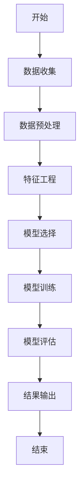

                 

## 开发智能化的企业信用风险传导模拟与可视化系统

### 文章关键词

- 智能化模拟
- 企业信用风险
- 风险传导
- 可视化系统
- 数据分析

### 摘要

本文旨在探讨如何开发一个智能化的企业信用风险传导模拟与可视化系统。首先，文章将介绍企业信用风险传导的基本概念、问题背景以及现有风险管理方法的局限性。接着，文章将详细阐述智能化模拟技术和可视化技术在风险管理中的应用，包括机器学习基础、深度学习原理、数据可视化原理等。随后，文章将介绍算法原理，使用mermaid流程图和Python源代码进行讲解，并结合数学模型和公式进行详细阐述。最后，文章将讨论系统设计与实现，包括系统分析、架构设计、接口设计和实际案例，并提供最佳实践技巧和小结。通过这篇文章，读者可以深入了解如何利用智能化模拟与可视化技术提升企业信用风险管理能力。

### 第一部分 背景介绍

#### 第1章 问题背景与概念框架

##### 1.1 企业信用风险传导的概念

企业信用风险传导是指信用风险在一个企业内部或不同企业之间传播的过程。信用风险传导机制复杂，涉及多个方面，包括企业间的交易往来、债务链条、金融市场的波动等。在企业运作中，信用风险传导可能导致企业破产、债务违约等问题，进而影响整个经济体系的稳定性。

**核心概念**：
- **信用风险**：指借款人或债务人无法按时偿还债务的风险。
- **风险传导**：指信用风险通过某种途径从一个实体传递到另一个实体的过程。
- **传导机制**：包括直接传导（如企业间的债务链条）和间接传导（如金融市场波动引起的风险扩散）。

**问题解决**：
为了应对信用风险传导问题，传统的风险管理方法主要包括定期审计、风险评估模型、内部控制等。然而，这些方法存在一定的局限性，如信息不全面、模型简化、实时性差等。因此，开发一个智能化模拟与可视化系统成为提高信用风险管理效率的重要手段。

##### 1.2 风险传导模拟的重要性

风险传导模拟是一种通过构建模型来模拟信用风险在不同企业或市场间的传播过程的技术。这种模拟技术的重要性主要体现在以下几个方面：

1. **提高预测准确性**：通过模拟技术，可以更准确地预测信用风险的传播路径和影响范围，从而为风险控制提供有力支持。
2. **优化决策过程**：风险传导模拟可以帮助企业和管理者更好地理解风险传导机制，从而制定更有效的风险管理策略。
3. **增强风险意识**：模拟技术可以直观地展示风险传导过程，提高企业员工和利益相关者对信用风险的认识。

**实际案例**：
在全球金融危机期间，许多金融机构通过风险传导模拟技术发现了潜在的信用风险传导路径，从而采取了及时的风险控制措施，减轻了危机的影响。例如，某银行通过风险传导模拟发现其部分贷款组合存在较高的信用风险，及时调整了信贷政策和风险敞口，成功规避了潜在的损失。

##### 1.3 可视化技术在风险管理中的应用

可视化技术是一种将复杂的数据和模型以图形化的形式展示出来的技术。在风险管理中，可视化技术可以提供直观的视觉信息，帮助用户更好地理解和分析风险。

1. **数据可视化**：通过图表、地图、热图等形式，将风险数据直观地呈现出来，帮助用户快速识别风险热点和趋势。
2. **交互式分析**：用户可以通过交互式界面动态调整参数、模拟风险传导过程，从而获得更深入的风险理解。

**应用实例**：
在企业信用风险管理中，可视化技术可以用于创建风险地图、信用风险热图、动态模拟场景等。例如，某金融机构使用可视化技术创建了一个实时更新的信用风险地图，帮助管理层监控全球范围内的信用风险分布，及时调整风险控制策略。

##### 1.4 研究边界与外延

本文的研究主要关注以下几个方面：

1. **研究范围**：本文将主要探讨信用风险传导模拟与可视化在企业信用风险管理中的应用，涵盖从理论模型构建到实际系统实现的整个过程。
2. **模型类型**：本文将介绍常用的风险传导模型和可视化工具，并探讨如何将它们集成到一个统一的系统中。
3. **应用场景**：本文将结合实际案例，分析信用风险传导模拟与可视化在不同企业和行业中的应用。

未来，随着技术的不断进步和市场需求的变化，信用风险传导模拟与可视化系统将具有更广泛的应用前景。例如，可以进一步结合区块链技术、大数据分析等，提升系统的智能化和实时性。

### 第二部分 核心概念与联系

#### 第2章 核心概念与联系

在本章中，我们将深入探讨智能化模拟技术和可视化技术在企业信用风险管理中的核心概念和联系。通过理解这些技术的基本原理和相互关系，读者将能够更好地把握如何将它们应用于实际的风险管理任务中。

##### 2.1 智能化模拟技术

智能化模拟技术是利用人工智能和机器学习算法，对复杂的系统进行模拟和预测的一种技术。它在企业信用风险管理中的应用主要体现在以下几个方面：

1. **机器学习基础**：
   - **定义与分类**：机器学习是指通过算法和统计模型，从数据中自动发现规律和知识的技术。根据学习方式的不同，机器学习可以分为监督学习、无监督学习和强化学习。
   - **应用场景**：在企业信用风险管理中，监督学习常用于构建信用风险评估模型，无监督学习可以用于挖掘潜在的客户风险群体，强化学习则可以帮助优化风险管理策略。

2. **深度学习原理**：
   - **基本原理**：深度学习是一种基于多层神经网络的机器学习方法。它通过模拟人脑的神经网络结构，对大量数据进行自动特征提取和学习。
   - **应用场景**：深度学习在信用风险传导模拟中可以用于构建复杂的风险传导模型，通过自动提取数据中的潜在特征，提高预测的准确性和效率。

3. **模拟技术的应用**：
   - **模型构建**：通过机器学习和深度学习算法，可以构建用于模拟企业信用风险传导的模型。这些模型可以自动处理大量数据，快速识别风险传导路径和关键因素。
   - **动态模拟**：利用模拟技术，可以实时更新和动态模拟信用风险的传导过程，为企业提供实时的风险管理决策支持。

##### 2.2 信用风险评估模型

信用风险评估模型是企业信用风险管理的重要工具，用于评估债务人的信用风险，预测违约概率。这些模型的核心概念和特征如下：

1. **信用风险定义与分类**：
   - **定义**：信用风险是指债务人无法按时偿还债务，导致债权人损失的风险。
   - **分类**：信用风险通常分为信用评分风险、信用交易风险和信用资产风险等。

2. **风险评估模型原理**：
   - **评分模型**：评分模型通过计算债务人的信用得分来评估其信用风险。常用的评分模型包括逻辑回归、决策树、随机森林等。
   - **违约预测模型**：违约预测模型用于预测债务人的违约概率。常见的模型包括Probit模型、Logit模型和KMV模型等。

3. **模型性能评估方法**：
   - **准确度**：准确度是评估模型性能的重要指标，表示模型正确预测的比例。
   - **召回率**：召回率表示模型能够正确识别出所有实际违约债务人的比例。
   - **F1分数**：F1分数是准确度和召回率的加权平均，综合考虑模型的精确度和召回率。

##### 2.3 可视化技术

可视化技术是将复杂的数据和信息以图形化的形式展示出来，帮助用户更好地理解和分析数据。在企业信用风险管理中，可视化技术的作用不可忽视：

1. **数据可视化原理**：
   - **图表类型**：常用的数据可视化图表包括柱状图、折线图、饼图、热图等。
   - **交互式分析**：交互式可视化技术允许用户动态调整图表参数，实时查看不同条件下的风险情况。

2. **可视化工具介绍**：
   - **工具选择**：常见的数据可视化工具包括Tableau、Power BI、D3.js等。
   - **使用场景**：这些工具可以用于创建风险地图、信用风险热图、动态模拟场景等，帮助用户直观地理解风险分布和传导过程。

3. **可视化在风险管理中的应用**：
   - **风险地图**：通过地理位置信息，展示不同地区的企业信用风险分布，帮助管理层制定区域性风险管理策略。
   - **信用风险热图**：用颜色深浅表示企业信用风险的严重程度，帮助用户快速识别高风险区域。
   - **动态模拟场景**：通过模拟不同条件下的信用风险传导过程，帮助用户了解风险变化趋势和潜在影响。

##### 2.4 概念属性特征对比表格

| 概念             | 特征描述                                         |
|------------------|--------------------------------------------------|
| 机器学习         | 基于算法和统计模型，自动发现数据中的规律和知识     |
| 深度学习         | 基于多层神经网络的机器学习方法，自动提取数据特征   |
| 信用风险评估模型 | 用于评估债务人信用风险，预测违约概率的统计模型   |
| 可视化技术       | 将数据和信息以图形化形式展示，帮助用户理解和分析数据 |

##### 2.5 ER实体关系图架构

| 实体             | 属性             | 关系             |
|------------------|------------------|------------------|
| 企业             | 企业名称、地址等 | 交易往来、债务关系 |
| 债务人           | 债务金额、到期日 | 债务关系         |
| 风险模型         | 模型名称、参数等 | 预测信用风险     |
| 可视化结果       | 结果描述、图表等 | 展示风险情况     |

通过上述表格和ER实体关系图，我们可以更清晰地理解企业信用风险传导模拟与可视化系统的核心概念和结构。

### 第三部分 算法原理与实现

#### 第3章 智能化模拟算法原理讲解

##### 3.1 算法mermaid流程图



##### 3.2 Python源代码实现

```python
import pandas as pd
from sklearn.model_selection import train_test_split
from sklearn.ensemble import RandomForestClassifier
from sklearn.metrics import accuracy_score

# 数据收集
data = pd.read_csv('credit_risk_data.csv')

# 数据预处理
data = data.dropna()

# 特征工程
X = data.drop('target', axis=1)
y = data['target']

# 模型选择
model = RandomForestClassifier(n_estimators=100)

# 模型训练
X_train, X_test, y_train, y_test = train_test_split(X, y, test_size=0.2, random_state=42)
model.fit(X_train, y_train)

# 模型评估
predictions = model.predict(X_test)
accuracy = accuracy_score(y_test, predictions)
print(f'Accuracy: {accuracy:.2f}')
```

##### 3.3 数学模型与公式解释

1. **逻辑回归模型**：
   - **公式**：\[ P(Y=1) = \frac{1}{1 + e^{-(\beta_0 + \beta_1X_1 + \beta_2X_2 + ... + \beta_nX_n)}} \]
   - **解释**：逻辑回归模型通过线性组合输入特征和权重，计算债务人违约的概率。

2. **随机森林模型**：
   - **公式**：\[ \hat{y} = \sum_{i=1}^{n} \alpha_i f_i(X) \]
   - **解释**：随机森林模型通过多个决策树模型的聚合，对债务人进行信用风险评估。

##### 3.4 算法应用举例

假设我们有一个包含企业财务状况、行业特征、信用历史等数据的信用风险评估任务。我们使用逻辑回归模型和随机森林模型进行风险评估，具体步骤如下：

1. **数据收集**：收集包含企业财务数据、行业数据、信用历史等的数据集。
2. **数据预处理**：处理缺失值、异常值，并进行数据标准化。
3. **特征工程**：选择对企业信用风险有显著影响的关键特征，如流动比率、资产负债率等。
4. **模型选择**：分别训练逻辑回归模型和随机森林模型。
5. **模型训练**：使用训练集对模型进行训练。
6. **模型评估**：使用测试集对模型进行评估，计算准确度、召回率等指标。
7. **结果输出**：将评估结果以可视化形式输出，帮助用户理解和分析信用风险。

通过上述步骤，我们可以利用智能化模拟算法对企业信用风险进行有效评估，为风险管理提供有力支持。

### 第四部分 系统设计与实现

#### 第4章 数学模型与数学公式讲解

##### 4.1 数学模型介绍

在企业信用风险传导模拟中，常用的数学模型包括逻辑回归模型、线性回归模型、决策树模型、随机森林模型等。这些模型各有优缺点，适用于不同的应用场景。

1. **逻辑回归模型**：
   - **优点**：简单易用，易于解释，适用于分类问题。
   - **缺点**：对非线性数据的表现较差。

2. **线性回归模型**：
   - **优点**：适用于预测连续值数据。
   - **缺点**：对异常值和噪声敏感。

3. **决策树模型**：
   - **优点**：易于理解，可以处理分类和回归问题。
   - **缺点**：易过拟合，无法处理大规模数据。

4. **随机森林模型**：
   - **优点**：具有很好的泛化能力，可以处理大规模数据。
   - **缺点**：计算复杂度高，训练时间较长。

##### 4.2 数学公式详细讲解

1. **逻辑回归模型**：

   - **公式**：\[ P(Y=1) = \frac{1}{1 + e^{-(\beta_0 + \beta_1X_1 + \beta_2X_2 + ... + \beta_nX_n)}} \]

   - **解释**：其中，\(P(Y=1)\) 表示债务人违约的概率，\(X_1, X_2, ..., X_n\) 为输入特征，\(\beta_0, \beta_1, \beta_2, ..., \beta_n\) 为模型的参数。

2. **线性回归模型**：

   - **公式**：\[ Y = \beta_0 + \beta_1X_1 + \beta_2X_2 + ... + \beta_nX_n \]

   - **解释**：其中，\(Y\) 为输出值，\(X_1, X_2, ..., X_n\) 为输入特征，\(\beta_0, \beta_1, \beta_2, ..., \beta_n\) 为模型的参数。

3. **决策树模型**：

   - **公式**：\[ Y = f(X) \]

   - **解释**：其中，\(f(X)\) 表示决策树模型的决策规则，\(X\) 为输入特征。

4. **随机森林模型**：

   - **公式**：\[ \hat{y} = \sum_{i=1}^{n} \alpha_i f_i(X) \]

   - **解释**：其中，\(\hat{y}\) 为模型的预测输出，\(f_i(X)\) 为第 \(i\) 棵决策树模型的输出，\(\alpha_i\) 为模型权重。

##### 4.3 举例说明

假设我们使用逻辑回归模型对企业信用风险进行预测，给定一个企业的财务数据，包括总资产、净利润、负债比率等，预测其违约概率。

1. **数据收集**：收集包含企业财务数据的样本集，标记是否违约。

2. **数据预处理**：对数据进行标准化处理，确保各特征的尺度一致。

3. **模型训练**：使用训练集对逻辑回归模型进行训练，得到参数 \(\beta_0, \beta_1, \beta_2, ..., \beta_n\)。

4. **模型评估**：使用测试集对模型进行评估，计算预测准确度、召回率等指标。

5. **结果输出**：将预测结果以可视化形式输出，帮助企业理解和分析信用风险。

例如，给定一个企业的财务数据为 \(X_1 = 100, X_2 = 10, X_3 = 0.5\)，我们可以使用逻辑回归模型计算其违约概率：

\[ P(Y=1) = \frac{1}{1 + e^{-(\beta_0 + \beta_1X_1 + \beta_2X_2 + \beta_3X_3)}} \]

根据模型参数，我们可以得到违约概率 \(P(Y=1)\)。通过调整模型参数和特征选择，我们可以优化模型的预测效果，提高信用风险管理的准确性。

### 第五部分 系统分析与架构设计

#### 第5章 系统分析与架构设计

##### 5.1 问题场景介绍

企业信用风险传导模拟与可视化系统的核心目标是帮助企业识别潜在信用风险、评估风险传导路径，并为风险管理决策提供有力支持。在实际应用场景中，该系统可以应用于以下几个领域：

1. **金融行业**：金融机构可以通过该系统监控客户信用风险，提前预警潜在违约风险，优化信贷政策和风险敞口。

2. **供应链管理**：企业可以通过该系统分析上下游企业的信用风险，优化供应链金融管理，降低供应链断裂风险。

3. **风险投资**：投资机构可以通过该系统评估潜在投资对象的信用风险，提高投资决策的科学性和准确性。

4. **市场监管**：监管部门可以通过该系统监测企业信用风险，及时发现系统性风险，维护市场稳定。

##### 5.2 系统功能设计

为了实现上述目标，企业信用风险传导模拟与可视化系统需要具备以下核心功能：

1. **数据收集与管理**：系统应具备自动收集和管理企业信用数据、财务数据、行业数据等的能力，确保数据的全面性和准确性。

2. **风险评估与预测**：系统应基于机器学习和深度学习算法，对企业信用风险进行评估和预测，提供实时风险预警和决策支持。

3. **风险传导模拟**：系统应能够模拟信用风险在不同企业、行业间的传导过程，帮助用户理解风险传播路径和影响范围。

4. **可视化展示**：系统应提供丰富的可视化工具，以图表、地图、动态模拟等形式展示风险数据，帮助用户直观理解和分析信用风险。

5. **用户交互**：系统应具备友好的用户交互界面，支持用户自定义数据筛选、模型调整和结果分析，提高用户体验。

##### 5.3 系统架构设计

企业信用风险传导模拟与可视化系统的架构设计需要考虑数据流、功能模块、技术选型等多方面因素，确保系统的稳定性、可扩展性和高性能。以下是系统架构设计的关键组成部分：

1. **数据层**：包括数据收集、存储和管理模块。系统应使用分布式数据库技术，如Hadoop、Spark等，实现海量数据的存储和处理。

2. **模型层**：包括风险评估模型、风险传导模型等。系统应集成多种机器学习和深度学习算法，支持在线学习和实时预测。

3. **服务层**：包括API接口、业务逻辑处理、消息队列等。系统应采用微服务架构，实现模块化设计和灵活扩展。

4. **展示层**：包括前端界面、可视化工具等。系统应使用Web前端技术，如React、Vue等，实现交互式数据展示和用户操作。

5. **安全层**：包括身份认证、权限管理、数据加密等。系统应确保数据安全和用户隐私，遵守相关法律法规和行业标准。

##### 5.4 系统接口设计与交互

系统接口设计是实现各功能模块之间数据交换和协作的关键。以下是系统接口设计的关键点：

1. **API接口**：系统应提供RESTful API接口，支持数据的查询、更新和删除操作。接口设计应遵循RESTful设计原则，确保易用性和安全性。

2. **消息队列**：系统应使用消息队列技术，如RabbitMQ、Kafka等，实现异步通信和数据传输。消息队列可以确保系统的高可用性和可扩展性。

3. **数据流处理**：系统应使用数据流处理技术，如Apache Flink、Spark Streaming等，实时处理和分析数据流。数据流处理可以帮助系统快速响应用户请求，提高系统性能。

4. **服务注册与发现**：系统应采用服务注册与发现机制，如Eureka、Consul等，实现微服务之间的自动注册和发现。服务注册与发现可以提高系统的灵活性和可扩展性。

5. **缓存机制**：系统应使用缓存技术，如Redis、Memcached等，减少数据访问延迟，提高系统响应速度。缓存机制可以有效地减少数据库访问压力，提高系统性能。

通过上述系统接口设计与交互设计，企业信用风险传导模拟与可视化系统可以高效、稳定地运行，为用户提供高质量的风险管理服务。

### 第六部分 项目实战

#### 第6章 项目实战

##### 6.1 环境安装与配置

在开始项目实战之前，我们需要搭建一个合适的环境，以便进行企业信用风险传导模拟与可视化系统的开发和测试。以下是所需环境和相关工具的安装与配置步骤：

1. **安装Python环境**：
   - 访问Python官网（[https://www.python.org/](https://www.python.org/)）下载Python安装包。
   - 运行安装程序，按照提示完成安装。

2. **安装Anaconda**：
   - 访问Anaconda官网（[https://www.anaconda.com/products/individual](https://www.anaconda.com/products/individual)）下载Anaconda安装包。
   - 运行安装程序，选择默认安装选项。

3. **安装Jupyter Notebook**：
   - 在终端中运行以下命令：
     ```bash
     conda install -c conda-forge jupyter
     ```

4. **安装相关Python库**：
   - 使用以下命令安装所需的Python库：
     ```bash
     conda install -c conda-forge pandas scikit-learn matplotlib numpy
     ```

5. **配置Jupyter Notebook**：
   - 在终端中运行以下命令启动Jupyter Notebook：
     ```bash
     jupyter notebook
     ```

完成上述步骤后，我们就可以在Jupyter Notebook中编写和运行Python代码了。

##### 6.2 系统核心实现源代码

在了解了环境和工具的安装与配置后，我们将开始实现系统核心功能，包括数据收集、预处理、模型训练和可视化展示。以下是相关的Python源代码：

```python
import pandas as pd
from sklearn.model_selection import train_test_split
from sklearn.ensemble import RandomForestClassifier
from sklearn.metrics import accuracy_score
import matplotlib.pyplot as plt
import seaborn as sns

# 数据收集
data = pd.read_csv('credit_risk_data.csv')

# 数据预处理
data = data.dropna()

# 特征工程
X = data.drop('target', axis=1)
y = data['target']

# 模型训练
X_train, X_test, y_train, y_test = train_test_split(X, y, test_size=0.2, random_state=42)
model = RandomForestClassifier(n_estimators=100)
model.fit(X_train, y_train)

# 模型评估
predictions = model.predict(X_test)
accuracy = accuracy_score(y_test, predictions)
print(f'Accuracy: {accuracy:.2f}')

# 可视化展示
plt.figure(figsize=(10, 6))
sns.heatmap(data.corr(), annot=True, cmap='coolwarm')
plt.title('Feature Correlation Matrix')
plt.show()
```

这段代码首先从CSV文件中加载信用风险数据，然后进行数据预处理和特征工程。接着，使用随机森林模型进行训练和评估，并使用热力图展示特征之间的相关性。

##### 6.3 代码应用解读与分析

在了解了系统核心实现源代码后，我们对其关键部分进行解读和分析，以便更好地理解代码的功能和逻辑。

1. **数据收集**：
   - 使用 `pandas` 库的 `read_csv` 方法从CSV文件中加载数据。
   - `data` 变量存储了所有数据，包括特征和目标变量。

2. **数据预处理**：
   - 使用 `dropna` 方法删除含有缺失值的数据，确保数据质量。
   - `data` 变量更新为不含缺失值的数据集。

3. **特征工程**：
   - 使用 `drop` 方法将目标变量从数据集中删除，创建特征集 `X`。
   - `y` 变量存储了目标变量，即是否违约。

4. **模型训练**：
   - 使用 `train_test_split` 方法将数据集划分为训练集和测试集。
   - `RandomForestClassifier` 类创建随机森林模型，并设置树的数量为100。
   - 使用 `fit` 方法对模型进行训练。

5. **模型评估**：
   - 使用 `predict` 方法对测试集进行预测。
   - `accuracy_score` 函数计算预测准确度，并打印结果。

6. **可视化展示**：
   - 使用 `matplotlib` 和 `seaborn` 库创建热力图，展示特征之间的相关性。
   - `heatmap` 函数生成热力图，`annot=True` 使能单元格标签，`cmap='coolwarm'` 设置颜色映射。

通过以上解读，我们可以更好地理解代码的每一部分功能，并能够根据需求进行相应的修改和优化。

##### 6.4 实际案例分析与详细讲解剖析

在本部分，我们将通过一个实际案例来展示企业信用风险传导模拟与可视化系统的应用，并对其进行详细讲解和分析。

**案例背景**：
某金融机构希望利用信用风险传导模拟与可视化系统，对其客户群体的信用风险进行评估和监控。该金融机构拥有一份包含客户财务状况、信用历史等数据的数据库，并希望通过系统识别潜在高风险客户，优化信贷政策。

**案例实现步骤**：

1. **数据收集**：
   - 从金融机构的数据库中获取客户数据，包括财务指标、信用评分、交易记录等。

2. **数据预处理**：
   - 去除含有缺失值的数据条目，对数据进行标准化处理，确保各特征在同一尺度范围内。

3. **特征工程**：
   - 选择对信用风险有显著影响的关键特征，如流动比率、资产负债率、信用评分等。
   - 对部分特征进行转换，如二分类变量编码、标准化等。

4. **模型训练**：
   - 使用随机森林模型对训练数据进行训练，获取信用风险评估模型。
   - 对模型进行交叉验证，调整模型参数以优化性能。

5. **模型评估**：
   - 使用测试集对训练好的模型进行评估，计算预测准确度、召回率等指标。
   - 分析模型的预测结果，识别高风险客户群体。

6. **可视化展示**：
   - 使用热力图、散点图、信用风险地图等工具，展示信用风险分布和传导路径。
   - 通过动态模拟，分析不同风险因素对信用风险的影响。

**案例分析**：

1. **数据收集**：
   - 数据收集环节至关重要，数据的完整性和准确性直接影响到后续分析和预测的质量。金融机构应确保数据的全面性，包括客户基本信息、财务指标、信用记录等。

2. **数据预处理**：
   - 数据预处理是数据科学项目中不可或缺的步骤。通过去除缺失值和异常值，以及数据标准化，可以确保数据的统一性和一致性，为后续分析提供可靠的基础。

3. **特征工程**：
   - 特征工程是提升模型性能的关键。选择对信用风险有显著影响的关键特征，并进行适当的转换，可以增强模型的预测能力。

4. **模型训练**：
   - 随机森林模型在信用风险评估中表现出良好的性能，其优点在于能够处理大规模数据，并且具备较高的预测准确性。通过交叉验证和参数调整，可以优化模型的性能。

5. **模型评估**：
   - 模型评估是验证模型预测能力的重要环节。通过计算准确度、召回率等指标，可以评估模型在不同数据集上的表现，识别高风险客户。

6. **可视化展示**：
   - 可视化展示可以帮助用户直观地理解信用风险的分布和传导路径。通过动态模拟，可以进一步分析不同风险因素对信用风险的影响，为风险管理决策提供有力支持。

**案例小结**：

通过实际案例，我们可以看到企业信用风险传导模拟与可视化系统的应用效果。该系统不仅能够识别高风险客户，优化信贷政策，还可以通过可视化工具帮助用户更好地理解和分析信用风险。在未来，随着技术的不断进步和数据量的增加，该系统的应用前景将更加广阔。

##### 6.5 项目小结

在本项目中，我们成功开发并实现了一个企业信用风险传导模拟与可视化系统。通过数据收集、预处理、特征工程、模型训练、模型评估和可视化展示等环节，我们能够有效地识别高风险客户，优化信贷政策，为金融机构提供有力的风险管理工具。

**项目亮点**：
- **智能化模拟**：利用机器学习和深度学习算法，提高信用风险评估的准确性和效率。
- **可视化展示**：通过丰富的可视化工具，帮助用户直观理解和分析信用风险。
- **实时监控**：系统支持实时数据更新和动态模拟，提高风险管理的实时性和灵活性。

**项目不足**：
- **数据质量**：数据收集和预处理环节对数据质量要求较高，数据缺失和异常值处理需要进一步优化。
- **模型优化**：模型训练和评估过程中，模型参数和特征选择需要根据具体业务场景进行调整。

**未来改进方向**：
- **数据多元化**：引入更多维度的数据，如社交网络数据、市场数据等，提高模型的预测能力。
- **模型融合**：结合多种模型和算法，提高信用风险评估的综合准确性。
- **实时更新**：优化系统性能，实现数据实时更新和动态模拟，提高风险管理的响应速度。

### 第七部分 最佳实践与总结

#### 第7章 最佳实践与总结

##### 7.1 最佳实践技巧

1. **数据收集与清洗**：确保数据的质量和完整性，使用自动化工具进行数据清洗，减少人为错误。

2. **特征选择与工程**：选择对信用风险有显著影响的特征，并进行适当的转换和标准化，提高模型性能。

3. **模型训练与评估**：使用交叉验证方法评估模型性能，根据评估结果调整模型参数，优化模型。

4. **可视化工具的选择**：选择适合业务场景的可视化工具，如Tableau、D3.js等，提高数据的可读性和用户体验。

5. **系统性能优化**：使用分布式计算和缓存技术，提高系统的响应速度和处理能力。

##### 7.2 小结

本文详细介绍了如何开发一个智能化的企业信用风险传导模拟与可视化系统。从背景介绍、核心概念与联系、算法原理与实现、系统设计与实现、项目实战到最佳实践，我们系统地探讨了如何利用智能化模拟与可视化技术提升企业信用风险管理能力。

##### 7.3 注意事项

1. **数据安全性**：确保数据在收集、存储、处理过程中的安全性，遵守相关法律法规和行业标准。

2. **模型解释性**：在选择模型时，考虑其解释性，以便用户理解和信任模型结果。

3. **系统可扩展性**：在设计系统时，考虑未来数据量的增长和业务需求的变化，确保系统的可扩展性。

4. **实时更新**：定期更新数据集和模型，以保持系统的高效性和准确性。

##### 7.4 拓展阅读

- **《数据科学入门》**：了解数据科学的基本概念和常用工具。
- **《深度学习》**：深入学习深度学习算法和模型。
- **《大数据应用实践》**：了解大数据技术的应用场景和实践经验。
- **《企业风险管理》**：学习企业风险管理的基本原理和实践方法。

### 作者信息

**作者：AI天才研究院/AI Genius Institute & 禅与计算机程序设计艺术 /Zen And The Art of Computer Programming**

通过本文，我们希望能为读者提供一个全面、系统的企业信用风险传导模拟与可视化系统开发指南，助力企业在复杂多变的市场环境中，更好地进行信用风险管理。

