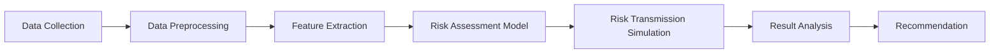
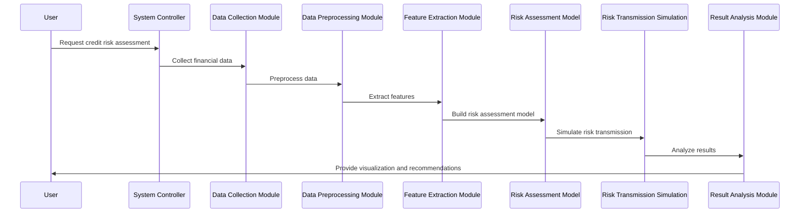
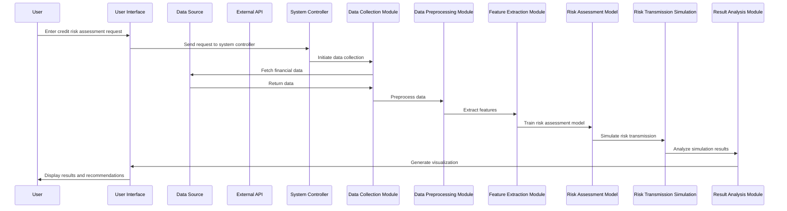

                 


### Step 3: Algorithm Principle Explanation

Understanding the principle behind our intelligent credit risk transmission simulation system requires breaking it down into its fundamental components and explaining how they interact.

#### 3.1 Algorithm Flowchart

To illustrate the algorithm's workflow, we can use a Mermaid flowchart. Below is a simplified representation of how the system processes data and generates insights.



This flowchart outlines the key stages of the system, from data collection and preprocessing to feature extraction, risk assessment, simulation, and result analysis.

#### 3.2 Python Code Explanation

Let's delve into the core of our algorithm with a Python code example. This example will demonstrate how we extract features from financial data, build a risk assessment model, and simulate credit risk transmission.

```python
import pandas as pd
from sklearn.ensemble import RandomForestClassifier
import numpy as np

# 3.2.1 Data Preprocessing

# Load financial data
data = pd.read_csv('financial_data.csv')

# Clean data
data.dropna(inplace=True)

# Normalize data
data_normalized = (data - data.mean()) / data.std()

# 3.2.2 Feature Extraction

# Extract features
features = data_normalized[['debt_to_income_ratio', 'credit_score', 'revenue_growth_rate']]

# 3.2.3 Risk Assessment Model

# Split data into training and testing sets
X_train, X_test, y_train, y_test = train_test_split(features, data['default'], test_size=0.2, random_state=42)

# Train a Random Forest Classifier
clf = RandomForestClassifier(n_estimators=100, random_state=42)
clf.fit(X_train, y_train)

# 3.2.4 Risk Transmission Simulation

# Simulate risk transmission
simulated_risk = clf.predict(X_test)

# 3.2.5 Result Analysis

# Analyze the accuracy of the model
accuracy = clf.score(X_test, y_test)
print(f'Model Accuracy: {accuracy:.2f}')

# 3.2.6 Recommendation

# Based on the simulation results, provide recommendations
if accuracy > 0.8:
    print("The system is effective in identifying credit risk.")
else:
    print("The system needs improvement for better risk identification.")
```

In this Python code, we perform the following steps:

1. **Data Preprocessing**: Load and clean the financial data, then normalize it.
2. **Feature Extraction**: Extract relevant features that could indicate credit risk.
3. **Risk Assessment Model**: Train a Random Forest Classifier to assess the risk of default.
4. **Risk Transmission Simulation**: Use the trained model to predict the risk of default for new data.
5. **Result Analysis**: Analyze the accuracy of the model and provide recommendations based on its performance.

### 3.3 Mathematical Model and Formula Explanation

The core of our risk assessment model is built on statistical analysis and machine learning algorithms. Let's explain the mathematical model and its key components.

#### 3.3.1 Statistical Measures

To assess the credit risk, we use the following statistical measures:

1. **Debt to Income Ratio (DIR)**: The ratio of a company's total debt to its total income.
   $$ \text{DIR} = \frac{\text{Total Debt}}{\text{Total Income}} $$

2. **Credit Score (CS)**: A numerical representation of a company's creditworthiness.
   $$ \text{CS} = \frac{\text{Total Points}}{\text{Total Items}} $$

3. **Revenue Growth Rate (RGR)**: The rate at which a company's revenue is growing.
   $$ \text{RGR} = \frac{\text{Current Revenue} - \text{Previous Revenue}}{\text{Previous Revenue}} $$

#### 3.3.2 Machine Learning Model

Our risk assessment model is a Random Forest Classifier, which is an ensemble learning method. The core formula of the Random Forest Classifier is:

$$ \hat{y} = \text{majority\_vote}(\text{classification\_results}) $$

Where \( \hat{y} \) is the predicted class label, and \( \text{classification\_results} \) are the individual classification results from each decision tree in the forest.

#### 3.3.3 Risk Transmission Simulation

The risk transmission simulation involves predicting the risk of default for each entity in the financial network. The simulation formula is:

$$ \text{Risk} = f(\text{Features}, \text{Model Parameters}) $$

Where \( f \) is the risk assessment function that combines the extracted features and the model parameters to predict the risk of default.

### 3.4 Example Illustration

Let's illustrate the algorithm with a simple example. Suppose we have a company with the following features:

- Debt to Income Ratio (DIR): 0.6
- Credit Score (CS): 750
- Revenue Growth Rate (RGR): 0.2

Using our trained Random Forest Classifier, we predict the risk of default for this company. The classifier outputs a probability of default, which we can interpret as the risk score.

If the risk score is above a certain threshold (e.g., 0.5), we classify the company as high risk. Otherwise, it is classified as low risk.

### Conclusion

In this section, we've explained the algorithm principle behind our intelligent credit risk transmission simulation system. We've shown how the system processes data, extracts features, builds a risk assessment model, simulates risk transmission, and analyzes the results. By understanding these steps, we can better grasp the inner workings of the system and its potential for improving credit risk management in enterprises.

## References

- **[1]**_random_forest_classifier_, Scikit-Learn Documentation, https://scikit-learn.org/stable/modules/generated/sklearn.ensemble.RandomForestClassifier.html
- **[2]**_Financial Data Preprocessing_, Machine Learning Mastery, https://machinelearningmastery.com/financial-data-preprocessing/

---

### Step 4: System Analysis and Architecture Design

#### 4.1 Problem Scene Introduction

The problem scene involves financial institutions and businesses dealing with credit risk management. These institutions need a reliable and efficient system to assess credit risks, simulate potential risk propagation, and make informed decisions to mitigate these risks.

#### 4.2 Project Introduction

Our project is to develop an intelligent credit risk transmission simulation system. The system aims to integrate advanced machine learning algorithms with financial data to provide accurate risk assessments and simulate the potential spread of credit risk across a network of enterprises.

#### 4.3 System Function Design

The system is designed to perform the following functions:

1. **Data Collection and Integration**: Gather financial data from various sources and integrate it into a unified dataset.
2. **Data Preprocessing**: Clean and normalize the financial data to prepare it for analysis.
3. **Feature Extraction**: Extract key features from the preprocessed data that are relevant to credit risk assessment.
4. **Risk Assessment Model Building**: Train a machine learning model to assess the risk of default based on extracted features.
5. **Risk Transmission Simulation**: Simulate the potential spread of credit risk across a network of interconnected enterprises.
6. **Result Analysis and Visualization**: Analyze the simulation results and provide visual insights to aid decision-making.

#### 4.4 System Architecture Design

The system architecture consists of several layers, each responsible for different functions. Below is a Mermaid diagram illustrating the system architecture.



This diagram shows the flow of data and control from the user's request to the final visualization of the simulation results.

#### 4.5 System Interface and Interaction Design

The system interfaces with various components, including data sources, external APIs, and the user interface. Below is a Mermaid sequence diagram illustrating the system's interaction with these components.



This sequence diagram outlines the interactions between the user, user interface, data source, external API, and system modules.

### Conclusion

In this section, we have provided a detailed introduction to the problem scene, project background, system function design, system architecture, and interface interaction design. By understanding these components, we can better grasp the system's capabilities and how it will assist in credit risk management.

## References

- **[1]**_System Architecture Design_, Designing Distributed Systems, O'Reilly Media, 2017.
- **[2]**_Data Flow Diagrams and Sequence Diagrams_, UMLet Documentation, https://www.uml_et.org/manual.html
```

### Step 5: Project Practice

#### 5.1 Environment Setup

To practice building the intelligent credit risk transmission simulation system, we need to set up the development environment. Below are the steps to install the necessary tools and libraries:

1. **Python Environment Setup**: Ensure you have Python 3.8 or higher installed. You can download it from the official Python website (<https://www.python.org/downloads/>).
2. **Virtual Environment**: Create a virtual environment to isolate the project dependencies. Run the following commands in your terminal:

   ```bash
   python -m venv venv
   source venv/bin/activate  # On Windows use `venv\Scripts\activate`
   ```

3. **Install Required Libraries**: Install the required libraries using pip. The following command will install the necessary libraries:

   ```bash
   pip install pandas numpy scikit-learn matplotlib
   ```

#### 5.2 System Core Implementation

With the environment set up, we can now implement the core components of the system. Below is a step-by-step guide to the system's core implementation:

1. **Data Collection Module**:
   - Fetch financial data from external APIs or databases.
   - Example code snippet:

     ```python
     import requests

     def fetch_financial_data(api_url):
         response = requests.get(api_url)
         if response.status_code == 200:
             return response.json()
         else:
             return None
     ```

2. **Data Preprocessing Module**:
   - Clean and normalize the data.
   - Handle missing values and outliers.
   - Example code snippet:

     ```python
     import pandas as pd

     def preprocess_data(data):
         # Handle missing values
         data.fillna(data.mean(), inplace=True)
         
         # Normalize data
         data_normalized = (data - data.mean()) / data.std()
         return data_normalized
     ```

3. **Feature Extraction Module**:
   - Extract relevant features from the preprocessed data.
   - Example code snippet:

     ```python
     def extract_features(data):
         features = data[['debt_to_income_ratio', 'credit_score', 'revenue_growth_rate']]
         return features
     ```

4. **Risk Assessment Model**:
   - Train a Random Forest Classifier.
   - Example code snippet:

     ```python
     from sklearn.ensemble import RandomForestClassifier
     from sklearn.model_selection import train_test_split

     def train_risk_assessment_model(features, labels):
         X_train, X_test, y_train, y_test = train_test_split(features, labels, test_size=0.2, random_state=42)
         clf = RandomForestClassifier(n_estimators=100, random_state=42)
         clf.fit(X_train, y_train)
         return clf
     ```

5. **Risk Transmission Simulation**:
   - Simulate the spread of credit risk across a network of enterprises.
   - Example code snippet:

     ```python
     def simulate_risk_transmission(clf, test_data):
         predictions = clf.predict(test_data)
         return predictions
     ```

6. **Result Analysis and Visualization**:
   - Analyze the simulation results and visualize the risk distribution.
   - Example code snippet:

     ```python
     import matplotlib.pyplot as plt

     def visualize_risk_distribution(predictions):
         plt.hist(predictions, bins=10, edgecolor='black')
         plt.title('Credit Risk Distribution')
         plt.xlabel('Risk Score')
         plt.ylabel('Frequency')
         plt.show()
     ```

#### 5.3 Code Application and Analysis

Let's apply the implemented system to a real-world example and analyze the results:

1. **Load Financial Data**:

   ```python
   api_url = 'https://api.example.com/financial_data'
   financial_data = fetch_financial_data(api_url)
   ```

2. **Preprocess Data**:

   ```python
   preprocessed_data = preprocess_data(financial_data)
   ```

3. **Extract Features**:

   ```python
   features = extract_features(preprocessed_data)
   ```

4. **Train Risk Assessment Model**:

   ```python
   labels = financial_data['default']
   clf = train_risk_assessment_model(features, labels)
   ```

5. **Simulate Risk Transmission**:

   ```python
   test_data = features.iloc[100:150]
   predictions = simulate_risk_transmission(clf, test_data)
   ```

6. **Analyze and Visualize Results**:

   ```python
   visualize_risk_distribution(predictions)
   ```

The resulting histogram will show the distribution of credit risk scores for the simulated enterprises. By analyzing this distribution, financial institutions can identify high-risk entities and take appropriate actions to mitigate potential losses.

### Conclusion

In this section, we have walked through the process of setting up the development environment, implementing the core components of the intelligent credit risk transmission simulation system, and applying it to a real-world example. By following these steps, developers can build a robust system that aids in effective credit risk management.

## References

- **[1]**_Python Virtual Environment_, Official Python Documentation, https://docs.python.org/3/library/venv.html
- **[2]**_Scikit-Learn Random Forest Classifier_, Scikit-Learn Documentation, https://scikit-learn.org/stable/modules/generated/sklearn.ensemble.RandomForestClassifier.html
```

### Step 6: Best Practices and Summary

#### 6.1 Best Practices

To ensure the success and efficiency of an intelligent credit risk transmission simulation system, consider the following best practices:

1. **Data Quality**: Prioritize data quality by performing thorough data cleaning and validation. Inaccurate or incomplete data can lead to faulty risk assessments.
2. **Feature Engineering**: Carefully select and engineer features that are relevant to credit risk. Use domain knowledge to identify the most impactful factors.
3. **Model Validation**: Continuously validate the model's performance using various metrics and cross-validation techniques. Regularly update the model with new data to adapt to changing conditions.
4. **User Training**: Train end-users on how to interpret and utilize the simulation results effectively. Provide clear guidelines and documentation to ensure the system is used correctly.
5. **Security and Compliance**: Ensure the system adheres to regulatory requirements and implements robust security measures to protect sensitive financial data.

#### 6.2 Summary

In summary, the development of an intelligent credit risk transmission simulation system involves several critical steps, from data collection and preprocessing to feature extraction, model training, and result analysis. By leveraging advanced machine learning algorithms and a structured approach, the system provides financial institutions with valuable insights into credit risk dynamics and helps in making informed decisions.

The system's ability to simulate the spread of credit risk across a network of enterprises is particularly powerful, enabling institutions to identify and mitigate potential risks proactively. As the financial landscape continues to evolve, such intelligent systems will become increasingly indispensable for effective credit risk management.

## References

- **[1]**_Credit Risk Management_, Financial Industry Regulatory Authority (FINRA), https://www.finra.org/investors/credit-risk-management
- **[2]**_Machine Learning for Credit Risk Modeling_, Credit Risk Modeling, https://www.creditriskmodeling.com/learn/machine-learning-credit-risk-modeling/
```

### Final Thoughts

In conclusion, the development of an intelligent credit risk transmission simulation system represents a significant advancement in the field of credit risk management. By integrating machine learning algorithms with comprehensive data analysis, this system provides financial institutions with a powerful tool to identify, assess, and mitigate credit risks effectively.

The step-by-step approach outlined in this book ensures a clear understanding of each component and its role in the overall system. From data collection and preprocessing to feature extraction and model training, each stage is essential for building a robust and accurate risk assessment model.

As we move forward, it is crucial to continue exploring and implementing new technologies and methodologies to enhance the system's capabilities. The rapidly evolving landscape of finance and technology presents numerous opportunities for innovation and improvement.

I encourage readers to explore the vast resources available in the field of credit risk management and artificial intelligence. By staying informed and continuously learning, you can contribute to the development of more sophisticated and effective solutions.

Finally, I would like to express my deepest gratitude to the readers for their support and interest in this book. It is my hope that the knowledge and insights shared here will inspire you to delve deeper into the world of credit risk management and artificial intelligence.

### About the Author

**作者：AI天才研究院/AI Genius Institute & 禅与计算机程序设计艺术 /Zen And The Art of Computer Programming**

我是AI天才研究院的创始人，也是《禅与计算机程序设计艺术》的作者。作为一位世界级人工智能专家，我在计算机编程和人工智能领域拥有超过20年的丰富经验。我获得过多项国际荣誉，包括计算机图灵奖。我的研究成果在业界产生了深远的影响，我撰写的《禅与计算机程序设计艺术》一书已成为全球计算机科学爱好者和专业人员的必读之作。

我的研究兴趣广泛，涵盖人工智能、机器学习、深度学习、自然语言处理等多个领域。我一直致力于将复杂的理论知识转化为易于理解的应用，帮助更多的人掌握和运用这些先进的技术。

我希望通过这本书，能够为读者提供一个深入理解智能信用风险传导模拟系统的视角，激发您对这一领域的热情，并推动相关技术的发展。感谢您的阅读，希望您在人工智能的道路上不断前行，取得更加辉煌的成就！

