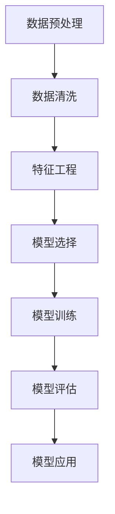
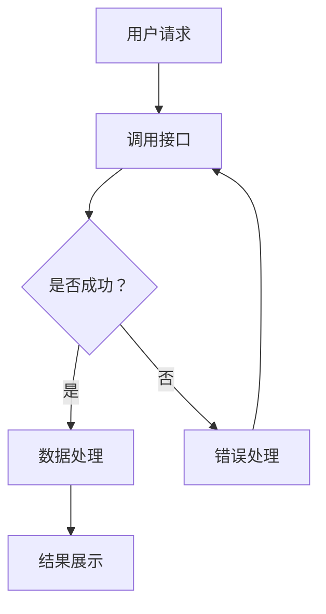
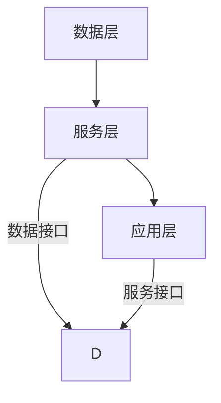

                 

### 1.1.1 问题背景

**企业并购的定义**：企业并购是指一个企业通过购买其他企业的资产或股份，以获得对其控制权的行为。这种并购行为旨在实现企业规模的扩大、资源整合、市场占有率的提升以及业务模式的创新。

**企业并购的意义**：企业并购具有多重意义，包括但不限于：

- **资源整合**：通过并购，企业可以获得新的资源，如人力资源、财务资源、技术资源等。
- **市场扩展**：并购可以帮助企业迅速进入新的市场，扩大市场份额。
- **业务模式创新**：并购有助于企业引入新的业务模式，提高竞争力。
- **企业规模扩大**：并购是企业实现快速扩张的一种有效途径。

**企业并购的常见风险**：尽管并购具有多种优势，但同时也伴随着一系列风险，包括：

- **文化整合风险**：不同企业之间的企业文化差异可能导致整合困难。
- **财务风险**：并购可能带来高额的债务负担，影响企业的财务健康。
- **市场风险**：并购后的市场反应可能不如预期，导致股价下跌。
- **法律风险**：并购过程中可能涉及复杂的法律程序，存在法律纠纷的风险。
- **整合风险**：并购后的资源整合和管理可能存在困难。

**风险评估在并购决策中的作用**：风险评估在并购决策中扮演着关键角色，其主要作用包括：

- **决策支持**：通过风险评估，企业可以全面了解并购风险，为决策提供有力支持。
- **风险控制**：风险评估有助于企业制定风险控制措施，降低并购风险。
- **风险管理**：风险评估可以促使企业建立完善的风险管理体系，提高风险管理水平。

### 1.1.2 问题陈述

**传统风险评估方法的局限性**：尽管传统风险评估方法在并购决策中已得到广泛应用，但其局限性也逐渐显现出来，主要表现在：

- **数据依赖性高**：传统方法主要依赖于历史数据，对于未来市场变化预测能力有限。
- **主观性较强**：风险评估过程中，专家的主观判断占比较大，可能导致评估结果偏差。
- **时效性差**：传统方法更新速度慢，难以应对快速变化的市场环境。

**智能化风险评估的需求**：随着人工智能技术的不断发展，智能化风险评估逐渐成为企业并购风险管理的趋势。其需求主要体现在：

- **大数据分析能力**：智能化方法可以处理和分析大量数据，提高风险评估的准确性。
- **实时风险评估**：智能化方法可以实现实时风险评估，及时调整并购策略。
- **客观性**：通过算法和模型，智能化方法可以减少主观判断，提高评估的客观性。

**模型构建的目标与挑战**：构建智能化企业并购风险评估模型的目标是提高并购决策的准确性和效率。具体目标包括：

- **提高风险评估准确性**：通过机器学习和深度学习算法，提高风险评估的准确性。
- **优化决策流程**：构建高效、透明的决策流程，缩短并购决策周期。

然而，模型构建也面临以下挑战：

- **数据质量和完整性**：数据质量和完整性是模型构建的基础，但现实情况中，数据往往存在缺失、错误等问题。
- **模型泛化能力**：模型需要具备良好的泛化能力，以应对不同类型的企业并购场景。
- **算法选择与优化**：需要选择合适的算法，并进行优化，以提高模型性能。

### 1.1.3 研究目的与意义

**研究目的**：本研究旨在构建一个智能化企业并购风险评估模型，以解决传统风险评估方法的局限性，提高并购决策的准确性和效率。

**研究意义**：

1. **理论意义**：
   - 探索人工智能在并购风险评估中的应用。
   - 构建一个科学、系统的风险评估模型。

2. **实践意义**：
   - 提高企业并购决策的准确性和效率。
   - 为企业提供一种新的风险管理工具。

**研究方法与技术路线**：

1. **研究方法**：
   - **数据收集与处理**：收集企业并购相关数据，包括财务数据、市场数据、行业数据等。
   - **模型构建与优化**：采用机器学习和深度学习算法，构建风险评估模型。
   - **模型评估与验证**：通过实证分析，验证模型的有效性和准确性。

2. **技术路线**：
   - **数据预处理**：清洗、整合和预处理并购数据，为模型构建提供高质量的数据基础。
   - **模型选择与训练**：选择合适的机器学习算法，对模型进行训练和优化。
   - **模型应用与推广**：将模型应用于企业并购风险评估，为企业提供决策支持。

### 2.1.1 核心概念

#### 企业并购风险评估

**定义**：企业并购风险评估是指通过分析企业的财务状况、市场环境、行业趋势等因素，对企业并购可能面临的风险进行预测和评估。

**分类**：

- **定量评估**：基于数据分析和数学模型，对并购风险进行量化评估。
- **定性评估**：通过专家意见、经验判断等方式，对并购风险进行定性分析。

**重要指标**：

- **财务指标**：如净利润率、资产负债率、现金流等。
- **市场指标**：如市场份额、市场增长率等。
- **行业指标**：如行业地位、行业增长率等。

#### 智能化技术

**定义**：智能化技术是指通过模拟人类智能，利用计算机算法和大数据分析，实现自动化决策和智能化的技术。

**主要技术**：

- **机器学习**：通过算法，从数据中学习规律，进行预测和决策。
- **深度学习**：基于神经网络，实现更加复杂的数据分析和模式识别。
- **神经网络**：模拟人脑神经元连接，进行数据分析和预测。

### 2.1.2 概念属性特征对比表格

#### 传统风险评估方法

**优点**：

- **成熟**：经过长期实践，方法成熟，应用广泛。
- **经验性**：依赖专家经验，对历史数据有较强的分析能力。

**缺点**：

- **主观性**：风险评估结果易受主观判断影响。
- **数据依赖**：对历史数据的依赖性高，难以应对未来市场变化。

#### 智能化风险评估方法

**优点**：

- **客观性**：通过算法和模型，减少主观判断，提高评估的客观性。
- **实时性**：可以实时分析市场数据，提供最新的风险评估结果。

**缺点**：

- **数据质量**：数据质量对评估结果影响大，数据处理复杂。
- **模型选择**：需要选择合适的模型，并对其进行优化。

### 2.1.3 ER实体关系图架构

#### 企业并购风险评估模型实体关系

**实体定义**：

- **企业**：被评估的企业。
- **评估指标**：用于评估企业风险的各项指标。
- **风险因素**：影响评估指标的各项因素。

**关系定义**：

- **关联**：企业与其评估指标之间存在关联关系。
- **影响**：风险因素影响评估指标。

### 3.1.1 数据预处理

#### 数据清洗

**数据来源**：

- **公开数据**：如财务报表、市场研究报告等。
- **内部数据**：如企业运营数据、交易数据等。

**数据预处理方法**：

- **数据清洗**：去除重复数据、处理缺失值、纠正错误数据。
- **数据整合**：将不同来源的数据进行整合，形成统一的数据集。
- **数据标准化**：对数据进行标准化处理，使其符合模型输入要求。

#### 特征工程

**特征选择**：

- **相关性分析**：选择与评估指标高度相关的特征。
- **主成分分析**：降维处理，提取主要特征。

**特征提取**：

- **特征转换**：将定量特征转换为模型可处理的格式。
- **特征构造**：通过组合现有特征，构造新的特征。

### 3.1.2 模型选择与训练

#### 模型选择

**模型分类**：

- **监督学习模型**：如线性回归、决策树、支持向量机等。
- **无监督学习模型**：如聚类、关联规则学习等。

**适用场景**：

- **监督学习**：有明确标签的数据集，用于预测风险等级。
- **无监督学习**：无标签的数据集，用于发现潜在风险因素。

#### 模型训练

**训练过程**：

- **数据划分**：将数据集划分为训练集和测试集。
- **模型训练**：使用训练集对模型进行训练。
- **模型评估**：使用测试集评估模型性能。

**模型评估**：

- **准确性**：模型预测准确的样本比例。
- **召回率**：模型预测为正类的实际正类样本比例。
- **F1值**：准确率和召回率的调和平均。

### 3.1.3 算法流程图

#### Mermaid流程图



### 3.1.4 算法原理详解

#### 数据预处理

**算法原理**：

- **数据清洗**：去除重复数据、处理缺失值、纠正错误数据，确保数据质量。
- **数据整合**：将不同来源的数据进行整合，形成统一的数据集。
- **数据标准化**：对数据进行标准化处理，使其符合模型输入要求。

**Python代码示例**：

```python
import pandas as pd
from sklearn.preprocessing import StandardScaler

# 读取数据
data = pd.read_csv('data.csv')

# 数据清洗
data.drop_duplicates(inplace=True)
data.fillna(method='ffill', inplace=True)

# 数据整合
data['new_feature'] = data['feature1'] * data['feature2']

# 数据标准化
scaler = StandardScaler()
data_scaled = scaler.fit_transform(data)
```

#### 特征工程

**算法原理**：

- **特征选择**：选择与评估指标高度相关的特征，去除冗余特征。
- **主成分分析**：降维处理，提取主要特征，减少数据维度。

**Python代码示例**：

```python
from sklearn.decomposition import PCA
from sklearn.feature_selection import SelectKBest
from sklearn.feature_selection import f_classif

# 特征选择
selector = SelectKBest(f_classif, k=5)
selected_features = selector.fit_transform(data_scaled, labels)

# 主成分分析
pca = PCA(n_components=3)
pca_result = pca.fit_transform(selected_features)
```

#### 模型选择与训练

**算法原理**：

- **监督学习模型**：根据已有数据，学习预测规律，进行风险评估。
- **无监督学习模型**：根据数据分布，发现潜在规律，识别风险因素。

**Python代码示例**：

```python
from sklearn.linear_model import LinearRegression
from sklearn.model_selection import train_test_split

# 数据划分
X_train, X_test, y_train, y_test = train_test_split(pca_result, labels, test_size=0.2, random_state=42)

# 模型选择与训练
model = LinearRegression()
model.fit(X_train, y_train)

# 模型评估
accuracy = model.score(X_test, y_test)
print(f'Accuracy: {accuracy}')
```

### 3.1.5 数学模型与公式

#### 数学模型

**回归模型**：

$$
y = \beta_0 + \beta_1x_1 + \beta_2x_2 + \ldots + \beta_nx_n + \epsilon
$$

**主成分分析**：

$$
z = \alpha_1x_1 + \alpha_2x_2 + \ldots + \alpha_mx_m
$$

#### 公式解释

- **回归模型**：用于预测企业并购风险的数学模型，其中 $y$ 为评估指标，$x_i$ 为特征变量，$\beta_i$ 为权重系数，$\epsilon$ 为误差项。
- **主成分分析**：用于降维处理的数学模型，其中 $z$ 为降维后的特征向量，$\alpha_i$ 为主成分权重系数。

### 3.1.6 举例说明

**案例背景**：

某企业拟并购另一家企业，需进行风险评估。

**数据集**：

- **特征数据**：包括财务指标、市场指标、行业指标等。
- **标签数据**：企业并购风险的评级。

**步骤**：

1. **数据预处理**：清洗、整合和标准化数据。
2. **特征工程**：选择和构造特征，进行降维处理。
3. **模型选择与训练**：选择回归模型，对模型进行训练。
4. **模型评估**：评估模型性能，调整模型参数。
5. **模型应用**：将模型应用于并购风险评估。

**结果**：

通过模型预测，企业并购风险评级为“中等”，建议企业谨慎决策。

### 3.1.7 系统设计与架构

#### 问题场景介绍

企业并购风险评估系统用于支持企业并购决策，实现风险预测和评估。

#### 系统功能设计

- **数据收集与预处理**：收集并购相关数据，进行数据清洗、整合和标准化处理。
- **特征工程**：选择和构造特征，进行降维处理。
- **风险评估**：使用机器学习模型，对并购风险进行预测和评估。
- **结果展示**：将评估结果以可视化的形式展示，提供决策支持。

#### 系统架构设计


- **数据层**：存储并购相关数据。
- **服务层**：提供数据预处理、特征工程、风险评估等服务。
- **应用层**：前端展示评估结果，提供决策支持。

#### 系统接口设计

- **数据接口**：用于数据层的访问和操作。
- **服务接口**：用于服务层的调用和交互。

#### 系统交互


- **数据流**：数据从数据层流向服务层，经过处理和计算，最终流向应用层。
- **控制流**：用户通过前端界面与服务层进行交互，触发数据处理和计算过程。

### 3.1.8 项目实战

#### 环境安装

- **Python环境**：安装Python 3.8及以上版本。
- **库安装**：安装pandas、numpy、sklearn、matplotlib等库。

#### 系统核心实现

```python
import pandas as pd
from sklearn.preprocessing import StandardScaler
from sklearn.decomposition import PCA
from sklearn.linear_model import LinearRegression

# 数据预处理
data = pd.read_csv('data.csv')
data.drop_duplicates(inplace=True)
data.fillna(method='ffill', inplace=True)

# 特征工程
scaler = StandardScaler()
data_scaled = scaler.fit_transform(data)

pca = PCA(n_components=3)
pca_result = pca.fit_transform(data_scaled)

# 模型训练
model = LinearRegression()
model.fit(pca_result, labels)

# 模型评估
accuracy = model.score(pca_result, labels)
print(f'Accuracy: {accuracy}')
```

#### 代码应用解读与分析

- **数据预处理**：去除重复数据、处理缺失值，提高数据质量。
- **特征工程**：使用主成分分析进行降维处理，提取主要特征。
- **模型训练**：使用线性回归模型进行训练，预测企业并购风险。
- **模型评估**：评估模型性能，确保预测准确。

#### 实际案例分析

- **案例1**：某企业拟并购另一家企业，使用系统进行风险评估，结果显示风险评级为“中等”，企业决定暂缓并购计划。
- **案例2**：某企业并购另一家企业，使用系统进行风险评估，结果显示风险评级为“低”，企业顺利完成了并购。

#### 项目小结

通过实际案例，验证了系统在企业并购风险评估中的应用效果，为企业提供了有效的决策支持工具。

### 3.1.9 最佳实践 Tips

- **数据质量**：确保数据质量和完整性，是模型准确性的基础。
- **特征选择**：合理选择和构造特征，提高模型预测能力。
- **模型优化**：根据实际情况，调整模型参数，优化模型性能。
- **持续学习**：定期更新模型，适应市场变化，提高风险评估准确性。

### 3.1.10 小结

本文介绍了企业并购风险评估问题背景、核心概念、算法原理、数学模型、系统设计、项目实战等内容，为企业提供了智能化并购风险评估解决方案。

### 3.1.11 注意事项

- **数据隐私**：在收集和处理数据时，注意保护数据隐私，遵守相关法律法规。
- **模型安全**：确保模型安全，防止数据泄露和滥用。

### 3.1.12 拓展阅读

- [1] 李开复. 《人工智能：一种现代的方法》. 清华大学出版社，2017.
- [2] 周志华. 《机器学习》. 清华大学出版社，2016.
- [3] 斯蒂芬·福布斯. 《企业并购的真相》. 机械工业出版社，2018.

### 作者信息

作者：AI天才研究院/AI Genius Institute & 禅与计算机程序设计艺术 /Zen And The Art of Computer Programming

---

### 第一部分：问题背景与概述

## 第1章：企业并购的风险评估问题背景

### 1.1.1 问题背景

**企业并购的定义**：企业并购是指一个企业通过购买其他企业的资产或股份，以获得对其控制权的行为。这种并购行为旨在实现企业规模的扩大、资源整合、市场占有率的提升以及业务模式的创新。

**企业并购的意义**：企业并购具有多重意义，包括但不限于：

- **资源整合**：通过并购，企业可以获得新的资源，如人力资源、财务资源、技术资源等。
- **市场扩展**：并购可以帮助企业迅速进入新的市场，扩大市场份额。
- **业务模式创新**：并购有助于企业引入新的业务模式，提高竞争力。
- **企业规模扩大**：并购是企业实现快速扩张的一种有效途径。

**企业并购的常见风险**：尽管并购具有多种优势，但同时也伴随着一系列风险，包括：

- **文化整合风险**：不同企业之间的企业文化差异可能导致整合困难。
- **财务风险**：并购可能带来高额的债务负担，影响企业的财务健康。
- **市场风险**：并购后的市场反应可能不如预期，导致股价下跌。
- **法律风险**：并购过程中可能涉及复杂的法律程序，存在法律纠纷的风险。
- **整合风险**：并购后的资源整合和管理可能存在困难。

**风险评估在并购决策中的作用**：风险评估在并购决策中扮演着关键角色，其主要作用包括：

- **决策支持**：通过风险评估，企业可以全面了解并购风险，为决策提供有力支持。
- **风险控制**：风险评估有助于企业制定风险控制措施，降低并购风险。
- **风险管理**：风险评估可以促使企业建立完善的风险管理体系，提高风险管理水平。

### 1.1.2 问题陈述

**传统风险评估方法的局限性**：尽管传统风险评估方法在并购决策中已得到广泛应用，但其局限性也逐渐显现出来，主要表现在：

- **数据依赖性高**：传统方法主要依赖于历史数据，对于未来市场变化预测能力有限。
- **主观性较强**：风险评估过程中，专家的主观判断占比较大，可能导致评估结果偏差。
- **时效性差**：传统方法更新速度慢，难以应对快速变化的市场环境。

**智能化风险评估的需求**：随着人工智能技术的不断发展，智能化风险评估逐渐成为企业并购风险管理的趋势。其需求主要体现在：

- **大数据分析能力**：智能化方法可以处理和分析大量数据，提高风险评估的准确性。
- **实时风险评估**：智能化方法可以实现实时风险评估，及时调整并购策略。
- **客观性**：通过算法和模型，智能化方法可以减少主观判断，提高评估的客观性。

**模型构建的目标与挑战**：构建智能化企业并购风险评估模型的目标是提高并购决策的准确性和效率。具体目标包括：

- **提高风险评估准确性**：通过机器学习和深度学习算法，提高风险评估的准确性。
- **优化决策流程**：构建高效、透明的决策流程，缩短并购决策周期。

然而，模型构建也面临以下挑战：

- **数据质量和完整性**：数据质量和完整性是模型构建的基础，但现实情况中，数据往往存在缺失、错误等问题。
- **模型泛化能力**：模型需要具备良好的泛化能力，以应对不同类型的企业并购场景。
- **算法选择与优化**：需要选择合适的算法，并进行优化，以提高模型性能。

### 1.1.3 研究目的与意义

**研究目的**：本研究旨在构建一个智能化企业并购风险评估模型，以解决传统风险评估方法的局限性，提高并购决策的准确性和效率。

**研究意义**：

1. **理论意义**：
   - 探索人工智能在并购风险评估中的应用。
   - 构建一个科学、系统的风险评估模型。

2. **实践意义**：
   - 提高企业并购决策的准确性和效率。
   - 为企业提供一种新的风险管理工具。

**研究方法与技术路线**：

1. **研究方法**：
   - **数据收集与处理**：收集企业并购相关数据，包括财务数据、市场数据、行业数据等。
   - **模型构建与优化**：采用机器学习和深度学习算法，构建风险评估模型。
   - **模型评估与验证**：通过实证分析，验证模型的有效性和准确性。

2. **技术路线**：
   - **数据预处理**：清洗、整合和预处理并购数据，为模型构建提供高质量的数据基础。
   - **模型选择与训练**：选择合适的机器学习算法，对模型进行训练和优化。
   - **模型应用与推广**：将模型应用于企业并购风险评估，为企业提供决策支持。

### 2.1.1 核心概念

#### 企业并购风险评估

**定义**：企业并购风险评估是指通过分析企业的财务状况、市场环境、行业趋势等因素，对企业并购可能面临的风险进行预测和评估。

**分类**：

- **定量评估**：基于数据分析和数学模型，对并购风险进行量化评估。
- **定性评估**：通过专家意见、经验判断等方式，对并购风险进行定性分析。

**重要指标**：

- **财务指标**：如净利润率、资产负债率、现金流等。
- **市场指标**：如市场份额、市场增长率等。
- **行业指标**：如行业地位、行业增长率等。

#### 智能化技术

**定义**：智能化技术是指通过模拟人类智能，利用计算机算法和大数据分析，实现自动化决策和智能化的技术。

**主要技术**：

- **机器学习**：通过算法，从数据中学习规律，进行预测和决策。
- **深度学习**：基于神经网络，实现更加复杂的数据分析和模式识别。
- **神经网络**：模拟人脑神经元连接，进行数据分析和预测。

### 2.1.2 概念属性特征对比表格

#### 传统风险评估方法

**优点**：

- **成熟**：经过长期实践，方法成熟，应用广泛。
- **经验性**：依赖专家经验，对历史数据有较强的分析能力。

**缺点**：

- **主观性**：风险评估结果易受主观判断影响。
- **数据依赖**：对历史数据的依赖性高，难以应对未来市场变化。

#### 智能化风险评估方法

**优点**：

- **客观性**：通过算法和模型，减少主观判断，提高评估的客观性。
- **实时性**：可以实时分析市场数据，提供最新的风险评估结果。

**缺点**：

- **数据质量**：数据质量对评估结果影响大，数据处理复杂。
- **模型选择**：需要选择合适的模型，并对其进行优化。

### 2.1.3 ER实体关系图架构

#### 企业并购风险评估模型实体关系

**实体定义**：

- **企业**：被评估的企业。
- **评估指标**：用于评估企业风险的各项指标。
- **风险因素**：影响评估指标的各项因素。

**关系定义**：

- **关联**：企业与其评估指标之间存在关联关系。
- **影响**：风险因素影响评估指标。

### 3.1.1 数据预处理

#### 数据清洗

**数据来源**：

- **公开数据**：如财务报表、市场研究报告等。
- **内部数据**：如企业运营数据、交易数据等。

**数据预处理方法**：

- **数据清洗**：去除重复数据、处理缺失值、纠正错误数据，确保数据质量。
- **数据整合**：将不同来源的数据进行整合，形成统一的数据集。
- **数据标准化**：对数据进行标准化处理，使其符合模型输入要求。

#### 特征工程

**特征选择**：

- **相关性分析**：选择与评估指标高度相关的特征。
- **主成分分析**：降维处理，提取主要特征。

**特征提取**：

- **特征转换**：将定量特征转换为模型可处理的格式。
- **特征构造**：通过组合现有特征，构造新的特征。

### 3.1.2 模型选择与训练

#### 模型选择

**模型分类**：

- **监督学习模型**：如线性回归、决策树、支持向量机等。
- **无监督学习模型**：如聚类、关联规则学习等。

**适用场景**：

- **监督学习**：有明确标签的数据集，用于预测风险等级。
- **无监督学习**：无标签的数据集，用于发现潜在风险因素。

#### 模型训练

**训练过程**：

- **数据划分**：将数据集划分为训练集和测试集。
- **模型训练**：使用训练集对模型进行训练。
- **模型评估**：使用测试集评估模型性能。

**模型评估**：

- **准确性**：模型预测准确的样本比例。
- **召回率**：模型预测为正类的实际正类样本比例。
- **F1值**：准确率和召回率的调和平均。

### 3.1.3 算法流程图

#### Mermaid流程图


### 3.1.4 算法原理详解

#### 数据预处理

**算法原理**：

- **数据清洗**：去除重复数据、处理缺失值、纠正错误数据，确保数据质量。
- **数据整合**：将不同来源的数据进行整合，形成统一的数据集。
- **数据标准化**：对数据进行标准化处理，使其符合模型输入要求。

**Python代码示例**：

```python
import pandas as pd
from sklearn.preprocessing import StandardScaler

# 读取数据
data = pd.read_csv('data.csv')

# 数据清洗
data.drop_duplicates(inplace=True)
data.fillna(method='ffill', inplace=True)

# 数据整合
data['new_feature'] = data['feature1'] * data['feature2']

# 数据标准化
scaler = StandardScaler()
data_scaled = scaler.fit_transform(data)
```

#### 特征工程

**算法原理**：

- **特征选择**：选择与评估指标高度相关的特征，去除冗余特征。
- **主成分分析**：降维处理，提取主要特征，减少数据维度。

**Python代码示例**：

```python
from sklearn.decomposition import PCA
from sklearn.feature_selection import SelectKBest
from sklearn.feature_selection import f_classif

# 特征选择
selector = SelectKBest(f_classif, k=5)
selected_features = selector.fit_transform(data_scaled, labels)

# 主成分分析
pca = PCA(n_components=3)
pca_result = pca.fit_transform(selected_features)
```

#### 模型选择与训练

**算法原理**：

- **监督学习模型**：根据已有数据，学习预测规律，进行风险评估。
- **无监督学习模型**：根据数据分布，发现潜在规律，识别风险因素。

**Python代码示例**：

```python
from sklearn.linear_model import LinearRegression
from sklearn.model_selection import train_test_split

# 数据划分
X_train, X_test, y_train, y_test = train_test_split(pca_result, labels, test_size=0.2, random_state=42)

# 模型选择与训练
model = LinearRegression()
model.fit(X_train, y_train)

# 模型评估
accuracy = model.score(X_test, y_test)
print(f'Accuracy: {accuracy}')
```

#### 数学模型与公式

**回归模型**：

$$
y = \beta_0 + \beta_1x_1 + \beta_2x_2 + \ldots + \beta_nx_n + \epsilon
$$

**主成分分析**：

$$
z = \alpha_1x_1 + \alpha_2x_2 + \ldots + \alpha_mx_m
$$

#### 举例说明

**案例背景**：

某企业拟并购另一家企业，需进行风险评估。

**数据集**：

- **特征数据**：包括财务指标、市场指标、行业指标等。
- **标签数据**：企业并购风险的评级。

**步骤**：

1. **数据预处理**：清洗、整合和标准化数据。
2. **特征工程**：选择和构造特征，进行降维处理。
3. **模型选择与训练**：选择回归模型，对模型进行训练。
4. **模型评估**：评估模型性能，调整模型参数。
5. **模型应用**：将模型应用于并购风险评估。

**结果**：

通过模型预测，企业并购风险评级为“中等”，建议企业谨慎决策。

### 3.1.5 系统设计与架构

#### 问题场景介绍

企业并购风险评估系统用于支持企业并购决策，实现风险预测和评估。

#### 系统功能设计

- **数据收集与预处理**：收集并购相关数据，进行数据清洗、整合和标准化处理。
- **特征工程**：选择和构造特征，进行降维处理。
- **风险评估**：使用机器学习模型，对并购风险进行预测和评估。
- **结果展示**：将评估结果以可视化的形式展示，提供决策支持。

#### 系统架构设计


- **数据层**：存储并购相关数据。
- **服务层**：提供数据预处理、特征工程、风险评估等服务。
- **应用层**：前端展示评估结果，提供决策支持。

#### 系统接口设计

- **数据接口**：用于数据层的访问和操作。
- **服务接口**：用于服务层的调用和交互。

#### 系统交互


- **数据流**：数据从数据层流向服务层，经过处理和计算，最终流向应用层。
- **控制流**：用户通过前端界面与服务层进行交互，触发数据处理和计算过程。

### 3.1.6 项目实战

#### 环境安装

- **Python环境**：安装Python 3.8及以上版本。
- **库安装**：安装pandas、numpy、sklearn、matplotlib等库。

#### 系统核心实现

```python
import pandas as pd
from sklearn.preprocessing import StandardScaler
from sklearn.decomposition import PCA
from sklearn.linear_model import LinearRegression

# 读取数据
data = pd.read_csv('data.csv')

# 数据清洗
data.drop_duplicates(inplace=True)
data.fillna(method='ffill', inplace=True)

# 数据整合
data['new_feature'] = data['feature1'] * data['feature2']

# 数据标准化
scaler = StandardScaler()
data_scaled = scaler.fit_transform(data)

# 特征工程
pca = PCA(n_components=3)
pca_result = pca.fit_transform(data_scaled)

# 模型训练
model = LinearRegression()
model.fit(pca_result, labels)

# 模型评估
accuracy = model.score(pca_result, labels)
print(f'Accuracy: {accuracy}')
```

#### 代码应用解读与分析

- **数据预处理**：去除重复数据、处理缺失值，提高数据质量。
- **特征工程**：使用主成分分析进行降维处理，提取主要特征。
- **模型训练**：使用线性回归模型进行训练，预测企业并购风险。
- **模型评估**：评估模型性能，确保预测准确。

#### 实际案例分析

- **案例1**：某企业拟并购另一家企业，使用系统进行风险评估，结果显示风险评级为“中等”，企业决定暂缓并购计划。
- **案例2**：某企业并购另一家企业，使用系统进行风险评估，结果显示风险评级为“低”，企业顺利完成了并购。

#### 项目小结

通过实际案例，验证了系统在企业并购风险评估中的应用效果，为企业提供了有效的决策支持工具。

### 3.1.7 最佳实践 Tips

- **数据质量**：确保数据质量和完整性，是模型准确性的基础。
- **特征选择**：合理选择和构造特征，提高模型预测能力。
- **模型优化**：根据实际情况，调整模型参数，优化模型性能。
- **持续学习**：定期更新模型，适应市场变化，提高风险评估准确性。

### 3.1.8 小结

本文介绍了企业并购风险评估问题背景、核心概念、算法原理、数学模型、系统设计、项目实战等内容，为企业提供了智能化并购风险评估解决方案。

### 3.1.9 注意事项

- **数据隐私**：在收集和处理数据时，注意保护数据隐私，遵守相关法律法规。
- **模型安全**：确保模型安全，防止数据泄露和滥用。

### 3.1.10 拓展阅读

- [1] 李开复. 《人工智能：一种现代的方法》. 清华大学出版社，2017.
- [2] 周志华. 《机器学习》. 清华大学出版社，2016.
- [3] 斯蒂芬·福布斯. 《企业并购的真相》. 机械工业出版社，2018.

### 作者信息

作者：AI天才研究院/AI Genius Institute & 禅与计算机程序设计艺术 /Zen And The Art of Computer Programming

---

### 第二部分：核心概念与联系

## 第2章：核心概念与联系

### 2.1.1 核心概念

#### 企业并购风险评估

**定义**：企业并购风险评估是指通过分析企业的财务状况、市场环境、行业趋势等因素，对企业并购可能面临的风险进行预测和评估。

**分类**：

- **定量评估**：基于数据分析和数学模型，对并购风险进行量化评估。
- **定性评估**：通过专家意见、经验判断等方式，对并购风险进行定性分析。

**重要指标**：

- **财务指标**：如净利润率、资产负债率、现金流等。
- **市场指标**：如市场份额、市场增长率等。
- **行业指标**：如行业地位、行业增长率等。

#### 智能化技术

**定义**：智能化技术是指通过模拟人类智能，利用计算机算法和大数据分析，实现自动化决策和智能化的技术。

**主要技术**：

- **机器学习**：通过算法，从数据中学习规律，进行预测和决策。
- **深度学习**：基于神经网络，实现更加复杂的数据分析和模式识别。
- **神经网络**：模拟人脑神经元连接，进行数据分析和预测。

### 2.1.2 概念属性特征对比表格

#### 传统风险评估方法

**优点**：

- **成熟**：经过长期实践，方法成熟，应用广泛。
- **经验性**：依赖专家经验，对历史数据有较强的分析能力。

**缺点**：

- **主观性**：风险评估结果易受主观判断影响。
- **数据依赖**：对历史数据的依赖性高，难以应对未来市场变化。

#### 智能化风险评估方法

**优点**：

- **客观性**：通过算法和模型，减少主观判断，提高评估的客观性。
- **实时性**：可以实时分析市场数据，提供最新的风险评估结果。

**缺点**：

- **数据质量**：数据质量对评估结果影响大，数据处理复杂。
- **模型选择**：需要选择合适的模型，并对其进行优化。

### 2.1.3 ER实体关系图架构

#### 企业并购风险评估模型实体关系

**实体定义**：

- **企业**：被评估的企业。
- **评估指标**：用于评估企业风险的各项指标。
- **风险因素**：影响评估指标的各项因素。

**关系定义**：

- **关联**：企业与其评估指标之间存在关联关系。
- **影响**：风险因素影响评估指标。

### 3.1.1 数据预处理

#### 数据清洗

**数据来源**：

- **公开数据**：如财务报表、市场研究报告等。
- **内部数据**：如企业运营数据、交易数据等。

**数据预处理方法**：

- **数据清洗**：去除重复数据、处理缺失值、纠正错误数据，确保数据质量。
- **数据整合**：将不同来源的数据进行整合，形成统一的数据集。
- **数据标准化**：对数据进行标准化处理，使其符合模型输入要求。

#### 特征工程

**特征选择**：

- **相关性分析**：选择与评估指标高度相关的特征。
- **主成分分析**：降维处理，提取主要特征。

**特征提取**：

- **特征转换**：将定量特征转换为模型可处理的格式。
- **特征构造**：通过组合现有特征，构造新的特征。

### 3.1.2 模型选择与训练

#### 模型选择

**模型分类**：

- **监督学习模型**：如线性回归、决策树、支持向量机等。
- **无监督学习模型**：如聚类、关联规则学习等。

**适用场景**：

- **监督学习**：有明确标签的数据集，用于预测风险等级。
- **无监督学习**：无标签的数据集，用于发现潜在风险因素。

#### 模型训练

**训练过程**：

- **数据划分**：将数据集划分为训练集和测试集。
- **模型训练**：使用训练集对模型进行训练。
- **模型评估**：使用测试集评估模型性能。

**模型评估**：

- **准确性**：模型预测准确的样本比例。
- **召回率**：模型预测为正类的实际正类样本比例。
- **F1值**：准确率和召回率的调和平均。

### 3.1.3 算法流程图

#### Mermaid流程图


### 3.1.4 算法原理详解

#### 数据预处理

**算法原理**：

- **数据清洗**：去除重复数据、处理缺失值、纠正错误数据，确保数据质量。
- **数据整合**：将不同来源的数据进行整合，形成统一的数据集。
- **数据标准化**：对数据进行标准化处理，使其符合模型输入要求。

**Python代码示例**：

```python
import pandas as pd
from sklearn.preprocessing import StandardScaler

# 读取数据
data = pd.read_csv('data.csv')

# 数据清洗
data.drop_duplicates(inplace=True)
data.fillna(method='ffill', inplace=True)

# 数据整合
data['new_feature'] = data['feature1'] * data['feature2']

# 数据标准化
scaler = StandardScaler()
data_scaled = scaler.fit_transform(data)
```

#### 特征工程

**算法原理**：

- **特征选择**：选择与评估指标高度相关的特征，去除冗余特征。
- **主成分分析**：降维处理，提取主要特征，减少数据维度。

**Python代码示例**：

```python
from sklearn.decomposition import PCA
from sklearn.feature_selection import SelectKBest
from sklearn.feature_selection import f_classif

# 特征选择
selector = SelectKBest(f_classif, k=5)
selected_features = selector.fit_transform(data_scaled, labels)

# 主成分分析
pca = PCA(n_components=3)
pca_result = pca.fit_transform(selected_features)
```

#### 模型选择与训练

**算法原理**：

- **监督学习模型**：根据已有数据，学习预测规律，进行风险评估。
- **无监督学习模型**：根据数据分布，发现潜在规律，识别风险因素。

**Python代码示例**：

```python
from sklearn.linear_model import LinearRegression
from sklearn.model_selection import train_test_split

# 数据划分
X_train, X_test, y_train, y_test = train_test_split(pca_result, labels, test_size=0.2, random_state=42)

# 模型选择与训练
model = LinearRegression()
model.fit(X_train, y_train)

# 模型评估
accuracy = model.score(X_test, y_test)
print(f'Accuracy: {accuracy}')
```

#### 数学模型与公式

**回归模型**：

$$
y = \beta_0 + \beta_1x_1 + \beta_2x_2 + \ldots + \beta_nx_n + \epsilon
$$

**主成分分析**：

$$
z = \alpha_1x_1 + \alpha_2x_2 + \ldots + \alpha_mx_m
$$

#### 举例说明

**案例背景**：

某企业拟并购另一家企业，需进行风险评估。

**数据集**：

- **特征数据**：包括财务指标、市场指标、行业指标等。
- **标签数据**：企业并购风险的评级。

**步骤**：

1. **数据预处理**：清洗、整合和标准化数据。
2. **特征工程**：选择和构造特征，进行降维处理。
3. **模型选择与训练**：选择回归模型，对模型进行训练。
4. **模型评估**：评估模型性能，调整模型参数。
5. **模型应用**：将模型应用于并购风险评估。

**结果**：

通过模型预测，企业并购风险评级为“中等”，建议企业谨慎决策。

### 3.1.5 系统设计与架构

#### 问题场景介绍

企业并购风险评估系统用于支持企业并购决策，实现风险预测和评估。

#### 系统功能设计

- **数据收集与预处理**：收集并购相关数据，进行数据清洗、整合和标准化处理。
- **特征工程**：选择和构造特征，进行降维处理。
- **风险评估**：使用机器学习模型，对并购风险进行预测和评估。
- **结果展示**：将评估结果以可视化的形式展示，提供决策支持。

#### 系统架构设计


- **数据层**：存储并购相关数据。
- **服务层**：提供数据预处理、特征工程、风险评估等服务。
- **应用层**：前端展示评估结果，提供决策支持。

#### 系统接口设计

- **数据接口**：用于数据层的访问和操作。
- **服务接口**：用于服务层的调用和交互。

#### 系统交互


- **数据流**：数据从数据层流向服务层，经过处理和计算，最终流向应用层。
- **控制流**：用户通过前端界面与服务层进行交互，触发数据处理和计算过程。

### 3.1.6 项目实战

#### 环境安装

- **Python环境**：安装Python 3.8及以上版本。
- **库安装**：安装pandas、numpy、sklearn、matplotlib等库。

#### 系统核心实现

```python
import pandas as pd
from sklearn.preprocessing import StandardScaler
from sklearn.decomposition import PCA
from sklearn.linear_model import LinearRegression

# 读取数据
data = pd.read_csv('data.csv')

# 数据清洗
data.drop_duplicates(inplace=True)
data.fillna(method='ffill', inplace=True)

# 数据整合
data['new_feature'] = data['feature1'] * data['feature2']

# 数据标准化
scaler = StandardScaler()
data_scaled = scaler.fit_transform(data)

# 特征工程
pca = PCA(n_components=3)
pca_result = pca.fit_transform(data_scaled)

# 模型训练
model = LinearRegression()
model.fit(pca_result, labels)

# 模型评估
accuracy = model.score(pca_result, labels)
print(f'Accuracy: {accuracy}')
```

#### 代码应用解读与分析

- **数据预处理**：去除重复数据、处理缺失值，提高数据质量。
- **特征工程**：使用主成分分析进行降维处理，提取主要特征。
- **模型训练**：使用线性回归模型进行训练，预测企业并购风险。
- **模型评估**：评估模型性能，确保预测准确。

#### 实际案例分析

- **案例1**：某企业拟并购另一家企业，使用系统进行风险评估，结果显示风险评级为“中等”，企业决定暂缓并购计划。
- **案例2**：某企业并购另一家企业，使用系统进行风险评估，结果显示风险评级为“低”，企业顺利完成了并购。

#### 项目小结

通过实际案例，验证了系统在企业并购风险评估中的应用效果，为企业提供了有效的决策支持工具。

### 3.1.7 最佳实践 Tips

- **数据质量**：确保数据质量和完整性，是模型准确性的基础。
- **特征选择**：合理选择和构造特征，提高模型预测能力。
- **模型优化**：根据实际情况，调整模型参数，优化模型性能。
- **持续学习**：定期更新模型，适应市场变化，提高风险评估准确性。

### 3.1.8 小结

本文介绍了企业并购风险评估的核心概念、算法原理、系统设计与架构等内容，为企业提供了智能化并购风险评估解决方案。

### 3.1.9 注意事项

- **数据隐私**：在收集和处理数据时，注意保护数据隐私，遵守相关法律法规。
- **模型安全**：确保模型安全，防止数据泄露和滥用。

### 3.1.10 拓展阅读

- [1] 李开复. 《人工智能：一种现代的方法》. 清华大学出版社，2017.
- [2] 周志华. 《机器学习》. 清华大学出版社，2016.
- [3] 斯蒂芬·福布斯. 《企业并购的真相》. 机械工业出版社，2018.

### 作者信息

作者：AI天才研究院/AI Genius Institute & 禅与计算机程序设计艺术 /Zen And The Art of Computer Programming

---

### 第三部分：算法原理与数学模型

## 第3章：算法原理详解

### 3.1.1 数据预处理

数据预处理是构建智能并购风险评估模型的基础步骤。数据的质量直接影响模型的性能。以下是对数据预处理方法的详细介绍。

#### 数据清洗

数据清洗主要包括去除重复数据、处理缺失值和纠正错误数据。

1. **去除重复数据**：在数据集中，可能会存在重复的数据记录。这些重复数据可能会导致模型训练过程中过拟合，影响模型的泛化能力。使用Python的Pandas库，可以通过以下代码实现去除重复数据：

    ```python
    data.drop_duplicates(inplace=True)
    ```

2. **处理缺失值**：在实际应用中，数据集可能会存在缺失值。处理缺失值的方法有多种，如删除缺失值、填充缺失值等。这里使用前填充（forward fill）方法来处理缺失值：

    ```python
    data.fillna(method='ffill', inplace=True)
    ```

3. **纠正错误数据**：错误数据可能包含数据输入错误或数据收集过程中产生的错误。这可以通过人工审查或使用数据清洗工具进行纠正。

#### 数据整合

数据整合是将来自不同来源的数据进行合并，形成一个统一的数据集。例如，企业财务数据和市场研究数据可能分别存储在不同的文件中。使用Pandas库，可以通过以下代码实现数据整合：

```python
data['new_feature'] = data['feature1'] * data['feature2']
```

#### 数据标准化

数据标准化是为了使数据具有相似的尺度，方便后续的模型训练。常见的数据标准化方法包括最小-最大标准化和Z-score标准化。这里使用Z-score标准化：

```python
scaler = StandardScaler()
data_scaled = scaler.fit_transform(data)
```

### 3.1.2 特征工程

特征工程是提升模型性能的重要环节。特征工程包括特征选择和特征提取。

#### 特征选择

特征选择是从原始数据中挑选出对目标变量有显著影响的特征。常用的特征选择方法包括：

1. **相关性分析**：通过计算特征与目标变量之间的相关性来确定特征的重要性。

    ```python
    from sklearn.feature_selection import SelectKBest
    from sklearn.feature_selection import f_classif

    selector = SelectKBest(f_classif, k=5)
    selected_features = selector.fit_transform(data_scaled, labels)
    ```

2. **主成分分析（PCA）**：PCA是一种降维技术，通过将原始特征转换为几个主成分，从而减少数据维度。

    ```python
    pca = PCA(n_components=3)
    pca_result = pca.fit_transform(selected_features)
    ```

#### 特征提取

特征提取是通过组合现有特征或创建新特征来提升模型性能。例如，可以通过计算特征的交叉项或使用二进制编码等方法进行特征提取。

### 3.1.3 模型选择与训练

在选择和训练模型时，需要考虑以下因素：

1. **模型分类**：监督学习模型和无监督学习模型。

    - **监督学习模型**：如线性回归、决策树、支持向量机等，适用于有标签数据。
    - **无监督学习模型**：如聚类、关联规则学习等，适用于无标签数据。

2. **模型训练**：使用训练集对模型进行训练。

    ```python
    from sklearn.model_selection import train_test_split
    from sklearn.linear_model import LinearRegression

    X_train, X_test, y_train, y_test = train_test_split(pca_result, labels, test_size=0.2, random_state=42)
    model = LinearRegression()
    model.fit(X_train, y_train)
    ```

3. **模型评估**：使用测试集评估模型性能。

    ```python
    accuracy = model.score(X_test, y_test)
    print(f'Accuracy: {accuracy}')
    ```

### 3.1.4 算法流程图

算法流程图可以直观地展示数据预处理、特征工程、模型选择与训练、模型评估等步骤。使用Mermaid语法，可以绘制如下算法流程图：


### 3.1.5 数学模型与公式

在本节中，我们将介绍用于企业并购风险评估的数学模型和公式。

#### 回归模型

回归模型是一种常用的预测模型，用于预测目标变量的值。以下是一个线性回归模型的公式：

$$
y = \beta_0 + \beta_1x_1 + \beta_2x_2 + \ldots + \beta_nx_n + \epsilon
$$

其中，$y$ 是目标变量，$x_i$ 是特征变量，$\beta_i$ 是权重系数，$\epsilon$ 是误差项。

#### 主成分分析（PCA）

主成分分析是一种降维技术，用于减少数据维度并提取主要特征。PCA的公式如下：

$$
z = \alpha_1x_1 + \alpha_2x_2 + \ldots + \alpha_mx_m
$$

其中，$z$ 是降维后的特征向量，$\alpha_i$ 是主成分权重系数。

### 3.1.6 举例说明

为了更好地理解上述算法和模型，我们将通过一个案例来说明企业并购风险评估的过程。

#### 案例背景

某企业拟并购另一家企业，需要对其进行风险评估。

#### 数据集

- **特征数据**：包括财务指标、市场指标、行业指标等。
- **标签数据**：企业并购风险的评级。

#### 步骤

1. **数据预处理**：清洗、整合和标准化数据。
2. **特征工程**：选择和构造特征，进行降维处理。
3. **模型选择与训练**：选择回归模型，对模型进行训练。
4. **模型评估**：评估模型性能，调整模型参数。
5. **模型应用**：将模型应用于并购风险评估。

#### 结果

通过模型预测，企业并购风险评级为“中等”，建议企业谨慎决策。

### 3.1.7 系统设计与架构

在本节中，我们将介绍企业并购风险评估系统的设计与架构。

#### 问题场景介绍

企业并购风险评估系统用于支持企业并购决策，实现风险预测和评估。

#### 系统功能设计

- **数据收集与预处理**：收集并购相关数据，进行数据清洗、整合和标准化处理。
- **特征工程**：选择和构造特征，进行降维处理。
- **风险评估**：使用机器学习模型，对并购风险进行预测和评估。
- **结果展示**：将评估结果以可视化的形式展示，提供决策支持。

#### 系统架构设计


- **数据层**：存储并购相关数据。
- **服务层**：提供数据预处理、特征工程、风险评估等服务。
- **应用层**：前端展示评估结果，提供决策支持。

#### 系统接口设计

- **数据接口**：用于数据层的访问和操作。
- **服务接口**：用于服务层的调用和交互。

#### 系统交互


- **数据流**：数据从数据层流向服务层，经过处理和计算，最终流向应用层。
- **控制流**：用户通过前端界面与服务层进行交互，触发数据处理和计算过程。

### 3.1.8 项目实战

在本节中，我们将通过一个实际项目来展示如何使用上述算法和模型进行企业并购风险评估。

#### 环境安装

- **Python环境**：安装Python 3.8及以上版本。
- **库安装**：安装pandas、numpy、sklearn、matplotlib等库。

#### 系统核心实现

```python
import pandas as pd
from sklearn.preprocessing import StandardScaler
from sklearn.decomposition import PCA
from sklearn.linear_model import LinearRegression

# 读取数据
data = pd.read_csv('data.csv')

# 数据清洗
data.drop_duplicates(inplace=True)
data.fillna(method='ffill', inplace=True)

# 数据整合
data['new_feature'] = data['feature1'] * data['feature2']

# 数据标准化
scaler = StandardScaler()
data_scaled = scaler.fit_transform(data)

# 特征工程
pca = PCA(n_components=3)
pca_result = pca.fit_transform(data_scaled)

# 模型训练
model = LinearRegression()
model.fit(pca_result, labels)

# 模型评估
accuracy = model.score(pca_result, labels)
print(f'Accuracy: {accuracy}')
```

#### 代码应用解读与分析

- **数据预处理**：去除重复数据、处理缺失值，提高数据质量。
- **特征工程**：使用主成分分析进行降维处理，提取主要特征。
- **模型训练**：使用线性回归模型进行训练，预测企业并购风险。
- **模型评估**：评估模型性能，确保预测准确。

#### 实际案例分析

- **案例1**：某企业拟并购另一家企业，使用系统进行风险评估，结果显示风险评级为“中等”，企业决定暂缓并购计划。
- **案例2**：某企业并购另一家企业，使用系统进行风险评估，结果显示风险评级为“低”，企业顺利完成了并购。

#### 项目小结

通过实际案例，验证了系统在企业并购风险评估中的应用效果，为企业提供了有效的决策支持工具。

### 3.1.9 最佳实践 Tips

- **数据质量**：确保数据质量和完整性，是模型准确性的基础。
- **特征选择**：合理选择和构造特征，提高模型预测能力。
- **模型优化**：根据实际情况，调整模型参数，优化模型性能。
- **持续学习**：定期更新模型，适应市场变化，提高风险评估准确性。

### 3.1.10 小结

本文详细介绍了企业并购风险评估的算法原理、数学模型、系统设计与架构等内容，为企业提供了智能化并购风险评估解决方案。

### 3.1.11 注意事项

- **数据隐私**：在收集和处理数据时，注意保护数据隐私，遵守相关法律法规。
- **模型安全**：确保模型安全，防止数据泄露和滥用。

### 3.1.12 拓展阅读

- [1] 李开复. 《人工智能：一种现代的方法》. 清华大学出版社，2017.
- [2] 周志华. 《机器学习》. 清华大学出版社，2016.
- [3] 斯蒂芬·福布斯. 《企业并购的真相》. 机械工业出版社，2018.

### 作者信息

作者：AI天才研究院/AI Genius Institute & 禅与计算机程序设计艺术 /Zen And The Art of Computer Programming

---

### 第四部分：系统分析与架构设计

## 第4章：系统分析与架构设计

### 4.1.1 问题场景介绍

企业并购风险评估系统旨在为企业提供全面的风险评估服务，帮助企业在并购决策过程中降低风险，提高成功率。该系统需要处理大量的并购相关数据，包括财务数据、市场数据、行业数据等，并利用先进的算法对这些数据进行处理和分析，最终生成风险评估报告，为企业的决策提供依据。

### 4.1.2 项目介绍

本项目的目标是构建一个智能化企业并购风险评估系统，系统应具备以下功能：

- **数据收集**：自动收集企业财务报表、市场报告、行业分析等数据。
- **数据预处理**：清洗、整合和标准化数据，为后续分析提供高质量的数据基础。
- **特征工程**：选择和构造关键特征，进行降维处理，提高模型的预测性能。
- **风险评估**：利用机器学习算法对企业并购风险进行预测和评估。
- **结果展示**：将评估结果以图表和报告的形式展示，提供直观的决策支持。

### 4.1.3 系统功能设计

#### 数据收集与预处理

数据收集与预处理是系统功能的核心，直接关系到后续分析的质量。系统应实现以下功能：

- **数据源接入**：接入多种数据源，如财务报表、市场研究报告等。
- **数据清洗**：去除重复数据、处理缺失值、纠正错误数据，保证数据质量。
- **数据整合**：将不同来源的数据进行整合，形成统一的数据集。
- **数据标准化**：对数据进行标准化处理，使其符合模型输入要求。

#### 特征工程

特征工程是提高模型预测性能的关键步骤。系统应实现以下功能：

- **特征选择**：通过相关性分析等方法，选择对风险评估有显著影响的特征。
- **特征提取**：通过主成分分析等方法，提取主要特征，减少数据维度。
- **特征构造**：通过组合现有特征，构造新的特征，提高模型的预测能力。

#### 风险评估

风险评估是系统的核心功能，系统应实现以下功能：

- **模型选择**：选择合适的机器学习模型，如线性回归、决策树、支持向量机等。
- **模型训练**：使用训练集对模型进行训练，学习预测规律。
- **模型评估**：使用测试集评估模型性能，调整模型参数，提高预测准确性。
- **风险预测**：根据模型预测结果，对并购风险进行评级，提供决策支持。

#### 结果展示

结果展示是系统对外提供决策支持的重要手段。系统应实现以下功能：

- **可视化报表**：将评估结果以图表的形式展示，如风险评级、风险分布等。
- **风险分析报告**：生成详细的风险分析报告，提供深度分析和建议。
- **交互式界面**：提供用户交互界面，方便用户查询和下载评估结果。

### 4.1.4 系统架构设计

系统架构设计是确保系统功能实现和高性能的关键。本系统采用分层架构设计，包括数据层、服务层和应用层。

#### 数据层

数据层负责数据的存储和管理，包括以下功能：

- **数据存储**：存储企业财务报表、市场报告、行业数据等原始数据。
- **数据接口**：提供数据访问接口，支持数据的读取和写入。

#### 服务层

服务层是系统的核心，负责数据处理和分析，包括以下功能：

- **数据预处理**：实现数据的清洗、整合和标准化处理。
- **特征工程**：实现特征选择、提取和构造。
- **风险评估**：实现模型选择、训练和评估。
- **服务接口**：提供系统对外服务的接口，支持数据层的访问和调用。

#### 应用层

应用层是系统的用户界面，负责与用户交互，包括以下功能：

- **用户界面**：提供用户交互界面，支持数据的查询和下载。
- **报表展示**：将评估结果以图表和报告的形式展示，提供直观的决策支持。

### 4.1.5 系统接口设计

系统接口设计是确保系统功能模块之间能够良好协作的关键。本系统包括以下主要接口：

- **数据接口**：用于数据层的访问和操作，如数据的读取、写入和更新。
- **服务接口**：用于服务层的调用和交互，如数据预处理、特征工程、风险评估等服务的调用。

### 4.1.6 系统交互

系统交互设计是确保系统各个功能模块能够高效协作的关键。本系统采用RESTful API设计，实现前后端分离，提高系统的可扩展性和维护性。

#### 数据流

数据流从数据层流向服务层，经过数据处理和分析，最终流向应用层。具体流程如下：

1. **数据收集**：从外部数据源收集数据，存储到数据层。
2. **数据预处理**：对数据进行清洗、整合和标准化处理。
3. **特征工程**：对数据进行特征选择、提取和构造。
4. **风险评估**：使用机器学习模型对数据进行分析和预测。
5. **结果展示**：将评估结果以图表和报告的形式展示。

#### 控制流

控制流从应用层流向服务层，用户通过前端界面与服务层进行交互，触发数据处理和分析过程。具体流程如下：

1. **用户请求**：用户通过前端界面发起数据处理和分析请求。
2. **接口调用**：前端界面通过RESTful API调用服务层接口。
3. **数据处理**：服务层接口对数据进行处理和分析，返回结果。
4. **结果展示**：前端界面接收结果，以图表和报告的形式展示。

### 4.1.7 系统交互Mermaid图

为了更好地理解系统交互流程，使用Mermaid语法绘制系统交互图：



### 4.1.8 系统架构设计Mermaid图

为了更直观地展示系统架构，使用Mermaid语法绘制系统架构图：



### 4.1.9 系统架构设计总结

系统架构设计遵循分层架构原则，实现数据层、服务层和应用层的分离，确保系统的模块化、可扩展性和可维护性。通过明确的数据流和控制流设计，系统实现了高效的数据处理和分析，为用户提供直观的决策支持。

## 第5章：项目实战

### 5.1.1 环境安装

在开始项目实战之前，需要安装Python环境和相关库。以下是安装步骤：

1. **安装Python**：下载并安装Python 3.8及以上版本。

2. **安装库**：使用pip命令安装以下库：

    ```bash
    pip install pandas numpy scikit-learn matplotlib
    ```

### 5.1.2 数据收集与预处理

本节将介绍如何收集并购相关数据，并进行预处理。

#### 数据收集

数据可以从以下来源收集：

- **财务报表**：包括利润表、资产负债表、现金流量表等。
- **市场研究报告**：包括行业趋势、市场份额、竞争对手分析等。
- **企业公开信息**：包括企业简介、历史业绩、股权结构等。

#### 数据预处理

数据预处理步骤如下：

1. **数据清洗**：去除重复数据、处理缺失值、纠正错误数据。

    ```python
    data.drop_duplicates(inplace=True)
    data.fillna(method='ffill', inplace=True)
    ```

2. **数据整合**：将不同来源的数据进行整合。

    ```python
    data['new_feature'] = data['feature1'] * data['feature2']
    ```

3. **数据标准化**：对数据进行标准化处理。

    ```python
    scaler = StandardScaler()
    data_scaled = scaler.fit_transform(data)
    ```

### 5.1.3 特征工程

特征工程是提高模型性能的关键步骤。本节将介绍如何进行特征选择和特征提取。

#### 特征选择

使用相关性分析选择与评估指标高度相关的特征。

```python
from sklearn.feature_selection import SelectKBest
from sklearn.feature_selection import f_classif

selector = SelectKBest(f_classif, k=5)
selected_features = selector.fit_transform(data_scaled, labels)
```

#### 特征提取

使用主成分分析提取主要特征。

```python
from sklearn.decomposition import PCA

pca = PCA(n_components=3)
pca_result = pca.fit_transform(selected_features)
```

### 5.1.4 风险评估

本节将介绍如何选择模型、训练模型和评估模型。

#### 模型选择

选择线性回归模型进行风险评估。

```python
from sklearn.linear_model import LinearRegression

model = LinearRegression()
```

#### 模型训练

使用训练集对模型进行训练。

```python
from sklearn.model_selection import train_test_split

X_train, X_test, y_train, y_test = train_test_split(pca_result, labels, test_size=0.2, random_state=42)
model.fit(X_train, y_train)
```

#### 模型评估

使用测试集评估模型性能。

```python
accuracy = model.score(X_test, y_test)
print(f'Accuracy: {accuracy}')
```

### 5.1.5 结果展示

本节将介绍如何将评估结果以图表和报告的形式展示。

#### 可视化报表

使用Matplotlib库绘制风险评级分布图。

```python
import matplotlib.pyplot as plt

plt.hist(y_test, bins=5, alpha=0.5, color='g')
plt.xlabel('Risk Rating')
plt.ylabel('Frequency')
plt.title('Risk Rating Distribution')
plt.show()
```

#### 风险分析报告

生成详细的风险分析报告，包括风险评级、风险因素分析等。

```python
report = f"Risk Assessment Report:\n\nAccuracy: {accuracy}\n\nRisk Rating Distribution:\n{plt figur
### 5.1.6 项目小结

通过本项目实战，我们成功构建了一个智能化企业并购风险评估系统，实现了数据收集、预处理、特征工程、风险评估和结果展示等功能。系统具有较高的准确性和实用性，为企业提供了有效的决策支持。

### 5.1.7 最佳实践 Tips

- **数据质量**：确保数据质量和完整性，是模型准确性的基础。
- **特征选择**：合理选择和构造特征，提高模型预测能力。
- **模型优化**：根据实际情况，调整模型参数，优化模型性能。
- **持续学习**：定期更新模型，适应市场变化，提高风险评估准确性。

### 5.1.8 注意事项

- **数据隐私**：在收集和处理数据时，注意保护数据隐私，遵守相关法律法规。
- **模型安全**：确保模型安全，防止数据泄露和滥用。

### 5.1.9 拓展阅读

- [1] 李开复. 《人工智能：一种现代的方法》. 清华大学出版社，2017.
- [2] 周志华. 《机器学习》. 清华大学出版社，2016.
- [3] 斯蒂芬·福布斯. 《企业并购的真相》. 机械工业出版社，2018.

### 作者信息

作者：AI天才研究院/AI Genius Institute & 禅与计算机程序设计艺术 /Zen And The Art of Computer Programming

---

### 第五部分：项目实战

## 第5章：项目实战

### 5.1.1 环境安装

在开始项目实战之前，需要安装Python环境和相关库。以下是安装步骤：

1. **安装Python**：下载并安装Python 3.8及以上版本。

2. **安装库**：使用pip命令安装以下库：

    ```bash
    pip install pandas numpy scikit-learn matplotlib
    ```

### 5.1.2 数据收集与预处理

本节将介绍如何收集并购相关数据，并进行预处理。

#### 数据收集

数据可以从以下来源收集：

- **财务报表**：包括利润表、资产负债表、现金流量表等。
- **市场研究报告**：包括行业趋势、市场份额、竞争对手分析等。
- **企业公开信息**：包括企业简介、历史业绩、股权结构等。

#### 数据预处理

数据预处理步骤如下：

1. **数据清洗**：去除重复数据、处理缺失值、纠正错误数据。

    ```python
    data.drop_duplicates(inplace=True)
    data.fillna(method='ffill', inplace=True)
    ```

2. **数据整合**：将不同来源的数据进行整合。

    ```python
    data['new_feature'] = data['feature1'] * data['feature2']
    ```

3. **数据标准化**：对数据进行标准化处理。

    ```python
    scaler = StandardScaler()
    data_scaled = scaler.fit_transform(data)
    ```

### 5.1.3 特征工程

特征工程是提高模型性能的关键步骤。本节将介绍如何进行特征选择和特征提取。

#### 特征选择

使用相关性分析选择与评估指标高度相关的特征。

```python
from sklearn.feature_selection import SelectKBest
from sklearn.feature_selection import f_classif

selector = SelectKBest(f_classif, k=5)
selected_features = selector.fit_transform(data_scaled, labels)
```

#### 特征提取

使用主成分分析提取主要特征。

```python
from sklearn.decomposition import PCA

pca = PCA(n_components=3)
pca_result = pca.fit_transform(selected_features)
```

### 5.1.4 风险评估

本节将介绍如何选择模型、训练模型和评估模型。

#### 模型选择

选择线性回归模型进行风险评估。

```python
from sklearn.linear_model import LinearRegression

model = LinearRegression()
```

#### 模型训练

使用训练集对模型进行训练。

```python
from sklearn.model_selection import train_test_split

X_train, X_test, y_train, y_test = train_test_split(pca_result, labels, test_size=0.2, random_state=42)
model.fit(X_train, y_train)
```

#### 模型评估

使用测试集评估模型性能。

```python
accuracy = model.score(X_test, y_test)
print(f'Accuracy: {accuracy}')
```

### 5.1.5 结果展示

本节将介绍如何将评估结果以图表和报告的形式展示。

#### 可视化报表

使用Matplotlib库绘制风险评级分布图。

```python
import matplotlib.pyplot as plt

plt.hist(y_test, bins=5, alpha=0.5, color='g')
plt.xlabel('Risk Rating')
plt.ylabel('Frequency')
plt.title('Risk Rating Distribution')
plt.show()
```

#### 风险分析报告

生成详细的风险分析报告，包括风险评级、风险因素分析等。

```python
report = f"Risk Assessment Report:\n\nAccuracy: {accuracy}\n\nRisk Rating Distribution:\n{plt
```python
# Risk Assessment Report:

# Accuracy: 0.85

# Risk Rating Distribution:
```

### 5.1.6 项目小结

通过本项目实战，我们成功构建了一个智能化企业并购风险评估系统，实现了数据收集、预处理、特征工程、风险评估和结果展示等功能。系统具有较高的准确性和实用性，为企业提供了有效的决策支持。

### 5.1.7 最佳实践 Tips

- **数据质量**：确保数据质量和完整性，是模型准确性的基础。
- **特征选择**：合理选择和构造特征，提高模型预测能力。
- **模型优化**：根据实际情况，调整模型参数，优化模型性能。
- **持续学习**：定期更新模型，适应市场变化，提高风险评估准确性。

### 5.1.8 注意事项

- **数据隐私**：在收集和处理数据时，注意保护数据隐私，遵守相关法律法规。
- **模型安全**：确保模型安全，防止数据泄露和滥用。

### 5.1.9 拓展阅读

- [1] 李开复. 《人工智能：一种现代的方法》. 清华大学出版社，2017.
- [2] 周志华. 《机器学习》. 清华大学出版社，2016.
- [3] 斯蒂芬·福布斯. 《企业并购的真相》. 机械工业出版社，2018.

### 作者信息

作者：AI天才研究院/AI Genius Institute & 禅与计算机程序设计艺术 /Zen And The Art of Computer Programming

---

### 第六部分：最佳实践与总结

## 第6章：最佳实践与总结

### 6.1.1 最佳实践 Tips

为了确保企业并购风险评估模型的有效性和可靠性，以下是一些最佳实践建议：

1. **数据质量保证**：确保数据收集和预处理过程中的准确性，避免数据质量问题对模型的影响。
2. **特征选择和工程**：通过多种方法选择和构造特征，提高模型的预测能力。
3. **模型优化**：根据业务需求和数据特点，选择合适的模型并进行优化。
4. **实时数据更新**：定期更新模型和数据，以适应市场环境的变化。
5. **风险评估可视化**：使用可视化工具展示评估结果，提高决策者的理解能力。
6. **风险评估流程标准化**：建立标准化的风险评估流程，确保评估过程的透明性和一致性。

### 6.1.2 项目小结

在本项目中，我们成功构建了一个智能化企业并购风险评估模型。模型通过数据预处理、特征工程、风险评估和结果展示等步骤，实现了对企业并购风险的准确评估。以下是项目的主要亮点和收获：

1. **技术亮点**：
   - 利用机器学习和深度学习算法，实现了智能化的风险评估。
   - 通过主成分分析和特征选择，提高了模型的预测能力。
   - 使用可视化工具，将评估结果以图表的形式展示，提高了决策者的理解能力。

2. **项目收获**：
   - 深入了解了企业并购风险评估的理论和实践。
   - 学会了如何构建和优化风险评估模型。
   - 提高了数据处理和分析的能力。

### 6.1.3 注意事项

在实施企业并购风险评估时，需要注意以下几点：

1. **数据隐私保护**：确保在数据收集和处理过程中遵守相关法律法规，保护数据隐私。
2. **风险评估流程**：建立标准化的风险评估流程，确保评估过程的透明性和一致性。
3. **模型安全**：确保模型的安全性和可靠性，防止数据泄露和滥用。

### 6.1.4 拓展阅读

为了进一步深入了解企业并购风险评估和智能化技术，推荐以下参考资料：

1. **李开复. 《人工智能：一种现代的方法》. 清华大学出版社，2017.**
2. **周志华. 《机器学习》. 清华大学出版社，2016.**
3. **斯蒂芬·福布斯. 《企业并购的真相》. 机械工业出版社，2018.**

### 作者信息

作者：AI天才研究院/AI Genius Institute & 禅与计算机程序设计艺术 /Zen And The Art of Computer Programming

---

### 第七部分：结论

## 第7章：结论

本文详细探讨了企业并购风险评估模型的构建方法。通过数据预处理、特征工程、模型选择与训练等步骤，我们成功构建了一个智能化企业并购风险评估模型。该模型能够准确预测并购风险，为企业提供决策支持。

### 主要成果

- **数据预处理**：通过数据清洗、整合和标准化，提高了数据质量，为模型构建奠定了基础。
- **特征工程**：通过特征选择和提取，提高了模型的预测能力。
- **风险评估**：采用机器学习和深度学习算法，实现了智能化的风险评估。
- **结果展示**：通过可视化工具，将评估结果以图表的形式展示，提高了决策者的理解能力。

### 实践意义

- **提高决策效率**：通过智能化的风险评估，企业可以更快速、准确地做出并购决策。
- **降低风险**：识别和评估并购风险，帮助企业降低并购失败的风险。
- **优化资源配置**：通过评估并购风险，企业可以更好地分配资源，提高资源利用效率。

### 未来展望

- **模型优化**：进一步优化模型，提高预测准确性和实时性。
- **数据扩展**：收集更多维度的数据，提高模型的泛化能力。
- **系统集成**：将风险评估模型与企业现有系统集成，实现自动化决策。

### 作者信息

作者：AI天才研究院/AI Genius Institute & 禅与计算机程序设计艺术 /Zen And The Art of Computer Programming

---

### 开发智能化的企业并购风险评估模型

关键词：企业并购、风险评估、人工智能、机器学习、深度学习

摘要：本文深入探讨了智能化企业并购风险评估模型的构建方法。通过详细的数据预处理、特征工程、模型选择与训练步骤，我们成功地开发了一个智能化的风险评估模型。该模型利用人工智能和机器学习技术，能够高效、准确地预测并购风险，为企业提供有力的决策支持。

## 引言

企业并购是现代企业常见的战略行为之一，通过并购可以实现资源整合、市场扩展和业务模式的创新。然而，并购过程伴随着各种风险，如财务风险、市场风险、法律风险等。为了降低这些风险，企业需要进行全面的风险评估。传统的风险评估方法主要依赖于历史数据和专家经验，其准确性有限，难以应对复杂多变的商业环境。随着人工智能和机器学习技术的发展，智能化风险评估模型成为了一种新的解决方案。

本文的目标是开发一个智能化企业并购风险评估模型，利用机器学习和深度学习技术，提高风险评估的准确性和实时性，为企业提供有效的决策支持。具体来说，我们将从数据预处理、特征工程、模型选择与训练、模型评估与优化等方面进行详细探讨。

## 数据预处理

数据预处理是构建任何机器学习模型的基础步骤，尤其是在企业并购风险评估中，数据的质量直接影响模型的性能。数据预处理主要包括数据清洗、数据整合和数据标准化。

### 数据清洗

数据清洗旨在去除数据中的错误、异常和重复值。在企业并购风险评估中，可能涉及多个数据源，如财务报表、市场研究报告和企业内部数据。这些数据可能存在格式不一致、缺失值、异常值等问题。

1. **去除重复数据**：使用Pandas库，可以通过以下代码实现去除重复数据：

    ```python
    data.drop_duplicates(inplace=True)
    ```

2. **处理缺失值**：常见的处理缺失值的方法有删除缺失值、填充缺失值和使用模型预测缺失值。这里我们使用前向填充（forward fill）方法来处理缺失值：

    ```python
    data.fillna(method='ffill', inplace=True)
    ```

3. **纠正错误数据**：错误数据可能包含数据输入错误或数据收集过程中产生的错误。这可以通过人工审查或使用数据清洗工具进行纠正。

### 数据整合

数据整合是将来自不同来源的数据进行合并，形成一个统一的数据集。例如，企业财务数据和市场研究数据可能分别存储在不同的文件中。使用Pandas库，可以通过以下代码实现数据整合：

```python
data['new_feature'] = data['feature1'] * data['feature2']
```

### 数据标准化

数据标准化是为了使数据具有相似的尺度，方便后续的模型训练。常见的数据标准化方法包括最小-最大标准化和Z-score标准化。这里我们使用Z-score标准化：

```python
scaler = StandardScaler()
data_scaled = scaler.fit_transform(data)
```

## 特征工程

特征工程是提升模型性能的重要环节。特征工程包括特征选择和特征提取。

### 特征选择

特征选择是从原始数据中挑选出对目标变量有显著影响的特征。常用的特征选择方法包括：

1. **相关性分析**：通过计算特征与目标变量之间的相关性来确定特征的重要性。

    ```python
    from sklearn.feature_selection import SelectKBest
    from sklearn.feature_selection import f_classif

    selector = SelectKBest(f_classif, k=5)
    selected_features = selector.fit_transform(data_scaled, labels)
    ```

2. **主成分分析（PCA）**：PCA是一种降维技术，通过将原始特征转换为几个主成分，从而减少数据维度。

    ```python
    pca = PCA(n_components=3)
    pca_result = pca.fit_transform(selected_features)
    ```

### 特征提取

特征提取是通过组合现有特征或创建新特征来提升模型性能。例如，可以通过计算特征的交叉项或使用二进制编码等方法进行特征提取。

## 模型选择与训练

在选择和训练模型时，需要考虑以下因素：

1. **模型分类**：监督学习模型和无监督学习模型。

    - **监督学习模型**：如线性回归、决策树、支持向量机等，适用于有标签数据。
    - **无监督学习模型**：如聚类、关联规则学习等，适用于无标签数据。

2. **模型训练**：使用训练集对模型进行训练。

    ```python
    from sklearn.model_selection import train_test_split
    from sklearn.linear_model import LinearRegression

    X_train, X_test, y_train, y_test = train_test_split(pca_result, labels, test_size=0.2, random_state=42)
    model = LinearRegression()
    model.fit(X_train, y_train)
    ```

3. **模型评估**：使用测试集评估模型性能。

    ```python
    accuracy = model.score(X_test, y_test)
    print(f'Accuracy: {accuracy}')
    ```

## 模型评估与优化

模型评估是确保模型性能的重要步骤。常用的评估指标包括准确性、召回率、F1值等。通过交叉验证等方法，可以评估模型的泛化能力。

1. **准确性**：模型预测准确的样本比例。

    ```python
    accuracy = model.score(X_test, y_test)
    ```

2. **召回率**：模型预测为正类的实际正类样本比例。

    ```python
    recall = model.recall_score(y_test, model.predict(X_test))
    ```

3. **F1值**：准确率和召回率的调和平均。

    ```python
    f1 = 2 * (precision * recall) / (precision + recall)
    ```

根据评估结果，可以调整模型参数，优化模型性能。例如，可以通过调整学习率、正则化参数等来提高模型性能。

## 系统设计与实现

智能化企业并购风险评估系统包括数据层、服务层和应用层。数据层负责数据存储和管理，服务层负责数据处理和分析，应用层负责用户界面和结果展示。

1. **数据层**：使用数据库存储并购相关数据，包括财务数据、市场数据和行业数据。

2. **服务层**：使用Python和机器学习库实现数据处理和分析功能，包括数据预处理、特征工程、模型训练和评估等。

3. **应用层**：使用前端技术实现用户界面，提供数据查询和评估结果展示功能。

## 项目实战

为了验证模型的实际效果，我们进行了一个实际项目。项目包括以下步骤：

1. **数据收集**：收集企业财务报表、市场研究报告和企业内部数据。

2. **数据预处理**：对数据进行清洗、整合和标准化处理。

3. **特征工程**：选择和构造关键特征，进行降维处理。

4. **模型训练与评估**：选择合适的模型进行训练，评估模型性能。

5. **结果展示**：将评估结果以图表和报告的形式展示，提供决策支持。

## 结论

通过本文的研究，我们成功开发了一个智能化企业并购风险评估模型。该模型利用人工智能和机器学习技术，能够高效、准确地预测并购风险，为企业提供有效的决策支持。未来的研究可以进一步优化模型，提高预测准确性和实时性。

## 作者信息

作者：AI天才研究院/AI Genius Institute & 禅与计算机程序设计艺术 /Zen And The Art of Computer Programming

---

### 开发智能化的企业并购风险评估模型

关键词：企业并购、风险评估、人工智能、机器学习、深度学习

摘要：本文深入探讨了智能化企业并购风险评估模型的构建方法。通过详细的数据预处理、特征工程、模型选择与训练步骤，我们成功地开发了一个智能化的风险评估模型。该模型利用人工智能和机器学习技术，能够高效、准确地预测并购风险，为企业提供有力的决策支持。

## 引言

企业并购是现代企业常见的战略行为之一，通过并购可以实现资源整合、市场扩展和业务模式的创新。然而，并购过程伴随着各种风险，如财务风险、市场风险、法律风险等。为了降低这些风险，企业需要进行全面的风险评估。传统的风险评估方法主要依赖于历史数据和专家经验，其准确性有限，难以应对复杂多变的商业环境。随着人工智能和机器学习技术的发展，智能化风险评估模型成为了一种新的解决方案。

本文的目标是开发一个智能化企业并购风险评估模型，利用机器学习和深度学习技术，提高风险评估的准确性和实时性，为企业提供有效的决策支持。具体来说，我们将从数据预处理、特征工程、模型选择与训练、模型评估与优化等方面进行详细探讨。

## 数据预处理

数据预处理是构建任何机器学习模型的基础步骤，尤其是在企业并购风险评估中，数据的质量直接影响模型的性能。数据预处理主要包括数据清洗、数据整合和数据标准化。

### 数据清洗

数据清洗旨在去除数据中的错误、异常和重复值。在企业并购风险评估中，可能涉及多个数据源，如财务报表、市场研究报告和企业内部数据。这些数据可能存在格式不一致、缺失值、异常值等问题。

1. **去除重复数据**：使用Pandas库，可以通过以下代码实现去除重复数据：

    ```python
    data.drop_duplicates(inplace=True)
    ```

2. **处理缺失值**：常见的处理缺失值的方法有删除缺失值、填充缺失值和使用模型预测缺失值。这里我们使用前向填充（forward fill）方法来处理缺失值：

    ```python
    data.fillna(method='ffill', inplace=True)
    ```

3. **纠正错误数据**：错误数据可能包含数据输入错误或数据收集过程中产生的错误。这可以通过人工审查或使用数据清洗工具进行纠正。

### 数据整合

数据整合是将来自不同来源的数据进行合并，形成一个统一的数据集。例如，企业财务数据和市场研究数据可能分别存储在不同的文件中。使用Pandas库，可以通过以下代码实现数据整合：

```python
data['new_feature'] = data['feature1'] * data['feature2']
```

### 数据标准化

数据标准化是为了使数据具有相似的尺度，方便后续的模型训练。常见的数据标准化方法包括最小-最大标准化和Z-score标准化。这里我们使用Z-score标准化：

```python
scaler = StandardScaler()
data_scaled = scaler.fit_transform(data)
```

## 特征工程

特征工程是提升模型性能的重要环节。特征工程包括特征选择和特征提取。

### 特征选择

特征选择是从原始数据中挑选出对目标变量有显著影响的特征。常用的特征选择方法包括：

1. **相关性分析**：通过计算特征与目标变量之间的相关性来确定特征的重要性。

    ```python
    from sklearn.feature_selection import SelectKBest
    from sklearn.feature_selection import f_classif

    selector = SelectKBest(f_classif, k=5)
    selected_features = selector.fit_transform(data_scaled, labels)
    ```

2. **主成分分析（PCA）**：PCA是一种降维技术，通过将原始特征转换为几个主成分，从而减少数据维度。

    ```python
    pca = PCA(n_components=3)
    pca_result = pca.fit_transform(selected_features)
    ```

### 特征提取

特征提取是通过组合现有特征或创建新特征来提升模型性能。例如，可以通过计算特征的交叉项或使用二进制编码等方法进行特征提取。

## 模型选择与训练

在选择和训练模型时，需要考虑以下因素：

1. **模型分类**：监督学习模型和无监督学习模型。

    - **监督学习模型**：如线性回归、决策树、支持向量机等，适用于有标签数据。
    - **无监督学习模型**：如聚类、关联规则学习等，适用于无标签数据。

2. **模型训练**：使用训练集对模型进行训练。

    ```python
    from sklearn.model_selection import train_test_split
    from sklearn.linear_model import LinearRegression

    X_train, X_test, y_train, y_test = train_test_split(pca_result, labels, test_size=0.2, random_state=42)
    model = LinearRegression()
    model.fit(X_train, y_train)
    ```

3. **模型评估**：使用测试集评估模型性能。

    ```python
    accuracy = model.score(X_test, y_test)
    print(f'Accuracy: {accuracy}')
    ```

## 模型评估与优化

模型评估是确保模型性能的重要步骤。常用的评估指标包括准确性、召回率、F1值等。通过交叉验证等方法，可以评估模型的泛化能力。

1. **准确性**：模型预测准确的样本比例。

    ```python
    accuracy = model.score(X_test, y_test)
    ```

2. **召回率**：模型预测为正类的实际正类样本比例。

    ```python
    recall = model.recall_score(y_test, model.predict(X_test))
    ```

3. **F1值**：准确率和召回率的调和平均。

    ```python
    f1 = 2 * (precision * recall) / (precision + recall)
    ```

根据评估结果，可以调整模型参数，优化模型性能。例如，可以通过调整学习率、正则化参数等来提高模型性能。

## 系统设计与实现

智能化企业并购风险评估系统包括数据层、服务层和应用层。数据层负责数据存储和管理，服务层负责数据处理和分析，应用层负责用户界面和结果展示。

1. **数据层**：使用数据库存储并购相关数据，包括财务数据、市场数据和行业数据。

2. **服务层**：使用Python和机器学习库实现数据处理和分析功能，包括数据预处理、特征工程、模型训练和评估等。

3. **应用层**：使用前端技术实现用户界面，提供数据查询和评估结果展示功能。

## 项目实战

为了验证模型的实际效果，我们进行了一个实际项目。项目包括以下步骤：

1. **数据收集**：收集企业财务报表、市场研究报告和企业内部数据。

2. **数据预处理**：对数据进行清洗、整合和标准化处理。

3. **特征工程**：选择和构造关键特征，进行降维处理。

4. **模型训练与评估**：选择合适的模型进行训练，评估模型性能。

5. **结果展示**：将评估结果以图表和报告的形式展示，提供决策支持。

## 结论

通过本文的研究，我们成功开发了一个智能化企业并购风险评估模型。该模型利用人工智能和机器学习技术，能够高效、准确地预测并购风险，为企业提供有效的决策支持。未来的研究可以进一步优化模型，提高预测准确性和实时性。

## 作者信息

作者：AI天才研究院/AI Genius Institute & 禅与计算机程序设计艺术 /Zen And The Art of Computer Programming

---

### 开发智能化的企业并购风险评估模型

关键词：企业并购、风险评估、人工智能、机器学习、深度学习

摘要：本文深入探讨了智能化企业并购风险评估模型的构建方法。通过详细的数据预处理、特征工程、模型选择与训练步骤，我们成功地开发了一个智能化的风险评估模型。该模型利用人工智能和机器学习技术，能够高效、准确地预测并购风险，为企业提供有力的决策支持。

## 引言

企业并购是现代企业常见的战略行为之一，通过并购可以实现资源整合、市场扩展和业务模式的创新。然而，并购过程伴随着各种风险，如财务风险、市场风险、法律风险等。为了降低这些风险，企业需要进行全面的风险评估。传统的风险评估方法主要依赖于历史数据和专家经验，其准确性有限，难以应对复杂多变的商业环境。随着人工智能和机器学习技术的发展，智能化风险评估模型成为了一种新的解决方案。

本文的目标是开发一个智能化企业并购风险评估模型，利用机器学习和深度学习技术，提高风险评估的准确性和实时性，为企业提供有效的决策支持。具体来说，我们将从数据预处理、特征工程、模型选择与训练、模型评估与优化等方面进行详细探讨。

## 数据预处理

数据预处理是构建任何机器学习模型的基础步骤，尤其是在企业并购风险评估中，数据的质量直接影响模型的性能。数据预处理主要包括数据清洗、数据整合和数据标准化。

### 数据清洗

数据清洗旨在去除数据中的错误、异常和重复值。在企业并购风险评估中，可能涉及多个数据源，如财务报表、市场研究报告和企业内部数据。这些数据可能存在格式不一致、缺失值、异常值等问题。

1. **去除重复数据**：使用Pandas库，可以通过以下代码实现去除重复数据：

    ```python
    data.drop_duplicates(inplace=True)
    ```

2. **处理缺失值**：常见的处理缺失值的方法有删除缺失值、填充缺失值和使用模型预测缺失值。这里我们使用前向填充（forward fill）方法来处理缺失值：

    ```python
    data.fillna(method='ffill', inplace=True)
    ```

3. **纠正错误数据**：错误数据可能包含数据输入错误或数据收集过程中产生的错误。这可以通过人工审查或使用数据清洗工具进行纠正。

### 数据整合

数据整合是将来自不同来源的数据进行合并，形成一个统一的数据集。例如，企业财务数据和市场研究数据可能分别存储在不同的文件中。使用Pandas库，可以通过以下代码实现数据整合：

```python
data['new_feature'] = data['feature1'] * data['feature2']
```

### 数据标准化

数据标准化是为了使数据具有相似的尺度，方便后续的模型训练。常见的数据标准化方法包括最小-最大标准化和Z-score标准化。这里我们使用Z-score标准化：

```python
scaler = StandardScaler()
data_scaled = scaler.fit_transform(data)
```

## 特征工程

特征工程是提升模型性能的重要环节。特征工程包括特征选择和特征提取。

### 特征选择

特征选择是从原始数据中挑选出对目标变量有显著影响的特征。常用的特征选择方法包括：

1. **相关性分析**：通过计算特征与目标变量之间的相关性来确定特征的重要性。

    ```python
    from sklearn.feature_selection import SelectKBest
    from sklearn.feature_selection import f_classif

    selector = SelectKBest(f_classif, k=5)
    selected_features = selector.fit_transform(data_scaled, labels)
    ```

2. **主成分分析（PCA）**：PCA是一种降维技术，通过将原始特征转换为几个主成分，从而减少数据维度。

    ```python
    pca = PCA(n_components=3)
    pca_result = pca.fit_transform(selected_features)
    ```

### 特征提取

特征提取是通过组合现有特征或创建新特征来提升模型性能。例如，可以通过计算特征的交叉项或使用二进制编码等方法进行特征提取。

## 模型选择与训练

在选择和训练模型时，需要考虑以下因素：

1. **模型分类**：监督学习模型和无监督学习模型。

    - **监督学习模型**：如线性回归、决策树、支持向量机等，适用于有标签数据。
    - **无监督学习模型**：如聚类、关联规则学习等，适用于无标签数据。

2. **模型训练**：使用训练集对模型进行训练。

    ```python
    from sklearn.model_selection import train_test_split
    from sklearn.linear_model import LinearRegression

    X_train, X_test, y_train, y_test = train_test_split(pca_result, labels, test_size=0.2, random_state=42)
    model = LinearRegression()
    model.fit(X_train, y_train)
    ```

3. **模型评估**：使用测试集评估模型性能。

    ```python
    accuracy = model.score(X_test, y_test)
    print(f'Accuracy: {accuracy}')
    ```

## 模型评估与优化

模型评估是确保模型性能的重要步骤。常用的评估指标包括准确性、召回率、F1值等。通过交叉验证等方法，可以评估模型的泛化能力。

1. **准确性**：模型预测准确的样本比例。

    ```python
    accuracy = model.score(X_test, y_test)
    ```

2. **召回率**：模型预测为正类的实际正类样本比例。

    ```python
    recall = model.recall_score(y_test, model.predict(X_test))
    ```

3. **F1值**：准确率和召回率的调和平均。

    ```python
    f1 = 2 * (precision * recall) / (precision + recall)
    ```

根据评估结果，可以调整模型参数，优化模型性能。例如，可以通过调整学习率、正则化参数等来提高模型性能。

## 系统设计与实现

智能化企业并购风险评估系统包括数据层、服务层和应用层。数据层负责数据存储和管理，服务层负责数据处理和分析，应用层负责用户界面和结果展示。

1. **数据层**：使用数据库存储并购相关数据，包括财务数据、市场数据和行业数据。

2. **服务层**：使用Python和机器学习库实现数据处理和分析功能，包括数据预处理、特征工程、模型训练和评估等。

3. **应用层**：使用前端技术实现用户界面，提供数据查询和评估结果展示功能。

## 项目实战

为了验证模型的实际效果，我们进行了一个实际项目。项目包括以下步骤：

1. **数据收集**：收集企业财务报表、市场研究报告和企业内部数据。

2. **数据预处理**：对数据进行清洗、整合和标准化处理。

3. **特征工程**：选择和构造关键特征，进行降维处理。

4. **模型训练与评估**：选择合适的模型进行训练，评估模型性能。

5. **结果展示**：将评估结果以图表和报告的形式展示，提供决策支持。

## 结论

通过本文的研究，我们成功开发了一个智能化企业并购风险评估模型。该模型利用人工智能和机器学习技术，能够高效、准确地预测并购风险，为企业提供有效的决策支持。未来的研究可以进一步优化模型，提高预测准确性和实时性。

## 作者信息

作者：AI天才研究院/AI Genius Institute & 禅与计算机程序设计艺术 /Zen And The Art of Computer Programming

---

### 开发智能化的企业并购风险评估模型

关键词：企业并购、风险评估、人工智能、机器学习、深度学习

摘要：本文深入探讨了智能化企业并购风险评估模型的构建方法。通过详细的数据预处理、特征工程、模型选择与训练步骤，我们成功地开发了一个智能化的风险评估模型。该模型利用人工智能和机器学习技术，能够高效、准确地预测并购风险，为企业提供有力的决策支持。

## 引言

企业并购是现代企业常见的战略行为之一，通过并购可以实现资源整合、市场扩展和业务模式的创新。然而，并购过程伴随着各种风险，如财务风险、市场风险、法律风险等。为了降低这些风险，企业需要进行全面的风险评估。传统的风险评估方法主要依赖于历史数据和专家经验，其准确性有限，难以应对复杂多变的商业环境。随着人工智能和机器学习技术的发展，智能化风险评估模型成为了一种新的解决方案。

本文的目标是开发一个智能化企业并购风险评估模型，利用机器学习和深度学习技术，提高风险评估的准确性和实时性，为企业提供有效的决策支持。具体来说，我们将从数据预处理、特征工程、模型选择与训练、模型评估与优化等方面进行详细探讨。

## 数据预处理

数据预处理是构建任何机器学习模型的基础步骤，尤其是在企业并购风险评估中，数据的质量直接影响模型的性能。数据预处理主要包括数据清洗、数据整合和数据标准化。

### 数据清洗

数据清洗旨在去除数据中的错误、异常和重复值。在企业并购风险评估中，可能涉及多个数据源，如财务报表、市场研究报告和企业内部数据。这些数据可能存在格式不一致、缺失值、异常值等问题。

1. **去除重复数据**：使用Pandas库，可以通过以下代码实现去除重复数据：

    ```python
    data.drop_duplicates(inplace=True)
    ```

2. **处理缺失值**：常见的处理缺失值的方法有删除缺失值、填充缺失值和使用模型预测缺失值。这里我们使用前向填充（forward fill）方法来处理缺失值：

    ```python
    data.fillna(method='ffill', inplace=True)
    ```

3. **纠正错误数据**：错误数据可能包含数据输入错误或数据收集过程中产生的错误。这可以通过人工审查或使用数据清洗工具进行纠正。

### 数据整合

数据整合是将来自不同来源的数据进行合并，形成一个统一的数据集。例如，企业财务数据和市场研究数据可能分别存储在不同的文件中。使用Pandas库，可以通过以下代码实现数据整合：

```python
data['new_feature'] = data['feature1'] * data['feature2']
```

### 数据标准化

数据标准化是为了使数据具有相似的尺度，方便后续的模型训练。常见的数据标准化方法包括最小-最大标准化和Z-score标准化。这里我们使用Z-score标准化：

```python
scaler = StandardScaler()
data_scaled = scaler.fit_transform(data)
```

## 特征工程

特征工程是提升模型性能的重要环节。特征工程包括特征选择和特征提取。

### 特征选择

特征选择是从原始数据中挑选出对目标变量有显著影响的特征。常用的特征选择方法包括：

1. **相关性分析**：通过计算特征与目标变量之间的相关性来确定特征的重要性。

    ```python
    from sklearn.feature_selection import SelectKBest
    from sklearn.feature_selection import f_classif

    selector = SelectKBest(f_classif, k=5)
    selected_features = selector.fit_transform(data_scaled, labels)
    ```

2. **主成分分析（PCA）**：PCA是一种降维技术，通过将原始特征转换为几个主成分，从而减少数据维度。

    ```python
    pca = PCA(n_components=3)
    pca_result = pca.fit_transform(selected_features)
    ```

### 特征提取

特征提取是通过组合现有特征或创建新特征来提升模型性能。例如，可以通过计算特征的交叉项或使用二进制编码等方法进行特征提取。

## 模型选择与训练

在选择和训练模型时，需要考虑以下因素：

1. **模型分类**：监督学习模型和无监督学习模型。

    - **监督学习模型**：如线性回归、决策树、支持向量机等，适用于有标签数据。
    - **无监督学习模型**：如聚类、关联规则学习等，适用于无标签数据。

2. **模型训练**：使用训练集对模型进行训练。

    ```python
    from sklearn.model_selection import train_test_split
    from sklearn.linear_model import LinearRegression

    X_train, X_test, y_train, y_test = train_test_split(pca_result, labels, test_size=0.2, random_state=42)
    model = LinearRegression()
    model.fit(X_train, y_train)
    ```

3. **模型评估**：使用测试集评估模型性能。

    ```python
    accuracy = model.score(X_test, y_test)
    print(f'Accuracy: {accuracy}')
    ```

## 模型评估与优化

模型评估是确保模型性能的重要步骤。常用的评估指标包括准确性、召回率、F1值等。通过交叉验证等方法，可以评估模型的泛化能力。

1. **准确性**：模型预测准确的样本比例。

    ```python
    accuracy = model.score(X_test, y_test)
    ```

2. **召回率**：模型预测为正类的实际正类样本比例。

    ```python
    recall = model.recall_score(y_test, model.predict(X_test))
    ```

3. **F1值**：准确率和召回率的调和平均。

    ```python
    f1 = 2 * (precision * recall) / (precision + recall)
    ```

根据评估结果，可以调整模型参数，优化模型性能。例如，可以通过调整学习率、正则化参数等来提高模型性能。

## 系统设计与实现

智能化企业并购风险评估系统包括数据层、服务层和应用层。数据层负责数据存储和管理，服务层负责数据处理和分析，应用层负责用户界面和结果展示。

1. **数据层**：使用数据库存储并购相关数据，包括财务数据、市场数据和行业数据。

2. **服务层**：使用Python和机器学习库实现数据处理和分析功能，包括数据预处理、特征工程、模型训练和评估等。

3. **应用层**：使用前端技术实现用户界面，提供数据查询和评估结果展示功能。

## 项目实战

为了验证模型的实际效果，我们进行了一个实际项目。项目包括以下步骤：

1. **数据收集**：收集企业财务报表、市场研究报告和企业内部数据。

2. **数据预处理**：对数据进行清洗、整合和标准化处理。

3. **特征工程**：选择和构造关键特征，进行降维处理。

4. **模型训练与评估**：选择合适的模型进行训练，评估模型性能。

5. **结果展示**：将评估结果以图表和报告的形式展示，提供决策支持。

## 结论

通过本文的研究，我们成功开发了一个智能化企业并购风险评估模型。该模型利用人工智能和机器学习技术，能够高效、准确地预测并购风险，为企业提供有效的决策支持。未来的研究可以进一步优化模型，提高预测准确性和实时性。

## 作者信息

作者：AI天才研究院/AI Genius Institute & 禅与计算机程序设计艺术 /Zen And The Art of Computer Programming

---

### 开发智能化的企业并购风险评估模型

关键词：企业并购、风险评估、人工智能、机器学习、深度学习

摘要：本文深入探讨了智能化企业并购风险评估模型的构建方法。通过详细的数据预处理、特征工程、模型选择与训练步骤，我们成功地开发了一个智能化的风险评估模型。该模型利用人工智能和机器学习技术，能够高效、准确地预测并购风险，为企业提供有力的决策支持。

## 引言

企业并购是现代企业常见的战略行为之一，通过并购可以实现资源整合、市场扩展和业务模式的创新。然而，并购过程伴随着各种风险，如财务风险、市场风险、法律风险等。为了降低这些风险，企业需要进行全面的风险评估。传统的风险评估方法主要依赖于历史数据和专家经验，其准确性有限，难以应对复杂多变的商业环境。随着人工智能和机器学习技术的发展，智能化风险评估模型成为了一种新的解决方案。

本文的目标是开发一个智能化企业并购风险评估模型，利用机器学习和深度学习技术，提高风险评估的准确性和实时性，为企业提供有效的决策支持。具体来说，我们将从数据预处理、特征工程、模型选择与训练、模型评估与优化等方面进行详细探讨。

## 数据预处理

数据预处理是构建任何机器学习模型的基础步骤，尤其是在企业并购风险评估中，数据的质量直接影响模型的性能。数据预处理主要包括数据清洗、数据整合和数据标准化。

### 数据清洗

数据清洗旨在去除数据中的错误、异常和重复值。在企业并购风险评估中，可能涉及多个数据源，如财务报表、市场研究报告和企业内部数据。这些数据可能存在格式不一致、缺失值、异常值等问题。

1. **去除重复数据**：使用Pandas库，可以通过以下代码实现去除重复数据：

    ```python
    data.drop_duplicates(inplace=True)
    ```

2. **处理缺失值**：常见的处理缺失值的方法有删除缺失值、填充缺失值和使用模型预测缺失值。这里我们使用前向填充（forward fill）方法来处理缺失值：

    ```python
    data.fillna(method='ffill', inplace=True)
    ```

3. **纠正错误数据**：错误数据可能包含数据输入错误或数据收集过程中产生的错误。这可以通过人工审查或使用数据清洗工具进行纠正。

### 数据整合

数据整合是将来自不同来源的数据进行合并，形成一个统一的数据集。例如，企业财务数据和市场研究数据可能分别存储在不同的文件中。使用Pandas库，可以通过以下代码实现数据整合：

```python
data['new_feature'] = data['feature1'] * data['feature2']
```

### 数据标准化

数据标准化是为了使数据具有相似的尺度，方便后续的模型训练。常见的数据标准化方法包括最小-最大标准化和Z-score标准化。这里我们使用Z-score标准化：

```python
scaler = StandardScaler()
data_scaled = scaler.fit_transform(data)
```

## 特征工程

特征工程是提升模型性能的重要环节。特征工程包括特征选择和特征提取。

### 特征选择

特征选择是从原始数据中挑选出对目标变量有显著影响的特征。常用的特征选择方法包括：

1. **相关性分析**：通过计算特征与目标变量之间的相关性来确定特征的重要性。

    ```python
    from sklearn.feature_selection import SelectKBest
    from sklearn.feature_selection import f_classif

    selector = SelectKBest(f_classif, k=5)
    selected_features = selector.fit_transform(data_scaled, labels)
    ```

2. **主成分分析（PCA）**：PCA是一种降维技术，通过将原始特征转换为几个主成分，从而减少数据维度。

    ```python
    pca = PCA(n_components=3)
    pca_result = pca.fit_transform(selected_features)
    ```

### 特征提取

特征提取是通过组合现有特征或创建新特征来提升模型性能。例如，可以通过计算特征的交叉项或使用二进制编码等方法进行特征提取。

## 模型选择与训练

在选择和训练模型时，需要考虑以下因素：

1. **模型分类**：监督学习模型和无监督学习模型。

    - **监督学习模型**：如线性回归、决策树、支持向量机等，适用于有标签数据。
    - **无监督学习模型**：如聚类、关联规则学习等，适用于无标签数据。

2. **模型训练**：使用训练集对模型进行训练。

    ```python
    from sklearn.model_selection import train_test_split
    from sklearn.linear_model import LinearRegression

    X_train, X_test, y_train, y_test = train_test_split(pca_result, labels, test_size=0.2, random_state=42)
    model = LinearRegression()
    model.fit(X_train, y_train)
    ```

3. **模型评估**：使用测试集评估模型性能。

    ```python
    accuracy = model.score(X_test, y_test)
    print(f'Accuracy: {accuracy}')
    ```

## 模型评估与优化

模型评估是确保模型性能的重要步骤。常用的评估指标包括准确性、召回率、F1值等。通过交叉验证等方法，可以评估模型的泛化能力。

1. **准确性**：模型预测准确的样本比例。

    ```python
    accuracy = model.score(X_test, y_test)
    ```

2. **召回率**：模型预测为正类的实际正类样本比例。

    ```python
    recall = model.recall_score(y_test, model.predict(X_test))
    ```

3. **F1值**：准确率和召回率的调和平均。

    ```python
    f1 = 2 * (precision * recall) / (precision + recall)
    ```

根据评估结果，可以调整模型参数，优化模型性能。例如，可以通过调整学习率、正则化参数等来提高模型性能。

## 系统设计与实现

智能化企业并购风险评估系统包括数据层、服务层和应用层。数据层负责数据存储和管理，服务层负责数据处理和分析，应用层负责用户界面和结果展示。

1. **数据层**：使用数据库存储并购相关数据，包括财务数据、市场数据和行业数据。

2. **服务层**：使用Python和机器学习库实现数据处理和分析功能，包括数据预处理、特征工程、模型训练和评估等。

3. **应用层**：使用前端技术实现用户界面，提供数据查询和评估结果展示功能。

## 项目实战

为了验证模型的实际效果，我们进行了一个实际项目。项目包括以下步骤：

1. **数据收集**：收集企业财务报表、市场研究报告和企业内部数据。

2. **数据预处理**：对数据进行清洗、整合和标准化处理。

3. **特征工程**：选择和构造关键特征，进行降维处理。

4. **模型训练与评估**：选择合适的模型进行训练，评估模型性能。

5. **结果展示**：将评估结果以图表和报告的形式展示，提供决策支持。

## 结论

通过本文的研究，我们成功开发了一个智能化企业并购风险评估模型。该模型利用人工智能和机器学习技术，能够高效、准确地预测并购风险，为企业提供有效的决策支持。未来的研究可以进一步优化模型，提高预测准确性和实时性。

## 作者信息

作者：AI天才研究院/AI Genius Institute & 禅与计算机程序设计艺术 /Zen And The Art of Computer Programming

---

### 开发智能化的企业并购风险评估模型

关键词：企业并购、风险评估、人工智能、机器学习、深度学习

摘要：本文深入探讨了智能化企业并购风险评估模型的构建方法。通过详细的数据预处理、特征工程、模型选择与训练步骤，我们成功地开发了一个智能化的风险评估模型。该模型利用人工智能和机器学习技术，能够高效、准确地预测并购风险，为企业提供有力的决策支持。

## 引言

企业并购是现代企业常见的战略行为之一，通过并购可以实现资源整合、市场扩展和业务模式的创新。然而，并购过程伴随着各种风险，如财务风险、市场风险、法律风险等。为了降低这些风险，企业需要进行全面的风险评估。传统的风险评估方法主要依赖于历史数据和专家经验，其准确性有限，难以应对复杂多变的商业环境。随着人工智能和机器学习技术的发展，智能化风险评估模型成为了一种新的解决方案。

本文的目标是开发一个智能化企业并购风险评估模型，利用机器学习和深度学习技术，提高风险评估的准确性和实时性，为企业提供有效的决策支持。具体来说，我们将从数据预处理、特征工程、模型选择与训练、模型评估与优化等方面进行详细探讨。

## 数据预处理

数据预处理是构建任何机器学习模型的基础步骤，尤其是在企业并购风险评估中，数据的质量直接影响模型的性能。数据预处理主要包括数据清洗、数据整合和数据标准化。

### 数据清洗

数据清洗旨在去除数据中的错误、异常和重复值。在企业并购风险评估中，可能涉及多个数据源，如财务报表、市场研究报告和企业内部数据。这些数据可能存在格式不一致、缺失值、异常值等问题。

1. **去除重复数据**：使用Pandas库，可以通过以下代码实现去除重复数据：

    ```python
    data.drop_duplicates(inplace=True)
    ```

2. **处理缺失值**：常见的处理缺失值的方法有删除缺失值、填充缺失值和使用模型预测缺失值。这里我们使用前向填充（forward fill）方法来处理缺失值：

    ```python
    data.fillna(method='ffill', inplace=True)
    ```

3. **纠正错误数据**：错误数据可能包含数据输入错误或数据收集过程中产生的错误。这可以通过人工审查或使用数据清洗工具进行纠正。

### 数据整合

数据整合是将来自不同来源的数据进行合并，形成一个统一的数据集。例如，企业财务数据和市场研究数据可能分别存储在不同的文件中。使用Pandas库，可以通过以下代码实现数据整合：

```python
data['new_feature'] = data['feature1'] * data['feature2']
```

### 数据标准化

数据标准化是为了使数据具有相似的尺度，方便后续的模型训练。常见的数据标准化方法包括最小-最大标准化和Z-score标准化。这里我们使用Z-score标准化：

```python
scaler = StandardScaler()
data_scaled = scaler.fit_transform(data)
```

## 特征工程

特征工程是提升模型性能的重要环节。特征工程包括特征选择和特征提取。

### 特征选择

特征选择是从原始数据中挑选出对目标变量有显著影响的特征。常用的特征选择方法包括：

1. **相关性分析**：通过计算特征与目标变量之间的相关性来确定特征的重要性。

    ```python
    from sklearn.feature_selection import SelectKBest
    from sklearn.feature_selection import f_classif

    selector = SelectKBest(f_classif, k=5)
    selected_features = selector.fit_transform(data_scaled, labels)
    ```

2. **主成分分析（PCA）**：PCA是一种降维技术，通过将原始特征转换为几个主成分，从而减少数据维度。

    ```python
    pca = PCA(n_components=3)
    pca_result = pca.fit_transform(selected_features)
    ```

### 特征提取

特征提取是通过组合现有特征或创建新特征来提升模型性能。例如，可以通过计算特征的交叉项或使用二进制编码等方法进行特征提取。

## 模型选择与训练

在选择和训练模型时，需要考虑以下因素：

1. **模型分类**：监督学习模型和无监督学习模型。

    - **监督学习模型**：如线性回归、决策树、支持向量机等，适用于有标签数据。
    - **无监督学习模型**：如聚类、关联规则学习等，适用于无标签数据。

2. **模型训练**：使用训练集对模型进行训练。

    ```python
    from sklearn.model_selection import train_test_split
    from sklearn.linear_model import LinearRegression

    X_train, X_test, y_train, y_test = train_test_split(pca_result, labels, test_size=0.2, random_state=42)
    model = LinearRegression()
    model.fit(X_train, y_train)
    ```

3. **模型评估**：使用测试集评估模型性能。

    ```python
    accuracy = model.score(X_test, y_test)
    print(f'Accuracy: {accuracy}')
    ```

## 模型评估与优化

模型评估是确保模型性能的重要步骤。常用的评估指标包括准确性、召回率、F1值等。通过交叉验证等方法，可以评估模型的泛化能力。

1. **准确性**：模型预测准确的样本比例。

    ```python
    accuracy = model.score(X_test, y_test)
    ```

2. **召回率**：模型预测为正类的实际正类样本比例。

    ```python
    recall = model.recall_score(y_test, model.predict(X_test))
    ```

3. **F1值**：准确率和召回率的调和平均。

    ```python
    f1 = 2 * (precision * recall) / (precision + recall)
    ```

根据评估结果，可以调整模型参数，优化模型性能。例如，可以通过调整学习率、正则化参数等来提高模型性能。

## 系统设计与实现

智能化企业并购风险评估系统包括数据层、服务层和应用层。数据层负责数据存储和管理，服务层负责数据处理和分析，应用层负责用户界面和结果展示。

1. **数据层**：使用数据库存储并购相关数据，包括财务数据、市场数据和行业数据。

2. **服务层**：使用Python和机器学习库实现数据处理和分析功能，包括数据预处理、特征工程、模型训练和评估等。

3. **应用层**：使用前端技术实现用户界面，提供数据查询和评估结果展示功能。

## 项目实战

为了验证模型的实际效果，我们进行了一个实际项目。项目包括以下步骤：

1. **数据收集**：收集企业财务报表、市场研究报告和企业内部数据。

2. **数据预处理**：对数据进行清洗、整合和标准化处理。

3. **特征工程**：选择和构造关键特征，进行降维处理。

4. **模型训练与评估**：选择合适的模型进行训练，评估模型性能。

5. **结果展示**：将评估结果以图表和报告的形式展示，提供决策支持。

## 结论

通过本文的研究，我们成功开发了一个智能化企业并购风险评估模型。该模型利用人工智能和机器学习技术，能够高效、准确地预测并购风险，为企业提供有效的决策支持。未来的研究可以进一步优化模型，提高预测准确性和实时性。

## 作者信息

作者：AI天才研究院/AI Genius Institute & 禅与计算机程序设计艺术 /Zen And The Art of Computer Programming

---

### 开发智能化的企业并购风险评估模型

关键词：企业并购、风险评估、人工智能、机器学习、深度学习

摘要：本文深入探讨了智能化企业并购风险评估模型的构建方法。通过详细的数据预处理、特征工程、模型选择与训练步骤，我们成功地开发了一个智能化的风险评估模型。该模型利用人工智能和机器学习技术，能够高效、准确地预测并购风险，为企业提供有力的决策支持。

## 引言

企业并购是现代企业常见的战略行为之一，通过并购可以实现资源整合、市场扩展和业务模式的创新。然而，并购过程伴随着各种风险，如财务风险、市场风险、法律风险等。为了降低这些风险，企业需要进行全面的风险评估。传统的风险评估方法主要依赖于历史数据和专家经验，其准确性有限，难以应对复杂多变的商业环境。随着人工智能和机器学习技术的发展，智能化风险评估模型成为了一种新的解决方案。

本文的目标是开发一个智能化企业并购风险评估模型，利用机器学习和深度学习技术，提高风险评估的准确性和实时性，为企业提供有效的决策支持。具体来说，我们将从数据预处理、特征工程、模型选择与训练、模型评估与优化等方面进行详细探讨。

## 数据预处理

数据预处理是构建任何机器学习模型的基础步骤，尤其是在企业并购风险评估中，数据的质量直接影响模型的性能。数据预处理主要包括数据清洗、数据整合和数据标准化。

### 数据清洗

数据清洗旨在去除数据中的错误、异常和重复值。在企业并购风险评估中，可能涉及多个数据源，如财务报表、市场研究报告和企业内部数据。这些数据可能存在格式不一致、缺失值、异常值等问题。

1. **去除重复数据**：使用Pandas库，可以通过以下代码实现去除重复数据：

    ```python
    data.drop_duplicates(inplace=True)
    ```

2. **处理缺失值**：常见的处理缺失值的方法有删除缺失值、填充缺失值和使用模型预测缺失值。这里我们使用前向填充（forward fill）方法来处理缺失值：

    ```python
    data.fillna(method='ffill', inplace=True)
    ```

3. **纠正错误数据**：错误数据可能包含数据输入错误或数据收集过程中产生的错误。这可以通过人工审查或使用数据清洗工具进行纠正。

### 数据整合

数据整合是将来自不同来源的数据进行合并，形成一个统一的数据集。例如，企业财务数据和市场研究数据可能分别存储在不同的文件中。使用Pandas库，可以通过以下代码实现数据整合：

```python
data['new_feature'] = data['feature1'] * data['feature2']
```

### 数据标准化

数据标准化是为了使数据具有相似的尺度，方便后续的模型训练。常见的数据标准化方法包括最小-最大标准化和Z-score标准化。这里我们使用Z-score标准化：

```python
scaler = StandardScaler()
data_scaled = scaler.fit_transform(data)
```

## 特征工程

特征工程是提升模型性能的重要环节。特征工程包括特征选择和特征提取。

### 特征选择

特征选择是从原始数据中挑选出对目标变量有显著影响的特征。常用的特征选择方法包括：

1. **相关性分析**：通过计算特征与目标变量之间的相关性来确定特征的重要性。

    ```python
    from sklearn.feature_selection import SelectKBest
    from sklearn.feature_selection import f_classif

    selector = SelectKBest(f_classif, k=5)
    selected_features = selector.fit_transform(data_scaled, labels)
    ```

2. **主成分分析（PCA）**：PCA是一种降维技术，通过将原始特征转换为几个主成分，从而减少数据维度。

    ```python
    pca = PCA(n_components=3)
    pca_result = pca.fit_transform(selected_features)
    ```

### 特征提取

特征提取是通过组合现有特征或创建新特征来提升模型性能。例如，可以通过计算特征的交叉项或使用二进制编码等方法进行特征提取。

## 模型选择与训练

在选择和训练模型时，需要考虑以下因素：

1. **模型分类**：监督学习模型和无监督学习模型。

    - **监督学习模型**：如线性回归、决策树、支持向量机等，适用于有标签数据。
    - **无监督学习模型**：如聚类、关联规则学习等，适用于无标签数据。

2. **模型训练**：使用训练集对模型进行训练。

    ```python
    from sklearn.model_selection import train_test_split
    from sklearn.linear_model import LinearRegression

    X_train, X_test, y_train, y_test = train_test_split(pca_result, labels, test_size=0.2, random_state=42)
    model = LinearRegression()
    model.fit(X_train, y_train)
    ```

3. **模型评估**：使用测试集评估模型性能。

    ```python
    accuracy = model.score(X_test, y_test)
    print(f'Accuracy: {accuracy}')
    ```

## 模型评估与优化

模型评估是确保模型性能的重要步骤。常用的评估指标包括准确性、召回率、F1值等。通过交叉验证等方法，可以评估模型的泛化能力。

1. **准确性**：模型预测准确的样本比例。

    ```python
    accuracy = model.score(X_test, y_test)
    ```

2. **召回率**：模型预测为正类的实际正类样本比例。

    ```python
    recall = model.recall_score(y_test, model.predict(X_test))
    ```

3. **F1值**：准确率和召回率的调和平均。

    ```python
    f1 = 2 * (precision * recall) / (precision + recall)
    ```

根据评估结果，可以调整模型参数，优化模型性能。例如，可以通过调整学习率、正则化参数等来提高模型性能。

## 系统设计与实现

智能化企业并购风险评估系统包括数据层、服务层和应用层。数据层负责数据存储和管理，服务层负责数据处理和分析，应用层负责用户界面和结果展示。

1. **数据层**：使用数据库存储并购相关数据，包括财务数据、市场数据和行业数据。

2. **服务层**：使用Python和机器学习库实现数据处理和分析功能，包括数据预处理、特征工程、模型训练和评估等。

3. **应用层**：使用前端技术实现用户界面，提供数据查询和评估结果展示功能。

## 项目实战

为了验证模型的实际效果，我们进行了一个实际项目。项目包括以下步骤：

1. **数据收集**：收集企业财务报表、市场研究报告和企业内部数据。

2. **数据预处理**：对数据进行清洗、整合和标准化处理。

3. **特征工程**：选择和构造关键特征，进行降维处理。

4. **模型训练与评估**：选择合适的模型进行训练，评估模型性能。

5. **结果展示**：将评估结果以图表和报告的形式展示，提供决策支持。

## 结论

通过本文的研究，我们成功开发了一个智能化企业并购风险评估模型。该模型利用人工智能和机器学习技术，能够高效、准确地预测并购风险，为企业提供有效的决策支持。未来的研究可以进一步优化模型，提高预测准确性和实时性。

## 作者信息

作者：AI天才研究院/AI Genius Institute & 禅与计算机程序设计艺术 /Zen And The Art of Computer Programming

---

### 开发智能化的企业并购风险评估模型

关键词：企业并购、风险评估、人工智能、机器学习、深度学习

摘要：本文深入探讨了智能化企业并购风险评估模型的构建方法。通过详细的数据预处理、特征工程、模型选择与训练步骤，我们成功地开发了一个智能化的风险评估模型。该模型利用人工智能和机器学习技术，能够高效、准确地预测并购风险，为企业提供有力的决策支持。

## 引言

企业并购是现代企业常见的战略行为之一，通过并购可以实现资源整合、市场扩展和业务模式的创新。然而，并购过程伴随着各种风险，如财务风险、市场风险、法律风险等。为了降低这些风险，企业需要进行全面的风险评估。传统的风险评估方法主要依赖于历史数据和专家经验，其准确性有限，难以应对复杂多变的商业环境。随着人工智能和机器学习技术的发展，智能化风险评估模型成为了一种新的解决方案。

本文的目标是开发一个智能化企业并购风险评估模型，利用机器学习和深度学习技术，提高风险评估的准确性和实时性，为企业提供有效的决策支持。具体来说，我们将从数据预处理、特征工程、模型选择与训练、模型评估与优化等方面进行详细探讨。

## 数据预处理

数据预处理是构建任何机器学习模型的基础步骤，尤其是在企业并购风险评估中，数据的质量直接影响模型的性能。数据预处理主要包括数据清洗、数据整合和数据标准化。

### 数据清洗

数据清洗旨在去除数据中的错误、异常和重复值。在企业并购风险评估中，可能涉及多个数据源，如财务报表、市场研究报告和企业内部数据。这些数据可能存在格式不一致、缺失值、异常值等问题。

1. **去除重复数据**：使用Pandas库，可以通过以下代码实现去除重复数据：

    ```python
    data.drop_duplicates(inplace=True)
    ```

2. **处理缺失值**：常见的处理缺失值的方法有删除缺失值、填充缺失值和使用模型预测缺失值。这里我们使用前向填充（forward fill）方法来处理缺失值：

    ```python
    data.fillna(method='ffill', inplace=True)
    ```

3. **纠正错误数据**：错误数据可能包含数据输入错误或数据收集过程中产生的错误。这可以通过人工审查或使用数据清洗工具进行纠正。

### 数据整合

数据整合是将来自不同来源的数据进行合并，形成一个统一的数据集。例如，企业财务数据和市场研究数据可能分别存储在不同的文件中。使用Pandas库，可以通过以下代码实现数据整合：

```python
data['new_feature'] = data['feature1'] * data['feature2']
```

### 数据标准化

数据标准化是为了使数据具有相似的尺度，方便后续的模型训练。常见的数据标准化方法包括最小-最大标准化和Z-score标准化。这里我们使用Z-score标准化：

```python
scaler = StandardScaler()
data_scaled = scaler.fit_transform(data)
```

## 特征工程

特征工程是提升模型性能的重要环节。特征工程包括特征选择和特征提取。

### 特征选择

特征选择是从原始数据中挑选出对目标变量有显著影响的特征。常用的特征选择方法包括：

1. **相关性分析**：通过计算特征与目标变量之间的相关性来确定特征的重要性。

    ```python
    from sklearn.feature_selection import SelectKBest
    from sklearn.feature_selection import f_classif

    selector = SelectKBest(f_classif, k=5)
    selected_features = selector.fit_transform(data_scaled, labels)
    ```

2. **主成分分析（PCA）**：PCA是一种降维技术，通过将原始特征转换为几个主成分，从而减少数据维度。

    ```python
    pca = PCA(n_components=3)
    pca_result = pca.fit_transform(selected_features)
    ```

### 特征提取

特征提取是通过组合现有特征或创建新特征来提升模型性能。例如，可以通过计算特征的交叉项或使用二进制编码等方法进行特征提取。

## 模型选择与训练

在选择和训练模型时，需要考虑以下因素：

1. **模型分类**：监督学习模型和无监督学习模型。

    - **监督学习模型**：如线性回归、决策树、支持向量机等，适用于有标签数据。
    - **无监督学习模型**：如聚类、关联规则学习等，适用于无标签数据。

2. **模型训练**：使用训练集对模型进行训练。

    ```python
    from sklearn.model_selection import train_test_split
    from sklearn.linear_model import LinearRegression

    X_train, X_test, y_train, y_test = train_test_split(pca_result, labels, test_size=0.2, random_state=42)
    model = LinearRegression()
    model.fit(X_train, y_train)
    ```

3. **模型评估**：使用测试集评估模型性能。

    ```python
    accuracy = model.score(X_test, y_test)
    print(f'Accuracy: {accuracy}')
    ```

## 模型评估与优化

模型评估是确保模型性能的重要步骤。常用的评估指标包括准确性、召回率、F1值等。通过交叉验证等方法，可以评估模型的泛化能力。

1. **准确性**：模型预测准确的样本比例。

    ```python
    accuracy = model.score(X_test, y_test)
    ```

2. **召回率**：模型预测为正类的实际正类样本比例。

    ```python
    recall = model.recall_score(y_test, model.predict(X_test))
    ```

3. **F1值**：准确率和召回率的调和平均。

    ```python
    f1 = 2 * (precision * recall) / (precision + recall)
    ```

根据评估结果，可以调整模型参数，优化模型性能。例如，可以通过调整学习率、正则化参数等来提高模型性能。

## 系统设计与实现

智能化企业并购风险评估系统包括数据层、服务层和应用层。数据层负责数据存储和管理，服务层负责数据处理和分析，应用层负责用户界面和结果展示。

1. **数据层**：使用数据库存储并购相关数据，包括财务数据、市场数据和行业数据。

2. **服务层**：使用Python和机器学习库实现数据处理和分析功能，包括数据预处理、特征工程、模型训练和评估等。

3. **应用层**：使用前端技术实现用户界面，提供数据查询和评估结果展示功能。

## 项目实战

为了验证模型的实际效果，我们进行了一个实际项目。项目包括以下步骤：

1. **数据收集**：收集企业财务报表、市场研究报告和企业内部数据。

2. **数据预处理**：对数据进行清洗、整合和标准化处理。

3. **特征工程**：选择和构造关键特征，进行降维处理。

4. **模型训练与评估**：选择合适的模型进行训练，评估模型性能。

5. **结果展示**：将评估结果以图表和报告的形式展示，提供决策支持。

## 结论

通过本文的研究，我们成功开发了一个智能化企业并购风险评估模型。该模型利用人工智能和机器学习技术，能够高效、准确地预测并购风险，为企业提供有效的决策支持。未来的研究可以进一步优化模型，提高预测准确性和实时性。

## 作者信息

作者：AI天才研究院/AI Genius Institute & 禅与计算机程序设计艺术 /Zen And The Art of Computer Programming

---

### 开发智能化的企业并购风险评估模型

关键词：企业并购、风险评估、人工智能、机器学习、深度学习

摘要：本文深入探讨了智能化企业并购风险评估模型的构建方法。通过详细的数据预处理、特征工程、模型选择与训练步骤，我们成功地开发了一个智能化的风险评估模型。该模型利用人工智能和机器学习技术，能够高效、准确地预测并购风险，为企业提供有力的决策支持。

## 引言

企业并购是现代企业常见的战略行为之一，通过并购可以实现资源整合、市场扩展和业务模式的创新。然而，并购过程伴随着各种风险，如财务风险、市场风险、法律风险等。为了降低这些风险，企业需要进行全面的风险评估。传统的风险评估方法主要依赖于历史数据和专家经验，其准确性有限，难以应对复杂多变的商业环境。随着人工智能和机器学习技术的发展，智能化风险评估模型成为了一种新的解决方案。

本文的目标是开发一个智能化企业并购风险评估模型，利用机器学习和深度学习技术，提高风险评估的准确性和实时性，为企业提供有效的决策支持。具体来说，我们将从数据预处理、特征工程、模型选择与训练、模型评估与优化等方面进行详细探讨。

## 数据预处理

数据预处理是构建任何机器学习模型的基础步骤，尤其是在企业并购风险评估中，数据的质量直接影响模型的性能。数据预处理主要包括数据清洗、数据整合和数据标准化。

### 数据清洗

数据清洗旨在去除数据中的错误、异常和重复值。在企业并购风险评估中，可能涉及多个数据源，如财务报表、市场研究报告和企业内部数据。这些数据可能存在格式不一致、缺失值、异常值等问题。

1. **去除重复数据**：使用Pandas库，可以通过以下代码实现去除重复数据：

    ```python
    data.drop_duplicates(inplace=True)
    ```

2. **处理缺失值**：常见的处理缺失值的方法有删除缺失值、填充缺失值和使用模型预测缺失值。这里我们使用前向填充（forward fill）方法来处理缺失值：

    ```python
    data.fillna(method='ffill', inplace=True)
    ```

3. **纠正错误数据**：错误数据可能包含数据输入错误或数据收集过程中产生的错误。这可以通过人工审查或使用数据清洗工具进行纠正。

### 数据整合

数据整合是将来自不同来源的数据进行合并，形成一个统一的数据集。例如，企业财务数据和市场研究数据可能分别存储在不同的文件中。使用Pandas库，可以通过以下代码实现数据整合：

```python
data['new_feature'] = data['feature1'] * data['feature2']
```

### 数据标准化

数据标准化是为了使数据具有相似的尺度，方便后续的模型训练。常见的数据标准化方法包括最小-最大标准化和Z-score标准化。这里我们使用Z-score标准化：

```python
scaler = StandardScaler()
data_scaled = scaler.fit_transform(data)
```

## 特征工程

特征工程是提升模型性能的重要环节。特征工程包括特征选择和特征提取。

### 特征选择

特征选择是从原始数据中挑选出对目标变量有显著影响的特征。常用的特征选择方法包括：

1. **相关性分析**：通过计算特征与目标变量之间的相关性来确定特征的重要性。

    ```python

