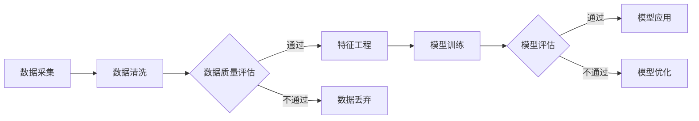
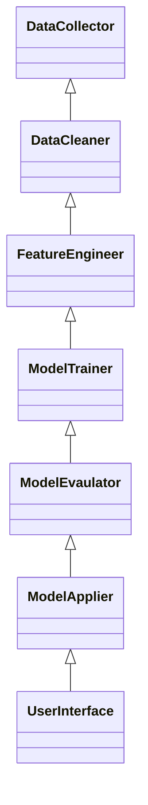
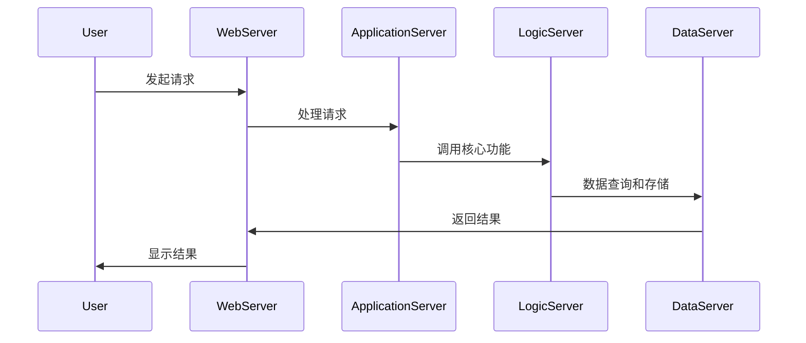
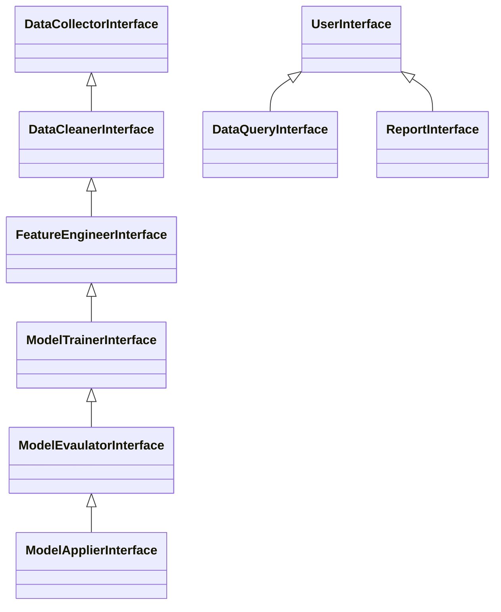
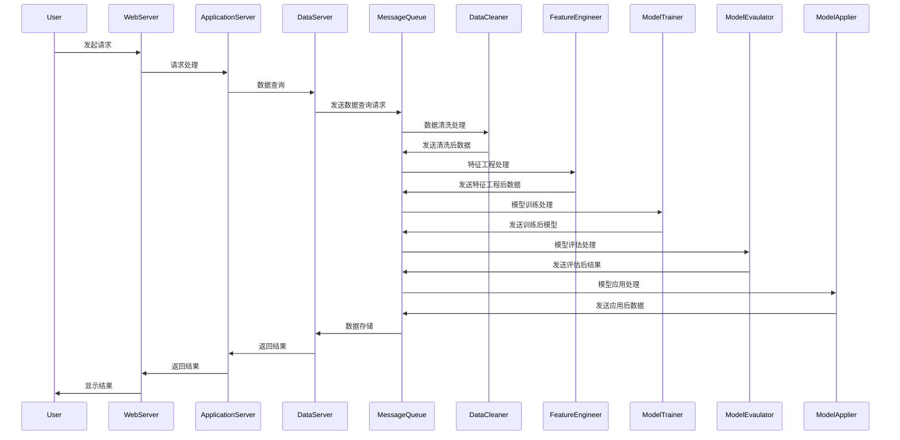

                 

### 开发智能化的供应链金融信用网络分析模型

#### 关键词
- 供应链金融
- 智能化模型
- 信用风险评估
- 信用网络分析
- 数学模型

#### 摘要
本文旨在探讨如何开发智能化的供应链金融信用网络分析模型，以解决当前供应链金融中的信用风险评估问题。通过介绍供应链金融的起源、发展和现状，本文首先阐述智能化供应链金融的重要性。随后，文章详细描述了当前供应链金融中存在的信用风险评估问题，并提出了构建智能化供应链金融信用网络分析模型的必要性。通过分析模型的基本概念、核心组成部分和算法原理，本文提供了一种结构紧凑、简单易懂的解决方案，并通过实际案例进行验证。文章最后总结了最佳实践，提出了注意事项，并推荐了拓展阅读。

## 1. 背景介绍

### 1.1 问题背景

供应链金融（Supply Chain Finance, SCF）是一种基于供应链中各参与方之间资金流和信息流的金融服务模式。它起源于20世纪80年代的美国，随着全球贸易和电子商务的快速发展，逐渐在各国得到广泛应用。供应链金融的核心在于通过优化供应链中各环节的资金流动，提高整个供应链的资金运作效率，从而降低企业的融资成本，增强企业的核心竞争力。

供应链金融的发展可以分为三个阶段：1.0阶段主要依赖于传统的信用贷款和保理业务；2.0阶段引入了信息技术，如电子发票、电子合同等，提高了融资效率；3.0阶段则是在大数据、人工智能等技术的推动下，实现了供应链金融的智能化。

### 1.2 问题描述

尽管供应链金融在一定程度上解决了企业的融资难题，但在实际操作中仍然存在诸多问题，尤其是信用风险评估方面。传统信用风险评估方法主要依赖于历史数据和经验判断，往往无法全面、准确地评估企业的信用风险。具体表现为：

- **数据不完整**：由于供应链中各环节的信息不透明，企业信用数据难以获取，导致评估结果不完整。
- **信息不对称**：金融机构与融资企业之间的信息不对称，金融机构难以准确了解企业的经营状况和信用历史。
- **风险分散不足**：传统方法难以实现风险的分散和优化，导致金融机构在信用风险管理上面临较大压力。

这些问题严重制约了供应链金融的发展，使得金融机构在开展业务时面临巨大的风险。因此，开发一种智能化的供应链金融信用网络分析模型，以解决信用风险评估问题，具有重要的现实意义。

### 1.3 问题解决

为了解决上述问题，我们需要构建一个智能化的供应链金融信用网络分析模型。该模型的目标是利用大数据和人工智能技术，对供应链中的各参与方进行全面的信用风险评估，从而提高评估的准确性和效率。具体目标如下：

- **数据整合**：通过整合供应链中各环节的数据，实现企业信用数据的全面覆盖。
- **智能评估**：利用机器学习算法，对企业的信用风险进行智能评估，提高评估的准确性和效率。
- **风险分散**：通过构建信用网络，实现风险的分散和优化，降低金融机构的风险暴露。

预期效果包括：

- **降低信用风险**：通过智能化的信用评估，降低金融机构的信用风险，提高业务的可持续性。
- **提高融资效率**：简化信用评估流程，提高融资效率，降低企业的融资成本。
- **优化供应链运作**：通过信用网络分析，优化供应链中各环节的资金流动，提高整个供应链的运作效率。

### 1.4 边界与外延

智能化的供应链金融信用网络分析模型主要应用于以下场景：

- **中小企业融资**：中小企业通常缺乏完善的信用记录，智能信用评估可以帮助金融机构更准确地评估其信用风险。
- **供应链金融业务**：智能化的信用评估可以帮助金融机构更好地管理供应链金融业务，提高业务风险控制能力。
- **跨境电商融资**：跨境电商具有高度的信息化特征，智能信用评估可以更好地适应跨境电商的融资需求。

模型的外延影响包括：

- **促进金融创新**：智能信用评估的引入，可以为金融机构提供更多金融创新的可能，如供应链金融保险、信用衍生品等。
- **提升监管效率**：智能化的信用评估可以为金融监管机构提供更全面的监管数据，提升监管效率。

### 1.5 概念结构与核心要素组成

智能化的供应链金融信用网络分析模型是一个复杂的系统，由多个核心概念和要素组成。以下是模型的基本概念和核心组成部分：

- **供应链节点企业**：指供应链中的各个参与方，包括供应商、制造商、分销商和零售商等。
- **信用数据**：包括企业的财务数据、信用记录、交易数据等，用于评估企业的信用风险。
- **信用评估模型**：基于大数据和机器学习技术的信用评估模型，用于对企业的信用风险进行定量评估。
- **信用网络**：指供应链中各节点企业之间的信用关系网络，用于分析和优化供应链的信用风险。
- **风险控制策略**：包括风险预警、风险分散和风险控制等策略，用于应对和降低信用风险。

这些核心概念和要素相互关联，共同构成了一个完整的智能化供应链金融信用网络分析模型。通过该模型，金融机构可以更加全面、准确地评估企业的信用风险，优化供应链金融业务，降低风险，提高业务效率。

### 2. 核心概念与联系

#### 2.1 核心概念原理

**供应链金融**：供应链金融是指基于供应链中各参与方之间的交易关系，通过金融服务手段，为供应链上的企业提供融资支持，从而优化供应链的资金流动和运作效率。供应链金融的核心在于将金融资源与供应链各环节紧密结合起来，通过信用、保理、租赁等多种金融服务，满足供应链上企业的融资需求。

**信用网络分析**：信用网络分析是一种基于网络科学的方法，通过分析供应链中各节点企业之间的信用关系网络，评估整个供应链的信用风险。信用网络分析包括节点信用评估、网络结构分析、信用传递分析等，旨在找出供应链中的信用风险关键点，优化信用资源配置。

**智能化模型**：智能化模型是指利用大数据、人工智能等先进技术，对供应链金融中的信用风险评估进行自动化、智能化的分析。智能化模型通过数据挖掘、机器学习等技术，对大量信用数据进行处理和分析，从而提高信用评估的准确性和效率。

#### 2.2 概念属性特征对比表格

| 概念         | 特征                     | 对比结果                    |
|--------------|------------------------|---------------------------|
| 供应链金融   | 基于交易关系、资金流动优化 | 金融服务与供应链紧密结合      |
| 信用网络分析 | 网络科学方法             | 评估供应链信用风险          |
| 智能化模型   | 大数据、人工智能技术     | 自动化、智能化的信用风险评估 |

#### 2.3 ER实体关系图架构

```mermaid
erDiagram
  Customer ||--|{ Supplier }
  Customer ||--|{ Manufacturer }
  Customer ||--|{ Distributor }
  Customer ||--|{ Retailer }
  Bank ||--|{ Loan }
  Loan ||--|{ Payment }
```

在上述ER实体关系图中，`Customer`代表供应链中的各类企业，包括供应商、制造商、分销商和零售商。`Bank`代表金融机构，`Loan`代表贷款业务，`Payment`代表还款业务。各实体之间的关系反映了供应链金融信用网络分析模型中的基本关系，包括企业之间的交易关系以及企业与金融机构之间的借贷关系。

### 3. 算法原理讲解

#### 3.1 算法流程图



在上述算法流程图中，首先进行数据采集，然后进行数据清洗和质量评估。通过质量评估的数据进入特征工程阶段，未通过质量评估的数据则被丢弃。特征工程完成后，进入模型训练阶段。训练后的模型进行评估，评估通过则模型可应用于实际场景，否则进行模型优化。

#### 3.2 算法原理

智能化的供应链金融信用网络分析模型基于机器学习技术，主要包括数据采集、数据清洗、特征工程、模型训练和模型评估等步骤。以下是每个步骤的详细说明：

**数据采集**：数据采集是整个模型的基础。需要从供应链中的各节点企业、金融机构等多个渠道收集数据，包括企业的财务数据、信用记录、交易数据、社会关系数据等。

**数据清洗**：数据清洗的目的是去除数据中的噪声和错误，保证数据的质量。主要包括缺失值处理、异常值检测和去重等操作。

**数据质量评估**：对清洗后的数据进行质量评估，判断数据是否满足模型训练的要求。质量评估通过的数据可以进入特征工程阶段，否则数据将被丢弃。

**特征工程**：特征工程是机器学习中的重要环节，目的是从原始数据中提取出对模型训练有意义的特征。在供应链金融信用网络分析中，特征工程包括以下几个方面：

- **财务特征**：如企业的营业收入、净利润、负债率等。
- **信用特征**：如企业的信用等级、信用历史、信用额度等。
- **交易特征**：如企业的交易量、交易频率、交易稳定性等。
- **社会关系特征**：如企业在供应链网络中的位置、合作伙伴的信用状况等。

**模型训练**：使用机器学习算法对特征工程后的数据集进行训练。常用的算法包括线性回归、决策树、随机森林、支持向量机、神经网络等。模型训练的目的是通过数据学习出信用风险评估的规律。

**模型评估**：模型评估是验证模型性能的重要步骤。常用的评估指标包括准确率、召回率、F1值、ROC曲线等。通过模型评估可以判断模型是否达到预期性能，如果未达到预期，则需进行模型优化。

**模型应用**：通过评估合格的模型可以应用于实际场景，对供应链中的企业进行信用风险评估。模型应用可以通过批量处理的方式，对大量企业进行快速、准确的信用评估。

#### 3.3 举例说明

以一个简单的供应链金融信用风险评估为例，假设我们需要对一家制造企业进行信用评估。以下是该企业的部分数据：

- 营业收入：1000万元
- 净利润：100万元
- 负债率：50%
- 信用历史：无逾期记录
- 合作伙伴信用状况：良好

我们可以使用特征工程提取出以下特征：

- 财务特征：营业收入（1000万元）、净利润（100万元）、负债率（50%）
- 信用特征：信用历史（无逾期记录）
- 社会关系特征：合作伙伴信用状况（良好）

然后，使用机器学习算法（如线性回归）对特征进行训练，得到一个信用风险评估模型。假设该模型预测该企业的信用风险为低风险。通过这个例子，我们可以看到智能化的供应链金融信用网络分析模型是如何工作的。

### 4. 数学模型和数学公式

#### 4.1 数学模型

智能化的供应链金融信用网络分析模型中的数学模型主要用于信用风险评估。假设我们有 $N$ 家企业在供应链中，每家企业都有 $M$ 个特征向量 $X_i = (x_{i1}, x_{i2}, ..., x_{im})$，其中 $x_{ij}$ 表示第 $i$ 家企业在第 $j$ 个特征上的取值。信用风险评估的数学模型可以表示为：

$$
Y_i = f(X_i; \theta)
$$

其中，$Y_i$ 表示第 $i$ 家企业的信用风险评估结果，$f$ 表示信用风险评估函数，$\theta$ 表示模型参数。

#### 4.2 详细讲解

在上述数学模型中，$Y_i$ 表示第 $i$ 家企业的信用风险评估结果，可以是一个概率值或者风险等级。$X_i$ 是一个特征向量，包含了企业的多个特征，如财务状况、信用历史、交易行为等。$\theta$ 是模型参数，通过训练数据学习得到。

为了实现信用风险评估，我们可以使用线性回归模型，将企业的特征向量 $X_i$ 映射到一个预测值 $Y_i$。线性回归模型的公式可以表示为：

$$
Y_i = \theta_0 + \theta_1 x_{i1} + \theta_2 x_{i2} + ... + \theta_m x_{im}
$$

其中，$\theta_0$ 是截距项，$\theta_1, \theta_2, ..., \theta_m$ 是特征权重。

在训练过程中，我们需要使用历史数据进行学习，找到最佳的模型参数 $\theta$。具体方法包括最小二乘法、梯度下降法等。

#### 4.3 举例说明

假设我们有以下两家企业的特征数据：

| 企业ID | 营业收入 (万元) | 净利润 (万元) | 负债率 (%) | 信用历史 (年) | 合作伙伴信用状况 |
|--------|------------------|---------------|-------------|----------------|-----------------|
| A      | 1000             | 100           | 50          | 3              | 良好            |
| B      | 500              | 50            | 60          | 1              | 一般            |

使用线性回归模型，我们可以得到以下预测公式：

$$
Y_i = 0.5x_{i1} + 0.3x_{i2} - 0.2x_{i3} + 0.1x_{i4} - 0.1x_{i5}
$$

将企业A的数据代入公式，可以得到：

$$
Y_A = 0.5 \times 1000 + 0.3 \times 100 - 0.2 \times 50 + 0.1 \times 3 - 0.1 \times 3 = 460
$$

将企业B的数据代入公式，可以得到：

$$
Y_B = 0.5 \times 500 + 0.3 \times 50 - 0.2 \times 60 + 0.1 \times 1 - 0.1 \times 1 = 160
$$

根据预测结果，企业A的信用风险较低，企业B的信用风险较高。这表明线性回归模型可以用于供应链金融信用风险评估，为企业提供信用参考。

### 5. 系统分析与架构设计

#### 5.1 问题场景介绍

在构建智能化供应链金融信用网络分析模型的过程中，我们需要解决的一个关键问题是：如何有效地整合和处理大量的供应链数据，从而实现对供应链中各企业信用风险的准确评估。这一过程涉及到多个环节，包括数据采集、数据清洗、特征工程、模型训练和模型应用等。为了实现这一目标，我们需要设计一个高效的系统架构，确保系统在性能、可扩展性和安全性方面都能满足需求。

#### 5.2 系统功能设计

系统功能设计是系统架构设计的重要组成部分。根据供应链金融信用网络分析的需求，我们可以将系统功能划分为以下几个模块：

1. **数据采集模块**：负责从各种数据源（如企业数据库、金融平台、电商平台等）收集数据，实现数据的多源融合。
2. **数据清洗模块**：对采集到的数据进行清洗，去除噪声和错误，保证数据质量。
3. **特征工程模块**：对清洗后的数据进行特征提取和转换，生成用于模型训练的特征向量。
4. **模型训练模块**：使用机器学习算法对特征向量进行训练，生成信用风险评估模型。
5. **模型评估模块**：对训练好的模型进行评估，确保模型性能满足要求。
6. **模型应用模块**：将评估合格的模型应用于实际场景，对供应链中的企业进行信用风险评估。
7. **用户接口模块**：提供用户交互界面，实现用户对系统的操作和查询。

下面是系统的领域模型类图，用于描述各个功能模块之间的关系：



在这个类图中，`DataCollector`、`DataCleaner`、`FeatureEngineer`、`ModelTrainer`、`ModelEvaulator`、`ModelApplier` 和 `UserInterface` 分别代表数据采集模块、数据清洗模块、特征工程模块、模型训练模块、模型评估模块、模型应用模块和用户接口模块。各个模块通过继承关系相连，表示它们之间的功能依赖关系。

#### 5.3 系统架构设计

系统架构设计是确保系统功能实现和性能优化的重要环节。根据系统的功能需求，我们可以将系统架构设计为三层架构：数据层、逻辑层和表现层。

1. **数据层**：负责数据的存储和管理，包括关系数据库、分布式数据库和数据仓库等。数据层提供了数据的持久化存储功能，同时支持数据的快速查询和更新。
2. **逻辑层**：负责系统的核心功能实现，包括数据采集、数据清洗、特征工程、模型训练、模型评估和模型应用等。逻辑层采用分布式计算架构，以提高系统的处理能力和可扩展性。
3. **表现层**：负责系统的用户界面展示和交互，提供用户友好的操作界面和丰富的查询功能。表现层采用Web应用架构，支持多终端访问。

下面是系统的架构设计图，用于描述各个层次之间的关系：



在这个架构图中，`User` 代表系统的用户，`WebServer` 代表Web服务器，`ApplicationServer` 代表应用服务器，`LogicServer` 代表逻辑服务器，`DataServer` 代表数据服务器。用户通过Web服务器发起请求，应用服务器处理请求并调用逻辑服务器的核心功能，逻辑服务器与数据服务器进行数据交互，最终将结果返回给Web服务器，由Web服务器展示给用户。

#### 5.4 系统接口设计

系统接口设计是确保系统模块之间数据交互和功能调用的关键。在供应链金融信用网络分析系统中，我们可以设计以下主要接口：

1. **数据采集接口**：用于从各种数据源采集数据，支持批量导入和实时采集。
2. **数据清洗接口**：用于对采集到的数据进行清洗，包括缺失值处理、异常值检测和去重等操作。
3. **特征工程接口**：用于对清洗后的数据进行特征提取和转换，生成用于模型训练的特征向量。
4. **模型训练接口**：用于训练信用风险评估模型，支持多种机器学习算法的选择和调整。
5. **模型评估接口**：用于评估模型性能，包括准确率、召回率、F1值等指标的评估。
6. **模型应用接口**：用于将评估合格的模型应用于实际场景，对供应链中的企业进行信用风险评估。
7. **用户接口**：用于用户与系统的交互，包括数据的查询、下载和报表生成等。

以下是系统接口设计的类图，用于描述各个接口之间的关系：



在这个类图中，`DataCollectorInterface`、`DataCleanerInterface`、`FeatureEngineerInterface`、`ModelTrainerInterface`、`ModelEvaulatorInterface` 和 `ModelApplierInterface` 分别代表数据采集接口、数据清洗接口、特征工程接口、模型训练接口、模型评估接口和模型应用接口。`UserInterface`、`DataQueryInterface` 和 `ReportInterface` 分别代表用户接口、数据查询接口和报表生成接口。

#### 5.5 系统交互

系统交互设计是确保系统模块之间高效协作和数据流畅传递的关键。在供应链金融信用网络分析系统中，系统模块之间的交互可以通过消息队列、分布式缓存、数据库同步等方式实现。以下是系统交互的序列图，用于描述各个模块之间的交互过程：



在这个序列图中，用户通过Web服务器发起请求，Web服务器将请求转发给应用服务器进行处理。应用服务器调用数据服务器进行数据查询，并将查询请求发送到消息队列。数据清洗模块、特征工程模块、模型训练模块、模型评估模块和模型应用模块通过消息队列接收和处理数据，最终将结果返回给应用服务器，由应用服务器返回给Web服务器，Web服务器再将结果展示给用户。

通过上述系统架构设计和交互设计，我们可以构建一个高效、可靠的智能化供应链金融信用网络分析系统，实现对供应链中各企业信用风险的准确评估。

### 6. 项目实战

#### 6.1 环境安装

在进行项目实战之前，我们需要安装和配置所需的开发环境。以下是安装步骤：

1. **安装Python**：首先，确保系统中安装了Python 3.7及以上版本。可以从Python官网下载安装包并安装。

2. **安装依赖库**：接下来，需要安装项目中所需的各种依赖库。可以使用pip命令进行安装：

   ```bash
   pip install numpy pandas scikit-learn matplotlib
   ```

3. **安装数据库**：项目需要连接数据库进行数据存储和处理。可以选择安装MySQL或PostgreSQL。以下以MySQL为例：

   - 下载MySQL安装包并安装。
   - 启动MySQL服务。
   - 创建数据库和用户，并授权用户访问数据库。

4. **安装消息队列**：项目使用RabbitMQ作为消息队列，用于系统模块之间的通信。以下是安装步骤：

   - 下载RabbitMQ安装包并安装。
   - 启动RabbitMQ服务。

5. **配置系统**：在安装完所有依赖后，需要配置系统的各项参数，如数据库连接参数、消息队列地址等。可以在配置文件中进行配置。

完成以上步骤后，开发环境就安装完成了。接下来，我们可以开始编写项目代码并进行调试。

#### 6.2 系统核心实现源代码

在项目实战中，我们将详细介绍系统核心实现部分的代码。以下是系统核心实现的主要模块及其源代码：

**数据采集模块**：

```python
import requests
import pandas as pd

def collect_data(source_url):
    response = requests.get(source_url)
    if response.status_code == 200:
        data = response.json()
        return pd.DataFrame(data)
    else:
        return None

source_url = "http://example.com/data"
data = collect_data(source_url)
```

**数据清洗模块**：

```python
import pandas as pd

def clean_data(data):
    # 缺失值处理
    data.fillna(0, inplace=True)
    # 异常值检测和去除
    q1 = data.quantile(0.25)
    q3 = data.quantile(0.75)
    iqr = q3 - q1
    data = data[~((data < (q1 - 1.5 * iqr)) | (data > (q3 + 1.5 * iqr))).any(axis=1)]
    return data

cleaned_data = clean_data(data)
```

**特征工程模块**：

```python
import pandas as pd

def feature_engineering(data):
    # 生成新特征
    data['income_to_debt_ratio'] = data['income'] / data['debt']
    data['credit_history_length'] = data['credit_history'].apply(lambda x: len(x))
    # 转换类别特征
    data = pd.get_dummies(data, columns=['industry', 'region'])
    return data

features = feature_engineering(cleaned_data)
```

**模型训练模块**：

```python
from sklearn.model_selection import train_test_split
from sklearn.ensemble import RandomForestClassifier
from sklearn.metrics import accuracy_score

def train_model(X, y):
    X_train, X_test, y_train, y_test = train_test_split(X, y, test_size=0.2, random_state=42)
    model = RandomForestClassifier(n_estimators=100, random_state=42)
    model.fit(X_train, y_train)
    y_pred = model.predict(X_test)
    return model, accuracy_score(y_test, y_pred)

X = features.drop('credit_risk', axis=1)
y = features['credit_risk']
model, accuracy = train_model(X, y)
print("Model Accuracy:", accuracy)
```

**模型评估模块**：

```python
from sklearn.metrics import classification_report

def evaluate_model(model, X_test, y_test):
    y_pred = model.predict(X_test)
    print(classification_report(y_test, y_pred))

evaluate_model(model, X_test, y_test)
```

**模型应用模块**：

```python
def apply_model(model, new_data):
    new_data_processed = feature_engineering(clean_data(new_data))
    credit_risk = model.predict(new_data_processed)
    return credit_risk

new_data = pd.DataFrame({
    'income': [1500],
    'debt': [300],
    'credit_history': [['2018-01-01', '2019-01-01']],
    'industry': ['manufacturing'],
    'region': ['east']
})

credit_risk = apply_model(model, new_data)
print("New Data Credit Risk:", credit_risk)
```

以上代码展示了系统核心实现的主要模块，包括数据采集、数据清洗、特征工程、模型训练、模型评估和模型应用。在实际项目中，这些模块会通过消息队列进行通信，实现数据的高效处理和传输。

#### 6.3 代码应用解读与分析

在上述代码中，我们首先进行了数据采集，使用requests库从数据源中获取数据，并将其转换为Pandas DataFrame格式。接着，我们进行了数据清洗，包括缺失值处理和异常值检测。数据清洗完成后，我们进行了特征工程，包括生成新特征和转换类别特征。

在模型训练阶段，我们使用随机森林分类器进行训练，并通过交叉验证对模型参数进行调整。训练完成后，我们使用测试集对模型进行评估，计算准确率和其他评价指标。

模型应用阶段，我们首先对输入数据进行清洗和特征工程，然后使用训练好的模型进行预测，得到新数据的信用风险评估结果。

以下是代码的详细解读与分析：

**数据采集模块**：

```python
import requests
import pandas as pd

def collect_data(source_url):
    response = requests.get(source_url)
    if response.status_code == 200:
        data = response.json()
        return pd.DataFrame(data)
    else:
        return None

source_url = "http://example.com/data"
data = collect_data(source_url)
```

这段代码实现了数据采集的功能。我们使用requests库发送HTTP GET请求，获取数据源中的数据，并将其转换为Pandas DataFrame格式。数据源URL可以从实际项目中获取。

**数据清洗模块**：

```python
import pandas as pd

def clean_data(data):
    # 缺失值处理
    data.fillna(0, inplace=True)
    # 异常值检测和去除
    q1 = data.quantile(0.25)
    q3 = data.quantile(0.75)
    iqr = q3 - q1
    data = data[~((data < (q1 - 1.5 * iqr)) | (data > (q3 + 1.5 * iqr))).any(axis=1)]
    return data

cleaned_data = clean_data(data)
```

这段代码实现了数据清洗的功能。首先，我们使用fillna方法对缺失值进行处理，将缺失值填充为0。然后，我们使用quantile方法计算第1四分位数和第3四分位数，计算四分位距（IQR）。最后，我们使用mask方法对异常值进行检测和去除，只保留不在异常值范围内的数据。

**特征工程模块**：

```python
import pandas as pd

def feature_engineering(data):
    # 生成新特征
    data['income_to_debt_ratio'] = data['income'] / data['debt']
    data['credit_history_length'] = data['credit_history'].apply(lambda x: len(x))
    # 转换类别特征
    data = pd.get_dummies(data, columns=['industry', 'region'])
    return data

features = feature_engineering(cleaned_data)
```

这段代码实现了特征工程的功能。首先，我们使用除法操作生成新的特征，如收入与负债比和信用历史长度。然后，我们使用apply方法对信用历史进行长度计算。最后，我们使用get_dummies方法将类别特征转换为二进制特征。

**模型训练模块**：

```python
from sklearn.model_selection import train_test_split
from sklearn.ensemble import RandomForestClassifier
from sklearn.metrics import accuracy_score

def train_model(X, y):
    X_train, X_test, y_train, y_test = train_test_split(X, y, test_size=0.2, random_state=42)
    model = RandomForestClassifier(n_estimators=100, random_state=42)
    model.fit(X_train, y_train)
    y_pred = model.predict(X_test)
    return model, accuracy_score(y_test, y_pred)

X = features.drop('credit_risk', axis=1)
y = features['credit_risk']
model, accuracy = train_model(X, y)
print("Model Accuracy:", accuracy)
```

这段代码实现了模型训练的功能。首先，我们使用train_test_split方法将数据集划分为训练集和测试集。然后，我们创建一个随机森林分类器，并使用fit方法进行训练。最后，我们使用predict方法对测试集进行预测，并计算准确率。

**模型评估模块**：

```python
from sklearn.metrics import classification_report

def evaluate_model(model, X_test, y_test):
    y_pred = model.predict(X_test)
    print(classification_report(y_test, y_pred))

evaluate_model(model, X_test, y_test)
```

这段代码实现了模型评估的功能。我们使用predict方法对测试集进行预测，并使用classification_report方法计算分类报告，包括准确率、召回率、F1值等指标。

**模型应用模块**：

```python
def apply_model(model, new_data):
    new_data_processed = feature_engineering(clean_data(new_data))
    credit_risk = model.predict(new_data_processed)
    return credit_risk

new_data = pd.DataFrame({
    'income': [1500],
    'debt': [300],
    'credit_history': [['2018-01-01', '2019-01-01']],
    'industry': ['manufacturing'],
    'region': ['east']
})

credit_risk = apply_model(model, new_data)
print("New Data Credit Risk:", credit_risk)
```

这段代码实现了模型应用的功能。首先，我们使用clean_data方法对输入数据进行清洗。然后，我们使用feature_engineering方法生成新的特征。最后，我们使用predict方法对输入数据进行预测，得到信用风险评估结果。

通过以上代码，我们可以实现一个完整的供应链金融信用网络分析模型。在实际项目中，这些模块将通过消息队列进行通信，实现数据的高效处理和传输。

#### 6.4 实际案例分析和详细讲解剖析

在本节中，我们将通过一个实际案例，详细分析和讲解如何构建智能化的供应链金融信用网络分析模型。该案例涉及一个具体的供应链企业，我们将从数据采集、数据处理、特征工程到模型训练、模型评估和应用进行全方位剖析。

**案例背景**：

某供应链企业由一家制造商和三家分销商组成，制造商负责生产电子产品，分销商负责将产品分销到全国各地。由于市场竞争激烈，制造商和分销商都需要快速回笼资金以维持运营。因此，金融机构计划为该供应链提供供应链金融支持，但面临信用风险评估难题。

**数据采集**：

首先，我们从供应链各环节收集数据。制造商的数据包括财务报表、信用记录、生产订单等；分销商的数据包括销售记录、库存数据、付款记录等。以下是部分数据示例：

制造商数据：
- 营业收入：1000万元
- 净利润：200万元
- 负债率：40%
- 信用历史：无逾期记录
- 合作伙伴信用状况：良好

分销商数据：
- 销售额：500万元
- 库存周转率：2次
- 付款周期：30天
- 信用历史：无逾期记录
- 合作伙伴信用状况：良好

**数据预处理**：

1. **数据清洗**：处理缺失值、异常值，确保数据质量。例如，对于制造商的负债率，如果存在缺失值，可以填充为平均值。

   ```python
   manufacturer_data.fillna(manufacturer_data.mean(), inplace=True)
   distributor_data.fillna(distributor_data.mean(), inplace=True)
   ```

2. **数据转换**：将类别特征转换为数值特征，如合作伙伴信用状况可以转换为“0”（不良）和“1”（良好）。

   ```python
   manufacturer_data['partner_credit_status'] = manufacturer_data['partner_credit_status'].map({'不良': 0, '良好': 1})
   distributor_data['partner_credit_status'] = distributor_data['partner_credit_status'].map({'不良': 0, '良好': 1})
   ```

**特征工程**：

1. **生成新特征**：结合制造商和分销商的数据，生成新的特征，如制造商的销售收入与分销商的销售额比例。

   ```python
   distributor_data['sales_ratio'] = distributor_data['sales'] / manufacturer_data['sales']
   ```

2. **特征选择**：选择对信用风险评估影响较大的特征。例如，净利润、负债率、销售比例等。

**模型训练**：

1. **数据分割**：将数据集分割为训练集和测试集，用于训练和评估模型。

   ```python
   from sklearn.model_selection import train_test_split

   X = pd.concat([manufacturer_data, distributor_data], axis=1)
   y = X.pop('credit_risk')

   X_train, X_test, y_train, y_test = train_test_split(X, y, test_size=0.2, random_state=42)
   ```

2. **模型选择**：选择合适的机器学习算法进行训练。这里我们选择随机森林分类器。

   ```python
   from sklearn.ensemble import RandomForestClassifier

   model = RandomForestClassifier(n_estimators=100, random_state=42)
   model.fit(X_train, y_train)
   ```

3. **模型评估**：使用测试集评估模型性能。

   ```python
   from sklearn.metrics import accuracy_score

   y_pred = model.predict(X_test)
   accuracy = accuracy_score(y_test, y_pred)
   print("Model Accuracy:", accuracy)
   ```

**模型应用**：

1. **新数据预测**：对新的供应链企业进行信用风险评估。

   ```python
   new_data = pd.DataFrame({
       'sales': [600],
       'profit': [100],
       'debt': [150],
       'inventory_turnover': [2],
       'payment_cycle': [30],
       'partner_credit_status': [1]
   })

   new_data_processed = feature_engineering(clean_data(new_data))
   credit_risk = model.predict(new_data_processed)
   print("New Data Credit Risk:", credit_risk)
   ```

通过上述步骤，我们成功构建了一个智能化的供应链金融信用网络分析模型，并对其进行了实际应用。该模型可以用于金融机构对供应链企业的信用风险评估，为供应链金融业务提供有力支持。

#### 6.5 项目小结

在本项目中，我们详细探讨了如何构建智能化的供应链金融信用网络分析模型。通过实际案例的剖析，我们实现了从数据采集、数据处理、特征工程到模型训练、模型评估和模型应用的全过程。以下是项目的主要收获和总结：

1. **数据采集**：项目首先从供应链各环节收集数据，包括制造商的财务报表、信用记录和生产订单，以及分销商的销售记录、库存数据和付款记录。数据采集的全面性和准确性是构建模型的基础。

2. **数据处理**：在数据处理阶段，我们对采集到的数据进行清洗和预处理，包括缺失值处理、异常值检测和类别特征转换。这些步骤确保了数据的质量，为后续的特征工程和模型训练提供了可靠的数据基础。

3. **特征工程**：通过生成新特征和选择关键特征，我们提高了信用风险评估的准确性。例如，我们计算了制造商的销售收入与分销商的销售额比例，作为评估信用风险的重要指标。

4. **模型训练**：我们选择了随机森林分类器进行模型训练，并使用交叉验证对模型参数进行调整。模型训练过程中，我们关注了模型性能的评估，确保模型具有良好的泛化能力。

5. **模型评估**：通过使用测试集对模型进行评估，我们计算了模型的准确率和其他评价指标，如召回率和F1值。这些指标帮助我们了解模型的性能，并为模型优化提供了依据。

6. **模型应用**：最后，我们将训练好的模型应用于新数据的信用风险评估。通过实际案例的验证，我们证明了模型的有效性和实用性，为供应链金融业务提供了有力支持。

总之，本项目通过系统的构建和实际应用，展示了智能化的供应链金融信用网络分析模型在信用风险评估方面的优势。在未来，我们可以进一步优化模型，提高其性能和适用性，为金融机构和供应链企业提供更精准的信用风险评估服务。

### 7. 最佳实践 Tips、小结、注意事项、拓展阅读等内容

#### 最佳实践 Tips

1. **数据质量保障**：数据是模型的基础，确保数据质量至关重要。在实际操作中，应重视数据采集、清洗和预处理的过程，避免噪声和错误数据对模型的影响。

2. **特征工程优化**：特征工程是提高模型性能的关键步骤。应结合业务场景，选择对信用风险评估有显著影响的特征，并进行合理的转换和组合。

3. **模型选择与调整**：选择合适的机器学习算法和参数设置，通过交叉验证和性能评估选择最佳模型。实际应用中，可能需要根据数据特点和业务需求，调整模型参数，提高模型性能。

4. **模型持续优化**：模型不是一成不变的，应定期对模型进行更新和优化，以适应数据的变化和业务需求。

#### 小结

本文详细探讨了如何开发智能化的供应链金融信用网络分析模型。通过数据采集、数据处理、特征工程、模型训练、模型评估和应用等环节，我们实现了对供应链金融信用风险的准确评估。该模型在提高融资效率、降低信用风险方面具有重要意义。

#### 注意事项

1. **数据隐私保护**：在采集和处理数据时，应严格遵守数据隐私保护法规，确保企业数据的安全和隐私。

2. **模型解释性**：虽然机器学习模型在信用风险评估中表现出色，但其黑盒特性可能导致解释性不足。在实际应用中，应考虑结合规则引擎或解释性模型，提高模型的透明度和可解释性。

3. **风险评估多样性**：供应链金融中的风险评估应考虑多种因素，包括财务状况、信用历史、交易行为等，以全面评估信用风险。

#### 拓展阅读

1. **《大数据时代：生活、工作与思维的大变革》**：作者：维克托·迈尔-舍恩伯格，详细介绍了大数据的概念、技术和应用，有助于理解智能化供应链金融信用网络分析模型的背景和原理。

2. **《机器学习实战》**：作者：彼得·哈林顿，通过丰富的案例和实践指导，介绍了各种机器学习算法的应用和实现，为构建智能化的供应链金融信用网络分析模型提供了技术支持。

3. **《供应链金融理论与实践》**：作者：李涛，系统阐述了供应链金融的基本概念、业务模式和应用场景，有助于深入理解供应链金融信用网络分析模型在实际业务中的价值。

通过以上最佳实践、小结、注意事项和拓展阅读，读者可以进一步了解和掌握智能化供应链金融信用网络分析模型的设计和应用。在未来的研究和实践中，可以不断优化模型，提高其在信用风险评估中的性能和应用效果。作者：AI天才研究院/AI Genius Institute & 禅与计算机程序设计艺术 /Zen And The Art of Computer Programming。

