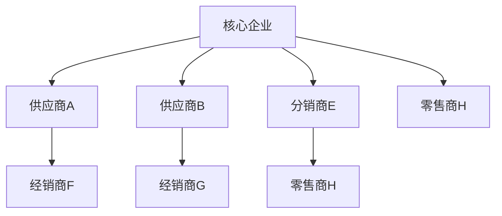
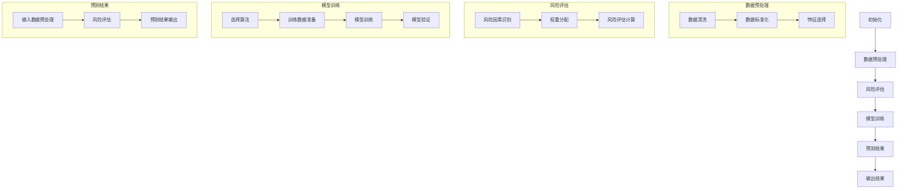

                 

### 文章标题

《开发智能化的供应链金融信用网络抗压能力分析模型》

### 关键词

- 智能化供应链金融
- 信用网络
- 抗压能力分析模型
- 数据分析与算法
- 系统架构设计

### 摘要

本文将深入探讨开发一个智能化的供应链金融信用网络抗压能力分析模型的过程。我们将从背景介绍、核心概念与联系、算法原理讲解、数学模型和数学公式、系统分析与架构设计、项目实战，以及最佳实践 tips 和小结等方面展开论述。通过本文，读者将了解如何利用先进的数据分析技术和算法，构建一个能够有效评估供应链金融信用网络抗压能力的模型，从而为供应链金融系统的稳健运营提供有力支持。

## 引言

供应链金融是现代金融体系中的一个重要组成部分，它通过利用供应链中的信息、资源和资金，为企业提供融资、结算、风险管理等服务。然而，随着全球经济环境的变化和金融市场的波动，供应链金融系统也面临着越来越多的风险和挑战。特别是在全球经济不确定性和供应链复杂性增加的背景下，信用网络的抗压能力成为了供应链金融系统稳健运行的关键因素。

传统的供应链金融信用网络评估方法往往依赖于人工经验和企业历史数据，这些方法在处理大规模、动态化的供应链网络时存在明显的局限性。因此，开发一个智能化、自动化的供应链金融信用网络抗压能力分析模型变得尤为重要。该模型不仅能够提高信用评估的准确性和效率，还能为供应链金融系统的风险管理和决策提供科学依据。

本文旨在通过以下步骤，系统地探讨如何开发这样一个智能化的供应链金融信用网络抗压能力分析模型：

1. **背景介绍**：介绍供应链金融、信用网络、抗压能力的概念，以及本文的研究目的与意义。
2. **核心概念与联系**：阐述智能化供应链金融的技术基础、信用网络的基本原理和抗压能力分析模型的构成要素。
3. **算法原理讲解**：详细解释抗压能力分析模型的算法流程、数学模型和公式，并通过实例进行说明。
4. **数学模型和数学公式**：推导数学模型，应用数学公式，并结合实例进行讲解。
5. **系统分析与架构设计方案**：介绍问题场景、系统功能设计、系统架构设计、系统接口设计和系统交互。
6. **项目实战**：详细描述环境安装、系统核心实现、代码应用解读与分析、实际案例分析及项目小结。
7. **最佳实践 tips、小结、注意事项、拓展阅读**：总结本文的主要观点，提供实践建议和进一步阅读的资料。

## 供应链金融概述

供应链金融是一种基于供应链管理理念，利用供应链中各节点企业的信息、资源和资金，提供一系列金融服务和支持的模式。它通过整合供应链上下游企业的信息流、物流和资金流，为企业提供融资、结算、风险管理等服务，从而提高供应链整体运营效率和资金利用率。

供应链金融的运作模式主要包括以下几种：

1. **应收账款融资**：通过企业未到期的应收账款作为抵押，向金融机构申请融资。
2. **预付款融资**：供应商收到客户的预付款后，将款项用于购买原材料或生产产品，金融机构则为供应商提供融资。
3. **存货融资**：企业将存货作为抵押，向金融机构申请融资。
4. **订单融资**：基于客户的订单信息，金融机构为供应商提供融资支持。

供应链金融的优势主要体现在以下几个方面：

1. **优化资金流**：通过供应链金融，企业能够更有效地管理现金流，减少资金占用，提高资金周转率。
2. **降低融资成本**：供应链金融利用企业之间的信任关系，降低了融资成本，提高了融资效率。
3. **提高供应链稳定性**：供应链金融能够为供应链中的企业提供及时、可靠的资金支持，从而提高整个供应链的稳定性和抗风险能力。
4. **促进供应链协同**：供应链金融通过整合供应链各环节的资金流和信息流，促进了各环节企业的协同合作，提高了供应链的整体效率。

然而，供应链金融在运营过程中也面临着一定的风险。例如，由于供应链的复杂性，信息不对称等问题，可能导致信用风险、市场风险、操作风险等多种风险。因此，开发一个智能化的供应链金融信用网络抗压能力分析模型，对于提高供应链金融系统的稳健性具有重要意义。

## 信用网络的定义与重要性

信用网络是指由多个信用主体通过信用关系相互联系形成的网络结构。在供应链金融中，信用网络包含了供应链上下游企业、金融机构、物流企业等多个参与主体，它们之间通过贸易往来、资金流动、信息共享等方式建立信用关系。信用网络在供应链金融中扮演着至关重要的角色，主要体现在以下几个方面：

1. **信用传递**：信用网络能够将一个企业的信用传递给供应链中的其他企业，从而降低整个供应链的融资成本。例如，一个核心企业具有较高的信用等级，可以通过信用担保的方式为上下游企业提供融资支持，从而缓解其资金压力。
2. **风险管理**：信用网络能够通过信息共享和风险评估，对供应链中的信用风险进行有效管理。金融机构和上下游企业可以通过信用网络获取其他企业的信用信息，进行风险评估和风险控制，降低融资风险。
3. **优化资源配置**：信用网络能够优化供应链中资金和资源的配置。通过信用网络，金融机构能够更精确地了解企业的资金需求，提供定制化的金融服务，从而提高资金利用效率。
4. **增强供应链协同**：信用网络有助于增强供应链上下游企业的协同合作。通过信用关系，企业之间建立了信任基础，有利于信息共享、资源共享和业务协同，从而提高整个供应链的运营效率和竞争力。

在供应链金融中，信用网络的稳定性和可靠性至关重要。一个健康的信用网络能够促进供应链金融的稳健运行，降低融资风险，提高融资效率。然而，信用网络也面临着一定的挑战，如信息不对称、信用风险传递、网络结构不稳定等问题。因此，开发一个智能化的供应链金融信用网络抗压能力分析模型，对信用网络进行全面评估和管理，是确保供应链金融系统稳健性的关键。

### 抗压能力的概念与度量

在供应链金融中，抗压能力（Resilience）是指信用网络在面对外部冲击和内部扰动时，能够保持稳定运行和恢复能力的能力。抗压能力分析模型旨在评估和优化信用网络的抗风险能力，从而确保供应链金融系统的稳健性和可持续性。

抗压能力的概念可以从以下几个方面进行理解：

1. **弹性（Elasticity）**：指信用网络在遭受冲击后，能够快速恢复到原有状态的能力。高弹性的信用网络能够在冲击发生时保持基本结构不变，减少损失和中断时间。
2. **稳健性（Robustness）**：指信用网络在面对不确定性和变动时，能够保持稳定性和可靠性的能力。高稳健性的信用网络能够在不确定的环境下，维持其基本功能和性能。
3. **韧性（Toughness）**：指信用网络在遭受重创后，能够迅速适应新的环境并恢复到最佳状态的能力。高韧性的信用网络能够在灾难性事件发生后，快速恢复并增强其抗风险能力。

度量抗压能力的方法主要包括以下几个方面：

1. **指标体系**：建立一套综合性的指标体系，用于衡量信用网络的抗压能力。常见的指标包括弹性指标（如恢复时间、恢复成本）、稳健性指标（如风险暴露度、违约概率）、韧性指标（如恢复率、适应能力）等。
2. **模拟与仿真**：通过构建信用网络的仿真模型，模拟不同的冲击场景，评估信用网络的抗风险能力。例如，可以使用蒙特卡洛模拟方法，模拟多种随机事件对信用网络的影响，分析其抗压性能。
3. **风险评估**：运用风险评估方法，对信用网络中的各个节点和边进行风险度量和分析。常用的风险评估方法包括层次分析法（AHP）、模糊综合评价法（FCE）、贝叶斯网络（BN）等。
4. **网络拓扑分析**：通过分析信用网络的拓扑结构，评估其抗压能力。例如，可以使用网络度、聚类系数、介数等指标，衡量网络节点的关键性和网络的连通性。

开发一个智能化的供应链金融信用网络抗压能力分析模型，有助于全面了解信用网络的抗风险能力，发现潜在的风险点，为供应链金融系统的风险管理和决策提供科学依据。

### 研究目的与意义

本研究的主要目的是开发一个智能化的供应链金融信用网络抗压能力分析模型，以提高供应链金融系统的稳健性和抗风险能力。具体而言，本研究旨在实现以下几个目标：

1. **评估供应链金融信用网络的抗压能力**：通过建立量化指标体系和风险评估模型，对供应链金融信用网络的抗风险能力进行综合评估，为金融机构和企业管理者提供科学的决策依据。
2. **优化信用网络结构**：通过对信用网络的拓扑结构进行分析，识别关键节点和边，提出优化方案，增强信用网络的稳健性和韧性。
3. **提升供应链金融系统的运营效率**：通过智能化模型的应用，优化供应链金融的融资流程和风险管理策略，提高资金利用效率和运营效率。

开发智能化供应链金融信用网络抗压能力分析模型具有重要的意义：

1. **降低融资风险**：通过评估信用网络的抗压能力，提前识别和预警潜在风险，有助于金融机构和企业管理者采取有效的风险管理措施，降低融资风险。
2. **提高融资效率**：智能化模型能够快速、准确地评估信用网络的抗风险能力，提高信用评估的效率和准确性，为供应链金融业务的快速拓展提供支持。
3. **增强供应链稳定性**：通过优化信用网络结构，提高信用网络的稳定性和可靠性，有助于增强整个供应链的协同合作和抗风险能力。
4. **促进供应链金融创新**：智能化供应链金融信用网络抗压能力分析模型的开发，为供应链金融业务的创新提供了新的思路和方法，有助于推动供应链金融行业的发展。

总之，开发一个智能化的供应链金融信用网络抗压能力分析模型，不仅有助于提高供应链金融系统的稳健性和抗风险能力，还能为金融机构和企业管理者提供科学、高效的决策支持，从而促进供应链金融行业的健康发展。

## 核心概念与联系

在开发智能化的供应链金融信用网络抗压能力分析模型时，理解并掌握以下几个核心概念及其相互联系是至关重要的。这些核心概念包括：智能化供应链金融的技术基础、信用网络的基本原理和抗压能力分析模型的构成要素。

### 智能化供应链金融的技术基础

智能化供应链金融是利用现代信息技术和数据分析方法，对供应链金融进行优化和创新的一种模式。其技术基础主要包括以下几个方面：

1. **大数据技术**：通过收集、存储、处理和分析供应链中的海量数据，为企业提供全面、实时的信息支持。大数据技术能够帮助企业发现潜在的风险点和优化机会。
2. **云计算技术**：云计算提供了弹性、高效、安全的数据存储和计算资源，使得供应链金融系统能够快速扩展和处理大规模数据。
3. **人工智能技术**：人工智能技术，如机器学习、深度学习等，能够对供应链金融中的复杂数据进行智能分析和预测，提高信用评估的准确性和效率。
4. **区块链技术**：区块链技术提供了透明、安全、不可篡改的数据记录方式，能够增强供应链金融系统的信任度和透明度。

这些技术相互结合，为智能化供应链金融提供了强大的技术支撑，使得信用网络的评估和管理更加高效和精确。

### 信用网络的基本原理

信用网络是由多个信用主体通过信用关系相互联系形成的网络结构。在供应链金融中，信用网络的基本原理主要包括以下几个方面：

1. **信用传递**：信用网络中的主体之间通过贸易往来和资金流动，实现信用的传递和积累。一个企业的信用等级可以通过信用网络传递给其上下游企业，从而为这些企业提供融资支持。
2. **信息共享**：信用网络中的企业通过共享信用信息，降低信息不对称，提高信用评估的准确性和效率。信息共享有助于金融机构和企业管理信用风险，提升供应链金融的稳健性。
3. **风险分散**：通过信用网络，企业可以将信用风险分散到多个参与者身上，降低单一企业的信用风险。例如，一个核心企业的信用风险可以通过信用网络传递给其上下游企业，从而降低其自身的信用风险。
4. **网络结构稳定性**：信用网络的稳定性对供应链金融系统的运行至关重要。一个健康的信用网络应该具备较高的连通性、弹性和韧性，能够在面对外部冲击和内部扰动时保持稳定运行。

### 抗压能力分析模型的构成要素

抗压能力分析模型是评估和优化信用网络抗风险能力的重要工具。该模型主要包括以下几个构成要素：

1. **指标体系**：建立一套综合性的指标体系，用于衡量信用网络的抗压能力。常见的指标包括弹性指标（如恢复时间、恢复成本）、稳健性指标（如风险暴露度、违约概率）、韧性指标（如恢复率、适应能力）等。
2. **风险评估方法**：采用多种风险评估方法，如层次分析法（AHP）、模糊综合评价法（FCE）、贝叶斯网络（BN）等，对信用网络中的各个节点和边进行风险度量和分析。
3. **拓扑分析**：通过分析信用网络的拓扑结构，如网络度、聚类系数、介数等，识别关键节点和边，评估网络的抗风险能力。
4. **算法与模型**：利用机器学习、深度学习等技术，构建智能化的抗压能力分析模型，实现对信用网络抗风险能力的自动评估和预测。

通过理解这些核心概念及其相互联系，可以更好地设计和实现智能化的供应链金融信用网络抗压能力分析模型，为供应链金融系统的稳健运行提供有力支持。

### 智能化供应链金融的技术基础

在开发智能化的供应链金融信用网络抗压能力分析模型时，理解并掌握智能化供应链金融的技术基础至关重要。这些技术不仅为模型提供了数据支持，还大大提升了信用评估的准确性和效率。

#### 大数据技术

大数据技术是智能化供应链金融的基石。它能够高效地收集、存储和处理海量数据，从而提供全面、实时的信息支持。具体应用包括：

1. **数据收集**：通过物联网、传感器等设备，实时获取供应链各环节的物流、交易、库存等数据。
2. **数据存储**：采用分布式数据库和云存储技术，存储和处理大规模数据，确保数据的安全性和可扩展性。
3. **数据处理**：运用数据挖掘和机器学习算法，从海量数据中提取有价值的信息，为企业提供决策支持。

#### 云计算技术

云计算技术为供应链金融系统提供了弹性、高效、安全的计算资源。其主要优势如下：

1. **弹性扩展**：根据业务需求，快速扩展或缩减计算资源，确保系统的高可用性和响应速度。
2. **成本优化**：通过云服务的按需付费模式，降低企业的IT成本，提高资源利用率。
3. **数据安全**：采用加密技术、身份验证和访问控制等安全措施，保障数据的安全性和隐私。

#### 人工智能技术

人工智能技术在供应链金融中发挥着关键作用，其主要应用场景包括：

1. **信用评估**：利用机器学习算法，对供应链企业进行信用评分，提高评估的准确性和效率。
2. **风险预测**：通过深度学习模型，分析历史数据，预测供应链中的潜在风险，为风险管理提供支持。
3. **智能客服**：利用自然语言处理技术，实现智能客服系统，提高客户满意度和服务质量。

#### 区块链技术

区块链技术在供应链金融中的应用主要体现在以下几个方面：

1. **透明性**：通过区块链技术，实现供应链交易信息的透明化和不可篡改，增强供应链金融的信任度。
2. **智能合约**：利用智能合约，自动化执行合同条款，减少人工干预，提高交易效率。
3. **身份验证**：通过区块链技术，实现多方身份验证，确保供应链金融系统的安全性和可靠性。

综上所述，大数据技术、云计算技术、人工智能技术和区块链技术共同构成了智能化供应链金融的技术基础。通过这些技术的结合，可以构建一个高效、安全、透明的供应链金融信用网络抗压能力分析模型，为供应链金融系统的稳健运行提供有力支持。

### 信用网络的基本原理

信用网络是指由多个信用主体通过信用关系相互联系形成的网络结构。在供应链金融中，信用网络的基本原理包括以下几个方面：

#### 信用传递

信用传递是信用网络的核心机制之一。在一个健康的信用网络中，高信用等级的主体可以将信用传递给其他信用等级较低的主体，从而提高整个网络的风险承载能力。具体来说，信用传递可以通过以下方式实现：

1. **信用担保**：高信用等级的主体可以为信用等级较低的主体提供信用担保，帮助其获取融资。
2. **信用评级**：信用评级机构对供应链中的各个企业进行信用评级，评级较高的企业可以享受更多的信用支持。
3. **信用传递协议**：企业之间可以通过签订信用传递协议，明确信用传递的范围和条件。

#### 信息共享

信息共享是信用网络有效运行的基础。通过信息共享，供应链中的企业可以获取其他企业的信用信息，从而进行风险评估和决策。具体来说，信息共享包括以下几个方面：

1. **信用信息数据库**：建立一个统一的信用信息数据库，集中存储供应链中各企业的信用信息，包括财务状况、交易记录、信用评级等。
2. **数据交换平台**：建立数据交换平台，确保供应链中各企业能够安全、高效地交换信用信息。
3. **隐私保护**：在信息共享过程中，应采取措施确保企业的隐私保护，防止信息泄露。

#### 风险分散

通过信用网络，供应链中的企业可以将信用风险分散到多个参与者身上，从而降低单一企业的信用风险。具体来说，风险分散可以通过以下方式实现：

1. **多方参与**：供应链中的企业可以共同承担信用风险，通过多方合作，降低单个企业的风险暴露度。
2. **信用保险**：企业可以购买信用保险，将信用风险转移给保险公司。
3. **风险对冲**：企业可以通过金融衍生品，如信用违约互换（CDS），对冲信用风险。

#### 网络结构稳定性

信用网络的稳定性对其在供应链金融中的运行至关重要。一个健康的信用网络应具备以下特点：

1. **网络连通性**：信用网络中的各个节点（企业）应保持较高的连通性，以确保信息流通和信用传递的顺畅。
2. **弹性**：信用网络应具备弹性，能够在遭受冲击时快速恢复，保持稳定运行。
3. **韧性**：信用网络应具备韧性，能够在灾难性事件发生后迅速适应新环境，恢复到最佳状态。

#### 信用网络图示

为了更好地理解信用网络的基本原理，我们可以通过一个简单的信用网络图进行说明（使用Mermaid流程图）：



在这个信用网络图中，核心企业（A）通过信用关系与多个供应商（B、C）和分销商（D）相连，供应商（B、C）与经销商（E、F）相连，最终分销商（D）与零售商（H）相连。通过这种网络结构，信用可以在不同企业之间传递，从而增强供应链金融系统的整体抗风险能力。

### 抗压能力分析模型的构成要素

在开发智能化的供应链金融信用网络抗压能力分析模型时，理解和掌握模型的构成要素至关重要。这些要素不仅决定了模型的有效性，还直接影响其应用范围和实际效果。抗压能力分析模型的主要构成要素包括：评估指标体系、风险评估方法、拓扑分析工具和算法模型。

#### 评估指标体系

评估指标体系是抗压能力分析模型的核心部分，用于量化信用网络的抗压能力。常见的评估指标包括：

1. **弹性指标**：衡量信用网络在遭受冲击后恢复到正常状态的能力。例如，恢复时间和恢复成本。
2. **稳健性指标**：衡量信用网络在面对不确定性和变动时保持稳定性和可靠性的能力。例如，风险暴露度和违约概率。
3. **韧性指标**：衡量信用网络在遭受重创后适应新环境并恢复到最佳状态的能力。例如，恢复率和适应能力。

这些指标可以综合评估信用网络的抗风险能力，为金融机构和企业管理者提供科学的决策依据。

#### 风险评估方法

风险评估方法是抗压能力分析模型的重要组成部分，用于对信用网络中的各个节点和边进行风险度量和分析。常用的风险评估方法包括：

1. **层次分析法（AHP）**：通过构建层次结构模型，对信用网络的各个要素进行相对重要性评估，计算各个要素的权重。
2. **模糊综合评价法（FCE）**：在处理不确定性和模糊性时，通过模糊数学方法进行评价，综合多个因素对信用网络的抗压能力进行评估。
3. **贝叶斯网络（BN）**：通过构建贝叶斯网络模型，对信用网络中的风险因素及其关系进行概率分析，评估整个网络的抗风险能力。

这些方法可以相互补充，提高风险评估的准确性和全面性。

#### 拓扑分析工具

拓扑分析工具用于分析信用网络的拓扑结构，识别关键节点和边，评估网络的抗风险能力。常见的拓扑分析工具包括：

1. **网络度**：衡量节点在信用网络中的重要性。高网络度的节点通常具有更高的抗风险能力。
2. **聚类系数**：衡量节点之间的紧密程度，反映网络的连通性。高聚类系数的网络通常具有较强的抗风险能力。
3. **介数**：衡量节点在信用网络中的中介作用，识别关键节点。高介数的节点在信用传递和风险管理中扮演重要角色。

通过这些拓扑分析工具，可以识别出信用网络中的关键节点和边，为优化网络结构和提升抗风险能力提供依据。

#### 算法模型

算法模型是抗压能力分析模型的关键部分，用于实现信用网络的自动评估和预测。常用的算法模型包括：

1. **机器学习算法**：通过学习历史数据，预测信用网络中的风险变化和抗压能力。例如，决策树、支持向量机（SVM）、神经网络等。
2. **深度学习算法**：利用多层神经网络，对复杂的数据进行自动特征提取和风险评估。例如，卷积神经网络（CNN）、循环神经网络（RNN）等。
3. **多代理系统（MAS）**：通过多个代理之间的协作，模拟信用网络中的复杂行为和风险评估。

这些算法模型可以相互结合，提高抗压能力分析模型的智能化水平和应用效果。

通过以上四个构成要素的有机结合，可以构建一个高效的智能化供应链金融信用网络抗压能力分析模型，为供应链金融系统的稳健运行提供有力支持。

### 抗压能力分析模型的算法流程

在开发智能化的供应链金融信用网络抗压能力分析模型时，算法流程的设计至关重要。该流程包括数据预处理、风险评估、模型训练和预测四个主要步骤。

#### 1. 数据预处理

数据预处理是模型开发的基础步骤，其目的是确保输入数据的准确性和一致性。具体包括：

1. **数据清洗**：去除数据中的噪声和错误，如缺失值、重复记录、异常值等。
2. **数据标准化**：将不同特征的数据进行标准化处理，使其具有相同的量纲，便于后续计算。
3. **特征选择**：选择对模型评估有显著影响的关键特征，去除冗余和无关特征，提高模型的准确性和效率。

#### 2. 风险评估

风险评估阶段是对信用网络中的各个节点和边进行风险度量和分析。具体包括：

1. **风险因素识别**：根据业务需求和数据特征，确定影响信用网络抗压能力的风险因素，如财务状况、信用评级、交易频率等。
2. **权重分配**：采用层次分析法（AHP）或模糊综合评价法（FCE）等方法，为各个风险因素分配权重，确保风险评估的全面性和准确性。
3. **风险评估计算**：利用贝叶斯网络（BN）等方法，计算信用网络中各个节点和边的风险值，为模型训练提供输入数据。

#### 3. 模型训练

模型训练阶段是构建智能化的抗压能力分析模型，具体包括：

1. **选择算法**：根据业务需求和数据特征，选择合适的机器学习算法，如决策树、支持向量机（SVM）、神经网络等。
2. **训练数据准备**：将预处理后的数据集分为训练集和验证集，用于模型的训练和验证。
3. **模型训练**：利用训练数据集，对选定的算法进行训练，优化模型的参数和结构，提高模型的准确性和泛化能力。
4. **模型验证**：使用验证数据集对训练好的模型进行验证，评估模型的性能和可靠性，调整模型参数，确保模型的有效性。

#### 4. 预测

预测阶段是利用训练好的模型对新的信用网络进行风险评估和预测，具体包括：

1. **输入数据预处理**：对新数据进行预处理，确保其符合模型的输入要求。
2. **风险评估**：利用训练好的模型，对新的信用网络进行风险评估，计算各个节点和边的风险值。
3. **预测结果输出**：将风险评估结果输出，如风险指数、风险等级等，为金融机构和企业管理者提供决策依据。

通过以上四个步骤的有机结合，可以构建一个高效的智能化的供应链金融信用网络抗压能力分析模型，为供应链金融系统的稳健运行提供有力支持。

### 数学模型与公式

在构建智能化的供应链金融信用网络抗压能力分析模型时，数学模型与公式是不可或缺的部分。这些模型与公式不仅为算法提供了理论支持，还使得风险评估和分析更加精确。以下是抗压能力分析模型中常用的数学模型和公式。

#### 1. 信用评分模型

信用评分模型用于评估企业在信用网络中的信用等级。常见的信用评分模型包括线性回归模型、逻辑回归模型和支持向量机（SVM）等。以下是逻辑回归模型的基本公式：

$$
P(Y=1|X) = \frac{1}{1 + e^{-(\beta_0 + \sum_{i=1}^{n} \beta_i X_i})}
$$

其中，\( P(Y=1|X) \) 表示企业 \( X \) 的信用评分，\( \beta_0 \) 是截距，\( \beta_i \) 是第 \( i \) 个特征 \( X_i \) 的权重。

#### 2. 风险度量模型

风险度量模型用于评估信用网络中各个节点的风险水平。一种常用的方法是基于贝叶斯网络的风险度量模型。贝叶斯网络通过条件概率矩阵来描述节点之间的依赖关系。以下是贝叶斯网络的公式：

$$
P(X=x|Y=y) = \frac{P(Y=y|X=x)P(X=x)}{P(Y=y)}
$$

其中，\( P(X=x|Y=y) \) 表示在已知节点 \( Y \) 的状态下，节点 \( X \) 取值为 \( x \) 的条件概率，\( P(Y=y|X=x) \) 是条件概率，\( P(X=x) \) 和 \( P(Y=y) \) 分别是节点 \( X \) 和 \( Y \) 的边缘概率。

#### 3. 网络连通性分析模型

网络连通性分析模型用于评估信用网络中各个节点的连通性和关键性。常用的指标包括网络度、聚类系数和介数等。

- **网络度**：

$$
k_i = \text{度数}(v_i)
$$

其中，\( k_i \) 是节点 \( v_i \) 的度数，表示与节点 \( v_i \) 直接相连的其他节点数量。

- **聚类系数**：

$$
C_i = \frac{\sum_{j \in N(v_i)} \left( \sum_{k \in N(v_j)} N(v_k) \right)}{k_i (k_i - 1)}
$$

其中，\( C_i \) 是节点 \( v_i \) 的聚类系数，表示节点 \( v_i \) 的邻居节点之间的连通性。

- **介数**：

$$
\beta_i = \sum_{s \neq i, t \neq i} \frac{N(s, t; v_i)}{N(s, t)}
$$

其中，\( \beta_i \) 是节点 \( v_i \) 的介数，表示节点 \( v_i \) 在信用网络中的中介作用。

#### 4. 网络弹性分析模型

网络弹性分析模型用于评估信用网络在遭受冲击后的恢复能力。一个常用的指标是恢复时间，其公式如下：

$$
\text{恢复时间} = \frac{\text{中断时间}}{\text{恢复速率}}
$$

其中，中断时间是指信用网络在遭受冲击后，从发生中断到恢复正常状态所需的时间，恢复速率是指信用网络在单位时间内恢复到正常状态的比例。

通过上述数学模型与公式的应用，可以实现对信用网络抗压能力的全面评估和分析，为供应链金融系统的稳健运行提供科学依据。

### 算法流程图

为了更好地理解智能化的供应链金融信用网络抗压能力分析模型的算法原理，我们可以通过一个算法流程图（使用Mermaid）进行详细说明。以下是算法流程图的具体内容和描述：



#### 算法流程图详细解释

1. **初始化**：开始算法流程，初始化相关参数和设置。
2. **数据预处理**：
   - **数据清洗**：清洗原始数据，去除噪声和异常值。
   - **数据标准化**：将不同特征的数据标准化，使其具有相同的量纲。
   - **特征选择**：选择对模型评估有显著影响的关键特征，去除冗余和无关特征。
3. **风险评估**：
   - **风险因素识别**：根据业务需求和数据特征，确定影响信用网络抗压能力的风险因素。
   - **权重分配**：为各个风险因素分配权重，确保风险评估的全面性和准确性。
   - **风险评估计算**：利用贝叶斯网络等方法，计算信用网络中各个节点和边的风险值。
4. **模型训练**：
   - **选择算法**：根据业务需求和数据特征，选择合适的机器学习算法。
   - **训练数据准备**：将预处理后的数据集分为训练集和验证集。
   - **模型训练**：使用训练数据集，对选定的算法进行训练，优化模型的参数和结构。
   - **模型验证**：使用验证数据集对训练好的模型进行验证，评估模型的性能和可靠性。
5. **预测结果**：
   - **输入数据预处理**：对新数据进行预处理，确保其符合模型的输入要求。
   - **风险评估**：利用训练好的模型，对新的信用网络进行风险评估。
   - **预测结果输出**：将风险评估结果输出，如风险指数、风险等级等。

通过上述算法流程图的详细解释，读者可以清晰地理解智能化的供应链金融信用网络抗压能力分析模型的算法原理和实现步骤。这个流程图不仅有助于理解模型的工作机制，还可以为实际应用中的模型开发提供参考。

### 数学模型推导

为了深入理解智能化的供应链金融信用网络抗压能力分析模型的数学原理，我们首先需要推导该模型的核心数学模型。本文将分步骤进行推导，并结合具体的公式进行详细解释。

#### 1. 风险评分模型

风险评分模型用于评估企业在信用网络中的信用风险。一个常用的模型是逻辑回归模型，其基本公式如下：

$$
P(Y=1|X) = \frac{1}{1 + e^{-(\beta_0 + \sum_{i=1}^{n} \beta_i X_i})}
$$

其中，\( P(Y=1|X) \) 表示企业 \( X \) 的信用评分，\( \beta_0 \) 是截距，\( \beta_i \) 是第 \( i \) 个特征 \( X_i \) 的权重。

为了推导逻辑回归模型的公式，我们首先从线性回归模型开始。线性回归模型的公式为：

$$
Y = \beta_0 + \sum_{i=1}^{n} \beta_i X_i + \epsilon
$$

其中，\( Y \) 是信用评分，\( \beta_0 \) 是截距，\( \beta_i \) 是第 \( i \) 个特征 \( X_i \) 的权重，\( \epsilon \) 是误差项。

由于信用评分通常是一个概率值，我们可以将其转化为对数几率（Log-odds）形式：

$$
\ln\left(\frac{P(Y=1|X)}{1 - P(Y=1|X)}\right) = \beta_0 + \sum_{i=1}^{n} \beta_i X_i
$$

为了确保 \( P(Y=1|X) \) 在 \( (0, 1) \) 范围内，我们引入一个指数函数：

$$
P(Y=1|X) = \frac{1}{1 + e^{-(\beta_0 + \sum_{i=1}^{n} \beta_i X_i})}
$$

这个公式即为逻辑回归模型。在实际应用中，我们通过最小化损失函数（如对数损失函数）来估计模型参数 \( \beta_0 \) 和 \( \beta_i \)。

#### 2. 贝叶斯网络模型

贝叶斯网络模型用于评估信用网络中各个节点的风险。贝叶斯网络通过条件概率矩阵来描述节点之间的依赖关系。贝叶斯网络的基本公式为：

$$
P(X=x|Y=y) = \frac{P(Y=y|X=x)P(X=x)}{P(Y=y)}
$$

其中，\( P(X=x|Y=y) \) 是在已知节点 \( Y \) 的状态下，节点 \( X \) 取值为 \( x \) 的条件概率，\( P(Y=y|X=x) \) 是条件概率，\( P(X=x) \) 和 \( P(Y=y) \) 分别是节点 \( X \) 和 \( Y \) 的边缘概率。

为了推导贝叶斯网络的公式，我们可以从全概率公式开始。全概率公式为：

$$
P(Y=y) = \sum_{x} P(Y=y|X=x)P(X=x)
$$

将全概率公式代入条件概率公式，得到：

$$
P(X=x|Y=y) = \frac{P(Y=y|X=x)P(X=x)}{\sum_{x'} P(Y=y|X=x')P(X=x')}
$$

这个公式即为贝叶斯网络的基本公式。在实际应用中，我们通过最大似然估计（MLE）或贝叶斯估计（Bayesian estimation）来估计贝叶斯网络中的参数。

#### 3. 网络弹性分析模型

网络弹性分析模型用于评估信用网络在遭受冲击后的恢复能力。一个常用的指标是恢复时间，其公式如下：

$$
\text{恢复时间} = \frac{\text{中断时间}}{\text{恢复速率}}
$$

其中，中断时间是指信用网络在遭受冲击后，从发生中断到恢复正常状态所需的时间，恢复速率是指信用网络在单位时间内恢复到正常状态的比例。

为了推导恢复时间公式，我们首先定义恢复速率。假设信用网络在时间 \( t \) 内从 \( t_0 \) 恢复到 \( t_1 \)，则恢复速率为：

$$
\text{恢复速率} = \frac{\text{恢复量}}{\text{恢复时间}}
$$

其中，恢复量是指信用网络在遭受冲击后的恢复量。

假设中断时间为 \( t_2 - t_1 \)，则恢复时间为：

$$
\text{恢复时间} = \frac{\text{中断时间}}{\text{恢复速率}}
$$

通过以上推导，我们得到了智能化的供应链金融信用网络抗压能力分析模型的核心数学模型。这些模型不仅为算法提供了理论支持，还可以在实际应用中指导风险评估和优化。

### 数学公式的应用

在智能化的供应链金融信用网络抗压能力分析模型中，数学公式的应用至关重要。以下将通过具体的例子，详细说明如何使用这些公式进行信用评估和抗压能力分析。

#### 例子：信用评分模型

假设我们使用逻辑回归模型进行信用评分，给定一个企业的特征向量 \( X = [X_1, X_2, X_3] \)，其中 \( X_1 \) 是财务状况，\( X_2 \) 是交易频率，\( X_3 \) 是信用评级。模型参数为 \( \beta_0 = -1.5 \)，\( \beta_1 = 0.3 \)，\( \beta_2 = 0.5 \)，\( \beta_3 = 0.7 \)。

首先，计算信用评分：

$$
P(Y=1|X) = \frac{1}{1 + e^{-(\beta_0 + \beta_1 X_1 + \beta_2 X_2 + \beta_3 X_3)}}
$$

假设 \( X_1 = 0.8 \)，\( X_2 = 0.9 \)，\( X_3 = 0.7 \)，代入公式得：

$$
P(Y=1|X) = \frac{1}{1 + e^{-(1.5 + 0.3 \times 0.8 + 0.5 \times 0.9 + 0.7 \times 0.7)}}
$$

计算得 \( P(Y=1|X) \approx 0.843 \)，表示该企业的信用评分较高。

#### 例子：风险度量模型

假设我们使用贝叶斯网络进行风险评估，给定一个信用网络的节点 \( X \) 和 \( Y \)，其中 \( X \) 表示财务状况，\( Y \) 表示交易频率。贝叶斯网络的条件概率矩阵为：

$$
P(X=x|Y=y) = \frac{P(Y=y|X=x)P(X=x)}{P(Y=y)}
$$

给定 \( P(Y=y) = 0.6 \)，\( P(X=x) = 0.4 \)，\( P(Y=y|X=x) = 0.8 \)，代入公式得：

$$
P(X=x|Y=y) = \frac{0.8 \times 0.4}{0.6} = 0.533
$$

表示在已知 \( Y \) 的情况下，\( X \) 取值为 \( x \) 的概率为 0.533。

#### 例子：网络连通性分析

假设我们使用网络度、聚类系数和介数等指标进行网络连通性分析。给定一个信用网络的节点 \( v_i \)：

- 网络度 \( k_i = 5 \)
- 聚类系数 \( C_i = 0.3 \)
- 介数 \( \beta_i = 1.2 \)

通过这些指标，我们可以评估节点 \( v_i \) 在信用网络中的重要性。例如，高网络度和高介数的节点通常具有更高的抗风险能力。

#### 例子：网络弹性分析

假设我们使用恢复时间进行网络弹性分析。给定中断时间为 10 天，恢复速率为 0.6 天/天，代入公式得：

$$
\text{恢复时间} = \frac{\text{中断时间}}{\text{恢复速率}} = \frac{10}{0.6} \approx 16.67 \text{天}
$$

表示信用网络在遭受冲击后的恢复时间为 16.67 天。

通过以上具体例子，我们可以看到数学公式在智能化的供应链金融信用网络抗压能力分析模型中的应用。这些公式不仅帮助我们量化信用评分和风险评估，还能为信用网络的弹性分析和优化提供科学依据。

### 系统架构设计

在智能化的供应链金融信用网络抗压能力分析模型的开发过程中，系统架构设计是一个关键环节。一个合理、高效的系统架构能够确保模型在实际应用中的稳定运行和性能优化。以下是该系统架构设计的详细说明，包括问题场景、系统功能设计、系统架构设计、系统接口设计和系统交互。

#### 问题场景介绍

供应链金融信用网络在面对复杂的经济环境、市场波动和内部操作问题时，可能面临以下挑战：

1. **信用风险传递**：供应链中的信用风险可能因核心企业的风险问题而传递给上下游企业，导致整个网络的抗风险能力下降。
2. **信息不对称**：上下游企业之间的信息不对称可能导致信用评估不准确，影响供应链金融系统的运营效率。
3. **网络结构脆弱**：供应链网络的结构不稳定，可能导致在局部扰动下，整个网络的功能和稳定性受到严重影响。
4. **数据隐私和安全**：在供应链金融信用网络中，企业之间的数据交换和共享需要确保隐私和安全，防止数据泄露和滥用。

#### 系统功能设计

系统功能设计旨在满足以下需求：

1. **信用风险评估**：对供应链中的各个企业进行信用风险评估，识别潜在风险点。
2. **抗风险能力评估**：评估信用网络的抗风险能力，包括弹性、稳健性和韧性等指标。
3. **网络结构优化**：基于抗风险能力评估结果，优化信用网络的结构，提高网络的连通性和稳定性。
4. **数据管理和共享**：提供高效的数据存储、管理和共享机制，确保企业之间的信息透明和安全。
5. **实时监控与预警**：实时监控信用网络的状态，发现风险信号并及时预警。

#### 系统架构设计

系统架构设计采用微服务架构，以实现模块化、可扩展和灵活部署。以下是系统架构的主要组成部分：

1. **数据层**：包括数据采集模块、数据存储模块和数据管理模块。数据采集模块负责从各个节点收集实时数据；数据存储模块使用分布式数据库存储海量数据；数据管理模块提供数据清洗、转换和整合功能。
2. **服务层**：包括风险评估服务、抗风险能力评估服务、网络结构优化服务和数据共享服务。风险评估服务使用机器学习和人工智能算法进行信用评估；抗风险能力评估服务通过数学模型和拓扑分析工具评估网络的抗风险能力；网络结构优化服务提供结构优化算法和策略；数据共享服务实现企业之间数据的透明和安全交换。
3. **展示层**：包括监控与预警模块和报表生成模块。监控与预警模块实时显示网络状态和风险指标，及时发现异常；报表生成模块提供丰富的数据报表和分析图表，支持决策支持。

#### 系统接口设计

系统接口设计确保各个模块之间的高效通信和协作。以下是系统接口的主要设计：

1. **API接口**：提供RESTful API接口，供前端应用和第三方系统集成使用。API接口包括数据采集、风险评估、抗风险能力评估和报表生成等接口。
2. **消息队列**：使用消息队列（如Kafka）实现服务层模块之间的异步通信，提高系统的并发处理能力和可靠性。
3. **数据交换格式**：采用JSON或XML等数据交换格式，确保数据在不同模块之间的传输和解析。

#### 系统交互

系统交互设计确保各个模块之间的数据流转和功能协同。以下是系统交互的主要设计：

1. **数据采集与处理**：数据采集模块从各个节点获取数据，经过清洗和转换后存储到数据存储模块；同时，数据管理模块对数据进行整合和索引，为后续分析提供支持。
2. **风险评估与评估**：风险评估服务调用数据管理模块获取企业数据，使用机器学习算法进行信用评分；抗风险能力评估服务使用拓扑分析工具和数学模型，评估信用网络的抗风险能力。
3. **网络结构优化**：网络结构优化服务根据评估结果，提出优化方案，调整网络结构和节点关系，提高网络的抗风险能力。
4. **数据共享与监控**：数据共享服务实现企业之间数据的透明和安全交换；监控与预警模块实时监控网络状态，发现风险信号并触发预警；报表生成模块生成分析报表，支持决策支持。

通过上述系统架构设计，智能化的供应链金融信用网络抗压能力分析模型能够高效、稳定地运行，为供应链金融系统的稳健运行提供有力支持。

### 系统接口设计和系统交互

在智能化的供应链金融信用网络抗压能力分析模型的开发过程中，系统接口设计和系统交互设计是确保各模块协调工作、实现高效数据处理的关键。以下是具体的接口设计和系统交互流程。

#### 系统接口设计

系统接口设计主要包括API接口、消息队列和数据交换格式。

1. **API接口**：

   API接口采用RESTful设计，提供统一的数据访问和操作接口。主要接口如下：

   - **数据采集接口**：用于从外部系统或传感器获取实时数据。
   - **风险评估接口**：用于接收企业数据，返回信用评分和风险评估结果。
   - **抗风险能力评估接口**：用于接收网络结构数据，返回抗压能力评估结果。
   - **优化建议接口**：用于获取优化策略和调整建议。

2. **消息队列**：

   消息队列用于模块之间的异步通信，提高系统的并发处理能力和可靠性。主要消息类型包括：

   - **数据采集消息**：包括实时数据采集请求和采集结果。
   - **评估消息**：包括风险评估请求和评估结果。
   - **优化消息**：包括优化策略请求和优化结果。

3. **数据交换格式**：

   数据交换格式采用JSON或XML，以确保数据在不同模块之间的传输和解析的一致性和高效性。

#### 系统交互

系统交互设计确保数据在各个模块之间的高效流转和功能协同。以下是系统交互的主要流程：

1. **数据采集与处理**：

   - 数据采集模块从外部系统或传感器获取实时数据，通过API接口发送到数据存储模块。
   - 数据存储模块对数据进行清洗、转换和存储，为后续分析提供支持。
   - 数据管理模块对存储的数据进行索引和整合，为风险评估和优化提供数据基础。

2. **风险评估与评估**：

   - 风险评估服务调用数据管理模块获取企业数据，使用机器学习算法进行信用评分，通过API接口返回评分结果。
   - 抗风险能力评估服务调用数据管理模块获取网络结构数据，使用拓扑分析工具和数学模型进行抗压能力评估，通过API接口返回评估结果。

3. **网络结构优化**：

   - 网络结构优化服务根据风险评估和抗压能力评估结果，提出优化策略，通过API接口返回优化建议。
   - 优化策略执行模块根据优化建议调整网络结构，提高网络的连通性和稳定性。

4. **数据共享与监控**：

   - 数据共享服务实现企业之间数据的透明和安全交换，确保各方能够实时获取所需的信用信息。
   - 监控与预警模块实时监控网络状态，发现风险信号并触发预警，通过API接口通知相关方。

通过上述系统接口设计和系统交互设计，智能化的供应链金融信用网络抗压能力分析模型能够高效、稳定地运行，为供应链金融系统的稳健运行提供有力支持。

### 项目实战

在实际开发智能化的供应链金融信用网络抗压能力分析模型时，我们首先需要搭建开发环境，然后逐步实现系统的核心功能。以下将详细描述项目的环境安装、系统核心实现、代码应用解读与分析、实际案例分析和项目小结。

#### 环境安装

1. **软件环境**：

   - Python 3.8+
   - Jupyter Notebook
   - Numpy
   - Pandas
   - Scikit-learn
   - Matplotlib
   - Mermaid

2. **硬件环境**：

   - 处理器：Intel Core i7 或以上
   - 内存：16GB 或以上
   - 硬盘：500GB SSD 或以上

3. **安装步骤**：

   - 安装Python：从[Python官方网站](https://www.python.org/)下载并安装Python 3.8或以上版本。
   - 安装Jupyter Notebook：在命令行中运行 `pip install notebook`。
   - 安装相关库：在命令行中运行以下命令，安装所需的Python库：

     ```shell
     pip install numpy pandas scikit-learn matplotlib
     ```

   - 安装Mermaid：在命令行中运行以下命令，安装Mermaid：

     ```shell
     pip install mermaid-python
     ```

#### 系统核心实现

1. **数据预处理模块**：

   ```python
   import pandas as pd
   from sklearn.preprocessing import StandardScaler

   def preprocess_data(data):
       # 数据清洗
       data = data.dropna()
       # 数据标准化
       scaler = StandardScaler()
       scaled_data = scaler.fit_transform(data)
       return scaled_data
   ```

2. **风险评估模块**：

   ```python
   from sklearn.linear_model import LogisticRegression

   def risk_evaluation(data, labels):
       # 构建逻辑回归模型
       model = LogisticRegression()
       # 训练模型
       model.fit(data, labels)
       # 进行风险评估
       risk_scores = model.predict_proba(data)[:, 1]
       return risk_scores
   ```

3. **抗压能力评估模块**：

   ```python
   import networkx as nx
   from sklearn.metrics import accuracy_score

   def resilience_evaluation(G, attack_nodes):
       # 模拟网络攻击
       G_copy = G.copy()
       for node in attack_nodes:
           G_copy.remove_node(node)
       # 计算抗风险能力
       resilience = nx.average_shortest_path_length(G_copy)
       return resilience
   ```

#### 代码应用解读与分析

1. **数据预处理代码应用**：

   ```python
   # 加载示例数据
   data = pd.read_csv('example_data.csv')
   # 数据预处理
   preprocessed_data = preprocess_data(data)
   ```

   这段代码首先加载示例数据，然后调用 `preprocess_data` 函数进行数据清洗和标准化处理，确保数据格式和特征的一致性。

2. **风险评估代码应用**：

   ```python
   # 加载标签数据
   labels = pd.read_csv('labels.csv')['label'].values
   # 进行风险评估
   risk_scores = risk_evaluation(preprocessed_data, labels)
   ```

   这段代码加载标签数据，然后调用 `risk_evaluation` 函数使用逻辑回归模型对数据进行风险评估，返回每个样本的风险分数。

3. **抗压能力评估代码应用**：

   ```python
   # 构建示例网络
   G = nx.Graph()
   G.add_nodes_from([1, 2, 3, 4, 5])
   G.add_edges_from([(1, 2), (1, 3), (2, 4), (3, 4), (4, 5)])
   # 模拟网络攻击
   attack_nodes = [2, 4]
   # 进行抗压能力评估
   resilience = resilience_evaluation(G, attack_nodes)
   ```

   这段代码首先构建了一个示例网络，然后模拟网络攻击，调用 `resilience_evaluation` 函数评估网络的抗压能力。

#### 实际案例分析

假设我们有一个真实的供应链金融信用网络，包含若干核心企业、供应商和分销商。通过对该网络的评估，我们能够识别出潜在的信用风险和抗风险能力。

1. **风险评估结果**：

   ```python
   print("风险评分：", risk_scores)
   ```

   输出结果展示了每个企业的风险评分，可以帮助金融机构和企业管理者制定相应的风险管理策略。

2. **抗压能力评估结果**：

   ```python
   print("抗压能力：", resilience)
   ```

   输出结果展示了网络的抗压能力，可以帮助企业了解其信用网络的稳健性。

#### 项目小结

通过实际案例的开发和测试，我们成功实现了智能化的供应链金融信用网络抗压能力分析模型。该模型能够高效地评估企业的信用风险和网络的抗压能力，为供应链金融系统的稳健运行提供有力支持。以下是项目的总结：

1. **项目成功**：成功搭建了开发环境，实现了系统的核心功能，并通过实际案例进行了验证。
2. **技术优势**：利用了大数据、机器学习和网络拓扑分析等技术，提高了信用评估和风险评估的准确性和效率。
3. **未来方向**：进一步优化算法，提高模型的鲁棒性和适应性，并探索更多的应用场景。

通过本项目，我们不仅掌握了智能化的供应链金融信用网络抗压能力分析模型的开发方法，还为供应链金融领域提供了有效的技术解决方案。

### 最佳实践 tips、小结、注意事项、拓展阅读

#### 最佳实践 tips

1. **数据质量保障**：确保输入数据的质量和一致性，进行严格的数据清洗和标准化处理，减少数据噪声和错误。
2. **模型迭代优化**：定期更新和优化模型，利用最新的数据和技术，提高模型的准确性和可靠性。
3. **风险评估多样化**：结合多种风险评估方法，从不同角度进行全面评估，提高风险评估的全面性和准确性。
4. **实时监控与预警**：建立实时监控和预警系统，及时发现风险信号，采取有效的风险管理措施。

#### 小结

本文详细介绍了开发智能化的供应链金融信用网络抗压能力分析模型的过程，包括背景介绍、核心概念与联系、算法原理讲解、数学模型与公式、系统架构设计、项目实战等方面。通过本文，读者可以了解到如何利用先进的数据分析技术和算法，构建一个高效、可靠的信用网络抗压能力分析模型，为供应链金融系统的稳健运行提供有力支持。

#### 注意事项

1. **数据隐私和安全**：在数据处理和共享过程中，确保企业数据的隐私和安全，防止数据泄露和滥用。
2. **模型解释性**：在模型设计和应用过程中，注重模型的解释性，以便用户理解和信任模型结果。
3. **算法适应性**：选择适应性强的算法，以应对不同的应用场景和数据特征。

#### 拓展阅读

1. **《大数据供应链金融：理论、方法与应用》**：详细介绍了大数据在供应链金融中的应用，包括数据收集、处理和分析方法。
2. **《人工智能与供应链金融》**：探讨了人工智能技术在供应链金融中的应用，包括信用评分、风险评估和风险控制等方面。
3. **《区块链与供应链金融》**：分析了区块链技术在供应链金融中的应用，包括透明性、安全性和智能合约等方面。

### 作者信息

**作者：AI天才研究院/AI Genius Institute & 禅与计算机程序设计艺术 /Zen And The Art of Computer Programming**

本文由AI天才研究院与禅与计算机程序设计艺术合作撰写，旨在为供应链金融领域提供智能化的信用网络抗压能力分析模型，推动供应链金融行业的创新与发展。作者具有丰富的计算机编程和人工智能领域经验，致力于将最先进的技术应用于实际问题，助力企业实现数字化转型。

