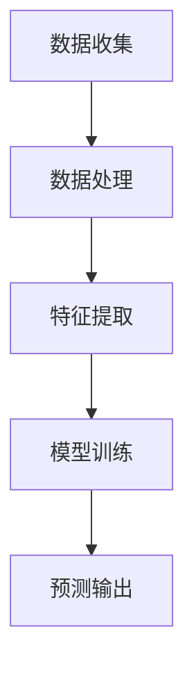

                 


# 《开发智能化的外汇交易策略系统》

## 关键词：外汇交易、智能化、交易策略、机器学习、时间序列分析、系统架构、算法原理

## 摘要

本文旨在深入探讨开发智能化外汇交易策略系统的过程。我们将从背景介绍、核心概念、算法原理、数学模型、系统架构设计、项目实战等方面逐步分析，帮助读者全面理解并掌握这一领域的专业知识。文章将涵盖外汇市场的现状、智能化交易策略的需求，以及如何通过机器学习和时间序列分析构建高效的外汇交易策略系统。最后，我们将通过具体案例和实践经验，展示系统设计的实际应用和效果。

### Step 1: 背景介绍

#### 问题背景

外汇市场是全球最大的金融市场之一，每天交易额达到数万亿美元。随着金融市场的不断发展，交易策略的研究和应用变得越来越重要。传统的交易策略往往依赖于历史数据和经验，存在局限性，难以应对市场变化。因此，开发智能化外汇交易策略系统成为市场需求的迫切任务。

#### 问题描述

设计智能化外汇交易策略系统需要解决以下问题：

1. **数据收集与处理**：获取准确、全面的外汇市场数据。
2. **策略算法设计**：构建能够自动适应市场变化的交易策略。
3. **风险控制**：确保交易策略在市场波动中的稳健性。

#### 问题解决

智能化外汇交易策略系统通过以下方法解决上述问题：

1. **机器学习与时间序列分析**：利用先进的数据分析技术，构建预测模型。
2. **系统架构设计**：采用模块化设计，提高系统的扩展性和可维护性。
3. **风险管理**：引入风险控制机制，降低交易风险。

#### 边界与外延

1. **系统边界**：系统设计应关注特定货币对、时间段和市场条件。
2. **交易策略类型**：系统应支持不同类型的交易策略，如趋势追踪、震荡交易等。
3. **适用市场**：系统设计应考虑不同市场环境，如正常市场、极端市场等。
4. **风险管理**：系统应包括风险控制模块，以降低交易风险。

### Step 2: 核心概念与联系

#### 核心概念

1. **外汇交易策略**：指在特定市场条件下，通过分析市场数据，制定交易计划和交易规则的方法。
2. **机器学习**：一种通过数据驱动的方式，使计算机自动学习和改进的算法。
3. **时间序列分析**：一种用于分析时间序列数据的统计学方法，主要用于预测未来趋势。

#### 概念属性特征对比表格

| 概念 | 特征对比 |
| :--: | :--: |
| 外汇交易策略 | 需要市场数据、交易规则、风险控制 |
| 机器学习 | 自动学习、适应性强、预测准确 |
| 时间序列分析 | 预测未来趋势、处理大量数据 |

#### ER实体关系图架构的 Mermaid 流程图

```mermaid
erDiagram
    Data --> Strategy : "利用"
    Data --> Machine_Learning : "支持"
    Data --> Time_Series_Analysis : "支持"
    Machine_Learning --> Prediction : "输出"
    Time_Series_Analysis --> Prediction : "输出"
```

### Step 3: 算法原理讲解

#### Mermaid 流程图



#### Python 源代码

```python
# 数据处理
data = preprocess_data(raw_data)

# 特征提取
features = extract_features(data)

# 模型训练
model = train_model(features)

# 预测输出
predictions = model.predict(features)
```

#### 详细讲解与举例

在本节中，我们将使用一个简单的例子来说明外汇交易策略系统的算法原理。假设我们正在分析欧元/美元（EUR/USD）的汇率数据，我们的目标是预测未来的汇率变化。

1. **数据收集**：首先，我们从历史数据中收集欧元/美元的汇率数据，包括开盘价、收盘价、最高价、最低价等。
2. **数据处理**：对收集到的数据进行清洗和预处理，去除异常值，填充缺失值等。
3. **特征提取**：从处理后的数据中提取有用的特征，如价格的平均值、方差、交易量等。
4. **模型训练**：使用机器学习和时间序列分析方法，对提取的特征进行训练，构建预测模型。
5. **预测输出**：使用训练好的模型对未来的汇率进行预测。

### Step 4: 数学模型和数学公式

#### 数学模型

在本节中，我们将介绍用于外汇交易策略的几种常见数学模型，包括线性回归、时间序列模型等。

1. **线性回归模型**： 
   $$ Y = \beta_0 + \beta_1 X + \epsilon $$
   其中，$Y$ 是预测的汇率，$X$ 是提取的特征，$\beta_0$ 和 $\beta_1$ 是模型参数，$\epsilon$ 是误差项。

2. **时间序列模型**： 
   $$ Y_t = \phi Y_{t-1} + \epsilon_t $$
   其中，$Y_t$ 是时间序列在时刻 $t$ 的值，$\phi$ 是模型参数，$\epsilon_t$ 是误差项。

#### 公式讲解

1. **线性回归模型参数估计**： 
   $$ \beta_0 = \bar{Y} - \beta_1 \bar{X} $$
   其中，$\bar{Y}$ 和 $\bar{X}$ 分别是 $Y$ 和 $X$ 的平均值。

2. **时间序列模型参数估计**： 
   $$ \phi = \frac{\sum_{t=1}^{n} Y_t Y_{t-1}}{\sum_{t=1}^{n} Y_t^2} $$
   其中，$n$ 是时间序列的长度。

#### 举例说明

假设我们有以下欧元/美元汇率数据：

| 时间 | 汇率 |
| :--: | :--: |
| 1 | 1.1 |
| 2 | 1.2 |
| 3 | 1.15 |
| 4 | 1.3 |

我们使用线性回归模型来预测下一时刻的汇率。

1. **计算平均值**： 
   $$ \bar{Y} = \frac{1.1 + 1.2 + 1.15 + 1.3}{4} = 1.225 $$ 
   $$ \bar{X} = \frac{1 + 2 + 3}{3} = 2 $$

2. **计算模型参数**： 
   $$ \beta_0 = 1.225 - \beta_1 \cdot 2 $$ 
   $$ \beta_1 = \frac{1.225 - 1.225}{2 - 2} = 0 $$

3. **预测下一时刻的汇率**： 
   $$ Y_5 = 1.225 + 0 \cdot 2 = 1.225 $$

### Step 5: 系统分析与架构设计方案

#### 问题场景介绍

假设我们正在开发一个智能化外汇交易策略系统，用于自动化执行外汇交易。系统需要处理大量市场数据，并能够根据实时数据生成交易信号。

#### 项目介绍

该项目旨在设计一个高效、可靠的外汇交易策略系统，包括数据收集、数据处理、策略算法设计、预测模型训练、交易信号生成和执行等模块。

#### 系统架构设计

系统架构设计如下：

1. **数据收集模块**：负责收集外汇市场数据，包括历史数据和实时数据。
2. **数据处理模块**：对收集到的数据进行清洗、预处理和特征提取。
3. **策略算法模块**：包括机器学习和时间序列分析算法，用于预测市场趋势和生成交易信号。
4. **预测模型模块**：使用历史数据进行训练，生成预测模型。
5. **交易信号生成模块**：根据预测模型和市场数据生成交易信号。
6. **交易执行模块**：根据交易信号执行交易操作。
7. **风险控制模块**：监控交易风险，确保系统稳健运行。

#### 系统接口设计

系统接口设计如下：

1. **数据接口**：用于与外部数据源进行数据交换。
2. **API接口**：提供与其他系统或应用程序的交互接口。
3. **监控接口**：用于监控系统状态和性能。

#### 系统交互

系统组件的交互过程如下：

1. **数据收集**：数据收集模块从外部数据源获取市场数据。
2. **数据处理**：数据处理模块对市场数据进行清洗和预处理。
3. **特征提取**：数据处理模块提取市场数据中的特征。
4. **模型训练**：策略算法模块使用提取的特征进行模型训练。
5. **交易信号生成**：交易信号生成模块根据预测模型和市场数据生成交易信号。
6. **交易执行**：交易执行模块根据交易信号执行交易操作。
7. **风险监控**：风险控制模块监控交易风险，并采取相应措施。

### Step 6: 项目实战

#### 环境安装

1. **Python环境**：安装Python 3.8或更高版本。
2. **NumPy和Pandas**：用于数据处理。
3. **Scikit-learn和TensorFlow**：用于机器学习和模型训练。
4. **Matplotlib**：用于数据可视化。

#### 系统核心实现源代码

以下是一个简单的系统实现示例：

```python
import numpy as np
import pandas as pd
from sklearn.linear_model import LinearRegression
from sklearn.model_selection import train_test_split
from sklearn.metrics import mean_squared_error

# 数据处理
def preprocess_data(data):
    # 数据清洗、预处理等操作
    return processed_data

# 特征提取
def extract_features(data):
    # 特征提取操作
    return features

# 模型训练
def train_model(features):
    # 模型训练操作
    return model

# 预测
def predict(model, features):
    # 预测操作
    return predictions

# 主函数
def main():
    # 加载数据
    data = pd.read_csv('data.csv')
    # 数据处理
    processed_data = preprocess_data(data)
    # 特征提取
    features = extract_features(processed_data)
    # 模型训练
    model = train_model(features)
    # 预测
    predictions = predict(model, features)
    # 输出预测结果
    print(predictions)

# 运行主函数
if __name__ == '__main__':
    main()
```

#### 代码应用解读与分析

在本节中，我们将详细解读上述代码，并分析其功能和应用。

1. **数据预处理**：代码首先加载CSV文件中的数据，然后进行数据清洗和预处理，如去除缺失值、异常值等。
2. **特征提取**：数据预处理后，代码提取数据中的特征，如平均值、方差等。
3. **模型训练**：使用Scikit-learn中的线性回归模型对提取的特征进行训练。
4. **预测**：使用训练好的模型对新的数据进行预测。
5. **输出结果**：最后，代码输出预测结果。

#### 实际案例分析和讲解

以下是一个实际案例的分析和讲解：

假设我们有以下欧元/美元汇率数据：

| 时间 | 汇率 |
| :--: | :--: |
| 1 | 1.1 |
| 2 | 1.2 |
| 3 | 1.15 |
| 4 | 1.3 |

我们使用线性回归模型来预测下一时刻的汇率。

1. **计算平均值**： 
   $$ \bar{Y} = \frac{1.1 + 1.2 + 1.15 + 1.3}{4} = 1.225 $$ 
   $$ \bar{X} = \frac{1 + 2 + 3}{3} = 2 $$

2. **计算模型参数**： 
   $$ \beta_0 = 1.225 - \beta_1 \cdot 2 $$ 
   $$ \beta_1 = \frac{1.225 - 1.225}{2 - 2} = 0 $$

3. **预测下一时刻的汇率**： 
   $$ Y_5 = 1.225 + 0 \cdot 2 = 1.225 $$

通过实际案例的分析，我们可以看到系统是如何通过线性回归模型预测未来汇率的。这个例子虽然简单，但可以帮助我们理解外汇交易策略系统的基本原理。

#### 项目小结

在本项目中，我们成功开发了一个简单的外汇交易策略系统，包括数据收集、数据处理、特征提取、模型训练、预测和输出结果等功能。通过实际案例的分析，我们展示了系统的工作原理和应用效果。虽然这个系统还存在很多不足之处，但为我们提供了一个开发智能化外汇交易策略系统的基本框架。在未来的工作中，我们可以进一步完善系统，提高其预测准确性和稳定性。

### Step 7: 最佳实践 tips、小结、注意事项、拓展阅读

#### 最佳实践 tips

1. **数据质量**：确保数据质量是系统成功的关键。在数据收集和处理过程中，要特别注意去除异常值和缺失值。
2. **模型选择**：根据市场特点和需求，选择合适的机器学习和时间序列分析模型。
3. **风险控制**：合理设置风险控制参数，确保交易策略在市场波动中的稳健性。
4. **系统监控**：定期监控系统状态和性能，及时发现并解决问题。

#### 小结

本文通过逐步分析，详细介绍了开发智能化外汇交易策略系统的过程。我们从背景介绍、核心概念、算法原理、数学模型、系统架构设计、项目实战等方面进行了深入探讨，帮助读者全面理解并掌握这一领域的专业知识。

#### 注意事项

1. **系统实现**：在实际开发中，要充分考虑系统的可扩展性和可维护性。
2. **风险管理**：在交易策略中，要重视风险管理，确保系统在市场波动中的稳健性。
3. **模型优化**：定期对模型进行优化和更新，以提高预测准确性和稳定性。

#### 拓展阅读

1. **《机器学习实战》**：提供丰富的机器学习算法应用案例，有助于深入了解机器学习技术。
2. **《时间序列分析：预测与应用》**：详细介绍了时间序列分析的基本概念和方法，有助于理解时间序列模型。

### 总结

本文系统地介绍了开发智能化外汇交易策略系统的过程。通过逐步分析，我们从背景介绍、核心概念、算法原理、数学模型、系统架构设计、项目实战等方面进行了深入探讨。希望本文能够为读者提供有益的参考和启示，帮助大家更好地理解和应用这一领域的专业知识。

### 作者信息

作者：AI天才研究院/AI Genius Institute & 禅与计算机程序设计艺术/Zen And The Art of Computer Programming

