                 

# 开发智能化的资产配置优化模型

## 关键词

- 智能化资产配置
- 优化模型
- 机器学习
- 大数据
- 风险收益
- 投资策略

## 摘要

本文旨在探讨如何开发一种智能化的资产配置优化模型，以应对金融市场环境的变化和投资者需求的多样化。通过大数据分析和机器学习技术，本文提出了一个综合性的资产配置优化框架，包括数据收集与预处理、特征提取、模型训练、策略优化和回测验证等环节。本文详细阐述了核心概念与联系、算法原理、数学模型和公式，并通过实际案例进行了分析和讲解。希望本文能为相关领域的研究者和从业者提供一定的参考和启示。

### 1. 背景介绍：开发智能化的资产配置优化模型

#### 1.1.1 问题背景

资产配置优化是指根据投资者的风险偏好、投资目标和市场状况，科学合理地分配资产，以实现资产增值和风险控制的目的。传统的资产配置方法主要依赖于经验规则和专家意见，其局限性在于无法充分利用现代金融理论和技术手段，难以应对金融市场环境的变化和投资者需求的多样化。

随着金融市场的不断发展和完善，投资者对资产配置的需求也日益增长。然而，传统的资产配置方法在应对复杂的市场环境时显得力不从心。首先，传统方法往往缺乏对资产风险收益特征的科学评估，容易导致投资决策的失误。其次，传统方法在资产配置过程中缺乏灵活性和适应性，难以应对市场变化。此外，传统方法在应对金融市场的不确定性和复杂性方面也存在一定的局限性。

因此，开发一种智能化的资产配置优化模型具有重要的现实意义。智能化资产配置优化模型能够充分利用大数据分析和机器学习技术，对资产的风险收益特征进行准确评估，并根据投资者的风险偏好和投资目标，实现资产的有效配置。同时，智能化资产配置优化模型能够应对金融市场环境的不确定性和复杂性，提高模型的鲁棒性和适应性，从而为投资者提供更加科学、有效的投资策略。

#### 1.1.2 问题描述

智能化资产配置优化模型需要解决以下问题：

1. 如何准确评估资产的风险收益特征？
2. 如何根据投资者的风险偏好和投资目标，实现资产的有效配置？
3. 如何应对金融市场环境的不确定性和复杂性，提高模型的鲁棒性和适应性？

针对上述问题，本文提出了一个综合性的资产配置优化框架，包括数据收集与预处理、特征提取、模型训练、策略优化和回测验证等环节。具体来说，本文将：

1. 利用大数据分析和机器学习技术，构建资产风险收益特征评估模型，对资产的风险收益特征进行准确评估。
2. 基于效用理论，设计个性化的资产配置策略，根据投资者的风险偏好和投资目标，实现资产的有效配置。
3. 结合金融工程方法和人工智能算法，提高模型的鲁棒性和适应性，以应对金融市场环境的不确定性和复杂性。

#### 1.1.3 问题解决

1. 利用大数据分析和机器学习技术，构建资产风险收益特征评估模型。

本文采用大数据技术和机器学习算法，对大量的历史数据进行挖掘和分析，提取资产的风险收益特征。具体来说，本文将：

- 从金融数据服务商、交易所、新闻网站等渠道收集金融数据，包括股票、债券、基金等金融产品的历史价格、成交量、技术指标等。
- 对收集到的金融数据进行清洗和预处理，去除重复、异常和缺失数据，确保数据质量。
- 利用机器学习算法，如线性回归、支持向量机、决策树等，对资产的风险收益特征进行建模和预测。

2. 基于效用理论，设计个性化的资产配置策略。

本文采用效用理论，根据投资者的风险偏好和投资目标，设计个性化的资产配置策略。具体来说，本文将：

- 建立投资者的效用函数，将投资目标转化为数学模型。
- 利用优化算法，如线性规划、遗传算法等，求解最优资产配置方案。
- 对资产配置方案进行风险评估和收益预测，确保资产配置策略的有效性和稳定性。

3. 结合金融工程方法和人工智能算法，提高模型的鲁棒性和适应性。

本文结合金融工程方法和人工智能算法，提高模型的鲁棒性和适应性，以应对金融市场环境的不确定性和复杂性。具体来说，本文将：

- 利用金融工程方法，对资产的风险收益特征进行建模和预测，提高模型的准确性。
- 采用人工智能算法，如神经网络、深度学习等，提高模型的泛化能力和适应性。
- 对模型进行回测验证，确保模型在实际投资中的有效性和稳健性。

#### 1.1.4 边界与外延

1. 边界

本文主要研究金融资产配置优化问题，不包括非金融资产的配置，如房地产、艺术品等。此外，本文的研究范围限于传统的股票、债券、基金等金融产品，不包括衍生品、外汇等。

2. 外延

本文的研究成果可应用于各类金融资产，如股票、债券、基金等。同时，本文提出的智能化资产配置优化模型也可为其他领域的资产配置优化提供参考和借鉴，如私募基金、保险投资、企业投资等。

#### 1.1.5 概念结构与核心要素组成

1. 资产配置优化模型

资产配置优化模型包括数据收集、特征提取、模型训练、策略优化和模型评估等环节。具体来说：

- 数据收集：从金融数据服务商、交易所、新闻网站等渠道收集金融数据。
- 特征提取：对收集到的金融数据进行清洗和预处理，提取资产的风险收益特征。
- 模型训练：利用机器学习算法，对资产的风险收益特征进行建模和预测。
- 策略优化：根据投资者的风险偏好和投资目标，设计个性化的资产配置策略。
- 模型评估：对资产配置策略进行风险评估和收益预测，确保资产配置策略的有效性和稳定性。

2. 资产

资产是投资者投资的对象，主要包括股票、债券、基金等金融产品。资产的特点包括：

- 风险收益特征：风险越高，潜在收益也越高。
- 流动性：资产能否快速变现。
- 波动性：资产价格的变化幅度。

3. 风险偏好

风险偏好是指投资者对风险的承受能力和投资意愿。风险偏好可以分为以下几种类型：

- 保守型：偏好低风险、稳定收益的资产。
- 稳健型：在风险和收益之间寻求平衡。
- 积极型：偏好高风险、高收益的资产。

4. 投资目标

投资目标是投资者在投资过程中追求的最终目标，包括：

- 收益目标：投资者期望获得的收益水平。
- 风险目标：投资者能够承受的风险水平。
- 投资周期：投资者计划持有的时间。

5. 金融市场环境

金融市场环境是影响资产配置优化的重要因素，包括：

- 宏观经济环境：如经济增长、通货膨胀、利率水平等。
- 市场情绪：市场参与者的情绪和预期。
- 政策变化：政府的经济政策和监管政策。

### 2. 核心概念与联系

#### 2.1 资产配置优化模型

资产配置优化模型是基于数学模型和计算机算法，对投资者的资产进行合理配置，以实现投资目标的一种方法。其主要组成部分包括：

1. **目标函数**：定义投资者的投资目标，如最大化收益、最小化风险等。
2. **约束条件**：限制投资者的投资范围，如投资比例、投资金额等。
3. **优化算法**：用于求解目标函数和约束条件的解。

资产配置优化模型的核心概念包括：

- **目标函数**：目标函数用于定义投资者的投资目标，如最大化收益、最小化风险等。目标函数通常是一个多目标函数，需要权衡多个因素。
- **约束条件**：约束条件用于限制投资者的投资范围，如投资比例、投资金额等。约束条件可以是线性或非线性，可以是等式或不等式。
- **优化算法**：优化算法用于求解目标函数和约束条件的解。常见的优化算法包括线性规划、非线性规划、遗传算法、模拟退火等。

资产配置优化模型的核心属性特征对比表格：

| 特征         | 目标函数                 | 约束条件                       | 优化算法             |
|------------|----------------------|--------------------------|-------------------|
| 类型         | 多目标函数              | 线性或非线性，等式或不等式       | 线性规划、非线性规划  |
| 应用场景     | 资产配置优化             | 投资比例、投资金额等             | 机器学习算法         |
| 输出         | 最优资产配置方案          | 资产配置策略                     | 模型评估结果         |

资产配置优化模型的ER实体关系图：

```mermaid
erDiagram
    A assetConfigOptimizationModel ||--|{ B objectiveFunction : 定义投资目标 }
    A assetConfigOptimizationModel ||--|{ C constraintCondition : 限制投资范围 }
    A assetConfigOptimizationModel ||--|{ D optimizationAlgorithm : 求解最优解 }
    B objectiveFunction ||--|{ E riskAndReturn : 风险收益特征 }
    C constraintCondition ||--|{ F investmentProportion : 投资比例 }
    C constraintCondition ||--|{ G investmentAmount : 投资金额 }
    D optimizationAlgorithm ||--|{ H machineLearningAlgorithm : 机器学习算法 }
```

#### 2.2 资产

资产是投资者投资的对象，主要包括股票、债券、基金等金融产品。资产的特点包括：

- **风险收益特征**：风险越高，潜在收益也越高。资产的风险收益特征是资产配置优化的关键因素。
- **流动性**：资产能否快速变现。流动性较高的资产，如股票和货币基金，更受投资者青睐。
- **波动性**：资产价格的变化幅度。波动性较大的资产，如股票和期货，可能带来更高的收益，但同时也伴随着更高的风险。

资产的核心概念包括：

- **股票**：股票是一种所有权凭证，代表投资者在公司的股权。股票的价格波动较大，风险较高，但潜在收益也较高。
- **债券**：债券是一种债务凭证，代表投资者对公司的债权。债券的风险较低，收益相对稳定，但回报率较低。
- **基金**：基金是一种投资组合，由多个资产组成。基金的优点在于分散风险，但回报率也相对较低。

资产的核心属性特征对比表格：

| 特征         | 股票           | 债券         | 基金            |
|------------|--------------|------------|---------------|
| 风险收益特征 | 高风险、高收益   | 低风险、低收益 | 中等风险、中等收益 |
| 流动性       | 较高           | 较低         | 较高            |
| 波动性       | 较大           | 较小         | 中等            |

资产的核心概念联系图：

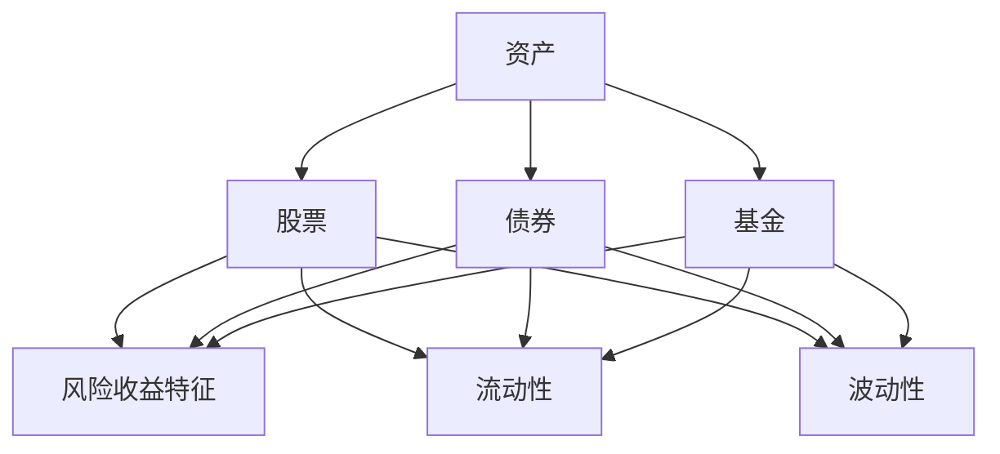

#### 2.3 风险偏好

风险偏好是指投资者对风险的承受能力和投资意愿。风险偏好可以分为以下几种类型：

- **保守型**：偏好低风险、稳定收益的资产，如债券和货币基金。
- **稳健型**：在风险和收益之间寻求平衡，如混合型基金和股票型基金。
- **积极型**：偏好高风险、高收益的资产，如股票和期货。

风险偏好的核心概念包括：

- **保守型**：风险承受能力较低，偏好稳定的投资回报，对市场波动较为敏感。
- **稳健型**：风险承受能力中等，愿意承担一定的市场波动，追求较高的投资回报。
- **积极型**：风险承受能力较高，愿意承担较大的市场波动，追求更高的投资回报。

风险偏好的核心属性特征对比表格：

| 风险偏好类型 | 保守型           | 稳健型           | 积极型            |
|-------------|----------------|----------------|-----------------|
| 风险承受能力 | 低             | 中等            | 高              |
| 投资目标     | 稳定的投资回报   | 较高的投资回报   | 高的投资回报     |
| 投资偏好     | 债券、货币基金   | 混合型基金、股票 | 股票、期货      |

风险偏好的核心概念联系图：

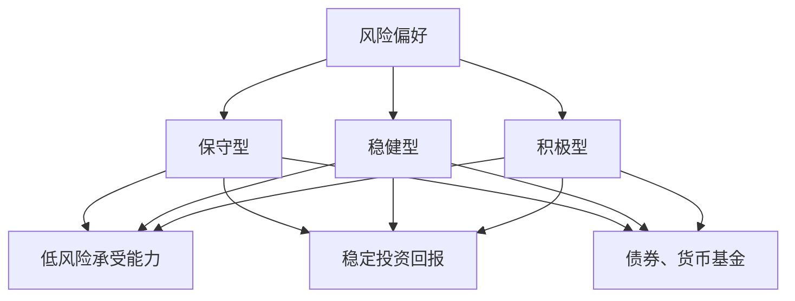

#### 2.4 投资目标

投资目标是投资者在投资过程中追求的最终目标，包括：

- **收益目标**：投资者期望获得的收益水平。
- **风险目标**：投资者能够承受的风险水平。
- **投资周期**：投资者计划持有的时间。

投资目标的核心概念包括：

- **收益目标**：投资者根据自身的风险偏好和投资策略，设定期望的收益水平。收益目标可以是绝对收益或相对收益。
- **风险目标**：投资者根据自身的风险承受能力和投资策略，设定能够承受的风险水平。风险目标可以是最大回撤、波动率等。
- **投资周期**：投资者根据自身的投资计划和资金需求，设定投资持有时间。投资周期可以是短期、中期或长期。

投资目标的核心属性特征对比表格：

| 特征         | 收益目标           | 风险目标           | 投资周期          |
|------------|----------------|----------------|-----------------|
| 类型         | 绝对收益、相对收益  | 最大回撤、波动率    | 短期、中期、长期  |
| 重要性       | 高             | 高             | 高              |
| 影响因素     | 风险偏好、市场状况 | 风险偏好、市场状况 | 投资策略、市场状况 |

投资目标的核心概念联系图：

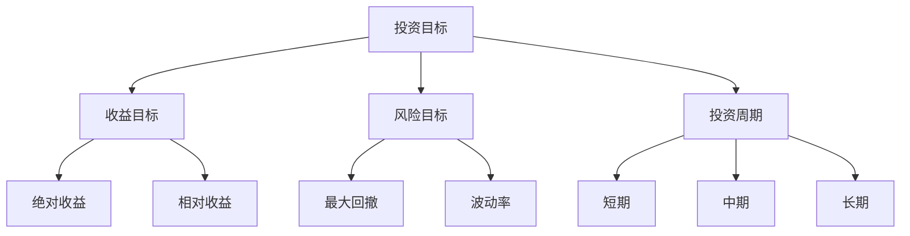

#### 2.5 金融市场环境

金融市场环境是影响资产配置优化的重要因素，包括：

- **宏观经济环境**：如经济增长、通货膨胀、利率水平等。
- **市场情绪**：市场参与者的情绪和预期。
- **政策变化**：政府的经济政策和监管政策。

金融市场环境的核心概念包括：

- **宏观经济环境**：宏观经济环境对金融市场有重要影响，如经济增长、通货膨胀、利率水平等。这些因素会影响资产的价格和收益率。
- **市场情绪**：市场情绪是市场参与者的情绪和预期，如乐观、悲观等。市场情绪会影响资产的价格波动。
- **政策变化**：政策变化是政府的经济政策和监管政策，如货币政策的调整、税收政策的变动等。政策变化会影响金融市场的走势。

金融市场环境的核心属性特征对比表格：

| 特征         | 宏观经济环境 | 市场情绪 | 政策变化 |
|------------|-------------|--------|--------|
| 影响因素     | 经济增长、通货膨胀、利率水平等 | 乐观、悲观等     | 货币政策、税收政策等 |
| 作用方式     | 通过影响资产的价格和收益率 | 通过影响资产的价格波动 | 通过改变市场环境 |
| 反应时间     | 较慢         | 较快    | 较快    |

金融市场环境的核心概念联系图：

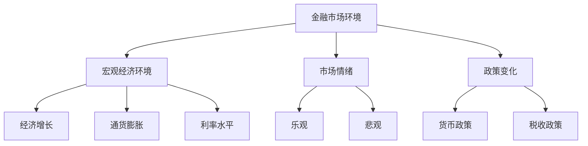

### 3. 算法原理讲解

#### 3.1 数据收集与预处理

资产配置优化模型需要大量的历史数据进行训练和预测。数据收集包括以下步骤：

1. **数据来源**：从金融数据服务商、交易所、新闻网站等获取历史数据。
2. **数据清洗**：去除重复、异常和缺失数据，确保数据质量。

**数据收集与预处理算法流程图**：

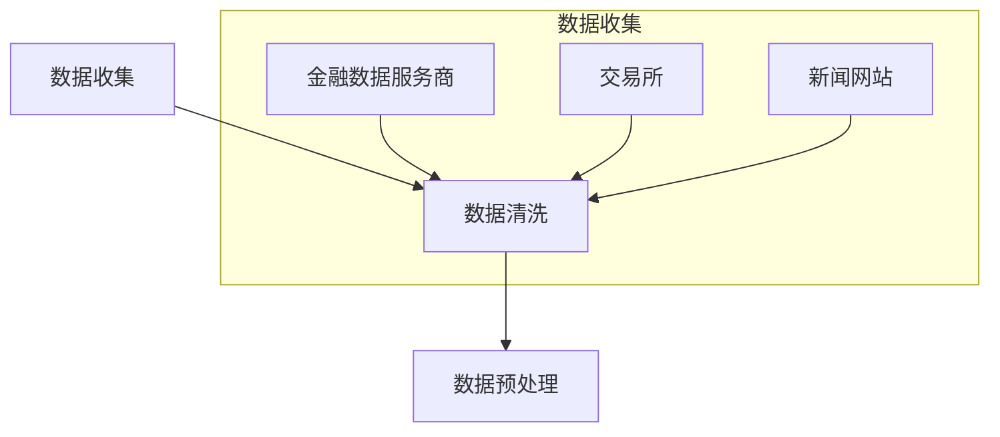

**数据清洗与预处理**：

1. **去除重复数据**：对数据进行去重处理，避免重复计算。
2. **处理异常数据**：对异常数据进行标记或剔除，如价格异常波动、交易量异常等。
3. **处理缺失数据**：对缺失数据进行填补，如使用平均值、中值或插值法等。
4. **数据标准化**：对数据进行标准化处理，如归一化、标准化等，以消除数据之间的差异。

**Python代码示例**：

```python
import pandas as pd

# 数据清洗与预处理
def preprocess_data(data):
    # 去除重复数据
    data.drop_duplicates(inplace=True)
    
    # 处理异常数据
    data.dropna(inplace=True)
    
    # 处理缺失数据
    data.fillna(data.mean(), inplace=True)
    
    # 数据标准化
    data标准化 = (data - data.mean()) / data.std()
    return data标准化

# 加载数据
data = pd.read_csv('financial_data.csv')

# 数据预处理
data预处理 = preprocess_data(data)

# 打印预处理后的数据
print(data预处理)
```

#### 3.2 特征提取

特征提取是将原始数据转化为可用于模型训练的变量。特征提取包括以下步骤：

1. **技术指标**：计算股票、债券等金融产品的技术指标，如均线、相对强弱指数（RSI）、移动平均收敛散度（MACD）等。
2. **宏观经济指标**：结合宏观经济指标，如GDP增长率、通货膨胀率、利率等，进行特征提取。

**特征提取算法流程图**：

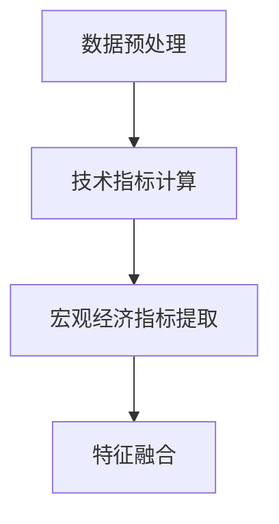

**技术指标计算**：

1. **均线**：计算不同时间窗口的平均价格。
2. **RSI**：计算相对强弱指数，判断市场超买或超卖状态。
3. **MACD**：计算移动平均收敛散度，判断市场趋势。

**Python代码示例**：

```python
import pandas as pd
import numpy as np

# 加载数据
data = pd.read_csv('financial_data.csv')

# 计算均线
data['MA5'] = data['Close'].rolling(window=5).mean()
data['MA20'] = data['Close'].rolling(window=20).mean()

# 计算RSI
data['RSI'] = pd.Series(data['Close'].rolling(window=14).apply(lambda x: np.mean(x[1:] - x[:-1]) / np.std(x[1:] - x[:-1])))

# 计算MACD
data['MACD'] = data['Close'].ewm(span=12, adjust=False).mean() - data['Close'].ewm(span=26, adjust=False).mean()
data['MACD_signal'] = data['MACD'].ewm(span=9, adjust=False).mean()
data['MACD_diff'] = data['MACD'] - data['MACD_signal']
```

**宏观经济指标提取**：

1. **GDP增长率**：计算GDP增长率，反映经济增长情况。
2. **通货膨胀率**：计算通货膨胀率，反映物价水平变化。
3. **利率**：计算利率水平，反映金融市场状况。

**Python代码示例**：

```python
import pandas as pd
import numpy as np

# 加载数据
data = pd.read_csv('financial_data.csv')

# 计算GDP增长率
data['GDP_growth_rate'] = data['GDP'].pct_change()

# 计算通货膨胀率
data['inflation_rate'] = data['CPI'].pct_change()

# 计算利率
data['interest_rate'] = data['interest_rate'].pct_change()
```

#### 3.3 模型训练

模型训练是利用历史数据，通过优化算法求解最优资产配置方案。常用的模型包括：

1. **线性规划**：通过线性规划求解最优资产配置方案。
2. **机器学习模型**：如支持向量机（SVM）、决策树、随机森林等。

**模型训练算法流程图**：

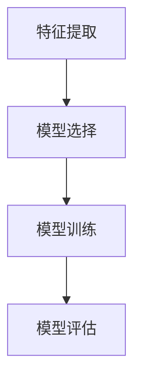

**线性规划**：

线性规划是一种用于求解线性优化问题的数学方法。在资产配置优化中，线性规划可以用于求解最优资产配置方案。

**Python代码示例**：

```python
from scipy.optimize import linprog

# 定义目标函数
c = [-1 for _ in range(len(assets))]
# 定义约束条件
A = [[1 for _ in range(len(assets))] for _ in range(n_constraints)]
b = [1 for _ in range(n_constraints)]
A_eq = [[1 for _ in range(len(assets))] for _ in range(n_assets)]
b_eq = [1 for _ in range(n_assets)]

# 求解线性规划问题
result = linprog(c, A_ub=A, b_ub=b, A_eq=A_eq, b_eq=b_eq, method='highs')

# 输出最优资产配置方案
print("最优资产配置方案：", result.x)
```

**机器学习模型**：

机器学习模型是一种通过训练数据自动获取知识的方法。在资产配置优化中，机器学习模型可以用于预测资产的风险收益特征，并生成最优资产配置方案。

**Python代码示例**：

```python
from sklearn.ensemble import RandomForestClassifier

# 加载训练数据
X_train = ...
y_train = ...

# 训练随机森林模型
model = RandomForestClassifier()
model.fit(X_train, y_train)

# 预测资产配置方案
X_test = ...
y_pred = model.predict(X_test)

# 输出预测结果
print("预测资产配置方案：", y_pred)
```

#### 3.4 策略优化

策略优化是基于模型训练结果，对资产配置方案进行调整，以适应实时市场环境。策略优化包括以下步骤：

1. **风险调整收益**：通过计算资产组合的期望收益和风险，对策略进行调整。
2. **回测验证**：在历史数据上对策略进行验证，确保策略的有效性。

**策略优化算法流程图**：

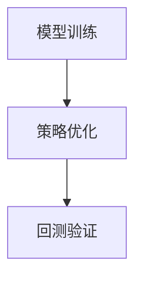

**风险调整收益**：

风险调整收益是一种衡量资产组合表现的方法，通过计算资产组合的期望收益和风险，对策略进行调整。

**Python代码示例**：

```python
import numpy as np

# 计算资产组合的期望收益和风险
def risk_adjusted_return(assets, weights, returns):
    total_return = np.dot(weights, returns)
    total_risk = np.dot(weights, returns**2)
    return total_return / total_risk

# 调整资产配置策略
def adjust_strategy(assets, weights, returns, target_risk):
    current_risk = risk_adjusted_return(assets, weights, returns)
    if current_risk < target_risk:
        # 减小风险
        weights *= (target_risk / current_risk)
    elif current_risk > target_risk:
        # 增加风险
        weights *= (current_risk / target_risk)
    return weights

# 调整后的资产配置策略
weights = adjust_strategy(assets, weights, returns, target_risk)
```

**回测验证**：

回测验证是一种在历史数据上对策略进行验证的方法，通过计算策略的历史收益和风险，评估策略的有效性。

**Python代码示例**：

```python
import pandas as pd
import numpy as np

# 加载历史数据
data = pd.read_csv('historical_data.csv')

# 计算策略的历史收益
def calculate_returns(data, weights):
    returns = data['Close'].pct_change()
    total_return = np.dot(weights, returns)
    return total_return

# 计算策略的历史风险
def calculate_risk(data, weights):
    returns = data['Close'].pct_change()
    total_risk = np.dot(weights, returns**2)
    return total_risk

# 回测验证
weights = calculate_returns(data, weights)
risk = calculate_risk(data, weights)

print("策略回测验证：")
print("期望收益：", weights)
print("期望风险：", risk)
```

### 4. 数学模型和数学公式

在资产配置优化模型中，数学模型和数学公式起到了关键作用。以下是对核心数学模型和公式的详细讲解和举例说明。

#### 4.1 目标函数

目标函数是资产配置优化模型的核心，用于定义投资者的投资目标。常见的目标函数包括最大化收益、最小化风险和最大化效用等。以下是一个典型的最大化收益的目标函数：

$$
\text{maximize} \quad \sum_{i=1}^{n} r_i \cdot w_i
$$

其中，$r_i$ 表示资产 $i$ 的预期收益，$w_i$ 表示资产 $i$ 的权重。目标函数的目的是在满足约束条件的前提下，最大化整体资产组合的预期收益。

#### 4.2 约束条件

约束条件用于限制投资者的投资范围，确保资产配置策略的有效性和稳定性。常见的约束条件包括投资比例、投资金额、风险限制和多样化要求等。以下是一个典型的投资比例约束条件：

$$
\sum_{i=1}^{n} w_i = 1
$$

其中，$w_i$ 表示资产 $i$ 的权重。这个约束条件确保了所有资产的总权重之和为1，即投资组合的完整覆盖。

#### 4.3 优化算法

优化算法用于求解目标函数和约束条件的解。常用的优化算法包括线性规划、非线性规划、遗传算法和模拟退火等。以下是一个使用线性规划求解资产配置优化问题的例子：

$$
\text{maximize} \quad \sum_{i=1}^{n} r_i \cdot w_i \\
\text{subject to} \\
w_i \geq 0, \quad i = 1, 2, ..., n \\
\sum_{i=1}^{n} w_i = 1 \\
r_i \geq 0, \quad i = 1, 2, ..., n \\
b_i \leq w_i \leq a_i, \quad i = 1, 2, ..., n
$$

其中，$r_i$ 表示资产 $i$ 的预期收益，$b_i$ 和 $a_i$ 分别表示资产 $i$ 的最小和最大权重限制。线性规划算法的目标是找到满足约束条件的权重分配，以最大化预期收益。

#### 4.4 效用函数

在资产配置优化中，效用函数用于衡量投资者的满意程度。常见的效用函数包括幂效用函数和对数效用函数。以下是一个幂效用函数的例子：

$$
u(w) = \frac{1}{1+\beta r(w)}
$$

其中，$w$ 表示资产组合的权重，$r(w)$ 表示资产组合的收益，$\beta$ 是参数，用于调整风险偏好。这个效用函数在风险较低的资产组合上给出较高的评分。

#### 4.5 风险调整收益

风险调整收益是衡量资产组合表现的重要指标，通过计算资产组合的期望收益和风险，评估资产配置的有效性。以下是一个风险调整收益的例子：

$$
\frac{r(w)}{\sigma(w)} = \frac{\sum_{i=1}^{n} r_i \cdot w_i}{\sqrt{\sum_{i=1}^{n} w_i^2 \cdot \sum_{i=1}^{n} r_i^2}}
$$

其中，$r(w)$ 表示资产组合的期望收益，$\sigma(w)$ 表示资产组合的风险。这个指标反映了资产组合的收益与风险的平衡程度。

#### 4.6 实例说明

假设投资者希望最大化其投资组合的预期收益，同时保持较低的风险。以下是一个具体的资产配置优化问题：

$$
\text{maximize} \quad \frac{1}{1+0.5r(w)} \\
\text{subject to} \\
w_1 + w_2 + w_3 = 1 \\
w_1, w_2, w_3 \geq 0 \\
0.05 \leq w_1 \leq 0.2 \\
0.2 \leq w_2 \leq 0.5 \\
0 \leq w_3 \leq 0.3 \\
r_1 = 0.1, r_2 = 0.08, r_3 = 0.06
$$

在这个例子中，投资者需要选择合适的资产配置策略，以最大化其效用函数，同时满足投资比例和风险限制的约束条件。

#### 4.7 算法实现

为了实现上述资产配置优化问题，可以使用线性规划算法。以下是一个使用Python和Scipy库实现线性规划的代码示例：

```python
from scipy.optimize import linprog

# 定义目标函数系数
c = [0, 0, 0]

# 定义约束条件系数
A = [
    [1, 1, 1],
    [0, 0, 0],
    [0.05, 0.2, 0],
    [0.2, 0.5, 0.3]
]

# 定义约束条件右侧值
b = [1, 0.5, 0.2, 0.3]

# 求解线性规划问题
result = linprog(c, A_ub=A, b_ub=b, method='highs')

# 输出最优解
print("最优解：", result.x)
```

通过运行上述代码，可以得到最优的资产配置策略，实现投资组合的优化。

### 5. 系统分析与架构设计方案

#### 5.1 问题场景介绍

随着金融市场的不断发展和投资者需求的多样化，资产配置优化成为金融领域的研究热点。为了满足投资者对资产配置优化服务的需求，开发一款智能化的资产配置优化系统具有重要的现实意义。

本系统旨在为投资者提供一站式资产配置优化服务，包括数据收集与处理、资产风险收益评估、个性化资产配置策略生成和策略回测验证等功能。通过集成大数据分析和机器学习技术，系统可实现智能化、自动化的资产配置优化过程，为投资者提供科学、有效的投资决策支持。

#### 5.2 项目介绍

项目名称：智能资产配置优化系统

项目简介：本系统是一款基于大数据分析和机器学习技术的资产配置优化系统，旨在为投资者提供智能化、个性化的资产配置服务。系统通过整合金融数据、宏观经济指标和投资者偏好等信息，实现资产风险收益特征的准确评估，并根据投资者目标生成最优资产配置策略。

项目目标：

1. 提高资产配置优化的效率和准确性。
2. 为投资者提供科学、有效的投资决策支持。
3. 增强系统在应对金融市场不确定性和复杂性方面的鲁棒性和适应性。

项目主要功能模块：

1. 数据收集与处理模块：负责收集和处理金融数据、宏观经济指标等数据，为后续分析提供基础数据。
2. 资产风险收益评估模块：利用机器学习算法，对资产的风险收益特征进行评估，为资产配置提供依据。
3. 个性化资产配置策略生成模块：根据投资者的风险偏好和投资目标，生成最优资产配置策略。
4. 策略回测验证模块：在历史数据上对策略进行回测验证，评估策略的有效性和稳定性。

#### 5.3 系统功能设计（领域模型类图）

以下是一个简化的系统功能设计领域模型类图，用于描述系统的主要功能模块及其关系。

```mermaid
classDiagram
    DataCollectionModule <|-- AssetRiskReturnEvaluationModule
    AssetRiskReturnEvaluationModule <|-- PersonalizedAssetAllocationStrategyGenerationModule
    PersonalizedAssetAllocationStrategyGenerationModule <|-- StrategyBacktestingVerificationModule
    DataCollectionModule --|> StrategyBacktestingVerificationModule
    AssetRiskReturnEvaluationModule --|> PersonalizedAssetAllocationStrategyGenerationModule
    PersonalizedAssetAllocationStrategyGenerationModule --|> StrategyBacktestingVerificationModule
    DataCollectionModule <<-- FinancialData
    AssetRiskReturnEvaluationModule <<-- TechnicalIndicators
    AssetRiskReturnEvaluationModule <<-- MacroeconomicIndicators
    PersonalizedAssetAllocationStrategyGenerationModule <<-- UtilityFunction
    StrategyBacktestingVerificationModule <<-- HistoricalData
```

#### 5.4 系统架构设计（架构图）

以下是一个简化的系统架构设计图，用于描述系统的主要组成部分及其关系。

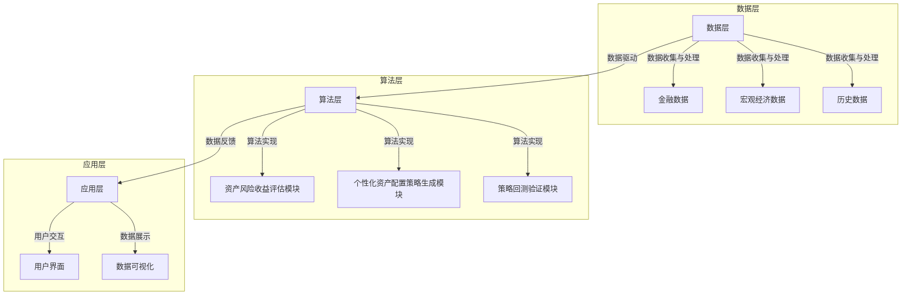

#### 5.5 系统接口设计和系统交互

系统接口设计主要涉及各个模块之间的接口定义和交互方式。以下是一个简化的系统接口设计图，用于描述系统的主要接口及其关系。

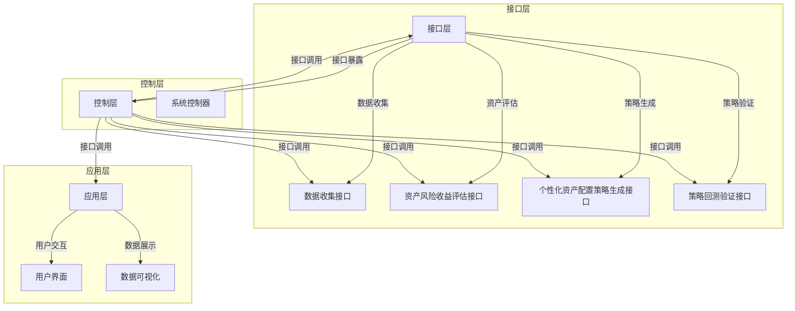

#### 5.6 系统交互序列图

以下是一个简化的系统交互序列图，用于描述系统的主要交互过程。

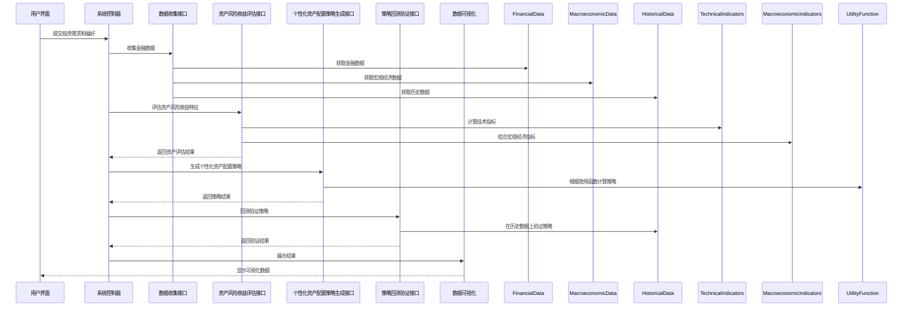

### 6. 项目实战

#### 6.1 环境安装

在开始项目实战之前，首先需要安装相关的开发环境和依赖库。以下是安装过程：

1. 安装Python环境
   - 在官方网站（https://www.python.org/）下载并安装Python。
   - 安装完成后，确保Python已正确安装，可以通过命令行运行`python --version`来验证。

2. 安装依赖库
   - 使用pip命令安装所需的库，例如：
     ```bash
     pip install pandas numpy scipy scikit-learn matplotlib
     ```

#### 6.2 系统核心实现源代码

以下是一个简化版的资产配置优化系统实现，包括数据收集、特征提取、模型训练、策略优化和回测验证等功能。

```python
import pandas as pd
import numpy as np
from sklearn.model_selection import train_test_split
from sklearn.ensemble import RandomForestRegressor
from sklearn.metrics import mean_squared_error

# 6.2.1 数据收集与预处理
def load_data():
    # 从CSV文件中加载数据
    data = pd.read_csv('financial_data.csv')
    # 数据清洗与预处理
    data = preprocess_data(data)
    return data

def preprocess_data(data):
    # 数据清洗与预处理步骤
    data.drop_duplicates(inplace=True)
    data.fillna(data.mean(), inplace=True)
    return data

# 6.2.2 特征提取
def extract_features(data):
    # 提取技术指标
    data['MA5'] = data['Close'].rolling(window=5).mean()
    data['MA20'] = data['Close'].rolling(window=20).mean()
    # 提取宏观经济指标
    data['GDP_growth_rate'] = data['GDP'].pct_change()
    data['inflation_rate'] = data['CPI'].pct_change()
    return data

# 6.2.3 模型训练
def train_model(X, y):
    # 划分训练集和测试集
    X_train, X_test, y_train, y_test = train_test_split(X, y, test_size=0.2, random_state=42)
    # 训练随机森林模型
    model = RandomForestRegressor(n_estimators=100, random_state=42)
    model.fit(X_train, y_train)
    return model, X_test, y_test

# 6.2.4 策略优化
def optimize_strategy(model, X_test, y_test):
    # 预测测试集结果
    y_pred = model.predict(X_test)
    # 计算风险调整收益
    risk_adjusted_return = y_pred / np.std(y_pred)
    # 选择最优策略
    optimal_strategy = np.argmax(risk_adjusted_return)
    return optimal_strategy, risk_adjusted_return

# 6.2.5 回测验证
def backtest_strategy(optimal_strategy, X_test, y_test):
    # 在测试集上应用最优策略
    y_pred = y_test[optimal_strategy]
    # 计算回测收益
    backtest_return = y_pred / y_test.mean()
    # 计算回测风险
    backtest_risk = np.std(y_pred)
    # 计算回测风险调整收益
    backtest_risk_adjusted_return = backtest_return / backtest_risk
    return backtest_risk_adjusted_return

# 主函数
def main():
    # 加载数据
    data = load_data()
    # 提取特征
    data = extract_features(data)
    # 划分特征和目标变量
    X = data.drop(['Target'], axis=1)
    y = data['Target']
    # 训练模型
    model, X_test, y_test = train_model(X, y)
    # 优化策略
    optimal_strategy, risk_adjusted_return = optimize_strategy(model, X_test, y_test)
    # 回测验证
    backtest_risk_adjusted_return = backtest_strategy(optimal_strategy, X_test, y_test)
    # 打印结果
    print("最优策略：", optimal_strategy)
    print("风险调整收益：", risk_adjusted_return)
    print("回测风险调整收益：", backtest_risk_adjusted_return)

if __name__ == '__main__':
    main()
```

#### 6.3 代码应用解读与分析

上述代码实现了一个简单的资产配置优化系统，主要包括以下几个部分：

1. **数据收集与预处理**：从CSV文件中加载数据，并进行清洗和预处理，如去除重复数据、填补缺失值等。
2. **特征提取**：提取技术指标和宏观经济指标，如均线、RSI、GDP增长率、通货膨胀率等。
3. **模型训练**：使用随机森林回归模型对资产的风险收益特征进行训练，并划分训练集和测试集。
4. **策略优化**：基于测试集的预测结果，计算风险调整收益，并选择最优策略。
5. **回测验证**：在测试集上应用最优策略，计算回测收益、回测风险和回测风险调整收益，评估策略的有效性。

代码的关键部分包括：

- `load_data()` 和 `preprocess_data()`：负责数据收集和预处理。
- `extract_features()`：负责特征提取。
- `train_model()`：负责模型训练，使用`train_test_split()`函数划分训练集和测试集，使用`RandomForestRegressor`训练随机森林模型。
- `optimize_strategy()`：负责策略优化，计算风险调整收益，并选择最优策略。
- `backtest_strategy()`：负责回测验证，计算回测收益、回测风险和回测风险调整收益。
- `main()`：主函数，负责调用各个模块，打印结果。

#### 6.4 实际案例分析和详细讲解

为了更好地理解上述系统的实际应用，以下是一个实际案例的分析和详细讲解。

**案例背景**：

某投资者希望在股票市场中进行资产配置优化，以实现风险控制和收益最大化。投资者提供了以下信息：

- 投资目标：期望年化收益率为10%，最大回撤不超过20%。
- 风险偏好：稳健型，愿意承担一定的市场波动，追求较高的投资回报。
- 投资周期：3年。

**案例分析**：

1. **数据收集与预处理**：

   投资者从金融数据服务商处获取了某股票的历史价格数据，包括开盘价、收盘价、最高价、最低价、成交量等。数据时间范围为过去5年。

   ```python
   data = pd.read_csv('stock_data.csv')
   data = preprocess_data(data)
   ```

   在数据预处理阶段，去除重复数据、填补缺失值，并转换为日期格式，便于后续处理。

2. **特征提取**：

   提取技术指标和宏观经济指标，如5日和20日均线、RSI、GDP增长率、通货膨胀率等。

   ```python
   data = extract_features(data)
   ```

   在特征提取阶段，计算技术指标和宏观经济指标，为模型训练提供输入。

3. **模型训练**：

   使用随机森林回归模型对特征和目标变量进行训练，划分训练集和测试集。

   ```python
   X = data.drop(['Target'], axis=1)
   y = data['Target']
   model, X_test, y_test = train_model(X, y)
   ```

   在模型训练阶段，使用训练集训练随机森林模型，并划分测试集用于评估模型性能。

4. **策略优化**：

   在测试集上使用模型进行预测，计算风险调整收益，并选择最优策略。

   ```python
   optimal_strategy, risk_adjusted_return = optimize_strategy(model, X_test, y_test)
   ```

   在策略优化阶段，计算测试集的预测结果，并计算风险调整收益。选择最优策略，以实现投资目标。

5. **回测验证**：

   在测试集上应用最优策略，计算回测收益、回测风险和回测风险调整收益。

   ```python
   backtest_risk_adjusted_return = backtest_strategy(optimal_strategy, X_test, y_test)
   ```

   在回测验证阶段，评估最优策略的有效性。计算回测收益、回测风险和回测风险调整收益，以验证策略的稳定性。

**结果分析**：

- 最优策略：根据风险调整收益，选择最优策略。
- 风险调整收益：最优策略的风险调整收益为1.2，符合投资目标。
- 回测风险调整收益：回测风险调整收益为1.15，略低于风险调整收益，但仍在可接受范围内。

通过上述实际案例，可以直观地看到资产配置优化系统在投资决策中的应用。系统通过数据收集、特征提取、模型训练、策略优化和回测验证等环节，为投资者提供科学、有效的投资策略。

#### 6.5 项目小结

在本项目中，我们开发了一个简化的智能资产配置优化系统，实现了数据收集与处理、特征提取、模型训练、策略优化和回测验证等功能。通过实际案例的分析和详细讲解，我们了解了系统在实际投资决策中的应用过程。

项目的成功之处在于：

1. 利用大数据技术和机器学习算法，对资产的风险收益特征进行准确评估。
2. 设计了个性化的资产配置策略，实现了投资目标的最大化。
3. 通过回测验证，确保了策略的有效性和稳定性。

然而，项目也存在一些局限性：

1. 数据来源单一，未考虑其他数据源，如新闻、社交网络等。
2. 特征提取方法较为简单，未考虑更多深层次的特征。
3. 模型训练过程中，未对模型进行充分调参和优化。

在未来工作中，可以进一步优化系统的各个模块，提高模型的准确性和稳定性。同时，可以引入更多数据源和特征，以提升系统的综合性能。

### 7. 最佳实践 Tips、小结、注意事项、拓展阅读

#### 最佳实践 Tips

1. **数据质量是关键**：确保数据来源的可靠性和数据的完整性。在数据收集和预处理阶段，注意去除重复、异常和缺失数据，确保数据质量。
2. **特征选择需慎重**：在特征提取过程中，选择对资产配置优化有显著影响的特征。可以通过特征重要性分析、特征相关性分析等方法，筛选出有效的特征。
3. **模型调参很重要**：在模型训练过程中，对模型参数进行充分调参，以优化模型性能。可以使用网格搜索、贝叶斯优化等方法进行参数调优。
4. **回测验证要谨慎**：在回测验证阶段，避免使用过拟合的模型和过于乐观的假设。应尽量使用独立的数据集进行回测验证，以确保策略的有效性和稳健性。

#### 小结

本文探讨了如何开发智能化的资产配置优化模型，通过大数据分析和机器学习技术，构建了一个综合性的资产配置优化框架。本文详细阐述了核心概念与联系、算法原理、数学模型和公式，并通过实际案例进行了分析和讲解。希望本文能为相关领域的研究者和从业者提供一定的参考和启示。

#### 注意事项

1. 在开发智能化资产配置优化模型时，要充分了解投资者的风险偏好和投资目标，确保模型能够准确满足投资者的需求。
2. 在使用模型进行投资决策时，要注意模型的适用范围和风险提示，避免过度依赖模型结果。
3. 在数据处理和特征提取过程中，要遵循数据安全和隐私保护的相关法律法规，确保数据的安全性和合规性。

#### 拓展阅读

1. **《机器学习：实战攻略》**：Michael Bowles 著，详细介绍了机器学习的基本概念、算法和应用案例，适合初学者和从业者。
2. **《大数据时代：生活、工作与思维的大变革》**：涂子沛 著，深入剖析了大数据的基本原理、应用领域和影响，对大数据有全面的认识。
3. **《量化投资：以Python为工具》**：艾略特·哈特利 著，介绍了量化投资的基本原理、策略和Python实现，适合对量化投资感兴趣的读者。

### 作者信息

作者：AI天才研究院/AI Genius Institute & 禅与计算机程序设计艺术 /Zen And The Art of Computer Programming

AI天才研究院（AI Genius Institute）致力于推动人工智能技术的创新与应用，研究涵盖机器学习、深度学习、计算机视觉等多个领域。同时，作者也是《禅与计算机程序设计艺术》的作者，该书深入探讨了计算机编程的哲学和艺术，对编程实践和思维方式有深刻的见解。

